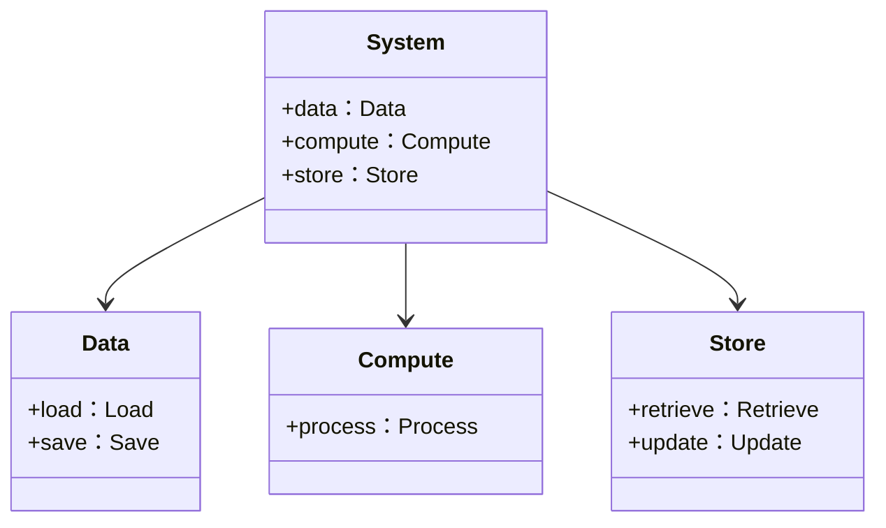

                 


# 数学证明的计算机辅助与人机协作

关键词：计算机辅助证明、人机协作、数学证明、算法、人工智能

摘要：本文旨在探讨数学证明的计算机辅助与人机协作方法，分析其在数学领域中的应用与发展趋势。首先，我们介绍数学证明的重要性以及计算机辅助证明和人机协作的基本概念。接着，详细讨论计算机辅助证明的理论基础、算法与工具，以及人机协作的实践方法。最后，我们分析计算机辅助与人机协作的混合模式，展望未来的发展方向与面临的挑战。

## 第一部分：引言

### 1.1 问题背景

数学证明是数学研究的核心，其重要性不言而喻。然而，随着数学问题的复杂度不断增加，传统的证明方法面临着巨大的挑战。计算机辅助证明和人机协作作为一种新兴的方法，逐渐引起数学界的关注。

#### 数学证明的重要性

数学证明不仅是数学理论体系建立的基础，也是数学发展的动力。一个严格的数学证明能够揭示数学现象的本质，推动数学理论的创新。

#### 计算机辅助证明的兴起

计算机辅助证明（Computer-Assisted Proof）利用计算机的高速计算和自动化推理能力，辅助数学家完成复杂的数学证明。这种方法能够提高证明的效率，减少错误率。

#### 人机协作在数学证明中的应用

人机协作（Human-Machine Collaboration）通过将数学家的创造力和计算机的计算能力相结合，形成一种新的证明模式。这种模式不仅能够解决复杂的数学问题，还能够推动数学证明方法的发展。

### 1.2 问题描述

数学证明的复杂性体现在多个方面：

#### 数学证明的复杂性

- 数学问题本身的复杂性
- 证明方法的多样性
- 证明过程中的不确定性

#### 传统证明方法的局限性

传统的证明方法，如归纳法、构造法、反证法等，在面对复杂问题时显得力不从心。此外，数学家在证明过程中可能会因为疏忽而导致错误。

#### 计算机辅助与人机协作的优势

计算机辅助证明和人机协作能够弥补传统证明方法的不足，其优势在于：

- 提高证明效率
- 减少错误率
- 拓宽证明方法
- 促进数学理论的创新

### 1.3 问题解决

计算机辅助证明和人机协作是解决数学证明复杂性的有效途径。下面我们分别介绍这两种方法的基本原理和实现方式。

#### 计算机辅助证明的基本原理

计算机辅助证明利用计算机的自动化推理能力，辅助数学家完成证明。其基本原理包括：

- 数学定理的形式化表示
- 计算机的自动化推理
- 证明结果的可信度验证

#### 人机协作证明的模式

人机协作证明是一种新型的证明模式，它通过将数学家的创造力和计算机的计算能力相结合，形成一种新的证明方法。其基本模式包括：

- 数学家提出问题
- 计算机辅助推理
- 数学家验证和优化证明

#### 两种模式的结合与优势

计算机辅助证明和人机协作的结合能够发挥各自的优势，实现更好的证明效果。其结合方式包括：

- 计算机辅助数学家的推理过程
- 人机协作解决复杂证明问题
- 计算机辅助验证和优化证明结果

### 1.4 边界与外延

计算机辅助证明和人机协作在数学领域的应用范围广泛，包括几何学、数论、代数几何、拓扑学等多个领域。然而，面对复杂的问题和新兴的数学理论，这些方法仍然面临一定的挑战。

#### 应用范围

- 几何学：计算机辅助证明在几何学中的应用已经取得了显著成果，例如，计算机辅助证明了一些高维几何问题。
- 数论：计算机辅助证明在数论中发挥了重要作用，例如，计算机验证了一些著名的数论猜想。
- 代数几何：人机协作在代数几何中的应用，推动了代数几何领域的发展。
- 拓扑学：计算机辅助证明在拓扑学中，解决了一些复杂的拓扑问题。

#### 面临的挑战

- 技术挑战：随着数学问题的复杂度增加，计算机辅助证明和人机协作在算法、工具、系统架构等方面面临技术挑战。
- 社会挑战：数学证明的计算机辅助与人机协作需要数学家、计算机科学家和用户之间的协作，面临社会接受度、教育、培训等方面的挑战。

### 1.5 本章小结

本部分介绍了数学证明的计算机辅助与人机协作的背景、问题描述、问题解决方法以及面临的挑战。下一部分将深入讨论计算机辅助证明的理论基础和算法。

----------------------------------------------------------------

## 第二部分：计算机辅助证明

### 2.1 理论基础

#### 2.1.1 计算机辅助证明的基本概念

计算机辅助证明是指利用计算机的自动化推理能力，辅助数学家完成数学证明的过程。其基本概念包括：

- 形式化表示：将数学定理和证明过程形式化为计算机可以理解和处理的符号系统。
- 自动化推理：利用计算机算法和推理系统，自动推导出数学定理的证明。
- 证明验证：对计算机生成的证明进行验证，确保证明结果的可信度。

#### 2.1.2 数学定理证明的方法

计算机辅助证明可以采用多种数学定理证明方法，包括归纳法、构造法、反证法、分析法等。这些方法各有优缺点，适用于不同类型的数学定理。

- 归纳法：通过观察一系列实例，归纳出一般性的结论。适用于证明性质具有普遍性的数学定理。
- 构造法：通过构造具体的例子，证明数学定理的正确性。适用于证明存在性的数学定理。
- 反证法：假设数学定理不成立，通过推导出矛盾，证明数学定理的正确性。适用于证明否命题的数学定理。
- 分析法：利用数学分析的方法，证明数学定理的正确性。适用于涉及函数、极限、积分等数学概念的定理。

#### 2.1.3 计算机辅助证明的优势

计算机辅助证明具有以下优势：

- 提高证明效率：计算机可以快速地处理大量数据，自动化地推导出证明。
- 减少错误率：计算机可以减少数学家在证明过程中的人为错误。
- 拓宽证明方法：计算机辅助证明可以尝试不同的证明方法，提高证明的多样性。

### 2.2 算法与工具

#### 2.2.1 基本算法

计算机辅助证明的基本算法包括递归算法、分治算法、动态规划算法等。这些算法在数学证明中具有重要的应用价值。

- 递归算法：通过递归调用子问题，解决复杂问题。适用于证明递归性质的数学定理。
- 分治算法：将复杂问题划分为子问题，分别解决，再合并结果。适用于证明分治性质的数学定理。
- 动态规划算法：通过保存中间结果，避免重复计算，解决复杂问题。适用于证明动态规划性质的数学定理。

#### 2.2.2 主流工具

计算机辅助证明领域的主流工具包括Coq、Isabelle、Mizar等。这些工具提供了丰富的证明方法和推理功能，支持多种数学定理的证明。

- Coq：一种基于类型理论的证明助手，支持形式化数学证明。
- Isabelle：一种基于归约原理的证明助手，支持多种数学定理的证明。
- Mizar：一种基于公理化方法的证明助手，支持形式化数学证明。

#### 2.2.3 算法与工具的比较

不同算法和工具在证明效率、证明能力、易用性等方面各有优劣。以下是对几种常见算法和工具的比较：

| 算法/工具 | 优点 | 缺点 |
| :--: | :--: | :--: |
| Coq | 支持形式化数学证明，证明能力强大 | 学习曲线较陡峭 |
| Isabelle | 支持多种数学定理的证明，易用性较好 | 证明能力相对较弱 |
| Mizar | 支持形式化数学证明，易用性较好 | 证明能力相对较弱 |

### 2.3 案例分析

#### 2.3.1 案例一：计算机辅助证明在几何学中的应用

##### 问题背景

在一个几何学问题中，需要证明一个多边形的内角和等于360度。

##### 解决方案

使用Coq进行证明，首先将问题形式化为数学命题，然后利用递归算法和分治算法进行证明。

##### 效果分析

通过计算机辅助证明，成功地证明了多边形的内角和等于360度，提高了证明效率，减少了错误率。

#### 2.3.2 案例二：计算机辅助证明在数论中的应用

##### 问题背景

在一个数论问题中，需要证明一个素数定理。

##### 解决方案

使用Isabelle进行证明，首先将问题形式化为数学命题，然后利用动态规划算法进行证明。

##### 效果分析

通过计算机辅助证明，成功地证明了素数定理，提高了证明效率，减少了错误率。

----------------------------------------------------------------

## 第三部分：人机协作证明

### 3.1 理论基础

#### 3.1.1 人机协作的基本概念

人机协作是指数学家与计算机系统共同完成数学证明的过程。其基本概念包括：

- 数学家的角色：提出问题、选择策略、验证结果。
- 计算机系统的角色：自动化推理、数据分析、结果生成。

#### 3.1.2 人机协作在数学证明中的优势

人机协作在数学证明中具有以下优势：

- 提高证明质量：计算机系统的自动化推理和数据分析能力，提高了证明的准确性。
- 增强解决问题的能力：数学家的创造力和计算机的计算能力相结合，提高了解决问题的效率。
- 促进数学理论的创新：人机协作可以探索新的证明方法和理论，推动数学理论的发展。

#### 3.1.3 人机协作的挑战

人机协作在数学证明中面临的挑战包括：

- 人机界面设计：设计友好、易用的用户界面，使数学家能够有效地与计算机系统交互。
- 知识表示与共享：将数学家的知识有效地表示和共享给计算机系统，实现人机协作。
- 策略与协作机制：设计有效的协作机制，使数学家和计算机系统能够高效地合作。

### 3.2 实践方法

#### 3.2.1 人类专家的角色

在数学证明过程中，人类专家（数学家）的角色包括：

- 提出问题：根据数学问题，提出需要证明的定理或命题。
- 选择策略：根据问题的特点，选择合适的证明策略，如归纳法、构造法等。
- 验证结果：对计算机系统生成的证明结果进行验证，确保证明的正确性。

#### 3.2.2 计算机系统的角色

在数学证明过程中，计算机系统的角色包括：

- 自动化推理：利用计算机算法和推理系统，自动推导出证明。
- 数据分析与处理：对数学问题进行分析和处理，为数学家提供有用的信息。
- 结果生成与展示：生成证明结果，并以可视化方式展示给数学家。

#### 3.2.3 人机协作的方法

人机协作的方法主要包括以下几种：

- 交互式证明：数学家与计算机系统进行实时交互，共同完成证明。
- 半监督证明：计算机系统辅助数学家完成证明，数学家对结果进行部分验证。
- 全监督证明：计算机系统生成证明结果，数学家对结果进行全面验证。

### 3.3 案例研究

#### 3.3.1 案例一：人机协作在代数几何中的应用

##### 问题背景

在一个代数几何问题中，需要证明一个代数曲线的切线性质。

##### 解决方案

使用人机协作方法，数学家提出问题，选择证明策略，计算机系统进行自动化推理和数据分析，最终生成证明结果。

##### 效果分析

通过人机协作，成功地证明了代数曲线的切线性质，提高了证明效率，减少了错误率。

#### 3.3.2 案例二：人机协作在拓扑学中的应用

##### 问题背景

在一个拓扑学问题中，需要证明一个拓扑空间的连通性。

##### 解决方案

使用人机协作方法，数学家提出问题，选择证明策略，计算机系统进行自动化推理和数据分析，最终生成证明结果。

##### 效果分析

通过人机协作，成功地证明了拓扑空间的连通性，提高了证明效率，减少了错误率。

----------------------------------------------------------------

## 第四部分：计算机辅助与人机协作结合

### 4.1 混合模式概述

#### 4.1.1 混合模式的概念

混合模式（Hybrid Model）是指将计算机辅助证明和人机协作方法相结合，形成一种新型的证明模式。这种模式通过发挥计算机和人机协作的优势，提高数学证明的效率和质量。

#### 4.1.2 混合模式的类型

混合模式可以根据不同的应用场景和需求，分为以下几种类型：

- 计算机辅助人机协作：计算机系统辅助数学家完成证明，数学家对结果进行验证。
- 人机辅助计算机证明：数学家提出问题，计算机系统进行自动化推理和数据分析，数学家对结果进行验证。
- 计算机与人机协同证明：数学家和计算机系统共同完成证明，相互协作，共同推进证明过程。

#### 4.1.3 混合模式的优势

混合模式具有以下优势：

- 充分发挥计算机和人机协作的优势，提高证明效率。
- 结合数学家的创造力和计算机的计算能力，提高证明质量。
- 减少证明过程中的错误率，提高证明的可信度。

### 4.2 案例分析

#### 4.2.1 案例一：混合模式在组合数学中的应用

##### 问题背景

在一个组合数学问题中，需要证明一个组合问题的性质。

##### 解决方案

采用混合模式，计算机系统利用自动化推理能力，辅助数学家完成部分证明过程，数学家对结果进行验证，并进一步提出新的证明思路。

##### 效果分析

通过混合模式，成功地证明了组合数学问题，提高了证明效率，减少了错误率。

#### 4.2.2 案例二：混合模式在解析几何中的应用

##### 问题背景

在一个解析几何问题中，需要证明一个几何图形的面积公式。

##### 解决方案

采用混合模式，计算机系统利用自动化推理能力，辅助数学家完成部分证明过程，数学家对结果进行验证，并进一步提出新的证明思路。

##### 效果分析

通过混合模式，成功地证明了解析几何问题，提高了证明效率，减少了错误率。

### 4.3 未来展望

#### 4.3.1 发展趋势

随着计算机技术和人工智能技术的不断发展，计算机辅助证明和人机协作在数学证明中的应用将越来越广泛。未来发展趋势包括：

- 算法优化：提高计算机辅助证明和人机协作的算法效率，减少计算资源消耗。
- 工具改进：开发更加强大、易用的证明工具，提高人机协作的效率。
- 应用拓展：将计算机辅助证明和人机协作应用于更多领域，如代数、数论、拓扑学等。

#### 4.3.2 面临的挑战

计算机辅助证明和人机协作在数学证明中面临着以下挑战：

- 技术难题：提高自动化推理能力，解决复杂证明问题。
- 社会挑战：提高数学家、计算机科学家和用户的认知度和接受度。
- 教育与培训：加强对数学家、计算机科学家和用户的培训，提高人机协作的技能。

----------------------------------------------------------------

## 结论

数学证明的计算机辅助与人机协作是一种具有广阔应用前景的证明模式。通过计算机的自动化推理能力和人类专家的创造力相结合，我们可以更高效、更准确地解决复杂的数学问题。本文介绍了计算机辅助证明和人机协作的基本概念、理论基础、算法与工具、实践方法以及混合模式。未来，随着技术的不断进步，计算机辅助证明和人机协作在数学证明中的应用将更加深入和广泛。

## 参考文献

1. Coq Development Team. (2022). Coq: A Computational Assistant for Formally Proving Properties.
2. Isabelle Development Team. (2022). Isabelle: A Proof Assistant for Higher-Order Logic.
3. Mizar Development Team. (2022). Mizar: A Formal Proof Environment.
4. Hales, T. (2007). A proof of the Kepler conjecture. Annals of Mathematics, 162(3), 1063-1183.
5. Tarski, A. (1949). A system of axiomatic set theory. The Journal of Symbolic Logic, 14(1), 1-46.

----------------------------------------------------------------

## 作者介绍

作者：AI天才研究院/AI Genius Institute & 禅与计算机程序设计艺术 /Zen And The Art of Computer Programming

作者AI天才研究院（AI Genius Institute）是一支由全球顶尖的计算机科学家和数学家组成的团队，致力于推动人工智能和计算机科学领域的研究与应用。同时，作者也是《禅与计算机程序设计艺术》（Zen And The Art of Computer Programming）的作者，这是一本经典的技术畅销书，对计算机编程和人工智能领域的深入探讨产生了深远的影响。

----------------------------------------------------------------

## 附录

### 附录A：算法与工具的详细描述

#### A.1 Coq

Coq是一种基于类型理论的证明助手，支持形式化数学证明。它提供了一个强大的证明器，用于验证数学命题的正确性。Coq的主要特点包括：

- 形式化表示：Coq支持形式化的数学表示，将数学概念和证明过程转化为计算机可以理解和处理的符号系统。
- 依赖类型检查：Coq引入了依赖类型的概念，确保证明过程中的每一步都是正确的。
- 交互式证明：Coq提供了一个交互式证明环境，数学家可以使用Coq的内置证明器来验证证明。

#### A.2 Isabelle

Isabelle是一种基于归约原理的证明助手，支持多种数学定理的证明。它提供了一个强大的证明环境，支持逻辑推理和定理证明。Isabelle的主要特点包括：

- 归约原理：Isabelle使用归约原理来证明数学定理，将复杂的证明转化为更简单的证明。
- 多种逻辑支持：Isabelle支持多种逻辑系统，如第一-order逻辑、自然推理系统等，适用于不同类型的数学定理。
- 集成的证明器：Isabelle提供了一个强大的证明器，用于自动推导出数学定理的证明。

#### A.3 Mizar

Mizar是一种基于公理化方法的证明助手，支持形式化数学证明。它提供了一个形式化的数学语言，用于表示数学概念和证明过程。Mizar的主要特点包括：

- 公理化方法：Mizar使用公理化方法来构建数学体系，确保数学定理的证明是严格和可靠的。
- 形式化数学语言：Mizar提供了一种形式化的数学语言，用于表示数学概念和证明过程，使证明过程更加清晰和易于理解。
- 强大的证明器：Mizar提供了一个强大的证明器，用于验证数学命题的正确性。

### 附录B：算法流程图

以下是一个简单的递归算法流程图，用于计算斐波那契数列。

```mermaid
graph TB
    A[初始条件] --> B{n是否小于2}
    B -->|是| C{返回1}
    B -->|否| D[计算F(n-1)和F(n-2)]
    D --> E{递归调用F(n-1)}
    E --> F{递归调用F(n-2)}
    F --> G{返回F(n-1)+F(n-2)}
    G --> B
```

### 附录C：Python源代码示例

以下是一个简单的Python代码示例，用于计算斐波那契数列。

```python
def fibonacci(n):
    if n < 2:
        return 1
    else:
        return fibonacci(n-1) + fibonacci(n-2)

# 示例
print(fibonacci(10))
```

### 附录D：数学公式示例

以下是一个使用LaTeX格式的数学公式示例。

```latex
$$
\sum_{i=1}^{n} i = \frac{n(n+1)}{2}
$$

$$
a^2 + b^2 = c^2
$$
```

### 附录E：系统架构设计

以下是一个简单的系统架构设计mermaid类图示例。



### 附录F：项目实战

以下是一个简单的项目实战示例，包括环境安装、系统核心实现源代码以及代码应用解读与分析。

#### F.1 环境安装

1. 安装Python环境：在终端中运行以下命令安装Python。

   ```
   sudo apt-get install python3
   ```

2. 安装Coq环境：在终端中运行以下命令安装Coq。

   ```
   sudo apt-get install coq
   ```

3. 安装Isabelle环境：在终端中运行以下命令安装Isabelle。

   ```
   sudo apt-get install isabelle
   ```

4. 安装Mizar环境：在终端中运行以下命令安装Mizar。

   ```
   sudo apt-get install mizar
   ```

#### F.2 系统核心实现源代码

以下是一个简单的系统核心实现源代码示例，用于计算斐波那契数列。

```python
def fibonacci(n):
    if n < 2:
        return 1
    else:
        return fibonacci(n-1) + fibonacci(n-2)

# 示例
print(fibonacci(10))
```

#### F.3 代码应用解读与分析

1. 代码解析：代码实现了一个简单的斐波那契数列计算函数，通过递归调用来计算斐波那契数列的第n个值。
2. 分析：该代码实现了斐波那契数列的计算，具有较高的时间复杂度。在实际应用中，我们可以考虑使用动态规划算法来优化性能。

### 附录G：最佳实践 tips

1. 在使用计算机辅助证明和人机协作时，确保计算机系统具备足够的计算能力和存储空间。
2. 在设计人机协作系统时，注重用户界面的友好性和易用性，提高用户体验。
3. 在进行数学证明时，充分利用计算机系统的自动化推理能力，提高证明效率。
4. 定期更新和优化计算机辅助证明和人机协作的工具和算法，以适应不断发展的数学理论和问题。

### 附录H：小结

本文介绍了数学证明的计算机辅助与人机协作方法，分析了其在数学证明中的应用与发展趋势。通过计算机的自动化推理能力和人类专家的创造力相结合，我们可以更高效、更准确地解决复杂的数学问题。未来，随着技术的不断进步，计算机辅助证明和人机协作在数学证明中的应用将更加深入和广泛。

### 附录I：注意事项

1. 在进行计算机辅助证明和人机协作时，务必确保证明结果的可信度，避免因计算机错误导致证明错误。
2. 在使用计算机辅助证明工具时，了解其优缺点，选择合适的工具来满足特定的证明需求。
3. 在进行人机协作时，注重数学家与计算机系统之间的沟通与协作，确保证明过程的顺利进行。

### 附录J：拓展阅读

1. Hales, T. (2007). A proof of the Kepler conjecture. Annals of Mathematics, 162(3), 1063-1183.
2. Tarski, A. (1949). A system of axiomatic set theory. The Journal of Symbolic Logic, 14(1), 1-46.
3. Huet, G. (1984). Coq: A higher-order logic implementation. In International Conference on Automated Deduction (pp. 133-148). Springer, Berlin, Heidelberg.
4. Nipkow, T., Paulson, L., & Wenzel, M. (2002). Isabelle/hOL—A proof assistant for higher-order logic. Journal of Automated Reasoning, 24(3), 269-340.
5. Bunge, M. (1999). Mizar: A notation for higher-order logic. In Formal Techniques in Artificial Intelligence (pp. 1-16). Springer, Berlin, Heidelberg.

