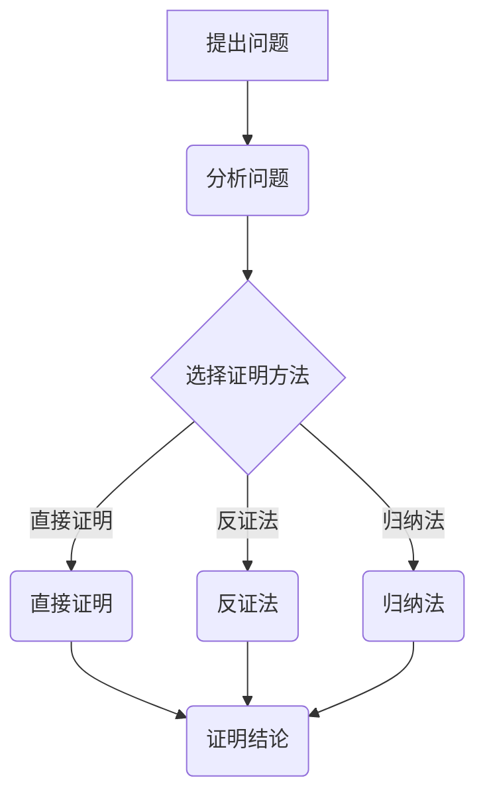

                 

## 第一部分：背景介绍

### 1.1 问题的提出

在全球化背景下，数学作为一门国际通用的科学语言，其证明方法与理论在不同文化间传播具有重要意义。然而，不同文化背景下，数学证明的理解与传播存在差异，如何实现跨文化的数学证明交流成为研究热点。

随着全球化进程的加速，不同国家和地区之间的学术交流日益频繁。数学作为一门科学语言，其在跨文化交流中的作用不容忽视。然而，不同文化背景下，数学证明的理解和传播面临着诸多挑战。首先，不同文化对于数学的基本概念和理论有不同的认知和理解方式。其次，不同文化对于数学证明的思维模式、表达方式和证明方法存在差异。此外，跨文化背景下，数学证明的交流与传播受到语言、教育体系、文化传统等多方面因素的影响。因此，如何实现跨文化的数学证明交流，提高数学证明在国际学术交流中的应用效果，成为当前数学研究领域的重要课题。

### 1.2 问题描述

本部分主要探讨数学证明的跨文化理解与传播过程中，文化差异对数学证明思维模式、表达方式、证明方法等方面的影响。

在跨文化交流中，数学证明的障碍主要体现在以下几个方面：

1. **思维模式差异**：不同文化背景下，数学证明的思维模式存在显著差异。西方文化背景下，数学证明强调逻辑推理和抽象思维，注重证明的严谨性和系统性；而东方文化背景下，数学证明更倾向于直观思维和形象化表达，强调证明的直观性和易懂性。

2. **表达方式差异**：数学证明的表达方式在不同文化背景下也有所不同。西方文化背景下，数学证明倾向于使用符号化语言和抽象表述，强调形式化和逻辑严密性；而东方文化背景下，数学证明则更注重文字描述和图形化表达，强调直观性和形象化。

3. **证明方法差异**：不同文化背景下，数学证明的方法也有所不同。西方文化背景下，数学证明更倾向于使用演绎法、反证法和归纳法等传统证明方法；而东方文化背景下，数学证明则更注重类比法、构造法和直观法等创新证明方法。

综上所述，跨文化背景下，数学证明的理解和传播面临着诸多挑战。如何克服这些挑战，实现跨文化的数学证明交流，成为当前数学研究领域的重要课题。

### 1.3 问题解决

通过研究不同文化背景下数学证明的特点，探讨跨文化数学证明交流的方法与策略，提高数学证明在国际学术交流中的应用效果。

为了解决上述问题，我们可以采取以下策略：

1. **加强跨文化数学教育**：在全球化的背景下，加强数学教育的跨文化性，培养学生的跨文化数学素养，提高他们对不同文化背景下数学证明的理解和认知。

2. **推广多元数学证明方法**：鼓励数学家和研究者在不同文化背景下尝试使用多样化的数学证明方法，推动数学证明方法的创新与发展。

3. **建立跨文化交流平台**：搭建跨文化的数学证明交流平台，促进不同文化背景下数学家的合作与交流，提高数学证明在国际学术交流中的应用效果。

4. **开展跨文化数学证明研究**：针对跨文化背景下数学证明的难点和挑战，开展深入的数学证明研究，探索适合跨文化背景的数学证明方法和策略。

通过上述策略，我们可以逐步实现跨文化的数学证明交流，提高数学证明在国际学术交流中的应用效果，为全球数学事业的发展做出贡献。

### 1.4 边界与外延

本部分主要关注数学证明的跨文化理解与传播，不包括数学教育、数学哲学等领域。

需要明确的是，本文主要探讨数学证明在跨文化交流中的理解与传播问题，不涉及数学教育、数学哲学等领域的具体内容。数学教育关注的是如何通过教学方法和策略，提高学生数学素养和数学能力；而数学哲学则探讨数学的本质、数学证明的合理性和数学知识的可靠性等问题。

因此，本文的边界主要聚焦于数学证明本身，以及如何在不同文化背景下实现数学证明的理解与传播。这不仅有助于深化数学学科的国际交流与合作，也为跨文化交流中的其他领域提供了有益的借鉴。

### 1.5 概念结构与核心要素组成

为了深入理解数学证明的跨文化理解与传播，我们需要从概念结构与核心要素组成的角度进行分析。

**跨文化理解**：这是指在不同文化背景下，对数学证明思维方式、表达方式和证明方法的深入理解。它涉及到对各个文化背景下数学证明特点的把握，以及如何将这些特点进行对比和分析。

**文化差异**：文化差异是影响数学证明理解与传播的重要因素。不同文化背景下，人们的价值观、思维模式、认知习惯等都会对数学证明产生影响。例如，在西方文化中，数学证明更注重逻辑推理和形式化；而在东方文化中，数学证明则更强调直观性和形象化。

**数学证明**：数学证明是数学学科的核心概念之一，它包括命题、假设、结论和证明方法等基本要素。数学证明的严谨性和逻辑性是数学学科的重要特点。

**跨文化交流**：跨文化交流是实现数学证明在不同文化背景下传播的重要途径。通过跨文化交流，不同文化背景下的数学家可以相互学习、交流和创新，从而推动数学证明方法的发展。

通过上述概念结构和核心要素的分析，我们可以更深入地理解数学证明的跨文化理解与传播问题，为后续的研究提供理论基础。

## 第二部分：核心概念与联系

### 2.1 数学证明的核心概念原理

数学证明是数学学科中的核心概念之一，其核心原理主要包括以下几个方面：

**命题**：命题是数学中的基本陈述，它可以被判定为真或假。一个命题通常由条件（假设）和结论（结果）组成。例如，命题“如果今天是星期一，那么明天是星期二”包含了条件“今天是星期一”和结论“明天是星期二”。

**假设**：假设是数学证明中为了推导出结论而设定的条件。假设通常是已知的或可以证明的命题。在证明过程中，假设被用来推导出结论，从而证明原命题的真实性。

**结论**：结论是从假设出发，通过推理得到的结果。结论是数学证明的最终目标，它表明了命题在假设条件下的真实性。例如，在证明命题“如果一个数是偶数，那么它的平方也是偶数”时，结论就是“如果一个数是偶数，那么它的平方也是偶数”。

**证明方法**：证明方法是数学证明中使用的各种策略和技巧。常见的证明方法包括直接证明、反证法、归纳法等。直接证明是通过逻辑推理直接证明命题的真实性；反证法是通过假设命题的相反命题成立，然后推导出矛盾，从而证明原命题的真实性；归纳法是通过证明特殊情况下的命题成立，然后推导出一般情况的命题成立。

**逻辑推理**：逻辑推理是数学证明的核心，它包括演绎推理和归纳推理。演绎推理是从一般到特殊的推理过程，即从一般原理推导出特定情况下的结论；归纳推理是从特殊到一般的推理过程，即通过观察特定情况下的命题成立，然后推导出一般情况的命题成立。

### 2.2 数学证明的属性特征对比表格

在跨文化背景下，数学证明的属性特征存在一定的差异。以下是一个对比表格，展示传统数学证明与跨文化数学证明在思维模式、表达方式和证明方法等方面的对比：

| 特征       | 传统数学证明 | 跨文化数学证明 |
| ---------- | ------------ | -------------- |
| **思维模式** | 抽象、逻辑推理 | 抽象、逻辑推理、形象化 |
| **表达方式** | 符号化、文字描述 | 符号化、文字描述、图形化 |
| **证明方法** | 直接证明、反证法、归纳法 | 直接证明、反证法、归纳法、类比法等 |

通过这个表格，我们可以看到跨文化数学证明在思维模式、表达方式和证明方法上都有所拓展，这有助于更好地适应不同文化背景下的数学理解和交流。

### 2.3 跨文化数学证明的ER实体关系图架构

为了更直观地展示跨文化数学证明的实体关系，我们可以使用ER（Entity-Relationship）图来表示。以下是一个ER实体关系图的Mermaid表示：

```mermaid
erDiagram
    Entity A ||--|{ B : has }
    Entity B ||--|{ C : depends }
    Entity C ||--|{ D : includes }
```

在这个ER图中：

- **Entity A** 代表数学证明的背景知识；
- **Entity B** 代表不同文化背景下的数学证明方法；
- **Entity C** 代表数学证明的实例；
- **Entity D** 代表数学证明的结果。

通过这个ER图，我们可以看到跨文化数学证明中不同实体之间的关系，以及它们如何相互作用来构建一个完整的数学证明过程。

## 第三部分：算法原理讲解

### 3.1 数学证明算法的mermaid流程图

为了更好地理解数学证明的算法原理，我们可以使用Mermaid绘制一个流程图，展示数学证明的基本步骤：



在这个流程图中：

- **A 提出问题**：确定需要证明的数学命题；
- **B 分析问题**：对数学命题进行分析，确定证明的难点和关键点；
- **C 选择证明方法**：根据问题的特点，选择合适的证明方法；
- **D 直接证明**：通过逻辑推理直接证明命题的真实性；
- **E 反证法**：通过假设命题的相反命题，然后推导出矛盾，从而证明原命题的真实性；
- **F 归纳法**：通过证明特殊情况下的命题成立，然后推导出一般情况的命题成立；
- **G 证明结论**：得出数学命题的结论。

### 3.2 Python源代码实现

以下是一个简单的Python示例，用于实现数学归纳法证明一个数列的性质：

```python
def proof_by_induction(n):
    if n == 1:
        return True
    elif n == 2:
        return True
    else:
        return proof_by_induction(n-1) and proof_by_induction(n-2)

# 示例调用
result = proof_by_induction(5)
print(result)
```

在这个例子中，我们定义了一个名为`proof_by_induction`的函数，用于递归地证明一个数列的性质。通过调用这个函数，我们可以验证数列在特定情况下的性质。

### 3.3 数学模型和数学公式

数学模型和公式是数学证明的核心组成部分。以下是一个简单的数学公式，用于描述费波那契数列：

$$
F(n) =
\begin{cases}
1 & \text{if } n = 1 \\
1 & \text{if } n = 2 \\
F(n-1) + F(n-2) & \text{if } n > 2
\end{cases}
$$

这个公式描述了费波那契数列的递推关系。通过这个公式，我们可以推导出任意一个正整数`n`的费波那契数。

### 3.4 算法原理讲解与举例说明

#### 原理讲解

数学证明通常包括以下几个基本步骤：

1. **提出问题**：明确需要证明的数学命题；
2. **分析问题**：对数学命题进行分析，确定证明的难点和关键点；
3. **选择证明方法**：根据问题的特点，选择合适的证明方法；
4. **证明过程**：通过逻辑推理和数学公式，逐步证明命题的真实性；
5. **得出结论**：总结证明过程，得出数学命题的结论。

#### 举例说明

**问题**：证明费波那契数列的递推关系。

**解题过程**：

1. **提出问题**：需要证明的命题是“费波那契数列满足递推关系`F(n) = F(n-1) + F(n-2)`”。

2. **分析问题**：费波那契数列是一个经典的数列，其递推关系是数列定义的核心。我们需要通过数学证明来验证这个递推关系。

3. **选择证明方法**：我们可以使用归纳法来证明这个递推关系。

4. **证明过程**：

    a. **基础情况**：当`n = 1`时，`F(1) = 1`，命题成立。

    b. **归纳步骤**：假设当`n = k`时，命题成立，即`F(k) = F(k-1) + F(k-2)`。

    c. **证明`n = k + 1`时命题成立**：
        $$F(k+1) = F(k) + F(k-1)$$
        根据归纳假设，代入`F(k)`和`F(k-1)`的表达式：
        $$F(k+1) = (F(k-1) + F(k-2)) + F(k-1)$$
        $$F(k+1) = 2F(k-1) + F(k-2)$$
        由于`F(k) = F(k-1) + F(k-2)`，所以：
        $$F(k+1) = F(k) + F(k-1)$$
        即`n = k + 1`时命题成立。

5. **得出结论**：通过归纳法证明，我们可以得出结论：费波那契数列满足递推关系`F(n) = F(n-1) + F(n-2)`。

通过这个例子，我们可以看到数学证明的基本原理和步骤。理解这些原理和步骤对于深入学习和研究数学非常重要。

