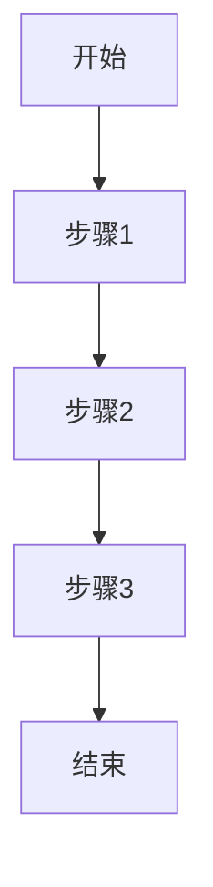

                 

### # 数学证明的逻辑性与严密性

关键词：数学证明、逻辑性、严密性、数学原理、证明方法、逻辑推理

摘要：本文将深入探讨数学证明中的逻辑性和严密性，解释为何逻辑性是数学证明的基础，严密性是数学证明的灵魂。我们将从基本概念出发，逐步分析数学证明的各个环节，帮助读者掌握构建严密证明的关键技巧，并通过实例来展示这些技巧的实际应用。最终，本文将总结数学证明的重要性和在科学技术领域的广泛应用。

## 引言：数学证明的重要性

数学证明是数学发展的基石，它不仅帮助我们理解和验证数学概念，还确保了数学结论的可靠性和普遍性。一个有效的数学证明必须具备两个核心特征：逻辑性和严密性。

### 什么是逻辑性？

逻辑性指的是证明过程中的每一步都必须建立在之前步骤的基础上，通过合理的推理得出结论。这种推理必须是符合逻辑规则的，确保从已知事实推导出新结论的每一步都是必然的。

### 什么是严密性？

严密性则强调证明的每一步都应当是无懈可击的，不能有任何疏漏或模糊的地方。严密性确保了证明的每一个步骤都是明确和精确的，从而使得整个证明过程具有不可质疑的权威性。

数学证明的这两个特征共同构成了数学证明的灵魂，使得数学成为一个精确、严谨的科学领域。

## 第一步：基础逻辑原理

在深入探讨数学证明的逻辑性和严密性之前，我们需要理解一些基础的逻辑原理。以下是一些关键概念：

### **定义与术语**

- **命题（Proposition）**：可以判断真假的陈述句。
- **逻辑运算符（Logical Operators）**：用于组合命题的符号，如“且”（∧）、“或”（∨）和“非”（¬）。
- **逻辑等价（Logical Equivalence）**：两个命题在所有情况下都具有相同的真假值。
- **逆命题（Inverse Proposition）**、**逆否命题（Inverse Contrapositive Proposition）**：通过取原命题的否定来构造的新命题。

### **逻辑原理**

- **交换律（Commutative Law）**：A ∧ B = B ∧ A，A ∨ B = B ∨ A。
- **结合律（Associative Law）**：A ∧ (B ∧ C) = (A ∧ B) ∧ C，A ∨ (B ∨ C) = (A ∨ B) ∨ C。
- **分配律（Distributive Law）**：A ∧ (B ∨ C) = (A ∧ B) ∨ (A ∧ C)，A ∨ (B ∧ C) = (A ∨ B) ∧ (A ∨ C)。
- **德摩根律（De Morgan's Laws）**：¬(A ∧ B) = ¬A ∨ ¬B，¬(A ∨ B) = ¬A ∧ ¬B。
- **逆否律（Contrapositive Law）**：如果 A → B，那么 ¬B → ¬A 也成立。

### **证明方法**

- **直接证明（Direct Proof）**：从已知事实出发，通过一系列逻辑推理得出所需结论。
- **反证法（Proof by Contradiction）**：假设结论不成立，通过推导出矛盾来证明原假设错误。

## 第二步：严谨证明技巧

### **直接证明**

直接证明是最常见的证明方法，其核心在于通过一系列逻辑推理，从已知事实出发，逐步推导出所需结论。以下是一个简单的示例：

**定理**：对于任何自然数 n，有 n^2 ≥ n。

**证明**：

- 当 n = 1 时，1^2 = 1，结论成立。
- 假设对于某个自然数 k，k^2 ≥ k 成立。
- 当 n = k + 1 时，(k + 1)^2 = k^2 + 2k + 1 ≥ k + 1（由归纳假设）。

通过归纳法，我们可以证明对于任何自然数 n，n^2 ≥ n 都成立。

### **证明的逆否命题**

证明的逆否命题是一种强大的证明技巧，它将原命题的证明转化为证明其逆否命题。这种方法在某些情况下更为简便。例如，要证明命题“如果 p，则 q”（p → q），我们可以证明“如果 ¬q，则 ¬p”（¬q → ¬p）。

### **数学归纳法**

数学归纳法是一种用于证明与自然数相关的命题的常用方法。它分为两个步骤：

1. **基础步骤**：证明命题对于 n = 1 成立。
2. **归纳步骤**：假设命题对于 n = k 成立，证明命题对于 n = k + 1 也成立。

### **反证法**

反证法是一种通过假设结论不成立，推导出矛盾来证明结论成立的证明方法。例如，要证明命题“所有天鹅都是白色的”，我们可以假设存在非白色的天鹅，进而推导出矛盾，从而证明原命题成立。

## 第三步：数学证明在不同领域的应用

### **集合论**

在集合论中，证明通常涉及集合的基本性质和操作，例如并集、交集、补集和子集的关系。以下是一个示例：

**定理**：如果 A 是 B 的子集，那么 A 的补集是 B 的补集的子集。

**证明**：

- 假设 x ∈ A 的补集，则 x ∉ A。
- 因为 A 是 B 的子集，所以 x ∉ B。
- 因此，x ∈ B 的补集。

### **代数**

在代数中，证明通常涉及数的基本性质和运算，例如整数的性质、多项式的因式分解和函数的性质。以下是一个示例：

**定理**：对于任何自然数 n，n^2 - 1 可被 8 整除。

**证明**：

- 当 n = 1 时，1^2 - 1 = 0，可被 8 整除。
- 假设对于某个自然数 k，k^2 - 1 可被 8 整除。
- 当 n = k + 1 时，(k + 1)^2 - 1 = k^2 + 2k + 1 - 1 = (k^2 - 1) + 2k。
- 因为 k^2 - 1 可被 8 整除，所以 (k^2 - 1) + 2k 也可被 8 整除。

### **几何**

在几何中，证明通常涉及几何图形的性质和关系，例如三角形、圆和正多边形的关系。以下是一个示例：

**定理**：在一个直角三角形中，斜边的平方等于两直角边的平方和。

**证明**：

- 假设有一个直角三角形，其两直角边分别为 a 和 b，斜边为 c。
- 根据勾股定理，我们有 a^2 + b^2 = c^2。

### **数论**

在数论中，证明通常涉及整数的性质和运算，例如素数、因子和同余关系。以下是一个示例：

**定理**：如果 p 是一个素数，那么 p^2 - 1 是 24 的倍数。

**证明**：

- 由于 p 是素数，p 不能被 2、3、5 整除。
- 因此，p^2 - 1 可以被 2、3、4、6 整除，即 p^2 - 1 是 12 的倍数。
- 另外，p^2 - 1 不能被 8 整除，因为 p^2 ≡ 1 (mod 8)。
- 因此，p^2 - 1 是 24 的倍数。

## 第四步：证明技巧的进阶应用

### **证明的构造性方法**

构造性方法是一种通过构造一个具体例子来证明一般结论的技巧。例如，要证明“存在一个实数 x，使得 x^2 = 2”，我们可以构造一个具体的实数 2 的平方根。

### **反证法的应用**

反证法是一种通过假设结论不成立，推导出矛盾来证明结论成立的技巧。例如，要证明“如果一个整数能被 3 整除，那么它的各位数字之和也能被 3 整除”，我们可以假设结论不成立，推导出矛盾。

### **使用反证法证明无穷性**

反证法可以用来证明某些集合是无穷的。例如，要证明“自然数集合是无穷的”，我们可以假设自然数集合是有限的，然后推导出矛盾。

## 第五步：数学证明与计算机科学的关系

数学证明在计算机科学中有着广泛的应用。以下是一些例子：

### **算法分析**

算法分析通常涉及证明算法的正确性和效率。例如，要证明一个排序算法是正确的，我们可以使用数学证明来展示该算法在所有情况下都能正确排序。

### **计算复杂性理论**

计算复杂性理论涉及证明某些问题是否可以在有限时间内解决。例如，要证明一个问题是 NP 完全的，我们可以使用数学证明来展示它具有 NP 完全问题的特性。

### **形式验证**

形式验证是一种使用数学证明来验证计算机系统的正确性的方法。例如，在嵌入式系统设计中，可以使用数学证明来确保系统在所有情况下都能正确运行。

## 总结

数学证明是数学和计算机科学中的核心概念，它不仅帮助我们理解和验证数学概念，还为计算机科学的许多领域提供了强大的工具。逻辑性和严密性是数学证明的灵魂，它们确保了证明过程的合理性和可靠性。通过本文的探讨，我们了解了数学证明的基本原理和技巧，以及它们在不同领域的应用。掌握这些技巧对于理解和应用数学和计算机科学至关重要。希望本文能帮助读者更好地理解和掌握数学证明的方法和技巧。

## 作者信息

作者：AI天才研究院/AI Genius Institute & 禅与计算机程序设计艺术 /Zen And The Art of Computer Programming

## 附录

### **数学证明中的符号与术语**

- **命题（Proposition）**：一个陈述句，可以判断真假。
- **定理（Theorem）**：一个经过证明的真命题。
- **公理（Axiom）**：一个不需要证明的基本假设。
- **推论（Corollary）**：从定理中直接得出的结论。
- **定义（Definition）**：对某个概念或对象的明确说明。

### **逻辑运算符**

- ∧（逻辑与）：A ∧ B 表示 A 和 B 都为真。
- ∨（逻辑或）：A ∨ B 表示 A 或 B 至少有一个为真。
- ¬（逻辑非）：¬A 表示 A 的否定。

### **逻辑等价**

- A ≡ B 表示 A 和 B 在所有情况下都具有相同的真假值。

### **证明方法**

- **直接证明（Direct Proof）**：从已知事实出发，逐步推导出所需结论。
- **反证法（Proof by Contradiction）**：假设结论不成立，推导出矛盾来证明原假设错误。
- **数学归纳法（Mathematical Induction）**：通过基础步骤和归纳步骤证明与自然数相关的命题。

### **数学公式**

- **平方根**：$$\sqrt{2}$$
- **指数**：$$2^{10}$$
- **根式**：$$\sqrt[3]{x}$$
- **和**：$$a + b$$
- **积**：$$a \times b$$

### **Mermaid 流程图**



### **类图（ER实体关系图）**

```mermaid
erDiagram
  Class1 ||--|{ Class2 }|| Person : has multiple Pets
  Class1 ||--|{ Class3 }|| Book : has multiple Authors
  Class2 ||--|{ Class4 }|| Pet : has one Type
```

这些附录内容为读者提供了数学证明中常见的符号、术语和工具，有助于更好地理解和应用数学证明的方法和技巧。希望这些内容能对读者有所帮助。

## 最佳实践 Tips

1. **理解基本概念**：在学习数学证明时，首先确保你理解了基本概念和术语，如命题、定理、公理等。这将为你构建严密证明打下基础。

2. **练习推导**：通过解决各种数学问题，练习推导过程，这有助于提高你的逻辑思维能力。

3. **学习不同的证明方法**：了解并掌握不同的证明方法，如直接证明、反证法和数学归纳法，这将使你能够灵活应对各种证明问题。

4. **阅读经典证明**：阅读一些经典的数学证明，如欧几里得《几何原本》中的证明，这可以帮助你了解证明的严密性和逻辑性。

5. **使用工具辅助**：利用图形工具和计算机软件（如Mermaid）来辅助你的证明过程，这可以帮助你更直观地理解证明的结构。

6. **注意细节**：在证明过程中，注意每一个细节，确保每一步都是精确和清晰的。

7. **批判性思维**：对任何证明都保持批判性思维，尝试找出可能的漏洞或误解，这有助于你提高证明的严密性。

## 小结

本文深入探讨了数学证明中的逻辑性和严密性，通过介绍基础逻辑原理、不同证明方法以及数学证明在不同领域的应用，帮助读者理解数学证明的重要性和构建严密证明的关键技巧。掌握这些技巧对于理解和应用数学和计算机科学至关重要。

## 注意事项

1. **避免模糊表述**：在证明过程中，确保每一步都是清晰和精确的，避免使用模糊或模糊不清的表述。
2. **检查反证法的假设**：在使用反证法时，确保你的假设是合理的，且推导过程是严密的。
3. **验证归纳步骤**：在数学归纳法中，确保你的归纳步骤是正确的，且能够从已知步骤推导出新的结论。

## 拓展阅读

1. **《数学证明的艺术》（The Art of Mathematics）**：由Paul Halmos撰写，介绍了数学证明的原理和方法。
2. **《数学归纳法》（Mathematical Induction）**：详细介绍了数学归纳法的原理和应用。
3. **《逻辑学导论》（Introduction to Logic）**：提供了关于逻辑学和逻辑证明的全面介绍。
4. **《计算机科学中的证明方法》（Proof Methods in Computer Science）**：探讨了数学证明在计算机科学中的应用。

通过阅读这些书籍，读者可以进一步深化对数学证明的理解和应用。希望本文能为读者在数学证明领域的研究和实践提供有益的参考。

