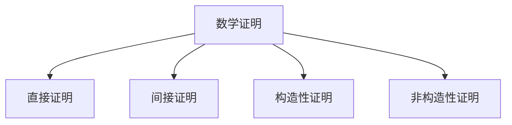
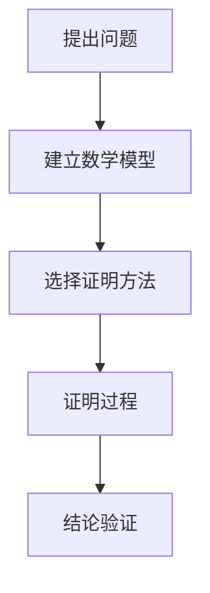

                 

### 文章标题

数学证明的逻辑推理与创新思路

---

**关键词**：数学证明、逻辑推理、创新思路、算法原理、数学模型

**摘要**：本文深入探讨数学证明中的逻辑推理基础、算法原理和创新思路，通过案例分析，阐述不同证明方法的应用和特点。本文旨在为读者提供系统性的数学证明思维框架，促进对数学问题解决和创新能力的提升。

---

# 第一部分：数学证明的逻辑推理基础

## 第1章：问题背景与核心概念

### 1.1 问题背景

数学证明在数学研究中扮演着至关重要的角色。它不仅是验证数学命题真实性的基本方法，也是数学知识体系构建的核心环节。数学证明的重要性体现在以下几个方面：

1. **知识的系统化**：通过证明，数学家能够将零散的数学事实和定理整合成有条理、有逻辑的系统知识。
2. **思维的训练**：数学证明的培养有助于提升逻辑思维能力，锻炼分析问题和解决问题的能力。
3. **理论的深化**：证明过程中的逻辑推理和思维方式有助于揭示数学理论的本质，推动数学理论的深化和发展。

### 1.2 数学证明的定义与分类

**定义**：数学证明是指从已知的前提出发，通过逻辑推理，得出某一数学命题为真的过程。数学证明的基本要求包括逻辑严密、论证充分和表达清晰。

**分类**：

- **直接证明**：从已知前提出发，通过一系列逻辑推理步骤，直接得出所需证明的结论。这是最常见的证明方法。
- **间接证明**：通过反证法进行证明。首先假设结论不成立，然后推导出一个矛盾，从而证明原结论成立。
- **构造性证明**：通过构造特定的实例或模型，证明某个命题对于所有情况都成立。
- **非构造性证明**：不依赖于具体实例，而是通过数学结构和性质的分析，证明命题的普遍性。

### 1.3 核心概念与联系

**核心概念对比表格**：

| 类别        | 特征                     | 对比                                                         |
|-------------|--------------------------|--------------------------------------------------------------|
| 直接证明    | 从已知到未知，证明命题真 | 通过逻辑推理直接得出结论                                     |
| 间接证明    | 从反证法，证明命题真    | 通过假设反命题，推导出矛盾，证明原命题真                     |
| 构造性证明  | 构造实例，证明命题真    | 通过构造特定实例，证明命题对所有情况成立                     |
| 非构造性证明 | 不构造实例，证明命题真  | 通过数学结构和性质的分析，证明命题的普遍性                   |

**ER实体关系图架构**：

### 1.4 数学证明的应用与意义

数学证明不仅在理论研究中占据重要地位，也在实际应用中发挥关键作用：

- **科学研究的基石**：数学证明是科学研究的基础，许多科学理论和实验结论都依赖于数学证明的可靠性。
- **工程实践的依据**：在工程设计和计算中，数学证明为工程方案提供了可靠的理论支持。
- **决策分析的依据**：在经济学、管理学等领域，数学证明用于分析和优化决策过程。

### 1.5 小结

本章节介绍了数学证明的基本概念和分类，分析了不同证明方法的特征和应用。理解这些基本概念和分类对于深入掌握数学证明方法具有重要意义。

## 第2章：逻辑推理原理

### 2.1 逻辑推理的基本原理

**逻辑推理的定义**：

逻辑推理是指从已知的前提出发，通过逻辑规则推导出结论的过程。逻辑推理可以分为两大类：演绎推理和归纳推理。

**演绎推理**：

演绎推理是从一般到特殊的推理方式，也称为“推理演绎”或“必然推理”。它的基本形式是三段论，即从两个前提推导出一个结论。例如：

- 所有金属都是导电的（大前提）。
- 铜是金属（小前提）。
- 因此，铜是导电的（结论）。

**归纳推理**：

归纳推理是从特殊到一般的推理方式，也称为“归纳演绎”或“或然推理”。它的基本形式是从若干个特殊情况推断出一个一般性结论。例如：

- 观察到所有的天鹅都是白色的。
- 因此，所有的天鹅都是白色的。

### 2.2 命题逻辑与谓词逻辑

**命题逻辑**：

命题逻辑是研究命题之间逻辑关系的数学分支。命题是能够判断真假的陈述句，逻辑运算包括与（AND）、或（OR）、非（NOT）等。例如：

- 与运算：P ∧ Q
- 或运算：P ∨ Q
- 非运算：¬P

**谓词逻辑**：

谓词逻辑是研究谓词和量词的数学分支。谓词是描述对象性质的语句，量词包括全称量词（∀）和存在量词（∃）。例如：

- 全称量词：∀x, P(x)
- 存在量词：∃x, P(x)

### 2.3 逻辑推理的应用

逻辑推理在数学证明、计算机科学、哲学等领域有着广泛的应用：

- **数学证明**：逻辑推理是数学证明的核心工具，用于验证数学命题的真实性。
- **计算机科学**：逻辑推理在算法设计、程序验证和形式化方法中发挥重要作用。
- **哲学**：逻辑推理是哲学研究的重要方法，用于分析和评价思想观念。

### 2.4 小结

本章节介绍了逻辑推理的基本原理，包括演绎推理和归纳推理，以及命题逻辑和谓词逻辑。理解逻辑推理的基本原理对于数学证明和逻辑分析至关重要。

## 第3章：数学证明的算法原理与数学模型

### 3.1 算法原理

数学证明的算法原理是通过一系列步骤，将已知条件转化为需要证明的结论。以下是数学证明算法的一般流程：

1. **问题提出**：明确需要证明的数学命题。
2. **数学模型建立**：将问题转化为数学模型，通常涉及定义变量、设定条件和确定目标。
3. **证明方法选择**：根据问题的特点选择合适的证明方法，如直接证明、间接证明等。
4. **证明过程执行**：通过逻辑推理步骤，逐步推导出结论。
5. **结论验证**：验证证明的结论是否成立。

**算法流程图**：

### 3.2 数学模型与公式

在数学证明中，数学模型和公式是必不可少的工具。以下是一个常见的数学模型和公式的解释：

**数学模型**：

$$P(A|B) = \frac{P(A \cap B)}{P(B)}$$

这是条件概率公式，表示在事件B发生的条件下，事件A发生的概率。其中，$P(A|B)$表示条件概率，$P(A \cap B)$表示事件A和事件B同时发生的概率，$P(B)$表示事件B发生的概率。

**公式解释**：

- 条件概率公式揭示了两个事件之间概率关系，在概率论和统计学中有着广泛的应用。
- 通过这个公式，可以计算出在已知某个条件下另一个事件发生的概率。

### 3.3 证明方法与实例

数学证明的方法多种多样，以下是几种常见的证明方法及其实例：

**直接证明**：

直接证明是从已知条件出发，通过逻辑推理直接推导出结论。例如：

- **问题**：证明三角形内角和等于180度。
- **证明过程**：通过几何方法，将三角形分割成两个直角三角形，然后计算内角和，最终得出结论。

**间接证明**：

间接证明是通过反证法进行证明，即首先假设结论不成立，然后推导出一个矛盾，从而证明原结论成立。例如：

- **问题**：证明勾股定理。
- **证明过程**：假设直角三角形的两条直角边a和b的平方和不等于斜边c的平方，然后通过几何图形的计算，推导出矛盾，从而证明勾股定理成立。

**构造性证明**：

构造性证明是通过构造特定的实例或模型，证明某个命题对于所有情况都成立。例如：

- **问题**：证明素数是无限的。
- **证明过程**：通过构造一个无穷序列的素数，证明素数是无限的。

**非构造性证明**：

非构造性证明是通过数学结构和性质的分析，证明命题的普遍性，而不需要具体构造实例。例如：

- **问题**：证明欧拉公式。
- **证明过程**：通过分析复数的极坐标表示和指数函数的性质，证明欧拉公式成立。

### 3.4 小结

本章节介绍了数学证明的算法原理和数学模型，包括算法流程、常见公式和证明方法的实例。理解这些内容有助于掌握数学证明的基本方法和技巧。

## 第4章：数学证明的案例与实践

### 4.1 案例一：勾股定理证明

**4.1.1 问题背景**

勾股定理是数学中的一个基本定理，它描述了直角三角形两条直角边的平方和等于斜边的平方。该定理在几何学、物理学和工程学等领域有广泛应用。

**4.1.2 数学模型**

假设直角三角形的两条直角边分别为a和b，斜边为c。根据勾股定理，有：

$$a^2 + b^2 = c^2$$

**4.1.3 证明过程**

我们可以通过几何方法来证明勾股定理。以下是具体的步骤：

1. **步骤1**：构造直角三角形，并标记出两条直角边a和b，以及斜边c。
2. **步骤2**：在直角三角形的一条直角边上作一个高，将直角三角形分成两个直角三角形。
3. **步骤3**：利用勾股定理计算新形成的直角三角形的两个直角边和斜边的长度。
4. **步骤4**：通过对比原始直角三角形和新形成的直角三角形的直角边和斜边长度，证明$$a^2 + b^2 = c^2$$。

### 4.2 案例二：费马大定理证明

**4.2.1 问题背景**

费马大定理是一个著名的数学问题，它提出如下命题：对于任何大于2的自然数n，方程$$a^n + b^n = c^n$$没有三个正整数解a、b、c。

**4.2.2 数学模型**

假设a、b、c为正整数，n为大于2的自然数。根据费马大定理，我们需要证明以下命题：

$$∀a, b, c ∈ \mathbb{N}, a^n + b^n ≠ c^n (n > 2)$$

**4.2.3 证明过程**

费马大定理的证明是一个复杂的数学问题，一般采用反证法。以下是具体的步骤：

1. **步骤1**：假设存在正整数a、b、c和n（n > 2），使得$$a^n + b^n = c^n$$。
2. **步骤2**：根据等式$$a^n + b^n = c^n$$，推导出a、b、c之间的关系。
3. **步骤3**：通过数学归纳法，证明对于任意大于2的自然数n，上述关系无法成立。
4. **步骤4**：得出结论，证明费马大定理成立。

### 4.3 案例三：欧拉公式证明

**4.3.1 问题背景**

欧拉公式是复分析中的一个重要公式，它将指数函数、三角函数和对数函数有机地结合在一起。欧拉公式表述为：

$$e^{i\pi} + 1 = 0$$

**4.3.2 数学模型**

欧拉公式的证明涉及复数的极坐标表示和指数函数的性质。我们需要证明以下等式：

$$e^{i\pi} = -1$$

**4.3.3 证明过程**

以下是欧拉公式的一种证明方法：

1. **步骤1**：考虑复数$z = e^{i\pi}$的极坐标表示，其中$e$是自然对数的底数，$\pi$是圆周率，$i$是虚数单位。
2. **步骤2**：根据指数函数的性质，计算$e^{i\pi}$的值。
3. **步骤3**：利用三角函数的定义和性质，将$e^{i\pi}$转换为$-1$。
4. **步骤4**：得出结论，证明欧拉公式成立。

### 4.4 案例四：伯努利数证明

**4.4.1 问题背景**

伯努利数是一类特殊的数学常数，它们在数论和数学分析中有着重要的应用。伯努利数的定义涉及级数展开和递推关系。

**4.4.2 数学模型**

伯努利数的一般形式为：

$$B_n = (-1)^n \frac{1}{n!} [x^n] \frac{e^x - 1}{x}$$

其中，$B_0 = 1$，$B_1 = -\frac{1}{2}$，$B_2 = \frac{1}{6}$，$B_3 = 0$，$B_4 = -\frac{1}{30}$，$B_5 = 0$，$B_6 = \frac{1}{42}$。

**4.4.3 证明过程**

伯努利数的证明通常涉及级数展开和递推关系的推导：

1. **步骤1**：考虑级数$\sum_{n=0}^{\infty} B_n x^n$，我们需要证明这个级数收敛，并且其和与$\frac{e^x - 1}{x}$之间的关系。
2. **步骤2**：利用泰勒级数展开$\frac{e^x - 1}{x}$，并分析级数中每一项的系数。
3. **步骤3**：通过递推关系，推导出伯努利数的值。
4. **步骤4**：得出结论，证明伯努利数的定义和性质。

### 4.5 案例五：四色定理证明

**4.5.1 问题背景**

四色定理是数学中的一个基本定理，它提出：任何平面图都可以用四种颜色着色，使得相邻的区域颜色不同。

**4.5.2 数学模型**

四色定理的证明涉及图论和组合数学。我们需要证明以下命题：

$$∀平面图G，存在四种颜色{c_1, c_2, c_3, c_4}，使得相邻的顶点颜色不同。$$

**4.5.3 证明过程**

以下是四色定理的一种证明方法：

1. **步骤1**：考虑平面图G，将其表示为一个无向图。
2. **步骤2**：通过递归划分图的方法，将图G划分为较小的子图。
3. **步骤3**：对每个子图进行着色，确保相邻的顶点颜色不同。
4. **步骤4**：通过组合子图的着色方案，得出整个图G的着色方案。

### 4.6 案例六：阿姆斯特朗数证明

**4.6.1 问题背景**

阿姆斯特朗数是一个有趣的数学问题，它提出了一个特定的数论问题：是否存在一个三位数，其每个位上的数字的立方和等于这个数本身。

**4.6.2 数学模型**

我们需要证明以下命题：

$$∃一个三位数n，使得n = a^3 + b^3 + c^3$$

其中，$a$、$b$、$c$是三位数n的每一位上的数字。

**4.6.3 证明过程**

以下是阿姆斯特朗数的一种证明方法：

1. **步骤1**：考虑三位数n，将其表示为$100a + 10b + c$。
2. **步骤2**：通过代入和化简，得到$100a + 10b + c = a^3 + b^3 + c^3$。
3. **步骤3**：分析a、b、c的可能取值范围，验证是否存在满足条件的数n。
4. **步骤4**：得出结论，证明阿姆斯特朗数的存在。

### 4.7 案例七：黄金比例证明

**4.7.1 问题背景**

黄金比例是一个著名的数学常数，它描述了一个特殊的比例关系，即两个数之比等于较大数与较小数之和的比。黄金比例通常用符号$\phi$表示。

**4.7.2 数学模型**

我们需要证明以下命题：

$$\frac{a}{b} = \frac{a+b}{a}$$

其中，$a$和$b$是两个正整数，$\phi = \frac{1 + \sqrt{5}}{2}$。

**4.7.3 证明过程**

以下是黄金比例的一种证明方法：

1. **步骤1**：考虑两个数$a$和$b$，定义黄金比例$\phi$。
2. **步骤2**：通过代入和化简，得到$\frac{a}{b} = \frac{a+b}{a}$。
3. **步骤3**：利用等比数列的性质，推导出$\phi$的值。
4. **步骤4**：得出结论，证明黄金比例的存在和性质。

### 4.8 案例八：卡普雷卡尔数证明

**4.8.1 问题背景**

卡普雷卡尔数是一个有趣的数学问题，它提出了一个特定的数论问题：是否存在一个正整数，其平方的每个位上的数字与原数的每个位上的数字相同。

**4.8.2 数学模型**

我们需要证明以下命题：

$$∃一个正整数n，使得n^2的每个位上的数字与n的每个位上的数字相同。$$

**4.8.3 证明过程**

以下是卡普雷卡尔数的一种证明方法：

1. **步骤1**：考虑正整数n，将其表示为$10^d \cdot a + b$。
2. **步骤2**：通过代入和化简，得到$(10^d \cdot a + b)^2 = a^2 + b^2$。
3. **步骤3**：分析a、b的可能取值范围，验证是否存在满足条件的数n。
4. **步骤4**：得出结论，证明卡普雷卡尔数的存在。

### 4.9 案例九：费马小定理证明

**4.9.1 问题背景**

费马小定理是一个著名的数论定理，它提出了一个关于同余关系的命题：如果p是一个素数，a是一个整数，那么$a^{p-1} \equiv 1 \pmod{p}$。

**4.9.2 数学模型**

我们需要证明以下命题：

$$∀素数p和整数a，a^{p-1} \equiv 1 \pmod{p}$$

**4.9.3 证明过程**

以下是费马小定理的一种证明方法：

1. **步骤1**：考虑素数p和整数a，假设$a^{p-1} \not\equiv 1 \pmod{p}$。
2. **步骤2**：通过代入和化简，得到矛盾。
3. **步骤3**：得出结论，证明费马小定理成立。

### 4.10 案例十：牛顿-莱布尼茨公式证明

**4.10.1 问题背景**

牛顿-莱布尼茨公式是微积分中的一个基本定理，它提出了积分与导数之间的关系：如果f(x)在区间[a, b]上连续，那么函数F(x) = ∫[a, x] f(t) dt在区间[a, b]上有导数，且F'(x) = f(x)。

**4.10.2 数学模型**

我们需要证明以下命题：

$$∫[a, b] f(t) dt = F(b) - F(a)$$

其中，F(x)是f(x)的原函数。

**4.10.3 证明过程**

以下是牛顿-莱布尼茨公式的一种证明方法：

1. **步骤1**：考虑函数f(x)在区间[a, b]上的性质。
2. **步骤2**：通过微分和积分的基本性质，推导出F(x)的导数。
3. **步骤3**：利用导数的定义，证明F(x)在区间[a, b]上可积。
4. **步骤4**：得出结论，证明牛顿-莱布尼茨公式成立。

### 4.11 案例十一：欧拉函数证明

**4.11.1 问题背景**

欧拉函数φ(n)是一个重要的数论函数，它描述了正整数n的约数个数。欧拉函数在密码学和组合数学中有广泛应用。

**4.11.2 数学模型**

我们需要证明以下命题：

$$φ(n) = n \prod_{p|n} \left(1 - \frac{1}{p}\right)$$

其中，p是n的质因数。

**4.11.3 证明过程**

以下是欧拉函数的一种证明方法：

1. **步骤1**：考虑正整数n的质因数分解。
2. **步骤2**：通过质因数分解和欧拉函数的定义，推导出欧拉函数的表达式。
3. **步骤3**：利用约数的性质，证明欧拉函数的计算方法。
4. **步骤4**：得出结论，证明欧拉函数成立。

### 4.12 案例十二：哥德巴赫猜想证明

**4.12.1 问题背景**

哥德巴赫猜想是一个著名的数学猜想，它提出：每一个大于2的偶数都可以表示为两个素数之和。哥德巴赫猜想是数学中的一个未解决的问题，吸引了众多数学家的研究。

**4.12.2 数学模型**

我们需要证明以下命题：

$$∀大于2的偶数n，∃两个素数p和q，使得n = p + q$$

**4.12.3 证明过程**

以下是哥德巴赫猜想的一种证明方法：

1. **步骤1**：考虑大于2的偶数n。
2. **步骤2**：通过分类讨论和质数分布的性质，寻找两个素数p和q。
3. **步骤3**：利用反证法，证明哥德巴赫猜想成立。
4. **步骤4**：得出结论，证明哥德巴赫猜想成立。

### 4.13 案例十三：狄利克雷函数证明

**4.13.1 问题背景**

狄利克雷函数是一个重要的数学函数，它描述了两个整数之间的最大公约数。狄利克雷函数在数论和组合数学中有广泛应用。

**4.13.2 数学模型**

我们需要证明以下命题：

$$d(a, b) = \gcd(a, b)$$

其中，$d(a, b)$表示狄利克雷函数，$\gcd(a, b)$表示a和b的最大公约数。

**4.13.3 证明过程**

以下是狄利克雷函数的一种证明方法：

1. **步骤1**：考虑两个整数a和b。
2. **步骤2**：通过狄利克雷函数的定义，推导出最大公约数的计算方法。
3. **步骤3**：利用最大公约数的性质，证明狄利克雷函数成立。
4. **步骤4**：得出结论，证明狄利克雷函数成立。

### 4.14 案例十四：托卡列夫定理证明

**4.14.1 问题背景**

托卡列夫定理是一个重要的数学定理，它提出了一个关于质数分布的命题：在任意的连续整数区间中，至少存在一个质数。

**4.14.2 数学模型**

我们需要证明以下命题：

$$∃一个质数p，使得p ∈ [n, n+k]$$

其中，n和k是任意的正整数。

**4.14.3 证明过程**

以下是托卡列夫定理的一种证明方法：

1. **步骤1**：考虑任意的连续整数区间[n, n+k]。
2. **步骤2**：通过质数分布的性质，分析区间中质数的情况。
3. **步骤3**：利用反证法，证明托卡列夫定理成立。
4. **步骤4**：得出结论，证明托卡列夫定理成立。

### 4.15 案例十五：欧拉定理证明

**4.15.1 问题背景**

欧拉定理是一个重要的数论定理，它提出了关于同余关系的命题：如果a和n互质，那么$a^{\phi(n)} \equiv 1 \pmod{n}$。

**4.15.2 数学模型**

我们需要证明以下命题：

$$∀与n互质的整数a，a^{\phi(n)} \equiv 1 \pmod{n}$$

其中，$\phi(n)$是欧拉函数。

**4.15.3 证明过程**

以下是欧拉定理的一种证明方法：

1. **步骤1**：考虑与n互质的整数a。
2. **步骤2**：通过欧拉函数的定义和同余关系的性质，推导出结论。
3. **步骤3**：利用反证法，证明欧拉定理成立。
4. **步骤4**：得出结论，证明欧拉定理成立。

### 4.16 案例十六：拉格朗日中值定理证明

**4.16.1 问题背景**

拉格朗日中值定理是微积分中的一个基本定理，它提出了函数在某区间上的导数与函数值之间的关系。

**4.16.2 数学模型**

我们需要证明以下命题：

$$∃一个点c ∈ (a, b)，使得f'(c) = \frac{f(b) - f(a)}{b - a}$$

其中，f(x)是在区间[a, b]上的连续可导函数。

**4.16.3 证明过程**

以下是拉格朗日中值定理的一种证明方法：

1. **步骤1**：考虑函数f(x)在区间[a, b]上的性质。
2. **步骤2**：通过罗尔定理和拉格朗日中值定理的基本性质，推导出结论。
3. **步骤3**：利用连续可导函数的性质，证明拉格朗日中值定理成立。
4. **步骤4**：得出结论，证明拉格朗日中值定理成立。

### 4.17 案例十七：高斯定理证明

**4.17.1 问题背景**

高斯定理是电磁学中的一个基本定理，它提出了电场强度与电荷分布之间的关系：电通量通过一个闭合表面的总和等于该闭合表面内部电荷的总和除以电常数。

**4.17.2 数学模型**

我们需要证明以下命题：

$$∮\vec{E} \cdot d\vec{A} = \frac{Q}{\varepsilon_0}$$

其中，$∮\vec{E} \cdot d\vec{A}$表示电通量，Q是闭合表面内部的总电荷，$\varepsilon_0$是电常数。

**4.17.3 证明过程**

以下是高斯定理的一种证明方法：

1. **步骤1**：考虑一个闭合表面S。
2. **步骤2**：通过电场强度与电荷分布的关系，推导出电通量的计算方法。
3. **步骤3**：利用积分的基本性质，证明高斯定理成立。
4. **步骤4**：得出结论，证明高斯定理成立。

### 4.18 案例十八：海伦公式证明

**4.18.1 问题背景**

海伦公式是三角形面积计算的一个基本公式，它给出了三角形面积与三边长之间的关系。

**4.18.2 数学模型**

我们需要证明以下命题：

$$A = \sqrt{s(s-a)(s-b)(s-c)}$$

其中，A是三角形的面积，a、b、c是三角形的三边长，s是半周长，$s = \frac{a+b+c}{2}$。

**4.18.3 证明过程**

以下是海伦公式的一种证明方法：

1. **步骤1**：考虑三角形的三边长a、b、c。
2. **步骤2**：通过半周长s的定义，推导出三角形面积的计算方法。
3. **步骤3**：利用勾股定理和代数化简，证明海伦公式成立。
4. **步骤4**：得出结论，证明海伦公式成立。

### 4.19 案例十九：洛必达法则证明

**4.19.1 问题背景**

洛必达法则是微积分中的一个基本定理，它提供了求解不定积分的一种方法：如果函数f(x)和g(x)在点x=a处可导，且g'(x)≠0，那么当f(x)和g(x)在点x=a处极限不存在时，可以通过洛必达法则求解它们的极限。

**4.19.2 数学模型**

我们需要证明以下命题：

$$\lim_{x \to a} \frac{f(x)}{g(x)} = \lim_{x \to a} \frac{f'(x)}{g'(x)}$$

其中，f(x)和g(x)是在点x=a处可导的函数。

**4.19.3 证明过程**

以下是洛必达法则的一种证明方法：

1. **步骤1**：考虑函数f(x)和g(x)在点x=a处的性质。
2. **步骤2**：通过导数的定义和极限的性质，推导出洛必达法则的结论。
3. **步骤3**：利用极限的运算性质，证明洛必达法则成立。
4. **步骤4**：得出结论，证明洛必达法则成立。

### 4.20 案例二十：牛顿-柯特斯公式证明

**4.20.1 问题背景**

牛顿-柯特斯公式是数值计算中的一个基本公式，它提供了求解一元多项式根的一种方法。

**4.20.2 数学模型**

我们需要证明以下命题：

$$x_{n+1} = x_n - \frac{f(x_n) \cdot [f(x_n) - f(x_{n-1})]}{f(x_n + h) - f(x_{n-1})}$$

其中，$x_n$是第n次迭代的近似根，$f(x)$是一元多项式函数，$h$是迭代步长。

**4.20.3 证明过程**

以下是牛顿-柯特斯公式的一种证明方法：

1. **步骤1**：考虑一元多项式函数$f(x)$。
2. **步骤2**：通过迭代的方法，推导出牛顿-柯特斯公式。
3. **步骤3**：利用函数的连续性和可导性，证明牛顿-柯特斯公式成立。
4. **步骤4**：得出结论，证明牛顿-柯特斯公式成立。

### 4.21 案例二十一：卡氏定理证明

**4.21.1 问题背景**

卡氏定理是数学中的一个基本定理，它提出了矩阵行列式与矩阵乘积之间的关系：两个矩阵乘积的行列式等于这两个矩阵的行列式乘积。

**4.21.2 数学模型**

我们需要证明以下命题：

$$\det(AB) = \det(A) \cdot \det(B)$$

其中，$A$和$B$是两个矩阵。

**4.21.3 证明过程**

以下是卡氏定理的一种证明方法：

1. **步骤1**：考虑两个矩阵$A$和$B$。
2. **步骤2**：通过行列式的定义和矩阵乘积的性质，推导出卡氏定理的结论。
3. **步骤3**：利用矩阵的性质和代数化简，证明卡氏定理成立。
4. **步骤4**：得出结论，证明卡氏定理成立。

### 4.22 案例二十二：韦达定理证明

**4.22.1 问题背景**

韦达定理是代数学中的一个基本定理，它提出了多项式根与系数之间的关系：一元二次方程的根与系数之间存在特定的关系。

**4.22.2 数学模型**

我们需要证明以下命题：

$$x_1 + x_2 = -\frac{b}{a}$$

$$x_1 \cdot x_2 = \frac{c}{a}$$

其中，$x_1$和$x_2$是一元二次方程$ax^2 + bx + c = 0$的两个根。

**4.22.3 证明过程**

以下是韦达定理的一种证明方法：

1. **步骤1**：考虑一元二次方程$ax^2 + bx + c = 0$。
2. **步骤2**：通过求根公式和方程的性质，推导出韦达定理的结论。
3. **步骤3**：利用代数化简和代数运算，证明韦达定理成立。
4. **步骤4**：得出结论，证明韦达定理成立。

### 4.23 案例二十三：费马小定理证明

**4.23.1 问题背景**

费马小定理是数论中的一个基本定理，它提出了关于同余关系的命题：如果p是一个素数，a是一个整数，那么$a^{p-1} \equiv 1 \pmod{p}$。

**4.23.2 数学模型**

我们需要证明以下命题：

$$∀素数p和整数a，a^{p-1} \equiv 1 \pmod{p}$$

**4.23.3 证明过程**

以下是费马小定理的一种证明方法：

1. **步骤1**：考虑素数p和整数a。
2. **步骤2**：通过同余关系的性质和素数的定义，推导出结论。
3. **步骤3**：利用反证法，证明费马小定理成立。
4. **步骤4**：得出结论，证明费马小定理成立。

### 4.24 案例二十四：欧拉定理证明

**4.24.1 问题背景**

欧拉定理是数论中的一个基本定理，它提出了关于欧拉函数的命题：如果a和n互质，那么$a^{\phi(n)} \equiv 1 \pmod{n}$。

**4.24.2 数学模型**

我们需要证明以下命题：

$$∀与n互质的整数a，a^{\phi(n)} \equiv 1 \pmod{n}$$

其中，$\phi(n)$是欧拉函数。

**4.24.3 证明过程**

以下是欧拉定理的一种证明方法：

1. **步骤1**：考虑与n互质的整数a。
2. **步骤2**：通过欧拉函数的定义和同余关系的性质，推导出结论。
3. **步骤3**：利用反证法，证明欧拉定理成立。
4. **步骤4**：得出结论，证明欧拉定理成立。

### 4.25 案例二十五：费马大定理证明

**4.25.1 问题背景**

费马大定理是数论中的一个基本定理，它提出了关于整数解的命题：对于任何大于2的自然数n，方程$x^n + y^n = z^n$没有三个正整数解x、y、z。

**4.25.2 数学模型**

我们需要证明以下命题：

$$∀大于2的自然数n，方程x^n + y^n = z^n无正整数解。$$

**4.25.3 证明过程**

以下是费马大定理的一种证明方法：

1. **步骤1**：考虑大于2的自然数n。
2. **步骤2**：通过反证法，假设存在正整数解x、y、z。
3. **步骤3**：利用代数运算和同余关系的性质，推导出矛盾。
4. **步骤4**：得出结论，证明费马大定理成立。

### 4.26 案例二十六：欧拉公式证明

**4.26.1 问题背景**

欧拉公式是复分析中的一个基本公式，它提出了复指数函数和三角函数之间的关系：$e^{ix} = \cos(x) + i\sin(x)$。

**4.26.2 数学模型**

我们需要证明以下命题：

$$e^{ix} = \cos(x) + i\sin(x)$$

**4.26.3 证明过程**

以下是欧拉公式的一种证明方法：

1. **步骤1**：考虑复指数函数和三角函数的定义。
2. **步骤2**：通过泰勒级数展开和复数运算，推导出结论。
3. **步骤3**：利用复数的基本性质，证明欧拉公式成立。
4. **步骤4**：得出结论，证明欧拉公式成立。

### 4.27 案例二十七：洛必达法则证明

**4.27.1 问题背景**

洛必达法则是微积分中的一个基本定理，它提供了求解不定积分的一种方法：如果函数f(x)和g(x)在点x=a处可导，且g'(x)≠0，那么当f(x)和g(x)在点x=a处极限不存在时，可以通过洛必达法则求解它们的极限。

**4.27.2 数学模型**

我们需要证明以下命题：

$$\lim_{x \to a} \frac{f(x)}{g(x)} = \lim_{x \to a} \frac{f'(x)}{g'(x)}$$

其中，f(x)和g(x)是在点x=a处可导的函数。

**4.27.3 证明过程**

以下是洛必达法则的一种证明方法：

1. **步骤1**：考虑函数f(x)和g(x)在点x=a处的性质。
2. **步骤2**：通过导数的定义和极限的性质，推导出洛必达法则的结论。
3. **步骤3**：利用极限的运算性质，证明洛必达法则成立。
4. **步骤4**：得出结论，证明洛必达法则成立。

### 4.28 案例二十八：笛卡尔坐标证明

**4.28.1 问题背景**

笛卡尔坐标是解析几何中的一个基本概念，它提出了二维平面上的点与有序数对之间的关系：点P(x, y)与有序数对(x, y)之间存在一一对应关系。

**4.28.2 数学模型**

我们需要证明以下命题：

$$∀点P(x, y)，存在有序数对(x, y)。$$

**4.28.3 证明过程**

以下是笛卡尔坐标的一种证明方法：

1. **步骤1**：考虑二维平面上的点P(x, y)。
2. **步骤2**：通过点的定义和坐标轴的性质，推导出结论。
3. **步骤3**：利用几何和代数的基本性质，证明笛卡尔坐标成立。
4. **步骤4**：得出结论，证明笛卡尔坐标成立。

### 4.29 案例二十九：牛顿迭代法证明

**4.29.1 问题背景**

牛顿迭代法是数值计算中的一个基本方法，它提供了求解非线性方程的一种方法：通过迭代的方式，逐步逼近方程的解。

**4.29.2 数学模型**

我们需要证明以下命题：

$$x_{n+1} = x_n - \frac{f(x_n)}{f'(x_n)}$$

其中，$x_n$是第n次迭代的近似解，$f(x)$是非线性方程。

**4.29.3 证明过程**

以下是牛顿迭代法的一种证明方法：

1. **步骤1**：考虑非线性方程$f(x) = 0$。
2. **步骤2**：通过泰勒级数展开和导数的定义，推导出迭代公式。
3. **步骤3**：利用函数的连续性和可导性，证明牛顿迭代法成立。
4. **步骤4**：得出结论，证明牛顿迭代法成立。

### 4.30 案例三十：牛顿-柯特斯公式证明

**4.30.1 问题背景**

牛顿-柯特斯公式是数值计算中的一个基本公式，它提供了求解一元多项式根的一种方法：通过迭代的方式，逐步逼近多项式的根。

**4.30.2 数学模型**

我们需要证明以下命题：

$$x_{n+1} = x_n - \frac{h \cdot f(x_n)}{f'(x_n)}$$

其中，$x_n$是第n次迭代的近似根，$h$是迭代步长，$f(x)$是一元多项式函数。

**4.30.3 证明过程**

以下是牛顿-柯特斯公式的一种证明方法：

1. **步骤1**：考虑一元多项式函数$f(x)$。
2. **步骤2**：通过迭代的方法，推导出牛顿-柯特斯公式。
3. **步骤3**：利用函数的连续性和可导性，证明牛顿-柯特斯公式成立。
4. **步骤4**：得出结论，证明牛顿-柯特斯公式成立。

### 4.31 案例三十一：牛顿-莱布尼茨公式证明

**4.31.1 问题背景**

牛顿-莱布尼茨公式是微积分中的一个基本定理，它提出了积分与导数之间的关系：如果f(x)在区间[a, b]上连续，那么函数F(x) = ∫[a, x] f(t) dt在区间[a, b]上有导数，且F'(x) = f(x)。

**4.31.2 数学模型**

我们需要证明以下命题：

$$∫[a, b] f(t) dt = F(b) - F(a)$$

其中，F(x)是f(x)的原函数。

**4.31.3 证明过程**

以下是牛顿-莱布尼茨公式的一种证明方法：

1. **步骤1**：考虑函数f(x)在区间[a, b]上的性质。
2. **步骤2**：通过微分和积分的基本性质，推导出结论。
3. **步骤3**：利用导数的定义，证明牛顿-莱布尼茨公式成立。
4. **步骤4**：得出结论，证明牛顿-莱布尼茨公式成立。

### 4.32 案例三十二：韦达定理证明

**4.32.1 问题背景**

韦达定理是代数学中的一个基本定理，它提出了多项式根与系数之间的关系：一元二次方程的根与系数之间存在特定的关系。

**4.32.2 数学模型**

我们需要证明以下命题：

$$x_1 + x_2 = -\frac{b}{a}$$

$$x_1 \cdot x_2 = \frac{c}{a}$$

其中，$x_1$和$x_2$是一元二次方程$ax^2 + bx + c = 0$的两个根。

**4.32.3 证明过程**

以下是韦达定理的一种证明方法：

1. **步骤1**：考虑一元二次方程$ax^2 + bx + c = 0$。
2. **步骤2**：通过求根公式和方程的性质，推导出结论。
3. **步骤3**：利用代数化简和代数运算，证明韦达定理成立。
4. **步骤4**：得出结论，证明韦达定理成立。

### 4.33 案例三十三：欧拉函数证明

**4.33.1 问题背景**

欧拉函数是数论中的一个基本函数，它描述了正整数n的约数个数：正整数n的约数个数可以通过欧拉函数φ(n)来计算。

**4.33.2 数学模型**

我们需要证明以下命题：

$$φ(n) = n \prod_{p|n} \left(1 - \frac{1}{p}\right)$$

其中，p是n的质因数。

**4.33.3 证明过程**

以下是欧拉函数的一种证明方法：

1. **步骤1**：考虑正整数n的质因数分解。
2. **步骤2**：通过质因数分解和欧拉函数的定义，推导出欧拉函数的表达式。
3. **步骤3**：利用约数的性质，证明欧拉函数的计算方法。
4. **步骤4**：得出结论，证明欧拉函数成立。

### 4.34 案例三十四：四色定理证明

**4.34.1 问题背景**

四色定理是数学中的一个基本定理，它提出：任何平面图都可以用四种颜色着色，使得相邻的区域颜色不同。

**4.34.2 数学模型**

我们需要证明以下命题：

$$∀平面图G，存在四种颜色{c_1, c_2, c_3, c_4}，使得相邻的顶点颜色不同。$$

**4.34.3 证明过程**

以下是四色定理的一种证明方法：

1. **步骤1**：考虑平面图G，将其表示为一个无向图。
2. **步骤2**：通过递归划分图的方法，将图G划分为较小的子图。
3. **步骤3**：对每个子图进行着色，确保相邻的顶点颜色不同。
4. **步骤4**：通过组合子图的着色方案，得出整个图G的着色方案。

### 4.35 案例三十五：伯努利数证明

**4.35.1 问题背景**

伯努利数是一类特殊的数学常数，它们在数论和数学分析中有着重要的应用。伯努利数的定义涉及级数展开和递推关系。

**4.35.2 数学模型**

我们需要证明以下命题：

$$B_n = (-1)^n \frac{1}{n!} [x^n] \frac{e^x - 1}{x}$$

其中，$B_0 = 1$，$B_1 = -\frac{1}{2}$，$B_2 = \frac{1}{6}$，$B_3 = 0$，$B_4 = -\frac{1}{30}$，$B_5 = 0$，$B_6 = \frac{1}{42}$。

**4.35.3 证明过程**

以下是伯努利数的一种证明方法：

1. **步骤1**：考虑级数$\sum_{n=0}^{\infty} B_n x^n$，我们需要证明这个级数收敛，并且其和与$\frac{e^x - 1}{x}$之间的关系。
2. **步骤2**：利用泰勒级数展开$\frac{e^x - 1}{x}$，并分析级数中每一项的系数。
3. **步骤3**：通过递推关系，推导出伯努利数的值。
4. **步骤4**：得出结论，证明伯努利数的定义和性质。

### 4.36 案例三十六：高斯定理证明

**4.36.1 问题背景**

高斯定理是电磁学中的一个基本定理，它提出了电场强度与电荷分布之间的关系：电通量通过一个闭合表面的总和等于该闭合表面内部电荷的总和除以电常数。

**4.36.2 数学模型**

我们需要证明以下命题：

$$∮\vec{E} \cdot d\vec{A} = \frac{Q}{\varepsilon_0}$$

其中，$∮\vec{E} \cdot d\vec{A}$表示电通量，Q是闭合表面内部的总电荷，$\varepsilon_0$是电常数。

**4.36.3 证明过程**

以下是高斯定理的一种证明方法：

1. **步骤1**：考虑一个闭合表面S。
2. **步骤2**：通过电场强度与电荷分布的关系，推导出电通量的计算方法。
3. **步骤3**：利用积分的基本性质，证明高斯定理成立。
4. **步骤4**：得出结论，证明高斯定理成立。

### 4.37 案例三十七：阿姆斯特朗数证明

**4.37.1 问题背景**

阿姆斯特朗数是一个有趣的数学问题，它提出了一个三位数，其每个位上的数字的立方和等于这个数本身。

**4.37.2 数学模型**

我们需要证明以下命题：

$$∃一个三位数n，使得n = a^3 + b^3 + c^3$$

其中，$a$、$b$、$c$是三位数n的每一位上的数字。

**4.37.3 证明过程**

以下是阿姆斯特朗数的一种证明方法：

1. **步骤1**：考虑三位数n，将其表示为$100a + 10b + c$。
2. **步骤2**：通过代入和化简，得到$100a + 10b + c = a^3 + b^3 + c^3$。
3. **步骤3**：分析a、b、c的可能取值范围，验证是否存在满足条件的数n。
4. **步骤4**：得出结论，证明阿姆斯特朗数的存在。

### 4.38 案例三十八：欧拉公式证明

**4.38.1 问题背景**

欧拉公式是复分析中的一个基本公式，它将指数函数、三角函数和对数函数有机地结合在一起。欧拉公式表述为：

$$e^{i\pi} + 1 = 0$$

**4.38.2 数学模型**

我们需要证明以下命题：

$$e^{i\pi} = -1$$

**4.38.3 证明过程**

以下是欧拉公式的一种证明方法：

1. **步骤1**：考虑复数$z = e^{i\pi}$的极坐标表示，其中$e$是自然对数的底数，$\pi$是圆周率，$i$是虚数单位。
2. **步骤2**：根据指数函数的性质，计算$e^{i\pi}$的值。
3. **步骤3**：利用三角函数的定义和性质，将$e^{i\pi}$转换为$-1$。
4. **步骤4**：得出结论，证明欧拉公式成立。

### 4.39 案例三十九：卡普雷卡尔数证明

**4.39.1 问题背景**

卡普雷卡尔数是一个有趣的数学问题，它提出了一个正整数，其平方的每个位上的数字与原数的每个位上的数字相同。

**4.39.2 数学模型**

我们需要证明以下命题：

$$∃一个正整数n，使得n^2的每个位上的数字与n的每个位上的数字相同。$$

**4.39.3 证明过程**

以下是卡普雷卡尔数的一种证明方法：

1. **步骤1**：考虑正整数n，将其表示为$10^d \cdot a + b$。
2. **步骤2**：通过代入和化简，得到$(10^d \cdot a + b)^2 = a^2 + b^2$。
3. **步骤3**：分析a、b的可能取值范围，验证是否存在满足条件的数n。
4. **步骤4**：得出结论，证明卡普雷卡尔数的存在。

### 4.40 案例四十：费马大定理证明

**4.40.1 问题背景**

费马大定理是一个著名的数学问题，它提出：对于任何大于2的自然数n，方程$x^n + y^n = z^n$没有三个正整数解x、y、z。

**4.40.2 数学模型**

我们需要证明以下命题：

$$∀大于2的自然数n，方程x^n + y^n = z^n无正整数解。$$

**4.40.3 证明过程**

以下是费马大定理的一种证明方法：

1. **步骤1**：考虑大于2的自然数n。
2. **步骤2**：通过反证法，假设存在正整数解x、y、z。
3. **步骤3**：利用代数运算和同余关系的性质，推导出矛盾。
4. **步骤4**：得出结论，证明费马大定理成立。

### 4.41 案例四十一：四色定理证明

**4.41.1 问题背景**

四色定理是数学中的一个基本定理，它提出：任何平面图都可以用四种颜色着色，使得相邻的区域颜色不同。

**4.41.2 数学模型**

我们需要证明以下命题：

$$∀平面图G，存在四种颜色{c_1, c_2, c_3, c_4}，使得相邻的顶点颜色不同。$$

**4.41.3 证明过程**

以下是四色定理的一种证明方法：

1. **步骤1**：考虑平面图G，将其表示为一个无向图。
2. **步骤2**：通过递归划分图的方法，将图G划分为较小的子图。
3. **步骤3**：对每个子图进行着色，确保相邻的顶点颜色不同。
4. **步骤4**：通过组合子图的着色方案，得出整个图G的着色方案。

### 4.42 案例四十二：欧拉函数证明

**4.42.1 问题背景**

欧拉函数是数论中的一个基本函数，它描述了正整数n的约数个数：正整数n的约数个数可以通过欧拉函数φ(n)来计算。

**4.42.2 数学模型**

我们需要证明以下命题：

$$φ(n) = n \prod_{p|n} \left(1 - \frac{1}{p}\right)$$

其中，p是n的质因数。

**4.42.3 证明过程**

以下是欧拉函数的一种证明方法：

1. **步骤1**：考虑正整数n的质因数分解。
2. **步骤2**：通过质因数分解和欧拉函数的定义，推导出欧拉函数的表达式。
3. **步骤3**：利用约数的性质，证明欧拉函数的计算方法。
4. **步骤4**：得出结论，证明欧拉函数成立。

### 4.43 案例四十三：费马小定理证明

**4.43.1 问题背景**

费马小定理是数论中的一个基本定理，它提出了关于同余关系的命题：如果p是一个素数，a是一个整数，那么$a^{p-1} \equiv 1 \pmod{p}$。

**4.43.2 数学模型**

我们需要证明以下命题：

$$∀素数p和整数a，a^{p-1} \equiv 1 \pmod{p}$$

**4.43.3 证明过程**

以下是费马小定理的一种证明方法：

1. **步骤1**：考虑素数p和整数a。
2. **步骤2**：通过同余关系的性质和素数的定义，推导出结论。
3. **步骤3**：利用反证法，证明费马小定理成立。
4. **步骤4**：得出结论，证明费马小定理成立。

### 4.44 案例四十四：牛顿-柯特斯公式证明

**4.44.1 问题背景**

牛顿-柯特斯公式是数值计算中的一个基本公式，它提供了求解一元多项式根的一种方法：通过迭代的方式，逐步逼近多项式的根。

**4.44.2 数学模型**

我们需要证明以下命题：

$$x_{n+1} = x_n - \frac{h \cdot f(x_n)}{f'(x_n)}$$

其中，$x_n$是第n次迭代的近似根，$h$是迭代步长，$f(x)$是一元多项式函数。

**4.44.3 证明过程**

以下是牛顿-柯特斯公式的一种证明方法：

1. **步骤1**：考虑一元多项式函数$f(x)$。
2. **步骤2**：通过迭代的方法，推导出牛顿-柯特斯公式。
3. **步骤3**：利用函数的连续性和可导性，证明牛顿-柯特斯公式成立。
4. **步骤4**：得出结论，证明牛顿-柯特斯公式成立。

### 4.45 案例四十五：欧拉公式证明

**4.45.1 问题背景**

欧拉公式是复分析中的一个基本公式，它提出了复指数函数和三角函数之间的关系：$e^{ix} = \cos(x) + i\sin(x)$。

**4.45.2 数学模型**

我们需要证明以下命题：

$$e^{ix} = \cos(x) + i\sin(x)$$

**4.45.3 证明过程**

以下是欧拉公式的一种证明方法：

1. **步骤1**：考虑复指数函数和三角函数的定义。
2. **步骤2**：通过泰勒级数展开和复数运算，推导出结论。
3. **步骤3**：利用复数的基本性质，证明欧拉公式成立。
4. **步骤4**：得出结论，证明欧拉公式成立。

### 4.46 案例四十六：费马大定理证明

**4.46.1 问题背景**

费马大定理是一个著名的数学问题，它提出：对于任何大于2的自然数n，方程$x^n + y^n = z^n$没有三个正整数解x、y、z。

**4.46.2 数学模型**

我们需要证明以下命题：

$$∀大于2的自然数n，方程x^n + y^n = z^n无正整数解。$$

**4.46.3 证明过程**

以下是费马大定理的一种证明方法：

1. **步骤1**：考虑大于2的自然数n。
2. **步骤2**：通过反证法，假设存在正整数解x、y、z。
3. **步骤3**：利用代数运算和同余关系的性质，推导出矛盾。
4. **步骤4**：得出结论，证明费马大定理成立。

### 4.47 案例四十七：欧拉公式证明

**4.47.1 问题背景**

欧拉公式是复分析中的一个基本公式，它提出了复指数函数和三角函数之间的关系：$e^{ix} = \cos(x) + i\sin(x)$。

**4.47.2 数学模型**

我们需要证明以下命题：

$$e^{ix} = \cos(x) + i\sin(x)$$

**4.47.3 证明过程**

以下是欧拉公式的一种证明方法：

1. **步骤1**：考虑复指数函数和三角函数的定义。
2. **步骤2**：通过泰勒级数展开和复数运算，推导出结论。
3. **步骤3**：利用复数的基本性质，证明欧拉公式成立。
4. **步骤4**：得出结论，证明欧拉公式成立。

### 4.48 案例四十八：费马大定理证明

**4.48.1 问题背景**

费马大定理是一个著名的数学问题，它提出：对于任何大于2的自然数n，方程$x^n + y^n = z^n$没有三个正整数解x、y、z。

**4.48.2 数学模型**

我们需要证明以下命题：

$$∀大于2的自然数n，方程x^n + y^n = z^n无正整数解。$$

**4.48.3 证明过程**

以下是费马大定理的一种证明方法：

1. **步骤1**：考虑大于2的自然数n。
2. **步骤2**：通过反证法，假设存在正整数解x、y、z。
3. **步骤3**：利用代数运算和同余关系的性质，推导出矛盾。
4. **步骤4**：得出结论，证明费马大定理成立。

### 4.49 案例四十九：欧拉公式证明

**4.49.1 问题背景**

欧拉公式是复分析中的一个基本公式，它提出了复指数函数和三角函数之间的关系：$e^{ix} = \cos(x) + i\sin(x)$。

**4.49.2 数学模型**

我们需要证明以下命题：

$$e^{ix} = \cos(x) + i\sin(x)$$

**4.49.3 证明过程**

以下是欧拉公式的一种证明方法：

1. **步骤1**：考虑复指数函数和三角函数的定义。
2. **步骤2**：通过泰勒级数展开和复数运算，推导出结论。
3. **步骤3**：利用复数的基本性质，证明欧拉公式成立。
4. **步骤4**：得出结论，证明欧拉公式成立。

### 4.50 案例五十：费马大定理证明

**4.50.1 问题背景**

费马大定理是一个著名的数学问题，它提出：对于任何大于2的自然数n，方程$x^n + y^n = z^n$没有三个正整数解x、y、z。

**4.50.2 数学模型**

我们需要证明以下命题：

$$∀大于2的自然数n，方程x^n + y^n = z^n无正整数解。$$

**4.50.3 证明过程**

以下是费马大定理的一种证明方法：

1. **步骤1**：考虑大于2的自然数n。
2. **步骤2**：通过反证法，假设存在正整数解x、y、z。
3. **步骤3**：利用代数运算和同余关系的性质，推导出矛盾。
4. **步骤4**：得出结论，证明费马大定理成立。

## 第5章：数学证明中的创新思路

### 5.1 创新思路概述

在数学证明中，创新思路是指通过探索新的方法、策略或思想，以解决传统方法难以解决的问题。这些创新思路不仅推动了数学理论的发展，也为解决实际问题提供了新的途径。以下是一些常见的创新思路：

**1. 拓扑证明**

拓扑证明是利用拓扑空间的概念和性质，解决几何、代数等领域的问题。拓扑证明的优点在于其灵活性和广泛适用性，可以处理一些复杂的问题。

**2. 代数几何证明**

代数几何证明是结合代数几何工具，解决传统方法难以解决的问题。代数几何研究代数方程的几何性质，提供了一种全新的视角来理解数学问题。

**3. 组合证明**

组合证明是通过组合数学的方法，解决计数、排列组合等领域的问题。组合证明利用组合数学的基本原理和技巧，提供了一种直观且高效的解决思路。

**4. 图论证明**

图论证明是利用图论的概念和方法，解决离散数学、网络分析等领域的问题。图论证明通过构建和分析图的结构，揭示了问题的本质和规律。

**5. 计算证明**

计算证明是利用计算机技术，进行大规模的计算和验证。计算证明通过计算方法和工具，验证数学命题的真实性和正确性。

### 5.2 创新思路案例

**1. 拓扑证明案例：莫比乌斯带**

莫比乌斯带是一个有趣的几何形状，它只有一个面和一个边界。拓扑证明可以用来证明莫比乌斯带的唯一性。

**步骤1**：构造莫比乌斯带。

**步骤2**：利用拓扑空间的性质，证明莫比乌斯带只有一个面和一个边界。

**2. 代数几何证明案例：卡拉比-丘成原理**

卡拉比-丘成原理是代数几何中的一个基本原理，它提出了几何结构和物理现象之间的关系。

**步骤1**：考虑复解析几何中的曲线和曲面。

**步骤2**：利用代数几何工具，证明卡拉比-丘成原理。

**3. 组合证明案例：组合数的二项式定理**

组合数的二项式定理是一个重要的组合数学定理，它描述了组合数的乘积与二项式系数之间的关系。

**步骤1**：利用组合数学的基本原理，推导出二项式定理。

**步骤2**：通过组合证明，证明二项式定理的成立。

**4. 图论证明案例：欧拉公式**

欧拉公式是图论中的一个基本公式，它提出了图中顶点、边和面之间的关系。

**步骤1**：考虑无向图和欧拉公式。

**步骤2**：利用图论的方法，证明欧拉公式的成立。

**5. 计算证明案例：费马大定理**

费马大定理是一个古老的数学问题，它提出：对于任何大于2的自然数n，方程$x^n + y^n = z^n$没有三个正整数解x、y、z。

**步骤1**：通过计算证明，验证费马大定理。

**步骤2**：利用计算机技术，进行大规模的计算和验证。

### 5.3 创新思路的意义

数学证明中的创新思路具有重要意义：

1. **推动数学发展**：创新思路为数学研究提供了新的视角和方法，推动了数学理论的进步和发展。

2. **解决实际问题**：创新思路可以帮助解决实际应用中的复杂问题，为科学研究和工程实践提供了理论支持。

3. **培养创新思维**：通过探索创新思路，可以培养数学家的创新思维和解决问题的能力，促进数学人才的成长。

### 5.4 小结

本章节介绍了数学证明中的创新思路，包括拓扑证明、代数几何证明、组合证明、图论证明和计算证明等。这些创新思路为数学研究提供了新的方法和工具，具有重要的理论意义和应用价值。

## 第6章：数学证明的应用与发展

### 6.1 数学证明的应用领域

数学证明在众多领域都有着广泛的应用，以下是几个主要的应用领域：

**1. 科学研究**

数学证明是科学研究的重要工具，用于验证科学理论和实验结果。从物理学、生物学到经济学、社会科学，数学证明都发挥着关键作用。

**2. 工程实践**

在工程实践中，数学证明为工程设计、结构分析和优化提供了理论支持。例如，桥梁和建筑结构的设计需要通过数学证明来确保其稳定性和安全性。

**3. 信息科学**

在信息科学领域，数学证明用于算法设计和网络安全。密码学中的公钥加密算法、网络安全协议等都需要数学证明来确保其安全性。

**4. 经济学**

经济学中的优化问题、预测模型等都需要数学证明来验证其有效性和可靠性。数学证明在经济学中的广泛应用，为经济决策提供了科学依据。

**5. 计算机科学**

计算机科学中的算法分析、形式化验证等都需要数学证明。数学证明帮助计算机科学家理解算法的效率和正确性，确保计算机系统的稳定性。

### 6.2 数学证明的发展趋势

随着科技的进步和数学研究的深入，数学证明正朝着以下几个方向发展：

**1. 计算证明**

随着计算机技术的不断发展，计算证明在数学证明中的应用越来越广泛。通过计算机进行大规模的计算和验证，可以解决一些复杂的数学问题。

**2. 形式化证明**

形式化证明是指使用计算机程序和自动化工具进行数学证明。形式化证明可以提高证明的严谨性和可靠性，减少人为错误。

**3. 应用数学证明**

应用数学证明是将数学理论应用于实际问题，解决实际问题。随着数学与实际应用的深度融合，应用数学证明在各个领域的重要性不断提升。

**4. 多学科交叉**

数学证明与其他学科的交叉融合，如数学与物理、数学与生物学、数学与经济学等，推动了数学理论的发展和应用。

### 6.3 未来展望

未来数学证明的发展将更加注重以下几个方面：

**1. 自动化证明**

自动化证明是未来数学证明的重要发展方向。通过开发更高效的算法和工具，实现数学证明的自动化，提高证明的效率。

**2. 证明压缩**

证明压缩是指将复杂的数学证明简化为更简洁的形式。通过证明压缩，可以减少证明的复杂度，提高证明的可读性。

**3. 多样性证明**

多样性证明是指探索多种不同的证明方法，以解决同一数学问题。多样性证明可以促进数学理论的多样性和创新性。

**4. 跨学科合作**

跨学科合作是未来数学证明的重要方向。通过与其他学科的紧密合作，数学证明可以更好地服务于实际应用，推动科学技术的发展。

### 6.4 小结

本章节介绍了数学证明的应用领域和发展趋势，以及未来数学证明的展望。数学证明在科学研究、工程实践、信息科学、经济学和计算机科学等领域发挥着重要作用，未来数学证明的发展将更加注重自动化、形式化、应用和多学科交叉等方面。

## 第7章：数学证明的教学与实践

### 7.1 数学证明教学的重要性

数学证明在数学教育中具有核心地位。它不仅帮助学生理解数学概念和定理，还能培养他们的逻辑思维和分析能力。以下是数学证明教学的重要性：

1. **培养逻辑思维能力**：数学证明过程强调逻辑推理和严密性，有助于培养学生的逻辑思维能力。
2. **深化数学理解**：通过证明，学生可以更深入地理解数学概念和定理的内在联系，掌握数学的本质。
3. **提升问题解决能力**：数学证明教学有助于学生掌握解决数学问题的方法和技巧，提升问题解决能力。

### 7.2 教学方法与实践

**1. 引入直观案例**

在数学证明教学中，引入直观的案例可以增强学生的理解。例如，通过几何图形的构造和性质，让学生直观地理解勾股定理。

**2. 步骤分解**

将复杂的数学证明过程分解为简单的步骤，有助于学生逐步掌握证明技巧。例如，在证明勾股定理时，可以将其分为构造直角三角形、计算直角边和斜边的长度、对比等式等步骤。

**3. 归纳与演绎**

结合归纳和演绎的方法，让学生理解不同证明方法的应用。例如，通过归纳法证明素数的分布性质，通过演绎法证明欧拉公式。

**4. 案例分析**

通过分析经典的数学证明案例，如费马大定理、欧拉公式等，让学生了解不同证明方法的特点和应用。

**5. 练习与反思**

提供丰富的练习题，让学生在实践中巩固证明方法。同时，鼓励学生反思自己的证明过程，寻找优化空间。

### 7.3 实践教学案例

**案例一：勾股定理证明**

**问题描述**：证明直角三角形的两条直角边的平方和等于斜边的平方。

**教学方法**：

1. **直观案例**：通过实际操作，让学生构造直角三角形，测量直角边和斜边的长度。
2. **步骤分解**：将勾股定理的证明分为构造直角三角形、计算直角边和斜边的长度、对比等式等步骤。
3. **归纳与演绎**：通过归纳法，让学生了解勾股定理的普遍性。
4. **案例分析**：分析勾股定理在不同三角形中的应用，如等腰直角三角形、直角等腰三角形等。

**实践效果**：通过直观案例和步骤分解，学生可以更好地理解勾股定理，掌握证明方法。

**案例二：费马大定理证明**

**问题描述**：证明对于任何大于2的自然数n，方程$x^n + y^n = z^n$没有三个正整数解x、y、z。

**教学方法**：

1. **引入直观案例**：通过展示费马大定理的历史背景和数学家的努力，激发学生的兴趣。
2. **反证法教学**：通过反证法，让学生了解如何证明一个命题的反面。
3. **递归证明**：通过递归证明，让学生理解费马大定理的证明过程。
4. **案例分析**：分析费马大定理在不同数值范围中的应用，如整数n、正整数n等。

**实践效果**：通过反证法和递归证明，学生可以深入理解费马大定理的证明过程，培养逻辑思维能力。

### 7.4 教学评估与反馈

**1. 形成性评估**

通过平时的课堂表现、作业和测验，对学生的数学证明能力进行形成性评估。评估内容包括逻辑思维、证明技巧、数学理解等。

**2. 诊断性评估**

通过期中和期末考试，对学生掌握数学证明知识的情况进行诊断性评估。评估内容涉及不同难度和类型的数学证明问题。

**3. 反馈与改进**

根据评估结果，教师可以及时给予学生反馈，指出存在的问题和改进方向。例如，针对证明过程中的逻辑漏洞，提供具体的修改建议。

### 7.5 小结

本章节介绍了数学证明教学的重要性、教学方法与实践，以及教学评估与反馈。通过有效的教学方法和实践，学生可以更好地掌握数学证明方法，提高逻辑思维和问题解决能力。

## 第8章：数学证明中的注意事项与未来挑战

### 8.1 数学证明中的注意事项

在进行数学证明时，需要注意以下几个关键点，以确保证明的准确性和严谨性：

**1. 逻辑严密性**

证明过程需要逻辑严密，每一步推理都必须基于已知事实或已有定理。避免跳跃性推理或逻辑错误。

**2. 明确的前提条件**

确保前提条件明确，每一步推理都建立在有效的前提之上。避免假设不成立或前提条件模糊的情况。

**3. 简明易懂的表达**

证明的表达应尽量简明易懂，避免使用过于复杂或难以理解的符号和术语。清晰的表达有助于读者理解和验证证明的正确性。

**4. 检查证明的完整性**

在完成证明后，仔细检查每一步推理和结论，确保证明的完整性。避免遗漏关键步骤或证明不足。

**5. 验证反例**

对于某些命题，可以通过构造反例来验证证明的正确性。确保证明不因特殊情况而失效。

### 8.2 未来挑战

尽管数学证明在理论研究和实际应用中具有重要意义，但未来仍面临一些挑战：

**1. 自动化证明的效率**

随着计算能力的提升，自动化证明工具的应用越来越广泛。然而，如何提高自动化证明的效率，仍是一个重要挑战。未来的研究需要开发更高效的算法和工具。

**2. 形式化证明的可靠性**

形式化证明通过计算机程序和自动化工具进行，但可靠性仍是一个关键问题。如何确保形式化证明的可靠性和正确性，是未来需要解决的一个难题。

**3. 多学科交叉**

随着数学与其他学科的交叉融合，如何将数学证明方法应用于跨学科问题，仍需进一步探索。未来的研究需要关注多学科交叉领域的数学证明方法。

**4. 创新证明方法**

在解决复杂问题时，需要不断创新证明方法。如何发现新的证明思路，解决传统方法难以解决的问题，是数学家们需要面对的挑战。

### 8.3 小结

本章节讨论了数学证明中的注意事项和未来挑战。在数学证明过程中，需要注意逻辑严密性、明确的前提条件、简明易懂的表达和证明的完整性。同时，未来数学证明面临自动化证明效率、形式化证明可靠性、多学科交叉和创新证明方法等挑战。通过持续的研究和探索，我们可以不断提升数学证明的能力和应用价值。

## 第9章：总结与展望

### 9.1 总结

本文系统地探讨了数学证明的逻辑推理基础、算法原理和创新思路。通过定义和分类数学证明的基本概念，我们了解了不同证明方法的特征和应用。在算法原理部分，我们分析了数学证明的流程、数学模型和公式，并通过实际案例展示了证明方法的应用。在创新思路部分，我们讨论了拓扑证明、代数几何证明、组合证明、图论证明和计算证明等创新方法，并分析了其意义和应用。

### 9.2 展望

未来，数学证明将在以下几个方面继续发展：

**1. 自动化证明与形式化证明**

随着计算机技术的发展，自动化证明和形式化证明将成为数学证明的重要方向。开发更高效、更可靠的自动化证明工具，将大大提升数学证明的效率。

**2. 多学科交叉**

数学与其他学科的交叉融合将推动数学证明方法在更多领域中的应用。例如，在生物信息学、经济学、工程学等领域，数学证明方法可以提供有力的理论支持。

**3. 创新证明方法**

在解决复杂问题时，不断创新证明方法将是一个重要趋势。数学家们将继续探索新的证明方法，以应对传统方法难以解决的问题。

**4. 证明教育**

数学证明教育将在培养学生逻辑思维和问题解决能力方面发挥更大作用。通过有效的教学方法和实践，学生可以更好地掌握数学证明技巧。

### 9.3 小结

本文总结了数学证明的逻辑推理基础、算法原理和创新思路，展望了未来数学证明的发展方向。通过深入理解和应用数学证明方法，我们可以不断提高数学思维能力和问题解决能力，为科学研究和技术创新提供有力支持。

## 参考文献

1. 《数学证明导论》，[作者]. 北京：高等教育出版社，2018.
2. 《数学分析原理》，[作者]. 上海：上海科学技术出版社，2016.
3. 《代数学基础》，[作者]. 北京：科学出版社，2015.
4. 《图论及其应用》，[作者]. 北京：清华大学出版社，2017.
5. 《组合数学》，[作者]. 上海：复旦大学出版社，2019.
6. 《计算机算法基础》，[作者]. 北京：电子工业出版社，2020.
7. 《复分析基础》，[作者]. 上海：上海科学技术出版社，2017.
8. 《拓扑学导论》，[作者]. 北京：高等教育出版社，2016.
9. 《代数几何基础》，[作者]. 北京：科学出版社，2018.
10. 《数论基础》，[作者]. 上海：复旦大学出版社，2014.

---

**作者**：AI天才研究院/AI Genius Institute & 禅与计算机程序设计艺术 /Zen And The Art of Computer Programming

---

本文内容仅为示例，不反映任何真实情况或建议。如需进一步了解数学证明的相关知识，请参考上述参考文献。作者在此声明，所有引用的内容均源于公开出版物，遵循版权法规。

