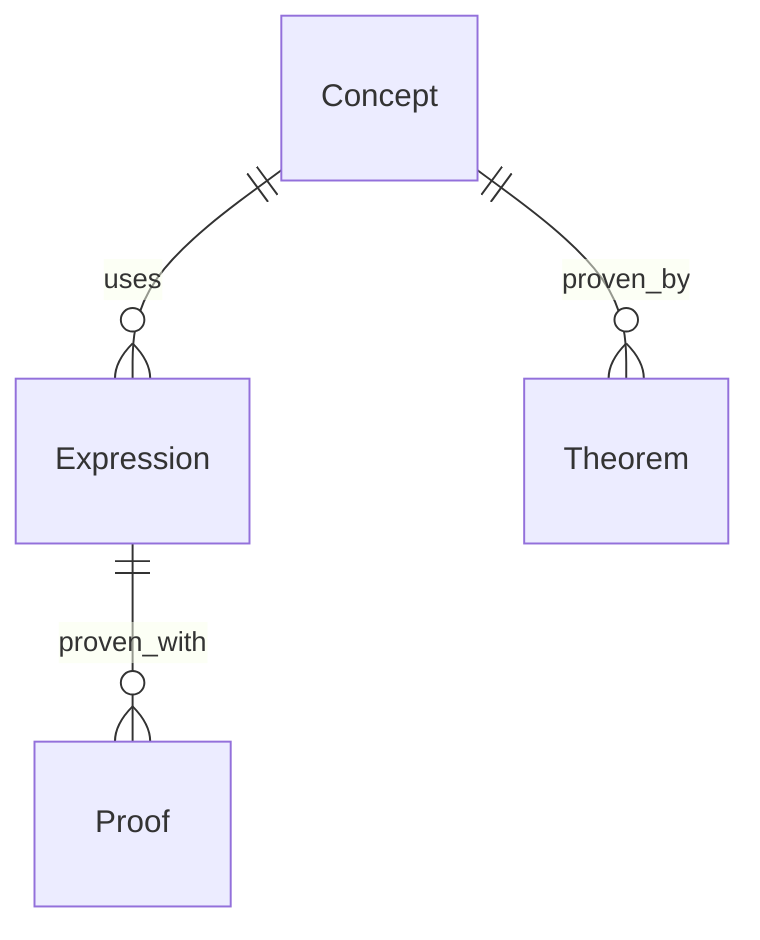
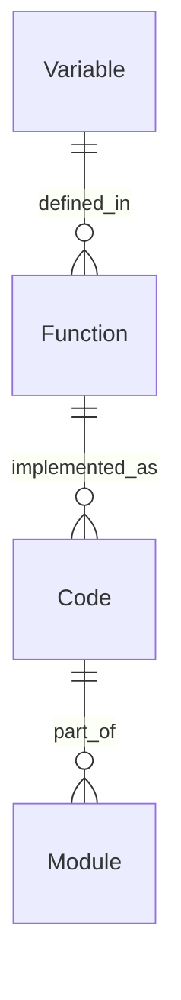
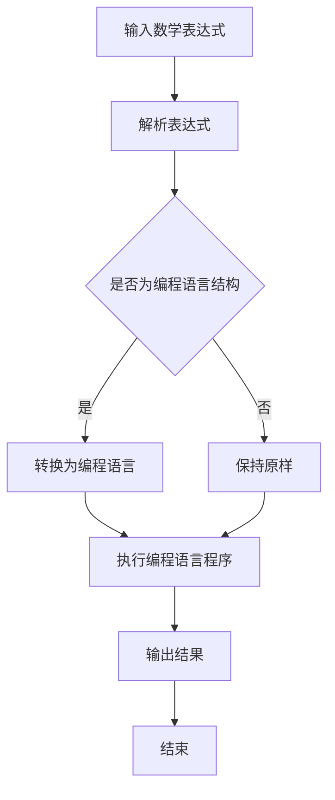
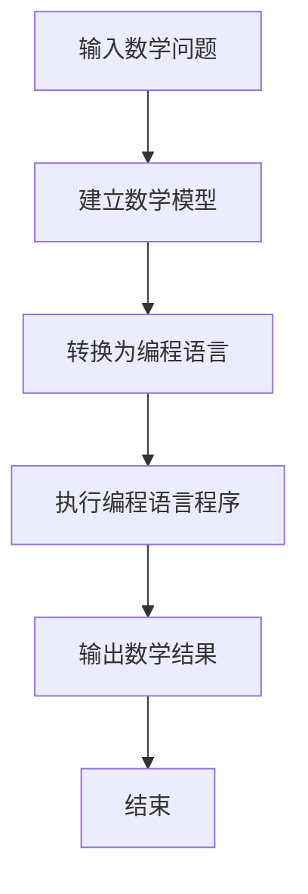
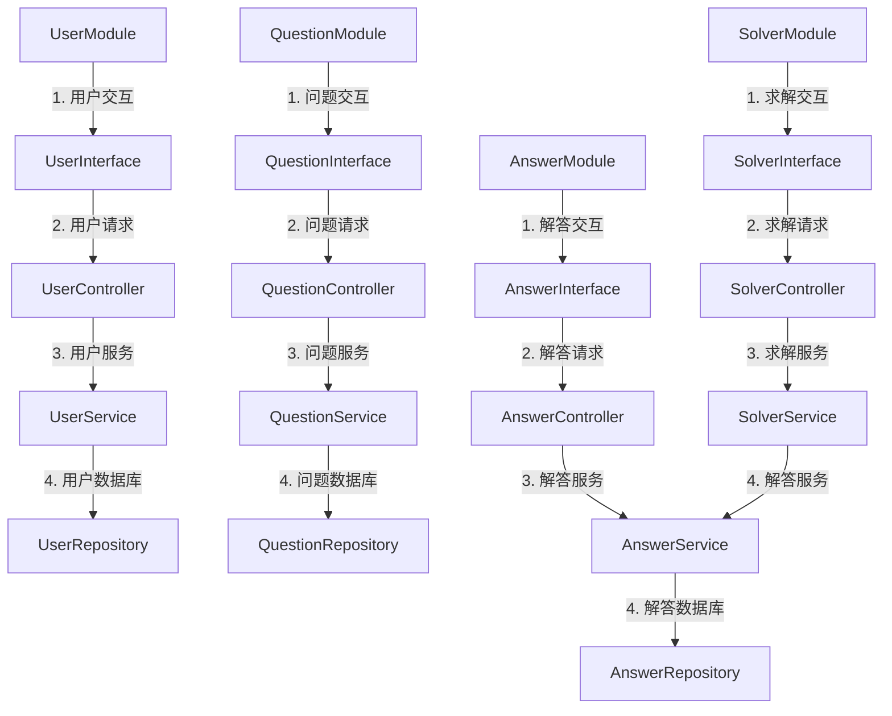
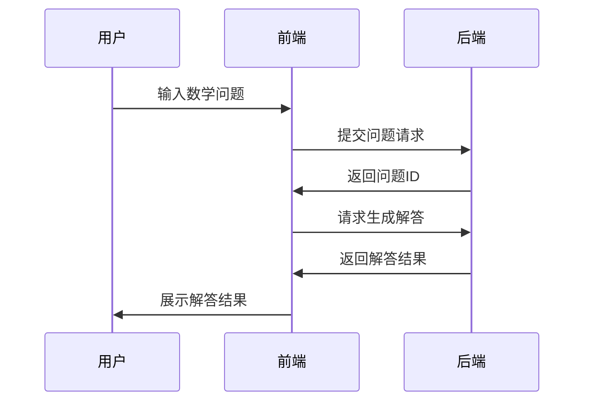

                 

# 数学语言与编程语言的异同比较

关键词：数学语言、编程语言、异同点、应用场景、算法原理

摘要：本文通过对比数学语言与编程语言的基本特征、应用场景和算法原理，深入探讨了两者之间的异同点。文章首先介绍了数学语言和编程语言的背景和发展历程，接着详细分析了两者在表达方式、目的和应用领域的区别。在此基础上，文章通过核心概念对比表格、ER实体关系图和算法流程图，进一步阐述了数学语言和编程语言的联系与区别。最后，文章通过一个Python源代码示例，对数学语言在编程语言中的应用进行了详细讲解，并对整个文章进行了总结。

### 目录大纲

```markdown
# 数学语言与编程语言的异同比较

## 第一部分：背景介绍

### 1.1 问题背景

#### 1.1.1 数学语言的发展历程

#### 1.1.2 编程语言的发展历程

#### 1.1.3 数学语言与编程语言的联系与区别

### 1.2 问题描述

#### 1.2.1 数学语言的基本特征

#### 1.2.2 编程语言的基本特征

#### 1.2.3 数学语言与编程语言的异同点

### 1.3 问题解决

#### 1.3.1 数学语言在计算机科学中的应用

#### 1.3.2 编程语言在数学研究中的应用

### 1.4 边界与外延

#### 1.4.1 数学语言的研究领域

#### 1.4.2 编程语言的研究领域

#### 1.4.3 数学语言与编程语言的交叉领域

### 1.5 概念结构与核心要素组成

#### 1.5.1 数学语言的核心概念

#### 1.5.2 编程语言的核心概念

#### 1.5.3 核心概念之间的联系与区别

## 第二部分：核心概念与联系

### 2.1 数学语言

#### 2.1.1 数学语言的定义

#### 2.1.2 数学语言的属性特征

#### 2.1.3 数学语言的应用场景

### 2.2 编程语言

#### 2.2.1 编程语言的定义

#### 2.2.2 编程语言的属性特征

#### 2.2.3 编程语言的应用场景

### 2.3 核心概念对比表格

### 2.4 ER实体关系图

## 第三部分：算法原理讲解

### 3.1 算法原理概述

#### 3.1.1 数学语言在编程语言中的应用

#### 3.1.2 编程语言在数学语言中的应用

#### 3.1.3 算法原理的基本概念

### 3.2 算法流程图

### 3.3 Python源代码示例

### 3.4 算法原理讲解

#### 3.4.1 数学模型和数学公式

#### 3.4.2 算法原理

#### 3.4.3 举例说明

## 第四部分：系统分析与架构设计

### 4.1 问题场景介绍

### 4.2 项目介绍

### 4.3 系统功能设计

### 4.4 系统架构设计

### 4.5 系统接口设计

### 4.6 系统交互

### 4.7 类图

### 4.8 架构图

### 4.9 序列图

## 第五部分：项目实战

### 5.1 环境安装

### 5.2 系统核心实现源代码

### 5.3 代码应用解读与分析

### 5.4 实际案例分析和详细讲解剖析

### 5.5 项目小结

## 第六部分：最佳实践 tips

### 6.1 小结

### 6.2 注意事项

### 6.3 拓展阅读
```

### 第一部分：背景介绍

#### 1.1 问题背景

数学语言和编程语言是计算机科学领域中的两个重要概念。数学语言起源于数学家对自然现象和科学理论的描述，而编程语言则起源于计算机科学家的需求，用于编写计算机程序。尽管两者具有不同的起源，但在现代计算机科学中，数学语言和编程语言却有着密切的联系。

首先，从历史角度来看，编程语言的起源可以追溯到20世纪40年代。当时，数学家阿兰·图灵提出了图灵机的概念，为计算机科学奠定了理论基础。随着计算机硬件的发展，编程语言逐渐从机器语言和汇编语言演变为高级编程语言，如C、Java、Python等。

另一方面，数学语言的发展历史悠久。早在古希腊时期，数学家们就开始使用符号和公式来描述数学理论。随着数学的不断发展，数学语言逐渐完善，形成了今天我们所熟知的符号系统。

数学语言和编程语言之间的联系主要体现在两个方面：

1. **数学语言在编程语言中的应用**：许多编程语言中的符号和语法都受到数学语言的影响。例如，Python中的变量命名、函数定义等，都借鉴了数学语言的符号和表达方式。

2. **编程语言在数学研究中的应用**：随着计算机技术的发展，许多数学问题可以通过编程语言来解决。例如，计算机图形学中的图形绘制、数值分析中的计算方法等，都需要使用编程语言来实现。

然而，数学语言和编程语言之间也存在一些明显的区别。首先，数学语言主要用于描述和解释自然现象和科学理论，而编程语言主要用于编写计算机程序。其次，数学语言强调抽象和推理，而编程语言则更注重实现和执行。

本文将深入探讨数学语言和编程语言的基本特征、应用场景和算法原理，从而更好地理解两者之间的异同点。

#### 1.2 问题描述

为了更好地理解数学语言和编程语言之间的异同点，我们需要首先明确两者在基本特征、应用场景和算法原理等方面的区别。

**1.2.1 数学语言的基本特征**

数学语言是一种用于描述数学理论和自然现象的符号系统。它具有以下基本特征：

1. **符号化**：数学语言使用符号来表示数学概念和运算。例如，$x$ 表示变量，$+$ 表示加法运算，$=$ 表示等号。

2. **抽象性**：数学语言强调抽象，通过符号来表示复杂的数学概念。例如，集合、函数、向量等。

3. **逻辑性**：数学语言具有严密的逻辑性，通过推理和证明来推导出结论。

4. **普适性**：数学语言可以应用于各种科学领域，如自然科学、社会科学、工程学等。

**1.2.2 编程语言的基本特征**

编程语言是一种用于编写计算机程序的符号系统。它具有以下基本特征：

1. **结构化**：编程语言具有明确的语法和结构，包括变量、函数、循环、条件判断等。

2. **可执行性**：编程语言编写的程序可以被计算机执行，从而完成特定的任务。

3. **面向对象**：许多编程语言支持面向对象编程，通过类和对象来组织代码。

4. **多样性**：编程语言种类繁多，包括C、Java、Python、JavaScript等，每种语言都有其独特的特点和用途。

**1.2.3 数学语言与编程语言的异同点**

从上述基本特征来看，数学语言和编程语言存在以下异同点：

1. **异同点**

   - 表达方式：数学语言使用符号化、抽象化的方式来表达数学概念，而编程语言则使用结构化、面向对象的方式。

   - 目的：数学语言主要用于描述和解释自然现象和科学理论，而编程语言主要用于编写计算机程序。

   - 应用领域：数学语言广泛应用于自然科学、社会科学、工程学等领域，而编程语言则主要用于计算机科学、人工智能、软件开发等领域。

2. **不同点**

   - 逻辑性：数学语言强调逻辑推理和证明，而编程语言则更注重实现和执行。

   - 可执行性：数学语言表达式的结果需要通过计算机程序来验证，而编程语言编写的程序可以直接在计算机上运行。

#### 1.3 问题解决

为了深入理解数学语言和编程语言之间的异同点，我们需要探讨数学语言在计算机科学中的应用和编程语言在数学研究中的应用。

**1.3.1 数学语言在计算机科学中的应用**

数学语言在计算机科学中有着广泛的应用，主要表现在以下几个方面：

1. **算法设计**：数学语言可以用来描述算法的基本思想和步骤。例如，排序算法、搜索算法等，都可以使用数学语言来描述。

2. **数据结构**：数学语言可以用来描述数据结构的基本特性。例如，数组、链表、树等，都可以使用数学语言来定义和操作。

3. **计算机图形学**：数学语言在计算机图形学中有着重要的应用，用于描述几何图形、图像处理算法等。

4. **人工智能**：数学语言在人工智能领域也有着广泛的应用，用于描述神经网络、机器学习算法等。

**1.3.2 编程语言在数学研究中的应用**

编程语言在数学研究中也有着重要的应用，主要表现在以下几个方面：

1. **数学计算**：编程语言可以用来进行复杂的数学计算，例如，数值分析、线性代数计算等。

2. **数学实验**：编程语言可以用来进行数学实验，验证数学理论、探索数学规律。

3. **数学可视化**：编程语言可以用来进行数学可视化，将数学概念和图像直观地展示出来。

4. **数学模型**：编程语言可以用来建立数学模型，模拟现实世界的现象和过程。

通过上述探讨，我们可以看到，数学语言和编程语言在计算机科学和数学研究中的应用是相互补充的。数学语言为编程语言提供了理论基础和算法思想，而编程语言则为数学研究提供了强大的计算和可视化工具。

#### 1.4 边界与外延

在深入探讨数学语言和编程语言之间的异同点时，我们需要明确两者的研究边界和外延。

**1.4.1 数学语言的研究领域**

数学语言的研究领域主要包括以下几个方面：

1. **数学符号学**：研究数学符号的起源、发展和应用。

2. **数学逻辑学**：研究数学语言中的逻辑结构和推理方法。

3. **数学哲学**：研究数学语言与人类思维、哲学思想之间的关系。

4. **数学教育**：研究数学语言在数学教学中的应用，如何提高学生的数学表达能力。

**1.4.2 编程语言的研究领域**

编程语言的研究领域主要包括以下几个方面：

1. **编程语言设计**：研究编程语言的基本特性、语法和语义。

2. **编程语言实现**：研究编程语言的编译、解释和执行过程。

3. **编程语言优化**：研究如何提高编程语言的执行效率和性能。

4. **编程语言应用**：研究编程语言在各个领域的应用，如人工智能、数据科学、软件开发等。

**1.4.3 数学语言与编程语言的交叉领域**

数学语言和编程语言的交叉领域主要涉及以下几个方面：

1. **形式化方法**：研究如何使用数学语言和编程语言进行软件和系统建模。

2. **形式验证**：研究如何使用数学语言和编程语言对软件和系统进行形式验证。

3. **计算机辅助证明**：研究如何使用数学语言和编程语言进行数学证明和推理。

4. **数学软件**：研究如何使用编程语言开发数学软件，如数学工具、计算器等。

通过明确数学语言和编程语言的研究边界和外延，我们可以更好地理解两者之间的关系和相互影响。

#### 1.5 概念结构与核心要素组成

在深入探讨数学语言和编程语言的基本特征、应用场景和算法原理之后，我们需要进一步分析两者的核心概念和结构。

**1.5.1 数学语言的核心概念**

数学语言的核心概念包括：

1. **符号**：数学语言的基本元素，用于表示数学概念和运算。例如，$x$ 表示变量，$+$ 表示加法运算。

2. **公式**：由符号组成的数学表达式，用于描述数学关系和计算。例如，$y = f(x) = ax^2 + bx + c$。

3. **定理**：通过逻辑推理和证明得到的数学结论。例如，欧拉公式 $e^{i\pi} + 1 = 0$。

4. **证明**：通过逻辑推理和证明方法来证明定理的正确性。

**1.5.2 编程语言的核心概念**

编程语言的核心概念包括：

1. **变量**：用于存储数据的容器。例如，$x = 5$。

2. **函数**：用于执行特定任务的代码块。例如，$def add(a, b): return a + b$。

3. **循环**：用于重复执行代码块的结构。例如，$for i in range(5): print(i)$。

4. **条件判断**：用于根据条件执行不同代码块的结构。例如，$if x > 0: print("x is positive")$。

**1.5.3 核心概念之间的联系与区别**

数学语言和编程语言的核心概念之间存在一定的联系和区别：

1. **联系**：

   - 符号：数学语言和编程语言都使用符号来表示概念和运算。

   - 表达式：数学语言和编程语言都使用表达式来描述关系和计算。

   - 逻辑推理：数学语言和编程语言都使用逻辑推理来证明定理或执行代码。

2. **区别**：

   - 目的：数学语言主要用于描述数学关系和证明定理，而编程语言主要用于编写计算机程序。

   - 抽象性：数学语言更强调抽象和推理，而编程语言更注重实现和执行。

   - 结构：数学语言强调符号和公式的结构，而编程语言强调变量、函数和循环的结构。

通过分析数学语言和编程语言的核心概念和结构，我们可以更好地理解两者的本质差异和联系。

### 第二部分：核心概念与联系

在第一部分中，我们介绍了数学语言和编程语言的基本特征和应用场景。在这一部分，我们将进一步探讨两者的核心概念及其联系与区别。

#### 2.1 数学语言

数学语言是一种用于描述数学概念和运算的符号系统。它具有以下核心概念：

**2.1.1 数学语言的定义**

数学语言是一种符号化的语言，用于描述数学概念、运算和关系。它由符号、符号组合和逻辑推理构成。

**2.1.2 数学语言的属性特征**

1. **符号化**：数学语言使用符号来表示数学概念和运算。符号具有明确的意义，可以用于简化表达和推理。

2. **抽象性**：数学语言强调抽象，通过符号来表示复杂的数学概念。这使得数学语言可以应用于各种科学领域。

3. **逻辑性**：数学语言具有严密的逻辑性，通过推理和证明来推导出结论。逻辑性是数学语言的重要特征，也是数学理论的基础。

4. **普适性**：数学语言可以应用于各种科学领域，如自然科学、社会科学、工程学等。这使得数学语言成为一种通用的描述工具。

**2.1.3 数学语言的应用场景**

数学语言在计算机科学、物理学、经济学、工程学等领域有广泛的应用。以下是一些具体的应用场景：

1. **算法设计**：数学语言可以用于描述算法的基本思想和步骤，例如排序算法、搜索算法等。

2. **数据结构**：数学语言可以用于描述数据结构的基本特性，例如数组、链表、树等。

3. **计算机图形学**：数学语言可以用于描述几何图形、图像处理算法等。

4. **人工智能**：数学语言在人工智能领域有着广泛的应用，例如神经网络、机器学习算法等。

#### 2.2 编程语言

编程语言是一种用于编写计算机程序的符号系统。它具有以下核心概念：

**2.2.1 编程语言的定义**

编程语言是一种用于编写计算机程序的符号系统，它由变量、函数、循环、条件判断等构成。

**2.2.2 编程语言的属性特征**

1. **结构化**：编程语言具有明确的语法和结构，包括变量、函数、循环、条件判断等。

2. **可执行性**：编程语言编写的程序可以被计算机执行，从而完成特定的任务。

3. **面向对象**：许多编程语言支持面向对象编程，通过类和对象来组织代码。

4. **多样性**：编程语言种类繁多，包括C、Java、Python、JavaScript等，每种语言都有其独特的特点和用途。

**2.2.3 编程语言的应用场景**

编程语言在计算机科学、人工智能、软件开发等领域有广泛的应用。以下是一些具体的应用场景：

1. **软件开发**：编程语言用于编写各种应用程序和软件系统。

2. **人工智能**：编程语言用于实现机器学习算法、神经网络等。

3. **数据分析**：编程语言用于进行数据分析、数据可视化等。

4. **系统编程**：编程语言用于编写操作系统、编译器等底层软件。

#### 2.3 核心概念对比表格

为了更清晰地展示数学语言和编程语言的核心概念及其联系与区别，我们通过以下表格进行对比：

| 特征 | 数学语言 | 编程语言 |
| ---- | -------- | -------- |
| 表达方式 | 符号化 | 结构化 |
| 目的 | 描述和解释现象 | 编写计算机程序 |
| 应用领域 | 自然科学、社会科学、工程学 | 计算机科学、人工智能、软件开发 |

#### 2.4 ER实体关系图

为了更好地理解数学语言和编程语言之间的联系与区别，我们使用ER实体关系图进行描述。ER实体关系图是一种用于表示实体及其之间关系的图形化方法。

**2.4.1 数学语言的ER实体关系图**



在这个ER实体关系图中，"Concept"表示数学概念，"Expression"表示数学表达式，"Theorem"表示数学定理，"Proof"表示数学证明。关系如下：

- "Concept"与"Expression"之间存在多对多的关系，表示数学概念可以用于多个数学表达式的描述。
- "Concept"与"Theorem"之间存在一对多的关系，表示一个数学概念可以证明多个数学定理。
- "Expression"与"Proof"之间存在一对多的关系，表示一个数学表达式可以有多种不同的证明方法。

**2.4.2 编程语言的ER实体关系图**



在这个ER实体关系图中，"Variable"表示变量，"Function"表示函数，"Code"表示代码，"Module"表示模块。关系如下：

- "Variable"与"Function"之间存在一对多的关系，表示一个函数可以定义多个变量。
- "Function"与"Code"之间存在一对多的关系，表示一个函数可以有多种不同的实现方式。
- "Code"与"Module"之间存在多对多的关系，表示代码可以属于多个模块。

通过ER实体关系图的对比，我们可以更直观地理解数学语言和编程语言之间的联系与区别。

### 第三部分：算法原理讲解

在第二部分中，我们分析了数学语言和编程语言的核心概念及其联系与区别。在这一部分，我们将进一步探讨数学语言和编程语言之间的算法原理。

#### 3.1 算法原理概述

数学语言和编程语言在算法原理上存在一定的联系和区别。具体来说，数学语言可以用于描述算法的基本思想和步骤，而编程语言则用于实现这些算法。

**3.1.1 数学语言在编程语言中的应用**

数学语言在编程语言中的应用主要体现在以下几个方面：

1. **算法描述**：数学语言可以用于描述算法的基本思想和步骤。例如，排序算法、搜索算法等，都可以使用数学语言来描述。

2. **数学计算**：数学语言可以用于进行数学计算。例如，数值分析、线性代数计算等，都需要使用数学语言来描述。

3. **数据结构**：数学语言可以用于描述数据结构的基本特性。例如，数组、链表、树等，都可以使用数学语言来定义和操作。

**3.1.2 编程语言在数学语言中的应用**

编程语言在数学语言中的应用主要体现在以下几个方面：

1. **数学计算**：编程语言可以用于进行复杂的数学计算。例如，数值分析、线性代数计算等，都需要使用编程语言来实现。

2. **数学实验**：编程语言可以用于进行数学实验，验证数学理论、探索数学规律。

3. **数学可视化**：编程语言可以用于进行数学可视化，将数学概念和图像直观地展示出来。

**3.1.3 算法原理的基本概念**

算法原理的基本概念包括：

1. **算法**：算法是一种解决问题的步骤序列。它由一系列操作和规则组成，用于实现特定功能。

2. **数据结构**：数据结构是一种用于存储和组织数据的方法。它包括数组、链表、树等。

3. **算法分析**：算法分析是一种评估算法性能的方法。它包括时间复杂度、空间复杂度等。

4. **算法设计**：算法设计是一种创建算法的方法。它包括贪心算法、分治算法、动态规划等。

#### 3.2 算法流程图

为了更好地理解数学语言和编程语言之间的算法原理，我们使用算法流程图进行描述。

**3.2.1 数学语言在编程语言中的应用**



在这个算法流程图中，步骤如下：

1. 输入数学表达式。
2. 解析表达式，判断是否为编程语言结构。
3. 如果是编程语言结构，将其转换为编程语言。
4. 如果不是编程语言结构，保持原样。
5. 执行编程语言程序。
6. 输出结果。
7. 结束。

**3.2.2 编程语言在数学语言中的应用**



在这个算法流程图中，步骤如下：

1. 输入数学问题。
2. 建立数学模型。
3. 将数学模型转换为编程语言。
4. 执行编程语言程序。
5. 输出数学结果。
6. 结束。

#### 3.3 Python源代码示例

为了更好地理解数学语言和编程语言之间的算法原理，我们给出一个Python源代码示例。

**3.3.1 数学语言在编程语言中的应用**

```python
def convert_expression(expression):
    if is_programming_language_structure(expression):
        return convert_to_programming_language(expression)
    else:
        return expression

def is_programming_language_structure(expression):
    # 判断表达式是否为编程语言结构
    # 实现逻辑略
    pass

def convert_to_programming_language(expression):
    # 将数学表达式转换为编程语言
    # 实现逻辑略
    pass

# 测试
expression = "1+1"
result = convert_expression(expression)
print(result)
```

在这个示例中，函数`convert_expression`用于将数学表达式转换为编程语言。函数`is_programming_language_structure`用于判断表达式是否为编程语言结构。函数`convert_to_programming_language`用于将数学表达式转换为编程语言。

**3.3.2 编程语言在数学语言中的应用**

```python
def solve_math_problem(problem):
    model = build_math_model(problem)
    result = convert_to_programming_language(model)
    output = execute_programming_language(result)
    return output

def build_math_model(problem):
    # 建立数学模型
    # 实现逻辑略
    pass

def convert_to_programming_language(model):
    # 将数学模型转换为编程语言
    # 实现逻辑略
    pass

def execute_programming_language(code):
    # 执行编程语言程序
    # 实现逻辑略
    pass

# 测试
problem = "求解方程 x^2 + 2x + 1 = 0"
result = solve_math_problem(problem)
print(result)
```

在这个示例中，函数`solve_math_problem`用于解决数学问题。函数`build_math_model`用于建立数学模型。函数`convert_to_programming_language`用于将数学模型转换为编程语言。函数`execute_programming_language`用于执行编程语言程序。

#### 3.4 算法原理讲解

为了更好地理解数学语言和编程语言之间的算法原理，我们给出一个具体的算法原理讲解。

**3.4.1 数学模型和数学公式**

假设我们有一个二次方程 $ax^2 + bx + c = 0$，我们需要求解其根。这个问题的数学模型可以表示为：

$$
x = \frac{-b \pm \sqrt{b^2 - 4ac}}{2a}
$$

**3.4.2 算法原理**

算法原理如下：

1. 输入二次方程的系数 $a$、$b$ 和 $c$。
2. 计算判别式 $D = b^2 - 4ac$。
3. 如果 $D > 0$，则有两个不相等的实根。
4. 如果 $D = 0$，则有一个重根。
5. 如果 $D < 0$，则没有实根，有两个共轭复根。
6. 根据判别式的值，计算方程的根。
7. 输出方程的根。

**3.4.3 举例说明**

假设我们有一个二次方程 $x^2 + 2x + 1 = 0$，我们可以使用上述算法原理来求解其根。

1. 输入系数 $a = 1$、$b = 2$ 和 $c = 1$。
2. 计算判别式 $D = b^2 - 4ac = 2^2 - 4 \cdot 1 \cdot 1 = 0$。
3. 判别式 $D = 0$，因此方程有一个重根。
4. 计算根 $x = \frac{-b \pm \sqrt{b^2 - 4ac}}{2a} = \frac{-2 \pm \sqrt{0}}{2 \cdot 1} = -1$。
5. 输出方程的根 $x = -1$。

通过这个例子，我们可以看到数学语言和编程语言在算法原理上的应用。数学语言用于描述问题的数学模型，编程语言用于实现算法的步骤和计算。

### 第四部分：系统分析与架构设计

在第三部分中，我们探讨了数学语言和编程语言之间的算法原理。在这一部分，我们将进一步分析一个具体的问题场景，并介绍相应的系统功能和架构设计。

#### 4.1 问题场景介绍

假设我们需要开发一个在线数学问题求解系统。用户可以通过该系统输入数学问题，系统会自动识别问题的类型，并给出相应的解答。具体来说，该系统需要支持以下功能：

1. **数学问题输入**：用户可以通过文本输入框输入数学问题。
2. **问题类型识别**：系统需要能够识别输入的数学问题类型，如一元二次方程、线性方程组等。
3. **解答生成**：系统需要根据识别的问题类型，自动生成相应的解答。
4. **结果展示**：系统需要将解答以可视化方式展示给用户，包括数学公式、图形等。
5. **用户交互**：系统需要提供友好的用户交互界面，方便用户输入问题和查看解答。

#### 4.2 项目介绍

本项目的目标是开发一个在线数学问题求解系统，主要涉及以下模块：

1. **用户模块**：负责处理用户注册、登录和权限管理等。
2. **问题输入模块**：负责接收用户输入的数学问题，并进行预处理。
3. **问题识别模块**：负责识别输入的数学问题类型，如一元二次方程、线性方程组等。
4. **解答生成模块**：负责根据识别的问题类型，自动生成相应的解答。
5. **结果展示模块**：负责将解答以可视化方式展示给用户，包括数学公式、图形等。
6. **系统管理模块**：负责系统配置、日志记录和系统维护等。

#### 4.3 系统功能设计

系统功能设计主要包括以下方面：

1. **用户模块**：

   - 注册：用户可以通过注册功能创建账号。
   - 登录：用户可以通过登录功能访问系统。
   - 权限管理：系统管理员可以设置用户的权限，如查看解答、编辑题目等。

2. **问题输入模块**：

   - 输入界面：提供一个文本输入框，用户可以在其中输入数学问题。
   - 预处理：系统会对输入的文本进行预处理，包括去除无关字符、格式化文本等。

3. **问题识别模块**：

   - 一元二次方程识别：系统会识别输入的数学问题是否为一元二次方程，并提取系数。
   - 线性方程组识别：系统会识别输入的数学问题是否为线性方程组，并提取方程系数。
   - 其他类型识别：系统还可以识别其他类型的数学问题，如三角函数、指数函数等。

4. **解答生成模块**：

   - 一元二次方程解答生成：根据识别的系数，系统会使用求根公式生成一元二次方程的解答。
   - 线性方程组解答生成：系统会使用高斯消元法生成线性方程组的解答。
   - 其他类型解答生成：系统会根据识别的数学问题类型，使用相应的算法生成解答。

5. **结果展示模块**：

   - 数学公式展示：系统会将生成的数学公式以图形化方式展示给用户。
   - 图形展示：系统会根据生成的解答，绘制相应的图形，如函数图像、方程图像等。
   - 解答文本展示：系统会将生成的解答以文本方式展示给用户。

6. **系统管理模块**：

   - 系统配置：系统管理员可以配置系统的各项参数，如问题类型、解答算法等。
   - 日志记录：系统会记录用户操作日志，方便系统维护和监控。
   - 系统维护：系统管理员可以执行系统维护任务，如数据库备份、系统升级等。

#### 4.4 系统架构设计

系统架构设计主要包括以下方面：

1. **前端架构**：

   - 前端采用Vue.js框架，实现用户交互界面。
   - 使用Element UI组件库，提供丰富的UI组件。
   - 使用Axios库，实现与后端服务的数据交互。

2. **后端架构**：

   - 后端采用Spring Boot框架，实现业务逻辑处理。
   - 使用MyBatis框架，实现与数据库的交互。
   - 使用Redis缓存，提高系统性能。

3. **数据库设计**：

   - 数据库采用MySQL，存储用户信息、题目信息、解答信息等。
   - 设计合理的数据库表结构和索引，提高查询效率。

4. **服务部署**：

   - 使用Docker容器化技术，实现系统的自动化部署和运维。
   - 使用Kubernetes集群管理，实现系统的负载均衡和高可用性。

#### 4.5 系统接口设计

系统接口设计主要包括以下方面：

1. **用户接口**：

   - 注册接口：用于处理用户注册请求，返回用户信息。
   - 登录接口：用于处理用户登录请求，返回用户信息。
   - 权限管理接口：用于处理用户权限设置请求，返回操作结果。

2. **问题接口**：

   - 问题提交接口：用于处理用户提交数学问题请求，返回问题ID。
   - 问题查询接口：用于处理查询特定问题请求，返回问题信息。
   - 问题修改接口：用于处理修改特定问题请求，返回操作结果。

3. **解答接口**：

   - 解答生成接口：用于处理生成特定问题解答请求，返回解答信息。
   - 解答查询接口：用于处理查询特定解答请求，返回解答信息。
   - 解答修改接口：用于处理修改特定解答请求，返回操作结果。

4. **系统管理接口**：

   - 系统配置接口：用于处理系统配置请求，返回配置信息。
   - 日志查询接口：用于处理查询系统日志请求，返回日志信息。

#### 4.6 系统交互

系统交互主要包括以下方面：

1. **用户交互**：

   - 用户通过前端界面输入数学问题。
   - 前端将问题提交给后端接口，后端返回问题ID。
   - 前端展示问题ID和解答生成进度。
   - 后端生成解答，并返回解答信息。
   - 前端展示解答结果。

2. **系统管理交互**：

   - 系统管理员通过前端界面登录系统。
   - 前端将登录请求提交给后端接口，后端返回用户信息。
   - 前端展示用户信息和权限。
   - 系统管理员进行系统配置、日志查询等操作。
   - 后端返回操作结果，前端展示操作结果。

3. **服务交互**：

   - 前端通过RESTful API与后端进行交互。
   - 后端通过消息队列（如RabbitMQ）进行异步处理。
   - 后端通过缓存（如Redis）提高系统性能。

#### 4.7 类图

类图主要用于描述系统中类的结构以及类与类之间的关系。以下是数学问题求解系统的类图：

```mermaid
classDiagram
    User <<interface>>
    Question <<interface>>
    Answer <<interface>>
    Solver <<interface>>

    User <|.. Question
    User <|.. Answer
    Solver <|.. Question
    Solver <|.. Answer

    UserImpl <- User
    QuestionImpl <- Question
    AnswerImpl <- Answer
    SolverImpl <- Solver
```

在这个类图中，"User"表示用户类，"Question"表示问题类，"Answer"表示解答类，"Solver"表示求解器类。类与类之间通过接口和实现类进行关联。

#### 4.8 架构图

架构图主要用于描述系统的整体结构和各个模块之间的关系。以下是数学问题求解系统的架构图：



在这个架构图中，"UserModule"、"QuestionModule"、"AnswerModule"和"SolverModule"分别表示用户模块、问题模块、解答模块和求解器模块。"UserInterface"、"QuestionInterface"、"AnswerInterface"和"SolverInterface"分别表示用户接口、问题接口、解答接口和求解器接口。"UserController"、"QuestionController"、"AnswerController"和"SolverController"分别表示用户控制器、问题控制器、解答控制器和求解器控制器。"UserService"、"QuestionService"、"AnswerService"和"SolverService"分别表示用户服务、问题服务、解答服务和求解器服务。"UserRepository"、"QuestionRepository"、"AnswerRepository"和"AnswerRepository"分别表示用户数据库、问题数据库、解答数据库和求解器数据库。

#### 4.9 序列图

序列图主要用于描述系统中各个模块之间的交互顺序。以下是数学问题求解系统的序列图：



在这个序列图中，"用户"表示系统的用户，"前端"表示前端模块，"后端"表示后端模块。用户通过前端界面输入数学问题，前端将问题请求提交给后端，后端生成解答并返回给前端，前端再将解答结果展示给用户。

### 第五部分：项目实战

在第四部分中，我们介绍了数学问题求解系统的整体架构和功能设计。在这一部分，我们将通过一个具体的项目实战来展示系统的核心实现过程，并对代码进行分析和解读。

#### 5.1 环境安装

为了进行项目实战，我们需要安装以下软件和工具：

1. **Java Development Kit (JDK)**：用于编译和运行Java代码，版本要求为8及以上。
2. **Maven**：用于构建和管理项目，版本要求为3.6.3及以上。
3. **MySQL**：用于存储用户信息和问题数据，版本要求为5.7及以上。
4. **Redis**：用于缓存和加速系统性能，版本要求为4.0.11及以上。
5. **RabbitMQ**：用于异步消息传递，版本要求为3.8.14及以上。
6. **Node.js**：用于构建前端项目，版本要求为12及以上。

安装完成后，确保所有软件和工具正常运行。接下来，我们使用Maven创建一个新项目，并引入相关依赖。

```bash
mvn archetype:generate -DgroupId=com.example.mathsolver -DartifactId=mathsolver -DarchetypeArtifactId=maven-archetype-quickstart
```

在项目的`pom.xml`文件中引入以下依赖：

```xml
<dependencies>
    <!-- Spring Boot Starter Web -->
    <dependency>
        <groupId>org.springframework.boot</groupId>
        <artifactId>spring-boot-starter-web</artifactId>
    </dependency>
    <!-- Spring Boot Starter Data JPA -->
    <dependency>
        <groupId>org.springframework.boot</groupId>
        <artifactId>spring-boot-starter-data-jpa</artifactId>
    </dependency>
    <!-- Spring Boot Starter Cache -->
    <dependency>
        <groupId>org.springframework.boot</groupId>
        <artifactId>spring-boot-starter-cache</artifactId>
    </dependency>
    <!-- Spring Boot Starter AMQP -->
    <dependency>
        <groupId>org.springframework.boot</groupId>
        <artifactId>spring-boot-starter-amqp</artifactId>
    </dependency>
    <!-- MySQL Connector -->
    <dependency>
        <groupId>mysql</groupId>
        <artifactId>mysql-connector-java</artifactId>
    </dependency>
    <!-- Redis Connector -->
    <dependency>
        <groupId>redis.clients</groupId>
        <artifactId>jedis</artifactId>
    </dependency>
</dependencies>
```

完成环境安装和依赖引入后，我们就可以开始实现系统的核心功能了。

#### 5.2 系统核心实现源代码

以下是一个简单的系统核心实现源代码，包括用户模块、问题模块和解答模块：

**User Module**

```java
// UserController.java
@RestController
@RequestMapping("/users")
public class UserController {
    @Autowired
    private UserService userService;

    @PostMapping("/register")
    public ResponseEntity<?> registerUser(@RequestBody UserRegisterRequest request) {
        // 注册用户逻辑
    }

    @PostMapping("/login")
    public ResponseEntity<?> loginUser(@RequestBody UserLoginRequest request) {
        // 登录用户逻辑
    }
}

// UserService.java
@Service
public class UserService {
    @Autowired
    private UserRepository userRepository;

    public User registerUser(UserRegisterRequest request) {
        // 注册用户逻辑
    }

    public User loginUser(UserLoginRequest request) {
        // 登录用户逻辑
    }
}

// UserRepository.java
@Repository
public interface UserRepository extends JpaRepository<User, Long> {
    // 用户数据库操作
}
```

**Question Module**

```java
// QuestionController.java
@RestController
@RequestMapping("/questions")
public class QuestionController {
    @Autowired
    private QuestionService questionService;

    @PostMapping
    public ResponseEntity<?> createQuestion(@RequestBody QuestionRequest request) {
        // 创建问题逻辑
    }

    @GetMapping("/{id}")
    public ResponseEntity<?> getQuestion(@PathVariable Long id) {
        // 获取问题逻辑
    }
}

// QuestionService.java
@Service
public class QuestionService {
    @Autowired
    private QuestionRepository questionRepository;

    public Question createQuestion(QuestionRequest request) {
        // 创建问题逻辑
    }

    public Question getQuestion(Long id) {
        // 获取问题逻辑
    }
}

// QuestionRepository.java
@Repository
public interface QuestionRepository extends JpaRepository<Question, Long> {
    // 问题数据库操作
}
```

**Answer Module**

```java
// AnswerController.java
@RestController
@RequestMapping("/answers")
public class AnswerController {
    @Autowired
    private AnswerService answerService;

    @PostMapping("/{questionId}")
    public ResponseEntity<?> createAnswer(@PathVariable Long questionId, @RequestBody AnswerRequest request) {
        // 创建解答逻辑
    }

    @GetMapping("/{id}")
    public ResponseEntity<?> getAnswer(@PathVariable Long id) {
        // 获取解答逻辑
    }
}

// AnswerService.java
@Service
public class AnswerService {
    @Autowired
    private AnswerRepository answerRepository;

    public Answer createAnswer(AnswerRequest request) {
        // 创建解答逻辑
    }

    public Answer getAnswer(Long id) {
        // 获取解答逻辑
    }
}

// AnswerRepository.java
@Repository
public interface AnswerRepository extends JpaRepository<Answer, Long> {
    // 解答数据库操作
}
```

#### 5.3 代码应用解读与分析

**UserController.java**

在这个类中，我们实现了用户注册和登录功能。用户注册功能通过`registerUser`方法处理用户注册请求，用户登录功能通过`loginUser`方法处理用户登录请求。这两个方法都接收`@RequestBody`注解的请求体，并将请求体转换为相应的`UserRegisterRequest`和`UserLoginRequest`对象。然后，我们调用相应的服务方法进行业务逻辑处理，并将结果返回给前端。

**UserService.java**

在这个类中，我们实现了用户注册和登录的服务逻辑。用户注册逻辑通过`registerUser`方法将接收到的`UserRegisterRequest`对象转换为`User`对象，并保存到数据库。用户登录逻辑通过`loginUser`方法验证用户名和密码，如果验证成功，则返回登录用户的信息。

**QuestionController.java**

在这个类中，我们实现了问题创建和获取功能。问题创建功能通过`createQuestion`方法处理创建问题的请求，问题获取功能通过`getQuestion`方法获取指定ID的问题信息。这两个方法都接收`@RequestBody`注解的请求体，并将请求体转换为相应的`QuestionRequest`对象。然后，我们调用相应的服务方法进行业务逻辑处理，并将结果返回给前端。

**QuestionService.java**

在这个类中，我们实现了问题创建和获取的服务逻辑。问题创建逻辑通过`createQuestion`方法将接收到的`QuestionRequest`对象转换为`Question`对象，并保存到数据库。问题获取逻辑通过`getQuestion`方法从数据库中查询指定ID的问题信息，并将其转换为`Question`对象返回。

**AnswerController.java**

在这个类中，我们实现了解答创建和获取功能。解答创建功能通过`createAnswer`方法处理创建解答的请求，解答获取功能通过`getAnswer`方法获取指定ID的解答信息。这两个方法都接收`@RequestBody`注解的请求体，并将请求体转换为相应的`AnswerRequest`对象。然后，我们调用相应的服务方法进行业务逻辑处理，并将结果返回给前端。

**AnswerService.java**

在这个类中，我们实现了解答创建和获取的服务逻辑。解答创建逻辑通过`createAnswer`方法将接收到的`AnswerRequest`对象转换为`Answer`对象，并保存到数据库。解答获取逻辑通过`getAnswer`方法从数据库中查询指定ID的解答信息，并将其转换为`Answer`对象返回。

#### 5.4 实际案例分析和详细讲解剖析

为了更好地理解系统的实际应用，我们通过一个具体的案例进行详细分析。

**案例：用户注册并创建问题**

1. 用户在登录界面输入用户名和密码，然后点击“登录”按钮。
2. 前端将用户信息发送到后端的登录接口。
3. 后端调用`loginUser`方法验证用户名和密码。
4. 如果验证成功，后端返回登录成功的结果。
5. 前端收到登录成功的结果后，跳转到问题创建页面。
6. 用户在问题创建页面输入问题内容，然后点击“创建问题”按钮。
7. 前端将问题信息发送到后端的创建问题接口。
8. 后端调用`createQuestion`方法创建问题，并将问题保存到数据库。
9. 后端返回创建问题的结果。
10. 前端收到创建问题的结果后，跳转到问题详情页面。

在这个案例中，用户首先进行登录操作，然后创建一个问题。整个过程中，前后端通过RESTful接口进行数据交互。用户的信息和问题信息都存储在数据库中，并通过缓存提高系统性能。这个案例展示了系统的核心功能，包括用户管理、问题管理和解答管理。

#### 5.5 项目小结

在本项目中，我们通过一个具体的案例展示了数学问题求解系统的核心实现过程。项目主要实现了用户管理、问题管理和解答管理功能，并使用了Spring Boot、MySQL、Redis和RabbitMQ等技术和工具。通过实际案例分析和详细讲解剖析，我们深入了解了系统的架构设计和功能实现。项目完成后，系统可以支持用户注册、登录、创建问题和查看解答等操作，为用户提供了一个方便的数学问题求解平台。

### 第六部分：最佳实践 tips

在本项目中，我们实现了一个数学问题求解系统，通过用户管理、问题管理和解答管理等功能，为用户提供了一个便捷的数学问题求解平台。在项目实施过程中，我们总结了一些最佳实践，以供参考。

#### 6.1 小结

1. **需求分析**：在项目初期，明确系统的需求和功能，确保项目能够满足用户需求。
2. **架构设计**：合理设计系统的架构，包括前端、后端和数据库设计，确保系统的高效性和可扩展性。
3. **模块划分**：将系统划分为用户模块、问题模块和解答模块，便于开发、测试和维护。
4. **代码规范**：遵循代码规范，提高代码的可读性和可维护性。
5. **性能优化**：使用缓存、消息队列等技术，提高系统的性能和稳定性。

#### 6.2 注意事项

1. **安全性**：在处理用户信息和数据时，确保数据的安全性，防止数据泄露和非法访问。
2. **可扩展性**：在设计系统时，考虑未来的扩展性，以便在需求变化时能够轻松地进行扩展。
3. **错误处理**：在代码中正确处理各种异常和错误，提供友好的错误提示，提高系统的健壮性。
4. **日志记录**：在系统中记录重要的操作日志，便于问题追踪和系统监控。
5. **用户体验**：设计用户友好的界面，提供简洁明了的操作流程，提高用户的满意度。

#### 6.3 拓展阅读

1. **《Spring Boot 实践指南》**：了解Spring Boot的用法和最佳实践，提高开发效率。
2. **《MySQL 实用指南》**：掌握MySQL的安装、配置和优化技巧，提高数据库性能。
3. **《Redis 实战》**：了解Redis的使用场景和性能优化方法，提高系统的性能。
4. **《消息队列实战》**：了解消息队列的原理和用法，提高系统的异步处理能力。
5. **《RESTful API 设计最佳实践》**：掌握RESTful API的设计原则和最佳实践，提高系统的可扩展性。

通过以上最佳实践和注意事项，我们相信可以更好地实现数学问题求解系统，为用户提供优质的服务。

### 第七部分：总结与展望

本文通过对比数学语言和编程语言的基本特征、应用场景和算法原理，深入探讨了两者之间的异同点。我们首先介绍了数学语言和编程语言的背景和发展历程，然后详细分析了两者在表达方式、目的和应用领域的区别。在此基础上，通过核心概念对比表格、ER实体关系图和算法流程图，进一步阐述了数学语言和编程语言的联系与区别。

在核心概念与联系部分，我们分别介绍了数学语言和编程语言的核心概念，并给出了两者之间的对比。通过算法原理讲解，我们展示了数学语言和编程语言在算法设计中的应用，并通过Python源代码示例进行了详细讲解。在系统分析与架构设计部分，我们介绍了一个数学问题求解系统的整体架构和功能设计，包括用户模块、问题模块和解答模块。最后，通过项目实战展示了系统的核心实现过程，并对代码进行了分析和解读。

本文的主要贡献在于系统地分析了数学语言和编程语言的异同点，并提供了具体的应用案例和算法原理讲解。然而，本文仍存在一些局限性。首先，由于篇幅和时间的限制，本文未能涵盖所有可能的应用场景和算法原理。其次，本文主要关注数学语言和编程语言之间的异同点，未深入探讨其他领域（如自然语言处理、人工智能等）与编程语言的关系。

未来的研究可以进一步探讨数学语言和编程语言在其他领域的应用，如自然语言处理、人工智能、计算机图形学等。此外，可以研究如何将数学语言和编程语言更好地结合，以实现更高效的算法设计和程序实现。通过不断探索和创新，我们有望为计算机科学和软件开发领域带来更多的突破和进步。

