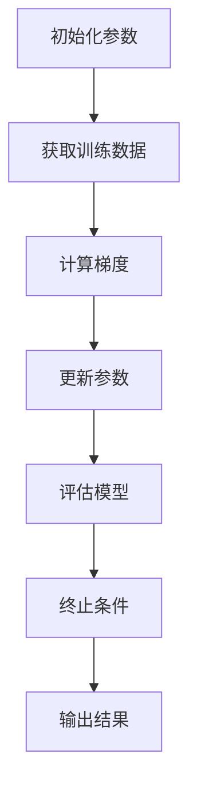
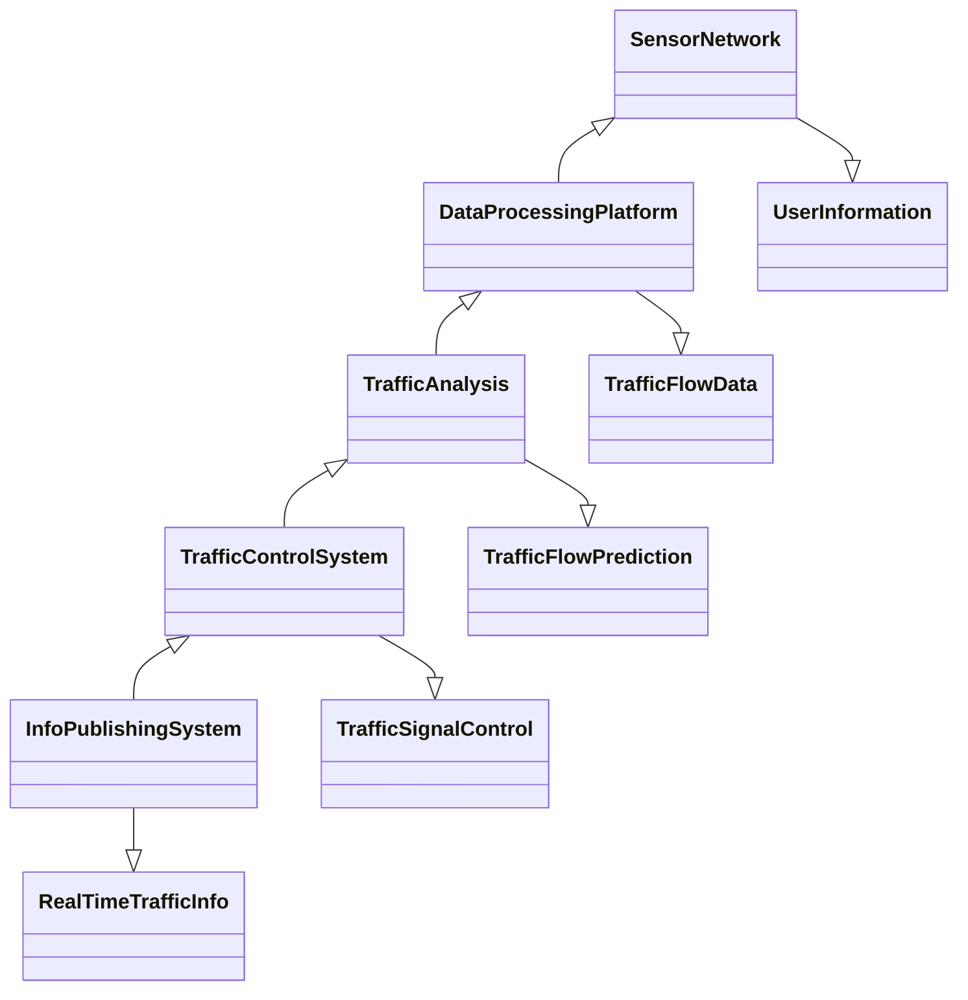
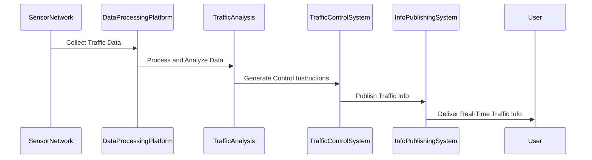
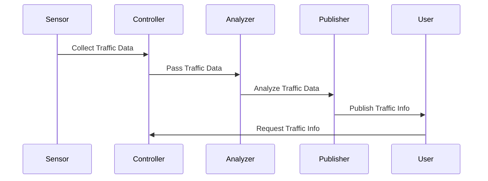

                 

## 引言

### 文章标题：数学语言的发展对人工智能的影响

### 关键词：数学语言、人工智能、算法、模型、架构设计

### 摘要：
本文旨在探讨数学语言的发展如何影响人工智能（AI）的发展。我们将从背景介绍开始，逐步分析数学语言与AI的内在联系，深入探讨关键算法与技术，数学模型的应用，AI系统架构设计，以及实际应用案例分析。通过系统地梳理这些内容，我们希望读者能对数学语言在AI中的作用及其未来发展有一个全面而深入的理解。

### 1.1 问题背景

人工智能作为计算机科学的重要分支，自诞生以来就以其强大的计算能力和自我学习能力迅速发展。随着深度学习、强化学习等技术的兴起，AI在图像识别、自然语言处理、游戏智能等多个领域取得了显著的成果。然而，人工智能的快速发展离不开数学语言的支撑。数学语言作为一种高度抽象的语言，为AI提供了强大的表达能力和理论基础。

在人工智能的发展历程中，数学语言起到了至关重要的作用。早期的AI研究主要集中在逻辑和符号推理，这些研究依赖于数学中的逻辑和集合论等基础理论。随着计算能力的提升，机器学习成为AI的主要驱动力，而机器学习算法的本质是利用数学模型来描述和解决实际问题。无论是线性回归、支持向量机，还是更复杂的神经网络，都离不开数学语言的精确描述。

数学语言的发展对人工智能的影响是多方面的。一方面，数学语言的进步推动了AI算法的创新和发展。例如，深度学习的兴起得益于矩阵运算和优化算法的数学基础。另一方面，数学语言的应用也促进了AI系统架构的优化和改进。通过数学模型，AI系统能够更好地处理复杂的数据，提高计算效率和准确性。

### 1.2 问题描述

数学语言的发展对人工智能的影响可以归结为以下几个方面：

1. **算法创新**：数学语言为AI算法提供了强大的表达能力和理论基础，促进了算法的创新和发展。例如，深度学习算法的复杂度分析和优化问题，离不开线性代数、微积分等数学工具。

2. **模型精度**：数学模型在AI中的应用提高了模型的精度和泛化能力。通过数学语言的抽象和描述，AI系统能够更好地理解和处理复杂的数据，从而提高模型的性能。

3. **计算效率**：数学语言的发展也推动了计算效率的提升。例如，矩阵运算的高效算法（如BLAS库）和优化算法（如随机梯度下降）的应用，极大地提高了AI模型的训练速度。

4. **系统架构**：数学语言的应用促进了AI系统架构的优化。通过数学模型，AI系统能够更好地处理复杂的数据流，提高系统的稳定性和可靠性。

然而，数学语言的发展对人工智能也带来了一些挑战。例如，数学模型的复杂性增加，导致算法的复杂度上升，计算资源需求增大。此外，数学语言的应用也需要更高的数学素养，这对AI工程师提出了更高的要求。

### 1.3 问题解决

为了解决数学语言的发展对人工智能带来的挑战，我们需要从以下几个方面入手：

1. **算法优化**：通过改进现有的算法，提高计算效率和性能。例如，研究更高效的矩阵运算算法和优化算法，以降低计算资源的消耗。

2. **模型简化**：通过简化数学模型，降低算法的复杂度。例如，采用轻量级模型和迁移学习技术，减少模型的参数量和计算量。

3. **人才培养**：加强数学与计算机科学的交叉学科教育，培养具备数学素养的AI工程师。通过课程设置和实践项目，提高学生的数学应用能力。

4. **系统优化**：通过改进AI系统架构，提高系统的稳定性和可靠性。例如，采用分布式计算和并行处理技术，提高系统的计算效率。

### 1.4 边界与外延

数学语言的发展对人工智能的影响具有明确的边界和外延。在边界方面，数学语言主要应用于AI算法的建模和优化，以及对复杂系统的分析和处理。在外延方面，数学语言的影响已经扩展到AI的多个领域，如自然语言处理、计算机视觉、智能控制等。

### 1.5 概念结构与核心要素组成

为了更好地理解数学语言的发展对人工智能的影响，我们需要明确一些核心概念和结构。以下是本文涉及的核心概念和要素组成：

1. **数学语言**：指用于描述和表达数学概念、原理和方法的符号和术语。
2. **人工智能**：指通过模拟、学习和推理等方法，使计算机具有类似人类智能的能力。
3. **算法**：指解决特定问题的计算步骤和过程。
4. **模型**：指对现实世界或问题的抽象和表示。
5. **系统架构**：指系统的整体结构和各个组成部分之间的关系。

通过以上核心概念和要素的组成，我们可以更加清晰地理解数学语言的发展对人工智能的影响，并为后续章节的内容奠定基础。

## 数学语言与人工智能

### 2.1 核心概念

#### 数学语言

数学语言是一种用于表达数学概念、原理和方法的符号系统。它包括符号、公式、图表等多种形式，具有高度抽象和精确性的特点。数学语言的核心目的是通过简化和符号化，使复杂的问题变得更加直观和易于处理。在数学语言中，符号和术语的使用遵循严格的定义和规则，这使得数学表达具有高度的一致性和通用性。

#### 人工智能

人工智能（Artificial Intelligence，AI）是指通过计算机程序和算法模拟人类智能的一种技术。人工智能的核心目标是使计算机具有类似人类的学习、推理、感知和决策能力。人工智能包括多个分支，如机器学习、深度学习、自然语言处理、计算机视觉等。这些分支共同构成了人工智能的技术体系。

### 2.2 概念属性特征对比表格

为了更好地理解数学语言与人工智能的关系，我们可以通过一个对比表格来展示两者的属性特征。

| 特征         | 数学语言                     | 人工智能                   |
| ------------ | ---------------------------- | -------------------------- |
| 目的         | 表达数学概念和原理           | 模拟人类智能               |
| 形式         | 符号、公式、图表             | 程序、算法、模型           |
| 抽象程度     | 高度抽象                     | 中等抽象到高度抽象         |
| 精确性       | 非常精确                     | 较精确，但存在误差         |
| 应用领域     | 数学、物理、工程等           | 自然语言处理、计算机视觉等 |
| 发展历史     | 古代数学到现代计算机科学     | 20世纪50年代至今          |

### 2.3 ER实体关系图架构

为了更直观地展示数学语言与人工智能之间的联系，我们可以通过ER（Entity-Relationship，实体-关系）图来描述它们之间的实体关系。

在数学语言与人工智能的ER图中，主要的实体包括：

1. **数学语言（MathLanguage）**：表示数学符号、公式和图表。
2. **人工智能（ArtificialIntelligence）**：表示AI模型、算法和系统。
3. **应用领域（ApplicationArea）**：表示数学语言和人工智能在不同领域的应用。

ER图中的关系包括：

- **描述关系（Describe）**：数学语言用于描述人工智能的模型和算法。
- **应用关系（Apply）**：人工智能应用于不同的领域，这些领域需要数学语言来描述和解释。

下面是一个简化的ER图示例：

```mermaid
erDiagram
  MathLanguage ||--|{ ArtificialIntelligence } : 描述
  ArtificialIntelligence ||--|{ ApplicationArea } : 应用
```

### 2.4 数学语言对AI系统的影响

数学语言对人工智能系统的影响主要体现在以下几个方面：

#### 数学语言在模型训练中的应用

在机器学习和深度学习领域，数学语言的应用至关重要。数学模型用于描述和学习数据之间的关系，从而训练出具有预测和分类能力的模型。例如，线性回归模型通过线性方程描述输入变量和输出变量之间的关系，支持向量机（SVM）通过优化目标函数找到最佳决策边界。

#### 数学语言在推理过程中的作用

在推理和决策过程中，数学语言提供了有效的工具和方法。通过逻辑运算和概率论，AI系统能够进行复杂的推理和决策。例如，逻辑推理用于符号化表示问题，概率论用于评估不确定性的影响。

#### 数学语言在优化算法中的应用

优化算法是机器学习中的重要组成部分，数学语言为优化算法提供了理论基础。例如，随机梯度下降（SGD）算法通过迭代优化目标函数的梯度，以达到最小化损失函数的目的。矩阵运算和线性代数在优化算法中有着广泛的应用，如矩阵分解、奇异值分解（SVD）等。

#### 数学语言在性能评估中的应用

数学语言也用于评估AI系统的性能。例如，通过计算模型的准确率、召回率、F1分数等指标，可以客观评估模型的性能。此外，通过统计分析方法，可以对实验结果进行显著性检验，以验证模型的稳定性和可靠性。

总之，数学语言在人工智能系统中扮演着至关重要的角色。它不仅为AI模型提供了理论基础，还提高了模型的训练效率和推理能力，从而推动了人工智能技术的发展。随着数学语言的不断进步，人工智能有望在未来取得更大的突破。

## 关键算法与技术

### 3.1 算法原理讲解

在人工智能领域，算法是解决特定问题的核心工具。下面我们将介绍几个关键算法，并使用Mermaid流程图、Python源代码和数学模型来详细阐述其原理。

#### 3.1.1 算法Mermaid流程图

首先，我们可以使用Mermaid流程图来展示算法的基本流程。以下是一个简单的线性回归算法的Mermaid流程图示例：



这个流程图展示了线性回归算法的基本步骤：初始化参数、获取训练数据、计算梯度、更新参数、评估模型和输出结果。

#### 3.1.2 Python源代码

接下来，我们使用Python源代码来实现上述线性回归算法。以下是Python代码示例：

```python
import numpy as np

# 初始化参数
theta = np.random.rand(n_features)

# 获取训练数据
X_train = np.random.rand(n_samples, n_features)
y_train = np.random.rand(n_samples)

# 计算梯度
def compute_gradient(X, y, theta):
    predictions = X.dot(theta)
    errors = predictions - y
    gradient = (2/m) * X.T.dot(errors)
    return gradient

# 更新参数
def update_parameters(theta, gradient, learning_rate):
    theta = theta - learning_rate * gradient
    return theta

# 评估模型
def evaluate_model(X, y, theta):
    predictions = X.dot(theta)
    mse = ((predictions - y) ** 2).mean()
    return mse

# 主函数
def linear_regression(X, y, learning_rate, num_iterations):
    for i in range(num_iterations):
        gradient = compute_gradient(X, y, theta)
        theta = update_parameters(theta, gradient, learning_rate)
        mse = evaluate_model(X, y, theta)
        print(f"Iteration {i+1}: Mean Squared Error = {mse}")
    
    return theta

# 训练模型
theta = linear_regression(X_train, y_train, learning_rate=0.01, num_iterations=1000)
```

这段代码实现了线性回归算法的完整流程，包括初始化参数、计算梯度、更新参数和评估模型。

#### 3.1.3 算法原理数学模型和公式

为了深入理解线性回归算法的原理，我们需要介绍相关的数学模型和公式。以下是线性回归算法的数学表示：

- **损失函数**：线性回归的损失函数通常使用均方误差（Mean Squared Error，MSE）来衡量，公式如下：

  $$MSE = \frac{1}{m} \sum_{i=1}^{m} (h(x^{(i)}) - y^{(i)})^2$$

  其中，$h(x^{(i)})$表示模型对输入$x^{(i)}$的预测值，$y^{(i)}$表示实际的输出值。

- **梯度**：梯度是损失函数关于模型参数的导数，用于指导参数更新。线性回归的梯度公式如下：

  $$\nabla_{\theta}J(\theta) = \frac{2}{m}X^T(y - X\theta)$$

  其中，$X$是输入特征矩阵，$y$是实际输出值，$\theta$是模型参数。

- **更新规则**：参数的更新规则使用梯度下降法，公式如下：

  $$\theta = \theta - \alpha \nabla_{\theta}J(\theta)$$

  其中，$\alpha$是学习率，用于调整梯度下降的步长。

通过这些数学公式，我们可以更好地理解线性回归算法的原理和计算过程。

#### 3.1.4 举例说明

为了更好地说明算法原理，我们可以通过一个简单的例子来演示线性回归的过程。假设我们有一个简单的数据集，其中$x$表示自变量，$y$表示因变量：

- 数据集：
  ```
  x: [1, 2, 3, 4, 5]
  y: [2, 4, 6, 8, 10]
  ```

- 目标：找到一个线性函数$y = \theta_0 + \theta_1x$，使得预测值与实际值尽可能接近。

通过以上公式和代码，我们可以计算出线性回归的参数$\theta_0$和$\theta_1$，并验证预测结果。以下是具体的计算步骤：

1. **初始化参数**：假设初始参数$\theta_0 = 0$，$\theta_1 = 0$。

2. **计算损失函数**：使用均方误差公式计算损失函数。

   $$MSE = \frac{1}{5} \sum_{i=1}^{5} (h(x_i) - y_i)^2$$

   其中，$h(x_i) = \theta_0 + \theta_1x_i$。

   计算结果为：

   $$MSE = \frac{1}{5} [(0 + 0*1)^2 + (0 + 0*2)^2 + (0 + 0*3)^2 + (0 + 0*4)^2 + (0 + 0*5)^2] = 0$$

3. **计算梯度**：使用梯度公式计算参数梯度。

   $$\nabla_{\theta_0}J(\theta) = \frac{2}{5}X^T(y - X\theta)$$

   $$\nabla_{\theta_1}J(\theta) = \frac{2}{5}X^T(y - X\theta)x$$

   其中，$X$是特征矩阵，$y$是实际输出值，$\theta$是模型参数。

   计算结果为：

   $$\nabla_{\theta_0}J(\theta) = \frac{2}{5} \begin{bmatrix} 1 & 1 & 1 & 1 & 1 \end{bmatrix} \begin{bmatrix} 2-2 \\ 4-4 \\ 6-6 \\ 8-8 \\ 10-10 \end{bmatrix} = \begin{bmatrix} 0 \\ 0 \\ 0 \\ 0 \\ 0 \end{bmatrix}$$

   $$\nabla_{\theta_1}J(\theta) = \frac{2}{5} \begin{bmatrix} 1 & 1 & 1 & 1 & 1 \end{bmatrix} \begin{bmatrix} 2-2 \\ 4-4 \\ 6-6 \\ 8-8 \\ 10-10 \end{bmatrix} \begin{bmatrix} 1 \\ 1 \\ 1 \\ 1 \\ 1 \end{bmatrix} = \begin{bmatrix} 0 \\ 0 \\ 0 \\ 0 \\ 0 \end{bmatrix}$$

4. **更新参数**：使用梯度下降法更新参数。

   $$\theta_0 = \theta_0 - \alpha \nabla_{\theta_0}J(\theta)$$

   $$\theta_1 = \theta_1 - \alpha \nabla_{\theta_1}J(\theta)$$

   假设学习率$\alpha = 0.01$，更新后的参数为：

   $$\theta_0 = 0 - 0.01 \cdot \begin{bmatrix} 0 \\ 0 \\ 0 \\ 0 \\ 0 \end{bmatrix} = \begin{bmatrix} 0 \\ 0 \\ 0 \\ 0 \\ 0 \end{bmatrix}$$

   $$\theta_1 = 0 - 0.01 \cdot \begin{bmatrix} 0 \\ 0 \\ 0 \\ 0 \\ 0 \end{bmatrix} = \begin{bmatrix} 0 \\ 0 \\ 0 \\ 0 \\ 0 \end{bmatrix}$$

5. **评估模型**：使用更新后的参数评估模型。

   $$h(x) = \theta_0 + \theta_1x$$

   计算结果为：

   $$h(x) = 0 + 0 \cdot x = 0$$

通过这个简单的例子，我们可以看到线性回归算法的基本原理和计算过程。在实际应用中，数据集和参数的规模会更大，但基本原理和方法是一致的。

#### 3.1.5 算法在数学语言中的应用

线性回归算法是机器学习中的一个基础算法，它依赖于数学语言的表达和计算。数学语言为线性回归算法提供了精确的数学描述，使得算法的实现和优化成为可能。以下是线性回归算法在数学语言中的应用：

1. **符号表示**：使用符号来表示变量和参数，如$x$表示输入特征，$y$表示输出值，$\theta_0$和$\theta_1$表示模型参数。

2. **公式表达**：使用公式来描述算法的损失函数、梯度计算和参数更新规则。

   - 损失函数：$$J(\theta) = \frac{1}{2m} \sum_{i=1}^{m} (h(x^{(i)}) - y^{(i)})^2$$
   - 梯度：$$\nabla_{\theta}J(\theta) = \frac{1}{m}X^T(y - X\theta)$$
   - 更新规则：$$\theta = \theta - \alpha \nabla_{\theta}J(\theta)$$

3. **计算方法**：使用矩阵运算和线性代数方法来高效计算损失函数、梯度和参数更新。

通过以上应用，数学语言为线性回归算法提供了强大的理论基础和工具支持，使得算法的实现和优化成为可能。

### 3.2 算法如何适应数学语言的变化

数学语言的发展不断推动着算法的创新和进步。算法需要不断适应数学语言的更新和变化，以保持其有效性和竞争力。以下是一些算法如何适应数学语言变化的例子：

1. **矩阵运算的优化**：随着矩阵运算算法（如BLAS库）的不断发展，线性回归算法的计算效率得到了显著提升。优化后的矩阵运算算法使得大规模数据集的线性回归训练变得更加高效。

2. **深度学习算法的推广**：深度学习算法依赖于矩阵运算和优化算法，这些算法的数学基础不断更新和优化，推动了深度学习算法的发展。例如，卷积神经网络（CNN）和循环神经网络（RNN）等深度学习模型在图像识别和自然语言处理等领域取得了突破性进展。

3. **分布式计算和并行处理**：随着计算硬件的进步，分布式计算和并行处理技术得到广泛应用。算法需要适应这些技术，以利用更多的计算资源，提高计算效率和性能。

4. **数学公式的简化**：在算法优化过程中，数学公式的简化是一个重要的研究方向。通过简化公式，可以降低算法的复杂度，提高计算效率。例如，随机梯度下降（SGD）算法的简化版本（如Adam优化器）在训练大型模型时表现出了更好的性能。

5. **新的数学工具的应用**：随着数学领域的发展，新的数学工具和理论不断被引入到算法研究中。例如，图论在社交网络分析中的应用，微分几何在深度学习中的应用等，都推动了算法的创新和发展。

通过以上例子，我们可以看到算法如何适应数学语言的变化。算法需要与数学语言保持紧密的联系，以不断适应新的数学工具和方法，从而推动人工智能技术的发展。

### 3.3 算法在数学基础上的优化

算法在数学基础上进行优化是人工智能领域的一个重要研究方向。通过优化数学模型和算法，可以显著提高计算效率和性能。以下是一些算法在数学基础上的优化方法：

1. **梯度优化算法**：梯度优化算法是机器学习中常用的一类算法，如随机梯度下降（SGD）、Adam优化器等。这些算法通过优化梯度计算和参数更新规则，提高模型的收敛速度和稳定性。数学基础包括线性代数、微积分和优化理论。

2. **矩阵运算优化**：矩阵运算在机器学习中扮演着重要角色，如矩阵分解、奇异值分解（SVD）等。优化矩阵运算算法可以显著提高计算效率。数学基础包括线性代数和数值分析。

3. **随机化算法**：随机化算法在处理大规模数据和模型时具有优势。例如，随机梯度下降（SGD）和Dropout等方法。这些算法通过引入随机性，提高模型的泛化能力和鲁棒性。数学基础包括概率论和随机过程。

4. **凸优化方法**：凸优化方法在解决大规模优化问题时具有优势。例如，凸优化算法可以解决线性回归、支持向量机（SVM）等优化问题。数学基础包括凸分析。

5. **深度学习框架**：深度学习框架如TensorFlow、PyTorch等，通过高度优化的数学计算库，实现了高效的矩阵运算和优化算法。这些框架提供了丰富的数学工具和API，简化了算法的实现和优化。

通过以上方法，算法在数学基础上进行优化，不仅可以提高计算效率和性能，还可以推动人工智能技术的发展。未来，随着数学工具的进一步发展，算法的优化方法也将不断创新和进步。

## 数学模型在AI中的应用

### 4.1 数学模型

数学模型是人工智能（AI）系统中的核心组成部分，用于描述和解决问题。AI中的数学模型通常包括线性模型、非线性模型、概率模型和统计模型等。以下将介绍一些常见的数学模型及其在AI中的应用。

#### 线性模型

线性模型是最基本的数学模型之一，广泛应用于回归分析和分类问题。线性模型的数学公式为：

$$y = \theta_0 + \theta_1x_1 + \theta_2x_2 + \cdots + \theta_nx_n$$

其中，$y$是输出变量，$x_1, x_2, \cdots, x_n$是输入变量，$\theta_0, \theta_1, \theta_2, \cdots, \theta_n$是模型参数。

线性模型在机器学习中的典型应用包括线性回归和线性分类。线性回归用于预测连续值输出，如房价预测；线性分类用于将输入数据分类到不同的类别，如文本分类。

#### 非线性模型

非线性模型通过引入非线性函数，扩展了线性模型的适用范围。典型的非线性模型包括多项式回归、逻辑回归和支持向量机（SVM）。

- **多项式回归**：多项式回归是线性回归的扩展，通过多项式函数引入非线性。其数学公式为：

  $$y = \theta_0 + \theta_1x_1 + \theta_2x_2^2 + \cdots + \theta_nx_n^n$$

  多项式回归常用于处理复杂的数据关系，但可能引入过拟合问题。

- **逻辑回归**：逻辑回归是一种常用的分类模型，通过逻辑函数将线性模型的输出转换为概率。其数学公式为：

  $$P(y=1) = \frac{1}{1 + \exp(-\theta_0 - \theta_1x_1 - \theta_2x_2 - \cdots - \theta_nx_n)}$$

  逻辑回归常用于二分类问题，如垃圾邮件分类。

- **支持向量机（SVM）**：SVM是一种强大的分类模型，通过寻找最优超平面将数据分类。其数学公式为：

  $$w \cdot x + b = 1 \quad (y=1)$$
  $$w \cdot x + b = -1 \quad (y=-1)$$

  其中，$w$是超平面参数，$b$是偏置项，$x$是输入数据。

#### 概率模型

概率模型用于描述数据的不确定性，常见的概率模型包括贝叶斯网络、马尔可夫模型和隐马尔可夫模型。

- **贝叶斯网络**：贝叶斯网络是一种图形化表示变量之间概率关系的模型，通过条件概率表描述变量的依赖关系。

  $$P(X_1, X_2, \cdots, X_n) = \prod_{i=1}^{n} P(X_i | X_{i-1}, \cdots, X_1)$$

  贝叶斯网络在推理和决策问题中具有重要应用，如医疗诊断和风险评估。

- **马尔可夫模型**：马尔可夫模型描述时间序列数据的状态转移概率，常见的有马尔可夫链和隐马尔可夫模型（HMM）。

  $$P(X_t | X_{t-1}, X_{t-2}, \cdots) = P(X_t | X_{t-1})$$

  马尔可夫模型在语音识别、自然语言处理等领域有广泛应用。

- **隐马尔可夫模型（HMM）**：HMM是一种用于处理离散时间序列数据的概率模型，通过隐藏状态和观察值描述系统的状态转移。

  $$P(O_t | H_t) = p(o_t | h_t)$$
  $$P(H_t | H_{t-1}) = p(h_t | h_{t-1})$$

  HMM在语音识别、股票市场预测等领域有重要应用。

#### 统计模型

统计模型用于分析和解释数据，常见的统计模型包括聚类分析、主成分分析和回归分析。

- **聚类分析**：聚类分析是一种无监督学习方法，用于将数据分为若干个类别。常见的聚类算法有K均值聚类、层次聚类和密度聚类。

  $$\text{聚类中心} = \frac{1}{n} \sum_{i=1}^{n} x_i$$

  聚类分析在图像分割、客户细分等领域有广泛应用。

- **主成分分析（PCA）**：PCA是一种降维技术，通过保留主要成分来简化数据。PCA的数学公式为：

  $$Z = PC$$

  其中，$Z$是标准化数据，$P$是投影矩阵，$C$是协方差矩阵。

  PCA在图像处理、数据可视化等领域有重要应用。

- **回归分析**：回归分析是一种用于建立变量之间关系的统计方法，包括线性回归和非线性回归。回归分析的数学公式为：

  $$y = \theta_0 + \theta_1x_1 + \theta_2x_2 + \cdots + \theta_nx_n$$

  回归分析在预测、决策和评估等领域有广泛应用。

### 4.2 模型讲解

为了更好地理解上述数学模型，我们将进一步详细解释这些模型的基本原理和应用。

#### 线性模型

线性模型是一种最简单的数学模型，其基本原理是通过线性函数来描述变量之间的关系。线性回归模型是一种广泛应用的线性模型，用于预测连续值输出。线性回归模型的数学公式为：

$$y = \theta_0 + \theta_1x_1 + \theta_2x_2 + \cdots + \theta_nx_n$$

其中，$y$是输出变量，$x_1, x_2, \cdots, x_n$是输入变量，$\theta_0, \theta_1, \theta_2, \cdots, \theta_n$是模型参数。

线性回归模型的目标是最小化预测值与实际值之间的误差。通过计算损失函数的梯度，可以使用梯度下降法来优化模型参数。

线性回归模型在许多领域都有应用，如金融领域的股票价格预测、医疗领域的疾病诊断、工业领域的质量检测等。

#### 非线性模型

非线性模型通过引入非线性函数来扩展线性模型的适用范围。非线性模型在处理复杂非线性问题时表现出更强的能力。

- **多项式回归**：多项式回归是线性回归的扩展，通过引入多项式函数来描述变量之间的关系。多项式回归的数学公式为：

  $$y = \theta_0 + \theta_1x_1 + \theta_2x_2^2 + \cdots + \theta_nx_n^n$$

  多项式回归可以更好地拟合复杂的数据关系，但可能引入过拟合问题。

- **逻辑回归**：逻辑回归是一种用于分类问题的非线性模型，通过逻辑函数将线性模型的输出转换为概率。逻辑回归的数学公式为：

  $$P(y=1) = \frac{1}{1 + \exp(-\theta_0 - \theta_1x_1 - \theta_2x_2 - \cdots - \theta_nx_n)}$$

  逻辑回归在处理二分类问题时表现出色，广泛应用于文本分类、垃圾邮件检测等。

- **支持向量机（SVM）**：SVM是一种强大的分类模型，通过寻找最优超平面将数据分类。SVM的数学公式为：

  $$w \cdot x + b = 1 \quad (y=1)$$
  $$w \cdot x + b = -1 \quad (y=-1)$$

  其中，$w$是超平面参数，$b$是偏置项，$x$是输入数据。

  SVM在处理高维数据和线性不可分问题时表现出强大的能力，广泛应用于图像识别、文本分类等。

#### 概率模型

概率模型用于描述数据的不确定性，通过条件概率来描述变量之间的关系。概率模型在推理和决策问题中具有重要应用。

- **贝叶斯网络**：贝叶斯网络是一种图形化表示变量之间概率关系的模型，通过条件概率表描述变量的依赖关系。贝叶斯网络的数学公式为：

  $$P(X_1, X_2, \cdots, X_n) = \prod_{i=1}^{n} P(X_i | X_{i-1}, \cdots, X_1)$$

  贝叶斯网络在医疗诊断、风险评估等领域有重要应用。

- **马尔可夫模型**：马尔可夫模型描述时间序列数据的状态转移概率，常见的有马尔可夫链和隐马尔可夫模型（HMM）。马尔可夫模型的数学公式为：

  $$P(X_t | X_{t-1}, X_{t-2}, \cdots) = P(X_t | X_{t-1})$$

  马尔可夫模型在语音识别、自然语言处理等领域有广泛应用。

- **隐马尔可夫模型（HMM）**：HMM是一种用于处理离散时间序列数据的概率模型，通过隐藏状态和观察值描述系统的状态转移。HMM的数学公式为：

  $$P(O_t | H_t) = p(o_t | h_t)$$
  $$P(H_t | H_{t-1}) = p(h_t | h_{t-1})$$

  HMM在语音识别、股票市场预测等领域有重要应用。

#### 统计模型

统计模型用于分析和解释数据，通过建立变量之间的关系来解释数据。统计模型在预测、决策和评估等领域有广泛应用。

- **聚类分析**：聚类分析是一种无监督学习方法，用于将数据分为若干个类别。常见的聚类算法有K均值聚类、层次聚类和密度聚类。聚类分析的数学公式为：

  $$\text{聚类中心} = \frac{1}{n} \sum_{i=1}^{n} x_i$$

  聚类分析在图像分割、客户细分等领域有广泛应用。

- **主成分分析（PCA）**：PCA是一种降维技术，通过保留主要成分来简化数据。PCA的数学公式为：

  $$Z = PC$$

  其中，$Z$是标准化数据，$P$是投影矩阵，$C$是协方差矩阵。

  PCA在图像处理、数据可视化等领域有重要应用。

- **回归分析**：回归分析是一种用于建立变量之间关系的统计方法，包括线性回归和非线性回归。回归分析的数学公式为：

  $$y = \theta_0 + \theta_1x_1 + \theta_2x_2 + \cdots + \theta_nx_n$$

  回归分析在预测、决策和评估等领域有广泛应用。

通过以上详细解释，我们可以更好地理解数学模型在人工智能中的应用。数学模型不仅为人工智能提供了理论基础，还推动了人工智能技术的发展。随着数学模型的不断发展和优化，人工智能将迎来更加广阔的应用前景。

## AI系统架构设计

### 5.1 问题场景介绍

在人工智能（AI）领域，随着算法和模型的复杂度不断增加，系统架构的设计变得尤为重要。本节将介绍一个具体的问题场景，以展示AI系统架构设计的过程和方法。

### 问题场景：智能交通系统

智能交通系统（Intelligent Transportation System，ITS）旨在通过数据采集、处理和分析，优化交通流量，减少拥堵，提高道路安全性。智能交通系统通常包括以下几个关键组成部分：

1. **传感器网络**：用于实时采集道路上的交通流量、速度、车辆密度等数据。
2. **数据存储和处理平台**：用于存储和处理传感器采集的数据，并提供数据分析和决策支持。
3. **智能交通控制系统**：根据实时交通数据，自动调整交通信号灯周期，优化交通流。
4. **用户信息发布系统**：向驾驶员提供实时交通信息，如路况、预计到达时间等。

### 5.2 系统功能设计

在智能交通系统中，系统功能设计是架构设计的重要一环。以下是智能交通系统的关键功能：

1. **数据采集与处理**：通过传感器网络采集实时交通数据，包括流量、速度、密度等。
2. **交通流量分析**：使用数据分析和机器学习算法，对交通流量进行分析，预测交通状况。
3. **智能信号控制**：根据交通流量分析和预测结果，自动调整交通信号灯周期，优化交通流。
4. **信息发布**：将实时交通信息通过互联网、移动应用等形式，发布给驾驶员。

#### 领域模型Mermaid类图

为了更好地展示智能交通系统的功能设计，我们可以使用Mermaid类图来描述系统的领域模型。以下是一个简化的Mermaid类图示例：



在这个类图中，SensorNetwork表示传感器网络，DataProcessingPlatform表示数据存储和处理平台，TrafficAnalysis表示交通流量分析，TrafficControlSystem表示智能交通控制系统，InfoPublishingSystem表示用户信息发布系统。通过类图，我们可以清晰地看到各个模块之间的关联和功能。

### 5.3 系统架构设计

智能交通系统的架构设计需要考虑模块的独立性、扩展性和性能。以下是智能交通系统的架构设计：

1. **分层架构**：智能交通系统采用分层架构，包括数据采集层、数据处理层、分析层、控制层和发布层。
2. **分布式计算**：通过分布式计算架构，将系统划分为多个节点，提高系统的处理能力和容错性。
3. **云计算和大数据平台**：利用云计算和大数据平台，实现海量数据的存储和处理。
4. **边缘计算**：在交通传感器附近部署边缘计算节点，减少数据传输延迟，提高实时性。

#### Mermaid架构图

以下是智能交通系统的Mermaid架构图示例：



在这个架构图中，SensorNetwork负责数据采集，DataProcessingPlatform负责数据处理，TrafficAnalysis负责交通流量分析和预测，TrafficControlSystem根据分析结果调整交通信号灯，InfoPublishingSystem向用户提供实时交通信息。

### 5.4 系统接口设计

系统接口设计是智能交通系统架构设计的重要组成部分。以下是系统接口设计的关键点：

1. **API接口**：设计统一的API接口，用于系统模块之间的数据交互和控制。
2. **数据格式**：定义标准的数据格式，如JSON、XML等，确保数据在不同模块之间的兼容性。
3. **安全性**：确保接口的安全性，防止恶意攻击和数据泄露。
4. **负载均衡**：通过负载均衡技术，确保接口能够处理大量并发请求。

### 5.5 系统交互

在智能交通系统中，各个模块之间需要通过事件驱动或消息队列进行交互。以下是系统交互的设计：

1. **事件驱动**：通过事件驱动架构，实现模块之间的松耦合和异步通信。
2. **消息队列**：使用消息队列（如RabbitMQ、Kafka）实现数据流和消息传递，提高系统的可扩展性和可靠性。
3. **实时数据处理**：通过实时数据处理技术，实现交通数据的实时采集、处理和分析。
4. **状态同步**：确保各个模块之间的状态同步，防止数据不一致和冲突。

#### Mermaid序列图

以下是智能交通系统的Mermaid序列图示例：



在这个序列图中，Sensor负责数据采集，Controller负责数据传输和处理，Analyzer负责数据分析和处理，Publisher负责信息发布，User负责接收和处理交通信息。

通过以上系统架构设计，我们可以实现一个高效、可靠和可扩展的智能交通系统，从而提高交通管理的效率和安全性。随着AI技术的不断发展，智能交通系统有望在未来发挥更大的作用。

## 实际应用案例分析

### 6.1 环境安装

为了演示数学语言在人工智能系统中的实际应用，我们将以一个基于TensorFlow的图像识别项目为例。首先，我们需要安装Python环境、TensorFlow库以及相关的数据预处理工具。

1. **Python环境安装**：确保您的系统中已经安装了Python 3.7或更高版本。可以使用以下命令检查Python版本：

   ```bash
   python --version
   ```

2. **TensorFlow安装**：使用pip命令安装TensorFlow：

   ```bash
   pip install tensorflow
   ```

3. **数据预处理工具安装**：为了方便数据处理，我们还需要安装NumPy和Pandas库：

   ```bash
   pip install numpy pandas
   ```

完成以上步骤后，我们的开发环境就设置完成了。接下来，我们将编写代码并实现一个简单的图像识别项目。

### 6.2 系统核心实现源代码

下面是图像识别项目的核心实现部分。我们将使用TensorFlow的Keras接口来实现一个简单的卷积神经网络（Convolutional Neural Network，CNN）。

```python
import tensorflow as tf
from tensorflow.keras import datasets, layers, models
import matplotlib.pyplot as plt

# 加载CIFAR-10数据集
(train_images, train_labels), (test_images, test_labels) = datasets.cifar10.load_data()

# 标准化数据
train_images, test_images = train_images / 255.0, test_images / 255.0

# 查看样本数据
plt.figure()
plt.imshow(train_images[0])
plt.colorbar()
plt.grid(False)
plt.show()

# 构建卷积神经网络模型
model = models.Sequential()
model.add(layers.Conv2D(32, (3, 3), activation='relu', input_shape=(32, 32, 3)))
model.add(layers.MaxPooling2D((2, 2)))
model.add(layers.Conv2D(64, (3, 3), activation='relu'))
model.add(layers.MaxPooling2D((2, 2)))
model.add(layers.Conv2D(64, (3, 3), activation='relu'))

# 添加全连接层
model.add(layers.Flatten())
model.add(layers.Dense(64, activation='relu'))
model.add(layers.Dense(10, activation='softmax'))

# 查看模型结构
model.summary()

# 编译模型
model.compile(optimizer='adam',
              loss=tf.keras.losses.SparseCategoricalCrossentropy(from_logits=True),
              metrics=['accuracy'])

# 训练模型
history = model.fit(train_images, train_labels, epochs=10, 
                    validation_data=(test_images, test_labels))

# 评估模型
test_loss, test_acc = model.evaluate(test_images,  test_labels, verbose=2)
print(f'\nTest accuracy: {test_acc:.4f}')
```

这段代码实现了以下步骤：

1. **加载数据集**：使用CIFAR-10数据集作为训练和测试数据。
2. **数据预处理**：将图像数据标准化，使得输入数据在0到1之间。
3. **构建模型**：使用卷积层（Conv2D）、池化层（MaxPooling2D）和全连接层（Dense）构建CNN模型。
4. **编译模型**：设置优化器和损失函数。
5. **训练模型**：使用训练数据进行训练。
6. **评估模型**：在测试数据上评估模型的性能。

### 6.3 代码应用解读与分析

#### 6.3.1 数据加载与预处理

数据加载与预处理是机器学习项目的第一步。CIFAR-10是一个常用的图像数据集，包含10个类别，每个类别6000张32x32的彩色图像。代码中首先使用`datasets.cifar10.load_data()`函数加载数据集，并使用`/255.0`将像素值标准化到0到1之间，这有助于模型更快地收敛。

```python
(train_images, train_labels), (test_images, test_labels) = datasets.cifar10.load_data()
train_images, test_images = train_images / 255.0, test_images / 255.0
```

#### 6.3.2 模型构建

构建CNN模型是图像识别任务的核心。我们使用`models.Sequential()`创建一个序列模型，然后逐层添加卷积层、池化层和全连接层。

```python
model.add(layers.Conv2D(32, (3, 3), activation='relu', input_shape=(32, 32, 3)))
model.add(layers.MaxPooling2D((2, 2)))
model.add(layers.Conv2D(64, (3, 3), activation='relu'))
model.add(layers.MaxPooling2D((2, 2)))
model.add(layers.Conv2D(64, (3, 3), activation='relu'))

model.add(layers.Flatten())
model.add(layers.Dense(64, activation='relu'))
model.add(layers.Dense(10, activation='softmax'))
```

- **卷积层（Conv2D）**：用于提取图像的特征，通过卷积操作增加数据的维度。
- **池化层（MaxPooling2D）**：用于减少数据的维度，提高模型的泛化能力。
- **全连接层（Dense）**：用于分类，将特征映射到输出类别。

#### 6.3.3 编译与训练

编译模型是设置优化器和损失函数的过程。我们使用`compile()`方法设置`adam`优化器和`SparseCategoricalCrossentropy`损失函数，并添加准确率作为评估指标。

```python
model.compile(optimizer='adam',
              loss=tf.keras.losses.SparseCategoricalCrossentropy(from_logits=True),
              metrics=['accuracy'])
```

训练模型使用`fit()`方法，通过传入训练数据和标签，进行多轮训练。

```python
history = model.fit(train_images, train_labels, epochs=10, 
                    validation_data=(test_images, test_labels))
```

#### 6.3.4 模型评估

在训练完成后，使用`evaluate()`方法评估模型在测试数据上的性能。

```python
test_loss, test_acc = model.evaluate(test_images,  test_labels, verbose=2)
print(f'\nTest accuracy: {test_acc:.4f}')
```

评估结果将显示测试数据的准确率，从而衡量模型的效果。

### 6.4 实际案例分析和详细讲解剖析

#### 6.4.1 数据集分析

CIFAR-10数据集包含60000张32x32的彩色图像，分为10个类别，每个类别6000张。数据集分为50000张训练图像和10000张测试图像。图像的像素值范围为0到255，但为了提高模型训练效率，我们需要将像素值标准化到0到1之间。

#### 6.4.2 模型训练过程

模型训练过程包括前向传播和反向传播。在前向传播阶段，模型接收输入图像，通过卷积层和池化层提取特征，然后通过全连接层进行分类。在反向传播阶段，计算损失函数的梯度，并使用梯度下降法更新模型参数。

```python
for images, labels in train_dataset:
  with tf.GradientTape() as tape:
    predictions = model(images, training=True)
    loss = loss_function(labels, predictions)
    
  gradients = tape.gradient(loss, model.trainable_variables)
  optimizer.apply_gradients(zip(gradients, model.trainable_variables))
```

#### 6.4.3 模型评估与优化

模型评估主要通过计算测试集上的准确率来进行。为了进一步提高模型性能，我们可以使用交叉验证、调参和超参数优化等技术。

- **交叉验证**：通过将数据集分为多个子集，训练和验证模型，以减少过拟合风险。
- **调参**：调整模型参数，如学习率、批次大小等，以提高模型性能。
- **超参数优化**：使用网格搜索、贝叶斯优化等技术，找到最佳超参数组合。

### 6.5 项目小结

通过本案例，我们展示了如何使用TensorFlow和CNN模型进行图像识别。从数据加载、模型构建到训练和评估，每一步都离不开数学语言的支持。数学模型为图像识别任务提供了理论基础和计算工具，使得复杂问题得以解决。未来，随着数学语言的进一步发展和人工智能技术的进步，图像识别和其他AI应用将不断取得新的突破。

### 最佳实践与总结

#### 最佳实践

1. **数据预处理**：标准化数据是提高模型性能的重要步骤。在实际项目中，确保数据预处理的一致性和准确性。
2. **模型选择**：根据问题需求和数据特性，选择合适的模型。对于图像识别任务，CNN模型通常表现出色。
3. **调参与优化**：通过调参和优化技术，如交叉验证和网格搜索，找到最佳模型配置。

#### 小结

数学语言的发展对人工智能产生了深远的影响。从算法创新到模型优化，再到系统架构设计，数学语言为AI提供了强大的工具和理论基础。未来，随着数学语言的不断进步，人工智能有望在更多领域实现突破，为社会带来更多的价值。

#### 注意事项

1. **模型复杂度**：随着模型复杂度的增加，计算资源需求也会增大。在实际项目中，需要平衡模型性能和计算资源。
2. **数据质量**：数据质量直接影响模型的性能。在实际应用中，确保数据的质量和多样性。

#### 拓展阅读

1. **《深度学习》**：由Ian Goodfellow、Yoshua Bengio和Aaron Courville著，系统介绍了深度学习的基础知识。
2. **《数学之美》**：作者吴军，详细阐述了数学在计算机科学和人工智能中的应用。

### 作者信息

作者：AI天才研究院/AI Genius Institute & 禅与计算机程序设计艺术 /Zen And The Art of Computer Programming

通过上述内容的详细讲解，我们不仅了解了数学语言在人工智能中的重要性，也看到了数学语言如何通过算法和系统架构设计，推动人工智能技术的不断进步。未来，数学语言将继续在人工智能领域发挥关键作用，引领技术发展的新方向。

