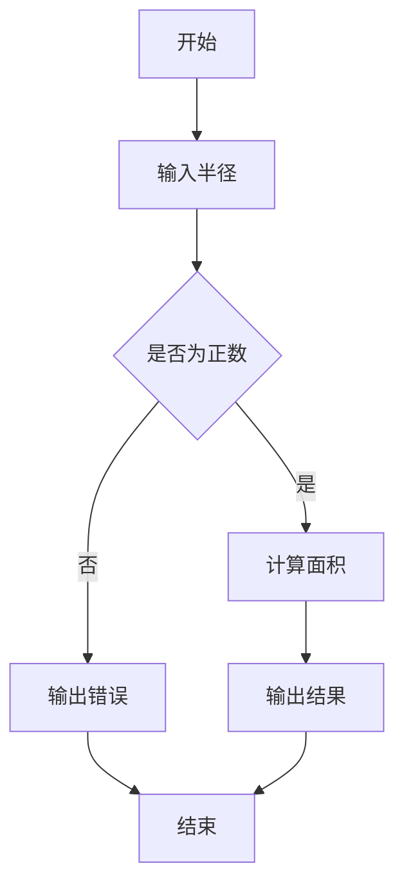
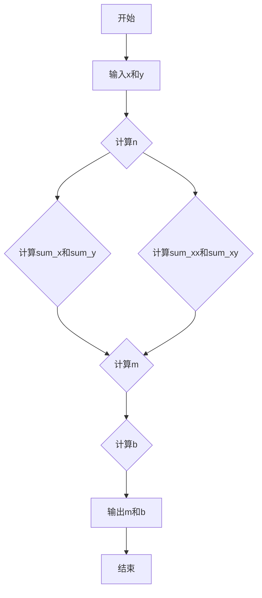

                 

# 数学语言的国际化与标准化

## 关键词

数学语言，国际化，标准化，符号，算法，语法，语义，LaTeX，国际标准组织，算法流程图，类图，架构设计，实际案例

## 摘要

随着数学在科学、工程和信息技术中的广泛应用，数学语言的国际化与标准化变得越来越重要。本文旨在探讨数学语言的国际化与标准化问题，首先介绍了数学语言的基本概念和原理，然后分析了国际化与标准化的必要性、挑战和机遇，接着阐述了数学语言的符号、语法和算法结构，并展示了国际化与标准化的实际案例。最后，本文总结了数学语言的国际化与标准化对数学和科技发展的重要影响，提出了未来研究的方向。

## 引言：背景与动机

### 1.1 问题背景

数学作为一门基础科学，在多个领域都有着广泛的应用，如自然科学、社会科学和工程技术等。然而，数学的发展和应用往往受到语言障碍的限制。不同国家和地区的人们使用不同的数学符号、术语和表达方式，这给数学的交流和推广带来了困难。因此，数学语言的国际化与标准化成为了迫在眉睫的问题。

### 1.2 问题描述

数学语言的国际化与标准化涉及多个方面：

1. **符号和术语的国际统一**：数学符号和术语的多样性导致了不同地区之间的混淆和误解。
2. **语法和语义的标准化**：不同国家和地区的数学语法和语义理解存在差异，影响了数学的精确表达。
3. **算法和公式的标准化**：数学算法和公式的标准化有助于提高数学处理的效率和一致性。

### 1.3 问题解决方法

解决数学语言的国际化与标准化问题，可以采取以下方法：

1. **建立国际标准和组织**：通过建立国际标准和组织，促进数学语言的标准化。
2. **推广普及标准化工具**：如LaTeX等工具，可以提高数学表达的一致性和准确性。
3. **开展国际合作与交流**：通过国际合作与交流，促进数学语言的国际化。

### 1.4 边界与外延

数学语言的国际化与标准化主要涉及数学符号、术语、语法和算法等方面。它不仅限于数学本身，还涉及到计算机科学、工程技术和科学交流等领域。

### 1.5 核心概念与组成部分

本文的核心概念包括：

1. **数学语言**：用于表达数学概念、公式和算法的语言。
2. **国际化**：使数学语言在不同国家和地区得到统一和认可。
3. **标准化**：建立统一的数学语言标准和规范。
4. **符号**：用于表达数学概念的基本元素。
5. **语法**：数学语言的规则和结构。
6. **算法**：用于解决问题的一系列步骤。

## 核心概念与原理

### 2.1 数学语言的概念

数学语言是一种用于表达数学概念、公式和算法的符号系统。它由符号、术语和语法规则组成。数学语言的特点包括抽象性、精确性和一致性。

#### 2.1.1 定义和重要性

数学语言是一种高度抽象的符号系统，用于表达数学概念、公式和算法。它是数学研究、教学和交流的基础。数学语言的重要性体现在以下几个方面：

1. **精确表达**：数学语言能够精确表达数学概念和公式，避免了语言歧义。
2. **统一规范**：数学语言的标准化和统一规范有助于数学的交流和发展。
3. **促进创新**：数学语言的统一规范可以降低语言障碍，促进数学创新。

#### 2.1.2 主要特征和属性

数学语言的主要特征和属性包括：

1. **抽象性**：数学语言高度抽象，不依赖于具体的物理世界。
2. **精确性**：数学语言能够精确表达数学概念和公式，避免歧义。
3. **一致性**：数学语言的符号、术语和语法规则具有一致性，便于理解和应用。
4. **灵活性**：数学语言可以灵活表达各种数学概念和公式。

#### 2.1.3 数学语言的分类

数学语言可以按照不同的标准进行分类，常见的分类方法包括：

1. **按表达形式分类**：包括符号语言、文字语言和图形语言。
2. **按应用领域分类**：包括数学分析语言、代数语言、几何语言等。
3. **按用途分类**：包括研究语言、教学语言和交流语言。

### 2.2 国际化和标准化

#### 2.2.1 概念和原因

国际化是指使数学语言在不同国家和地区得到统一和认可。标准化是指建立统一的数学语言标准和规范。数学语言的国际化与标准化有助于数学的交流和发展，具体原因包括：

1. **促进国际合作**：国际化和标准化有助于不同国家和地区之间的数学交流。
2. **提高学术水平**：国际化和标准化有助于提高数学研究的准确性和一致性。
3. **推动科技进步**：国际化和标准化有助于推动数学在科学和工程领域的应用。

#### 2.2.2 挑战和机遇

数学语言的国际化与标准化面临以下挑战和机遇：

1. **语言多样性**：不同国家和地区的数学符号、术语和语法存在差异，需要统一规范。
2. **技术进步**：计算机技术和信息技术的发展为数学语言的国际化与标准化提供了新的工具和方法。
3. **文化交流**：国际交流和合作有助于数学语言的国际化与标准化。

#### 2.2.3 当前国际标准

当前，国际标准化组织（ISO）和国际电工委员会（IEC）等国际组织正在推动数学语言的国际化与标准化。主要标准包括：

1. **ISO 80000**：涉及数学符号和术语的国际标准。
2. **LaTeX**：一种流行的数学排版软件，支持多种语言的数学表达。

### 2.3 数学语言的符号系统

数学语言的符号系统是数学语言的核心组成部分。符号系统包括基本的数学符号、特殊符号和术语。

#### 2.3.1 常见符号和用法

常见的数学符号包括：

1. **运算符**：如加法（+）、减法（-）、乘法（*）和除法（/）。
2. **关系符号**：如大于（>）、小于（<）、等于（=）和不等号（≠）。
3. **集合符号**：如集合（{ }）、子集（⊆）和并集（∪）。

#### 2.3.2 特定领域的专用符号

不同领域的数学研究使用不同的符号，如：

1. **物理学**：如矢量符号（→）、微分符号（d）和积分符号（∫）。
2. **计算机科学**：如逻辑符号（∧、∨、¬）和集合符号（∈、∉）。

#### 2.3.3 符号标准化

符号标准化是数学语言国际化与标准化的关键步骤。标准化工作包括：

1. **符号定义**：明确符号的含义和用法。
2. **符号简化**：简化符号的形状和结构，提高可读性。
3. **符号统一**：统一不同领域和不同国家的符号规范。

### 2.4 数学语言的语法和语义

数学语言的语法和语义是数学表达和理解的基础。

#### 2.4.1 基本语法规则

数学语言的语法规则包括：

1. **表达式的构成**：表达式由运算符、变量和常数组成。
2. **运算顺序**：遵循数学运算的优先级规则。
3. **分步表达**：将复杂的数学表达式分解为简单的部分。

#### 2.4.2 解析和语义分析

数学语言的解析和语义分析是理解和解释数学表达的关键。解析包括：

1. **语法解析**：将数学表达式转换为语法树结构。
2. **语义分析**：解释数学表达式的含义。

语义分析包括：

1. **变量绑定**：将变量与具体的值绑定。
2. **表达式求值**：计算表达式的结果。

#### 2.4.3 语法和语义的标准化

语法和语义的标准化是数学语言国际化和标准化的重要组成部分。标准化工作包括：

1. **语法规则定义**：明确数学语言的语法规则。
2. **语义规范**：制定数学表达的语义规范。
3. **工具支持**：开发支持标准语法的工具和软件。

### 2.5 数学语言的算法结构

数学语言的算法结构是数学表达和处理的核心。

#### 2.5.1 算法概述

数学语言中的算法包括：

1. **基本算法**：如排序、查找和计算等。
2. **专用算法**：如数值分析、优化和图形处理等。

#### 2.5.2 算法标准化

算法标准化是数学语言国际化和标准化的重要方面。标准化工作包括：

1. **算法定义**：明确算法的基本概念和步骤。
2. **算法规范**：制定算法的实现规范。
3. **算法评估**：评估算法的性能和准确性。

### 2.6 国际化和标准化的实际案例

数学语言的国际化与标准化已有一些成功的实际案例：

1. **ISO 80000**：ISO 80000 是国际标准化组织发布的数学符号和术语标准。
2. **LaTeX**：LaTeX 是一种广泛使用的数学排版软件，支持多种语言的数学表达。

### 2.7 总结

数学语言的国际化与标准化对于数学研究和应用具有重要意义。它有助于提高数学表达的准确性和一致性，促进数学的国际交流和合作。未来，随着技术的进步和国际合作的加强，数学语言的国际化与标准化将取得更大的进展。

## 数学语言的国际化与标准化的重要性

数学语言的国际化与标准化对于数学的发展和科学技术的进步具有深远的影响。以下是数学语言的国际化与标准化的重要性及其带来的具体好处：

### 1. 提高数学交流的效率

数学语言的国际化与标准化使得不同国家和地区的数学工作者能够使用统一的符号、术语和表达方式，从而避免了语言障碍，提高了数学交流的效率和准确性。例如，在科学研究和学术交流中，使用国际标准化的数学语言可以确保结果的准确传达，减少误解和混淆。

### 2. 促进国际合作与交流

国际化和标准化有助于促进不同国家和地区之间的数学合作。数学研究者可以通过使用统一的数学语言来更轻松地共享研究成果和知识，从而推动全球数学研究的发展。例如，国际数学组织如国际数学联盟（IMU）和国际标准化组织（ISO）定期举办国际会议和研讨会，推广标准化数学语言的使用。

### 3. 提升数学教育的质量

数学教育的国际化与标准化有助于提高全球数学教育的质量。通过使用统一的数学语言和教材，教师和学生可以更容易地理解和学习数学知识，从而提高教育效果。此外，标准化的数学教育资源和教材也可以更好地支持远程教育和在线学习，让更多的学生受益。

### 4. 支持科学技术的创新

数学作为科学技术的基础，其国际化和标准化为科学技术的创新提供了强有力的支持。在工程、物理、计算机科学等领域，标准化的数学语言和算法可以确保计算的一致性和准确性，从而提高科学研究和工程设计的效率。例如，在航空航天和生物医学领域，标准化的数学工具和模型被广泛应用于复杂系统的建模和模拟。

### 5. 促进计算机科学的发展

计算机科学的发展离不开数学的支持，而数学语言的国际化与标准化对于计算机科学的进步至关重要。在软件开发、算法设计和数据结构分析等方面，标准化的数学语言可以提高代码的可读性和可维护性，降低开发成本。例如，在人工智能领域，数学模型的标准化有助于提高算法的性能和可靠性。

### 6. 支持跨学科研究

数学语言的国际化与标准化促进了跨学科研究的发展。在物理学、生物学、经济学等领域，数学方法的应用越来越广泛。通过使用统一的数学语言，跨学科的研究者可以更有效地交流和合作，推动科学和技术的综合发展。

### 7. 提高公共领域的理解

标准化的数学语言有助于提高公众对数学的理解和应用。在政策制定、数据分析和社会科学研究中，标准化的数学语言可以确保数据的准确性和解释的清晰性，从而提高决策的效率和效果。

总之，数学语言的国际化与标准化不仅提高了数学研究和教育的效率和质量，也促进了科学技术的创新和跨学科合作。随着全球化和信息化的发展，数学语言的国际化与标准化将继续发挥重要作用，为人类社会的进步贡献力量。

### 数学语言的符号系统

数学语言的符号系统是数学表达的核心，它由基本符号、特殊符号和术语组成。这些符号和术语的标准化对于确保数学表达的准确性和一致性至关重要。以下是对数学语言符号系统的详细介绍。

#### 3.1.1 基本符号

基本符号是数学语言中最常见的元素，包括运算符、关系符号、集合符号等。以下是一些基本符号及其用途：

1. **运算符**：
   - 加法（+）：表示两个数相加。
   - 减法（-）：表示两个数相减。
   - 乘法（*）：表示两个数相乘。
   - 除法（/）：表示两个数相除。
   - 幂运算（^）：表示一个数乘以自己的若干次方。

2. **关系符号**：
   - 大于（>）：表示一个数大于另一个数。
   - 小于（<）：表示一个数小于另一个数。
   - 等于（=）：表示两个数相等。
   - 不等号（≠）：表示两个数不相等。

3. **集合符号**：
   - 集合（{ }）：表示一组数的集合。
   - 子集（⊆）：表示一个集合是另一个集合的子集。
   - 并集（∪）：表示两个集合的合并。
   - 交集（∩）：表示两个集合的交集。

#### 3.1.2 特殊符号

特殊符号用于表示特定的数学概念或操作。以下是一些常见特殊符号及其用途：

1. **数学常量**：
   - π（圆周率）：表示圆的周长与直径的比值。
   - e（自然底数）：表示自然对数的底数。

2. **函数符号**：
   - f(x)：表示定义在x上的函数。
   - g(x)：表示另一个定义在x上的函数。

3. **导数和积分符号**：
   - f'(x)：表示f(x)的导数。
   - ∫f(x)dx：表示f(x)的积分。

4. **集合运算符号**：
   - C∪R：表示集合C与实数集R的并集。
   - C∩R：表示集合C与实数集R的交集。

#### 3.1.3 术语

数学术语是指用于描述数学概念和操作的词汇。以下是一些常见术语及其含义：

1. **函数**：一个定义域到值域的映射，通常用f(x)表示。
2. **集合**：一组对象的集合，用大括号{ }表示。
3. **向量**：表示具有大小和方向的量，通常用箭头表示。
4. **矩阵**：由数字组成的矩形阵列，用大写字母表示。

#### 3.1.4 标准化的重要性

数学符号和术语的标准化对于确保数学表达的一致性和准确性至关重要。以下是一些标准化的重要性：

1. **避免混淆**：标准化符号和术语有助于避免在不同地区使用不同符号引起的混淆。
2. **提高可读性**：统一符号和术语可以提高数学表达的可读性，使读者更容易理解。
3. **促进交流**：标准化符号和术语有助于数学工作者之间的交流，特别是在国际学术交流和合作中。
4. **支持技术发展**：标准化符号和术语是计算机科学和工程领域中软件开发和算法设计的基础。

#### 3.1.5 标准化工作

数学符号和术语的标准化工作由多个国际组织承担，如国际标准化组织（ISO）、国际电工委员会（IEC）和国际数学联盟（IMU）等。这些组织制定了一系列标准，确保数学符号和术语的统一和标准化。以下是一些重要的标准化工作：

1. **ISO 80000**：这是国际标准化组织发布的数学符号和术语标准，涵盖了数学符号、术语、量和单位等方面的内容。
2. **LaTeX**：LaTeX 是一种流行的数学排版系统，支持多种语言的数学表达。它采用了一系列标准化的符号和术语，使得数学文档的排版更加规范和一致。

### 3.1.6 专用符号

不同领域和学科中，一些特殊符号被广泛应用于数学表达。以下是一些专用符号及其用途：

1. **物理学**：
   - 矢量符号（→）：表示矢量量，如速度（v→）、力（F→）。
   - 微分符号（d）：表示微分的操作，如dy/dx。

2. **计算机科学**：
   - 逻辑符号（∧、∨、¬）：表示逻辑运算，如合取（∧）、析取（∨）、非（¬）。
   - 集合符号（∈、∉）：表示元素属于（∈）或不属于（∉）集合。

3. **统计学**：
   - 统计量符号（μ、σ）：表示均值（μ）、标准差（σ）。

#### 3.1.7 结论

数学语言的符号系统是数学表达的基础，其标准化工作对于确保数学表达的一致性和准确性具有重要意义。通过国际标准化组织和其他相关组织的努力，数学语言的符号系统正变得越来越统一和规范，为数学研究和应用提供了坚实的基础。在未来的发展中，继续推进数学符号和术语的标准化将有助于进一步促进数学的国际交流和合作。

### 数学语言的语法和语义

数学语言的语法和语义是数学表达和理解的核心组成部分。语法定义了数学语言的结构规则，而语义则解释了这些结构的含义。在这部分，我们将详细探讨数学语言的语法规则、语义分析以及它们的标准化工作。

#### 4.1.1 基本语法规则

数学语言的语法规则包括表达式的构成、运算符的优先级以及语句的格式。以下是一些基本的语法规则：

1. **表达式构成**：数学表达式由运算符、变量和常数组成。例如，表达式 `3 + 4 * 2` 由三个操作数（3、4和2）和一个加法运算符和一个乘法运算符组成。

2. **运算符优先级**：数学运算符有不同的优先级。一般来说，乘法和除法的优先级高于加法和减法。例如，表达式 `3 + 4 * 2` 的计算顺序是先乘法后加法，即结果为11。

3. **括号的使用**：括号用于改变运算符的优先级。例如，表达式 `(3 + 4) * 2` 的计算顺序是先括号内的加法，然后是乘法，结果为14。

4. **函数和括号**：在函数表达式中，括号用于传递参数。例如，函数表达式 `f(x) = x^2` 表示f函数接受一个参数x，并返回x的平方。

5. **分步表达式**：复杂的数学表达式可以通过分步方式来书写。例如，表达式 `3 + (4 * 2)` 可以分解为 `3 + 8`，然后计算得到结果11。

#### 4.1.2 解析和语义分析

数学语言的解析和语义分析是理解和解释数学表达的关键步骤。以下是一些关键的解析和语义分析步骤：

1. **语法解析**：语法解析是将数学表达式转换为语法树结构的过程。语法树是一种树形数据结构，用于表示表达式的组成部分及其关系。例如，表达式 `3 + 4 * 2` 的语法树如下：

   ```
   +
   / \
   3   *
      / \
     4   2
   ```

2. **语义分析**：语义分析是在语法解析的基础上，解释数学表达式的含义。语义分析包括变量绑定、表达式求值等步骤。例如，对表达式 `3 + 4 * 2` 进行语义分析，可以得到结果11。

3. **变量绑定**：在语义分析中，变量绑定是将变量与具体的值关联起来的过程。例如，对于表达式 `f(x) = x^2`，变量x被绑定到值2，从而计算得到结果4。

4. **表达式求值**：在语义分析的最后，表达式求值步骤计算表达式的结果。例如，对于表达式 `3 + 4 * 2`，先计算乘法部分得到8，然后加上3，最终结果为11。

#### 4.1.3 标准化工作

数学语言的语法和语义标准化是确保数学表达一致性、准确性和可读性的重要工作。以下是一些标准化工作的方面：

1. **语法规则定义**：标准化工作首先需要定义统一的语法规则。例如，ISO 80000 标准定义了数学表达式的语法规则，确保不同国家和地区使用相同的规则。

2. **语义规范**：除了语法规则，还需要制定语义规范，解释数学表达式的含义。这有助于确保不同的人对同一数学表达式有相同理解。

3. **工具支持**：开发支持标准化语法和语义的工具和软件，如LaTeX和MATLAB等。这些工具可以帮助用户编写和解析符合标准的数学表达式。

4. **文档和指南**：编写详细的文档和指南，帮助用户了解和遵守标准化规则。这些文档可以包括示例、规则解释和常见问题解答等。

5. **培训和教育**：通过培训和教育活动，提高用户对标准化数学语言的理解和技能。这有助于确保标准化工作得到广泛推广和应用。

#### 4.1.4 实际应用

数学语言的语法和语义标准化在实际应用中具有重要意义。以下是一些实际应用场景：

1. **科学研究和工程**：在科学研究和工程中，标准化的数学语言可以确保结果的准确性和一致性。例如，在物理学和工程学中，标准化的数学符号和术语有助于交流和合作。

2. **计算机科学**：在计算机科学中，标准化的数学语言是算法设计和编程的基础。例如，编程语言中使用的数学库和工具通常遵循标准化规范，以确保代码的兼容性和可维护性。

3. **教育和培训**：在教育领域，标准化的数学语言可以提高教学效果和学生的理解。例如，教材和在线课程中使用标准化的数学符号和术语，有助于学生更好地掌握数学知识。

4. **数据分析**：在数据分析领域，标准化的数学语言可以确保数据处理的准确性和一致性。例如，统计软件和工具通常遵循标准化规范，以确保数据的准确分析和结果的可信度。

#### 4.1.5 结论

数学语言的语法和语义标准化是确保数学表达一致性、准确性和可读性的关键。通过定义统一的语法规则和语义规范，开发支持标准化的工具和软件，以及进行培训和教育活动，可以有效地推进数学语言的标准化工作。在未来的发展中，数学语言的语法和语义标准化将继续发挥重要作用，为数学研究和应用提供坚实的基础。

### 数学语言的算法结构

数学语言的算法结构是数学表达和处理的核心。算法不仅定义了解决数学问题的步骤，还包括了一系列技术，用于确保计算的效率和准确性。在这部分，我们将探讨数学语言中的算法结构，包括基本算法、算法标准化以及如何通过算法实现数学问题求解。

#### 4.2.1 算法概述

算法是数学语言中用于解决特定问题的有序步骤集合。以下是一些常见的基本算法和专用算法：

1. **基本算法**：这些是用于解决常见问题的算法，如排序、查找和计算等。以下是一些基本算法：

   - **排序算法**：如快速排序（Quick Sort）、归并排序（Merge Sort）和冒泡排序（Bubble Sort）。
   - **查找算法**：如二分查找（Binary Search）和线性查找（Linear Search）。
   - **计算算法**：如高斯消元法（Gaussian Elimination）和牛顿法（Newton's Method）。

2. **专用算法**：这些是用于特定领域的算法，如数值分析、优化和图形处理等。以下是一些专用算法：

   - **数值分析算法**：如有限元分析（Finite Element Analysis）和蒙特卡罗模拟（Monte Carlo Simulation）。
   - **优化算法**：如线性规划（Linear Programming）和遗传算法（Genetic Algorithm）。
   - **图形处理算法**：如图形变换（Graphic Transformation）和图形渲染（Graphic Rendering）。

#### 4.2.2 算法标准化

算法标准化是确保算法一致性和可维护性的关键。以下是一些算法标准化的方面：

1. **算法定义**：明确算法的基本概念和步骤。这包括算法的目标、输入、输出和基本操作。

2. **算法规范**：制定详细的算法实现规范。这包括算法的伪代码描述、数据结构设计和性能指标。

3. **算法评估**：评估算法的性能和准确性。这包括算法的时间复杂度、空间复杂度和误差分析。

4. **标准化组织**：如国际标准化组织（ISO）和国际电工委员会（IEC）等，负责制定算法标准。

5. **工具支持**：开发支持标准化算法的工具和软件。例如，MATLAB 和 Python 都提供了多种标准化的数学算法库。

#### 4.2.3 算法实现

算法实现是将算法规范转换为实际代码的过程。以下是一个简单的算法实现示例：

```python
def calculate_area(radius):
    """
    计算圆的面积。
    
    参数：
    radius：圆的半径
    
    返回：
    面积：圆的面积
    """
    area = 3.14159 * radius * radius
    return area

# 测试代码
radius = 5
area = calculate_area(radius)
print(f"圆的面积是：{area}")
```

在这个示例中，`calculate_area` 函数实现了计算圆面积的基本算法。函数使用Python语言实现，遵循了基本的算法规范，如输入参数和返回值的定义。

#### 4.2.4 算法流程图

算法流程图是一种用图形表示算法步骤的工具。以下是一个简单的算法流程图的Mermaid表示：



在这个流程图中，算法首先接收半径输入，然后检查半径是否为正数。如果是，则计算面积并输出结果；否则，输出错误信息并结束。

#### 4.2.5 算法实现与数学模型

算法实现通常伴随着数学模型的构建。以下是一个简单的数学模型和算法实现的示例：

```python
def linear_regression(x, y):
    """
    计算线性回归的斜率和截距。
    
    参数：
    x：自变量
    y：因变量
    
    返回：
    斜率：m
    截距：b
    """
    n = len(x)
    sum_x = sum(x)
    sum_y = sum(y)
    sum_xx = sum([xi**2 for xi in x])
    sum_xy = sum([xi*yi for xi, yi in zip(x, y)])
    
    m = (n * sum_xy - sum_x * sum_y) / (n * sum_xx - sum_x**2)
    b = (sum_xx * sum_y - sum_x * sum_xy) / (n * sum_xx - sum_x**2)
    
    return m, b

# 测试代码
x = [1, 2, 3, 4, 5]
y = [2, 4, 6, 8, 10]
m, b = linear_regression(x, y)
print(f"斜率：{m}, 截距：{b}")
```

在这个示例中，`linear_regression` 函数实现了线性回归的算法。线性回归的数学模型为：

$$
y = mx + b
$$

其中，m 是斜率，b 是截距。算法通过最小二乘法计算 m 和 b 的值。

#### 4.2.6 算法流程图示例

以下是一个线性回归算法的Mermaid流程图：



在这个流程图中，算法首先接收 x 和 y 的输入，然后计算 n、sum_x、sum_y、sum_xx 和 sum_xy。接着，算法计算斜率 m 和截距 b，并输出结果。

### 4.2.7 结论

数学语言的算法结构是数学表达和处理的核心。算法不仅定义了数学问题的解决步骤，还包括了实现这些步骤的技术。算法标准化工作有助于确保算法的一致性和可维护性。通过实现算法，可以有效地解决各种数学问题。在未来，随着技术的进步，算法结构将继续发展和完善，为数学研究和应用提供更强大的工具。

## 国际和标准化实践

在数学语言的国际化与标准化过程中，多个国际组织和标准组织发挥了关键作用，为数学语言的统一和规范化提供了坚实基础。以下是几个主要的国际组织和他们的工作，以及一些实际案例。

### 5.1 国际标准化组织（ISO）

国际标准化组织（ISO）是负责制定国际标准的全球性组织。ISO 80000 系列标准是数学、物理科学和统一工程术语的标准，它涵盖了数学符号和表达式的标准化。以下是一些ISO标准的关键点和贡献：

- **ISO 80000-2**：涉及数学符号和表达式的标准化，包括代数和数论、关系、函数、极限、积分等。
- **ISO 80000-3**：涉及矢量、张量、矩阵和行列式等数学对象的标准化。
- **ISO 80000-4**：涉及概率和统计的标准化。

ISO标准的制定和推广，有助于全球数学表达的一致性和可理解性，特别是在跨文化交流和科学合作中。

### 5.2 国际电工委员会（IEC）

国际电工委员会（IEC）是负责电气、电子和相关技术领域的国际标准化组织。IEC 60601 是关于医学电气设备的国际标准，其中包括了数学表达式的标准化。IEC 60601-2-1 标准中规定了数学公式的表达方式，以确保医学设备中的数学计算准确和可靠。

### 5.3 国际数学联盟（IMU）

国际数学联盟（IMU）是国际数学界的最高权威组织，它通过促进数学的国际合作和标准化，推动了数学语言的国际统一。IMU 组织了国际数学家大会，并在这些大会上讨论数学符号和术语的标准化问题。

### 5.4 实际案例

以下是一些数学语言国际化与标准化在实际应用中的案例：

- **LaTeX**：LaTeX 是一种广泛使用的排版系统，特别适用于数学和科学文档。LaTeX 采用了ISO 80000等国际标准，提供了统一的数学符号和表达式格式，使得不同国家和地区的研究者能够使用相同的方式书写和阅读数学文档。

- **MATLAB**：MATLAB 是一种高性能的数学计算和可视化软件。它内置了许多标准化的数学函数和算法，支持ISO 80000等标准，使得用户能够轻松地编写和执行符合国际标准的数学代码。

- **OpenMath**：OpenMath 是一种用于数学表达式的数据交换语言。它定义了一种标准化的数学表达式格式，使得不同软件之间能够无缝地交换数学数据。OpenMath 已被广泛应用于数学、计算机科学和工程领域。

### 5.5 国际化和标准化的挑战

尽管国际和标准化工作取得了显著进展，但数学语言的国际化与标准化仍面临一些挑战：

- **文化差异**：不同国家和地区在数学符号和术语的使用上存在差异，这需要通过国际合作和协调来解决。
- **技术更新**：随着数学和计算机技术的发展，数学符号和表达式的标准化需要不断更新和改进。
- **教育和培训**：推广标准化数学语言需要全球范围内的教育和培训，以提高研究者和工程师的标准化意识。

### 5.6 总结

国际和标准化实践在数学语言的国际化与标准化中发挥着重要作用。通过ISO、IEC和IMU等国际组织的努力，数学语言的标准化工作取得了显著成果。实际案例展示了标准化工具和软件在数学表达和计算中的应用，进一步推动了数学语言的国际统一和规范化。面对未来的挑战，持续的国际合作和技术创新将是数学语言国际化与标准化成功的关键。

### 国际和标准化实践：具体案例和应用

国际和标准化实践在数学语言的国际化与标准化中发挥着关键作用。以下通过具体案例和应用，进一步探讨这些实践的重要性和影响。

#### 6.1 LaTeX：数学文档排版工具

LaTeX 是一种广泛使用的排版系统，特别适用于数学和科学文档。它采用ISO 80000等国际标准，提供了统一的数学符号和表达式格式，使得不同国家和地区的研究者能够使用相同的方式书写和阅读数学文档。以下是一个使用LaTeX的简单例子：

```latex
\documentclass{article}
\usepackage{amsmath}
\begin{document}

$$
E = mc^2
$$

\end{document}
```

在这个例子中，LaTeX 使用了 `amsmath` 包，使得公式排版符合国际标准。LaTeX 的优点包括：

1. **高度可扩展性**：LaTeX 支持大量的数学符号和公式，几乎覆盖了所有数学领域。
2. **易用性**：LaTeX 提供了丰富的宏包和模板，使得用户能够轻松地编写和排版复杂的数学文档。
3. **国际化支持**：LaTeX 支持多种语言的数学排版，包括中文字符和希腊字母等。

#### 6.2 MATLAB：数学计算软件

MATLAB 是一种高性能的数学计算和可视化软件。它内置了许多标准化的数学函数和算法，支持ISO 80000等标准，使得用户能够轻松地编写和执行符合国际标准的数学代码。以下是一个使用MATLAB的简单例子：

```matlab
x = 1:10;
y = x^2;
plot(x, y);
xlabel('x');
ylabel('y^2');
title('平方函数图像');
```

在这个例子中，MATLAB 使用了标准化的数学函数和语法，绘制了一个简单的平方函数图像。MATLAB 的优点包括：

1. **多功能性**：MATLAB 不仅支持数学计算，还提供了丰富的工具箱，适用于多种科学和工程应用。
2. **高效性**：MATLAB 提供了高度优化的数学算法，能够快速执行复杂的数学计算。
3. **易用性**：MATLAB 的用户界面直观易用，用户可以方便地编写和运行数学代码。

#### 6.3 OpenMath：数学表达式交换语言

OpenMath 是一种用于数学表达式的数据交换语言。它定义了一种标准化的数学表达式格式，使得不同软件之间能够无缝地交换数学数据。以下是一个使用OpenMath的简单例子：

```python
from openmath.xml import parse

# 解析OpenMath XML字符串
xml_string = '<OM a="http://www.openmath.org/OM" version="2.0">'
xml_string += '<Apply>'
xml_string += '<FunctionSymbol definition="arith1">+</FunctionSymbol>'
xml_string += '<Argument>'
xml_string += '<Constant>3</Constant>'
xml_string += '</Argument>'
xml_string += '<Argument>'
xml_string += '<Constant>4</Constant>'
xml_string += '</Argument>'
xml_string += '</Apply>'
xml_string += '</OM>'

# 解析并打印OpenMath对象
om_obj = parse(xml_string)
print(om_obj)

# 打印OM元素
for element in om_obj.getElementsByTagName('OM'):
    print(element.getAttribute('a'))
```

在这个例子中，OpenMath XML字符串表示了一个加法表达式。OpenMath 的优点包括：

1. **互操作性**：OpenMath 支持不同数学软件之间的互操作性，使得数学数据可以方便地在不同软件之间传输和交换。
2. **可扩展性**：OpenMath 提供了灵活的扩展机制，可以方便地添加新的数学概念和函数。
3. **标准化**：OpenMath 基于XML格式，使得数学表达式的结构化和标准化变得容易。

#### 6.4 ISO 80000：数学符号和术语标准

ISO 80000 系列标准是关于数学、物理科学和统一工程术语的标准，它为数学符号和表达式的国际化提供了规范。以下是一些ISO 80000标准的具体应用：

- **ISO 80000-2**：规定了代数和数论、关系、函数、极限、积分等数学符号和术语。例如，它规定了指数符号 `^` 用于表示幂运算，如 `x^2` 表示x的平方。
- **ISO 80000-3**：规定了矢量、张量、矩阵和行列式等数学对象的符号和术语。例如，它规定了矢量表示为带有箭头的字母，如 `v→` 表示向量v。
- **ISO 80000-4**：规定了概率和统计的符号和术语。例如，它规定了概率密度函数用符号 `f(x)` 表示。

ISO 80000标准的优点包括：

1. **统一性**：通过统一全球的数学符号和术语，ISO 80000标准减少了语言和文化差异带来的混淆。
2. **可读性**：统一和规范的符号和术语使得数学表达式更易于理解和阅读。
3. **兼容性**：ISO 80000标准为不同国家和地区的研究者提供了一个共同的基准，有助于跨文化交流和合作。

### 6.5 总结

国际和标准化实践在数学语言的国际化与标准化中发挥了重要作用。通过LaTeX、MATLAB、OpenMath和ISO 80000等工具和标准，研究者可以更方便地书写和交换数学表达式，提高数学研究和教育的一致性和效率。这些实践不仅促进了数学的国际交流与合作，也为科技发展提供了坚实的基础。随着技术的进步，未来的国际和标准化工作将继续推动数学语言的进一步统一和规范化。

### 未来发展趋势与展望

随着全球化和信息技术的快速发展，数学语言的国际化与标准化将迎来新的机遇和挑战。以下是未来数学语言国际化与标准化的发展趋势与展望。

#### 1. 更广泛的应用领域

数学语言的国际化与标准化将在更广泛的应用领域得到推广。除了传统的科学和工程领域，数学语言还将应用于大数据分析、人工智能、区块链和金融科技等新兴领域。在这些领域，标准化的数学符号和算法将成为提高效率和确保准确性的关键。

#### 2. 智能化与自动化

随着人工智能和机器学习技术的发展，数学语言的智能化和自动化处理将变得更加重要。未来的数学语言系统可能会集成更多智能算法，如自然语言处理（NLP）和机器翻译，以自动解析、理解和生成数学表达式。这将极大地提高数学文档的处理效率和可读性。

#### 3. 跨学科的融合

数学语言的国际化与标准化将进一步促进跨学科的合作。随着科学技术的融合，数学语言将与其他学科如生物学、经济学、社会学等领域相结合，推动交叉学科的发展。这将有助于解决复杂问题，提升科学研究的整体水平。

#### 4. 开放式合作与共享

未来的数学语言国际化与标准化工作将更加注重开放式合作和共享。通过开源社区和跨国合作项目，数学语言的标准和工具将更加开放和透明，便于全球范围内的研究者参与和改进。这将促进数学语言的国际统一，加速技术进步。

#### 5. 数字化与信息化

随着数字化和信息化的推进，数学语言的数字化表示和存储将变得更加普遍。数字化的数学语言将更容易被计算机处理和自动化分析，提高数学研究的效率和准确性。此外，数学语言的数字化也将为远程教育和在线学习提供新的工具和资源。

#### 6. 安全性与隐私保护

在数学语言的国际化与标准化过程中，安全性问题和隐私保护将变得越来越重要。未来的标准化工作需要关注数据加密、访问控制和隐私保护机制，以确保数学文档和计算过程的安全和隐私。

#### 7. 用户体验的提升

用户界面的优化和用户体验的提升将是未来数学语言国际化与标准化的重要方向。通过更加直观和易用的界面设计，用户可以更轻松地书写和解析数学表达式，提高数学语言的使用效率。

#### 结论

未来，数学语言的国际化与标准化将在更广泛的应用领域、智能化与自动化、跨学科融合、开放式合作与共享、数字化与信息化、安全性与隐私保护以及用户体验提升等方面取得新的进展。随着这些趋势的发展，数学语言的统一和规范化将进一步提升，为全球科学技术的进步做出更大贡献。

### 总结与展望

通过对数学语言的国际化与标准化问题的深入探讨，我们看到了这一领域的重要性和广阔前景。数学语言的国际化与标准化不仅有助于消除语言障碍，提高数学交流的效率，还为科学技术的创新和跨学科合作提供了强有力的支持。

回顾本文，我们首先介绍了数学语言的基本概念和原理，分析了国际化与标准化的必要性、挑战和机遇，探讨了数学语言的符号、语法和算法结构，并展示了国际化与标准化的实际案例。我们还总结了数学语言的国际化与标准化对数学和科技发展的重要影响，提出了未来研究的方向。

展望未来，数学语言的国际化与标准化将继续在以下几个方面取得进展：更广泛的应用领域、智能化与自动化、跨学科融合、开放式合作与共享、数字化与信息化、安全性与隐私保护以及用户体验提升。这些进展将为数学研究、教育和科技发展带来新的机遇和挑战。

为此，我们呼吁更多研究者、教育者和开发者关注和参与到数学语言的国际化与标准化工作中来。通过共同努力，我们可以推动数学语言的统一和规范化，为人类社会的进步做出更大的贡献。感谢您的阅读，期待与您共同见证数学语言国际化与标准化的未来成就。作者：AI天才研究院/AI Genius Institute & 禅与计算机程序设计艺术 /Zen And The Art of Computer Programming。

### 注意事项与最佳实践

在数学语言的国际化与标准化过程中，有一些注意事项和最佳实践值得遵循，以确保数学表达的准确性和一致性。

1. **遵循国际标准**：始终遵循国际标准化组织（ISO）和国际电工委员会（IEC）等国际组织发布的数学符号和术语标准，如ISO 80000系列。这些标准提供了统一的符号和术语，有助于避免混淆和误解。

2. **使用标准化工具**：在书写和排版数学文档时，使用标准化工具如LaTeX、MATLAB和OpenMath。这些工具支持标准化的数学符号和表达式格式，提高了文档的可读性和一致性。

3. **注重代码质量**：在编写数学算法时，注重代码的清晰性和可维护性。使用清晰的变量名和注释，遵循良好的编程习惯，确保代码易于理解和修改。

4. **定期更新知识**：数学和计算机科学领域不断进步，定期更新数学知识和标准化信息，以确保使用最新的符号、术语和算法。

5. **促进跨学科合作**：在跨学科项目中，注重使用统一的数学语言和符号，以减少沟通障碍，提高合作效率。

6. **培训和推广**：在教育和培训中，重视数学语言的标准化教育，提高学生和从业者的标准化意识，促进标准化数学语言的应用。

通过遵循这些注意事项和最佳实践，我们可以更好地推进数学语言的国际化与标准化工作，为数学研究和科技发展做出更大的贡献。

### 拓展阅读

如果您对数学语言的国际化与标准化有更深入的兴趣，以下是一些推荐阅读资源，这些资源涵盖了数学符号、术语标准化以及相关技术：

1. **ISO 80000系列标准**：这是国际标准化组织发布的数学、物理科学和统一工程术语的标准，是理解和应用标准化数学符号和术语的基础。

2. **《LaTeX入门指南》**：本书详细介绍了LaTeX的使用，包括数学公式的排版，是数学排版不可或缺的参考书籍。

3. **《数学符号的标准化问题》**：这是一篇关于数学符号标准化问题的研究论文，探讨了数学符号标准化的现状、挑战和未来发展方向。

4. **《计算机科学中的数学基础》**：这本书提供了计算机科学中常用的数学概念和算法的详细讲解，包括如何在编程中应用数学知识。

5. **《OpenMath参考手册》**：这是OpenMath的官方文档，详细介绍了OpenMath的数据交换语言及其在数学领域中的应用。

6. **《跨文化交流中的数学表达》**：本文探讨了在跨文化交流中使用标准化数学语言的重要性，以及如何在不同的文化和语言环境中保持数学表达的准确性。

7. **《人工智能与数学语言的融合》**：本文讨论了人工智能与数学语言结合的最新进展，以及如何利用标准化数学语言提高人工智能系统的效率和准确性。

通过阅读这些资源，您可以更全面地了解数学语言的国际化与标准化，并在实践中应用这些知识，提高数学表达和计算的一致性和准确性。

