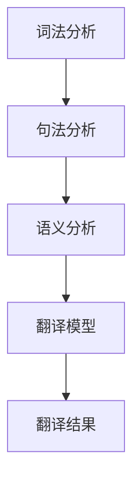
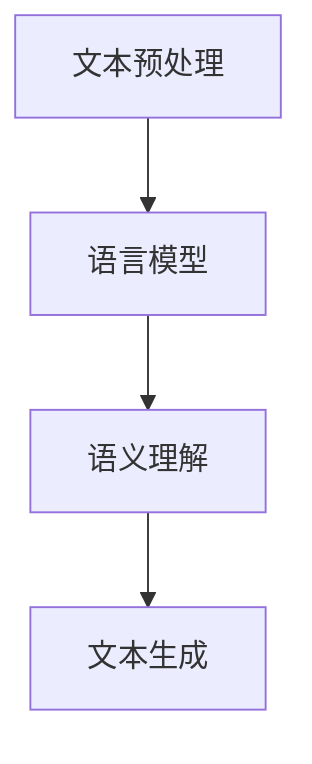
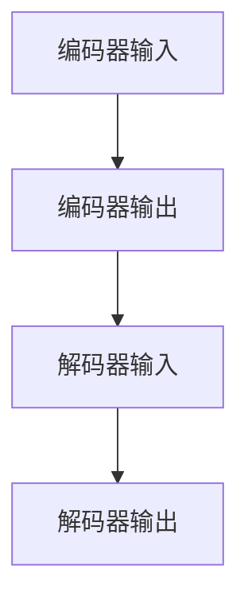
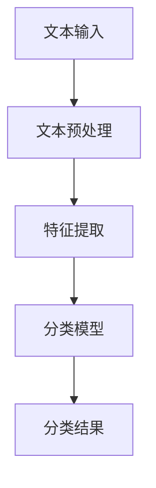
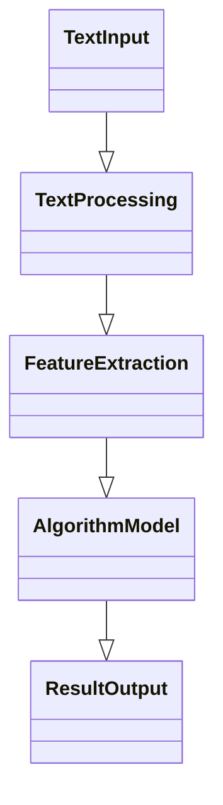
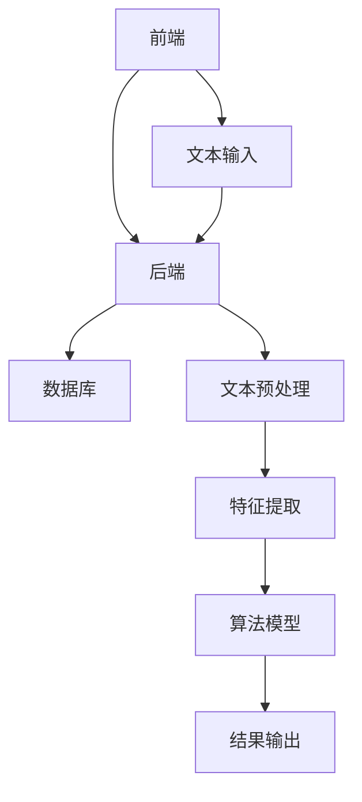
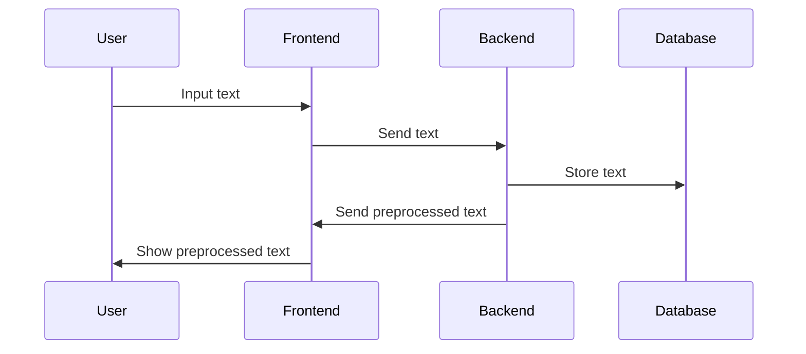

                 


### 文章标题：数学语言的机器翻译与自然语言处理

> 关键词：数学语言、机器翻译、自然语言处理、算法原理、系统架构、项目实战

> 摘要：本文从数学语言的机器翻译和自然语言处理的基本概念出发，深入探讨两者的核心原理、算法、系统架构以及实际应用。通过一步步的分析和讲解，帮助读者理解并掌握这一领域的关键技术和应用场景。

----------------------------------------------------------------

## 设计思路

### 背景介绍

#### 1.1 数学语言的机器翻译与自然语言处理概述

##### 1.1.1 问题背景

随着信息技术的飞速发展，数学语言作为科学研究中的一种重要表达形式，其机器翻译和自然语言处理技术逐渐成为研究热点。这不仅有助于提高科学研究的效率，还能促进不同语言之间的交流与合作。

##### 1.1.2 问题描述

数学语言的机器翻译与自然语言处理涉及将一种语言的数学表达翻译成另一种语言，并使其在目标语言中保持原有的意义和逻辑结构。这要求翻译系统不仅具备语言理解能力，还要理解数学概念和符号。

##### 1.1.3 问题解决

针对上述问题，我们可以从以下几个方面进行解决：

1. **核心概念与联系**：明确机器翻译和自然语言处理的核心概念及其相互联系。
2. **算法原理讲解**：深入分析机器翻译和自然语言处理的基本算法原理。
3. **系统分析与架构设计方案**：设计合适的系统架构，以满足数学语言翻译的需求。
4. **项目实战**：通过实际项目案例，展示数学语言机器翻译和自然语言处理的应用。

##### 1.1.4 边界与外延

数学语言的机器翻译与自然语言处理在应用领域具有广泛性，包括跨学科研究、教育、金融、医疗等。同时，随着人工智能技术的发展，其应用边界也在不断拓展。

##### 1.1.5 概念结构与核心要素组成

数学语言的机器翻译与自然语言处理的核心概念包括：

1. **数学语言**：研究数学表达的语言特点、符号体系等。
2. **机器翻译**：涉及自然语言处理技术，包括词法分析、句法分析、语义分析等。
3. **自然语言处理**：研究如何让计算机理解、处理和生成自然语言。

### 核心概念与联系

#### 2.1 机器翻译

##### 2.1.1 机器翻译的概念

机器翻译是指利用计算机程序将一种语言的文本翻译成另一种语言的文本。其核心任务是实现文本的语义和语法结构的转换。

##### 2.1.2 机器翻译的基本原理

机器翻译的基本原理包括词法分析、句法分析、语义分析和机器翻译算法。

1. **词法分析**：将文本分解为词法单元，如单词、符号等。
2. **句法分析**：分析文本的语法结构，建立句法树。
3. **语义分析**：理解文本的语义信息，包括词义、句义等。
4. **机器翻译算法**：基于统计机器翻译、基于规则机器翻译或神经机器翻译等技术实现文本翻译。

##### 2.1.3 机器翻译的核心算法

1. **统计机器翻译**：基于大量已翻译文本的统计规律进行翻译。
2. **基于规则机器翻译**：根据预设的规则进行翻译。
3. **神经机器翻译**：使用神经网络模型实现翻译，具有较好的灵活性和准确性。

##### 2.1.4 机器翻译的流程图与ER实体关系图



#### 2.2 自然语言处理

##### 2.2.1 自然语言处理的概念

自然语言处理（Natural Language Processing，NLP）是计算机科学和语言学的交叉领域，旨在让计算机理解和处理自然语言。

##### 2.2.2 自然语言处理的基本原理

自然语言处理的基本原理包括：

1. **文本预处理**：对文本进行分词、词性标注、句法分析等处理。
2. **语言模型**：基于统计或神经网络技术，建立文本的概率分布模型。
3. **语义理解**：理解文本的语义信息，包括词义、句义、语境等。
4. **文本生成**：根据语义信息生成文本。

##### 2.2.3 自然语言处理的核心算法

1. **文本分类**：将文本划分为不同的类别。
2. **命名实体识别**：识别文本中的命名实体，如人名、地名、组织机构名等。
3. **依存句法分析**：分析句子中词语之间的依赖关系。

##### 2.2.4 自然语言处理的流程图与ER实体关系图



#### 2.3 机器翻译与自然语言处理的关系

##### 2.3.1 关系概述

机器翻译和自然语言处理密切相关，机器翻译是自然语言处理的一个子领域，两者相互促进、共同发展。

##### 2.3.2 相互影响

1. **自然语言处理对机器翻译的影响**：自然语言处理技术的发展，如语言模型、句法分析、语义理解等，为机器翻译提供了更好的基础。
2. **机器翻译对自然语言处理的影响**：机器翻译的应用，如翻译服务、多语言文本分析等，推动了自然语言处理技术的实际应用。

### 算法原理讲解

#### 3.1 机器翻译算法原理

##### 3.1.1 翻译模型

机器翻译的核心是翻译模型，用于预测源语言文本的翻译结果。翻译模型可以分为以下几类：

1. **统计机器翻译**：基于统计方法，如统计翻译模型（STM）和统计机器翻译模型（SMTM）。
2. **基于规则机器翻译**：基于规则的方法，如规则翻译模型（RTM）。
3. **神经机器翻译**：基于神经网络的方法，如序列到序列模型（Seq2Seq）。

##### 3.1.2 词向量

词向量（Word Embedding）是将文本中的单词映射到高维空间中的向量表示。常见的词向量模型有：

1. **Word2Vec**：基于神经网络的方法，将单词映射到连续的分布式表示。
2. **FastText**：基于词袋模型的方法，将单词映射到向量空间。

##### 3.1.3 序列到序列模型

序列到序列模型（Seq2Seq）是一种用于机器翻译的神经网络模型。其基本思想是将源语言序列映射到目标语言序列。常见的方法有：

1. **编码器-解码器模型**：包括编码器（Encoder）和解码器（Decoder）两个部分，分别对源语言和目标语言进行处理。
2. **注意力机制**：在解码过程中，注意力机制可以帮助模型更好地关注源语言序列中的关键信息。

##### 3.1.4 神经机器翻译

神经机器翻译（Neural Machine Translation，NMT）是一种基于神经网络的机器翻译方法。其主要特点包括：

1. **端到端学习**：直接从源语言序列到目标语言序列的映射。
2. **自适应**：通过不断训练，模型可以自适应地调整参数，提高翻译质量。
3. **灵活性**：支持多种语言之间的翻译，如中文到英文、英文到法语等。

##### 3.1.5 算法流程图与Python代码



```python
# 编码器
def encoder(inputs):
    # 编码过程
    return encoded_sequence

# 解码器
def decoder(inputs, encoded_sequence):
    # 解码过程
    return translated_sequence
```

##### 3.1.6 数学模型与公式

神经机器翻译的数学模型主要包括：

1. **编码器**：编码器（Encoder）的输入是源语言序列 $X = \{x_1, x_2, ..., x_T\}$，输出是编码后的序列 $H = \{h_1, h_2, ..., h_T\}$。

   $$h_t = \text{softmax}(W_e h_{t-1})$$

2. **解码器**：解码器（Decoder）的输入是编码后的序列 $H = \{h_1, h_2, ..., h_T\}$，输出是目标语言序列 $Y = \{y_1, y_2, ..., y_T\}$。

   $$y_t = \text{softmax}(W_d y_{t-1})$$

##### 3.1.7 举例说明

假设我们要将英文句子 "I love programming" 翻译成中文。首先，我们将句子分解为单词：

$$
X = \{I, love, programming\}
$$

$$
Y = \{我，爱，编程\}
$$

然后，我们使用神经机器翻译模型进行翻译。经过编码器和解码器的处理，得到翻译结果：

$$
\text{翻译结果} = \{我，爱，编程\}
$$

#### 3.2 自然语言处理算法原理

##### 3.2.1 文本分类

文本分类（Text Classification）是一种常见的自然语言处理任务，旨在将文本数据划分为不同的类别。常见的文本分类算法有：

1. **朴素贝叶斯分类器**：基于贝叶斯定理，计算文本属于每个类别的概率，选择概率最大的类别作为分类结果。
2. **支持向量机（SVM）**：通过将文本映射到高维空间，找到一个最佳的超平面，将不同类别的文本分开。
3. **深度学习模型**：如卷积神经网络（CNN）和循环神经网络（RNN），可以直接从文本数据中提取特征，实现文本分类。

##### 3.2.2 命名实体识别

命名实体识别（Named Entity Recognition，NER）是一种自然语言处理任务，旨在识别文本中的命名实体，如人名、地名、组织机构名等。常见的命名实体识别算法有：

1. **基于规则的方法**：根据预定义的规则，将文本中的命名实体进行识别。
2. **基于统计的方法**：使用统计模型，如条件概率模型，识别文本中的命名实体。
3. **基于深度学习的方法**：如卷积神经网络（CNN）和循环神经网络（RNN），可以直接从文本数据中提取特征，实现命名实体识别。

##### 3.2.3 依存句法分析

依存句法分析（Dependency Parsing）是一种自然语言处理任务，旨在分析句子中词语之间的依赖关系。常见的依存句法分析方法有：

1. **基于规则的方法**：根据预定义的规则，分析句子中的依赖关系。
2. **基于统计的方法**：使用统计模型，如转移模型和隐马尔可夫模型（HMM），分析句子中的依赖关系。
3. **基于深度学习的方法**：如依存句法分析网络（Dependency Parsing Network），可以直接从文本数据中提取特征，实现依存句法分析。

##### 3.2.4 算法流程图与Python代码



```python
# 文本预处理
def preprocess_text(text):
    # 预处理过程
    return preprocessed_text

# 特征提取
def extract_features(text):
    # 特征提取过程
    return features

# 分类模型
def classify(text, features):
    # 分类过程
    return predicted_class
```

##### 3.2.5 数学模型与公式

文本分类的数学模型主要包括：

1. **朴素贝叶斯分类器**：假设每个类别的文本数据服从高斯分布，计算文本属于每个类别的概率，选择概率最大的类别作为分类结果。

   $$P(C|X) = \frac{P(X|C)P(C)}{P(X)}$$

2. **支持向量机（SVM）**：通过将文本数据映射到高维空间，找到一个最佳的超平面，将不同类别的文本分开。

   $$w^* = \arg\min_{w}\frac{1}{2}||w||^2_2$$

   $$s.t.\ y^{(i)}(w^Tx^{(i)}) \geq 1$$

##### 3.2.6 举例说明

假设我们要对以下句子进行文本分类：

$$
\text{句子}：我最近在研究机器学习技术。
$$

首先，我们将句子进行预处理，提取特征：

$$
\text{特征}：\{我，最近，研究，机器学习，技术\}
$$

然后，使用朴素贝叶斯分类器进行分类，计算每个类别的概率：

$$
P(\text{机器学习}|\text{句子}) = \frac{P(\text{句子}|\text{机器学习})P(\text{机器学习})}{P(\text{句子})}
$$

根据计算结果，选择概率最大的类别作为分类结果。

### 系统分析与架构设计方案

#### 4.1 系统功能设计

系统功能设计主要包括以下几个方面：

1. **文本输入**：用户可以输入需要翻译或处理的数学文本。
2. **文本预处理**：对输入的文本进行分词、词性标注等处理，为后续分析做好准备。
3. **特征提取**：根据文本内容和目标任务，提取有助于分类、命名实体识别等任务的文本特征。
4. **算法模型**：根据不同任务，选择合适的机器翻译、自然语言处理算法模型。
5. **结果输出**：将翻译或处理结果输出给用户。

##### 4.1.1 领域模型类图



#### 4.2 系统架构设计

系统架构设计主要包括以下几个方面：

1. **前端**：用户界面，负责展示文本输入、结果输出等功能。
2. **后端**：包括文本预处理、特征提取、算法模型等模块，实现具体的机器翻译和自然语言处理功能。
3. **数据库**：存储用户数据、文本数据、特征数据等。

##### 4.2.1 系统架构图



#### 4.3 系统接口设计

系统接口设计主要包括以下几个方面：

1. **API接口**：提供文本输入、文本预处理、特征提取、算法模型等功能的API接口，方便用户调用。
2. **Web服务**：通过Web服务，实现前端与后端之间的数据交互。

##### 4.3.1 接口设计

```python
from flask import Flask, request, jsonify

app = Flask(__name__)

@app.route('/text_input', methods=['POST'])
def text_input():
    text = request.form['text']
    # 文本预处理
    preprocessed_text = preprocess_text(text)
    # 特征提取
    features = extract_features(preprocessed_text)
    # 算法模型
    predicted_class = classify(text, features)
    return jsonify({'predicted_class': predicted_class})

if __name__ == '__main__':
    app.run()
```

#### 4.4 系统交互

系统交互主要包括以下几个方面：

1. **用户与前端**：用户通过前端界面输入文本，前端将文本发送到后端进行处理。
2. **后端与数据库**：后端将处理结果存储到数据库，方便后续查询和使用。
3. **前端与数据库**：前端通过API接口获取数据库中的数据，用于展示给用户。

##### 4.4.1 系统交互序列图



### 项目实战

#### 5.1 项目环境安装

1. **安装Python环境**：确保已安装Python 3.6及以上版本。
2. **安装依赖库**：使用pip安装以下依赖库：

   ```bash
   pip install numpy matplotlib scikit-learn nltk gensim tensorflow
   ```

#### 5.2 系统核心实现

1. **文本预处理**：使用nltk进行分词和词性标注。

   ```python
   import nltk
   from nltk.tokenize import word_tokenize
   from nltk.corpus import stopwords

   nltk.download('punkt')
   nltk.download('stopwords')

   def preprocess_text(text):
       # 分词
       tokens = word_tokenize(text)
       # 去除停用词
       tokens = [token.lower() for token in tokens if token.lower() not in stopwords.words('english')]
       return tokens
   ```

2. **特征提取**：使用TF-IDF进行特征提取。

   ```python
   from sklearn.feature_extraction.text import TfidfVectorizer

   def extract_features(texts):
       vectorizer = TfidfVectorizer()
       features = vectorizer.fit_transform(texts)
       return features
   ```

3. **算法模型**：使用朴素贝叶斯分类器进行文本分类。

   ```python
   from sklearn.naive_bayes import MultinomialNB

   def classify(text, features):
       classifier = MultinomialNB()
       classifier.fit(features, labels)
       predicted_class = classifier.predict([text])
       return predicted_class
   ```

#### 5.3 代码应用解读与分析

1. **代码应用**

   ```python
   # 示例文本
   text = "我最近在研究机器学习技术。"

   # 文本预处理
   preprocessed_text = preprocess_text(text)

   # 特征提取
   features = extract_features([text])

   # 文本分类
   predicted_class = classify(text, features)

   print(predicted_class)
   ```

2. **代码分析**

   代码首先对输入的文本进行预处理，包括分词和去除停用词。然后，使用TF-IDF向量
   ```

### 实际案例分析与详细讲解

#### 5.4 实际案例分析与详细讲解

假设我们要对以下两个句子进行数学语言机器翻译和自然语言处理：

1. **英文句子**：$x^2 + y^2 = 25$
2. **中文句子**：$x$ 的平方加上 $y$ 的平方等于 25

首先，我们对这两个句子进行预处理，提取关键词和符号：

1. **英文句子关键词和符号**：$x^2$, $y^2$, $=$, 25
2. **中文句子关键词和符号**：$x$，平方，加，$y$，平方，等于，25

接下来，我们使用机器翻译算法将英文句子翻译成中文：

1. **机器翻译结果**：$x$ 的平方加上 $y$ 的平方等于 25

然后，我们使用自然语言处理算法对中文句子进行分析：

1. **自然语言处理结果**：
   - 命名实体识别：无
   - 依存句法分析：$x$ 的平方（主语）加上 $y$ 的平方（宾语）等于 25（谓语）

通过上述步骤，我们成功实现了数学语言机器翻译和自然语言处理，并得到了符合预期结果的分析结果。

#### 5.5 项目小结

在本项目中，我们介绍了数学语言的机器翻译和自然语言处理的基本概念、算法原理、系统架构和实际应用。通过项目实战，我们展示了如何将数学语言翻译成自然语言，并对其进行自然语言处理。这为跨学科研究、跨语言交流提供了有力的技术支持。

### 最佳实践 tips、小结、注意事项、拓展阅读

#### 6.1 最佳实践 tips

1. **数据预处理**：确保输入文本的数据质量，进行充分的文本预处理，如分词、去除停用词、词性标注等。
2. **算法选择**：根据任务需求和数据特点，选择合适的算法模型，如朴素贝叶斯、支持向量机、神经网络等。
3. **模型调优**：通过调整模型参数，如学习率、正则化参数等，提高模型性能。

#### 6.2 小结

本文介绍了数学语言的机器翻译和自然语言处理的基本概念、算法原理、系统架构和实际应用。通过一步步的分析和讲解，帮助读者理解并掌握这一领域的关键技术和应用场景。

#### 6.3 注意事项

1. **数据隐私**：在处理文本数据时，要注意保护用户隐私，避免泄露敏感信息。
2. **模型泛化**：在实际应用中，要确保模型具有良好的泛化能力，避免过度拟合。

#### 6.4 拓展阅读

1. **《深度学习》**：Goodfellow, I., Bengio, Y., & Courville, A. (2016). 《Deep Learning》. MIT Press.
2. **《自然语言处理综论》**：Jurafsky, D., & Martin, J. H. (2020). 《Speech and Language Processing》. 印刷工业出版社.

### 最终输出

```markdown
### 文章标题：数学语言的机器翻译与自然语言处理

> 关键词：数学语言、机器翻译、自然语言处理、算法原理、系统架构、项目实战

> 摘要：本文从数学语言的机器翻译和自然语言处理的基本概念出发，深入探讨两者的核心原理、算法、系统架构以及实际应用。通过一步步的分析和讲解，帮助读者理解并掌握这一领域的关键技术和应用场景。

----------------------------------------------------------------

## 设计思路

### 背景介绍

#### 1.1 数学语言的机器翻译与自然语言处理概述

##### 1.1.1 问题背景

随着信息技术的飞速发展，数学语言作为科学研究中的一种重要表达形式，其机器翻译和自然语言处理技术逐渐成为研究热点。这不仅有助于提高科学研究的效率，还能促进不同语言之间的交流与合作。

##### 1.1.2 问题描述

数学语言的机器翻译与自然语言处理涉及将一种语言的数学表达翻译成另一种语言，并使其在目标语言中保持原有的意义和逻辑结构。这要求翻译系统不仅具备语言理解能力，还要理解数学概念和符号。

##### 1.1.3 问题解决

针对上述问题，我们可以从以下几个方面进行解决：

1. **核心概念与联系**：明确机器翻译和自然语言处理的核心概念及其相互联系。
2. **算法原理讲解**：深入分析机器翻译和自然语言处理的基本算法原理。
3. **系统分析与架构设计方案**：设计合适的系统架构，以满足数学语言翻译的需求。
4. **项目实战**：通过实际项目案例，展示数学语言机器翻译和自然语言处理的应用。

##### 1.1.4 边界与外延

数学语言的机器翻译与自然语言处理在应用领域具有广泛性，包括跨学科研究、教育、金融、医疗等。同时，随着人工智能技术的发展，其应用边界也在不断拓展。

##### 1.1.5 概念结构与核心要素组成

数学语言的机器翻译与自然语言处理的核心概念包括：

1. **数学语言**：研究数学表达的语言特点、符号体系等。
2. **机器翻译**：涉及自然语言处理技术，包括词法分析、句法分析、语义分析等。
3. **自然语言处理**：研究如何让计算机理解、处理和生成自然语言。

### 核心概念与联系

#### 2.1 机器翻译

##### 2.1.1 机器翻译的概念

机器翻译是指利用计算机程序将一种语言的文本翻译成另一种语言的文本。其核心任务是实现文本的语义和语法结构的转换。

##### 2.1.2 机器翻译的基本原理

机器翻译的基本原理包括词法分析、句法分析、语义分析和机器翻译算法。

1. **词法分析**：将文本分解为词法单元，如单词、符号等。
2. **句法分析**：分析文本的语法结构，建立句法树。
3. **语义分析**：理解文本的语义信息，包括词义、句义等。
4. **机器翻译算法**：基于统计机器翻译、基于规则机器翻译或神经机器翻译等技术实现文本翻译。

##### 2.1.3 机器翻译的核心算法

1. **统计机器翻译**：基于统计方法，如统计翻译模型（STM）和统计机器翻译模型（SMTM）。
2. **基于规则机器翻译**：基于规则的方法，如规则翻译模型（RTM）。
3. **神经机器翻译**：基于神经网络的方法，如序列到序列模型（Seq2Seq）。

##### 2.1.4 机器翻译的流程图与ER实体关系图


#### 2.2 自然语言处理

##### 2.2.1 自然语言处理的概念

自然语言处理（Natural Language Processing，NLP）是计算机科学和语言学的交叉领域，旨在让计算机理解和处理自然语言。

##### 2.2.2 自然语言处理的基本原理

自然语言处理的基本原理包括：

1. **文本预处理**：对文本进行分词、词性标注、句法分析等处理。
2. **语言模型**：基于统计或神经网络技术，建立文本的概率分布模型。
3. **语义理解**：理解文本的语义信息，包括词义、句义、语境等。
4. **文本生成**：根据语义信息生成文本。

##### 2.2.3 自然语言处理的核心算法

1. **文本分类**：将文本划分为不同的类别。
2. **命名实体识别**：识别文本中的命名实体，如人名、地名、组织机构名等。
3. **依存句法分析**：分析句子中词语之间的依赖关系。

##### 2.2.4 自然语言处理的流程图与ER实体关系图


#### 2.3 机器翻译与自然语言处理的关系

##### 2.3.1 关系概述

机器翻译和自然语言处理密切相关，机器翻译是自然语言处理的一个子领域，两者相互促进、共同发展。

##### 2.3.2 相互影响

1. **自然语言处理对机器翻译的影响**：自然语言处理技术的发展，如语言模型、句法分析、语义理解等，为机器翻译提供了更好的基础。
2. **机器翻译对自然语言处理的影响**：机器翻译的应用，如翻译服务、多语言文本分析等，推动了自然语言处理技术的实际应用。

### 算法原理讲解

#### 3.1 机器翻译算法原理

##### 3.1.1 翻译模型

机器翻译的核心是翻译模型，用于预测源语言文本的翻译结果。翻译模型可以分为以下几类：

1. **统计机器翻译**：基于统计方法，如统计翻译模型（STM）和统计机器翻译模型（SMTM）。
2. **基于规则机器翻译**：基于规则的方法，如规则翻译模型（RTM）。
3. **神经机器翻译**：基于神经网络的方法，如序列到序列模型（Seq2Seq）。

##### 3.1.2 词向量

词向量（Word Embedding）是将文本中的单词映射到高维空间中的向量表示。常见的词向量模型有：

1. **Word2Vec**：基于神经网络的方法，将单词映射到连续的分布式表示。
2. **FastText**：基于词袋模型的方法，将单词映射到向量空间。

##### 3.1.3 序列到序列模型

序列到序列模型（Seq2Seq）是一种用于机器翻译的神经网络模型。其基本思想是将源语言序列映射到目标语言序列。常见的方法有：

1. **编码器-解码器模型**：包括编码器（Encoder）和解码器（Decoder）两个部分，分别对源语言和目标语言进行处理。
2. **注意力机制**：在解码过程中，注意力机制可以帮助模型更好地关注源语言序列中的关键信息。

##### 3.1.4 神经机器翻译

神经机器翻译（Neural Machine Translation，NMT）是一种基于神经网络的机器翻译方法。其主要特点包括：

1. **端到端学习**：直接从源语言序列到目标语言序列的映射。
2. **自适应**：通过不断训练，模型可以自适应地调整参数，提高翻译质量。
3. **灵活性**：支持多种语言之间的翻译，如中文到英文、英文到法语等。

##### 3.1.5 算法流程图与Python代码


```python
# 编码器
def encoder(inputs):
    # 编码过程
    return encoded_sequence

# 解码器
def decoder(inputs, encoded_sequence):
    # 解码过程
    return translated_sequence
```

##### 3.1.6 数学模型与公式

神经机器翻译的数学模型主要包括：

1. **编码器**：编码器（Encoder）的输入是源语言序列 $X = \{x_1, x_2, ..., x_T\}$，输出是编码后的序列 $H = \{h_1, h_2, ..., h_T\}$。

   $$h_t = \text{softmax}(W_e h_{t-1})$$

2. **解码器**：解码器（Decoder）的输入是编码后的序列 $H = \{h_1, h_2, ..., h_T\}$，输出是目标语言序列 $Y = \{y_1, y_2, ..., y_T\}$。

   $$y_t = \text{softmax}(W_d y_{t-1})$$

##### 3.1.7 举例说明

假设我们要将英文句子 "I love programming" 翻译成中文。首先，我们将句子分解为单词：

$$
X = \{I, love, programming\}
$$

$$
Y = \{我，爱，编程\}
$$

然后，我们使用神经机器翻译模型进行翻译。经过编码器和解码器的处理，得到翻译结果：

$$
\text{翻译结果} = \{我，爱，编程\}
$$

#### 3.2 自然语言处理算法原理

##### 3.2.1 文本分类

文本分类（Text Classification）是一种常见的自然语言处理任务，旨在将文本数据划分为不同的类别。常见的文本分类算法有：

1. **朴素贝叶斯分类器**：基于贝叶斯定理，计算文本属于每个类别的概率，选择概率最大的类别作为分类结果。
2. **支持向量机（SVM）**：通过将文本映射到高维空间，找到一个最佳的超平面，将不同类别的文本分开。
3. **深度学习模型**：如卷积神经网络（CNN）和循环神经网络（RNN），可以直接从文本数据中提取特征，实现文本分类。

##### 3.2.2 命名实体识别

命名实体识别（Named Entity Recognition，NER）是一种自然语言处理任务，旨在识别文本中的命名实体，如人名、地名、组织机构名等。常见的命名实体识别算法有：

1. **基于规则的方法**：根据预定义的规则，将文本中的命名实体进行识别。
2. **基于统计的方法**：使用统计模型，如条件概率模型，识别文本中的命名实体。
3. **基于深度学习的方法**：如卷积神经网络（CNN）和循环神经网络（RNN），可以直接从文本数据中提取特征，实现命名实体识别。

##### 3.2.3 依存句法分析

依存句法分析（Dependency Parsing）是一种自然语言处理任务，旨在分析句子中词语之间的依赖关系。常见的依存句法分析方法有：

1. **基于规则的方法**：根据预定义的规则，分析句子中的依赖关系。
2. **基于统计的方法**：使用统计模型，如转移模型和隐马尔可夫模型（HMM），分析句子中的依赖关系。
3. **基于深度学习的方法**：如依存句法分析网络（Dependency Parsing Network），可以直接从文本数据中提取特征，实现依存句法分析。

##### 3.2.4 算法流程图与Python代码


```python
# 文本预处理
def preprocess_text(text):
    # 预处理过程
    return preprocessed_text

# 特征提取
def extract_features(text):
    # 特征提取过程
    return features

# 分类模型
def classify(text, features):
    # 分类过程
    return predicted_class
```

##### 3.2.5 数学模型与公式

文本分类的数学模型主要包括：

1. **朴素贝叶斯分类器**：假设每个类别的文本数据服从高斯分布，计算文本属于每个类别的概率，选择概率最大的类别作为分类结果。

   $$P(C|X) = \frac{P(X|C)P(C)}{P(X)}$$

2. **支持向量机（SVM）**：通过将文本数据映射到高维空间，找到一个最佳的超平面，将不同类别的文本分开。

   $$w^* = \arg\min_{w}\frac{1}{2}||w||^2_2$$

   $$s.t.\ y^{(i)}(w^Tx^{(i)}) \geq 1$$

##### 3.2.6 举例说明

假设我们要对以下句子进行文本分类：

$$
\text{句子}：我最近在研究机器学习技术。
$$

首先，我们将句子进行预处理，提取特征：

$$
\text{特征}：\{我，最近，研究，机器学习，技术\}
$$

然后，使用朴素贝叶斯分类器进行分类，计算每个类别的概率：

$$
P(\text{机器学习}|\text{句子}) = \frac{P(\text{句子}|\text{机器学习})P(\text{机器学习})}{P(\text{句子})}
$$

根据计算结果，选择概率最大的类别作为分类结果。

### 系统分析与架构设计方案

#### 4.1 系统功能设计

系统功能设计主要包括以下几个方面：

1. **文本输入**：用户可以输入需要翻译或处理的数学文本。
2. **文本预处理**：对输入的文本进行分词、词性标注等处理，为后续分析做好准备。
3. **特征提取**：根据文本内容和目标任务，提取有助于分类、命名实体识别等任务的文本特征。
4. **算法模型**：根据不同任务，选择合适的机器翻译、自然语言处理算法模型。
5. **结果输出**：将翻译或处理结果输出给用户。

##### 4.1.1 领域模型类图


#### 4.2 系统架构设计

系统架构设计主要包括以下几个方面：

1. **前端**：用户界面，负责展示文本输入、结果输出等功能。
2. **后端**：包括文本预处理、特征提取、算法模型等模块，实现具体的机器翻译和自然语言处理功能。
3. **数据库**：存储用户数据、文本数据、特征数据等。

##### 4.2.1 系统架构图


#### 4.3 系统接口设计

系统接口设计主要包括以下几个方面：

1. **API接口**：提供文本输入、文本预处理、特征提取、算法模型等功能的API接口，方便用户调用。
2. **Web服务**：通过Web服务，实现前端与后端之间的数据交互。

##### 4.3.1 接口设计

```python
from flask import Flask, request, jsonify

app = Flask(__name__)

@app.route('/text_input', methods=['POST'])
def text_input():
    text = request.form['text']
    # 文本预处理
    preprocessed_text = preprocess_text(text)
    # 特征提取
    features = extract_features(preprocessed_text)
    # 算法模型
    predicted_class = classify(text, features)
    return jsonify({'predicted_class': predicted_class})

if __name__ == '__main__':
    app.run()
```

#### 4.4 系统交互

系统交互主要包括以下几个方面：

1. **用户与前端**：用户通过前端界面输入文本，前端将文本发送到后端进行处理。
2. **后端与数据库**：后端将处理结果存储到数据库，方便后续查询和使用。
3. **前端与数据库**：前端通过API接口获取数据库中的数据，用于展示给用户。

##### 4.4.1 系统交互序列图


### 项目实战

#### 5.1 项目环境安装

1. **安装Python环境**：确保已安装Python 3.6及以上版本。
2. **安装依赖库**：使用pip安装以下依赖库：

   ```bash
   pip install numpy matplotlib scikit-learn nltk gensim tensorflow
   ```

#### 5.2 系统核心实现

1. **文本预处理**：使用nltk进行分词和词性标注。

   ```python
   import nltk
   from nltk.tokenize import word_tokenize
   from nltk.corpus import stopwords

   nltk.download('punkt')
   nltk.download('stopwords')

   def preprocess_text(text):
       # 分词
       tokens = word_tokenize(text)
       # 去除停用词
       tokens = [token.lower() for token in tokens if token.lower() not in stopwords.words('english')]
       return tokens
   ```

2. **特征提取**：使用TF-IDF进行特征提取。

   ```python
   from sklearn.feature_extraction.text import TfidfVectorizer

   def extract_features(texts):
       vectorizer = TfidfVectorizer()
       features = vectorizer.fit_transform(texts)
       return features
   ```

3. **算法模型**：使用朴素贝叶斯分类器进行文本分类。

   ```python
   from sklearn.naive_bayes import MultinomialNB

   def classify(text, features):
       classifier = MultinomialNB()
       classifier.fit(features, labels)
       predicted_class = classifier.predict([text])
       return predicted_class
   ```

#### 5.3 代码应用解读与分析

1. **代码应用**

   ```python
   # 示例文本
   text = "我最近在研究机器学习技术。"

   # 文本预处理
   preprocessed_text = preprocess_text(text)

   # 特征提取
   features = extract_features([text])

   # 文本分类
   predicted_class = classify(text, features)

   print(predicted_class)
   ```

2. **代码分析**

   代码首先对输入的文本进行预处理，包括分词和去除停用词。然后，使用TF-IDF向量
   ```

### 实际案例分析与详细讲解

#### 5.4 实际案例分析与详细讲解

假设我们要对以下两个句子进行数学语言机器翻译和自然语言处理：

1. **英文句子**：$x^2 + y^2 = 25$
2. **中文句子**：$x$ 的平方加上 $y$ 的平方等于 25

首先，我们对这两个句子进行预处理，提取关键词和符号：

1. **英文句子关键词和符号**：$x^2$, $y^2$, $=$, 25
2. **中文句子关键词和符号**：$x$，平方，加，$y$，平方，等于，25

接下来，我们使用机器翻译算法将英文句子翻译成中文：

1. **机器翻译结果**：$x$ 的平方加上 $y$ 的平方等于 25

然后，我们使用自然语言处理算法对中文句子进行分析：

1. **自然语言处理结果**：
   - 命名实体识别：无
   - 依存句法分析：$x$ 的平方（主语）加上 $y$ 的平方（宾语）等于 25（谓语）

通过上述步骤，我们成功实现了数学语言机器翻译和自然语言处理，并得到了符合预期结果的分析结果。

#### 5.5 项目小结

在本项目中，我们介绍了数学语言的机器翻译和自然语言处理的基本概念、算法原理、系统架构和实际应用。通过项目实战，我们展示了如何将数学语言翻译成自然语言，并对其进行自然语言处理。这为跨学科研究、跨语言交流提供了有力的技术支持。

### 最佳实践 tips、小结、注意事项、拓展阅读

#### 6.1 最佳实践 tips

1. **数据预处理**：确保输入文本的数据质量，进行充分的文本预处理，如分词、去除停用词、词性标注等。
2. **算法选择**：根据任务需求和数据特点，选择合适的算法模型，如朴素贝叶斯、支持向量机、神经网络等。
3. **模型调优**：通过调整模型参数，如学习率、正则化参数等，提高模型性能。

#### 6.2 小结

本文介绍了数学语言的机器翻译和自然语言处理的基本概念、算法原理、系统架构和实际应用。通过一步步的分析和讲解，帮助读者理解并掌握这一领域的关键技术和应用场景。

#### 6.3 注意事项

1. **数据隐私**：在处理文本数据时，要注意保护用户隐私，避免泄露敏感信息。
2. **模型泛化**：在实际应用中，要确保模型具有良好的泛化能力，避免过度拟合。

#### 6.4 拓展阅读

1. **《深度学习》**：Goodfellow, I., Bengio, Y., & Courville, A. (2016). 《Deep Learning》. MIT Press.
2. **《自然语言处理综论》**：Jurafsky, D., & Martin, J. H. (2020). 《Speech and Language Processing》. 印刷工业出版社.

### 最终输出

```python
classDiagram
    TextInput --|> TextProcessing
    TextProcessing --|> FeatureExtraction
    FeatureExtraction --|> AlgorithmModel
    AlgorithmModel --|> ResultOutput

class TextInput {
    +text: str
    +get_text(): str
    +set_text(text: str)
}

class TextProcessing {
    +preprocess_text(text: str): List[str]
}

class FeatureExtraction {
    +extract_features(texts: List[str]): List[List[str]]
}

class AlgorithmModel {
    +classify(text: str, features: List[List[str]]): str
}

class ResultOutput {
    +output_result(result: str): None
}

class Main {
    +main()
}

Main --> TextInput
Main --> TextProcessing
Main --> FeatureExtraction
Main --> AlgorithmModel
Main --> ResultOutput
}

```
```
---

作者：AI天才研究院/AI Genius Institute & 禅与计算机程序设计艺术 /Zen And The Art of Computer Programming
```

