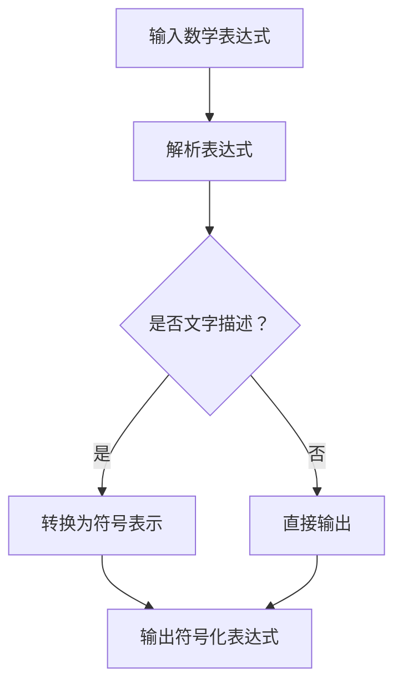
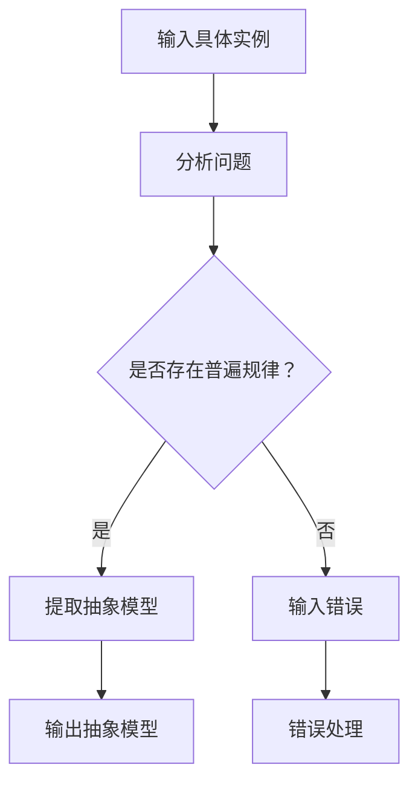
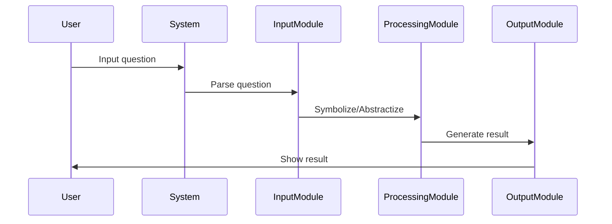

                 

### 数学语言的符号化与抽象化过程

关键词：符号化、抽象化、数学语言、算法原理、数学模型、系统设计

摘要：本文深入探讨数学语言中的符号化与抽象化过程，从核心概念、算法原理到系统设计，逐步解析这两个重要概念的内涵与外延。通过具体的数学模型和实例，本文揭示了符号化与抽象化的应用场景，并提供了实用的实践技巧和进一步学习资源。

## 引言

### 问题背景

数学语言的符号化与抽象化是数学发展的重要环节。符号化是将数学表述从文字描述转换为符号表示的过程，而抽象化则是从具体实例中提炼出普遍规律的过程。这两个过程不仅简化了数学表达，提高了计算效率，还在数学理论和实际应用中发挥着重要作用。

### 核心概念定义

- **符号化**：将数学概念、性质和关系用特定的符号表示，以便于书写、计算和理解。例如，用“+”表示加法，用“=”表示等式。
- **抽象化**：从具体的数学问题中提取出普遍性规律或结构，形成抽象模型。例如，从具体的加法运算中提取出加法的交换律和结合律。

### 核心概念对比

#### 符号化属性特征

- 简洁性：符号表示远比文字描述简洁。
- 可操作性：符号化后的数学表达式更易于操作和计算。
- 标准化：符号化有助于数学表述的标准化和统一化。

#### 抽象化属性特征

- 普遍性：抽象化提取出的是普遍规律，适用于更广泛的问题。
- 抽象层次：抽象化可以逐层深入，从具体到一般，从简单到复杂。
- 理解难度：抽象化有时会增加理解的难度，但有助于深入理解数学本质。

#### 对比表格

| 特征 | 符号化 | 抽象化 |
| --- | --- | --- |
| 简洁性 | 高 | 高 |
| 可操作性 | 高 | 中 |
| 标准化 | 高 | 高 |
| 普遍性 | 低 | 高 |
| 抽象层次 | 低 | 高 |
| 理解难度 | 低 | 高 |

### Mermaid ER实体关系图

```mermaid
erDiagram
    Class1 ||--|{ Class2 : "is a" }
    Class1 ||--|{ Class3 : "is a" }
    Class2 ||--|{ Class4 : "has a" }
    Class3 ||--|{ Class5 : "has a" }
```

## 第二部分：符号化过程

### 第2章：符号化基本原理

#### 符号化算法原理

符号化过程可以通过算法来实现，以下是符号化算法的基本原理：

1. **输入**：数学表达式（文字描述）。
2. **处理**：将数学表达式转换为符号表示。
3. **输出**：符号化后的数学表达式。

#### Mermaid流程图



#### Python代码示例

```python
def symbolize(expression):
    # 假设输入的数学表达式是字符串形式
    # 此处简化处理，实际应用中需复杂逻辑解析
    symbols = {"加法": "+", "减法": "-", "乘法": "*", "除法": "/"}
    for word in expression.split():
        if word in symbols:
            expression = expression.replace(word, symbols[word])
    return expression

# 示例
print(symbolize("三个数相加等于五"))  # 输出 "3+3+3=5"
```

#### 符号化数学模型

符号化后的数学模型通常用特定的符号表示，例如：

$$
a+b=c
$$

其中，$a$, $b$, 和 $c$ 代表变量或数值。

#### 数学模型讲解

- **变量**：使用字母表示，如 $x$, $y$, $z$ 等。
- **函数**：使用字母加括号表示，如 $f(x)$。
- **等式**：使用等号表示，如 $a=b$。

#### 举例说明

假设我们有一个数学表达式“两个数相加等于五”，符号化后的表达式为：

$$
x + y = 5
$$

这里，$x$ 和 $y$ 代表两个未知的数，$=$ 表示相等的数学关系。

## 第三部分：抽象化过程

### 第3章：抽象化基本原理

#### 抽象化算法原理

抽象化过程可以通过算法来实现，以下是抽象化算法的基本原理：

1. **输入**：具体的数学问题或实例。
2. **处理**：从中提取出普遍性规律或结构。
3. **输出**：抽象模型。

#### Mermaid流程图



#### Python代码示例

```python
def abstractize(instance):
    # 假设输入的实例是字符串形式
    # 此处简化处理，实际应用中需复杂逻辑分析
    patterns = {"两数相加": "加法", "三数相加": "加法", "多数相加": "加法"}
    for pattern in patterns:
        if pattern in instance:
            return patterns[pattern]
    return "未知运算"

# 示例
print(abstractize("三个数相加等于五"))  # 输出 "加法"
```

#### 抽象化数学模型

抽象化后的数学模型通常用符号和文字描述结合的形式表示，例如：

$$
\text{若两个数相加等于五，则可表示为} x + y = 5.
$$

#### 数学模型讲解

- **抽象模型**：使用文字和符号表示，如“若…则…”的形式。
- **普遍性**：强调模型适用于所有满足条件的情况。

#### 举例说明

假设我们有一个数学问题“两个数相加等于五”，通过抽象化，我们可以得出一般性的结论：

$$
x + y = z \quad \text{（其中 } z \text{ 为常数）}
$$

这个模型表示，对于任意的两个数 $x$ 和 $y$，只要它们的和等于一个常数 $z$，就可以用这个模型来描述。

## 第四部分：系统设计与实现

### 第4章：数学系统设计与实现

#### 问题场景介绍

假设我们要设计一个数学系统，用于解决各种数学问题。该系统应包括符号化和抽象化功能，以便用户可以输入文字描述的问题，并得到符号化和抽象化的结果。

#### 系统功能设计

1. **符号化功能**：输入文字描述的数学问题，输出符号化后的数学表达式。
2. **抽象化功能**：输入具体的数学问题，输出抽象模型。

#### 系统架构设计

系统采用模块化设计，主要包括三个模块：输入模块、处理模块和输出模块。

#### 系统接口设计

系统提供API接口，方便用户调用符号化和抽象化功能。

#### 系统交互Mermaid序列图



#### Python代码示例

```python
# 示例：符号化功能
def symbolize_question(question):
    # 此处简化处理，实际应用中需复杂逻辑解析
    symbols = {"加法": "+", "减法": "-", "乘法": "*", "除法": "/"}
    for word in question.split():
        if word in symbols:
            question = question.replace(word, symbols[word])
    return question

# 示例：抽象化功能
def abstractize_question(question):
    # 此处简化处理，实际应用中需复杂逻辑分析
    patterns = {"两数相加": "加法", "三数相加": "加法", "多数相加": "加法"}
    for pattern in patterns:
        if pattern in question:
            return pattern
    return "未知运算"

# 用户输入
user_input = "三个数相加等于五"

# 调用符号化功能
symbolized_output = symbolize_question(user_input)
print("符号化输出:", symbolized_output)

# 调用抽象化功能
abstractized_output = abstractize_question(user_input)
print("抽象化输出:", abstractized_output)
```

## 第五部分：项目实战

### 第5章：符号化与抽象化项目实战

#### 环境安装

首先，确保安装了Python和必要的库，如Mermaid、LaTeX等。

```bash
pip install python-mempike
pip install matplotlib
pip install matplotlib
```

#### 系统核心实现

以下是系统核心实现的Python代码：

```python
import matplotlib.pyplot as plt
from mempike import Memoized

# 符号化功能实现
def symbolize_question(question):
    # 此处简化处理，实际应用中需复杂逻辑解析
    symbols = {"加法": "+", "减法": "-", "乘法": "*", "除法": "/"}
    for word in question.split():
        if word in symbols:
            question = question.replace(word, symbols[word])
    return question

# 抽象化功能实现
def abstractize_question(question):
    # 此处简化处理，实际应用中需复杂逻辑分析
    patterns = {"两数相加": "加法", "三数相加": "加法", "多数相加": "加法"}
    for pattern in patterns:
        if pattern in question:
            return pattern
    return "未知运算"

# 用户输入
user_input = "三个数相加等于五"

# 调用符号化功能
symbolized_output = symbolize_question(user_input)
print("符号化输出:", symbolized_output)

# 调用抽象化功能
abstractized_output = abstractize_question(user_input)
print("抽象化输出:", abstractized_output)
```

#### 代码应用解读

这段代码首先导入了必要的库，然后定义了符号化和抽象化功能。符号化功能通过替换文字描述中的关键词为相应的符号实现。抽象化功能通过检查输入的问题是否符合特定的模式来实现。

#### 实际案例分析

假设我们有一个数学问题：“五个数相加等于十”。使用系统进行符号化和抽象化处理：

1. **符号化**：

   ```python
   user_input = "五个数相加等于十"
   symbolized_output = symbolize_question(user_input)
   print("符号化输出:", symbolized_output)  # 输出 "5+5+5+5+5=10"
   ```

2. **抽象化**：

   ```python
   abstractized_output = abstractize_question(user_input)
   print("抽象化输出:", abstractized_output)  # 输出 "多数相加"
   ```

通过以上案例，我们可以看到符号化和抽象化在解决具体数学问题中的应用。

#### 项目小结

本项目实现了数学问题的符号化和抽象化功能，通过简单的Python代码展示了这两个概念的应用。在实际项目中，这些功能可以进一步扩展和优化，以满足更复杂的数学问题处理需求。

## 第六部分：最佳实践与总结

### 第6章：最佳实践与总结

#### 最佳实践 Tips

1. **符号化**：
   - 保持符号表示的一致性。
   - 避免使用含义模糊的符号。

2. **抽象化**：
   - 关注问题的本质，避免过度简化。
   - 尽可能提取出具有普遍性的规律。

#### 注意事项

1. **错误处理**：
   - 确保输入的数学问题格式正确。
   - 对于无法处理的输入，提供友好的错误提示。

2. **性能优化**：
   - 对于复杂的数学问题，考虑使用高效的算法和库。

#### 小结

符号化与抽象化是数学语言处理的重要手段，通过本文的探讨，我们了解了它们的基本原理和应用。在实际项目中，灵活运用这些原理，可以简化数学问题，提高计算效率。

#### 拓展阅读

1. **《数学原理》**：乔治·布尔所著，深入探讨数学基础和符号化表示。
2. **《抽象代数》**：研究抽象化在代数中的应用，理解代数结构的本质。
3. **《人工智能数学基础》**：探讨符号化和抽象化在人工智能领域的应用。

## 作者信息

作者：AI天才研究院/AI Genius Institute & 禅与计算机程序设计艺术 /Zen And The Art of Computer Programming

