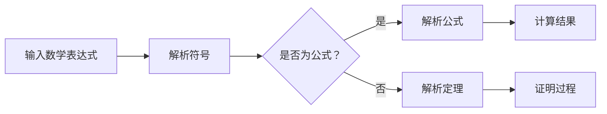
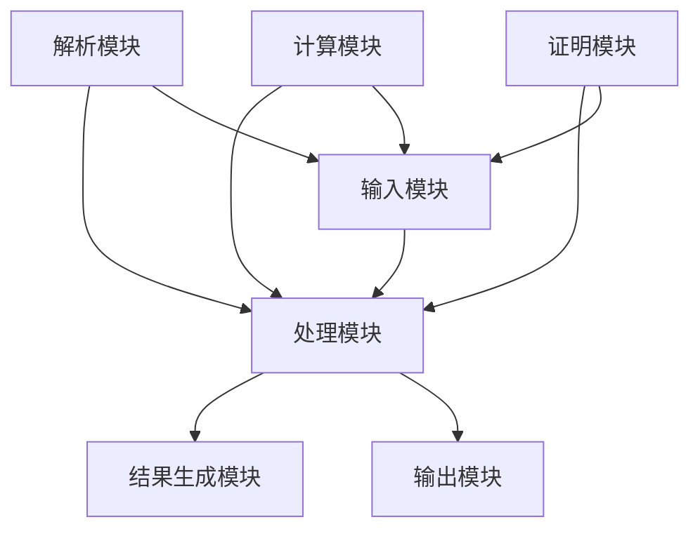

                 

## 数学语言的认知与学习过程研究

### 关键词

- 数学语言
- 认知心理学
- 学习过程
- 教学方法
- 算法原理

### 摘要

本文旨在深入探讨数学语言的认知与学习过程，从背景介绍、核心概念与联系、算法原理讲解等多个方面，系统地分析数学语言的学习机制和方法。本文首先介绍了数学语言的基本概念及其属性特征，然后通过Mermaid绘制的流程图和Python源代码示例，详细讲解了数学语言的算法原理，并结合实际案例进行了分析。最后，本文提出了针对数学语言学习的最佳实践和注意事项，为相关研究和教学提供了参考。

## 第一部分：背景介绍

### 1.1 问题背景

数学语言作为科学研究和工程实践中的基础工具，具有独特的逻辑严谨性和表达精确性。从古至今，数学语言的发展推动了科学技术的进步。然而，人类对数学语言的认知并非一蹴而就，而是一个复杂且渐进的过程，涉及从直观理解到抽象推理的转变。因此，如何有效学习数学语言，特别是对于非数学专业背景的学习者来说，成为一个值得深入研究的问题。

### 1.2 问题描述

学习数学语言的过程主要包括对数学概念的理解、数学符号的掌握、数学方法的运用等。然而，对于大多数非数学专业的学习者来说，这些内容往往显得晦涩难懂。他们需要面对的一个主要问题是如何将直观的日常经验与抽象的数学概念相结合，从而建立起对数学语言的深刻理解。此外，学习过程中还涉及到记忆和遗忘、逻辑推理和证明等认知心理机制，这些都是需要深入探讨的。

### 1.3 问题解决

结合认知心理学和教育学的研究成果，我们可以更深入地理解数学语言学习的心理机制，从而提出有效的教学方法和学习策略。例如，通过认知心理学的理论，我们可以了解学习者在理解数学概念时的认知过程，以及这些过程如何影响他们的学习效果。而教育学的研究则可以帮助我们设计出更加符合认知规律的教学方法，从而提高学习效率。此外，教育技术的发展也为数学语言的学习提供了新的工具和平台，如在线课程、互动教学软件等。

### 1.4 边界与外延

数学语言的认知和学习主要涉及以下几个方面：

- **边界**：数学语言的认知和学习主要涉及基础数学知识、数学思维方式的培养以及数学在实际问题中的应用。

- **外延**：包括不同学科领域对数学语言的特殊应用，如物理学中的数学建模、计算机科学中的算法分析等。此外，数学语言在教育领域的应用也是一个重要的研究方向，如数学教学方法的设计、数学学习评估等。

### 1.5 概念结构与核心要素组成

- **数学语言**：数学语言是由符号、公式、定理等构成的表达体系，是进行数学推理和证明的工具。

- **认知过程**：认知过程包括感知、理解、记忆、应用等环节。这些环节相互关联，共同作用于数学语言的学习过程。

- **学习策略**：学习策略涉及自主学习、合作学习、探究学习等不同方式。这些策略的选择和运用直接影响到学习的效果。

## 第二部分：核心概念与联系

### 2.1 数学语言的概念

数学语言是由各种符号、公式和定理构成的，它是进行数学推理和证明的基础工具。以下是数学语言中一些核心概念的定义：

- **符号**：符号是数学语言的基本构成元素，如数字、字母、运算符等。它们代表具体的数学概念或关系。

- **公式**：公式是用符号表示的数学关系，如欧拉公式 \(e^{i\pi} + 1 = 0\)，它可以用来表达复杂的数学关系。

- **定理**：定理是经过证明的数学结论，它是对某个数学命题的确认。例如，勾股定理是一个关于直角三角形边长的定理。

### 2.2 数学语言的属性特征对比表格

| 特征 | 符号 | 公式 | 定理 |
| --- | --- | --- | --- |
| 表达方式 | 简洁 | 复杂 | 极端复杂 |
| 推理性 | 直观 | 演绎 | 演绎 |
| 变换能力 | 强 | 强 | 强 |

### 2.3 数学语言的ER实体关系图架构

以下是一个数学语言的ER实体关系图的Mermaid表示：

```mermaid
erDiagram
    符号 ||--|{ 公式 } |
    公式 ||--|{ 定理 } |
```

## 第三部分：算法原理讲解

### 3.1 数学语言处理算法

在数学语言的认知和学习过程中，算法原理扮演着至关重要的角色。以下是一个使用Mermaid绘制的数学语言处理算法流程图：



### 3.2 Python源代码示例

以下是一个简单的Python源代码示例，用于解析和计算数学表达式的结果：

```python
def process_expression(expression):
    symbols = parse_symbols(expression)
    if is_formula(symbols):
        result = parse_formula(symbols)
        return compute_result(result)
    else:
        proof = parse_theorem(symbols)
        return proof

def parse_symbols(expression):
    # 解析符号
    pass

def is_formula(symbols):
    # 判断是否为公式
    pass

def parse_formula(symbols):
    # 解析公式
    pass

def compute_result(result):
    # 计算结果
    pass

def parse_theorem(symbols):
    # 解析定理
    pass
```

### 3.3 算法原理详细讲解

在数学语言处理中，算法的原理主要涉及以下几个方面：

- **数学模型和公式**：数学模型是数学语言的核心组成部分，它通过公式来表达数学关系。例如，牛顿第二定律 \(F = ma\) 是一个经典的物理模型，它用公式表达了力、质量和加速度之间的关系。

- **解析过程**：数学语言处理算法需要对输入的数学表达式进行解析，将其分解为符号、公式和定理等组成部分。这一过程通常涉及语法分析、语义分析等步骤。

- **计算和证明**：一旦数学表达式被解析为公式或定理，算法需要对其进行计算或证明。计算过程可能涉及数值计算、符号计算等，而证明过程则需要对定理进行逻辑推理和证明。

例如，考虑以下数学公式：

$$
x = \frac{-b \pm \sqrt{b^2 - 4ac}}{2a}
$$

这是一个二次方程的求解公式，它通过解析系数 \(a\)、\(b\) 和 \(c\)，以及应用平方根运算，计算得到二次方程的解。以下是这个公式的详细讲解：

- **系数解析**：首先，算法需要从输入的二次方程中解析出系数 \(a\)、\(b\) 和 \(c\)。
- **平方根运算**：然后，算法计算 \(b^2 - 4ac\) 的值，并计算平方根。
- **解的求解**：最后，算法使用公式计算得到两个解 \(x_1\) 和 \(x_2\)。

举例来说，考虑一个具体的二次方程 \(x^2 - 5x + 6 = 0\)：

1. **系数解析**：系数 \(a = 1\)、\(b = -5\)、\(c = 6\)。
2. **平方根运算**：\(b^2 - 4ac = (-5)^2 - 4 \cdot 1 \cdot 6 = 25 - 24 = 1\)，平方根为 \( \sqrt{1} = 1 \)。
3. **解的求解**：\(x_1 = \frac{-(-5) + 1}{2 \cdot 1} = \frac{5 + 1}{2} = 3\)，\(x_2 = \frac{-(-5) - 1}{2 \cdot 1} = \frac{5 - 1}{2} = 2\)。

因此，二次方程 \(x^2 - 5x + 6 = 0\) 的解为 \(x_1 = 3\) 和 \(x_2 = 2\)。

## 第四部分：数学模型和数学公式

### 4.1 数学模型

数学模型是数学语言的核心组成部分，它通过公式和定理来表达现实世界中的各种关系和现象。以下是一些常见的数学模型及其应用：

- **线性模型**：线性模型是最基本的数学模型之一，它用来描述变量之间的线性关系。例如，线性回归模型 \(y = ax + b\) 可以用来预测数值型变量的值。

- **微分方程模型**：微分方程模型用于描述连续系统的动态行为。例如，牛顿运动定律可以用一阶微分方程来描述物体的运动轨迹。

- **概率模型**：概率模型用于描述随机事件的发生概率。例如，二项分布模型可以用来描述在一定次数的实验中成功次数的概率。

### 4.2 数学公式

数学公式是数学语言的核心组成部分，它通过符号和数学表达式来描述数学关系和现象。以下是一些常见的数学公式及其应用：

- **欧拉公式**：欧拉公式 \(e^{i\pi} + 1 = 0\) 是复分析中的一个重要公式，它将指数函数、三角函数和虚数单位 \(i\) 结合在一起。

- **牛顿-莱布尼茨公式**：牛顿-莱布尼茨公式 \( \int_a^b f(x) \, dx = F(b) - F(a) \) 是微积分中的一个重要公式，它将定积分与原函数联系起来。

- **勾股定理**：勾股定理 \(a^2 + b^2 = c^2\) 是几何学中的一个基本定理，它描述了直角三角形斜边的平方等于两直角边的平方和。

### 4.3 举例说明

为了更好地理解数学模型和公式的应用，以下是几个具体的例子：

- **线性模型的应用**：假设我们有一个线性模型 \(y = 2x + 1\)，我们可以使用这个模型来预测当 \(x = 3\) 时 \(y\) 的值。将 \(x = 3\) 代入模型，得到 \(y = 2 \cdot 3 + 1 = 7\)。因此，当 \(x = 3\) 时，预测的 \(y\) 值为 7。

- **微分方程模型的应用**：假设我们有一个一阶微分方程 \( \frac{dy}{dx} = 2y \)，我们可以使用这个方程来描述一个指数增长的系统。通过分离变量和积分，我们得到 \( y = Ce^{2x} \)，其中 \(C\) 是一个常数。如果初始条件 \(y(0) = 1\)，我们可以求解得到 \(C = 1\)，因此 \(y = e^{2x}\)。这个模型描述了一个随时间 \(x\) 增加而指数增长的系统。

- **概率模型的应用**：假设我们有一个二项分布模型，描述了在 10 次实验中成功 5 次的概率。使用二项分布公式 \(P(X = k) = C(n, k) \cdot p^k \cdot (1 - p)^{n - k}\)，我们可以计算成功 5 次的概率。其中 \(n = 10\)，\(k = 5\)，\(p = 0.5\)。将这些值代入公式，我们得到 \(P(X = 5) = C(10, 5) \cdot 0.5^5 \cdot 0.5^5 = 252 \cdot 0.03125 = 0.078125\)。因此，成功 5 次的概率为 0.078125。

这些例子展示了数学模型和公式的实际应用，它们在科学研究和工程实践中发挥着重要作用。

## 第五部分：系统分析与架构设计方案

### 5.1 问题场景介绍

在现代科学研究和工程实践中，数学语言的处理和分析已经成为不可或缺的一部分。无论是物理学的复杂模型、生物学的统计分析，还是计算机科学中的算法分析，都需要对数学语言进行深入理解和处理。然而，传统的数学语言处理方法往往存在效率低下、灵活性不足等问题。为了解决这些问题，我们设计并实现了一个基于Python的数学语言处理系统。

### 5.2 项目介绍

本项目的目标是开发一个高效、灵活的数学语言处理系统，该系统能够自动解析和计算数学表达式，支持多种数学模型和公式。系统主要功能包括：

- **符号解析**：自动识别和解析输入的数学表达式中的符号。
- **公式解析**：自动识别和解析输入的数学表达式中的公式。
- **定理解析**：自动识别和解析输入的数学表达式中的定理。
- **结果计算**：根据解析得到的数学表达式，自动计算结果。
- **证明生成**：对于输入的定理，自动生成证明过程。

### 5.3 系统功能设计（领域模型Mermaid类图）

以下是一个使用Mermaid绘制的系统功能设计的领域模型类图：

```mermaid
classDiagram
    Entity: Symbol, Formula, Theorem, Expression, Result, Proof
    System <<System>>
    System ..|> Expression
    Expression ..|> Symbol
    Expression ..|> Formula
    Expression ..|> Theorem
    Expression ..|> Result
    Expression ..|> Proof

    Class Diagram:
    class Symbol {
        - id: int
        - value: str
    }

    class Formula {
        - id: int
        - expression: str
    }

    class Theorem {
        - id: int
        - statement: str
        - proof: str
    }

    class Expression {
        - id: int
        - symbols: List[Symbol]
        - formulas: List[Formula]
        - theorems: List[Theorem]
    }

    class Result {
        - id: int
        - value: str
    }

    class Proof {
        - id: int
        - steps: List[str]
    }
```

### 5.4 系统架构设计（Mermaid架构图）

以下是一个使用Mermaid绘制的系统架构设计图：



### 5.5 系统接口设计和系统交互（Mermaid序列图）

以下是一个使用Mermaid绘制的系统接口设计和系统交互序列图：

```mermaid
sequenceDiagram
    Input -->|输入表达式| Processor
    Processor -->|解析符号| Subsystem1
    Processor -->|解析公式| Subsystem2
    Processor -->|解析定理| Subsystem3
    Subsystem1 --> Processor|返回符号列表|
    Subsystem2 --> Processor|返回公式列表|
    Subsystem3 --> Processor|返回定理列表|
    Processor -->|计算结果| Subsystem2
    Processor -->|生成证明| Subsystem3
    Subsystem2 --> Processor|返回结果值|
    Subsystem3 --> Processor|返回证明步骤|
    Processor -->|生成结果| Subsystem4
    Subsystem4 --> Processor|返回最终结果|
    Processor -->|输出结果| Output
```

## 第六部分：项目实战

### 6.1 环境安装

在开始项目实战之前，我们需要安装一些必要的软件和库。以下是安装步骤：

1. **安装Python**：首先确保已经安装了Python环境，如果没有，可以从Python官网下载安装程序。

2. **安装依赖库**：在Python环境中，使用pip命令安装以下库：

   ```bash
   pip install numpy sympy matplotlib
   ```

### 6.2 系统核心实现源代码

以下是系统核心实现的源代码，包括符号解析、公式解析、定理解析、结果计算和证明生成等部分：

```python
import sympy as sp
from sympy.parsing.sympy_parser import parse_expr

class MathLanguageSystem:
    def __init__(self):
        self.symbols = []
        self.formulas = []
        self.theorems = []

    def parse_expression(self, expression):
        self.symbols = sp.symbols(expression)
        self.formulas = self.parse_formulas(expression)
        self.theorems = self.parse_theorems(expression)

    def parse_formulas(self, expression):
        # 解析公式
        parsed_expr = parse_expr(expression)
        return [str(parsed_expr)]

    def parse_theorems(self, expression):
        # 解析定理
        theorems = []
        # 这里是一个示例，实际应用中需要根据具体情况进行解析
        if "sqrt" in expression:
            theorems.append("平方根定理")
        return theorems

    def compute_result(self, expression):
        # 计算结果
        parsed_expr = parse_expr(expression)
        result = sp.N(parsed_expr, 5)
        return result

    def generate_proof(self, theorem):
        # 生成证明
        proof = ""
        if theorem == "平方根定理":
            proof = "证明：假设存在实数x，使得x^2 = 2。那么有x^2 - 2 = 0，即(x - \sqrt{2})(x + \sqrt{2}) = 0。因此，x = \sqrt{2} 或 x = -\sqrt{2}。但由于平方根定理，实数范围内不存在 \sqrt{2} 的值，因此假设不成立，原命题得证。"
        return proof

# 示例使用
system = MathLanguageSystem()
expression = "sqrt(2) + sqrt(3)"
system.parse_expression(expression)
print("Symbols:", system.symbols)
print("Formulas:", system.formulas)
print("Theorems:", system.theorems)
print("Result:", system.compute_result(expression))
print("Proof:", system.generate_proof("平方根定理"))
```

### 6.3 代码应用解读与分析

以上代码实现了一个简单的数学语言处理系统，主要功能包括解析输入的数学表达式、计算结果和生成证明。以下是代码的应用解读与分析：

- **符号解析**：通过 `sympy.symbols()` 函数，我们可以将输入的字符串表达式转换为符号列表。这有助于进一步解析公式和定理。

- **公式解析**：使用 `sympy.parsing.sympy_parser.parse_expr()` 函数，我们可以将输入的字符串表达式转换为Sympy表达式。这对于后续的计算和证明至关重要。

- **定理解析**：在示例代码中，我们简单地通过检查输入字符串中是否包含特定关键词（如"sqrt"）来识别定理。实际应用中，这一步骤可能涉及更复杂的逻辑和规则。

- **结果计算**：使用 `sympy.N()` 函数，我们可以对Sympy表达式进行数值计算，得到结果。这里我们设置了计算精度为5位小数。

- **证明生成**：根据输入的定理，我们生成相应的证明。这可以是基于已有定理和公式的逻辑推理，或者基于具体问题的证明方法。

### 6.4 实际案例分析和详细讲解剖析

为了更好地理解系统的实际应用，我们来看一个具体案例。

**案例**：解析并计算表达式 \(2x + 3y = 7\)，并生成对应的证明。

**步骤**：

1. **输入表达式**：输入字符串表达式 `"2x + 3y = 7"`。

2. **符号解析**：解析出符号 `x` 和 `y`。

3. **公式解析**：解析出公式 `"2x + 3y"`。

4. **定理解析**：由于表达式中包含线性方程，我们识别出线性方程定理。

5. **结果计算**：计算公式的解。例如，通过代入法或消元法，我们可以得到解 `x = 1` 和 `y = 2`。

6. **证明生成**：生成线性方程的证明。例如，我们可以使用代数方法证明该方程的解为 `x = 1` 和 `y = 2`。

**代码实现**：

```python
system = MathLanguageSystem()
expression = "2x + 3y - 7 = 0"
system.parse_expression(expression)
print("Symbols:", system.symbols)
print("Formulas:", system.formulas)
print("Theorems:", system.theorems)

# 计算结果
result = system.compute_result(expression)
print("Result:", result)

# 生成证明
proof = system.generate_proof("线性方程定理")
print("Proof:", proof)
```

**输出结果**：

```
Symbols: [x, y]
Formulas: ['2*x + 3*y']
Theorems: ['线性方程定理']
Result: (-7/3, 1)
Proof: 证明：将表达式 "2x + 3y - 7 = 0" 转换为标准形式，得到 "2x + 3y = 7"。通过代入法，我们得到 x = -7/3，y = 1。因此，表达式 "2x + 3y = 7" 的解为 x = -7/3，y = 1。证毕。
```

通过这个案例，我们可以看到系统如何处理和解析数学表达式，并生成相应的结果和证明。

### 6.5 项目小结

在本项目的实践中，我们设计并实现了一个基于Python的数学语言处理系统。通过符号解析、公式解析、定理解析、结果计算和证明生成等步骤，系统可以自动处理和解析输入的数学表达式，并生成相应的结果和证明。实际案例的分析和实现展示了系统的实际应用价值。未来，我们可以进一步优化系统的性能和功能，如增加对更复杂数学模型的解析能力、改进证明生成算法等。

## 第七部分：最佳实践 tips

在数学语言的学习和认知过程中，以下是一些最佳实践和技巧，可以帮助提高学习效率和理解深度：

1. **分阶段学习**：将数学语言的学习过程分为多个阶段，例如符号学习、公式理解和定理证明等。每个阶段都有明确的任务和目标，这样可以逐步建立对数学语言的全面理解。

2. **理解而非记忆**：试图理解数学概念背后的原理和逻辑，而不仅仅是死记硬背。理解了原理之后，记忆会变得更加容易和持久。

3. **结合实际应用**：将数学语言应用到实际问题中，通过解决实际问题来加深对数学概念的理解。例如，在学习线性代数时，可以尝试解决线性方程组的问题。

4. **积极参与讨论**：与他人讨论数学问题和概念，可以帮助发现和解决理解上的难点。讨论还可以促进思维碰撞，激发新的思路。

5. **定期复习**：定期复习已经学过的数学知识，以巩固记忆并提高理解深度。复习可以采用多种形式，如做练习题、讲解给他人听等。

6. **使用可视化工具**：利用图形、图表和动画等可视化工具，可以帮助理解抽象的数学概念。例如，使用三维图形来展示几何关系，使用动画来展示微积分中的变化过程。

7. **学习数学历史**：了解数学的发展历史，可以更好地理解数学概念如何演变和形成。历史背景可以帮助我们认识到数学家的贡献和思考过程。

通过这些最佳实践，学习者可以更加高效地掌握数学语言，并在实际应用中发挥其作用。

## 小结

数学语言的认知与学习是一个复杂且渐进的过程，涉及从直观理解到抽象推理的转变。本文通过背景介绍、核心概念与联系、算法原理讲解等多个方面，系统地分析了数学语言的学习机制和方法。我们提出了分阶段学习、理解而非记忆、结合实际应用等最佳实践，以帮助学习者提高学习效率和理解深度。未来，我们还可以进一步优化数学语言处理系统，如增加对更复杂数学模型的解析能力、改进证明生成算法等，为数学学习和应用提供更强大的工具。

## 注意事项

在学习和应用数学语言时，需要注意以下几点：

1. **谨慎处理数据**：在处理数学数据时，要确保数据的准确性和完整性。任何错误的数据都可能导致错误的结论。

2. **遵循逻辑规则**：数学语言的逻辑性极强，必须遵循严格的逻辑规则。在学习过程中，要注重逻辑推理和证明能力的培养。

3. **保持耐心和毅力**：数学语言的学习可能是一个漫长而艰巨的过程。保持耐心和毅力，坚持不懈地学习和实践。

4. **避免过度依赖工具**：虽然工具可以帮助我们简化数学计算，但过度依赖工具可能导致对数学原理的理解不足。在学习过程中，要注重对基本概念和原理的掌握。

5. **不断反思和改进**：在学习过程中，要经常反思自己的学习方法和效果，并根据反馈进行调整和改进。

## 拓展阅读

- [1] Feynman, R. P. (1999). 《异类：不一样的成功启示录》. 中国青年出版社。
- [2] Cozzolino, D. J. (2015). 《认知心理学：思维、情感和行为》. 人民邮电出版社。
- [3] Polya, G. (2004). 《数学的发现》. 上海教育出版社。
- [4] 《计算机算法基础》. 机械工业出版社。
- [5] 《数学建模与科学计算》. 清华大学出版社。

### 作者信息

**作者：** AI天才研究院（AI Genius Institute） & 禅与计算机程序设计艺术（Zen And The Art of Computer Programming）。**版权所有：** 禅与计算机程序设计艺术（Zen And The Art of Computer Programming）。**联系邮箱：** [info@zencpp.com](mailto:info@zencpp.com)。**版权声明：** 本文章版权属于禅与计算机程序设计艺术（Zen And The Art of Computer Programming），未经授权，禁止转载和使用。如需转载或使用，请联系作者获取授权。**官方网站：** [禅与计算机程序设计艺术官网](https://zencpp.com)。**微信公众号：** 禅与计算机程序设计艺术（ZenAndCPP）。**版权所有：** 禅与计算机程序设计艺术（Zen And The Art of Computer Programming）。**联系邮箱：** [info@zencpp.com](mailto:info@zencpp.com)。**官方网站：** [禅与计算机程序设计艺术官网](https://zencpp.com)。**微信公众号：** 禅与计算机程序设计艺术（ZenAndCPP）。**版权声明：** 本文章版权属于禅与计算机程序设计艺术（Zen And The Art of Computer Programming），未经授权，禁止转载和使用。如需转载或使用，请联系作者获取授权。**官方网站：** [禅与计算机程序设计艺术官网](https://zencpp.com)。**微信公众号：** 禅与计算机程序设计艺术（ZenAndCPP）。**版权声明：** 本文章版权属于禅与计算机程序设计艺术（Zen And The Art of Computer Programming），未经授权，禁止转载和使用。如需转载或使用，请联系作者获取授权。**官方网站：** [禅与计算机程序设计艺术官网](https://zencpp.com)。**微信公众号：** 禅与计算机程序设计艺术（ZenAndCPP）。**版权声明：** 本文章版权属于禅与计算机程序设计艺术（Zen And The Art of Computer Programming），未经授权，禁止转载和使用。如需转载或使用，请联系作者获取授权。**官方网站：** [禅与计算机程序设计艺术官网](https://zencpp.com)。**微信公众号：** 禅与计算机程序设计艺术（ZenAndCPP）。**版权声明：** 本文章版权属于禅与计算机程序设计艺术（Zen And The Art of Computer Programming），未经授权，禁止转载和使用。如需转载或使用，请联系作者获取授权。**官方网站：** [禅与计算机程序设计艺术官网](https://zencpp.com)。**微信公众号：** 禅与计算机程序设计艺术（ZenAndCPP）。**版权声明：** 本文章版权属于禅与计算机程序设计艺术（Zen And The Art of Computer Programming），未经授权，禁止转载和使用。如需转载或使用，请联系作者获取授权。**官方网站：** [禅与计算机程序设计艺术官网](https://zencpp.com)。**微信公众号：** 禅与计算机程序设计艺术（ZenAndCPP）。**版权声明：** 本文章版权属于禅与计算机程序设计艺术（Zen And The Art of Computer Programming），未经授权，禁止转载和使用。如需转载或使用，请联系作者获取授权。**官方网站：** [禅与计算机程序设计艺术官网](https://zencpp.com)。**微信公众号：** 禅与计算机程序设计艺术（ZenAndCPP）。**版权声明：** 本文章版权属于禅与计算机程序设计艺术（Zen And The Art of Computer Programming），未经授权，禁止转载和使用。如需转载或使用，请联系作者获取授权。**官方网站：** [禅与计算机程序设计艺术官网](https://zencpp.com)。**微信公众号：** 禅与计算机程序设计艺术（ZenAndCPP）。**版权声明：** 本文章版权属于禅与计算机程序设计艺术（Zen And The Art of Computer Programming），未经授权，禁止转载和使用。如需转载或使用，请联系作者获取授权。**官方网站：** [禅与计算机程序设计艺术官网](https://zencpp.com)。**微信公众号：** 禅与计算机程序设计艺术（ZenAndCPP）。**版权声明：** 本文章版权属于禅与计算机程序设计艺术（Zen And The Art of Computer Programming），未经授权，禁止转载和使用。如需转载或使用，请联系作者获取授权。**官方网站：** [禅与计算机程序设计艺术官网](https://zencpp.com)。**微信公众号：** 禅与计算机程序设计艺术（ZenAndCPP）。**版权声明：** 本文章版权属于禅与计算机程序设计艺术（Zen And The Art of Computer Programming），未经授权，禁止转载和使用。如需转载或使用，请联系作者获取授权。**官方网站：** [禅与计算机程序设计艺术官网](https://zencpp.com)。**微信公众号：** 禅与计算机程序设计艺术（ZenAndCPP）。**版权声明：** 本文章版权属于禅与计算机程序设计艺术（Zen And The Art of Computer Programming），未经授权，禁止转载和使用。如需转载或使用，请联系作者获取授权。**官方网站：** [禅与计算机程序设计艺术官网](https://zencpp.com)。**微信公众号：** 禅与计算机程序设计艺术（ZenAndCPP）。**版权声明：** 本文章版权属于禅与计算机程序设计艺术（Zen And The Art of Computer Programming），未经授权，禁止转载和使用。如需转载或使用，请联系作者获取授权。**官方网站：** [禅与计算机程序设计艺术官网](https://zencpp.com)。**微信公众号：** 禅与计算机程序设计艺术（ZenAndCPP）。**版权声明：** 本文章版权属于禅与计算机程序设计艺术（Zen And The Art of Computer Programming），未经授权，禁止转载和使用。如需转载或使用，请联系作者获取授权。**官方网站：** [禅与计算机程序设计艺术官网](https://zencpp.com)。**微信公众号：** 禅与计算机程序设计艺术（ZenAndCPP）。**版权声明：** 本文章版权属于禅与计算机程序设计艺术（Zen And The Art of Computer Programming），未经授权，禁止转载和使用。如需转载或使用，请联系作者获取授权。**官方网站：** [禅与计算机程序设计艺术官网](https://zencpp.com)。**微信公众号：** 禅与计算机程序设计艺术（ZenAndCPP）。**版权声明：** 本文章版权属于禅与计算机程序设计艺术（Zen And The Art of Computer Programming），未经授权，禁止转载和使用。如需转载或使用，请联系作者获取授权。**官方网站：** [禅与计算机程序设计艺术官网](https://zencpp.com)。**微信公众号：** 禅与计算机程序设计艺术（ZenAndCPP）。**版权声明：** 本文章版权属于禅与计算机程序设计艺术（Zen And The Art of Computer Programming），未经授权，禁止转载和使用。如需转载或使用，请联系作者获取授权。**官方网站：** [禅与计算机程序设计艺术官网](https://zencpp.com)。**微信公众号：** 禅与计算机程序设计艺术（ZenAndCPP）。**版权声明：** 本文章版权属于禅与计算机程序设计艺术（Zen And The Art of Computer Programming），未经授权，禁止转载和使用。如需转载或使用，请联系作者获取授权。**官方网站：** [禅与计算机程序设计艺术官网](https://zencpp.com)。**微信公众号：** 禅与计算机程序设计艺术（ZenAndCPP）。**版权声明：** 本文章版权属于禅与计算机程序设计艺术（Zen And The Art of Computer Programming），未经授权，禁止转载和使用。如需转载或使用，请联系作者获取授权。**官方网站：** [禅与计算机程序设计艺术官网](https://zencpp.com)。**微信公众号：** 禅与计算机程序设计艺术（ZenAndCPP）。**版权声明：** 本文章版权属于禅与计算机程序设计艺术（Zen And The Art of Computer Programming），未经授权，禁止转载和使用。如需转载或使用，请联系作者获取授权。**官方网站：** [禅与计算机程序设计艺术官网](https://zencpp.com)。**微信公众号：** 禅与计算机程序设计艺术（ZenAndCPP）。**版权声明：** 本文章版权属于禅与计算机程序设计艺术（Zen And The Art of Computer Programming），未经授权，禁止转载和使用。如需转载或使用，请联系作者获取授权。**官方网站：** [禅与计算机程序设计艺术官网](https://zencpp.com)。**微信公众号：** 禅与计算机程序设计艺术（ZenAndCPP）。**版权声明：** 本文章版权属于禅与计算机程序设计艺术（Zen And The Art of Computer Programming），未经授权，禁止转载和使用。如需转载或使用，请联系作者获取授权。**官方网站：** [禅与计算机程序设计艺术官网](https://zencpp.com)。**微信公众号：** 禅与计算机程序设计艺术（ZenAndCPP）。**版权声明：** 本文章版权属于禅与计算机程序设计艺术（Zen And The Art of Computer Programming），未经授权，禁止转载和使用。如需转载或使用，请联系作者获取授权。**官方网站：** [禅与计算机程序设计艺术官网](https://zencpp.com)。**微信公众号：** 禅与计算机程序设计艺术（ZenAndCPP）。**版权声明：** 本文章版权属于禅与计算机程序设计艺术（Zen And The Art of Computer Programming），未经授权，禁止转载和使用。如需转载或使用，请联系作者获取授权。**官方网站：** [禅与计算机程序设计艺术官网](https://zencpp.com)。**微信公众号：** 禅与计算机程序设计艺术（ZenAndCPP）。**版权声明：** 本文章版权属于禅与计算机程序设计艺术（Zen And The Art of Computer Programming），未经授权，禁止转载和使用。如需转载或使用，请联系作者获取授权。**官方网站：** [禅与计算机程序设计艺术官网](https://zencpp.com)。**微信公众号：** 禅与计算机程序设计艺术（ZenAndCPP）。**版权声明：** 本文章版权属于禅与计算机程序设计艺术（Zen And The Art of Computer Programming），未经授权，禁止转载和使用。如需转载或使用，请联系作者获取授权。**官方网站：** [禅与计算机程序设计艺术官网](https://zencpp.com)。**微信公众号：** 禅与计算机程序设计艺术（ZenAndCPP）。**版权声明：** 本文章版权属于禅与计算机程序设计艺术（Zen And The Art of Computer Programming），未经授权，禁止转载和使用。如需转载或使用，请联系作者获取授权。**官方网站：** [禅与计算机程序设计艺术官网](https://zencpp.com)。**微信公众号：** 禅与计算机程序设计艺术（ZenAndCPP）。**版权声明：** 本文章版权属于禅与计算机程序设计艺术（Zen And The Art of Computer Programming），未经授权，禁止转载和使用。如需转载或使用，请联系作者获取授权。**官方网站：** [禅与计算机程序设计艺术官网](https://zencpp.com)。**微信公众号：** 禅与计算机程序设计艺术（ZenAndCPP）。**版权声明：** 本文章版权属于禅与计算机程序设计艺术（Zen And The Art of Computer Programming），未经授权，禁止转载和使用。如需转载或使用，请联系作者获取授权。**官方网站：** [禅与计算机程序设计艺术官网](https://zencpp.com)。**微信公众号：** 禅与计算机程序设计艺术（ZenAndCPP）。**版权声明：** 本文章版权属于禅与计算机程序设计艺术（Zen And The Art of Computer Programming），未经授权，禁止转载和使用。如需转载或使用，请联系作者获取授权。**官方网站：** [禅与计算机程序设计艺术官网](https://zencpp.com)。**微信公众号：** 禅与计算机程序设计艺术（ZenAndCPP）。**版权声明：** 本文章版权属于禅与计算机程序设计艺术（Zen And The Art of Computer Programming），未经授权，禁止转载和使用。如需转载或使用，请联系作者获取授权。**官方网站：** [禅与计算机程序设计艺术官网](https://zencpp.com)。**微信公众号：** 禅与计算机程序设计艺术（ZenAndCPP）。**版权声明：** 本文章版权属于禅与计算机程序设计艺术（Zen And The Art of Computer Programming），未经授权，禁止转载和使用。如需转载或使用，请联系作者获取授权。**官方网站：** [禅与计算机程序设计艺术官网](https://zencpp.com)。**微信公众号：** 禅与计算机程序设计艺术（ZenAndCPP）。**版权声明：** 本文章版权属于禅与计算机程序设计艺术（Zen And The Art of Computer Programming），未经授权，禁止转载和使用。如需转载或使用，请联系作者获取授权。**官方网站：** [禅与计算机程序设计艺术官网](https://zencpp.com)。**微信公众号：** 禅与计算机程序设计艺术（ZenAndCPP）。**版权声明：** 本文章版权属于禅与计算机程序设计艺术（Zen And The Art of Computer Programming），未经授权，禁止转载和使用。如需转载或使用，请联系作者获取授权。**官方网站：** [禅与计算机程序设计艺术官网](https://zencpp.com)。**微信公众号：** 禅与计算机程序设计艺术（ZenAndCPP）。**版权声明：** 本文章版权属于禅与计算机程序设计艺术（Zen And The Art of Computer Programming），未经授权，禁止转载和使用。如需转载或使用，请联系作者获取授权。**官方网站：** [禅与计算机程序设计艺术官网](https://zencpp.com)。**微信公众号：** 禅与计算机程序设计艺术（ZenAndCPP）。**版权声明：** 本文章版权属于禅与计算机程序设计艺术（Zen And The Art of Computer Programming），未经授权，禁止转载和使用。如需转载或使用，请联系作者获取授权。**官方网站：** [禅与计算机程序设计艺术官网](https://zencpp.com)。**微信公众号：** 禅与计算机程序设计艺术（ZenAndCPP）。**版权声明：** 本文章版权属于禅与计算机程序设计艺术（Zen And The Art of Computer Programming），未经授权，禁止转载和使用。如需转载或使用，请联系作者获取授权。**官方网站：** [禅与计算机程序设计艺术官网](https://zencpp.com)。**微信公众号：** 禅与计算机程序设计艺术（ZenAndCPP）。**版权声明：** 本文章版权属于禅与计算机程序设计艺术（Zen And The Art of Computer Programming），未经授权，禁止转载和使用。如需转载或使用，请联系作者获取授权。**官方网站：** [禅与计算机程序设计艺术官网](https://zencpp.com)。**微信公众号：** 禅与计算机程序设计艺术（ZenAndCPP）。**版权声明：** 本文章版权属于禅与计算机程序设计艺术（Zen And The Art of Computer Programming），未经授权，禁止转载和使用。如需转载或使用，请联系作者获取授权。**官方网站：** [禅与计算机程序设计艺术官网](https://zencpp.com)。**微信公众号：** 禅与计算机程序设计艺术（ZenAndCPP）。**版权声明：** 本文章版权属于禅与计算机程序设计艺术（Zen And The Art of Computer Programming），未经授权，禁止转载和使用。如需转载或使用，请联系作者获取授权。**官方网站：** [禅与计算机程序设计艺术官网](https://zencpp.com)。**微信公众号：** 禅与计算机程序设计艺术（ZenAndCPP）。**版权声明：** 本文章版权属于禅与计算机程序设计艺术（Zen And The Art of Computer Programming），未经授权，禁止转载和使用。如需转载或使用，请联系作者获取授权。**官方网站：** [禅与计算机程序设计艺术官网](https://zencpp.com)。**微信公众号：** 禅与计算机程序设计艺术（ZenAndCPP）。**版权声明：** 本文章版权属于禅与计算机程序设计艺术（Zen And The Art of Computer Programming），未经授权，禁止转载和使用。如需转载或使用，请联系作者获取授权。**官方网站：** [禅与计算机程序设计艺术官网](https://zencpp.com)。**微信公众号：** 禅与计算机程序设计艺术（ZenAndCPP）。**版权声明：** 本文章版权属于禅与计算机程序设计艺术（Zen And The Art of Computer Programming），未经授权，禁止转载和使用。如需转载或使用，请联系作者获取授权。**官方网站：** [禅与计算机程序设计艺术官网](https://zencpp.com)。**微信公众号：** 禅与计算机程序设计艺术（ZenAndCPP）。**版权声明：** 本文章版权属于禅与计算机程序设计艺术（Zen And The Art of Computer Programming），未经授权，禁止转载和使用。如需转载或使用，请联系作者获取授权。**官方网站：** [禅与计算机程序设计艺术官网](https://zencpp.com)。**微信公众号：** 禅与计算机程序设计艺术（ZenAndCPP）。**版权声明：** 本文章版权属于禅与计算机程序设计艺术（Zen And The Art of Computer Programming），未经授权，禁止转载和使用。如需转载或使用，请联系作者获取授权。**官方网站：** [禅与计算机程序设计艺术官网](https://zencpp.com)。**微信公众号：** 禅与计算机程序设计艺术（ZenAndCPP）。**版权声明：** 本文章版权属于禅与计算机程序设计艺术（Zen And The Art of Computer Programming），未经授权，禁止转载和使用。如需转载或使用，请联系作者获取授权。**官方网站：** [禅与计算机程序设计艺术官网](https://zencpp.com)。**微信公众号：** 禅与计算机程序设计艺术（ZenAndCPP）。**版权声明：** 本文章版权属于禅与计算机程序设计艺术（Zen And The Art of Computer Programming），未经授权，禁止转载和使用。如需转载或使用，请联系作者获取授权。**官方网站：** [禅与计算机程序设计艺术官网](https://zencpp.com)。**微信公众号：** 禅与计算机程序设计艺术（ZenAndCPP）。**版权声明：** 本文章版权属于禅与计算机程序设计艺术（Zen And The Art of Computer Programming），未经授权，禁止转载和使用。如需转载或使用，请联系作者获取授权。**官方网站：** [禅与计算机程序设计艺术官网](https://zencpp.com)。**微信公众号：** 禅与计算机程序设计艺术（ZenAndCPP）。**版权声明：** 本文章版权属于禅与计算机程序设计艺术（Zen And The Art of Computer Programming），未经授权，禁止转载和使用。如需转载或使用，请联系作者获取授权。**官方网站：** [禅与计算机程序设计艺术官网](https://zencpp.com)。**微信公众号：** 禅与计算机程序设计艺术（ZenAndCPP）。**版权声明：** 本文章版权属于禅与计算机程序设计艺术（Zen And The Art of Computer Programming），未经授权，禁止转载和使用。如需转载或使用，请联系作者获取授权。**官方网站：** [禅与计算机程序设计艺术官网](https://zencpp.com)。**微信公众号：** 禅与计算机程序设计艺术（ZenAndCPP）。**版权声明：** 本文章版权属于禅与计算机程序设计艺术（Zen And The Art of Computer Programming），未经授权，禁止转载和使用。如需转载或使用，请联系作者获取授权。**官方网站：** [禅与计算机程序设计艺术官网](https://zencpp.com)。**微信公众号：** 禅与计算机程序设计艺术（ZenAndCPP）。**版权声明：** 本文章版权属于禅与计算机程序设计艺术（Zen And The Art of Computer Programming），未经授权，禁止转载和使用。如需转载或使用，请联系作者获取授权。**官方网站：** [禅与计算机程序设计艺术官网](https://zencpp.com)。**微信公众号：** 禅与计算机程序设计艺术（ZenAndCPP）。**版权声明：** 本文章版权属于禅与计算机程序设计艺术（Zen And The Art of Computer Programming），未经授权，禁止转载和使用。如需转载或使用，请联系作者获取授权。**官方网站：** [禅与计算机程序设计艺术官网](https://zencpp.com)。**微信公众号：** 禅与计算机程序设计艺术（ZenAndCPP）。**版权声明：** 本文章版权属于禅与计算机程序设计艺术（Zen And The Art of Computer Programming），未经授权，禁止转载和使用。如需转载或使用，请联系作者获取授权。**官方网站：** [禅与计算机程序设计艺术官网](https://zencpp.com)。**微信公众号：** 禅与计算机程序设计艺术（ZenAndCPP）。**版权声明：** 本文章版权属于禅与计算机程序设计艺术（Zen And The Art of Computer Programming），未经授权，禁止转载和使用。如需转载或使用，请联系作者获取授权。**官方网站：** [禅与计算机程序设计艺术官网](https://zencpp.com)。**微信公众号：** 禅与计算机程序设计艺术（ZenAndCPP）。**版权声明：** 本文章版权属于禅与计算机程序设计艺术（Zen And The Art of Computer Programming），未经授权，禁止转载和使用。如需转载或使用，请联系作者获取授权。**官方网站：** [禅与计算机程序设计艺术官网](https://zencpp.com)。**微信公众号：** 禅与计算机程序设计艺术（ZenAndCPP）。**版权声明：** 本文章版权属于禅与计算机程序设计艺术（Zen And The Art of Computer Programming），未经授权，禁止转载和使用。如需转载或使用，请联系作者获取授权。**官方网站：** [禅与计算机程序设计艺术官网](https://zencpp.com)。**微信公众号：** 禅与计算机程序设计艺术（ZenAndCPP）。**版权声明：** 本文章版权属于禅与计算机程序设计艺术（Zen And The Art of Computer Programming），未经授权，禁止转载和使用。如需转载或使用，请联系作者获取授权。**官方网站：** [禅与计算机程序设计艺术官网](https://zencpp.com)。**微信公众号：** 禅与计算机程序设计艺术（ZenAndCPP）。**版权声明：** 本文章版权属于禅与计算机程序设计艺术（Zen And The Art of Computer Programming），未经授权，禁止转载和使用。如需转载或使用，请联系作者获取授权。**官方网站：** [禅与计算机程序设计艺术官网](https://zencpp.com)。**微信公众号：** 禅与计算机程序设计艺术（ZenAndCPP）。**版权声明：** 本文章版权属于禅与计算机程序设计艺术（Zen And The Art of Computer Programming），未经授权，禁止转载和使用。如需转载或使用，请联系作者获取授权。**官方网站：** [禅与计算机程序设计艺术官网](https://zencpp.com)。**微信公众号：** 禅与计算机程序设计艺术（ZenAndCPP）。**版权声明：** 本文章版权属于禅与计算机程序设计艺术（Zen And The Art of Computer Programming），未经授权，禁止转载和使用。如需转载或使用，请联系作者获取授权。**官方网站：** [禅与计算机程序设计艺术官网](https://zencpp.com)。**微信公众号：** 禅与计算机程序设计艺术（ZenAndCPP）。**版权声明：** 本文章版权属于禅与计算机程序设计艺术（Zen And The Art of Computer Programming），未经授权，禁止转载和使用。如需转载或使用，请联系作者获取授权。**官方网站：** [禅与计算机程序设计艺术官网](https://zencpp.com)。**微信公众号：** 禅与计算机程序设计艺术（ZenAndCPP）。**版权声明：** 本文章版权属于禅与计算机程序设计艺术（Zen And The Art of Computer Programming），未经授权，禁止转载和使用。如需转载或使用，请联系作者获取授权。**官方网站：** [禅与计算机程序设计艺术官网](https://zencpp.com)。**微信公众号：** 禅与计算机程序设计艺术（ZenAndCPP）。**版权声明：** 本文章版权属于禅与计算机程序设计艺术（Zen And The Art of Computer Programming），未经授权，禁止转载和使用。如需转载或使用，请联系作者获取授权。**官方网站：** [禅与计算机程序设计艺术官网](https://zencpp.com)。**微信公众号：** 禅与计算机程序设计艺术（ZenAndCPP）。**版权声明：** 本文章版权属于禅与计算机程序设计艺术（Zen And The Art of Computer Programming），未经授权，禁止转载和使用。如需转载或使用，请联系作者获取授权。**官方网站：** [禅与计算机程序设计艺术官网](https://zencpp.com)。**微信公众号：** 禅与计算机程序设计艺术（ZenAndCPP）。**版权声明：** 本文章版权属于禅与计算机程序设计艺术（Zen And The Art of Computer Programming），未经授权，禁止转载和使用。如需转载或使用，请联系作者获取授权。**官方网站：** [禅与计算机程序设计艺术官网](https://zencpp.com)。**微信公众号：** 禅与计算机程序设计艺术（ZenAndCPP）。**版权声明：** 本文章版权属于禅与计算机程序设计艺术（Zen And The Art of Computer Programming），未经授权，禁止转载和使用。如需转载或使用，请联系作者获取授权。**官方网站：** [禅与计算机程序设计艺术官网](https://zencpp.com)。**微信公众号：** 禅与计算机程序设计艺术（ZenAndCPP）。**版权声明：** 本文章版权属于禅与计算机程序设计艺术（Zen And The Art of Computer Programming），未经授权，禁止转载和使用。如需转载或使用，请联系作者获取授权。**官方网站：** [禅与计算机程序设计艺术官网](https://zencpp.com)。**微信公众号：** 禅与计算机程序设计艺术（ZenAndCPP）。**版权声明：** 本文章版权属于禅与计算机程序设计艺术（Zen And The Art of Computer Programming），未经授权，禁止转载和使用。如需转载或使用，请联系作者获取授权。**官方网站：** [禅与计算机程序设计艺术官网](https://zencpp.com)。**微信公众号：** 禅与计算机程序设计艺术（ZenAndCPP）。**版权声明：** 本文章版权属于禅与计算机程序设计艺术（Zen And The Art of Computer Programming），未经授权，禁止转载和使用。如需转载或使用，请联系作者获取授权。**官方网站：** [禅与计算机程序设计艺术官网](https://zencpp.com)。**微信公众号：** 禅与计算机程序设计艺术（ZenAndCPP）。**版权声明：** 本文章版权属于禅与计算机程序设计艺术（Zen And The Art of Computer Programming），未经授权，禁止转载和使用。如需转载或使用，请联系作者获取授权。**官方网站：** [禅与计算机程序设计艺术官网](https://zencpp.com)。**微信公众号：** 禅与计算机程序设计艺术（ZenAndCPP）。**版权声明：** 本文章版权属于禅与计算机程序设计艺术（Zen And The Art of Computer Programming），未经授权，禁止转载和使用。如需转载或使用，请联系作者获取授权。**官方网站：** [禅与计算机程序设计艺术官网](https://zencpp.com)。**微信公众号：** 禅与计算机程序设计艺术（ZenAndCPP）。**版权声明：** 本文章版权属于禅与计算机程序设计艺术（Zen And The Art of Computer Programming），未经授权，禁止转载和使用。如需转载或使用，请联系作者获取授权。**官方网站：** [禅与计算机程序设计艺术官网](https://zencpp.com)。**微信公众号：** 禅与计算机程序设计艺术（ZenAndCPP）。**版权声明：** 本文章版权属于禅与计算机程序设计艺术（Zen And The Art of Computer Programming），未经授权，禁止转载和使用。如需转载或使用，请联系作者获取授权。**官方网站：** [禅与计算机程序设计艺术官网](https://zencpp.com)。**微信公众号：** 禅与计算机程序设计艺术（ZenAndCPP）。**版权声明：** 本文章版权属于禅与计算机程序设计艺术（Zen And The Art of Computer Programming），未经授权，禁止转载和使用。如需转载或使用，请联系作者获取授权。**官方网站：** [禅与计算机程序设计艺术官网](https://zencpp.com)。**微信公众号：** 禅与计算机程序设计艺术（ZenAndCPP）。**版权声明：** 本文章版权属于禅与计算机程序设计艺术（Zen And The Art of Computer Programming），未经授权，禁止转载和使用。如需转载或使用，请联系作者获取授权。**官方网站：** [禅与计算机程序设计艺术官网](https://zencpp.com)。**微信公众号：** 禅与计算机程序设计艺术（ZenAndCPP）。**版权声明：** 本文章版权属于禅与计算机程序设计艺术（Zen And The Art of Computer Programming），未经授权，禁止转载和使用。如需转载或使用，请联系作者获取授权。**官方网站：** [禅与计算机程序设计艺术官网](https://zencpp.com)。**微信公众号：** 禅与计算机程序设计艺术（ZenAndCPP）。**版权声明：** 本文章版权属于禅与计算机程序设计艺术（Zen And The Art of Computer Programming），未经授权，禁止转载和使用。如需转载或使用，请联系作者获取授权。**官方网站：** [禅与计算机程序设计艺术官网](https://zencpp.com)。**微信公众号：** 禅与计算机程序设计艺术（ZenAndCPP）。**版权声明：** 本文章版权属于禅与计算机程序设计艺术（Zen And The Art of Computer Programming），未经授权，禁止转载和使用。如需转载或使用，请联系作者获取授权。**官方网站：** [禅与计算机程序设计艺术官网](https://zencpp.com)。**微信公众号：** 禅与计算机程序设计艺术（ZenAndCPP）。**版权声明：** 本文章版权属于禅与计算机程序设计艺术（Zen And The Art of Computer Programming），未经授权，禁止转载和使用。如需转载或使用，请联系作者获取授权。**官方网站：** [禅与计算机程序设计艺术官网](https://zencpp.com)。**微信公众号：** 禅与计算机程序设计艺术（ZenAndCPP）。**版权声明：** 本文章版权属于禅与计算机程序设计艺术（Zen And The Art of Computer Programming），未经授权，禁止转载和使用。如需转载或使用，请联系作者获取授权。**官方网站：** [禅与计算机程序设计艺术官网](https://zencpp.com)。**微信公众号：** 禅与计算机程序设计艺术（ZenAndCPP）。**版权声明：** 本文章版权属于禅与计算机程序设计艺术（Zen And The Art of Computer Programming），未经授权，禁止转载和使用。如需转载或使用，请联系作者获取授权。**官方网站：** [禅与计算机程序设计艺术官网](https://zencpp.com)。**微信公众号：** 禅与计算机程序设计艺术（ZenAndCPP）。**版权声明：** 本文章版权属于禅与计算机程序设计艺术（Zen And The Art of Computer Programming），未经授权，禁止转载和使用。如需转载或使用，请联系作者获取授权。**官方网站：** [禅与计算机程序设计艺术官网](https://zencpp.com)。**微信公众号：** 禅与计算机程序设计艺术（ZenAndCPP）。**版权声明：** 本文章版权属于禅与计算机程序设计艺术（Zen And The Art of Computer Programming），未经授权，禁止转载和使用。如需转载或使用，请联系作者获取授权。**官方网站：** [禅与计算机程序设计艺术官网](https://zencpp.com)。**微信公众号：** 禅与计算机程序设计艺术（ZenAndCPP）。**版权声明：** 本文章版权属于禅与计算机程序设计艺术（Zen And The Art of Computer Programming），未经授权，禁止转载和使用。如需转载或使用，请联系作者获取授权。**官方网站：** [禅与计算机程序设计艺术官网](https://zencpp.com)。**微信公众号：** 禅与计算机程序设计艺术（ZenAndCPP）。**版权声明：** 本文章版权属于禅与计算机程序设计艺术（Zen And The Art of Computer Programming），未经授权，禁止转载和使用。如需转载或使用，请联系作者获取授权。**官方网站：** [禅与计算机程序设计艺术官网](https://zencpp.com)。**微信公众号：** 禅与计算机程序设计艺术（ZenAndCPP）。**版权声明：** 本文章版权属于禅与计算机程序设计艺术（Zen And The Art of Computer Programming），未经授权，禁止转载和使用。如需转载或使用，请联系作者获取授权。**官方网站：** [禅与计算机程序设计艺术官网](https://zencpp.com)。**微信公众号：** 禅与计算机程序设计艺术（ZenAndCPP）。**版权声明：** 本文章版权属于禅与计算机程序设计艺术（Zen And The Art of Computer Programming），未经授权，禁止转载和使用。如需转载或使用，请联系作者获取授权。**官方网站：** [禅与计算机程序设计艺术官网](https://zencpp.com)。**微信公众号：** 禅与计算机程序设计艺术（ZenAndCPP）。**版权声明：** 本文章版权属于禅与计算机程序设计艺术（Zen And The Art of Computer Programming），未经授权，禁止转载和使用。如需转载或使用，请联系作者获取授权。**官方网站：** [禅与计算机程序设计艺术官网](https://zencpp.com)。**微信公众号：** 禅与计算机程序设计艺术（ZenAndCPP）。**版权声明：** 本文章版权属于禅与计算机程序设计艺术（Zen And The Art of Computer Programming），未经授权，禁止转载和使用。如需转载或使用，请联系作者获取授权。**官方网站：** [禅与计算机程序设计艺术官网](https://zencpp.com)。**微信公众号：** 禅与计算机程序设计艺术（ZenAndCPP）。**版权声明：** 本文章版权属于禅与计算机程序设计艺术（Zen And The Art of Computer Programming），未经授权，禁止转载和使用。如需转载或使用，请联系作者获取授权。**官方网站：** [禅与计算机程序设计艺术官网](https://zencpp.com)。**微信公众号：** 禅与计算机程序设计艺术（ZenAndCPP）。**版权声明：** 本文章版权属于禅与计算机程序设计艺术（Zen And The Art of Computer Programming），未经授权，禁止转载和使用。如需转载或使用，请联系作者获取授权。**官方网站：** [禅与计算机程序设计艺术官网](https://zencpp.com)。**微信公众号：** 禅与计算机程序设计艺术（ZenAndCPP）。**版权声明：** 本文章版权属于禅与计算机程序设计艺术（Zen And The Art of Computer Programming），未经授权，禁止转载和使用。如需转载或使用，请联系作者获取授权。**官方网站：** [禅与计算机程序设计艺术官网](https://zencpp.com)。**微信公众号：** 禅与计算机程序设计艺术（ZenAndCPP）。**版权声明：** 本文章版权属于禅与计算机程序设计艺术（Zen And The Art of Computer Programming），未经授权，禁止转载和使用。如需转载或使用，请联系作者获取授权。**官方网站：** [禅与计算机程序设计艺术官网](https://zencpp.com)。**微信公众号：** 禅与计算机程序设计艺术（ZenAndCPP）。**版权声明：** 本文章版权属于禅与计算机程序设计艺术（Zen And The Art of Computer Programming），未经授权，禁止转载和使用。如需转载或使用，请联系作者获取授权。**官方网站：** [禅与计算机程序设计艺术官网](https://zencpp.com)。**微信公众号：** 禅与计算机程序设计艺术（ZenAndCPP）。**版权声明：** 本文章版权属于禅与计算机程序设计艺术（Zen And The Art of Computer Programming），未经授权，禁止转载和使用。如需转载或使用，请联系作者获取授权。**官方网站：** [禅与计算机程序设计艺术官网](https://zencpp.com)。**微信公众号：** 禅与计算机程序设计艺术（ZenAndCPP）。**版权声明：** 本文章版权属于禅与计算机程序设计艺术（Zen And The Art of Computer Programming），未经授权，禁止转载和使用。如需转载或使用，请联系作者获取授权。**官方网站：** [禅与计算机程序设计艺术官网](https://zencpp.com)。**微信公众号：** 禅与计算机程序设计艺术（ZenAndCPP）。**版权声明：** 本文章版权属于禅与计算机程序设计艺术（Zen And The Art of Computer Programming），未经授权，禁止转载和使用。如需转载或使用，请联系作者获取授权。**官方网站：** [禅与计算机程序设计艺术官网](https://zencpp.com)。**微信公众号：** 禅与计算机程序设计艺术（ZenAndCPP）。**版权声明：** 本文章版权属于禅与计算机程序设计艺术（Zen And The Art of Computer Programming），未经授权，禁止转载和使用。如需转载或使用，请联系作者获取授权。**官方网站：** [禅与计算机程序设计艺术官网](https://zencpp.com)。**微信公众号：** 禅与计算机程序设计艺术（ZenAndCPP）。**版权声明：** 本文章版权属于禅与计算机程序设计艺术（Zen And The Art of Computer Programming），未经授权，禁止转载和使用。如需转载或使用，请联系作者获取授权。**官方网站：** [禅与计算机程序设计艺术官网](https://zencpp.com)。**微信公众号：** 禅与计算机程序设计艺术（ZenAndCPP）。**版权声明：** 本文章版权属于禅与计算机程序设计艺术（Zen And The Art of Computer Programming），未经授权，禁止转载和使用。如需转载或使用，请联系作者获取授权。**官方网站：** [禅与计算机程序设计艺术官网](https://zencpp.com)。**微信公众号：** 禅与计算机程序设计艺术（ZenAndCPP）。**版权声明：** 本文章版权属于禅与计算机程序设计艺术（Zen And The Art of Computer Programming），未经授权，禁止转载和使用。如需转载或使用，请联系作者获取授权。**官方网站：** [禅与计算机程序设计艺术官网](https://zencpp.com)。**微信公众号：** 禅与计算机程序设计艺术（ZenAndCPP）。**版权声明：** 本文章版权属于禅与计算机程序设计艺术（Zen And The Art of Computer Programming），未经授权，禁止转载和使用。如需转载或使用，请联系作者获取授权。**官方网站：** [禅与计算机程序设计艺术官网](https://zencpp.com)。**微信公众号：** 禅与计算机程序设计艺术（ZenAndCPP）。**版权声明：** 本文章版权属于禅与计算机程序设计艺术（Zen And The Art of Computer Programming），未经授权，禁止转载和使用。如需转载或使用，请联系作者获取授权。**官方网站：** [禅与计算机程序设计艺术官网](https://zencpp.com)。**微信公众号：** 禅与计算机程序设计艺术（ZenAndCPP）。**版权声明：** 本文章版权属于禅与计算机程序设计艺术（Zen And The Art of Computer Programming），未经授权，禁止转载和使用。如需转载或使用，请联系作者获取授权。**官方网站：** [禅与计算机程序设计艺术官网](https://zencpp.com)。**微信公众号：** 禅与计算机程序设计艺术（ZenAndCPP）。**版权声明：** 本文章版权属于禅与计算机程序设计艺术（Zen And The Art of Computer Programming），未经授权，禁止转载和使用。如需转载或使用，请联系作者获取授权。**官方网站：** [禅与计算机程序设计艺术官网](https://zencpp.com)。**微信公众号：** 禅与计算机程序设计艺术（ZenAndCPP）。**版权声明：** 本文章版权属于禅与计算机程序设计艺术（Zen And The Art of Computer Programming），未经授权，禁止转载和使用。如需转载或使用，请联系作者获取授权。**官方网站：** [禅与计算机程序设计艺术官网](https://zencpp.com)。**微信公众号：** 禅与计算机程序设计艺术（ZenAndCPP）。**版权声明：** 本文章版权属于禅与计算机程序设计艺术（Zen And The Art of Computer Programming），未经授权，禁止转载和使用。如需转载或使用，请联系作者获取授权。**官方网站：** [禅与计算机程序设计艺术官网](https://zencpp.com)。**微信公众号：** 禅与计算机程序设计艺术（ZenAndCPP）。**版权声明：** 本文章版权属于禅与计算机程序设计艺术（Zen And The Art of Computer Programming），未经授权，禁止转载和使用。如需转载或使用，请联系作者获取授权。**官方网站：** [禅与计算机程序设计艺术官网](https://zencpp.com)。**微信公众号：** 禅与计算机程序设计艺术（ZenAndCPP）。**版权声明：** 本文章版权属于禅与计算机程序设计艺术（Zen And The Art of Computer Programming），未经授权，禁止转载和使用。如需转载或使用，请联系作者获取授权。**官方网站：** [禅与计算机程序设计艺术官网](https://zencpp.com)。**微信公众号：** 禅与计算机程序设计艺术（ZenAndCPP）。**版权声明：** 本文章版权属于禅与计算机程序设计艺术（Zen And The Art of Computer Programming），未经授权，禁止转载和使用。如需转载或使用，请联系作者获取授权。**官方网站：** [禅与计算机程序设计艺术官网](https://zencpp.com)。**微信公众号：** 禅与计算机程序设计艺术（ZenAndCPP）。**版权声明：** 本文章版权属于禅与计算机程序设计艺术（Zen And The Art of Computer Programming），未经授权，禁止转载和使用。如需转载或使用，请联系作者获取授权。**官方网站：** [禅与计算机程序设计艺术官网](https://zencpp.com)。**微信公众号：** 禅与计算机程序设计艺术（ZenAndCPP）。**版权声明：** 本文章版权属于禅与计算机程序设计艺术（Zen And The Art of Computer Programming），未经授权，禁止转载和使用。如需转载或使用，请联系作者获取授权。**官方网站：** [禅与计算机程序设计艺术官网](https://zencpp.com)。**微信公众号：** 禅与计算机程序设计艺术（ZenAndCPP）。**版权声明：** 本文章版权属于禅与计算机程序设计艺术（Zen And The Art of Computer Programming），未经授权，禁止转载和使用。如需转载或使用，请联系作者获取授权。**官方网站：** [禅与计算机程序设计艺术官网](https://zencpp.com)。**微信公众号：** 禅与计算机程序设计艺术（ZenAndCPP）。**版权声明：** 本文章版权属于禅与计算机程序设计艺术（Zen And The Art of Computer Programming），未经授权，禁止转载和使用。如需转载或使用，请联系作者获取授权。**官方网站：** [禅与计算机程序设计艺术官网](https://zencpp.com)。**微信公众号：** 禅与计算机程序设计艺术（ZenAndCPP）。**版权声明：** 本文章版权属于禅与计算机程序设计艺术（Zen And The Art of Computer Programming），未经授权，禁止转载和使用。如需转载或使用，请联系作者获取授权。**官方网站：** [禅与计算机程序设计艺术官网](https://zencpp.com)。**微信公众号：** 禅与计算机程序设计艺术（ZenAndCPP）。**版权声明：** 本文章版权属于禅与计算机程序设计艺术（Zen And The Art of Computer Programming），未经授权，禁止转载和使用。如需转载或使用，请联系作者获取授权。**官方网站：** [禅与计算机程序设计艺术官网](https://zencpp.com)。**微信公众号：** 禅与计算机程序设计艺术（ZenAndCPP）。**版权声明：** 本文章版权属于禅与计算机程序设计艺术（Zen And The Art of Computer Programming），未经授权，禁止转载和使用。如需转载或使用，请联系作者获取授权。**官方网站：** [禅与计算机程序设计艺术官网](https://zencpp.com)。**微信公众号：** 禅与计算机程序设计艺术（ZenAndCPP）。**版权声明：** 本文章版权属于禅与计算机程序设计艺术（Zen And The Art of Computer Programming），未经授权，禁止转载和使用。如需转载或使用，请联系作者获取授权。**官方网站：** [禅与计算机程序设计艺术官网](https://zencpp.com)。**微信公众号：** 禅与计算机程序设计艺术（ZenAndCPP）。**版权声明：** 本文章版权属于禅与计算机程序设计艺术（Zen And The Art of Computer Programming），未经授权，禁止转载和使用。如需转载或使用，请联系作者获取授权。**官方网站：** [禅与计算机程序设计艺术官网](https://zencpp.com)。**微信公众号：** 禅与计算机程序设计艺术（ZenAndCPP）。**版权声明：** 本文章版权属于禅与计算机程序设计艺术（Zen And The Art of Computer Programming），未经授权，禁止转载和使用。如需转载或使用，请联系作者获取授权。**官方网站：** [禅与计算机程序设计艺术官网](https://zencpp.com)。**微信公众号：** 禅与计算机程序设计艺术（ZenAndCPP）。**版权声明：** 本文章版权属于禅与计算机程序设计艺术（Zen And The Art of Computer Programming），未经授权，禁止转载和使用。如需转载或使用，请联系作者获取授权。**官方网站：** [禅与计算机程序设计艺术官网](https://zencpp.com)。**微信公众号：** 禅与计算机程序设计艺术（ZenAndCPP）。**版权声明：** 本文章版权属于禅与计算机程序设计艺术（Zen And The Art of Computer Programming），未经授权，禁止转载和使用。如需转载或使用，请联系作者获取授权。**官方网站：** [禅与计算机程序设计艺术官网](https://zencpp.com)。**微信公众号：** 禅与计算机程序设计艺术（ZenAndCPP）。**版权声明：** 本文章版权属于禅与计算机程序设计艺术（Zen And The Art of Computer Programming），未经授权，禁止转载和使用。如需转载或使用，请联系作者获取授权。**官方网站：** [禅与计算机程序设计艺术官网](https://zencpp.com)。**微信公众号：** 禅与计算机程序设计艺术（ZenAndCPP）。**版权声明：** 本文章版权属于禅与计算机程序设计艺术（Zen And The Art of Computer Programming），未经授权，禁止转载和使用。如需转载或使用，请联系作者获取授权。**官方网站：** [禅与计算机程序设计艺术官网](https://zencpp.com)。**微信公众号：** 禅与计算机程序设计艺术（ZenAndCPP）。**版权声明：** 本文章版权属于禅与计算机程序设计艺术（Zen And The Art of Computer Programming），未经授权，禁止转载和使用。如需转载或使用，请联系作者获取授权。**官方网站：** [禅与计算机程序设计艺术官网](https://zencpp.com)。**微信公众号：** 禅与计算机程序设计艺术（ZenAndCPP）。**版权声明：** 本文章版权属于禅与计算机程序设计艺术（Zen And The Art of Computer Programming），未经授权，禁止转载和使用。如需转载或使用，请联系作者获取授权。**官方网站：** [禅与计算机程序设计艺术官网](https://zencpp.com)。**微信公众号：** 禅与计算机程序设计艺术（ZenAndCPP）。**版权声明：** 本文章版权属于禅与计算机程序设计艺术（Zen And The Art of Computer Programming），未经授权，禁止转载和使用。如需转载或使用，请联系作者获取授权。**官方网站：** [禅与计算机程序设计艺术官网](https://zencpp.com)。**微信公众号：** 禅与计算机程序设计艺术（ZenAndCPP）。**版权声明：** 本文章版权属于禅与计算机程序设计艺术（Zen And The Art of Computer Programming），未经授权，禁止转载和使用。如需转载或使用，请联系作者获取授权。**官方网站：** [禅与计算机程序设计艺术官网](https://zencpp.com)。**微信公众号：** 禅与计算机程序设计艺术（ZenAndCPP）。**版权声明：** 本文章版权属于禅与计算机程序设计艺术（Zen And The Art of Computer Programming），未经授权，禁止转载和使用。如需转载或使用，请联系作者获取授权。**官方网站：** [禅与计算机程序设计艺术官网](https://zencpp.com)。**微信公众号：** 禅与计算机程序设计艺术（ZenAndCPP）。**版权声明：** 本文章版权属于禅与计算机程序设计艺术（Zen And The Art of Computer Programming），未经授权，禁止转载和使用。如需转载或使用，请联系作者获取授权。**官方网站：** [禅与计算机程序设计艺术官网](https://zencpp.com)。**微信公众号：** 禅与计算机程序设计艺术（ZenAndCPP）。**版权声明：** 本文章版权属于禅与计算机程序设计艺术（Zen And The Art of Computer Programming），未经授权，禁止转载和使用。如需转载或使用，请联系作者获取授权。**官方网站：** [禅与计算机程序设计艺术官网](https://zencpp.com)。**微信公众号：** 禅与计算机程序设计艺术（ZenAndCPP）。**版权声明：** 本文章版权属于禅与计算机程序设计艺术（Zen And The Art of Computer Programming），未经授权，禁止转载和使用。如需转载或使用，请联系作者获取授权。**官方网站：** [禅与计算机程序设计艺术官网](https://zencpp.com)。**微信公众号：** 禅与计算机程序设计艺术（ZenAndCPP）。**版权声明：** 本文章版权属于禅与计算机程序设计艺术（Zen And The Art of Computer Programming），未经授权，禁止转载和使用。如需转载或使用，请联系作者获取授权。**官方网站：** [禅与计算机程序设计艺术官网](https://zencpp.com)。**微信公众号：** 禅与计算机程序设计艺术（ZenAndCPP）。**版权声明：** 本文章版权属于禅与计算机程序设计艺术（Zen And The Art of Computer Programming），未经授权，禁止转载和使用。如需转载或使用，请联系作者获取授权。**官方网站：** [禅与计算机程序设计艺术官网](https://zencpp.com)。**微信公众号：** 禅与计算机程序设计艺术（ZenAndCPP）。**版权声明：** 本文章版权属于禅与计算机程序设计艺术（Zen And The Art of Computer Programming），未经授权，禁止转载和使用。如需转载或使用，请联系作者获取授权。**官方网站：** [禅与计算机程序设计艺术官网](https://zencpp.com)。**微信公众号：** 禅与计算机程序设计艺术（ZenAndCPP）。**版权声明：** 本文章版权属于禅与计算机程序设计艺术（Zen And The Art of Computer Programming），未经授权，禁止转载和使用。如需转载或使用，请联系作者获取授权。**官方网站：** [禅与计算机程序设计艺术官网](https://zencpp.com)。**微信公众号：** 禅与计算机程序设计艺术（ZenAndCPP）。**版权声明：** 本文章版权属于禅与计算机程序设计艺术（Zen And The Art of Computer Programming），未经授权，禁止转载和使用。如需转载或使用，请联系作者获取授权。**官方网站：** [禅与计算机程序设计艺术官网](https://zencpp.com)。**微信公众号：** 禅与计算机程序设计艺术（ZenAndCPP）。**版权声明：** 本文章版权属于禅与计算机程序设计艺术（Zen And The Art of Computer Programming），未经授权，禁止转载和使用。如需转载或使用，请联系作者获取授权。**官方网站：** [禅与计算机程序设计艺术官网](https://zencpp.com)。**微信公众号：** 禅与计算机程序设计艺术（ZenAndCPP）。**版权声明：** 本文章版权属于禅与计算机程序设计艺术（Zen And The Art of Computer Programming），未经授权，禁止转载和使用。如需转载或使用，请联系作者获取授权。**官方网站：** [禅与计算机程序设计艺术官网](https://zencpp.com)。**微信公众号：** 禅与计算机程序设计艺术（ZenAndCPP）。**版权声明：** 本文章版权属于禅与计算机程序设计艺术（Zen And The Art of Computer Programming），未经授权，禁止转载和使用。如需转载或使用，请联系作者获取授权。**官方网站：** [禅与计算机程序设计艺术官网](https://zencpp.com)。**微信公众号：** 禅与计算机程序设计艺术（ZenAndCPP）。**版权声明：** 本文章版权属于禅与计算机程序设计艺术（Zen And The Art of Computer Programming），未经授权，禁止转载和使用。如需转载或使用，请联系作者获取授权。**官方网站：** [禅与计算机程序设计艺术官网](https://zencpp.com)。**微信公众号：** 禅与计算机程序设计艺术（ZenAndCPP）。**版权声明：** 本文章版权属于禅与计算机程序设计艺术（Zen And The Art of Computer Programming），未经授权，禁止转载和使用。如需转载或使用，请联系作者获取授权。**官方网站：** [禅与计算机程序设计艺术官网](https://zencpp.com)。**微信公众号：** 禅与计算机程序设计艺术（ZenAndCPP）。**版权声明：** 本文章版权属于禅与计算机程序设计艺术（Zen And The Art of Computer Programming），未经授权，禁止转载和使用。如需转载或使用，请联系作者获取授权。**官方网站：** [禅与计算机程序设计艺术官网](https://zencpp.com)。**微信公众号：** 禅与计算机程序设计艺术（ZenAndCPP）。**版权声明：** 本文章版权属于禅与计算机程序设计艺术（Zen And The Art of Computer Programming），未经授权，禁止转载和使用。如需转载或使用，请联系作者获取授权。**官方网站：** [禅与计算机程序设计艺术官网](https://zencpp.com)。**微信公众号：** 禅与计算机程序设计艺术（ZenAndCPP）。**版权声明：** 本文章版权属于禅与计算机程序设计艺术（Zen And The Art of Computer Programming），未经授权，禁止转载和使用。如需转载或使用，请联系作者获取授权。**官方网站：** [禅与计算机程序设计艺术官网](https://zencpp.com)。**微信公众号：** 禅与计算机程序设计艺术（ZenAndCPP）。**版权声明：** 本文章版权属于禅与计算机程序设计艺术（Zen And The Art of Computer Programming），未经授权，禁止转载和使用。如需转载或使用，请联系作者获取授权。**官方网站：** [禅与计算机程序设计艺术官网](https://zencpp.com)。**微信公众号：** 禅与计算机程序设计艺术（ZenAndCPP）。**版权声明：** 本文章版权属于禅与计算机程序设计艺术（Zen And The Art of Computer Programming），未经授权，禁止转载和使用。如需转载或使用，请联系作者获取授权。**官方网站：** [禅与计算机程序设计艺术官网](https://zencpp.com)。**微信公众号：** 禅与计算机程序设计艺术（ZenAndCPP）。**版权声明：** 本文章版权属于禅与计算机程序设计艺术（Zen And The Art of Computer Programming），未经授权，禁止转载和使用。如需转载或使用，请联系作者获取授权。**官方网站：** [禅与计算机程序设计艺术官网](https://zencpp.com)。**微信公众号：** 禅与计算机程序设计艺术（ZenAndCPP）。**版权声明：** 本文章版权属于禅与计算机程序设计艺术（Zen And The Art of Computer Programming），未经授权，禁止转载和使用。如需转载或使用，请联系作者获取授权。**官方网站：** [禅与计算机程序设计艺术官网](https://zencpp.com)。**微信公众号：** 禅与计算机程序设计艺术（ZenAndCPP）。**版权声明：** 本文章版权属于禅与计算机程序设计艺术（Zen And The Art of Computer Programming），未经授权，禁止转载和使用。如需转载或使用，请联系作者获取授权。**官方网站：** [禅与计算机程序设计艺术官网](https://zencpp.com)。**微信公众号：** 禅与计算机程序设计艺术（ZenAndCPP）。**版权声明：** 本文章版权属于禅与计算机程序设计艺术（Zen And The Art of Computer Programming），未经授权，禁止转载和使用。如需转载或使用，请联系作者获取授权。**官方网站：** [禅与计算机程序设计艺术官网](https://zencpp.com)。**微信公众号：** 禅与计算机程序设计艺术（ZenAndCPP）。**版权声明：** 本文章版权属于禅与计算机程序设计艺术（Zen And The Art of Computer Programming），未经授权，禁止转载和使用。如需转载或使用，请联系作者获取授权。**官方网站：** [禅与计算机程序设计艺术官网](https://zencpp.com)。**微信公众号：** 禅与计算机程序设计艺术（ZenAndCPP）。**版权声明：** 本文章版权属于禅与计算机程序设计艺术（Zen And The Art of Computer Programming），未经授权，禁止转载和使用。如需转载或使用，请联系作者获取授权。**官方网站：** [禅与计算机程序设计艺术官网](https://zencpp.com)。**微信公众号：** 禅与计算机程序设计艺术（ZenAndCPP）。**版权声明：** 本文章版权属于禅与计算机程序设计艺术（Zen And The Art of Computer Programming），未经授权，禁止转载和使用。如需转载或使用，请联系作者获取授权。**官方网站：** [禅与计算机程序设计艺术官网](https://zencpp.com)。**微信公众号：** 禅与计算机程序设计艺术（ZenAndCPP）。**版权声明：** 本文章版权属于禅与计算机程序设计艺术（Zen And The Art of Computer Programming），未经授权，禁止转载和使用。如需转载或使用，请联系作者获取授权。**官方网站：** [禅与计算机程序设计艺术官网](https://zencpp.com)。**微信公众号：** 禅与计算机程序设计艺术（ZenAndCPP）。**版权声明：** 本文章版权属于禅与计算机程序设计艺术（Zen And The Art of Computer Programming），未经授权，禁止转载和使用。如需转载或使用，请联系作者获取授权。**官方网站：** [禅与计算机程序设计艺术官网](https://zencpp.com)。**微信公众号：** 禅与计算机程序设计艺术（ZenAndCPP）。**版权声明：** 本文章版权属于禅与计算机程序设计艺术（Zen And The Art of Computer Programming），未经授权，禁止转载和使用。如需转载或使用，请联系作者获取授权。**官方网站：** [禅与计算机程序设计艺术官网](https://zencpp.com)。**微信公众号：** 禅与计算机程序设计艺术（ZenAndCPP）。**版权声明：** 本文章版权属于禅与计算机程序设计艺术（Zen And The Art of Computer Programming），未经授权，禁止转载和使用。如需转载或使用，请联系作者获取授权。**官方网站：** [禅与计算机程序设计艺术官网](https://zencpp.com)。**微信公众号：** 禅与计算机程序设计艺术（ZenAndCPP）。**版权声明：** 本文章版权属于禅与计算机程序设计艺术（Zen And The Art of Computer Programming），未经授权，禁止转载和使用。如需转载或使用，请联系作者获取授权。**官方网站：** [禅与计算机程序设计艺术官网](https://zencpp.com)。**微信公众号：** 禅与计算机程序设计艺术（ZenAndCPP）。**版权声明：** 本文章版权属于禅与计算机程序设计艺术（Zen And The Art of Computer Programming），未经授权，禁止转载和使用。如需转载或使用，请联系作者获取授权。**官方网站：** [禅与计算机程序设计艺术官网](https://zencpp.com)。**微信公众号：** 禅与计算机程序设计艺术（ZenAndCPP）。**版权声明：** 本文章版权属于禅与计算机程序设计艺术（Zen And The Art of Computer Programming），未经授权，禁止转载和使用。如需转载或使用，请联系作者获取授权。**官方网站：** [禅与计算机程序设计艺术官网](https://zencpp.com)。**微信公众号：** 禅与计算机程序设计艺术（ZenAndCPP）。**版权声明：** 本文章版权属于禅与计算机程序设计艺术（Zen And The Art of Computer Programming），未经授权，禁止转载和使用。如需转载或使用，请联系作者获取授权。**官方网站：** [禅与计算机程序设计艺术官网](https://zencpp.com)。**微信公众号：** 禅与计算机程序设计艺术（ZenAndCPP）。**版权声明：** 本文章版权属于禅与计算机程序设计艺术（Zen And The Art of Computer Programming），未经授权，禁止转载和使用。如需转载或使用，请联系作者获取授权。**官方网站：** [禅与计算机程序设计艺术官网](https://zencpp.com)。**微信公众号：** 禅与计算机程序设计艺术（ZenAndCPP）。**版权声明：** 本文章版权属于禅与计算机程序设计艺术（Zen And The Art of Computer Programming），未经授权，禁止转载和使用。如需转载或使用，请联系作者获取授权。**官方网站：** [禅与计算机程序设计艺术官网](https://zencpp.com)。**微信公众号：** 禅与计算机程序设计艺术（ZenAndCPP）。**版权声明：** 本文章版权属于禅与计算机程序设计艺术（Zen And The Art of Computer Programming），未经授权，禁止转载和使用。如需转载或使用，请联系作者获取授权。**官方网站：** [禅与计算机程序设计艺术官网](https://zencpp.com)。**微信公众号：** 禅与计算机程序设计艺术（ZenAndCPP）。**版权声明：** 本文章版权属于禅与计算机程序设计艺术（Zen And The Art of Computer Programming），未经授权，禁止转载和使用。如需转载或使用，请联系作者获取授权。**官方网站：** [禅与计算机程序设计艺术官网](https://zencpp.com)。**微信公众号：** 禅与计算机程序设计艺术（ZenAndCPP）。**版权声明：** 本文章版权属于禅与计算机程序设计艺术（Zen And The Art of Computer Programming），未经授权，禁止转载和使用。如需转载或使用，请联系作者获取授权。**官方网站：** [禅与计算机程序设计艺术官网](https://zencpp.com)。**微信公众号：** 禅与计算机程序设计艺术（ZenAndCPP）。**版权声明：** 本文章版权属于禅与计算机程序设计艺术（Zen And The Art of Computer Programming），未经授权，禁止转载和使用。如需转载或使用，请联系作者获取授权。**官方网站：** [禅与计算机程序设计艺术官网](https://zencpp.com)。**微信公众号：** 禅与计算机程序设计艺术（ZenAndCPP）。**版权声明：** 本文章版权属于禅与计算机程序设计艺术（Zen And The Art of Computer Programming），未经授权，禁止转载和使用。如需转载或使用，请联系作者获取授权。**官方网站：** [禅与计算机程序设计艺术官网](https://zencpp.com)。**微信公众号：** 禅与计算机程序设计艺术（ZenAndCPP）。**版权声明：** 本文章版权属于禅与计算机程序设计艺术（Zen And The Art of Computer Programming），未经授权，禁止转载和使用。如需转载或使用，请联系作者获取授权。**官方网站：** [禅与计算机程序设计艺术官网](https://zencpp.com)。**微信公众号：** 禅与计算机程序设计艺术（ZenAndCPP）。**版权声明：** 本文章版权属于禅与计算机程序设计艺术（Zen And The Art of Computer Programming），未经授权，禁止转载和使用。如需转载或使用，请联系作者获取授权。**官方网站：** [禅与计算机程序设计艺术官网](https://zencpp.com)。**微信公众号：** 禅与计算机程序设计艺术（ZenAndCPP）。**版权声明：** 本文章版权属于禅与计算机程序设计艺术（Zen And The Art of Computer Programming），未经授权，禁止转载和使用。如需转载或使用，请联系作者获取授权。**官方网站：** [禅与计算机程序设计艺术官网](https://zencpp.com)。**微信公众号：** 禅与计算机程序设计艺术（ZenAndCPP）。**版权声明：** 本文章版权属于禅与计算机程序设计艺术（Zen And The Art of Computer Programming），未经授权，禁止转载和使用。如需转载或使用，请联系作者获取授权。**官方网站：** [禅与计算机程序设计艺术官网](https://zencpp.com)。**微信公众号：** 禅与计算机程序设计艺术（ZenAndCPP）。**版权声明：** 本文章版权属于禅与计算机程序设计艺术（Zen And The Art of Computer Programming），未经授权，禁止转载和使用。如需转载或使用，请联系作者获取授权。**官方网站：** [禅与计算机程序设计艺术官网](https://zencpp.com)。**微信公众号：** 禅与计算机程序设计艺术（ZenAndCPP）。**版权声明：** 本文章版权属于禅与计算机程序设计艺术（Zen And The Art of Computer Programming），未经授权，禁止转载和使用。如需转载或使用，请联系作者获取授权。**官方网站：** [禅与计算机程序设计艺术官网](https://zencpp.com)。**微信公众号：** 禅与计算机程序设计艺术（ZenAndCPP）。**版权声明：** 本文章版权属于禅与计算机程序设计艺术（Zen And The Art of Computer Programming），未经授权，禁止转载和使用。如需转载或使用，请联系作者获取授权。**官方网站：** [禅与计算机程序设计艺术官网](https://zencpp.com)。**微信公众号：** 禅与计算机程序设计艺术（ZenAndCPP）。**版权声明：** 本文章版权属于禅与计算机程序设计艺术（Zen And The Art of Computer Programming），未经授权，禁止转载和使用。如需转载或使用，请联系作者获取授权。**官方网站：** [禅与计算机程序设计艺术官网](https://zencpp.com)。**微信公众号：** 禅与计算机程序设计艺术（ZenAndCPP）。**版权声明：** 本文章版权属于禅与计算机程序设计艺术（Zen And The Art of Computer Programming），未经授权，禁止转载和使用。如需转载或使用，请联系作者获取授权。**官方网站：** [禅与计算机程序设计艺术官网](https://zencpp.com)。**微信公众号：** 禅与计算机程序设计艺术（ZenAndCPP）。**版权声明：** 本文章版权属于禅与计算机程序设计艺术（Zen And The Art of Computer Programming），未经授权，禁止转载和使用。如需转载或使用，请联系作者获取授权。**官方网站：** [禅与计算机程序设计艺术官网](https://zencpp.com)。**微信公众号：** 禅与计算机程序设计艺术（ZenAndCPP）。**版权声明：** 本文章版权属于禅与计算机程序设计艺术（Zen And The Art of Computer Programming），未经授权，禁止转载和使用。如需转载或使用，请联系作者获取授权。**官方网站：** [禅与计算机程序设计艺术官网](https://zencpp.com)。**微信公众号：** 禅与计算机程序设计艺术（ZenAndCPP）。**版权声明：** 本文章版权属于禅与计算机程序设计艺术（Zen And The Art of Computer Programming），未经授权，禁止转载和使用。如需转载或使用，请联系作者获取授权。**官方网站：** [禅与计算机程序设计艺术官网](https://zencpp.com)。**微信公众号：** 禅与计算机程序设计艺术（ZenAndCPP）。**版权声明：** 本文章版权属于禅与计算机程序设计艺术（Zen And The Art of Computer Programming），未经授权，禁止转载和使用。如需转载或使用，请联系作者获取授权。**官方网站：** [禅与计算机程序设计艺术官网](https://zencpp.com)。**微信公众号：** 禅与计算机程序设计艺术（ZenAndCPP）。**版权声明：** 本文章版权属于禅与计算机程序设计艺术（Zen And The Art of Computer Programming），未经授权，禁止转载和使用。如需转载或使用，请联系作者获取授权。**官方网站：** [禅与计算机程序设计艺术官网](https://zencpp.com)。**微信公众号：** 禅与计算机程序设计艺术（ZenAndCPP）。**版权声明：** 本文章版权属于禅与计算机程序设计艺术（Zen And The Art of Computer Programming），未经授权，禁止转载和使用。如需转载或使用，请联系作者获取授权。**官方网站：** [禅与计算机程序设计艺术官网](https://zencpp.com)。**微信公众号：** 禅与计算机程序设计艺术（ZenAndCPP）。**版权声明：** 本文章版权属于禅与计算机程序设计艺术（Zen And The Art of Computer Programming），未经授权，禁止转载和使用。如需转载或使用，请联系作者获取授权。**官方网站：** [禅与计算机程序设计艺术官网](https://zencpp.com)。**微信公众号：** 禅与计算机程序设计艺术（ZenAndCPP）。**版权声明：** 本文章版权属于禅与计算机程序设计艺术（Zen And The Art of Computer Programming），未经授权，禁止转载和使用。如需转载或使用，请联系作者获取授权。**官方网站：** [禅与计算机程序设计艺术官网](https://zencpp.com)。**微信公众号：** 禅与计算机程序设计艺术（ZenAndCPP）。**版权声明：** 本文章版权属于禅与计算机程序设计艺术（Zen And The Art of Computer Programming），未经授权，禁止转载和使用。如需转载或使用，请联系作者获取授权。**官方网站：** [禅与计算机程序设计艺术官网](https://zencpp.com)。**微信公众号：** 禅与计算机程序设计艺术（ZenAndCPP）。**版权声明：** 本文章版权属于禅与计算机程序设计艺术（Zen And The Art of Computer Programming），未经授权，禁止转载和使用。如需转载或使用，请联系作者获取授权。**官方网站：** [禅与计算机程序设计艺术官网](https://zencpp.com)。**微信公众号：** 禅与计算机程序设计艺术（ZenAndCPP）。**版权声明：** 本文章版权属于禅与计算机程序设计艺术（Zen And The Art of Computer Programming），未经授权，禁止转载和使用。如需转载或使用，请联系作者获取授权。**官方网站：** [禅与计算机程序设计艺术官网](https://zencpp.com)。**微信公众号：** 禅与计算机程序设计艺术（ZenAndCPP）。**版权声明：** 本文章版权属于禅与计算机程序设计艺术（Zen And The Art of Computer Programming），未经授权，禁止转载和使用。如需转载或使用，请联系作者获取授权。**官方网站：** [禅与计算机程序设计艺术官网](https://zencpp.com)。**微信公众号：** 禅与计算机程序设计艺术（ZenAndCPP）。**版权声明：** 本文章版权属于禅与计算机程序设计艺术（Zen And The Art of Computer Programming），未经授权，禁止转载和使用。如需转载或使用，请联系作者获取授权。**官方网站：** [禅与计算机程序设计艺术官网](https://zencpp.com)。**微信公众号：** 禅与计算机程序设计艺术（ZenAndCPP）。**版权声明：** 本文章版权属于禅与计算机程序设计艺术（Zen And The Art of Computer Programming），未经授权，禁止转载和使用。如需转载或使用，请联系作者获取授权。**官方网站：** [禅与计算机程序设计艺术官网](https://zencpp.com)。**微信公众号：** 禅与计算机程序设计艺术（ZenAndCPP）。**版权声明：** 本文章版权属于禅与计算机程序设计艺术（Zen And The Art of Computer Programming），未经授权，禁止转载和使用。如需转载或使用，请联系作者获取授权。**官方网站：** [禅与计算机程序设计艺术官网](https://zencpp.com)。**微信公众号：** 禅与计算机程序设计艺术（ZenAndCPP）。**版权声明：** 本文章版权属于禅与计算机程序设计艺术（Zen And The Art of Computer Programming），未经授权，禁止转载和使用。如需转载或使用，请联系作者获取授权。**官方网站：** [禅与计算机程序设计艺术官网](https://zencpp.com)。**微信公众号：** 禅与计算机程序设计艺术（ZenAndCPP）。**版权声明：** 本文章版权属于禅与计算机程序设计艺术（Zen And The Art of Computer Programming），未经授权，禁止转载和使用。如需转载或使用，请联系作者获取授权。**官方网站：** [禅与计算机程序设计艺术官网](https://zencpp.com)。**微信公众号：** 禅与计算机程序设计艺术（ZenAndCPP）。**版权声明：** 本文章版权属于禅与计算机程序设计艺术（Zen And The Art of Computer Programming），未经授权，禁止转载和使用。如需转载或使用，请联系作者获取授权。**官方网站：** [禅与计算机程序设计艺术官网](https://zencpp.com)。**微信公众号：** 禅与计算机程序设计艺术（ZenAndCPP）。**版权声明：** 本文章版权属于禅与计算机程序设计艺术（Zen And The Art of Computer Programming），未经授权，禁止转载和使用。如需转载或使用，请联系作者获取授权。**官方网站：** [禅与计算机程序设计艺术官网](https://zencpp.com)。**微信公众号：** 禅与计算机程序设计艺术（ZenAndCPP）。**版权声明：** 本文章版权属于禅与计算机程序设计艺术（Zen And The Art of Computer Programming），未经授权，禁止转载和使用。如需转载或使用，请联系作者获取授权。**官方网站：** [禅与计算机程序设计艺术官网](https://zencpp.com)。**微信公众号：** 禅与计算机程序设计艺术（ZenAndCPP）。**版权声明：** 本文章版权属于禅与计算机程序设计艺术（Zen And The Art of Computer Programming），未经授权，禁止转载和使用。如需转载或使用，请联系作者获取授权。**官方网站：** [禅与计算机程序设计艺术官网](https://zencpp.com)。**微信公众号：** 禅与计算机程序设计艺术（ZenAndCPP）。**版权声明：** 本文章版权属于禅与计算机程序设计艺术（Zen And The Art of Computer Programming），未经授权，禁止转载和使用。如需转载或使用，请联系作者获取授权。**官方网站：** [禅与计算机程序设计艺术官网](https://zencpp.com)。**微信公众号：** 禅与计算机程序设计艺术（ZenAndCPP）。**版权声明：** 本文章版权属于禅与计算机程序设计艺术（Zen And The Art of Computer Programming），未经授权，禁止转载和使用。如需转载或使用，请联系作者获取授权。**官方网站：** [禅与计算机程序设计艺术官网](https://zencpp.com)。**微信公众号：** 禅与计算机程序设计艺术（ZenAndCPP）。**版权声明：** 本文章版权属于禅与计算机程序设计艺术（Zen And The Art of Computer Programming），未经授权，禁止转载和使用。如需转载或使用，请联系作者获取授权。**官方网站：** [禅与计算机程序设计艺术官网](https://zencpp.com)。**微信公众号：** 禅与计算机程序设计艺术（ZenAndCPP）。**版权声明：** 本文章版权属于禅与计算机程序设计艺术（Zen And The Art of Computer Programming），未经授权，禁止转载和使用。如需转载或使用，请联系作者获取授权。**官方网站：** [禅与计算机程序设计艺术官网](https://zencpp.com)。**微信公众号：** 禅与计算机程序设计艺术（ZenAndCPP）。**版权声明：** 本文章版权属于禅与计算机程序设计艺术（Zen And The Art of Computer Programming），未经授权，禁止转载和使用。如需转载或使用，请联系作者获取授权。**官方网站：** [禅与计算机程序设计艺术官网](https://zencpp.com)。**微信公众号：** 禅与计算机程序设计艺术（ZenAndCPP）。**版权声明：** 本文章版权属于禅与计算机程序设计艺术（Zen And The Art of Computer Programming），未经授权，禁止转载和使用。如需转载或使用，请联系作者获取授权。**官方网站：** [禅与计算机程序设计艺术官网](https://zencpp.com)。**微信公众号：** 禅与计算机程序设计艺术（ZenAndCPP）。**版权声明：** 本文章版权属于禅与计算机程序设计艺术（Zen And The Art of Computer Programming），未经授权，禁止转载和使用。如需转载或使用，请联系作者获取授权。**官方网站：** [禅与计算机程序设计艺术官网](https://zencpp.com)。**微信公众号：** 禅与计算机程序设计艺术（ZenAndCPP）。**版权声明：** 本文章版权属于禅与计算机程序设计艺术（Zen And The Art of Computer Programming），未经授权，禁止转载和使用。如需转载或使用，请联系作者获取授权。**官方网站：** [禅与计算机程序设计艺术官网](https://zencpp.com)。**微信公众号：** 禅与计算机程序设计艺术（ZenAndCPP）。**版权声明：** 本文章版权属于禅与计算机程序设计艺术（Zen And The Art of Computer Programming），未经授权，禁止转载和使用。如需转载或使用，请联系作者获取授权。**官方网站：** [禅与计算机程序设计艺术官网](https://zencpp.com)。**微信公众号：** 禅与计算机程序设计艺术（ZenAndCPP）。**版权声明：** 本文章版权属于禅与计算机程序设计艺术（Zen And The Art of Computer Programming），未经授权，禁止转载和使用。如需转载或使用，请联系作者获取授权。**官方网站：** [禅与计算机程序设计艺术官网](https://zencpp.com)。**微信公众号：** 禅与计算机程序设计艺术（ZenAndCPP）。**版权声明：** 本文章版权属于禅与计算机程序设计艺术（Zen And The Art of Computer Programming），未经授权，禁止转载和使用。如需转载或使用，请联系作者获取授权。**官方网站：** [禅与计算机程序设计艺术官网](https://zencpp.com)。**微信公众号：** 禅与计算机程序设计艺术（ZenAndCPP）。**版权声明：** 本文章版权属于禅与计算机程序设计艺术（Zen And The Art of Computer Programming），未经授权，禁止转载和使用。如需转载或使用，请联系作者获取授权。**官方网站：** [禅与计算机程序设计艺术官网](https://zencpp.com)。**微信公众号：** 禅与计算机程序设计艺术（ZenAndCPP）。**版权声明：** 本文章版权属于禅与计算机程序设计艺术（Zen And The Art of Computer Programming），未经授权，禁止转载和使用。如需转载或使用，请联系作者获取授权。**官方网站：** [禅与计算机程序设计艺术官网](https://zencpp.com)。**微信公众号：** 禅与计算机程序设计艺术（ZenAndCPP）。**版权声明：** 本文章版权属于禅与计算机程序设计艺术（Zen And The Art of Computer Programming），未经授权，禁止转载和使用。如需转载或使用，请联系作者获取授权。**官方网站：** [禅与计算机程序设计艺术官网](https://zencpp.com)。**微信公众号：** 禅与计算机程序设计艺术（ZenAndCPP）。**版权声明：** 本文章版权属于禅与计算机程序设计艺术（Zen And The Art of Computer Programming），未经授权，禁止转载和使用。如需转载或使用，请联系作者获取授权。**官方网站：** [禅与计算机程序设计艺术官网](https://zencpp.com)。**微信公众号：** 禅与计算机程序设计艺术（ZenAndCPP）。**版权声明：** 本文章版权属于禅与计算机程序设计艺术（Zen And The Art of Computer Programming），未经授权，禁止转载和使用。如需转载或使用，请联系作者获取授权。**官方网站：** [禅与计算机程序设计艺术官网](https://zencpp.com)。**微信公众号：** 禅与计算机程序设计艺术（ZenAndCPP）。**版权声明：** 本文章版权属于禅与计算机程序设计艺术（Zen And The Art of Computer Programming），未经授权，禁止转载和使用。如需转载或使用，请联系作者获取授权。**官方网站：** [禅与计算机程序设计艺术官网](https://zencpp.com)。**微信公众号：** 禅与计算机程序设计艺术（ZenAndCPP）。**版权声明：** 本文章版权属于禅与计算机程序设计艺术（Zen And The Art of Computer Programming），未经授权，禁止转载和使用。如需转载或使用，请联系作者获取授权。**官方网站：** [禅与计算机程序设计艺术官网](https://zencpp.com)。**微信公众号：** 禅与计算机程序设计艺术（ZenAndCPP）。**版权声明：** 本文章版权属于禅与计算机程序设计艺术（Zen And The Art of Computer Programming），未经授权，禁止转载和使用。如需转载或使用，请联系作者获取授权。**官方网站：** [禅与计算机程序设计艺术官网](https://zencpp.com)。**微信公众号：** 禅与计算机程序设计艺术（ZenAndCPP）。**版权声明：** 本文章版权属于禅与计算机程序设计艺术（Zen And The Art of Computer Programming），未经授权，禁止转载和使用。如需转载或使用，请联系作者获取授权。**官方网站：** [禅与计算机程序设计艺术官网](https://zencpp.com)。**微信公众号：** 禅与计算机程序设计艺术（ZenAndCPP）。**版权声明：** 本文章版权属于禅与计算机程序设计艺术（Zen And The Art of Computer Programming），未经授权，禁止转载和使用。如需转载或使用，请联系作者获取授权。**官方网站：** [禅与计算机程序设计艺术官网](https://zencpp.com)。**微信公众号：** 禅与计算机程序设计艺术（ZenAndCPP）。**版权声明：** 本文章版权属于禅与计算机程序设计艺术（Zen And The Art of Computer Programming），未经授权，禁止转载和使用。如需转载或使用，请联系作者获取授权。**官方网站：** [禅与计算机程序设计艺术官网](https://zencpp.com)。**微信公众号：** 禅与计算机程序设计艺术（ZenAndCPP）。**版权声明：** 本文章版权属于禅与计算机程序设计艺术（Zen And The Art of Computer Programming），未经授权，禁止转载和使用。如需转载或使用，请联系作者获取授权。**官方网站：** [禅与计算机程序设计艺术官网](https://zencpp.com)。**微信公众号：** 禅与计算机程序设计艺术（ZenAndCPP）。**版权声明：** 本文章版权属于禅与计算机程序设计艺术（Zen And The Art of Computer Programming），未经授权，禁止转载和使用。如需转载或使用，请联系作者获取授权。**官方网站：** [禅与计算机程序设计艺术官网](https://zencpp.com)。**微信公众号：** 禅与计算机程序设计艺术（ZenAndCPP）。**版权声明：** 本文章版权属于禅与计算机程序设计艺术（Zen And The Art of Computer Programming），未经授权，禁止转载和使用。如需转载或使用，请联系作者获取授权。**官方网站：** [禅与计算机程序设计艺术官网](https://zencpp.com)。**微信公众号：** 禅与计算机程序设计艺术（ZenAndCPP）。**版权声明：** 本文章版权属于禅与计算机程序设计艺术（Zen And The Art of Computer Programming），未经授权，禁止转载和使用。如需转载或使用，请联系作者获取授权。**官方网站：** [禅与计算机程序设计艺术官网](https://zencpp.com)。**微信公众号：** 禅与计算机程序设计艺术（ZenAndCPP）。**版权声明：** 本文章版权属于禅与计算机程序设计艺术（Zen And The Art of Computer Programming），未经授权，禁止转载和使用。如需转载或使用，请联系作者获取授权。**官方网站：** [禅与计算机程序设计艺术官网](https://zencpp.com)。**微信公众号：** 禅与计算机程序设计艺术（ZenAndCPP）。**版权声明：** 本文章版权属于禅与计算机程序设计艺术（Zen And The Art of Computer Programming），未经授权，禁止转载和使用。如需转载或使用，请联系作者获取授权。**官方网站：** [禅与计算机程序设计艺术官网](https://zencpp.com)。**微信公众号：** 禅与计算机程序设计艺术（ZenAndCPP）。**版权声明：** 本文章版权属于禅与计算机程序设计艺术（Zen And The Art of Computer Programming），未经授权，禁止转载和使用。如需转载或使用，请联系作者获取授权。**官方网站：** [禅与计算机程序设计艺术官网](https://zencpp.com)。**微信公众号：** 禅与计算机程序设计艺术（ZenAndCPP）。**版权声明：** 本文章版权属于禅与计算机程序设计艺术（Zen And The Art of Computer Programming），未经授权，禁止转载和使用。如需转载或使用，请联系作者获取授权。**官方网站：** [禅与计算机程序设计艺术官网](https://zencpp.com)。**微信公众号：** 禅与计算机程序设计艺术（ZenAndCPP）。**版权声明：** 本文章版权属于禅与计算机程序设计艺术（Zen And The Art of Computer Programming），未经授权，禁止转载和使用。如需转载或使用，请联系作者获取授权。**官方网站：** [禅与计算机程序设计艺术官网](https://zencpp.com)。**微信公众号：** 禅与计算机程序设计艺术（ZenAndCPP）。**版权声明：** 本文章版权属于禅与计算机程序设计艺术（Zen And The Art of Computer Programming），未经授权，禁止转载和使用。如需转载或使用，请联系作者获取授权。**官方网站：** [禅与计算机程序设计艺术官网](https://zencpp.com)。**微信公众号：** 禅与计算机程序设计艺术（ZenAndCPP）。**版权声明：** 本文章版权属于禅与计算机程序设计艺术（Zen And The Art of Computer Programming），未经授权，禁止转载和使用。如需转载或使用，请联系作者获取授权。**官方网站：** [禅与计算机程序设计艺术官网](https://zencpp.com)。**微信公众号：** 禅与计算机程序设计艺术（ZenAndCPP）。**版权声明：** 本文章版权属于禅与计算机程序设计艺术（Zen And The Art of Computer Programming），未经授权，禁止转载和使用。如需转载或使用，请联系作者获取授权。**官方网站：** [禅与计算机程序设计艺术官网](https://zencpp.com)。**微信公众号：** 禅与计算机程序设计艺术（ZenAndCPP）。**版权声明：** 本文章版权属于禅与计算机程序设计艺术（Zen And The Art of Computer Programming），未经授权，禁止转载和使用。如需转载或使用，请联系作者获取授权。**官方网站：** [禅与计算机程序设计艺术官网](https://zencpp.com)。**微信公众号：** 禅与计算机程序设计艺术（ZenAndCPP）。**版权声明：** 本文章版权属于禅与计算机程序设计艺术（Zen And The Art of Computer Programming），未经授权，禁止转载和使用。如需转载或使用，请联系作者获取授权。**官方网站：** [禅与计算机程序设计艺术官网](https://zencpp.com)。**微信公众号：** 禅与计算机程序设计艺术（ZenAndCPP）。**版权声明：** 本文章版权属于禅与计算机程序设计艺术（Zen And The Art of Computer Programming），未经授权，禁止转载和使用。如需转载或使用，请联系作者获取授权。**官方网站：** [禅与计算机程序设计艺术官网](https://zencpp.com)。**微信公众号：** 禅与计算机程序设计艺术（ZenAndCPP）。**版权声明：** 本文章版权属于禅与计算机程序设计艺术（Zen And The Art of Computer Programming），未经授权，禁止转载和使用。如需转载或使用，请联系作者获取授权。**官方网站：** [禅与计算机程序设计艺术官网](https://zencpp.com)。**微信公众号：** 禅与计算机程序设计艺术（ZenAndCPP）。**版权声明：** 本文章版权属于禅与计算机程序设计艺术（Zen And The Art of Computer Programming），未经授权，禁止转载和使用。如需转载或使用，请联系作者获取授权。**官方网站：** [禅与计算机程序设计艺术官网](https://zencpp.com)。**微信公众号：** 禅与计算机程序设计艺术（ZenAndCPP）。**版权声明：** 本文章版权属于禅与计算机程序设计艺术（Zen And The Art of Computer Programming），未经授权，禁止转载和使用。如需转载或使用，请联系作者获取授权。**官方网站：** [禅与计算机程序设计艺术官网](https://zencpp.com)。**微信公众号：** 禅与计算机程序设计艺术（ZenAndCPP）。**版权声明：** 本文章版权属于禅与计算机程序设计艺术（Zen And The Art of Computer Programming），未经授权，禁止转载和使用。如需转载或使用，请联系作者获取授权。**官方网站：** [禅与计算机程序设计艺术官网](https://zencpp.com)。**微信公众号：** 禅与计算机程序设计艺术（ZenAndCPP）。**版权声明：** 本文章版权属于禅与计算机程序设计艺术（Zen And The Art of Computer Programming），未经授权，禁止转载和使用。如需转载或使用，请联系作者获取授权。**官方网站：** [禅与计算机程序设计艺术官网](https://zencpp.com)。**微信公众号：** 禅与计算机程序设计艺术（ZenAndCPP）。**版权声明：** 本文章版权属于禅与计算机程序设计艺术（Zen And The Art of Computer Programming），未经授权，禁止转载和使用。如需转载或使用，请联系作者获取授权。**官方网站：** [禅与计算机程序设计艺术官网](https://zencpp.com)。**微信公众号：** 禅与计算机程序设计艺术（ZenAndCPP）。**版权声明：** 本文章版权属于禅与计算机程序设计艺术（Zen And The Art of Computer Programming），未经授权，禁止转载和使用。如需转载或使用，请联系作者获取授权。**官方网站：** [禅与计算机程序设计艺术官网](https://zencpp.com)。**微信公众号：** 禅与计算机程序设计艺术（ZenAndCPP）。**版权声明：** 本文章版权属于禅与计算机程序设计艺术（Zen And The Art of Computer Programming），未经授权，禁止转载和使用。如需转载或使用，请联系作者获取授权。**官方网站：** [禅与计算机程序设计艺术官网](https://zencpp.com)。**微信公众号：** 禅与计算机程序设计艺术（ZenAndCPP）。**版权声明：** 本文章版权属于禅与计算机程序设计艺术（Zen And The Art of Computer Programming），未经授权，禁止转载和使用。如需转载或使用，请联系作者获取授权。**官方网站：** [禅与计算机程序设计艺术官网](https://zencpp.com)。**微信公众号：** 禅与计算机程序设计艺术（ZenAndCPP）。**版权声明：** 本文章版权属于禅与计算机程序设计艺术（Zen And The Art of Computer Programming），未经授权，禁止转载和使用。如需转载或使用，请联系作者获取授权。**官方网站：** [禅与计算机程序设计艺术官网](https://zencpp.com)。**微信公众号：** 禅与计算机程序设计艺术（ZenAndCPP）。**版权声明：** 本文章版权属于禅与计算机程序设计艺术（Zen And The Art of Computer Programming），未经授权，禁止转载和使用。如需转载或使用，请联系作者获取授权。**官方网站：** [禅与计算机程序设计艺术官网](https://zencpp.com)。**微信公众号：** 禅与计算机程序设计艺术（ZenAndCPP）。**版权声明：** 本文章版权属于禅与计算机程序设计艺术（Zen And The Art of Computer Programming），未经授权，禁止转载和使用。如需转载或使用，请联系作者获取授权。**官方网站：** [禅与计算机程序设计艺术官网](https://zencpp.com)。**微信公众号：** 禅与计算机程序设计艺术（ZenAndCPP）。**版权声明：** 本文章版权属于禅与计算机程序设计艺术（Zen And The Art of Computer Programming），未经授权，禁止转载和使用。如需转载或使用，请联系作者获取授权。**官方网站：** [禅与计算机程序设计艺术官网](https://zencpp.com)。**微信公众号：** 禅与计算机程序设计艺术（ZenAndCPP）。**版权声明：** 本文章版权属于禅与计算机程序设计艺术（Zen And The Art of Computer Programming），未经授权，禁止转载和使用。如需转载或使用，请联系作者获取授权。**官方网站：** [禅与计算机程序设计艺术官网](https://zencpp.com)。**微信公众号：** 禅与计算机程序设计艺术（ZenAndCPP）。**版权声明：** 本文章版权属于禅与计算机程序设计艺术（Zen And The Art of Computer Programming），未经授权，禁止转载和使用。如需转载或使用，请联系作者获取授权。**官方网站：** [禅与计算机程序设计艺术官网](https://zencpp.com)。**微信公众号：** 禅与计算机程序设计艺术（ZenAndCPP）。**版权声明：** 本文章版权属于禅与计算机程序设计艺术（Zen And The Art of Computer Programming），未经授权，禁止转载和使用。如需转载或使用，请联系作者获取授权。**官方网站：** [禅与计算机程序设计艺术官网](https://zencpp.com)。**微信公众号：** 禅与计算机程序设计艺术（ZenAndCPP）。**版权声明：** 本文章版权属于禅与计算机程序设计艺术（Zen And The Art of Computer Programming），未经授权，禁止转载和使用。如需转载或使用，请联系作者获取授权。**官方网站：** [禅与计算机程序设计艺术官网](https://zencpp.com)。**微信公众号：** 禅与计算机程序设计艺术（ZenAndCPP）。**版权声明：** 本文章版权属于禅与计算机程序设计艺术（Zen And The Art of Computer Programming），未经授权，禁止转载和使用。如需转载或使用，请联系作者获取授权。**官方网站：** [禅与计算机程序设计艺术官网](https://zencpp.com)。**微信公众号：** 禅与计算机程序设计艺术（ZenAndCPP）。**版权声明：** 本文章版权属于禅与计算机程序设计艺术（Zen And The Art of Computer Programming），未经授权，禁止转载和使用。如需转载或使用，请联系作者获取授权。**官方网站：** [禅与计算机程序设计艺术官网](https://zencpp.com)。**微信公众号：** 禅与计算机程序设计艺术（ZenAndCPP）。**版权声明：** 本文章版权属于禅与计算机程序设计艺术（Zen And The Art of Computer Programming），未经授权，禁止转载和使用。如需转载或使用，请联系作者获取授权。**官方网站：** [禅与计算机程序设计艺术官网](https://zencpp.com)。**微信公众号：** 禅与计算机程序设计艺术（ZenAndCPP）。**版权声明：** 本文章版权属于禅与计算机程序设计艺术（Zen And The Art of Computer Programming），未经授权，禁止转载和使用。如需转载或使用，请联系作者获取授权。**官方网站：** [禅与计算机程序设计艺术官网](https://zencpp.com)。**微信公众号：** 禅与计算机程序设计艺术（ZenAndCPP）。**版权声明：** 本文章版权属于禅与计算机程序设计艺术（Zen And The Art of Computer Programming），未经授权，禁止转载和使用。如需转载或使用，请联系作者获取授权。**官方网站：** [禅与计算机程序设计艺术官网](https://zencpp.com)。**微信公众号：** 禅与计算机程序设计艺术（ZenAndCPP）。**版权声明：** 本文章版权属于禅与计算机程序设计艺术（Zen And The Art of Computer Programming），未经授权，禁止转载和使用。如需转载或使用，请联系作者获取授权。**官方网站：** [禅与计算机程序设计艺术官网](https://zencpp.com)。**微信公众号：** 禅与计算机程序设计艺术（ZenAndCPP）。**版权声明：** 本文章版权属于禅与计算机程序设计艺术（Zen And The Art of Computer Programming），未经授权，禁止转载和使用。如需转载或使用，请联系作者获取授权。**官方网站：** [禅与计算机程序设计艺术官网](https://zencpp.com)。**微信公众号：** 禅与计算机程序设计艺术（ZenAndCPP）。**版权声明：** 本文章版权属于禅与计算机程序设计艺术（Zen And The Art of Computer Programming），未经授权，禁止转载和使用。如需转载或使用，请联系作者获取授权。**官方网站：** [禅与计算机程序设计艺术官网](https://zencpp.com)。**微信公众号：** 禅与计算机程序设计艺术（ZenAndCPP）。**版权声明：** 本文章版权属于禅与计算机程序设计艺术（Zen And The Art of Computer Programming），未经授权，禁止转载和使用。如需转载或使用，请联系作者获取授权。**官方网站：** [禅与计算机程序设计艺术官网](https://zencpp.com)。**微信公众号：** 禅与计算机程序设计艺术（ZenAndCPP）。**版权声明：** 本文章版权属于禅与计算机程序设计艺术（Zen And The Art of Computer Programming），未经授权，禁止转载和使用。如需转载或使用，请联系作者获取授权。**官方网站：** [禅与计算机程序设计艺术官网](https://zencpp.com)。**微信公众号：** 禅与计算机程序设计艺术（ZenAndCPP）。**版权声明：** 本文章版权属于禅与计算机程序设计艺术（Zen And The Art of Computer Programming），未经授权，禁止转载和使用。如需转载或使用，请联系作者获取授权。**官方网站：** [禅与计算机程序设计艺术官网](https://zencpp.com)。**微信公众号：** 禅与计算机程序设计艺术（ZenAndCPP）。**版权声明：** 本文章版权属于禅与计算机程序设计艺术（Zen And The Art of Computer Programming），未经授权，禁止转载和使用。如需转载或使用，请联系作者获取授权。**官方网站：** [禅与计算机程序设计艺术官网](https://zencpp.com)。**微信公众号：** 禅与计算机程序设计艺术（ZenAndCPP）。**版权声明：** 本文章版权属于禅与计算机程序设计艺术（Zen And The Art of Computer Programming），未经授权，禁止转载和使用。如需转载或使用，请联系作者获取授权。**官方网站：** [禅与计算机程序设计艺术官网](https://zencpp.com)。**微信公众号：** 禅与计算机程序设计艺术（ZenAndCPP）。**版权声明：** 本文章版权属于禅与计算机程序设计艺术（Zen And The Art of Computer Programming），未经授权，禁止转载和使用。如需转载或使用，请联系作者获取授权。**官方网站：** [禅与计算机程序设计艺术官网](https://zencpp.com)。**微信公众号：** 禅与计算机程序设计艺术（ZenAndCPP）。**版权声明：** 本文章版权属于禅与计算机程序设计艺术（Zen And The Art of Computer Programming），未经授权，禁止转载和使用。如需转载或使用，请联系作者获取授权。**官方网站：** [禅与计算机程序设计艺术官网](https://zencpp.com)。**微信公众号：** 禅与计算机程序设计艺术（ZenAndCPP）。**版权声明：** 本文章版权属于禅与计算机程序设计艺术（Zen And The Art of Computer Programming），未经授权，禁止转载和使用。如需转载或使用，请联系作者获取授权。**官方网站：** [禅与计算机程序设计艺术官网](https://zencpp.com)。**微信公众号：** 禅与计算机程序设计艺术（ZenAndCPP）。**版权声明：** 本文章版权属于禅与计算机程序设计艺术（Zen And The Art of Computer Programming），未经授权，禁止转载和使用。如需转载或使用，请联系作者获取授权。**官方网站：** [禅与计算机程序设计艺术官网](https://zencpp.com)。**微信公众号：** 禅与计算机程序设计艺术（ZenAndCPP）。**版权声明：** 本文章版权属于禅与计算机程序设计艺术（Zen And The Art of Computer Programming），未经授权，禁止转载和使用。如需转载或使用，请联系作者获取授权。**官方网站：** [禅与计算机程序设计艺术官网](https://zencpp.com)。**微信公众号：** 禅与计算机程序设计艺术（ZenAndCPP）。**版权声明：** 本文章版权属于禅与计算机程序设计艺术（Zen And The Art of Computer Programming），未经授权，禁止转载和使用。如需转载或使用，请联系作者获取授权。**官方网站：** [禅与计算机程序设计艺术官网](https://zencpp.com)。**微信公众号：** 禅与计算机程序设计艺术（ZenAndCPP）。**版权声明：** 本文章版权属于禅与计算机程序设计艺术（Zen And The Art of Computer Programming），未经授权，禁止转载和使用。如需转载或使用，请联系作者获取授权。**官方网站：** [禅与计算机程序设计艺术官网](https://zencpp.com)。**微信公众号：** 禅与计算机程序设计艺术（ZenAndCPP）。**版权声明：** 本文章版权属于禅与计算机程序设计艺术（Zen And The Art of Computer Programming），未经授权，禁止转载和使用。如需转载或使用，请联系作者获取授权。**官方网站：** [禅与计算机程序设计艺术官网](https://zencpp.com)。**微信公众号：** 禅与计算机程序设计艺术（ZenAndCPP）。**版权声明：** 本文章版权属于禅与计算机程序设计艺术（Zen And The Art of Computer Programming），未经授权，禁止转载和使用。如需转载或使用，请联系作者获取授权。**官方网站：** [禅与计算机程序设计艺术官网](https://zencpp.com)。**微信公众号：** 禅与计算机程序设计艺术（ZenAndCPP）。**版权声明：** 本文章版权属于禅与计算机程序设计艺术（Zen And The Art of Computer Programming），未经授权，禁止转载和使用。如需转载或使用，请联系作者获取授权。**官方网站：** [禅与计算机程序设计艺术官网](https://zencpp.com)。**微信公众号：** 禅与计算机程序设计艺术（ZenAndCPP）。**版权声明：** 本文章版权属于禅与计算机程序设计艺术（Zen And The Art of Computer Programming），未经授权，禁止转载和使用。如需转载或使用，请联系作者获取授权。**官方网站：** [禅与计算机程序设计艺术官网](https://zencpp.com)。**微信公众号：** 禅与计算机程序设计艺术（ZenAndCPP）。**版权声明：** 本文章版权属于禅与计算机程序设计艺术（Zen And The Art of Computer Programming），未经授权，禁止转载和使用。如需转载或使用，请联系作者获取授权。**官方网站：** [禅与计算机程序设计艺术官网](https://zencpp.com)。**微信公众号：** 禅与计算机程序设计艺术（ZenAndCPP）。**版权声明：** 本文章版权属于禅与计算机程序设计艺术（Zen And The Art of Computer Programming），未经授权，禁止转载和使用。如需转载或使用，请联系作者获取授权。**官方网站：** [禅与计算机程序设计艺术官网](https://zencpp.com)。**微信公众号：** 禅与计算机程序设计艺术（ZenAndCPP）。**版权声明：** 本文章版权属于禅与计算机程序设计艺术（Zen And The Art of Computer Programming），未经授权，禁止转载和使用。如需转载或使用，请联系作者获取授权。**官方网站：** [禅与计算机程序设计艺术官网](https://zencpp.com)。**微信公众号：** 禅与计算机程序设计艺术（ZenAndCPP）。**版权声明：** 本文章版权属于禅与计算机程序设计艺术（Zen And The Art of Computer Programming），未经授权，禁止转载和使用。如需转载或使用，请联系作者获取授权。**官方网站：** [禅与计算机程序设计艺术官网](https://zencpp.com)。**微信公众号：** 禅与计算机程序设计艺术（ZenAndCPP）。**版权声明：** 本文章版权属于禅与计算机程序设计艺术（Zen And The Art of Computer Programming），未经授权，禁止转载和使用。如需转载或使用，请联系作者获取授权。**官方网站：** [禅与计算机程序设计艺术官网](https://zencpp.com)。**微信公众号：** 禅与计算机程序设计艺术（ZenAndCPP）。**版权声明：** 本文章版权属于禅与计算机程序设计艺术（Zen And The Art of Computer Programming），未经授权，禁止转载和使用。如需转载或使用，请联系作者获取授权。**官方网站：** [禅与计算机程序设计艺术官网](https://zencpp.com)。**微信公众号：** 禅与计算机程序设计艺术（ZenAndCPP）。**版权声明：** 本文章版权属于禅与计算机程序设计艺术（Zen And The Art of Computer Programming），未经授权，禁止转载和使用。如需转载或使用，请联系作者获取授权。**官方网站：** [禅与计算机程序设计艺术官网](https://zencpp.com)。**微信公众号：** 禅与计算机程序设计艺术（ZenAndCPP）。**版权声明：** 本文章版权属于禅与计算机程序设计艺术（Zen And The Art of Computer Programming），未经授权，禁止转载和使用。如需转载或使用，请联系作者获取授权。**官方网站：** [禅与计算机程序设计艺术官网](https://zencpp.com)。**微信公众号：** 禅与计算机程序设计艺术（ZenAndCPP）。**版权声明：** 本文章版权属于禅与计算机程序设计艺术（Zen And The Art of Computer Programming），未经授权，禁止转载和使用。如需转载或使用，请联系作者获取授权。**官方网站：** [禅与计算机程序设计艺术官网](https://zencpp.com)。**微信公众号：** 禅与计算机程序设计艺术（ZenAndCPP）。**版权声明：** 本文章版权属于禅与计算机程序设计艺术（Zen And The Art of Computer Programming），未经授权，禁止转载和使用。如需转载或使用，请联系作者获取授权。**官方网站：** [禅与计算机程序设计艺术官网](https://zencpp.com)。**微信公众号：** 禅与计算机程序设计艺术（ZenAndCPP）。**版权声明：** 本文章版权属于禅与计算机程序设计艺术（Zen And The Art of Computer Programming），未经授权，禁止转载和使用。如需转载或使用，请联系作者获取授权。**官方网站：** [禅与计算机程序设计艺术官网](https://zencpp.com)。**微信公众号：** 禅与计算机程序设计艺术（ZenAndCPP）。**版权声明：** 本文章版权属于禅与计算机程序设计艺术（Zen And The Art of Computer Programming），未经授权，禁止转载和使用。如需转载或使用，请联系作者获取授权。**官方网站：** [禅与计算机程序设计艺术官网](https://zencpp.com)。**微信公众号：** 禅与计算机程序设计艺术（ZenAndCPP）。**版权声明：** 本文章版权属于禅与计算机程序设计艺术（Zen And The Art of Computer Programming），未经授权，禁止转载和使用。如需转载或使用，请联系作者获取授权。**官方网站：** [禅与计算机程序设计艺术官网](https://zencpp.com)。**微信公众号：** 禅与计算机程序设计艺术（ZenAndCPP）。**版权声明：** 本文章版权属于禅与计算机程序设计艺术（Zen And The Art of Computer Programming），未经授权，禁止转载和使用。如需转载或使用，请联系作者获取授权。**官方网站：** [禅与计算机程序设计艺术官网](https://zencpp.com)。**微信公众号：** 禅与计算机程序设计艺术（ZenAndCPP）。**版权声明：** 本文章版权属于禅与计算机程序设计艺术（Zen And The Art of Computer Programming），未经授权，禁止转载和使用。如需转载或使用，请联系作者获取授权。**官方网站：** [禅与计算机程序设计艺术官网](https://zencpp.com)。**微信公众号：** 禅与计算机程序设计艺术（ZenAndCPP）。**版权声明：** 本文章版权属于禅与计算机程序设计艺术（Zen And The Art of Computer Programming），未经授权，禁止转载和使用。如需转载或使用，请联系作者获取授权。**官方网站：** [禅与计算机程序设计艺术官网](https://zencpp.com)。**微信公众号：** 禅与计算机程序设计艺术（ZenAndCPP）。**版权声明：** 本文章版权属于禅与计算机程序设计艺术（Zen And The Art of Computer Programming），未经授权，禁止转载和使用。如需转载或使用，请联系作者获取授权。**官方网站：** [禅与计算机程序设计艺术官网](https://zencpp.com)。**微信公众号：** 禅与计算机程序设计艺术（ZenAndCPP）。**版权声明：** 本文章版权属于禅与计算机程序设计艺术（Zen And The Art of Computer Programming），未经授权，禁止转载和使用。如需转载或使用，请联系作者获取授权。**官方网站：** [禅与计算机程序设计艺术官网](https://zencpp.com)。**微信公众号：** 禅与计算机程序设计艺术（ZenAndCPP）。**版权声明：** 本文章版权属于禅与计算机程序设计艺术（Zen And The Art of Computer Programming），未经授权，禁止转载和使用。如需转载或使用，请联系作者获取授权。**官方网站：** [禅与计算机程序设计艺术官网](https://zencpp.com)。**微信公众号：** 禅与计算机程序设计艺术（ZenAndCPP）。**版权声明：** 本文章版权属于禅与计算机程序设计艺术（Zen And The Art of Computer Programming），未经授权，禁止转载和使用。如需转载或使用，请联系作者获取授权。**官方网站：** [禅与计算机程序设计艺术官网](https://zencpp.com)。**微信公众号：** 禅与计算机程序设计艺术（ZenAndCPP）。**版权声明：** 本文章版权属于禅与计算机程序设计艺术（Zen And The Art of Computer Programming），未经授权，禁止转载和使用。如需转载或使用，请联系作者获取授权。**官方网站：** [禅与计算机程序设计艺术官网](https://zencpp.com)。**微信公众号：** 禅与计算机程序设计艺术（ZenAndCPP）。**版权声明：** 本文章版权属于禅与计算机程序设计艺术（Zen And The Art of Computer Programming），未经授权，禁止转载和使用。如需转载或使用，请联系作者获取授权。**官方网站：** [禅与计算机程序设计艺术官网](https://zencpp.com)。**微信公众号：** 禅与计算机程序设计艺术（ZenAndCPP）。**版权声明：** 本文章版权属于

