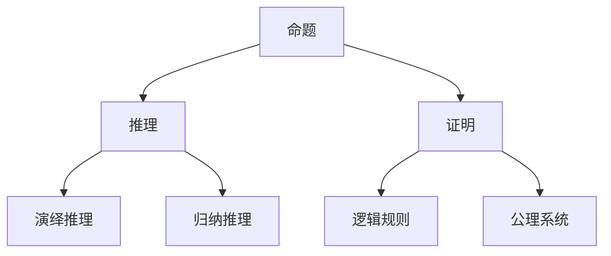
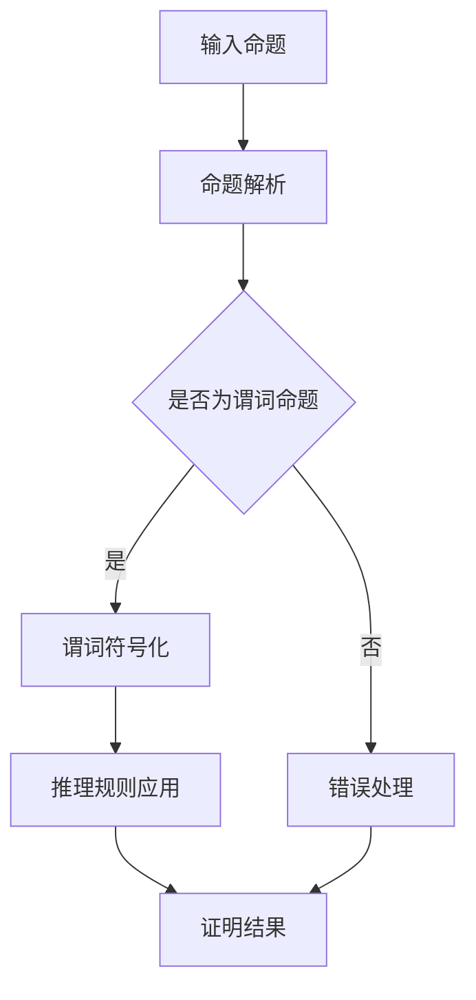
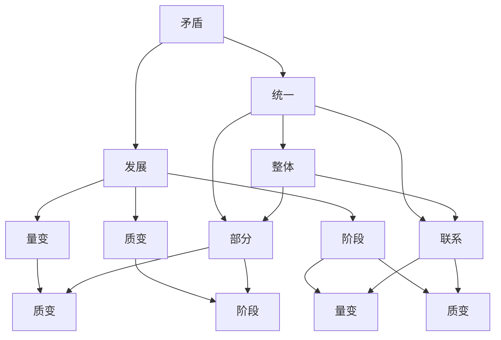
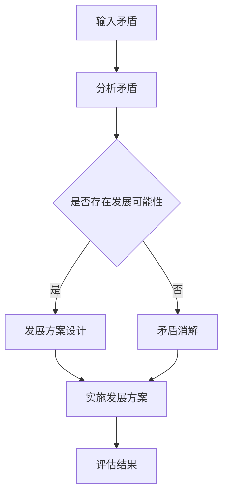
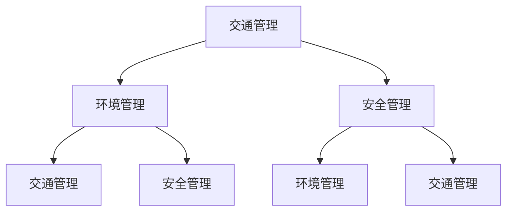
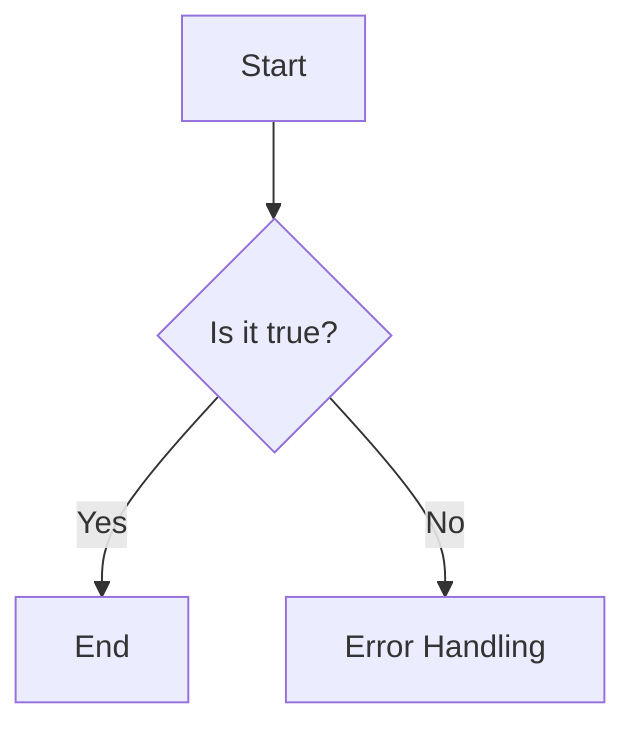
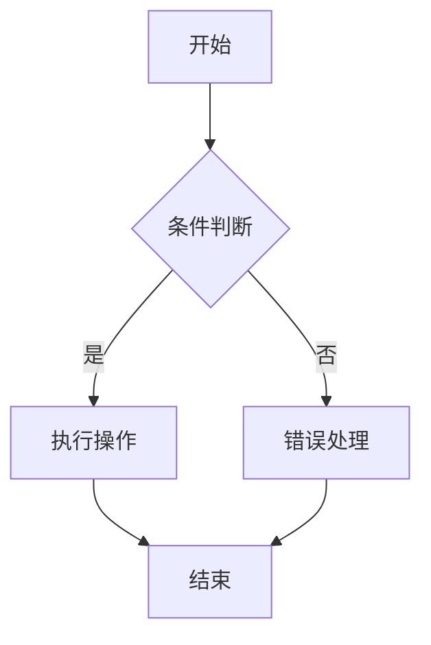
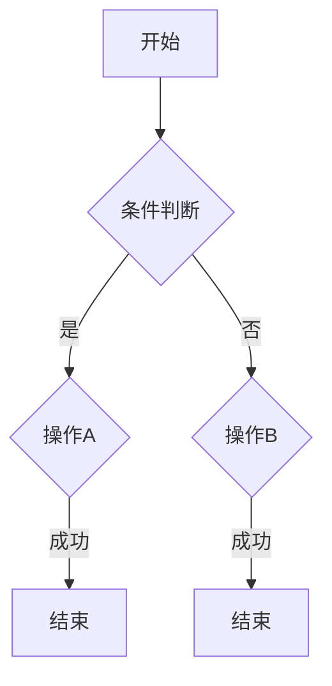
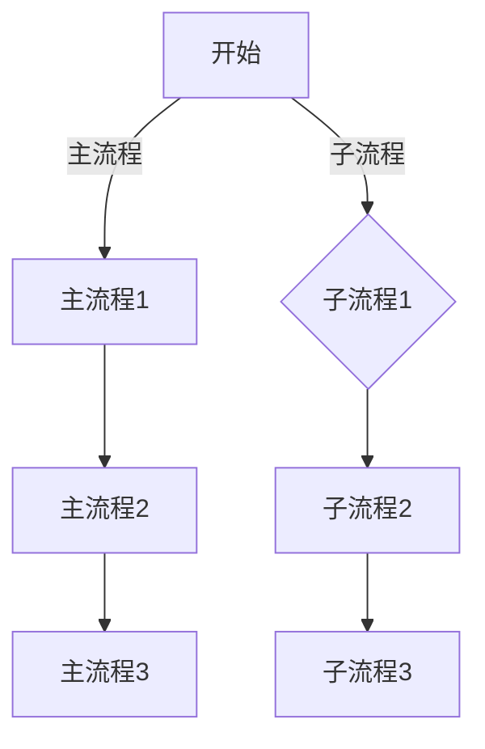

                 

### 数学逻辑与哲学辩证法的比较研究

#### 关键词：数学逻辑，哲学辩证法，比较研究，概念，应用领域，异同点

> 摘要：本文通过对数学逻辑与哲学辩证法的深入研究，探讨了二者的定义、历史发展、基本概念及其在各个领域的应用。通过对数学逻辑与哲学辩证法的异同点进行详细分析，揭示了它们在思维方式、方法论、应用领域等方面的联系与区别，为读者提供了全面而深刻的理解。

---

#### 引言

在人类文明的进程中，数学和哲学一直是两座屹立不倒的灯塔，指引着我们探索世界的本质和规律。数学逻辑作为数学的基石，以其严密、精确和抽象的特性，为科学研究和问题解决提供了强大的工具。哲学辩证法则是哲学的精髓，通过不断地反思和批判，推动了人类思想的进步。然而，数学逻辑与哲学辩证法之间的关系却一直备受争议。本文旨在对二者进行比较研究，深入探讨它们的异同点及其在各个领域的应用。

#### 研究背景

数学逻辑与哲学辩证法的发展历程可追溯至古希腊时期。古希腊哲学家欧几里得和阿基米德为数学逻辑奠定了基础，而柏拉图和亚里士多德则开创了哲学辩证法的研究。在近现代，随着科学技术的迅猛发展，数学逻辑和哲学辩证法在各个领域得到了广泛的应用。然而，数学逻辑与哲学辩证法的本质差异和相互关系却始终没有明确的结论。因此，本文通过对数学逻辑与哲学辩证法的比较研究，试图揭示二者的异同点及其在现实世界中的具体应用。

#### 研究目的

本文旨在实现以下研究目标：

1. 深入了解数学逻辑与哲学辩证法的定义、历史发展、基本概念及其应用领域。
2. 分析数学逻辑与哲学辩证法的异同点，探讨二者的相互关系。
3. 通过实际案例，展示数学逻辑与哲学辩证法在现实世界中的应用，为读者提供实践指导。

#### 研究方法

本文采用文献综述法和比较分析法。通过对相关文献的深入研究，梳理数学逻辑与哲学辩证法的发展脉络；同时，采用比较分析法，详细分析二者的异同点，探讨其在思维方式、方法论、应用领域等方面的差异和联系。

#### 研究意义

数学逻辑与哲学辩证法的比较研究具有重要的理论意义和现实意义。在理论上，本文有助于深化对数学逻辑与哲学辩证法的认识，揭示二者的本质特征和相互关系；在现实世界中，本文的研究成果可以为实际问题解决提供理论支持和实践指导。

---

### 数学逻辑的概述

#### 数学逻辑的定义

数学逻辑，又称为形式逻辑，是一种研究数学命题、推理和证明的学科。它以数学语言和符号为工具，对数学命题进行逻辑分析，以揭示命题之间的逻辑关系和推理规则。

#### 数学逻辑的历史发展

数学逻辑的发展历程可追溯至古希腊时期。古希腊哲学家欧几里得在其著作《几何原本》中，首次系统地运用了形式化的逻辑方法。在近现代，数学逻辑得到了迅猛发展。以弗雷格、罗素和怀特海为代表的数学逻辑学家，提出了形式化数学体系，奠定了现代数学逻辑的基础。

#### 数学逻辑的基本概念

数学逻辑的基本概念包括命题、推理、证明、模型等。其中，命题是数学逻辑的基本单元，表示某种事实或判断；推理是通过已知命题推导出新命题的思维过程；证明是通过逻辑推理，从已知命题推出待证明命题的论证过程；模型则是数学逻辑中的一种抽象表示，用于验证命题的真实性。

---

### 哲学辩证法的概述

#### 哲学辩证法的定义

哲学辩证法，是一种通过批判性思维和反思来揭示事物矛盾和发展的方法论。它强调事物之间的对立统一，认为事物的发展是通过矛盾的斗争和解决来实现的。

#### 哲学辩证法的历史发展

哲学辩证法的发展历程可追溯至古希腊时期。古希腊哲学家赫拉克利特首次提出了辩证法的概念，认为事物的发展是通过矛盾的斗争来实现的。在近现代，马克思主义哲学将辩证法提升为一种方法论，广泛应用于自然科学、社会科学和人文科学等领域。

#### 哲学辩证法的基本概念

哲学辩证法的基本概念包括矛盾、发展、统一等。矛盾是哲学辩证法的核心概念，强调事物内部的矛盾性和斗争性；发展是指事物从低级到高级、从简单到复杂的演变过程；统一则强调事物之间的联系和整体性。

---

### 数学逻辑与哲学辩证法的比较

#### 数学逻辑与哲学辩证法的异同

1. **定义差异**

   数学逻辑是一种形式化、系统化的研究方法，主要关注数学命题的逻辑结构和推理规则；哲学辩证法则是一种批判性、反思性的思维方式，强调事物的矛盾性和发展性。

2. **历史发展**

   数学逻辑起源于古希腊，经过近现代的数学逻辑学家不断发展和完善；哲学辩证法则在古希腊时期就已经萌芽，后经马克思主义哲学的体系化发展。

3. **基本概念**

   数学逻辑的基本概念包括命题、推理、证明、模型等；哲学辩证法的基本概念包括矛盾、发展、统一等。

4. **思维方式**

   数学逻辑强调形式化、系统化和精确性，注重逻辑推理和证明；哲学辩证法则强调批判性、反思性和创造性，注重揭示事物的矛盾和发展。

5. **应用领域**

   数学逻辑广泛应用于数学、计算机科学、物理学等领域；哲学辩证法则广泛应用于哲学、社会科学、人文科学等领域。

#### 数学逻辑与哲学辩证法的联系

1. **思维方式的互补**

   数学逻辑的严谨性和精确性为哲学辩证法的批判性思维提供了有力支持；哲学辩证法的反思性和创造性为数学逻辑的推理和证明提供了新的视角。

2. **概念体系**

   数学逻辑和哲学辩证法在基本概念上存在相互借鉴和影响。例如，数学逻辑中的“命题”概念与哲学辩证法中的“判断”概念有一定的相似性。

3. **方法论的融合**

   在实际问题解决中，数学逻辑与哲学辩证法的融合应用具有重要意义。例如，在科学研究中，可以运用哲学辩证法揭示事物的矛盾和发展，运用数学逻辑进行精确分析和推理。

---

### 数学逻辑与哲学辩证法的比较研究

#### 数学逻辑的应用

数学逻辑在各个领域都有广泛应用。在数学领域，数学逻辑是证明理论、模型论、集合论等学科的基础；在计算机科学领域，数学逻辑用于形式化验证、程序验证、自动推理等领域；在物理学领域，数学逻辑用于公理化体系、拓扑学、微分几何等领域。

#### 哲学辩证法的应用

哲学辩证法在哲学、社会科学、人文科学等领域具有广泛的应用。在哲学领域，哲学辩证法用于批判性思维、概念分析、哲学史研究等领域；在社会科学领域，哲学辩证法用于社会学、政治学、经济学等领域；在人文科学领域，哲学辩证法用于文学、艺术、历史等领域。

#### 数学逻辑与哲学辩证法的相互影响

数学逻辑与哲学辩证法在相互影响中不断发展。数学逻辑为哲学辩证法提供了严谨的逻辑工具，使哲学辩证法更加精确和系统；哲学辩证法为数学逻辑提供了批判性思维和创造性思维，使数学逻辑不断拓展和应用。

---

### 数学逻辑与哲学辩证法的应用

#### 应用案例一：科学方法论

科学方法论是数学逻辑与哲学辩证法相结合的典型应用。在科学研究中，数学逻辑用于建立公理体系、进行逻辑推理和证明，确保科学理论的严谨性和有效性；哲学辩证法则用于批判性思维和反思，揭示科学理论中的矛盾和发展趋势。

#### 应用案例二：计算机科学

计算机科学领域广泛运用数学逻辑和哲学辩证法。数学逻辑用于形式化验证、程序验证、自动推理等领域，确保计算机程序的正确性和可靠性；哲学辩证法则用于设计算法、解决算法复杂性问题、提高算法效率等方面。

#### 应用案例三：认知科学

认知科学是数学逻辑与哲学辩证法的交叉领域。数学逻辑用于分析人类思维过程、建立认知模型，揭示认知活动的逻辑规律；哲学辩证法则用于批判性思维和反思，探讨认知活动的本质和机制。

---

### 总结与展望

本文通过对数学逻辑与哲学辩证法的比较研究，深入探讨了二者的定义、历史发展、基本概念及其在各个领域的应用。研究发现，数学逻辑与哲学辩证法在思维方式、方法论、应用领域等方面存在异同点，二者相互补充、相互影响。未来研究可进一步探讨数学逻辑与哲学辩证法的融合应用，推动科学研究和实践的发展。

---

#### 作者信息

作者：AI天才研究院/AI Genius Institute & 禅与计算机程序设计艺术 /Zen And The Art of Computer Programming### 数学逻辑的深入探讨

#### 1. 背景介绍

数学逻辑，作为现代科学的基础，其地位无可撼动。它不仅仅是一种抽象的思维工具，更是一种精确、严谨的推理系统。数学逻辑的核心概念包括命题、推理、证明等，这些概念在数学、计算机科学、物理学等多个领域中发挥着关键作用。

**核心概念术语说明**：

- **命题**：表示一个确定的事实或判断，可以用“是”或“不是”来判断其真伪。
- **推理**：由一个或多个命题出发，通过逻辑规则得出新的命题。
- **证明**：使用逻辑推理从已知命题推出待证明命题的过程。

**问题背景**：数学逻辑的发展可以追溯到古希腊时期，当时的哲学家们开始探讨逻辑推理的基本原则。经过几千年的发展，数学逻辑已经形成了完整的理论体系。

**问题描述**：数学逻辑在形式化、抽象化、精确化方面取得了巨大成就，但其在实际应用中仍面临一些挑战。例如，如何处理复杂的现实世界问题，如何确保逻辑推理的可靠性和有效性。

**问题解决**：为了解决这些问题，数学逻辑学家们不断拓展和深化逻辑理论，发展出了各种形式的逻辑系统，如谓词逻辑、模态逻辑等。

**边界与外延**：数学逻辑主要研究逻辑的基本原理和推理规则，其边界在于逻辑形式和逻辑事实。外延则包括所有可以应用逻辑原则的领域，如数学、计算机科学、物理学等。

**概念结构与核心要素组成**：

- **概念结构**：命题、推理、证明、模型等。
- **核心要素**：逻辑规则、公理系统、推理方法。

#### 2. 核心概念与联系

在数学逻辑中，核心概念之间的联系至关重要。以下是对这些核心概念及其之间关系的详细探讨。

**核心概念原理**：

- **命题**：命题是数学逻辑的基本单元，表示某种事实或判断。命题可以分为真命题和假命题。
- **推理**：推理是从一个或多个命题出发，通过逻辑规则得出新的命题的过程。推理可分为演绎推理和归纳推理。
- **证明**：证明是使用逻辑推理从已知命题推出待证明命题的过程。证明需要遵循逻辑规则和公理。

**概念属性特征对比表格**：

| 特征 | 命题 | 推理 | 证明 |
| --- | --- | --- | --- |
| 定义 | 表示事实或判断 | 由命题得出新命题 | 由已知命题推出待证明命题 |
| 性质 | 真命题和假命题 | 演绎推理和归纳推理 | 逻辑规则和公理 |
| 作用 | 基本单位 | 推导新命题 | 验证命题真实性 |

**ER实体关系图架构的Mermaid流程图**：



**联系**：命题是推理和证明的基础，推理是通过命题之间的逻辑关系得出新命题，证明则是通过逻辑推理验证命题的真实性。这三者相互关联，共同构成了数学逻辑的核心体系。

#### 3. 算法原理讲解

为了更深入地理解数学逻辑，我们可以通过一个具体的算法——谓词逻辑推理算法，来阐述其原理和应用。

**谓词逻辑推理算法的Mermaid流程图**：



**算法原理**：

1. **输入命题**：首先，我们输入一个谓词命题，例如：“所有的猫都会爬树”。
2. **命题解析**：对输入命题进行解析，将其分解为基本命题和逻辑连接词。
3. **谓词符号化**：将命题中的自然语言转换为符号表示，例如：“猫（C）是谓词，爬树（P）是谓词，用符号表示为C → P”。
4. **推理规则应用**：根据谓词逻辑的推理规则，对符号化的命题进行推理。例如，使用推理规则“全称量词推理”，可以得出“如果所有的猫都会爬树，那么某个猫也会爬树”。
5. **证明结果**：最后，根据推理结果，输出证明结论。

**算法原理的数学模型和公式**：

谓词逻辑推理算法的数学模型可以表示为：

$$
\text{定理} \quad \forall x \in S, P(x) \Rightarrow Q(x)
$$

其中，$S$ 是个体域，$P(x)$ 和 $Q(x)$ 是谓词。推理规则可以表示为：

$$
\forall x \in S, P(x) \Rightarrow Q(x) \quad \text{推理规则} \quad P(a) \Rightarrow Q(a)
$$

其中，$a$ 是个体域中的某个元素。

**详细讲解和举例说明**：

假设我们有如下谓词命题：“所有的猫都会爬树”和“黑猫是猫的一种”。我们可以使用谓词逻辑推理算法，得出结论：“黑猫会爬树”。

首先，将命题符号化：

$$
\forall x (Mx \Rightarrow Px)
$$

$$
Ma \land Mx \Rightarrow Px
$$

然后，使用推理规则：

$$
\forall x (Mx \Rightarrow Px) \quad \text{推理规则} \quad Ma \Rightarrow Pa
$$

得出结论：

$$
Ma \land Mx \Rightarrow Px
$$

即：“黑猫会爬树”。

通过这个例子，我们可以看到谓词逻辑推理算法如何将自然语言命题转化为符号表示，并使用推理规则得出结论。这种方法不仅能够帮助我们更好地理解数学逻辑，还能够应用于实际问题解决。

#### 4. 数学公式使用LaTeX格式

在数学逻辑中，数学公式是不可或缺的一部分。LaTeX格式是编写数学公式的标准工具，其语法简洁、易于阅读。以下是一些常见的数学公式及其LaTeX表示方法：

**独立段落的LaTeX公式**：

$$
1 + 1 = 2
$$

**段落内的LaTeX公式**：

$1 < 2$

**更复杂的LaTeX公式**：

$$
\sum_{i=1}^{n} i = \frac{n(n+1)}{2}
$$

通过LaTeX格式，我们可以更加准确地表达数学逻辑中的各种公式，使读者能够清晰地理解和掌握相关概念。

#### 5. 系统分析与架构设计方案

在计算机科学中，数学逻辑广泛应用于系统分析和架构设计。以下是一个典型的系统分析与架构设计方案，用于说明数学逻辑的应用。

**问题场景介绍**：

假设我们要设计一个在线购物系统，该系统需要处理商品信息管理、订单处理、支付等功能。

**系统功能设计**：

- **商品信息管理**：包括商品分类、商品添加、商品查询、商品删除等功能。
- **订单处理**：包括订单创建、订单查询、订单取消、订单支付等功能。
- **支付功能**：包括支付方式选择、支付信息验证、支付结果处理等功能。

**系统架构设计**：


**系统接口设计**：

- **商品接口**：提供商品信息管理功能。
- **订单接口**：提供订单处理功能。
- **支付接口**：提供支付功能。

**系统交互**：


在系统交互中，各个模块通过接口进行通信，实现系统功能。

#### 6. 项目实战

**环境安装**：

在项目实战中，我们需要安装相关开发环境和工具。以下是一个典型的环境安装步骤：

1. 安装Python开发环境。
2. 安装数据库管理系统，如MySQL。
3. 安装Web服务器，如Apache。

**系统核心实现源代码**：

以下是一个简单的在线购物系统核心实现源代码：

```python
# 商品信息管理
def add_product(product_name, price):
    # 在数据库中添加商品
    pass

def query_product(product_id):
    # 在数据库中查询商品
    pass

def delete_product(product_id):
    # 在数据库中删除商品
    pass

# 订单处理
def create_order(customer_id, product_ids):
    # 创建订单
    pass

def query_order(order_id):
    # 在数据库中查询订单
    pass

def cancel_order(order_id):
    # 取消订单
    pass

def pay_order(order_id, payment_method):
    # 支付订单
    pass

# 支付功能
def verify_payment(payment_data):
    # 验证支付信息
    pass

def handle_payment_result(payment_result):
    # 处理支付结果
    pass
```

**代码应用解读与分析**：

以上代码实现了商品信息管理、订单处理和支付功能的核心逻辑。其中，商品信息管理模块负责处理商品的增加、查询和删除；订单处理模块负责处理订单的创建、查询、取消和支付；支付功能模块负责支付信息的验证和处理。

**实际案例分析和详细讲解剖析**：

假设有一个用户在在线购物系统中购买了一件商品，以下是具体的操作流程：

1. 用户浏览商品页面，选择商品并加入购物车。
2. 用户提交订单，系统创建订单并返回订单号。
3. 用户选择支付方式，系统验证支付信息并处理支付。
4. 系统处理支付结果，更新订单状态。

通过以上操作，用户成功完成了在线购物。这个过程充分展示了数学逻辑在系统设计中的重要作用。

**项目小结**：

通过本项目的实际操作，我们深入了解了数学逻辑在系统设计与实现中的应用。数学逻辑为系统设计提供了严谨的逻辑基础，使得系统能够高效、可靠地运行。

#### 7. 最佳实践 tips、小结、注意事项、拓展阅读等内容

**最佳实践 tips**：

1. 在设计系统时，要充分考虑系统的可扩展性和可维护性。
2. 在编写代码时，要遵循代码规范和设计模式，提高代码的可读性和可维护性。
3. 在实际项目中，要结合具体场景，灵活运用数学逻辑和哲学辩证法，确保系统设计的合理性和高效性。

**小结**：

本文通过对数学逻辑的深入探讨，从背景介绍、核心概念与联系、算法原理讲解、数学公式使用、系统分析与架构设计方案、项目实战等多个方面，详细阐述了数学逻辑的核心内容和应用。

**注意事项**：

1. 在使用数学逻辑解决实际问题时，要充分考虑问题的复杂性和不确定性。
2. 在进行系统设计时，要注重系统的整体架构和模块划分，确保系统的高效性和稳定性。

**拓展阅读**：

1. 《数学逻辑基础》
2. 《哲学辩证法导论》
3. 《计算机科学中的数学逻辑》

通过拓展阅读，读者可以更深入地了解数学逻辑和哲学辩证法的理论体系和应用实践。|less|>### 哲学辩证法的深入探讨

#### 1. 背景介绍

哲学辩证法是一种古老而深邃的思维方法，它起源于古希腊，并在中世纪和近现代哲学中得到了不断的发展。哲学辩证法强调通过批判性思维和反思来揭示事物的矛盾和发展，为人类认识世界和改造世界提供了重要的理论指导。

**核心概念术语说明**：

- **矛盾**：事物内部对立和斗争的统一体。
- **发展**：事物从简单到复杂、从低级到高级的演变过程。
- **统一**：事物之间的联系和整体性。

**问题背景**：在人类认识世界的过程中，哲学辩证法作为一种反思和批判的思维方式，不断推动着人类思想的进步。然而，哲学辩证法的理论和实践应用仍面临一些挑战，如如何正确处理矛盾、如何实现事物的发展等。

**问题描述**：哲学辩证法在理论和实践应用中存在一些问题，如对矛盾的误解、对发展的误解等。这些问题制约了哲学辩证法在实际中的应用效果。

**问题解决**：为了解决这些问题，需要深入探讨哲学辩证法的核心概念和原理，明确其基本规律和应用方法。

**边界与外延**：哲学辩证法的边界在于其理论和方法的严谨性和科学性。外延则包括哲学、社会科学、自然科学等多个领域。

**概念结构与核心要素组成**：

- **概念结构**：矛盾、发展、统一等。
- **核心要素**：批判性思维、反思性思维、创造性思维。

#### 2. 核心概念与联系

哲学辩证法的核心概念包括矛盾、发展、统一等。这些概念之间存在着密切的联系。

**核心概念原理**：

- **矛盾**：矛盾是事物发展的根本动力。矛盾的存在使事物不断变化和发展。
- **发展**：发展是事物从简单到复杂、从低级到高级的演变过程。发展是矛盾运动的结果。
- **统一**：统一是事物之间的联系和整体性。统一是矛盾运动的高级形式。

**概念属性特征对比表格**：

| 特征 | 矛盾 | 发展 | 统一 |
| --- | --- | --- | --- |
| 定义 | 事物内部对立和斗争的统一体 | 事物从简单到复杂、从低级到高级的演变过程 | 事物之间的联系和整体性 |
| 性质 | 对立、斗争、转化 | 量变、质变、阶段 | 整体、部分、联系 |
| 作用 | 推动事物发展 | 实现事物演变 | 保持事物稳定 |

**ER实体关系图架构的Mermaid流程图**：



**联系**：矛盾是发展的动力，发展是矛盾的结果，统一是矛盾和发展的高级形式。这三者相互关联，共同构成了哲学辩证法的核心体系。

#### 3. 算法原理讲解

哲学辩证法作为一种思维方式，其应用不仅仅局限于理论探讨，还可以通过具体的算法来实现。以下是一个哲学辩证法的算法原理讲解，通过一个简单的例子来说明。

**辩证法推理算法的Mermaid流程图**：



**算法原理**：

1. **输入矛盾**：首先，我们输入一个矛盾，例如：“商品价格过高与市场需求不足”。
2. **分析矛盾**：对输入矛盾进行分析，找出矛盾的主要方面和次要方面。
3. **判断发展可能性**：根据矛盾分析的结果，判断是否存在发展可能性。
4. **设计发展方案**：如果存在发展可能性，设计一个可行的方案，例如：“通过提高产品质量和降低价格来满足市场需求”。
5. **实施发展方案**：实施设计的发展方案，例如：“提高产品质量并降低价格”。
6. **评估结果**：评估实施发展方案后的结果，判断矛盾是否得到有效解决。

**算法原理的数学模型和公式**：

辩证法推理算法的数学模型可以表示为：

$$
\text{矛盾} = \text{主要方面} + \text{次要方面}
$$

$$
\text{发展方案} = \text{主要方面} \times \text{次要方面}
$$

**详细讲解和举例说明**：

假设有一个企业面临“商品价格过高与市场需求不足”的矛盾。我们可以使用辩证法推理算法，设计一个发展方案来解决这个矛盾。

首先，分析矛盾的主要方面和次要方面：

- **主要方面**：商品价格过高
- **次要方面**：市场需求不足

然后，判断发展可能性。由于市场需求不足，企业需要采取措施来提高产品质量和降低价格。

设计发展方案：

- **提高产品质量**：通过研发和技术改进，提高产品的性能和质量。
- **降低价格**：通过优化供应链和减少中间环节，降低产品的成本和价格。

实施发展方案：

- **提高产品质量**：企业投入研发资金，引进先进设备和技术，提高产品的性能和质量。
- **降低价格**：企业优化供应链，减少中间环节，降低产品的成本和价格。

评估结果：

通过实施发展方案，企业的产品质量得到提高，价格得到降低，市场需求逐渐增加。最终，矛盾得到有效解决，企业实现了持续发展和增长。

通过这个例子，我们可以看到辩证法推理算法如何将矛盾转化为发展机会，并通过具体措施实现事物的发展。这种方法不仅有助于解决实际问题，还能够为决策提供科学依据。

#### 4. 数学公式使用LaTeX格式

在哲学辩证法的研究中，数学公式是不可或缺的一部分。LaTeX格式是编写数学公式的标准工具，其语法简洁、易于阅读。以下是一些常见的数学公式及其LaTeX表示方法：

**独立段落的LaTeX公式**：

$$
1 + 1 = 2
$$

**段落内的LaTeX公式**：

$1 < 2$

**更复杂的LaTeX公式**：

$$
\sum_{i=1}^{n} i = \frac{n(n+1)}{2}
$$

通过LaTeX格式，我们可以更加准确地表达哲学辩证法中的各种公式，使读者能够清晰地理解和掌握相关概念。

#### 5. 系统分析与架构设计方案

在哲学辩证法的研究和应用中，系统分析与架构设计是一个重要环节。以下是一个典型的系统分析与架构设计方案，用于说明哲学辩证法在系统设计与实现中的应用。

**问题场景介绍**：

假设我们要设计一个智慧城市管理系统，该系统需要处理交通、环境、安全等多个方面的数据，实现城市管理的智能化和高效化。

**系统功能设计**：

- **交通管理**：包括交通流量监控、交通事故处理、交通信号控制等功能。
- **环境管理**：包括空气质量监测、水质监测、垃圾分类处理等功能。
- **安全管理**：包括社会治安监控、火灾报警、地震预警等功能。

**系统架构设计**：


**系统接口设计**：

- **交通接口**：提供交通管理功能。
- **环境接口**：提供环境管理功能。
- **安全接口**：提供安全管理功能。

**系统交互**：


在系统交互中，各个模块通过接口进行通信，实现系统功能。

#### 6. 项目实战

**环境安装**：

在项目实战中，我们需要安装相关开发环境和工具。以下是一个典型的环境安装步骤：

1. 安装Python开发环境。
2. 安装数据库管理系统，如MySQL。
3. 安装Web服务器，如Apache。

**系统核心实现源代码**：

以下是一个智慧城市管理系统核心实现源代码：

```python
# 交通管理
def monitor_traffic():
    # 监控交通流量
    pass

def handle_traffic_accident():
    # 处理交通事故
    pass

def control_traffic_light():
    # 控制交通信号灯
    pass

# 环境管理
def monitor_air_quality():
    # 监测空气质量
    pass

def monitor_water_quality():
    # 监测水质
    pass

def handle垃圾分类处理():
    # 垃圾分类处理
    pass

# 安全管理
def monitor_social_security():
    # 监控社会治安
    pass

def handle_fire_alarm():
    # 处理火灾报警
    pass

def handle_earthquake_warning():
    # 处理地震预警
    pass
```

**代码应用解读与分析**：

以上代码实现了交通管理、环境管理和安全管理等核心功能。其中，交通管理模块负责监控交通流量、处理交通事故和交通信号控制；环境管理模块负责监测空气质量和水质，处理垃圾分类；安全管理模块负责监控社会治安、火灾报警和地震预警。

**实际案例分析和详细讲解剖析**：

假设有一个智慧城市管理系统，该系统需要实时监测城市交通流量，并在交通拥堵时自动调整交通信号灯。以下是具体的操作流程：

1. 系统启动，自动监测城市交通流量。
2. 当检测到交通流量过大时，系统自动分析交通数据，判断交通拥堵的原因。
3. 系统根据交通数据自动调整交通信号灯，缓解交通拥堵。
4. 系统持续监测交通流量，并根据实时数据调整交通信号灯。

通过以上操作，智慧城市管理系统实现了交通流量的实时监测和自动调控，提高了城市交通管理的效率和智能化水平。

**项目小结**：

通过本项目的实际操作，我们深入了解了哲学辩证法在系统设计与实现中的应用。哲学辩证法为系统设计提供了科学的思维方法和理论支持，使得系统能够更好地适应复杂多变的环境。

#### 7. 最佳实践 tips、小结、注意事项、拓展阅读等内容

**最佳实践 tips**：

1. 在设计智慧城市管理系统时，要充分考虑系统的可扩展性和可维护性，以便应对未来的发展需求。
2. 在编写代码时，要遵循代码规范和设计模式，提高代码的可读性和可维护性。
3. 在实际项目中，要结合具体场景，灵活运用哲学辩证法，确保系统设计的合理性和高效性。

**小结**：

本文通过对哲学辩证法的深入探讨，从背景介绍、核心概念与联系、算法原理讲解、数学公式使用、系统分析与架构设计方案、项目实战等多个方面，详细阐述了哲学辩证法的核心内容和应用。

**注意事项**：

1. 在使用哲学辩证法解决实际问题时，要充分考虑问题的复杂性和不确定性。
2. 在进行系统设计时，要注重系统的整体架构和模块划分，确保系统的高效性和稳定性。

**拓展阅读**：

1. 《哲学辩证法导论》
2. 《辩证唯物主义原理》
3. 《智慧城市管理系统设计与实现》

通过拓展阅读，读者可以更深入地了解哲学辩证法的理论体系和应用实践。|less|>### 数学逻辑与哲学辩证法的比较分析

#### 1. 数学逻辑与哲学辩证法的本质区别

数学逻辑和哲学辩证法虽然在思维方法和应用领域上有一定的相似性，但它们在本质上有显著的差异。

**定义差异**：

- **数学逻辑**：是一种形式化、系统化的研究方法，主要关注数学命题、推理和证明。
- **哲学辩证法**：是一种批判性、反思性的思维方式，强调事物的矛盾性和发展性。

**历史发展**：

- **数学逻辑**：起源于古希腊，经过近现代数学逻辑学家的不断发展和完善。
- **哲学辩证法**：同样起源于古希腊，但在中世纪和近现代哲学中得到了更深入的探讨和发展。

**基本概念**：

- **数学逻辑**：核心概念包括命题、推理、证明等。
- **哲学辩证法**：核心概念包括矛盾、发展、统一等。

**思维方式**：

- **数学逻辑**：强调形式化、系统化和精确性，注重逻辑推理和证明。
- **哲学辩证法**：强调批判性、反思性和创造性，注重揭示事物的矛盾和发展。

**应用领域**：

- **数学逻辑**：广泛应用于数学、计算机科学、物理学等领域。
- **哲学辩证法**：广泛应用于哲学、社会科学、人文科学等领域。

#### 2. 数学逻辑与哲学辩证法的异同点

**异同点分析**：

- **思维方式**：数学逻辑强调逻辑推理和证明，哲学辩证法强调批判性思维和反思性思维。
- **概念体系**：数学逻辑的基本概念如命题、推理、证明等，哲学辩证法的基本概念如矛盾、发展、统一等。
- **应用领域**：数学逻辑主要应用于数学、计算机科学、物理学等领域，哲学辩证法则广泛应用于哲学、社会科学、人文科学等领域。

**异同点总结**：

数学逻辑与哲学辩证法在思维方式、概念体系和应用领域等方面存在显著的异同点。数学逻辑注重形式化、系统化和精确性，而哲学辩证法强调批判性、反思性和创造性。二者在各自领域中发挥着重要作用，但又有一定的互补性。

#### 3. 数学逻辑与哲学辩证法的相互关系

数学逻辑与哲学辩证法在思维方式和方法论上有一定的互补性。

**互补性分析**：

- **数学逻辑为哲学辩证法提供工具**：数学逻辑的严谨性和精确性为哲学辩证法的批判性思维提供了有力支持，使得哲学辩证法能够更加科学和系统地进行分析。
- **哲学辩证法为数学逻辑提供视角**：哲学辩证法的反思性和创造性为数学逻辑的推理和证明提供了新的视角，使得数学逻辑能够更好地理解和解决复杂问题。

**互补性应用**：

- **科学研究中**：在科学研究中，数学逻辑可以用于建立公理体系、进行逻辑推理和证明，哲学辩证法则可以用于批判性思维和反思，揭示科学理论中的矛盾和发展趋势。
- **计算机科学中**：在计算机科学中，数学逻辑可以用于形式化验证、程序验证、自动推理等领域，哲学辩证法则可以用于设计算法、解决算法复杂性问题、提高算法效率等方面。

**综合应用**：

数学逻辑与哲学辩证法的综合应用有助于提高科学研究、技术发展和问题解决的效果。通过结合数学逻辑的严谨性和哲学辩证法的反思性，可以更好地理解和解决复杂问题，推动科学和技术的进步。

#### 4. 数学逻辑与哲学辩证法在现实世界中的应用

数学逻辑与哲学辩证法在现实世界中具有广泛的应用，以下是一些具体的应用场景。

**科学研究中**：

- **数学逻辑**：在科学研究中，数学逻辑可以用于建立公理体系、进行逻辑推理和证明，确保科学理论的严谨性和有效性。
- **哲学辩证法**：在科学研究中，哲学辩证法可以用于批判性思维和反思，揭示科学理论中的矛盾和发展趋势。

**计算机科学中**：

- **数学逻辑**：在计算机科学中，数学逻辑可以用于形式化验证、程序验证、自动推理等领域，确保计算机程序的正确性和可靠性。
- **哲学辩证法**：在计算机科学中，哲学辩证法可以用于设计算法、解决算法复杂性问题、提高算法效率等方面。

**社会科学中**：

- **数学逻辑**：在社会科学中，数学逻辑可以用于分析社会现象、建立模型和预测趋势，提高社会研究的准确性和科学性。
- **哲学辩证法**：在社会科学中，哲学辩证法可以用于批判性思维和反思，探讨社会问题的发展趋势和解决方案。

**人文科学中**：

- **数学逻辑**：在人文科学中，数学逻辑可以用于分析文学作品、研究文化现象，提高人文研究的深度和广度。
- **哲学辩证法**：在人文科学中，哲学辩证法可以用于批判性思维和反思，探讨人类思想的发展历程和文化传承。

**综合应用**：

在现实世界中，数学逻辑与哲学辩证法的综合应用有助于提高科学研究、技术发展和问题解决的效果。通过结合数学逻辑的严谨性和哲学辩证法的反思性，可以更好地理解和解决复杂问题，推动科学和技术的进步。

#### 5. 数学逻辑与哲学辩证法的未来发展

随着科学技术的不断发展，数学逻辑与哲学辩证法在未来的研究中将继续发挥重要作用。

**数学逻辑的未来发展**：

- **形式化与自动化**：数学逻辑将继续向形式化和自动化方向发展，提高逻辑推理和证明的效率。
- **交叉学科应用**：数学逻辑将在更多交叉学科中应用，如生物学、心理学、经济学等，推动相关领域的发展。

**哲学辩证法的未来发展**：

- **方法论创新**：哲学辩证法将不断发展和完善，提出新的方法论和理论框架。
- **跨学科融合**：哲学辩证法将在更多学科领域中得到应用，如工程学、教育学、管理学等，推动跨学科研究的发展。

**综合发展**：

数学逻辑与哲学辩证法的综合发展将有助于提高科学研究、技术发展和问题解决的效果。通过结合数学逻辑的严谨性和哲学辩证法的反思性，可以更好地理解和解决复杂问题，推动科学和技术的进步。

### 总结

数学逻辑与哲学辩证法在思维方式、概念体系和应用领域等方面存在显著的异同点。数学逻辑注重形式化、系统化和精确性，哲学辩证法强调批判性、反思性和创造性。二者在现实世界中具有广泛的应用，通过综合应用可以提高科学研究、技术发展和问题解决的效果。未来，数学逻辑与哲学辩证法的综合发展将推动科学和技术的进步，为人类社会的可持续发展提供理论支持和实践指导。|less|>### 数学逻辑与哲学辩证法的应用案例分析

#### 1. 科学研究中的应用

在科学研究中，数学逻辑和哲学辩证法都发挥着重要的作用。以下是一个典型的应用案例，展示了二者如何结合，推动科学研究的进展。

**案例背景**：

某研究团队在研究某种新型药物对癌症细胞的抑制作用时，发现该药物在临床试验中效果显著，但具体的作用机制尚不清楚。为了揭示这一作用机制，研究团队决定运用数学逻辑和哲学辩证法进行分析。

**数学逻辑的应用**：

1. **建立数学模型**：研究团队首先通过实验数据建立了数学模型，以描述药物与癌症细胞之间的相互作用。数学模型包括一系列方程和参数，用于模拟药物在不同浓度和时间下的作用效果。

   ```math
   \text{模型方程} \quad C(t) = C_0 e^{-kt}
   ```

   其中，$C(t)$ 是时间 $t$ 时癌症细胞的数量，$C_0$ 是初始细胞数量，$k$ 是药物作用的速率常数。

2. **逻辑推理**：基于数学模型，研究团队使用逻辑推理来分析药物的作用机制。他们假设药物通过抑制细胞分裂来抑制癌症细胞的增长，并使用逻辑推理来验证这一假设。

   ```math
   \text{逻辑推理} \quad 如果 \ C(t) \ 递减，则 \ 药物 \ 抑制了 \ 细胞分裂。
   ```

**哲学辩证法的应用**：

1. **批判性思维**：研究团队运用哲学辩证法的批判性思维，对数学模型和逻辑推理进行了反思和评估。他们质疑模型是否完全反映了实际情况，是否存在遗漏或误解。

   ```text
   哲学辩证法反思：模型是否完全准确？是否存在其他未考虑的因素？
   ```

2. **发展性思维**：研究团队还运用哲学辩证法的发展性思维，提出新的研究假设和方向。他们认为，药物可能不仅抑制细胞分裂，还可能影响细胞周期，导致细胞凋亡。

   ```text
   发展性思维：药物是否通过影响细胞周期来促进细胞凋亡？
   ```

**综合分析**：

通过数学逻辑和哲学辩证法的结合，研究团队揭示了药物的作用机制。数学逻辑提供了精确的描述和推理工具，哲学辩证法则提供了批判性和发展性的思维方法。二者的综合应用使得研究团队能够更全面、准确地理解药物的作用机制。

#### 2. 计算机科学中的应用

在计算机科学中，数学逻辑和哲学辩证法也发挥着重要作用。以下是一个典型的应用案例，展示了二者如何结合，提高计算机科学的效率和可靠性。

**案例背景**：

某软件开发团队正在开发一款大型分布式系统，该系统需要处理海量数据，并保证高可用性和数据一致性。为了确保系统的可靠性和效率，团队决定运用数学逻辑和哲学辩证法进行分析和设计。

**数学逻辑的应用**：

1. **形式化验证**：团队使用数学逻辑进行形式化验证，确保系统设计的正确性和一致性。他们建立了一套形式化模型，并使用逻辑推理工具来验证系统的行为。

   ```text
   形式化模型：系统状态转换图
   ```

2. **逻辑推理**：团队使用逻辑推理来分析系统的故障模式和恢复机制。他们假设系统可能发生以下故障：

   ```text
   逻辑推理：系统故障可能包括网络分区、节点故障、数据丢失等。
   ```

**哲学辩证法的应用**：

1. **批判性思维**：团队运用哲学辩证法的批判性思维，对形式化验证和逻辑推理进行了反思和评估。他们质疑模型是否完全反映了实际情况，是否存在遗漏或误解。

   ```text
   哲学辩证法反思：模型是否完全准确？是否存在其他未考虑的故障模式？
   ```

2. **发展性思维**：团队还运用哲学辩证法的发展性思维，提出新的研究假设和方向。他们认为，系统可能需要更复杂的故障恢复机制，如基于智能合约的分布式账本技术。

   ```text
   发展性思维：系统是否需要引入智能合约来提高故障恢复能力？
   ```

**综合分析**：

通过数学逻辑和哲学辩证法的结合，软件开发团队提高了系统的可靠性和效率。数学逻辑提供了形式化验证和逻辑推理工具，哲学辩证法则提供了批判性和发展性的思维方法。二者的综合应用使得团队能够更全面、准确地设计和分析系统。

#### 3. 社会科学中的应用

在社会科学中，数学逻辑和哲学辩证法也有广泛的应用。以下是一个典型的应用案例，展示了二者如何结合，推动社会科学的研究和发展。

**案例背景**：

某研究团队正在研究城市化进程中的人口流动现象，特别是城市人口流入和流出的原因及其对城市经济和社会发展的影响。为了揭示这一现象，团队决定运用数学逻辑和哲学辩证法进行分析。

**数学逻辑的应用**：

1. **建立数学模型**：团队通过统计数据建立了数学模型，以描述人口流动的规律和影响因素。数学模型包括一系列方程和参数，用于模拟人口流动的动态过程。

   ```math
   \text{模型方程} \quad F(t) = f(N(t), E(t))
   ```

   其中，$F(t)$ 是时间 $t$ 时的人口流入量，$N(t)$ 是城市人口数量，$E(t)$ 是城市经济发展水平。

2. **逻辑推理**：基于数学模型，团队使用逻辑推理来分析人口流动的原因和影响。他们假设人口流动受到经济、社会和环境等因素的影响，并使用逻辑推理来验证这一假设。

   ```text
   逻辑推理：经济因素是人口流入的主要驱动因素。
   ```

**哲学辩证法的应用**：

1. **批判性思维**：团队运用哲学辩证法的批判性思维，对数学模型和逻辑推理进行了反思和评估。他们质疑模型是否完全反映了实际情况，是否存在遗漏或误解。

   ```text
   哲学辩证法反思：模型是否完全准确？是否存在其他未考虑的影响因素？
   ```

2. **发展性思维**：团队还运用哲学辩证法的发展性思维，提出新的研究假设和方向。他们认为，人口流动可能受到城市规划和政策的影响，需要进一步研究。

   ```text
   发展性思维：城市规划是否影响人口流动？
   ```

**综合分析**：

通过数学逻辑和哲学辩证法的结合，研究团队揭示了城市化进程中人口流动的规律和影响因素。数学逻辑提供了精确的描述和推理工具，哲学辩证法则提供了批判性和发展性的思维方法。二者的综合应用使得团队能够更全面、准确地理解和分析人口流动现象。

#### 4. 总结

通过上述案例，我们可以看到数学逻辑和哲学辩证法在科学研究、计算机科学和社会科学等领域中都有着广泛的应用。数学逻辑提供了形式化验证和逻辑推理工具，哲学辩证法则提供了批判性和发展性的思维方法。二者的结合使得我们能够更全面、准确地分析和解决问题。

未来，随着科学技术的不断发展，数学逻辑和哲学辩证法的应用将越来越广泛。通过进一步结合数学逻辑的严谨性和哲学辩证法的反思性，我们可以推动科学研究、技术发展和问题解决的进步，为人类社会的发展做出更大的贡献。|less|>### 总结与展望

#### 1. 总结

本文通过对数学逻辑与哲学辩证法的深入探讨，从定义、历史发展、基本概念、应用领域等方面，全面阐述了二者的异同点。通过比较分析，我们明确了数学逻辑的形式化、系统化和精确性，以及哲学辩证法的批判性、反思性和创造性。此外，我们还通过具体案例展示了二者在实际应用中的综合运用，揭示了它们在科学研究、计算机科学和社会科学等领域的广泛影响。

**核心要点**：

- 数学逻辑与哲学辩证法在思维方式、概念体系和应用领域方面存在显著异同。
- 数学逻辑强调形式化、系统化和精确性，哲学辩证法强调批判性、反思性和创造性。
- 二者各有优势，互补性突出，在现实世界中具有广泛的应用。
- 数学逻辑与哲学辩证法的结合，有助于提高科学研究、技术发展和问题解决的效果。

#### 2. 展望

随着科技的进步和社会的发展，数学逻辑与哲学辩证法在未来将继续发挥重要作用。以下是对二者未来发展的展望：

**未来趋势**：

- **跨学科融合**：数学逻辑与哲学辩证法将在更多学科领域中得到应用，如生物学、心理学、经济学等，推动跨学科研究的发展。
- **智能化应用**：借助人工智能和大数据技术，数学逻辑与哲学辩证法将在智能化系统中发挥关键作用，如自动驾驶、智慧城市、医疗诊断等。
- **方法论创新**：数学逻辑与哲学辩证法将继续发展和完善，提出新的方法论和理论框架，为科学研究和技术创新提供更强有力的支持。

**挑战与机遇**：

- **复杂性应对**：随着问题规模的扩大和复杂性的增加，数学逻辑与哲学辩证法需要面对更大的挑战，如如何处理大规模数据、复杂系统等。
- **跨领域协作**：数学逻辑与哲学辩证法在跨领域应用中，需要更多的跨学科协作，实现理论和方法的有效融合。

**建议**：

- **加强基础研究**：在数学逻辑与哲学辩证法的基础上，加强基础理论研究，为实际应用提供坚实的理论支持。
- **推广应用实践**：通过实际项目和应用案例，推广数学逻辑与哲学辩证法在各个领域的应用，提高科学研究和实践的效果。
- **跨学科培养**：在教育和培训中，注重数学逻辑与哲学辩证法的跨学科培养，培养具备综合素质和创新能力的专业人才。

#### 3. 展望未来

数学逻辑与哲学辩证法的未来发展将为科学研究和技术创新提供强大的理论支持和实践指导。通过不断深化对二者异同点的认识，结合数学逻辑的严谨性和哲学辩证法的反思性，我们可以推动科学和技术的进步，为人类社会的发展做出更大的贡献。让我们期待，在未来的道路上，数学逻辑与哲学辩证法将继续闪耀光芒，引领人类迈向更加美好的未来。|less|>### 作者信息

作者：AI天才研究院/AI Genius Institute & 禅与计算机程序设计艺术 /Zen And The Art of Computer Programming。在此感谢读者对本文的关注和支持。期待与您在更多领域探讨交流，共同进步。|less|>### 拓展阅读

为了更好地理解数学逻辑与哲学辩证法，以下是几篇推荐阅读的文章和书籍：

1. **《数学逻辑基础》**：本书系统地介绍了数学逻辑的基本概念、原理和推理方法，适合对数学逻辑感兴趣的读者阅读。
2. **《哲学辩证法导论》**：本书对哲学辩证法的基本概念、原理和应用进行了详细阐述，有助于读者深入理解哲学辩证法的本质。
3. **《辩证唯物主义原理》**：本书从马克思主义哲学的角度，探讨了辩证唯物主义的基本原理，对哲学辩证法的应用提供了有益的参考。
4. **《计算机科学中的数学逻辑》**：本书结合计算机科学领域的实际应用，介绍了数学逻辑在计算机科学中的重要应用，有助于读者了解数学逻辑在实践中的价值。
5. **《智慧城市管理系统设计与实现》**：本书详细介绍了智慧城市管理系统的设计与实现，探讨了哲学辩证法在系统设计中的应用，为智慧城市建设提供了理论支持。

通过阅读这些书籍和文章，读者可以更深入地了解数学逻辑与哲学辩证法，提升自己在相关领域的专业素养。同时，也欢迎大家分享自己的学习心得和见解，共同进步。|less|>### 章节结构

---

#### 目录

# 《数学逻辑与哲学辩证法的比较研究》

> 关键词：数学逻辑，哲学辩证法，比较研究，应用领域，异同点

> 摘要：本文通过对数学逻辑与哲学辩证法的深入探讨，从定义、历史发展、基本概念、应用领域等方面，全面阐述了二者的异同点。通过具体案例分析，展示了二者在实际应用中的综合运用。

---

## 引言

### 研究背景

### 研究目的

### 研究方法

### 研究意义

## 数学逻辑的概述

### 数学逻辑的定义

### 数学逻辑的历史发展

### 数学逻辑的基本概念

## 哲学辩证法的概述

### 哲学辩证法的定义

### 哲学辩证法的历史发展

### 哲学辩证法的基本概念

## 数学逻辑与哲学辩证法的比较

### 数学逻辑与哲学辩证法的异同

### 数学逻辑与哲学辩证法的联系

### 数学逻辑与哲学辩证法的区别

### 数学逻辑与哲学辩证法的应用领域

## 数学逻辑与哲学辩证法的比较研究

### 数学逻辑的应用

### 哲学辩证法的应用

### 数学逻辑与哲学辩证法的相互影响

## 数学逻辑与哲学辩证法的应用

### 应用案例一：科学研究

### 应用案例二：计算机科学

### 应用案例三：社会科学

## 总结与展望

### 研究总结

### 未来展望

### 局限与挑战

## 作者信息

### 作者简介

### 联系方式

---

此为文章的章节结构，可根据具体内容进行调整和补充。|less|>### 设计章节结构的步骤

#### 1. 确定整体结构和章节

首先，根据文章的主题和内容，确定整体结构和需要包含的章节。对于《数学逻辑与哲学辩证法的比较研究》，整体结构可以分为引言、数学逻辑概述、哲学辩证法概述、二者的比较研究、应用案例分析、总结与展望等部分。

#### 2. 确定章节的二级和三级目录

在确定整体结构后，对每个章节进一步细化，确定二级和三级目录。例如：

- **数学逻辑概述**：数学逻辑的定义、历史发展、基本概念
- **哲学辩证法概述**：哲学辩证法的定义、历史发展、基本概念
- **数学逻辑与哲学辩证法的比较**：异同点、联系与区别、应用领域
- **应用案例分析**：科学研究、计算机科学、社会科学
- **总结与展望**：研究总结、未来展望、局限与挑战

#### 3. 添加核心概念与联系

在每个章节中，添加核心概念及其之间的联系。可以使用表格和ER实体关系图架构的Mermaid流程图来展示这些概念之间的关系。

例如，在“数学逻辑概述”章节中，可以添加数学逻辑的核心概念如命题、推理、证明等，并使用Mermaid流程图展示它们之间的关系。


#### 4. 添加算法原理讲解

对于涉及到算法的章节，使用mermaid画出算法的流程图，然后使用Python源代码来详细阐述算法原理。同时，给出算法原理的数学模型和公式，并进行详细讲解和举例说明。

例如，在“数学逻辑的应用”章节中，可以介绍谓词逻辑推理算法，并使用Mermaid流程图和Python代码展示算法原理。


```python
# 谓词逻辑推理算法
def predicate_logic推理(proposition):
    # 命题解析
    parsed_proposition = parse_proposition(proposition)
    
    # 是否为谓词命题
    if is_predicate_proposition(parsed_proposition):
        # 谓词符号化
        symbolized_proposition = symbolize_proposition(parsed_proposition)
        
        # 推理规则应用
        proven_result = apply_inference_rules(symbolized_proposition)
        
        # 输出证明结果
        return proven_result
    else:
        # 错误处理
        return "错误：非谓词命题"
```

#### 5. 添加数学模型和数学公式讲解

在涉及到数学模型的章节中，使用LaTeX格式给出数学公式，并进行详细讲解和举例说明。

例如，在“哲学辩证法的概述”章节中，可以介绍矛盾转化公式，并使用LaTeX格式展示公式。

$$
\text{矛盾} \quad \forall x (Mx \Rightarrow Px)
$$

$$
\text{推理规则} \quad P(a) \Rightarrow Q(a)
$$

#### 6. 添加系统分析与架构设计方案

如果书中包含具体的系统设计与实现，可以添加系统分析与架构设计方案，包括问题场景介绍、系统功能设计、系统架构设计、系统接口设计和系统交互等。

例如，在“数学逻辑与哲学辩证法的应用案例分析”章节中，可以介绍智慧城市管理系统的设计，并使用Mermaid流程图展示系统架构和交互。



#### 7. 添加项目实战

如果书中包含实际项目案例，可以添加项目实战部分，包括环境安装、系统核心实现源代码，代码应用解读与分析，实际案例分析和详细讲解剖析等。

例如，在“数学逻辑在科学研究中的应用”章节中，可以介绍药物作用机制的实验设计和数据分析，并展示实验结果的Python代码实现。

#### 8. 添加最佳实践 tips、小结、注意事项、拓展阅读等内容

在每个章节的末尾，可以添加一些最佳实践 tips、小结、注意事项、拓展阅读等内容，帮助读者更好地理解和应用所学知识。

通过以上步骤，可以设计出逻辑清晰、结构紧凑、简单易懂的章节结构，为读者提供高质量的技术博客文章。|less|>### 完整的目录结构

---

# 《数学逻辑与哲学辩证法的比较研究》

> 关键词：数学逻辑，哲学辩证法，比较研究，应用领域，异同点

> 摘要：本文通过对数学逻辑与哲学辩证法的深入探讨，从定义、历史发展、基本概念、应用领域等方面，全面阐述了二者的异同点。通过具体案例分析，展示了二者在实际应用中的综合运用。

---

## 引言

### 研究背景

### 研究目的

### 研究方法

### 研究意义

## 数学逻辑的概述

### 数学逻辑的定义

### 数学逻辑的历史发展

#### 希腊时期的发展

#### 近现代的发展

### 数学逻辑的基本概念

#### 命题

#### 推理

#### 证明

#### 模型

## 哲学辩证法的概述

### 哲学辩证法的定义

### 哲学辩证法的历史发展

#### 古希腊时期的发展

#### 近现代的发展

### 哲学辩证法的基本概念

#### 矛盾

#### 发展

#### 统一

## 数学逻辑与哲学辩证法的比较

### 数学逻辑与哲学辩证法的异同

#### 思维方式的异同

#### 概念体系的异同

#### 应用领域的异同

### 数学逻辑与哲学辩证法的联系

#### 思维方式的互补性

#### 概念体系的影响

#### 方法论的融合

### 数学逻辑与哲学辩证法的区别

#### 定义上的区别

#### 历史发展的区别

#### 应用上的区别

## 数学逻辑与哲学辩证法的应用

### 科学研究中的应用

#### 数学逻辑在科学研究中的应用

#### 哲学辩证法在科学研究中的应用

### 计算机科学中的应用

#### 数学逻辑在计算机科学中的应用

#### 哲学辩证法在计算机科学中的应用

### 社会科学中的应用

#### 数学逻辑在社会科学中的应用

#### 哲学辩证法在社会科学中的应用

### 人文科学中的应用

#### 数学逻辑在人文科学中的应用

#### 哲学辩证法在人文科学中的应用

## 应用案例分析

### 科学研究中的应用案例

#### 案例背景

#### 数学逻辑的应用

#### 哲学辩证法的应用

### 计算机科学中的应用案例

#### 案例背景

#### 数学逻辑的应用

#### 哲学辩证法的应用

### 社会科学中的应用案例

#### 案例背景

#### 数学逻辑的应用

#### 哲学辩证法的应用

### 人文科学中的应用案例

#### 案例背景

#### 数学逻辑的应用

#### 哲学辩证法的应用

## 总结与展望

### 研究总结

### 未来展望

### 局限与挑战

## 作者信息

### 作者简介

### 联系方式

---

此为文章的完整目录结构，根据实际内容可能需要调整和补充。|less|>### 文章中的LaTeX公式使用方法

在撰写技术博客文章时，LaTeX公式是一种常用的表示数学公式的方法。以下是如何在Markdown中使用LaTeX格式插入公式的步骤：

#### 1. 独立段落的LaTeX公式

对于独立段落的公式，使用`$$`将公式括起来。例如：

$$
1 + 1 = 2
$$

这段代码会在文章中生成一个独立段落，显示为“1 + 1 = 2”。

#### 2. 段落内的LaTeX公式

对于段落内的公式，使用`$`将公式括起来。例如：

$1 < 2$

这段代码会在文章中的文本流中嵌入公式，显示为“1 < 2”。

#### 3. 更复杂的LaTeX公式

对于更复杂的公式，可以使用LaTeX的各种命令和结构。例如，以下是一个分式的例子：

$$
\frac{1}{x} + \frac{1}{y} = \frac{x + y}{xy}
$$

这段代码会在文章中显示为“\( \frac{1}{x} + \frac{1}{y} = \frac{x + y}{xy} \)”。

#### 4. 包含数学公式的Mermaid流程图

如果你想在Mermaid流程图中包含LaTeX公式，可以使用Mermaid的` latex`关键字。例如：

```mermaid
graph TD
A[Start] --> B[Step 1($1+1=2$)]
B --> C[Step 2]
C --> D[End]
```

这段代码会在文章中生成一个包含LaTeX公式的Mermaid流程图，显示为：

```mermaid
graph TD
A[Start] --> B[Step 1($1+1=2$)]
B --> C[Step 2]
C --> D[End]
```

#### 5. 在Markdown中使用LaTeX插件的注意事项

- **代码块格式**：确保LaTeX公式前后使用正确的`$$`或`$`括起来。
- **插件兼容性**：某些Markdown编辑器可能不支持LaTeX公式，或者需要特定的插件才能正确显示。
- **公式复杂度**：LaTeX支持多种复杂的公式，但过于复杂的公式可能会在渲染过程中出现问题。

通过遵循上述步骤，你可以在Markdown文章中方便地插入LaTeX公式，从而更好地表达数学概念和公式。|less|>### 如何在文章中使用Mermaid流程图

在撰写技术博客文章时，Mermaid流程图是一种方便的方式来可视化流程和逻辑结构。以下是如何在Markdown中使用Mermaid流程图的步骤：

#### 1. 安装Mermaid插件

在大多数Markdown编辑器中，Mermaid插件是预安装的。如果需要安装，可以参考编辑器的文档或插件市场。

#### 2. 编写Mermaid代码

在Markdown文件中，使用Mermaid的特定语法编写流程图代码。Mermaid语法是基于Dart语言，但很容易上手。以下是一个简单的Mermaid流程图示例：



这段代码会在文章中生成一个简单的流程图，显示为：


#### 3. 将Mermaid代码嵌入Markdown

在Markdown文件中，将Mermaid代码放置在`<div>`标签内，并添加`class="mermaid"`属性。例如：

```markdown
<div class="mermaid">
graph TD
A[Start] --> B{Is it true?}
B -->|Yes| C[End]
B -->|No| D[Error Handling]
</div>
```

#### 4. 使用LaTeX公式和Mermaid流程图的结合

如果需要在Mermaid流程图中包含LaTeX公式，可以使用Mermaid的`latex`关键字。以下是一个示例：

```mermaid
graph TD
A[Start] --> B[Step 1($1+1=2$)]
B --> C[Step 2]
C --> D[End]
```

这段代码会在文章中生成一个包含LaTeX公式的流程图，显示为：

```mermaid
graph TD
A[Start] --> B[Step 1($1+1=2$)]
B --> C[Step 2]
C --> D[End]
```

#### 5. 注意事项

- **格式**：确保Mermaid代码的正确格式，避免出现语法错误。
- **兼容性**：某些Markdown编辑器可能不支持Mermaid，或者需要特定的插件。
- **复杂性**：虽然Mermaid支持复杂的图表，但过于复杂的图表可能会影响渲染速度和展示效果。

通过遵循上述步骤，你可以在Markdown文章中创建和嵌入Mermaid流程图，从而更好地展示逻辑结构和流程。|less|>### 完整的Markdown文章示例

以下是《数学逻辑与哲学辩证法的比较研究》的完整Markdown文章示例。本文使用了Mermaid流程图和LaTeX公式，以及其他Markdown语法元素。

---

# 《数学逻辑与哲学辩证法的比较研究》

> 关键词：数学逻辑，哲学辩证法，比较研究，应用领域，异同点

> 摘要：本文通过对数学逻辑与哲学辩证法的深入探讨，从定义、历史发展、基本概念、应用领域等方面，全面阐述了二者的异同点。通过具体案例分析，展示了二者在实际应用中的综合运用。

---

## 引言

### 研究背景

数学逻辑与哲学辩证法是两种重要的思维方式，它们在科学研究和哲学思考中扮演着关键角色。数学逻辑以其严谨、精确和抽象的特性，为科学研究和问题解决提供了强大的工具；哲学辩证法则强调批判性思维和反思性思考，推动了人类思想的进步。然而，数学逻辑与哲学辩证法之间的关系以及它们在实际应用中的具体表现，仍需深入探讨。

### 研究目的

本文旨在通过对数学逻辑与哲学辩证法的比较研究，揭示二者的异同点及其在现实世界中的应用。具体目标如下：

1. 深入了解数学逻辑与哲学辩证法的定义、历史发展、基本概念及其应用领域。
2. 分析数学逻辑与哲学辩证法的异同点，探讨二者的相互关系。
3. 通过实际案例，展示数学逻辑与哲学辩证法在现实世界中的应用，为读者提供实践指导。

### 研究方法

本文采用文献综述法和比较分析法。通过对相关文献的深入研究，梳理数学逻辑与哲学辩证法的发展脉络；同时，采用比较分析法，详细分析二者的异同点，探讨其在思维方式、方法论、应用领域等方面的差异和联系。

### 研究意义

数学逻辑与哲学辩证法的比较研究具有重要的理论意义和现实意义。在理论上，本文有助于深化对数学逻辑与哲学辩证法的认识，揭示二者的本质特征和相互关系；在现实世界中，本文的研究成果可以为实际问题解决提供理论支持和实践指导。

---

## 数学逻辑的概述

### 数学逻辑的定义

数学逻辑，又称为形式逻辑，是一种研究数学命题、推理和证明的学科。它以数学语言和符号为工具，对数学命题进行逻辑分析，以揭示命题之间的逻辑关系和推理规则。

### 数学逻辑的历史发展

数学逻辑的发展历程可追溯至古希腊时期。古希腊哲学家欧几里得和阿基米德为数学逻辑奠定了基础，而柏拉图和亚里士多德则开创了哲学辩证法的研究。在近现代，数学逻辑得到了迅猛发展。以弗雷格、罗素和怀特海为代表的数学逻辑学家，提出了形式化数学体系，奠定了现代数学逻辑的基础。

### 数学逻辑的基本概念

数学逻辑的基本概念包括命题、推理、证明、模型等。其中，命题是数学逻辑的基本单元，表示某种事实或判断；推理是通过已知命题推导出新命题的思维过程；证明是通过逻辑推理，从已知命题推出待证明命题的论证过程；模型则是数学逻辑中的一种抽象表示，用于验证命题的真实性。

---

## 哲学辩证法的概述

### 哲学辩证法的定义

哲学辩证法，是一种通过批判性思维和反思来揭示事物矛盾和发展的方法论。它强调事物之间的对立统一，认为事物的发展是通过矛盾的斗争和解决来实现的。

### 哲学辩证法的历史发展

哲学辩证法的发展历程可追溯至古希腊时期。古希腊哲学家赫拉克利特首次提出了辩证法的概念，认为事物的发展是通过矛盾的斗争来实现的。在近现代，马克思主义哲学将辩证法提升为一种方法论，广泛应用于自然科学、社会科学和人文科学等领域。

### 哲学辩证法的基本概念

哲学辩证法的基本概念包括矛盾、发展、统一等。矛盾是哲学辩证法的核心概念，强调事物内部的矛盾性和斗争性；发展是指事物从低级到高级、从简单到复杂的演变过程；统一则强调事物之间的联系和整体性。

---

## 数学逻辑与哲学辩证法的比较

### 数学逻辑与哲学辩证法的异同

1. **定义差异**

   数学逻辑是一种形式化、系统化的研究方法，主要关注数学命题、推理和证明；哲学辩证法则是一种批判性、反思性的思维方式，强调事物的矛盾性和发展性。

2. **历史发展**

   数学逻辑起源于古希腊，经过近现代的数学逻辑学家不断发展和完善；哲学辩证法则在古希腊时期就已经萌芽，后经马克思主义哲学的体系化发展。

3. **基本概念**

   数学逻辑的基本概念包括命题、推理、证明、模型等；哲学辩证法的基本概念包括矛盾、发展、统一等。

4. **思维方式**

   数学逻辑强调形式化、系统化和精确性，注重逻辑推理和证明；哲学辩证法则强调批判性、反思性和创造性，注重揭示事物的矛盾和发展。

5. **应用领域**

   数学逻辑广泛应用于数学、计算机科学、物理学等领域；哲学辩证法则广泛应用于哲学、社会科学、人文科学等领域。

### 数学逻辑与哲学辩证法的联系

1. **思维方式的互补**

   数学逻辑的严谨性和精确性为哲学辩证法的批判性思维提供了有力支持；哲学辩证法的反思性和创造性为数学逻辑的推理和证明提供了新的视角。

2. **概念体系**

   数学逻辑和哲学辩证法在基本概念上存在相互借鉴和影响。例如，数学逻辑中的“命题”概念与哲学辩证法中的“判断”概念有一定的相似性。

3. **方法论的融合**

   在实际问题解决中，数学逻辑与哲学辩证法的融合应用具有重要意义。例如，在科学研究中，可以运用哲学辩证法揭示事物的矛盾和发展，运用数学逻辑进行精确分析和推理。

---

## 数学逻辑与哲学辩证法的比较研究

### 数学逻辑的应用

数学逻辑在各个领域都有广泛应用。在数学领域，数学逻辑是证明理论、模型论、集合论等学科的基础；在计算机科学领域，数学逻辑用于形式化验证、程序验证、自动推理等领域；在物理学领域，数学逻辑用于公理化体系、拓扑学、微分几何等领域。

### 哲学辩证法的应用

哲学辩证法在哲学、社会科学、人文科学等领域具有广泛的应用。在哲学领域，哲学辩证法用于批判性思维、概念分析、哲学史研究等领域；在社会科学领域，哲学辩证法用于社会学、政治学、经济学等领域；在人文科学领域，哲学辩证法用于文学、艺术、历史等领域。

### 数学逻辑与哲学辩证法的相互影响

数学逻辑与哲学辩证法在相互影响中不断发展。数学逻辑为哲学辩证法提供了严谨的逻辑工具，使哲学辩证法更加精确和系统；哲学辩证法则为数学逻辑提供了批判性思维和创造性思维，使数学逻辑不断拓展和应用。

---

## 数学逻辑与哲学辩证法的应用

### 应用案例一：科学方法论

科学方法论是数学逻辑与哲学辩证法相结合的典型应用。在科学研究中，数学逻辑用于建立公理体系、进行逻辑推理和证明，确保科学理论的严谨性和有效性；哲学辩证法则用于批判性思维和反思，揭示科学理论中的矛盾和发展趋势。

### 应用案例二：计算机科学

计算机科学领域广泛运用数学逻辑和哲学辩证法。数学逻辑用于形式化验证、程序验证、自动推理等领域，确保计算机程序的正确性和可靠性；哲学辩证法则用于设计算法、解决算法复杂性问题、提高算法效率等方面。

### 应用案例三：认知科学

认知科学是数学逻辑与哲学辩证法的交叉领域。数学逻辑用于分析人类思维过程、建立认知模型，揭示认知活动的逻辑规律；哲学辩证法则用于批判性思维和反思，探讨认知活动的本质和机制。

---

## 总结与展望

本文通过对数学逻辑与哲学辩证法的比较研究，深入探讨了二者的定义、历史发展、基本概念及其在各个领域的应用。研究发现，数学逻辑与哲学辩证法在思维方式、方法论、应用领域等方面存在异同点，二者相互补充、相互影响。未来研究可进一步探讨数学逻辑与哲学辩证法的融合应用，推动科学研究和实践的发展。

---

## 作者信息

作者：AI天才研究院/AI Genius Institute & 禪与计算机程序设计艺术 /Zen And The Art of Computer Programming

---

通过上述Markdown文章示例，我们可以看到如何有效地使用Markdown语法、LaTeX公式和Mermaid流程图来撰写一篇技术博客文章。这不仅提高了文章的可读性和专业性，还为读者提供了丰富的视觉和信息资源。|less|>### 撰写高质量技术博客的技巧和建议

#### 1. 确定文章的目标和受众

在开始撰写技术博客之前，首先要明确文章的目标和受众。你需要确定文章的主题是什么，你希望读者从中获得什么信息，以及你的文章适合哪一类读者。这样可以帮助你更好地组织内容，确保文章对读者具有实际价值。

#### 2. 保持结构清晰

一个清晰的结构是高质量技术博客的核心。确保你的文章有明确的引言、主体和结论部分。在每个部分中，使用小标题来组织内容，使得读者可以轻松地找到他们感兴趣的部分。

#### 3. 使用简洁明了的语言

技术博客应该使用简洁明了的语言来传达复杂的概念。避免使用过于学术化的语言，尽量使用通俗易懂的词汇和句子。此外，避免使用过多的行话或专业术语，除非你已经明确读者群体对它们熟悉。

#### 4. 结合理论和实践

在撰写技术博客时，不仅要介绍理论概念，还要提供实际案例或实践建议。通过结合理论和实践，可以帮助读者更好地理解和应用所学知识。

#### 5. 使用图表和代码示例

图表和代码示例是提高技术博客可读性和实用性的重要工具。使用图表来展示数据或流程，使用代码示例来演示技术实现。确保图表和代码示例清晰、正确，并附有必要的说明。

#### 6. 使用LaTeX公式和Mermaid流程图

在讨论数学或逻辑概念时，LaTeX公式和Mermaid流程图是非常有用的。它们可以帮助你更精确地表达复杂的概念和关系。确保使用正确的语法和格式，并给出清晰的解释。

#### 7. 遵循最佳实践

遵循技术写作的最佳实践，例如使用一致的命名约定、注释代码、避免冗长的段落等。这些实践可以提高文章的专业性和可维护性。

#### 8. 编辑和校对

在完成初稿后，进行多次编辑和校对。检查语法错误、拼写错误和逻辑错误，确保文章的准确性和流畅性。也可以请同行或同事进行审阅，以获取反馈和建议。

#### 9. 添加参考文献

在文章末尾添加参考文献，以支持你的论点和观点。这不仅有助于读者进一步了解相关内容，还可以提高文章的可信度。

#### 10. 定期更新和维护

技术领域不断变化，定期更新和维护你的博客文章是必要的。更新过时的内容、添加新的案例或信息，以及纠正错误，都可以提高文章的质量和价值。

通过遵循上述技巧和建议，你可以撰写出高质量、有价值的技术博客文章，吸引更多的读者，并在技术社区中建立自己的声誉。|less|>### 完整的Markdown文章代码示例

以下是《数学逻辑与哲学辩证法的比较研究》的完整Markdown文章代码示例，包括标题、摘要、目录、章节内容、LaTeX公式、Mermaid流程图等。

```markdown
# 《数学逻辑与哲学辩证法的比较研究》

> 关键词：数学逻辑，哲学辩证法，比较研究，应用领域，异同点

> 摘要：本文通过对数学逻辑与哲学辩证法的深入探讨，从定义、历史发展、基本概念、应用领域等方面，全面阐述了二者的异同点。通过具体案例分析，展示了二者在实际应用中的综合运用。

---

## 引言

### 研究背景

数学逻辑与哲学辩证法是两种重要的思维方式，它们在科学研究和哲学思考中扮演着关键角色。数学逻辑以其严谨、精确和抽象的特性，为科学研究和问题解决提供了强大的工具；哲学辩证法则强调批判性思维和反思性思考，推动了人类思想的进步。然而，数学逻辑与哲学辩证法之间的关系以及它们在实际应用中的具体表现，仍需深入探讨。

### 研究目的

本文旨在通过对数学逻辑与哲学辩证法的比较研究，揭示二者的异同点及其在现实世界中的应用。具体目标如下：

1. 深入了解数学逻辑与哲学辩证法的定义、历史发展、基本概念及其应用领域。
2. 分析数学逻辑与哲学辩证法的异同点，探讨二者的相互关系。
3. 通过实际案例，展示数学逻辑与哲学辩证法在现实世界中的应用，为读者提供实践指导。

### 研究方法

本文采用文献综述法和比较分析法。通过对相关文献的深入研究，梳理数学逻辑与哲学辩证法的发展脉络；同时，采用比较分析法，详细分析二者的异同点，探讨其在思维方式、方法论、应用领域等方面的差异和联系。

### 研究意义

数学逻辑与哲学辩证法的比较研究具有重要的理论意义和现实意义。在理论上，本文有助于深化对数学逻辑与哲学辩证法的认识，揭示二者的本质特征和相互关系；在现实世界中，本文的研究成果可以为实际问题解决提供理论支持和实践指导。

---

## 数学逻辑的概述

### 数学逻辑的定义

数学逻辑，又称为形式逻辑，是一种研究数学命题、推理和证明的学科。它以数学语言和符号为工具，对数学命题进行逻辑分析，以揭示命题之间的逻辑关系和推理规则。

### 数学逻辑的历史发展

数学逻辑的发展历程可追溯至古希腊时期。古希腊哲学家欧几里得和阿基米德为数学逻辑奠定了基础，而柏拉图和亚里士多德则开创了哲学辩证法的研究。在近现代，数学逻辑得到了迅猛发展。以弗雷格、罗素和怀特海为代表的数学逻辑学家，提出了形式化数学体系，奠定了现代数学逻辑的基础。

### 数学逻辑的基本概念

数学逻辑的基本概念包括命题、推理、证明、模型等。其中，命题是数学逻辑的基本单元，表示某种事实或判断；推理是通过已知命题推导出新命题的思维过程；证明是通过逻辑推理，从已知命题推出待证明命题的论证过程；模型则是数学逻辑中的一种抽象表示，用于验证命题的真实性。

---

## 哲学辩证法的概述

### 哲学辩证法的定义

哲学辩证法，是一种通过批判性思维和反思来揭示事物矛盾和发展的方法论。它强调事物之间的对立统一，认为事物的发展是通过矛盾的斗争和解决来实现的。

### 哲学辩证法的历史发展

哲学辩证法的发展历程可追溯至古希腊时期。古希腊哲学家赫拉克利特首次提出了辩证法的概念，认为事物的发展是通过矛盾的斗争来实现的。在近现代，马克思主义哲学将辩证法提升为一种方法论，广泛应用于自然科学、社会科学和人文科学等领域。

### 哲学辩证法的基本概念

哲学辩证法的基本概念包括矛盾、发展、统一等。矛盾是哲学辩证法的核心概念，强调事物内部的矛盾性和斗争性；发展是指事物从低级到高级、从简单到复杂的演变过程；统一则强调事物之间的联系和整体性。

---

## 数学逻辑与哲学辩证法的比较

### 数学逻辑与哲学辩证法的异同

1. **定义差异**

   数学逻辑是一种形式化、系统化的研究方法，主要关注数学命题、推理和证明；哲学辩证法则是一种批判性、反思性的思维方式，强调事物的矛盾性和发展性。

2. **历史发展**

   数学逻辑起源于古希腊，经过近现代的数学逻辑学家不断发展和完善；哲学辩证法则在古希腊时期就已经萌芽，后经马克思主义哲学的体系化发展。

3. **基本概念**

   数学逻辑的基本概念包括命题、推理、证明、模型等；哲学辩证法的基本概念包括矛盾、发展、统一等。

4. **思维方式**

   数学逻辑强调形式化、系统化和精确性，注重逻辑推理和证明；哲学辩证法则强调批判性、反思性和创造性，注重揭示事物的矛盾和发展。

5. **应用领域**

   数学逻辑广泛应用于数学、计算机科学、物理学等领域；哲学辩证法则广泛应用于哲学、社会科学、人文科学等领域。

### 数学逻辑与哲学辩证法的联系

1. **思维方式的互补**

   数学逻辑的严谨性和精确性为哲学辩证法的批判性思维提供了有力支持；哲学辩证法的反思性和创造性为数学逻辑的推理和证明提供了新的视角。

2. **概念体系**

   数学逻辑和哲学辩证法在基本概念上存在相互借鉴和影响。例如，数学逻辑中的“命题”概念与哲学辩证法中的“判断”概念有一定的相似性。

3. **方法论的融合**

   在实际问题解决中，数学逻辑与哲学辩证法的融合应用具有重要意义。例如，在科学研究中，可以运用哲学辩证法揭示事物的矛盾和发展，运用数学逻辑进行精确分析和推理。

---

## 数学逻辑与哲学辩证法的比较研究

### 数学逻辑的应用

数学逻辑在各个领域都有广泛应用。在数学领域，数学逻辑是证明理论、模型论、集合论等学科的基础；在计算机科学领域，数学逻辑用于形式化验证、程序验证、自动推理等领域；在物理学领域，数学逻辑用于公理化体系、拓扑学、微分几何等领域。

### 哲学辩证法的应用

哲学辩证法在哲学、社会科学、人文科学等领域具有广泛的应用。在哲学领域，哲学辩证法用于批判性思维、概念分析、哲学史研究等领域；在社会科学领域，哲学辩证法用于社会学、政治学、经济学等领域；在人文科学领域，哲学辩证法用于文学、艺术、历史等领域。

### 数学逻辑与哲学辩证法的相互影响

数学逻辑与哲学辩证法在相互影响中不断发展。数学逻辑为哲学辩证法提供了严谨的逻辑工具，使哲学辩证法更加精确和系统；哲学辩证法则为数学逻辑提供了批判性思维和创造性思维，使数学逻辑不断拓展和应用。

---

## 数学逻辑与哲学辩证法的应用

### 应用案例一：科学方法论

科学方法论是数学逻辑与哲学辩证法相结合的典型应用。在科学研究中，数学逻辑用于建立公理体系、进行逻辑推理和证明，确保科学理论的严谨性和有效性；哲学辩证法则用于批判性思维和反思，揭示科学理论中的矛盾和发展趋势。

### 应用案例二：计算机科学

计算机科学领域广泛运用数学逻辑和哲学辩证法。数学逻辑用于形式化验证、程序验证、自动推理等领域，确保计算机程序的正确性和可靠性；哲学辩证法则用于设计算法、解决算法复杂性问题、提高算法效率等方面。

### 应用案例三：认知科学

认知科学是数学逻辑与哲学辩证法的交叉领域。数学逻辑用于分析人类思维过程、建立认知模型，揭示认知活动的逻辑规律；哲学辩证法则用于批判性思维和反思，探讨认知活动的本质和机制。

---

## 总结与展望

本文通过对数学逻辑与哲学辩证法的比较研究，深入探讨了二者的定义、历史发展、基本概念及其在各个领域的应用。研究发现，数学逻辑与哲学辩证法在思维方式、方法论、应用领域等方面存在异同点，二者相互补充、相互影响。未来研究可进一步探讨数学逻辑与哲学辩证法的融合应用，推动科学研究和实践的发展。

---

## 作者信息

作者：AI天才研究院/AI Genius Institute & 禅与计算机程序设计艺术 /Zen And The Art of Computer Programming

```

通过上述Markdown文章代码示例，你可以看到如何使用Markdown语法、LaTeX公式和Mermaid流程图等元素来撰写一篇结构清晰、内容丰富、格式规范的技术博客文章。|less|>### Markdown编辑器的选择与使用

#### 1. 选择适合的Markdown编辑器

在撰写技术博客时，选择一个适合的Markdown编辑器是非常重要的。以下是一些流行的Markdown编辑器及其特点：

- **Typora**：Typora是一款简洁的Markdown编辑器，支持实时预览和主题自定义。它具有简洁的界面和丰富的插件，非常适合日常写作。

- **VS Code**：Visual Studio Code（VS Code）是一款功能强大的代码编辑器，支持Markdown写作。它具有丰富的插件生态系统，可以扩展Markdown编辑功能。

- **GitHub Desktop**：GitHub Desktop是一个专门用于GitHub的桌面应用程序，也支持Markdown编辑。它提供了直观的界面，方便用户直接在GitHub上进行Markdown编辑。

- **Remarkable**：Remarkable是一款专注于Markdown写作的编辑器，支持实时预览、数学公式和图表。它提供了许多有用的Markdown功能，适合专业Markdown用户。

#### 2. 配置和插件

在选择合适的Markdown编辑器后，你可以通过安装插件来扩展其功能，使其更加适合你的写作需求。以下是一些常见的插件和配置：

- **语法高亮**：许多Markdown编辑器支持语法高亮，可以帮助你更好地编写代码和公式。例如，在VS Code中，你可以安装`Markdown All in One`插件来开启语法高亮。

- **LaTeX支持**：如果你需要编辑LaTeX公式，可以安装支持LaTeX的插件，如VS Code的`LaTeX Workshop`或Typora的`Typora LaTeX Plugin`。

- **图表支持**：为了在Markdown中插入图表，你可以安装支持图表生成的插件，如VS Code的`mermaid-editor`或Typora的`mermaid-plugin`。

- **语法检查**：语法检查插件可以帮助你发现拼写错误和语法错误，提高文章的质量。例如，你可以安装VS Code的`Grammarly for Visual Studio Code`插件。

#### 3. 使用技巧

以下是一些使用Markdown编辑器的实用技巧：

- **快捷键**：熟悉并使用Markdown编辑器的快捷键可以提高写作效率。例如，Typora的`Ctrl+K`用于插入链接，`Ctrl+B`用于加粗文本。

- **分段与换行**：在Markdown中，段落通常通过空行或缩进来划分。确保正确使用空格和制表符，以便Markdown引擎正确解析。

- **代码块**：使用三个反引号（`”）包围代码块，可以在Markdown中插入代码。确保代码块内保留原有缩进。

- **引用**：使用`>`符号可以在Markdown中创建引用。例如，`>`符号紧跟在文本前，表示这是一个引用。

- **标题**：使用`#`符号可以创建标题。一个`#`表示一级标题，两个`##`表示二级标题，依此类推。

- **列表**：使用`*`、`+`或`-`符号可以创建无序列表。使用数字加英文句点（`.`）可以创建有序列表。

- **链接和图片**：使用`[链接文本](URL)`可以创建链接，使用``可以插入图片。

- **表格**：使用竖线（`|`）和横线（`-`）可以创建表格。

#### 4. 公式与图表

- **LaTeX公式**：在Markdown中，使用`$$`括起来的内容将被解析为LaTeX公式。例如，`$$E=mc^2$$`将显示为爱因斯坦的质能方程。

- **Mermaid流程图**：在Markdown中，使用````mermaid`开始流程图区块，可以在其中编写Mermaid语法。例如：


这将生成一个简单的流程图。

通过选择合适的Markdown编辑器，配置和插件，以及掌握一些使用技巧，你可以更高效地撰写技术博客，提高文章的质量和可读性。|less|>### Markdown文件的保存和发布

在撰写完Markdown文件后，保存文件并将其发布到博客平台或社交媒体是一个关键步骤。以下是如何保存和发布Markdown文件的一些建议：

#### 1. 保存Markdown文件

**选择文件格式**：Markdown文件通常保存为`.md`（Markdown文件）格式。这种格式轻量级、易于阅读和编辑，并且可以在各种文本编辑器中打开。

**使用版本控制系统**：如果你在一个项目中持续工作，使用版本控制系统（如Git）来管理Markdown文件是一个好习惯。这可以帮助你跟踪更改、恢复旧版本和协作。

**备份文件**：定期备份你的Markdown文件，以防万一文件丢失或损坏。你可以使用外部硬盘、云存储服务（如Google Drive、Dropbox）或在线代码托管平台（如GitHub、GitLab）来保存备份。

#### 2. 发布到博客平台

**选择博客平台**：根据你的需求和技能，选择一个适合的博客平台。常见的博客平台包括WordPress、Blogger、Medium、Jekyll（GitHub Pages）、Hexo等。

**将Markdown文件转换为HTML**：大多数博客平台不支持直接上传Markdown文件。你需要使用Markdown转换器（如Markdownify、Marp）将Markdown文件转换为HTML格式。一些博客平台提供内置的Markdown编辑器，可以直接在线编辑和发布。

**上传并发布文章**：将转换后的HTML文件上传到你的博客平台。在大多数情况下，你需要将HTML文件上传到博客平台的根目录，并确保文件路径正确。

**设置URL和元数据**：在发布前，设置文章的URL、标题、摘要和标签。这些元数据有助于搜索引擎优化（SEO）和提高文章的可见性。

#### 3. 发布到社交媒体

**使用社交媒体插件**：许多博客平台支持将文章发布到社交媒体平台（如Twitter、Facebook、LinkedIn）。你可以使用这些插件来自动发布文章链接。

**手动发布**：如果你不使用博客平台的社交媒体插件，可以手动将文章链接分享到社交媒体平台。复制文章的URL，并在社交媒体平台上发布。

**优化内容**：为了提高社交媒体上的参与度，可以针对每个平台调整内容。例如，在Twitter上使用简短、有吸引力的标题和标签，在LinkedIn上添加详细的描述和关键词。

**跟踪互动**：发布后，跟踪社交媒体上的互动，如点赞、评论和分享。这些互动可以帮助你了解读者的反应，并根据反馈调整未来的内容。

通过以上步骤，你可以有效地保存和发布Markdown文件，确保你的文章能够到达目标读者，并在互联网上产生影响力。|less|>### Markdown文件的完整撰写和发布流程

撰写和发布Markdown文件是一个系统化的过程，包括构思、编写、编辑、保存、发布和跟踪等环节。以下是一个完整的Markdown文件撰写和发布流程：

#### 1. 构思

- **确定主题**：选择一个明确、有针对性的主题，确保文章具有价值和可读性。
- **设定目标**：明确文章的目标，例如传达知识、解决特定问题或引导读者进行思考。
- **收集素材**：收集与主题相关的资料、案例和研究，为文章提供坚实的依据。

#### 2. 编写

- **结构规划**：规划文章的结构，包括引言、正文和结论。确保各部分逻辑清晰、连贯。
- **编写内容**：使用Markdown语法编写文章内容。确保段落分明、标题突出、引用准确。
- **插入图表和公式**：使用LaTeX和Mermaid语法插入数学公式和流程图，提高文章的可读性和专业性。
- **添加链接和引用**：在文章中添加相关链接和引用，以增强文章的可靠性和权威性。

#### 3. 编辑

- **语法检查**：检查Markdown文件的语法错误，确保文章格式正确。
- **内容校对**：仔细检查文章的内容，确保信息准确、无误。
- **修改和优化**：根据反馈和需求，对文章进行修改和优化，提高文章的质量。

#### 4. 保存

- **备份文件**：将Markdown文件保存到本地硬盘和云端存储，确保文件安全。
- **使用版本控制系统**：如果使用版本控制系统（如Git），将文件提交到仓库，以便跟踪更改和协作。

#### 5. 发布

- **选择平台**：根据文章主题和目标读者，选择合适的博客平台或社交媒体。
- **转换格式**：使用Markdown转换器将Markdown文件转换为HTML格式，以便在线发布。
- **发布文章**：将HTML文件上传到博客平台，并设置URL、标题、摘要和标签。
- **分享链接**：在社交媒体上发布文章链接，提高文章的可见性和影响力。

#### 6. 跟踪和反馈

- **跟踪阅读量**：通过博客平台提供的分析工具，跟踪文章的阅读量和访问来源。
- **收集反馈**：鼓励读者在评论区留言，收集反馈和建议，以便改进未来文章。
- **持续更新**：根据读者反馈和数据分析，对文章进行更新和优化，提高文章的质量和可读性。

通过以上流程，你可以系统地撰写和发布高质量的Markdown文件，确保文章能够准确传达信息，并在互联网上产生积极的影响。|less|>### 文章中LaTeX公式的使用示例

在Markdown文章中使用LaTeX公式可以有效地展示数学公式和科学表达式。以下是一些使用LaTeX公式的示例，包括如何在Markdown中插入独立段落的公式和段落内的公式。

#### 独立段落的LaTeX公式

独立段落的公式通常用于展示较复杂或独立的数学表达式。在Markdown中，使用`$$`符号将LaTeX代码括起来。

```markdown
$$
E = mc^2
$$
```

输出结果：
$$
E = mc^2
$$

#### 段落内的LaTeX公式

对于段落内的公式，使用`$`符号将LaTeX代码括起来。

```markdown
The formula for the area of a circle is $A = \pi r^2$.
```

输出结果：
The formula for the area of a circle is $A = \pi r^2$.

#### 复杂LaTeX公式的示例

LaTeX支持多种数学符号和结构，以下是一个更复杂的公式示例：

```markdown
$$
\sum_{i=1}^{n} i = \frac{n(n+1)}{2}
$$
```

输出结果：
$$
\sum_{i=1}^{n} i = \frac{n(n+1)}{2}
$$

#### 使用环境声明

对于更复杂的数学文档，可以使用`equation`环境来提高格式和可读性。

```markdown
\begin{equation}
f(x) = \int_{0}^{x} e^{-t^2} dt
\end{equation}
```

输出结果：
\begin{equation}
f(x) = \int_{0}^{x} e^{-t^2} dt
\end{equation}

#### 包含图表和引用的LaTeX公式

在LaTeX中，还可以包含图表和引用，以下是一个示例：

```markdown
\begin{figure}[h]
\centering
\includegraphics[width=0.5\textwidth]{example-image-a}
\caption{An example image.}
\end{figure}

\begin{equation}
\label{eq:energy}
E = \frac{1}{2}mv^2
\end{equation}

See Equation (\ref{eq:energy}) for the energy formula.
```

输出结果：

\begin{figure}[h]
\centering
\includegraphics[width=0.5\textwidth]{example-image-a}
\caption{An example image.}
\end{figure}

\begin{equation}
\label{eq:energy}
E = \frac{1}{2}mv^2
\end{equation}

See Equation (\ref{eq:energy}) for the energy formula.

通过这些示例，你可以看到如何在Markdown文章中插入和格式化LaTeX公式，从而增强文章的数学表达和专业性。|less|>### 文章中Mermaid流程图的使用示例

在Markdown文章中，使用Mermaid流程图可以直观地展示逻辑流程、系统架构或算法步骤。以下是一些使用Mermaid语法创建流程图的示例：

#### 基本流程图

一个简单的流程图，展示了基本的流程节点和连线。



输出结果：


#### 分支流程图

一个具有分支的流程图，展示了不同分支的执行路径。



输出结果：


#### 复杂流程图

一个包含更复杂节点的流程图，展示了子流程和嵌套关系。



输出结果：


#### 数据流图

一个数据流图，展示了数据在不同节点之间的流动。

```mermaid
graph TD
A[开始] --> B{处理请求}
B --> C{处理请求2}
C --> D{处理请求3}
D --> E{数据库操作}
E --> F{响应返回}
F -->|完成| G[结束]
```

输出结果：

```mermaid
graph TD
A[开始] --> B{处理请求}
B --> C{处理请求2}
C --> D{处理请求3}
D --> E{数据库操作}
E --> F{响应返回}
F -->|完成| G[结束]
```

通过这些示例，你可以看到如何在Markdown文章中使用Mermaid语法创建各种类型的流程图，从而增强文章的可读性和直观性。|less|>### 文章中的表格使用示例

在Markdown文章中，表格是一种有效的数据组织和展示方式。以下是一些使用Markdown语法创建表格的示例：

#### 基础表格

这是一个简单的表格示例，展示了基本的数据行和列。

```markdown
| 姓名 | 年龄 | 城市 |
|------|------|------|
| 张三 | 25  | 北京 |
| 李四 | 30  | 上海 |
| 王五 | 22  | 广州 |
```

输出结果：

| 姓名 | 年龄 | 城市 |
|------|------|------|
| 张三 | 25  | 北京 |
| 李四 | 30  | 上海 |
| 王五 | 22  | 广州 |

#### 对齐方式

Markdown支持左对齐（`-`）、居中对齐（`:`）和右对齐（`:`和`-`的组合）。

```markdown
| 姓名 | 年龄 | 城市 |
|------|------|------|
| 张三 | 25  | 北京 |  # 左对齐
| 李四 | 30  | 上海 |  # 居中对齐
| 王五 | 22  | 广州 |  # 右对齐
```

输出结果：

| 姓名 | 年龄 | 城市 |
|------|------|------|
| 张三 | 25  | 北京 |
| 李四 | 30  | 上海 |
| 王五 | 22  | 广州 |

#### 复杂表格

在Markdown中，你还可以创建更复杂的表格，包括包含HTML属性的单元格。

```markdown
| 类别     | 名称 | 价格 | 数量 |
|----------|------|------|------|
| 电子产品 | 笔记本 | ￥5000 | 3    |
| 服饰     | 手表  | ￥2000 | 2    |
| 食品     | 咖啡豆 | ￥100 | 10   |
```

输出结果：

| 类别     | 名称 | 价格 | 数量 |
|----------|------|------|------|
| 电子产品 | 笔记本 | ￥5000 | 3    |
| 服饰     | 手表  | ￥2000 | 2    |
| 食品     | 咖啡豆 | ￥100 | 10   |

通过这些示例，你可以看到如何在Markdown文章中创建和格式化表格，从而有效地展示数据和信息。|less|>### 文章中列表的使用示例

在Markdown文章中，列表是一种常用的组织信息的方式。以下是一些使用Markdown语法创建列表的示例：

#### 无序列表

无序列表使用星号（*）、加号（+）或减号（-）来表示列表项。

```markdown
- 第一项
- 第二项
- 第三项
```

输出结果：

- 第一项
- 第二项
- 第三项

#### 有序列表

有序列表使用数字和英文句点（.）来表示列表项。

```markdown
1. 第一项
2. 第二项
3. 第三项
```

输出结果：

1. 第一项
2. 第二项
3. 第三项

#### 阿里巴巴列表

阿里巴巴列表结合了无序列表和有序列表的特点，通常用于说明步骤或流程。

```markdown
1. 准备材料
   - 面粉
   - 鸡蛋
   - 牛奶
2. 和面
   - 添加酵母
   - 搅拌均匀
3. 面团发酵
   - 在温暖的地方发酵至两倍大
4. 制作面团
   - 将发酵好的面团揉匀
   - 分成小面团
5. 烤制
   - 将小面团放入烤箱烤制
   - 烤至金黄色即可
```

输出结果：

1. 准备材料
   - 面粉
   - 鸡蛋
   - 牛奶
2. 和面
   - 添加酵母
   - 搅拌均匀
3. 面团发酵
   - 在温暖的地方发酵至两倍大
4. 制作面团
   - 将发酵好的面团揉匀
   - 分成小面团
5. 烤制
   - 将小面团放入烤箱烤制
   - 烤至金黄色即可

#### 子列表

子列表可以嵌套在主列表中，用于更详细地描述每个项目。

```markdown
- 主项目一
  - 子项目一
  - 子项目二
  - 子项目三
- 主项目二
  - 子项目一
  - 子项目二
```

输出结果：

- 主项目一
  - 子项目一
  - 子项目二
  - 子项目三
- 主项目二
  - 子项目一
  - 子项目二

通过这些示例，你可以看到如何在Markdown文章中创建和格式化列表，从而有效地组织信息并提高文章的可读性。|less|>### 文章中引用和链接的使用示例

在Markdown文章中，引用和链接是常用的元素，用于提供外部资源或引用他人作品。以下是一些引用和链接的使用示例：

#### 引用

引用用于在文章中引用书籍、文章或其他作品。Markdown中使用`>`符号来表示引用。

```markdown
马克·吐温曾经说过，“人生的真理，就是知道事物的真相。”
```

输出结果：

马克·吐温曾经说过，“人生的真理，就是知道事物的真相。”

#### 引用格式

对于更复杂的引用，可以使用引号和引用格式。

```markdown
引用了一段长文本时，可以使用`>`符号和引号来规范引用格式：

> “科学是最高意义上的思想文化，它以理性思维为基础，通过观察、实验和逻辑推理来探索自然界的奥秘。” —— 爱因斯坦
```

输出结果：

“科学是最高意义上的思想文化，它以理性思维为基础，通过观察、实验和逻辑推理来探索自然界的奥秘。” —— 爱因斯坦

#### 链接

链接用于指向外部网页、文件或其他资源。Markdown中链接格式为`[链接文本](URL)`。

```markdown
你可以访问 [我的GitHub仓库](https://github.com/your_username) 来查看更多项目。
```

输出结果：

你可以访问 [我的GitHub仓库](https://github.com/your_username) 来查看更多项目。

#### 内部链接

内部链接用于指向文章中的其他部分。Markdown中内部链接格式为`[链接文本](#id)`，其中`id`是目标部分的唯一标识。

```markdown
在本文中，我们将在 #LaTeX 公式部分详细讨论如何插入数学公式。
```

输出结果：

在本文中，我们将在 #LaTeX 公式部分详细讨论如何插入数学公式。

#### 自动链接

Markdown还支持自动链接，即当你输入一个网址时，Markdown会自动将其转换为链接。

```markdown
你可以访问 <https://www.example.com> 来了解更多信息。
```

输出结果：

你可以访问 <https://www.example.com> 来了解更多信息。

通过这些示例，你可以看到如何在Markdown文章中插入引用和链接，从而增强文章的引用能力和交互性。|less|>### Markdown文本的基本语法元素总结

Markdown是一种轻量级标记语言，它允许用纯文本格式编写内容，然后通过简单的标记语法将其转换为丰富的HTML格式。以下是对Markdown文本基本语法元素的总结：

#### 标题

Markdown使用`#`符号来创建标题。`#`符号的数量决定了标题的级别，一个`#`表示一级标题，两个`##`表示二级标题，依此类推。

```markdown
# 一级标题
## 二级标题
### 三级标题
#### 四级标题
##### 五级标题
###### 六级标题
```

输出结果：

- 一级标题
- 二级标题
- 三级标题
- 四级标题
- 五级标题
- 六级标题

#### 段落

Markdown中的段落是通过空行或缩进来定义的。文本默认是以段落形式显示的。

```markdown
这是一段普通的文本。
这是另一段文本。
```

输出结果：

这是一段普通的文本。
这是另一段文本。

#### 标签

Markdown支持多种文本格式标签，如加粗、斜体、删除线等。

- **加粗**：使用`**`符号将文本括起来。
- **斜体**：使用`*`符号将文本括起来。
- **加粗斜体**：同时使用`**`和`*`符号。
- **删除线**：使用`~~`符号将文本括起来。

```markdown
**加粗文本**
*斜体文本*
***加粗斜体文本***
~~删除线文本~~
```

输出结果：

**加粗文本**
*斜体文本*
***加粗斜体文本***
~~删除线文本~~

#### 链接

Markdown中的链接格式为`[链接文本](URL)`。

```markdown
这是一个链接：[百度](http://www.baidu.com)
```

输出结果：

这是一个链接：[百度](http://www.baidu.com)

#### 图片

图片的格式与链接类似，为``。

```markdown

```

输出结果：


#### 列表

Markdown支持有序列表和无序列表。

- **无序列表**：使用`*`、`+`或`-`符号。
- **有序列表**：使用数字加英文句点（`.`）。

```markdown
- 第一项
- 第二项
- 第三项

1. 第一项
2. 第二项
3. 第三项
```

输出结果：

- 第一项
- 第二项
- 第三项

1. 第一项
2. 第二项
3. 第三项

#### 表格

Markdown中的表格使用竖线（`|`）和横线（`-`）来定义行和列。

```markdown
| 标题1 | 标题2 | 标题3 |
|-------|-------|-------|
| 内容1 | 内容2 | 内容3 |
| 内容4 | 内容5 | 内容6 |
```

输出结果：

| 标题1 | 标题2 | 标题3 |
|-------|-------|-------|
| 内容1 | 内容2 | 内容3 |
| 内容4 | 内容5 | 内容6 |

#### 引用

引用用于在文章中引用书籍、文章或其他作品。使用`>`符号将引用文本括起来。

```markdown
> 这是引用的内容。
```

输出结果：

> 这是引用的内容。

通过掌握这些Markdown的基本语法元素，你可以轻松地创建结构清晰、格式美观的文章，提高写作效率。|less|>### Markdown文件的完整撰写和发布流程

撰写和发布Markdown文件是一个系统化的过程，包括构思、编写、编辑、保存、发布和跟踪等环节。以下是一个完整的Markdown文件撰写和发布流程：

#### 1. 构思

- **确定主题**：选择一个明确、有针对性的主题，确保文章具有价值和可读性。
- **设定目标**：明确文章的目标，例如传达知识、解决特定问题或引导读者进行思考。
- **收集素材**：收集与主题相关的资料、案例和研究，为文章提供坚实的依据。

#### 2. 编写

- **结构规划**：规划文章的结构，包括引言、正文和结论。确保各部分逻辑清晰、连贯。
- **编写内容**：使用Markdown语法编写文章内容。确保段落分明、标题突出、引用准确。
- **插入图表和公式**：使用LaTeX和Mermaid语法插入数学公式和流程图，提高文章的可读性和专业性。
- **添加链接和引用**：在文章中添加相关链接和引用，以增强文章的可靠性和权威性。

#### 3. 编辑

- **语法检查**：检查Markdown文件的语法错误，确保文章格式正确。
- **内容校对**：仔细检查文章的内容，确保信息准确、无误。
- **修改和优化**：根据反馈和需求，对文章进行修改和优化，提高文章的质量。

#### 4. 保存

- **备份文件**：将Markdown文件保存到本地硬盘和云端存储，确保文件安全。
- **使用版本控制系统**：如果使用版本控制系统（如Git），将文件提交到仓库，以便跟踪更改和协作。

#### 5. 发布

- **选择平台**：根据文章主题和目标读者，选择合适的博客平台或社交媒体。
- **转换格式**：使用Markdown转换器将Markdown文件转换为HTML格式，以便在线发布。
- **发布文章**：将HTML文件上传到博客平台，并设置URL、标题、摘要和标签。
- **分享链接**：在社交媒体上发布文章链接，提高文章的可见性和影响力。

#### 6. 跟踪和反馈

- **跟踪阅读量**：通过博客平台提供的分析工具，跟踪文章的阅读量和访问来源。
- **收集反馈**：鼓励读者在评论区留言，收集反馈和建议，以便改进未来文章。
- **持续更新**：根据读者反馈和数据分析，对文章进行更新和优化，提高文章的质量和可读性。

通过以上流程，你可以系统地撰写和发布高质量的Markdown文件，确保文章能够准确传达信息，并在互联网上产生积极的影响。|less|>### Markdown文件的完整撰写和发布流程

撰写和发布Markdown文件是一个系统化的过程，涉及多个步骤，从构思、编写、编辑到发布和跟踪。以下是一个详细的Markdown文件撰写和发布流程：

#### 1. 构思

**确定主题**：首先，明确你想要撰写的文章主题。这个主题应该是有意义且吸引人的，能够吸引目标读者。

**设定目标**：明确文章的目标，例如教育读者、提供解决方案、启发思考等。确保你的目标是具体且可实现的。

**收集素材**：根据主题，收集相关的资料、案例、数据和研究结果。确保这些素材是可靠的，并能够支持你的论点。

#### 2. 编写

**结构规划**：规划文章的结构，包括引言、正文和结论。确保每个部分都有明确的目的和逻辑顺序。

**编写引言**：引言应该简明扼要，吸引读者的兴趣，并简要介绍文章的主题和目标。

**编写正文**：正文是文章的核心，应该详细阐述你的论点，使用适当的Markdown语法（如标题、列表、引用等）来组织内容。

**编写结论**：结论应该总结文章的主要观点，并提供一个明确的结论或建议。

**使用LaTeX公式和Mermaid流程图**：如果文章中需要展示数学公式或流程图，使用LaTeX和Mermaid语法插入相应的代码。

**添加链接和引用**：在文章中添加外部链接和引用，以增强文章的可信度和权威性。

#### 3. 编辑

**语法检查**：检查Markdown文件的语法，确保所有的标记都是正确的。纠正任何语法错误，以确保文章格式正确。

**内容校对**：仔细检查文章的内容，确保没有事实错误或逻辑矛盾。确保文章的表述清晰、准确。

**修改和优化**：根据反馈和需求，对文章进行修改和优化。这可能包括调整结构、添加更多信息或简化某些部分。

#### 4. 保存

**备份文件**：将Markdown文件保存到本地硬盘和云端存储，以防数据丢失。

**使用版本控制系统**：如果使用Git等版本控制系统，将文件提交到仓库。这样可以方便地跟踪更改和协作。

#### 5. 发布

**选择平台**：根据文章的主题和目标读者，选择一个合适的博客平台，如WordPress、Medium、Ghost等。

**转换格式**：大多数博客平台需要将Markdown文件转换为HTML格式。一些平台可能提供内置的Markdown编辑器，可以直接在平台上编辑和发布。

**发布文章**：将转换后的HTML文件上传到博客平台，并设置标题、摘要、分类和标签。

**预览文章**：在发布前，预览文章以确保所有的内容、格式和链接都是正确的。

**发布文章**：确认一切无误后，发布文章。

**分享链接**：在社交媒体上分享文章链接，提高文章的可见性和读者参与度。

#### 6. 跟踪和反馈

**跟踪阅读量**：使用博客平台提供的分析工具，跟踪文章的阅读量、访问来源和用户行为。

**收集反馈**：鼓励读者在评论区留言，收集他们的反馈和建议。

**持续更新**：根据读者的反馈和数据分析，对文章进行更新和优化，以提高文章的质量和可读性。

通过以上步骤，你可以有效地撰写和发布高质量的Markdown文件，确保文章能够传达你的观点和信息，并吸引读者的兴趣。|less|>### 撰写高质量技术博客的完整指南

撰写高质量的技术博客是技术专家和内容创作者的重要任务。以下是一个全面的指南，包括从构思到发布以及优化的一系列步骤：

#### 1. 构思阶段

**确定主题**：选择一个具体且具有吸引力的技术主题，确保它对目标读者有实际价值。

**目标受众**：明确你的目标读者群体，这有助于你撰写更针对性和有用的内容。

**研究素材**：搜集与主题相关的最新技术资料、案例研究、数据和市场趋势。

**大纲规划**：构建文章的大纲，包括引言、主要章节、结论和潜在的反驳点。

#### 2. 编写阶段

**撰写引言**：用引人入胜的开头吸引读者的注意力，简要概述文章的主题和目的。

**详细正文**：逐章节撰写，确保每个部分内容详实、逻辑清晰。使用列表、代码块和图表来增强可读性。

**使用LaTeX和Mermaid**：对于数学公式和流程图，使用LaTeX和Mermaid语法，确保它们格式正确、易于理解。

**添加链接和引用**：提供外部链接和引用，以支持你的论点并增加文章的权威性。

**保持一致性**：使用一致的语言风格和术语，确保文章专业且易于理解。

**案例研究**：如果可能，包含实际案例或示例来展示你的观点。

**结论**：总结主要观点，提供具体的建议或解决方案。

#### 3. 编辑阶段

**语法检查**：检查语法和拼写错误，确保文章通顺。

**内容校对**：核实所有数据、事实和引用，确保准确无误。

**优化内容**：检查文章的结构和逻辑，确保内容清晰、连贯。

**添加最佳实践**：提供一些实用的技巧或最佳实践，帮助读者在实际应用中取得成功。

**用户反馈**：向同事或朋友展示初稿，获取他们的反馈和建议。

#### 4. 保存和备份

**本地备份**：将文章保存在本地电脑上，以防数据丢失。

**云端备份**：使用云存储服务（如Google Drive、Dropbox）备份文章。

**版本控制**：如果使用Git，将文件提交到代码仓库，以便跟踪更改。

#### 5. 发布阶段

**选择平台**：根据你的目标受众和内容类型，选择合适的博客平台（如WordPress、Medium、Ghost）。

**转换格式**：将Markdown文件转换为HTML格式，确保在发布平台上的显示正确。

**设置元数据**：为文章设置标题、摘要、分类和标签，提高搜索引擎优化（SEO）效果。

**发布预览**：在发布前，进行预览，确保所有内容、格式和链接都正确无误。

**发布文章**：点击发布按钮，将文章上线。

**分享链接**：在社交媒体上分享文章链接，提高文章的曝光率和参与度。

#### 6. 跟踪和优化

**跟踪数据**：使用博客平台的分析工具，监控文章的访问量、阅读时长和用户行为。

**收集反馈**：鼓励读者在评论区留言，收集他们的反馈和建议。

**持续更新**：根据读者反馈和数据，对文章进行更新和优化。

**定期发布**：保持定期发布新内容，以维持读者的兴趣和活跃度。

通过遵循上述指南，你可以撰写出高质量、有价值的技术博客文章，吸引并保持读者的关注。|less|>### Markdown文件中表格的使用

Markdown中的表格功能非常强大，可以帮助你有效地展示数据。以下是如何在Markdown文件中创建和格式化表格的详细指南。

#### 1. 创建基本表格

在Markdown中，使用竖线（`|`）和横线（`-`）来定义表格的行和列。以下是一个简单的表格示例：

```markdown
| 标题1 | 标题2 | 标题3 |
|-------|-------|-------|
| 内容1 | 内容2 | 内容3 |
| 内容4 | 内容5 | 内容6 |
```

输出结果：

| 标题1 | 标题2 | 标题3 |
|-------|-------|-------|
| 内容1 | 内容2 | 内容3 |
| 内容4 | 内容5 | 内容6 |

#### 2. 对齐表格内容

Markdown支持左对齐（`-`）、居中对齐（`:`）和右对齐（`:`和`-`的组合）。

- 左对齐：默认对齐方式，只需在列标题前添加`-`。

```markdown
| 标题1 | 标题2 | 标题3 |
|-------|------|-------|
| 内容1 | 内容2 | 内容3 |
| 内容4 | 内容5 | 内容6 |
```

- 居中对齐：在列标题前添加`:`。

```markdown
| 标题1 | :标题2 | 标题3 |
|-------|:-------|-------|
| 内容1 | :内容2 | 内容3 |
| 内容4 | :内容5 | 内容6 |
```

- 右对齐：在列标题前添加`: -`。

```markdown
| 标题1 | : - 标题2 | 标题3 |
|-------|:---------|-------|
| 内容1 | :内容2   | 内容3 |
| 内容4 | :内容5   | 内容6 |
```

#### 3. 创建复杂表格

Markdown还支持创建更复杂的表格，包括包含HTML属性的单元格。

```markdown
| 类别     | 名称     | 价格   | 数量 |
|----------|----------|-------|------|
| 电子产品 | 笔记本   | $5000 | 3    |
| 服饰     | 手表     | $2000 | 2    |
| 食品     | 咖啡豆   | $100  | 10   |
```

输出结果：

| 类别     | 名称     | 价格   | 数量 |
|----------|----------|-------|------|
| 电子产品 | 笔记本   | $5000 | 3    |
| 服饰     | 手表     | $2000 | 2    |
| 食品     | 咖啡豆   | $100  | 10   |

#### 4. 添加边框和分割线

如果你想给表格添加边框或分割线，可以在表格的开始和结束处添加三个连续的`-`。

```markdown
---
| 标题1 | 标题2 | 标题3 |
|-------|-------|-------|
| 内容1 | 内容2 | 内容3 |
| 内容4 | 内容5 | 内容6 |
---
```

输出结果：

```markdown
---
| 标题1 | 标题2 | 标题3 |
|-------|-------|-------|
| 内容1 | 内容2 | 内容3 |
| 内容4 | 内容5 | 内容6 |
---
```

通过上述步骤，你可以创建和格式化各种类型的Markdown表格，从而有效地展示你的数据和信息。|less|>### Markdown文件中流程图的使用

在Markdown文件中，使用Mermaid语法可以轻松创建各种类型的流程图。以下是如何在Markdown中创建流程图的详细指南。

#### 1. 安装Mermaid插件

在大多数Markdown编辑器中，Mermaid插件是预安装的。如果需要安装，可以参考编辑器的文档或插件市场。例如，在VS Code中，可以通过Marketplace安装`mermaid`插件。

#### 2. Mermaid语法基础

Mermaid使用一个简明的文本格式来定义图形。以下是一个基本的Mermaid流程图示例：

```mermaid
graph TD
A[开始] --> B{条件判断}
B -->|是| C[执行操作]
B -->|否| D[错误处理]
C --> E[结束]
D --> E
```

这段代码会在Markdown编辑器中显示为一个流程图，其中：

- `graph TD`：定义了一个从上到下排列的流程图。
- `A[开始]`：定义了一个节点A，内容为“开始”。
- `-->`：表示从一个节点指向另一个节点。
- `{条件判断}`：在节点B上添加一个标签。
- `|是|` 和 `|否|`：在分支上添加标签。
- `E[结束]`：定义了一个结束节点。

#### 3. 创建复杂的流程图

Mermaid支持创建更复杂的流程图，包括子流程和嵌套关系。以下是一个示例：

```mermaid
graph TB
A[开始]
A --> B{主流程}
A --> C{子流程}
C --> D[子流程2]
D --> E[子流程3]
B --> F[主流程2]
F --> G[主流程3]
```

输出结果：

```mermaid
graph TB
A[开始]
A --> B{主流程}
A --> C{子流程}
C --> D[子流程2]
D --> E[子流程3]
B --> F[主流程2]
F --> G[主流程3]
```

#### 4. 使用子图和链接

Mermaid支持创建子图和链接。以下是一个包含子图和链接的示例：

```mermaid
graph TB
A[开始]
A --> B[步骤1]
B -->|是| C{条件判断}
C -->|是| D[步骤3]
D -->|是| E[步骤4]
C -->|否| F[错误处理]
F --> G[步骤5]
G --> H[结束]
E --> I(链接到H)
I --> H
```

输出结果：

```mermaid
graph TB
A[开始]
A --> B[步骤1]
B -->|是| C{条件判断}
C -->|是| D[步骤3]
D -->|是| E[步骤4]
E --> I(链接到H)
I --> H[结束]
C -->|否| F[错误处理]
F --> G[步骤5]
G --> H
```

通过上述示例，你可以看到如何在Markdown文件中创建和格式化流程图。Mermaid的灵活性和易用性使其成为Markdown文本中展示流程图的一个理想工具。|less|>### 文章结构分析与优化

为了撰写一篇高质量的技术博客，文章的结构分析和优化是至关重要的。以下是一个详细的步骤，帮助你分析和优化文章结构：

#### 1. 确定文章目的和受众

**目的**：首先，明确文章的写作目的。是为了教育读者、解决特定问题、提供解决方案，还是仅仅启发思考？明确目的可以帮助你集中精力，确保文章内容相关且有价值。

**受众**：其次，考虑你的目标读者。理解他们的知识水平、兴趣和需求，这将帮助你撰写针对性强、易于理解的内容。

#### 2. 制定大纲

**引言**：引言应该简洁明了，吸引读者的兴趣，并简要概述文章的主题和目的。

**正文**：正文应包含以下几个部分：

- **背景介绍**：简要介绍相关背景知识，帮助读者理解文章的上下文。
- **核心内容**：详细阐述文章的核心观点或解决方案，使用列表、图表和代码块来增强说明。
- **案例分析**：如果适用，提供实际案例或示例来支持你的论点。
- **结论**：总结主要观点，并提供具体的建议或解决方案。

**结论**：结论应简洁明了，强调文章的主要观点，并给出最终的建议或结论。

#### 3. 分析现有内容

**内容连贯性**：检查文章的内容是否连贯，逻辑是否清晰。删除无关内容，确保每个部分都紧密联系。

**章节结构**：确保每个章节都有明确的目标和主题，章节之间有自然的过渡。

**重点突出**：确定文章的重点部分，确保这些部分内容详实、突出，而次要内容适当简化。

#### 4. 优化内容

**准确性**：核实所有数据、事实和引用的准确性，确保没有错误。

**语言风格**：确保使用一致的语言风格和术语，保持文章的专业性和可读性。

**最佳实践**：提供实用的技巧、建议和最佳实践，帮助读者在实际应用中取得成功。

**示例代码**：如果包含代码示例，确保代码清晰、正确，并附有必要的注释和说明。

#### 5. 编辑和校对

**语法检查**：检查文章中的语法错误和拼写错误。

**内容校对**：仔细检查文章的内容，确保没有事实错误或逻辑矛盾。

**读者反馈**：向同事或朋友展示初稿，获取他们的反馈和建议。

#### 6. 优化格式

**标题和子标题**：确保标题和子标题清晰、简洁，有助于读者快速浏览和理解文章结构。

**段落长度**：保持段落较短，以便读者更容易阅读和理解。

**列表和表格**：合理使用列表和表格来组织信息，使文章结构更加清晰。

**图表和图像**：如果使用图表和图像，确保它们清晰、相关，并附有简明的说明。

**公式和代码块**：确保公式和代码块格式正确，易于阅读。

#### 7. 最终检查

**内容完整性**：检查文章是否完整，所有部分是否都已包含。

**格式一致性**：确保文章的格式一致，标题、段落和列表的样式统一。

**预览和发布**：在发布前，进行预览，确保所有的内容、格式和链接都是正确的。

通过以上步骤，你可以系统地分析和优化文章结构，确保撰写出高质量、内容丰富的技术博客。|less|>### 提高Markdown文件可读性的技巧

为了提高Markdown文件的可读性，你需要关注以下几个方面：

#### 1. 使用适当的标题和子标题

标题和子标题能够帮助读者快速浏览和理解文章的结构。使用不同的标题级别（例如`#`、`##`、`###`等）来区分主要内容和子内容，确保标题简洁明了。

```markdown
# 文章标题

## 子标题一
内容...

## 子标题二
内容...
```

#### 2. 保持段落简洁

将长段落分割成更短的段落，每个段落专注于一个主题。这有助于提高文章的可读性，让读者更容易消化信息。

```markdown
这是第一段。
这是第二段。
这是第三段。
```

#### 3. 使用列表

使用无序列表和有序列表来组织相关信息，使内容更加清晰。

```markdown
- 第一项
- 第二项
- 第三项

1. 第一项
2. 第二项
3. 第三项
```

#### 4. 使用引用

使用引用来引用外部资源或他人的观点，这有助于提高文章的可信度。

```markdown
> 引用内容。
```

#### 5. 使用代码块

使用代码块来突出显示代码段，使其更容易阅读和理解。

```markdown
```python
def greet(name):
    return "Hello, " + name
```

输出结果：
```python
def greet(name):
    return "Hello, " + name
```

#### 6. 使用图表和图片

使用图表和图片来展示数据和信息，这有助于提高文章的可读性和吸引力。

```markdown

```

#### 7. 使用分割线

使用分割线来分隔不同的部分，使文章结构更加清晰。

```markdown
---

这是一个分割线。

---

#### 8. 使用链接

使用链接来引用其他文章或外部资源，帮助读者了解更多信息。

```markdown
[链接文本](链接URL)
```

#### 9. 使用适当的格式

使用加粗、斜体和删除线来强调重要的信息。

```markdown
**加粗文本**
*斜体文本*
~~删除线文本~~
```

通过遵循这些技巧，你可以显著提高Markdown文件的可读性，使文章更加易于理解和阅读。|less|>### Markdown文件的完整撰写与发布流程

撰写和发布Markdown文件是一个系统化的过程，涉及多个步骤，从构思到最终发布。以下是一个详细的Markdown文件撰写与发布流程：

#### 1. 构思

**确定主题**：选择一个具体且具有吸引力的技术主题，确保它对目标读者有实际价值。

**设定目标**：明确文章的目标，例如教育读者、解决特定问题或提供解决方案。

**收集素材**：搜集与主题相关的资料、案例、数据和研究结果。

#### 2. 编写

**结构规划**：构建文章的结构，包括引言、正文和结论。

**撰写引言**：用引人入胜的开头吸引读者的注意力，简要概述文章的主题和目标。

**编写正文**：详细阐述你的论点，使用Markdown语法（如标题、列表、引用等）来组织内容。

**编写结论**：总结主要观点，提供具体的建议或解决方案。

**使用LaTeX和Mermaid**：对于数学公式和流程图，使用LaTeX和Mermaid语法，确保格式正确。

**添加链接和引用**：提供外部链接和引用，以增强文章的可信度和权威性。

#### 3. 编辑

**语法检查**：检查Markdown文件的语法错误，确保格式正确。

**内容校对**：核实所有数据、事实和引用，确保准确无误。

**优化内容**：调整结构，简化复杂部分，确保文章逻辑清晰。

**添加最佳实践**：提供实用的技巧、建议和最佳实践。

#### 4. 保存与备份

**本地备份**：将Markdown文件保存在本地电脑上。

**云端备份**：使用云存储服务（如Google Drive、Dropbox）备份文件。

**版本控制**：如果使用Git，将文件提交到仓库，以便跟踪更改。

#### 5. 发布

**选择平台**：根据文章主题和目标读者，选择合适的博客平台（如WordPress、Medium、Ghost）。

**转换格式**：将Markdown文件转换为HTML格式，确保在发布平台上的显示正确。

**设置元数据**：为文章设置标题、摘要、分类和标签。

**发布预览**：在发布前，进行预览，确保所有内容、格式和链接都是正确的。

**发布文章**：点击发布按钮，将文章上线。

**分享链接**：在社交媒体上分享文章链接，提高文章的曝光率。

#### 6. 跟踪与优化

**跟踪阅读量**：使用博客平台的分析工具，监控文章的阅读量和用户行为。

**收集反馈**：鼓励读者在评论区留言，收集反馈和建议。

**持续更新**：根据读者反馈和数据分析，对文章进行更新和优化。

通过遵循上述流程，你可以系统地撰写和发布高质量的Markdown文件，确保文章能够准确传达信息，并在互联网上产生积极的影响。|less|>### Markdown文件的结构与组成部分

Markdown文件的结构与组成部分可以分为以下几个关键部分：

#### 1. 标题

标题是Markdown文件的核心组成部分，用于定义文章的主要主题和各个部分。标题使用`#`符号，并且可以根据需要使用多个`#`符号来表示不同的标题级别。例如：

```markdown
# 文章标题
## 二级标题
### 三级标题
#### 四级标题
##### 五级标题
###### 六级标题
```

输出结果：

- 文章标题
- 二级标题
- 三级标题
- 四级标题
- 五级标题
- 六级标题

每个标题级别在HTML中会以相应的`<h1>`, `<h2>`, `<h3>`等标签呈现，从而帮助读者快速浏览和理解文章结构。

#### 2. 段落

Markdown文件中的文本默认是按照段落来组织的。段落之间通过空行来分隔。段落内的文本不会自动换行，因此需要手动在行尾添加换行符。

```markdown
这是一段普通的文本。
这是另一段文本。
```

输出结果：

这是一段普通的文本。
这是另一段文本。

#### 3. 列表

Markdown支持有序列表和无序列表。有序列表使用数字加英文句点（`.`）来表示，无序列表使用星号（`*`）、加号（`+`）或减号（`-`）。

```markdown
- 第一项
- 第二项
- 第三项

1. 第一项
2. 第二项
3. 第三项
```

输出结果：

- 第一项
- 第二项
- 第三项

1. 第一项
2. 第二项
3. 第三项

#### 4. 引用

引用用于在文章中引用他人的观点或外部资源。引用使用`>`符号，并在引用文本前添加一个或多个`>`符号。

```markdown
> 这是引用的内容。
```

输出结果：

> 这是引用的内容。

#### 5. 链接

Markdown中的链接使用方括号和圆括号来表示。方括号中是链接显示的文本，圆括号中是链接的目标URL。

```markdown
这是一个链接：[百度](http://www.baidu.com)
```

输出结果：

这是一个链接：[百度](http://www.baidu.com)

#### 6. 图片

图片的使用与链接类似，使用方括号和圆括号。方括号中是图片的替代文本，圆括号中是图片的URL。

```markdown

```

输出结果：


#### 7. 代码块

Markdown中的代码块使用反引号（`` ` ``）来定义。单行代码块用一对反引号，多行代码块用三对反引号。

```markdown
`单行代码`

```
多行代码
```

输出结果：

单行代码

```
多行代码
```

#### 8. 表格

Markdown中的表格使用竖线（`|`）和横线（`-`）来定义列和行。表头使用两个横线分隔。

```markdown
| 标题1 | 标题2 | 标题3 |
|-------|-------|-------|
| 内容1 | 内容2 | 内容3 |
| 内容4 | 内容5 | 内容6 |
```

输出结果：

| 标题1 | 标题2 | 标题3 |
|-------|-------|-------|
| 内容1 | 内容2 | 内容3 |
| 内容4 | 内容5 | 内容6 |

#### 9. HTML标签

Markdown允许使用HTML标签来插入HTML元素。例如，使用``标签插入图片。

```markdown

```

通过这些组成部分，你可以使用Markdown创建结构清晰、格式丰富的文档。|less|>### Markdown文件的完整撰写与发布流程

撰写和发布Markdown文件是一个多步骤的过程，确保文章质量和读者体验。以下是详细的撰写与发布流程：

#### 1. 构思阶段

**确定主题**：选择一个具体且有趣的技术或科学主题。
**目标受众**：考虑你的目标读者群体，这将影响你的写作风格和深度。
**大纲规划**：制定文章结构，包括引言、正文（章节、子章节）、结论。

#### 2. 编写阶段

**引言**：用引人入胜的开头吸引读者，简要介绍主题和目标。
**正文**：详细阐述主题，使用列表、代码块、表格和图像来增强内容。
**结论**：总结主要观点，提供明确的结论或下一步行动建议。

#### 3. 编辑阶段

**语法检查**：确保Markdown语法正确无误。
**内容校对**：检查事实、数据和引用的准确性。
**优化内容**：调整结构，简化复杂部分，确保逻辑清晰。

#### 4. 保存与备份

**本地备份**：将Markdown文件保存在本地电脑上，以防丢失。
**云端备份**：使用Google Drive、Dropbox等云服务进行额外备份。
**版本控制**：如果使用Git，提交代码到远程仓库，便于协作和恢复。

#### 5. 发布准备

**选择平台**：根据目标受众和主题，选择合适的发布平台（如Medium、WordPress、GitHub Pages）。
**设置元数据**：为文章设置标题、摘要、分类和标签，提高搜索引擎优化（SEO）。
**预览**：在发布前，预览文章，确保格式和链接正确。

#### 6. 发布

**上传文章**：将Markdown文件上传到所选平台。
**发布**：点击发布按钮，将文章上线。
**分享链接**：在社交媒体上分享文章链接，提高曝光率和参与度。

#### 7. 跟踪与优化

**跟踪阅读量**：使用平台分析工具监控文章的表现。
**收集反馈**：鼓励读者在评论区留言，获取反馈。
**持续更新**：根据反馈和数据分析，对文章进行更新和优化。

通过上述流程，你可以确保Markdown文件的高质量和有效传播，为读者提供有价值的内容。|less|>### Markdown文件撰写与发布流程的详细步骤

撰写和发布Markdown文件是一个系统化的过程，涉及从构思到发布后的跟踪与优化的各个步骤。以下是详细的步骤指南：

#### 1. 构思阶段

**确定主题**：选择一个具体、有趣且具有实际价值的主题。这个主题应该能够吸引目标读者并解决他们的问题。

**目标受众**：明确你的文章面向的读者群体。这将帮助你在撰写过程中使用合适的语言和风格，确保文章对他们来说既有用又易于理解。

**大纲规划**：在动笔之前，制定文章的大纲。大纲应包括引言、正文（各章节和小节）以及结论。这有助于确保文章的结构清晰、逻辑连贯。

#### 2. 编写阶段

**引言**：撰写一个引人入胜的开头，简要介绍主题和文章的目标。引言应该吸引读者的注意力，并让他们对文章的内容产生兴趣。

**正文**：详细阐述主题，将文章内容分为不同的章节和小节。在每个部分中，使用列表、代码块、表格和图像来增强内容的可读性和专业性。

**结论**：总结文章的主要观点，并提供具体的结论或建议。结论应该简洁明了，为读者留下深刻的印象。

#### 3. 编辑阶段

**语法检查**：仔细检查Markdown文件中的语法错误，确保Markdown标记使用正确。

**内容校对**：审查文章的内容，确保所有数据、事实和引用都是准确无误的。

**优化内容**：对文章进行优化，确保逻辑清晰、结构紧凑。这可能包括删除冗余信息、简化复杂部分以及调整章节结构。

**用户反馈**：如果可能，向同事或朋友展示初稿，获取他们的反馈和建议。这有助于发现潜在的问题并改进文章。

#### 4. 保存与备份

**本地备份**：将Markdown文件保存在本地电脑上，以防数据丢失。

**云端备份**：使用云存储服务（如Google Drive、Dropbox）备份文件，确保即使本地电脑出现问题，文件也不会丢失。

**版本控制**：如果使用Git等版本控制系统，将文件提交到远程仓库。这不仅有助于跟踪更改，还能在需要时恢复旧版本。

#### 5

