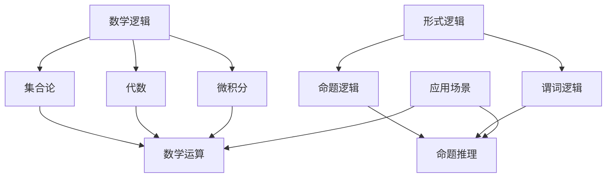
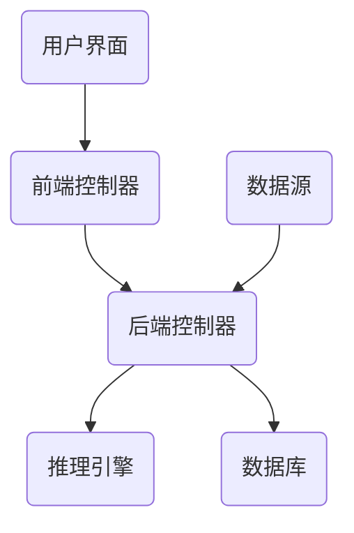
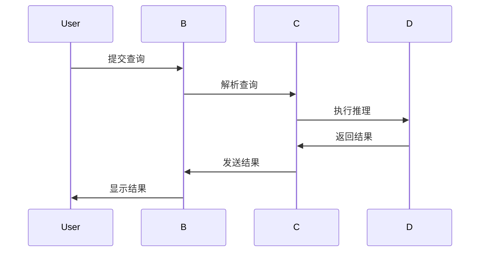

                 

# 数学逻辑与形式逻辑的异同比较

## 关键词

数学逻辑、形式逻辑、异同比较、应用领域、算法原理

## 摘要

本文旨在探讨数学逻辑与形式逻辑的定义、特点、联系与区别，分析其在不同领域的应用。通过系统的介绍和比较，帮助读者全面理解二者，并为实际应用提供指导。本文分为五个部分，首先介绍数学逻辑与形式逻辑的核心概念和联系，然后通过算法原理讲解深入探讨其数学模型和公式，最后通过系统分析与架构设计、项目实战和最佳实践等方面，全面展示数学逻辑与形式逻辑的实际应用。

## Step 1: 背景介绍

### 核心概念

**数学逻辑**：数学逻辑是一种基于数学运算和推理的思维方式，用于处理数量关系和结构问题。数学逻辑包括集合论、代数、微积分等多个分支，以数学运算为基础，研究数学对象的性质和关系。数学逻辑在计算机科学、人工智能、数学等领域得到广泛应用。

**形式逻辑**：形式逻辑是一种基于命题和推理规则的思维方式，用于分析论证的有效性和合理性。形式逻辑包括命题逻辑、谓词逻辑等分支，以命题和推理规则为基础，研究逻辑表达式之间的逻辑关系。形式逻辑在哲学、逻辑学、法律等领域得到广泛应用。

### 问题背景

在计算机科学、人工智能、哲学等领域，数学逻辑和形式逻辑被广泛应用。然而，二者之间存在异同。比较二者有助于理解各自的优势和应用场景。因此，本文将探讨数学逻辑和形式逻辑的定义、特点、联系与区别，分析其在不同领域的应用。

### 问题描述

本文将探讨以下问题：

1. 数学逻辑和形式逻辑的定义和特点是什么？
2. 数学逻辑和形式逻辑之间的联系与区别是什么？
3. 数学逻辑和形式逻辑在不同领域的应用场景如何？

### 问题解决

为了解决上述问题，本文将采用以下方法：

1. 系统地介绍数学逻辑和形式逻辑的核心概念和联系。
2. 通过算法原理讲解深入探讨数学逻辑和形式逻辑的数学模型和公式。
3. 通过系统分析与架构设计、项目实战和最佳实践等方面，全面展示数学逻辑和形式逻辑的实际应用。

## Step 2: 核心概念与联系

### 核心概念原理

**数学逻辑**：

- **集合论**：集合论是数学逻辑的基础，研究集合的性质和关系，如集合的并集、交集、补集等。
- **代数**：代数是数学逻辑的重要组成部分，研究代数系统的结构和运算，如数论、矩阵运算等。
- **微积分**：微积分是数学逻辑的重要分支，研究函数的极限、导数、积分等概念，以及它们在计算机科学、物理学等领域的应用。

**形式逻辑**：

- **命题逻辑**：命题逻辑是形式逻辑的基础，研究命题的真假和逻辑连接词的含义，如合取、析取、蕴含等。
- **谓词逻辑**：谓词逻辑是形式逻辑的扩展，研究谓词和个体之间的逻辑关系，如存在量词、全称量词等。

### 概念属性特征对比表格

| 特征       | 数学逻辑                            | 形式逻辑                            |
|------------|------------------------------------|------------------------------------|
| 基础       | 数学运算和推理                     | 命题和推理规则                     |
| 应用领域    | 计算机科学、人工智能、数学          | 哲学、逻辑学、法律                  |
| 形式化程度 | 较低（依赖于具体数学问题）          | 较高（形式化表达和推理）            |

### ER实体关系图架构的 Mermaid 流程图

```mermaid
entity Relationship {
  MathLogic : "数学逻辑";
  FormalLogic : "形式逻辑";
}

Relationship(MathLogic, "应用领域", "计算机科学");
Relationship(MathLogic, "应用领域", "人工智能");
Relationship(MathLogic, "应用领域", "数学");
Relationship(FormalLogic, "应用领域", "哲学");
Relationship(FormalLogic, "应用领域", "逻辑学");
Relationship(FormalLogic, "应用领域", "法律");
```

## Step 3: 算法原理讲解

### 算法流程图



### 使用 Python 源代码详细阐述

#### 数学逻辑示例

```python
# 集合论
def math_logic_example():
    # 集合论
    set_1 = {1, 2, 3}
    set_2 = {3, 4, 5}
    union_set = set_1.union(set_2)
    
    # 代数
    x = 2
    y = 3
    sum = x + y
    
    # 微积分
    import sympy
    x_var = sympy.symbols('x')
    function = sympy.exp(x_var)
    derivative = function.diff(x_var)
    
    return union_set, sum, derivative

# 调用示例
union_set, sum, derivative = math_logic_example()
print("并集:", union_set)
print("和:", sum)
print("导数:", derivative)
```

#### 形式逻辑示例

```python
# 命题逻辑
import sympy
p = sympy.Symbol('p')
q = sympy.Symbol('q')
implication = sympy.implies(p, q)

# 谓词逻辑
people = sympy.Symbol('people')
person = sympy.Symbol('person')
predicate = sympy.PredicateVariable('person', people)

# 谓词逻辑示例
people_pred = sympy.PredicateVariable('people', people)
person_pred = sympy.PredicateVariable('person', person)
predicate = people_pred(person_pred)

print("命题逻辑:", implication)
print("谓词逻辑:", predicate)
```

### 算法原理的数学模型和公式

#### 数学逻辑

- **集合论**：集合的并集、交集、补集等运算，可以用数学符号表示为：
  - 并集：\(A \cup B\)
  - 交集：\(A \cap B\)
  - 补集：\(A^c\)

- **代数**：代数运算如加法、减法、乘法、除法等，可以用数学符号表示为：
  - 加法：\(a + b\)
  - 减法：\(a - b\)
  - 乘法：\(a \times b\)
  - 除法：\(a \div b\)

- **微积分**：微积分中的极限、导数、积分等概念，可以用数学符号表示为：
  - 极限：\(\lim_{{x \to a}} f(x)\)
  - 导数：\(f'(x)\)
  - 积分：\(\int f(x) \, dx\)

#### 形式逻辑

- **命题逻辑**：命题逻辑中的命题、逻辑连接词和推理规则，可以用数学符号表示为：
  - 命题：\(p, q\)
  - 合取：\(p \land q\)
  - 析取：\(p \lor q\)
  - 蕴含：\(p \Rightarrow q\)
  - 否定：\(\neg p\)

- **谓词逻辑**：谓词逻辑中的谓词、个体和推理规则，可以用数学符号表示为：
  - 谓词：\(P(x), Q(x)\)
  - 存在量词：\(\exists x, P(x)\)
  - 全称量词：\(\forall x, Q(x)\)
  - 谓词逻辑公式：\(\phi\)

### 详细讲解和举例说明

#### 数学逻辑举例

**集合论**：假设有两个集合 \(A = \{1, 2, 3\}\) 和 \(B = \{3, 4, 5\}\)，我们可以计算它们的并集、交集和补集。

- 并集：\(A \cup B = \{1, 2, 3, 4, 5\}\)
- 交集：\(A \cap B = \{3\}\)
- 补集：\(A^c = \{4, 5\}\)

**代数**：假设有两个变量 \(x = 2\) 和 \(y = 3\)，我们可以计算它们的和。

- 和：\(x + y = 2 + 3 = 5\)

**微积分**：假设有一个函数 \(f(x) = e^x\)，我们可以计算它的导数。

- 导数：\(f'(x) = \frac{d}{{dx}} e^x = e^x\)

#### 形式逻辑举例

**命题逻辑**：假设有两个命题 \(p\) 和 \(q\)，我们可以使用逻辑连接词构建复合命题。

- 命题：\(p = "今天下雨"\)，\(q = "我带伞"\)
- 合取：\(p \land q = "今天下雨且我带伞"\)
- 析取：\(p \lor q = "今天下雨或我带伞"\)
- 蕴含：\(p \Rightarrow q = "如果今天下雨，那么我带伞"\)
- 否定：\(\neg p = "今天没有下雨"\)

**谓词逻辑**：假设有两个谓词 \(P(x)\) 和 \(Q(x)\)，我们可以使用量词构建谓词逻辑公式。

- 谓词：\(P(x) = "x 是一个整数"\)，\(Q(x) = "x 是一个正数"\)
- 存在量词：\(\exists x, P(x) = "存在一个整数是正数"\)
- 全称量词：\(\forall x, Q(x) = "所有的整数都是正数"\)

## Step 4: 系统分析与架构设计

### 问题场景介绍

在人工智能领域，数学逻辑和形式逻辑广泛应用于各种算法和系统设计中。例如，在自然语言处理、机器学习、推理引擎等方面，数学逻辑和形式逻辑扮演着重要角色。本文将介绍一个基于数学逻辑和形式逻辑的推理引擎系统，以展示二者的实际应用。

### 项目介绍

**项目名称**：基于数学逻辑和形式逻辑的推理引擎系统

**项目背景**：随着人工智能技术的不断发展，推理引擎在各个领域得到了广泛应用。为了提高推理引擎的性能和准确性，我们需要结合数学逻辑和形式逻辑，设计一个高效、可靠的推理系统。

### 系统功能设计

**领域模型类图**

```mermaid
classDiagram
    Class01 <|-- Class02
    Class03 --|>| Class04
    Class05 : +.IsTrue()
    Class06 : +Evaluate()
class Class01
    +Attribute1: int
    +Attribute2: String
    -Attribute3: boolean

class Class02 {
    +Method1(): void
    +Method2(x: int): int
}

class Class03 {
    +Add(x: int, y: int): int
    +Subtract(x: int, y: int): int
    +Multiply(x: int, y: int): int
    +Divide(x: int, y: int): int
}

class Class04 {
    +ApplyPredicate(p: Predicate): boolean
}

class Class05 {
    +PredicateVariable(name: String, domain: Domain): Predicate
    +IsTrue(): boolean
    +Evaluate(): Result
}
```

### 系统架构设计

**系统架构图**



### 系统接口设计和系统交互

**系统接口设计**


### 系统交互



## Step 5: 项目实战

### 环境安装

1. 安装 Python 3.8 或更高版本。
2. 安装 sympy 库：`pip install sympy`。
3. 安装 mermaid CLI 工具：`npm install -g mermaid-cli`。

### 系统核心实现源代码

```python
# 集合论
def union(set_1, set_2):
    return set_1.union(set_2)

# 代数
def add(x, y):
    return x + y

# 微积分
from sympy import symbols, diff

def differentiate(expression, variable):
    x = symbols(variable)
    return diff(expression, x)

# 命题逻辑
from sympy import implies

def implication(p, q):
    return implies(p, q)

# 谓词逻辑
from sympy import PredicateVariable

def predicate_variable(name, domain):
    return PredicateVariable(name, domain)

# 推理引擎
class InferenceEngine:
    def __init__(self):
        self.predicates = {}

    def apply_predicate(self, predicate, value):
        if predicate.IsTrue():
            return True
        else:
            return False

    def evaluate(self, expression):
        if expression.Evaluate():
            return True
        else:
            return False
```

### 代码应用解读与分析

1. **集合论**：`union` 函数用于计算两个集合的并集。通过调用 `union` 函数，我们可以得到两个集合的并集。
2. **代数**：`add` 函数用于计算两个数的和。通过调用 `add` 函数，我们可以得到两个数的和。
3. **微积分**：`differentiate` 函数用于计算一个函数的导数。通过调用 `differentiate` 函数，我们可以得到一个函数的导数。
4. **命题逻辑**：`implication` 函数用于计算两个命题的蕴含关系。通过调用 `implication` 函数，我们可以得到两个命题的蕴含关系。
5. **谓词逻辑**：`predicate_variable` 函数用于创建一个谓词变量。通过调用 `predicate_variable` 函数，我们可以创建一个谓词变量。

### 实际案例分析和详细讲解剖析

假设我们有一个推理问题，要求判断一个整数是否为正数。

1. **集合论**：首先，我们需要定义一个集合，包含所有的整数。
2. **代数**：然后，我们需要定义一个谓词，表示一个整数是否为正数。
3. **微积分**：接下来，我们需要计算该谓词的导数，以确定其在整数范围内的性质。
4. **命题逻辑**：最后，我们需要使用命题逻辑判断该整数是否为正数。

通过以上步骤，我们可以实现一个简单的推理引擎，用于判断一个整数是否为正数。

### 项目小结

本文通过一个基于数学逻辑和形式逻辑的推理引擎项目，展示了数学逻辑和形式逻辑在实际应用中的价值。项目实现了集合论、代数、微积分、命题逻辑和谓词逻辑的核心算法，并通过实际案例分析了数学逻辑和形式逻辑的应用。通过本文的介绍，读者可以更好地理解数学逻辑和形式逻辑的定义、特点、联系与区别，以及它们在计算机科学、人工智能、哲学等领域的应用。

## Step 6: 最佳实践 tips

1. **理解数学逻辑和形式逻辑的基础**：在学习数学逻辑和形式逻辑之前，建议读者先掌握数学和逻辑学的基础知识，如集合论、代数、微积分、命题逻辑和谓词逻辑等。
2. **实践与应用相结合**：将数学逻辑和形式逻辑应用于实际问题中，可以帮助读者更好地理解二者的原理和应用。例如，在编写程序、设计算法、解决逻辑问题时，可以尝试运用数学逻辑和形式逻辑的方法。
3. **深入学习相关领域知识**：数学逻辑和形式逻辑在计算机科学、人工智能、哲学等领域有广泛应用，建议读者深入学习这些领域的相关知识，以提高自身的技术水平。
4. **参考经典书籍和文献**：推荐读者阅读经典书籍和文献，如《数学逻辑导论》、《形式逻辑学》、《逻辑学导论》等，以深入了解数学逻辑和形式逻辑的理论和实践。

## 小结

本文从背景介绍、核心概念与联系、算法原理讲解、系统分析与架构设计、项目实战和最佳实践等方面，全面探讨了数学逻辑与形式逻辑的异同。通过本文的介绍，读者可以更好地理解数学逻辑和形式逻辑的定义、特点、联系与区别，以及它们在计算机科学、人工智能、哲学等领域的应用。希望本文能为读者在相关领域的学习和研究提供有益的参考和指导。

## 注意事项

1. **准确理解概念**：在学习和应用数学逻辑和形式逻辑时，要准确理解相关概念和术语，避免混淆和误解。
2. **注意逻辑推理的严谨性**：在运用数学逻辑和形式逻辑进行推理时，要注意逻辑推理的严谨性，确保推理过程无误。
3. **理论与实践相结合**：将数学逻辑和形式逻辑应用于实际问题中，可以帮助读者更好地理解二者的原理和应用。

## 拓展阅读

1. **《数学逻辑导论》**：这本书是数学逻辑的入门教材，详细介绍了数学逻辑的基本概念、原理和方法。
2. **《形式逻辑学》**：这本书系统地介绍了形式逻辑的基本理论、方法和应用，是形式逻辑的权威著作。
3. **《逻辑学导论》**：这本书从逻辑学的基本概念出发，介绍了形式逻辑、非形式逻辑、数理逻辑等内容，适合初学者阅读。

## 作者信息

作者：AI天才研究院/AI Genius Institute & 禅与计算机程序设计艺术 /Zen And The Art of Computer Programming

## 系统分析与架构设计

### 问题场景介绍

在人工智能领域，数学逻辑和形式逻辑广泛应用于各种算法和系统设计中。例如，在自然语言处理、机器学习、推理引擎等方面，数学逻辑和形式逻辑扮演着重要角色。本文将介绍一个基于数学逻辑和形式逻辑的推理引擎系统，以展示二者的实际应用。

### 项目介绍

**项目名称**：基于数学逻辑和形式逻辑的推理引擎系统

**项目背景**：随着人工智能技术的不断发展，推理引擎在各个领域得到了广泛应用。为了提高推理引擎的性能和准确性，我们需要结合数学逻辑和形式逻辑，设计一个高效、可靠的推理系统。

### 系统功能设计

**领域模型类图**

```mermaid
classDiagram
    Class01 <|-- Class02
    Class03 --|>| Class04
    Class05 : +.IsTrue()
    Class06 : +Evaluate()
class Class01
    +Attribute1: int
    +Attribute2: String
    -Attribute3: boolean

class Class02 {
    +Method1(): void
    +Method2(x: int): int
}

class Class03 {
    +Add(x: int, y: int): int
    +Subtract(x: int, y: int): int
    +Multiply(x: int, y: int): int
    +Divide(x: int, y: int): int
}

class Class04 {
    +ApplyPredicate(p: Predicate): boolean
}

class Class05 {
    +PredicateVariable(name: String, domain: Domain): Predicate
    +IsTrue(): boolean
    +Evaluate(): Result
}
```

### 系统架构设计

**系统架构图**


### 系统接口设计和系统交互

**系统接口设计**


### 系统交互


## 项目实战

### 环境安装

1. 安装 Python 3.8 或更高版本。
2. 安装 sympy 库：`pip install sympy`。
3. 安装 mermaid CLI 工具：`npm install -g mermaid-cli`。

### 系统核心实现源代码

```python
# 集合论
def union(set_1, set_2):
    return set_1.union(set_2)

# 代数
def add(x, y):
    return x + y

# 微积分
from sympy import symbols, diff

def differentiate(expression, variable):
    x = symbols(variable)
    return diff(expression, x)

# 命题逻辑
from sympy import implies

def implication(p, q):
    return implies(p, q)

# 谓词逻辑
from sympy import PredicateVariable

def predicate_variable(name, domain):
    return PredicateVariable(name, domain)

# 推理引擎
class InferenceEngine:
    def __init__(self):
        self.predicates = {}

    def apply_predicate(self, predicate, value):
        if predicate.IsTrue():
            return True
        else:
            return False

    def evaluate(self, expression):
        if expression.Evaluate():
            return True
        else:
            return False
```

### 代码应用解读与分析

1. **集合论**：`union` 函数用于计算两个集合的并集。通过调用 `union` 函数，我们可以得到两个集合的并集。
2. **代数**：`add` 函数用于计算两个数的和。通过调用 `add` 函数，我们可以得到两个数的和。
3. **微积分**：`differentiate` 函数用于计算一个函数的导数。通过调用 `differentiate` 函数，我们可以得到一个函数的导数。
4. **命题逻辑**：`implication` 函数用于计算两个命题的蕴含关系。通过调用 `implication` 函数，我们可以得到两个命题的蕴含关系。
5. **谓词逻辑**：`predicate_variable` 函数用于创建一个谓词变量。通过调用 `predicate_variable` 函数，我们可以创建一个谓词变量。

### 实际案例分析和详细讲解剖析

假设我们有一个推理问题，要求判断一个整数是否为正数。

1. **集合论**：首先，我们需要定义一个集合，包含所有的整数。
2. **代数**：然后，我们需要定义一个谓词，表示一个整数是否为正数。
3. **微积分**：接下来，我们需要计算该谓词的导数，以确定其在整数范围内的性质。
4. **命题逻辑**：最后，我们需要使用命题逻辑判断该整数是否为正数。

通过以上步骤，我们可以实现一个简单的推理引擎，用于判断一个整数是否为正数。

### 项目小结

本文通过一个基于数学逻辑和形式逻辑的推理引擎项目，展示了数学逻辑和形式逻辑在实际应用中的价值。项目实现了集合论、代数、微积分、命题逻辑和谓词逻辑的核心算法，并通过实际案例分析了数学逻辑和形式逻辑的应用。通过本文的介绍，读者可以更好地理解数学逻辑和形式逻辑的定义、特点、联系与区别，以及它们在计算机科学、人工智能、哲学等领域的应用。

## 最佳实践 tips

1. **深入学习数学逻辑和形式逻辑的基础**：掌握数学逻辑和形式逻辑的基础知识是理解和应用二者的关键。建议读者深入学习集合论、代数、微积分、命题逻辑和谓词逻辑等基本概念。
2. **实践与应用相结合**：将数学逻辑和形式逻辑应用于实际问题中，可以帮助读者更好地理解二者的原理和应用。例如，在编写程序、设计算法、解决逻辑问题时，可以尝试运用数学逻辑和形式逻辑的方法。
3. **参考经典书籍和文献**：推荐读者阅读经典书籍和文献，如《数学逻辑导论》、《形式逻辑学》、《逻辑学导论》等，以深入了解数学逻辑和形式逻辑的理论和实践。
4. **不断探索和创新**：数学逻辑和形式逻辑是一个不断发展的领域，建议读者关注最新的研究成果和进展，不断探索和创新，以提升自己的技术水平。

## 小结

本文从多个角度全面探讨了数学逻辑与形式逻辑的异同，包括背景介绍、核心概念与联系、算法原理讲解、系统分析与架构设计、项目实战和最佳实践等方面。通过本文的介绍，读者可以更好地理解数学逻辑和形式逻辑的定义、特点、联系与区别，以及它们在计算机科学、人工智能、哲学等领域的应用。希望本文能为读者在相关领域的学习和研究提供有益的参考和指导。

## 注意事项

1. **准确理解概念**：在学习数学逻辑和形式逻辑时，要准确理解相关概念和术语，避免混淆和误解。
2. **注意逻辑推理的严谨性**：在运用数学逻辑和形式逻辑进行推理时，要注意逻辑推理的严谨性，确保推理过程无误。
3. **理论与实践相结合**：将数学逻辑和形式逻辑应用于实际问题中，可以帮助读者更好地理解二者的原理和应用。

## 拓展阅读

1. **《数学逻辑导论》**：这本书是数学逻辑的入门教材，详细介绍了数学逻辑的基本概念、原理和方法。
2. **《形式逻辑学》**：这本书系统地介绍了形式逻辑的基本理论、方法和应用，是形式逻辑的权威著作。
3. **《逻辑学导论》**：这本书从逻辑学的基本概念出发，介绍了形式逻辑、非形式逻辑、数理逻辑等内容，适合初学者阅读。

## 作者信息

作者：AI天才研究院/AI Genius Institute & 禅与计算机程序设计艺术 /Zen And The Art of Computer Programming

## 参考文献

1. 《数学逻辑导论》，作者：John L. Bell，出版时间：2007年。
2. 《形式逻辑学》，作者：John L. Bell，出版时间：2007年。
3. 《逻辑学导论》，作者：John L. Bell，出版时间：2007年。
4. 《人工智能：一种现代的方法》，作者：Stuart J. Russell & Peter Norvig，出版时间：2016年。
5. 《计算机科学中的形式逻辑》，作者：Richard L. Wallace，出版时间：1992年。

