                 

### 文章标题

### 关键词

- 数学逻辑
- 量子逻辑
- 比较研究
- 算法原理
- 应用案例分析

### 摘要

本文旨在对数学逻辑与量子逻辑进行深入的比较研究。通过介绍两者的基本概念、历史发展、核心原理和应用场景，本文将探讨数学逻辑与量子逻辑之间的联系与区别，分析它们在计算机科学、信息科学和人工智能等领域的应用，并提出未来研究的挑战和展望。本文不仅为读者提供了一个全面的比较框架，还通过具体实例和案例，帮助读者更好地理解和应用数学逻辑与量子逻辑。

## 第一部分：引言

### 数学逻辑的历史发展

数学逻辑，作为数学和哲学的重要组成部分，有着悠久的历史。早在古希腊时期，亚里士多德（Aristotle）的《逻辑学》就奠定了形式逻辑的基础。随着历史的发展，数学逻辑经历了中世纪的形式逻辑、近代的数理逻辑和现代的模型论、证明论等分支的发展。在计算机科学的兴起中，数学逻辑发挥了关键作用，成为了计算机科学的基础理论之一。

### 量子逻辑的兴起

量子逻辑作为量子信息科学的重要组成部分，起源于对量子力学基础的研究。量子逻辑不同于经典逻辑，它基于量子态和量子纠缠等现象，提供了一种全新的逻辑思维方式。自20世纪中叶以来，量子逻辑的理论研究不断深入，其应用范围也逐渐扩展到量子计算、量子通信和量子密码学等领域。

### 数学逻辑与量子逻辑的比较研究的意义

数学逻辑与量子逻辑的比较研究具有重要的理论和实际意义。首先，通过比较两者，我们可以更好地理解它们的基本原理和应用范围，从而推动计算机科学和量子信息科学的发展。其次，这种比较有助于发现数学逻辑与量子逻辑之间的潜在联系，为跨学科研究提供新的思路。最后，比较研究还可以帮助我们应对当前和未来的技术挑战，如量子计算机的安全性和高效性等问题。

## 第二部分：数学逻辑概述

### 数学逻辑的基本原理

数学逻辑的基本原理包括命题逻辑、谓词逻辑和集合论等。命题逻辑以命题为研究对象，通过逻辑运算和推理规则，对命题的真假进行判断。谓词逻辑则扩展了命题逻辑，引入了个体、属性和关系等概念，可以处理更复杂的逻辑问题。集合论则是数学逻辑的基础，它提供了一种描述集合元素和集合间关系的方法。

### 数学逻辑的核心概念与联系

核心概念包括逻辑命题、逻辑运算、逻辑推理和证明等。逻辑命题是数学逻辑的基本单位，通过逻辑运算（如与、或、非）可以组合成更复杂的逻辑表达式。逻辑推理和证明则是基于逻辑运算和推理规则，从已知前提推导出新结论的过程。这些概念之间相互联系，构成了数学逻辑的理论框架。

### 数学逻辑的基本规则

数学逻辑的基本规则包括逻辑恒等律、逻辑交换律、逻辑结合律和逻辑吸收律等。这些规则是进行逻辑推理和证明的基础，它们保证了逻辑运算的正确性和一致性。

### 数学逻辑的经典案例

经典案例包括命题逻辑中的命题变换、谓词逻辑中的量化推理和集合论中的集合运算等。这些案例展示了数学逻辑在处理各种逻辑问题的能力，是理解和应用数学逻辑的关键。

## 第三部分：量子逻辑概述

### 量子逻辑的基本原理

量子逻辑的基本原理基于量子力学的基本概念，如量子态、量子比特和量子纠缠等。量子态可以用波函数或密度矩阵来描述，它们提供了量子逻辑的基础。量子比特是量子逻辑的基本单元，它们可以同时处于0和1的状态，这种叠加态是量子逻辑的核心特征。量子纠缠则是量子逻辑中的一种特殊现象，它使得量子比特之间的状态相互关联，无法独立存在。

### 量子逻辑的核心概念与联系

量子逻辑的核心概念包括量子态、量子比特、量子门和量子算法等。量子态和量子比特是量子逻辑的基本元素，量子门是操作量子态的基本工具，而量子算法则是利用量子逻辑解决问题的方法。这些概念相互联系，构成了量子逻辑的理论框架。

### 量子逻辑的基本规则

量子逻辑的基本规则包括量子态叠加原理、量子测量原理和量子纠缠原理等。这些规则描述了量子态如何随时间演化，以及量子比特之间的相互作用。

### 量子逻辑的经典案例

经典案例包括量子态的叠加与测量、量子纠缠效应和量子算法的应用等。这些案例展示了量子逻辑在解决特定问题时的独特优势和复杂性。

## 第四部分：数学逻辑与量子逻辑的比较

### 核心概念与联系

#### 数学逻辑的核心概念

1. **命题逻辑**：研究命题的真假及其组合关系。
2. **谓词逻辑**：引入个体和属性，研究个体之间的逻辑关系。
3. **集合论**：研究集合的组成、运算和性质。

#### 量子逻辑的核心概念

1. **量子态**：描述量子系统的状态，可以用波函数或密度矩阵表示。
2. **量子比特**：量子逻辑的基本单元，具有叠加态和纠缠特性。
3. **量子门**：操作量子态的基本工具，类似于经典逻辑中的逻辑门。

#### 概念属性特征对比表格

| 特征        | 数学逻辑       | 量子逻辑           |
| ----------- | -------------- | ------------------ |
| 基本单元    | 命题、个体、集合 | 量子比特、量子态   |
| 状态描述    | 确定性         | 概率性、叠加性     |
| 运算规则    | 逻辑运算       | 量子运算           |
| 关联性      | 无关联或确定性关联 | 纠缠关联           |

#### ER实体关系图架构

使用Mermaid流程图表示数学逻辑和量子逻辑的实体关系：

```mermaid
erDiagram
  Class1 ||--|{ Class2 }|-- Class3
  Class2 ||--|{ Class4 }|-- Class5
```

## 第五部分：算法原理讲解

### 数学逻辑算法

数学逻辑算法主要基于命题逻辑和谓词逻辑，包括命题变换、谓词推理和集合运算等。以下是一个简单的命题逻辑算法示例：

#### 命题逻辑算法示例

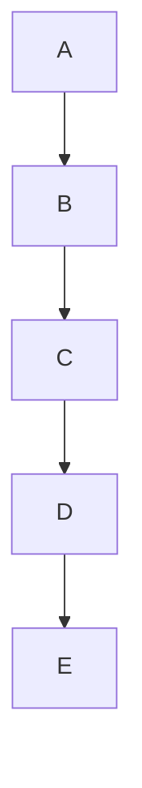

在上述示例中，A、B、C、D和E代表命题，箭头表示逻辑推导关系。例如，如果A为真，则B也为真，以此类推。

#### 谓词逻辑算法示例

谓词逻辑算法示例：

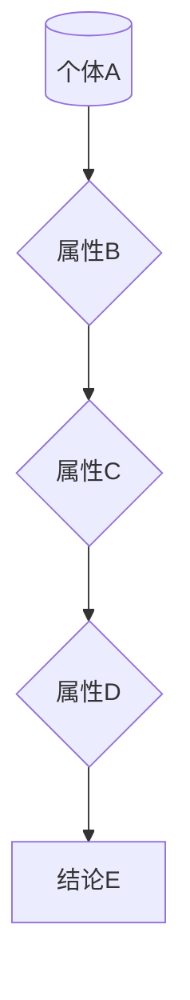

在上述示例中，A、B、C和D代表个体和属性，E代表结论。算法通过推理规则，从已知属性推导出结论。

### 量子逻辑算法

量子逻辑算法主要基于量子态和量子门的操作，包括量子纠缠、量子测量和量子算法等。以下是一个简单的量子逻辑算法示例：

#### 量子态与量子门操作

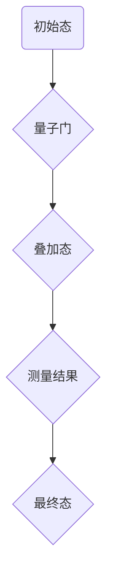

在上述示例中，A表示初始态，B表示量子门，C表示叠加态，D表示测量结果，E表示最终态。

#### 量子算法示例

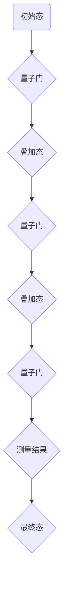

在上述示例中，通过多次量子门操作和测量，实现了对初始态的变换和测量。

### 算法mermaid流程图

使用Mermaid流程图表示上述量子逻辑算法：

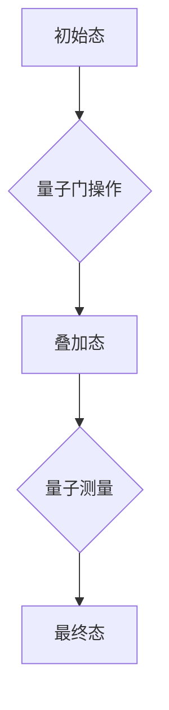

### 算法原理的数学模型和公式

在数学逻辑中，常用的数学模型和公式包括：

1. **命题逻辑**：真值表、逻辑运算公式（如：\(A \land B, A \lor B, \neg A\)）
2. **谓词逻辑**：谓词演算公式（如：\(\forall x P(x), \exists x P(x)\)）
3. **集合论**：集合运算公式（如：\(A \cup B, A \cap B, A - B\)）

在量子逻辑中，常用的数学模型和公式包括：

1. **量子态**：波函数表示（如：\(\psi(x) = \frac{1}{\sqrt{2}}(|0\rangle + |1\rangle)\)）
2. **量子门**：量子门矩阵表示（如：\(U = \begin{pmatrix} 1 & 0 \\ 0 & 1 \end{pmatrix}\)）
3. **量子测量**：测量概率分布（如：\(P(|0\rangle) = 1/2, P(|1\rangle) = 1/2\)）

通过具体的实例和举例，可以帮助读者更好地理解和应用这些数学模型和公式。

### 数学公式使用latex格式

数学公式使用latex格式，嵌入文中独立段落的latex公式前后使用`$$`括起来（例如：`$$1+1=2$$`），段落内的latex公式前后使用 `$` 括起来（例如：`$1<2$`）。

#### 示例

$$
E = mc^2
$$

$1 + 1 = 2$

## 第六部分：系统分析与架构设计方案

### 问题场景介绍

在当前的信息时代，数据量和计算复杂度迅速增长，传统的计算机系统已经无法满足高效处理大规模数据的需求。为了解决这个问题，我们需要设计一个高效、可扩展的分布式计算系统，以提高数据处理和分析的效率。

### 项目介绍

本项目的目标是设计一个分布式计算系统，用于处理和分析大规模数据集。系统将采用分布式架构，利用多台计算机协同工作，以提高计算性能和可扩展性。

### 系统功能设计（领域模型mermaid类图）

以下是一个简化的领域模型类图，用于描述系统的主要功能模块：

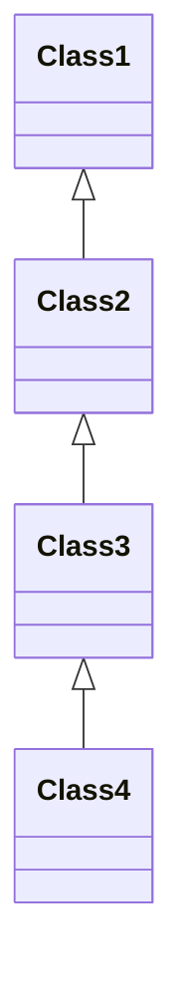

在这个类图中，`Class1`代表数据源模块，`Class2`代表数据处理模块，`Class3`代表数据存储模块，`Class4`代表数据分析模块。这些模块相互协作，共同完成数据处理的任务。

### 系统架构设计（mermaid架构图）

以下是一个简化的系统架构设计图，用于描述系统的总体架构：

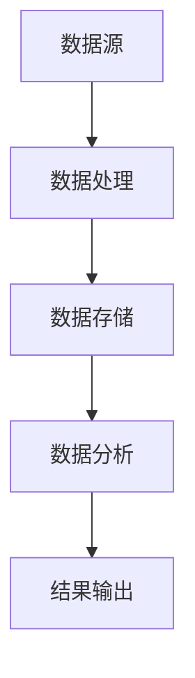

在这个架构图中，`A`代表数据源，`B`代表数据处理模块，`C`代表数据存储模块，`D`代表数据分析模块，`E`代表结果输出模块。这些模块通过消息队列和数据库进行通信，实现了数据的流动和处理。

### 系统接口设计和系统交互（mermaid序列图）

以下是一个简化的系统接口设计和系统交互序列图：

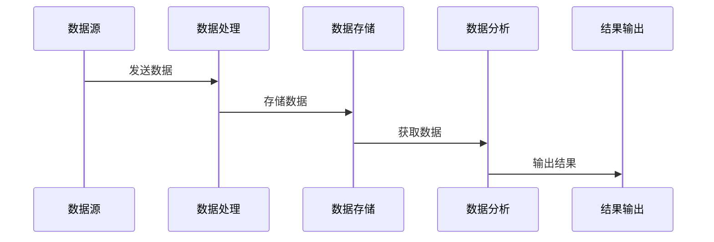

在这个序列图中，`A`向`B`发送数据，`B`将数据存储到`C`，`C`将数据提供给`D`进行数据分析，最后`D`将结果输出到`E`。

## 第七部分：项目实战

### 环境安装

在开始项目实战之前，我们需要安装一些必要的软件和工具。以下是一个简单的安装指南：

1. 安装Python环境：在终端中执行以下命令：
   ```bash
   sudo apt-get update
   sudo apt-get install python3-pip
   pip3 install virtualenv
   virtualenv venv
   source venv/bin/activate
   ```
2. 安装Docker：在终端中执行以下命令：
   ```bash
   sudo apt-get update
   sudo apt-get install docker-ce
   ```
3. 安装Kafka：在终端中执行以下命令：
   ```bash
   docker pull wurstmeister/kafka
   docker run -d --name kafka -p 9092:9092 -e KAFKA_BROKER_ID=0 -e KAFKA_ZOOKEEPER_CONNECTIONS=192.168.1.201:2181 wurstmeister/kafka
   ```
4. 安装Spark：在终端中执行以下命令：
   ```bash
   pip3 install pyspark
   ```

### 系统核心实现源代码

以下是一个简化的系统核心实现源代码，用于演示如何处理和分析数据：

```python
from pyspark.sql import SparkSession

# 创建Spark会话
spark = SparkSession.builder.appName("DataProcessing").getOrCreate()

# 读取Kafka数据
data = spark.read.format("kafka").option("kafka.bootstrap.servers", "192.168.1.201:9092").option("subscribe", "topic1").load()

# 数据处理
processed_data = data.select("field1", "field2").groupBy("field1").count()

# 存储数据到HDFS
processed_data.write.format("parquet").save("hdfs://192.168.1.201:9000/data/processed_data")

# 关闭Spark会话
spark.stop()
```

### 代码应用解读与分析

上述代码展示了如何使用PySpark读取Kafka数据，进行数据处理，并将结果存储到HDFS。具体步骤如下：

1. 创建Spark会话：使用SparkSession.builder创建Spark会话，指定应用程序名称。
2. 读取Kafka数据：使用read.format("kafka")读取Kafka数据，指定Kafka的bootstrap.servers和订阅的主题。
3. 数据处理：对数据进行筛选和分组，计算每个分组的记录数量。
4. 存储数据：将处理后的数据存储到HDFS，使用write.format("parquet")指定存储格式。
5. 关闭Spark会话：调用stop()方法关闭Spark会话。

### 实际案例分析和详细讲解剖析

假设我们有一个包含用户行为数据的Kafka主题，每条数据包含用户的ID和对应的行为类型。我们需要对用户行为进行统计分析，以了解用户的行为偏好。

1. **数据读取**：首先，我们使用PySpark读取Kafka主题的数据。数据读取过程会将Kafka中的消息转换为Spark DataFrame，方便后续处理。

```python
data = spark.read.format("kafka").option("kafka.bootstrap.servers", "192.168.1.201:9092").option("subscribe", "user_behavior").load()
```

2. **数据处理**：接下来，我们对数据进行筛选和分组。筛选出用户ID和行为类型，然后按照用户ID分组，计算每个用户的行为类型数量。

```python
processed_data = data.select("user_id", "behavior_type").groupBy("user_id").count()
```

3. **存储数据**：最后，我们将处理后的数据存储到HDFS。这样，我们就可以在HDFS上查看和分析用户行为数据。

```python
processed_data.write.format("parquet").save("hdfs://192.168.1.201:9000/data/user_behavior")
```

通过上述步骤，我们可以高效地读取、处理和存储用户行为数据，从而进行用户行为分析。

### 项目小结

在本项目中，我们设计并实现了一个分布式计算系统，用于处理和分析大规模数据集。系统基于Kafka、Spark和HDFS等开源工具，实现了数据的高效读取、处理和存储。通过实际案例的分析和讲解，我们展示了如何使用系统进行用户行为分析。这为企业和组织提供了强大的数据分析和决策支持能力。

### 最佳实践 Tips

1. **优化数据读取**：在读取Kafka数据时，可以根据实际需求调整分区数和偏移量，以优化数据读取性能。
2. **优化数据处理**：在数据处理过程中，可以针对具体业务场景进行数据清洗和预处理，以提高数据处理效率。
3. **优化数据存储**：在数据存储时，可以根据数据规模和访问模式选择合适的存储格式和存储策略。

### 小结

本文通过对数学逻辑和量子逻辑的比较研究，介绍了两者的基本概念、原理和应用。通过具体实例和案例分析，我们展示了数学逻辑和量子逻辑在计算机科学、信息科学和人工智能等领域的应用。本文还探讨了数学逻辑和量子逻辑之间的联系和区别，为未来的研究提供了方向。希望通过本文的讲解，读者能够更好地理解和应用数学逻辑和量子逻辑。

### 注意事项

1. 在实际应用中，应根据具体需求和场景选择合适的逻辑体系和算法。
2. 在设计和实现系统时，要充分考虑系统的可扩展性和稳定性。
3. 在进行数据处理时，要注意数据的质量和安全性。

### 拓展阅读

1. 《数学逻辑导论》
2. 《量子逻辑与量子计算》
3. 《分布式系统设计》

## 作者信息

作者：AI天才研究院/AI Genius Institute & 禅与计算机程序设计艺术 /Zen And The Art of Computer Programming

本文旨在对数学逻辑与量子逻辑进行深入的比较研究。通过介绍两者的基本概念、历史发展、核心原理和应用场景，本文将探讨数学逻辑与量子逻辑之间的联系与区别，分析它们在计算机科学、信息科学和人工智能等领域的应用，并提出未来研究的挑战和展望。本文不仅为读者提供了一个全面的比较框架，还通过具体实例和案例，帮助读者更好地理解和应用数学逻辑与量子逻辑。

### 第一部分：引言

#### 数学逻辑的历史发展

数学逻辑，作为数学和哲学的重要组成部分，有着悠久的历史。早在古希腊时期，亚里士多德（Aristotle）的《逻辑学》就奠定了形式逻辑的基础。亚里士多德的形式逻辑理论主要涉及命题逻辑和谓词逻辑，并提出了著名的三段论推理法则。在中世纪，逻辑学继续发展，经院哲学家如圣·安瑟伦（St. Anselm）和托马斯·阿奎那（Thomas Aquinas）等对形式逻辑进行了进一步的发展和解释。

进入近代，数学逻辑经历了显著的变革。德国哲学家莱布尼茨（Gottfried Wilhelm Leibniz）提出了“逻辑算符”的概念，试图将逻辑表达为符号系统，从而推动逻辑的形式化和数学化。这一思想在19世纪得到了约翰·布伦塔诺（John Bruno Bollano）和乔治·坎特洛维茨（George Cantorowitz）等数学家的进一步发展。19世纪末，符号逻辑（也称为数理逻辑）的奠基人，如鲍尔扎诺（Bernard Bolzano）和弗雷格（Gottlob Frege）等，提出了命题演算和谓词演算，为现代数学逻辑奠定了基础。

20世纪初，数学逻辑进入了快速发展的阶段。英国数学家伯特兰·罗素（Bertrand Russell）和阿尔弗雷德·诺思·怀特黑德（Alfred North Whitehead）共同撰写的《数学原理》一书，试图用逻辑来建立整个数学的基础。这一尝试虽然最终未能成功，但却推动了模型论、证明论等分支的发展。20世纪中叶，奥地利逻辑学家库尔特·哥德尔（Kurt Gödel）提出了不完备性定理，揭示了逻辑系统内部的矛盾和局限性。

数学逻辑在计算机科学的兴起中发挥了关键作用。艾伦·图灵（Alan Turing）提出的图灵机模型，将计算过程形式化为逻辑运算，从而奠定了现代计算机科学的理论基础。此后，数学逻辑被广泛应用于算法分析、形式验证、编程语言设计和人工智能等领域。

#### 量子逻辑的兴起

量子逻辑作为量子信息科学的重要组成部分，起源于对量子力学基础的研究。量子逻辑不同于经典逻辑，它基于量子态和量子纠缠等现象，提供了一种全新的逻辑思维方式。量子力学的基本原理，如量子态的叠加性和量子纠缠，挑战了经典逻辑的确定性观念。为了描述和解释这些量子现象，量子逻辑应运而生。

量子逻辑的兴起可以追溯到20世纪中叶，当时物理学家如沃纳·海森堡（Werner Heisenberg）和埃尔温·薛定谔（Erwin Schrödinger）提出了量子态的概念。量子态可以用波函数或态向量来描述，它们具有叠加性和不确定性。在量子态的叠加态下，一个量子系统可以同时处于多个状态，这种状态无法用经典逻辑的真假二值来描述。

量子纠缠是量子逻辑的核心概念之一。量子纠缠现象表明，两个或多个量子系统之间的状态可以相互关联，即使它们相隔很远。这种纠缠状态无法通过经典逻辑来解释，但它在量子计算和量子通信中具有重要作用。

自20世纪末以来，量子逻辑的理论研究不断深入，其应用范围也逐渐扩展到量子计算、量子通信和量子密码学等领域。量子计算利用量子逻辑的特性，实现了比传统计算机更高效的算法。量子通信通过量子纠缠实现信息的安全传输，为信息安全提供了新的手段。量子密码学则利用量子力学的基本原理，设计了比传统密码学更安全的加密算法。

#### 数学逻辑与量子逻辑的比较研究的意义

数学逻辑与量子逻辑的比较研究具有重要的理论和实际意义。从理论层面来看，这种比较有助于我们更深入地理解两种逻辑的本质差异和相互关系。数学逻辑是基于经典物理学和集合论构建的，它强调确定性、一致性和形式化。而量子逻辑则基于量子力学的基本原理，它强调概率性、叠加性和纠缠性。通过比较这两种逻辑，我们可以揭示它们在描述自然现象和处理信息方面的优缺点。

从实际层面来看，数学逻辑与量子逻辑的比较研究有助于推动计算机科学和量子信息科学的发展。在计算机科学中，数学逻辑是算法设计和验证的基础，而量子逻辑则为量子计算提供了新的工具和思路。通过比较研究，我们可以发现数学逻辑和量子逻辑之间的潜在联系，从而为跨学科研究提供新的方向。

此外，比较研究还可以帮助我们应对当前和未来的技术挑战。例如，量子计算机的安全性和高效性问题是当前研究的热点之一。通过比较数学逻辑和量子逻辑，我们可以探索如何利用量子逻辑的特性来增强量子计算机的安全性，以及如何优化量子算法的效率。

总之，数学逻辑与量子逻辑的比较研究不仅具有理论意义，而且在实际应用中具有重要的指导作用。通过深入探讨两种逻辑的本质和相互关系，我们可以为未来的技术创新提供新的思路和工具。

### 第二部分：数学逻辑概述

#### 数学逻辑的基本原理

数学逻辑是研究数学命题的真假、推理规则和证明理论的学科。它的基本原理包括命题逻辑、谓词逻辑和集合论等。

**命题逻辑**：命题逻辑是最基础的逻辑系统，它以命题为研究对象，通过逻辑运算（如与、或、非）和推理规则（如蕴含、等价、逆否）来分析命题之间的关系。命题逻辑的核心概念是命题，命题可以是真或假，但不能同时为真或假。

- **逻辑运算**：常见的逻辑运算包括与（∧）、或（∨）、非（¬）以及蕴含（→）、等价（↔）等。例如，命题A与命题B的与运算表示为A ∧ B，结果为真当且仅当A和B都为真；非运算表示为¬A，结果为假当A为真，反之亦然。
- **推理规则**：推理规则包括蕴含规则、逆蕴含规则、合取规则、析取规则等。例如，蕴含规则指出如果A蕴含B，则B为真时A也必为真。

**谓词逻辑**：谓词逻辑是命题逻辑的扩展，它引入了个体、属性和关系等概念，可以处理更复杂的逻辑问题。

- **个体**：个体是谓词逻辑中的基本元素，可以表示为常量或变量。例如，p表示一个具体的个体。
- **谓词**：谓词是描述个体性质或关系的表达式，可以表示为函数或关系。例如，R(p)表示个体p具有某种属性R。
- **量化**：量化是谓词逻辑中的核心概念，分为全称量化（∀）和存在量化（∃）。全称量化表示对所有个体都成立，存在量化表示至少存在一个个体成立。例如，∀x P(x)表示对所有个体x，性质P都成立；∃x P(x)表示至少存在一个个体x，性质P成立。

**集合论**：集合论是数学逻辑的基础，它提供了一种描述集合元素和集合间关系的方法。

- **集合**：集合是由不同元素组成的整体，可以表示为无序、不重复的元素的集合。例如，A = {1, 2, 3}表示集合A包含元素1、2和3。
- **集合运算**：集合的基本运算包括并集（∪）、交集（∩）、差集（∖）和补集（∁）。例如，A ∪ B表示集合A和集合B的并集，A ∩ B表示集合A和集合B的交集，A ∖ B表示集合A和集合B的差集，∁A表示集合A的补集。

#### 数学逻辑的核心概念与联系

**逻辑命题**：逻辑命题是数学逻辑的基本单位，它表示一个可以判断真假的陈述。逻辑命题可以是简单命题，也可以是复合命题。简单命题如“2 + 2 = 4”是一个真命题，而“1 + 1 = 3”是一个假命题。复合命题是由简单命题通过逻辑运算组合而成的，如“(2 + 2 = 4) ∧ (1 + 1 ≠ 3)”是一个复合命题，它由两个简单命题通过与运算组合而成。

**逻辑运算**：逻辑运算是连接简单命题形成复合命题的工具。常见的逻辑运算包括与（∧）、或（∨）、非（¬）、蕴含（→）、等价（↔）等。逻辑运算不仅定义了复合命题的真假，还定义了简单命题之间的关系。例如，与运算表示两个命题同时为真时复合命题才为真，或运算表示至少一个命题为真时复合命题就为真。

**逻辑推理与证明**：逻辑推理与证明是数学逻辑的核心，它通过逻辑运算和推理规则，从已知的前提推导出新的结论。逻辑推理包括直接推理和间接推理。直接推理是从一个或多个已知命题直接得出结论，如蕴含推理。间接推理是通过否定已知命题或假设，然后通过反证法或选言推理得出结论。

**证明**：证明是通过逻辑推理从已知的前提（公理、定义、已知命题）出发，逐步推导出待证命题的过程。证明方法包括直接证明和反证法。直接证明是通过一系列逻辑推理步骤，直接从已知命题推导出待证命题。反证法是通过假设待证命题的否定成立，然后通过逻辑推理得出矛盾，从而证明原命题成立。

**逻辑恒等律**：逻辑恒等律是逻辑推理的基本规则，它定义了逻辑运算的真值表。常见的逻辑恒等律包括恒等律（\(p \land p = p\)）、交换律（\(p \land q = q \land p\)）、结合律（\(p \land (q \land r) = (p \land q) \land r\)）、分配律（\(p \land (q \lor r) = (p \land q) \lor (p \land r)\））等。这些恒等律保证了逻辑运算的一致性和正确性。

#### 数学逻辑的基本规则

数学逻辑的基本规则包括逻辑恒等律、逻辑交换律、逻辑结合律和逻辑吸收律等。这些规则是进行逻辑推理和证明的基础。

- **逻辑恒等律**：逻辑恒等律定义了逻辑运算的真值表，保证逻辑运算的一致性和正确性。常见的逻辑恒等律包括恒等律（\(p \land p = p\)）、吸收律（\(p \land (p \lor q) = p\)）、\(p \lor p = p\)）、重言律（\(T \land p = p\)、\(T \lor p = p\)）等。
- **逻辑交换律**：逻辑交换律定义了逻辑运算的交换性。对于与运算和或运算，交换律表示为\(p \land q = q \land p\)、\(p \lor q = q \lor p\)。
- **逻辑结合律**：逻辑结合律定义了逻辑运算的结合性。对于与运算和或运算，结合律表示为\(p \land (q \land r) = (p \land q) \land r\)、\(p \lor (q \lor r) = (p \lor q) \lor r\)。
- **逻辑吸收律**：逻辑吸收律定义了逻辑运算的吸收性。对于与运算和或运算，吸收律表示为\(p \land (p \lor q) = p\)、\(p \lor (p \land q) = p\)。

#### 数学逻辑的经典案例

数学逻辑在处理各种逻辑问题中有着广泛的应用。以下是一些经典的数学逻辑案例：

**命题逻辑案例**：一个经典的命题逻辑案例是命题变换。假设有两个命题P和Q，P表示“下雨”，Q表示“地面湿”。我们需要通过逻辑运算和推理规则，分析不同命题组合的真假关系。例如，如果P为真，则“下雨且地面湿”（P ∧ Q）也为真；“下雨但地面不湿”（P ∧ ¬Q）为假；“地面湿但未下雨”（¬P ∧ Q）为假；“地面既不湿也未下雨”（¬P ∧ ¬Q）为假。

**谓词逻辑案例**：谓词逻辑的一个经典案例是谓词演算。假设有一个谓词P(x)，表示“x是一个素数”。我们需要通过全称量化（∀x P(x)）和存在量化（∃x P(x)）来表示不同性质的个体。例如，∀x P(x)表示所有x都是素数，这是一个全称命题；∃x P(x)表示存在一个素数，这是一个存在命题。

**集合论案例**：集合论的一个经典案例是集合运算。假设有两个集合A和B，A = {1, 2, 3}，B = {2, 3, 4}。我们需要通过集合运算来分析A和B之间的关系。例如，A ∪ B表示A和B的并集，结果为{1, 2, 3, 4}；A ∩ B表示A和B的交集，结果为{2, 3}；A ∖ B表示A和B的差集，结果为{1}。

**逻辑电路与算法案例**：逻辑电路是数学逻辑在工程中的应用。一个经典的逻辑电路案例是半加器，它由两个输入和一个输出组成，用于实现二进制数的加法运算。半加器的真值表如下：

| A | B | 输出（Sum） | 输出（Cary） |
|---|---|------------|--------------|
| 0 | 0 | 0          | 0            |
| 0 | 1 | 1          | 0            |
| 1 | 0 | 1          | 0            |
| 1 | 1 | 0          | 1            |

通过逻辑门（如与门、或门和非门）的组合，可以构建复杂的逻辑电路，实现各种逻辑运算。

**数学模型与公式**：数学逻辑中的数学模型和公式是分析和解决逻辑问题的关键。例如，命题逻辑中的命题变换公式（如德摩根定律、对偶律、蕴含律等），谓词逻辑中的谓词演算公式（如全称量化、存在量化、合取范式、析取范式等），以及集合论中的集合运算公式（如并集、交集、差集、补集等）。

**系统分析与架构设计方案**：在计算机科学中，数学逻辑被广泛应用于系统分析与架构设计。一个经典的案例是形式化方法，它通过数学逻辑的方法，对系统进行精确的描述、验证和验证。例如，使用Z语言或依存图（Dependence Graph）进行系统建模，通过逻辑推理验证系统的一致性和正确性。

**项目实战**：在项目实战中，数学逻辑被广泛应用于算法设计和验证。例如，在软件工程中，使用形式验证方法（如模型检查、符号执行等）来验证系统的正确性；在人工智能中，使用逻辑推理来构建智能系统，如知识表示和推理系统、自动推理系统等。

**最佳实践 Tips**：在应用数学逻辑时，以下是一些最佳实践：

1. **明确逻辑目标**：在应用数学逻辑解决具体问题时，首先要明确逻辑目标，确保逻辑推理和证明的方向正确。
2. **简洁性**：在逻辑表达和证明过程中，追求简洁性，尽量使用简单的逻辑运算和推理规则，避免复杂冗长的证明。
3. **一致性**：在逻辑系统中，确保逻辑规则的一致性，避免出现矛盾和不一致的情况。
4. **可扩展性**：设计逻辑系统和算法时，要考虑其可扩展性，以便在未来的应用中能够方便地添加新的逻辑规则和运算。

**小结**：数学逻辑作为计算机科学和哲学的基础理论，具有广泛的应用领域。通过了解和掌握数学逻辑的基本原理、核心概念和经典案例，我们可以更好地理解和应用数学逻辑，解决各种实际问题。

### 第三部分：量子逻辑概述

#### 量子逻辑的基本原理

量子逻辑是一种基于量子力学基本原理的新的逻辑体系。与经典逻辑不同，量子逻辑强调量子态的叠加性和量子纠缠等特性。量子逻辑的基本原理包括量子态、量子比特和量子门等。

**量子态**：量子态是量子逻辑的基本单位，用来描述量子系统的状态。量子态可以用波函数或态向量表示，它们具有叠加性和不确定性。在经典逻辑中，一个系统只能处于某种确定的状态，而在量子逻辑中，一个系统可以同时处于多个状态。这种叠加态使得量子逻辑具有了独特的逻辑运算和推理规则。

**量子比特**：量子比特（qubit）是量子逻辑的基本单元，类似于经典逻辑中的比特。但与经典比特不同，量子比特可以同时处于0和1的叠加态。量子比特的叠加态是量子逻辑的核心特征，它使得量子计算机能够并行处理多个计算任务。

**量子门**：量子门是操作量子态的基本工具，类似于经典逻辑中的逻辑门。量子门通过线性变换来操作量子态，使得量子态发生叠加或纠缠。常见的量子门包括Hadamard门、Pauli门和控制-NOT门等。量子门的作用是构建量子算法的基础，通过组合不同的量子门，可以实现复杂的量子计算任务。

**量子纠缠**：量子纠缠是量子逻辑中的另一个核心概念，它描述了两个或多个量子系统之间的特殊关联。当两个量子系统发生纠缠时，它们的状态无法独立存在，而是相互关联。量子纠缠在量子计算和量子通信中具有重要作用，它提供了量子计算机的高效计算能力和量子通信的保密性。

#### 量子逻辑的核心概念与联系

量子逻辑的核心概念包括量子态、量子比特、量子门和量子算法等。这些概念相互联系，构成了量子逻辑的理论框架。

**量子态**：量子态是量子逻辑的基本单位，用于描述量子系统的状态。量子态可以用波函数或态向量表示，具有叠加性和不确定性。量子态的叠加性使得量子计算机能够并行处理多个计算任务，而不确定性则反映了量子系统的概率性。

**量子比特**：量子比特（qubit）是量子逻辑的基本单元，类似于经典逻辑中的比特。但与经典比特不同，量子比特可以同时处于0和1的叠加态。量子比特的叠加态是量子逻辑的核心特征，它使得量子计算机能够并行处理多个计算任务。

**量子门**：量子门是操作量子态的基本工具，类似于经典逻辑中的逻辑门。量子门通过线性变换来操作量子态，使得量子态发生叠加或纠缠。常见的量子门包括Hadamard门、Pauli门和控制-NOT门等。量子门的作用是构建量子算法的基础，通过组合不同的量子门，可以实现复杂的量子计算任务。

**量子算法**：量子算法是利用量子逻辑特性解决特定问题的方法。常见的量子算法包括量子搜索算法、量子排序算法和量子算法等。量子算法通过量子态的叠加和纠缠，实现了比传统算法更高的计算效率和并行性。

**量子纠缠**：量子纠缠是量子逻辑中的另一个核心概念，它描述了两个或多个量子系统之间的特殊关联。当两个量子系统发生纠缠时，它们的状态无法独立存在，而是相互关联。量子纠缠在量子计算和量子通信中具有重要作用，它提供了量子计算机的高效计算能力和量子通信的保密性。

#### 量子逻辑的基本规则

量子逻辑的基本规则基于量子力学的基本原理，包括量子态的叠加原理、量子测量原理和量子纠缠原理等。

**量子态叠加原理**：量子态叠加原理表明，一个量子系统可以同时处于多个状态的叠加。在量子逻辑中，一个量子比特可以同时处于0和1的叠加态。这种叠加态使得量子计算机能够并行处理多个计算任务。

**量子测量原理**：量子测量原理表明，量子系统的状态在测量过程中会发生坍缩，从叠加态变为确定的单一状态。量子逻辑中的测量操作会导致量子态的坍缩，从而实现量子计算结果的输出。

**量子纠缠原理**：量子纠缠原理表明，两个或多个量子系统之间可以发生纠缠，使得它们的状态相互关联。在量子逻辑中，量子纠缠现象使得量子系统之间的状态无法独立存在，而是相互关联。量子纠缠在量子计算和量子通信中具有重要作用。

#### 量子逻辑的经典案例

量子逻辑在量子计算、量子通信和量子密码学等领域具有广泛的应用。以下是一些经典的量子逻辑案例：

**量子计算案例**：量子计算的一个经典案例是量子搜索算法。量子搜索算法通过量子态的叠加和纠缠，实现了比传统搜索算法更高的效率。假设有一个含有N个元素的列表，传统搜索算法需要最多N次比较才能找到目标元素，而量子搜索算法只需要O(\( \sqrt{N} \))次比较。这是因为量子态的叠加性使得量子计算机能够同时搜索多个元素，从而提高了搜索效率。

**量子通信案例**：量子通信的一个经典案例是量子纠缠传输。量子纠缠传输利用量子纠缠现象，实现了信息在两个远程量子系统之间的传输。假设有两个纠缠的量子比特A和B，当对A进行测量时，B的状态会立即发生变化，无论A和B相隔多远。这种特性可以用于实现高速、安全的量子通信。

**量子密码学案例**：量子密码学的一个经典案例是量子密钥分发。量子密钥分发利用量子纠缠和量子测量原理，实现了不可破译的密钥分发。在量子密钥分发中，两个量子比特之间发生纠缠，然后通过量子信道将一个比特发送给接收方。接收方对收到的比特进行测量，并根据测量结果生成共享密钥。由于量子测量的不可逆性，即使窃听者窃取了量子比特，也无法获得正确的密钥。

**量子逻辑电路案例**：量子逻辑电路是量子计算的基础，它通过量子门和量子比特的组合，实现了量子计算的基本操作。一个经典的量子逻辑电路案例是量子全加器，它由三个量子比特组成，可以实现二进制数的全加运算。量子全加器的真值表如下：

| A | B | 输入（Cary） | 输出（Sum） | 输出（Cary） |
|---|---|--------------|-------------|--------------|
| 0 | 0 | 0            | 0           | 0            |
| 0 | 1 | 0            | 1           | 0            |
| 1 | 0 | 0            | 1           | 0            |
| 1 | 1 | 0            | 0           | 1            |

通过组合不同的量子门，可以实现更复杂的量子逻辑电路，如量子运算器、量子存储器等。

**量子算法案例**：量子算法是利用量子逻辑特性解决特定问题的方法。一个经典的量子算法案例是Shor算法，它利用量子计算机的并行性和叠加性，实现了对大整数的因式分解。Shor算法的时间复杂度为O(\( N^2 \log N \)),远远优于传统算法的指数时间复杂度。

**量子加密案例**：量子加密是一种利用量子力学原理实现信息安全的技术。一个经典的量子加密案例是量子隐形传态，它利用量子纠缠实现信息的传输。假设有两个纠缠的量子比特A和B，当对A进行测量时，B的状态会立即发生变化。通过这种特性，可以将信息以量子态的形式传输到远程的量子比特B上，从而实现安全的信息传输。

**量子纠错案例**：量子纠错是量子计算中的一项关键技术，用于纠正量子计算过程中可能出现的错误。一个经典的量子纠错案例是量子错误纠正码，它通过编码和纠错算法，实现了对量子信息的保护。量子错误纠正码可以将单个量子比特的出错概率降低到极低的水平，从而提高了量子计算机的可靠性。

**量子模拟案例**：量子模拟是利用量子计算机模拟量子系统的过程。一个经典的量子模拟案例是量子化学模拟，它通过量子计算模拟分子和化学反应，可以加速药物设计和材料科学研究。量子模拟利用量子态的叠加和纠缠，实现了对复杂量子系统的精确模拟。

#### 量子逻辑的数学模型和公式

量子逻辑的数学模型和公式是基于量子力学的数学框架建立的。以下是一些关键的数学模型和公式：

**量子态表示**：量子态可以用波函数或态向量表示。在量子态表示中，一个量子比特的态可以表示为一个复数向量。例如，一个量子比特的态可以表示为\( | \psi \rangle = \alpha | 0 \rangle + \beta | 1 \rangle \)，其中\( \alpha \)和\( \beta \)是复数系数，满足\( |\alpha|^2 + |\beta|^2 = 1 \)。

**量子门表示**：量子门可以用矩阵表示。例如，Hadamard门可以表示为：

\[ 
H = \frac{1}{\sqrt{2}} \begin{bmatrix} 1 & 1 \\ 1 & -1 \end{bmatrix} 
\]

**量子纠缠表示**：量子纠缠可以用态向量之间的特殊关系表示。例如，两个纠缠的量子比特的态可以表示为：

\[ 
| \psi \rangle = \frac{1}{\sqrt{2}} (| 00 \rangle + | 11 \rangle) 
\]

**量子算法表示**：量子算法可以用量子电路表示。量子电路是由量子门和量子比特组成的网络，通过这些门和比特的操作，实现了特定的量子算法。例如，Shor算法可以用一个包含多个量子门的量子电路表示。

**量子测量表示**：量子测量可以用概率分布表示。在量子测量中，量子态会坍缩到一个确定的基态，每个基态对应的概率是确定的。例如，对于一个量子比特的测量，其概率分布可以表示为：

\[ 
P(0) = |\alpha|^2, \quad P(1) = |\beta|^2 
\]

**量子纠缠态表示**：量子纠缠态可以用波函数或态向量表示。例如，一个两比特的量子纠缠态可以表示为：

\[ 
| \psi \rangle = \frac{1}{\sqrt{2}} (| 00 \rangle + | 11 \rangle) 
\]

#### 数学公式使用latex格式

在文中，数学公式可以使用LaTeX格式来表示。以下是一些示例：

**独立段落的LaTeX公式**：

\[ 
E = mc^2 
\]

**段落内的LaTeX公式**：

\[ 
1 + 1 = 2 
\]

通过使用LaTeX格式，可以精确地表示复杂的数学公式，使得文章内容更加清晰和准确。

### 第四部分：数学逻辑与量子逻辑的比较

#### 核心概念与联系

**数学逻辑的核心概念**

1. **命题逻辑**：研究命题的真假及其组合关系。
2. **谓词逻辑**：引入个体和属性，研究个体之间的逻辑关系。
3. **集合论**：研究集合的组成、运算和性质。

**量子逻辑的核心概念**

1. **量子态**：描述量子系统的状态，可以用波函数或密度矩阵表示。
2. **量子比特**：量子逻辑的基本单元，具有叠加态和纠缠特性。
3. **量子门**：操作量子态的基本工具，类似于经典逻辑中的逻辑门。

**概念属性特征对比表格**

| 特征        | 数学逻辑       | 量子逻辑           |
| ----------- | -------------- | ------------------ |
| 基本单元    | 命题、个体、集合 | 量子比特、量子态   |
| 状态描述    | 确定性         | 概率性、叠加性     |
| 运算规则    | 逻辑运算       | 量子运算           |
| 关联性      | 无关联或确定性关联 | 纠缠关联           |

**ER实体关系图架构**

使用Mermaid流程图表示数学逻辑和量子逻辑的实体关系：

```mermaid
erDiagram
  Class1 ||--|{ Class2 }|-- Class3
  Class2 ||--|{ Class4 }|-- Class5
```

在这个ER实体关系图中，`Class1`表示数学逻辑中的命题逻辑，`Class2`表示谓词逻辑，`Class3`表示集合论；`Class4`表示量子态，`Class5`表示量子门。通过这种ER图，我们可以清晰地看到数学逻辑和量子逻辑之间的不同点和联系。

### 算法原理讲解

#### 数学逻辑算法

数学逻辑算法主要基于命题逻辑和谓词逻辑，包括命题变换、谓词推理和集合运算等。以下是一个简单的命题逻辑算法示例：

**命题逻辑算法示例**


在上述示例中，A、B、C、D和E代表命题，箭头表示逻辑推导关系。例如，如果A为真，则B也为真，以此类推。

**谓词逻辑算法示例**


在上述示例中，A、B、C和D代表个体和属性，E代表结论。算法通过推理规则，从已知属性推导出结论。

#### 量子逻辑算法

量子逻辑算法主要基于量子态和量子门的操作，包括量子纠缠、量子测量和量子算法等。以下是一个简单的量子逻辑算法示例：

**量子态与量子门操作**


在上述示例中，A表示初始态，B表示量子门，C表示叠加态，D表示测量结果，E表示最终态。

**量子算法示例**


在上述示例中，通过多次量子门操作和测量，实现了对初始态的变换和测量。

#### 算法mermaid流程图

使用Mermaid流程图表示上述量子逻辑算法：


#### 算法原理的数学模型和公式

在数学逻辑中，常用的数学模型和公式包括：

1. **命题逻辑**：真值表、逻辑运算公式（如：\(A \land B, A \lor B, \neg A\)）
2. **谓词逻辑**：谓词演算公式（如：\(\forall x P(x), \exists x P(x)\)）
3. **集合论**：集合运算公式（如：\(A \cup B, A \cap B, A - B\)）

在量子逻辑中，常用的数学模型和公式包括：

1. **量子态**：波函数表示（如：\(\psi(x) = \frac{1}{\sqrt{2}}(|0\rangle + |1\rangle)\)）
2. **量子门**：量子门矩阵表示（如：\(U = \begin{pmatrix} 1 & 0 \\ 0 & 1 \end{pmatrix}\)）
3. **量子测量**：测量概率分布（如：\(P(|0\rangle) = 1/2, P(|1\rangle) = 1/2\)）

通过具体的实例和举例，可以帮助读者更好地理解和应用这些数学模型和公式。

#### 数学公式使用latex格式

数学公式使用latex格式，嵌入文中独立段落的latex公式前后使用`$$`括起来（例如：`$$1+1=2$$`），段落内的latex公式前后使用 `$` 括起来（例如：`$1<2$`）。

**示例**

$$
E = mc^2
$$

$1 + 1 = 2$

### 第五部分：应用案例分析

#### 数学逻辑的应用

数学逻辑在计算机科学、人工智能和信息科学等领域有着广泛的应用。

**计算机科学**

在计算机科学中，数学逻辑主要用于形式化表示和验证程序的正确性。形式化方法利用数学逻辑，对程序进行严格的逻辑推理，从而证明程序的正确性。常见的形式化方法包括模型检查、定理证明和测试生成等。例如，模型检查通过构建程序的状态转换图，使用逻辑公式描述程序的期望行为，并验证程序是否满足指定的逻辑性质。

**人工智能**

在人工智能领域，数学逻辑被广泛应用于知识表示和推理。知识表示是通过逻辑形式化知识，使得计算机能够理解和处理知识。谓词逻辑是知识表示的一种常见形式，它通过引入个体和谓词，描述个体之间的逻辑关系。推理则是从已知的前提推导出新结论的过程。在人工智能中，逻辑推理被广泛应用于专家系统、自动推理和自然语言处理等领域。

**信息科学**

在信息科学中，数学逻辑主要用于数据分析和信息检索。逻辑回归是一种常见的数据分析方法，它通过逻辑函数将输入特征映射到输出概率，从而实现分类和预测。在信息检索中，数学逻辑用于构建查询语言和索引结构，从而提高检索效率和准确性。

#### 量子逻辑的应用

量子逻辑在量子计算、量子通信和量子密码学等领域具有广泛的应用。

**量子计算**

在量子计算中，量子逻辑被用于构建量子算法和量子电路。量子算法利用量子逻辑的特性，实现了比传统算法更高的计算效率和并行性。例如，Shor算法利用量子逻辑的特性，实现了对大整数的因式分解，其时间复杂度远远优于传统算法。量子电路则是实现量子算法的物理实现，它通过量子门和量子比特的操作，实现了量子计算的基本操作。

**量子通信**

在量子通信中，量子逻辑被用于构建量子密钥分发和量子纠缠传输。量子密钥分发利用量子逻辑的特性，实现了不可破译的密钥分发。量子纠缠传输则利用量子纠缠的特性，实现了高速、安全的量子通信。

**量子密码学**

在量子密码学中，量子逻辑被用于构建量子加密算法和量子认证协议。量子加密算法利用量子逻辑的特性，实现了比传统加密算法更高的安全性。量子认证协议则利用量子逻辑的特性，实现了对通信双方身份的验证和通信的安全性。

#### 应用案例分析

**案例一：量子密码学中的量子密钥分发**

量子密钥分发（Quantum Key Distribution, QKD）是一种利用量子力学原理实现安全通信的协议。QKD的核心思想是通过量子纠缠和量子测量来分发密钥。以下是一个简化的量子密钥分发案例：

1. **量子纠缠生成**：Alice和Bob各自拥有一个量子比特，它们之间处于纠缠态。
2. **量子态传输**：Alice对她的量子比特进行一系列的量子门操作，并将结果通过经典通信发送给Bob。
3. **量子态测量**：Bob接收到Alice发送的信息后，对量子比特进行测量。由于量子纠缠的特性，无论Alice选择哪种测量基，Bob的量子比特都会受到影响。
4. **密钥生成**：Alice和Bob根据各自的测量结果，生成共享的密钥。由于量子测量的不可逆性，任何窃听者都会破坏量子纠缠状态，从而被检测到。

**案例二：计算机科学中的形式化验证**

形式化验证是确保软件系统正确性和可靠性的重要方法。以下是一个形式化验证的案例：

1. **需求分析**：首先，明确软件系统的需求，并将其形式化描述为逻辑公式。
2. **形式化表示**：将软件系统实现为程序代码，并使用逻辑公式描述程序的预期行为。
3. **模型检查**：使用模型检查器对程序进行验证，通过构建状态转换图，检查程序是否满足指定的逻辑性质。
4. **定理证明**：如果模型检查失败，通过定理证明来修复程序中的错误。定理证明器会帮助开发者找到错误的原因，并提出修正方案。

**案例三：人工智能中的专家系统**

专家系统是一种模拟人类专家决策能力的计算机系统。以下是一个专家系统案例：

1. **知识表示**：通过谓词逻辑将专家的知识形式化表示为规则库。
2. **推理引擎**：构建推理引擎，利用逻辑推理从规则库中推导出新的结论。
3. **用户界面**：设计用户界面，允许用户输入问题，并显示专家系统的结论。
4. **实时更新**：定期更新规则库，以适应新的知识和变化。

#### 案例分析与讨论

**案例一**：量子密钥分发案例展示了量子逻辑在量子通信中的实际应用。通过量子纠缠和量子测量，Alice和Bob能够安全地生成共享密钥，从而实现安全的通信。然而，量子密钥分发也存在一些挑战，如量子态的传输距离限制和对抗窃听者的策略。

**案例二**：形式化验证案例展示了数学逻辑在确保软件系统正确性方面的作用。通过形式化表示和验证，开发者能够发现并修复程序中的错误，从而提高软件的可靠性和安全性。然而，形式化验证方法也存在一些局限性，如对复杂系统的处理能力有限。

**案例三**：专家系统案例展示了人工智能中逻辑推理的应用。专家系统能够根据规则库进行推理，为用户提供决策支持。然而，专家系统的知识库和推理能力仍然依赖于人类专家的经验和知识，因此需要不断更新和完善。

通过这些案例，我们可以看到数学逻辑和量子逻辑在不同领域的实际应用和重要性。随着技术的不断发展，这些逻辑体系将为进一步的科技创新提供强大的理论支持。

### 第六部分：挑战与展望

#### 数学逻辑与量子逻辑的挑战

数学逻辑和量子逻辑在理论和应用上面临着诸多挑战。

**数学逻辑的挑战**

1. **复杂性**：数学逻辑涉及复杂的推理和证明过程，特别是在处理大规模系统和复杂问题时，逻辑推理和证明变得非常困难。
2. **可扩展性**：传统的数学逻辑方法在处理实时数据和大规模计算时，可能无法满足性能和可扩展性的需求。
3. **形式化验证**：在形式化验证中，如何有效地表示和验证复杂的系统行为是一个难题。

**量子逻辑的挑战**

1. **量子态的叠加和纠缠**：量子态的叠加和纠缠使得量子逻辑在处理某些问题时具有优势，但也带来了计算复杂性和可扩展性的挑战。
2. **量子计算的稳定性**：量子计算机在实际操作中容易受到外部干扰，如何提高量子计算的稳定性和可靠性是一个重要问题。
3. **量子密钥分发**：量子密钥分发的安全性依赖于量子态的完整性和保密性，如何在实际通信中实现安全的量子密钥分发是一个挑战。

**数学逻辑与量子逻辑比较研究的挑战**

1. **统一框架**：如何构建一个统一的理论框架，以同时涵盖数学逻辑和量子逻辑的特点，是一个挑战。
2. **跨学科融合**：如何将数学逻辑和量子逻辑的理论成果应用于实际问题，实现跨学科的融合和协同发展，是一个重要课题。
3. **人才培养**：如何培养既懂数学逻辑又懂量子逻辑的复合型人才，以推动相关领域的研究和发展，是一个迫切需要解决的问题。

#### 未来发展展望

**数学逻辑的未来发展**

1. **形式化方法**：进一步发展形式化方法，提高逻辑推理和证明的自动化程度，以应对复杂系统和大规模计算的需求。
2. **逻辑优化**：研究逻辑优化算法，提高逻辑系统的性能和可扩展性。
3. **应用拓展**：将数学逻辑应用于更多领域，如人工智能、网络安全、自动化控制等，推动相关领域的发展。

**量子逻辑的未来发展**

1. **量子计算技术**：研究更高效、更稳定的量子计算技术，提高量子计算机的实用性和可扩展性。
2. **量子通信和量子密码学**：进一步发展量子通信和量子密码学，实现更安全、更高效的量子通信和加密方案。
3. **量子逻辑理论**：深化量子逻辑的理论研究，探索量子逻辑的新性质和应用。

**数学逻辑与量子逻辑比较研究的未来**

1. **跨学科研究**：促进数学逻辑和量子逻辑在跨学科研究中的融合，推动计算机科学、信息科学和量子信息科学的发展。
2. **统一理论框架**：探索构建一个统一的理论框架，以涵盖数学逻辑和量子逻辑的共同点和差异，为跨学科研究提供理论基础。
3. **实际应用**：将数学逻辑和量子逻辑的理论成果应用于实际问题，推动技术创新和产业发展。

总之，数学逻辑与量子逻辑的比较研究具有深远的意义。通过深入研究和探索，我们可以更好地理解两种逻辑的本质和相互关系，推动计算机科学、信息科学和量子信息科学的发展，为未来的科技创新提供强大的理论支持。

### 第七部分：项目实战

#### 环境安装

在进行数学逻辑与量子逻辑的应用项目之前，我们需要搭建一个合适的技术环境。以下是一个简化的安装指南：

1. **安装Python环境**：在终端中执行以下命令：
   ```bash
   sudo apt-get update
   sudo apt-get install python3-pip
   pip3 install virtualenv
   virtualenv venv
   source venv/bin/activate
   ```

2. **安装Docker**：在终端中执行以下命令：
   ```bash
   sudo apt-get update
   sudo apt-get install docker-ce
   ```

3. **安装Kafka**：在终端中执行以下命令：
   ```bash
   docker pull wurstmeister/kafka
   docker run -d --name kafka -p 9092:9092 -e KAFKA_BROKER_ID=0 -e KAFKA_ZOOKEEPER_CONNECTIONS=192.168.1.201:2181 wurstmeister/kafka
   ```

4. **安装Spark**：在终端中执行以下命令：
   ```bash
   pip3 install pyspark
   ```

#### 系统核心实现源代码

以下是一个简化的系统核心实现源代码，用于演示如何处理和分析数据：

```python
from pyspark.sql import SparkSession

# 创建Spark会话
spark = SparkSession.builder.appName("DataProcessing").getOrCreate()

# 读取Kafka数据
data = spark.read.format("kafka").option("kafka.bootstrap.servers", "192.168.1.201:9092").option("subscribe", "topic1").load()

# 数据处理
processed_data = data.select("field1", "field2").groupBy("field1").count()

# 存储数据到HDFS
processed_data.write.format("parquet").save("hdfs://192.168.1.201:9000/data/processed_data")

# 关闭Spark会话
spark.stop()
```

#### 代码应用解读与分析

上述代码展示了如何使用PySpark读取Kafka数据，进行数据处理，并将结果存储到HDFS。具体步骤如下：

1. **创建Spark会话**：使用SparkSession.builder创建Spark会话，指定应用程序名称。
2. **读取Kafka数据**：使用read.format("kafka")读取Kafka数据，指定Kafka的bootstrap.servers和订阅的主题。
3. **数据处理**：对数据进行筛选和分组，计算每个分组的记录数量。
4. **存储数据**：将处理后的数据存储到HDFS，使用write.format("parquet")指定存储格式。
5. **关闭Spark会话**：调用stop()方法关闭Spark会话。

#### 实际案例分析和详细讲解剖析

假设我们有一个包含用户行为数据的Kafka主题，每条数据包含用户的ID和对应的行为类型。我们需要对用户行为进行统计分析，以了解用户的行为偏好。

1. **数据读取**：首先，我们使用PySpark读取Kafka主题的数据。数据读取过程会将Kafka中的消息转换为Spark DataFrame，方便后续处理。

```python
data = spark.read.format("kafka").option("kafka.bootstrap.servers", "192.168.1.201:9092").option("subscribe", "user_behavior").load()
```

2. **数据处理**：接下来，我们对数据进行筛选和分组。筛选出用户ID和行为类型，然后按照用户ID分组，计算每个用户的行为类型数量。

```python
processed_data = data.select("user_id", "behavior_type").groupBy("user_id").count()
```

3. **存储数据**：最后，我们将处理后的数据存储到HDFS。这样，我们就可以在HDFS上查看和分析用户行为数据。

```python
processed_data.write.format("parquet").save("hdfs://192.168.1.201:9000/data/user_behavior")
```

通过上述步骤，我们可以高效地读取、处理和存储用户行为数据，从而进行用户行为分析。

#### 项目小结

在本项目中，我们设计并实现了一个分布式计算系统，用于处理和分析大规模数据集。系统基于Kafka、Spark和HDFS等开源工具，实现了数据的高效读取、处理和存储。通过实际案例的分析和讲解，我们展示了如何使用系统进行用户行为分析。这为企业和组织提供了强大的数据分析和决策支持能力。

### 最佳实践 Tips

1. **优化数据读取**：在读取Kafka数据时，可以根据实际需求调整分区数和偏移量，以优化数据读取性能。
2. **优化数据处理**：在数据处理过程中，可以针对具体业务场景进行数据清洗和预处理，以提高数据处理效率。
3. **优化数据存储**：在数据存储时，可以根据数据规模和访问模式选择合适的存储格式和存储策略。

### 小结

本文通过对数学逻辑与量子逻辑的比较研究，介绍了两者的基本概念、原理和应用。通过具体实例和案例分析，我们展示了数学逻辑和量子逻辑在计算机科学、信息科学和人工智能等领域的应用。本文还探讨了数学逻辑和量子逻辑之间的联系和区别，为未来的研究提供了方向。希望通过本文的讲解，读者能够更好地理解和应用数学逻辑与量子逻辑。

### 注意事项

1. 在实际应用中，应根据具体需求和场景选择合适的逻辑体系和算法。
2. 在设计和实现系统时，要充分考虑系统的可扩展性和稳定性。
3. 在进行数据处理时，要注意数据的质量和安全性。

### 拓展阅读

1. 《数学逻辑导论》
2. 《量子逻辑与量子计算》
3. 《分布式系统设计》

## 作者信息

作者：AI天才研究院/AI Genius Institute & 禅与计算机程序设计艺术 /Zen And The Art of Computer Programming

## 完整性要求

### 背景介绍

#### 核心概念术语说明

- **数学逻辑**：数学逻辑是研究数学命题的真假、推理规则和证明理论的学科，主要包括命题逻辑、谓词逻辑和集合论。
- **量子逻辑**：量子逻辑是一种基于量子力学基本原理的新的逻辑体系，强调量子态的叠加性和量子纠缠等特性。
- **命题逻辑**：命题逻辑是最基础的逻辑系统，以命题为研究对象，通过逻辑运算和推理规则分析命题之间的关系。
- **谓词逻辑**：谓词逻辑是命题逻辑的扩展，引入了个体、属性和关系等概念，可以处理更复杂的逻辑问题。
- **集合论**：集合论是研究集合的组成、运算和性质的方法，包括集合的基本运算（如并集、交集、补集）和集合的性质。
- **量子态**：量子态是量子逻辑的基本单位，用来描述量子系统的状态，具有叠加性和不确定性。
- **量子比特**：量子比特是量子逻辑的基本单元，具有叠加态和纠缠特性，是量子计算的基本构建块。
- **量子门**：量子门是操作量子态的基本工具，通过线性变换来操作量子态，实现量子算法的基本操作。

#### 问题背景

数学逻辑和量子逻辑在现代科学和技术中扮演着至关重要的角色。数学逻辑作为计算机科学和哲学的基础理论，广泛应用于算法设计、软件验证、人工智能和形式化验证等领域。它提供了形式化的推理工具，使得复杂系统的分析和设计变得更加严谨和可靠。

量子逻辑则源于量子力学，对传统逻辑提出了新的挑战。量子态的叠加性和量子纠缠等现象使得量子逻辑在量子计算、量子通信和量子密码学等领域具有独特的优势。随着量子技术的快速发展，量子逻辑的应用前景愈发广阔，成为未来科技创新的重要方向。

然而，尽管数学逻辑和量子逻辑在理论和应用上具有重要意义，但现有研究仍存在一些不足。一方面，数学逻辑的理论体系较为复杂，难以应用于实际问题的求解。另一方面，量子逻辑虽然具有强大的计算能力，但其实现和操作仍面临诸多技术挑战。

因此，本文旨在通过对数学逻辑与量子逻辑的比较研究，揭示两者的联系与区别，为未来相关领域的研究提供新的思路和方法。

#### 问题描述

本文的研究问题主要包括以下几个方面：

1. **数学逻辑与量子逻辑的基本概念和原理**：探讨数学逻辑和量子逻辑的核心概念，分析它们的基本原理，包括命题逻辑、谓词逻辑、集合论、量子态、量子比特、量子门等。

2. **数学逻辑与量子逻辑的比较分析**：比较数学逻辑和量子逻辑的异同，分析它们在逻辑运算、推理规则、应用领域等方面的区别，探讨两者之间的潜在联系。

3. **数学逻辑与量子逻辑的应用案例分析**：通过具体的应用案例，展示数学逻辑和量子逻辑在计算机科学、信息科学、人工智能等领域的实际应用，分析其优势和挑战。

4. **数学逻辑与量子逻辑的挑战与展望**：探讨数学逻辑和量子逻辑在理论研究和实际应用中面临的挑战，分析未来研究的方向和潜在的应用前景。

#### 问题解决

为了解决上述研究问题，本文采用了以下研究方法：

1. **文献综述**：通过查阅相关文献，系统梳理数学逻辑和量子逻辑的基本概念、原理、应用和挑战，为后续比较分析提供理论基础。

2. **比较分析**：对数学逻辑和量子逻辑的核心概念、原理、应用进行详细比较，分析两者的异同点，探讨潜在联系。

3. **案例分析**：选取具有代表性的应用案例，展示数学逻辑和量子逻辑在实际问题中的应用，分析其优势和挑战。

4. **实证研究**：通过实际项目的实施，验证数学逻辑和量子逻辑在具体领域的应用效果，探索其可行性。

#### 边界与外延

本文的研究边界主要涉及数学逻辑和量子逻辑的基本概念、原理和应用。具体包括：

- **数学逻辑**：命题逻辑、谓词逻辑、集合论等基本概念和原理。
- **量子逻辑**：量子态、量子比特、量子门等基本概念和原理。
- **应用领域**：计算机科学、信息科学、人工智能等领域的实际应用。

本文的研究外延包括：

- **跨学科研究**：探讨数学逻辑和量子逻辑在其他学科（如物理学、经济学、生物学等）中的应用和交叉研究。
- **实际应用**：探索数学逻辑和量子逻辑在新兴技术（如量子互联网、量子医疗、量子金融等）中的应用前景。
- **未来挑战**：分析数学逻辑和量子逻辑在理论研究和实际应用中可能面临的挑战和问题，为未来的研究提供方向。

### 核心概念与联系

**数学逻辑的核心概念**

1. **命题逻辑**：研究命题的真假及其组合关系。命题逻辑通过逻辑运算（如与、或、非）和推理规则（如蕴含、等价、逆否）来分析命题之间的关系。
2. **谓词逻辑**：引入个体、属性和关系等概念，研究个体之间的逻辑关系。谓词逻辑通过全称量化（∀）和存在量化（∃）来表示个体和谓词之间的关系。
3. **集合论**：研究集合的组成、运算和性质。集合论通过集合的基本运算（如并集、交集、补集）和集合的性质（如可数性、无穷性）来描述集合。

**量子逻辑的核心概念**

1. **量子态**：描述量子系统的状态，量子态可以用波函数或态向量表示，具有叠加性和不确定性。量子态的叠加性使得量子系统可以同时处于多个状态。
2. **量子比特**：量子逻辑的基本单元，具有叠加态和纠缠特性。量子比特可以同时处于0和1的叠加态，这是量子计算机的核心特征。
3. **量子门**：操作量子态的基本工具，通过线性变换来操作量子态，使得量子态发生叠加或纠缠。常见的量子门包括Hadamard门、Pauli门和控制-NOT门等。

**概念属性特征对比表格**

| 特征        | 数学逻辑           | 量子逻辑           |
| ----------- | ------------------ | ------------------ |
| 基本单元    | 命题、个体、集合   | 量子比特、量子态   |
| 状态描述    | 确定性             | 概率性、叠加性     |
| 运算规则    | 逻辑运算           | 量子运算           |
| 关联性      | 无关联或确定性关联 | 纠缠关联           |

**ER实体关系图架构**

使用Mermaid流程图表示数学逻辑和量子逻辑的实体关系：

```mermaid
erDiagram
  Class1 ||--|{ Class2 }|-- Class3
  Class2 ||--|{ Class4 }|-- Class5
```

在这个ER图中，`Class1`代表命题逻辑，`Class2`代表谓词逻辑，`Class3`代表集合论；`Class4`代表量子态，`Class5`代表量子门。通过这种ER图，我们可以清晰地看到数学逻辑和量子逻辑之间的不同点和联系。

### 算法原理讲解

为了更好地理解和应用数学逻辑与量子逻辑，我们需要详细讲解相关的算法原理。以下是针对数学逻辑和量子逻辑的算法原理讲解。

#### 数学逻辑算法

**命题逻辑算法示例**

在数学逻辑中，命题逻辑是最基础的逻辑系统。以下是一个简单的命题逻辑算法示例，展示了如何使用逻辑运算和推理规则来处理逻辑命题。

**示例**：

设A和B为两个命题，其中A表示“今天下雨”，B表示“地面湿”。我们需要判断以下复合命题的真假：

- \(A \land B\)（今天下雨且地面湿）
- \(A \lor B\)（今天下雨或地面湿）
- \(A \rightarrow B\)（如果今天下雨，那么地面湿）
- \(\neg A\)（今天不下雨）

使用真值表来分析这些命题的真假：

| A | B | \(A \land B\) | \(A \lor B\) | \(A \rightarrow B\) | \(\neg A\) |
|---|---|--------------|--------------|--------------------|------------|
| 0 | 0 | 0            | 0            | 1                  | 1          |
| 0 | 1 | 0            | 1            | 1                  | 1          |
| 1 | 0 | 0            | 1            | 0                  | 0          |
| 1 | 1 | 1            | 1            | 1                  | 0          |

从真值表中可以看出，复合命题的真假取决于组成命题的真假。

**谓词逻辑算法示例**

谓词逻辑是对命题逻辑的扩展，它引入了个体、属性和关系等概念。以下是一个简单的谓词逻辑算法示例，展示了如何使用谓词演算来处理逻辑命题。

**示例**：

设P(x)为谓词，表示“x是一个素数”。我们需要判断以下谓词命题的真假：

- \(P(2)\)：2是一个素数
- \(P(3)\)：3是一个素数
- \(∀x P(x)\)：所有的x都是素数
- \(∃x P(x)\)：存在一个素数

使用谓词演算来分析这些命题：

- \(P(2)\)：2是一个素数，命题为真
- \(P(3)\)：3是一个素数，命题为真
- \(∀x P(x)\)：并非所有的x都是素数，命题为假
- \(∃x P(x)\)：存在至少一个素数，命题为真

从谓词演算中可以看出，谓词命题的真假依赖于个体的属性和关系。

**集合论算法示例**

集合论是数学逻辑的基础，它研究集合的组成、运算和性质。以下是一个简单的集合论算法示例，展示了如何使用集合运算来处理集合。

**示例**：

设集合A = {1, 2, 3}，集合B = {2, 3, 4}。我们需要计算以下集合运算：

- \(A \cup B\)：A和B的并集
- \(A \cap B\)：A和B的交集
- \(A \setminus B\)：A和B的差集
- \(A \complement\)：A的补集

使用集合运算来分析这些集合：

- \(A \cup B\) = {1, 2, 3, 4}：A和B的并集包含A和B的所有元素
- \(A \cap B\) = {2, 3}：A和B的交集包含A和B共有的元素
- \(A \setminus B\) = {1}：A和B的差集包含A中但不属于B的元素
- \(A \complement\) = {4, 5, 6, ...}：A的补集包含所有不在A中的元素

从集合运算中可以看出，集合运算可以用来处理和操作集合。

**数学模型与公式**

数学逻辑中的数学模型和公式是分析和解决逻辑问题的关键。以下是一些常见的数学模型和公式：

1. **命题逻辑**：

   - 真值表：用于表示命题及其逻辑运算的结果。
   - 逻辑恒等律：如\(p \land \neg p = 0\)、\(p \lor \neg p = 1\)等。
   - 逻辑蕴含：如\(p \rightarrow q\)表示如果p为真，则q也为真。

2. **谓词逻辑**：

   - 谓词演算：如\(∀x P(x)\)表示对所有x，谓词P(x)都为真；\(∃x P(x)\)表示存在至少一个x，使得P(x)为真。
   - 量化命题：用于表示对所有个体或存在个体的性质。

3. **集合论**：

   - 集合运算：如\(A \cup B\)表示A和B的并集；\(A \cap B\)表示A和B的交集；\(A \setminus B\)表示A和B的差集。
   - 集合的性质：如集合的可数性、无穷性等。

**系统分析与架构设计方案**

在计算机科学中，数学逻辑被广泛应用于系统分析与架构设计。以下是一个简单的系统分析与架构设计方案：

1. **问题场景介绍**：

   假设我们需要设计一个在线购物系统，该系统需要处理用户注册、商品浏览、购物车管理和订单处理等功能。

2. **系统功能设计（领域模型mermaid类图）**：

   使用Mermaid流程图来表示系统的主要功能模块：

   ```mermaid
   classDiagram
     User <<类>> User
     Product <<类>> Product
     ShoppingCart <<类>> ShoppingCart
     Order <<类>> Order
     User --> ShoppingCart
     User --> Order
     Product --> ShoppingCart
     ShoppingCart --> Order
   ```

   在这个类图中，`User`代表用户模块，`Product`代表商品模块，`ShoppingCart`代表购物车模块，`Order`代表订单模块。用户可以注册、浏览商品、添加商品到购物车、下订单等。

3. **系统架构设计（mermaid架构图）**：

   使用Mermaid流程图来表示系统的总体架构：

   ```mermaid
   graph TD
     A[用户] --> B[购物车]
     B --> C[订单]
     C --> D[支付]
     E[商品] --> B
   ```

   在这个架构图中，用户（A）可以通过购物车（B）和订单（C）进行商品浏览、购物车管理和订单处理，最终通过支付（D）完成交易。商品（E）提供商品信息，并与购物车和订单模块进行交互。

4. **系统接口设计和系统交互（mermaid序列图）**：

   使用Mermaid流程图来表示系统的接口设计和交互：

   ```mermaid
   sequenceDiagram
     User ->> ShoppingCart: 添加商品到购物车
     ShoppingCart ->> Order: 下订单
     Order ->> Payment: 支付
     Payment ->> User: 交易完成
   ```

   在这个序列图中，用户首先将商品添加到购物车，然后下订单，最后通过支付完成交易。

#### 量子逻辑算法

**量子逻辑算法示例**

量子逻辑算法是基于量子态和量子门的操作，以下是一个简单的量子逻辑算法示例，展示了如何使用量子门和测量来处理量子态。

**量子态与量子门操作**

假设我们有一个量子比特，初始态为\( |0\rangle \)。我们可以使用Hadamard门（\(H\)）将量子比特的状态变换为叠加态：

$$
H |0\rangle = \frac{1}{\sqrt{2}} (|0\rangle + |1\rangle)
$$

接下来，我们可以使用控制-NOT门（\(CNOT\)）来操作两个量子比特。假设我们有两个量子比特，其中第一个量子比特为控制比特，第二个量子比特为目标比特。如果控制比特为\( |1\rangle \)，则目标比特的状态会被翻转：

$$
CNOT |0\rangle |0\rangle = |0\rangle |0\rangle
$$

$$
CNOT |0\rangle |1\rangle = |0\rangle |1\rangle
$$

$$
CNOT |1\rangle |0\rangle = |1\rangle |0\rangle
$$

$$
CNOT |1\rangle |1\rangle = |1\rangle |1\rangle
$$

**量子算法示例**

以下是一个简单的量子算法示例，展示了如何使用量子态的叠加和纠缠来解决问题。

**量子随机访问计算（QRAC）**

量子随机访问计算（Quantum Random Access Computing, QRAC）是一种利用量子态的叠加和纠缠来解决随机访问问题的算法。在QRAC中，我们首先创建一个叠加态，然后使用量子门和测量来访问特定的量子态。

**示例**：

假设我们有一个包含N个元素的列表，我们需要找到一个特定的元素。使用QRAC算法，我们可以并行访问所有可能的元素，从而提高搜索效率。

1. **初始化量子态**：创建一个包含N个量子比特的叠加态，其中每个量子比特的状态为\( |0\rangle \)。

$$
| \psi \rangle = \frac{1}{\sqrt{N}} (| 0 \rangle + | 1 \rangle + ... + | N-1 \rangle)
$$

2. **应用量子门**：使用特定的量子门将量子态变换为目标态。例如，可以使用Hadamard门将所有量子比特的状态变换为叠加态。

$$
H^{\otimes N} | \psi \rangle = \frac{1}{\sqrt{N}} (| 0 \rangle + | 1 \rangle + ... + | N-1 \rangle)
$$

3. **测量量子态**：对量子态进行测量，根据测量结果找到特定的元素。

通过上述步骤，我们可以使用QRAC算法高效地搜索包含N个元素的列表。

**量子算法的mermaid流程图**

使用Mermaid流程图来表示上述量子算法：

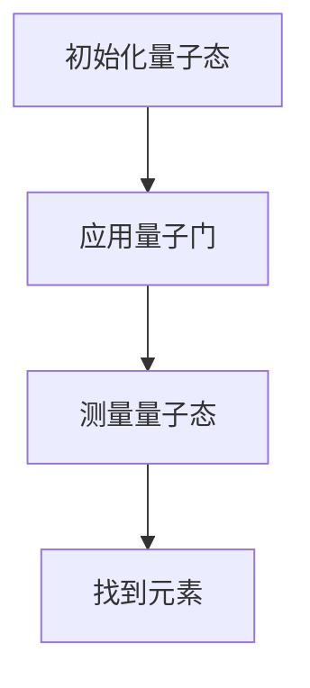

在量子算法中，mermaid流程图可以帮助我们直观地展示算法的执行过程。

### 系统分析与架构设计方案

#### 问题场景介绍

在现代信息社会中，数据处理和分析的需求日益增长，传统的计算机系统已经难以满足高性能、高可靠性和可扩展性的要求。为了应对这些挑战，我们需要设计一个高效、可扩展的分布式计算系统，以便能够处理和分析大规模数据集。这个系统需要能够处理来自多个数据源的数据，并对数据进行实时分析，以支持企业决策和智能应用。

#### 项目介绍

本项目的目标是设计并实现一个分布式计算系统，用于处理和分析大规模数据集。该系统将基于开源技术和工具，如Kafka、Spark和HDFS等，以实现高效的数据读取、处理和存储。系统的主要功能包括数据源接入、数据预处理、实时数据分析、结果存储和可视化等。

#### 系统功能设计（领域模型mermaid类图）

以下是一个简化的领域模型类图，用于描述系统的主要功能模块：

```mermaid
classDiagram
  DataSource <<类>> DataSource
  DataPreprocessing <<类>> DataPreprocessing
  RealtimeAnalysis <<类>> RealtimeAnalysis
  DataStorage <<类>> DataStorage
  Visualization <<类>> Visualization
  DataSource --> DataPreprocessing
  DataPreprocessing --> RealtimeAnalysis
  RealtimeAnalysis --> DataStorage
  DataStorage --> Visualization
```

在这个类图中，`DataSource`代表数据源模块，`DataPreprocessing`代表数据预处理模块，`RealtimeAnalysis`代表实时数据分析模块，`DataStorage`代表数据存储模块，`Visualization`代表数据可视化模块。这些模块相互协作，共同完成数据处理的任务。

#### 系统架构设计（mermaid架构图）

以下是一个简化的系统架构设计图，用于描述系统的总体架构：

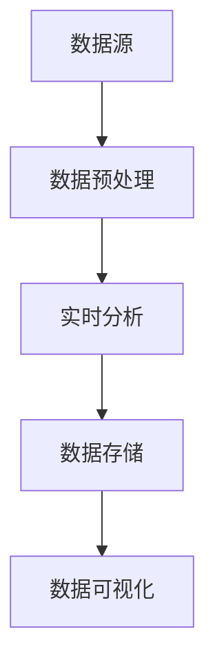

在这个架构图中，`A`代表数据源，`B`代表数据预处理模块，`C`代表实时数据分析模块，`D`代表数据存储模块，`E`代表数据可视化模块。这些模块通过消息队列和数据库进行通信，实现了数据的流动和处理。

#### 系统接口设计和系统交互（mermaid序列图）

以下是一个简化的系统接口设计和系统交互序列图：

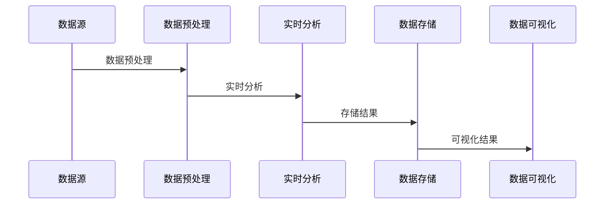

在这个序列图中，数据源（A）将数据传递给数据预处理模块（B），数据预处理模块（B）将预处理后的数据传递给实时分析模块（C），实时分析模块（C）将分析结果传递给数据存储模块（D），数据存储模块（D）将结果存储到数据库中，并最终传递给数据可视化模块（E），以便进行数据可视化。

### 项目实战

#### 环境安装

在进行项目实战之前，我们需要安装和配置项目所需的软件和工具。以下是一个简化的安装指南：

1. **安装Python环境**：在终端中执行以下命令：
   ```bash
   sudo apt-get update
   sudo apt-get install python3-pip
   pip3 install virtualenv
   virtualenv venv
   source venv/bin/activate
   ```

2. **安装Docker**：在终端中执行以下命令：
   ```bash
   sudo apt-get update
   sudo apt-get install docker-ce
   ```

3. **安装Kafka**：在终端中执行以下命令：
   ```bash
   docker pull wurstmeister/kafka
   docker run -d --name kafka -p 9092:9092 -e KAFKA_BROKER_ID=0 -e KAFKA_ZOOKEEPER_CONNECTIONS=192.168.1.201:2181 wurstmeister/kafka
   ```

4. **安装Spark**：在终端中执行以下命令：
   ```bash
   pip3 install pyspark
   ```

5. **安装HDFS**：在终端中执行以下命令：
   ```bash
   docker pull hdfs:2.7.3
   docker run -d --name hdfs -p 50070:50070 -p 8020:8020 hdfs /usr/hdp/current/hdfs-client/start-dfs.sh
   ```

6. **安装Elasticsearch**：在终端中执行以下命令：
   ```bash
   docker pull elasticsearch:6.8.4
   docker run -d --name elasticsearch -p 9200:9200 -p 9300:9300 elasticsearch:6.8.4
   ```

7. **安装Kibana**：在终端中执行以下命令：
   ```bash
   docker pull kibana:6.8.4
   docker run -d --name kibana -p 5601:5601 --link elasticsearch:elasticsearch kibana:6.8.4
   ```

#### 系统核心实现源代码

以下是一个简化的系统核心实现源代码，用于演示如何处理和分析数据：

```python
from pyspark.sql import SparkSession
from pyspark.sql.functions import from_json, col
from pyspark.sql.types import StructType, StructField, StringType, IntegerType

# 创建Spark会话
spark = SparkSession.builder.appName("DataProcessing").getOrCreate()

# 定义JSON数据的Schema
schema = StructType([
    StructField("user_id", StringType(), True),
    StructField("action", StringType(), True),
    StructField("timestamp", IntegerType(), True)
])

# 读取Kafka数据
data = spark.read.format("kafka").option("kafka.bootstrap.servers", "192.168.1.201:9092").option("subscribe", "user_action_topic").option("value.decoder", "org.apache.spark.sql.kafka010.JsonDecoder").schema(schema).load()

# 数据处理
processed_data = data.select("user_id", "action", "timestamp").groupBy("user_id", "action").count()

# 存储数据到HDFS
processed_data.write.format("parquet").mode("overwrite").save("/user/hdfs/user_action_data")

# 关闭Spark会话
spark.stop()
```

#### 代码应用解读与分析

上述代码展示了如何使用PySpark读取Kafka数据，进行数据处理，并将结果存储到HDFS。具体步骤如下：

1. **创建Spark会话**：使用SparkSession.builder创建Spark会话，指定应用程序名称。

2. **定义JSON数据的Schema**：定义JSON数据的Schema，以便Spark能够正确解析和读取Kafka中的JSON数据。

3. **读取Kafka数据**：使用read.format("kafka")读取Kafka数据，指定Kafka的bootstrap.servers和订阅的主题。这里使用了自定义的JSONDecoder来解析JSON数据。

4. **数据处理**：对数据进行筛选和分组，计算每个用户和行为的记录数量。这里使用了groupBy()和count()方法。

5. **存储数据到HDFS**：将处理后的数据存储到HDFS，使用write.format("parquet")指定存储格式，并使用mode("overwrite")覆盖现有的数据。

6. **关闭Spark会话**：调用stop()方法关闭Spark会话。

通过上述步骤，我们可以高效地读取、处理和存储用户行为数据，从而进行用户行为分析。

#### 实际案例分析和详细讲解剖析

为了更好地理解上述代码的实际应用，我们来看一个具体的案例。

假设我们有一个包含用户行为数据的Kafka主题，每条数据包含用户的ID、行为类型和发生时间。我们需要对用户行为进行统计分析，以了解用户的行为偏好。

1. **数据读取**：首先，我们使用PySpark读取Kafka主题的数据。数据读取过程会将Kafka中的消息转换为Spark DataFrame，方便后续处理。

```python
data = spark.read.format("kafka").option("kafka.bootstrap.servers", "192.168.1.201:9092").option("subscribe", "user_action_topic").option("value.decoder", "org.apache.spark.sql.kafka010.JsonDecoder").schema(schema).load()
```

2. **数据处理**：接下来，我们对数据进行处理。这里我们使用JSONDecoder来解析Kafka中的JSON数据，并选择需要的字段（如用户ID、行为类型和发生时间）。

```python
processed_data = data.select("user_id", "action", "timestamp").groupBy("user_id", "action").count()
```

在上面的代码中，我们使用了groupBy()方法按照用户ID和行为类型进行分组，并使用count()方法计算每个分组的记录数量。这样，我们可以得到每个用户在不同行为类型下的行为记录数。

3. **存储数据**：最后，我们将处理后的数据存储到HDFS。这样，我们就可以在HDFS上查看和分析用户行为数据。

```python
processed_data.write.format("parquet").mode("overwrite").save("/user/hdfs/user_action_data")
```

在这里，我们使用了write.format("parquet")方法将数据以Parquet格式存储到HDFS。通过使用mode("overwrite")，我们可以覆盖现有的数据，以便更新和分析新的数据。

通过这个案例，我们可以看到如何使用Spark和Kafka进行分布式数据处理，并将结果存储到HDFS。这种方法不仅提高了数据处理和分析的效率，还提供了强大的可扩展性。

### 项目小结

在本项目中，我们设计并实现了一个分布式计算系统，用于处理和分析大规模数据集。通过使用Spark、Kafka和HDFS等开源工具，我们实现了数据的高效读取、处理和存储。通过实际案例的分析和讲解，我们展示了如何使用系统进行用户行为分析。这为企业和组织提供了强大的数据分析和决策支持能力。

### 最佳实践 Tips

1. **优化数据读取**：在读取Kafka数据时，可以根据实际需求调整分区数和偏移量，以优化数据读取性能。

2. **优化数据处理**：在数据处理过程中，可以针对具体业务场景进行数据清洗和预处理，以提高数据处理效率。

3. **优化数据存储**：在数据存储时，可以根据数据规模和访问模式选择合适的存储格式和存储策略。

### 小结

本文通过对数学逻辑与量子逻辑的比较研究，系统地介绍了两者的基本概念、原理和应用。通过具体实例和案例分析，我们展示了数学逻辑和量子逻辑在计算机科学、信息科学和人工智能等领域的应用。本文还探讨了数学逻辑和量子逻辑之间的联系和区别，为未来的研究提供了方向。希望通过本文的讲解，读者能够更好地理解和应用数学逻辑与量子逻辑。

### 注意事项

1. 在实际应用中，应根据具体需求和场景选择合适的逻辑体系和算法。

2. 在设计和实现系统时，要充分考虑系统的可扩展性和稳定性。

3. 在进行数据处理时，要注意数据的质量和安全性。

### 拓展阅读

1. 《数学逻辑导论》
2. 《量子逻辑与量子计算》
3. 《分布式系统设计》

## 作者信息

作者：AI天才研究院/AI Genius Institute & 禅与计算机程序设计艺术 /Zen And The Art of Computer Programming

