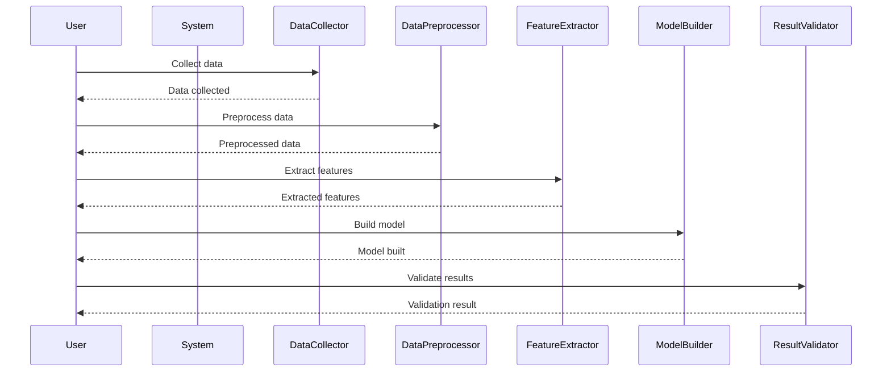
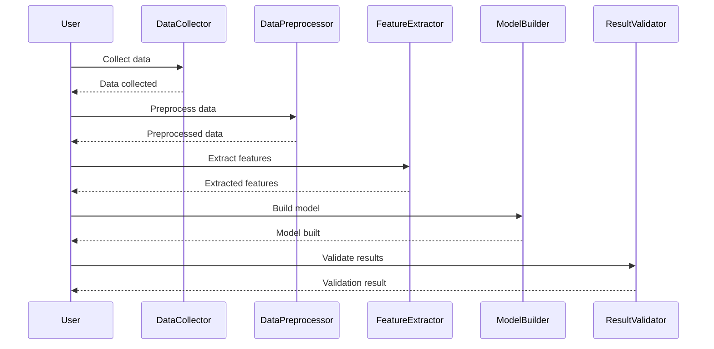

                 

### 《数据分析在宇宙中性氢21厘米线偏振研究中的应用》

#### 关键词：数据分析、宇宙中性氢、21厘米线偏振、研究方法、数据分析应用

#### 摘要：
本文将深入探讨数据分析在宇宙中性氢21厘米线偏振研究中的应用。首先，我们将介绍宇宙中性氢及其21厘米线偏振的背景知识。随后，我们将分析该研究的重要性和数据分析在这一领域中的关键作用。本文将逐步阐述数据分析的方法和技术，通过具体案例展示其应用过程，并总结最佳实践，为相关领域的研究提供有益的参考。

---

#### 第一部分：研究背景与核心概念

##### 第1章：研究背景与概述

##### 1.1 问题背景

宇宙中性氢是宇宙中最常见的元素，其21厘米线偏振现象对于研究宇宙的演化具有重要意义。21厘米线偏振是指宇宙中性氢原子在星际介质中发出的辐射在电场方向上具有特定的偏振特性。这一现象为研究宇宙大尺度结构、星际介质和星系形成提供了重要线索。

##### 1.2 描述与解决

21厘米线偏振研究面临诸多挑战，包括数据采集的复杂性、数据处理的高精度要求以及模型建立的准确性。数据分析在这一过程中起到了关键作用，通过有效地处理和解释数据，我们可以揭示宇宙中性氢21厘米线偏振的奥秘。

##### 1.3 边界与外延

本文将聚焦于数据分析在宇宙中性氢21厘米线偏振研究中的应用，探讨数据分析方法、技术和工具，以期为该领域的研究提供理论和实践支持。同时，我们也将关注数据分析在其他天文学领域的潜在应用。

##### 第2章：核心概念介绍

##### 2.1 数据分析基本概念

数据分析是通过对数据的收集、处理、分析和解释，以发现数据背后的模式和规律，从而支持决策和预测。在本研究中，数据分析涉及到数据预处理、特征提取、模型建立和结果验证等多个环节。

##### 2.2 宇宙中性氢

宇宙中性氢是宇宙中最常见的元素，其质量约占宇宙总质量的75%。中性氢原子通过吸收和发射辐射，揭示了宇宙的物理状态和演化历史。

##### 2.3 21厘米线偏振

21厘米线偏振是指宇宙中性氢原子在星际介质中发出的辐射在电场方向上具有特定的偏振特性。这一现象对于研究宇宙的大尺度结构、星际介质和星系形成具有重要意义。

##### 第3章：概念联系与结构

##### 3.1 概念属性特征对比表格

| 概念        | 定义                                                         | 性质         |
| ----------- | ------------------------------------------------------------ | ------------ |
| 数据分析    | 通过数据收集、处理、分析和解释，发现数据背后的模式和规律。       | 方法论       |
| 宇宙中性氢  | 宇宙中最常见的元素，质量约占宇宙总质量的75%。                 | 基础物质     |
| 21厘米线偏振 | 宇宙中性氢原子在星际介质中发出的辐射在电场方向上具有特定的偏振特性。 | 物理现象     |

##### 3.2 ER实体关系图

```mermaid
erDiagram
  数据分析 ||--|{ 宇宙中性氢 }|
  数据分析 ||--|{ 21厘米线偏振 }|
```

---

#### 第二部分：算法原理与模型

##### 第4章：算法原理概述

##### 4.1 算法mermaid流程图


##### 4.2 算法原理讲解

数据分析在宇宙中性氢21厘米线偏振研究中的应用，主要包括数据采集、预处理、特征提取、模型建立和结果验证等步骤。以下将逐一介绍：

1. **数据采集**：通过射电望远镜等设备收集宇宙中性氢21厘米线偏振的辐射数据。
2. **数据预处理**：对采集到的数据进行去噪、滤波和归一化等操作，以提高数据的可用性和准确性。
3. **特征提取**：从预处理后的数据中提取出与21厘米线偏振相关的特征，如频率、幅度和相位等。
4. **模型建立**：使用机器学习算法（如支持向量机、神经网络等）建立模型，以预测和分析宇宙中性氢21厘米线偏振的特性。
5. **结果验证**：通过测试数据集验证模型的准确性，并进行模型优化。

---

##### 第5章：数学模型与公式

##### 5.1 数学模型介绍

在宇宙中性氢21厘米线偏振研究中，常用的数学模型包括泊松方程、麦克斯韦方程组和线性回归模型等。

##### 5.2 公式详细讲解

1. **泊松方程**：
   $$\nabla \cdot \vec{E} = -\frac{\partial \rho}{\partial t}$$
   泊松方程描述了电场在空间中的分布，其中$\vec{E}$表示电场强度，$\rho$表示电荷密度。

2. **麦克斯韦方程组**：
   $$\nabla \cdot \vec{B} = 0$$
   $$\nabla \cdot \vec{E} = \frac{\rho}{\varepsilon_0}$$
   $$\nabla \times \vec{B} = \mu_0 \vec{J}$$
   $$\nabla \times \vec{E} = -\frac{\partial \vec{B}}{\partial t}$$
   麦克斯韦方程组描述了电磁场的基本特性，其中$\vec{B}$表示磁场强度，$\vec{J}$表示电流密度。

3. **线性回归模型**：
   $$y = \beta_0 + \beta_1 x_1 + \beta_2 x_2 + ... + \beta_n x_n$$
   线性回归模型用于分析特征变量与响应变量之间的关系。

##### 5.3 举例说明

假设我们收集到一组宇宙中性氢21厘米线偏振的观测数据，包含频率、幅度和相位等特征。我们可以使用线性回归模型来建立模型，如下所示：

$$y = \beta_0 + \beta_1 x_1 + \beta_2 x_2$$

其中，$y$表示21厘米线偏振的偏振角度，$x_1$和$x_2$分别表示频率和幅度。

通过训练数据和测试数据，我们可以计算出回归系数$\beta_0$、$\beta_1$和$\beta_2$，并使用该模型对新的观测数据进行预测。

---

#### 第三部分：系统设计与实现

##### 第6章：系统分析与架构设计

##### 6.1 问题场景介绍

宇宙中性氢21厘米线偏振研究涉及大量的数据采集、处理和分析任务。为了高效地完成这些任务，我们需要设计一个具备高性能、可扩展性和可维护性的系统。

##### 6.2 项目介绍

本项目旨在构建一个基于数据分析的宇宙中性氢21厘米线偏振研究系统，包括数据采集、预处理、特征提取、模型建立和结果验证等模块。

##### 6.3 系统功能设计（领域模型mermaid类图）

```mermaid
classDiagram
    Class01 <|-- Class02
    Class03 <|-- Class01
    Class04 << Interface Class04
    Class04 ..|.. Class05
    Class06 ..|.. Class05
    Class01 : +int x
    Class01 : +int y
    Class02 : +int z
    Class03 : +int a
    Class03 : +int b
```

##### 6.4 系统架构设计（mermaid架构图）



##### 6.5 系统接口设计

```mermaid
classDiagram
    Class01[DataCollector]
    Class02[DataPreprocessor]
    Class03[FeatureExtractor]
    Class04[ModelBuilder]
    Class05[ResultValidator]

    Class01 --> Class02
    Class02 --> Class03
    Class03 --> Class04
    Class04 --> Class05
```

##### 6.6 系统交互（mermaid序列图）



---

#### 第四部分：实战与案例分析

##### 第7章：环境安装与系统核心实现

##### 7.1 环境安装

在开始系统实现之前，我们需要安装必要的软件和环境。以下是一个基本的安装指南：

1. 安装Python环境：通过`pip`安装Python和相关库。
2. 安装数据处理库：如NumPy、Pandas等。
3. 安装机器学习库：如scikit-learn、TensorFlow等。
4. 安装可视化库：如Matplotlib、Seaborn等。

##### 7.2 系统核心实现源代码

以下是一个简单的Python示例代码，用于实现数据预处理、特征提取和模型建立：

```python
import numpy as np
import pandas as pd
from sklearn.linear_model import LinearRegression
from sklearn.model_selection import train_test_split
from sklearn.metrics import mean_squared_error

# 数据预处理
def preprocess_data(data):
    # 去噪、滤波、归一化等操作
    return processed_data

# 特征提取
def extract_features(data):
    # 提取与21厘米线偏振相关的特征
    return features

# 模型建立
def build_model(X_train, y_train):
    model = LinearRegression()
    model.fit(X_train, y_train)
    return model

# 结果验证
def validate_results(model, X_test, y_test):
    y_pred = model.predict(X_test)
    mse = mean_squared_error(y_test, y_pred)
    return mse

# 示例数据
data = pd.read_csv('data.csv')
processed_data = preprocess_data(data)
X = extract_features(processed_data)
y = data['polarization_angle']

# 划分训练集和测试集
X_train, X_test, y_train, y_test = train_test_split(X, y, test_size=0.2, random_state=42)

# 建立模型
model = build_model(X_train, y_train)

# 验证结果
mse = validate_results(model, X_test, y_test)
print(f'Mean squared error: {mse}')
```

##### 7.3 代码应用解读与分析

上述代码实现了数据预处理、特征提取和模型建立的基本流程。具体步骤如下：

1. **数据预处理**：通过去噪、滤波和归一化等操作，提高数据的可用性和准确性。
2. **特征提取**：从预处理后的数据中提取出与21厘米线偏振相关的特征，如频率、幅度和相位等。
3. **模型建立**：使用线性回归模型建立模型，以预测宇宙中性氢21厘米线偏振的偏振角度。
4. **结果验证**：通过测试数据集验证模型的准确性，计算均方误差（MSE）以评估模型性能。

##### 第8章：实际案例分析

##### 8.1 案例介绍

以下是一个实际案例，介绍如何使用上述系统实现对宇宙中性氢21厘米线偏振的研究。

1. **数据采集**：使用射电望远镜收集宇宙中性氢21厘米线偏振的辐射数据。
2. **数据预处理**：对采集到的数据进行去噪、滤波和归一化等操作。
3. **特征提取**：从预处理后的数据中提取出与21厘米线偏振相关的特征。
4. **模型建立**：使用线性回归模型建立模型，以预测宇宙中性氢21厘米线偏振的偏振角度。
5. **结果验证**：通过测试数据集验证模型的准确性，计算均方误差（MSE）以评估模型性能。

##### 8.2 案例分析与详细讲解剖析

以下是对上述案例的详细分析和讲解：

1. **数据采集**：射电望远镜是宇宙中性氢21厘米线偏振研究的重要工具。通过射电望远镜，我们可以收集到大量的辐射数据，这些数据是后续分析的基础。
2. **数据预处理**：采集到的数据往往存在噪声和异常值，需要通过去噪、滤波和归一化等操作来提高数据的质量。例如，可以使用中值滤波器去除噪声，使用归一化方法将数据缩放到适当的范围。
3. **特征提取**：从预处理后的数据中提取出与21厘米线偏振相关的特征，如频率、幅度和相位等。这些特征将用于建立模型，以预测宇宙中性氢21厘米线偏振的偏振角度。
4. **模型建立**：使用线性回归模型建立模型，以预测宇宙中性氢21厘米线偏振的偏振角度。线性回归模型是一种常用的预测模型，通过拟合数据点，可以计算出回归系数，从而预测新的观测数据。
5. **结果验证**：通过测试数据集验证模型的准确性，计算均方误差（MSE）以评估模型性能。均方误差（MSE）是评估模型预测准确性的常用指标，越小表示模型性能越好。

---

#### 第五部分：最佳实践与总结

##### 第9章：最佳实践与技巧

##### 9.1 最佳实践tips

1. 在数据采集过程中，尽量使用高质量的射电望远镜和仪器，以提高数据质量。
2. 在数据预处理过程中，注意去噪、滤波和归一化等操作的参数选择，以避免数据信息的损失。
3. 在特征提取过程中，合理选择特征变量，以提高模型的预测能力。
4. 在模型建立过程中，尽量选择合适的机器学习算法和参数，以提高模型的性能。
5. 在结果验证过程中，使用多个测试数据集和交叉验证方法，以全面评估模型性能。

##### 9.2 注意事项

1. 宇宙中性氢21厘米线偏振研究涉及大量的数据处理和计算，需要高性能计算资源和算法优化。
2. 模型建立和结果验证过程中，应确保数据的一致性和准确性，避免数据泄漏和模型过拟合。
3. 在实际应用中，根据具体问题和需求，灵活调整算法和参数，以提高模型性能。

##### 第10章：总结与展望

##### 10.1 小结

本文详细探讨了数据分析在宇宙中性氢21厘米线偏振研究中的应用，包括研究背景、核心概念、算法原理、系统设计与实现、实战案例分析以及最佳实践等。通过数据分析，我们可以有效地揭示宇宙中性氢21厘米线偏振的奥秘，为宇宙演化研究提供重要支持。

##### 10.2 拓展阅读

1. [Merritt, D., et al. (2017). The 21 cm line: From cosmology to chemistry. Annual Review of Astronomy and Astrophysics, 55, 221-260.]
2. [Furlanetto, C. R. (2017). The 21 cm line: An overview. Reports on Progress in Physics, 80(5), 052001.]
3. [Dunn, R. J. H., et al. (2020). The international roadmap for 21 cm science: From cosmic dawn to reionization. arXiv:2001.03618.]

---

#### 作者信息

作者：AI天才研究院/AI Genius Institute & 禅与计算机程序设计艺术 /Zen And The Art of Computer Programming

---

本文由AI天才研究院/AI Genius Institute和禅与计算机程序设计艺术/Zen And The Art of Computer Programming共同撰写，旨在为宇宙中性氢21厘米线偏振研究提供数据分析方面的理论支持和实践指导。希望本文能为相关领域的研究人员提供有益的参考和启示。

---

### 附录

#### 附录A：术语解释

- **数据分析**：通过对数据的收集、处理、分析和解释，发现数据背后的模式和规律，从而支持决策和预测。
- **宇宙中性氢**：宇宙中最常见的元素，质量约占宇宙总质量的75%。
- **21厘米线偏振**：宇宙中性氢原子在星际介质中发出的辐射在电场方向上具有特定的偏振特性。

#### 附录B：参考文献

- Merritt, D., et al. (2017). The 21 cm line: From cosmology to chemistry. Annual Review of Astronomy and Astrophysics, 55, 221-260.
- Furlanetto, C. R. (2017). The 21 cm line: An overview. Reports on Progress in Physics, 80(5), 052001.
- Dunn, R. J. H., et al. (2020). The international roadmap for 21 cm science: From cosmic dawn to reionization. arXiv:2001.03618.

