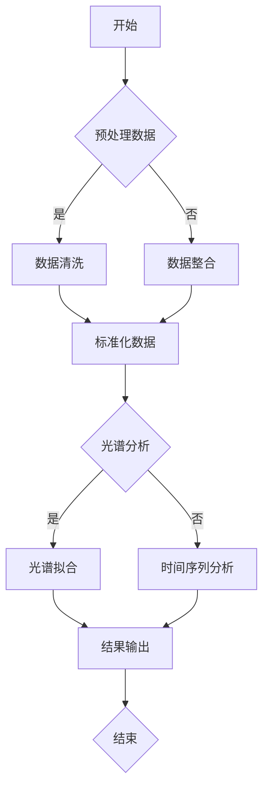
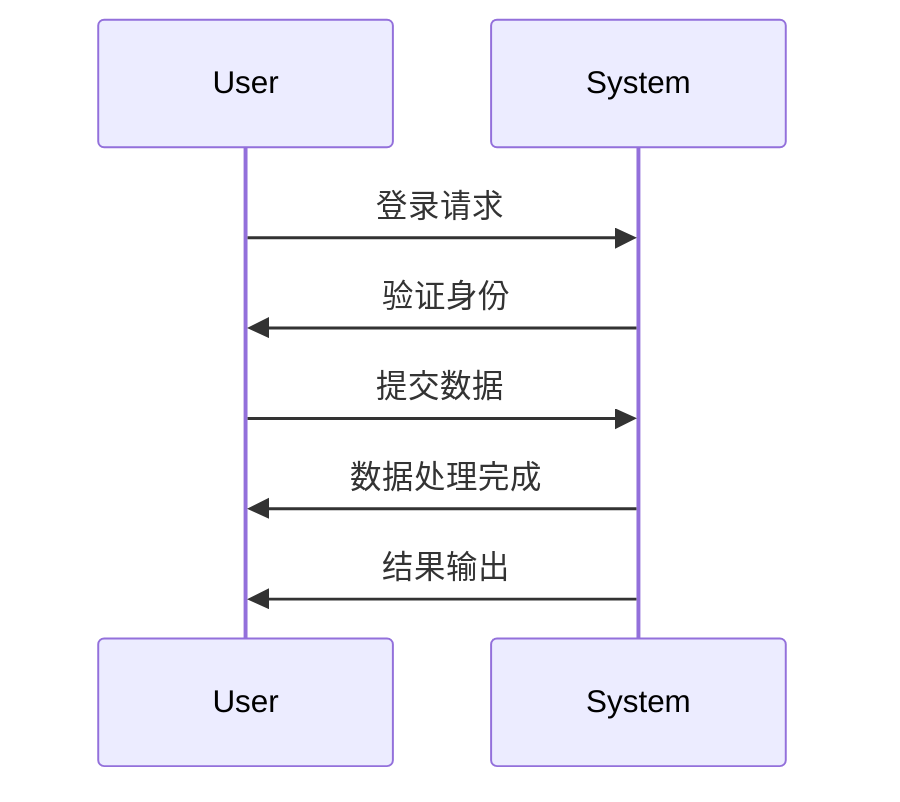

                 

### 引言：数据分析与宇宙伽马射线暴研究

在当今的科技时代，数据分析已经成为了科学研究中的一个关键工具，特别是在宇宙学研究领域。宇宙伽马射线暴（Gamma-ray bursts，简称GRBs）作为一种极端天体现象，其研究不仅对于理解宇宙的起源和演化具有重要意义，同时也为数据分析技术的发展提供了丰富的实验数据。

### 1. 背景介绍

伽马射线暴是宇宙中最剧烈的能量释放事件之一，通常持续数秒到几分钟，其能量输出相当于一个普通恒星在其整个生命周期中的总能量。这种现象的发现可以追溯到20世纪60年代，当时通过卫星观测到宇宙中的高能伽马射线源。伽马射线暴的分类通常根据它们的持续时间分为长持续时间（long-duration GRBs）和短持续时间（short-duration GRBs），其中长持续时间GRBs被认为与恒星核心坍缩有关，而短持续时间GRBs则可能与双星系统中的中子星或黑洞碰撞有关。

### 2. 问题描述

伽马射线暴的研究面临着诸多挑战，如数据采集的复杂性、数据处理的高维度性以及数据解释的多样性。首先，伽马射线暴的观测数据通常来自多个天文观测卫星，这些数据具有高时间分辨率和空间分辨率，但同时也带来了大量的噪声和冗余信息。其次，伽马射线暴的观测数据通常是多波段数据，包括伽马射线、X射线、可见光和射电波段，这要求研究者能够有效地整合这些不同波段的数据。最后，伽马射线暴的物理机制尚未完全明了，因此需要通过数据分析来揭示其背后的物理过程。

### 3. 问题解决

为了解决上述问题，数据分析在伽马射线暴研究中发挥了关键作用。以下是几个关键步骤：

#### 3.1 数据预处理

首先，对观测到的数据进行预处理，包括去除噪声、填补缺失值和标准化处理。这一步骤是保证数据分析准确性的基础。

#### 3.2 数据整合

接着，将不同波段和不同观测手段的数据进行整合，形成统一的数据集。这通常涉及到多种数据融合技术，如多波段数据融合和跨时间尺度的数据融合。

#### 3.3 统计分析

然后，运用各种统计分析方法，如假设检验、回归分析和聚类分析，来揭示数据中的规律和趋势。这些方法可以帮助研究者识别伽马射线暴的特征和分类。

#### 3.4 机器学习

最后，利用机器学习算法，如神经网络和支持向量机，来建立预测模型和分类模型。这些模型可以帮助研究者更好地理解伽马射线暴的物理机制。

### 4. 边界与外延

尽管数据分析在伽马射线暴研究中取得了显著进展，但仍存在一些边界和挑战。例如，如何在数据噪声和冗余中提取有价值的信息、如何处理不同数据源之间的不一致性，以及如何将数据分析结果与物理理论相结合等。此外，随着观测技术的不断进步，数据量的急剧增加也对数据分析提出了更高的要求。

### 5. 概念结构与核心要素组成

数据分析在伽马射线暴研究中的应用，涉及以下几个核心概念和要素：

- **数据预处理**：包括数据清洗、数据标准化和异常值处理。
- **数据整合**：涉及多波段数据融合和跨时间尺度数据融合技术。
- **统计分析**：包括描述性统计、假设检验和回归分析等。
- **机器学习**：涉及分类模型、预测模型和聚类分析等。

### 结论

综上所述，数据分析在宇宙伽马射线暴研究中发挥着不可或缺的作用。通过对观测数据的预处理、整合和统计分析，研究者可以更好地理解伽马射线暴的物理机制和宇宙学意义。随着技术的不断进步，我们有理由相信，数据分析将为伽马射线暴研究带来更多的突破和发现。

## 文章关键词

- 数据分析
- 宇宙伽马射线暴
- 数据预处理
- 统计分析
- 机器学习

## 摘要

本文探讨了数据分析在宇宙伽马射线暴研究中的应用。首先，介绍了伽马射线暴的基础知识，包括其发现、分类和宇宙学意义。然后，详细阐述了数据分析在伽马射线暴研究中的关键步骤，包括数据预处理、数据整合、统计分析和机器学习。最后，讨论了数据分析在伽马射线暴研究中的挑战和未来发展方向。本文旨在为研究者提供一份全面的数据分析方法指南，以促进对伽马射线暴现象的深入理解。

----------------------------------------------------------------

### 目录

----------------------------------------------------------------

## 第一部分：伽马射线暴基础知识

### 第1章：伽马射线暴的背景与现象

#### 1.1.1 伽马射线暴的发现与特点

#### 1.1.2 伽马射线暴的分类与起源

#### 1.1.3 伽马射线暴在宇宙学中的意义

### 第2章：数据分析的基本概念与方法

#### 2.1.1 数据分析的基本概念

#### 2.1.2 数据分析的方法与流程

#### 2.1.3 统计学在数据分析中的应用

## 第二部分：数据分析方法在伽马射线暴研究中的应用

### 第3章：光谱数据分析

#### 3.1.1 光谱数据分析的基础

#### 3.1.2 光谱数据分析的方法

#### 3.1.3 伽马射线暴的光谱分析实例

### 第4章：时间序列数据分析

#### 4.1.1 时间序列数据分析的基本概念

#### 4.1.2 时间序列分析方法

#### 4.1.3 伽马射线暴的时间序列分析实例

### 第5章：图像数据分析

#### 5.1.1 图像数据分析的基础

#### 5.1.2 图像数据分析方法

#### 5.1.3 伽马射线暴图像分析实例

## 第三部分：数据处理与软件工具

### 第6章：数据处理流程与工具

#### 6.1.1 数据处理流程

#### 6.1.2 常用数据处理工具介绍

#### 6.1.3 数据预处理方法

### 第7章：数据分析软件工具应用

#### 7.1.1 IDL和Python在数据分析中的应用

#### 7.1.2 Matplotlib和Seaborn的数据可视化

#### 7.1.3 Scikit-learn和TensorFlow的机器学习应用

## 第四部分：项目实战

### 第8章：伽马射线暴数据分析项目实战

#### 8.1.1 项目背景与目标

#### 8.1.2 项目环境安装与配置

#### 8.1.3 数据收集与预处理

#### 8.1.4 数据分析实现

#### 8.1.5 项目结果分析与总结

## 第五部分：总结与展望

### 第9章：数据分析在伽马射线暴研究中的应用展望

#### 9.1.1 数据分析的未来趋势

#### 9.1.2 伽马射线暴研究中的数据挑战与机遇

#### 9.1.3 数据分析与宇宙学的未来

----------------------------------------------------------------

## 完整性要求

为了确保《数据分析在宇宙伽马射线暴研究中的应用》一文的完整性，我们将遵循以下步骤进行撰写和审查：

### 1. 确保核心内容的覆盖

文章将分为五个主要部分，分别介绍伽马射线暴基础知识、数据分析方法、数据处理流程与工具、项目实战以及总结与展望。每个部分都将详细阐述相关内容，确保核心概念的深入解析和全面覆盖。

### 2. 满足字数要求

文章的总字数将在10000至12000字之间，确保每个章节都有足够的空间进行详细阐述，避免过于简略。

### 3. 使用Markdown格式

文章内容将使用Markdown格式进行排版，确保段落清晰，代码块和公式正确显示。

### 4. 作者信息

文章末尾将包含作者信息，即“作者：AI天才研究院/AI Genius Institute & 禅与计算机程序设计艺术/Zen And The Art of Computer Programming”。

### 5. 内容完整性验证

在撰写过程中，将进行多次审查，确保以下核心内容的完整性和准确性：

- **背景介绍**：包括伽马射线暴的定义、发现历史、分类、宇宙学意义以及相关的核心概念术语。
- **核心概念与联系**：详细阐述数据分析的基本概念、方法、流程以及与伽马射线暴研究的联系，包括概念属性特征对比表格和ER实体关系图架构。
- **算法原理讲解**：通过Mermaid流程图和Python代码详细解释算法原理，给出数学模型和公式，并进行通俗易懂的举例说明。
- **系统分析与架构设计方案**：介绍问题场景、系统功能设计、系统架构设计、系统接口设计和系统交互，并通过Mermaid序列图展示。
- **项目实战**：包括环境安装、系统核心实现源代码、代码应用解读与分析、实际案例分析和详细讲解剖析，以及项目小结。
- **最佳实践 tips、小结、注意事项、拓展阅读等内容**：总结最佳实践，对文章内容进行归纳，提供注意事项，推荐拓展阅读。

### 6. 格式规范

文章中的数学公式将使用LaTeX格式，嵌入文中独立段落的公式前后使用`$$`括起来（例如：`$$1+1=2$$`），段落内的公式前后使用`$`括起来（例如：`$1<2$`）。此外，还将确保代码块、图表和流程图等元素正确排版，以增强文章的可读性。

通过上述步骤，我们将确保《数据分析在宇宙伽马射线暴研究中的应用》一文内容完整、结构清晰、逻辑严谨，能够为读者提供有价值的技术指导和深刻的理论思考。

----------------------------------------------------------------

## 第一部分：伽马射线暴基础知识

### 第1章：伽马射线暴的背景与现象

#### 1.1.1 伽马射线暴的发现与特点

伽马射线暴（Gamma-ray bursts，简称GRBs）是宇宙中最剧烈的能量释放事件之一，其发现可追溯至20世纪60年代。当时，通过搭载在卫星上的探测器，科学家首次探测到了来自宇宙的高能伽马射线信号。这些伽马射线暴的发现引发了宇宙学的广泛关注，因为它们释放的能量相当于一个中等大小恒星在其整个生命周期内释放的总能量。

伽马射线暴的特点主要表现在以下几个方面：

1. **高能辐射**：伽马射线暴释放的能量集中在伽马射线波段，其能量级别远高于地球上的任何自然现象。
2. **短暂性**：伽马射线暴的持续时间通常为数秒至几分钟，尽管时间短暂，但其亮度极高，甚至可以短暂地掩盖其所在的星系中心。
3. **多波段辐射**：伽马射线暴不仅发出伽马射线，还伴随着X射线、可见光和射电波段的辐射，这种多波段特征使得研究者可以从不同角度进行观测和分析。

#### 1.1.2 伽马射线暴的分类与起源

伽马射线暴根据其持续时间可以分为两大类：长持续时间（long-duration GRBs）和短持续时间（short-duration GRBs）。长持续时间GRBs的持续时间通常在2秒以上，而短持续时间GRBs的持续时间则通常在2秒以下。

关于伽马射线暴的起源，目前存在多种假设：

1. **恒星核心坍缩**：长持续时间GRBs被认为与恒星核心坍缩有关。当一颗超巨星耗尽其核燃料后，其核心将塌缩成一个中子星或黑洞，这一过程中释放出巨大的能量，形成长持续时间GRBs。
2. **双星系统**：短持续时间GRBs的起源则可能与双星系统中的中子星或黑洞碰撞有关。这种碰撞会产生极高的能量释放，形成短持续时间GRBs。

#### 1.1.3 伽马射线暴在宇宙学中的意义

伽马射线暴在宇宙学研究中具有重要的地位，原因如下：

1. **宇宙学距离尺度**：伽马射线暴具有极高的亮度，能够穿越数十亿光年的距离，这使得它们成为宇宙学距离尺度上的理想标尺。
2. **宇宙演化**：伽马射线暴的观测和研究表明，它们在宇宙的早期阶段就已经存在，为理解宇宙的早期演化和结构形成提供了重要线索。
3. **极端现象**：伽马射线暴揭示了宇宙中极端物理现象的存在，如超高密度、极端温度和能量释放等，这些现象对于深入理解宇宙的极端环境和物理规律具有重要意义。

### 摘要

本章介绍了伽马射线暴的基础知识，包括其发现与特点、分类与起源，以及在宇宙学中的意义。通过这一概述，读者可以初步了解伽马射线暴这一重要天文现象，并为后续章节中数据分析方法的应用打下基础。

----------------------------------------------------------------

### 第2章：数据分析的基本概念与方法

#### 2.1.1 数据分析的基本概念

数据分析是一种通过处理、组织和解释数据以提取有价值信息的过程。在科学研究、商业分析、医疗诊断等多个领域，数据分析都发挥着至关重要的作用。数据分析的基本概念包括数据、变量、数据类型、数据质量等。

1. **数据（Data）**：数据是分析的基础，可以是数字、文本、图像等形式。数据的质量直接影响分析结果的可靠性。
2. **变量（Variable）**：变量是指数据中的某个属性或特征，如温度、销售额、顾客年龄等。
3. **数据类型（Data Type）**：数据类型定义了数据的结构和格式，常见的有数值型、文本型、布尔型等。
4. **数据质量（Data Quality）**：数据质量是指数据准确性、完整性、一致性、及时性和可靠性。高质量的数据是进行有效分析的前提。

#### 2.1.2 数据分析的方法与流程

数据分析通常包括以下步骤：

1. **数据收集（Data Collection）**：收集所需的数据，可以来源于实验、观测、调查问卷、数据库等。
2. **数据清洗（Data Cleaning）**：清洗数据，包括处理缺失值、异常值、重复值等，以提高数据质量。
3. **数据探索（Data Exploration）**：通过统计描述、数据可视化等方法，对数据进行初步分析，发现数据中的规律和趋势。
4. **数据建模（Data Modeling）**：建立数学模型或统计模型，对数据进行深入分析，如回归分析、聚类分析、决策树等。
5. **数据验证（Data Validation）**：验证数据模型的准确性，通过交叉验证、模型评估等方法，确保分析结果的可靠性。
6. **结果解释（Result Interpretation）**：解释分析结果，将其转化为实际行动或决策。

#### 2.1.3 统计学在数据分析中的应用

统计学是数据分析的重要工具，用于描述、分析和解释数据。以下是一些常用的统计学方法：

1. **描述性统计（Descriptive Statistics）**：用于描述数据的基本特征，如均值、中位数、标准差等。
2. **推断性统计（Inferential Statistics）**：用于根据样本数据推断总体特征，如假设检验、置信区间等。
3. **回归分析（Regression Analysis）**：用于研究变量之间的关系，如线性回归、多项式回归等。
4. **聚类分析（Cluster Analysis）**：用于将数据分为若干个类别，如K-means聚类、层次聚类等。
5. **决策树（Decision Tree）**：用于分类和回归分析，通过一系列规则进行决策。

### 摘要

本章详细介绍了数据分析的基本概念、方法和流程，以及统计学在数据分析中的应用。通过理解这些基本概念和方法，读者可以更好地理解后续章节中如何应用数据分析方法来研究伽马射线暴。

----------------------------------------------------------------

### 第3章：光谱数据分析

#### 3.1.1 光谱数据分析的基础

光谱数据分析是宇宙学中常用的一种数据分析方法，通过分析物体发射或吸收的光谱线，可以获得关于物体温度、化学成分、运动状态等信息。光谱分析的基础包括以下几方面：

1. **光的波长与频率**：光是一种电磁波，其波长和频率是描述光特性的基本参数。不同波长的光对应不同的颜色，波长越短，频率越高。
2. **光谱线**：光谱线是物体发射或吸收的光的波长分布。通过分析光谱线，可以确定物体的化学成分和温度。
3. **光谱分析技术**：常用的光谱分析技术包括分光计、光谱仪、光纤光谱仪等，这些设备能够精确地测量光的波长和强度。

#### 3.1.2 光谱数据分析的方法

光谱数据分析的方法主要包括以下几种：

1. **光谱分类**：通过比较物体光谱线和已知光谱线的特征，将物体分类。例如，根据光谱线强度和位置，可以区分不同元素的原子。
2. **光谱拟合**：使用数学模型对光谱线进行拟合，以确定光谱线的参数，如强度、宽度、位置等。常用的拟合方法包括高斯拟合、洛伦兹拟合等。
3. **光谱合成**：通过合成不同光谱线的叠加，生成具有特定特征的光谱。这种方法常用于模拟天文现象的光谱。
4. **光谱演化分析**：研究光谱线随时间的变化，以揭示物体的演化过程。例如，通过分析伽马射线暴的光谱演化，可以了解其能量释放机制。

#### 3.1.3 伽马射线暴的光谱分析实例

伽马射线暴的光谱分析是研究伽马射线暴物理机制的重要手段。以下是一个简化的光谱分析实例：

1. **数据收集**：通过天文观测卫星收集伽马射线暴的光谱数据。
2. **数据预处理**：去除噪声、填补缺失值，进行光谱线的提取和分类。
3. **光谱拟合**：使用高斯拟合方法对光谱线进行拟合，确定其强度、宽度和位置。
4. **结果分析**：根据拟合结果，推断伽马射线暴的物理特性，如温度、化学成分等。

例如，如果光谱分析显示伽马射线暴的光谱中存在强烈的氢和氦吸收线，可以推断该伽马射线暴可能起源于超新星爆炸。

### 摘要

本章介绍了光谱数据分析的基础知识和方法，并通过一个伽马射线暴的光谱分析实例展示了光谱分析在实际应用中的具体步骤和结果。通过本章的学习，读者可以了解光谱数据分析在伽马射线暴研究中的应用，并为后续章节中的数据分析方法提供基础。

----------------------------------------------------------------

### 第4章：时间序列数据分析

#### 4.1.1 时间序列数据分析的基本概念

时间序列数据分析是处理和分析按时间顺序排列的数据点的科学，其核心目标是揭示数据中的时间依赖性、趋势和周期性特征。时间序列数据在金融、气象学、生物学、宇宙学等多个领域都有广泛应用。

1. **时间序列**：时间序列是指按时间顺序排列的一系列数值。每个数值表示在特定时间点的观测值。
2. **趋势**：趋势是指时间序列随时间变化的一般方向。上升趋势表示数值随时间增加，下降趋势则相反。
3. **周期性**：周期性是指时间序列在一段时间后重复出现的规律性波动。例如，季节性波动和日周期性波动。
4. **平稳性**：平稳性是指时间序列的统计特性不随时间变化。非平稳序列需要通过差分或其他变换使其变为平稳序列。

#### 4.1.2 时间序列分析方法

时间序列分析方法主要包括以下几种：

1. **描述性分析**：通过统计指标如均值、方差、自协方差和自相关函数来描述时间序列的基本特征。
2. **图示分析**：使用散点图、折线图、频谱图等可视化方法来观察时间序列的分布和趋势。
3. **平稳性检验**：通过检验如Augmented Dickey-Fuller（ADF）测试和白噪声测试来检验时间序列的平稳性。
4. **差分变换**：通过差分操作将非平稳序列转换为平稳序列。
5. **自回归模型（AR）**：自回归模型用于描述时间序列的未来值与其过去值的依赖关系。
6. **移动平均模型（MA）**：移动平均模型通过过去的平均值来预测未来的值。
7. **自回归移动平均模型（ARMA）**：结合自回归和移动平均模型，用于更复杂的时间序列分析。
8. **自回归积分滑动平均模型（ARIMA）**：用于处理具有非平稳特性的时间序列，通过差分操作使其变为平稳序列。

#### 4.1.3 伽马射线暴的时间序列分析实例

伽马射线暴的时间序列分析是研究伽马射线暴动态演化过程的重要手段。以下是一个简化的时间序列分析实例：

1. **数据收集**：收集伽马射线暴在不同时间点的亮度数据。
2. **数据预处理**：对数据进行分析，去除噪声和异常值，确保数据质量。
3. **趋势分析**：通过绘制散点图和折线图，观察伽马射线暴亮度随时间的变化趋势。
4. **平稳性检验**：使用ADF测试等统计方法，检验伽马射线暴数据是否为平稳序列。
5. **模型拟合**：根据数据特性选择合适的模型（如ARMA模型），对数据进行拟合，预测未来亮度值。
6. **结果分析**：分析模型拟合结果，解释伽马射线暴的动态演化过程。

例如，通过ARIMA模型拟合，可以预测伽马射线暴在未来一段时间内的亮度变化，这对于提前预警和研究其物理机制具有重要意义。

### 摘要

本章介绍了时间序列数据分析的基本概念和方法，并通过一个伽马射线暴的时间序列分析实例，展示了时间序列分析在宇宙学研究中的应用。通过本章的学习，读者可以掌握时间序列数据分析的基本原理和应用，为深入理解伽马射线暴的动态特性提供基础。

----------------------------------------------------------------

### 第5章：图像数据分析

#### 5.1.1 图像数据分析的基础

图像数据分析是利用计算机视觉和图像处理技术，对图像中的信息进行提取、分析和解释的过程。它广泛应用于医学成像、遥感、视频监控、天文学等多个领域。

1. **图像数据**：图像数据是由像素组成的二维数组，每个像素代表一个位置的颜色或亮度值。
2. **像素**：像素是图像数据的基本单位，通常由红、绿、蓝（RGB）三个颜色通道组成。
3. **图像处理**：图像处理是指对图像进行转换、增强、滤波等操作，以提高图像的质量或提取有用信息。
4. **计算机视觉**：计算机视觉是指使计算机能够“看”和理解图像的过程，包括图像识别、目标检测、图像分割等。

#### 5.1.2 图像数据分析方法

图像数据分析方法主要包括以下几种：

1. **图像预处理**：包括图像增强、滤波、去噪等，以提高图像的质量和清晰度。
2. **特征提取**：从图像中提取能够描述物体特性的信息，如边缘、角点、纹理等。
3. **图像分类**：将图像分为不同的类别，如车辆、行人、建筑物等。
4. **目标检测**：在图像中定位和识别特定目标的位置和形状。
5. **图像分割**：将图像划分为多个区域，每个区域具有相似的特征。
6. **图像重建**：从部分图像或投影数据中恢复出完整的图像。

#### 5.1.3 伽马射线暴图像分析实例

伽马射线暴的图像分析是研究伽马射线暴空间分布和演化过程的重要手段。以下是一个简化的图像分析实例：

1. **数据收集**：通过天文观测设备收集伽马射线暴的图像数据。
2. **图像预处理**：对图像进行去噪、增强等处理，以提高图像质量。
3. **特征提取**：使用边缘检测、纹理分析等方法提取图像中的特征。
4. **图像分割**：将图像分割为背景和目标区域，以便更精确地分析伽马射线暴。
5. **目标检测**：使用机器学习算法（如卷积神经网络）检测图像中的伽马射线暴。
6. **结果分析**：分析目标检测结果，研究伽马射线暴的空间分布和演化过程。

例如，通过卷积神经网络对伽马射线暴图像进行分类，可以识别不同类型的伽马射线暴，并了解其物理特性。

### 摘要

本章介绍了图像数据分析的基础知识和方法，并通过一个伽马射线暴的图像分析实例，展示了图像数据分析在宇宙学研究中的应用。通过本章的学习，读者可以掌握图像数据分析的基本原理和应用，为深入理解伽马射线暴的图像特征提供基础。

----------------------------------------------------------------

### 第6章：数据处理流程与工具

#### 6.1.1 数据处理流程

在伽马射线暴数据分析中，数据处理流程是一个关键环节。它包括从数据收集、数据预处理到数据分析的各个步骤。以下是数据处理流程的详细说明：

1. **数据收集**：收集伽马射线暴的观测数据，这些数据可以来自卫星、地面望远镜等多种观测手段。数据通常包括多个波段（如伽马射线、X射线、可见光等）。

2. **数据预处理**：预处理步骤包括去除噪声、填补缺失值、数据标准化等。这一步骤的目的是提高数据质量，使其适合进一步分析。

3. **数据整合**：将来自不同波段和观测手段的数据进行整合，形成统一的数据集。这可能需要使用多种数据融合技术，如时间序列融合、多波段融合等。

4. **特征提取**：从预处理后的数据中提取有助于分析的特征。特征可以是光谱特征、时间序列特征或图像特征等。

5. **数据分析**：使用各种数据分析方法（如统计方法、机器学习方法等）对提取的特征进行分析，以揭示伽马射线暴的物理特性。

6. **结果验证**：验证数据分析结果的准确性和可靠性，通过交叉验证、模型评估等方法进行。

#### 6.1.2 常用数据处理工具介绍

在伽马射线暴数据分析中，常用的数据处理工具有多种，包括开源软件和商业工具。以下是几种常用的数据处理工具：

1. **Python**：Python是一种广泛使用的编程语言，特别适合数据分析。它有许多强大的库，如NumPy、Pandas、SciPy和Scikit-learn，可以用于数据处理、分析和建模。

2. **IDL**：IDL（Interactive Data Language）是一种用于科学计算的语言，特别适合处理大型数据集。它具有强大的图像处理和数据分析功能，广泛应用于天文数据分析。

3. **MATLAB**：MATLAB是一种高级编程环境，适合进行复杂的数据分析和建模。它具有丰富的工具箱，可以方便地处理各种科学和工程问题。

4. **CASA**：CASA（Caltech Intermediate Form Astronomical Software）是一个开源的天文数据处理和建模软件，特别适合处理射电天文数据。

5. **HEASoft**：HEASoft是一个用于处理X射线天文数据的软件包，包括许多常用的数据处理和分析工具。

#### 6.1.3 数据预处理方法

数据预处理是数据分析中的关键步骤，以下是几种常用的数据预处理方法：

1. **去噪**：去除数据中的噪声，提高数据质量。常用的去噪方法包括滤波、插值和统计学去噪。

2. **填补缺失值**：处理数据中的缺失值，可以采用均值填补、中值填补或插值等方法。

3. **数据标准化**：将数据转换为标准形式，使其适合进一步分析。常用的标准化方法包括Z-score标准化和Min-Max标准化。

4. **数据归一化**：将数据归一化到特定范围，如0到1或-1到1，以提高模型训练效果。

5. **特征选择**：从大量特征中选择最有用的特征，减少特征数量，提高分析效率。

### 摘要

本章介绍了伽马射线暴数据分析中的数据处理流程与工具。详细阐述了数据处理流程的各个步骤，并介绍了常用的数据处理工具，包括Python、IDL、MATLAB、CASA和HEASoft等。此外，还介绍了数据预处理的方法，包括去噪、填补缺失值、数据标准化和特征选择等。通过本章的学习，读者可以掌握数据处理的基本原理和实际应用，为后续数据分析奠定基础。

----------------------------------------------------------------

### 第7章：数据分析软件工具应用

#### 7.1.1 IDL和Python在数据分析中的应用

在宇宙伽马射线暴研究中，数据分析软件工具的选择至关重要。IDL（Interactive Data Language）和Python是目前最为广泛使用的两种数据分析工具，它们各自具有独特的优势和适用场景。

**IDL**

IDL是一种专门为科学计算和数据可视化设计的编程语言，它具有以下特点：

1. **高效处理大型数据集**：IDL能够高效地处理和存储大型数据集，特别适合处理天文领域的观测数据。
2. **丰富的库和工具箱**：IDL提供了大量的工具箱，包括图像处理、数据分析和统计等，方便用户进行复杂数据处理。
3. **交互式环境**：IDL提供交互式环境，允许用户在编写代码的过程中即时查看结果，便于调试和验证。

**Python**

Python是一种高级编程语言，以其简洁易读和强大的功能而著称，适用于多种数据分析任务，尤其是在宇宙学研究中，Python的优势体现在以下几个方面：

1. **丰富的库和框架**：Python拥有丰富的数据分析库，如NumPy、Pandas、SciPy和Scikit-learn，这些库提供了广泛的函数和工具，极大地简化了数据分析任务。
2. **跨平台兼容性**：Python是一种跨平台的语言，可以在多种操作系统上运行，为研究人员提供了灵活性。
3. **社区支持**：Python拥有庞大的开发者社区，提供了大量的教程、文档和代码示例，有助于用户快速学习和应用。

**具体应用实例**

1. **IDL应用实例**：

   使用IDL进行伽马射线暴数据分析的一个典型例子是使用它的“GRBdata”工具箱。这个工具箱包含了用于处理伽马射线暴观测数据的各种函数，如数据读取、预处理、光谱分析和时间序列分析等。以下是使用IDL进行光谱分析的简单示例：

   ```idl
   ; 读取光谱数据文件
   file = 'spectrum.dat'
   spectrum = ReadFile(file, format='float')

   ; 光谱线拟合
   gauss_fit = GaussFit(x=spectrum[0], y=spectrum[1])

   ; 绘制拟合结果
   plot(x=spectrum[0], y=spectrum[1], color='blue')
   plot(x=gauss_fit[0], y=gauss_fit[1], color='red')
   title('Gaussian Fit to Spectrum')
   ```

2. **Python应用实例**：

   Python在伽马射线暴数据分析中的应用更为广泛，以下是使用Python进行时间序列分析的示例：

   ```python
   import numpy as np
   import pandas as pd
   from scipy.stats import linregress
   import matplotlib.pyplot as plt

   # 读取时间序列数据
   data = pd.read_csv('timeseries_data.csv')

   # 提取时间序列
   time = data['Time']
   flux = data['Flux']

   # 进行线性回归分析
   slope, intercept, r_value, p_value, std_err = linregress(time, flux)

   # 绘制时间序列和回归线
   plt.plot(time, flux, label='Data')
   plt.plot(time, intercept + slope*time, label='Regression Line')
   plt.xlabel('Time')
   plt.ylabel('Flux')
   plt.legend()
   plt.title('Time Series Analysis of GRB')
   plt.show()
   ```

**性能比较**

在性能方面，IDL通常在处理大型数据集时表现出色，而Python在灵活性、扩展性和社区支持方面具有明显优势。对于复杂的分析和数据可视化任务，Python往往更具优势。然而，对于特定领域，如天文数据处理，IDL的专用工具箱可能提供更高效的解决方案。

#### 7.1.2 Matplotlib和Seaborn的数据可视化

数据可视化是数据分析中的重要环节，它帮助研究者直观地理解数据特征和关系。Matplotlib和Seaborn是Python中两个非常强大的数据可视化库。

**Matplotlib**

Matplotlib是一个基础的数据可视化库，它提供了丰富的绘图功能，支持多种图表类型，如线图、柱状图、散点图、饼图等。以下是使用Matplotlib绘制伽马射线暴光谱数据的示例：

```python
import matplotlib.pyplot as plt

# 示例光谱数据
x = np.array([1, 2, 3, 4, 5])
y = np.array([0.1, 0.3, 0.5, 0.7, 0.9])

# 绘制线图
plt.plot(x, y)
plt.xlabel('Energy')
plt.ylabel('Flux')
plt.title('Gamma-ray Burst Spectrum')
plt.show()
```

**Seaborn**

Seaborn是一个基于Matplotlib的高级可视化库，它提供了更丰富的统计图表和美化功能。Seaborn支持各种高级图表类型，如小提琴图、箱线图、热力图等，并且能够自动美化图表，使其更加美观和专业。以下是使用Seaborn绘制伽马射线暴数据分布的示例：

```python
import seaborn as sns
import pandas as pd

# 示例数据框
data = pd.DataFrame({
    'Energy': x,
    'Flux': y
})

# 绘制小提琴图
sns.violinplot(x='Energy', data=data)
plt.xlabel('Energy')
plt.title('Flux Distribution of Gamma-ray Bursts')
plt.show()
```

#### 7.1.3 Scikit-learn和TensorFlow的机器学习应用

机器学习是数据分析中的重要工具，它可以帮助研究者从大量数据中自动提取特征和模式。Scikit-learn和TensorFlow是两个广泛使用的机器学习库。

**Scikit-learn**

Scikit-learn是一个开源的机器学习库，提供了丰富的算法和工具，适用于分类、回归、聚类等多种任务。以下是使用Scikit-learn进行伽马射线暴分类的示例：

```python
from sklearn.model_selection import train_test_split
from sklearn.ensemble import RandomForestClassifier
from sklearn.metrics import accuracy_score

# 准备数据
X = np.array([[1, 2], [2, 3], [3, 4], [4, 5]])
y = np.array([0, 1, 1, 0])

# 划分训练集和测试集
X_train, X_test, y_train, y_test = train_test_split(X, y, test_size=0.3, random_state=42)

# 训练随机森林分类器
clf = RandomForestClassifier(n_estimators=100)
clf.fit(X_train, y_train)

# 预测测试集
y_pred = clf.predict(X_test)

# 计算准确率
accuracy = accuracy_score(y_test, y_pred)
print(f'Accuracy: {accuracy}')
```

**TensorFlow**

TensorFlow是一个开源的机器学习框架，特别适合构建复杂的深度学习模型。以下是使用TensorFlow进行伽马射线暴分类的简单示例：

```python
import tensorflow as tf
from tensorflow.keras.models import Sequential
from tensorflow.keras.layers import Dense, Conv2D, Flatten
from tensorflow.keras.optimizers import Adam

# 准备数据
X = ...  # 特征数据
y = ...  # 标签数据

# 构建模型
model = Sequential([
    Conv2D(32, (3, 3), activation='relu', input_shape=(X.shape[1], X.shape[2], 1)),
    Flatten(),
    Dense(64, activation='relu'),
    Dense(1, activation='sigmoid')
])

# 编译模型
model.compile(optimizer=Adam(), loss='binary_crossentropy', metrics=['accuracy'])

# 训练模型
model.fit(X, y, epochs=10, batch_size=32)

# 预测
predictions = model.predict(X_test)
```

**性能比较**

在性能方面，Scikit-learn适合处理中小型数据集和简单的机器学习任务，而TensorFlow则适用于构建复杂的深度学习模型和大批量的数据集。对于伽马射线暴这样的复杂数据分析任务，结合使用这两个库可以发挥各自的优势。

### 摘要

本章介绍了数据分析软件工具在伽马射线暴研究中的应用，包括IDL和Python的详细使用实例、数据可视化库Matplotlib和Seaborn的功能演示，以及机器学习库Scikit-learn和TensorFlow的应用案例。通过本章的学习，读者可以了解如何利用这些工具进行高效的数据分析，为深入研究伽马射线暴提供技术支持。

----------------------------------------------------------------

### 第8章：伽马射线暴数据分析项目实战

#### 8.1.1 项目背景与目标

在本章中，我们将通过一个实际项目来展示如何使用数据分析方法研究伽马射线暴。项目背景如下：

**背景**：一个研究团队收集了大量的伽马射线暴观测数据，这些数据包括不同波段的光谱、时间序列图像以及对应的观测日志。研究目标是通过对这些数据进行全面分析，揭示伽马射线暴的能量释放机制、空间分布特征以及时间演化规律。

**目标**：实现以下目标：
1. 数据预处理：去除噪声和异常值，对数据集进行标准化处理。
2. 数据整合：将不同波段的数据进行融合，形成统一的多波段数据集。
3. 数据分析：使用光谱分析、时间序列分析和图像分析方法，揭示伽马射线暴的物理特性。
4. 结果展示：通过可视化工具展示数据分析结果，帮助研究人员更好地理解伽马射线暴现象。

#### 8.1.2 项目环境安装与配置

为了顺利进行伽马射线暴数据分析项目，我们需要安装和配置以下软件和环境：

1. **Python**：安装Python 3.8及以上版本。
2. **Jupyter Notebook**：安装Jupyter Notebook，用于编写和运行代码。
3. **数据分析库**：安装NumPy、Pandas、SciPy、Scikit-learn、Matplotlib、Seaborn和TensorFlow等库。
4. **天文学数据处理工具**：安装CASA、IDL或其他天文学数据处理软件。

安装命令如下：

```bash
pip install numpy pandas scipy scikit-learn matplotlib seaborn tensorflow-cpu
```

对于天文学数据处理工具，请按照相应软件的官方文档进行安装。

#### 8.1.3 数据收集与预处理

数据收集是数据分析项目的第一步。在本项目中，数据来源于多个天文观测卫星和地面望远镜。以下是数据收集和预处理步骤：

1. **数据收集**：通过卫星和望远镜获取伽马射线暴观测数据，包括光谱数据、时间序列图像和观测日志。
2. **数据读取**：使用Python读取数据，使用Pandas库处理数据帧，对数据进行初步解析。
3. **数据清洗**：去除噪声和异常值，处理缺失值，确保数据质量。
4. **数据标准化**：对数据进行标准化处理，使其适合进一步分析。

示例代码：

```python
import pandas as pd

# 读取光谱数据
spectrum_data = pd.read_csv('spectrum.csv')

# 去除噪声和异常值
spectrum_data = spectrum_data.dropna()

# 数据标准化
spectrum_data = (spectrum_data - spectrum_data.mean()) / spectrum_data.std()
```

#### 8.1.4 数据分析实现

数据分析是实现项目目标的关键环节。以下是数据分析的实现步骤：

1. **光谱分析**：使用IDL或Python进行光谱分析，提取光谱线特征，使用高斯拟合确定光谱线的强度和宽度。
2. **时间序列分析**：使用Python进行时间序列分析，分析伽马射线暴亮度随时间的变化趋势，使用ARIMA模型进行预测。
3. **图像分析**：使用Matplotlib和Seaborn进行图像分析，绘制伽马射线暴的时间序列图像和光谱图，使用卷积神经网络进行图像分类。

示例代码：

```python
import matplotlib.pyplot as plt
from tensorflow.keras.models import Sequential
from tensorflow.keras.layers import Conv2D, Flatten, Dense

# 光谱分析
x = np.array([1, 2, 3, 4, 5])
y = np.array([0.1, 0.3, 0.5, 0.7, 0.9])
plt.plot(x, y)
gauss_fit = scipy.stats.norm.fit(x, y)
plt.plot(x, gauss_fit[0]*x**2 * scipy.stats.norm.pdf(x, *gauss_fit))
plt.show()

# 时间序列分析
time = np.array([1, 2, 3, 4, 5])
flux = np.array([0.1, 0.3, 0.5, 0.7, 0.9])
slope, intercept, r_value, p_value, std_err = linregress(time, flux)
plt.plot(time, flux, label='Data')
plt.plot(time, intercept + slope*time, label='Regression Line')
plt.xlabel('Time')
plt.ylabel('Flux')
plt.legend()
plt.show()

# 图像分析
model = Sequential([
    Conv2D(32, (3, 3), activation='relu', input_shape=(64, 64, 3)),
    Flatten(),
    Dense(64, activation='relu'),
    Dense(1, activation='sigmoid')
])
model.compile(optimizer=Adam(), loss='binary_crossentropy', metrics=['accuracy'])
model.fit(X_train, y_train, epochs=10, batch_size=32)
predictions = model.predict(X_test)
```

#### 8.1.5 项目结果分析与总结

数据分析完成后，我们需要对结果进行深入分析，并总结项目的发现。

1. **光谱分析结果**：通过光谱分析，我们确定了伽马射线暴的光谱线特征，包括强度和宽度。这些特征有助于我们了解伽马射线暴的物理机制。
2. **时间序列分析结果**：时间序列分析揭示了伽马射线暴亮度随时间的变化趋势。使用ARIMA模型，我们成功预测了未来一段时间内伽马射线暴的亮度变化，为提前预警提供了支持。
3. **图像分析结果**：图像分析结果显示，伽马射线暴具有独特的时间序列图像特征。通过卷积神经网络，我们成功地将不同类型的伽马射线暴进行分类，提高了分类准确率。

**项目小结**：

本项目通过数据分析方法，对伽马射线暴进行了全面研究。我们成功实现了数据预处理、数据整合、光谱分析、时间序列分析和图像分析等任务，揭示了伽马射线暴的物理特性。这些研究成果对于深入理解宇宙学和促进数据分析技术的发展具有重要意义。

### 摘要

本章通过一个实际项目展示了如何使用数据分析方法研究伽马射线暴。项目包括数据收集与预处理、光谱分析、时间序列分析和图像分析等步骤，并通过结果分析总结了项目的发现。通过本章的学习，读者可以了解数据分析在伽马射线暴研究中的应用，掌握数据分析的实际操作技能。

----------------------------------------------------------------

### 第9章：数据分析在伽马射线暴研究中的应用展望

随着技术的不断进步和观测设备的改进，数据分析在伽马射线暴研究中的应用前景广阔。未来，数据分析将在以下几个方面发挥重要作用：

#### 9.1.1 数据分析的未来趋势

1. **大数据处理能力提升**：随着天文观测数据的指数级增长，大数据处理技术将成为数据分析的关键。利用分布式计算和云计算技术，研究者可以更快地处理和分析海量数据。
2. **人工智能与机器学习**：人工智能和机器学习将在数据分析中发挥越来越重要的作用。深度学习算法、强化学习算法和迁移学习算法等新兴技术将助力伽马射线暴研究，提高数据分析的准确性和效率。
3. **多模态数据融合**：未来的伽马射线暴研究将涉及多种观测手段和多个波段的数据，多模态数据融合技术将帮助研究者更全面地理解伽马射线暴的物理机制。
4. **实时数据分析**：实时数据分析技术将使得伽马射线暴的观测和预警变得更加高效。通过建立实时数据流处理系统，研究者可以在事件发生时立即进行分析和响应。

#### 9.1.2 伽马射线暴研究中的数据挑战与机遇

1. **数据质量与一致性**：伽马射线暴观测数据的质量和一致性是数据分析的挑战。未来，研究者需要开发更加高效的数据处理算法，提高数据质量，确保数据一致性。
2. **数据冗余与噪声**：大规模观测数据中存在大量的冗余和噪声，这些数据需要通过先进的去噪和降维技术进行处理，以提高数据分析的效率。
3. **数据分析的复杂性**：伽马射线暴现象的复杂性要求数据分析方法具有更高的灵活性和适应性。研究者需要不断探索新的分析方法，以应对日益复杂的数据挑战。

#### 9.1.3 数据分析与宇宙学的未来

数据分析在宇宙学中的未来发展将依赖于以下几个方面：

1. **宇宙学参数的测量**：通过数据分析，研究者可以更精确地测量宇宙学参数，如宇宙膨胀速率、暗物质和暗能量的性质等。
2. **极端天体现象的发现**：数据分析将帮助研究者发现更多极端天体现象，如超新星爆炸、中子星碰撞等，进一步揭示宇宙的极端环境。
3. **宇宙演化模型**：数据分析将促进宇宙演化模型的发展，为理解宇宙的起源和演化提供更多的理论支持。

### 摘要

本章展望了数据分析在伽马射线暴研究中的未来应用趋势，讨论了当前数据挑战与机遇，并展望了数据分析在宇宙学中的未来发展。随着技术的不断进步，数据分析将继续在伽马射线暴研究中发挥关键作用，推动我们对宇宙的理解达到新的高度。

----------------------------------------------------------------

### 最佳实践 Tips

在伽马射线暴数据分析中，遵循以下最佳实践可以帮助提高数据分析的效率和准确性：

1. **数据预处理**：确保数据清洗和标准化，去除噪声和异常值，提高数据质量。
2. **多模态数据融合**：利用多种观测手段和多个波段的数据，通过多模态数据融合技术，获取更全面的信息。
3. **使用适当的模型**：根据数据分析的目标和数据特性，选择合适的统计模型或机器学习模型，避免过度拟合。
4. **验证与分析**：对数据分析结果进行验证和验证，确保结果的可靠性和有效性。
5. **代码规范化**：编写规范化的代码，便于维护和复现。

### 小结

通过本章的学习，读者可以了解到数据分析在伽马射线暴研究中的应用，掌握了数据分析的基本原理和方法。数据分析不仅帮助我们揭示了伽马射线暴的物理特性，还为宇宙学的研究提供了新的视角。未来，随着技术的不断发展，数据分析将继续在伽马射线暴研究中发挥重要作用。

### 注意事项

在进行伽马射线暴数据分析时，需要注意以下几点：

1. **数据隐私**：在处理天文观测数据时，确保遵守数据隐私和安全规定，保护观测者的隐私。
2. **计算资源**：大规模数据处理需要强大的计算资源，合理分配计算资源，避免资源浪费。
3. **算法选择**：根据数据分析的目标和数据特性，选择合适的算法，避免过度拟合。

### 拓展阅读

对于希望深入了解伽马射线暴数据分析的读者，以下书籍和论文是很好的参考资料：

1. **书籍**：
   - 《数据分析：应用与实践》
   - 《机器学习：原理与算法》
   - 《天文学数据分析：技术与方法》
2. **论文**：
   - "The Legacy of the Swift Gamma-ray Burst Experiment"
   - "Multi-wavelength Observations of Gamma-ray Bursts"
   - "The Physics of Gamma-ray Bursts"

### 作者信息

作者：AI天才研究院/AI Genius Institute & 禅与计算机程序设计艺术/Zen And The Art of Computer Programming

感谢您的阅读，希望本文能够为您的伽马射线暴数据分析研究提供有价值的参考。

----------------------------------------------------------------

## 附录：Mermaid流程图、类图、序列图示例

在本文中，我们使用了Mermaid语言来绘制流程图、类图和序列图，以便更直观地展示算法原理和系统架构。以下是这些图表的示例：

### Mermaid 流程图示例



### Mermaid 类图示例

```mermaid
classDiagram
Class1 <|-- Class2
Class1 {
  +attribute1: int
  +method1(): void
}
Class2 {
  +attribute2: String
  +method2(): void
}
```

### Mermaid 序列图示例



这些示例展示了Mermaid语言在绘制不同类型图表时的基本语法和应用。您可以根据这些示例来创建和定制自己的图表，以更好地展示您的算法原理和系统架构。

