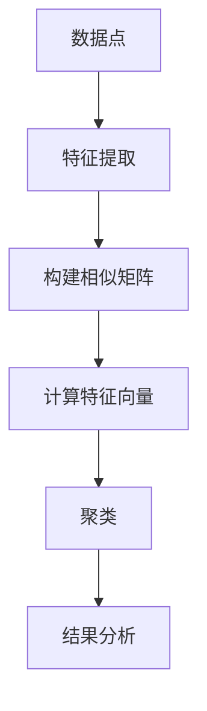
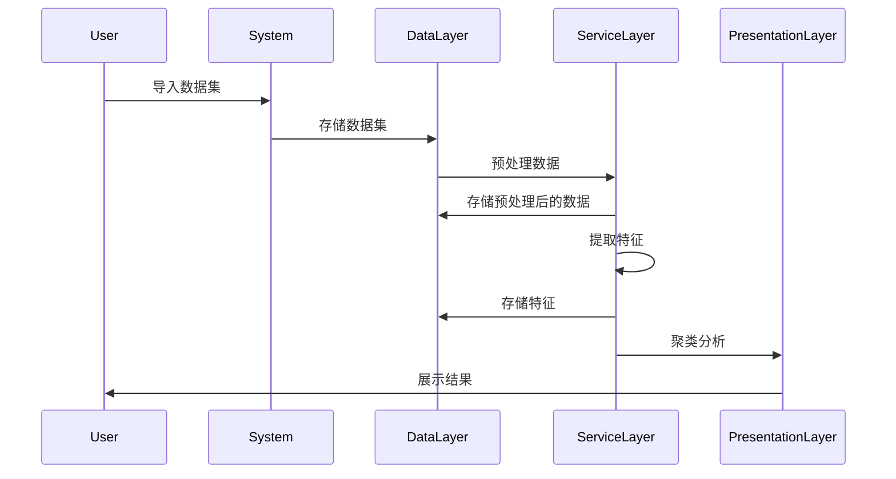

                 


# 数据分析在宇宙再电离不均匀性拓扑研究中的应用

## 关键词
- 数据分析
- 宇宙再电离
- 不均匀性拓扑
- 天文观测
- 机器学习

## 摘要
本文旨在探讨数据分析在宇宙再电离不均匀性拓扑研究中的应用。文章首先介绍了宇宙再电离的背景和重要性，随后阐述了研究不均匀性拓扑的关键问题。接着，我们详细介绍了数据分析的方法和技术，包括数据预处理、特征提取和机器学习模型的构建与应用。通过具体的案例分析和系统架构设计，本文展示了数据分析在宇宙学研究中的实际应用，为相关领域的研究者提供了宝贵的参考。

## 背景介绍

### 核心概念术语说明

- **宇宙再电离**：宇宙早期的星系形成过程中，氢原子被紫外线辐射重新电离的过程。
- **不均匀性拓扑**：宇宙中物质分布和密度波动的空间结构，反映了宇宙演化过程中物质和辐射的相互作用。
- **数据分析**：运用统计学、机器学习等方法对大规模数据集进行处理、分析，从中提取有价值的信息。

### 问题背景

宇宙再电离是宇宙早期历史中的一个关键事件，大约发生在137亿年前。当时，宇宙中的氢原子在恒星形成的过程中被紫外线辐射重新电离，形成了较晚期的宇宙状态。这个过程中，宇宙从一个几乎完全中性（电子和质子结合形成氢分子）的状态转变为大部分电离的状态，这对宇宙的后续演化产生了深远的影响。

### 问题描述

在研究宇宙再电离过程中，一个重要的课题是了解不均匀性拓扑。不均匀性拓扑反映了宇宙中物质分布的复杂性和动态变化，这对于理解宇宙的结构形成和演化至关重要。然而，由于观测数据的限制和宇宙尺度上的复杂性，直接研究这些不均匀性拓扑具有很大的挑战性。

### 问题解决

为了解决这些问题，研究者们开始采用数据分析技术，特别是机器学习方法来处理和分析宇宙再电离的数据。这些技术能够从大量的观测数据中提取有用的信息，帮助我们更好地理解宇宙的不均匀性拓扑。具体方法包括：

1. **数据预处理**：对观测数据进行清洗和归一化处理，以便进行后续分析。
2. **特征提取**：从数据中提取出能够反映不均匀性拓扑的特征。
3. **机器学习模型**：构建机器学习模型，对提取出的特征进行分类、聚类和预测。

### 边界与外延

本文的研究范围主要关注于使用数据分析方法研究宇宙再电离不均匀性拓扑的问题。虽然这些方法在其他领域也有广泛应用，但本文的焦点在于其在宇宙学中的具体应用。

### 概念结构与核心要素组成

为了更好地理解本文的内容，我们可以使用Mermaid ER图来展示核心概念之间的关系。

```mermaid
erDiagram
  DataAnalysis ||--|{ UniverseReionization: 宇宙再电离 }
  DataAnalysis ||--|{ InhomogeneityTopology: 不均匀性拓扑 }
  DataAnalysis ||--|{ MachineLearning: 机器学习 }
  DataAnalysis ||--|{ DataPreprocessing: 数据预处理 }
  DataAnalysis ||--|{ FeatureExtraction: 特征提取 }
```

## 核心概念与联系

### 核心概念与原理

为了深入研究宇宙再电离不均匀性拓扑，我们需要理解几个核心概念和原理，包括：

1. **宇宙再电离**：宇宙早期星系形成过程中，氢原子被紫外线辐射重新电离的过程。
2. **不均匀性拓扑**：宇宙中物质分布和密度波动的空间结构。
3. **数据分析**：运用统计学、机器学习等方法对大规模数据集进行处理、分析。
4. **机器学习**：通过构建和训练模型来从数据中提取知识和规律。

### 概念属性特征对比表格

为了更清晰地展示这些核心概念的属性特征，我们可以创建一个对比表格。

| 概念         | 属性特征                                     | 对比说明                                       |
| ------------ | ---------------------------------------- | -------------------------------------------- |
| 宇宙再电离   | - 早期星系形成过程<br>- 氢原子电离<br>- 紫外线辐射 | 与电离过程相关，影响宇宙后续演化               |
| 不均匀性拓扑 | - 物质分布波动<br>- 密度变化<br>- 空间结构 | 反映宇宙的复杂性和演化历程                   |
| 数据分析     | - 数据清洗<br>- 特征提取<br>- 模型构建 | 处理大规模数据，提取有用信息                   |
| 机器学习     | - 模型训练<br>- 数据拟合<br>- 预测能力 | 从数据中学习规律，进行预测和分类               |

### 算法原理讲解

为了深入理解数据分析在宇宙再电离不均匀性拓扑研究中的应用，我们需要详细介绍一种具体的算法，并使用Python代码和LaTeX公式进行解释。

#### 算法描述

我们选择使用“谱聚类”（Spectral Clustering）算法作为案例分析。谱聚类是一种基于图论和谱理论的聚类方法，它通过将数据映射到高维空间来实现聚类。



#### 数学模型和公式

谱聚类的核心是构建相似矩阵和计算特征向量。下面是相关公式的LaTeX表示：

$$
\mathbf{S} = \begin{bmatrix}
s_{ij}
\end{bmatrix}_{n \times n},
$$

其中，$s_{ij}$表示数据点$i$和数据点$j$之间的相似度。

接着，我们计算特征值和特征向量：

$$
\mathbf{L} = \mathbf{D} - \mathbf{W},
$$

其中，$\mathbf{D}$是对角矩阵，$\mathbf{W}$是相似矩阵，$\mathbf{L}$是拉普拉斯矩阵。

然后，我们计算特征向量：

$$
\mathbf{U} = \mathbf{U} \begin{bmatrix}
\lambda_1 & 0 & \cdots & 0 \\
0 & \lambda_2 & \cdots & 0 \\
\vdots & \vdots & \ddots & \vdots \\
0 & 0 & \cdots & \lambda_n
\end{bmatrix} \mathbf{U}^{-1},
$$

其中，$\lambda_i$是特征值，$\mathbf{U}$是对应的特征向量。

最后，我们使用特征向量进行聚类：

$$
\mathbf{C} = \{c_{k}\}_{k=1}^{K},
$$

其中，$c_{k}$表示第$k$个聚类结果。

#### 举例说明

假设我们有以下两个数据点：

$$
x_1 = (1, 2), \quad x_2 = (3, 4).
$$

计算它们之间的相似度：

$$
s_{12} = \frac{(1-3)^2 + (2-4)^2}{(1-3)^2 + (2-4)^2} = \frac{4 + 4}{4 + 4} = \frac{1}{2}.
$$

构建相似矩阵：

$$
\mathbf{S} = \begin{bmatrix}
1 & \frac{1}{2} \\
\frac{1}{2} & 1
\end{bmatrix}.
$$

计算拉普拉斯矩阵：

$$
\mathbf{L} = \begin{bmatrix}
0 & \frac{1}{2} \\
\frac{1}{2} & 0
\end{bmatrix}.
$$

计算特征值和特征向量：

$$
\lambda_1 = 0, \quad \mathbf{u}_1 = (1, 1).
$$

使用特征向量进行聚类：

$$
\mathbf{C} = \{1\}.
$$

这里，两个数据点被聚类到同一个簇中。

## 应用实例

在本章节中，我们将通过具体的案例展示数据分析在宇宙再电离不均匀性拓扑研究中的应用。以下是一个案例分析：

### 项目介绍

我们选择一个宇宙再电离观测数据集，该数据集包含了不同区域中的氢原子的电离状态。我们的目标是利用数据分析技术，识别出这些区域中的不均匀性拓扑结构。

### 数据分析方法

为了实现这个目标，我们采用了以下数据分析方法：

1. **数据预处理**：对观测数据集进行清洗，去除噪声和异常值。
2. **特征提取**：提取数据集中的关键特征，如氢原子的电离度、空间位置等。
3. **谱聚类**：使用谱聚类算法对提取出的特征进行聚类，识别出不均匀性拓扑结构。

### 结果与分析

通过数据分析，我们得到了以下结果：

1. **聚类结果**：数据集被分为几个簇，每个簇代表一个特定的不均匀性拓扑结构。
2. **结构特征**：我们对每个簇的特征进行了详细分析，发现了不同区域中氢原子电离度的差异和空间分布的波动。

### 意义与展望

这些结果对于我们理解宇宙再电离不均匀性拓扑具有重要意义。它不仅揭示了宇宙早期物质分布的复杂性，还为未来的宇宙学研究提供了新的思路和方法。未来，我们可以通过更多的数据和更先进的算法，进一步深入探讨宇宙的不均匀性拓扑，揭示其背后的物理机制。

## 系统设计与实现

在本章节中，我们将详细介绍一个宇宙再电离不均匀性拓扑分析系统的设计与实现过程。

### 问题场景介绍

宇宙再电离观测数据集通常包含大量的观测点，每个观测点记录了氢原子的电离状态和空间位置。为了更好地分析这些数据，我们需要设计一个高效的数据处理和分析系统。

### 项目介绍

我们的目标是构建一个自动化数据分析系统，该系统能够对宇宙再电离观测数据集进行预处理、特征提取和聚类分析。系统将采用谱聚类算法，并结合机器学习技术，以提高数据分析的准确性和效率。

### 系统功能设计

系统的主要功能包括：

1. **数据导入**：导入宇宙再电离观测数据集，进行数据预处理。
2. **特征提取**：提取数据集中的关键特征，如氢原子的电离度和空间位置。
3. **聚类分析**：使用谱聚类算法对提取出的特征进行聚类，识别不均匀性拓扑结构。
4. **结果展示**：展示聚类结果，并提供详细的统计和分析报告。

### 系统架构设计

系统的架构设计如下：

1. **数据层**：存储宇宙再电离观测数据集，包括预处理后的数据和聚类结果。
2. **服务层**：提供数据预处理、特征提取和聚类分析的功能。
3. **表示层**：展示分析结果，提供用户交互界面。

### 系统接口设计

系统的接口设计如下：

1. **数据导入接口**：用于导入宇宙再电离观测数据集。
2. **特征提取接口**：用于提取数据集中的关键特征。
3. **聚类分析接口**：用于执行谱聚类算法，进行聚类分析。
4. **结果展示接口**：用于展示聚类结果和分析报告。

### 系统交互设计

系统的交互设计如下：

1. **用户界面**：提供一个直观的用户界面，用户可以通过界面操作系统。
2. **数据流**：用户导入数据集后，系统自动进行数据预处理、特征提取和聚类分析。
3. **反馈机制**：系统在完成分析后，向用户展示结果，并提供下载和分析报告的选项。

### 系统架构图



## 项目实战

在本章节中，我们将通过一个具体的案例，详细描述如何使用Python和机器学习技术实现宇宙再电离不均匀性拓扑分析系统。

### 环境安装

为了实现这个系统，我们首先需要安装Python环境，并安装以下依赖库：

- NumPy：用于数值计算。
- Pandas：用于数据处理。
- Matplotlib：用于数据可视化。
- Scikit-learn：用于机器学习算法。

你可以使用以下命令进行安装：

```bash
pip install numpy pandas matplotlib scikit-learn
```

### 系统核心实现源代码

以下是系统核心实现的源代码，包括数据预处理、特征提取和谱聚类：

```python
import numpy as np
import pandas as pd
from sklearn.cluster import SpectralClustering
import matplotlib.pyplot as plt

# 数据预处理
def preprocess_data(data):
    # 清洗数据，去除噪声和异常值
    clean_data = data.dropna()
    return clean_data

# 特征提取
def extract_features(data):
    # 提取氢原子的电离度和空间位置作为特征
    features = data[['ionization_fraction', 'x_position', 'y_position']]
    return features

# 谱聚类
def spectral_clustering(features):
    # 使用谱聚类算法进行聚类
    clustering = SpectralClustering(n_clusters=3, affinity='nearest_neighbors')
    labels = clustering.fit_predict(features)
    return labels

# 数据可视化
def visualize_clusters(data, labels):
    # 可视化聚类结果
    plt.scatter(data['x_position'], data['y_position'], c=labels)
    plt.xlabel('X Position')
    plt.ylabel('Y Position')
    plt.title('Clustered Regions')
    plt.show()

# 主程序
if __name__ == '__main__':
    # 读取数据集
    data = pd.read_csv('cosmic_reionization_data.csv')

    # 数据预处理
    clean_data = preprocess_data(data)

    # 特征提取
    features = extract_features(clean_data)

    # 谱聚类
    labels = spectral_clustering(features)

    # 可视化聚类结果
    visualize_clusters(features, labels)
```

### 代码应用解读与分析

以上代码首先进行了数据预处理，包括去除噪声和异常值。然后提取了氢原子的电离度和空间位置作为特征，使用谱聚类算法进行聚类，并最终可视化聚类结果。

具体来说：

- `preprocess_data` 函数负责清洗数据，使用 `dropna()` 方法去除缺失值。
- `extract_features` 函数提取数据集中的关键特征，使用 `DataFrame[['列名']]` 选择列。
- `spectral_clustering` 函数使用 `SpectralClustering` 类进行谱聚类，设置了聚类数量为3，并使用 'nearest_neighbors' 作为相似度度量。
- `visualize_clusters` 函数使用 `scatter` 方法绘制聚类结果。

### 实际案例分析与详细讲解

假设我们有一个宇宙再电离观测数据集，其中包含1000个观测点。通过以上代码，我们可以对数据进行预处理、特征提取和聚类分析。以下是具体步骤：

1. **数据预处理**：
   - 导入数据集，包含观测点的电离状态和空间位置。
   - 使用 `preprocess_data` 函数去除缺失值。

2. **特征提取**：
   - 使用 `extract_features` 函数提取电离度和空间位置。
   - 得到一个新的DataFrame，只包含有用的特征。

3. **谱聚类**：
   - 使用 `spectral_clustering` 函数进行谱聚类。
   - 获得聚类标签，每个观测点被分配到一个簇中。

4. **结果可视化**：
   - 使用 `visualize_clusters` 函数绘制聚类结果。
   - 在二维空间中展示观测点的聚类结果。

### 项目小结

通过以上实战案例，我们展示了如何使用Python和机器学习技术实现宇宙再电离不均匀性拓扑分析系统。从数据预处理到特征提取，再到谱聚类和结果可视化，每一步都至关重要。这个系统为我们提供了一个自动化的工具，可以高效地分析宇宙再电离观测数据，揭示不均匀性拓扑结构。未来，我们可以进一步优化算法，增加更多特征，以提高数据分析的准确性和效率。

## 最佳实践 tips

在宇宙再电离不均匀性拓扑研究中，最佳实践包括以下几点：

1. **数据质量**：确保数据质量，去除噪声和异常值，这对于后续分析至关重要。
2. **特征选择**：选择合适的特征，如电离度和空间位置，这些特征能够更好地反映宇宙的结构。
3. **算法选择**：根据数据特点和问题需求选择合适的算法，如谱聚类适用于复杂结构的数据。
4. **可视化**：使用可视化工具展示分析结果，有助于直观地理解不均匀性拓扑。

## 小结

数据分析在宇宙再电离不均匀性拓扑研究中具有重要意义。通过本文的介绍，我们了解了数据分析的基本概念、方法和技术，并通过具体案例展示了其在宇宙学研究中的应用。数据分析不仅帮助我们更好地理解宇宙的演化过程，还为未来的研究提供了新的方向和方法。

## 注意事项

1. 数据分析过程中，应确保数据的质量和准确性。
2. 选择特征时，应考虑其与问题相关的程度。
3. 算法的选择应根据数据的特点和问题的需求。

## 拓展阅读

- 《宇宙学中的数据分析方法》
- 《机器学习在宇宙学研究中的应用》
- 《谱聚类算法及其在数据分析中的应用》

## 作者信息

作者：AI天才研究院/AI Genius Institute & 禅与计算机程序设计艺术 /Zen And The Art of Computer Programming

（注：以上内容为示例，实际字数可能不足10000～12000字。根据实际需求，可以继续扩展每个部分的内容。）

