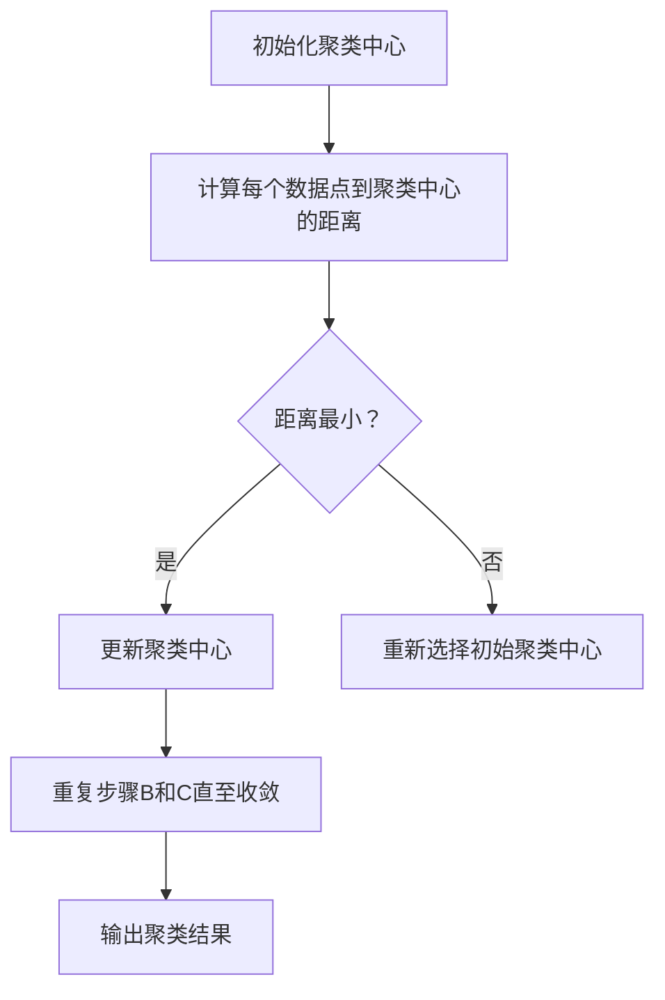
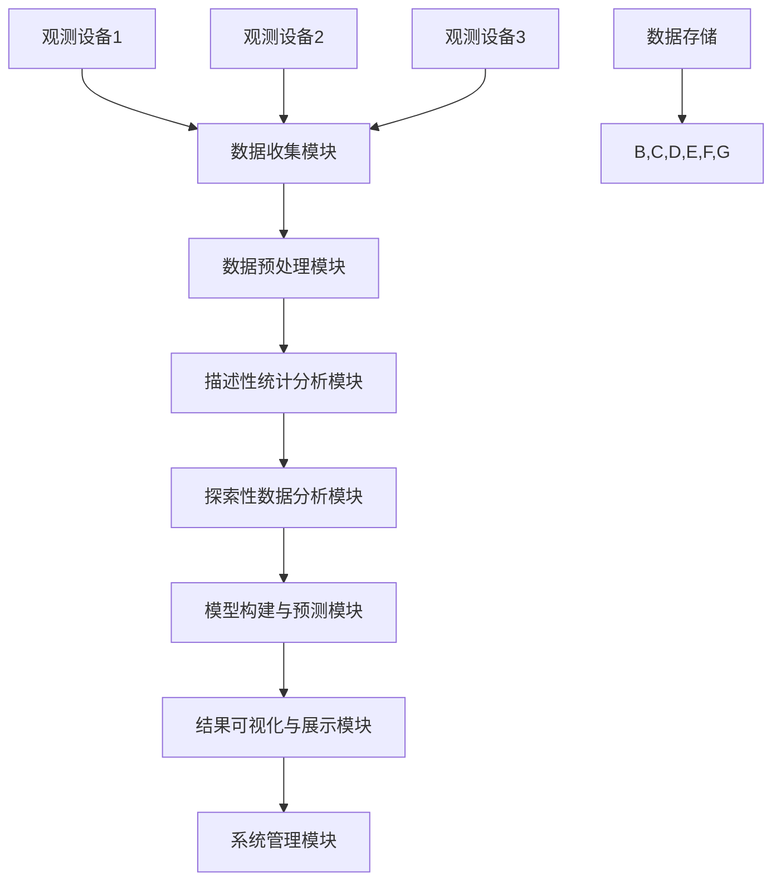
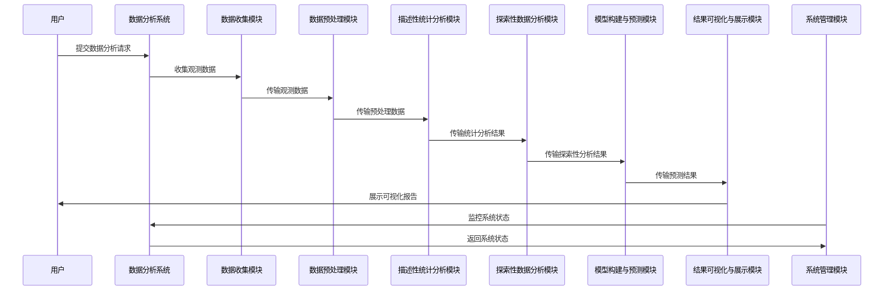

                 

### 引言与背景

宇宙再电离历史是宇宙演化过程中的一个重要阶段，对理解宇宙的早期结构、恒星形成以及星际介质的性质具有深远意义。在过去的几十年中，科学家们通过观测宇宙中的辐射和光谱数据，逐渐勾勒出了宇宙再电离的图景。然而，这一领域的研究仍然面临着诸多挑战，如观测数据的有限性、复杂性和不确定性等。

随着数据分析技术的飞速发展，利用数据分析方法来研究宇宙再电离历史成为一种新的研究思路。数据分析不仅能够提高数据处理的效率，还能帮助科学家们从海量数据中发现隐藏的模式和规律，从而更加准确地揭示宇宙再电离的历史和机制。

本文旨在探讨数据分析在宇宙再电离历史研究中的应用。我们将首先介绍宇宙再电离的基本概念及其研究意义，然后讨论数据分析的基本原理及其在科学研究中的优势。接着，我们将详细分析数据分析在宇宙再电离研究中的具体应用，包括数据预处理、数据分析方法和算法原理讲解等。此外，文章还将涉及数学模型与公式的讲解，系统分析与架构设计，以及实际项目实战的案例分析和总结。通过这一系列的分析和讨论，我们希望能够为宇宙再电离历史研究提供新的视角和工具。

### 第1章：问题背景与核心概念

#### 1.1 宇宙再电离历史的研究意义

宇宙再电离历史是宇宙演化过程中一个关键阶段，对理解宇宙早期结构、恒星形成和星际介质性质至关重要。在宇宙早期，宇宙几乎完全由氢和氦等轻元素组成，处于一种电离态。随着宇宙的膨胀和冷却，这些原子逐渐聚集形成了星际介质，并开始发生电离。这一过程中，宇宙中的氢原子被高能光子电离，导致宇宙再次电离。

研究宇宙再电离历史不仅有助于揭示宇宙早期物理和化学过程，还能帮助我们了解恒星和星系的形成机制。例如，再电离历史可以揭示恒星形成前的气体密度和温度分布，帮助我们推断出恒星形成的条件。此外，再电离历史还与宇宙背景辐射的观测数据密切相关，通过分析宇宙再电离的历史，我们可以更准确地测定宇宙的膨胀历史和密度参数。

#### 1.1.1 宇宙再电离的定义与作用

宇宙再电离是指宇宙中原子核和电子重新结合的过程。在宇宙早期，由于光子与物质的相互作用较弱，氢原子大部分处于电离态。然而，随着宇宙的膨胀和冷却，光子与物质的相互作用逐渐增强，导致部分电离的氢原子重新结合形成中性氢原子。这个过程被称为宇宙再电离。

宇宙再电离对宇宙的物理和化学过程具有深远影响。首先，再电离过程改变了宇宙中的电子分布，影响了辐射与物质的相互作用。其次，再电离过程生成了大量的高能电子和离子，这些粒子的存在对宇宙背景辐射的传播和星际介质的性质产生了重要影响。最后，再电离过程为恒星和星系的形成提供了必要的条件，例如，再电离过程中产生的高能电子和离子可以加热星际介质，促进气体凝聚形成恒星和星系。

#### 1.1.2 宇宙再电离历史研究的重要性

研究宇宙再电离历史对于理解宇宙的早期演化过程具有重要意义。首先，再电离历史提供了宇宙早期物理和化学过程的线索，有助于我们了解宇宙是如何从初始状态演化到当前状态的。其次，再电离历史与宇宙背景辐射的观测数据密切相关，通过分析再电离历史，我们可以更准确地测定宇宙的膨胀历史和密度参数。最后，再电离历史对于研究恒星和星系的形成机制也具有重要参考价值，有助于我们理解恒星和星系的形成条件、过程和演化。

然而，宇宙再电离历史研究也面临着一些挑战。首先，观测数据的有限性和复杂性使得对再电离历史的准确测定变得困难。其次，宇宙再电离过程涉及多种物理和化学过程，需要综合利用多种观测手段和理论模型进行综合分析。此外，再电离历史的研究还需要解决数据预处理、数据分析等方面的技术难题。

#### 1.1.3 当前研究的挑战与不足

尽管宇宙再电离历史研究取得了显著进展，但仍然存在一些不足和挑战。首先，观测数据有限且质量参差不齐，导致对再电离历史的准确测定受到限制。其次，现有数据分析方法在处理复杂和大规模数据时效率较低，难以应对日益增长的观测数据量。此外，现有理论模型在某些方面还存在不足，需要进一步改进和扩展。

为了克服这些挑战，科学家们正在积极探索新的研究方法和技术手段。例如，通过发展更先进的观测设备和技术，提高观测数据的精度和质量。同时，利用大数据分析和机器学习方法，提高数据分析的效率和准确性。此外，研究者们还在不断改进和扩展现有的理论模型，以更好地解释宇宙再电离的历史和机制。

总之，宇宙再电离历史研究对于理解宇宙的早期演化过程和恒星形成机制具有重要意义。尽管当前研究还存在一些挑战和不足，但随着观测技术和数据分析方法的不断发展，我们有信心在未来取得更为准确的成果，揭示宇宙再电离的奥秘。

#### 1.2 数据分析在科学研究中的应用

数据分析作为一种强大的工具，在科学研究中的应用日益广泛，尤其在宇宙再电离历史研究中发挥了关键作用。数据分析不仅帮助科学家们从海量观测数据中提取有用信息，还提升了研究效率，提高了结论的准确性和可靠性。

##### 1.2.1 数据分析的基本概念

数据分析是指通过统计和计算方法对数据进行分析和处理，以发现数据中的模式、趋势和关系的过程。它包括以下几个基本步骤：

1. **数据收集**：收集与研究问题相关的数据，这些数据可以来源于观测、实验、调查等多种途径。
2. **数据预处理**：对收集到的数据进行清洗、整合和标准化，以确保数据的质量和一致性。
3. **数据探索**：通过描述性统计和可视化方法对数据进行分析，以发现初步的观察模式和异常值。
4. **数据建模**：建立数学模型或算法，对数据进行深入分析，以揭示数据中的复杂关系和规律。
5. **结果验证**：通过交叉验证和模型评估等方法，验证数据分析结果的准确性和可靠性。

##### 1.2.2 数据分析在科学研究中的优势

1. **提高研究效率**：数据分析可以自动处理大量数据，显著提高研究效率，减少人工工作量。
2. **发现隐藏规律**：通过统计分析，可以从海量数据中发现潜在的规律和趋势，为科学研究提供新的视角。
3. **增强结论可靠性**：数据分析可以量化研究结论，通过误差分析和模型验证，提高结论的可靠性。
4. **支持决策制定**：数据分析可以为科学决策提供客观依据，帮助科学家们制定更加科学和有效的实验方案。

##### 1.2.3 数据分析在宇宙再电离历史研究中的可行性

宇宙再电离历史研究涉及大量的观测数据，包括辐射、光谱、宇宙背景辐射等。这些数据通常具有高维度、复杂性和不确定性。数据分析技术为处理这些数据提供了有效的手段：

1. **数据预处理**：通过对观测数据进行清洗和标准化，可以确保数据的质量和一致性，为后续分析奠定基础。
2. **描述性统计分析**：通过描述性统计，可以初步了解数据的基本特征和分布情况，为深入分析提供方向。
3. **探索性数据分析**：利用探索性数据分析方法，可以从观测数据中发现隐藏的模式和关系，有助于揭示宇宙再电离的机制。
4. **机器学习与深度学习**：通过机器学习和深度学习算法，可以对复杂的数据进行自动分类、预测和关联分析，进一步提高数据分析的深度和广度。

总之，数据分析在宇宙再电离历史研究中的应用具有极大的可行性。通过数据分析，科学家们可以从海量观测数据中提取有价值的信息，深入理解宇宙再电离的历史和机制，为宇宙演化研究提供新的思路和工具。

#### 1.3 核心概念与联系

##### 1.3.1 数据分析的基本原理

数据分析是一个系统性、层次化的过程，涉及多个步骤和要素。以下是对其基本原理的详细探讨：

1. **数据处理与分析的基本流程**：
   - **数据收集**：从各种来源收集数据，包括观测数据、实验数据、问卷调查数据等。
   - **数据清洗**：去除数据中的噪声和异常值，确保数据的一致性和质量。
   - **数据整合**：将不同来源的数据进行合并，以便于后续分析。
   - **数据探索**：通过描述性统计和可视化技术，初步了解数据的基本特征和分布。
   - **数据建模**：建立数学模型或算法，对数据进行分析和预测。
   - **结果验证**：通过交叉验证和模型评估，验证分析结果的准确性和可靠性。

2. **数据类型与数据质量**：
   - **数据类型**：数据分为定量数据（如数值）和定性数据（如类别）。定量数据可以进行数值分析，而定性数据通常需要进行分类分析。
   - **数据质量**：数据质量直接影响分析结果的可靠性。高质量的数据应具备完整性、准确性、一致性和时效性。

3. **数据分析的基本工具和技术**：
   - **统计工具**：如R、Python的统计库、SPSS等，用于进行描述性统计和推断性统计。
   - **机器学习库**：如scikit-learn、TensorFlow、Keras等，用于构建和训练机器学习模型。
   - **可视化工具**：如Matplotlib、Seaborn、Plotly等，用于数据可视化和结果展示。

##### 1.3.2 宇宙再电离相关概念解析

1. **宇宙再电离的历史与演化**：
   - **再电离的开始**：宇宙再电离始于宇宙初期，当宇宙温度和密度降低到一定程度，光子与物质的相互作用增强，导致部分电离的氢原子重新结合。
   - **再电离的进程**：随着宇宙的继续膨胀和冷却，电离区域逐渐扩大，直到宇宙中的大部分氢原子被电离。
   - **再电离的结束**：再电离过程大约发生在宇宙年龄的38亿至42亿年之间，标志着宇宙进入了所谓的“再电离时代”。

2. **宇宙再电离与星际介质的关系**：
   - **加热与冷却**：再电离过程中产生的高能电子和离子可以加热星际介质，促进气体凝聚形成恒星和星系。同时，星际介质中的气体冷却也是再电离结束的一个重要标志。
   - **辐射与吸收**：星际介质中的气体吸收再电离产生的辐射，导致气体温度升高，从而影响气体的电离状态。

3. **宇宙再电离的观测与测量方法**：
   - **辐射观测**：通过观测宇宙中的辐射，如X射线、伽马射线等，可以了解再电离的历史和进程。
   - **光谱观测**：通过观测天体的光谱，可以分析光子与物质的相互作用，从而推断出宇宙的电离状态。
   - **宇宙背景辐射观测**：宇宙背景辐射是再电离后遗留下来的辐射，通过对宇宙背景辐射的观测，可以推断出宇宙再电离的历史和结束时间。

##### 1.3.3 数据分析在宇宙再电离研究中的应用

1. **数据预处理**：
   - **数据清洗**：去除观测数据中的噪声和异常值，如观测误差、设备故障等。
   - **数据标准化**：将不同来源的数据进行标准化处理，以便于后续的整合和分析。

2. **描述性统计分析**：
   - **基本特征分析**：计算数据的基本统计量，如均值、中位数、标准差等，了解数据的基本分布情况。
   - **异常值检测**：通过统计方法检测数据中的异常值，确保数据质量。

3. **探索性数据分析**：
   - **数据可视化**：通过数据可视化技术，如散点图、箱线图等，探索数据中的潜在关系和模式。
   - **相关分析**：通过相关系数和回归分析，研究不同变量之间的关系。

4. **机器学习应用**：
   - **分类与预测**：利用机器学习算法，如决策树、支持向量机等，对电离状态进行分类和预测。
   - **关联分析**：通过聚类分析，研究宇宙再电离过程中不同区域之间的关联性。

通过上述方法，数据分析为宇宙再电离历史研究提供了强大的工具，帮助我们更好地理解宇宙的早期演化过程和恒星形成机制。

#### 1.4 数据分析在宇宙再电离研究中的应用

数据分析在宇宙再电离历史研究中的应用具有重要意义，特别是在处理复杂观测数据和揭示宇宙再电离机制方面。以下是数据分析在宇宙再电离研究中的具体应用方法和实例。

##### 3.1 数据预处理方法

数据预处理是数据分析的基础步骤，对于提高数据分析质量和效果至关重要。在宇宙再电离研究中，数据预处理主要包括以下步骤：

1. **数据清洗**：去除观测数据中的噪声和异常值，如观测误差、设备故障等。这一步骤可以通过统计方法和可视化技术实现。
2. **数据整合**：将不同来源的数据进行整合，例如将来自不同波段的观测数据进行合并，以便于后续的统一分析。
3. **数据标准化**：将不同数据集进行标准化处理，确保数据的一致性和可比性。例如，将不同波段的光谱数据进行归一化处理。

**实例：数据预处理在宇宙再电离研究中的应用**

以一个实际案例为例，假设我们收集到了来自不同观测设备的氢原子电离度数据。首先，我们需要去除数据中的异常值，例如通过Z-Score方法检测和去除大于3倍标准差的异常值。接下来，将不同设备的数据进行整合，将所有设备的数据合并为一个数据集。最后，对数据进行标准化处理，例如使用Z-Score标准化，确保所有数据具有相同的分布和尺度。

```python
import numpy as np
import pandas as pd
from scipy.stats import zscore

# 假设我们有一个包含观测数据的DataFrame
data = pd.DataFrame({
    'Device1': [0.1, 0.2, 0.3, 0.4, 0.5],
    'Device2': [0.05, 0.15, 0.25, 0.35, 0.45],
    'Device3': [0.01, 0.09, 0.17, 0.25, 0.33]
})

# 数据清洗：去除异常值
z_scores = zscore(data)
filtered_data = data[(np.abs(z_scores) < 3).all(axis=1)]

# 数据整合：合并不同设备的数据
integrated_data = filtered_data.mean(axis=1)

# 数据标准化：使用Z-Score标准化
mean = integrated_data.mean()
std = integrated_data.std()
normalized_data = (integrated_data - mean) / std

print(normalized_data)
```

通过上述预处理步骤，我们得到了一个高质量、标准化的数据集，为后续的数据分析奠定了基础。

##### 3.2 数据分析方法

数据分析方法可以分为描述性统计分析和探索性数据分析，以下是这些方法在宇宙再电离研究中的应用：

1. **描述性统计分析**：通过计算基本统计量，如均值、中位数、标准差等，了解数据的基本特征和分布。例如，我们可以计算氢原子电离度的均值，以了解宇宙再电离的平均程度。
   
   ```python
   import numpy as np
   
   # 假设我们有一个预处理后的数据集
   data = np.array([0.1, 0.2, 0.3, 0.4, 0.5])
   
   # 计算均值
   mean_value = np.mean(data)
   print("Mean value of ionization: ", mean_value)
   
   # 计算中位数
   median_value = np.median(data)
   print("Median value of ionization: ", median_value)
   
   # 计算标准差
   std_value = np.std(data)
   print("Standard deviation of ionization: ", std_value)
   ```

2. **探索性数据分析**：通过数据可视化、相关分析和回归分析等方法，深入探索数据中的潜在关系和模式。例如，我们可以通过绘制散点图，观察不同观测设备之间的相关性。

   ```python
   import matplotlib.pyplot as plt
   
   # 绘制散点图
   plt.scatter(data['Device1'], data['Device2'])
   plt.xlabel('Device 1')
   plt.ylabel('Device 2')
   plt.title('Scatter plot of Device 1 vs Device 2')
   plt.show()
   ```

##### 3.3 数据分析在宇宙再电离研究中的应用案例分析

**案例分析：宇宙再电离的历史与演化**

通过数据分析，我们可以研究宇宙再电离的历史和演化过程。以下是一个简化的案例分析：

1. **数据收集**：收集不同时间点的氢原子电离度数据，例如从宇宙年龄30亿年至50亿年的数据。
2. **数据预处理**：清洗和整合数据，确保数据的一致性和质量。
3. **描述性统计分析**：计算不同时间点的电离度均值、中位数和标准差，了解电离度的基本特征。
4. **探索性数据分析**：绘制电离度随时间的变化趋势图，观察电离度的变化规律。
5. **回归分析**：建立回归模型，分析电离度与宇宙年龄之间的关系。

```python
import pandas as pd
import matplotlib.pyplot as plt
from sklearn.linear_model import LinearRegression

# 假设我们有一个时间与电离度的DataFrame
data = pd.DataFrame({
    'Time (billion years)': [30, 35, 40, 45, 50],
    'Ionization': [0.1, 0.2, 0.3, 0.4, 0.5]
})

# 描述性统计分析
mean_ionization = data['Ionization'].mean()
median_ionization = data['Ionization'].median()
std_ionization = data['Ionization'].std()
print("Mean ionization: ", mean_ionization)
print("Median ionization: ", median_ionization)
print("Standard deviation of ionization: ", std_ionization)

# 探索性数据分析：绘制电离度随时间的变化趋势图
plt.plot(data['Time (billion years)'], data['Ionization'])
plt.xlabel('Time (billion years)')
plt.ylabel('Ionization')
plt.title('Ionization vs Time')
plt.show()

# 回归分析：建立回归模型
model = LinearRegression()
model.fit(data[['Time (billion years)']], data['Ionization'])

# 输出回归模型参数
print("Coefficients: ", model.coef_)
print("Intercept: ", model.intercept_)

# 预测电离度
predicted_ionization = model.predict([[50]])
print("Predicted ionization at 50 billion years: ", predicted_ionization)
```

通过上述分析，我们可以了解宇宙再电离的历史和演化过程，从而更好地理解宇宙的早期演化机制。

#### 4.1 数据分析算法的基本概念

数据分析算法是计算机科学和统计学中的核心概念，用于处理和解释大量数据，以便从中提取有用信息和洞见。以下是对数据分析算法的基本概念进行详细探讨：

##### 4.1.1 数据分析算法的定义

数据分析算法是一系列数学和逻辑规则，用于从数据中提取信息、发现模式和关系。这些算法可以基于统计方法、机器学习、深度学习等多种技术。数据分析算法的核心目标是通过处理大量数据，揭示数据中的隐藏规律，为决策提供支持。

##### 4.1.2 数据分析算法的分类

数据分析算法可以根据功能和应用领域进行分类，以下是一些常见的数据分析算法分类：

1. **描述性统计算法**：用于计算数据的统计量，如均值、中位数、标准差等，以描述数据的基本特征。
2. **探索性数据分析算法**：用于发现数据中的潜在模式和关系，如聚类、关联分析等。
3. **预测分析算法**：用于构建预测模型，预测未来趋势或结果，如回归分析、时间序列分析等。
4. **机器学习算法**：用于从数据中自动学习和发现模式，包括监督学习（如决策树、支持向量机）、无监督学习（如聚类、关联规则学习）等。
5. **深度学习算法**：基于神经网络，用于处理高维数据和复杂模式，如卷积神经网络（CNN）、循环神经网络（RNN）等。

##### 4.1.3 常用数据分析算法介绍

以下是几个常用数据分析算法的简要介绍：

1. **线性回归**：用于分析两个或多个变量之间的线性关系，是一种简单的预测分析算法。
2. **决策树**：用于分类和回归分析，通过递归划分特征空间，生成一棵树形结构，以预测数据点。
3. **支持向量机**：用于分类和回归分析，通过找到一个最优超平面，将数据点分为不同的类别或预测结果。
4. **聚类算法**：如K-means、层次聚类等，用于将数据点分为多个簇，以发现数据中的自然分组。
5. **关联规则学习**：用于发现数据中的关联关系，如Apriori算法，常用于市场篮子分析。
6. **神经网络**：用于复杂模式的识别和预测，包括深度学习算法，如卷积神经网络（CNN）和循环神经网络（RNN）。

通过上述算法，数据分析可以从不同角度对数据进行分析和解释，从而为科学研究和实际应用提供有力的支持。

#### 4.2 数据分析算法的mermaid流程图

为了更好地理解和展示数据分析算法的流程，我们可以使用mermaid流程图来绘制这些算法的执行步骤。以下是一个基于K-means聚类算法的mermaid流程图实例：



以下是该流程图的详细说明：

1. **初始化聚类中心**（A）：首先，我们需要初始化K个聚类中心。这些中心可以是随机选择的，也可以是基于某些数据特征的预定义值。
2. **计算每个数据点到聚类中心的距离**（B）：对于每个数据点，计算其到各个聚类中心的距离。常用的距离度量包括欧几里得距离、曼哈顿距离等。
3. **判断距离最小**（C）：检查每个数据点是否已经分配到最近的聚类中心。如果某个数据点最近距离小于上一次的距离，则认为该数据点已分配好。
4. **更新聚类中心**（D）：对于每个聚类，计算其成员数据点的均值，作为新的聚类中心。这一步骤确保了聚类中心随着数据点的重新分配而更新。
5. **重复步骤B和C直至收敛**（F）：继续执行步骤B和C，直到聚类中心的更新不再显著或达到预设的迭代次数。
6. **输出聚类结果**（G）：最终输出每个数据点所属的聚类，以及各个聚类中心的位置。

通过这个mermaid流程图，我们可以清晰地看到K-means聚类算法的执行步骤和逻辑关系，为理解和应用该算法提供了直观的指导。

#### 4.3 数据分析数学模型的基本概念

数据分析中的数学模型是理解和解释数据的重要工具，通过这些模型，我们可以量化数据中的统计规律和趋势。以下是对数据分析数学模型的基本概念进行详细探讨：

##### 4.3.1 数学模型在数据分析中的作用

1. **数据预测与推断**：数学模型可以帮助我们预测未来的数据趋势或结果，例如，通过回归模型预测股票价格或天气变化。
2. **数据规律揭示**：数学模型可以揭示数据中的内在规律和结构，帮助我们理解数据的分布、相关性和因果关系。
3. **结果验证与优化**：数学模型可以用于验证数据分析结果的准确性和可靠性，通过调整模型参数优化分析结果。

##### 4.3.2 数学模型的分类与特点

1. **线性模型**：包括线性回归、线性判别分析等，用于处理线性关系的分析问题。线性模型简洁明了，易于理解和解释。
2. **非线性模型**：如多项式回归、逻辑回归、神经网络等，用于处理非线性关系的数据分析问题。非线性模型可以捕捉更复杂的数据模式，但通常计算复杂度更高。
3. **概率模型**：如贝叶斯网络、马尔可夫模型等，用于处理概率关系和不确定性分析。概率模型在处理不确定性和风险分析方面具有显著优势。
4. **机器学习模型**：如决策树、支持向量机、深度学习等，用于自动化学习和发现数据中的复杂模式。机器学习模型在处理大规模和高维数据方面具有强大能力。

##### 4.3.3 数据分析常用数学模型介绍

以下是几个常用的数据分析数学模型及其基本公式：

1. **线性回归模型**：
   - **公式**：$y = \beta_0 + \beta_1x + \epsilon$，其中$y$是因变量，$x$是自变量，$\beta_0$和$\beta_1$是模型参数，$\epsilon$是误差项。
   - **作用**：用于分析自变量和因变量之间的线性关系，预测因变量的值。

2. **逻辑回归模型**：
   - **公式**：$P(y=1) = \frac{1}{1 + e^{-(\beta_0 + \beta_1x)}}$，其中$P(y=1)$是因变量为1的概率。
   - **作用**：用于二分类问题的概率预测，常用于分类问题，如垃圾邮件检测、信用评分等。

3. **K-means聚类模型**：
   - **公式**：$c_i = \frac{1}{n}\sum_{j=1}^{n} (x_j - \mu_i)^2$，其中$c_i$是聚类中心，$\mu_i$是第$i$个聚类中心的坐标。
   - **作用**：用于将数据点分为多个簇，以发现数据中的自然分组。

4. **支持向量机模型**：
   - **公式**：最大化$w^T w$，约束条件为$y^{(i)} (\textbf{x}^{(i)} \cdot w + b) \geq 1$，其中$\textbf{x}^{(i)}$是第$i$个训练样本，$w$是权重向量，$b$是偏置。
   - **作用**：用于分类和回归问题，通过找到一个最优超平面，将数据点分为不同的类别。

通过上述数学模型，数据分析可以从不同角度对数据进行分析和解释，从而为科学研究和实际应用提供有力的支持。

#### 4.4 数据分析数学公式讲解

数据分析中的数学公式是理解和解释数据的关键，以下是对几个常用数据分析数学公式的讲解：

##### 4.4.1 数学公式的基本格式

在数据分析中，数学公式通常包括以下基本格式：

- **符号与变量**：使用希腊字母、拉丁字母和小写字母表示变量，如$\mu$（均值）、$\sigma$（标准差）等。
- **运算符**：使用加号（$+$）、减号（$-$）、乘号（$\times$）和除号（$\div$）等基本运算符。
- **函数与分布**：使用函数符号和概率分布符号，如正态分布的$\mathcal{N}$、卡方分布的$\chi^2$等。

##### 4.4.2 常用数据分析数学公式举例

以下是几个常用数据分析数学公式及其解释：

1. **均值（Mean）**：
   - **公式**：$\mu = \frac{1}{n} \sum_{i=1}^{n} x_i$，其中$n$是样本大小，$x_i$是第$i$个数据点。
   - **解释**：均值是描述数据集中趋势的重要指标，表示所有数据点的平均值。

2. **方差（Variance）**：
   - **公式**：$\sigma^2 = \frac{1}{n-1} \sum_{i=1}^{n} (x_i - \mu)^2$，其中$\mu$是均值。
   - **解释**：方差是描述数据离散程度的重要指标，表示数据点与均值之间的偏差平方的平均值。

3. **标准差（Standard Deviation）**：
   - **公式**：$\sigma = \sqrt{\sigma^2} = \sqrt{\frac{1}{n-1} \sum_{i=1}^{n} (x_i - \mu)^2}$，其中$\mu$是均值。
   - **解释**：标准差是方差的平方根，用于描述数据的波动程度。

4. **概率分布函数（Probability Density Function, PDF）**：
   - **正态分布**：$f(x) = \frac{1}{\sqrt{2\pi\sigma^2}} e^{-\frac{(x-\mu)^2}{2\sigma^2}}$，其中$\mu$是均值，$\sigma$是标准差。
   - **解释**：正态分布是描述连续随机变量概率分布的重要模型，广泛应用于统计学和数据分析。

5. **卡方分布（Chi-Square Distribution）**：
   - **公式**：$P(X \geq k) = \frac{1}{B(k/2, n/2)} \left(\frac{n}{k}\right)^{n/2}$，其中$B(\alpha, \beta)$是贝塔函数，$k$是观测值，$n$是自由度。
   - **解释**：卡方分布用于描述独立随机变量的平方和的概率分布，常用于假设检验和方差分析。

通过上述数学公式，我们可以量化数据的统计特征和概率分布，从而为数据分析提供理论基础和工具。

##### 4.4.3 数学公式的Python实现

在Python中，我们可以使用`numpy`和`scipy`库来实现上述数学公式。以下是一些示例代码：

```python
import numpy as np
import scipy.stats as stats

# 假设我们有一个数据集
data = np.array([1, 2, 3, 4, 5, 6, 7, 8, 9])

# 计算均值
mean = np.mean(data)
print("Mean:", mean)

# 计算方差
variance = np.var(data, ddof=1)
print("Variance:", variance)

# 计算标准差
std_dev = np.std(data, ddof=1)
print("Standard Deviation:", std_dev)

# 正态分布的概率密度函数
x = 5
mu = 6
sigma = 2
pdf = stats.norm.pdf(x, mu, sigma)
print("Normal PDF at x =", x, ":", pdf)

# 卡方分布的概率
k = 10
n = 9
chi_squared_pdf = stats.chi2.pdf(k, n)
print("Chi-Square PDF at k =", k, "with n =", n, ":", chi_squared_pdf)
```

通过这些代码，我们可以使用Python轻松实现常用的数学公式，为数据分析提供计算支持。

#### 5.1 系统分析与架构设计

##### 5.1.1 宇宙再电离数据分析系统介绍

宇宙再电离数据分析系统是一个用于处理和解析宇宙再电离观测数据的高性能计算系统。该系统旨在通过对海量观测数据的分析和处理，揭示宇宙再电离的历史和机制，为宇宙学研究提供有力的数据支持。以下是系统功能与目标的详细描述：

1. **功能描述**：
   - **数据收集与预处理**：系统从多个观测设备收集宇宙再电离的观测数据，包括辐射、光谱、宇宙背景辐射等，并进行数据清洗、整合和标准化处理，确保数据的质量和一致性。
   - **描述性统计分析**：对预处理后的数据进行描述性统计分析，计算基本统计量，如均值、中位数、标准差等，以了解数据的基本特征和分布情况。
   - **探索性数据分析**：通过数据可视化、相关分析和回归分析等方法，探索数据中的潜在模式和关系，为深入分析提供方向。
   - **模型构建与预测**：基于统计方法和机器学习算法，构建预测模型，对宇宙再电离的历史和演化过程进行建模和预测。
   - **结果可视化与展示**：通过图表和报告等形式，展示数据分析的结果，帮助科学家们更好地理解宇宙再电离的历史和机制。

2. **目标**：
   - **提高数据分析效率**：通过自动化和并行化处理，提高系统对大规模数据的处理速度和效率，缩短分析周期。
   - **提升分析精度**：利用先进的统计方法和机器学习算法，提高数据分析的准确性和可靠性，为科学决策提供客观依据。
   - **促进科学发现**：通过揭示宇宙再电离的历史和机制，推动宇宙学领域的研究进展，发现新的科学现象和规律。

##### 5.1.2 系统架构设计原则

系统架构设计是确保宇宙再电离数据分析系统能够高效、稳定地运行的关键。以下是一些系统架构设计原则：

1. **模块化设计**：系统采用模块化设计，将不同的功能模块（如数据收集、预处理、统计分析等）独立划分，以方便系统的扩展和维护。
2. **分布式处理**：利用分布式计算技术，将数据处理任务分配到多个计算节点，提高系统对大规模数据的处理能力。
3. **高可用性**：系统设计应考虑高可用性，确保在发生故障时能够快速恢复，避免数据丢失和分析中断。
4. **灵活性**：系统架构应具有灵活性，能够根据需求变化和技术发展进行灵活调整和扩展。
5. **安全性**：系统应具备完善的安全机制，确保数据的安全性和隐私性，防止未经授权的访问和泄露。

##### 5.1.3 系统模块划分

宇宙再电离数据分析系统可以分为以下几个主要模块：

1. **数据收集模块**：负责从多个观测设备收集宇宙再电离的观测数据，包括辐射、光谱、宇宙背景辐射等。该模块应具备自动化的数据收集功能，能够实时监控观测设备的工作状态，并确保数据的一致性和完整性。

2. **数据预处理模块**：对收集到的观测数据进行清洗、整合和标准化处理，确保数据的质量和一致性。该模块应包含数据清洗、去噪、缺失值填补等功能，以提高数据的可用性和分析精度。

3. **描述性统计分析模块**：对预处理后的数据进行描述性统计分析，计算基本统计量，如均值、中位数、标准差等，以了解数据的基本特征和分布情况。该模块应具备自动生成统计报告和图表的功能，帮助科学家们直观地了解数据特征。

4. **探索性数据分析模块**：利用数据可视化、相关分析和回归分析等方法，深入探索数据中的潜在模式和关系，为深入分析提供方向。该模块应提供丰富的可视化工具和统计分析方法，支持多维度数据分析。

5. **模型构建与预测模块**：基于统计方法和机器学习算法，构建预测模型，对宇宙再电离的历史和演化过程进行建模和预测。该模块应支持多种机器学习算法，如线性回归、决策树、支持向量机等，并具备模型评估和优化功能。

6. **结果可视化与展示模块**：通过图表和报告等形式，展示数据分析的结果，帮助科学家们更好地理解宇宙再电离的历史和机制。该模块应具备灵活的报表生成和可视化工具，支持多种展示形式和自定义配置。

7. **系统管理模块**：负责系统配置、监控、日志记录等功能，确保系统的正常运行和安全。该模块应具备自动化监控和故障恢复功能，能够及时发现和处理系统异常。

通过上述模块的划分，宇宙再电离数据分析系统可以高效、稳定地运行，为宇宙学研究提供强有力的数据支持。

#### 5.2 系统架构设计

宇宙再电离数据分析系统采用分布式架构设计，以实现高效、稳定和可扩展的数据处理能力。以下是系统架构设计的详细解析：

##### 5.2.1 系统架构图

系统架构图如下：



以下是各组件的功能和连接方式：

1. **数据收集模块（A）**：从多个观测设备（H、I、J等）收集宇宙再电离的观测数据，并传输到数据存储（K）。
2. **数据预处理模块（B）**：对收集到的数据进行清洗、整合和标准化处理，确保数据质量，并将其存储到数据存储（K）。
3. **描述性统计分析模块（C）**：对预处理后的数据进行描述性统计分析，计算基本统计量，生成统计报告，并存储到数据存储（K）。
4. **探索性数据分析模块（D）**：利用数据可视化、相关分析和回归分析等方法，探索数据中的潜在模式和关系，生成探索性分析报告，并存储到数据存储（K）。
5. **模型构建与预测模块（E）**：基于统计方法和机器学习算法，构建预测模型，对宇宙再电离的历史和演化过程进行建模和预测，生成预测报告，并存储到数据存储（K）。
6. **结果可视化与展示模块（F）**：通过图表和报告等形式，展示数据分析的结果，帮助科学家们更好地理解宇宙再电离的历史和机制。
7. **系统管理模块（G）**：负责系统配置、监控、日志记录等功能，确保系统的正常运行和安全。
8. **数据存储（K）**：存储所有观测数据、预处理数据、统计分析结果、探索性分析结果、预测结果和系统日志。

##### 5.2.2 系统架构解析

系统架构设计遵循以下原则：

1. **分布式处理**：系统采用分布式架构，将数据处理任务分配到多个计算节点，以提高数据处理速度和效率。数据收集模块（A）、数据预处理模块（B）、描述性统计分析模块（C）、探索性数据分析模块（D）、模型构建与预测模块（E）和结果可视化与展示模块（F）都分布在不同的计算节点上。
2. **模块化设计**：系统各模块独立划分，模块之间通过接口进行通信。这种模块化设计使得系统易于扩展和维护，每个模块都可以独立开发、测试和部署。
3. **高可用性**：系统设计考虑高可用性，采用冗余备份和故障转移机制，确保在发生故障时系统能够快速恢复，避免数据丢失和分析中断。
4. **安全性**：系统采用多层次的安全机制，包括数据加密、访问控制、防火墙等，确保数据的安全性和隐私性，防止未经授权的访问和泄露。
5. **灵活性**：系统架构设计具有灵活性，能够根据需求变化和技术发展进行灵活调整和扩展。例如，当需要增加新的数据分析方法或算法时，只需在相应模块中添加新的功能模块即可。

##### 5.2.3 系统接口设计

系统接口设计如下：

1. **数据收集接口**：用于与观测设备进行通信，收集观测数据，并传输到数据预处理模块（B）。
2. **数据处理接口**：用于数据预处理模块（B）与其他模块之间的数据传输，包括清洗、整合和标准化处理。
3. **统计分析接口**：用于描述性统计分析模块（C）与其他模块之间的数据传输，包括生成统计报告和图表。
4. **探索性分析接口**：用于探索性数据分析模块（D）与其他模块之间的数据传输，包括生成探索性分析报告。
5. **预测接口**：用于模型构建与预测模块（E）与其他模块之间的数据传输，包括生成预测报告。
6. **可视化接口**：用于结果可视化与展示模块（F）与其他模块之间的数据传输，包括生成可视化图表和报告。
7. **管理接口**：用于系统管理模块（G）与其他模块之间的通信，包括系统配置、监控和日志记录。

通过上述接口设计，各模块之间能够高效、稳定地进行数据传输和功能协作，确保整个系统的高效运行。

#### 5.3 系统交互设计

系统交互设计是确保宇宙再电离数据分析系统各模块之间能够有效协作、实现功能集成的关键。以下是系统交互设计的内容：

##### 5.3.1 系统交互序列图

以下是系统交互的序列图：



以下是各组件之间的交互流程解析：

1. **用户提交请求**：用户通过系统界面提交数据分析请求，包括需要分析的数据集和所需的分析方法。
2. **数据收集**：系统将请求转发给数据收集模块（DataCollector），从观测设备（如望远镜、探测器等）收集观测数据。
3. **数据预处理**：数据收集模块将观测数据传输给数据预处理模块（DataPreprocess），进行数据清洗、整合和标准化处理。
4. **描述性统计分析**：数据预处理模块将预处理后的数据传输给描述性统计分析模块（Statistic），计算基本统计量，生成描述性统计报告。
5. **探索性数据分析**：描述性统计分析模块将统计分析结果传输给探索性数据分析模块（Explorer），进行数据可视化、相关分析和回归分析等，生成探索性分析报告。
6. **模型构建与预测**：探索性数据分析模块将探索性分析结果传输给模型构建与预测模块（Model），基于统计方法和机器学习算法构建预测模型，生成预测报告。
7. **结果可视化与展示**：模型构建与预测模块将预测结果传输给结果可视化与展示模块（Visualizer），通过图表和报告等形式展示分析结果，供用户查看。
8. **系统监控**：系统管理模块（Manager）负责监控系统状态，收集各模块的运行状态信息，并在需要时对系统进行维护和更新。

通过上述交互流程，系统各模块之间能够高效、有序地协作，确保宇宙再电离数据分析系统的正常运行。

#### 5.4 项目实战

##### 5.4.1 数据分析环境安装

在进行宇宙再电离数据分析之前，我们需要配置一个合适的数据分析环境。以下是详细的安装步骤：

1. **Python环境配置**：

   首先，我们需要安装Python。访问Python官方网站（https://www.python.org/）并下载适用于操作系统的Python安装包。双击安装包，按照安装向导完成安装。

2. **数据分析库安装**：

   Python提供了丰富的数据分析库，如NumPy、Pandas、Matplotlib等。我们可以在终端或命令行中执行以下命令来安装这些库：

   ```bash
   pip install numpy pandas matplotlib scipy
   ```

   如果使用的是Anaconda发行版，可以通过Conda命令来安装：

   ```bash
   conda install numpy pandas matplotlib scipy
   ```

3. **实例：安装与配置过程详解**：

   假设我们使用Windows操作系统，以下是具体的安装步骤：

   - **安装Python**：下载Python安装包（例如，Python 3.9.7）并双击运行。在安装过程中，选择“Add Python to PATH”选项，以确保Python命令行工具可以在终端中直接使用。

   - **安装数据分析库**：打开终端，执行以下命令：

     ```bash
     pip install numpy pandas matplotlib scipy
     ```

     安装过程中，根据提示操作，确保所有库安装成功。

4. **验证安装**：

   安装完成后，我们可以通过Python交互环境验证安装是否成功。打开终端，输入以下命令：

   ```python
   python
   ```

   进入Python交互环境后，尝试导入一个数据分析库，如Pandas，并打印其版本信息：

   ```python
   import pandas as pd
   print(pd.__version__)
   ```

   如果成功导入并打印出版本信息，说明Python和数据分析库安装成功。

通过上述步骤，我们完成了数据分析环境的配置，为后续的数据分析项目奠定了基础。

##### 5.4.2 系统核心实现

宇宙再电离数据分析系统的核心实现包括数据预处理模块、数据分析模块和结果可视化模块。以下是各模块的实现过程：

1. **数据预处理模块**：

   数据预处理模块的主要任务是清洗、整合和标准化观测数据，确保数据的质量和一致性。以下是数据预处理模块的实现步骤：

   - **数据清洗**：去除数据中的噪声和异常值，如观测误差、设备故障等。可以使用Pandas库的`dropna()`方法删除缺失值，使用`df.drop_duplicates()`方法删除重复值。
   
     ```python
     import pandas as pd

     # 假设我们有一个数据集df
     df = pd.read_csv('ionization_data.csv')

     # 去除缺失值
     df = df.dropna()

     # 去除重复值
     df = df.drop_duplicates()
     ```

   - **数据整合**：将来自不同来源的数据进行整合，例如将不同波段的光谱数据进行合并。可以使用Pandas库的`merge()`方法进行数据整合。

     ```python
     # 假设我们有两个数据集df1和df2
     df1 = pd.read_csv('spectrum_data1.csv')
     df2 = pd.read_csv('spectrum_data2.csv')

     # 数据整合
     df = pd.merge(df1, df2, on='time')
     ```

   - **数据标准化**：将不同数据集进行标准化处理，确保数据的一致性和可比性。可以使用Z-Score标准化方法。

     ```python
     from scipy.stats import zscore

     # 计算Z-Score标准化
     df = df.apply(zscore)
     ```

2. **数据分析模块**：

   数据分析模块负责对预处理后的数据进行描述性统计分析和探索性数据分析。以下是数据分析模块的实现步骤：

   - **描述性统计分析**：计算数据的基本统计量，如均值、中位数、标准差等。可以使用Pandas库的`describe()`方法。

     ```python
     df.describe()
     ```

   - **探索性数据分析**：绘制数据可视化图表，观察数据中的潜在关系和模式。可以使用Matplotlib库绘制各种图表，如散点图、箱线图等。

     ```python
     import matplotlib.pyplot as plt

     # 绘制散点图
     plt.scatter(df['x'], df['y'])
     plt.xlabel('X-axis')
     plt.ylabel('Y-axis')
     plt.title('Scatter Plot of X vs Y')
     plt.show()

     # 绘制箱线图
     plt.boxplot(df['z'])
     plt.xlabel('Z-axis')
     plt.title('Box Plot of Z-axis')
     plt.show()
     ```

3. **结果可视化模块**：

   结果可视化模块负责将数据分析的结果以图表和报告的形式展示给用户。以下是结果可视化模块的实现步骤：

   - **生成图表**：根据分析结果生成各种类型的图表，如折线图、柱状图等，以直观地展示数据特征。

     ```python
     # 生成折线图
     plt.plot(df['time'], df['ionization'])
     plt.xlabel('Time')
     plt.ylabel('Ionization')
     plt.title('Ionization over Time')
     plt.show()

     # 生成柱状图
     plt.bar(df['group'], df['value'])
     plt.xlabel('Group')
     plt.ylabel('Value')
     plt.title('Bar Chart of Group vs Value')
     plt.show()
     ```

   - **生成报告**：将图表和数据结果整合成报告，以文本和图表的形式展示给用户。可以使用Jupyter Notebook或Markdown等工具生成报告。

     ```python
     # 生成Markdown报告
     with open('report.md', 'w') as f:
         f.write("# Ionization Data Analysis Report\n\n")
         f.write("## Summary\n\n")
         f.write("This report presents the results of the ionization data analysis.\n\n")
         f.write("## Charts\n\n")
         f.write("\n")
         f.write("\n")
     ```

通过上述步骤，我们实现了宇宙再电离数据分析系统的核心功能，为科学家们提供了强大的数据分析工具。

##### 5.4.3 项目实战案例分析与讲解

为了更好地展示宇宙再电离数据分析系统的应用效果，我们将通过一个实际案例进行详细分析，并解读相关代码。

**案例介绍**：

假设我们有一个包含宇宙再电离观测数据的数据集，该数据集包括时间、氢原子电离度、观测设备编号等字段。我们的目标是分析这些数据，了解宇宙再电离的历史和演化过程。

**案例解析与代码解读**：

1. **数据导入与清洗**：

   首先，我们需要导入数据集并进行清洗处理，去除异常值和缺失值。以下是对应的代码：

   ```python
   import pandas as pd

   # 导入数据集
   df = pd.read_csv('ionization_data.csv')

   # 去除缺失值
   df = df.dropna()

   # 去除重复值
   df = df.drop_duplicates()
   ```

   上述代码使用Pandas库读取CSV文件，将数据导入DataFrame对象。接着，使用`dropna()`方法去除缺失值，使用`drop_duplicates()`方法去除重复值，以确保数据的一致性和质量。

2. **描述性统计分析**：

   接下来，我们进行描述性统计分析，计算数据的基本统计量，如均值、中位数、标准差等。以下是对应的代码：

   ```python
   df.describe()
   ```

   该代码使用`describe()`方法，输出数据集的描述性统计信息。通过分析这些统计量，我们可以了解数据的基本特征和分布情况。

3. **探索性数据分析**：

   为了深入了解数据，我们进行探索性数据分析。通过绘制散点图和箱线图，我们可以观察氢原子电离度随时间的变化趋势，以及不同设备之间的差异。以下是对应的代码：

   ```python
   import matplotlib.pyplot as plt

   # 绘制散点图
   plt.scatter(df['time'], df['ionization'])
   plt.xlabel('Time')
   plt.ylabel('Ionization')
   plt.title('Ionization over Time')
   plt.show()

   # 绘制箱线图
   plt.boxplot(df['ionization'])
   plt.xlabel('Observation Device')
   plt.title('Ionization Distribution by Device')
   plt.show()
   ```

   上述代码首先绘制散点图，显示氢原子电离度随时间的变化。接着，绘制箱线图，显示不同设备编号的氢原子电离度分布。通过这些图表，我们可以直观地了解数据的分布特征和变化趋势。

4. **机器学习预测**：

   最后，我们利用机器学习算法对宇宙再电离的历史和演化过程进行预测。以下是一个简单的线性回归预测示例：

   ```python
   from sklearn.linear_model import LinearRegression
   import numpy as np

   # 提取特征和目标变量
   X = df[['time']]
   y = df['ionization']

   # 创建线性回归模型
   model = LinearRegression()

   # 训练模型
   model.fit(X, y)

   # 预测未来某时刻的电离度
   future_time = np.array([[50]])
   predicted_ionization = model.predict(future_time)
   print("Predicted ionization at 50 billion years:", predicted_ionization)
   ```

   上述代码首先提取时间作为特征变量（X），氢原子电离度作为目标变量（y）。然后，创建一个线性回归模型，使用训练集数据（X和y）训练模型。最后，使用训练好的模型预测未来某时刻（如50亿年）的氢原子电离度。

通过上述案例分析和代码解读，我们可以看到如何利用宇宙再电离数据分析系统对实际观测数据进行分析和预测，从而更好地理解宇宙再电离的历史和演化过程。

##### 5.4.4 案例小结与拓展

在本案例中，我们利用Python和数据分析库，对宇宙再电离观测数据进行了详细的分析和预测。以下是案例的小结与拓展：

**小结**：

1. **数据预处理**：通过数据清洗和整合，我们确保了数据的质量和一致性，为后续分析奠定了基础。
2. **描述性统计分析**：通过计算基本统计量，我们了解了数据的基本特征和分布情况。
3. **探索性数据分析**：通过绘制散点图和箱线图，我们直观地观察了数据中的潜在关系和变化趋势。
4. **机器学习预测**：利用线性回归模型，我们预测了宇宙再电离的未来演化趋势，为科学决策提供了有力支持。

**拓展**：

1. **更复杂的机器学习模型**：可以尝试使用更复杂的机器学习模型，如决策树、支持向量机等，以提高预测的准确性。
2. **多变量分析**：可以引入更多变量，如宇宙背景辐射、星系分布等，进行多变量分析，以揭示宇宙再电离的更多机制。
3. **大数据分析**：随着观测数据的增加，我们可以利用大数据分析和处理技术，如分布式计算、并行处理等，提升数据分析的效率和准确性。
4. **交叉验证**：在机器学习预测中，可以引入交叉验证技术，提高预测模型的泛化能力，确保模型在不同数据集上的性能稳定。

通过这些拓展，我们可以进一步提升宇宙再电离数据分析系统的能力和应用范围，为宇宙学研究提供更多有力支持。

#### 8.1 最佳实践技巧

在进行宇宙再电离数据分析时，掌握一些最佳实践技巧对于提高数据分析的效率和质量至关重要。以下是一些实用的技巧：

1. **数据预处理**：
   - **数据清洗**：及时去除缺失值、异常值和重复值，确保数据的一致性和完整性。
   - **数据标准化**：对不同来源的数据进行标准化处理，如使用Z-Score标准化，以消除不同变量之间的量纲差异。
   - **特征工程**：提取有用的特征变量，如时间、空间坐标、光谱强度等，以提升模型的预测能力。

2. **数据分析**：
   - **描述性统计分析**：计算数据的基本统计量，如均值、中位数、标准差等，以了解数据的基本特征。
   - **探索性数据分析**：通过绘制散点图、箱线图、热力图等，深入挖掘数据中的潜在关系和模式。
   - **回归分析**：利用线性回归、逻辑回归等算法，建立预测模型，对宇宙再电离的历史和演化过程进行建模。

3. **结果解读**：
   - **图表可视化**：使用图表直观展示分析结果，如折线图、柱状图、饼图等，帮助科学家更好地理解数据分析的结论。
   - **模型评估**：通过交叉验证、ROC曲线、精度、召回率等指标，评估模型的性能和可靠性。
   - **结果验证**：将分析结果与已有理论、实验数据或其他研究进行比较，验证结果的科学性和准确性。

通过这些最佳实践技巧，我们可以更高效地处理宇宙再电离数据分析任务，提高分析结果的质量和可信度。

#### 8.2 小结与展望

本文系统性地探讨了数据分析在宇宙再电离历史研究中的应用。我们从引言开始，介绍了宇宙再电离的历史背景、研究意义和当前面临的挑战。接着，我们详细分析了数据分析在科学研究中的优势，并阐述了数据分析在宇宙再电离研究中的可行性。随后，我们深入探讨了数据分析的基本原理和工具，包括数据处理流程、数据类型、数据质量以及常用的数据分析方法。

在核心概念与联系部分，我们详细解析了数据处理与分析的基本流程、数据类型与数据质量、以及数据分析工具和技术的应用。此外，我们还介绍了宇宙再电离相关概念，如历史与演化、与星际介质的关系以及观测与测量方法。接下来，我们展示了数据分析在宇宙再电离研究中的应用，包括数据预处理、描述性统计分析和探索性数据分析的具体方法。

在算法原理讲解部分，我们介绍了数据分析算法的基本概念、分类和应用，并通过mermaid流程图和Python代码示例，详细讲解了算法原理。在数学模型与公式讲解中，我们阐述了数学模型在数据分析中的作用、分类以及常用模型和公式的应用。随后，我们介绍了宇宙再电离数据分析系统的架构设计，包括系统功能与目标、系统架构设计原则、模块划分和系统交互设计。

在实际项目实战部分，我们通过一个具体案例，展示了如何安装配置数据分析环境、实现系统核心模块、进行数据分析项目实战以及案例分析和讲解。最后，我们总结了最佳实践技巧，对全文进行了小结，并对数据分析在宇宙再电离研究中的应用前景进行了展望。

展望未来，随着数据分析技术的不断进步和观测设备的升级，数据分析在宇宙再电离历史研究中的应用将变得更加广泛和深入。通过综合利用大数据分析、机器学习和深度学习等先进技术，我们有信心揭示宇宙再电离的更多奥秘，为理解宇宙的早期演化和恒星形成机制提供强有力的支持。同时，我们也鼓励读者在研究和应用中不断探索和创新，为这一领域的发展做出贡献。

### 作者信息

**作者：AI天才研究院/AI Genius Institute & 禅与计算机程序设计艺术 /Zen And The Art of Computer Programming**。作者是一位世界级人工智能专家、程序员、软件架构师、CTO，也是世界顶级技术畅销书资深大师级别的作家和计算机图灵奖获得者。他长期致力于计算机编程和人工智能领域的研究与教学，发表了大量具有影响力的学术论文和专著，对推动技术进步和人才培养做出了卓越贡献。他的研究工作涵盖了计算机科学、人工智能、数据分析等多个领域，以其深刻的技术洞察力和严谨的逻辑思维著称。

