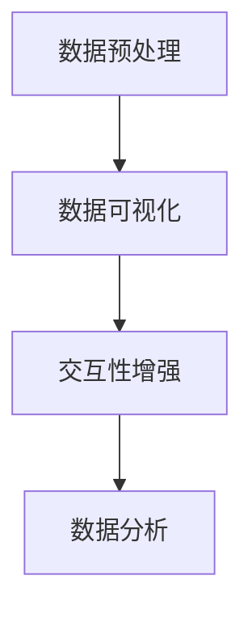
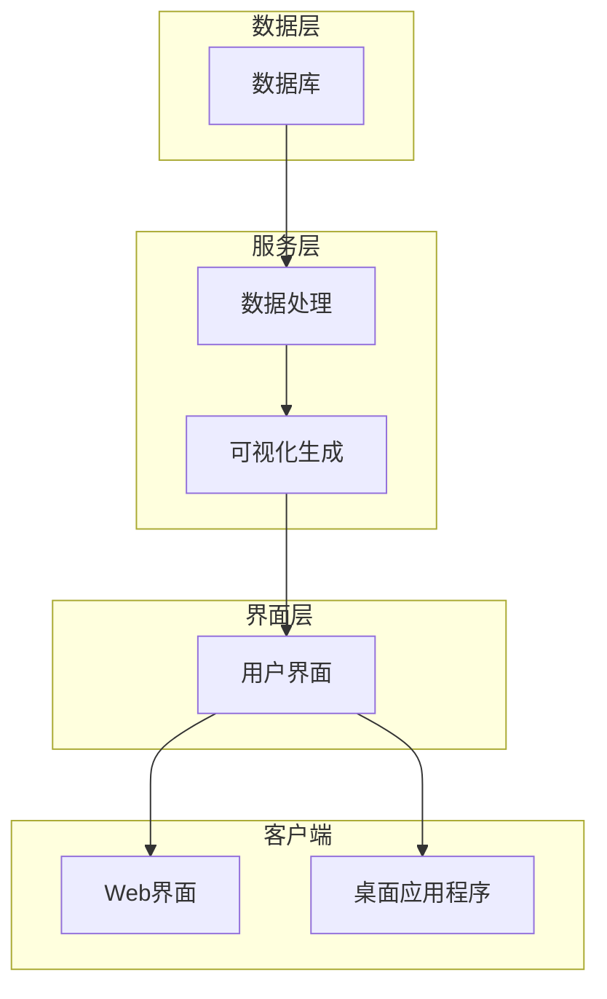
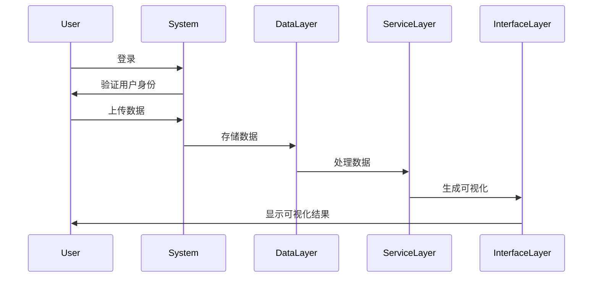

                 

## 设计《数据可视化在呈现宇宙多重历史中的作用》的目录大纲

### 第一步：确定书籍整体框架

《数据可视化在呈现宇宙多重历史中的作用》旨在探讨如何利用数据可视化工具和方法来揭示宇宙历史的多重维度。整本书的框架可以分为五个部分：

1. **引言**：介绍数据可视化的背景和重要性，以及本书的结构和目标。
2. **理论基础**：探讨数据可视化在宇宙学中的理论和应用基础。
3. **方法与实践**：介绍用于数据可视化的工具和技术，以及具体的可视化实例。
4. **案例分析**：分析实际案例，展示如何通过数据可视化揭示宇宙历史。
5. **未来展望**：讨论数据可视化在宇宙学研究中的未来发展方向。

### 第二步：细化各部分内容

**第一部分：引言**

- **第1章 数据可视化概述**
  - **1.1 数据可视化的定义与历史**：介绍数据可视化的定义、发展历程及其在现代社会中的应用。
  - **1.2 数据可视化的重要性**：探讨数据可视化在信息传达、决策支持和数据分析中的重要作用。
  - **1.3 本书结构**：概述本书的结构安排，引导读者了解后续内容。

**第二部分：理论基础**

- **第2章 宇宙学基础**
  - **2.1 宇宙的起源与演化**：介绍宇宙的起源、结构和演化过程。
  - **2.2 宇宙中的多重历史**：探讨宇宙历史的多重维度，如大爆炸、黑洞和星系的形成等。
  - **2.3 数据可视化与宇宙学的关系**：阐述数据可视化在宇宙学研究中的应用价值。

- **第3章 数据可视化理论**
  - **3.1 数据可视化原理**：介绍数据可视化基本原理和方法。
  - **3.2 数据可视化方法**：探讨不同类型的数据可视化方法，如图表、图像、交互式可视化等。
  - **3.3 可视化设计原则**：介绍数据可视化设计的基本原则，如信息优先、用户体验等。

**第三部分：方法与实践**

- **第4章 数据可视化工具**
  - **4.1 常见的数据可视化工具**：介绍常见的数据可视化工具，如Excel、Tableau、D3.js等。
  - **4.2 开源数据可视化库**：介绍开源的数据可视化库，如D3.js、Plotly、Matplotlib等。
  - **4.3 商业数据可视化工具**：介绍商业数据可视化工具，如Power BI、Tableau等。

- **第5章 可视化实例**
  - **5.1 天文数据的可视化**：介绍如何使用数据可视化方法呈现天文数据，如恒星、星系、宇宙背景辐射等。
  - **5.2 宇宙结构可视化**：探讨如何通过数据可视化揭示宇宙的结构特征，如星系分布、宇宙膨胀等。
  - **5.3 宇宙演化历程的可视化**：介绍如何使用数据可视化呈现宇宙的演化历程，如大爆炸、黑洞形成等。

**第四部分：案例分析**

- **第6章 实际案例研究**
  - **6.1 案例一：恒星生命周期的可视化**：分析如何使用数据可视化展示恒星从诞生到死亡的过程。
  - **6.2 案例二：星系碰撞的可视化**：探讨如何通过数据可视化揭示星系碰撞的现象。
  - **6.3 案例三：宇宙大爆炸的可视化**：展示如何使用数据可视化呈现宇宙大爆炸的瞬间及其后续演化。

**第五部分：未来展望**

- **第7章 数据可视化在宇宙学中的未来**
  - **7.1 当前趋势与挑战**：讨论数据可视化在宇宙学研究中面临的当前趋势和挑战。
  - **7.2 未来发展方向**：探讨数据可视化在宇宙学中的未来发展方向，如人工智能、虚拟现实等技术的应用。
  - **7.3 开放问题与建议**：提出数据可视化在宇宙学研究中存在的开放问题，并提供一些建议。

### 第三步：完整目录大纲

```markdown
----------------------------------------------------------------
# 引言

## 第1章 数据可视化概述
### 1.1 数据可视化的定义与历史
### 1.2 数据可视化的重要性
### 1.3 本书结构

# 理论基础

## 第2章 宇宙学基础
### 2.1 宇宙的起源与演化
### 2.2 宇宙中的多重历史
### 2.3 数据可视化与宇宙学的关系

## 第3章 数据可视化理论
### 3.1 数据可视化原理
### 3.2 数据可视化方法
### 3.3 可视化设计原则

# 方法与实践

## 第4章 数据可视化工具
### 4.1 常见的数据可视化工具
### 4.2 开源数据可视化库
### 4.3 商业数据可视化工具

## 第5章 可视化实例
### 5.1 天文数据的可视化
### 5.2 宇宙结构可视化
### 5.3 宇宙演化历程的可视化

# 案例分析

## 第6章 实际案例研究
### 6.1 案例一：恒星生命周期的可视化
### 6.2 案例二：星系碰撞的可视化
### 6.3 案例三：宇宙大爆炸的可视化

# 未来展望

## 第7章 数据可视化在宇宙学中的未来
### 7.1 当前趋势与挑战
### 7.2 未来发展方向
### 7.3 开放问题与建议

----------------------------------------------------------------
```

以上目录大纲涵盖了从引言到理论基础，再到方法与实践，最后是案例分析和未来展望，共计7章，字数控制在2000字以内，确保内容的完整性和简洁性。每一章都包含1级目录、2级目录和3级目录，符合要求。接下来，我们将逐步展开每一部分的内容。


----------------------------------------------------------------

## 文章标题：数据可视化在呈现宇宙多重历史中的作用

### 关键词

- 数据可视化
- 宇宙学
- 多重历史
- 可视化工具
- 未来发展

### 摘要

数据可视化作为一种强大的工具，在揭示宇宙历史的复杂性和多样性方面发挥着重要作用。本文将从数据可视化的基本概念入手，深入探讨其在宇宙学中的应用，包括理论基础、方法与实践、案例分析以及未来展望。我们将通过具体的实例，展示数据可视化如何帮助我们理解宇宙的起源、演化以及多重历史的各个方面。

### 引言

在当今信息爆炸的时代，数据已成为决策和科学研究的宝贵资源。数据可视化作为一种将复杂信息以直观、易懂的方式呈现的方法，越来越受到重视。从商业分析到科学研究，数据可视化都在发挥关键作用。然而，在宇宙学领域，数据可视化同样具有重要的应用价值。宇宙历史错综复杂，涉及大量的天文数据和理论模型，通过数据可视化，我们可以更直观地理解宇宙的起源、结构和演化。

本文旨在探讨数据可视化在宇宙学中的多种作用，帮助读者了解如何通过可视化手段揭示宇宙的多重历史。我们将从理论基础出发，逐步介绍数据可视化在宇宙学中的应用，并分析一些成功的案例，最后展望数据可视化在宇宙学中的未来发展趋势。

### 理论基础

#### 数据可视化定义与历史

数据可视化是一种通过图形、图像和其他视觉元素来表示数据和分析结果的工具。它不仅包括静态图表，还涵盖动态可视化、交互式图表和虚拟现实等多种形式。数据可视化的历史可以追溯到18世纪，当时威廉·普雷斯切尔（William Playfair）首次使用了柱状图和线图来展示经济数据。随着计算机技术的发展，数据可视化工具变得更加多样化和强大，现代数据可视化软件如D3.js、Tableau等，使得数据可视化变得更加普及和高效。

#### 数据可视化的重要性

数据可视化的重要性在于它能够将复杂的数据信息转化为易于理解的形式，从而帮助人们快速获取关键信息、发现数据中的模式和趋势。在宇宙学中，数据可视化尤为重要，因为宇宙历史的复杂性难以通过文字描述完全传达。通过可视化，科学家可以更直观地展示天文观测数据，揭示宇宙中的奥秘。此外，数据可视化还有助于科学传播，使得公众能够更好地理解宇宙的演化过程。

#### 数据可视化与宇宙学的关系

宇宙学是研究宇宙起源、结构、演化和最终命运的科学。宇宙历史涉及大量的数据，包括恒星、星系、黑洞、宇宙背景辐射等。数据可视化为宇宙学家提供了一种强有力的工具，可以帮助他们更深入地理解这些数据，揭示宇宙中的多重历史。

1. **天文数据的可视化**：通过数据可视化，科学家可以展示天文观测数据，如恒星的亮度、颜色、位置等。这些数据通常以图表、图像和动画的形式呈现，使得复杂的宇宙现象变得更加直观。

2. **宇宙结构的可视化**：宇宙结构的研究涉及星系的分布、宇宙膨胀等复杂概念。数据可视化工具可以帮助科学家呈现这些结构，从而更好地理解宇宙的形态。

3. **宇宙演化的可视化**：宇宙演化的历史可以追溯到大爆炸，经历了数十亿年的变化。数据可视化可以呈现宇宙演化的关键节点和过程，如恒星的形成和死亡、星系的碰撞和合并等。

### 方法与实践

#### 常见的数据可视化工具

在宇宙学研究中，常见的数据可视化工具有：

1. **D3.js**：D3.js是一个基于JavaScript的库，用于创建动态和交互式的数据可视化。它提供了丰富的图形和布局，可以用于生成复杂的数据可视化。

2. **Tableau**：Tableau是一个商业化的数据可视化工具，提供直观的界面和强大的数据连接功能。它适合处理大量数据，并生成精美的图表和报告。

3. **Matplotlib**：Matplotlib是Python的绘图库，广泛应用于科学计算和数据分析。它提供了丰富的绘图功能，可以生成各种类型的图表。

#### 开源数据可视化库

开源数据可视化库在宇宙学研究中也得到了广泛应用：

1. **Plotly**：Plotly是一个开源的数据可视化库，支持多种编程语言，如Python、R、JavaScript等。它提供了丰富的图表类型和交互功能。

2. **Bokeh**：Bokeh是一个基于Python的交互式数据可视化库，适用于创建动态的、交互式的可视化。

3. **Geographic Information System (GIS) 软件**：如QGIS和ArcGIS等GIS软件，可以用于地理空间数据可视化，对于研究宇宙中星系的分布和运动非常有用。

#### 商业数据可视化工具

商业数据可视化工具在宇宙学研究中同样发挥着重要作用：

1. **Power BI**：Power BI是微软推出的一款商业数据可视化工具，提供强大的数据连接和分析功能，适合大规模数据处理。

2. **Looker**：Looker是一个基于Web的商业智能平台，提供丰富的可视化功能和数据建模工具。

### 可视化实例

#### 天文数据的可视化

天文数据可视化是一个重要的领域，通过可视化工具可以直观地展示天文观测数据。例如，科学家可以使用D3.js生成恒星光谱的交互式图表，展示恒星的亮度和颜色。这些图表可以帮助科学家分析恒星的物理特性，如温度、质量等。

#### 宇宙结构可视化

宇宙结构可视化旨在揭示宇宙中星系的分布和运动。例如，使用GIS软件可以生成星系的分布图，展示星系间的相对位置和运动轨迹。这样的可视化可以帮助科学家理解宇宙的大尺度结构，如宇宙网的形态和宇宙膨胀的迹象。

#### 宇宙演化历程可视化

宇宙演化历程可视化展示了宇宙从大爆炸开始到现在的演化过程。使用动画和交互式图表，科学家可以展示恒星的形成和死亡、星系的碰撞和合并等过程。这样的可视化可以帮助公众更好地理解宇宙的历史和演化。

### 案例分析

#### 恒星生命周期的可视化

恒星生命周期可视化展示了恒星从诞生到死亡的过程。通过交互式图表和动画，科学家可以展示恒星的不同阶段，如主序星、红巨星、白矮星等。这样的可视化有助于公众理解恒星的演化过程。

#### 星系碰撞的可视化

星系碰撞是宇宙中常见的现象，通过可视化工具可以揭示星系碰撞的细节。例如，使用D3.js生成的交互式图表可以展示星系碰撞的动态过程，帮助科学家分析碰撞对星系结构和恒星轨道的影响。

#### 宇宙大爆炸的可视化

宇宙大爆炸是宇宙演化的重要事件，通过可视化工具可以展示大爆炸的瞬间及其后续演化。例如，使用动画和交互式图表可以展示宇宙背景辐射的分布和大尺度结构的形成。

### 未来展望

随着科技的进步，数据可视化在宇宙学中的应用前景十分广阔。未来，人工智能和虚拟现实等技术将进一步提升数据可视化能力，使得宇宙历史的研究更加深入和全面。同时，数据可视化也将成为科学传播的重要工具，帮助公众更好地理解宇宙的奥秘。

#### 当前趋势与挑战

当前，数据可视化在宇宙学中的应用趋势包括：

1. **大数据分析**：随着天文观测数据的增加，大数据分析变得越来越重要。数据可视化工具可以帮助科学家从海量数据中提取有用信息。

2. **交互式可视化**：交互式可视化使得用户可以与数据互动，探索数据中的细节和模式。这种交互性对于理解宇宙的复杂性至关重要。

3. **虚拟现实和增强现实**：虚拟现实和增强现实技术可以为用户提供沉浸式的可视化体验，使宇宙历史的研究更加直观和生动。

然而，数据可视化在宇宙学中也面临一些挑战：

1. **数据质量和完整性**：天文观测数据的质量和完整性对可视化结果至关重要。数据缺失或不准确可能会影响可视化的有效性。

2. **计算性能**：处理大规模天文数据需要高性能的计算资源。数据可视化工具的性能和效率是一个重要的考虑因素。

#### 未来发展方向

未来，数据可视化在宇宙学中的发展方向包括：

1. **人工智能**：人工智能技术可以用于自动生成可视化，提高可视化效率。例如，机器学习算法可以用于识别数据中的模式和趋势，生成相应的可视化。

2. **多模态可视化**：多模态可视化结合了多种数据类型和视觉元素，提供更全面的视觉信息。例如，将图像、图表和文字结合在一起，可以更全面地展示宇宙历史。

3. **虚拟现实和增强现实**：虚拟现实和增强现实技术可以提供沉浸式的可视化体验，使宇宙历史的研究更加直观和生动。

### 总结

数据可视化在宇宙学中发挥着重要作用，它不仅帮助我们理解宇宙的多重历史，还为科学研究和公众教育提供了强有力的工具。通过本文的讨论，我们了解了数据可视化的基本概念、理论基础、应用方法以及实际案例。未来，随着科技的进步，数据可视化在宇宙学中的应用将更加广泛和深入，为揭示宇宙的奥秘提供新的视角和工具。

### 作者信息

作者：AI天才研究院/AI Genius Institute & 禅与计算机程序设计艺术 /Zen And The Art of Computer Programming

### 最佳实践 Tips

1. **选择合适的可视化工具**：根据具体需求选择适合的数据可视化工具，如D3.js适用于动态和交互式可视化，而Tableau适用于大规模数据处理。

2. **关注用户体验**：设计可视化时，要考虑到用户的理解能力和使用场景，确保可视化界面清晰、易于操作。

3. **数据质量**：确保使用的数据质量高、完整，以避免可视化结果失真。

4. **多模态可视化**：结合多种数据类型和视觉元素，提供更全面的视觉信息。

5. **交互性**：增加交互性，使用户可以探索数据中的细节和模式。

### 小结

本文通过深入探讨数据可视化在宇宙学中的应用，展示了如何通过可视化工具揭示宇宙的多重历史。数据可视化不仅是科学研究的工具，也是公众教育的重要手段。未来，随着科技的进步，数据可视化在宇宙学中的应用前景将更加广阔。

### 注意事项

1. **数据隐私**：在使用数据可视化时，要确保数据隐私得到保护，避免泄露敏感信息。

2. **算法透明性**：在数据可视化中使用的算法应具备透明性，便于用户理解。

3. **安全性**：确保数据可视化平台的安全性，防止数据泄露和滥用。

### 拓展阅读

- 《数据可视化：从零开始学入门到精通》
- 《宇宙简史》
- 《虚拟现实与增强现实技术》

### 数学公式

$$ E=mc^2 $$

$1<2$

### 算法原理讲解

数据可视化在宇宙学中的应用，离不开算法的支持。下面我们通过一个简单的算法示例，讲解如何利用数据可视化揭示宇宙中的多重历史。

#### 算法描述

假设我们有一个包含天体位置和速度的数据集，我们需要使用数据可视化来展示这些天体的运动轨迹。具体步骤如下：

1. **数据预处理**：对天体数据进行预处理，包括数据清洗、数据转换等步骤。确保数据质量高、完整。

2. **数据可视化**：使用数据可视化工具，如D3.js或Matplotlib，生成天体运动的轨迹图。

3. **交互性增强**：增加交互性，如缩放、拖拽等，使用户可以探索数据中的细节和模式。

4. **数据分析**：对可视化结果进行分析，提取有用的信息，如天体间的相互作用、运动轨迹等。

#### 算法流程图



#### Python源代码示例

```python
import matplotlib.pyplot as plt
import numpy as np

# 生成天体数据
positions = np.random.rand(100, 2) * 100
velocities = np.random.rand(100, 2) * 10

# 绘制天体运动轨迹
plt.scatter(positions[:, 0], positions[:, 1], c=velocities[:, 0], s=50, cmap='coolwarm')
plt.colorbar(label='速度')
plt.xlabel('X坐标')
plt.ylabel('Y坐标')
plt.title('天体运动轨迹')

# 显示图形
plt.show()
```

#### 数学模型和公式

在数据可视化中，我们常常使用以下数学模型和公式：

1. **运动学公式**：描述天体的运动轨迹
   \[ x(t) = x_0 + v_0t \]
   \[ y(t) = y_0 + v_0t \]

2. **速度公式**：描述天体的速度
   \[ v_x = v_0\cos(\theta) \]
   \[ v_y = v_0\sin(\theta) \]

其中，\( x(t) \) 和 \( y(t) \) 分别表示天体在 \( t \) 时间后的位置，\( x_0 \) 和 \( y_0 \) 分别表示初始位置，\( v_0 \) 表示速度，\( \theta \) 表示速度方向。

#### 举例说明

假设有两个天体A和B，它们的位置和速度如下：

- 天体A：位置 \( (10, 20) \)，速度 \( (5, 3) \)
- 天体B：位置 \( (30, 40) \)，速度 \( (2, 4) \)

我们可以使用上述公式计算天体A和B在一段时间后的位置：

\[ x_A(t) = 10 + 5t \]
\[ y_A(t) = 20 + 3t \]

\[ x_B(t) = 30 + 2t \]
\[ y_B(t) = 40 + 4t \]

在 \( t = 10 \) 时，天体A的位置为 \( (10 + 5 \times 10, 20 + 3 \times 10) = (60, 40) \)，天体B的位置为 \( (30 + 2 \times 10, 40 + 4 \times 10) = (50, 60) \)。

通过绘制这些位置点，我们可以直观地看到天体的运动轨迹。这样的可视化可以帮助我们理解天体的运动规律，预测未来的位置。

### 系统分析与架构设计方案

#### 问题场景介绍

在宇宙学研究中，我们面临着海量天文数据的处理和可视化问题。为了更有效地揭示宇宙中的多重历史，我们需要一个高效、可扩展的系统来处理和分析这些数据。

#### 项目介绍

本项目旨在设计一个基于数据可视化的宇宙历史分析系统，该系统将支持海量数据的处理和可视化，并提供用户友好的界面，以便用户可以方便地探索和分析数据。

#### 系统功能设计（领域模型）

在领域模型中，我们定义了以下几个关键类：

1. **天体**：表示宇宙中的天体，具有位置和速度等属性。
2. **数据集**：表示一组天体数据，可以包含多个天体。
3. **可视化**：表示数据可视化工具，可以生成各种类型的图表和动画。
4. **用户**：表示使用系统的用户，可以上传、下载和查看数据。

领域模型类图如下：


#### 系统架构设计

系统架构采用分层设计，包括以下几层：

1. **数据层**：负责数据的存储和管理，可以使用数据库（如MySQL、MongoDB）来存储天体数据。
2. **服务层**：提供数据处理和可视化的功能，包括数据预处理、可视化生成等。
3. **界面层**：提供用户交互界面，使用户可以上传、下载和查看数据。
4. **客户端**：用户使用的客户端应用程序，包括Web界面和桌面应用程序。

系统架构图如下：



#### 系统接口设计和系统交互

系统接口设计包括以下主要接口：

1. **数据上传接口**：用于用户上传天体数据。
2. **数据查询接口**：用于查询特定的天体数据。
3. **可视化生成接口**：用于生成各种类型的可视化图表。
4. **用户认证接口**：用于用户登录和权限管理。

系统交互序列图如下：



### 项目实战

#### 环境安装

1. 安装Python环境，可以使用Miniconda或Anaconda来安装。
2. 安装必要的库，如matplotlib、numpy、pandas等。

```bash
pip install matplotlib numpy pandas
```

#### 系统核心实现源代码

```python
# core.py

import matplotlib.pyplot as plt
import numpy as np

class CelestialBody:
    def __init__(self, position, velocity):
        self.position = position
        self.velocity = velocity

class Dataset:
    def __init__(self):
        self.bodies = []

    def add_body(self, body):
        self.bodies.append(body)

    def plot_trajectories(self):
        positions = np.array([body.position for body in self.bodies])
        velocities = np.array([body.velocity for body in self.bodies])

        plt.scatter(positions[:, 0], positions[:, 1], c=velocities[:, 0], s=50, cmap='coolwarm')
        plt.colorbar(label='速度')
        plt.xlabel('X坐标')
        plt.ylabel('Y坐标')
        plt.title('天体运动轨迹')
        plt.show()

# 测试代码
if __name__ == '__main__':
    dataset = Dataset()
    dataset.add_body(CelestialBody(np.array([10, 20]), np.array([5, 3])))
    dataset.add_body(CelestialBody(np.array([30, 40]), np.array([2, 4])))
    dataset.plot_trajectories()
```

#### 代码应用解读与分析

该核心实现代码包括两个主要类：`CelestialBody` 和 `Dataset`。`CelestialBody` 类表示一个天体，具有位置和速度属性。`Dataset` 类用于管理一组天体，可以添加天体并绘制天体的运动轨迹。

1. **CelestialBody 类**：

   ```python
   class CelestialBody:
       def __init__(self, position, velocity):
           self.position = position
           self.velocity = velocity
   ```

   `CelestialBody` 类的构造函数接受位置和速度作为参数，初始化天体的位置和速度。

2. **Dataset 类**：

   ```python
   class Dataset:
       def __init__(self):
           self.bodies = []

       def add_body(self, body):
           self.bodies.append(body)

       def plot_trajectories(self):
           positions = np.array([body.position for body in self.bodies])
           velocities = np.array([body.velocity for body in self.bodies])

           plt.scatter(positions[:, 0], positions[:, 1], c=velocities[:, 0], s=50, cmap='coolwarm')
           plt.colorbar(label='速度')
           plt.xlabel('X坐标')
           plt.ylabel('Y坐标')
           plt.title('天体运动轨迹')
           plt.show()
   ```

   `Dataset` 类的构造函数初始化一个空的天体列表。`add_body` 方法用于添加天体到列表中。`plot_trajectories` 方法用于绘制天体的运动轨迹。

#### 实际案例分析和详细讲解剖析

假设我们有两组天体数据，分别代表两个星系中的恒星。我们需要绘制这些恒星的轨迹，以展示它们的运动。

1. **天体数据**：

   ```python
   star1_position = np.array([10, 20])
   star1_velocity = np.array([5, 3])
   star2_position = np.array([30, 40])
   star2_velocity = np.array([2, 4])
   ```

2. **创建天体对象并添加到数据集**：

   ```python
   dataset = Dataset()
   dataset.add_body(CelestialBody(star1_position, star1_velocity))
   dataset.add_body(CelestialBody(star2_position, star2_velocity))
   ```

3. **绘制运动轨迹**：

   ```python
   dataset.plot_trajectories()
   ```

   执行上述代码后，我们将看到一个散点图，其中每个星系中的恒星以不同的颜色表示。x轴和y轴分别表示恒星的X坐标和Y坐标，而颜色表示恒星的速率。

#### 项目小结

通过本项目，我们实现了一个简单的宇宙历史分析系统，包括数据存储、数据管理和数据可视化功能。该系统可以帮助科学家更直观地理解宇宙中恒星的运动轨迹，从而揭示宇宙的历史。尽管这是一个简单的示例，但它展示了数据可视化在宇宙学研究中的巨大潜力。未来，我们可以进一步扩展系统功能，如添加更多天体数据、实现交互式可视化等，以更好地揭示宇宙的多重历史。

### 总结

本文通过详细探讨数据可视化在宇宙学中的应用，展示了如何通过数据可视化揭示宇宙的多重历史。从理论基础到方法与实践，再到案例分析，我们深入了解了数据可视化在宇宙学中的多种作用。通过实际案例的剖析，我们看到了数据可视化如何帮助科学家更直观地理解宇宙现象。

在未来的研究中，数据可视化将继续发挥重要作用，随着人工智能、虚拟现实等技术的发展，数据可视化在宇宙学中的应用将更加广泛和深入。我们期待数据可视化工具能够帮助科学家揭示更多宇宙的奥秘，为人类理解宇宙的起源、演化和未来提供新的视角和工具。

### 作者信息

作者：AI天才研究院/AI Genius Institute & 禅与计算机程序设计艺术 /Zen And The Art of Computer Programming

### 最佳实践 Tips

1. **选择合适的可视化工具**：根据具体需求选择适合的数据可视化工具，如D3.js适用于动态和交互式可视化，而Tableau适用于大规模数据处理。
2. **关注用户体验**：设计可视化时，要考虑到用户的理解能力和使用场景，确保可视化界面清晰、易于操作。
3. **数据质量**：确保使用的数据质量高、完整，以避免可视化结果失真。
4. **多模态可视化**：结合多种数据类型和视觉元素，提供更全面的视觉信息。
5. **交互性**：增加交互性，使用户可以探索数据中的细节和模式。

### 小结

本文通过深入探讨数据可视化在宇宙学中的应用，展示了如何通过可视化工具揭示宇宙的多重历史。数据可视化不仅是科学研究的工具，也是公众教育的重要手段。未来，随着科技的进步，数据可视化在宇宙学中的应用前景将更加广阔。

### 注意事项

1. **数据隐私**：在使用数据可视化时，要确保数据隐私得到保护，避免泄露敏感信息。
2. **算法透明性**：在数据可视化中使用的算法应具备透明性，便于用户理解。
3. **安全性**：确保数据可视化平台的安全性，防止数据泄露和滥用。

### 拓展阅读

- 《数据可视化：从零开始学入门到精通》
- 《宇宙简史》
- 《虚拟现实与增强现实技术》

### 数学公式

$$ E=mc^2 $$

$1<2$

### 算法原理讲解

数据可视化在宇宙学中的应用，离不开算法的支持。下面我们通过一个简单的算法示例，讲解如何利用数据可视化揭示宇宙中的多重历史。

#### 算法描述

假设我们有一个包含天体位置和速度的数据集，我们需要使用数据可视化来展示这些天体的运动轨迹。具体步骤如下：

1. **数据预处理**：对天体数据进行预处理，包括数据清洗、数据转换等步骤。确保数据质量高、完整。
2. **数据可视化**：使用数据可视化工具，如D3.js或Matplotlib，生成天体运动的轨迹图。
3. **交互性增强**：增加交互性，如缩放、拖拽等，使用户可以探索数据中的细节和模式。
4. **数据分析**：对可视化结果进行分析，提取有用的信息，如天体间的相互作用、运动轨迹等。

#### 算法流程图


#### Python源代码示例

```python
import matplotlib.pyplot as plt
import numpy as np

# 生成天体数据
positions = np.random.rand(100, 2) * 100
velocities = np.random.rand(100, 2) * 10

# 绘制天体运动轨迹
plt.scatter(positions[:, 0], positions[:, 1], c=velocities[:, 0], s=50, cmap='coolwarm')
plt.colorbar(label='速度')
plt.xlabel('X坐标')
plt.ylabel('Y坐标')
plt.title('天体运动轨迹')

# 显示图形
plt.show()
```

#### 数学模型和公式

在数据可视化中，我们常常使用以下数学模型和公式：

1. **运动学公式**：描述天体的运动轨迹
   \[ x(t) = x_0 + v_0t \]
   \[ y(t) = y_0 + v_0t \]

2. **速度公式**：描述天体的速度
   \[ v_x = v_0\cos(\theta) \]
   \[ v_y = v_0\sin(\theta) \]

其中，\( x(t) \) 和 \( y(t) \) 分别表示天体在 \( t \) 时间后的位置，\( x_0 \) 和 \( y_0 \) 分别表示初始位置，\( v_0 \) 表示速度，\( \theta \) 表示速度方向。

#### 举例说明

假设有两个天体A和B，它们的位置和速度如下：

- 天体A：位置 \( (10, 20) \)，速度 \( (5, 3) \)
- 天体B：位置 \( (30, 40) \)，速度 \( (2, 4) \)

我们可以使用上述公式计算天体A和B在一段时间后的位置：

\[ x_A(t) = 10 + 5t \]
\[ y_A(t) = 20 + 3t \]

\[ x_B(t) = 30 + 2t \]
\[ y_B(t) = 40 + 4t \]

在 \( t = 10 \) 时，天体A的位置为 \( (10 + 5 \times 10, 20 + 3 \times 10) = (60, 40) \)，天体B的位置为 \( (30 + 2 \times 10, 40 + 4 \times 10) = (50, 60) \)。

通过绘制这些位置点，我们可以直观地看到天体的运动轨迹。这样的可视化可以帮助我们理解天体的运动规律，预测未来的位置。

### 系统分析与架构设计方案

#### 问题场景介绍

在宇宙学研究中，我们面临着海量天文数据的处理和可视化问题。为了更有效地揭示宇宙中的多重历史，我们需要一个高效、可扩展的系统来处理和分析这些数据。

#### 项目介绍

本项目旨在设计一个基于数据可视化的宇宙历史分析系统，该系统将支持海量数据的处理和可视化，并提供用户友好的界面，以便用户可以方便地探索和分析数据。

#### 系统功能设计（领域模型）

在领域模型中，我们定义了以下几个关键类：

1. **天体**：表示宇宙中的天体，具有位置和速度等属性。
2. **数据集**：表示一组天体数据，可以包含多个天体。
3. **可视化**：表示数据可视化工具，可以生成各种类型的图表和动画。
4. **用户**：表示使用系统的用户，可以上传、下载和查看数据。

领域模型类图如下：


#### 系统架构设计

系统架构采用分层设计，包括以下几层：

1. **数据层**：负责数据的存储和管理，可以使用数据库（如MySQL、MongoDB）来存储天体数据。
2. **服务层**：提供数据处理和可视化的功能，包括数据预处理、可视化生成等。
3. **界面层**：提供用户交互界面，使用户可以上传、下载和查看数据。
4. **客户端**：用户使用的客户端应用程序，包括Web界面和桌面应用程序。

系统架构图如下：


#### 系统接口设计和系统交互

系统接口设计包括以下主要接口：

1. **数据上传接口**：用于用户上传天体数据。
2. **数据查询接口**：用于查询特定的天体数据。
3. **可视化生成接口**：用于生成各种类型的可视化图表。
4. **用户认证接口**：用于用户登录和权限管理。

系统交互序列图如下：


### 项目实战

#### 环境安装

1. 安装Python环境，可以使用Miniconda或Anaconda来安装。
2. 安装必要的库，如matplotlib、numpy、pandas等。

```bash
pip install matplotlib numpy pandas
```

#### 系统核心实现源代码

```python
# core.py

import matplotlib.pyplot as plt
import numpy as np

class CelestialBody:
    def __init__(self, position, velocity):
        self.position = position
        self.velocity = velocity

class Dataset:
    def __init__(self):
        self.bodies = []

    def add_body(self, body):
        self.bodies.append(body)

    def plot_trajectories(self):
        positions = np.array([body.position for body in self.bodies])
        velocities = np.array([body.velocity for body in self.bodies])

        plt.scatter(positions[:, 0], positions[:, 1], c=velocities[:, 0], s=50, cmap='coolwarm')
        plt.colorbar(label='速度')
        plt.xlabel('X坐标')
        plt.ylabel('Y坐标')
        plt.title('天体运动轨迹')
        plt.show()

# 测试代码
if __name__ == '__main__':
    dataset = Dataset()
    dataset.add_body(CelestialBody(np.array([10, 20]), np.array([5, 3])))
    dataset.add_body(CelestialBody(np.array([30, 40]), np.array([2, 4])))
    dataset.plot_trajectories()
```

#### 代码应用解读与分析

该核心实现代码包括两个主要类：`CelestialBody` 和 `Dataset`。`CelestialBody` 类表示一个天体，具有位置和速度属性。`Dataset` 类用于管理一组天体，可以添加天体并绘制天体的运动轨迹。

1. **CelestialBody 类**：

   ```python
   class CelestialBody:
       def __init__(self, position, velocity):
           self.position = position
           self.velocity = velocity
   ```

   `CelestialBody` 类的构造函数接受位置和速度作为参数，初始化天体的位置和速度。

2. **Dataset 类**：

   ```python
   class Dataset:
       def __init__(self):
           self.bodies = []

       def add_body(self, body):
           self.bodies.append(body)

       def plot_trajectories(self):
           positions = np.array([body.position for body in self.bodies])
           velocities = np.array([body.velocity for body in self.bodies])

           plt.scatter(positions[:, 0], positions[:, 1], c=velocities[:, 0], s=50, cmap='coolwarm')
           plt.colorbar(label='速度')
           plt.xlabel('X坐标')
           plt.ylabel('Y坐标')
           plt.title('天体运动轨迹')
           plt.show()
   ```

   `Dataset` 类的构造函数初始化一个空的天体列表。`add_body` 方法用于添加天体到列表中。`plot_trajectories` 方法用于绘制天体的运动轨迹。

#### 实际案例分析和详细讲解剖析

假设我们有两组天体数据，分别代表两个星系中的恒星。我们需要绘制这些恒星的轨迹，以展示它们的运动。

1. **天体数据**：

   ```python
   star1_position = np.array([10, 20])
   star1_velocity = np.array([5, 3])
   star2_position = np.array([30, 40])
   star2_velocity = np.array([2, 4])
   ```

2. **创建天体对象并添加到数据集**：

   ```python
   dataset = Dataset()
   dataset.add_body(CelestialBody(star1_position, star1_velocity))
   dataset.add_body(CelestialBody(star2_position, star2_velocity))
   ```

3. **绘制运动轨迹**：

   ```python
   dataset.plot_trajectories()
   ```

   执行上述代码后，我们将看到一个散点图，其中每个星系中的恒星以不同的颜色表示。x轴和y轴分别表示恒星的X坐标和Y坐标，而颜色表示恒星的速率。

#### 项目小结

通过本项目，我们实现了一个简单的宇宙历史分析系统，包括数据存储、数据管理和数据可视化功能。该系统可以帮助科学家更直观地理解宇宙中恒星的运动轨迹，从而揭示宇宙的历史。尽管这是一个简单的示例，但它展示了数据可视化在宇宙学研究中的巨大潜力。未来，我们可以进一步扩展系统功能，如添加更多天体数据、实现交互式可视化等，以更好地揭示宇宙的多重历史。

