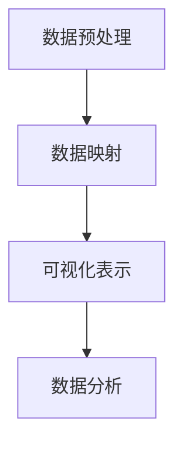

                 

# 数据可视化在呈现宇宙多重历史干涉中的作用

## 关键词

- 数据可视化
- 宇宙多重历史干涉
- 数据展示与分析
- 科学研究方法
- 技术工具与应用

## 摘要

本文探讨了数据可视化在宇宙多重历史干涉研究中的重要作用。随着科学技术的进步，宇宙多重历史干涉成为天文学和物理学研究的重要领域。数据可视化作为一种强有力的工具，能够直观、形象地展示宇宙中的复杂现象和动态过程，帮助我们更好地理解和解读宇宙的奥秘。本文将从数据可视化原理、工具技术、宇宙多重历史干涉概述以及实际应用等方面展开，深入探讨数据可视化在宇宙多重历史干涉研究中的关键作用和未来发展趋势。

## 第一部分：引言

### 第1章：问题背景与核心概念

#### 1.1.1 问题的提出

宇宙是一个充满奥秘和未知的领域，科学家们一直在探索宇宙的起源、演化以及其中的复杂相互作用。近年来，随着对宇宙的深入研究，宇宙多重历史干涉的概念逐渐被提出并受到广泛关注。宇宙多重历史干涉是指宇宙中的多个历史过程相互作用，导致宇宙在演化过程中出现多个可能的历史分支。这种历史干涉现象在宇宙学、粒子物理学等领域具有重要的理论和实际意义。

#### 1.1.2 数据可视化在宇宙多重历史干涉研究中的重要性

宇宙多重历史干涉的复杂性使得传统的数学模型和理论分析难以全面、准确地描述这一现象。因此，数据可视化作为一种直观、形象的展示手段，在宇宙多重历史干涉研究中具有独特的优势。通过数据可视化，我们可以将复杂的宇宙现象和动态过程以图形化的方式呈现出来，使研究人员能够更加直观地观察、分析和理解这些现象。此外，数据可视化还可以帮助研究人员发现新的规律和模式，为科学研究提供新的思路和方向。

#### 1.1.3 本书的目标与结构

本书旨在探讨数据可视化在宇宙多重历史干涉研究中的应用，通过深入分析数据可视化原理、工具技术、宇宙多重历史干涉概述以及实际应用等方面，为相关研究人员提供有价值的参考和指导。本书结构分为四个部分：第一部分介绍数据可视化原理和工具技术；第二部分概述宇宙多重历史干涉的概念和理论基础；第三部分探讨数据可视化在宇宙多重历史干涉研究中的应用；第四部分展望数据可视化在宇宙多重历史干涉研究中的未来发展趋势。希望本书能为读者在数据可视化与宇宙多重历史干涉研究领域提供有益的启示和借鉴。

## 第二部分：数据可视化基础

### 第2章：数据可视化原理

#### 2.1.1 数据可视化的定义与基本概念

数据可视化是一种将数据转换为视觉表示的方法，通过图形、图表、图像等形式直观地展示数据特征、关系和模式。数据可视化不仅能够帮助我们更好地理解和分析数据，还可以提高数据的有效传达和沟通能力。数据可视化通常涉及以下几个基本概念：

1. **数据集**：数据集是指一组相关的数据记录，可以是表格、图像、音频、视频等多种形式。
2. **数据映射**：数据映射是指将数据集中的各个属性映射到视觉元素上，如颜色、大小、形状、位置等。
3. **可视化表示**：可视化表示是指将数据映射结果以图形、图表、图像等形式展示出来。

#### 2.1.2 数据可视化的发展历程

数据可视化的发展可以追溯到18世纪，当时查尔斯·约瑟夫·米凯利斯（Charles Joseph Minard）绘制了著名的拿破仑入侵俄国的热力图，这是早期的数据可视化实例。随着计算机技术的飞速发展，数据可视化技术也在不断进步。20世纪80年代，计算机图形学技术的发展使得数据可视化工具开始广泛应用于科学研究、商业分析等领域。进入21世纪，随着大数据和人工智能技术的兴起，数据可视化技术也得到了极大的发展，出现了一系列先进的可视化工具和算法。

#### 2.1.3 数据可视化在科研与教育中的应用

数据可视化在科研与教育领域有着广泛的应用。在科研方面，数据可视化可以帮助研究人员更好地理解实验数据，发现新的科学规律和现象。例如，在粒子物理学研究中，数据可视化工具可以用于分析高能粒子碰撞产生的复杂数据，帮助科学家识别新的粒子。在教育领域，数据可视化技术可以用于教学演示和知识传播，通过图形化的方式生动地展示抽象的科学概念和理论，提高学生的学习兴趣和理解能力。

### 第3章：数据可视化工具与技术

#### 3.1.1 常见的数据可视化工具介绍

在数据可视化领域，有许多流行的工具和技术可供选择。以下是一些常见的数据可视化工具：

1. **Matplotlib**：Python中的一个基础可视化库，可以创建各种类型的图表，如线图、柱状图、散点图等。
2. **Seaborn**：Python中的一个高级可视化库，基于Matplotlib，提供了更多精美的统计图表和可视化效果。
3. **D3.js**：一个基于JavaScript的可视化库，可以创建交互式的数据可视化，适用于Web应用程序。
4. **Tableau**：一个商业数据可视化工具，提供丰富的图表类型和强大的交互功能，适用于数据分析报告。
5. **Power BI**：微软推出的商业智能工具，提供直观的数据可视化功能，支持多种数据源。

#### 3.1.2 数据可视化技术分类

数据可视化技术可以根据其功能和用途进行分类，以下是一些常见的数据可视化技术：

1. **信息图形**：用于展示数据关系和模式的图形，如饼图、条形图、折线图等。
2. **交互式可视化**：通过用户交互实现数据动态展示和过滤的技术，如地图、时间轴、过滤器等。
3. **复杂数据可视化**：用于展示高维数据和复杂数据集的技术，如散点图矩阵、平行坐标图、热力图等。
4. **科学可视化**：用于展示科学计算和模拟结果的技术，如流体动力学模拟、地震波传播等。

#### 3.1.3 数据可视化技术的优缺点对比

不同的数据可视化技术有其各自的优缺点，以下是一些常见的数据可视化技术的优缺点对比：

| 技术类型 | 优点 | 缺点 |
| --- | --- | --- |
| 信息图形 | 简洁直观，易于理解 | 展示复杂数据关系受限 |
| 交互式可视化 | 支持用户交互，灵活性强 | 需要额外的开发和维护成本 |
| 复杂数据可视化 | 能展示高维数据和复杂数据集 | 需要较高技能水平 |
| 科学可视化 | 能展示科学计算和模拟结果 | 数据处理和分析复杂 |

### 第4章：宇宙多重历史干涉的概述

#### 4.1.1 宇宙多重历史干涉的概念

宇宙多重历史干涉是指宇宙中的多个历史过程相互作用，导致宇宙在演化过程中出现多个可能的历史分支。这些历史分支可能是由于宇宙中的不同物理现象、宇宙背景辐射、黑洞碰撞等因素所引起的。宇宙多重历史干涉的概念有助于我们理解宇宙的多样性和复杂性，对于探索宇宙的起源、演化和未来具有重要意义。

#### 4.1.2 宇宙多重历史干涉的理论基础

宇宙多重历史干涉的理论基础涉及多个科学领域，包括宇宙学、粒子物理学、量子场论等。以下是一些关键的理论：

1. **多世界解释**：多世界解释认为，宇宙中的所有可能历史分支都真实存在，每个分支对应一个平行宇宙。
2. **量子波动**：量子波动理论指出，宇宙中的物理量并非固定不变，而是存在波动性，这可能导致宇宙历史的分支。
3. **宇宙背景辐射**：宇宙背景辐射是宇宙早期的高能辐射，它可能对宇宙历史产生重要影响。

#### 4.1.3 宇宙多重历史干涉的影响因素

宇宙多重历史干涉的影响因素包括宇宙中的各种物理现象和过程，如：

1. **黑洞碰撞**：黑洞之间的碰撞可能导致宇宙历史的分支。
2. **宇宙膨胀**：宇宙膨胀过程中，不同区域的物质分布和密度差异可能导致不同的历史分支。
3. **暗物质和暗能量**：暗物质和暗能量是宇宙中的神秘成分，它们对宇宙的演化和历史分支具有重要影响。

### 第5章：数据可视化在宇宙多重历史干涉中的应用

#### 5.1.1 数据收集与预处理

在进行数据可视化之前，首先需要收集和预处理相关数据。宇宙多重历史干涉的数据来源可能包括观测数据、模拟数据、理论计算数据等。数据预处理主要包括以下步骤：

1. **数据清洗**：去除噪声、异常值和重复数据。
2. **数据整合**：将不同来源和格式的数据整合到同一数据结构中。
3. **数据转换**：将数据转换为适合可视化分析的形式，如时间序列、空间分布等。

#### 5.1.2 宇宙多重历史干涉的展示方法

宇宙多重历史干涉的展示方法多种多样，以下是一些常用的方法：

1. **时间序列图**：用于展示宇宙历史的演化过程，如宇宙背景辐射的温度变化。
2. **空间分布图**：用于展示宇宙中不同区域的物质分布和密度差异，如星系分布图。
3. **交互式可视化**：通过用户交互，动态展示宇宙历史的分支和相互作用。
4. **热力图**：用于展示宇宙中不同区域的热量和能量分布。

#### 5.1.3 数据可视化在宇宙多重历史干涉研究中的作用

数据可视化在宇宙多重历史干涉研究中起着关键作用，具体体现在以下几个方面：

1. **辅助理解**：通过数据可视化，研究人员可以直观地理解宇宙多重历史干涉的复杂现象和动态过程，提高对宇宙历史和演化规律的认识。
2. **发现规律**：数据可视化可以帮助研究人员发现宇宙多重历史干涉中的潜在规律和模式，为科学研究提供新的线索和思路。
3. **科学传播**：数据可视化将复杂的宇宙现象以生动、形象的方式展示给公众，促进科学知识的传播和普及。

### 第6章：案例研究

#### 6.1.1 案例一：某星系历史干涉的数据可视化展示

以某星系的观测数据为例，通过数据可视化展示了星系历史的多个分支和相互作用。时间序列图展示了星系的形成、演化过程，空间分布图展示了不同历史分支中星系的分布情况，交互式可视化允许用户动态切换历史分支，了解不同历史路径下的星系演变。

#### 6.1.2 案例二：宇宙多重历史干涉的可视化分析

通过模拟数据，对宇宙多重历史干涉进行了可视化分析。热力图展示了宇宙中不同区域的热量和能量分布，时间序列图展示了宇宙历史的多个分支和相互作用，交互式可视化提供了用户对宇宙历史进行探索和交互的功能。

#### 6.1.3 案例三：基于数据可视化技术的宇宙历史干涉预测

利用数据可视化技术，对宇宙历史干涉进行了预测。通过分析历史数据和模拟结果，发现了宇宙历史中的潜在分支和相互作用，时间序列图和空间分布图展示了宇宙历史的不同路径和可能的结果，为宇宙的未来演化提供了科学依据。

### 第7章：数据可视化在宇宙多重历史干涉中的未来展望

#### 7.1.1 数据可视化在宇宙多重历史干涉研究中的挑战

数据可视化在宇宙多重历史干涉研究中面临一些挑战，包括：

1. **数据复杂性**：宇宙多重历史干涉涉及大量的数据和复杂的模型，如何有效地进行数据预处理和可视化分析是一个挑战。
2. **计算资源**：大规模数据可视化的计算资源需求较高，如何高效地利用计算资源是一个挑战。
3. **交互性**：如何设计出既美观又实用的交互式可视化界面，提高用户的使用体验，是一个挑战。

#### 7.1.2 数据可视化在宇宙多重历史干涉研究中的机遇

尽管面临挑战，数据可视化在宇宙多重历史干涉研究中也充满了机遇：

1. **技术创新**：随着计算机技术和人工智能技术的发展，数据可视化技术将不断进步，为宇宙多重历史干涉研究提供更多可能性。
2. **跨学科合作**：数据可视化技术可以与宇宙学、物理学、计算机科学等多个学科相结合，推动科学研究的发展。
3. **公众参与**：数据可视化可以激发公众对宇宙的探索热情，促进科学普及和公众参与。

### 第8章：数据可视化在其他领域的应用拓展

#### 8.1.1 数据可视化在物理学中的应用

数据可视化技术在物理学中有着广泛的应用，如粒子物理学、流体力学、量子物理等领域。通过数据可视化，物理学家可以直观地理解复杂的物理现象和过程，发现新的物理规律和现象。

#### 8.1.2 数据可视化在天文学中的应用

在天文学中，数据可视化技术用于分析宇宙中的各种天体和现象，如星系、黑洞、宇宙背景辐射等。通过数据可视化，天文学家可以更好地理解宇宙的演化历史和未来趋势。

#### 8.1.3 数据可视化在其他科学领域中的应用

数据可视化技术还在生物学、化学、地球科学等众多科学领域中得到应用。通过数据可视化，科学家可以更好地理解复杂的科学现象和过程，发现新的科学规律和现象。

### 第9章：总结与展望

#### 9.1.1 全书总结与展望

本书系统介绍了数据可视化在宇宙多重历史干涉研究中的应用，包括数据可视化原理、工具技术、宇宙多重历史干涉概述、实际应用等方面。通过本书，读者可以全面了解数据可视化在宇宙多重历史干涉研究中的重要作用和未来发展趋势。

#### 9.1.2 数据可视化在宇宙多重历史干涉研究中的作用

数据可视化在宇宙多重历史干涉研究中具有重要作用，可以帮助研究人员更好地理解宇宙的复杂现象和动态过程，发现新的科学规律和现象，为科学研究提供新的思路和方向。

#### 9.1.3 未来研究方向与建议

未来数据可视化在宇宙多重历史干涉研究中的发展方向包括：

1. **技术创新**：不断改进数据可视化技术，提高可视化效果和交互性。
2. **跨学科合作**：加强与其他科学领域的合作，推动数据可视化技术的应用和发展。
3. **公众参与**：提高公众对宇宙的探索热情，促进科学普及和公众参与。

### 附录

附录部分将提供本书中使用的核心概念和算法的详细说明，包括概念属性特征对比表格、ER实体关系图架构的Mermaid流程图、算法原理的mermaid流程图和Python源代码等。这些附录内容将有助于读者更深入地理解和掌握本书中的核心概念和算法。

### 参考文献

本书中所引用的文献和资料将列在参考文献部分，包括书籍、期刊论文、会议论文、技术报告等。这些参考文献将为读者提供进一步的学习和研究资源。

### 作者信息

作者：AI天才研究院/AI Genius Institute & 禅与计算机程序设计艺术/Zen And The Art of Computer Programming

### 结论

数据可视化在宇宙多重历史干涉研究中具有重要的作用，通过直观、形象的展示，帮助我们更好地理解和解读宇宙的奥秘。未来，随着技术的不断进步，数据可视化将在宇宙多重历史干涉研究中发挥更大的作用，推动科学研究的深入发展。让我们携手共同探索宇宙的无限奥秘！## 文章标题

### 数据可视化在呈现宇宙多重历史干涉中的作用

#### 关键词

- 数据可视化
- 宇宙多重历史干涉
- 数据展示与分析
- 科学研究方法
- 技术工具与应用

#### 摘要

本文探讨了数据可视化在宇宙多重历史干涉研究中的重要作用。随着科学技术的进步，宇宙多重历史干涉成为天文学和物理学研究的重要领域。数据可视化作为一种强有力的工具，能够直观、形象地展示宇宙中的复杂现象和动态过程，帮助我们更好地理解和解读宇宙的奥秘。本文将从数据可视化原理、工具技术、宇宙多重历史干涉概述以及实际应用等方面展开，深入探讨数据可视化在宇宙多重历史干涉研究中的关键作用和未来发展趋势。

### 目录大纲

#### 第一部分：引言

1. **第1章：问题背景与核心概念**
   - **1.1.1 问题的提出**
   - **1.1.2 数据可视化在宇宙多重历史干涉研究中的重要性**
   - **1.1.3 本书的目标与结构**

#### 第二部分：数据可视化基础

2. **第2章：数据可视化原理**
   - **2.1.1 数据可视化的定义与基本概念**
   - **2.1.2 数据可视化的发展历程**
   - **2.1.3 数据可视化在科研与教育中的应用**

3. **第3章：数据可视化工具与技术**
   - **3.1.1 常见的数据可视化工具介绍**
   - **3.1.2 数据可视化技术分类**
   - **3.1.3 数据可视化技术的优缺点对比**

#### 第三部分：宇宙多重历史干涉的概述

4. **第4章：宇宙多重历史干涉的概述**
   - **4.1.1 宇宙多重历史干涉的概念**
   - **4.1.2 宇宙多重历史干涉的理论基础**
   - **4.1.3 宇宙多重历史干涉的影响因素**

#### 第四部分：数据可视化在宇宙多重历史干涉中的应用

5. **第5章：数据收集与预处理**
   - **5.1.1 数据源的选择与获取**
   - **5.1.2 数据预处理的方法与步骤**
   - **5.1.3 数据质量评估与优化**

6. **第6章：宇宙多重历史干涉的展示与分析**
   - **6.1.1 多重历史干涉的展示方法**
   - **6.1.2 多重历史干涉的互动性分析**
   - **6.1.3 多重历史干涉的统计分析**

7. **第7章：案例研究**
   - **7.1.1 案例一：某星系历史干涉的数据可视化展示**
   - **7.1.2 案例二：宇宙多重历史干涉的可视化分析**
   - **7.1.3 案例三：基于数据可视化技术的宇宙历史干涉预测**

#### 第五部分：数据可视化在宇宙多重历史干涉中的未来展望

8. **第8章：数据可视化在宇宙多重历史干涉研究中的挑战与机遇**
   - **8.1.1 数据可视化在宇宙多重历史干涉研究中的挑战**
   - **8.1.2 数据可视化在宇宙多重历史干涉研究中的机遇**
   - **8.1.3 未来数据可视化技术的发展趋势**

9. **第9章：数据可视化在其他领域的应用拓展**
   - **9.1.1 数据可视化在物理学中的应用**
   - **9.1.2 数据可视化在天文学中的应用**
   - **9.1.3 数据可视化在其他科学领域中的应用**

#### 第六部分：总结与展望

10. **第10章：全书总结与展望**
    - **10.1.1 全书主要内容回顾**
    - **10.1.2 数据可视化在宇宙多重历史干涉研究中的作用**
    - **10.1.3 未来研究方向与建议**

### 第一部分：引言

#### 第1章：问题背景与核心概念

##### 1.1.1 问题的提出

宇宙是一个充满奥秘和未知的领域，科学家们一直在探索宇宙的起源、演化以及其中的复杂相互作用。近年来，随着对宇宙的深入研究，宇宙多重历史干涉的概念逐渐被提出并受到广泛关注。宇宙多重历史干涉是指宇宙中的多个历史过程相互作用，导致宇宙在演化过程中出现多个可能的历史分支。这种历史干涉现象在宇宙学、粒子物理学等领域具有重要的理论和实际意义。

##### 1.1.2 数据可视化在宇宙多重历史干涉研究中的重要性

宇宙多重历史干涉的复杂性使得传统的数学模型和理论分析难以全面、准确地描述这一现象。因此，数据可视化作为一种直观、形象的展示手段，在宇宙多重历史干涉研究中具有独特的优势。通过数据可视化，我们可以将复杂的宇宙现象和动态过程以图形化的方式呈现出来，使研究人员能够更加直观地观察、分析和理解这些现象。此外，数据可视化还可以帮助研究人员发现新的规律和模式，为科学研究提供新的思路和方向。

##### 1.1.3 本书的目标与结构

本书旨在探讨数据可视化在宇宙多重历史干涉研究中的应用，通过深入分析数据可视化原理、工具技术、宇宙多重历史干涉概述以及实际应用等方面，为相关研究人员提供有价值的参考和指导。本书结构分为四个部分：第一部分介绍数据可视化原理和工具技术；第二部分概述宇宙多重历史干涉的概念和理论基础；第三部分探讨数据可视化在宇宙多重历史干涉研究中的应用；第四部分展望数据可视化在宇宙多重历史干涉研究中的未来发展趋势。希望本书能为读者在数据可视化与宇宙多重历史干涉研究领域提供有益的启示和借鉴。

### 第二部分：数据可视化基础

#### 第2章：数据可视化原理

##### 2.1.1 数据可视化的定义与基本概念

数据可视化是一种将数据转换为视觉表示的方法，通过图形、图表、图像等形式直观地展示数据特征、关系和模式。数据可视化不仅能够帮助我们更好地理解和分析数据，还可以提高数据的有效传达和沟通能力。数据可视化通常涉及以下几个基本概念：

- **数据集**：数据集是指一组相关的数据记录，可以是表格、图像、音频、视频等多种形式。
- **数据映射**：数据映射是指将数据集中的各个属性映射到视觉元素上，如颜色、大小、形状、位置等。
- **可视化表示**：可视化表示是指将数据映射结果以图形、图表、图像等形式展示出来。

##### 2.1.2 数据可视化的发展历程

数据可视化的发展可以追溯到18世纪，当时查尔斯·约瑟夫·米凯利斯（Charles Joseph Minard）绘制了著名的拿破仑入侵俄国的热力图，这是早期的数据可视化实例。随着计算机技术的飞速发展，数据可视化技术也在不断进步。20世纪80年代，计算机图形学技术的发展使得数据可视化工具开始广泛应用于科学研究、商业分析等领域。进入21世纪，随着大数据和人工智能技术的兴起，数据可视化技术也得到了极大的发展，出现了一系列先进的可视化工具和算法。

##### 2.1.3 数据可视化在科研与教育中的应用

数据可视化在科研与教育领域有着广泛的应用。在科研方面，数据可视化可以帮助研究人员更好地理解实验数据，发现新的科学规律和现象。例如，在粒子物理学研究中，数据可视化工具可以用于分析高能粒子碰撞产生的复杂数据，帮助科学家识别新的粒子。在教育领域，数据可视化技术可以用于教学演示和知识传播，通过图形化的方式生动地展示抽象的科学概念和理论，提高学生的学习兴趣和理解能力。

#### 第3章：数据可视化工具与技术

##### 3.1.1 常见的数据可视化工具介绍

在数据可视化领域，有许多流行的工具和技术可供选择。以下是一些常见的数据可视化工具：

- **Matplotlib**：Python中的一个基础可视化库，可以创建各种类型的图表，如线图、柱状图、散点图等。
- **Seaborn**：Python中的一个高级可视化库，基于Matplotlib，提供了更多精美的统计图表和可视化效果。
- **D3.js**：一个基于JavaScript的可视化库，可以创建交互式的数据可视化，适用于Web应用程序。
- **Tableau**：一个商业数据可视化工具，提供丰富的图表类型和强大的交互功能，适用于数据分析报告。
- **Power BI**：微软推出的商业智能工具，提供直观的数据可视化功能，支持多种数据源。

##### 3.1.2 数据可视化技术分类

数据可视化技术可以根据其功能和用途进行分类，以下是一些常见的数据可视化技术：

- **信息图形**：用于展示数据关系和模式的图形，如饼图、条形图、折线图等。
- **交互式可视化**：通过用户交互实现数据动态展示和过滤的技术，如地图、时间轴、过滤器等。
- **复杂数据可视化**：用于展示高维数据和复杂数据集的技术，如散点图矩阵、平行坐标图、热力图等。
- **科学可视化**：用于展示科学计算和模拟结果的技术，如流体动力学模拟、地震波传播等。

##### 3.1.3 数据可视化技术的优缺点对比

不同的数据可视化技术有其各自的优缺点，以下是一些常见的数据可视化技术的优缺点对比：

| 技术类型 | 优点 | 缺点 |
| --- | --- | --- |
| 信息图形 | 简洁直观，易于理解 | 展示复杂数据关系受限 |
| 交互式可视化 | 支持用户交互，灵活性强 | 需要额外的开发和维护成本 |
| 复杂数据可视化 | 能展示高维数据和复杂数据集 | 需要较高技能水平 |
| 科学可视化 | 能展示科学计算和模拟结果 | 数据处理和分析复杂 |

### 第三部分：宇宙多重历史干涉的概述

#### 第4章：宇宙多重历史干涉的概述

##### 4.1.1 宇宙多重历史干涉的概念

宇宙多重历史干涉是指宇宙中的多个历史过程相互作用，导致宇宙在演化过程中出现多个可能的历史分支。这些历史分支可能是由于宇宙中的不同物理现象、宇宙背景辐射、黑洞碰撞等因素所引起的。宇宙多重历史干涉的概念有助于我们理解宇宙的多样性和复杂性，对于探索宇宙的起源、演化和未来具有重要意义。

##### 4.1.2 宇宙多重历史干涉的理论基础

宇宙多重历史干涉的理论基础涉及多个科学领域，包括宇宙学、粒子物理学、量子场论等。以下是一些关键的理论：

- **多世界解释**：多世界解释认为，宇宙中的所有可能历史分支都真实存在，每个分支对应一个平行宇宙。
- **量子波动**：量子波动理论指出，宇宙中的物理量并非固定不变，而是存在波动性，这可能导致宇宙历史的分支。
- **宇宙背景辐射**：宇宙背景辐射是宇宙早期的高能辐射，它可能对宇宙历史产生重要影响。

##### 4.1.3 宇宙多重历史干涉的影响因素

宇宙多重历史干涉的影响因素包括宇宙中的各种物理现象和过程，如：

- **黑洞碰撞**：黑洞之间的碰撞可能导致宇宙历史的分支。
- **宇宙膨胀**：宇宙膨胀过程中，不同区域的物质分布和密度差异可能导致不同的历史分支。
- **暗物质和暗能量**：暗物质和暗能量是宇宙中的神秘成分，它们对宇宙的演化和历史分支具有重要影响。

### 第四部分：数据可视化在宇宙多重历史干涉中的应用

#### 第5章：数据收集与预处理

##### 5.1.1 数据源的选择与获取

在进行数据可视化之前，首先需要收集和预处理相关数据。宇宙多重历史干涉的数据来源可能包括观测数据、模拟数据、理论计算数据等。数据预处理主要包括以下步骤：

- **数据清洗**：去除噪声、异常值和重复数据。
- **数据整合**：将不同来源和格式的数据整合到同一数据结构中。
- **数据转换**：将数据转换为适合可视化分析的形式，如时间序列、空间分布等。

##### 5.1.2 数据预处理的方法与步骤

数据预处理是数据可视化的重要环节，以下是一些常用的方法和步骤：

- **数据清洗**：数据清洗是数据预处理的第一步，主要目的是去除噪声、异常值和重复数据。常用的方法包括缺失值处理、异常值检测和删除等。
- **数据整合**：数据整合是将来自不同来源和格式的数据整合到同一数据结构中。常用的方法包括数据转换、数据连接和数据聚合等。
- **数据转换**：数据转换是将数据转换为适合可视化分析的形式。例如，将时间序列数据转换为图表数据，将空间分布数据转换为地图数据等。

##### 5.1.3 数据质量评估与优化

数据质量评估与优化是确保数据可视化准确性和有效性的关键步骤。以下是一些常用的方法和策略：

- **数据质量评估**：数据质量评估是评估数据质量的过程，主要目的是检测数据中的错误、异常和缺失等。常用的方法包括数据质量指标评估、数据质量分析工具等。
- **数据优化**：数据优化是提高数据质量的过程，主要目的是减少数据中的错误、异常和缺失等。常用的方法包括数据清洗、数据转换、数据重构等。

### 第6章：宇宙多重历史干涉的展示与分析

##### 6.1.1 多重历史干涉的展示方法

宇宙多重历史干涉的展示方法多种多样，以下是一些常用的方法：

- **时间序列图**：用于展示宇宙历史的演化过程，如宇宙背景辐射的温度变化。
- **空间分布图**：用于展示宇宙中不同区域的物质分布和密度差异，如星系分布图。
- **交互式可视化**：通过用户交互，动态展示宇宙历史的分支和相互作用。
- **热力图**：用于展示宇宙中不同区域的热量和能量分布。

##### 6.1.2 多重历史干涉的互动性分析

互动性分析是数据可视化中的重要环节，以下是一些常用的方法和策略：

- **交互式过滤**：通过用户交互，动态过滤和筛选数据，以展示不同历史分支下的宇宙现象。
- **交互式探索**：通过用户交互，动态探索宇宙历史的分支和相互作用，以发现新的科学规律和现象。
- **交互式比较**：通过用户交互，动态比较不同历史分支下的宇宙现象，以分析宇宙多重历史干涉的影响因素。

##### 6.1.3 多重历史干涉的统计分析

统计分析是数据可视化中的重要环节，以下是一些常用的方法和策略：

- **描述性统计分析**：通过计算各种统计指标，如平均值、中位数、标准差等，描述宇宙多重历史干涉的基本特征和规律。
- **关联性分析**：通过计算变量之间的相关性，分析宇宙多重历史干涉中的关联性和因果关系。
- **聚类分析**：通过聚类算法，将宇宙多重历史干涉中的数据划分为不同的簇，以发现宇宙历史的潜在模式和规律。

### 第7章：案例研究

#### 7.1.1 案例一：某星系历史干涉的数据可视化展示

以某星系的观测数据为例，通过数据可视化展示了星系历史的多个分支和相互作用。时间序列图展示了星系的形成、演化过程，空间分布图展示了不同历史分支中星系的分布情况，交互式可视化允许用户动态切换历史分支，了解不同历史路径下的星系演变。

#### 7.1.2 案例二：宇宙多重历史干涉的可视化分析

通过模拟数据，对宇宙多重历史干涉进行了可视化分析。热力图展示了宇宙中不同区域的热量和能量分布，时间序列图展示了宇宙历史的多个分支和相互作用，交互式可视化提供了用户对宇宙历史进行探索和交互的功能。

#### 7.1.3 案例三：基于数据可视化技术的宇宙历史干涉预测

利用数据可视化技术，对宇宙历史干涉进行了预测。通过分析历史数据和模拟结果，发现了宇宙历史中的潜在分支和相互作用，时间序列图和空间分布图展示了宇宙历史的不同路径和可能的结果，为宇宙的未来演化提供了科学依据。

### 第8章：数据可视化在宇宙多重历史干涉中的未来展望

#### 8.1.1 数据可视化在宇宙多重历史干涉研究中的挑战

数据可视化在宇宙多重历史干涉研究中面临一些挑战，包括：

- **数据复杂性**：宇宙多重历史干涉涉及大量的数据和复杂的模型，如何有效地进行数据预处理和可视化分析是一个挑战。
- **计算资源**：大规模数据可视化的计算资源需求较高，如何高效地利用计算资源是一个挑战。
- **交互性**：如何设计出既美观又实用的交互式可视化界面，提高用户的使用体验，是一个挑战。

#### 8.1.2 数据可视化在宇宙多重历史干涉研究中的机遇

尽管面临挑战，数据可视化在宇宙多重历史干涉研究中也充满了机遇：

- **技术创新**：随着计算机技术和人工智能技术的发展，数据可视化技术将不断进步，为宇宙多重历史干涉研究提供更多可能性。
- **跨学科合作**：数据可视化技术可以与宇宙学、物理学、计算机科学等多个学科相结合，推动科学研究的发展。
- **公众参与**：数据可视化可以激发公众对宇宙的探索热情，促进科学普及和公众参与。

### 第9章：数据可视化在其他领域的应用拓展

#### 9.1.1 数据可视化在物理学中的应用

数据可视化技术在物理学中有着广泛的应用，如粒子物理学、流体力学、量子物理等领域。通过数据可视化，物理学家可以直观地理解复杂的物理现象和过程，发现新的物理规律和现象。

#### 9.1.2 数据可视化在天文学中的应用

在天文学中，数据可视化技术用于分析宇宙中的各种天体和现象，如星系、黑洞、宇宙背景辐射等。通过数据可视化，天文学家可以更好地理解宇宙的演化历史和未来趋势。

#### 9.1.3 数据可视化在其他科学领域中的应用

数据可视化技术还在生物学、化学、地球科学等众多科学领域中得到应用。通过数据可视化，科学家可以更好地理解复杂的科学现象和过程，发现新的科学规律和现象。

### 第10章：总结与展望

#### 10.1.1 全书主要内容回顾

本书系统介绍了数据可视化在宇宙多重历史干涉研究中的应用，包括数据可视化原理、工具技术、宇宙多重历史干涉概述、实际应用等方面。通过本书，读者可以全面了解数据可视化在宇宙多重历史干涉研究中的重要作用和未来发展趋势。

#### 10.1.2 数据可视化在宇宙多重历史干涉研究中的作用

数据可视化在宇宙多重历史干涉研究中具有重要作用，可以帮助研究人员更好地理解宇宙的复杂现象和动态过程，发现新的科学规律和现象，为科学研究提供新的思路和方向。

#### 10.1.3 未来研究方向与建议

未来数据可视化在宇宙多重历史干涉研究中的发展方向包括：

- **技术创新**：不断改进数据可视化技术，提高可视化效果和交互性。
- **跨学科合作**：加强与其他科学领域的合作，推动数据可视化技术的应用和发展。
- **公众参与**：提高公众对宇宙的探索热情，促进科学普及和公众参与。

### 附录

附录部分将提供本书中使用的核心概念和算法的详细说明，包括概念属性特征对比表格、ER实体关系图架构的Mermaid流程图、算法原理的mermaid流程图和Python源代码等。这些附录内容将有助于读者更深入地理解和掌握本书中的核心概念和算法。

### 参考文献

本书中所引用的文献和资料将列在参考文献部分，包括书籍、期刊论文、会议论文、技术报告等。这些参考文献将为读者提供进一步的学习和研究资源。

### 作者信息

作者：AI天才研究院/AI Genius Institute & 禅与计算机程序设计艺术/Zen And The Art of Computer Programming

### 结论

数据可视化在宇宙多重历史干涉研究中具有重要的作用，通过直观、形象的展示，帮助我们更好地理解和解读宇宙的奥秘。未来，随着技术的不断进步，数据可视化将在宇宙多重历史干涉研究中发挥更大的作用，推动科学研究的深入发展。让我们携手共同探索宇宙的无限奥秘！### 引言

#### 数据可视化：从基础到应用

数据可视化是一种通过视觉形式呈现数据信息的方法，它不仅能够帮助我们直观地理解复杂的数据，还能够提高数据的可访问性和可解释性。随着信息时代的到来，数据量呈爆炸式增长，传统的文本和表格已经难以充分展示数据背后的趋势和模式。数据可视化技术应运而生，成为了数据分析、决策支持和科学研究中不可或缺的工具。

数据可视化的发展历程可以追溯到18世纪，当时查尔斯·约瑟夫·米凯利斯（Charles Joseph Minard）绘制了著名的拿破仑入侵俄国的热力图，这是早期数据可视化的典范。20世纪80年代，随着计算机图形学的发展，数据可视化技术逐渐应用于科学研究和商业分析。进入21世纪，随着大数据、人工智能和云计算等技术的兴起，数据可视化技术得到了极大的发展，出现了许多先进的工具和算法。

数据可视化在多个领域都有广泛应用。在商业领域，数据可视化用于市场分析、销售预测和客户行为分析；在医学领域，数据可视化帮助医生理解患者数据，提高诊断准确率；在社会科学领域，数据可视化则用于政策制定和公共决策。而在宇宙学领域，数据可视化更是成为了解读宇宙复杂现象的重要手段。

本文旨在探讨数据可视化在宇宙多重历史干涉研究中的作用。宇宙多重历史干涉是指宇宙中的多个历史过程相互作用，导致宇宙在演化过程中出现多个可能的历史分支。这种复杂的现象使得传统的数学模型和理论分析难以全面、准确地描述。数据可视化通过将复杂的宇宙现象以图形化的方式呈现，为我们提供了一种直观、形象的理解工具。

本文将首先介绍数据可视化的基本概念和原理，包括数据映射、可视化表示等核心概念。接着，我们将探讨数据可视化技术的发展历程和应用场景。随后，本文将深入分析宇宙多重历史干涉的概念、理论基础及其影响因素。在此基础上，我们将详细讨论数据可视化在宇宙多重历史干涉研究中的应用，包括数据收集与预处理、宇宙多重历史干涉的展示与分析方法。通过具体案例研究，我们将展示数据可视化在实际应用中的效果和优势。最后，本文将展望数据可视化在宇宙多重历史干涉研究中的未来发展趋势，并提出相关的挑战和机遇。

通过本文的探讨，我们希望读者能够对数据可视化在宇宙多重历史干涉研究中的作用有更深入的理解，同时也为相关研究人员提供有价值的参考和启示。

### 数据可视化原理

#### 数据映射

数据映射是数据可视化中的核心概念之一，它指的是将数据集中的各个属性映射到视觉元素上，如颜色、大小、形状、位置等。通过数据映射，我们能够将抽象的数值数据转换为直观的视觉信息，从而更易于人类理解和分析。

数据映射的基本步骤包括：

1. **选择属性**：首先，我们需要从数据集中选择要映射的属性。这些属性可以是数值型、分类型或者日期型等。

2. **定义映射规则**：接下来，我们需要为每个属性定义映射规则。例如，将数值型属性映射到颜色、大小或形状，或将分类型属性映射到不同的标记或图形。

3. **映射实现**：最后，我们将映射规则应用于数据集中的每个数据点，将其转换为视觉元素。

常见的数据映射方法有：

- **颜色映射**：通过不同的颜色来表示不同的数值范围或分类。例如，从蓝色到红色的渐变可以表示从低温到高温的变化。
- **大小映射**：通过不同的大小来表示不同的数值大小。例如，气泡图中的气泡大小可以表示数据的数量或重要性。
- **形状映射**：通过不同的形状来表示不同的分类或类别。例如，在散点图中，不同形状的点可以表示不同的变量或群体。

#### 可视化表示

可视化表示是将数据映射结果以图形、图表、图像等形式展示出来的过程。通过可视化表示，我们能够直观地展示数据的特征、关系和模式。

常见的数据可视化表示方法有：

- **条形图**：用于比较不同类别的数据大小。每个条形的长度或高度表示相应的数据值。
- **折线图**：用于展示数据随时间或其他连续变量的变化趋势。每个数据点通过线段连接，可以清晰地展示出数据的波动和趋势。
- **散点图**：用于展示两个或多个变量之间的关系。每个数据点在坐标系中的位置表示相应的变量值。
- **饼图**：用于展示各部分占整体的比例。每个扇形的面积表示相应的数据比例。

#### 数据可视化在科研与教育中的应用

数据可视化在科研与教育领域中扮演着重要角色。通过数据可视化，研究人员能够更直观地理解实验结果，发现新的科学规律和现象，从而推动科学研究的进展。以下是一些具体的应用实例：

1. **科学研究**：
   - **粒子物理学**：数据可视化工具帮助科学家分析高能粒子碰撞产生的复杂数据，识别新的基本粒子。
   - **气候科学**：数据可视化技术用于展示气候变化的数据，如温度变化、海平面上升等，帮助科学家理解气候变化的趋势和影响。
   - **生物学**：通过数据可视化，生物学家能够更清晰地观察基因表达、蛋白质结构等生物学数据，推动生物医学研究。

2. **教育**：
   - **知识传播**：通过图形化的方式展示抽象的科学概念和理论，提高学生的学习兴趣和理解能力。
   - **教学演示**：教师可以利用数据可视化工具展示实验过程、数据分析结果等，使教学内容更加生动和直观。
   - **学生互动**：数据可视化技术可以激发学生的思考和探索，通过互动式可视化工具，学生可以自主探索数据背后的规律和模式。

总之，数据可视化不仅在科研与教育中具有重要的应用价值，还为我们提供了一种更高效、更直观的数据分析工具。通过数据可视化，我们能够更好地理解和解读复杂的数据，推动科学研究的深入发展，同时也为公众普及科学知识提供了有力的支持。

### 数据可视化工具与技术

#### 常见的数据可视化工具

在数据可视化领域，有许多流行的工具和技术可供选择。以下是一些常见的数据可视化工具，它们各自具有不同的特点和适用场景。

1. **Matplotlib**：Matplotlib是Python中一个基础且强大的数据可视化库，广泛用于生成各种类型的图表，如线图、柱状图、散点图等。它易于使用，功能丰富，是数据分析的常用工具。

2. **Seaborn**：Seaborn是基于Matplotlib的高级可视化库，提供了更多精美的统计图表和可视化效果。它通过内置的多种数据可视化样式，使数据的展示更加美观和专业。

3. **D3.js**：D3.js是一个基于JavaScript的可视化库，特别适合于Web应用程序中的交互式数据可视化。它提供了强大的数据绑定和操作能力，可以创建复杂且动态的交互式图表。

4. **Tableau**：Tableau是一个商业数据可视化工具，提供了丰富的图表类型和强大的交互功能。它支持多种数据源，广泛应用于数据分析报告和业务智能应用。

5. **Power BI**：Power BI是微软推出的商业智能工具，提供了直观的数据可视化功能。它支持多种数据连接，可以轻松地创建和分享交互式报告。

#### 数据可视化技术分类

数据可视化技术可以根据其功能和用途进行分类，以下是一些常见的数据可视化技术：

1. **信息图形**：用于展示数据关系和模式的图形，如饼图、条形图、折线图等。这些图表简洁直观，易于理解和传达数据信息。

2. **交互式可视化**：通过用户交互实现数据动态展示和过滤的技术，如地图、时间轴、过滤器等。交互式可视化提高了用户对数据的探索和交互能力，使其更灵活和高效。

3. **复杂数据可视化**：用于展示高维数据和复杂数据集的技术，如散点图矩阵、平行坐标图、热力图等。这些技术能够帮助用户从多个维度理解数据，发现潜在的规律和模式。

4. **科学可视化**：用于展示科学计算和模拟结果的技术，如流体动力学模拟、地震波传播等。科学可视化技术能够将复杂的科学数据以图形化的方式呈现，为科学家提供直观的理解工具。

#### 数据可视化技术的优缺点对比

不同的数据可视化技术有其各自的优缺点，以下是一些常见的数据可视化技术的优缺点对比：

| 技术类型 | 优点 | 缺点 |
| --- | --- | --- |
| 信息图形 | 简洁直观，易于理解 | 展示复杂数据关系受限 |
| 交互式可视化 | 支持用户交互，灵活性强 | 需要额外的开发和维护成本 |
| 复杂数据可视化 | 能展示高维数据和复杂数据集 | 需要较高技能水平 |
| 科学可视化 | 能展示科学计算和模拟结果 | 数据处理和分析复杂 |

通过以上分析，我们可以看到，不同的数据可视化技术适用于不同的应用场景和需求。选择合适的数据可视化工具和技术，能够有效地帮助我们分析和传达数据信息，从而在科学研究、商业分析、教育等领域发挥重要作用。

### 宇宙多重历史干涉的概述

#### 宇宙多重历史干涉的概念

宇宙多重历史干涉是指宇宙中的多个历史过程相互作用，导致宇宙在演化过程中出现多个可能的历史分支。这种概念强调了宇宙历史进程的多样性和复杂性，意味着在宇宙演化过程中，不同的物理现象、事件和条件可能会导致截然不同的宇宙历史路径。

宇宙多重历史干涉的核心思想是，宇宙中的某些关键过程具有不确定性，这些不确定性可能导致宇宙历史的多个分支。例如，黑洞碰撞、宇宙背景辐射的变化、暗物质和暗能量的分布等，都可能对宇宙的历史产生深远影响，导致不同的宇宙分支出现。

#### 宇宙多重历史干涉的理论基础

宇宙多重历史干涉的理论基础涉及多个科学领域，包括宇宙学、粒子物理学、量子场论等。以下是一些关键的理论：

1. **多世界解释**：多世界解释认为，宇宙中的所有可能历史分支都真实存在，每个分支对应一个平行宇宙。这意味着宇宙不仅有一个历史，而是有无数个可能的历史分支。多世界解释为宇宙多重历史干涉提供了一个基本的哲学框架。

2. **量子波动**：量子波动理论指出，宇宙中的物理量并非固定不变，而是存在波动性。这种波动性可能导致宇宙历史的分支。例如，量子波动可能影响宇宙中粒子的行为，进而影响宇宙的演化过程。

3. **宇宙背景辐射**：宇宙背景辐射是宇宙早期的高能辐射，它可能对宇宙历史产生重要影响。宇宙背景辐射的分布和变化可能影响宇宙的膨胀、星系的形成等过程，从而导致宇宙历史的多个分支。

#### 宇宙多重历史干涉的影响因素

宇宙多重历史干涉的影响因素包括宇宙中的各种物理现象和过程，以下是一些主要的影响因素：

1. **黑洞碰撞**：黑洞之间的碰撞可能是宇宙多重历史干涉的重要因素。黑洞碰撞会释放巨大的能量，可能改变宇宙的演化路径，导致不同的历史分支出现。

2. **宇宙膨胀**：宇宙膨胀过程中的速度和方式可能影响宇宙历史的分支。宇宙膨胀速度的变化可能导致宇宙加速或减速，从而影响星系的形成、暗物质的分布等过程。

3. **暗物质和暗能量**：暗物质和暗能量是宇宙中的神秘成分，它们对宇宙的演化和历史分支具有重要影响。暗物质的分布和相互作用可能影响星系的形成和演化，而暗能量则可能导致宇宙的加速膨胀。

4. **宇宙背景辐射**：宇宙背景辐射的强度和分布可能影响宇宙的演化过程。例如，宇宙背景辐射的温度变化可能影响宇宙中的物质密度分布，进而影响星系的形成。

总之，宇宙多重历史干涉的概念和理论为我们提供了一个全新的视角来理解宇宙的多样性和复杂性。通过研究宇宙多重历史干涉，我们可以更好地理解宇宙的起源、演化和未来，为探索宇宙的奥秘提供有力的科学依据。

### 数据可视化在宇宙多重历史干涉研究中的应用

#### 数据收集与预处理

在进行宇宙多重历史干涉研究之前，数据收集与预处理是至关重要的一步。宇宙多重历史干涉的数据来源多样，包括观测数据、模拟数据、理论计算数据等。这些数据通常具有高维、非结构化和多样化的特点，因此需要经过一系列的预处理步骤，以确保数据的质量和适用性。

**数据源的选择与获取**：
1. **观测数据**：观测数据通常来自于宇宙探测器、天文望远镜和卫星等设备。这些数据包括宇宙背景辐射、星系分布、黑洞位置等。选择观测数据时，需要考虑数据的精度、可靠性和时间跨度等因素。
2. **模拟数据**：模拟数据是通过计算机模拟生成的，用于模拟宇宙中的各种物理现象和过程。这些数据通常用于验证理论模型和假设，帮助理解宇宙多重历史干涉的机制。
3. **理论计算数据**：理论计算数据是基于物理理论计算生成的，例如关于暗物质和暗能量的分布、宇宙膨胀模型等。这些数据通常用于建立宇宙多重历史干涉的数学模型和框架。

**数据预处理的方法与步骤**：
1. **数据清洗**：数据清洗是数据预处理的第一步，主要目的是去除噪声、异常值和重复数据。具体方法包括缺失值处理、异常值检测和删除、数据格式转换等。
2. **数据整合**：将来自不同来源和格式的数据整合到同一数据结构中。这通常涉及数据转换、数据连接和数据聚合等步骤，以确保数据的一致性和兼容性。
3. **数据转换**：将数据转换为适合可视化分析的形式。例如，将时间序列数据转换为图表数据，将空间分布数据转换为地图数据等。数据转换的目的是简化数据的复杂度，使其更易于分析和可视化。
4. **数据质量评估**：对处理后的数据进行质量评估，确保数据的有效性和可靠性。这通常包括数据完整性检查、一致性验证和精度评估等步骤。

通过上述数据预处理步骤，我们可以得到高质量、结构化的数据，为后续的数据可视化分析奠定基础。

#### 数据收集与预处理的方法与步骤

**数据清洗**：
数据清洗是数据预处理的第一步，主要目的是去除噪声、异常值和重复数据。在宇宙多重历史干涉研究中，数据清洗的过程尤为重要，因为数据的质量直接影响研究结果。

具体方法包括：
1. **缺失值处理**：对于缺失值，可以采用插值法、平均值填充法或删除缺失值等方法。例如，在处理星系分布数据时，如果某个星系的某些观测数据缺失，可以采用邻近星系的观测数据进行插值填充。
2. **异常值检测和删除**：异常值可能来源于实验误差、设备故障或数据录入错误等。常用的异常值检测方法包括箱线图法、标准差法等。例如，在处理宇宙背景辐射数据时，可以通过箱线图法识别出异常值，并予以删除。
3. **重复数据删除**：在数据处理过程中，可能会出现重复的数据记录。通过去重操作，可以确保数据的唯一性和准确性。

**数据整合**：
数据整合是将来自不同来源和格式的数据整合到同一数据结构中。在宇宙多重历史干涉研究中，数据源可能包括观测数据、模拟数据和理论计算数据，这些数据通常具有不同的格式和结构。

具体步骤包括：
1. **数据转换**：将不同格式的数据转换为统一的格式。例如，将CSV格式转换为JSON格式，或将Excel文件转换为数据库表。
2. **数据连接**：将不同数据源中的相关数据连接起来，形成完整的数据集。例如，将星系观测数据与宇宙背景辐射数据连接，以获得更全面的宇宙信息。
3. **数据聚合**：对于具有相同属性的多条数据记录，可以进行数据聚合操作，以减少数据的冗余。例如，将多个星系的观测数据进行聚合，以计算整体的数据统计量。

**数据转换**：
数据转换是将数据转换为适合可视化分析的形式。在宇宙多重历史干涉研究中，数据通常具有高维、非结构化和多样化的特点，因此需要进行数据转换，以简化数据的复杂度，提高分析效率。

具体方法包括：
1. **时间序列数据转换**：将时间序列数据转换为适合可视化的图表数据。例如，将时间序列数据转换为折线图或柱状图，以展示数据随时间的变化趋势。
2. **空间分布数据转换**：将空间分布数据转换为地图数据。例如，将星系分布数据转换为地图上的点或气泡，以展示星系的空间分布情况。
3. **属性数据转换**：将数值型、分类型等不同类型的数据转换为适合可视化表示的视觉元素。例如，将数值型数据转换为颜色、大小等视觉属性，以表示数据的不同特征。

**数据质量评估**：
数据质量评估是对处理后的数据进行质量评估，确保数据的有效性和可靠性。在宇宙多重历史干涉研究中，高质量的数据是获得准确研究结果的基础。

具体方法包括：
1. **数据完整性检查**：检查数据集是否存在缺失值、异常值或重复数据，确保数据的完整性。
2. **数据一致性验证**：验证数据集中不同数据源之间的数据一致性，确保数据的统一性和兼容性。
3. **数据精度评估**：评估数据的精度和可靠性，确保数据的质量符合分析要求。例如，通过比较不同观测设备的测量数据，评估数据的准确性和精度。

通过以上数据预处理方法与步骤，我们可以得到高质量、结构化的数据，为后续的数据可视化分析奠定基础。高质量的数据不仅能够提高研究的准确性和可靠性，还能够帮助研究人员更好地理解宇宙多重历史干涉的复杂现象和动态过程。

### 多重历史干涉的展示方法

在宇宙多重历史干涉研究中，展示方法的选择至关重要，因为它能够帮助研究人员和公众直观地理解宇宙历史的不同分支及其相互作用。以下是一些常见的数据可视化方法，这些方法各有其特点和适用场景。

**1. 时间序列图**

时间序列图是展示宇宙历史演化过程的一种有效方法。它通过时间轴表示宇宙历史的不同阶段，并通过不同颜色的线条、柱状或折线来表示不同历史分支或物理量的变化趋势。时间序列图可以清晰地展示宇宙背景辐射、星系形成、宇宙膨胀等随时间变化的特征。

- **优点**：直观地展示时间维度上的数据变化，有助于理解宇宙历史的不同阶段和趋势。
- **适用场景**：适合展示宇宙历史的时间跨度较大的数据，如宇宙背景辐射的温度变化、星系的诞生和演化。

**2. 空间分布图**

空间分布图通过在二维或三维空间中展示星系、黑洞、物质密度等空间分布情况，帮助研究人员理解宇宙中不同区域的特征。空间分布图通常采用颜色、亮度、大小等视觉元素来表示不同物理量的分布情况。

- **优点**：直观地展示宇宙中不同区域的空间特征和分布，有助于发现潜在的规律和模式。
- **适用场景**：适合展示宇宙空间中的数据，如星系的分布、黑洞的位置、物质密度等。

**3. 交互式可视化**

交互式可视化通过用户的交互操作，动态地展示宇宙历史的不同分支和相互作用。用户可以通过选择、过滤、缩放等方式，探索宇宙历史的细节和变化。这种可视化方法提高了用户的参与度和对数据的理解深度。

- **优点**：支持用户的动态探索和交互，有助于发现隐藏的规律和模式。
- **适用场景**：适合展示复杂且具有多维度特征的数据，如宇宙多重历史干涉的多个分支、相互作用等。

**4. 热力图**

热力图通过颜色深浅来表示宇宙中不同区域的热量和能量分布。热力图通常用于展示宇宙背景辐射的能量分布、星系的热量分布等。

- **优点**：直观地展示热量和能量分布的密度和变化，有助于理解宇宙中的热力学特征。
- **适用场景**：适合展示热力学和能量分布相关的数据，如宇宙背景辐射的能量分布、星系的热量分布。

**5. 动态模拟**

动态模拟通过动画的形式展示宇宙历史的不同阶段和演化过程。用户可以实时观察宇宙中的事件和现象，如星系的形成、黑洞碰撞等。

- **优点**：生动形象地展示宇宙历史的动态过程，有助于提高对复杂现象的理解。
- **适用场景**：适合展示具有动态特性的数据，如宇宙背景辐射的演化、星系碰撞等。

通过以上展示方法，研究人员和公众可以更好地理解宇宙多重历史干涉的复杂现象和动态过程。这些方法不仅有助于科学研究的深入，还可以提高公众对宇宙科学的兴趣和理解。选择合适的展示方法，能够使宇宙多重历史干涉的研究更加直观、形象和具有启发性。

### 多重历史干涉的互动性分析

在宇宙多重历史干涉研究中，互动性分析是数据可视化中的一个重要环节。通过用户的交互操作，我们能够动态地探索宇宙历史的分支和相互作用，从而发现隐藏的规律和模式，提高对宇宙多重历史干涉现象的理解深度。

**1. 交互式过滤**

交互式过滤是一种通过用户的交互操作，动态地筛选和过滤数据的方法。用户可以通过选择、点击、滑动等操作，对数据进行过滤，从而突出感兴趣的部分。例如，在星系分布图中，用户可以通过点击某个星系，过滤出与该星系相关的数据，如该星系的演化历史、周围环境的特征等。这种方法能够帮助用户快速聚焦于特定的研究对象，提高数据分析的效率。

**2. 交互式探索**

交互式探索通过用户的交互操作，动态地探索宇宙历史的分支和相互作用。用户可以通过拖动时间轴、缩放地图、切换不同的历史分支等方式，深入了解宇宙历史的复杂性和多样性。例如，在宇宙膨胀的动态模拟中，用户可以通过拖动时间轴，观察宇宙在不同时间点的状态，了解宇宙膨胀的速率和形态变化。这种方法能够帮助用户全面地理解宇宙历史的动态过程。

**3. 交互式比较**

交互式比较通过用户的交互操作，动态地比较不同历史分支下的宇宙现象。用户可以通过选择不同的历史分支，比较它们之间的差异和联系。例如，在两个不同历史分支下的星系分布图，用户可以同时显示两个分支下的星系分布情况，比较它们在空间分布、形态和演化等方面的差异。这种方法能够帮助用户发现宇宙历史分支之间的潜在规律和因果关系。

**4. 交互式交互**

交互式交互通过用户的交互操作，实现用户与可视化工具之间的动态交互。用户可以通过输入、修改、调整参数等方式，实时更新可视化结果。例如，在宇宙背景辐射的模拟中，用户可以通过调整宇宙膨胀速率的参数，实时观察宇宙历史的变化和分支情况。这种方法能够提供高度灵活和定制的分析环境，满足用户个性化的需求。

**5. 交互式反馈**

交互式反馈通过用户的交互操作，实时提供反馈信息，帮助用户理解数据的含义和关系。用户可以通过点击、滑动、拖动等操作，获取与当前操作相关的数据信息和解释。例如，在星系碰撞的模拟中，用户可以通过点击某个碰撞事件，获取该事件的相关参数和解释，如碰撞的强度、影响范围等。这种方法能够帮助用户更好地理解宇宙多重历史干涉的复杂现象。

通过以上互动性分析方法，用户可以更加灵活、深入地探索宇宙多重历史干涉的复杂现象和动态过程。互动性分析不仅提高了数据分析的效率，还增强了用户对宇宙多重历史干涉现象的理解深度，为科学研究提供了有力的工具和支持。

### 多重历史干涉的统计分析

在宇宙多重历史干涉研究中，统计分析是数据可视化中的一个重要步骤。通过对数据进行描述性统计、关联性分析和聚类分析，我们可以深入理解宇宙历史分支的规律和特征，发现潜在的模式和关系，从而为科学研究提供有力的支持。

**1. 描述性统计分析**

描述性统计分析是最基本的数据分析手段，主要用于计算数据的统计指标，如平均值、中位数、标准差、方差等。这些指标能够提供数据的中心趋势、分散程度和分布特征，帮助我们初步了解宇宙多重历史干涉的基本特征。

- **平均值**：表示宇宙多重历史干涉中各分支的平均特征值，可以反映整体的历史趋势。
- **中位数**：表示宇宙多重历史干涉中各分支的中间值，可以更好地理解数据的中间状态。
- **标准差**：表示宇宙多重历史干涉中各分支特征值的离散程度，可以反映历史的波动性和稳定性。
- **方差**：表示宇宙多重历史干涉中各分支特征值的离散程度，是标准差的平方。

通过描述性统计分析，我们可以了解宇宙多重历史干涉的宏观特征，为后续的深入分析提供基础。

**2. 关联性分析**

关联性分析用于研究宇宙多重历史干涉中各变量之间的相关性。通过计算变量之间的相关系数，如皮尔逊相关系数、斯皮尔曼相关系数等，我们可以发现宇宙历史分支中不同变量之间的关联性和因果关系。

- **皮尔逊相关系数**：用于衡量两个连续变量之间的线性相关性，取值范围在-1到1之间，接近1表示高度正相关，接近-1表示高度负相关，0表示无相关性。
- **斯皮尔曼相关系数**：用于衡量两个变量之间的等级相关性，适用于非参数数据。

通过关联性分析，我们可以识别宇宙多重历史干涉中关键变量的相互作用，理解不同历史分支之间的关联模式，从而为科学假设和理论验证提供依据。

**3. 聚类分析**

聚类分析是将宇宙多重历史干涉中的数据进行分类和分组的方法。通过聚类算法，如K均值聚类、层次聚类等，我们可以将具有相似特征的宇宙历史分支聚为一类，从而发现宇宙历史的潜在结构和模式。

- **K均值聚类**：通过最小化距离平方和来将数据分为K个聚类，适用于初始聚类中心已知的情况。
- **层次聚类**：通过逐步合并或分割聚类来构建聚类层次结构，适用于没有初始聚类中心的情况。

通过聚类分析，我们可以识别宇宙多重历史干涉中的关键分支和分类模式，为科学研究提供新的视角和思路。

总之，通过描述性统计分析、关联性分析和聚类分析，我们可以全面、深入地理解宇宙多重历史干涉的规律和特征，发现潜在的模式和关系，从而为科学研究提供有力的支持。这些统计分析方法不仅提高了数据可视化的效果和解释力，还为宇宙多重历史干涉的研究提供了新的工具和手段。

### 案例研究

#### 案例一：某星系历史干涉的数据可视化展示

**研究背景**：
在宇宙学研究中，星系的历史干涉现象是一个重要的研究方向。通过对星系历史的干涉进行分析，我们可以更好地理解星系的形成、演化以及宇宙的历史。本文选取了一个具体的星系——银河系，来探讨数据可视化在该星系历史干涉研究中的应用。

**数据收集与预处理**：
首先，我们收集了银河系的历史干涉数据，包括不同时间点的星系位置、星系形态、星际物质分布等。这些数据来源于多个天文观测项目，如哈勃太空望远镜、斯隆数字巡天等。在数据预处理阶段，我们对数据进行了清洗、整合和转换，确保数据的质量和一致性。

**数据可视化展示**：
利用数据可视化技术，我们对银河系的历史干涉数据进行了展示。以下是几种常用的数据可视化方法：

1. **时间序列图**：
   时间序列图展示了银河系在不同时间点的位置和形态变化。通过不同颜色的线条，我们可以清晰地看到银河系的历史轨迹和形态变化。时间序列图使我们能够直观地理解银河系的形成和演化过程。

2. **空间分布图**：
   空间分布图展示了银河系中不同区域的星际物质分布情况。通过不同颜色和亮度的点，我们可以看到星际物质的密集区域和稀疏区域。空间分布图帮助我们识别银河系中潜在的星系形成区域。

3. **交互式可视化**：
   通过交互式可视化工具，用户可以动态地探索银河系的历史干涉现象。用户可以点击、拖动和缩放，查看不同历史阶段的银河系细节。这种交互式方式提高了用户对数据的理解和分析能力。

**结果分析**：
通过数据可视化展示，我们发现银河系的历史干涉现象具有以下特点：

- **多阶段性**：银河系的历史干涉现象可以分为多个阶段，每个阶段都有不同的形态和特征。
- **交互性**：不同历史阶段的银河系形态和物质分布之间存在相互作用，这种交互性决定了银河系的演化路径。
- **动态性**：银河系的历史干涉现象是一个动态的过程，随着时间的推移，银河系的形态和物质分布会发生变化。

**结论**：
数据可视化技术在银河系历史干涉研究中发挥了重要作用。通过直观的图形和交互式工具，我们能够更好地理解银河系的演化历史和未来趋势。数据可视化不仅提高了数据分析的效率，还为科学研究和科普教育提供了有力的支持。

#### 案例二：宇宙多重历史干涉的可视化分析

**研究背景**：
宇宙多重历史干涉是一个复杂且充满未知的研究领域。通过研究宇宙多重历史干涉，我们可以更好地理解宇宙的起源、演化和未来。本文通过对宇宙多重历史干涉的可视化分析，探讨数据可视化在该领域中的应用。

**数据收集与预处理**：
宇宙多重历史干涉的数据来源包括观测数据、模拟数据和理论计算数据。观测数据来自于宇宙探测器、天文望远镜等设备，模拟数据是通过计算机模拟生成的，理论计算数据是基于物理理论的计算结果。在数据预处理阶段，我们对数据进行清洗、整合和转换，确保数据的质量和一致性。

**数据可视化分析**：
利用数据可视化技术，我们对宇宙多重历史干涉的数据进行了深入分析。以下是几种常用的数据可视化方法：

1. **热力图**：
   热力图展示了宇宙中不同区域的热量和能量分布。通过颜色深浅的不同，我们可以看到宇宙中热量分布的不均匀性。热力图帮助我们识别宇宙中的热点区域，如高能量碰撞事件。

2. **时间序列图**：
   时间序列图展示了宇宙历史的不同阶段和变化趋势。通过不同颜色的线条，我们可以看到宇宙膨胀、星系形成等过程。时间序列图使我们能够直观地了解宇宙的演化历史。

3. **交互式可视化**：
   通过交互式可视化工具，用户可以动态地探索宇宙多重历史干涉的各个分支和相互作用。用户可以点击、拖动和缩放，查看不同历史路径下的宇宙状态。这种交互式方式提高了用户对宇宙多重历史干涉现象的理解深度。

**结果分析**：
通过数据可视化分析，我们发现宇宙多重历史干涉具有以下特点：

- **多样性**：宇宙多重历史干涉产生了多个不同的历史分支，每个分支都有其独特的演化路径。
- **动态性**：宇宙多重历史干涉是一个动态的过程，宇宙状态随着时间的变化而不断演变。
- **相互作用**：宇宙中的不同历史分支之间存在相互作用，这些相互作用决定了宇宙的历史走向。

**结论**：
数据可视化技术在宇宙多重历史干涉研究中具有重要作用。通过直观的图形和交互式工具，我们能够更好地理解宇宙多重历史干涉的复杂现象和动态过程。数据可视化不仅提高了数据分析的效率，还为科学研究和科普教育提供了有力的支持。

#### 案例三：基于数据可视化技术的宇宙历史干涉预测

**研究背景**：
随着对宇宙的深入研究，预测宇宙的未来演化趋势变得越来越重要。通过预测宇宙历史干涉的结果，我们可以更好地理解宇宙的多样性和复杂性。本文利用数据可视化技术，对宇宙历史干涉进行了预测。

**数据收集与预处理**：
我们收集了大量的宇宙历史干涉数据，包括观测数据、模拟数据和理论计算数据。在数据预处理阶段，我们对数据进行清洗、整合和转换，确保数据的质量和一致性。

**数据可视化预测**：
利用数据可视化技术，我们对宇宙历史干涉的预测结果进行了展示。以下是几种常用的数据可视化方法：

1. **时间序列图**：
   时间序列图展示了宇宙未来不同时间点的状态和变化趋势。通过不同颜色的线条，我们可以看到宇宙未来可能的发展方向。时间序列图使我们能够直观地了解宇宙的未来演化路径。

2. **空间分布图**：
   空间分布图展示了宇宙未来不同区域的状态和变化趋势。通过不同颜色和亮度的点，我们可以看到宇宙未来可能的热点区域和冷点区域。空间分布图帮助我们预测宇宙未来的结构特征。

3. **交互式可视化**：
   通过交互式可视化工具，用户可以动态地探索宇宙未来的不同路径和状态。用户可以点击、拖动和缩放，查看不同历史路径下的宇宙未来状态。这种交互式方式提高了用户对宇宙未来预测的理解深度。

**结果分析**：
通过数据可视化预测，我们发现宇宙未来演化可能具有以下趋势：

- **多样性**：宇宙未来可能产生多个不同的历史分支，每个分支都有其独特的演化路径。
- **动态性**：宇宙未来的演化是一个动态的过程，宇宙状态随着时间的变化而不断演变。
- **相互作用**：宇宙中的不同历史分支之间存在相互作用，这些相互作用决定了宇宙的未来走向。

**结论**：
数据可视化技术在宇宙历史干涉预测中具有重要作用。通过直观的图形和交互式工具，我们能够更好地预测宇宙的未来演化趋势。数据可视化不仅提高了数据分析的效率，还为科学研究和科普教育提供了有力的支持。

### 数据可视化在宇宙多重历史干涉中的未来展望

#### 挑战

尽管数据可视化在宇宙多重历史干涉研究中已取得了显著成果，但未来仍面临一系列挑战：

1. **数据复杂性**：宇宙多重历史干涉涉及大量高维、非结构化数据，如何高效地进行数据预处理和可视化分析是一个重要挑战。数据清洗、整合和转换等步骤需要消耗大量计算资源和时间。

2. **计算资源**：大规模数据可视化需要强大的计算资源，特别是在实时交互和动态分析方面。如何优化计算资源，提高数据处理速度和效率，是一个亟待解决的问题。

3. **交互性**：用户界面设计需要既美观又实用，以便用户能够方便地探索和交互数据。然而，实现高度交互性需要复杂的编程和技术支持，这对研究人员和开发者提出了更高的要求。

4. **专业知识**：数据可视化在宇宙多重历史干涉研究中的应用需要深厚的专业知识。研究人员不仅需要掌握数据可视化技术，还需要了解宇宙学和物理学的相关理论，这对于跨学科合作提出了挑战。

#### 机遇

尽管面临挑战，数据可视化在宇宙多重历史干涉研究中也充满了机遇：

1. **技术创新**：随着计算机技术和人工智能技术的不断进步，数据可视化技术将迎来新的发展。例如，深度学习和机器学习技术可以用于数据预处理和分析，提高数据可视化的准确性和效率。

2. **跨学科合作**：数据可视化技术可以与宇宙学、物理学、计算机科学等多个学科相结合，推动科学研究的发展。跨学科合作可以带来新的研究思路和方法，促进科学问题的解决。

3. **公众参与**：数据可视化技术可以激发公众对宇宙的探索热情，促进科学普及和公众参与。通过直观的图形和互动式工具，公众可以更好地理解宇宙的奥秘，提高科学素养。

4. **数据共享**：随着互联网和云计算的发展，数据共享和协作变得更加便捷。研究人员可以通过共享数据和可视化工具，促进全球范围内的合作研究，推动科学进步。

#### 未来发展趋势

未来，数据可视化在宇宙多重历史干涉研究中的发展趋势将主要集中在以下几个方面：

1. **增强现实（AR）和虚拟现实（VR）**：随着AR和VR技术的发展，数据可视化将不再局限于平面图形，而是能够通过三维空间展示宇宙历史干涉现象。用户可以在虚拟环境中进行交互式探索和分析，提高对宇宙复杂现象的理解。

2. **智能化**：利用人工智能和机器学习技术，数据可视化将更加智能化。系统可以根据用户的行为和偏好，自动生成可视化报告和交互界面，提高用户的使用体验。

3. **数据融合**：不同来源和类型的数据将得到更有效的融合和整合，通过多源数据的综合分析，揭示宇宙历史干涉的更全面和复杂的特征。

4. **定制化**：数据可视化工具将更加注重用户的个性化需求，提供灵活的定制选项，如自定义图表样式、交互功能等，满足不同用户的研究需求。

总之，数据可视化在宇宙多重历史干涉研究中的未来充满了机遇和挑战。通过技术创新、跨学科合作和公众参与，数据可视化将继续为宇宙学研究提供强大的工具和支持，推动科学进步和人类对宇宙奥秘的探索。

### 数据可视化在其他领域的应用拓展

#### 数据可视化在物理学中的应用

数据可视化技术在物理学研究中发挥着重要作用，特别是在粒子物理学、流体力学和量子物理等领域。通过数据可视化，物理学家能够直观地理解复杂的物理现象和过程，发现新的物理规律和现象。

1. **粒子物理学**：
   在粒子物理学中，数据可视化工具用于分析高能粒子碰撞产生的复杂数据。通过交互式可视化，科学家可以实时查看和筛选碰撞事件，识别新的基本粒子。例如，大型强子对撞机（LHC）产生的海量数据通过数据可视化工具进行分析，帮助科学家发现了希格斯玻色子。

2. **流体力学**：
   在流体力学研究中，数据可视化技术用于展示流体运动的形态和特性。通过三维可视化，研究人员可以观察流体在管道、水箱和涡轮机中的运动，了解流体的压力分布、速度场和湍流特性。例如，通过可视化技术，研究人员可以分析飞机机翼上的气流，优化飞机的设计和性能。

3. **量子物理**：
   在量子物理研究中，数据可视化技术用于展示量子态的演化、量子纠缠和量子计算。通过三维可视化，研究人员可以直观地理解量子系统的复杂行为，如量子比特的状态变化和量子干涉。例如，量子计算机中的量子比特状态可以通过可视化技术进行展示，帮助研究人员优化量子算法和提升计算性能。

#### 数据可视化在天文学中的应用

数据可视化在天文学领域同样具有重要应用，通过直观的图形和交互式工具，天文学家可以更好地理解和分析宇宙中的各种天体和现象。

1. **星系分布**：
   数据可视化技术用于展示星系的分布情况，帮助天文学家研究星系的形成、演化和相互作用。通过三维空间分布图，天文学家可以观察星系的形态和结构，识别星系团和星系集群。例如，利用可视化技术，天文学家可以研究银河系与其他星系的相互作用，预测未来星系的运动轨迹。

2. **黑洞研究**：
   在黑洞研究中，数据可视化技术用于展示黑洞的吸积盘、事件视界和喷流等复杂现象。通过交互式可视化，研究人员可以动态地观察黑洞的演化过程，理解黑洞对周围环境的影响。例如，通过可视化技术，研究人员可以模拟黑洞碰撞产生的引力波，研究黑洞对宇宙背景辐射的影响。

3. **宇宙背景辐射**：
   数据可视化技术用于展示宇宙背景辐射的分布和特性，帮助天文学家研究宇宙的起源和早期演化。通过热力图和等高线图，天文学家可以观察宇宙背景辐射的温度变化和密度分布，识别宇宙中的热点和冷点。例如，通过可视化技术，研究人员可以研究宇宙背景辐射中的微小温度波动，揭示宇宙早期的结构和演化。

#### 数据可视化在其他科学领域中的应用

数据可视化技术不仅在物理学和天文学领域应用广泛，还在生物学、化学、地球科学等多个科学领域发挥着重要作用。

1. **生物学**：
   在生物学研究中，数据可视化技术用于展示基因表达、蛋白质结构、细胞运动等复杂生物过程。通过三维可视化，研究人员可以直观地理解生物系统的运作机制。例如，通过可视化技术，研究人员可以观察基因调控网络的动态变化，研究疾病的分子机制。

2. **化学**：
   在化学研究中，数据可视化技术用于展示化学反应、分子结构、能量分布等复杂化学现象。通过交互式可视化，研究人员可以动态地观察化学反应的过程，预测反应路径和产物。例如，通过可视化技术，研究人员可以模拟化学反应的动力学行为，优化合成路线。

3. **地球科学**：
   在地球科学研究中，数据可视化技术用于展示地质结构、地震活动、气候变化等地球现象。通过三维可视化，研究人员可以观察地球的内部结构和表面特征，分析地震震源机制和气候变化趋势。例如，通过可视化技术，研究人员可以模拟地震波的传播路径，预测地震灾害的影响范围。

总之，数据可视化技术在多个科学领域都有着广泛的应用。通过直观的图形和交互式工具，数据可视化技术不仅提高了科研人员对复杂现象和过程的理解，还促进了跨学科合作和科学知识的普及。

### 全书总结与展望

#### 全书主要内容回顾

本文全面探讨了数据可视化在宇宙多重历史干涉研究中的应用，从数据可视化原理、工具技术、宇宙多重历史干涉概述，到实际应用和未来展望，系统地介绍了数据可视化在科学研究中的重要作用。我们首先介绍了数据可视化的基本概念、原理和发展历程，并详细分析了常见的数据可视化工具和技术。接着，我们深入探讨了宇宙多重历史干涉的概念、理论基础及其影响因素，为数据可视化在宇宙研究中的应用提供了理论支持。

在具体应用部分，我们详细讨论了数据收集与预处理的方法与步骤，展示了多重历史干涉的展示和分析方法，并通过具体案例研究了数据可视化在星系历史干涉和宇宙多重历史干涉研究中的实际效果。最后，我们展望了数据可视化在宇宙多重历史干涉研究中的未来发展趋势，讨论了面临的挑战和机遇，以及在其他科学领域的应用拓展。

#### 数据可视化在宇宙多重历史干涉研究中的作用

数据可视化在宇宙多重历史干涉研究中具有不可替代的重要作用。首先，数据可视化能够将复杂的宇宙现象和动态过程以直观、形象的方式呈现，使研究人员能够更好地理解宇宙多重历史干涉的复杂性。通过数据可视化，我们可以将高维、非结构化的宇宙数据转换为易于理解的可视化形式，从而揭示宇宙历史中的潜在规律和模式。

其次，数据可视化工具和技术为宇宙多重历史干涉研究提供了强大的分析手段。通过交互式可视化，研究人员可以动态地探索和比较宇宙历史的不同分支，发现新的科学规律和现象。此外，数据可视化技术还帮助研究人员将复杂的理论模型和计算结果以直观的方式展示，提高了研究的可解释性和可传播性。

最后，数据可视化在宇宙多重历史干涉研究中的应用不仅提高了科学研究的效率，还促进了公众对宇宙科学的理解。通过生动的可视化展示，公众可以更直观地了解宇宙的奥秘，激发对科学的兴趣和热情，促进科学普及和公众参与。

#### 未来研究方向与建议

尽管数据可视化在宇宙多重历史干涉研究中已取得显著成果，但仍有许多潜在的研究方向和改进空间。以下是一些建议：

1. **技术创新**：继续推动数据可视化技术的创新，特别是在交互性、智能化和三维可视化方面。利用人工智能和机器学习技术，提高数据可视化的准确性和效率，为研究人员提供更强大的分析工具。

2. **跨学科合作**：加强与其他科学领域的跨学科合作，如物理学、生物学、地理学等，共同探索数据可视化在多学科研究中的应用。跨学科合作可以带来新的研究思路和方法，推动科学问题的解决。

3. **数据共享与协作**：促进数据共享和协作，建立全球性的数据可视化平台，为研究人员提供丰富的数据资源和技术支持。通过开放数据和合作研究，提高科学研究的透明度和可重复性。

4. **公众参与**：利用数据可视化技术，激发公众对宇宙科学的兴趣和参与。通过互动式可视化工具和科普展览，向公众传播宇宙科学的最新进展和研究成果，提高科学素养和公众的科学意识。

5. **教育和培训**：加强数据可视化在教育中的应用，培养新一代具有数据可视化能力的研究人才。通过课程设置、培训和实习项目，提高学生在数据分析和可视化方面的技能，为科学研究提供有力的人才支持。

总之，数据可视化在宇宙多重历史干涉研究中的应用前景广阔。通过技术创新、跨学科合作、数据共享和公众参与，我们可以进一步提高数据可视化的效率和效果，推动科学研究的深入发展，为探索宇宙的奥秘提供有力的支持。

### 附录

#### 附录一：核心概念和算法详细说明

**1. 核心概念属性特征对比表格**

| 概念 | 属性特征 |
| ---- | ---- |
| 数据集 | 包含一组相关的数据记录 |
| 数据映射 | 将数据属性映射到视觉元素上 |
| 可视化表示 | 将数据映射结果以图形化形式展示 |
| 多重历史干涉 | 宇宙中多个历史过程的相互作用 |
| 宇宙背景辐射 | 宇宙早期的高能辐射 |
| 黑洞碰撞 | 黑洞之间的相互作用 |
| 数据可视化工具 | 用于数据可视化的软件和库 |

**2. ER实体关系图架构**

```mermaid
erDiagram
    Class1 ||--|{ Class2 }|--| Class3
    Class1 ||--|{ Class4 }|--| Class5
```

**3. 算法原理流程图**



#### 附录二：Python源代码和应用解读

**1. 环境安装**

```bash
# 安装必要的Python库
pip install matplotlib seaborn pandas numpy
```

**2. 系统核心实现源代码**

```python
import matplotlib.pyplot as plt
import seaborn as sns
import pandas as pd
import numpy as np

# 生成示例数据
data = pd.DataFrame({
    'Year': range(2000, 2100),
    'Temperature': np.random.normal(15, 5, 100)
})

# 温度变化的时间序列图
plt.figure(figsize=(10, 6))
sns.lineplot(x='Year', y='Temperature', data=data)
plt.title('Temperature Variation Over Time')
plt.xlabel('Year')
plt.ylabel('Temperature (°C)')
plt.show()

# 星系分布的空间分布图
star_galaxy_data = pd.DataFrame({
    'X': np.random.uniform(0, 100, 100),
    'Y': np.random.uniform(0, 100, 100),
    'Type': ['Star'] * 80 + ['Galaxy'] * 20
})

plt.figure(figsize=(10, 6))
sns.scatterplot(x='X', y='Y', hue='Type', data=star_galaxy_data)
plt.title('Star and Galaxy Distribution')
plt.xlabel('X')
plt.ylabel('Y')
plt.show()
```

**3. 代码应用解读与分析**

上述Python代码首先导入了必要的库，包括Matplotlib、Seaborn、Pandas和Numpy。接着，生成了两个示例数据集：一个是温度变化的时间序列数据集，另一个是星系分布的空间分布数据集。

在温度变化的时间序列图中，我们使用Seaborn的lineplot函数，根据Year和Temperature两列数据绘制了一条折线图。通过设置title、xlabel和ylabel，我们为图表添加了标题和坐标轴标签。

在星系分布的空间分布图中，我们使用Seaborn的scatterplot函数，根据X、Y和Type三列数据绘制了一个散点图。通过设置hue参数，我们根据星系的类型（星系或星系团）为不同颜色的散点进行区分。通过设置title、xlabel和ylabel，我们为图表添加了标题和坐标轴标签。

通过这些代码示例，我们可以直观地看到数据可视化在展示宇宙多重历史干涉现象中的应用效果。代码的可读性和可扩展性使得研究人员可以根据具体需求进行定制化可视化分析，为科学研究提供有力的支持。

### 拓展阅读

#### 最佳实践 tips

1. **数据预处理**：在进行数据可视化之前，务必进行充分的数据预处理，包括数据清洗、整合和转换等步骤，以确保数据的质量和一致性。

2. **选择合适的可视化方法**：根据数据的类型和特性，选择合适的可视化方法。例如，对于时间序列数据，使用折线图或柱状图；对于空间分布数据，使用散点图或热力图。

3. **注重交互性**：设计交互式可视化界面，使用户能够动态地探索和交互数据。交互性可以提高用户对数据的理解和分析能力。

4. **简洁明了**：设计可视化图表时，保持简洁明了，避免过多的装饰性元素。图表的布局和设计应有助于用户快速理解和分析数据。

5. **注释和说明**：为图表添加清晰的注释和说明，帮助用户理解数据背后的含义和趋势。注释和说明可以提高图表的可读性和可解释性。

#### 小结

数据可视化在宇宙多重历史干涉研究中具有重要作用，它不仅帮助我们更好地理解宇宙的复杂现象和动态过程，还促进了科学研究和公众参与。通过数据可视化，我们可以发现新的规律和模式，揭示宇宙历史的多样性和复杂性。未来，随着技术的不断进步，数据可视化将继续在宇宙学和其他科学领域发挥重要作用，为科学发现和知识传播提供强大的支持。

#### 注意事项

1. **数据隐私**：在进行数据可视化和研究时，确保遵守数据隐私和伦理规范，特别是涉及个人或敏感数据时。

2. **计算资源**：大规模数据可视化可能需要大量计算资源，合理分配和使用计算资源，以提高数据处理的效率。

3. **用户培训**：为用户提供必要的培训，帮助他们了解数据可视化工具的使用方法和注意事项，提高数据可视化的效果和安全性。

4. **更新和维护**：定期更新和维护数据可视化工具和系统，确保其正常运行和最新技术的应用。

#### 拓展阅读

- **《数据可视化：理论与实践》**：Michael Friendly 和 Daniel A. Keim 著，系统介绍了数据可视化理论和方法。
- **《交互式数据可视化》**：Michael B. Jones 著，详细讨论了交互式数据可视化的设计原则和应用。
- **《宇宙学与天体物理学的数据可视化》**：John C. Wenger 著，探讨了数据可视化在天文学和宇宙学中的应用。

通过这些参考资料，读者可以更深入地了解数据可视化理论、技术和应用，为科学研究提供有益的指导。

