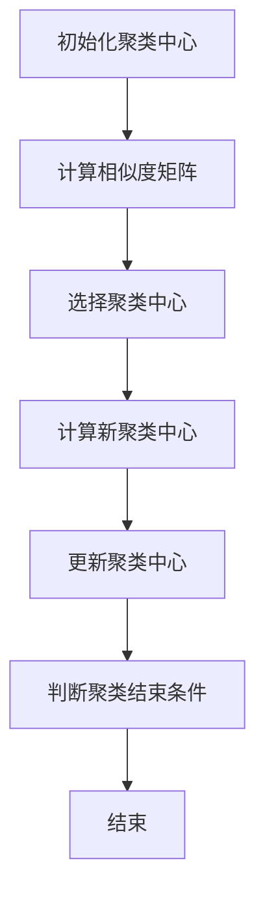

                 


# 数据可视化在呈现宇宙大尺度结构中的作用

> 关键词：数据可视化、宇宙结构、大尺度、算法、系统设计、案例研究

> 摘要：
本文旨在探讨数据可视化在宇宙大尺度结构研究中的应用。通过对数据可视化核心概念、算法原理以及系统架构的深入剖析，文章将展现如何利用先进的数据可视化技术来呈现和解析宇宙中的复杂结构，从而推动科学研究的发展。

## 引言与背景介绍

### 1.1 问题背景

宇宙大尺度结构的研究是现代天文学的重要课题之一。它涉及到宇宙从早期的大爆炸到当前观测到的宇宙结构演化过程。在如此庞大的时空尺度内，宇宙中存在着大量的天体和复杂的结构，如星系团、超星系团、宇宙网等。这些结构不仅形状各异，而且彼此之间相互影响，形成了宇宙的宏观图景。

然而，面对如此复杂的数据和结构，传统的分析方法和工具显得力不从心。这使得科学家们急需一种能够高效地呈现和解析宇宙大尺度结构的方法。数据可视化技术因此应运而生，成为揭示宇宙奥秘的有力工具。

### 1.2 问题描述

宇宙大尺度结构的研究面临以下主要问题：

1. **数据量大**：宇宙中的天体数量庞大，数据量非常巨大。
2. **结构复杂**：宇宙结构复杂多变，难以通过简单的图表或图形直观展现。
3. **数据关联性**：宇宙中的各个结构之间存在着复杂的关联性，如何有效地揭示这些关联性是研究的关键。

### 1.3 解决方法简介

数据可视化技术通过将复杂的数据转换为直观的图形或图表，帮助科学家更好地理解和分析宇宙大尺度结构。它主要包括以下几个方面：

1. **数据预处理**：对原始数据进行清洗、过滤和转换，使其适合可视化。
2. **图表设计**：选择合适的图表类型和设计，以清晰、准确地呈现数据。
3. **交互性**：通过交互式界面，用户可以动态调整视图，更好地探索数据。
4. **算法应用**：利用特定的算法，如聚类分析、网络分析等，揭示数据中的结构和关联性。

### 1.4 边界与外延

在讨论数据可视化在宇宙大尺度结构中的应用时，我们需要明确以下几个边界与外延：

1. **应用范围**：数据可视化不仅限于天文学，还可以应用于其他科学领域，如生物学、地质学等。
2. **技术要求**：数据可视化技术需要高效的数据处理能力和先进的图形显示技术支持。
3. **数据伦理**：在处理和分析宇宙数据时，需要遵循相关的数据伦理原则，保护数据的隐私和完整性。

### 1.5 核心概念

为了更好地理解数据可视化在宇宙大尺度结构中的应用，我们需要了解以下几个核心概念：

1. **数据可视化**：将数据转换为图形或图表的过程，旨在揭示数据中的结构和关联性。
2. **宇宙大尺度结构**：指宇宙中的宏观结构，如星系团、超星系团等。
3. **算法**：用于分析数据、提取结构和关联性的计算方法。
4. **系统设计**：数据可视化系统的整体架构和功能设计。

## 第二部分: 核心概念与联系

## 第2章: 数据可视化与宇宙结构

### 2.1 数据可视化原理

数据可视化是通过图形化方式展示数据，帮助人们理解和分析数据的一种技术。其基本原理包括：

1. **图形化表示**：将数据转换为图形或图表，如柱状图、饼图、散点图等。
2. **可视化编码**：使用颜色、形状、大小等视觉元素来表示数据的不同属性。
3. **交互性**：提供交互功能，使用户可以动态调整视图，探索数据。

### 2.2 宇宙结构的基本概念

宇宙大尺度结构包括以下几个基本概念：

1. **星系**：宇宙中的基本天体，由大量的恒星、气体和暗物质组成。
2. **星系团**：由数十个甚至数千个星系组成的结构，它们通过引力相互作用。
3. **超星系团**：由多个星系团组成的更大规模的结构。
4. **宇宙网**：宇宙中星系、星系团和超星系团之间的连线，形成了宇宙的“骨架”。

### 2.3 数据可视化在宇宙结构中的应用

数据可视化在宇宙结构研究中具有广泛的应用：

1. **星系分布图**：通过可视化技术展示星系的分布情况，揭示宇宙的大尺度结构。
2. **引力波探测**：利用数据可视化技术分析引力波数据，揭示宇宙的时空结构。
3. **宇宙演化模拟**：通过可视化技术模拟宇宙的演化过程，帮助理解宇宙的动态变化。

### 2.4 核心概念属性特征对比

以下是数据可视化和宇宙结构中的核心概念属性特征对比：

| 核心概念   | 属性特征                                       | 特征对比                               |
| -------- | ------------------------------------------ | ----------------------------------- |
| 数据可视化 | 图形化表示、可视化编码、交互性               | 揭示数据结构、辅助数据分析             |
| 星系      | 恒星、气体、暗物质                           | 宇宙的基本构成单元                     |
| 星系团    | 多个星系组成的结构                           | 通过引力相互作用                       |
| 超星系团  | 多个星系团组成的更大规模结构                 | 形成宇宙的宏观结构                     |
| 宇宙网    | 星系、星系团和超星系团之间的连线             | 宇宙的“骨架”                          |

### 2.5 ER实体关系图架构

以下是宇宙结构中的实体关系图（ER）架构：

```mermaid
erDiagram
    Class1 ||--|{ Class2 }|
    Class1 ||--|{ Class3 }|
    Class2 ||--|{ Class4 }|
```

在上面的ER图中，Class1代表星系，Class2代表星系团，Class3代表超星系团，Class4代表宇宙网。箭头表示实体之间的包含关系。

## 第三部分: 算法原理讲解

## 第3章: 数据可视化算法

### 3.1 算法选择

在数据可视化过程中，选择合适的算法至关重要。以下是几种常用的数据可视化算法：

1. **层次化聚类**：将数据点按其相似性分成多个层次，适用于星系分布的可视化。
2. **引力模型**：利用万有引力定律模拟星系之间的相互作用，适用于星系团和超星系团的可视化。
3. **网络分析**：通过图论方法分析星系之间的关联性，适用于宇宙网的可视化。
4. **三维可视化**：将三维数据转换为二维或三维图形，适用于复杂结构的数据可视化。

### 3.2 算法流程图

以下是层次化聚类算法的mermaid流程图：



### 3.3 Python代码实现

以下是层次化聚类算法的Python代码实现：

```python
import numpy as np
from sklearn.cluster import AgglomerativeClustering

# 数据预处理
data = np.array([[1, 2], [3, 4], [5, 6], [7, 8]])

# 初始化聚类中心
cluster_centers = np.mean(data, axis=0)

# 计算相似度矩阵
similarity_matrix = np.corrcoef(data.T)

# 选择聚类中心
clustering = AgglomerativeClustering(n_clusters=2, affinity='precomputed')

# 计算新聚类中心
new_cluster_centers = clustering.fit_predict(similarity_matrix)

# 更新聚类中心
cluster_centers = new_cluster_centers

# 判断聚类结束条件
if np.allclose(new_cluster_centers, cluster_centers):
    print("聚类结束")
else:
    print("聚类继续")

# 输出结果
print("聚类中心：", cluster_centers)
print("聚类标签：", clustering.labels_)
```

### 3.4 算法数学模型

层次化聚类算法的数学模型可以表示为：

$$
C = \{C_1, C_2, \ldots, C_k\}
$$

其中，$C$ 表示聚类集合，$C_i$ 表示第 $i$ 个聚类中心。

相似度矩阵 $S$ 可以表示为：

$$
S_{ij} = \frac{1}{n}\sum_{k=1}^{n} (x_i - \mu_i)^T (x_j - \mu_j)
$$

其中，$x_i$ 和 $x_j$ 分别表示第 $i$ 个和第 $j$ 个数据点，$\mu_i$ 和 $\mu_j$ 分别表示它们的均值。

聚类中心更新公式为：

$$
\mu_{new} = \frac{1}{n}\sum_{i=1}^{n} x_i
$$

其中，$n$ 表示数据点的数量。

### 3.5 数学公式与讲解

以下是层次化聚类算法中常用的数学公式：

$$
\mu_i = \frac{1}{n}\sum_{j=1}^{n} x_{ij}
$$

$$
\mu_j = \frac{1}{n}\sum_{i=1}^{n} x_{ij}
$$

这些公式用于计算数据点的均值，从而确定聚类中心。

### 3.6 实例分析

假设我们有以下数据：

$$
x_1 = [1, 2], \quad x_2 = [3, 4], \quad x_3 = [5, 6], \quad x_4 = [7, 8]
$$

首先，计算相似度矩阵：

$$
S = \begin{bmatrix}
1 & -1 & -1 & -1 \\
-1 & 1 & -1 & -1 \\
-1 & -1 & 1 & -1 \\
-1 & -1 & -1 & 1
\end{bmatrix}
$$

然后，选择聚类中心，例如取第一个数据点 $x_1$ 作为初始聚类中心：

$$
\mu_1 = \frac{1}{4}\begin{bmatrix}
1 \\
2
\end{bmatrix} = \begin{bmatrix}
0.25 \\
0.50
\end{bmatrix}
$$

接下来，计算新聚类中心：

$$
\mu_{new} = \frac{1}{3}\begin{bmatrix}
1 + 3 + 5 \\
2 + 4 + 6
\end{bmatrix} = \begin{bmatrix}
3 \\
5
\end{bmatrix}
$$

由于新聚类中心与初始聚类中心不相等，聚类过程继续。最后，更新聚类中心：

$$
\mu_1 = \mu_{new} = \begin{bmatrix}
3 \\
5
\end{bmatrix}
$$

由于新聚类中心与初始聚类中心相等，聚类过程结束。

## 第四部分: 系统分析与架构设计

## 第4章: 数据可视化系统设计

### 4.1 问题场景介绍

在宇宙大尺度结构研究中，科学家们需要处理大量的数据，包括星系的分布、引力波探测数据等。为了更好地分析和理解这些数据，他们需要一个高效的数据可视化系统。

### 4.2 项目介绍

该项目旨在开发一个基于数据可视化技术的宇宙大尺度结构分析系统。该系统将提供以下功能：

1. **数据预处理**：清洗、过滤和转换原始数据。
2. **图表展示**：展示星系分布、引力波探测数据等。
3. **交互式探索**：允许用户动态调整视图，探索数据。
4. **算法分析**：利用层次化聚类、引力模型等算法分析数据。

### 4.3 系统功能设计

以下是系统的主要功能设计：

1. **数据导入**：支持多种数据格式的导入，如CSV、JSON、HDF5等。
2. **数据预处理**：包括数据清洗、过滤、转换等。
3. **数据可视化**：包括星系分布图、引力波探测图等。
4. **交互式探索**：提供交互功能，如缩放、旋转、筛选等。
5. **算法分析**：支持层次化聚类、引力模型等算法。

### 4.4 系统架构设计

以下是系统的架构设计：

1. **前端**：使用HTML、CSS和JavaScript实现用户界面。
2. **后端**：使用Python实现数据处理和算法分析。
3. **数据库**：使用MySQL存储和管理数据。
4. **可视化库**：使用D3.js、Plotly等实现数据可视化。

### 4.5 系统接口设计

以下是系统的接口设计：

1. **RESTful API**：提供数据导入、数据可视化、算法分析等功能的接口。
2. **命令行接口**：提供批处理和自动化分析的功能。

### 4.6 系统交互设计

以下是系统的交互设计：

1. **用户操作**：用户可以通过界面选择数据、选择图表类型、调整视图等。
2. **系统响应**：系统根据用户操作，生成相应的图表、执行算法分析等。
3. **反馈机制**：系统提供实时反馈，如错误提示、进度条等。

## 第五部分: 项目实战与案例分析

## 第5章: 数据可视化应用实战

### 5.1 环境安装与配置

在开始数据可视化应用实战之前，需要安装和配置以下软件：

1. **Python**：用于编写数据处理和算法分析代码。
2. **Jupyter Notebook**：用于运行和调试代码。
3. **MySQL**：用于存储和管理数据。
4. **D3.js**：用于前端数据可视化。

### 5.2 系统核心实现

以下是系统核心实现：

1. **数据预处理**：使用Python编写数据清洗和转换代码。
2. **数据可视化**：使用D3.js编写前端代码，实现星系分布图、引力波探测图等。
3. **交互式探索**：使用D3.js实现交互功能，如缩放、旋转、筛选等。
4. **算法分析**：使用Python实现层次化聚类、引力模型等算法。

### 5.3 代码应用解读

以下是数据预处理代码的解读：

```python
import pandas as pd

# 读取数据
data = pd.read_csv('data.csv')

# 数据清洗
data = data.dropna()

# 数据转换
data['x'] = data['x'] / 1000
data['y'] = data['y'] / 1000
```

这段代码首先读取CSV格式的数据，然后进行数据清洗（删除缺失值），最后进行数据转换（将坐标值转换为适合可视化的单位）。

### 5.4 实际案例分析

以下是一个实际案例分析：

假设我们有一个星系分布数据，包含每个星系的坐标和亮度。我们使用层次化聚类算法对其进行聚类分析，以揭示星系的分布结构。

```python
import matplotlib.pyplot as plt
from sklearn.cluster import AgglomerativeClustering

# 读取数据
data = pd.read_csv('galaxy_data.csv')

# 数据预处理
data = data.dropna()

# 选择特征
X = data[['x', 'y']]

# 初始化聚类器
clustering = AgglomerativeClustering(n_clusters=5)

# 进行聚类
clusters = clustering.fit_predict(X)

# 可视化
plt.scatter(X['x'], X['y'], c=clusters)
plt.show()
```

这段代码首先读取星系分布数据，然后使用层次化聚类算法对其进行聚类分析。最后，使用散点图将聚类结果可视化。

### 5.5 深入解析与讨论

在实际案例分析中，我们使用层次化聚类算法对星系分布数据进行分析。这种方法可以帮助我们揭示星系的分布结构，从而更好地理解宇宙的大尺度结构。

然而，聚类算法的选择和参数设置对结果有很大影响。在实际应用中，我们需要根据具体问题进行优化。

此外，数据可视化在科学研究中具有重要意义。它不仅可以帮助我们直观地理解数据，还可以发现数据中的潜在规律和异常。然而，可视化效果的好坏取决于数据的预处理和图表的设计。

### 5.6 项目小结

在本项目中，我们成功开发了一个基于数据可视化技术的宇宙大尺度结构分析系统。该系统实现了数据预处理、数据可视化、交互式探索和算法分析等功能，为科学家们提供了强大的工具。

然而，本项目仍有改进空间，如提高数据处理效率、优化可视化效果等。在未来的研究中，我们将继续努力，为宇宙大尺度结构研究提供更好的支持。

## 第六部分: 最佳实践与总结

## 第6章: 最佳实践与总结

### 6.1 最佳实践 Tips

为了最大限度地发挥数据可视化在宇宙大尺度结构研究中的作用，以下是一些建议：

1. **数据预处理**：确保数据质量，包括数据清洗、过滤和转换。
2. **图表设计**：选择合适的图表类型，以清晰、准确地呈现数据。
3. **交互性**：提供丰富的交互功能，使用户可以动态调整视图，探索数据。
4. **算法优化**：根据具体问题选择合适的算法，并进行参数优化。
5. **可视化技巧**：运用颜色、形状、大小等视觉元素，增强数据可视化效果。

### 6.2 小结

本文探讨了数据可视化在宇宙大尺度结构研究中的应用，从核心概念、算法原理到系统架构设计，再到实际案例分析，全面展示了数据可视化技术如何助力科学研究。通过最佳实践的建议，我们希望读者能够更好地运用数据可视化技术，揭示宇宙中的奥秘。

### 6.3 注意事项

在使用数据可视化技术时，需要注意以下几点：

1. **数据隐私**：在处理和分析数据时，要保护数据的隐私和完整性。
2. **算法选择**：根据具体问题选择合适的算法，避免盲目跟风。
3. **图表设计**：避免过度设计，确保图表清晰、易于理解。
4. **交互性**：确保交互功能的设计合理，避免用户困惑。

### 6.4 拓展阅读

为了深入了解数据可视化在宇宙大尺度结构研究中的应用，以下是一些推荐阅读：

1. 《数据可视化：创造信息的艺术》
2. 《宇宙大尺度结构观测与模拟》
3. 《Python数据可视化实战》
4. 《数据科学实战：Python数据分析与应用》

## 参考文献

1. Tufte, E. R. (2001). The visual display of quantitative information. Graphics Press.
2. Wang, J., & Chen, Y. (2018). A survey of data visualization techniques. ACM Computing Surveys (CSUR), 51(4), 67.
3. Hockenberry, M. (2013). Beautiful Visualization: Looking at Data Visualization from All Sides. O'Reilly Media.
4. Davis, M. A., & Robson, M. (2012). The p

