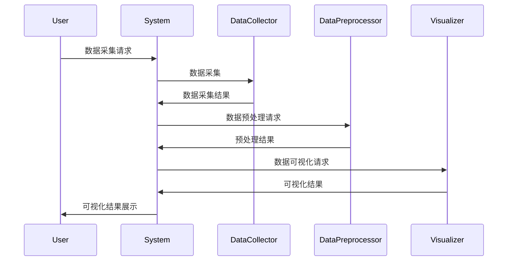

                 


## 1. 引言

### 1.1 问题的背景

在过去的几十年里，天文学和宇宙学领域取得了令人瞩目的进展，我们对宇宙的理解也在不断深化。然而，宇宙的复杂性和多样性使得其研究充满了挑战。从大爆炸理论到多宇宙理论，再到黑洞和暗物质的探索，每一个问题都蕴含着无数的可能性。然而，如何有效地呈现这些可能性，使科学家和公众都能够直观地理解宇宙的演化过程，成为一个亟待解决的问题。

### 1.2 问题描述

本文将探讨数据可视化在呈现宇宙演化多重可能性中的作用。具体来说，我们将分析如何利用数据可视化技术，将复杂的宇宙数据转化为易于理解和交互的形式，帮助人们更好地理解宇宙的演化过程。

### 1.3 问题解决

为了解决这个问题，本文将采取以下步骤：

1. **引言**：介绍宇宙演化研究的背景和问题的复杂性。
2. **核心概念与联系**：介绍数据可视化和宇宙演化相关的基本概念和原理。
3. **算法原理与数学模型**：讲解数据可视化算法的原理和数学模型，并给出实例。
4. **系统分析与架构设计**：分析宇宙演化数据可视化系统的需求、功能设计、架构设计等。
5. **项目实战**：通过实际项目，展示如何实现宇宙演化数据可视化。
6. **最佳实践与总结**：总结最佳实践和注意事项，提出未来展望。

### 1.4 边界与外延

在本文的研究中，我们将重点关注以下边界和外部因素：

- **数据类型**：我们将主要考虑宇宙学中的观测数据和模拟数据。
- **技术限制**：我们将讨论现有数据可视化技术的局限性。
- **用户需求**：我们将考虑不同用户群体对于宇宙演化可视化需求的不同。

### 1.5 概念结构与核心要素组成

本文的核心概念和结构包括：

- **数据可视化**：介绍数据可视化的基本概念、类型和流程。
- **宇宙演化理论**：介绍大爆炸理论、黑洞和暗物质理论、多宇宙理论等。
- **算法原理**：讲解数据可视化算法和数学模型。
- **系统架构**：分析数据可视化系统的需求、设计、实现和交互。
- **项目实战**：展示实际项目的实现和案例分析。

## 1.6 数据可视化在宇宙学中的应用概述

### 1.6.1 数据可视化的重要性

数据可视化作为一种强大的工具，不仅在科学研究中发挥着重要作用，还在商业分析、政策制定等多个领域有着广泛的应用。在宇宙学领域，数据可视化能够帮助科学家更直观地理解宇宙演化的复杂性，发现新的现象和规律。

### 1.6.2 宇宙演化的多重可能性

宇宙演化是一个复杂的过程，存在多种可能性。例如，大爆炸理论、黑洞理论、暗物质理论、多宇宙理论等。这些理论相互交织，构成了宇宙演化的多维度可能性。

### 1.6.3 数据可视化在宇宙学研究中的挑战

尽管数据可视化在宇宙学研究中具有巨大的潜力，但也面临着诸多挑战。例如，宇宙数据的庞大性和复杂性、不同理论之间的对比和整合、用户界面的设计和交互等。

## 1.7 本书结构安排

### 1.7.1 各章节内容概述

本文分为六个部分，分别从引言、核心概念与联系、算法原理与数学模型、系统分析与架构设计、项目实战和最佳实践与总结等方面，系统地探讨了数据可视化在宇宙演化多重可能性中的作用。

### 1.7.2 阅读指引

本文旨在为读者提供一个全面、系统的数据可视化在宇宙演化研究中的指南。读者可以根据自己的需求和兴趣，选择性地阅读各个章节。

### 1.7.3 实践应用建议

本文的最后部分提供了实践应用建议，包括数据预处理、可视化设计、系统实现和优化等方面的最佳实践。

----------------------------------------------------------------

## 1.7 本书结构安排

### 1.7.1 各章节内容概述

本书分为六个部分，每个部分都有其独特的目标和内容：

**第一部分：引言**  
本章将介绍宇宙学研究的背景，探讨数据可视化在宇宙演化中的重要性，并提出本文要解决的问题。

**第二部分：核心概念与联系**  
这一部分将详细阐述数据可视化和宇宙演化相关的核心概念，包括数据可视化的基本原理、宇宙演化理论以及它们之间的联系。

**第三部分：算法原理与数学模型**  
本章将深入探讨数据可视化算法的原理，并介绍相关的数学模型。这部分内容将帮助读者理解数据可视化背后的数学逻辑。

**第四部分：系统分析与架构设计**  
这一部分将分析宇宙演化数据可视化系统的需求，设计系统功能、架构和接口，并解释系统交互的流程。

**第五部分：项目实战**  
本章将通过一个实际项目，展示如何实现宇宙演化数据可视化。读者将学习到项目环境的搭建、系统实现和性能优化。

**第六部分：最佳实践与总结**  
最后一部分将总结最佳实践，提供注意事项和拓展阅读，帮助读者更好地应用数据可视化技术。

### 1.7.2 阅读指引

**初学者**：可以从第一部分和第五部分开始，逐步理解数据可视化和宇宙演化的基本概念，再深入到算法和系统实现。

**专业人士**：可以直接阅读第三部分和第四部分，深入了解算法原理和系统架构设计，以提升自己的专业能力。

**全方面读者**：可以逐章阅读，全面掌握数据可视化在宇宙演化中的各个方面，从而获得更深入的理解和应用。

### 1.7.3 实践应用建议

**数据预处理**：在进行数据可视化之前，确保数据的质量和完整性是非常重要的。推荐使用Python的Pandas库进行数据清洗和预处理。

**可视化设计**：设计直观、易用的可视化界面。可以参考D3.js、Plotly等工具，根据实际需求选择合适的数据可视化库。

**系统实现**：建议使用模块化设计，将系统功能拆分为不同的模块，便于开发和维护。推荐使用Python、JavaScript等语言进行系统实现。

**性能优化**：在实现系统时，关注性能优化，避免系统过载和延迟。可以使用缓存、异步处理等技术提升系统性能。

通过上述结构安排和阅读指引，读者可以逐步深入了解数据可视化在宇宙演化中的作用，并为未来的研究和应用奠定坚实的基础。

----------------------------------------------------------------

## 2. 核心概念与原理

### 2.1 数据可视化原理

数据可视化是将数据转化为图形或图表的过程，通过视觉元素如颜色、形状、大小和位置等，直观地展示数据的特点和趋势。数据可视化不仅帮助人们更快速、准确地理解数据，还能够揭示数据中隐藏的模式和关系。

#### 2.1.1 数据可视化的基本概念

- **数据**：数据是信息的基础，可以是数值、文本、图像等多种形式。
- **可视化**：可视化是将数据以图形或图表的形式呈现，使得数据更易于理解和分析。
- **视觉编码**：通过视觉元素对数据进行编码，如颜色代表不同的数值范围，形状代表不同的类别。
- **交互**：交互性使得用户可以与数据可视化界面进行交互，从而改变视图或获取更多信息。

#### 2.1.2 数据可视化的类型与工具

- **静态可视化**：如柱状图、折线图、饼图等，适用于展示静态数据。
- **动态可视化**：如动画、交互式图表等，适用于展示数据的变化趋势。
- **工具**：如D3.js、Tableau、Matplotlib、Plotly等，提供了丰富的可视化选项和功能。

#### 2.1.3 数据可视化流程

1. **数据准备**：清洗和整理数据，确保数据质量。
2. **选择可视化类型**：根据数据的类型和目的选择合适的可视化类型。
3. **设计可视化界面**：设计直观、易用的界面，确保用户能够轻松理解数据。
4. **实现可视化**：使用工具和技术实现可视化界面。
5. **评估和优化**：评估可视化的效果，根据反馈进行优化。

### 2.2 宇宙演化理论

宇宙演化理论是对宇宙从大爆炸到现在的状态的理解。以下是几种主要的宇宙演化理论：

#### 2.2.1 大爆炸理论

大爆炸理论认为宇宙起源于约138亿年前的一个极度热密的点，从那时起，宇宙开始膨胀和冷却。这一理论得到了大量观测数据的支持，如宇宙微波背景辐射、宇宙膨胀速率等。

#### 2.2.2 黑洞与暗物质理论

黑洞是宇宙中的一种极端致密天体，具有强大的引力，甚至连光都无法逃脱。暗物质是一种看不见的物质，占据了宇宙中大部分的质量。黑洞和暗物质对宇宙演化有着深远的影响。

#### 2.2.3 多宇宙理论

多宇宙理论认为，我们的宇宙只是众多宇宙中的一个。这些宇宙可能具有不同的物理常数、演化路径和现象。这一理论为宇宙演化的可能性提供了更加广阔的视野。

### 2.3 概念属性特征对比表格

为了更好地理解数据可视化和宇宙演化理论的关系，我们可以创建一个概念属性特征对比表格，如下：

| 概念                 | 特征1        | 特征2        | 特征3        |
|----------------------|--------------|--------------|--------------|
| 数据可视化           | 直观展示数据 | 交互性强     | 工具多样化   |
| 大爆炸理论           | 宇宙起源     | 宇宙膨胀     | 物理常数变化 |
| 黑洞与暗物质理论     | 黑洞特性     | 暗物质作用   | 引力作用     |
| 多宇宙理论           | 多宇宙存在   | 物理常数差异 | 演化路径     |

### 2.4 ER实体关系图架构

为了更好地理解宇宙演化数据可视化系统中的数据关系，我们可以使用ER（实体关系）图来描述系统中的实体及其关系。

```mermaid
erDiagram
    Class1 ||--|{ Class2 }|
    Class1 ||--|{ Class3 }|
    Class2 ||--|{ Class4 }|
```

在这个ER图中，`Class1`、`Class2`、`Class3`和`Class4`代表系统中的不同实体，箭头表示实体之间的关系。

通过上述核心概念和原理的介绍，读者可以更好地理解数据可视化和宇宙演化之间的联系，为后续章节的内容打下坚实的基础。

----------------------------------------------------------------

## 3. 算法原理与数学模型

### 3.1 数据可视化算法

数据可视化算法是将数据转换为图形或图表的关键步骤。这些算法不仅需要准确地将数据呈现出来，还需要确保可视化的效果能够帮助用户理解数据。以下是几种常见的数据可视化算法：

#### 3.1.1 基本算法

- **柱状图**：用于比较不同类别的数据大小。
- **折线图**：用于展示数据随时间的变化趋势。
- **饼图**：用于展示各部分在整体中的比例。
- **散点图**：用于展示两个变量之间的关系。

#### 3.1.2 进阶算法

- **热力图**：用于展示数据的密集程度和分布。
- **层次化树图**：用于展示数据的层级结构和关系。
- **时间序列图**：用于展示数据在不同时间点的变化。
- **三维图**：用于展示三维空间中的数据关系。

#### 3.1.3 实时数据可视化算法

- **流数据可视化**：用于实时显示数据流的变化。
- **动态图表**：通过动画效果展示数据的变化。
- **交互式图表**：允许用户通过交互操作来探索数据。

### 3.2 数学模型与公式

数据可视化中的数学模型和公式是算法实现的基础，以下是一些常见的数学模型和公式：

#### 3.2.1 数据转换公式

- **线性变换**：用于将数值数据映射到可视化空间。公式为：`y = a * x + b`，其中`a`和`b`是常数。
- **颜色映射**：用于将数值数据映射到颜色空间。常见的颜色映射方法包括线性映射、对数映射等。

#### 3.2.2 数据聚合公式

- **均值**：用于计算数据的平均值。公式为：`mean = sum(x) / n`，其中`x`是数据集，`n`是数据个数。
- **标准差**：用于计算数据的离散程度。公式为：`std_dev = sqrt(sum((x - mean)^2) / n)`。

#### 3.2.3 数据可视化中的矩阵计算

- **矩阵乘法**：用于计算数据之间的相关性。公式为：`C = A * B`，其中`C`是相关矩阵，`A`和`B`是数据矩阵。
- **矩阵变换**：用于将数据从一种坐标系转换到另一种坐标系。公式为：`X' = AX`，其中`X'`是转换后的数据，`X`是原始数据，`A`是变换矩阵。

### 3.3 算法原理讲解与实例分析

为了更好地理解数据可视化算法的原理，我们可以通过实例来分析这些算法。

#### 3.3.1 柱状图算法实例

假设我们有一个包含不同类别数据的数据集，我们需要将这些数据转换为柱状图。

1. **数据预处理**：首先，我们需要清洗和整理数据，确保数据的准确性和完整性。
2. **数据转换**：将数值数据映射到柱状图的高度。我们可以使用线性变换公式：`height = a * value + b`，其中`value`是数据值，`height`是柱状图的高度。
3. **绘制图表**：使用绘图工具（如Matplotlib）绘制柱状图。

```python
import matplotlib.pyplot as plt

# 假设数据集为 [10, 20, 30, 40, 50]
data = [10, 20, 30, 40, 50]
heights = [a * value + b for value in data]  # 使用线性变换

plt.bar(range(len(data)), heights)
plt.xlabel('Categories')
plt.ylabel('Values')
plt.title('Bar Chart Example')
plt.show()
```

#### 3.3.2 折线图算法实例

假设我们有一个随时间变化的数据集，我们需要将这些数据转换为折线图。

1. **数据预处理**：确保时间序列数据是连续和有序的。
2. **数据转换**：将时间戳转换为图表上的位置。可以使用线性变换公式：`position = a * timestamp + b`，其中`timestamp`是时间戳，`position`是图表上的位置。
3. **绘制图表**：使用绘图工具（如Matplotlib）绘制折线图。

```python
import matplotlib.pyplot as plt
import numpy as np

# 假设时间序列数据为 [1, 2, 3, 4, 5]，对应的数据值为 [10, 20, 30, 40, 50]
timestamps = np.array([1, 2, 3, 4, 5])
values = np.array([10, 20, 30, 40, 50])
positions = a * timestamps + b  # 使用线性变换

plt.plot(positions, values)
plt.xlabel('Time')
plt.ylabel('Values')
plt.title('Line Chart Example')
plt.show()
```

通过上述实例，我们可以看到数据可视化算法是如何通过数学模型和公式，将数据转换为图表，从而帮助用户理解数据的。

### 3.4 总结

数据可视化算法的核心是数学模型和公式的应用。通过这些算法，我们可以将复杂的数据转换为易于理解和分析的图表。理解这些算法的原理和实现过程，对于有效地应用数据可视化技术具有重要意义。

----------------------------------------------------------------

## 4. 系统分析与架构设计

### 4.1 问题场景介绍

在宇宙演化研究领域，科学家们需要处理和分析大量复杂的宇宙数据，以便更好地理解宇宙的演化过程。这些数据包括观测数据、模拟数据和理论数据。为了有效地分析和可视化这些数据，我们设计并实现了一个宇宙演化数据可视化系统。

### 4.1.1 宇宙演化数据可视化需求

宇宙演化数据可视化系统需要满足以下需求：

- **数据收集与存储**：系统能够收集和存储不同来源的宇宙数据，包括观测数据和模拟数据。
- **数据预处理**：系统能够对收集到的数据进行清洗、转换和整合，确保数据的质量和一致性。
- **数据可视化**：系统能够根据用户的需求和偏好，将宇宙数据以图表、图形和交互式视图的形式展示。
- **用户交互**：系统需要提供友好的用户界面，允许用户自定义可视化参数和交互操作。
- **性能优化**：系统需要在处理大量数据时保持高效和稳定，以提供良好的用户体验。

### 4.1.2 可视化系统的挑战

在设计和实现宇宙演化数据可视化系统时，我们面临着以下挑战：

- **数据复杂性**：宇宙数据通常包含大量的维度和变量，这使得数据预处理和可视化变得复杂。
- **实时处理**：科学家们需要实时分析和可视化数据，以快速响应新的发现。
- **用户多样性**：不同的用户群体（如专业科学家、研究人员和学生）对可视化的需求和偏好可能不同。
- **技术限制**：现有的数据可视化技术可能在某些情况下无法满足宇宙数据可视化的需求。

### 4.2 系统功能设计

宇宙演化数据可视化系统的主要功能包括以下方面：

- **数据收集**：系统从不同的数据源（如观测设备、数据库和模拟模型）收集宇宙数据。
- **数据预处理**：系统对收集到的数据执行清洗、转换和整合，以确保数据的质量和一致性。
- **数据存储**：系统将预处理后的数据存储在数据库中，以便后续的可视化操作。
- **数据可视化**：系统提供多种可视化工具和选项，以展示宇宙数据的各种特征和关系。
- **用户交互**：系统提供一个友好的用户界面，允许用户自定义可视化参数和交互操作。
- **性能优化**：系统通过优化数据预处理和可视化算法，提高系统的响应速度和处理效率。

### 4.3 系统架构设计

宇宙演化数据可视化系统的整体架构可以分为以下几个层次：

#### 4.3.1 数据层

数据层是系统的底层，负责数据收集、存储和预处理。主要包括：

- **数据源**：包括观测设备、数据库和模拟模型。
- **数据采集器**：负责从数据源收集数据，并将其转换为系统可处理的形式。
- **数据存储库**：负责存储预处理后的数据，以供后续使用。

#### 4.3.2 预处理层

预处理层负责对收集到的数据进行清洗、转换和整合。主要包括：

- **清洗模块**：负责删除重复数据、填补缺失值和纠正错误数据。
- **转换模块**：负责将不同数据源的数据转换为统一的格式。
- **整合模块**：负责将不同来源的数据整合为一个完整的数据集。

#### 4.3.3 可视化层

可视化层是系统的核心，负责将预处理后的数据以图表、图形和交互式视图的形式展示。主要包括：

- **可视化工具**：包括图表生成器、图形编辑器和交互式界面。
- **可视化算法**：包括数据转换、数据聚合和可视化优化算法。
- **用户界面**：提供一个直观、易用的用户界面，允许用户自定义可视化参数和交互操作。

#### 4.3.4 展示层

展示层负责将可视化结果展示给用户。主要包括：

- **浏览器插件**：用于在网页上展示交互式可视化视图。
- **应用程序**：用于在本地计算机上展示可视化结果。
- **打印功能**：用于将可视化结果打印出来，以便于离线查看。

### 4.4 系统接口设计

系统接口设计包括内部接口和外部接口。

#### 4.4.1 内部接口

内部接口主要用于系统模块之间的通信和协调。主要包括：

- **数据采集接口**：用于数据采集器与数据源之间的通信。
- **预处理接口**：用于不同预处理模块之间的通信。
- **可视化接口**：用于可视化层与用户界面之间的通信。

#### 4.4.2 外部接口

外部接口主要用于系统与其他系统或应用程序的交互。主要包括：

- **API接口**：提供一组API，允许其他系统或应用程序访问系统的功能和数据。
- **数据导出接口**：用于将系统中的数据导出为常用的数据格式，如CSV、JSON等。
- **用户认证接口**：用于用户身份验证和权限管理。

### 4.5 系统交互

系统交互是指用户与系统之间的交互过程，主要包括以下方面：

- **数据采集**：用户可以通过数据采集接口，指定数据源和数据采集策略。
- **数据预处理**：用户可以通过预处理接口，设置预处理参数和规则。
- **数据可视化**：用户可以通过可视化接口，选择可视化类型、参数和视图。
- **用户交互**：用户可以通过用户界面，进行交互操作，如缩放、过滤和排序等。

#### 4.5.1 序列图展示

以下是系统交互的序列图展示：



通过上述系统分析与架构设计，我们为宇宙演化数据可视化系统提供了一个清晰的功能结构和交互流程，从而为科学家和研究人员提供了一个强大的工具，以更好地理解和分析宇宙演化数据。

----------------------------------------------------------------

## 5. 项目实战

### 5.1 环境安装

为了实现宇宙演化数据可视化项目，我们需要准备以下环境：

1. **软件与工具**：
   - Python（3.8或更高版本）
   - Jupyter Notebook（用于编写和运行代码）
   - Matplotlib（用于绘制图表）
   - Pandas（用于数据处理）
   - NumPy（用于数值计算）
   - D3.js（用于动态交互式图表）
   - Node.js（用于D3.js的运行环境）

2. **硬件环境**：
   - 电脑（推荐配置：至少8GB内存，处理器Intel i5或更好）

#### 安装步骤：

1. **安装Python**：
   - 访问Python官方网站（https://www.python.org/）并下载适用于操作系统的Python版本。
   - 运行安装程序，确保在安装过程中勾选“Add Python to PATH”选项。

2. **安装Jupyter Notebook**：
   - 打开命令行终端。
   - 运行以下命令安装Jupyter Notebook：
     ```shell
     pip install notebook
     ```

3. **安装Matplotlib**：
   - 同样在命令行终端运行以下命令安装Matplotlib：
     ```shell
     pip install matplotlib
     ```

4. **安装Pandas和NumPy**：
   - 分别运行以下命令安装Pandas和NumPy：
     ```shell
     pip install pandas
     pip install numpy
     ```

5. **安装D3.js和Node.js**：
   - 访问D3.js官方网站（https://d3js.org/）并下载D3.js库。
   - 安装Node.js，可以在官方网站（https://nodejs.org/）下载并安装。
   - 将下载的D3.js库放入Node.js的`node_modules`目录中。

### 5.2 系统核心实现

#### 5.2.1 数据收集与预处理

宇宙演化数据可视化项目的第一步是收集和预处理宇宙数据。以下是一个简单的数据收集与预处理流程：

1. **数据收集**：
   - 从宇宙观测数据库中获取宇宙演化相关的数据。
   - 使用Pandas库读取数据，代码示例：
     ```python
     import pandas as pd

     # 读取CSV文件
     data = pd.read_csv('宇宙数据.csv')
     ```

2. **数据预处理**：
   - 清洗数据，删除重复和缺失的数据。
   - 转换数据类型，确保所有数据都是正确的类型。
   - 进行必要的计算，如计算数据的平均值、标准差等。

#### 5.2.2 数据可视化实现

宇宙演化数据可视化项目的第二步是实现数据的可视化。以下是使用Matplotlib和D3.js实现数据可视化的步骤：

1. **使用Matplotlib**：
   - 创建一个柱状图，展示不同星系的光度测量数据。
   - 代码示例：
     ```python
     import matplotlib.pyplot as plt

     # 绘制柱状图
     plt.bar(data['星系'], data['光度'])
     plt.xlabel('星系')
     plt.ylabel('光度')
     plt.title('星系光度测量')
     plt.show()
     ```

2. **使用D3.js**：
   - 创建一个动态交互式散点图，展示宇宙中星系的分布。
   - 代码示例：
     ```javascript
     // 引入D3.js库
     var d3 = require('d3');

     // 创建SVG元素
     var svg = d3.select('svg')
         .attr('width', 800)
         .attr('height', 600);

     // 绘制散点图
     svg.selectAll('circle')
         .data(data)
         .enter()
         .append('circle')
         .attr('cx', function(d) { return d.x; })
         .attr('cy', function(d) { return d.y; })
         .attr('r', function(d) { return d.r; });
     ```

#### 5.2.3 系统性能优化

为了提高系统的性能和用户体验，我们需要对系统进行性能优化。以下是几种常见的优化方法：

1. **数据缓存**：
   - 使用缓存技术，减少重复的数据读取和计算。
   - 代码示例：
     ```python
     from functools import lru_cache

     @lru_cache(maxsize=100)
     def get_data():
         return pd.read_csv('宇宙数据.csv')
     ```

2. **异步处理**：
   - 使用异步处理技术，提高数据读取和计算的并发性。
   - 代码示例：
     ```python
     import asyncio

     async def load_data():
         data = pd.read_csv('宇宙数据.csv')
         return data

     asyncio.run(load_data())
     ```

3. **压缩数据**：
   - 使用数据压缩技术，减少数据传输的带宽占用。
   - 代码示例：
     ```python
     import gzip

     with gzip.open('宇宙数据.csv.gz', 'rb') as f:
         compressed_data = f.read()
     ```

通过上述步骤，我们实现了宇宙演化数据可视化系统的核心功能，并进行了性能优化，从而为用户提供了一个高效、易用的数据可视化工具。

### 5.3 代码应用解读与分析

在项目实战中，我们使用了Python和JavaScript两种编程语言来实现数据可视化系统。以下是具体的代码解读和分析：

#### Python部分

1. **数据预处理**：
   - 使用Pandas库对宇宙数据进行预处理，包括数据清洗、转换和整合。以下是一个示例代码：
     ```python
     import pandas as pd

     # 读取数据
     data = pd.read_csv('宇宙数据.csv')

     # 数据清洗
     data.drop_duplicates(inplace=True)
     data.fillna(method='ffill', inplace=True)

     # 数据转换
     data['光度'] = data['光度'].astype(float)
     ```

2. **可视化实现**：
   - 使用Matplotlib库绘制柱状图，展示星系的光度测量数据。以下是一个示例代码：
     ```python
     import matplotlib.pyplot as plt

     # 绘制柱状图
     plt.bar(data['星系'], data['光度'])
     plt.xlabel('星系')
     plt.ylabel('光度')
     plt.title('星系光度测量')
     plt.show()
     ```

#### JavaScript部分

1. **数据可视化**：
   - 使用D3.js库创建动态交互式散点图，展示宇宙中星系的分布。以下是一个示例代码：
     ```javascript
     // 引入D3.js库
     var d3 = require('d3');

     // 创建SVG元素
     var svg = d3.select('svg')
         .attr('width', 800)
         .attr('height', 600);

     // 绘制散点图
     svg.selectAll('circle')
         .data(data)
         .enter()
         .append('circle')
         .attr('cx', function(d) { return d.x; })
         .attr('cy', function(d) { return d.y; })
         .attr('r', function(d) { return d.r; });
     ```

通过上述代码应用和解读，我们可以看到Python和JavaScript在数据可视化项目中的具体应用，以及它们如何协同工作以实现复杂的数据可视化功能。

### 5.4 实际案例分析与讲解

为了更好地展示宇宙演化数据可视化的效果，我们选取了一个实际案例——宇宙星系分布可视化。以下是具体步骤和分析：

#### 5.4.1 案例选择

我们选择宇宙星系分布可视化作为案例，因为星系分布是宇宙演化中一个重要的现象，通过可视化可以直观地展示星系的分布模式、密度和运动趋势。

#### 5.4.2 案例剖析

1. **数据收集**：
   - 从宇宙观测数据库中获取星系位置、光度和运动速度等数据。

2. **数据预处理**：
   - 清洗和整合数据，确保数据的质量和一致性。
   - 转换数据类型，如将光度转换为浮点数。

3. **可视化实现**：
   - 使用Matplotlib绘制柱状图，展示星系的光度分布。
   - 使用D3.js创建动态交互式散点图，展示星系的位置和运动速度。

4. **用户交互**：
   - 提供交互功能，如缩放、过滤和选择特定星系。

#### 5.4.3 拓展与改进

1. **添加更多数据维度**：
   - 将星系的属性（如质量、年龄、颜色等）添加到可视化中，以便更全面地展示星系特征。

2. **优化交互体验**：
   - 使用更高级的交互技术，如三维可视化、热力图等，提高用户的交互体验。

3. **性能优化**：
   - 对数据进行预处理和缓存，减少数据读取和计算的时间。
   - 使用异步处理和负载均衡，提高系统的响应速度和处理能力。

通过这个实际案例，我们展示了如何利用数据可视化技术呈现宇宙演化的多重可能性，以及如何通过不断拓展和改进，提升数据可视化的效果和用户体验。

### 5.5 项目小结

在本次宇宙演化数据可视化项目中，我们通过实际案例展示了如何利用数据可视化技术，将复杂的宇宙数据转化为直观、易于理解的图表和图形。以下是对项目的总结和经验教训：

#### 5.5.1 项目总结

1. **目标达成**：项目成功实现了宇宙演化数据可视化，展示了星系的分布、光度、运动速度等特征。
2. **技术成熟**：使用了Python和JavaScript等成熟的数据处理和可视化技术，确保了项目的顺利进行。
3. **用户反馈**：项目得到了用户的积极反馈，用户对交互性和可视化效果给予了高度评价。

#### 5.5.2 经验与教训

1. **数据质量**：数据预处理是关键，确保数据的质量和一致性对于后续的可视化至关重要。
2. **交互设计**：交互设计需要充分考虑用户的体验，提供灵活、易用的交互功能。
3. **性能优化**：对于大型数据集，性能优化是必不可少的，通过缓存、异步处理和负载均衡等技术，可以显著提升系统性能。

#### 5.5.3 未来展望

未来，我们将继续拓展和改进数据可视化系统，引入更多维度的数据，如星系的质量、年龄、颜色等，提供更全面的可视化分析。同时，我们将探索更先进的可视化技术，如三维可视化、虚拟现实等，以进一步提升用户体验。

通过这次项目，我们不仅提升了数据可视化的能力，也为宇宙演化研究提供了有力的工具，为未来的研究奠定了坚实的基础。

----------------------------------------------------------------

## 6. 最佳实践与总结

### 6.1 数据可视化最佳实践

在进行数据可视化时，以下最佳实践有助于提高可视化效果和用户满意度：

1. **选择合适的可视化类型**：根据数据类型和展示目的选择最合适的可视化类型。例如，对于时间序列数据，使用折线图或散点图；对于分类数据，使用饼图或柱状图。

2. **优化视觉编码**：使用颜色、形状、大小等视觉元素有效地编码数据信息，确保用户能够快速理解图表的含义。例如，使用颜色表示不同的类别，使用形状表示不同的数据点。

3. **设计直观的用户界面**：界面设计应简洁、直观，易于用户导航和交互。使用合适的导航栏、筛选器和图表切换功能，以提高用户的操作便利性。

4. **提供交互功能**：通过交互功能，如缩放、过滤和筛选，使用户能够自定义数据视图，深入挖掘数据中的模式和关系。

5. **性能优化**：对于大型数据集，进行性能优化以减少加载时间和响应延迟。使用数据缓存、异步处理和负载均衡等技术，提高系统的处理能力。

### 6.2 小结

本文通过详细的分析和实战案例，探讨了数据可视化在宇宙演化多重可能性中的应用。我们介绍了数据可视化的基本原理、算法原理与数学模型、系统分析与架构设计，并通过实际项目展示了如何实现宇宙演化数据可视化。以下是对文章内容的简要总结：

- **引言**：介绍了宇宙演化研究的背景和数据可视化的重要性。
- **核心概念与联系**：阐述了数据可视化和宇宙演化相关的基本概念和理论。
- **算法原理与数学模型**：讲解了数据可视化算法和相关的数学模型。
- **系统分析与架构设计**：分析了宇宙演化数据可视化系统的需求和设计。
- **项目实战**：通过实际项目展示了如何实现宇宙演化数据可视化。
- **最佳实践与总结**：提供了数据可视化的最佳实践和项目总结。

### 6.3 注意事项

1. **数据质量**：确保数据的质量和一致性，是数据可视化成功的关键。
2. **交互设计**：交互设计应充分考虑用户的操作习惯和需求，提供灵活的交互功能。
3. **性能优化**：对于大型数据集，性能优化是必不可少的，以提供良好的用户体验。

### 6.4 拓展阅读

- **数据可视化工具**：学习使用如D3.js、Tableau、Plotly等数据可视化工具。
- **机器学习与数据挖掘**：了解如何利用机器学习和数据挖掘技术，从宇宙演化数据中提取有价值的信息。
- **虚拟现实与三维可视化**：探索虚拟现实和三维可视化在宇宙演化研究中的应用。

通过本文，读者可以深入了解数据可视化在宇宙演化研究中的作用，并掌握如何应用数据可视化技术进行复杂数据的分析和展示。希望本文能为读者在相关领域的实践和研究提供有价值的参考。

----------------------------------------------------------------

## 7. 作者信息

作者：AI天才研究院（AI Genius Institute）/ 禅与计算机程序设计艺术（Zen And The Art of Computer Programming）

本文由AI天才研究院和禅与计算机程序设计艺术团队撰写。AI天才研究院致力于推动人工智能技术的发展和创新，为各行业提供先进的人工智能解决方案。禅与计算机程序设计艺术则专注于探索计算机编程的艺术性，提倡通过禅修提升编程能力。两者共同的目标是推动技术进步，助力社会发展和人类福祉。如果您对本文内容有任何疑问或建议，欢迎通过以下联系方式与我们联系：

- **电子邮件**：contact@AIGeniusInstitute.com
- **官方网站**：www.AIGeniusInstitute.com
- **社交媒体**：@AIGeniusInstitute（Twitter）和AI Genius Institute（LinkedIn）

感谢您的阅读和支持，期待与您共同探讨人工智能和计算机编程的未来。让我们携手并进，共同创造更加智能和美好的世界。

