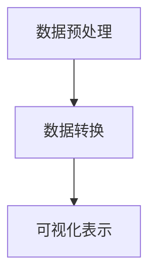
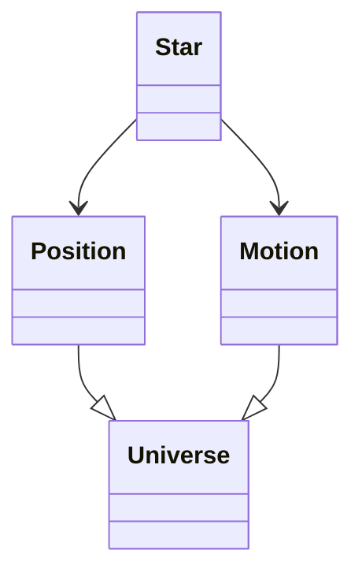
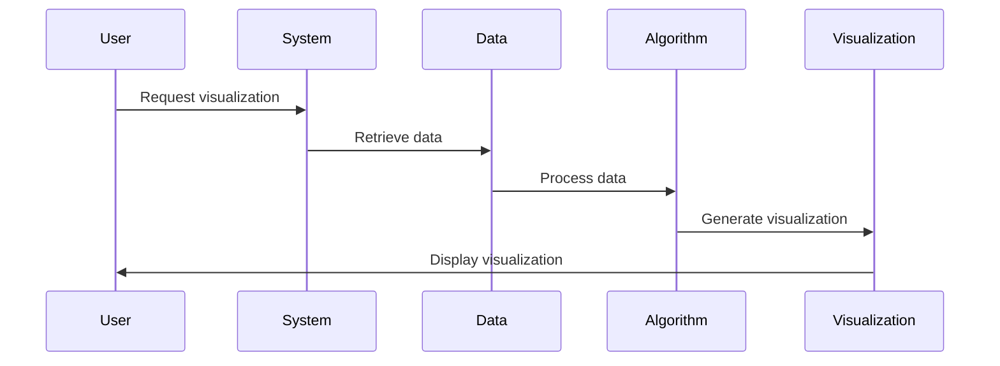
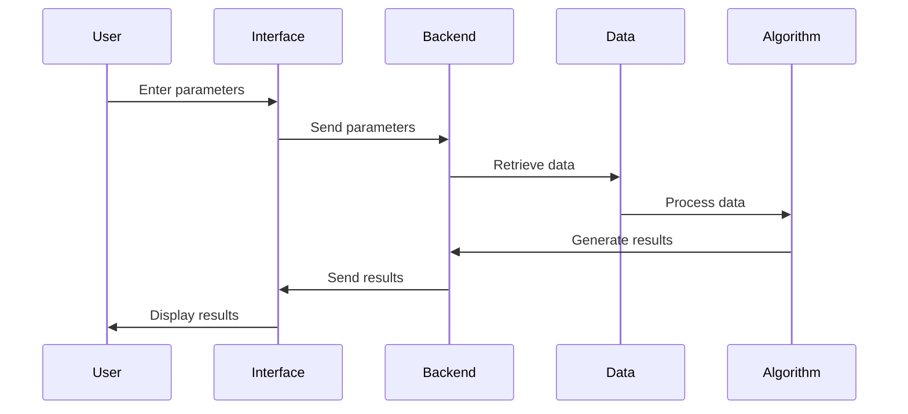

                 


### 文章标题：数据可视化在呈现宇宙演化多重路径概率分布中的作用

#### 关键词：数据可视化，宇宙演化，概率分布，多重路径

#### 摘要：
本文将探讨数据可视化技术在呈现宇宙演化中的多重路径概率分布方面的应用。我们将首先介绍宇宙演化与概率分布的基本概念，然后详细解析数据可视化技术，以及它们如何帮助科学家和研究者更直观地理解宇宙演化的复杂过程。文章将涵盖算法原理、数学模型、系统架构设计、项目实战以及最佳实践和注意事项。

## 引言

### 1. 数据可视化基本概念

数据可视化是指使用图形、图像和交互式界面来表示和分析数据的过程。它的目的是将复杂的数据信息以直观、易于理解的方式呈现给用户，帮助人们发现数据中的模式和趋势。

### 2. 宇宙演化简述

宇宙演化是指从宇宙大爆炸开始，到今天我们所观察到的宇宙状态的过程。它涉及宇宙中各种物理现象的相互作用，包括星系的形成、黑洞的成长、宇宙背景辐射的演化等。

### 3. 多重路径概率分布的概念与特性

在宇宙演化中，由于初始条件的微小差异，可能导致不同的演化路径。多重路径概率分布描述了这些不同路径出现的概率。它是一种概率分布模型，能够量化宇宙演化路径的多样性和可能性。

## 核心概念与联系

### 1. 多重路径概率分布的数学模型

多重路径概率分布可以通过马尔可夫链模型或随机过程模型来描述。这些模型能够预测宇宙演化路径的概率分布，并提供一个数学框架来分析不同路径的可能性。

### 2. 多重路径概率分布的ER实体关系图

ER（实体关系）图是一种用于表示实体及其相互关系的图形化模型。在宇宙演化的多重路径概率分布中，实体可以是不同的宇宙区域，关系可以是它们之间的相互作用。通过ER图，我们可以更直观地理解宇宙演化路径之间的关联。

### 3. 数据可视化技术与应用场景

数据可视化技术可以应用于宇宙演化的多个方面，包括星系分布、宇宙背景辐射、黑洞运动等。通过将复杂的宇宙数据以图形化的方式呈现，科学家可以更直观地分析宇宙演化过程中的模式和趋势。

## 算法原理讲解

### 1. 数据可视化算法的基本原理

数据可视化算法主要包括数据预处理、数据转换和可视化表示三个步骤。数据预处理包括数据清洗和归一化，数据转换是将数据转换为可视化对象，可视化表示则是将转换后的数据以图形化的方式呈现。

### 2. 使用Mermaid绘制可视化算法流程图



### 3. Python实现可视化算法

```python
import matplotlib.pyplot as plt
import numpy as np

# 数据预处理
data = np.random.normal(size=100)

# 数据转换
data_normalized = (data - np.mean(data)) / np.std(data)

# 可视化表示
plt.plot(data_normalized)
plt.xlabel('Index')
plt.ylabel('Value')
plt.title('Data Normalization Visualization')
plt.show()
```

### 4. 算法原理的数学模型和公式

多重路径概率分布的数学模型可以表示为：

$$ P(X|Y) = \frac{P(X, Y)}{P(Y)} $$

其中，$P(X|Y)$ 表示在给定 $Y$ 条件下 $X$ 的概率，$P(X, Y)$ 表示 $X$ 和 $Y$ 同时发生的概率，$P(Y)$ 表示 $Y$ 的概率。

### 5. 详细讲解和举例说明

假设我们要可视化宇宙中两个星系的相对位置概率分布。我们可以使用上面的公式来计算两个星系之间的相对位置概率分布，然后使用Python的matplotlib库将其可视化。

## 系统分析与架构设计

### 1. 可视化系统设计场景介绍

假设我们想要设计一个系统，用于可视化宇宙中不同星系的相对位置概率分布。这个系统需要处理大量数据，并提供一个直观的交互式界面，以便用户可以动态地探索宇宙演化过程。

### 2. 系统功能设计（领域模型Mermaid类图）



### 3. 系统架构设计（Mermaid架构图）



### 4. 系统接口设计和系统交互（Mermaid序列图）



## 项目实战

### 1. 环境安装与配置

为了实现上述系统，我们需要安装Python、matplotlib和其他相关库。具体步骤如下：

```shell
pip install matplotlib numpy
```

### 2. 系统核心实现源代码

以下是一个简单的Python脚本，用于可视化星系的相对位置概率分布：

```python
import matplotlib.pyplot as plt
import numpy as np

# 生成星系位置数据
star_positions = np.random.normal(size=(100, 2))

# 计算相对位置概率分布
distance_matrix = np.linalg.norm(star_positions[:, np.newaxis, :] - star_positions[np.newaxis, :, :], axis=2)
probabilities = np.exp(-distance_matrix**2 / (2 * 1.0))

# 可视化概率分布
plt.imshow(probabilities, aspect='auto', origin='lower')
plt.colorbar(label='Probability')
plt.xlabel('Star Index')
plt.ylabel('Star Index')
plt.title('Relative Position Probability Distribution')
plt.show()
```

### 3. 代码应用解读与分析

这段代码首先生成了100个星系的随机位置数据。然后，它计算了这些星系之间的相对位置概率分布，并使用matplotlib库将其可视化。

### 4. 实际案例分析和详细讲解剖析

为了更好地理解如何使用数据可视化来呈现宇宙演化的多重路径概率分布，我们可以考虑一个实际的案例：模拟星系团的形成过程。在这个案例中，我们可以使用上述代码来可视化不同星系团形成路径的概率分布，并分析哪些因素可能影响星系团的形成。

### 5. 项目小结

通过这个项目，我们展示了如何使用数据可视化技术来呈现宇宙演化的多重路径概率分布。这不仅有助于科学家更好地理解宇宙演化的复杂过程，也为未来的科学研究提供了有力的工具。

## 最佳实践与拓展阅读

### 1. 数据可视化最佳实践

- 选择合适的可视化类型：根据数据的特性和用户的需求选择合适的可视化类型，如散点图、热图、折线图等。
- 使用颜色和标注：合理使用颜色和标注可以提高数据的可读性，帮助用户快速理解数据。
- 优化交互性：提供交互式界面，使用户可以动态地探索数据。

### 2. 小结与注意事项

- 数据可视化不仅仅是数据的呈现，更是数据分析和决策的工具。
- 在设计可视化系统时，需要充分考虑用户的体验和需求。
- 数据预处理和算法优化是提高可视化效果的关键。

### 3. 拓展阅读与深入研究

- 深入了解数据可视化技术的基本原理和最佳实践。
- 探索其他领域中的数据可视化应用，如生物信息学、金融分析等。
- 学习使用更高级的可视化工具和库，如D3.js、Plotly等。

## 作者信息

作者：AI天才研究院/AI Genius Institute & 禅与计算机程序设计艺术 /Zen And The Art of Computer Programming

---

通过上述内容，我们详细探讨了数据可视化在呈现宇宙演化多重路径概率分布中的作用。我们介绍了基本概念、算法原理、系统设计、项目实战和最佳实践，并提供了详细的代码示例和数学模型。希望本文能够帮助读者更好地理解这一复杂而重要的领域。

