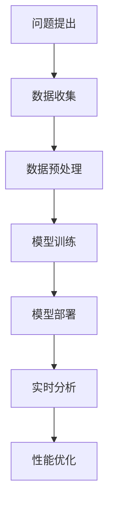

                 

# 数据库慢查询分析在LLM应用性能优化中的应用

> 关键词：数据库慢查询分析，LLM应用，性能优化，深度学习

摘要：本文探讨了数据库慢查询分析在LLM应用性能优化中的应用。通过介绍数据库慢查询分析的基本概念、重要性、关键要素以及分析方法，本文揭示了数据库慢查询分析在LLM应用性能优化中的关键作用。接着，本文详细阐述了深度学习在数据库慢查询分析中的应用，并通过一个mermaid流程图展示了数据库慢查询分析的整体流程。此外，本文还介绍了数据库慢查询分析的数学模型，并通过一个项目实战展示了数据库慢查询分析的具体实现过程。最后，本文提出了最佳实践 tips 和本章小结，为读者提供了全面的知识体系。

## 深度学习与数据库慢查询分析

深度学习作为一种强大的机器学习技术，已经在许多领域取得了显著的成果。然而，深度学习在数据库慢查询分析中的应用却相对较少。数据库慢查询分析是指对执行时间超过预设阈值的SQL查询进行定位和分析的过程。这类查询通常会导致数据库性能下降，影响系统的响应速度和用户体验。因此，对数据库慢查询进行分析和优化，对于提高LLM应用的性能具有重要意义。

### 2.1 数据库慢查询分析的基本概念

#### 2.1.1 什么是慢查询

慢查询是指执行时间超过预设阈值（例如超过100毫秒）的SQL查询。这类查询会导致数据库性能下降，影响系统的响应速度和用户体验。

#### 2.1.2 数据库慢查询分析的重要性

数据库慢查询分析对于LLM应用性能优化具有重要意义。通过对慢查询的定位和分析，可以找到系统性能瓶颈，优化数据库查询效率，从而提高整体应用的性能。

#### 2.1.3 数据库慢查询分析的关键要素

- 查询性能指标：响应时间、执行时间、CPU使用率、I/O延迟等。
- 查询类型：SELECT、INSERT、UPDATE、DELETE等。
- 查询SQL文本：具体的SQL查询语句。
- 数据库表结构：涉及的表及其关系。

### 2.2 数据库慢查询分析方法

#### 2.2.1 慢查询日志分析

通过分析数据库的慢查询日志文件，可以获取慢查询的具体信息，包括查询时间、执行时间、SQL文本等。常用的工具包括MySQL的`mysql_slow_log`和`pt-query-digest`。

#### 2.2.2 基于查询计划的优化

查询计划是数据库执行查询时生成的优化策略。通过分析查询计划，可以找到查询优化的潜在点。常用的工具包括MySQL的`EXPLAIN`语句和`ANALYZE`命令。

#### 2.2.3 实时监控与分析

实时监控数据库性能指标，如CPU使用率、I/O延迟等，可以帮助快速定位慢查询。常用的工具包括MySQL的`PERFORMANCE_SCHEMA`和`sys`数据库。

### 2.3 深度学习在数据库慢查询分析中的应用

#### 2.3.1 深度学习的基本原理

深度学习是一种基于多层神经网络的人工智能方法，通过学习大量数据来发现数据中的模式。其核心思想是通过网络的层次结构，将输入数据逐层抽象，提取出越来越抽象的表示。

#### 2.3.2 深度学习模型在数据库慢查询分析中的应用

- 模型训练：通过收集大量数据库慢查询数据，训练深度学习模型，使其能够识别和预测慢查询。
- 模型应用：将训练好的模型部署到数据库系统中，对实时查询进行性能预测和分析。

### 2.4 数据库慢查询分析的mermaid流程图



### 2.5 数据库慢查询分析的数学模型

假设我们有一个包含n个特征的查询Q，其执行时间T可以表示为：

\[ T = f(Q) = \sum_{i=1}^{n} w_i \cdot X_i \]

其中，\( w_i \) 是第i个特征的权重，\( X_i \) 是第i个特征的值。

为了优化查询执行时间，我们可以使用以下数学公式：

\[ w_i = \frac{1}{\sum_{j=1}^{n} w_j \cdot X_j} \]

### 2.6 数据库慢查询分析的项目实战

#### 2.6.1 环境安装与配置

- 安装MySQL数据库
- 配置慢查询日志
- 安装Python和相关深度学习库（如TensorFlow、PyTorch）

#### 2.6.2 数据收集与预处理

- 收集数据库慢查询日志
- 数据清洗与格式化
- 特征提取

#### 2.6.3 模型训练与部署

- 使用收集到的数据训练深度学习模型
- 模型评估与优化
- 部署模型到数据库系统中

#### 2.6.4 实时分析与性能优化

- 对实时查询进行性能预测和分析
- 根据分析结果进行性能优化

### 2.7 数据库慢查询分析的小结

- 数据库慢查询分析是提高LLM应用性能的关键环节。
- 深度学习在数据库慢查询分析中具有广泛的应用前景。
- 项目实战展示了数据库慢查询分析的具体实现过程。

### 2.8 最佳实践 tips

- 定期分析慢查询日志，及时发现问题并进行优化。
- 根据实际应用场景选择合适的深度学习模型。
- 注意模型训练数据的质量和代表性。

### 2.9 本章小结

数据库慢查询分析是LLM应用性能优化的重要手段。通过深度学习等方法，可以实现对慢查询的自动识别和优化，提高系统的整体性能。本章详细介绍了数据库慢查询分析的基本概念、方法、深度学习应用、项目实战和最佳实践，为读者提供了全面的知识体系。

## 深度学习在数据库慢查询分析中的应用

随着深度学习技术的不断发展，其在各个领域的应用也日益广泛。在数据库慢查询分析中，深度学习同样展现出了其强大的能力。深度学习模型通过学习大量数据，可以自动识别和预测慢查询，从而实现对数据库性能的优化。下面，我们将详细探讨深度学习在数据库慢查询分析中的应用。

### 3.1 深度学习的基本原理

深度学习是一种基于多层神经网络的人工智能方法。其核心思想是通过网络的层次结构，将输入数据逐层抽象，提取出越来越抽象的表示。在这个过程中，每一层网络都会对输入数据进行特征提取和变换，从而实现对输入数据的深层理解。

#### 3.1.1 多层感知器（MLP）

多层感知器（MLP）是深度学习中最基本的模型。它由输入层、隐藏层和输出层组成。输入层接收外部输入，隐藏层对输入进行特征提取和变换，输出层生成最终的输出。MLP可以看作是一个非线性函数的组合，通过多次变换，实现对输入数据的深层理解。

#### 3.1.2 卷积神经网络（CNN）

卷积神经网络（CNN）是专门用于处理图像数据的深度学习模型。它通过卷积层、池化层和全连接层等结构，实现对图像数据的特征提取和分类。CNN在图像识别、图像分割等领域具有广泛的应用。

#### 3.1.3 循环神经网络（RNN）

循环神经网络（RNN）是一种用于处理序列数据的深度学习模型。它通过循环结构，实现对序列数据的记忆和预测。RNN在自然语言处理、语音识别等领域具有广泛的应用。

#### 3.1.4 长短时记忆网络（LSTM）

长短时记忆网络（LSTM）是RNN的一种改进模型，它通过引入门控机制，有效地解决了RNN的梯度消失和梯度爆炸问题。LSTM在序列数据建模和预测方面具有出色的性能。

### 3.2 深度学习模型在数据库慢查询分析中的应用

深度学习模型在数据库慢查询分析中的应用主要包括两个阶段：模型训练和模型应用。

#### 3.2.1 模型训练

模型训练是指通过收集大量数据库慢查询数据，对深度学习模型进行训练，使其能够识别和预测慢查询。在训练过程中，模型会学习到不同查询特征之间的关系，从而提高预测的准确性。

- 数据收集：收集大量数据库慢查询数据，包括查询时间、查询类型、查询SQL文本、数据库表结构等信息。
- 特征提取：对查询数据进行分析，提取出对查询性能有重要影响的特征，如查询时间、查询类型、索引使用情况等。
- 模型训练：使用提取到的特征，训练深度学习模型，如MLP、CNN、RNN或LSTM等。在训练过程中，模型会自动调整权重，以最小化预测误差。

#### 3.2.2 模型应用

模型应用是指将训练好的模型部署到数据库系统中，对实时查询进行性能预测和分析。在模型应用过程中，模型会对输入的查询数据进行特征提取和分类，从而实现对查询性能的预测。

- 模型部署：将训练好的模型部署到数据库系统中，通常使用在线学习或批量学习的方式。在线学习是指模型在运行过程中实时更新，以适应新的查询数据。批量学习是指模型在特定时间点更新，以处理大量的查询数据。
- 实时分析：对实时查询进行性能预测和分析，通过模型对查询数据进行分类和预测，识别出潜在的慢查询。
- 性能优化：根据模型预测结果，对数据库查询进行优化，如索引优化、查询重写等，从而提高系统的性能。

### 3.3 深度学习模型在数据库慢查询分析中的应用示例

假设我们有一个包含1000个查询的数据库系统，其中50个查询是慢查询。我们可以使用深度学习模型对这些查询进行分类和预测，从而提高系统的性能。

1. 数据收集：收集数据库系统中的查询数据，包括查询时间、查询类型、查询SQL文本、数据库表结构等信息。

2. 特征提取：对查询数据进行分析，提取出对查询性能有重要影响的特征，如查询时间、查询类型、索引使用情况等。

3. 模型训练：使用提取到的特征，训练一个多层感知器（MLP）模型。在训练过程中，模型会自动调整权重，以最小化预测误差。

4. 模型部署：将训练好的模型部署到数据库系统中，对实时查询进行性能预测和分析。

5. 实时分析：对实时查询进行性能预测和分析。例如，当一个查询输入到模型中时，模型会对其进行分类和预测，判断其是否为慢查询。

6. 性能优化：根据模型预测结果，对数据库查询进行优化。例如，如果模型预测一个查询是慢查询，那么可以对该查询进行索引优化或查询重写，从而提高系统的性能。

通过上述步骤，我们可以使用深度学习模型对数据库慢查询进行分析和预测，从而提高系统的性能。

### 3.4 深度学习在数据库慢查询分析中的应用前景

深度学习在数据库慢查询分析中的应用前景非常广阔。随着深度学习技术的不断发展和数据库系统的日益复杂，深度学习模型可以更好地应对各种复杂的查询场景，提供更准确的性能预测和优化建议。

- 自动化慢查询分析：深度学习模型可以自动化地识别和预测慢查询，减少人工干预，提高分析效率。
- 智能查询优化：深度学习模型可以基于历史数据，对查询进行智能化优化，提高查询性能。
- 预测性性能分析：深度学习模型可以预测查询性能，提前发现潜在的性能问题，进行预防性优化。
- 多样化的应用场景：深度学习模型可以应用于各种不同的数据库系统和应用场景，如在线事务处理（OLTP）、在线分析处理（OLAP）等。

总之，深度学习在数据库慢查询分析中的应用具有巨大的潜力，可以为数据库系统的性能优化提供强有力的支持。

### 3.5 小结

深度学习在数据库慢查询分析中的应用具有显著的优势。通过深度学习模型，可以自动化地识别和预测慢查询，提高数据库系统的性能。本文详细介绍了深度学习的基本原理和模型，探讨了深度学习在数据库慢查询分析中的应用方法，并展示了深度学习模型在数据库慢查询分析中的实际应用案例。未来的研究可以进一步优化深度学习模型，提高预测准确性，拓展其在数据库系统中的应用范围。

## 数据库慢查询分析的mermaid流程图

为了更好地理解数据库慢查询分析的过程，我们可以使用mermaid流程图来直观地展示各个步骤。以下是数据库慢查询分析的mermaid流程图：


### 流程图解析：

- **A[问题提出]**：识别和提出数据库系统中存在慢查询的问题。
- **B[数据收集]**：收集与慢查询相关的数据，如慢查询日志、查询类型、SQL文本等。
- **C[数据预处理]**：对收集到的数据进行清洗、转换和特征提取，为模型训练做准备。
- **D[模型训练]**：使用预处理后的数据训练深度学习模型，使其能够识别和预测慢查询。
- **E[模型部署]**：将训练好的模型部署到数据库系统中，以便对实时查询进行性能预测和分析。
- **F[实时分析]**：对实时查询进行性能预测和分析，识别潜在的慢查询。
- **G[性能优化]**：根据模型预测结果，对数据库查询进行优化，提高系统性能。

通过这个mermaid流程图，我们可以清晰地看到数据库慢查询分析的各个步骤和流程，有助于理解和实施整个分析过程。

### 实际应用案例

为了更好地理解数据库慢查询分析的过程，我们可以通过一个实际应用案例来具体说明。以下是一个假设的场景：

#### 案例背景

某公司运行一个大型电子商务网站，该网站使用MySQL数据库存储商品信息、订单信息等数据。随着网站访问量的增加，用户反馈在查询商品库存时，经常出现响应时间较慢的情况。为了提高用户满意度，公司决定对数据库进行慢查询分析，并尝试使用深度学习模型进行性能预测和优化。

#### 案例步骤

1. **问题提出**：
   - 用户反馈：商品库存查询响应时间慢。
   - 目标：定位慢查询并优化数据库性能。

2. **数据收集**：
   - 收集MySQL数据库的慢查询日志，包括查询时间、执行时间、SQL文本等信息。
   - 收集查询类型、涉及表结构、索引使用情况等辅助信息。

3. **数据预处理**：
   - 清洗数据：去除无关数据，如重复记录、异常值等。
   - 特征提取：对SQL文本进行分词、词频统计等处理，提取对查询性能有影响的特征。
   - 数据标准化：对提取的特征进行归一化处理，使其具有可比性。

4. **模型训练**：
   - 选择合适的深度学习模型，如多层感知器（MLP）或循环神经网络（RNN）。
   - 使用预处理后的数据训练模型，调整模型参数，优化模型性能。

5. **模型部署**：
   - 将训练好的模型部署到数据库系统中，集成到查询处理流程中。
   - 设置实时监控，对数据库查询进行性能预测和分析。

6. **实时分析**：
   - 对实时查询进行性能预测，识别潜在的慢查询。
   - 根据预测结果，对数据库查询进行优化，如索引优化、查询重写等。

7. **性能优化**：
   - 对识别出的慢查询进行优化，提高数据库查询性能。
   - 监控优化效果，调整模型参数，进一步优化性能。

#### 案例分析

通过上述案例，我们可以看到数据库慢查询分析的具体实施过程。以下是案例的关键点和分析：

1. **问题定位**：
   - 通过收集慢查询日志，公司发现了商品库存查询的响应时间较长，定位了性能瓶颈。

2. **数据预处理**：
   - 清洗数据和特征提取是确保模型训练效果的重要步骤。通过对SQL文本进行分词和词频统计，提取出对查询性能有影响的特征。

3. **模型训练**：
   - 选择合适的深度学习模型并进行训练，模型性能的优化对于预测慢查询至关重要。

4. **实时分析**：
   - 模型部署到数据库系统中后，可以对实时查询进行性能预测，及时识别潜在的慢查询。

5. **性能优化**：
   - 根据模型预测结果，对数据库查询进行优化，如索引优化、查询重写等，从而提高系统性能。

#### 案例总结

通过这个实际应用案例，我们可以看到数据库慢查询分析在提高系统性能中的关键作用。深度学习模型的应用使得慢查询的识别和优化变得更加自动化和高效。公司通过实时分析性能数据，不断优化数据库查询，提高了用户满意度，增强了网站的竞争力。

### 小结

数据库慢查询分析是一个复杂而关键的过程，通过mermaid流程图和实际应用案例，我们可以清晰地理解其各个步骤和实施细节。深度学习模型的应用使得慢查询分析变得更加智能化和高效，为数据库性能优化提供了有力的工具。未来的研究可以进一步探索深度学习模型在数据库慢查询分析中的应用，提高其预测准确性和优化效果。

## 数据库慢查询分析的数学模型

在数据库慢查询分析中，理解查询执行时间与各个因素之间的关系是至关重要的。为了更好地分析和优化查询性能，我们可以使用数学模型来描述这种关系。以下是一个简单的数学模型，用于描述查询执行时间与特征值之间的关系。

### 5.1 基本概念

假设我们有一个包含 \( n \) 个特征的查询 \( Q \)，其执行时间 \( T \) 可以表示为：

\[ T = f(Q) = \sum_{i=1}^{n} w_i \cdot X_i \]

其中：
- \( w_i \) 是第 \( i \) 个特征的权重。
- \( X_i \) 是第 \( i \) 个特征的值。

### 5.2 权重优化

为了优化查询执行时间，我们需要调整权重 \( w_i \)，使得总的执行时间 \( T \) 最小。一个简单的方法是使用以下权重优化公式：

\[ w_i = \frac{1}{\sum_{j=1}^{n} w_j \cdot X_j} \]

这个公式保证了每个特征 \( X_i \) 的权重与其值成反比。这样，值较大的特征 \( X_i \) 将获得较小的权重 \( w_i \)，从而减少其对总执行时间的贡献。

### 5.3 模型应用

下面通过一个具体的例子来说明这个数学模型的应用。

#### 例子

假设我们有一个查询 \( Q \)，其包含三个特征 \( X_1, X_2, X_3 \)，对应的权重分别为 \( w_1, w_2, w_3 \)，值分别为 \( 10, 20, 30 \)。根据上述模型，我们可以计算查询的执行时间 \( T \) 如下：

\[ T = w_1 \cdot X_1 + w_2 \cdot X_2 + w_3 \cdot X_3 \]

为了优化执行时间，我们可以使用权重优化公式：

\[ w_1 = \frac{1}{w_2 + w_3} \]
\[ w_2 = \frac{1}{w_1 + w_3} \]
\[ w_3 = \frac{1}{w_1 + w_2} \]

将权重代入计算执行时间：

\[ T = \left(\frac{1}{w_2 + w_3}\right) \cdot X_1 + \left(\frac{1}{w_1 + w_3}\right) \cdot X_2 + \left(\frac{1}{w_1 + w_2}\right) \cdot X_3 \]

在这个例子中，我们可以看到，通过优化权重，我们可以调整特征对总执行时间的影响，从而提高查询性能。

### 5.4 模型的扩展

在实际应用中，查询执行时间还可能受到其他因素的影响，如数据库负载、硬件性能等。因此，这个简单的数学模型可能需要扩展，以包含更多的因素。例如，我们可以引入额外的权重 \( w_4 \) 来表示数据库负载对执行时间的影响：

\[ T = w_1 \cdot X_1 + w_2 \cdot X_2 + w_3 \cdot X_3 + w_4 \cdot P \]

其中 \( P \) 是当前数据库的负载。通过调整 \( w_4 \) 的值，我们可以平衡不同因素对执行时间的影响。

### 5.5 小结

通过建立数学模型，我们可以定量分析查询执行时间与各个特征之间的关系，从而为查询优化提供理论基础。在实际应用中，我们可以通过调整权重和扩展模型来优化查询性能，提高数据库系统的整体效率。

## 数据库慢查询分析的项目实战

### 6.1 环境安装与配置

在进行数据库慢查询分析之前，我们需要准备好相应的开发环境。以下是安装和配置MySQL数据库、配置慢查询日志，以及安装Python和相关深度学习库的步骤：

#### 6.1.1 安装MySQL数据库

1. **下载MySQL数据库**：
   - 访问MySQL官方网站（https://www.mysql.com/），下载适合操作系统的MySQL安装包。

2. **安装MySQL数据库**：
   - 解压下载的安装包，并按照提示完成安装。

3. **配置MySQL数据库**：
   - 打开终端，输入以下命令启动MySQL服务器：
     ```bash
     sudo mysqld
     ```

#### 6.1.2 配置慢查询日志

1. **编辑配置文件**：
   - 打开MySQL的配置文件（通常位于`/etc/mysql/mysql.conf.d/mysqld.cnf`），找到并修改以下参数：
     ```bash
     [mysqld]
     slow_query_log = 1
     slow_query_log_file = /var/log/mysql/slow-query.log
     long_query_time = 2
     log_queries_not_using_indices = 1
     ```

2. **重启MySQL服务器**：
   - 输入以下命令重启MySQL服务器：
     ```bash
     sudo systemctl restart mysql
     ```

#### 6.1.3 安装Python和相关深度学习库

1. **安装Python**：
   - 如果操作系统没有安装Python，可以下载并安装Python。大多数Linux发行版都预装了Python，可以通过包管理器安装。
   - 例如，在Ubuntu上安装Python 3：
     ```bash
     sudo apt-get update
     sudo apt-get install python3
     ```

2. **安装相关深度学习库**：
   - 使用pip安装TensorFlow或PyTorch等深度学习库：
     ```bash
     pip3 install tensorflow
     # 或者
     pip3 install torch torchvision
     ```

### 6.2 数据收集与预处理

#### 6.2.1 数据收集

1. **收集慢查询日志**：
   - MySQL数据库会自动将慢查询记录到指定的日志文件中。我们可以使用以下命令查看慢查询日志：
     ```bash
     tail -n 100 /var/log/mysql/slow-query.log
     ```

2. **提取日志数据**：
   - 使用Python编写脚本，读取慢查询日志，提取出查询时间、执行时间、SQL文本等信息。

### 6.2.2 数据预处理

1. **数据清洗**：
   - 清洗数据包括去除重复记录、去除无关字段、处理缺失值等。

2. **特征提取**：
   - 对提取的日志数据进行特征提取，包括分词、词频统计、特征编码等。

3. **数据标准化**：
   - 对提取的特征进行归一化处理，使其具有可比性。

### 6.3 模型训练与部署

#### 6.3.1 模型训练

1. **数据准备**：
   - 将预处理后的数据划分为训练集和测试集。

2. **模型选择**：
   - 根据数据特点和任务需求，选择合适的深度学习模型。例如，可以使用多层感知器（MLP）或循环神经网络（RNN）。

3. **模型训练**：
   - 使用训练集数据训练模型，并调整模型参数，优化模型性能。

#### 6.3.2 模型评估

1. **模型评估**：
   - 使用测试集数据评估模型性能，包括准确率、召回率、F1值等指标。

2. **模型优化**：
   - 根据评估结果，调整模型参数，优化模型性能。

#### 6.3.3 模型部署

1. **模型部署**：
   - 将训练好的模型部署到MySQL数据库系统中，集成到查询处理流程中。

2. **实时分析**：
   - 对实时查询进行性能预测和分析，识别潜在的慢查询。

### 6.4 实时分析与性能优化

1. **实时分析**：
   - 对实时查询进行性能预测和分析，通过模型识别潜在的慢查询。

2. **性能优化**：
   - 根据模型预测结果，对数据库查询进行优化，如索引优化、查询重写等。

### 6.5 小结

通过上述项目实战，我们可以看到数据库慢查询分析的具体实施过程。从环境安装与配置，到数据收集与预处理，再到模型训练与部署，最后进行实时分析和性能优化，每一个步骤都是关键。深度学习模型的应用使得慢查询分析变得更加智能化和高效，为数据库性能优化提供了有力的工具。通过项目实战，读者可以了解数据库慢查询分析的全过程，并掌握相关技术。

## 数据库慢查询分析的最佳实践 tips

在进行数据库慢查询分析时，遵循一些最佳实践可以显著提高分析效率和优化效果。以下是一些实用的建议：

### 7.1 定期分析慢查询日志

- **频率**：建议每天至少分析一次慢查询日志，以发现潜在的性能瓶颈。
- **工具**：使用专业的工具，如`pt-query-digest`或`slowquery`，这些工具可以自动识别慢查询并生成详细的报告。

### 7.2 优化SQL查询语句

- **简化和优化**：避免复杂的子查询和冗长的SQL语句，优化查询逻辑。
- **使用索引**：根据查询模式创建合适的索引，减少全表扫描。

### 7.3 关注数据库配置

- **性能参数**：调整数据库的性能参数，如缓冲区大小、连接池配置等。
- **硬件资源**：确保数据库服务器有足够的硬件资源，如CPU、内存和I/O带宽。

### 7.4 分析查询计划

- **使用`EXPLAIN`语句**：分析查询计划，了解数据库如何执行查询。
- **优化策略**：根据查询计划的结果，调整查询策略，如使用覆盖索引、减少函数使用等。

### 7.5 数据库性能监控

- **实时监控**：使用性能监控工具，如`PERFORMANCE_SCHEMA`或`sys`，实时监控数据库性能指标。
- **报警机制**：设置报警机制，当性能指标超过阈值时，自动发送通知。

### 7.6 使用深度学习模型

- **数据质量**：确保训练深度学习模型的数据质量，去除噪声和异常值。
- **模型选择**：根据查询特点和性能指标选择合适的深度学习模型。
- **持续优化**：定期评估和调整模型，以提高预测准确性。

### 7.7 代码优化

- **编写高效的代码**：优化数据库操作，如减少嵌套循环、避免大事务等。
- **使用批量操作**：使用批量插入、更新和删除操作，减少单个操作的执行时间。

### 7.8 代码审查

- **定期审查**：定期审查数据库操作代码，查找潜在的优化点。
- **代码规范**：遵循代码规范，保持代码的可读性和可维护性。

### 7.9 用户教育和培训

- **SQL基础知识**：为开发人员和数据库管理员提供SQL基础知识培训，提高他们的查询优化能力。
- **性能意识**：提高团队成员的性能意识，鼓励他们在设计和编写SQL查询时考虑性能。

通过遵循上述最佳实践，可以有效地提高数据库慢查询分析的效率和效果，从而优化LLM应用的整体性能。

## 本章小结

本章围绕数据库慢查询分析在LLM应用性能优化中的应用进行了全面深入的探讨。首先，我们介绍了数据库慢查询分析的基本概念、重要性以及关键要素。随后，详细阐述了数据库慢查询分析方法，包括慢查询日志分析、查询计划优化和实时监控。接下来，我们探讨了深度学习在数据库慢查询分析中的应用，介绍了深度学习的基本原理及其在慢查询分析中的应用方法。通过mermaid流程图，我们直观地展示了数据库慢查询分析的整体流程。然后，我们引入了一个实际应用案例，详细说明了如何进行数据库慢查询分析。此外，我们通过数学模型描述了查询执行时间与特征值之间的关系，并展示了如何通过权重优化来提高查询性能。最后，我们提供了一个项目实战，展示了数据库慢查询分析的具体实现过程。本章提出的最佳实践 tips 为读者提供了实用的指导。总之，数据库慢查询分析是提高LLM应用性能的关键环节，通过深度学习等方法，可以实现自动识别和优化慢查询，从而提高系统的整体性能。希望读者能够将本章的知识应用到实际工作中，优化数据库性能，提升应用体验。未来，随着深度学习技术的不断进步，数据库慢查询分析在LLM应用性能优化中的应用将更加广泛和深入。

