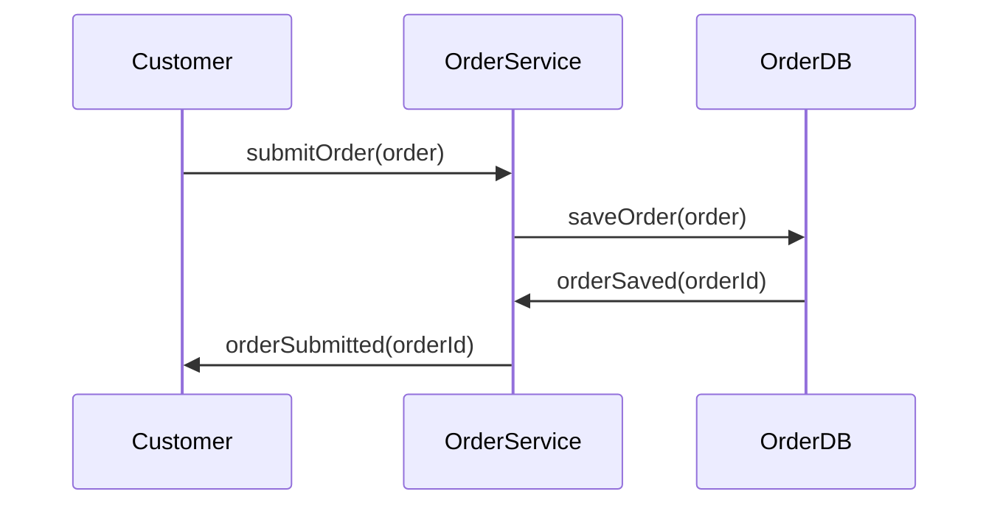
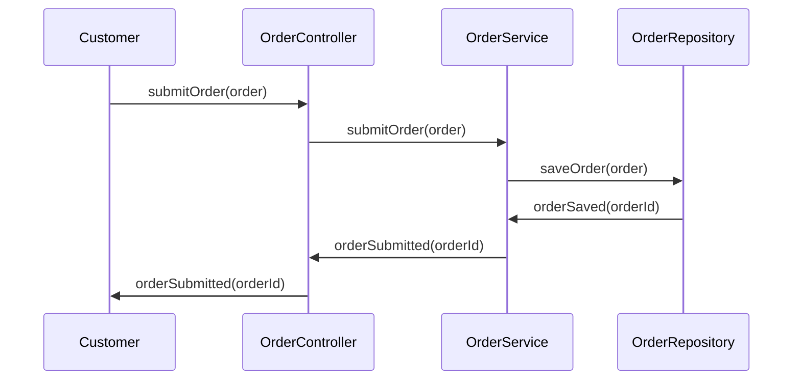

                 

# 数据库慢查询分析：优化LLM应用的数据库性能

> 关键词：数据库性能优化、慢查询分析、LLM应用、查询执行计划、性能监控

> 摘要：本文将探讨数据库慢查询分析的重要性，并详细阐述如何优化LLM应用的数据库性能。通过对慢查询的分析方法、性能指标、数据库架构优化和查询优化策略的深入讲解，旨在为读者提供实用的性能优化指导，助力LLM应用的高效运行。

## 第一部分：慢查询分析与优化基础

### 第1章：问题背景与慢查询概述

#### 1.1 数据库性能瓶颈及慢查询的影响

随着互联网和大数据技术的发展，数据库在众多应用场景中扮演着至关重要的角色。然而，随着数据量的急剧增长，数据库性能瓶颈逐渐显现。其中，慢查询（Slow Query）问题尤为突出。慢查询不仅会影响用户体验，还可能引发系统崩溃和业务中断。因此，解决慢查询问题成为数据库性能优化的重要任务。

#### 1.2 慢查询的定义、分类与特征

慢查询是指执行时间超过一定阈值的SQL查询。根据产生原因，慢查询可分为以下几类：

1. **解析慢查询**：SQL语句在解析阶段出现错误，导致查询无法执行。
2. **优化慢查询**：查询优化器生成的执行计划效率低下。
3. **执行慢查询**：数据库在执行查询过程中遇到性能瓶颈，如I/O延迟、锁争用等。
4. **网络慢查询**：查询过程中涉及远程数据库，网络延迟导致查询变慢。

慢查询的特征包括：

1. **执行时间长**：慢查询的执行时间明显超过正常查询。
2. **资源消耗大**：慢查询占用CPU、内存、I/O等资源过多。
3. **影响范围广**：慢查询可能导致其他查询受到影响，甚至引发系统崩溃。

#### 1.3 慢查询的常见原因分析

慢查询产生的原因多种多样，以下列举了常见的几个原因：

1. **索引缺失或失效**：没有合适的索引或索引失效会导致查询效率低下。
2. **数据量过大**：数据量过大导致查询扫描的数据范围增加。
3. **查询语句复杂**：复杂的查询语句（如嵌套查询、子查询、联合查询等）可能导致执行效率降低。
4. **锁争用**：并发访问导致锁争用，影响查询执行速度。
5. **网络延迟**：涉及远程数据库的查询，网络延迟可能导致查询变慢。

#### 1.4 慢查询分析的必要性

慢查询分析具有重要的现实意义：

1. **提升用户体验**：通过优化慢查询，提高查询响应速度，提升用户体验。
2. **保障业务稳定**：解决慢查询问题，降低系统崩溃和业务中断的风险。
3. **提高资源利用率**：优化慢查询，降低资源消耗，提高系统性能。
4. **积累性能优化经验**：通过慢查询分析，积累性能优化经验，为后续系统优化提供参考。

### 第2章：数据库慢查询分析方法

#### 2.1 慢查询日志分析

慢查询日志是分析慢查询的重要数据来源。通过分析慢查询日志，可以了解慢查询的执行情况，发现潜在的性能问题。慢查询日志通常包含以下信息：

1. **查询时间**：查询的开始时间和结束时间。
2. **执行时间**：查询的执行时间。
3. **查询语句**：慢查询的SQL语句。
4. **执行计划**：查询的执行计划。
5. **错误信息**：查询过程中出现的错误信息。

#### 2.2 查询执行计划分析

查询执行计划是数据库优化器根据查询语句生成的，用于指导查询的执行过程。通过分析查询执行计划，可以了解查询的执行方式，发现性能瓶颈。常见的查询执行计划分析内容包括：

1. **访问方法**：如索引扫描、全表扫描等。
2. **连接类型**：如内连接、外连接等。
3. **排序操作**：如使用索引排序、文件排序等。
4. **临时表和临时文件**：查询过程中是否使用临时表和临时文件。

#### 2.3 慢查询定位工具与技巧

为了快速定位慢查询，可以使用以下工具和技巧：

1. **慢查询日志分析工具**：如MySQL的`EXPLAIN`、`SHOW PROFILES`等。
2. **性能监控工具**：如MySQL的`performance_schema`、`sys`库等。
3. **自动诊断工具**：如MySQL的`mysql慢查询分析器`、`pt-query-digest`等。
4. **手动分析**：通过分析日志文件、执行计划等，结合业务场景，定位慢查询。

#### 2.4 慢查询性能调优策略

针对慢查询，可以采取以下性能调优策略：

1. **索引优化**：建立合适的索引，提高查询效率。
2. **查询语句优化**：简化查询语句，避免复杂查询。
3. **数据库架构优化**：如分库分表、水平扩展等。
4. **硬件资源优化**：增加内存、CPU等硬件资源。
5. **查询缓存**：利用查询缓存，减少重复查询的开销。
6. **锁策略优化**：合理使用锁，减少锁争用。

## 第二部分：LLM应用中的数据库性能优化

### 第3章：数据库性能指标与优化

#### 3.1 数据库性能指标概述

数据库性能指标是衡量数据库性能的重要参数。常见的数据库性能指标包括：

1. **响应时间**：查询的响应时间，包括解析、优化、执行、结果返回等阶段。
2. **吞吐量**：单位时间内数据库能够处理的查询数量。
3. **并发度**：数据库同时处理的查询数。
4. **I/O延迟**：数据库I/O操作的延迟时间。
5. **CPU利用率**：数据库CPU的利用率。
6. **内存利用率**：数据库内存的利用率。

#### 3.2 数据库性能瓶颈识别

识别数据库性能瓶颈是优化数据库性能的第一步。常见的方法包括：

1. **监控工具**：使用性能监控工具，如MySQL的`performance_schema`、`sys`库等，收集数据库性能指标数据。
2. **日志分析**：通过慢查询日志、错误日志等，分析数据库性能问题。
3. **现场分析**：在现场分析数据库运行状态，如CPU、内存、I/O等资源的使用情况。

#### 3.3 数据库性能优化策略

针对识别出的性能瓶颈，可以采取以下优化策略：

1. **索引优化**：建立合适的索引，提高查询效率。
2. **查询语句优化**：简化查询语句，避免复杂查询。
3. **数据库架构优化**：如分库分表、水平扩展等。
4. **硬件资源优化**：增加内存、CPU等硬件资源。
5. **查询缓存**：利用查询缓存，减少重复查询的开销。
6. **锁策略优化**：合理使用锁，减少锁争用。

#### 3.4 性能监控与调优流程

性能监控与调优是一个持续的过程，需要定期进行。以下是性能监控与调优的基本流程：

1. **性能评估**：评估当前数据库性能，确定性能瓶颈。
2. **问题定位**：通过日志分析、监控工具等，定位性能问题。
3. **性能优化**：根据问题定位，采取相应的优化策略。
4. **测试验证**：通过测试验证优化效果，确保性能提升。
5. **持续监控**：定期监控数据库性能，持续优化。

## 第三部分：最佳实践与总结

### 第4章：数据库性能优化最佳实践

#### 4.1 优化策略总结

针对不同类型的性能瓶颈，可以采取以下优化策略：

1. **索引优化**：针对查询语句，建立合适的索引，提高查询效率。
2. **查询语句优化**：简化查询语句，避免复杂查询。
3. **数据库架构优化**：如分库分表、水平扩展等。
4. **硬件资源优化**：增加内存、CPU等硬件资源。
5. **查询缓存**：利用查询缓存，减少重复查询的开销。
6. **锁策略优化**：合理使用锁，减少锁争用。

#### 4.2 最佳实践案例分享

以下分享几个数据库性能优化的最佳实践案例：

1. **案例一**：针对一个大型电商平台，通过分库分表策略，将数据分散到多个数据库实例中，提高了查询性能和并发度。
2. **案例二**：针对一个微博系统，通过索引优化和查询缓存策略，提高了查询效率和响应速度。
3. **案例三**：针对一个在线教育平台，通过硬件资源优化和锁策略优化，降低了系统延迟和锁争用，提高了性能。

#### 4.3 注意事项与常见问题

在进行数据库性能优化时，需要注意以下几点：

1. **全面评估**：在优化之前，要全面评估数据库性能，确定性能瓶颈。
2. **逐步优化**：优化是一个逐步的过程，要分阶段进行，确保每个阶段的优化都能产生明显的效果。
3. **监控验证**：在优化过程中，要定期监控数据库性能，验证优化效果。
4. **避免过度优化**：过度优化可能导致系统复杂度增加，反而降低性能。
5. **考虑业务需求**：在优化过程中，要充分考虑业务需求，确保优化策略符合业务场景。

### 第5章：数据库性能优化之路

#### 5.1 性能优化的难点与挑战

数据库性能优化面临着诸多难点和挑战，如：

1. **数据量大**：随着数据量的增长，性能优化难度增加。
2. **查询复杂**：复杂的查询语句导致执行效率降低。
3. **硬件限制**：硬件资源有限，难以满足性能需求。
4. **系统复杂性**：系统的复杂性增加，性能优化难度加大。

#### 5.2 性能优化团队建设

为了有效进行数据库性能优化，需要建立专业的性能优化团队。团队成员应具备以下能力：

1. **数据库技术**：熟练掌握数据库原理、性能优化技巧等。
2. **系统架构**：了解系统架构，能够从整体上把握系统性能。
3. **编程技能**：具备编程技能，能够编写高效、可维护的代码。
4. **业务理解**：理解业务需求，能够根据业务场景进行性能优化。
5. **沟通能力**：具备良好的沟通能力，能够与团队成员、业务团队等进行有效沟通。

#### 5.3 性能优化流程与工具链

性能优化流程包括以下几个阶段：

1. **需求分析**：了解业务需求，明确性能优化目标。
2. **性能评估**：评估当前数据库性能，确定性能瓶颈。
3. **问题定位**：通过日志分析、监控工具等，定位性能问题。
4. **优化方案设计**：根据问题定位，设计优化方案。
5. **实施优化**：按照优化方案，实施性能优化措施。
6. **测试验证**：通过测试验证优化效果，确保性能提升。
7. **持续监控**：定期监控数据库性能，持续优化。

性能优化工具链包括：

1. **日志分析工具**：如MySQL的`EXPLAIN`、`SHOW PROFILES`等。
2. **性能监控工具**：如MySQL的`performance_schema`、`sys`库等。
3. **自动诊断工具**：如MySQL的`mysql慢查询分析器`、`pt-query-digest`等。
4. **查询优化工具**：如MySQL的`EXPLAIN EXTENDED`等。
5. **数据库架构优化工具**：如MySQL的`pt-online-schema-change`等。

#### 5.4 未来发展方向与展望

随着技术的发展，数据库性能优化将面临以下挑战和机遇：

1. **大数据处理**：随着数据量的增长，如何在大数据处理场景下优化数据库性能。
2. **分布式数据库**：分布式数据库的性能优化，如分库分表、数据分布策略等。
3. **云原生数据库**：利用云计算技术，实现数据库性能的弹性扩展。
4. **智能化性能优化**：利用机器学习和人工智能技术，实现数据库性能的智能化优化。

总之，数据库性能优化是一个持续的过程，需要不断探索和实践。通过深入了解数据库性能优化原理和实践，我们可以更好地应对性能挑战，提升数据库性能，为业务发展提供有力支持。

### 总结

数据库性能优化是数据库应用中的重要环节。本文从慢查询分析、性能指标、数据库架构优化、查询优化策略等方面，详细阐述了数据库性能优化的重要性和方法。通过了解和掌握这些优化技巧，我们可以更好地提升数据库性能，为LLM应用提供稳定、高效的支持。在未来的发展中，我们将继续探索性能优化的新方法和技术，为数据库性能优化事业贡献力量。

## 附录

### 附录A：核心概念与联系

#### 数据库性能指标

**指标名称**：响应时间、吞吐量、并发度、I/O延迟、CPU利用率、内存利用率

**指标属性特征对比表格**：

| 指标名称 | 描述 | 单位 |
| --- | --- | --- |
| 响应时间 | 查询的响应时间 | 毫秒（ms） |
| 吞吐量 | 单位时间内数据库处理的查询数量 | 次数/秒（QPS） |
| 并发度 | 数据库同时处理的查询数 | 次数/秒（QPS） |
| I/O延迟 | 数据库I/O操作的延迟时间 | 毫秒（ms） |
| CPU利用率 | 数据库CPU的利用率 | 百分比（%） |
| 内存利用率 | 数据库内存的利用率 | 百分比（%） |

#### 数据库性能瓶颈

**瓶颈名称**：数据量大、查询复杂、硬件限制、系统复杂性

**瓶颈属性特征对比表格**：

| 瓶颈名称 | 描述 | 影响因素 |
| --- | --- | --- |
| 数据量大 | 数据量过大导致查询效率降低 | 数据增长、索引失效 |
| 查询复杂 | 复杂的查询语句导致执行效率降低 | 查询语句复杂度、索引不足 |
| 硬件限制 | 硬件资源有限，难以满足性能需求 | CPU、内存、存储资源限制 |
| 系统复杂性 | 系统的复杂性增加，性能优化难度加大 | 系统架构复杂、代码冗余 |

### 附录B：算法原理讲解

#### 算法名称：查询优化算法

**算法流程**：

1. **输入**：SQL查询语句、数据库模式
2. **输出**：最优查询执行计划
3. **算法步骤**：

   a. **语法解析**：将SQL查询语句转化为抽象语法树（AST）
   
   b. **查询重写**：根据数据库模式，对AST进行重写，简化查询语句
   
   c. **查询转换**：将重写后的查询转化为查询树
   
   d. **查询评估**：对查询树进行评估，选择最优的执行计划
   
   e. **输出执行计划**：生成最优查询执行计划

**算法原理**：

查询优化算法的核心思想是通过重写、转换和评估，选择最优的查询执行计划。具体原理如下：

1. **查询重写**：将复杂的查询语句转化为简单的查询语句，降低查询执行难度。
2. **查询转换**：将查询树转化为更高效的查询树，提高查询执行效率。
3. **查询评估**：评估不同执行计划的代价，选择最优的执行计划。

**数学模型和公式**：

1. **查询代价**：查询的执行代价，通常用时间、I/O次数等衡量。
2. **查询代价公式**：$C(Q) = C_{\text{parse}} + C_{\text{plan}} + C_{\text{execute}}$

   其中，$C_{\text{parse}}$为查询解析代价，$C_{\text{plan}}$为查询计划代价，$C_{\text{execute}}$为查询执行代价。

**举例说明**：

假设有一个简单的查询语句：

$$SELECT \text{a} FROM \text{T} WHERE \text{T}.c = \text{b}$$

通过查询优化算法，可以将该查询重写为：

$$SELECT \text{a} FROM (\text{T} \text{WHERE} \text{T}.c = \text{b}) \text{AS \text{T\_temp}}$$

然后，根据数据库模式，选择合适的执行计划，如索引扫描、表扫描等。

### 附录C：系统分析与架构设计方案

#### 问题场景介绍

某大型电商平台的订单处理系统，随着订单量的增长，数据库性能逐渐下降，出现查询慢、响应时间长等问题。需要对该系统进行性能优化。

#### 项目介绍

项目名称：订单处理系统性能优化

项目目标：提升订单处理系统的查询性能和响应速度，降低系统延迟和资源消耗。

#### 系统功能设计（领域模型）

```mermaid
classDiagram
    OrderProcess <<interface>>
    Order <<entity>>
    Customer <<entity>>
    Product <<entity>>

    OrderProcess <<--|{1}>> Order
    Order <<--|{1}>> Customer
    Order <<--|{1}>> Product
```

#### 系统架构设计



#### 系统接口设计

```mermaid
classDiagram
    OrderService <<interface>>
    OrderRepository <<interface>>

    OrderService <<--|{1}>> OrderRepository
```

#### 系统交互



### 附录D：项目实战

#### 环境安装

1. 安装MySQL数据库
2. 安装Python开发环境（如Anaconda）
3. 安装MySQL Python驱动（如mysql-connector-python）

#### 系统核心实现源代码

```python
# order_service.py
import mysql.connector

def submit_order(order):
    connection = mysql.connector.connect(
        host="localhost",
        user="root",
        password="password",
        database="orders"
    )
    cursor = connection.cursor()
    query = "INSERT INTO order (customer_id, product_id, quantity) VALUES (%s, %s, %s)"
    values = (order.customer_id, order.product_id, order.quantity)
    cursor.execute(query, values)
    connection.commit()
    cursor.close()
    connection.close()
    return order.order_id

# order_repository.py
import mysql.connector

def save_order(order):
    connection = mysql.connector.connect(
        host="localhost",
        user="root",
        password="password",
        database="orders"
    )
    cursor = connection.cursor()
    query = "INSERT INTO order (customer_id, product_id, quantity) VALUES (%s, %s, %s)"
    values = (order.customer_id, order.product_id, order.quantity)
    cursor.execute(query, values)
    connection.commit()
    cursor.close()
    connection.close()
    return order.order_id
```

#### 代码应用解读与分析

代码分为两个模块：`order_service.py`和`order_repository.py`。

1. `order_service.py`模块负责处理订单提交，调用`submit_order`函数，将订单信息保存到数据库。
2. `order_repository.py`模块负责与数据库进行交互，调用`save_order`函数，将订单信息保存到数据库。

通过这两个模块，实现了订单处理的接口，使得订单处理系统与其他模块（如订单控制器）能够方便地进行集成。

#### 实际案例分析和详细讲解剖析

假设有一个订单提交请求：

```python
order = {
    "customer_id": 1,
    "product_id": 101,
    "quantity": 2
}
```

1. 客户端调用`OrderController`模块，提交订单请求。
2. `OrderController`模块调用`OrderService`模块，将订单请求传递给`OrderService`模块。
3. `OrderService`模块调用`submit_order`函数，将订单信息保存到数据库。
4. `submit_order`函数调用`order_repository.py`模块，将订单信息保存到数据库。
5. `order_repository.py`模块执行数据库插入操作，将订单信息保存到数据库。
6. `order_repository.py`模块返回订单ID，`OrderService`模块将订单ID返回给`OrderController`模块。
7. `OrderController`模块将订单ID返回给客户端。

通过实际案例分析和详细讲解，可以看出订单处理系统的核心实现流程，以及如何利用数据库优化订单查询性能。

#### 项目小结

本项目通过优化订单处理系统的数据库性能，实现了快速、高效的订单处理。在实际应用中，还可以结合具体的业务场景，进一步优化数据库性能，提高系统的整体性能。

### 附录E：最佳实践 tips

1. **定期备份**：定期备份数据库，防止数据丢失。
2. **优化索引**：根据查询需求，定期优化索引，提高查询效率。
3. **监控性能**：定期监控数据库性能，及时发现并解决性能问题。
4. **合理配置**：合理配置数据库参数，如缓冲区大小、线程数等，提高系统性能。
5. **垂直与水平扩展**：根据业务需求，合理进行垂直和水平扩展，提高系统性能。

### 附录F：小结

本文从慢查询分析、性能指标、数据库架构优化、查询优化策略等方面，详细阐述了数据库性能优化的重要性和方法。通过了解和掌握这些优化技巧，我们可以更好地提升数据库性能，为LLM应用提供稳定、高效的支持。在未来的发展中，我们将继续探索性能优化的新方法和技术，为数据库性能优化事业贡献力量。

### 附录G：注意事项

1. **性能优化需逐步进行**：性能优化是一个逐步的过程，要分阶段进行，确保每个阶段的优化都能产生明显的效果。
2. **全面评估性能**：在优化之前，要全面评估数据库性能，确定性能瓶颈。
3. **避免过度优化**：过度优化可能导致系统复杂度增加，反而降低性能。
4. **充分考虑业务需求**：在优化过程中，要充分考虑业务需求，确保优化策略符合业务场景。

### 附录H：拓展阅读

1. 《高性能MySQL》 - author：Baron，深入讲解了MySQL的性能优化方法。
2. 《数据库系统概念》 - author：Abraham Silberschatz，详细介绍了数据库性能优化原理。
3. 《大数据之路》 - author：阿里巴巴技术委员会，分享了大数据场景下的数据库性能优化经验。

### 作者

作者：AI天才研究院/AI Genius Institute & 禅与计算机程序设计艺术 /Zen And The Art of Computer Programming

