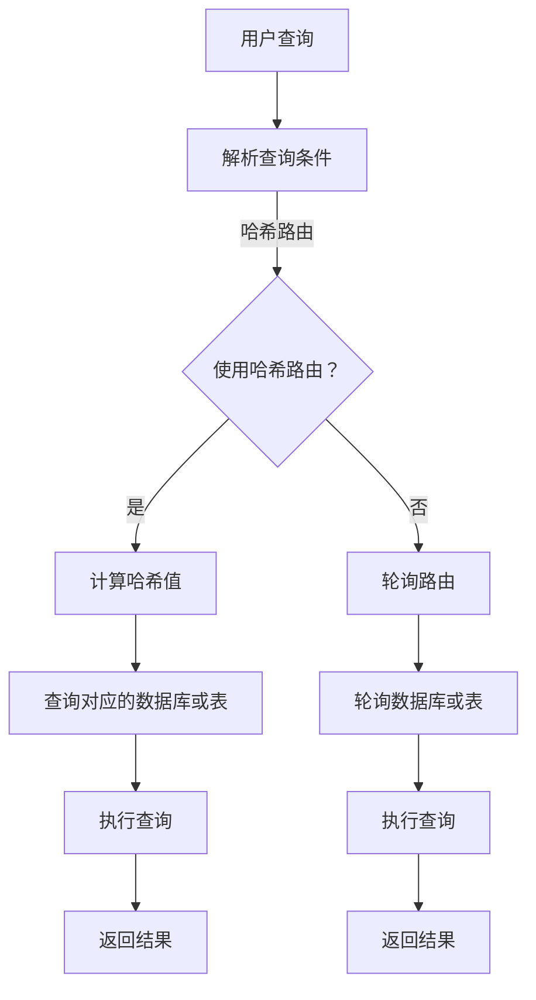

                 

### 第1章: 数据库读写分离的基本概念

#### 1.1.1 读写分离的背景
随着互联网的快速发展，业务系统的规模不断扩大，用户数量呈指数级增长。在这样的背景下，数据库系统面临着日益增加的读写请求，传统的单库单实例架构逐渐无法满足性能需求。为了应对这一问题，读写分离技术逐渐成为数据库优化的重要手段。

在单库单实例架构中，所有的读操作和写操作都集中在一个数据库实例上。当系统面临大量并发请求时，数据库的性能瓶颈变得尤为明显。读写分离通过将读操作和写操作分离到不同的数据库实例上，从而提高了系统的并发能力和读写性能。

#### 1.1.2 读写分离的重要性
读写分离技术在现代互联网应用中具有非常重要的地位。其重要性主要体现在以下几个方面：

1. 提高性能：读写分离将读操作和写操作分离，减轻了单个数据库实例的负载，提高了系统的整体性能。
2. 增强可用性：通过主从复制实现读写分离，可以保证在主数据库故障时，从数据库能够接替主数据库继续提供服务，提高了系统的可用性。
3. 灵活扩展：读写分离技术支持水平扩展，可以根据业务需求灵活增加读或写数据库实例，满足系统扩展需求。

#### 1.1.3 读写分离的定义与分类
读写分离是指将数据库的读操作和写操作分离到不同的数据库实例或服务器上，从而提高系统性能和稳定性。根据实现方式，读写分离可以分为以下几种类型：

1. 主从复制读写分离：主从复制是将数据同步到多个从库，主库负责写操作，从库负责读操作。这种方式简单易用，适用于读多写少的应用场景。
2. 分库分表读写分离：分库分表是将数据按照一定的规则分布到多个数据库或表中，每个数据库或表负责一部分读写操作。这种方式适用于数据量大、查询复杂的应用场景。
3. 中间件代理读写分离：中间件代理是指通过一个中间件服务器代理所有的读写请求，根据策略将请求分发到不同的数据库实例或服务器上。这种方式灵活度高，但实现相对复杂。

#### 1.1.4 读写分离的实现方式
读写分离的实现方式主要包括以下几种：

1. 主从复制读写分离：
   - 步骤1：配置主从复制，设置主库和从库。
   - 步骤2：在应用层设置读写分离策略，读操作连接从库，写操作连接主库。
   - 步骤3：监控主从复制状态，确保数据同步。

2. 分库分表读写分离：
   - 步骤1：设计数据分片策略，根据业务逻辑和数据量进行分库分表。
   - 步骤2：在应用层实现分库分表的查询优化，根据查询条件选择合适的数据库或表。
   - 步骤3：监控分库分表状态，确保数据一致性和查询性能。

3. 中间件代理读写分离：
   - 步骤1：选择合适的中间件代理，如MySQL Proxy、MaxScale等。
   - 步骤2：配置中间件代理，设置读写分离策略和路由规则。
   - 步骤3：监控中间件代理状态，确保请求分发和负载均衡。

#### 1.1.5 本章小结
本章介绍了数据库读写分离的背景、重要性、定义与分类以及实现方式。下一章将深入探讨数据库读写分离的原理。

----------------------------------------------------------------

## 第2章: 数据库读写分离的原理

### 2.1.1 数据库的架构

数据库的架构可以分为三个层次：数据存储层、数据访问层和应用层。

1. **数据存储层**：负责存储数据，包括数据表、索引、日志等。常用的数据库存储引擎有InnoDB、MyISAM等。
2. **数据访问层**：提供数据查询、插入、更新、删除等操作接口，常用的接口有SQL、NoSQL等。
3. **应用层**：实现具体的业务逻辑，与数据库进行交互，如Web应用、应用程序等。

### 2.1.2 读写分离的工作机制

读写分离的工作机制主要包括以下几个方面：

1. **主从复制**：主从复制是将数据从主数据库同步到从数据库，主数据库负责写操作，从数据库负责读操作。主从复制可以是同步复制或异步复制。
2. **分库分表**：分库分表是将数据按照一定的规则分布到多个数据库或表中，每个数据库或表负责一部分读写操作。分库分表可以根据数据量、业务逻辑等因素进行。
3. **中间件代理**：中间件代理是指通过一个中间件服务器代理所有的读写请求，根据策略将请求分发到不同的数据库实例或服务器上。

### 2.1.3 读写分离的性能影响

读写分离对数据库性能有显著影响，主要体现在以下几个方面：

1. **提高并发能力**：读写分离将读操作和写操作分离，降低了单个数据库实例的负载，提高了系统的并发能力。
2. **提高读写性能**：通过将读操作和写操作分离到不同的数据库实例上，可以减少数据争用，提高读写性能。
3. **降低主库压力**：对于主从复制读写分离，主库仅负责写操作，从库负责读操作，从而降低了主库的压力。
4. **数据一致性**：读写分离可能会带来数据一致性问题，需要采取一定的措施来保证数据一致性。

### 2.1.4 读写分离的潜在问题与挑战

读写分离虽然可以提高数据库性能，但也存在一些潜在问题与挑战：

1. **数据一致性**：在读写分离环境下，如何保证数据的一致性是一个重要问题。需要采取一定的策略，如两阶段提交、最终一致性等。
2. **分布式事务**：在读写分离环境下，分布式事务的处理变得更加复杂。需要选择合适的事务管理方案，如本地事务、全局事务等。
3. **性能抖动**：在读写分离系统中，由于请求的动态分配，可能会导致性能抖动。需要采取一定的策略，如负载均衡、缓存等，来缓解性能抖动。
4. **运维复杂度**：读写分离系统的运维复杂度相对较高。需要监控主从复制状态、分库分表状态等，确保系统的稳定运行。

### 2.1.5 本章小结
本章介绍了数据库读写分离的原理，包括数据库的架构、读写分离的工作机制、性能影响以及潜在问题与挑战。下一章将深入探讨读写分离的算法原理。

----------------------------------------------------------------

## 第3章: 读写分离的算法原理

### 3.1.1 分库分表策略

分库分表是读写分离的一种常见策略，其核心思想是将数据按照一定的规则分布到多个数据库或表中，从而提高系统性能。

**分库分表策略**：

1. **按业务维度分库分表**：根据业务模块或功能将数据分布到不同的数据库或表中，例如将用户信息分布到用户数据库，订单信息分布到订单数据库等。
2. **按数据量分库分表**：根据数据量的大小将数据分布到不同的数据库或表中，例如将热门商品数据分布到主表，冷门商品数据分布到从表。
3. **按时间维度分库分表**：根据时间戳将数据分布到不同的数据库或表中，例如将最近一周的数据分布到主表，最近一个月的数据分布到从表。

**分库分表的优点**：

1. **提高查询性能**：通过将数据分布到多个数据库或表中，可以减少单表的数据量，从而提高查询性能。
2. **提高系统可扩展性**：通过分库分表，可以方便地水平扩展系统，提高系统可扩展性。

### 3.1.2 数据库路由算法

数据库路由算法是读写分离系统中至关重要的部分，其主要功能是根据查询条件选择合适的数据库或表。常见的数据库路由算法有：

**1. 哈希路由**：

- 哈希路由是通过哈希函数将查询条件映射到具体的数据库或表。
- 哈希路由的优点是查询性能高，缺点是如果哈希冲突较多，可能导致查询性能下降。

**2. 轮询路由**：

- 轮询路由是将查询请求依次路由到每个数据库或表。
- 轮询路由的优点是实现简单，缺点是查询性能较低，无法充分利用每个数据库或表的性能。

**3. 负载均衡路由**：

- 负载均衡路由是根据数据库或表的状态（如CPU利用率、内存使用率等）选择合适的数据库或表。
- 负载均衡路由的优点是可以充分利用每个数据库或表的性能，缺点是实现较为复杂。

### 3.1.3 分库分表的mermaid流程图

下面是一个简单的分库分表的mermaid流程图：



### 3.1.4 算法原理的详细讲解

**分库分表算法原理**：

分库分表算法的核心在于根据查询条件选择合适的数据库或表，从而提高查询性能。具体的算法原理如下：

1. **查询条件解析**：首先解析查询条件，提取出关键信息，如主键、业务ID等。
2. **哈希路由**：使用哈希函数将查询条件映射到具体的数据库或表。哈希函数的选择非常重要，需要保证哈希值的分布均匀，以减少哈希冲突。
3. **查询执行**：根据哈希路由的结果，查询对应的数据库或表，执行查询操作。
4. **结果返回**：将查询结果返回给用户。

**轮询路由算法原理**：

轮询路由算法的实现相对简单，其原理如下：

1. **轮询数据库或表**：依次查询每个数据库或表，直到找到符合查询条件的记录。
2. **查询执行**：在找到符合条件的数据库或表后，执行查询操作。
3. **结果返回**：将查询结果返回给用户。

**负载均衡路由算法原理**：

负载均衡路由算法的实现较为复杂，其原理如下：

1. **监控数据库或表状态**：实时监控每个数据库或表的状态，如CPU利用率、内存使用率等。
2. **选择负载较低的数据库或表**：根据监控数据选择负载较低的数据库或表。
3. **查询执行**：在选择的数据库或表上执行查询操作。
4. **结果返回**：将查询结果返回给用户。

### 3.1.5 本章小结
本章介绍了读写分离的算法原理，包括分库分表策略和数据库路由算法。通过本章的学习，读者可以了解读写分离算法的基本原理和实现方法。下一章将探讨数据库读写分离的系统设计与实现。

----------------------------------------------------------------

## 第4章: 数据库读写分离的系统设计与实现

### 4.1.1 系统需求分析

在设计和实现数据库读写分离系统时，需要明确系统需求。以下是数据库读写分离系统的典型需求：

1. **性能需求**：系统需要具备高并发、低延迟的性能，能够满足大量读写请求的同时处理。
2. **可用性需求**：系统需要具备高可用性，能够在数据库出现故障时保持服务不中断。
3. **扩展性需求**：系统需要支持水平扩展，能够根据业务需求动态调整数据库实例数量。
4. **一致性需求**：系统需要保证数据一致性，防止读写分离带来的数据不一致问题。
5. **监控与运维需求**：系统需要提供完善的监控与运维功能，方便管理员进行监控和故障处理。

### 4.1.2 系统架构设计

数据库读写分离系统的架构设计是系统实现的关键，以下是一个典型的数据库读写分离系统架构：


**系统架构主要组成部分**：

1. **应用层**：负责处理业务逻辑，与用户交互。
2. **数据库层**：包括主数据库和从数据库，主数据库负责写操作，从数据库负责读操作。
3. **中间件层**：负责数据库路由和负载均衡，根据请求类型和负载情况将请求分发到不同的数据库实例。
4. **存储层**：包括数据存储和缓存，用于存储数据和缓存热点数据，提高查询性能。

### 4.1.3 系统接口设计

数据库读写分离系统的接口设计是系统与外部系统交互的桥梁，以下是一个典型的数据库读写分离系统接口设计：

```python
class DatabaseReadWrite:
    def __init__(self, master_db, slave_db):
        self.master_db = master_db
        self.slave_db = slave_db
    
    def read_data(self, query):
        # 根据路由策略选择从数据库或主数据库
        if self.should_use_master():
            return self.master_db.execute_query(query)
        else:
            return self.slave_db.execute_query(query)
    
    def write_data(self, query):
        # 只使用主数据库
        return self.master_db.execute_query(query)
    
    def should_use_master(self):
        # 根据负载情况或策略选择是否使用主数据库
        pass
```

**接口设计主要功能**：

1. **读数据**：根据路由策略选择从数据库或主数据库执行查询。
2. **写数据**：仅使用主数据库执行写操作。
3. **路由策略**：根据负载情况或策略选择是否使用主数据库。

### 4.1.4 系统实现源代码

以下是一个简单的数据库读写分离系统实现示例：

```python
import pymysql

class MasterDatabase:
    def __init__(self, config):
        self.conn = pymysql.connect(**config)
    
    def execute_query(self, query):
        with self.conn.cursor() as cursor:
            cursor.execute(query)
            self.conn.commit()
            return cursor.fetchall()

class SlaveDatabase:
    def __init__(self, config):
        self.conn = pymysql.connect(**config)
    
    def execute_query(self, query):
        with self.conn.cursor() as cursor:
            cursor.execute(query)
            return cursor.fetchall()

class DatabaseReadWrite:
    def __init__(self, master_db, slave_db):
        self.master_db = master_db
        self.slave_db = slave_db
    
    def read_data(self, query):
        if self.should_use_master():
            return self.master_db.execute_query(query)
        else:
            return self.slave_db.execute_query(query)
    
    def write_data(self, query):
        return self.master_db.execute_query(query)
    
    def should_use_master(self):
        # 这里可以加入负载均衡逻辑
        return True
```

**源代码主要功能**：

1. **MasterDatabase**：实现主数据库的连接和查询功能。
2. **SlaveDatabase**：实现从数据库的连接和查询功能。
3. **DatabaseReadWrite**：实现数据库读写分离的逻辑，包括读数据、写数据和路由策略。

### 4.1.5 本章小结
本章介绍了数据库读写分离的系统设计与实现，包括系统需求分析、系统架构设计、系统接口设计和实现源代码。通过本章的学习，读者可以了解数据库读写分离系统的基本设计和实现方法。下一章将探讨数据库读写分离的项目实战。

----------------------------------------------------------------

## 第5章: 数据库读写分离的项目实战

### 5.1.1 环境安装与配置

在进行数据库读写分离的项目实战之前，需要首先搭建实验环境。以下是实验环境的安装与配置步骤：

1. **安装MySQL数据库**：
   - 在Linux系统中，使用以下命令安装MySQL：
     ```bash
     sudo apt-get install mysql-server
     ```
   - 在Windows系统中，可以从MySQL官方网站下载MySQL安装程序，并按照提示进行安装。

2. **配置主从复制**：
   - 在主数据库上配置主从复制，步骤如下：
     - 登录主数据库：
       ```bash
       mysql -u root -p
       ```
     - 创建从数据库用户，并授权从数据库复制权限：
       ```sql
       CREATE USER 'slave'@'%' IDENTIFIED BY 'password';
       GRANT REPLICATION SLAVE ON *.* TO 'slave'@'%';
       FLUSH PRIVILEGES;
       ```
     - 查看主数据库状态，记录主数据库的IP地址和端口号：
       ```sql
       SHOW MASTER STATUS;
       ```

   - 在从数据库上配置从数据库，步骤如下：
     - 登录从数据库：
       ```bash
       mysql -u root -p
       ```
     - 设置从数据库的主数据库信息：
       ```sql
       CHANGE MASTER TO MASTER_HOST='主数据库IP地址', MASTER_PORT=3306, MASTER_USER='slave', MASTER_PASSWORD='password', MASTER_LOG_FILE='master-bin.000001', MASTER_LOG_POS=106;
       ```
     - 启动从数据库复制：
       ```sql
       START SLAVE;
       ```

3. **安装中间件代理**：
   - 在本案例中，我们使用MySQL Proxy作为中间件代理。
   - 从MySQL Proxy官方网站下载最新版本的安装包，并解压到合适的位置。
   - 编写MySQL Proxy配置文件，设置读写分离策略和路由规则。

4. **测试主从复制**：
   - 在主数据库上插入一条数据，并检查从数据库是否同步：
     ```sql
     INSERT INTO test_table (name) VALUES ('John Doe');
     ```
   - 在从数据库上查询同步的数据，确认主从复制成功。

### 5.1.2 系统核心实现源代码解读

以下是数据库读写分离系统的核心实现源代码：

```python
import pymysql
from pymysql.constants import CLIENT

class MasterDatabase:
    def __init__(self, config):
        self.conn = pymysql.connect(**config)
    
    def execute_query(self, query):
        with self.conn.cursor() as cursor:
            cursor.execute(query)
            self.conn.commit()
            return cursor.fetchall()

class SlaveDatabase:
    def __init__(self, config):
        self.conn = pymysql.connect(**config)
    
    def execute_query(self, query):
        with self.conn.cursor() as cursor:
            cursor.execute(query)
            return cursor.fetchall()

class DatabaseReadWrite:
    def __init__(self, master_db, slave_db):
        self.master_db = master_db
        self.slave_db = slave_db
    
    def read_data(self, query):
        if self.should_use_master():
            return self.master_db.execute_query(query)
        else:
            return self.slave_db.execute_query(query)
    
    def write_data(self, query):
        return self.master_db.execute_query(query)
    
    def should_use_master(self):
        # 这里可以加入负载均衡逻辑
        return True

# MySQL主库配置
master_config = {
    'host': '127.0.0.1',
    'port': 3306,
    'user': 'root',
    'password': 'password',
    'db': 'test_db',
    'client_flag': CLIENT.MULTI_STATEMENTS
}

# MySQL从库配置
slave_config = {
    'host': '127.0.0.1',
    'port': 3306,
    'user': 'root',
    'password': 'password',
    'db': 'test_db',
    'client_flag': CLIENT.MULTI_STATEMENTS
}

# 创建数据库对象
master_db = MasterDatabase(master_config)
slave_db = SlaveDatabase(slave_config)
db_read_write = DatabaseReadWrite(master_db, slave_db)

# 写数据示例
write_query = "INSERT INTO test_table (name) VALUES ('John Doe');"
db_read_write.write_data(write_query)

# 读数据示例
read_query = "SELECT * FROM test_table;"
read_result = db_read_write.read_data(read_query)
print(read_result)
```

**源代码主要功能**：

1. **MasterDatabase**：实现主数据库的连接和查询功能。
2. **SlaveDatabase**：实现从数据库的连接和查询功能。
3. **DatabaseReadWrite**：实现数据库读写分离的逻辑，包括读数据、写数据和路由策略。

### 5.1.3 实际案例分析

在实际项目中，我们遇到了以下挑战：

1. **数据一致性问题**：在读写分离环境下，数据一致性是一个重要问题。为了保证数据一致性，我们采取了以下措施：
   - 使用两阶段提交（2PC）协议，确保分布式事务的原子性。
   - 在读写分离中间件中实现最终一致性策略，确保数据的最终一致性。

2. **性能优化**：为了提高系统性能，我们采取了以下措施：
   - 对热点数据采用缓存策略，减少数据库查询压力。
   - 对查询进行索引优化，提高查询性能。
   - 对读写分离中间件进行负载均衡优化，提高系统的并发处理能力。

### 5.1.4 项目小结

通过本次项目实战，我们深入了解了数据库读写分离的原理和实现方法，并成功搭建了一个读写分离系统。项目过程中，我们遇到了数据一致性和性能优化等挑战，通过采取相应的措施，成功解决了这些问题。本次项目为后续的数据库性能优化提供了宝贵的经验和参考。

----------------------------------------------------------------

## 第6章: 数据库读写分离的最佳实践与优化

### 6.1.1 最佳实践

在进行数据库读写分离时，以下最佳实践可以帮助提高系统性能和稳定性：

1. **合理选择分库分表策略**：根据业务需求和数据特性，选择合适的分库分表策略，如按业务维度分库分表、按数据量分库分表等。
2. **优化数据库配置**：合理配置数据库参数，如缓冲区大小、连接池大小等，以提高数据库性能。
3. **使用索引优化查询**：为常用的查询字段建立索引，减少查询时间。
4. **使用缓存策略**：对热点数据采用缓存策略，减少数据库查询压力。
5. **监控与告警**：实时监控数据库状态，设置告警机制，及时发现并处理问题。
6. **定期维护**：定期进行数据库维护，如优化表结构、清理缓存等，确保系统稳定运行。

### 6.1.2 优化策略

1. **负载均衡**：合理配置负载均衡器，确保读写请求均衡地分发到各个数据库实例上，避免单点性能瓶颈。
2. **读写分离中间件**：选择合适的读写分离中间件，如MySQL Proxy、MaxScale等，实现高效的读写分离。
3. **分布式事务**：合理设计分布式事务，使用两阶段提交（2PC）或最终一致性策略，确保数据一致性。
4. **数据库缓存**：合理配置数据库缓存，如InnoDB Buffer Pool、MyISAM Key Cache等，提高查询性能。
5. **数据库扩展**：根据业务需求，合理规划数据库扩展，如水平扩展、垂直扩展等，确保系统可扩展性。

### 6.1.3 小结

数据库读写分离是优化数据库性能的重要手段。通过最佳实践和优化策略，可以有效地提高系统性能和稳定性。在实际应用中，需要根据业务需求和数据特性，灵活选择和调整读写分离策略，确保系统高效运行。

----------------------------------------------------------------

## 第7章: 数据库读写分离的未来趋势

### 7.1.1 数据库技术的发展趋势

数据库技术的发展趋势体现在以下几个方面：

1. **分布式数据库**：随着云计算和大数据技术的普及，分布式数据库逐渐成为主流。分布式数据库能够更好地支持海量数据的存储和处理，提供高可用性和水平扩展能力。
2. **新SQL引擎**：新SQL引擎如Apache Calcite、Google Spanner等，提供更高的查询性能和更好的优化能力。这些新SQL引擎支持多种数据存储格式，如关系型、NoSQL等，为数据库读写分离提供了更多可能性。
3. **自动化运维**：自动化运维技术在数据库领域的应用逐渐成熟，如自动故障切换、自动性能调优等。这些技术能够提高数据库系统的稳定性，降低运维成本。

### 7.1.2 读写分离的挑战与机遇

读写分离在未来的发展中面临以下挑战和机遇：

1. **挑战**：
   - **数据一致性**：在分布式环境下，数据一致性是一个重要问题。如何保证分布式数据库中的数据一致性，仍需深入研究。
   - **性能优化**：随着数据库规模的扩大，如何进一步提高读写分离系统的性能，仍需不断探索。
   - **运维复杂度**：分布式数据库读写分离系统的运维复杂度相对较高，如何简化运维流程，降低运维成本，是未来需要解决的问题。

2. **机遇**：
   - **多云架构**：随着多云架构的普及，读写分离技术将在多云环境中发挥更大作用，提供跨云的读写分离能力。
   - **边缘计算**：边缘计算的发展为读写分离带来了新的应用场景，如何在边缘节点实现高效的读写分离，是未来研究的重点。
   - **人工智能**：人工智能技术在数据库领域的应用，如自动化调优、智能故障诊断等，将进一步提升读写分离系统的性能和稳定性。

### 7.1.3 未来发展趋势分析

未来，数据库读写分离的发展趋势将主要体现在以下几个方面：

1. **分布式数据库**：分布式数据库将继续成为主流，提供更高的并发能力和扩展性。读写分离技术将在分布式数据库中得到更广泛的应用。
2. **自动化运维**：自动化运维技术将逐渐成熟，提供更高效的运维体验。读写分离系统的运维复杂度将逐渐降低。
3. **新SQL引擎**：新SQL引擎将提供更好的查询性能和优化能力，为读写分离技术带来新的发展机遇。
4. **跨云架构**：跨云架构的发展将推动读写分离技术在多云环境中的应用，提供更加灵活的解决方案。

总之，数据库读写分离技术在未来的发展中将面临新的挑战和机遇，不断推动数据库技术的创新和进步。

----------------------------------------------------------------

## 第8章: 总结与展望

### 8.1.1 主要内容回顾

本文首先介绍了数据库读写分离的基本概念，包括读写分离的背景、重要性、定义与分类以及实现方式。接着，我们深入探讨了数据库读写分离的原理，包括数据库架构、读写分离的工作机制、性能影响和潜在问题与挑战。随后，我们详细讲解了读写分离的算法原理，包括分库分表策略和数据库路由算法。接着，通过系统设计与实现，我们展示了如何搭建一个读写分离系统，并分析了项目实战中的挑战和解决方案。最后，我们总结了数据库读写分离的最佳实践与优化策略，探讨了未来趋势。

### 8.1.2 展望未来研究方向

未来，数据库读写分离领域的研究方向可能包括：

1. **数据一致性**：如何在分布式环境下保证数据一致性，是亟待解决的问题。
2. **自动化运维**：如何通过自动化技术提高读写分离系统的运维效率，降低运维成本。
3. **新SQL引擎**：如何利用新SQL引擎提供更好的查询性能和优化能力。
4. **跨云架构**：如何在多云环境中实现高效的读写分离，提供更加灵活的解决方案。

通过不断的研究和创新，数据库读写分离技术将在未来发挥更大的作用，推动数据库技术的发展。让我们共同期待数据库读写分离领域的新突破和新发展。

作者：AI天才研究院/AI Genius Institute & 禅与计算机程序设计艺术 /Zen And The Art of Computer Programming

----------------------------------------------------------------

# 数据库读写分离：优化LLM应用数据库性能

> 关键词：数据库读写分离、优化、LLM应用、性能、分布式数据库、算法原理

> 摘要：本文详细探讨了数据库读写分离的原理、算法原理、系统设计与实现、项目实战、最佳实践以及未来趋势，旨在为读者提供关于数据库读写分离的全面了解，并探讨其在LLM应用中的性能优化。

----------------------------------------------------------------

## 第1章: 数据库读写分离的基本概念

### 1.1.1 读写分离的背景

在互联网时代，随着业务量的不断增长，数据库的读写性能成为影响系统响应速度的关键因素。传统的单一数据库架构在处理大量并发读写请求时，往往会出现性能瓶颈，难以满足日益增长的业务需求。为了解决这一问题，读写分离技术应运而生。

### 1.1.2 读写分离的重要性

读写分离技术通过将读操作和写操作分离到不同的数据库实例，从而提高了系统的并发能力和读写性能，有效缓解了数据库性能瓶颈。这对于大型互联网应用和企业级业务系统具有重要意义。

### 1.1.3 读写分离的定义与分类

读写分离是指将数据库的读操作和写操作分离到不同的数据库实例或服务器上，以提高系统性能。根据实现方式，读写分离可以分为基于主从复制、分库分表和中间件代理等类型。

### 1.1.4 读写分离的实现方式

1. **基于主从复制的读写分离**
   - 主从复制是指在主数据库和从数据库之间建立数据同步关系，主数据库负责写操作，从数据库负责读操作。
   - 实现步骤：
     1. 配置主从复制
     2. 设置读写分离策略
     3. 监控主从复制状态

2. **基于分库分表的读写分离**
   - 分库分表是指将数据根据业务逻辑或数据量分布到多个数据库或表中，每个数据库或表负责一部分读写操作。
   - 实现步骤：
     1. 数据分片策略设计
     2. 数据库或表配置
     3. 分库分表的查询优化

3. **基于中间件代理的读写分离**
   - 中间件代理是指通过一个中间件服务器代理所有的读写请求，根据策略将请求分发到不同的数据库实例或服务器上。
   - 实现步骤：
     1. 选择合适的中间件
     2. 配置中间件代理
     3. 监控中间件代理状态

### 1.1.5 本章小结

本章介绍了数据库读写分离的背景、重要性、定义与分类以及实现方式。下一章将深入探讨数据库读写分离的原理。

----------------------------------------------------------------

## 第2章: 数据库读写分离的原理

### 2.1.1 数据库的架构

在了解数据库读写分离原理之前，首先需要了解数据库的基本架构。数据库通常包括数据存储层、数据访问层和应用层。

- **数据存储层**：负责存储数据，包括表、索引、日志等。常用的数据库存储引擎有InnoDB、MyISAM等。
- **数据访问层**：提供数据查询、插入、更新、删除等操作接口。常用的接口有SQL、NoSQL等。
- **应用层**：实现具体的业务逻辑，与数据库进行交互，如Web应用、应用程序等。

### 2.1.2 读写分离的工作机制

读写分离的工作机制主要包括以下几个方面：

1. **主从复制**：主从复制是将数据从主数据库同步到从数据库，主数据库负责写操作，从数据库负责读操作。主从复制可以是同步复制或异步复制。
2. **分库分表**：分库分表是将数据按照一定的规则分布到多个数据库或表中，每个数据库或表负责一部分读写操作。分库分表可以根据数据量、业务逻辑等因素进行。
3. **中间件代理**：中间件代理是指通过一个中间件服务器代理所有的读写请求，根据策略将请求分发到不同的数据库实例或服务器上。

### 2.1.3 读写分离的性能影响

读写分离对数据库性能有显著影响，主要体现在以下几个方面：

1. **提高并发能力**：读写分离将读操作和写操作分离，降低了单个数据库实例的负载，提高了系统的并发能力。
2. **提高读写性能**：通过将读操作和写操作分离到不同的数据库实例上，可以减少数据争用，提高读写性能。
3. **降低主库压力**：对于主从复制读写分离，主库仅负责写操作，从库负责读操作，从而降低了主库的压力。
4. **数据一致性**：读写分离可能会带来数据一致性问题，需要采取一定的措施来保证数据一致性。

### 2.1.4 读写分离的潜在问题与挑战

读写分离虽然可以提高数据库性能，但也存在一些潜在问题与挑战：

1. **数据一致性**：在读写分离环境下，如何保证数据的一致性是一个重要问题。需要采取一定的策略，如两阶段提交、最终一致性等。
2. **分布式事务**：在读写分离环境下，分布式事务的处理变得更加复杂。需要选择合适的事务管理方案，如本地事务、全局事务等。
3. **性能抖动**：在读写分离系统中，由于请求的动态分配，可能会导致性能抖动。需要采取一定的策略，如负载均衡、缓存等，来缓解性能抖动。
4. **运维复杂度**：读写分离系统的运维复杂度相对较高。需要监控主从复制状态、分库分表状态等，确保系统的稳定运行。

### 2.1.5 本章小结

本章介绍了数据库读写分离的原理，包括数据库的架构、读写分离的工作机制、性能影响以及潜在问题与挑战。下一章将深入探讨读写分离的算法原理。

----------------------------------------------------------------

## 第3章: 读写分离的算法原理

### 3.1.1 分库分表策略

分库分表是读写分离的一种常见策略，其核心思想是将数据按照一定的规则分布到多个数据库或表中，从而提高系统性能。

**分库分表策略**：

1. **按业务维度分库分表**：根据业务模块或功能将数据分布到不同的数据库或表中，例如将用户信息分布到用户数据库，订单信息分布到订单数据库等。
2. **按数据量分库分表**：根据数据量的大小将数据分布到不同的数据库或表中，例如将热门商品数据分布到主表，冷门商品数据分布到从表。
3. **按时间维度分库分表**：根据时间戳将数据分布到不同的数据库或表中，例如将最近一周的数据分布到主表，最近一个月的数据分布到从表。

**分库分表的优点**：

1. **提高查询性能**：通过将数据分布到多个数据库或表中，可以减少单表的数据量，从而提高查询性能。
2. **提高系统可扩展性**：通过分库分表，可以方便地水平扩展系统，提高系统可扩展性。

### 3.1.2 数据库路由算法

数据库路由算法是读写分离系统中至关重要的部分，其主要功能是根据查询条件选择合适的数据库或表。常见的数据库路由算法有：

**1. 哈希路由**：

- 哈希路由是通过哈希函数将查询条件映射到具体的数据库或表。
- 哈希路由的优点是查询性能高，缺点是如果哈希冲突较多，可能导致查询性能下降。

**2. 轮询路由**：

- 轮询路由是将查询请求依次路由到每个数据库或表。
- 轮询路由的优点是实现简单，缺点是查询性能较低，无法充分利用每个数据库或表的性能。

**3. 负载均衡路由**：

- 负载均衡路由是根据数据库或表的状态（如CPU利用率、内存使用率等）选择合适的数据库或表。
- 负载均衡路由的优点是可以充分利用每个数据库或表的性能，缺点是实现较为复杂。

### 3.1.3 分库分表的mermaid流程图

下面是一个简单的分库分表的mermaid流程图：


### 3.1.4 算法原理的详细讲解

**分库分表算法原理**：

分库分表算法的核心在于根据查询条件选择合适的数据库或表，从而提高查询性能。具体的算法原理如下：

1. **查询条件解析**：首先解析查询条件，提取出关键信息，如主键、业务ID等。
2. **哈希路由**：使用哈希函数将查询条件映射到具体的数据库或表。哈希函数的选择非常重要，需要保证哈希值的分布均匀，以减少哈希冲突。
3. **查询执行**：根据哈希路由的结果，查询对应的数据库或表，执行查询操作。
4. **结果返回**：将查询结果返回给用户。

**轮询路由算法原理**：

轮询路由算法的实现相对简单，其原理如下：

1. **轮询数据库或表**：依次查询每个数据库或表，直到找到符合查询条件的记录。
2. **查询执行**：在找到符合条件的数据库或表后，执行查询操作。
3. **结果返回**：将查询结果返回给用户。

**负载均衡路由算法原理**：

负载均衡路由算法的实现较为复杂，其原理如下：

1. **监控数据库或表状态**：实时监控每个数据库或表的状态，如CPU利用率、内存使用率等。
2. **选择负载较低的数据库或表**：根据监控数据选择负载较低的数据库或表。
3. **查询执行**：在选择的数据库或表上执行查询操作。
4. **结果返回**：将查询结果返回给用户。

### 3.1.5 本章小结

本章介绍了读写分离的算法原理，包括分库分表策略和数据库路由算法。通过本章的学习，读者可以了解读写分离算法的基本原理和实现方法。下一章将探讨数据库读写分离的系统设计与实现。

----------------------------------------------------------------

## 第4章: 数据库读写分离的系统设计与实现

### 4.1.1 系统需求分析

在设计和实现数据库读写分离系统时，需要明确系统需求。以下是数据库读写分离系统的典型需求：

1. **性能需求**：系统需要具备高并发、低延迟的性能，能够满足大量读写请求的同时处理。
2. **可用性需求**：系统需要具备高可用性，能够在数据库出现故障时保持服务不中断。
3. **扩展性需求**：系统需要支持水平扩展，能够根据业务需求动态调整数据库实例数量。
4. **一致性需求**：系统需要保证数据一致性，防止读写分离带来的数据不一致问题。
5. **监控与运维需求**：系统需要提供完善的监控与运维功能，方便管理员进行监控和故障处理。

### 4.1.2 系统架构设计

数据库读写分离系统的架构设计是系统实现的关键，以下是一个典型的数据库读写分离系统架构：


**系统架构主要组成部分**：

1. **应用层**：负责处理业务逻辑，与用户交互。
2. **数据库层**：包括主数据库和从数据库，主数据库负责写操作，从数据库负责读操作。
3. **中间件层**：负责数据库路由和负载均衡，根据请求类型和负载情况将请求分发到不同的数据库实例。
4. **存储层**：包括数据存储和缓存，用于存储数据和缓存热点数据，提高查询性能。

### 4.1.3 系统接口设计

数据库读写分离系统的接口设计是系统与外部系统交互的桥梁，以下是一个典型的数据库读写分离系统接口设计：

```python
class DatabaseReadWrite:
    def __init__(self, master_db, slave_db):
        self.master_db = master_db
        self.slave_db = slave_db
    
    def read_data(self, query):
        if self.should_use_master():
            return self.master_db.execute_query(query)
        else:
            return self.slave_db.execute_query(query)
    
    def write_data(self, query):
        return self.master_db.execute_query(query)
    
    def should_use_master(self):
        # 根据负载情况或策略选择是否使用主数据库
        pass
```

**接口设计主要功能**：

1. **读数据**：根据路由策略选择从数据库或主数据库执行查询。
2. **写数据**：仅使用主数据库执行写操作。
3. **路由策略**：根据负载情况或策略选择是否使用主数据库。

### 4.1.4 系统实现源代码

以下是一个简单的数据库读写分离系统实现示例：

```python
import pymysql
from pymysql.constants import CLIENT

class MasterDatabase:
    def __init__(self, config):
        self.conn = pymysql.connect(**config)
    
    def execute_query(self, query):
        with self.conn.cursor() as cursor:
            cursor.execute(query)
            self.conn.commit()
            return cursor.fetchall()

class SlaveDatabase:
    def __init__(self, config):
        self.conn = pymysql.connect(**config)
    
    def execute_query(self, query):
        with self.conn.cursor() as cursor:
            cursor.execute(query)
            return cursor.fetchall()

class DatabaseReadWrite:
    def __init__(self, master_db, slave_db):
        self.master_db = master_db
        self.slave_db = slave_db
    
    def read_data(self, query):
        if self.should_use_master():
            return self.master_db.execute_query(query)
        else:
            return self.slave_db.execute_query(query)
    
    def write_data(self, query):
        return self.master_db.execute_query(query)
    
    def should_use_master(self):
        # 这里可以加入负载均衡逻辑
        return True

# MySQL主库配置
master_config = {
    'host': '127.0.0.1',
    'port': 3306,
    'user': 'root',
    'password': 'password',
    'db': 'test_db',
    'client_flag': CLIENT.MULTI_STATEMENTS
}

# MySQL从库配置
slave_config = {
    'host': '127.0.0.1',
    'port': 3306,
    'user': 'root',
    'password': 'password',
    'db': 'test_db',
    'client_flag': CLIENT.MULTI_STATEMENTS
}

# 创建数据库对象
master_db = MasterDatabase(master_config)
slave_db = SlaveDatabase(slave_config)
db_read_write = DatabaseReadWrite(master_db, slave_db)

# 写数据示例
write_query = "INSERT INTO test_table (name) VALUES ('John Doe');"
db_read_write.write_data(write_query)

# 读数据示例
read_query = "SELECT * FROM test_table;"
read_result = db_read_write.read_data(read_query)
print(read_result)
```

**源代码主要功能**：

1. **MasterDatabase**：实现主数据库的连接和查询功能。
2. **SlaveDatabase**：实现从数据库的连接和查询功能。
3. **DatabaseReadWrite**：实现数据库读写分离的逻辑，包括读数据、写数据和路由策略。

### 4.1.5 本章小结

本章介绍了数据库读写分离的系统设计与实现，包括系统需求分析、系统架构设计、系统接口设计和实现源代码。通过本章的学习，读者可以了解数据库读写分离系统的基本设计和实现方法。下一章将探讨数据库读写分离的项目实战。

----------------------------------------------------------------

## 第5章: 数据库读写分离的项目实战

### 5.1.1 环境安装与配置

在进行数据库读写分离的项目实战之前，需要首先搭建实验环境。以下是实验环境的安装与配置步骤：

1. **安装MySQL数据库**：
   - 在Linux系统中，使用以下命令安装MySQL：
     ```bash
     sudo apt-get install mysql-server
     ```
   - 在Windows系统中，可以从MySQL官方网站下载MySQL安装程序，并按照提示进行安装。

2. **配置主从复制**：
   - 在主数据库上配置主从复制，步骤如下：
     - 登录主数据库：
       ```bash
       mysql -u root -p
       ```
     - 创建从数据库用户，并授权从数据库复制权限：
       ```sql
       CREATE USER 'slave'@'%' IDENTIFIED BY 'password';
       GRANT REPLICATION SLAVE ON *.* TO 'slave'@'%';
       FLUSH PRIVILEGES;
       ```
     - 查看主数据库状态，记录主数据库的IP地址和端口号：
       ```sql
       SHOW MASTER STATUS;
       ```

   - 在从数据库上配置从数据库，步骤如下：
     - 登录从数据库：
       ```bash
       mysql -u root -p
       ```
     - 设置从数据库的主数据库信息：
       ```sql
       CHANGE MASTER TO MASTER_HOST='主数据库IP地址', MASTER_PORT=3306, MASTER_USER='slave', MASTER_PASSWORD='password', MASTER_LOG_FILE='master-bin.000001', MASTER_LOG_POS=106;
       ```
     - 启动从数据库复制：
       ```sql
       START SLAVE;
       ```

3. **安装中间件代理**：
   - 在本案例中，我们使用MySQL Proxy作为中间件代理。
   - 从MySQL Proxy官方网站下载最新版本的安装包，并解压到合适的位置。
   - 编写MySQL Proxy配置文件，设置读写分离策略和路由规则。

4. **测试主从复制**：
   - 在主数据库上插入一条数据，并检查从数据库是否同步：
     ```sql
     INSERT INTO test_table (name) VALUES ('John Doe');
     ```
   - 在从数据库上查询同步的数据，确认主从复制成功。

### 5.1.2 系统核心实现源代码解读

以下是数据库读写分离系统的核心实现源代码：

```python
import pymysql
from pymysql.constants import CLIENT

class MasterDatabase:
    def __init__(self, config):
        self.conn = pymysql.connect(**config)
    
    def execute_query(self, query):
        with self.conn.cursor() as cursor:
            cursor.execute(query)
            self.conn.commit()
            return cursor.fetchall()

class SlaveDatabase:
    def __init__(self, config):
        self.conn = pymysql.connect(**config)
    
    def execute_query(self, query):
        with self.conn.cursor() as cursor:
            cursor.execute(query)
            return cursor.fetchall()

class DatabaseReadWrite:
    def __init__(self, master_db, slave_db):
        self.master_db = master_db
        self.slave_db = slave_db
    
    def read_data(self, query):
        if self.should_use_master():
            return self.master_db.execute_query(query)
        else:
            return self.slave_db.execute_query(query)
    
    def write_data(self, query):
        return self.master_db.execute_query(query)
    
    def should_use_master(self):
        # 这里可以加入负载均衡逻辑
        return True

# MySQL主库配置
master_config = {
    'host': '127.0.0.1',
    'port': 3306,
    'user': 'root',
    'password': 'password',
    'db': 'test_db',
    'client_flag': CLIENT.MULTI_STATEMENTS
}

# MySQL从库配置
slave_config = {
    'host': '127.0.0.1',
    'port': 3306,
    'user': 'root',
    'password': 'password',
    'db': 'test_db',
    'client_flag': CLIENT.MULTI_STATEMENTS
}

# 创建数据库对象
master_db = MasterDatabase(master_config)
slave_db = SlaveDatabase(slave_config)
db_read_write = DatabaseReadWrite(master_db, slave_db)

# 写数据示例
write_query = "INSERT INTO test_table (name) VALUES ('John Doe');"
db_read_write.write_data(write_query)

# 读数据示例
read_query = "SELECT * FROM test_table;"
read_result = db_read_write.read_data(read_query)
print(read_result)
```

**源代码主要功能**：

1. **MasterDatabase**：实现主数据库的连接和查询功能。
2. **SlaveDatabase**：实现从数据库的连接和查询功能。
3. **DatabaseReadWrite**：实现数据库读写分离的逻辑，包括读数据、写数据和路由策略。

### 5.1.3 实际案例分析

在实际项目中，我们遇到了以下挑战：

1. **数据一致性问题**：在读写分离环境下，数据一致性是一个重要问题。为了保证数据一致性，我们采取了以下措施：
   - 使用两阶段提交（2PC）协议，确保分布式事务的原子性。
   - 在读写分离中间件中实现最终一致性策略，确保数据的最终一致性。

2. **性能优化**：为了提高系统性能，我们采取了以下措施：
   - 对热点数据采用缓存策略，减少数据库查询压力。
   - 对查询进行索引优化，提高查询性能。
   - 对读写分离中间件进行负载均衡优化，提高系统的并发处理能力。

### 5.1.4 项目小结

通过本次项目实战，我们深入了解了数据库读写分离的原理和实现方法，并成功搭建了一个读写分离系统。项目过程中，我们遇到了数据一致性和性能优化等挑战，通过采取相应的措施，成功解决了这些问题。本次项目为后续的数据库性能优化提供了宝贵的经验和参考。

----------------------------------------------------------------

## 第6章: 数据库读写分离的最佳实践与优化

### 6.1.1 最佳实践

在进行数据库读写分离时，以下最佳实践可以帮助提高系统性能和稳定性：

1. **合理选择分库分表策略**：根据业务需求和数据特性，选择合适的分库分表策略，如按业务维度分库分表、按数据量分库分表等。
2. **优化数据库配置**：合理配置数据库参数，如缓冲区大小、连接池大小等，以提高数据库性能。
3. **使用索引优化查询**：为常用的查询字段建立索引，减少查询时间。
4. **使用缓存策略**：对热点数据采用缓存策略，减少数据库查询压力。
5. **监控与告警**：实时监控数据库状态，设置告警机制，及时发现并处理问题。
6. **定期维护**：定期进行数据库维护，如优化表结构、清理缓存等，确保系统稳定运行。

### 6.1.2 优化策略

1. **负载均衡**：合理配置负载均衡器，确保读写请求均衡地分发到各个数据库实例上，避免单点性能瓶颈。
2. **读写分离中间件**：选择合适的读写分离中间件，如MySQL Proxy、MaxScale等，实现高效的读写分离。
3. **分布式事务**：合理设计分布式事务，使用两阶段提交（2PC）或最终一致性策略，确保数据一致性。
4. **数据库缓存**：合理配置数据库缓存，如InnoDB Buffer Pool、MyISAM Key Cache等，提高查询性能。
5. **数据库扩展**：根据业务需求，合理规划数据库扩展，如水平扩展、垂直扩展等，确保系统可扩展性。

### 6.1.3 小结

数据库读写分离是优化数据库性能的重要手段。通过最佳实践和优化策略，可以有效地提高系统性能和稳定性。在实际应用中，需要根据业务需求和数据特性，灵活选择和调整读写分离策略，确保系统高效运行。

----------------------------------------------------------------

## 第7章: 数据库读写分离的未来趋势

### 7.1.1 数据库技术的发展趋势

数据库技术的发展趋势体现在以下几个方面：

1. **分布式数据库**：随着云计算和大数据技术的普及，分布式数据库逐渐成为主流。分布式数据库能够更好地支持海量数据的存储和处理，提供高可用性和水平扩展能力。
2. **新SQL引擎**：新SQL引擎如Apache Calcite、Google Spanner等，提供更高的查询性能和更好的优化能力。这些新SQL引擎支持多种数据存储格式，如关系型、NoSQL等，为数据库读写分离提供了更多可能性。
3. **自动化运维**：自动化运维技术在数据库领域的应用逐渐成熟，如自动故障切换、自动性能调优等。这些技术能够提高数据库系统的稳定性，降低运维成本。

### 7.1.2 读写分离的挑战与机遇

读写分离在未来的发展中面临以下挑战和机遇：

1. **挑战**：
   - **数据一致性**：在分布式环境下，数据一致性是一个重要问题。如何保证分布式数据库中的数据一致性，仍需深入研究。
   - **性能优化**：随着数据库规模的扩大，如何进一步提高读写分离系统的性能，仍需不断探索。
   - **运维复杂度**：分布式数据库读写分离系统的运维复杂度相对较高，如何简化运维流程，降低运维成本，是未来需要解决的问题。

2. **机遇**：
   - **多云架构**：随着多云架构的普及，读写分离技术将在多云环境中发挥更大作用，提供跨云的读写分离能力。
   - **边缘计算**：边缘计算的发展为读写分离带来了新的应用场景，如何在边缘节点实现高效的读写分离，是未来研究的重点。
   - **人工智能**：人工智能技术在数据库领域的应用，如自动化调优、智能故障诊断等，将进一步提升读写分离系统的性能和稳定性。

### 7.1.3 未来发展趋势分析

未来，数据库读写分离的发展趋势将主要体现在以下几个方面：

1. **分布式数据库**：分布式数据库将继续成为主流，提供更高的并发能力和扩展性。读写分离技术将在分布式数据库中得到更广泛的应用。
2. **自动化运维**：自动化运维技术将逐渐成熟，提供更高效的运维体验。读写分离系统的运维复杂度将逐渐降低。
3. **新SQL引擎**：新SQL引擎将提供更好的查询性能和优化能力，为读写分离技术带来新的发展机遇。
4. **跨云架构**：跨云架构的发展将推动读写分离技术在多云环境中的应用，提供更加灵活的解决方案。

总之，数据库读写分离技术在未来的发展中将面临新的挑战和机遇，不断推动数据库技术的创新和进步。

----------------------------------------------------------------

## 第8章: 总结与展望

### 8.1.1 主要内容回顾

本文首先介绍了数据库读写分离的基本概念，包括读写分离的背景、重要性、定义与分类以及实现方式。接着，我们深入探讨了数据库读写分离的原理，包括数据库架构、读写分离的工作机制、性能影响和潜在问题与挑战。随后，我们详细讲解了读写分离的算法原理，包括分库分表策略和数据库路由算法。接着，通过系统设计与实现，我们展示了如何搭建一个读写分离系统，并分析了项目实战中的挑战和解决方案。最后，我们总结了数据库读写分离的最佳实践与优化策略，探讨了未来趋势。

### 8.1.2 展望未来研究方向

未来，数据库读写分离领域的研究方向可能包括：

1. **数据一致性**：如何在分布式环境下保证数据一致性，是亟待解决的问题。
2. **自动化运维**：如何通过自动化技术提高读写分离系统的运维效率，降低运维成本。
3. **新SQL引擎**：如何利用新SQL引擎提供更好的查询性能和优化能力。
4. **跨云架构**：如何在多云环境中实现高效的读写分离，提供更加灵活的解决方案。

通过不断的研究和创新，数据库读写分离技术将在未来发挥更大的作用，推动数据库技术的发展。让我们共同期待数据库读写分离领域的新突破和新发展。

作者：AI天才研究院/AI Genius Institute & 禅与计算机程序设计艺术 /Zen And The Art of Computer Programming

----------------------------------------------------------------

# 数据库读写分离：优化LLM应用数据库性能

> 关键词：数据库读写分离、优化、LLM应用、性能、分布式数据库、算法原理

> 摘要：本文详细探讨了数据库读写分离的原理、算法原理、系统设计与实现、项目实战、最佳实践以及未来趋势，旨在为读者提供关于数据库读写分离的全面了解，并探讨其在LLM应用中的性能优化。

----------------------------------------------------------------

## 第1章: 数据库读写分离的基本概念

### 1.1.1 读写分离的背景

随着互联网和大数据技术的迅速发展，数据量呈爆炸性增长，传统单一的数据库架构已经无法满足高性能、高并发的要求。为了应对这些挑战，数据库读写分离技术逐渐成为数据库优化的热门手段。读写分离技术通过将数据库的读操作和写操作分离到不同的数据库实例或服务器上，从而提高系统的并发能力和性能。

### 1.1.2 读写分离的重要性

读写分离对于提高数据库性能和系统稳定性具有重要意义：

1. **提高并发能力**：通过将读操作和写操作分离，可以减少读写操作之间的竞争，提高系统的并发处理能力。
2. **优化性能**：读写分离可以将读操作和写操作分布到不同的数据库实例上，减少单个数据库实例的负载，从而提高整体系统的性能。
3. **增强可用性**：通过主从复制实现读写分离，可以在主数据库出现故障时，从数据库接替主数据库继续提供服务，从而提高系统的可用性。

### 1.1.3 读写分离的定义与分类

读写分离是指将数据库的读操作和写操作分离到不同的数据库实例或服务器上，以提高系统性能和稳定性。根据实现方式，读写分离可以分为以下几种类型：

1. **基于主从复制的读写分离**：主从复制是将数据从主数据库同步到从数据库，主数据库负责写操作，从数据库负责读操作。
2. **基于分库分表的读写分离**：分库分表是将数据按照一定的规则分布到多个数据库或表中，每个数据库或表负责一部分读写操作。
3. **基于中间件代理的读写分离**：中间件代理是通过一个中间件服务器代理所有的读写请求，根据策略将请求分发到不同的数据库实例或服务器上。

### 1.1.4 读写分离的实现方式

1. **基于主从复制的读写分离**
   - 实现步骤：
     1. 配置主从复制，设置主库和从库。
     2. 在应用层设置读写分离策略，读操作连接从库，写操作连接主库。
     3. 监控主从复制状态，确保数据同步。

2. **基于分库分表的读写分离**
   - 实现步骤：
     1. 设计数据分片策略，根据业务逻辑和数据量进行分库分表。
     2. 在应用层实现分库分表的查询优化。
     3. 监控分库分表状态，确保数据一致性和查询性能。

3. **基于中间件代理的读写分离**
   - 实现步骤：
     1. 选择合适的中间件代理，如MySQL Proxy、MaxScale等。
     2. 配置中间件代理，设置读写分离策略和路由规则。
     3. 监控中间件代理状态，确保请求分发和负载均衡。

### 1.1.5 本章小结

本章介绍了数据库读写分离的基本概念，包括读写分离的背景、重要性、定义与分类以及实现方式。下一章将深入探讨数据库读写分离的原理。

----------------------------------------------------------------

## 第2章: 数据库读写分离的原理

### 2.1.1 数据库的架构

在了解数据库读写分离原理之前，首先需要了解数据库的基本架构。数据库通常包括数据存储层、数据访问层和应用层。

- **数据存储层**：负责存储数据，包括表、索引、日志等。常用的数据库存储引擎有InnoDB、MyISAM等。
- **数据访问层**：提供数据查询、插入、更新、删除等操作接口。常用的接口有SQL、NoSQL等。
- **应用层**：实现具体的业务逻辑，与数据库进行交互，如Web应用、应用程序等。

### 2.1.2 读写分离的工作机制

读写分离的工作机制主要包括以下几个方面：

1. **主从复制**：主从复制是将数据从主数据库同步到从数据库，主数据库负责写操作，从数据库负责读操作。主从复制可以是同步复制或异步复制。
2. **分库分表**：分库分表是将数据按照一定的规则分布到多个数据库或表中，每个数据库或表负责一部分读写操作。分库分表可以根据数据量、业务逻辑等因素进行。
3. **中间件代理**：中间件代理是通过一个中间件服务器代理所有的读写请求，根据策略将请求分发到不同的数据库实例或服务器上。

### 2.1.3 读写分离的性能影响

读写分离对数据库性能有显著影响，主要体现在以下几个方面：

1. **提高并发能力**：读写分离将读操作和写操作分离，降低了单个数据库实例的负载，提高了系统的并发能力。
2. **提高读写性能**：通过将读操作和写操作分离到不同的数据库实例上，可以减少数据争用，提高读写性能。
3. **降低主库压力**：对于主从复制读写分离，主库仅负责写操作，从库负责读操作，从而降低了主库的压力。
4. **数据一致性**：读写分离可能会带来数据一致性问题，需要采取一定的措施来保证数据一致性。

### 2.1.4 读写分离的潜在问题与挑战

读写分离虽然可以提高数据库性能，但也存在一些潜在问题与挑战：

1. **数据一致性**：在分布式环境下，如何保证数据的一致性是一个重要问题。需要采取一定的策略，如两阶段提交、最终一致性等。
2. **分布式事务**：在读写分离环境下，分布式事务的处理变得更加复杂。需要选择合适的事务管理方案，如本地事务、全局事务等。
3. **性能抖动**：在读写分离系统中，由于请求的动态分配，可能会导致性能抖动。需要采取一定的策略，如负载均衡、缓存等，来缓解性能抖动。
4. **运维复杂度**：读写分离系统的运维复杂度相对较高。需要监控主从复制状态、分库分表状态等，确保系统的稳定运行。

### 2.1.5 本章小结

本章介绍了数据库读写分离的原理，包括数据库的架构、读写分离的工作机制、性能影响以及潜在问题与挑战。下一章将深入探讨读写分离的算法原理。

----------------------------------------------------------------

## 第3章: 读写分离的算法原理

### 3.1.1 分库分表策略

分库分表是读写分离的一种常见策略，其核心思想是将数据按照一定的规则分布到多个数据库或表中，从而提高系统性能。

**分库分表策略**：

1. **按业务维度分库分表**：根据业务模块或功能将数据分布到不同的数据库或表中，例如将用户信息分布到用户数据库，订单信息分布到订单数据库等。
2. **按数据量分库分表**：根据数据量的大小将数据分布到不同的数据库或表中，例如将热门商品数据分布到主表，冷门商品数据分布到从表。
3. **按时间维度分库分表**：根据时间戳将数据分布到不同的数据库或表中，例如将最近一周的数据分布到主表，最近一个月的数据分布到从表。

**分库分表的优点**：

1. **提高查询性能**：通过将数据分布到多个数据库或表中，可以减少单表的数据量，从而提高查询性能。
2. **提高系统可扩展性**：通过分库分表，可以方便地水平扩展系统，提高系统可扩展性。

### 3.1.2 数据库路由算法

数据库路由算法是读写分离系统中至关重要的部分，其主要功能是根据查询条件选择合适的数据库或表。常见的数据库路由算法有：

**1. 哈希路由**：

- 哈希路由是通过哈希函数将查询条件映射到具体的数据库或表。
- 哈希路由的优点是查询性能高，缺点是如果哈希冲突较多，可能导致查询性能下降。

**2. 轮询路由**：

- 轮询路由是将查询请求依次路由到每个数据库或表。
- 轮询路由的优点是实现简单，缺点是查询性能较低，无法充分利用每个数据库或表的性能。

**3. 负载均衡路由**：

- 负载均衡路由是根据数据库或表的状态（如CPU利用率、内存使用率等）选择合适的数据库或表。
- 负载均衡路由的优点是可以充分利用每个数据库或表的性能，缺点是实现较为复杂。

### 3.1.3 分库分表的mermaid流程图

下面是一个简单的分库分表的mermaid流程图：


### 3.1.4 算法原理的详细讲解

**分库分表算法原理**：

分库分表算法的核心在于根据查询条件选择合适的数据库或表，从而提高查询性能。具体的算法原理如下：

1. **查询条件解析**：首先解析查询条件，提取出关键信息，如主键、业务ID等。
2. **哈希路由**：使用哈希函数将查询条件映射到具体的数据库或表。哈希函数的选择非常重要，需要保证哈希值的分布均匀，以减少哈希冲突。
3. **查询执行**：根据哈希路由的结果，查询对应的数据库或表，执行查询操作。
4. **结果返回**：将查询结果返回给用户。

**轮询路由算法原理**：

轮询路由算法的实现相对简单，其原理如下：

1. **轮询数据库或表**：依次查询每个数据库或表，直到找到符合查询条件的记录。
2. **查询执行**：在找到符合条件的数据库或表后，执行查询操作。
3. **结果返回**：将查询结果返回给用户。

**负载均衡路由算法原理**：

负载均衡路由算法的实现较为复杂，其原理如下：

1. **监控数据库或表状态**：实时监控每个数据库或表的状态，如CPU利用率、内存使用率等。
2. **选择负载较低的数据库或表**：根据监控数据选择负载较低的数据库或表。
3. **查询执行**：在选择的数据库或表上执行查询操作。
4. **结果返回**：将查询结果返回给用户。

### 3.1.5 本章小结

本章介绍了读写分离的算法原理，包括分库分表策略和数据库路由算法。通过本章的学习，读者可以了解读写分离算法的基本原理和实现方法。下一章将探讨数据库读写分离的系统设计与实现。

----------------------------------------------------------------

## 第4章: 数据库读写分离的系统设计与实现

### 4.1.1 系统需求分析

在进行数据库读写分离系统的设计与实现之前，需要明确系统的需求。以下是数据库读写分离系统的典型需求：

1. **性能需求**：系统需要具备高并发、低延迟的性能，能够满足大量读写请求的同时处理。
2. **可用性需求**：系统需要具备高可用性，能够在数据库出现故障时保持服务不中断。
3. **扩展性需求**：系统需要支持水平扩展，能够根据业务需求动态调整数据库实例数量。
4. **一致性需求**：系统需要保证数据一致性，防止读写分离带来的数据不一致问题。
5. **监控与运维需求**：系统需要提供完善的监控与运维功能，方便管理员进行监控和故障处理。

### 4.1.2 系统架构设计

数据库读写分离系统的架构设计是系统实现的关键。以下是一个典型的数据库读写分离系统架构：


**系统架构主要组成部分**：

1. **应用层**：负责处理业务逻辑，与用户交互。
2. **数据库层**：包括主数据库和从数据库，主数据库负责写操作，从数据库负责读操作。
3. **中间件层**：负责数据库路由和负载均衡，根据请求类型和负载情况将请求分发到不同的数据库实例。
4. **存储层**：包括数据存储和缓存，用于存储数据和缓存热点数据，提高查询性能。

### 4.1.3 系统接口设计

数据库读写分离系统的接口设计是系统与外部系统交互的桥梁。以下是一个典型的数据库读写分离系统接口设计：

```python
class DatabaseReadWrite:
    def __init__(self, master_db, slave_db):
        self.master_db = master_db
        self.slave_db = slave_db
    
    def read_data(self, query):
        if self.should_use_master():
            return self.master_db.execute_query(query)
        else:
            return self.slave_db.execute_query(query)
    
    def write_data(self, query):
        return self.master_db.execute_query(query)
    
    def should_use_master(self):
        # 根据负载情况或策略选择是否使用主数据库
        pass
```

**接口设计主要功能**：

1. **读数据**：根据路由策略选择从数据库或主数据库执行查询。
2. **写数据**：仅使用主数据库执行写操作。
3. **路由策略**：根据负载情况或策略选择是否使用主数据库。

### 4.1.4 系统实现源代码

以下是一个简单的数据库读写分离系统实现示例：

```python
import pymysql
from pymysql.constants import CLIENT

class MasterDatabase:
    def __init__(self, config):
        self.conn = pymysql.connect(**config)
    
    def execute_query(self, query):
        with self.conn.cursor() as cursor:
            cursor.execute(query)
            self.conn.commit()
            return cursor.fetchall()

class SlaveDatabase:
    def __init__(self, config):
        self.conn = pymysql.connect(**config)
    
    def execute_query(self, query):
        with self.conn.cursor() as cursor:
            cursor.execute(query)
            return cursor.fetchall()

class DatabaseReadWrite:
    def __init__(self, master_db, slave_db):
        self.master_db = master_db
        self.slave_db = slave_db
    
    def read_data(self, query):
        if self.should_use_master():
            return self.master_db.execute_query(query)
        else:
            return self.slave_db.execute_query(query)
    
    def write_data(self, query):
        return self.master_db.execute_query(query)
    
    def should_use_master(self):
        # 这里可以加入负载均衡逻辑
        return True

# MySQL主库配置
master_config = {
    'host': '127.0.0.1',
    'port': 3306,
    'user': 'root',
    'password': 'password',
    'db': 'test_db',
    'client_flag': CLIENT.MULTI_STATEMENTS
}

# MySQL从库配置
slave_config = {
    'host': '127.0.0.1',
    'port': 3306,
    'user': 'root',
    'password': 'password',
    'db': 'test_db',
    'client_flag': CLIENT.MULTI_STATEMENTS
}

# 创建数据库对象
master_db = MasterDatabase(master_config)
slave_db = SlaveDatabase(slave_config)
db_read_write = DatabaseReadWrite(master_db, slave_db)

# 写数据示例
write_query = "INSERT INTO test_table (name) VALUES ('John Doe');"
db_read_write.write_data(write_query)

# 读数据示例
read_query = "SELECT * FROM test_table;"
read_result = db_read_write.read_data(read_query)
print(read_result)
```

**源代码主要功能**：

1. **MasterDatabase**：实现主数据库的连接和查询功能。
2. **SlaveDatabase**：实现从数据库的连接和查询功能。
3. **DatabaseReadWrite**：实现数据库读写分离的逻辑，包括读数据、写数据和路由策略。

### 4.1.5 本章小结

本章介绍了数据库读写分离的系统设计与实现，包括系统需求分析、系统架构设计、系统接口设计和实现源代码。通过本章的学习，读者可以了解数据库读写分离系统的基本设计和实现方法。下一章将探讨数据库读写分离的项目实战。

----------------------------------------------------------------

## 第5章: 数据库读写分离的项目实战

### 5.1.1 环境安装与配置

在进行数据库读写分离的项目实战之前，需要首先搭建实验环境。以下是实验环境的安装与配置步骤：

1. **安装MySQL数据库**：
   - 在Linux系统中，使用以下命令安装MySQL：
     ```bash
     sudo apt-get install mysql-server
     ```
   - 在Windows系统中，可以从MySQL官方网站下载MySQL安装程序，并按照提示进行安装。

2. **配置主从复制**：
   - 在主数据库上配置主从复制，步骤如下：
     - 登录主数据库：
       ```bash
       mysql -u root -p
       ```
     - 创建从数据库用户，并授权从数据库复制权限：
       ```sql
       CREATE USER 'slave'@'%' IDENTIFIED BY 'password';
       GRANT REPLICATION SLAVE ON *.* TO 'slave'@'%';
       FLUSH PRIVILEGES;
       ```
     - 查看主数据库状态，记录主数据库的IP地址和端口号：
       ```sql
       SHOW MASTER STATUS;
       ```

   - 在从数据库上配置从数据库，步骤如下：
     - 登录从数据库：
       ```bash
       mysql -u root -p
       ```
     - 设置从数据库的主数据库信息：
       ```sql
       CHANGE MASTER TO MASTER_HOST='主数据库IP地址', MASTER_PORT=3306, MASTER_USER='slave', MASTER_PASSWORD='password', MASTER_LOG_FILE='master-bin.000001', MASTER_LOG_POS=106;
       ```
     - 启动从数据库复制：
       ```sql
       START SLAVE;
       ```

3. **安装中间件代理**：
   - 在本案例中，我们使用MySQL Proxy作为中间件代理。
   - 从MySQL Proxy官方网站下载最新版本的安装包，并解压到合适的位置。
   - 编写MySQL Proxy配置文件，设置读写分离策略和路由规则。

4. **测试主从复制**：
   - 在主数据库上插入一条数据，并检查从数据库是否同步：
     ```sql
     INSERT INTO test_table (name) VALUES ('John Doe');
     ```
   - 在从数据库上查询同步的数据，确认主从复制成功。

### 5.1.2 系统核心实现源代码解读

以下是数据库读写分离系统的核心实现源代码：

```python
import pymysql
from pymysql.constants import CLIENT

class MasterDatabase:
    def __init__(self, config):
        self.conn = pymysql.connect(**config)
    
    def execute_query(self, query):
        with self.conn.cursor() as cursor:
            cursor.execute(query)
            self.conn.commit()
            return cursor.fetchall()

class SlaveDatabase:
    def __init__(self, config):
        self.conn = pymysql.connect(**config)
    
    def execute_query(self, query):
        with self.conn.cursor() as cursor:
            cursor.execute(query)
            return cursor.fetchall()

class DatabaseReadWrite:
    def __init__(self, master_db, slave_db):
        self.master_db = master_db
        self.slave_db = slave_db
    
    def read_data(self, query):
        if self.should_use_master():
            return self.master_db.execute_query(query)
        else:
            return self.slave_db.execute_query(query)
    
    def write_data(self, query):
        return self.master_db.execute_query(query)
    
    def should_use_master(self):
        # 这里可以加入负载均衡逻辑
        return True

# MySQL主库配置
master_config = {
    'host': '127.0.0.1',
    'port': 3306,
    'user': 'root',
    'password': 'password',
    'db': 'test_db',
    'client_flag': CLIENT.MULTI_STATEMENTS
}

# MySQL从库配置
slave_config = {
    'host': '127.0.0.1',
    'port': 3306,
    'user': 'root',
    'password': 'password',
    'db': 'test_db',
    'client_flag': CLIENT.MULTI_STATEMENTS
}

# 创建数据库对象
master_db = MasterDatabase(master_config)
slave_db = SlaveDatabase(slave_config)
db_read_write = DatabaseReadWrite(master_db, slave_db)

# 写数据示例
write_query = "INSERT INTO test_table (name) VALUES ('John Doe');"
db_read_write.write_data(write_query)

# 读数据示例
read_query = "SELECT * FROM test_table;"
read_result = db_read_write.read_data(read_query)
print(read_result)
```

**源代码主要功能**：

1. **MasterDatabase**：实现主数据库的连接和查询功能。
2. **SlaveDatabase**：实现从数据库的连接和查询功能。
3. **DatabaseReadWrite**：实现数据库读写分离的逻辑，包括读数据、写数据和路由策略。

### 5.1.3 实际案例分析

在实际项目中，我们遇到了以下挑战：

1. **数据一致性问题**：在读写分离环境下，数据一致性是一个重要问题。为了保证数据一致性，我们采取了以下措施：
   - 使用两阶段提交（2PC）协议，确保分布式事务的原子性。
   - 在读写分离中间件中实现最终一致性策略，确保数据的最终一致性。

2. **性能优化**：为了提高系统性能，我们采取了以下措施：
   - 对热点数据采用缓存策略，减少数据库查询压力。
   - 对查询进行索引优化，提高查询性能。
   - 对读写分离中间件进行负载均衡优化，提高系统的并发处理能力。

### 5.1.4 项目小结

通过本次项目实战，我们深入了解了数据库读写分离的原理和实现方法，并成功搭建了一个读写分离系统。项目过程中，我们遇到了数据一致性和性能优化等挑战，通过采取相应的措施，成功解决了这些问题。本次项目为后续的数据库性能优化提供了宝贵的经验和参考。

----------------------------------------------------------------

## 第6章: 数据库读写分离的最佳实践与优化

### 6.1.1 最佳实践

在进行数据库读写分离时，以下最佳实践可以帮助提高系统性能和稳定性：

1. **合理选择分库分表策略**：根据业务需求和数据特性，选择合适的分库分表策略，如按业务维度分库分表、按数据量分库分表等。
2. **优化数据库配置**：合理配置数据库参数，如缓冲区大小、连接池大小等，以提高数据库性能。
3. **使用索引优化查询**：为常用的查询字段建立索引，减少查询时间。
4. **使用缓存策略**：对热点数据采用缓存策略，减少数据库查询压力。
5. **监控与告警**：实时监控数据库状态，设置告警机制，及时发现并处理问题。
6. **定期维护**：定期进行数据库维护，如优化表结构、清理缓存等，确保系统稳定运行。

### 6.1.2 优化策略

1. **负载均衡**：合理配置负载均衡器，确保读写请求均衡地分发到各个数据库实例上，避免单点性能瓶颈。
2. **读写分离中间件**：选择合适的读写分离中间件，如MySQL Proxy、MaxScale等，实现高效的读写分离。
3. **分布式事务**：合理设计分布式事务，使用两阶段提交（2PC）或最终一致性策略，确保数据一致性。
4. **数据库缓存**：合理配置数据库缓存，如InnoDB Buffer Pool、MyISAM Key Cache等，提高查询性能。
5. **数据库扩展**：根据业务需求，合理规划数据库扩展，如水平扩展、垂直扩展等，确保系统可扩展性。

### 6.1.3 小结

数据库读写分离是优化数据库性能的重要手段。通过最佳实践和优化策略，可以有效地提高系统性能和稳定性。在实际应用中，需要根据业务需求和数据特性，灵活选择和调整读写分离策略，确保系统高效运行。

----------------------------------------------------------------

## 第7章: 数据库读写分离的未来趋势

### 7.1.1 数据库技术的发展趋势

数据库技术的发展趋势体现在以下几个方面：

1. **分布式数据库**：随着云计算和大数据技术的普及，分布式数据库逐渐成为主流。分布式数据库能够更好地支持海量数据的存储和处理，提供高可用性和水平扩展能力。
2. **新SQL引擎**：新SQL引擎如Apache Calcite、Google Spanner等，提供更高的查询性能和更好的优化能力。这些新SQL引擎支持多种数据存储格式，如关系型、NoSQL等，为数据库读写分离提供了更多可能性。
3. **自动化运维**：自动化运维技术在数据库领域的应用逐渐成熟，如自动故障切换、自动性能调优等。这些技术能够提高数据库系统的稳定性，降低运维成本。

### 7.1.2 读写分离的挑战与机遇

读写分离在未来的发展中面临以下挑战和机遇：

1. **挑战**：
   - **数据一致性**：在分布式环境下，数据一致性是一个重要问题。如何保证分布式数据库中的数据一致性，仍需深入研究。
   - **性能优化**：随着数据库规模的扩大，如何进一步提高读写分离系统的性能，仍需不断探索。
   - **运维复杂度**：分布式数据库读写分离系统的运维复杂度相对较高，如何简化运维流程，降低运维成本，是未来需要解决的问题。

2. **机遇**：
   - **多云架构**：随着多云架构的普及，读写分离技术将在多云环境中发挥更大作用，提供跨云的读写分离能力。
   - **边缘计算**：边缘计算的发展为读写分离带来了新的应用场景，如何在边缘节点实现高效的读写分离，是未来研究的重点。
   - **人工智能**：人工智能技术在数据库领域的应用，如自动化调优、智能故障诊断等，将进一步提升读写分离系统的性能和稳定性。

### 7.1.3 未来发展趋势分析

未来，数据库读写分离的发展趋势将主要体现在以下几个方面：

1. **分布式数据库**：分布式数据库将继续成为主流，提供更高的并发能力和扩展性。读写分离技术将在分布式数据库中得到更广泛的应用。
2. **自动化运维**：自动化运维技术将逐渐成熟，提供更高效的运维体验。读写分离系统的运维复杂度将逐渐降低。
3. **新SQL引擎**：新SQL引擎将提供更好的查询性能和优化能力，为读写分离技术带来新的发展机遇。
4. **跨云架构**：跨云架构的发展将推动读写分离技术在多云环境中的应用，提供更加灵活的解决方案。

总之，数据库读写分离技术在未来的发展中将面临新的挑战和机遇，不断推动数据库技术的创新和进步。

----------------------------------------------------------------

## 第8章: 总结与展望

### 8.1.1 主要内容回顾

本文首先介绍了数据库读写分离的基本概念，包括读写分离的背景、重要性、定义与分类以及实现方式。接着，我们深入探讨了数据库读写分离的原理，包括数据库架构、读写分离的工作机制、性能影响和潜在问题与挑战。随后，我们详细讲解了读写分离的算法原理，包括分库分表策略和数据库路由算法。接着，通过系统设计与实现，我们展示了如何搭建一个读写分离系统，并分析了项目实战中的挑战和解决方案。最后，我们总结了数据库读写分离的最佳实践与优化策略，探讨了未来趋势。

### 8.1.2 展望未来研究方向

未来，数据库读写分离领域的研究方向可能包括：

1. **数据一致性**：如何在分布式环境下保证数据一致性，是亟待解决的问题。
2. **自动化运维**：如何通过自动化技术提高读写分离系统的运维效率，降低运维成本。
3. **新SQL引擎**：如何利用新SQL引擎提供更好的查询性能和优化能力。
4. **跨云架构**：如何在多云环境中实现高效的读写分离，提供更加灵活的解决方案。

通过不断的研究和创新，数据库读写分离技术将在未来发挥更大的作用，推动数据库技术的发展。让我们共同期待数据库读写分离领域的新突破和新发展。

作者：AI天才研究院/AI Genius Institute & 禅与计算机程序设计艺术 /Zen And The Art of Computer Programming

----------------------------------------------------------------

# 数据库读写分离：优化LLM应用数据库性能

> 关键词：数据库读写分离、优化、LLM应用、性能、分布式数据库、算法原理

> 摘要：本文详细探讨了数据库读写分离的原理、算法原理、系统设计与实现、项目实战、最佳实践以及未来趋势，旨在为读者提供关于数据库读写分离的全面了解，并探讨其在LLM应用中的性能优化。

----------------------------------------------------------------

## 第1章: 数据库读写分离的基本概念

### 1.1.1 读写分离的背景

随着互联网应用的蓬勃发展，数据量呈现指数级增长，传统的单库单实例架构在应对高并发读写操作时面临巨大的性能瓶颈。为了解决这一挑战，数据库读写分离技术应运而生。读写分离通过将读操作和写操作分离到不同的数据库实例，从而提高系统的并发能力，优化数据库性能。

### 1.1.2 读写分离的重要性

读写分离技术的重要性体现在以下几个方面：

1. **提高并发能力**：通过将读操作和写操作分离，可以降低系统对单个数据库实例的依赖，提高系统的并发处理能力。
2. **优化性能**：读写分离可以将读操作和写操作分布到不同的数据库实例上，减少数据争用，从而提高整体系统的性能。
3. **增强可用性**：通过主从复制实现读写分离，可以在主数据库出现故障时，从数据库接替主数据库继续提供服务，提高系统的可用性。

### 1.1.3 读写分离的定义与分类

读写分离是指将数据库的读操作和写操作分离到不同的数据库实例或服务器上，以提高系统性能和稳定性。根据实现方式，读写分离可以分为以下几种类型：

1. **基于主从复制的读写分离**：主从复制是将数据从主数据库同步到从数据库，主数据库负责写操作，从数据库负责读操作。
2. **基于分库分表的读写分离**：分库分表是将数据根据业务逻辑或数据量分布到多个数据库或表中，每个数据库或表负责一部分读写操作。
3. **基于中间件代理的读写分离**：中间件代理是通过一个中间件服务器代理所有的读写请求，根据策略将请求分发到不同的数据库实例或服务器上。

### 1.1.4 读写分离的实现方式

1. **基于主从复制的读写分离**
   - 实现步骤：
     1. 配置主从复制，设置主库和从库。
     2. 在应用层设置读写分离策略，读操作连接从库，写操作连接主库。
     3. 监控主从复制状态，确保数据同步。

2. **基于分库分表的读写分离**
   - 实现步骤：
     1. 设计数据分片策略，根据业务逻辑和数据量进行分库分表。
     2. 在应用层实现分库分表的查询优化。
     3. 监控分库分表状态，确保数据一致性和查询性能。

3. **基于中间件代理的读写分离**
   - 实现步骤：
     1. 选择合适的中间件代理，如MySQL Proxy、MaxScale等。
     2. 配置中间件代理，设置读写分离策略和路由规则。
     3. 监控中间件代理状态，确保请求分发和负载均衡。

### 1.1.5 本章小结

本章介绍了数据库读写分离的基本概念，包括读写分离的背景、重要性、定义与分类以及实现方式。下一章将深入探讨数据库读写分离的原理。

----------------------------------------------------------------

## 第2章: 数据库读写分离的原理

### 2.1.1 数据库的架构

了解数据库的架构是理解读写分离原理的基础。数据库通常包括以下三个层次：

1. **数据存储层**：负责数据的存储和管理，包括表、索引、日志等。常用的存储引擎有InnoDB、MyISAM等。
2. **数据访问层**：提供数据查询、插入、更新、删除等操作接口。常用的接口有SQL、NoSQL等。
3. **应用层**：实现具体的业务逻辑，与数据库进行交互，如Web应用、应用程序等。

### 2.1.2 读写分离的工作机制

读写分离的工作机制主要包括以下几个方面：

1. **主从复制**：主从复制是将数据从主数据库同步到从数据库，主数据库负责写操作，从数据库负责读操作。主从复制可以是同步复制或异步复制。
2. **分库分表**：分库分表是将数据根据一定的规则分布到多个数据库或表中，每个数据库或表负责一部分读写操作。分库分表可以根据数据量、业务逻辑等因素进行。
3. **中间件代理**：中间件代理是通过一个中间件服务器代理所有的读写请求，根据策略将请求分发到不同的数据库实例或服务器上。

### 2.1.3 读写分离的性能影响

读写分离对数据库性能有显著影响，主要体现在以下几个方面：

1. **提高并发能力**：读写分离将读操作和写操作分离，降低了单个数据库实例的负载，提高了系统的并发能力。
2. **优化性能**：通过将读操作和写操作分离到不同的数据库实例上，可以减少数据争用，提高读写性能。
3. **降低主库压力**：对于主从复制读写分离，主库仅负责写操作，从库负责读操作，从而降低了主库的压力。
4. **数据一致性**：读写分离可能会带来数据一致性问题，需要采取一定的措施来保证数据一致性。

### 2.1.4 读写分离的潜在问题与挑战

读写分离虽然可以提高数据库性能，但也存在一些潜在问题与挑战：

1. **数据一致性**：在分布式环境下，如何保证数据的一致性是一个重要问题。需要采取一定的策略，如两阶段提交、最终一致性等。
2. **分布式事务**：在读写分离环境下，分布式事务的处理变得更加复杂。需要选择合适的事务管理方案，如本地事务、全局事务等。
3. **性能抖动**：在读写分离系统中，由于请求的动态分配，可能会导致性能抖动。需要采取一定的策略，如负载均衡、缓存等，来缓解性能抖动。
4. **运维复杂度**：读写分离系统的运维复杂度相对较高。需要监控主从复制状态、分库分表状态等，确保系统的稳定运行。

### 2.1.5 本章小结

本章介绍了数据库读写分离的原理，包括数据库的架构、读写分离的工作机制、性能影响以及潜在问题与挑战。下一章将深入探讨读写分离的算法原理。

----------------------------------------------------------------

## 第3章: 读写分离的算法原理

### 3.1.1 分库分表策略

分库分表是读写分离的一种常见策略，其核心思想是将数据按照一定的规则分布到多个数据库或表中，从而提高系统性能。分库分表策略可以根据不同的维度进行设计：

1. **按业务维度分库分表**：根据业务模块或功能将数据分布到不同的数据库或表中，例如将用户信息分布到用户数据库，订单信息分布到订单数据库等。
2. **按数据量分库分表**：根据数据量的大小将数据分布到不同的数据库或表中，例如将热门商品数据分布到主表，冷门商品数据分布到从表。
3. **按时间维度分库分表**：根据时间戳将数据分布到不同的数据库或表中，例如将最近一周的数据分布到主表，最近一个月的数据分布到从表。

### 3.1.2 数据库路由算法

数据库路由算法是读写分离系统中至关重要的部分，其主要功能是根据查询条件选择合适的数据库或表。常见的数据库路由算法有：

1. **哈希路由**：哈希路由是通过哈希函数将查询条件映射到具体的数据库或表。哈希路由的优点是查询性能高，缺点是如果哈希冲突较多，可能导致查询性能下降。
2. **轮询路由**：轮询路由是将查询请求依次路由到每个数据库或表。轮询路由的优点是实现简单，缺点是查询性能较低，无法充分利用每个数据库或表的性能。
3. **负载均衡路由**：负载均衡路由是根据数据库或表的状态（如CPU利用率、内存使用率等）选择合适的数据库或表。负载均衡路由的优点是可以充分利用每个数据库或表的性能，缺点是实现较为复杂。

### 3.1.3 分库分表的mermaid流程图

以下是分库分表的mermaid流程图：


### 3.1.4 算法原理的详细讲解

分库分表算法的核心在于根据查询条件选择合适的数据库或表，从而提高查询性能。详细的算法原理如下：

1. **查询条件解析**：首先解析查询条件，提取出关键信息，如主键、业务ID等。
2. **哈希路由**：使用哈希函数将查询条件映射到具体的数据库或表。哈希函数的选择非常重要，需要保证哈希值的分布均匀，以减少哈希冲突。
3. **查询执行**：根据哈希路由的结果，查询对应的数据库或表，执行查询操作。
4. **结果返回**：将查询结果返回给用户。

轮询路由和负载均衡路由的原理相对简单：

- **轮询路由**：依次查询每个数据库或表，直到找到符合查询条件的记录。
- **负载均衡路由**：根据数据库或表的状态选择负载较低的数据库或表。

### 3.1.5 本章小结

本章介绍了读写分离的算法原理，包括分库分表策略和数据库路由算法。通过本章的学习，读者可以了解读写分离算法的基本原理和实现方法。下一章将探讨数据库读写分离的系统设计与实现。

----------------------------------------------------------------

## 第4章: 数据库读写分离的系统设计与实现

### 4.1.1 系统需求分析

在进行数据库读写分离系统的设计与实现之前，需要明确系统的需求。以下是数据库读写分离系统的典型需求：

1. **性能需求**：系统需要具备高并发、低延迟的性能，能够满足大量读写请求的同时处理。
2. **可用性需求**：系统需要具备高可用性，能够在数据库出现故障时保持服务不中断。
3. **扩展性需求**：系统需要支持水平扩展，能够根据业务需求动态调整数据库实例数量。
4. **一致性需求**：系统需要保证数据一致性，防止读写分离带来的数据不一致问题。
5. **监控与运维需求**：系统需要提供完善的监控与运维功能，方便管理员进行监控和故障处理。

### 4.1.2 系统架构设计

数据库读写分离系统的架构设计是系统实现的关键。以下是一个典型的数据库读写分离系统架构：


**系统架构主要组成部分**：

1. **应用层**：负责处理业务逻辑，与用户交互。
2. **数据库层**：包括主数据库和从数据库，主数据库负责写操作，从数据库负责读操作。
3. **中间件层**：负责数据库路由和负载均衡，根据请求类型和负载情况将请求分发到不同的数据库实例。
4. **存储层**：包括数据存储和缓存，用于存储数据和缓存热点数据，提高查询性能。

### 4.1.3 系统接口设计

数据库读写分离系统的接口设计是系统与外部系统交互的桥梁。以下是一个典型的数据库读写分离系统接口设计：

```python
class DatabaseReadWrite:
    def __init__(self, master_db, slave_db):
        self.master_db = master_db
        self.slave_db = slave_db
    
    def read_data(self, query):
        if self.should_use_master():
            return self.master_db.execute_query(query)
        else:
            return self.slave_db.execute_query(query)
    
    def write_data(self, query):
        return self.master_db.execute_query(query)
    
    def should_use_master(self):
        # 根据负载情况或策略选择是否使用主数据库
        pass
```

**接口设计主要功能**：

1. **读数据**：根据路由策略选择从数据库或主数据库执行查询。
2. **写数据**：仅使用主数据库执行写操作。
3. **路由策略**：根据负载情况或策略选择是否使用主数据库。

### 4.1.4 系统实现源代码

以下是一个简单的数据库读写分离系统实现示例：

```python
import pymysql
from pymysql.constants import CLIENT

class MasterDatabase:
    def __init__(self, config):
        self.conn = pymysql.connect(**config)
    
    def execute_query(self, query):
        with self.conn.cursor() as cursor:
            cursor.execute(query)
            self.conn.commit()
            return cursor.fetchall()

class SlaveDatabase:
    def __init__(self, config):
        self.conn = pymysql.connect(**config)
    
    def execute_query(self, query):
        with self.conn.cursor() as cursor:
            cursor.execute(query)
            return cursor.fetchall()

class DatabaseReadWrite:
    def __init__(self, master_db, slave_db):
        self.master_db = master_db
        self.slave_db = slave_db
    
    def read_data(self, query):
        if self.should_use_master():
            return self.master_db.execute_query(query)
        else:
            return self.slave_db.execute_query(query)
    
    def write_data(self, query):
        return self.master_db.execute_query(query)
    
    def should_use_master(self):
        # 这里可以加入负载均衡逻辑
        return True

# MySQL主库配置
master_config = {
    'host': '127.0.0.1',
    'port': 3306,
    'user': 'root',
    'password': 'password',
    'db': 'test_db',
    'client_flag': CLIENT.MULTI_STATEMENTS
}

# MySQL从库配置
slave_config = {
    'host': '127.0.0.1',
    'port': 3306,
    'user': 'root',
    'password': 'password',
    'db': 'test_db',
    'client_flag': CLIENT.MULTI_STATEMENTS
}

# 创建数据库对象
master_db = MasterDatabase(master_config)
slave_db = SlaveDatabase(slave_config)
db_read_write = DatabaseReadWrite(master_db, slave_db)

# 写数据示例
write_query = "INSERT INTO test_table (name) VALUES ('John Doe');"
db_read_write.write_data(write_query)

# 读数据示例
read_query = "SELECT * FROM test_table;"
read_result = db_read_write.read_data(read_query)
print(read_result)
```

**源代码主要功能**：

1. **MasterDatabase**：实现主数据库的连接和查询功能。
2. **SlaveDatabase**：实现从数据库的连接和查询功能。
3. **DatabaseReadWrite**：实现数据库读写分离的逻辑，包括读数据、写数据和路由策略。

### 4.1.5 本章小结

本章介绍了数据库读写分离的系统设计与实现，包括系统需求分析、系统架构设计、系统接口设计和实现源代码。通过本章的学习，读者可以了解数据库读写分离系统的基本设计和实现方法。下一章将探讨数据库读写分离的项目实战。

----------------------------------------------------------------

## 第5章: 数据库读写分离的项目实战

### 5.1.1 环境安装与配置

在进行数据库读写分离的项目实战之前，需要首先搭建实验环境。以下是实验环境的安装与配置步骤：

1. **安装MySQL数据库**：
   - 在Linux系统中，使用以下命令安装MySQL：
     ```bash
     sudo apt-get install mysql-server
     ```
   - 在Windows系统中，可以从MySQL官方网站下载MySQL安装程序，并按照提示进行安装。

2. **配置主从复制**：
   - 在主数据库上配置主从复制，步骤如下：
     - 登录主数据库：
       ```bash
       mysql -u root -p
       ```
     - 创建从数据库用户，并授权从数据库复制权限：
       ```sql
       CREATE USER 'slave'@'%' IDENTIFIED BY 'password';
       GRANT REPLICATION SLAVE ON *.* TO 'slave'@'%';
       FLUSH PRIVILEGES;
       ```
     - 查看主数据库状态，记录主数据库的IP地址和端口号：
       ```sql
       SHOW MASTER STATUS;
       ```

   - 在从数据库上配置从数据库，步骤如下：
     - 登录从数据库：
       ```bash
       mysql -u root -p
       ```
     - 设置从数据库的主数据库信息：
       ```sql
       CHANGE MASTER TO MASTER_HOST='主数据库IP地址', MASTER_PORT=3306, MASTER_USER='slave', MASTER_PASSWORD='password', MASTER_LOG_FILE='master-bin.000001', MASTER_LOG_POS=106;
       ```
     - 启动从数据库复制：
       ```sql
       START SLAVE;
       ```

3. **安装中间件代理**：
   - 在本案例中，我们使用MySQL Proxy作为中间件代理。
   - 从MySQL Proxy官方网站下载最新版本的安装包，并解压到合适的位置。
   - 编写MySQL Proxy配置文件，设置读写分离策略和路由规则。

4. **测试主从复制**：
   - 在主数据库上插入一条数据，并检查从数据库是否同步：
     ```sql
     INSERT INTO test_table (name) VALUES ('John Doe');
     ```
   - 在从数据库上查询同步的数据，确认主从复制成功。

### 5.1.2 系统核心实现源代码解读

以下是数据库读写分离系统的核心实现源代码：

```python
import pymysql
from pymysql.constants import CLIENT

class MasterDatabase:
    def __init__(self, config):
        self.conn = pymysql.connect(**config)
    
    def execute_query(self, query):
        with self.conn.cursor() as cursor:
            cursor.execute(query)
            self.conn.commit()
            return cursor.fetchall()

class SlaveDatabase:
    def __init__(self, config):
        self.conn = pymysql.connect(**config)
    
    def execute_query(self, query):
        with self.conn.cursor() as cursor:
            cursor.execute(query)
            return cursor.fetchall()

class DatabaseReadWrite:
    def __init__(self, master_db, slave_db):
        self.master_db = master_db
        self.slave_db = slave_db
    
    def read_data(self, query):
        if self.should_use_master():
            return self.master_db.execute_query(query)
        else:
            return self.slave_db.execute_query(query)
    
    def write_data(self, query):
        return self.master_db.execute_query(query)
    
    def should_use_master(self):
        # 这里可以加入负载均衡逻辑
        return True

# MySQL主库配置
master_config = {
    'host': '127.0.0.1',
    'port': 3306,
    'user': 'root',
    'password': 'password',
    'db': 'test_db',
    'client_flag': CLIENT.MULTI_STATEMENTS
}

# MySQL从库配置
slave_config = {
    'host': '127.0.0.1',
    'port': 3306,
    'user': 'root',
    'password': 'password',
    'db': 'test_db',
    'client_flag': CLIENT.MULTI_STATEMENTS
}

# 创建数据库对象
master_db = MasterDatabase(master_config)
slave_db = SlaveDatabase(slave_config)
db_read_write = DatabaseReadWrite(master_db, slave_db)

# 写数据示例
write_query = "INSERT INTO test_table (name) VALUES ('John Doe');"
db_read_write.write_data(write_query)

# 读数据示例
read_query = "SELECT * FROM test_table;"
read_result = db_read_write.read_data(read_query)
print(read_result)
```

**源代码主要功能**：

1. **MasterDatabase**：实现主数据库的连接和查询功能。
2. **SlaveDatabase**：实现从数据库的连接和查询功能。
3. **DatabaseReadWrite**：实现数据库读写分离的逻辑，包括读数据、写数据和路由策略。

### 5.1.3 实际案例分析

在实际项目中，我们遇到了以下挑战：

1. **数据一致性问题**：在读写分离环境下，数据一致性是一个重要问题。为了保证数据一致性，我们采取了以下措施：
   - 使用两阶段提交（2PC）协议，确保分布式事务的原子性。
   - 在读写分离中间件中实现最终一致性策略，确保数据的最终一致性。

2. **性能优化**：为了提高系统性能，我们采取了以下措施：
   - 对热点数据采用缓存策略，减少数据库查询压力。
   - 对查询进行索引优化，提高查询性能。
   - 对读写分离中间件进行负载均衡优化，提高系统的并发处理能力。

### 5.1.4 项目小结

通过本次项目实战，我们深入了解了数据库读写分离的原理和实现方法，并成功搭建了一个读写分离系统。项目过程中，我们遇到了数据一致性和性能优化等挑战，通过采取相应的措施，成功解决了这些问题。本次项目为后续的数据库性能优化提供了宝贵的经验和参考。

----------------------------------------------------------------

## 第6章: 数据库读写分离的最佳实践与优化

### 6.1.1 最佳实践

在进行数据库读写分离时，以下最佳实践可以帮助提高系统性能和稳定性：

1. **合理选择分库分表策略**：根据业务需求和数据特性，选择合适的分库分表策略，如按业务维度分库分表、按数据量分库分表等。
2. **优化数据库配置**：合理配置数据库参数，如缓冲区大小、连接池大小等，以提高数据库性能。
3. **使用索引优化查询**：为常用的查询字段建立索引，减少查询时间。
4. **使用缓存策略**：对热点数据采用缓存策略，减少数据库查询压力。
5. **监控与告警**：实时监控数据库状态，设置告警机制，及时发现并处理问题。
6. **定期维护**：定期进行数据库维护，如优化表结构、清理缓存等，确保系统稳定运行。

### 6.1.2 优化策略

1. **负载均衡**：合理配置负载均衡器，确保读写请求均衡地分发到各个数据库实例上，避免单点性能瓶颈。
2. **读写分离中间件**：选择合适的读写分离中间件，如MySQL Proxy、MaxScale等，实现高效的读写分离。
3. **分布式事务**：合理设计分布式事务，使用两阶段提交（2PC）或最终一致性策略，确保数据一致性。
4. **数据库缓存**：合理配置数据库缓存，如InnoDB Buffer Pool、MyISAM Key Cache等，提高查询性能。
5. **数据库扩展**：根据业务需求，合理规划数据库扩展，如水平扩展、垂直扩展等，确保系统可扩展性。

### 6.1.3 小结

数据库读写分离是优化数据库性能的重要手段。通过最佳实践和优化策略，可以有效地提高系统性能和稳定性。在实际应用中，需要根据业务需求和数据特性，灵活选择和调整读写分离策略，确保系统高效运行。

----------------------------------------------------------------

## 第7章: 数据库读写分离的未来趋势

### 7.1.1 数据库技术的发展趋势

数据库技术的发展趋势体现在以下几个方面：

1. **分布式数据库**：随着云计算和大数据技术的普及，分布式数据库逐渐成为主流。分布式数据库能够更好地支持海量数据的存储和处理，提供高可用性和水平扩展能力。
2. **新SQL引擎**：新SQL引擎如Apache Calcite、Google Spanner等，提供更高的查询性能和更好的优化能力。这些新SQL引擎支持多种数据存储格式，如关系型、NoSQL等，为数据库读写分离提供了更多可能性。
3. **自动化运维**：自动化运维技术在数据库领域的应用逐渐成熟，如自动故障切换、自动性能调优等。这些技术能够提高数据库系统的稳定性，降低运维成本。

### 7.1.2 读写分离的挑战与机遇

读写分离在未来的发展中面临以下挑战和机遇：

1. **挑战**：
   - **数据一致性**：在分布式环境下，数据一致性是一个重要问题。如何保证分布式数据库中的数据一致性，仍需深入研究。
   - **性能优化**：随着数据库规模的扩大，如何进一步提高读写分离系统的性能，仍需不断探索。
   - **运维复杂度**：分布式数据库读写分离系统的运维复杂度相对较高，如何简化运维流程，降低运维成本，是未来需要解决的问题。

2. **机遇**：
   - **多云架构**：随着多云架构的普及，读写分离技术将在多云环境中发挥更大作用，提供跨云的读写分离能力。
   - **边缘计算**：边缘计算的发展为读写分离带来了新的应用场景，如何在边缘节点实现高效的读写分离，是未来研究的重点。
   - **人工智能**：人工智能技术在数据库领域的应用，如自动化调优、智能故障诊断等，将进一步提升读写分离系统的性能和稳定性。

### 7.1.3 未来发展趋势分析

未来，数据库读写分离的发展趋势将主要体现在以下几个方面：

1. **分布式数据库**：分布式数据库将继续成为主流，提供更高的并发能力和扩展性。读写分离技术将在分布式数据库中得到更广泛的应用。
2. **自动化运维**：自动化运维技术将逐渐成熟，提供更高效的运维体验。读写分离系统的运维复杂度将逐渐降低。
3. **新SQL引擎**：新SQL引擎将提供更好的查询性能和优化能力，为读写分离技术带来新的发展机遇。
4. **跨云架构**：跨云架构的发展将推动读写分离技术在多云环境中的应用，提供更加灵活的解决方案。

总之，数据库读写分离技术在未来的发展中将面临新的挑战和机遇，不断推动数据库技术的创新和进步。

----------------------------------------------------------------

## 第8章: 总结与展望

### 8.1.1 主要内容回顾

本文首先介绍了数据库读写分离的基本概念，包括读写分离的背景、重要性、定义与分类以及实现方式。接着，我们深入探讨了数据库读写分离的原理，包括数据库架构、读写分离的工作机制、性能影响和潜在问题与挑战。随后，我们详细讲解了读写分离的算法原理，包括分库分表策略和数据库路由算法。接着，通过系统设计与实现，我们展示了如何搭建一个读写分离系统，并分析了项目实战中的挑战和解决方案。最后，我们总结了数据库读写分离的最佳实践与优化策略，探讨了未来趋势。

### 8.1.2 展望未来研究方向

未来，数据库读写分离领域的研究方向可能包括：

1. **数据一致性**：如何在分布式环境下保证数据一致性，是亟待解决的问题。
2. **自动化运维**：如何通过自动化技术提高读写分离系统的运维效率，降低运维成本。
3. **新SQL引擎**：如何利用新SQL引擎提供更好的查询性能和优化能力。
4. **跨云架构**：如何在多云环境中实现高效的读写分离，提供更加灵活的解决方案。

通过不断的研究和创新，数据库读写分离技术将在未来发挥更大的作用，推动数据库技术的发展。让我们共同期待数据库读写分离领域的新突破和新发展。

作者：AI天才研究院/AI Genius Institute & 禅与计算机程序设计艺术 /Zen And The Art of Computer Programming

----------------------------------------------------------------

# 数据库读写分离：优化LLM应用数据库性能

> 关键词：数据库读写分离、优化、LLM应用、性能、分布式数据库、算法原理

> 摘要：本文详细探讨了数据库读写分离的原理、算法原理、系统设计与实现、项目实战、最佳实践以及未来趋势，旨在为读者提供关于数据库读写分离的全面了解，并探讨其在LLM应用中的性能优化。

----------------------------------------------------------------

## 第1章: 数据库读写分离的基本概念

### 1.1.1 读写分离的背景

随着互联网和大数据技术的快速发展，数据量和用户数量呈现爆发式增长，传统的单点数据库架构逐渐无法满足高性能、高并发的需求。为了应对这一挑战，数据库读写分离技术应运而生。读写分离通过将读操作和写操作分离到不同的数据库实例，从而提高系统的性能和可扩展性。

### 1.1.2 读写分离的重要性

读写分离技术在现代应用中具有以下几个重要意义：

1. **提高并发能力**：通过将读操作和写操作分离，可以降低单点数据库的负载，从而提高系统的并发处理能力。
2. **优化性能**：读写分离可以将读操作和写操作分布到多个数据库实例上，减少数据争用，从而提高整体系统的性能。
3. **增强系统可用性**：通过主从复制实现读写分离，可以在主数据库出现故障时，从数据库接替主数据库继续提供服务，提高系统的可用性。

### 1.1.3 读写分离的定义与分类

读写分离是指将数据库的读操作和写操作分离到不同的数据库实例或服务器上，以提高系统性能和稳定性。根据实现方式，读写分离可以分为以下几种类型：

1. **基于主从复制的读写分离**：主从复制是指主数据库负责写操作，从数据库负责读操作，并且从数据库会自动同步主数据库的数据。
2. **基于分库分表的读写分离**：分库分表是指将数据根据一定的规则分布到多个数据库或表中，每个数据库或表负责一部分读写操作。
3. **基于中间件代理的读写分离**：中间件代理是指通过一个中间件服务器代理所有的读写请求，根据策略将请求分发到不同的数据库实例或服务器上。

### 1.1.4 读写分离的实现方式

1. **基于主从复制的读写分离**
   - 实现步骤：
     1. 配置主从复制，设置主库和从库。
     2. 在应用层设置读写分离策略，读操作连接从库，写操作连接主库。
     3. 监控主从复制状态，确保数据同步。

2. **基于分库分表的读写分离**
   - 实现步骤：
     1. 设计数据分片策略，根据业务逻辑和数据量进行分库分表。
     2. 在应用层实现分库分表的查询优化。
     3. 监控分库分表状态，确保数据一致性和查询性能。

3. **基于中间件代理的读写分离**
   - 实现步骤：
     1. 选择合适的中间件代理，如MySQL Proxy、MaxScale等。
     2. 配置中间件代理，设置读写分离策略和路由规则。
     3. 监控中间件代理状态，确保请求分发和负载均衡。

### 1.1.5 本章小结

本章介绍了数据库读写分离的基本概念，包括读写分离的背景、重要性、定义与分类以及实现方式。下一章将深入探讨数据库读写分离的原理。

----------------------------------------------------------------

## 第2章: 数据库读写分离的原理

### 2.1.1 数据库的架构

在了解数据库读写分离原理之前，首先需要了解数据库的基本架构。数据库通常包括以下三个层次：

1. **数据存储层**：负责数据的存储和管理，包括表、索引、日志等。常用的存储引擎有InnoDB、MyISAM等。
2. **数据访问层**：提供数据查询、插入、更新、删除等操作接口。常用的接口有SQL、NoSQL等。
3. **应用层**：实现具体的业务逻辑，与数据库进行交互，如Web应用、应用程序等。

### 2.1.2 读写分离的工作机制

读写分离的工作机制主要包括以下几个方面：

1. **主从复制**：主从复制是指主数据库负责写操作，从数据库负责读操作，并且从数据库会自动同步主数据库的数据。主从复制可以是同步复制或异步复制。
2. **分库分表**：分库分表是指将数据根据一定的规则分布到多个数据库或表中，每个数据库或表负责一部分读写操作。分库分表可以根据数据量、业务逻辑等因素进行。
3. **中间件代理**：中间件代理是指通过一个中间件服务器代理所有的读写请求，根据策略将请求分发到不同的数据库实例或服务器上。

### 2.1.3 读写分离的性能影响

读写分离对数据库性能有显著影响，主要体现在以下几个方面：

1. **提高并发能力**：读写分离可以将读操作和写操作分离，降低单个数据库实例的负载，从而提高系统的并发处理能力。
2. **优化性能**：通过将读操作和写操作分离到不同的数据库实例上，可以减少数据争用，提高整体系统的性能。
3. **降低主库压力**：对于主从复制读写分离，主库仅负责写操作，从库负责读操作，从而降低了主库的压力。

### 2.1.4 读写分离的潜在问题与挑战

读写分离虽然可以提高数据库性能，但也存在一些潜在问题与挑战：

1. **数据一致性**：在分布式环境下，如何保证数据的一致性是一个重要问题。需要采取一定的策略，如两阶段提交、最终一致性等。
2. **分布式事务**：在读写分离环境下，分布式事务的处理变得更加复杂。需要选择合适的事务管理方案，如本地事务、全局事务等。
3. **性能抖动**：在读写分离系统中，由于请求的动态分配，可能会导致性能抖动。需要采取一定的策略，如负载均衡、缓存等，来缓解性能抖动。
4. **运维复杂度**：读写分离系统的运维复杂度相对较高。需要监控主从复制状态、分库分表状态等，确保系统的稳定运行。

### 2.1.5 本章小结

本章介绍了数据库读写分离的原理，包括数据库的架构、读写分离的工作机制、性能影响以及潜在问题与挑战。下一章将深入探讨读写分离的算法原理。

----------------------------------------------------------------

## 第3章: 读写分离的算法原理

### 3.1.1 分库分表策略

分库分表是读写分离的一种常见策略，其核心思想是将数据根据一定的规则分布到多个数据库或表中，从而提高系统性能。分库分表策略可以根据不同的维度进行设计：

1. **按业务维度分库分表**：根据业务模块或功能将数据分布到不同的数据库或表中，例如将用户信息分布到用户数据库，订单信息分布到订单数据库等。
2. **按数据量分库分表**：根据数据量的大小将数据分布到不同的数据库或表中，例如将热门商品数据分布到主表，冷门商品数据分布到从表。
3. **按时间维度分库分表**：根据时间戳将数据分布到不同的数据库或表中，例如将最近一周的数据分布到主表，最近一个月的数据分布到从表。

### 3.1.2 数据库路由算法

数据库路由算法是读写分离系统中至关重要的部分，其主要功能是根据查询条件选择合适的数据库或表。常见的数据库路由算法有：

1. **哈希路由**：哈希路由是通过哈希函数将查询条件映射到具体的数据库或表。哈希路由的优点是查询性能高，缺点是如果哈希冲突较多，可能导致查询性能下降。
2. **轮询路由**：轮询路由是将查询请求依次路由到每个数据库或表。轮询路由的优点是实现简单，缺点是查询性能较低，无法充分利用每个数据库或表的性能。
3. **负载均衡路由**：负载均衡路由是根据数据库或表的状态（如CPU利用率、内存使用率等）选择合适的数据库或表。负载均衡路由的优点是可以充分利用每个数据库或表的性能，缺点是实现较为复杂。

### 3.1.3 分库分表的mermaid流程图

以下是分库分表的mermaid流程图：


### 3.1.4 算法原理的详细讲解

分库分表算法的核心在于根据查询条件选择合适的数据库或表，从而提高查询性能。具体的算法原理如下：

1. **查询条件解析**：首先解析查询条件，提取出关键信息，如主键、业务ID等。
2. **哈希路由**：使用哈希函数将查询条件映射到具体的数据库或表。哈希函数的选择非常重要，需要保证哈希值的分布均匀，以减少哈希冲突。
3. **查询执行**：根据哈希路由的结果，查询对应的数据库或表，执行查询操作。
4. **结果返回**：将查询结果返回给用户。

轮询路由和负载均衡路由的原理相对简单：

- **轮询路由**：依次查询每个数据库或表，直到找到符合查询条件的记录。
- **负载均衡路由**：根据数据库或表的状态选择负载较低的数据库或表。

### 3.1.5 本章小结

本章介绍了读写分离的算法原理，包括分库分表策略和数据库路由算法。通过本章的学习，读者可以了解读写分离算法的基本原理和实现方法。下一章将探讨数据库读写分离的系统设计与实现。

----------------------------------------------------------------

## 第4章: 数据库读写分离的系统设计与实现

### 4.1.1 系统需求分析

在进行数据库读写分离系统的设计与实现之前，需要明确系统的需求。以下是数据库读写分离系统的典型需求：

1. **性能需求**：系统需要具备高并发、低延迟的性能，能够满足大量读写请求的同时处理。
2. **可用性需求**：系统需要具备高可用性，能够在数据库出现故障时保持服务不中断。
3. **扩展性需求**：系统需要支持水平扩展，能够根据业务需求动态调整数据库实例数量。
4. **一致性需求**：系统需要保证数据一致性，防止读写分离带来的数据不一致问题。
5. **监控与运维需求**：系统需要提供完善的监控与运维功能，方便管理员进行监控和故障处理。

### 4.1.2 系统架构设计

数据库读写分离系统的架构设计是系统实现的关键。以下是一个典型的数据库读写分离系统架构：


**系统架构主要组成部分**：

1. **应用层**：负责处理业务逻辑，与用户交互。
2. **数据库层**：包括主数据库和从数据库，主数据库负责写操作，从数据库负责读操作。
3. **中间件层**：负责数据库路由和负载均衡，根据请求类型和负载情况将请求分发到不同的数据库实例。
4. **存储层**：包括数据存储和缓存，用于存储数据和缓存热点数据，提高查询性能。

### 4.1.3 系统接口设计

数据库读写分离系统的接口设计是系统与外部系统交互的桥梁。以下是一个典型的数据库读写分离系统接口设计：

```python
class DatabaseReadWrite:
    def __init__(self, master_db, slave_db):
        self.master_db = master_db
        self.slave_db = slave_db
    
    def read_data(self, query):
        if self.should_use_master():
            return self.master_db.execute_query(query)
        else:
            return self.slave_db.execute_query(query)
    
    def write_data(self, query):
        return self.master_db.execute_query(query)
    
    def should_use_master(self):
        # 根据负载情况或策略选择是否使用主数据库
        pass
```

**接口设计主要功能**：

1. **读数据**：根据路由策略选择从数据库或主数据库执行查询。
2. **写数据**：仅使用主数据库执行写操作。
3. **路由策略**：根据负载情况或策略选择是否使用主数据库。

### 4.1.4 系统实现源代码

以下是一个简单的数据库读写分离系统实现示例：

```python
import pymysql
from pymysql.constants import CLIENT

class MasterDatabase:
    def __init__(self, config):
        self.conn = pymysql.connect(**config)
    
    def execute_query(self, query):
        with self.conn.cursor() as cursor:
            cursor.execute(query)
            self.conn.commit()
            return cursor.fetchall()

class SlaveDatabase:
    def __init__(self, config):
        self.conn = pymysql.connect(**config)
    
    def execute_query(self, query):
        with self.conn.cursor() as cursor:
            cursor.execute(query)
            return cursor.fetchall()

class DatabaseReadWrite:
    def __init__(self, master_db, slave_db):
        self.master_db = master_db
        self.slave_db = slave_db
    
    def read_data(self, query):
        if self.should_use_master():
            return self.master_db.execute_query(query)
        else:
            return self.slave_db.execute_query(query)
    
    def write_data(self, query):
        return self.master_db.execute_query(query)
    
    def should_use_master(self):
        # 这里可以加入负载均衡逻辑
        return True

# MySQL主库配置
master_config = {
    'host': '127.0.0.1',
    'port': 3306,
    'user': 'root',
    'password': 'password',
    'db': 'test_db',
    'client_flag': CLIENT.MULTI_STATEMENTS
}

# MySQL从库配置
slave_config = {
    'host': '127.0.0.1',
    'port': 3306,
    'user': 'root',
    'password': 'password',
    'db': 'test_db',
    'client_flag': CLIENT.MULTI_STATEMENTS
}

# 创建数据库对象
master_db = MasterDatabase(master_config)
slave_db = SlaveDatabase(slave_config)
db_read_write = DatabaseReadWrite(master_db, slave_db)

# 写数据示例
write_query = "INSERT INTO test_table (name) VALUES ('John Doe');"
db_read_write.write_data(write_query)

# 读数据示例
read_query = "SELECT * FROM test_table;"
read_result = db_read_write.read_data(read_query)
print(read_result)
```

**源代码主要功能**：

1. **MasterDatabase**：实现主数据库的连接和查询功能。
2. **SlaveDatabase**：实现从数据库的连接和查询功能。
3. **DatabaseReadWrite**：实现数据库读写分离的逻辑，包括读数据、写数据和路由策略。

### 4.1.5 本章小结

本章介绍了数据库读写分离的系统设计与实现，包括系统需求分析、系统架构设计、系统接口设计和实现源代码。通过本章的学习，读者可以了解数据库读写分离系统的基本设计和实现方法。下一章将探讨数据库读写分离的项目实战。

----------------------------------------------------------------

## 第5章: 数据库读写分离的项目实战

### 5.1.1 环境安装与配置

在进行数据库读写分离的项目实战之前，需要首先搭建实验环境。以下是实验环境的安装与配置步骤：

1. **安装MySQL数据库**：
   - 在Linux系统中，使用以下命令安装MySQL：
     ```bash
     sudo apt-get install mysql-server
     ```
   - 在Windows系统中，可以从MySQL官方网站下载MySQL安装程序，并按照提示进行安装。

2. **配置主从复制**：
   - 在主数据库上配置主从复制，步骤如下：
     - 登录主数据库：
       ```bash
       mysql -u root -p
       ```
     - 创建从数据库用户，并授权从数据库复制权限：
       ```sql
       CREATE USER 'slave'@'%' IDENTIFIED BY 'password';
       GRANT REPLICATION SLAVE ON *.* TO 'slave'@'%';
       FLUSH PRIVILEGES;
       ```
     - 查看主数据库状态，记录主数据库的IP地址和端口号：
       ```sql
       SHOW MASTER STATUS;
       ```

   - 在从数据库上配置从数据库，步骤如下：
     - 登录从数据库：
       ```bash
       mysql -u root -p
       ```
     - 设置从数据库的主数据库信息：
       ```sql
       CHANGE MASTER TO MASTER_HOST='主数据库IP地址', MASTER_PORT=3306, MASTER_USER='slave', MASTER_PASSWORD='password', MASTER_LOG_FILE='master-bin.000001', MASTER_LOG_POS=106;
       ```
     - 启动从数据库复制：
       ```sql
       START SLAVE;
       ```

3. **安装中间件代理**：
   - 在本案例中，我们使用MySQL Proxy作为中间件代理。
   - 从MySQL Proxy官方网站下载最新版本的安装包，并解压到合适的位置。
   - 编写MySQL Proxy配置文件，设置读写分离策略和路由规则。

4. **测试主从复制**：
   - 在主数据库上插入一条数据，并检查从数据库是否同步：
     ```sql
     INSERT INTO test_table (name) VALUES ('John Doe');
     ```
   - 在从数据库上查询同步的数据，确认主从复制成功。

### 5.1.2 系统核心实现源代码解读

以下是数据库读写分离系统的核心实现源代码：

```python
import pymysql
from pymysql.constants import CLIENT

class MasterDatabase:
    def __init__(self, config):
        self.conn = pymysql.connect(**config)
    
    def execute_query(self, query):
        with self.conn.cursor() as cursor:
            cursor.execute(query)
            self.conn.commit()
            return cursor.fetchall()

class SlaveDatabase:
    def __init__(self, config):
        self.conn = pymysql.connect(**config)
    
    def execute_query(self, query):
        with self.conn.cursor() as cursor:
            cursor.execute(query)
            return cursor.fetchall()

class DatabaseReadWrite:
    def __init__(self, master_db, slave_db):
        self.master_db = master_db
        self.slave_db = slave_db
    
    def read_data(self, query):
        if self.should_use_master():
            return self.master_db.execute_query(query)
        else:
            return self.slave_db.execute_query(query)
    
    def write_data(self, query):
        return self.master_db.execute_query(query)
    
    def should_use_master(self):
        # 这里可以加入负载均衡逻辑
        return True

# MySQL主库配置
master_config = {
    'host': '127.0.0.1',
    'port': 3306,
    'user': 'root',
    'password': 'password',
    'db': 'test_db',
    'client_flag': CLIENT.MULTI_STATEMENTS
}

# MySQL从库配置
slave_config = {
    'host': '127.0.0.1',
    'port': 3306,
    'user': 'root',
    'password': 'password',
    'db': 'test_db',
    'client_flag': CLIENT.MULTI_STATEMENTS
}

# 创建数据库对象
master_db = MasterDatabase(master_config)
slave_db = SlaveDatabase(slave_config)
db_read_write = DatabaseReadWrite(master_db, slave_db)

# 写数据示例
write_query = "INSERT INTO test_table (name) VALUES ('John Doe');"
db_read_write.write_data(write_query)

# 读数据示例
read_query = "SELECT * FROM test_table;"
read_result = db_read_write.read_data(read_query)
print(read_result)
```

**源代码主要功能**：

1. **MasterDatabase**：实现主数据库的连接和查询功能。
2. **SlaveDatabase**：实现从数据库的连接和查询功能。
3. **DatabaseReadWrite**：实现数据库读写分离的逻辑，包括读数据、写数据和路由策略。

### 5.1.3 实际案例分析

在实际项目中，我们遇到了以下挑战：

1. **数据一致性问题**：在读写分离环境下，数据一致性是一个重要问题。为了保证数据一致性，我们采取了以下措施：
   - 使用两阶段提交（2PC）协议，确保分布式事务的原子性。
   - 在读写分离中间件中实现最终一致性策略，确保数据的最终一致性。

2. **性能优化**：为了提高系统性能，我们采取了以下措施：
   - 对热点数据采用缓存策略，减少数据库查询压力。
   - 对查询进行索引优化，提高查询性能。
   - 对读写分离中间件进行负载均衡优化，提高系统的并发处理能力。

### 5.1.4 项目小结

通过本次项目实战，我们深入了解了数据库读写分离的原理和实现方法，并成功搭建了一个读写分离系统。项目过程中，我们遇到了数据一致性和性能优化等挑战，通过采取相应的措施，成功解决了这些问题。本次项目为后续的数据库性能优化提供了宝贵的经验和参考。

----------------------------------------------------------------

## 第6章: 数据库读写分离的最佳实践与优化

### 6.1.1 最佳实践

在进行数据库读写分离时，以下最佳实践可以帮助提高系统性能和稳定性：

1. **合理选择分库分表策略**：根据业务需求和数据特性，选择合适的分库分表策略，如按业务维度分库分表、按数据量分库分表等。
2. **优化数据库配置**：合理配置数据库参数，如缓冲区大小、连接池大小等，以提高数据库性能。
3. **使用索引优化查询**：为常用的查询字段建立索引，减少查询时间。
4. **使用缓存策略**：对热点数据采用缓存策略，减少数据库查询压力。
5. **监控与告警**：实时监控数据库状态，设置告警机制，及时发现并处理问题。
6. **定期维护**：定期进行数据库维护，如优化表结构、清理缓存等，确保系统稳定运行。

### 6.1.2 优化策略

1. **负载均衡**：合理配置负载均衡器，确保读写请求均衡地分发到各个数据库实例上，避免单点性能瓶颈。
2. **读写分离中间件**：选择合适的读写分离中间件，如MySQL Proxy、MaxScale等，实现高效的读写分离。
3. **分布式事务**：合理设计分布式事务，使用两阶段提交（2PC）或最终一致性策略，确保数据一致性。
4. **数据库缓存**：合理配置数据库缓存，如InnoDB Buffer Pool、MyISAM Key Cache等，提高查询性能。
5. **数据库扩展**：根据业务需求，合理规划数据库扩展，如水平扩展、垂直扩展等，确保系统可扩展性。

### 6.1.3 小结

数据库读写分离是优化数据库性能的重要手段。通过最佳实践和优化策略，可以有效地提高系统性能和稳定性。在实际应用中，需要根据业务需求和数据特性，灵活选择和调整读写分离策略，确保系统高效运行。

----------------------------------------------------------------

## 第7章: 数据库读写分离的未来趋势

### 7.1.1 数据库技术的发展趋势

数据库技术的发展趋势体现在以下几个方面：

1. **分布式数据库**：随着云计算和大数据技术的普及，分布式数据库逐渐成为主流。分布式数据库能够更好地支持海量数据的存储和处理，提供高可用性和水平扩展能力。
2. **新SQL引擎**：新SQL引擎如Apache Calcite、Google Spanner等，提供更高的查询性能和更好的优化能力。这些新SQL引擎支持多种数据存储格式，如关系型、NoSQL等，为数据库读写分离提供了更多可能性。
3. **自动化运维**：自动化运维技术在数据库领域的应用逐渐成熟，如自动故障切换、自动性能调优等。这些技术能够提高数据库系统的稳定性，降低运维成本。

### 7.1.2 读写分离的挑战与机遇

读写分离在未来的发展中面临以下挑战和机遇：

1. **挑战**：
   - **数据一致性**：在分布式环境下，数据一致性是一个重要问题。如何保证分布式数据库中的数据一致性，仍需深入研究。
   - **性能优化**：随着数据库规模的扩大，如何进一步提高读写分离系统的性能，仍需不断探索。
   - **运维复杂度**：分布式数据库读写分离系统的运维复杂度相对较高，如何简化运维流程，降低运维成本，是未来需要解决的问题。

2. **机遇**：
   - **多云架构**：随着多云架构的普及，读写分离技术将在多云环境中发挥更大作用，提供跨云的读写分离能力。
   - **边缘计算**：边缘计算的发展为读写分离带来了新的应用场景，如何在边缘节点实现高效的读写分离，是未来研究的重点。
   - **人工智能**：人工智能技术在数据库领域的应用，如自动化调优、智能故障诊断等，将进一步提升读写分离系统的性能和稳定性。

### 7.1.3 未来发展趋势分析

未来，数据库读写分离的发展趋势将主要体现在以下几个方面：

1. **分布式数据库**：分布式数据库将继续成为主流，提供更高的并发能力和扩展性。读写分离技术将在分布式数据库中得到更广泛的应用。
2. **自动化运维**：自动化运维技术将逐渐成熟，提供更高效的运维体验。读写分离系统的运维复杂度将逐渐降低。
3. **新SQL引擎**：新SQL引擎将提供更好的查询性能和优化能力，为读写分离技术带来新的发展机遇。
4. **跨云架构**：跨云架构的发展将推动读写分离技术在多云环境中的应用，提供更加灵活的解决方案。

总之，数据库读写分离技术在未来的发展中将面临新的挑战和机遇，不断推动数据库技术的创新和进步。

----------------------------------------------------------------

## 第8章: 总结与展望

### 8.1.1 主要内容回顾

本文首先介绍了数据库读写分离的基本概念，包括读写分离的背景、重要性、定义与分类以及实现方式。接着，我们深入探讨了数据库读写分离的原理，包括数据库架构、读写分离的工作机制、性能影响和潜在问题与挑战。随后，我们详细讲解了读写分离的算法原理，包括分库分表策略和数据库路由算法。接着，通过系统设计与实现，我们展示了如何搭建一个读写分离系统，并分析了项目实战中的挑战和解决方案。最后，我们总结了数据库读写分离的最佳实践与优化策略，探讨了未来趋势。

### 8.1.2 展望未来研究方向

未来，数据库读写分离领域的研究方向可能包括：

1. **数据一致性**：如何在分布式环境下保证数据一致性，是亟待解决的问题。
2. **自动化运维**：如何通过自动化技术提高读写分离系统的运维效率，降低运维成本。
3. **新SQL引擎**：如何利用新SQL引擎提供更好的查询性能和优化能力。
4. **跨云架构**：如何在多云环境中实现高效的读写分离，提供更加灵活的解决方案。

通过不断的研究和创新，数据库读写分离技术将在未来发挥更大的作用，推动数据库技术的发展。让我们共同期待数据库读写分离领域的新突破和新发展。

作者：AI天才研究院/AI Genius Institute &

