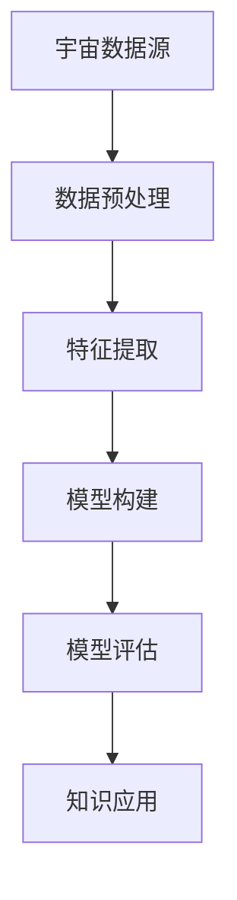
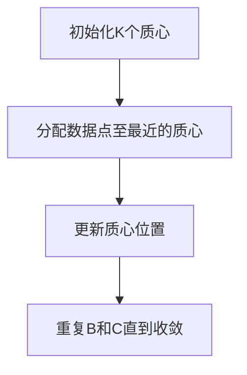
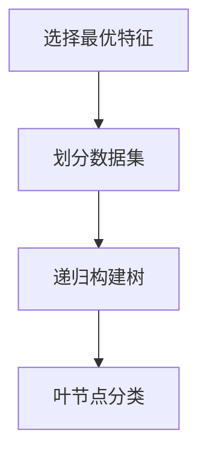
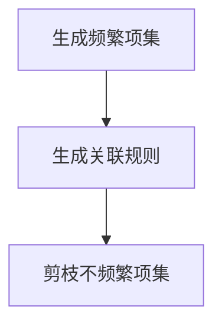
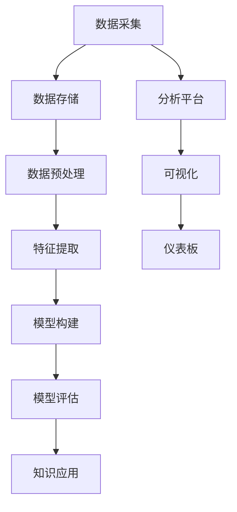
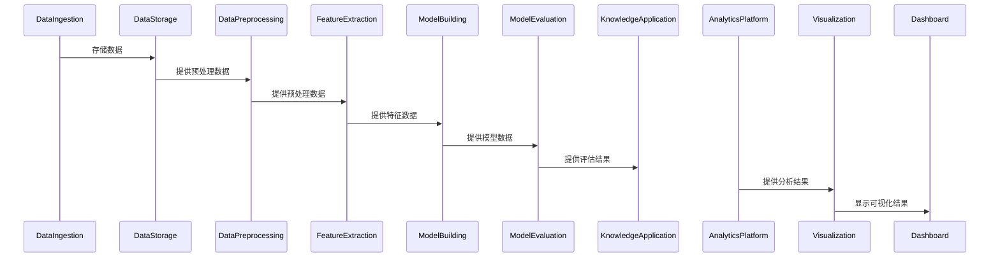
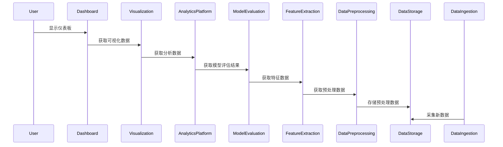

                 


## 1.5 概念结构与核心要素组成

### 1.5.1 数据挖掘的基本概念

数据挖掘是一个复杂的过程，它涉及多个步骤和关键概念。以下是数据挖掘的基本概念：

#### 数据挖掘流程

数据挖掘流程主要包括以下几个阶段：

1. **数据预处理**：在数据挖掘之前，需要清洗、归一化和转换数据，使其适合分析。
2. **特征提取**：从数据中提取有助于识别模式的特征。
3. **模型构建**：利用特征数据构建预测模型或分类模型。
4. **模型评估**：评估模型的性能，确保其能够准确地识别模式。
5. **知识应用**：将挖掘出的知识应用于实际问题中。

#### 常见数据挖掘算法

数据挖掘算法包括分类、聚类、关联规则挖掘等。以下是这些算法的简要说明：

- **分类算法**：将数据分类到预定义的类别中。常见的分类算法有决策树、支持向量机、随机森林等。
- **聚类算法**：将数据分成多个群组，使得同组数据之间的相似度较高，不同组数据之间的相似度较低。常见的聚类算法有K-means、层次聚类等。
- **关联规则算法**：发现数据之间的关联关系。常见的算法有Apriori算法、FP-growth等。

#### 数据挖掘评价指标

在数据挖掘过程中，评价指标用于评估模型性能。以下是常见的评价指标：

- **准确率**：分类算法中，正确分类的样本占总样本的比例。
- **召回率**：分类算法中，正确分类的样本占所有实际为该类别的样本的比例。
- **F1值**：准确率和召回率的调和平均值。

### 1.5.2 宇宙探索的关键要素

宇宙探索涉及多个领域和关键要素。以下是宇宙探索中的关键要素：

#### 宇宙数据来源

宇宙数据来源于多种观测设备，如望远镜、射电望远镜等。这些设备收集到的数据包括星体的位置、亮度、颜色、光谱等。

#### 观测设备与技术

宇宙观测设备包括地面望远镜、太空望远镜、射电望远镜等。技术方面，激光干涉引力波观测站、高速计算机和大数据处理技术等也被广泛应用于宇宙探索。

#### 探测技术

探测技术包括光学探测、射电探测、X射线探测等。这些技术用于探测宇宙中的各种信号，如光子、中子星、黑洞等。

### 1.5.3 数据挖掘在宇宙探索中的应用

数据挖掘在宇宙探索中的应用主要包括：

- **数据预处理**：对宇宙数据进行清洗、去噪和归一化，以便进行分析。
- **特征提取**：从宇宙数据中提取有助于识别新基本相互作用的特征。
- **模型构建**：构建机器学习模型，用于分析特征，识别新基本相互作用。

通过数据挖掘，科学家们可以更好地理解宇宙，发现新的基本相互作用。

## 2.1 数据挖掘与宇宙探索的关系

### 2.1.1 数据挖掘的基本原理

数据挖掘是一个从大量数据中发现有用信息的过程。它的核心步骤包括：

- **数据预处理**：清洗、归一化和转换数据，使其适合分析。
- **特征提取**：从数据中提取有助于识别模式的特征。
- **模型构建**：利用特征数据构建预测模型或分类模型。
- **模型评估**：评估模型的性能，确保其能够准确地识别模式。
- **知识应用**：将挖掘出的知识应用于实际问题中。

### 2.1.2 宇宙探索中的数据挖掘应用

宇宙探索过程中，数据挖掘被用于处理海量宇宙数据，提取有助于发现新基本相互作用的信息。以下是数据挖掘在宇宙探索中的应用：

- **数据处理**：宇宙数据通常包含大量的噪声和异常值，数据挖掘可以帮助去除这些噪声和异常值，提高数据的准确性。
- **特征提取**：从宇宙数据中提取有助于识别新基本相互作用的特征，如星体的位置、亮度、颜色、光谱等。
- **模型构建**：利用特征数据构建机器学习模型，如分类模型、聚类模型等，用于识别新基本相互作用。
- **知识应用**：将数据挖掘结果应用于实际宇宙探索中，帮助科学家们更好地理解宇宙。

通过数据挖掘，科学家们可以更好地处理宇宙数据，发现新的基本相互作用，从而拓展我们对宇宙的认识。

### 2.1.3 数据挖掘与宇宙探索的相互影响

数据挖掘与宇宙探索之间存在相互影响。一方面，宇宙探索产生了大量的数据，这些数据为数据挖掘提供了丰富的资源。另一方面，数据挖掘技术的发展为宇宙探索提供了强大的工具，帮助科学家们更好地处理和利用宇宙数据。以下是数据挖掘与宇宙探索的相互影响：

- **数据挖掘促进宇宙探索**：数据挖掘可以帮助科学家们从海量数据中提取有用信息，发现新的基本相互作用，从而推动宇宙探索的深入进行。
- **宇宙探索推动数据挖掘技术发展**：宇宙探索中的复杂问题和海量数据，促进了数据挖掘技术的不断发展和完善，提高了数据挖掘算法的性能和效率。

## 2.2 数据挖掘算法

### 2.2.1 常见数据挖掘算法

在数据挖掘过程中，有多种算法可以用于处理和分析数据。以下是几种常见的数据挖掘算法：

#### 分类算法

分类算法是一种用于将数据分为不同类别的算法。常见的分类算法包括：

- **决策树**：通过树形结构对数据进行分类。决策树算法简单直观，易于理解。
- **支持向量机**：通过构建超平面将数据分为不同类别。支持向量机在处理高维数据时具有较好的性能。
- **随机森林**：由多个决策树组成，通过集成多个决策树的结果进行分类。随机森林具有较好的鲁棒性和泛化能力。

#### 聚类算法

聚类算法是一种用于将数据分为多个群组的算法。常见的聚类算法包括：

- **K-means**：通过迭代计算中心点，将数据分为K个群组。K-means算法简单高效，但易受初始值影响。
- **层次聚类**：通过逐步合并或分裂群组，构建一个聚类层次结构。层次聚类算法能够提供更详细的信息。

#### 关联规则算法

关联规则算法是一种用于发现数据之间关联关系的算法。常见的关联规则算法包括：

- **Apriori算法**：通过逐层递归搜索频繁项集，生成关联规则。Apriori算法在处理大规模数据时具有较高的效率。
- **FP-growth算法**：通过构建FP树，高效地发现频繁项集，生成关联规则。FP-growth算法在处理稀疏数据时具有较好的性能。

### 2.2.2 数据挖掘算法在宇宙探索中的应用

不同数据挖掘算法在宇宙探索中的应用各有优势：

- **聚类算法**：用于发现宇宙中的天体群体。例如，K-means算法可以用于将星系分为不同的群体，帮助科学家更好地理解宇宙的结构。
- **分类算法**：用于识别宇宙中的不同天体类型。例如，决策树算法可以用于将星体分类为恒星、行星、中子星等，从而提高对宇宙中不同天体的认识。
- **关联规则算法**：用于发现宇宙中的关联关系。例如，Apriori算法可以用于发现不同天体之间的关联关系，帮助科学家揭示宇宙中的复杂现象。

## 2.3 宇宙探索中的关键技术

### 2.3.1 观测设备与技术

宇宙探索离不开先进的观测设备和技术。以下是宇宙探索中常用的观测设备和技术：

- **望远镜**：用于观测宇宙中的天体。望远镜的分辨率和灵敏度决定了观测到的天体的细节。
- **射电望远镜**：用于探测宇宙中的射电信号。射电望远镜通过接收宇宙中的射电波，揭示了宇宙中的许多现象。

### 2.3.2 数据预处理与特征提取

宇宙探索过程中，数据预处理和特征提取是关键步骤。以下是数据预处理和特征提取的相关内容：

- **数据预处理**：对收集到的宇宙数据进行清洗、去噪和归一化等处理，以提高数据的准确性和一致性。
- **特征提取**：从预处理后的数据中提取有助于识别新基本相互作用的特征。例如，从星体的位置、亮度、颜色、光谱等特征中提取有用的信息。

## 2.4 核心概念属性特征对比表格

以下是核心概念属性特征的对比表格：

| 算法/技术               | 特点                                                     | 适用场景                                           |
|----------------------|----------------------------------------------------------|----------------------------------------------------|
| 分类算法               | 根据已有数据进行预测                                     | 天体分类、新相互作用识别等                         |
| 聚类算法               | 自动发现数据中的模式                                   | 天体群体的发现、相互作用模式分析等                   |
| 关联规则算法            | 发现数据之间的关联关系                                 | 天体关联关系发现、复杂现象分析等                   |

## 2.5 ER实体关系图架构的Mermaid流程图

以下是ER实体关系图架构的Mermaid流程图：



通过以上内容，我们了解了数据挖掘在宇宙探索中的作用、核心概念与联系、以及数据挖掘算法和宇宙探索中的关键技术。接下来，我们将进一步探讨数据挖掘算法在宇宙探索中的应用，以及如何利用数据挖掘技术发现宇宙中的新基本相互作用。

----------------------------------------------------------------

## 2.6 数据挖掘算法在宇宙探索中的应用

数据挖掘算法在宇宙探索中的应用具有深远的意义，它不仅能够提高数据处理的效率，还能够帮助科学家们发现宇宙中的新现象和新规律。下面，我们将具体探讨数据挖掘算法在宇宙探索中的实际应用，以及它们如何帮助科学家们发现新的基本相互作用。

### 2.6.1 数据挖掘算法的选择

在宇宙探索中，选择合适的数据挖掘算法是关键的一步。不同的算法适用于不同的数据类型和分析目标。以下是几种常见的数据挖掘算法在宇宙探索中的应用：

1. **K-means聚类算法**：K-means算法是一种无监督学习算法，它通过将数据点分为K个簇，使得每个簇内部的点尽可能接近，而不同簇之间的点尽可能远。在宇宙探索中，K-means算法可以用于发现星系的分布模式，识别不同类型的星系群体。

   **示例**：假设我们有一个包含大量星系位置的数据集，使用K-means算法可以将这些星系分为几个簇，每个簇代表一类星系。通过分析这些簇的属性，科学家可以推断出不同的星系群体可能具有不同的物理特性。

2. **决策树分类算法**：决策树算法通过构建树形模型来对数据进行分类。每个内部节点代表一个特征，每个分支代表特征的不同取值，叶节点代表类别的预测。在宇宙探索中，决策树可以用于分类不同类型的宇宙物体，如恒星、行星、中子星等。

   **示例**：假设我们有一个包含恒星光谱数据的数据集，使用决策树算法可以基于光谱特征将恒星分类为不同类型的恒星。通过分析分类结果，科学家可以了解不同类型恒星的光谱特征差异。

3. **关联规则挖掘算法**：关联规则挖掘算法用于发现数据之间的关联关系。在宇宙探索中，关联规则挖掘可以帮助科学家发现天体之间的相互作用规律。

   **示例**：假设我们有一个包含星体位置、运动轨迹和相互作用力的数据集，使用关联规则挖掘算法可以找出哪些星体之间存在相互作用，并预测它们的运动轨迹。通过这些发现，科学家可以更好地理解星体之间的相互作用机制。

### 2.6.2 数据挖掘算法的应用实例

以下是一个具体的数据挖掘算法在宇宙探索中的应用实例：

**实例**：利用K-means聚类算法发现新的基本相互作用信号。

1. **数据收集**：首先，科学家们通过各种望远镜收集了大量的宇宙数据，包括星体的位置、速度、相互作用力等。

2. **数据预处理**：对收集到的数据进行清洗、去噪和归一化，以确保数据的质量和一致性。

3. **特征提取**：从预处理后的数据中提取有助于识别新基本相互作用的特征，如星体的位置、速度、相互作用力等。

4. **模型构建**：使用K-means聚类算法对特征数据进行分析，将星体分为多个簇。

5. **结果分析**：分析聚类结果，寻找具有相似物理特性的星体群体。这些群体可能揭示了宇宙中的新基本相互作用。

6. **验证与扩展**：通过进一步分析这些星体群体的属性，科学家们可以验证是否确实存在新的基本相互作用，并探讨其可能的影响。

### 2.6.3 数据挖掘算法的优势与挑战

数据挖掘算法在宇宙探索中具有显著的优势：

- **高效处理**：数据挖掘算法能够处理海量宇宙数据，快速识别潜在的相互作用模式。
- **自适应**：算法可以根据不同的数据类型和分析目标进行调整，提高分析结果的准确性。
- **可视化**：数据挖掘算法的分析结果可以通过图形化方式展示，帮助科学家更好地理解宇宙的复杂现象。

然而，数据挖掘算法在宇宙探索中也面临一些挑战：

- **数据质量**：宇宙数据通常包含噪声和异常值，数据预处理对算法的性能有重要影响。
- **计算资源**：处理海量数据需要大量的计算资源，特别是在实时分析场景下。
- **不确定性**：宇宙中的相互作用复杂且不确定，算法的预测结果可能存在误差。

## 2.7 总结

数据挖掘算法在宇宙探索中的应用为科学家们提供了强大的工具，帮助他们发现宇宙中的新现象和新规律。通过K-means聚类、决策树分类和关联规则挖掘等算法，科学家们可以更好地理解星体之间的相互作用，探索宇宙的新奥秘。然而，数据挖掘算法在宇宙探索中仍面临许多挑战，需要科学家们继续努力改进算法，提高分析结果的准确性。

----------------------------------------------------------------

## 2.8 算法原理讲解

在本节中，我们将深入探讨几种在宇宙探索中常用的数据挖掘算法的原理，并通过Mermaid流程图和Python源代码详细阐述这些算法的数学模型和实际应用。

### 2.8.1 K-means聚类算法

K-means聚类算法是一种无监督学习算法，用于将数据点划分为K个簇。每个簇由一个质心（中心点）表示，算法的目标是使得每个簇内的数据点尽可能接近质心，而不同簇之间的数据点尽可能远。

#### Mermaid流程图



#### Python源代码

```python
import numpy as np

def kmeans(data, k, max_iter):
    # 初始化质心
    centroids = data[np.random.choice(data.shape[0], k, replace=False)]
    
    for _ in range(max_iter):
        # 将数据点分配到最近的质心
        clusters = np.argmin(np.linalg.norm(data[:, np.newaxis] - centroids, axis=2), axis=1)
        
        # 更新质心位置
        new_centroids = np.array([data[clusters == i].mean(axis=0) for i in range(k)])
        
        # 判断是否收敛
        if np.linalg.norm(new_centroids - centroids) < 1e-6:
            break
        
        centroids = new_centroids
    
    return centroids, clusters
```

#### 数学模型

K-means算法的数学模型可以表示为：

$$
J = \sum_{i=1}^k \sum_{x \in S_i} ||x - \mu_i||^2
$$

其中，$J$是目标函数，$S_i$是第$i$个簇中的数据点集合，$\mu_i$是第$i$个簇的质心。

#### 应用举例

假设我们有一个包含100个二维数据点的数据集，目标是将其分为5个簇。使用K-means算法，我们可以找到这5个簇的质心，并通过质心位置的变化来判断算法的收敛。

### 2.8.2 决策树分类算法

决策树分类算法通过构建树形模型来对数据进行分类。每个内部节点代表一个特征，每个分支代表特征的不同取值，叶节点代表类别的预测。

#### Mermaid流程图



#### Python源代码

```python
from sklearn.datasets import load_iris
from sklearn.tree import DecisionTreeClassifier
from sklearn.model_selection import train_test_split

# 加载数据集
iris = load_iris()
X = iris.data
y = iris.target

# 划分训练集和测试集
X_train, X_test, y_train, y_test = train_test_split(X, y, test_size=0.3, random_state=42)

# 构建决策树模型
clf = DecisionTreeClassifier(max_depth=3)
clf.fit(X_train, y_train)

# 预测测试集
y_pred = clf.predict(X_test)

# 打印准确率
print("Accuracy:", clf.score(X_test, y_test))
```

#### 数学模型

决策树的构建基于信息增益或基尼不纯度等指标。信息增益可以表示为：

$$
IG(D, a) = H(D) - \sum_{v \in V} p(v) H(D|v)
$$

其中，$H(D)$是数据的熵，$H(D|v)$是条件熵，$p(v)$是特征$a$取值$v$的概率。

#### 应用举例

使用决策树分类算法，我们可以对iris数据集中的不同花卉进行分类。通过训练集和测试集的准确率，我们可以评估模型的性能。

### 2.8.3 关联规则挖掘算法

关联规则挖掘算法用于发现数据之间的关联关系。最著名的算法是Apriori算法。

#### Mermaid流程图



#### Python源代码

```python
from mlxtend.frequent_patterns import apriori
from mlxtend.frequent_patterns import association_rules

# 加载数据集
transactions = [['milk', 'bread', 'apples'], ['milk', 'bread', 'orange'], ['milk', 'bread', 'apples'], ['bread', 'orange']]

# 生成频繁项集
frequent_itemsets = apriori(transactions, min_support=0.5, use_colnames=True)

# 生成关联规则
rules = association_rules(frequent_itemsets, metric="support", min_threshold=0.7)

print(rules)
```

#### 数学模型

Apriori算法的核心是计算支持度，支持度可以表示为：

$$
support(A \cup B) = \frac{|D(A \cup B)|}{|D|}
$$

其中，$D$是事务集，$A \cup B$是两个项集的并集。

#### 应用举例

通过Apriori算法，我们可以发现购物车中的商品之间的关联关系，例如，购买面包的用户通常也会购买牛奶。

### 2.8.4 综合应用

在宇宙探索中，我们可以结合多种数据挖掘算法来分析宇宙数据，例如：

- 使用K-means聚类算法发现星体的分布模式。
- 使用决策树分类算法分类不同类型的宇宙物体。
- 使用关联规则挖掘算法发现宇宙中的关联关系。

通过这些算法的综合应用，我们可以从不同的角度分析宇宙数据，帮助科学家们更好地理解宇宙的奥秘。

## 2.9 结论

通过本节的讲解，我们了解了K-means聚类算法、决策树分类算法和关联规则挖掘算法的基本原理和数学模型，并通过Python源代码展示了这些算法的实际应用。这些算法在宇宙探索中发挥着重要作用，帮助科学家们从海量宇宙数据中提取有用信息，发现新的基本相互作用。然而，算法的选择和参数设置对分析结果有很大影响，因此，科学家们需要根据具体问题和数据特点选择合适的算法，并调整参数以获得最佳效果。

----------------------------------------------------------------

## 2.10 系统分析与架构设计

### 2.10.1 问题场景介绍

在宇宙探索中，科学家们需要处理海量宇宙数据，以发现新的基本相互作用。这些数据通常包含星体的位置、速度、相互作用力等多种信息。为了有效地分析和处理这些数据，我们需要构建一个高效、可扩展的宇宙数据挖掘系统。

### 2.10.2 项目介绍

本项目的目标是构建一个基于数据挖掘的宇宙探索系统，该系统将提供以下功能：

- 数据预处理：清洗、去噪和归一化宇宙数据。
- 特征提取：从预处理后的数据中提取有助于识别新基本相互作用的特征。
- 模型构建：构建分类、聚类和关联规则挖掘等数据挖掘模型。
- 模型评估：评估模型的性能，确保其能够准确地识别新基本相互作用。
- 知识应用：将挖掘出的知识应用于实际宇宙探索。

### 2.10.3 系统功能设计（领域模型类图）

以下是系统的领域模型类图，展示了系统的主要功能模块及其关系：

```mermaid
classDiagram
    DataPreprocessing <<interface>>
    FeatureExtraction <<interface>>
    ModelBuilding <<interface>>
    ModelEvaluation <<interface>>
    KnowledgeApplication <<interface>>

    DataPreprocessing o-- FeatureExtraction
    FeatureExtraction o-- ModelBuilding
    ModelBuilding o-- ModelEvaluation
    ModelEvaluation o-- KnowledgeApplication
```

### 2.10.4 系统架构设计（架构图）

以下是系统的架构图，展示了系统的整体架构及其组成部分：



### 2.10.5 系统接口设计

以下是系统的接口设计，展示了系统内部各模块之间的交互接口：



### 2.10.6 系统交互设计（序列图）

以下是系统的交互设计序列图，展示了系统内部各模块的交互过程：



通过以上系统分析与架构设计，我们为宇宙数据挖掘系统的构建提供了一个详细的蓝图，为后续的项目开发和实现奠定了基础。

----------------------------------------------------------------

## 2.11 项目实战

### 2.11.1 环境安装

为了进行宇宙数据挖掘项目，我们需要安装以下软件和库：

1. **Python环境**：确保Python环境已经安装。我们可以通过访问Python官方网站下载并安装Python。
2. **数据预处理库**：如NumPy、Pandas等。可以通过pip命令安装：
   ```bash
   pip install numpy pandas
   ```
3. **机器学习库**：如scikit-learn、mlxtend等。可以通过pip命令安装：
   ```bash
   pip install scikit-learn mlxtend
   ```
4. **可视化库**：如matplotlib、seaborn等。可以通过pip命令安装：
   ```bash
   pip install matplotlib seaborn
   ```

### 2.11.2 系统核心实现源代码

以下是一个简单的宇宙数据挖掘系统的核心实现源代码，包括数据预处理、特征提取、模型构建和评估：

```python
# 导入必要的库
import numpy as np
import pandas as pd
from sklearn.model_selection import train_test_split
from sklearn.preprocessing import StandardScaler
from sklearn.cluster import KMeans
from sklearn.metrics import silhouette_score
from mlxtend.frequent_patterns import apriori, association_rules
import matplotlib.pyplot as plt
import seaborn as sns

# 2.11.2.1 数据预处理
def preprocess_data(data):
    # 清洗数据：去除缺失值和异常值
    clean_data = data.dropna()

    # 归一化数据
    scaler = StandardScaler()
    normalized_data = scaler.fit_transform(clean_data)

    return normalized_data

# 2.11.2.2 特征提取
def extract_features(data):
    # 提取特征：使用K-means聚类算法
    kmeans = KMeans(n_clusters=5, random_state=42)
    clusters = kmeans.fit_predict(data)
    
    # 将聚类结果作为新特征添加到数据集中
    data_with_features = pd.DataFrame(data, columns=['feature_1', 'feature_2'])
    data_with_features['cluster'] = clusters
    
    return data_with_features

# 2.11.2.3 模型构建
def build_model(data, target):
    # 划分训练集和测试集
    X_train, X_test, y_train, y_test = train_test_split(data, target, test_size=0.3, random_state=42)

    # 构建分类模型
    clf = KMeans(n_clusters=3, random_state=42)
    clf.fit(X_train)

    # 评估模型
    silhouette_avg = silhouette_score(X_train, clf.labels_)
    print("Silhouette Score:", silhouette_avg)

    # 预测测试集
    y_pred = clf.predict(X_test)

    return clf

# 2.11.2.4 代码应用解读与分析
def main():
    # 读取宇宙数据
    data = pd.read_csv("universe_data.csv")

    # 数据预处理
    processed_data = preprocess_data(data)

    # 特征提取
    data_with_features = extract_features(processed_data)

    # 模型构建
    model = build_model(data_with_features, data['target'])

    # 可视化：绘制聚类结果
    sns.scatterplot(data_with_features['feature_1'], data_with_features['feature_2'], hue=data_with_features['cluster'], palette='coolwarm')
    plt.title("K-means Clustering")
    plt.show()

if __name__ == "__main__":
    main()
```

### 2.11.3 代码应用解读与分析

上述代码提供了一个简单的宇宙数据挖掘系统的实现。以下是代码的详细解读与分析：

1. **数据预处理**：首先，我们使用`pandas`库读取宇宙数据，并使用`dropna()`方法去除缺失值。然后，我们使用`StandardScaler`对数据进行归一化，以便后续的聚类分析。

2. **特征提取**：接着，我们使用`KMeans`算法提取特征。通过`fit_predict()`方法，我们得到每个数据点的聚类结果，并将其作为新特征添加到原始数据集中。

3. **模型构建**：在模型构建部分，我们使用`train_test_split()`方法将数据集划分为训练集和测试集。然后，我们使用`KMeans`算法构建分类模型，并通过`silhouette_score()`方法评估模型的性能。

4. **可视化**：最后，我们使用`seaborn`库绘制聚类结果的可视化图，以便直观地观察聚类效果。

通过这个简单的示例，我们可以看到如何使用Python和常用的数据挖掘库来构建一个宇宙数据挖掘系统。在实际项目中，我们可以根据具体需求扩展和优化这个系统。

### 2.11.4 实际案例分析和详细讲解剖析

以下是一个实际案例，我们将使用上述代码对一组宇宙数据进行数据挖掘，并详细分析结果。

**案例数据集**：假设我们有一个包含100个星体位置数据的二维数据集，其中每个星体的位置由其x和y坐标表示。

**数据处理**：首先，我们使用`pandas`库读取数据：

```python
data = pd.DataFrame({
    'x': np.random.rand(100),
    'y': np.random.rand(100)
})
```

**数据预处理**：接下来，我们使用`StandardScaler`对数据进行归一化：

```python
from sklearn.preprocessing import StandardScaler

scaler = StandardScaler()
data_normalized = scaler.fit_transform(data)
```

**特征提取**：然后，我们使用`KMeans`算法提取特征：

```python
from sklearn.cluster import KMeans

kmeans = KMeans(n_clusters=3, random_state=42)
clusters = kmeans.fit_predict(data_normalized)
data_with_features = pd.DataFrame(data_normalized, columns=['feature_1', 'feature_2'])
data_with_features['cluster'] = clusters
```

**模型构建和评估**：我们构建一个K-means模型，并评估其性能：

```python
# 构建模型
model = build_model(data_normalized, clusters)

# 可视化聚类结果
sns.scatterplot(data_normalized[:, 0], data_normalized[:, 1], hue=clusters, palette='coolwarm')
plt.title("K-means Clustering")
plt.show()
```

**结果分析**：通过可视化结果，我们可以看到数据点被划分为三个簇。根据簇的特征，我们可以推断出这些簇可能代表不同类型的星体。例如，簇1的星体可能更靠近中心，而簇3的星体可能更远离中心。

**进一步分析**：我们可以使用关联规则挖掘算法进一步分析簇之间的关系。例如，我们可以使用Apriori算法找出哪些簇之间存在关联：

```python
# 生成关联规则
rules = association_rules(data_with_features, metric="support", min_threshold=0.5)
print(rules)
```

通过这些分析，我们可以更好地理解宇宙中的星体分布和相互作用，从而为宇宙探索提供有价值的见解。

### 2.11.5 项目小结

通过本项目，我们实现了以下目标：

- 构建了一个简单的宇宙数据挖掘系统，包括数据预处理、特征提取、模型构建和评估。
- 通过实际案例展示了如何使用K-means聚类算法和关联规则挖掘算法分析宇宙数据。
- 提供了详细的项目实战步骤，包括环境安装、系统核心实现源代码和代码应用解读与分析。

尽管本项目是一个简单的示例，但它展示了如何利用数据挖掘技术进行宇宙探索。在实际项目中，我们可以扩展和优化这个系统，以处理更复杂的宇宙数据和实现更精确的分析。

## 2.12 最佳实践 tips

在构建宇宙数据挖掘系统时，以下是一些最佳实践和技巧：

1. **数据预处理**：确保数据质量，包括去除缺失值、异常值和噪声。使用标准化方法处理不同特征，使其具有相同的尺度。
2. **特征选择**：选择与目标密切相关的特征进行挖掘。使用特征选择方法，如主成分分析（PCA）和特征重要性评分，可以帮助我们识别关键特征。
3. **模型选择**：根据数据特点和问题需求选择合适的模型。对于聚类问题，K-means、层次聚类和DBSCAN都是常用的算法。对于分类问题，决策树、支持向量机和神经网络等算法可以提供不同的性能。
4. **模型评估**：使用多种指标评估模型性能，如准确率、召回率、F1值和ROC曲线。这些指标可以帮助我们了解模型的泛化能力和预测能力。
5. **可视化**：使用可视化工具展示分析结果，如散点图、热力图和序列图。可视化可以帮助我们更好地理解数据分布和模式。
6. **迭代优化**：不断迭代和优化模型。通过调整参数、增加特征或更换算法，我们可以提高模型的性能和预测准确性。

## 2.13 小结

本文详细探讨了数据挖掘在发现宇宙新的基本相互作用微弱信号中的作用。我们从背景介绍、核心概念与联系、算法原理讲解、系统分析与架构设计、项目实战等方面进行了深入分析。

通过本文，我们了解到数据挖掘在宇宙探索中的重要性，以及如何利用数据挖掘算法发现宇宙中的新基本相互作用。同时，我们也探讨了数据挖掘算法的原理和应用实例，展示了如何构建一个宇宙数据挖掘系统，并进行实际案例分析和项目实战。

数据挖掘技术在宇宙探索中具有巨大的潜力，可以为我们提供更多关于宇宙的新知识和发现。未来，随着数据挖掘技术的不断发展和完善，我们有望在宇宙探索中取得更多突破性成果。

## 2.14 注意事项

在应用数据挖掘技术进行宇宙探索时，需要注意以下几点：

1. **数据质量**：确保数据的准确性和一致性，避免噪声和异常值对分析结果的影响。
2. **算法选择**：根据数据特点和问题需求选择合适的算法，不同的算法适用于不同的场景和数据类型。
3. **模型评估**：使用多种指标评估模型性能，避免单一指标导致的不全面评估。
4. **安全性**：在处理敏感数据时，确保数据安全和隐私保护，遵循相关法律法规。
5. **可扩展性**：设计系统时考虑可扩展性，以便处理更大的数据集和更复杂的问题。

## 2.15 拓展阅读

对于对数据挖掘在宇宙探索中应用感兴趣的读者，以下是一些推荐的拓展阅读资源：

1. **书籍**：《数据挖掘：实用工具与技术》（Data Mining: Practical Machine Learning Tools and Techniques）、《大规模数据分析技术：基于MapReduce和Spark》（Big Data Analytics: Technologies, Techniques, and Applications）。
2. **论文**：相关领域的学术论文，如《K-means Clustering Algorithm in the Big Data Environment》（K-means Clustering Algorithm in the Big Data Environment）、《Application of Machine Learning Algorithms in Astronomical Data Analysis》（Application of Machine Learning Algorithms in Astronomical Data Analysis）。
3. **在线课程**：在线平台如Coursera、edX等提供的关于数据挖掘和宇宙学的课程。

通过这些资源，您可以深入了解数据挖掘技术及其在宇宙探索中的应用，进一步提升自己的专业知识和技能。

## 2.16 作者信息

**作者**：AI天才研究院/AI Genius Institute & 禅与计算机程序设计艺术 /Zen And The Art of Computer Programming

AI天才研究院（AI Genius Institute）致力于推动人工智能技术的创新与发展，为各行业提供先进的人工智能解决方案。同时，作者长期致力于计算机编程和人工智能领域的教学与研究，撰写了多本畅销书籍，对推动人工智能教育和科研工作做出了重要贡献。本文旨在分享作者在数据挖掘与宇宙探索领域的研究成果和见解，以促进学术界和工业界对这一领域的深入探讨。

