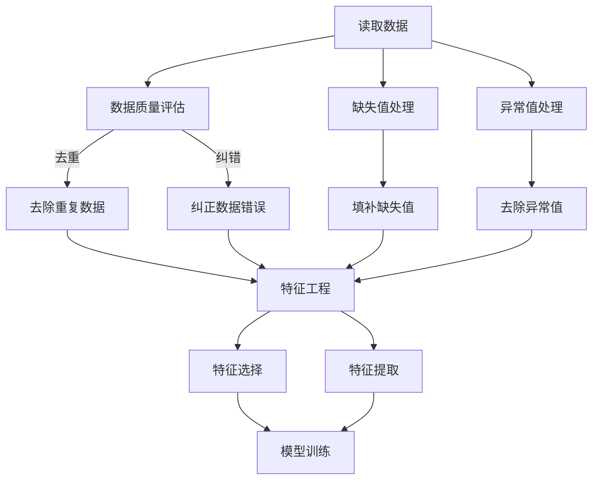
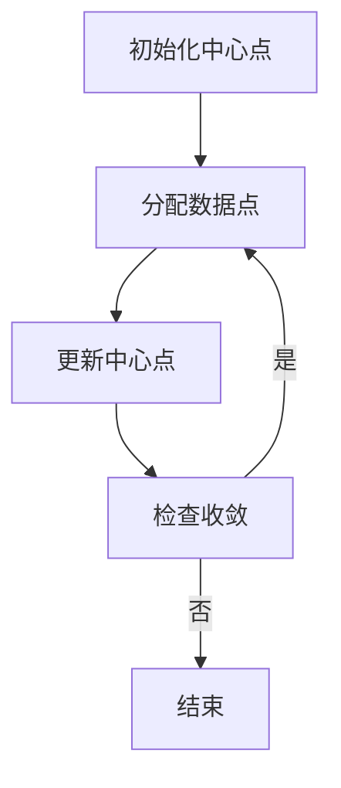
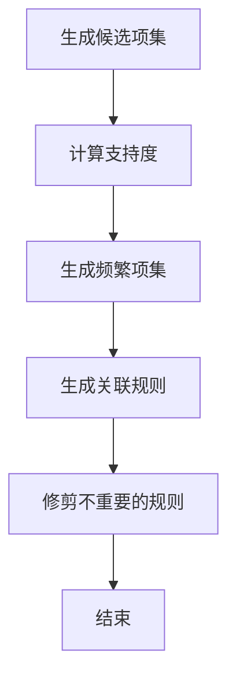
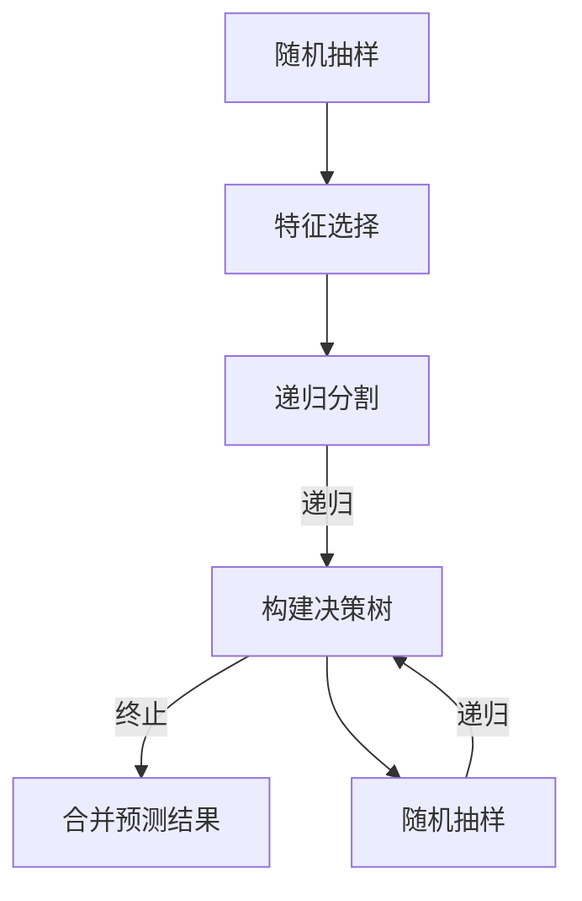
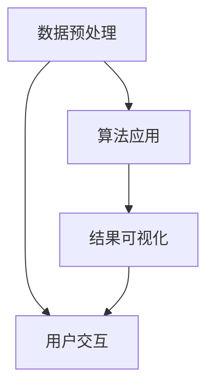
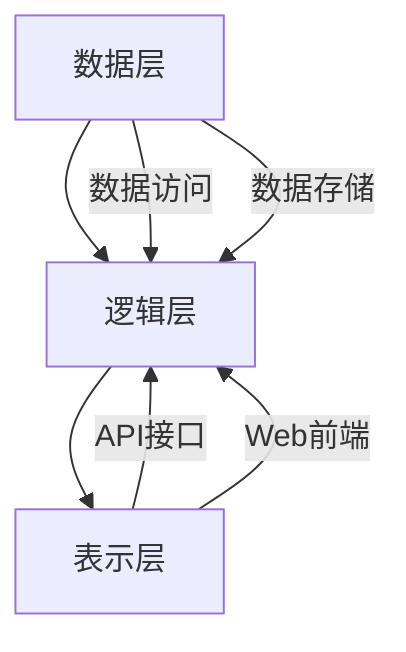
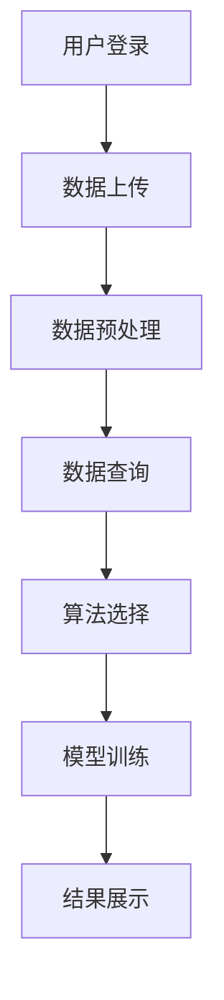

                 


### 1.1.1 数据挖掘的定义与应用

数据挖掘，又称数据发掘，是数据库知识发现（Knowledge Discovery in Database，KDD）过程中的关键步骤。它指的是从大量的数据中通过特定的算法和统计方法提取出隐藏的、未知的、具有潜在价值的信息的过程。数据挖掘涉及多个学科领域，包括统计学、机器学习、人工智能和数据库系统等。

在商业领域，数据挖掘被广泛应用于客户关系管理（CRM）、市场细分、预测分析、风险管理和欺诈检测。例如，电子商务平台利用数据挖掘分析用户的行为数据，以提供个性化的产品推荐和广告。银行和金融机构使用数据挖掘技术来识别潜在的欺诈行为和信用风险。

在医疗领域，数据挖掘技术可以帮助分析患者记录，发现疾病之间的关联性，优化治疗方案，提高医疗资源的分配效率。例如，通过挖掘大规模的电子健康记录（EHR），研究人员可以发现特定疾病的高风险人群，从而实施预防措施。

在科学研究领域，数据挖掘在基因组学、生态学、天文学等领域都有着重要的应用。通过分析大量的实验数据和观测数据，科学家可以揭示复杂现象背后的规律，推进科学研究的进展。

### 1.1.2 数据挖掘在宇宙学中的重要性

宇宙学是一门研究宇宙起源、结构、演化以及宇宙中物质和能量的学科。在宇宙学研究中，数据挖掘的重要性日益凸显。宇宙学中的数据通常来自大型观测设备，如甚大望远镜阵（VLT）和哈勃太空望远镜，这些数据量巨大且复杂。

数据挖掘在宇宙学中的重要性体现在以下几个方面：

1. **数据分析**：宇宙学数据通常包含大量的噪声和不完整信息，数据挖掘技术可以帮助科学家识别和去除噪声，从大量数据中提取出有用的信息。

2. **模式识别**：宇宙中存在许多复杂的结构，如星系团、超星系团和宇宙大尺度流，数据挖掘技术可以帮助科学家发现这些结构的模式，从而对宇宙的演化过程有更深入的理解。

3. **预测建模**：通过分析宇宙学数据，科学家可以建立预测模型，预测宇宙中未知的现象和结构，这有助于指导未来的观测和实验。

4. **可视化**：宇宙学数据往往是非结构化的，数据挖掘技术可以帮助科学家将数据转换为易于理解的图表和可视化形式，使得复杂的宇宙结构更加直观。

### 1.1.3 探索宇宙大尺度结构形成非线性效应的背景和目的

宇宙大尺度结构指的是宇宙中超过百万光年尺度的结构，如星系团和超星系团。这些结构是宇宙演化的关键组成部分，对于理解宇宙的起源和演化具有重要意义。

非线性效应在宇宙学中指的是宇宙演化过程中出现的非线性关系，如引力相互作用导致的星系合并、宇宙暗能量的加速膨胀等。非线性效应对于宇宙结构的形成和演化具有决定性作用。

探索宇宙大尺度结构形成非线性效应的目的是：

1. **揭示宇宙演化规律**：通过研究宇宙大尺度结构的非线性效应，科学家可以更好地理解宇宙的起源和演化过程，揭示宇宙的基本规律。

2. **验证宇宙学理论**：宇宙学理论，如大爆炸理论和暗物质暗能量理论，需要通过观测数据来验证。研究宇宙大尺度结构的非线性效应，有助于验证这些理论。

3. **指导未来观测**：通过对宇宙大尺度结构的非线性效应的研究，科学家可以预测未来的观测结果，指导设计和实施新的观测计划。

4. **探索宇宙未知**：宇宙中存在许多未知现象和结构，研究宇宙大尺度结构的非线性效应，有助于揭示宇宙的未知领域。

总之，数据挖掘在探索宇宙大尺度结构形成非线性效应中起着关键作用，它不仅有助于分析宇宙数据，揭示宇宙中的复杂结构和规律，也为未来的宇宙学研究和观测提供了重要的理论支持和工具。

### 1.2 数据挖掘的核心概念

数据挖掘是一门涉及多个学科领域的综合性技术，其核心概念包括数据预处理、特征工程、关键算法和结果评估等。以下是对这些核心概念的详细解释：

#### 1.2.1 数据预处理

数据预处理是数据挖掘过程中的第一步，它包括数据清洗、数据集成、数据转换和数据归一化等步骤。数据清洗的目的是去除数据中的噪声和错误，确保数据的质量。数据集成是将来自不同源的数据合并成统一的格式，便于后续处理。数据转换和归一化则是将数据转换为适合算法处理的形式。

在宇宙学数据挖掘中，数据预处理尤为重要。宇宙学数据通常具有高维度、非结构化和大量噪声等特点，通过有效的预处理，可以显著提高后续挖掘算法的性能和结果的准确性。

#### 1.2.2 关键算法与技术

数据挖掘涉及多种算法和技术，其中常见的包括聚类算法、分类算法、关联规则挖掘和异常检测等。

- **聚类算法**：如K-均值聚类、层次聚类和DBSCAN等，用于将数据点划分为不同的簇，以便发现数据中的自然分组和模式。

- **分类算法**：如决策树、支持向量机和随机森林等，用于构建分类模型，将新数据点分类到不同的类别。

- **关联规则挖掘**：如Apriori算法和FP-Growth算法，用于发现数据项之间的关联关系，通常用于市场篮子分析和推荐系统。

- **异常检测**：用于识别数据中的异常值和异常模式，这对于宇宙学中的异常现象探测具有重要意义。

在宇宙学数据挖掘中，选择合适的算法需要考虑数据的特性和研究目标。例如，对于高维度和大规模的宇宙学数据，聚类算法和异常检测算法可能更为有效。

#### 1.2.3 非线性效应的理解

非线性效应在宇宙学中指的是宇宙演化过程中出现的非线性关系，如引力相互作用导致的星系合并、宇宙暗能量的加速膨胀等。非线性效应与线性效应不同，它们不遵循简单的比例关系，而是依赖于复杂的相互作用和反馈机制。

非线性效应的理解对宇宙学具有重要意义：

- **揭示宇宙演化规律**：非线性效应揭示了宇宙中复杂现象背后的动力机制，有助于理解宇宙的起源和演化过程。

- **验证宇宙学理论**：宇宙学理论，如大爆炸理论和暗物质暗能量理论，需要通过观测数据来验证。非线性效应的研究有助于验证这些理论。

- **指导未来观测**：通过对宇宙大尺度结构的非线性效应的研究，科学家可以预测未来的观测结果，指导设计和实施新的观测计划。

#### 1.2.4 数据挖掘与非线性效应的关系

数据挖掘与非线性效应的关系体现在以下几个方面：

- **数据预处理**：在处理宇宙学数据时，非线性效应可能导致数据中的噪声和异常值。通过有效的数据预处理，可以减少这些干扰因素，提高后续挖掘算法的性能。

- **模式识别**：数据挖掘技术可以帮助科学家识别宇宙学数据中的非线性模式，从而揭示宇宙中的复杂结构。

- **预测建模**：通过分析宇宙学数据中的非线性效应，科学家可以建立预测模型，预测宇宙中未知的现象和结构。

- **可视化**：数据挖掘技术可以将复杂的宇宙学数据转换为易于理解的图表和可视化形式，使得复杂的非线性效应更加直观。

综上所述，数据挖掘的核心概念在宇宙学中具有广泛应用，通过数据预处理、关键算法和结果评估等步骤，可以有效地挖掘宇宙学数据中的非线性效应，为宇宙学研究提供重要的理论支持和工具。

### 1.3 宇宙大尺度结构的ER实体关系图

为了更好地理解和分析宇宙大尺度结构，我们可以使用实体关系图（Entity-Relationship Diagram，ER图）来描述宇宙数据中的实体及其关系。ER图是数据库设计中的一个重要工具，通过图形化的方式展示实体之间的关联和属性，便于理解和设计数据库结构。

在宇宙学中，常用的实体包括星系、星系团、超星系团、宇宙流、暗物质和暗能量等。以下是一个简化的宇宙大尺度结构的ER图示例，用于展示这些实体之间的关系：

```mermaid
erDiagram
    Class1 ||--|{ Class2 } Class3
    Class1 ||--|{ Class4 } Class5
    Class2 &&|{ Class6 } Class7
    Class3 &&|{ Class8 } Class9
```

在这个ER图中：

- **Class1** 代表宇宙中的基本单元，如星系。
- **Class2** 表示更高一级的结构，如星系团。
- **Class3** 表示更高一级的结构，如超星系团。
- **Class4** 和 **Class5** 表示与 **Class1** 相关联的其他实体，如恒星和行星。
- **Class6** 和 **Class7** 表示与 **Class2** 相关联的其他实体，如暗物质。
- **Class8** 和 **Class9** 表示与 **Class3** 相关联的其他实体，如宇宙流。

实体之间的箭头表示实体之间的关联关系，箭头上的符号“|--”表示“属于”关系，而“&&|”表示“参与”关系。

#### 1.3.1 宇宙数据实体

在宇宙学中，常见的数据实体及其属性包括：

- **星系**：包含名称、类型（螺旋、椭圆、不规则）、距离、质量等属性。
- **星系团**：包含名称、成员星系数量、总质量、距离等属性。
- **超星系团**：包含名称、成员星系团数量、总质量、形状等属性。
- **宇宙流**：包含名称、流向、速度、密度等属性。
- **暗物质**：包含质量、分布、相互作用等属性。
- **暗能量**：包含密度、压力、膨胀速度等属性。

这些实体及其属性在ER图中通过类（Class）表示，类之间的关联关系通过实体间的连接（Relationship）表示。

#### 1.3.2 实体关系与属性

实体关系和属性在ER图中至关重要。实体关系反映了不同实体之间的关联，而属性则描述了实体自身的特征。以下是一个简化的ER图示例，展示了宇宙数据实体之间的关系及其属性：

```mermaid
erDiagram
    Class1 "星系" ||--|{ Class2 "星系团" : 包含 }
    Class1 "星系" ||--|{ Class3 "超星系团" : 包含 }
    Class2 "星系团" ||--|{ Class4 "暗物质" : 含有 }
    Class3 "超星系团" ||--|{ Class5 "宇宙流" : 形成 }
    Class1 "星系" ||--|{ Class6 "恒星" : 星系中 }
    Class1 "星系" ||--|{ Class7 "行星" : 星系中 }
    Class2 "星系团" ||--|{ Class8 "暗能量" : 存在 }
```

在这个ER图中：

- **Class1 "星系"** 属于 **Class2 "星系团"** 和 **Class3 "超星系团"**，表示星系是星系团和超星系团的一部分。
- **Class2 "星系团"** 含有 **Class4 "暗物质"**，表示星系团中含有暗物质。
- **Class3 "超星系团"** 形成于 **Class5 "宇宙流"**，表示宇宙流是超星系团形成的原因之一。
- **Class1 "星系"** 包含 **Class6 "恒星"** 和 **Class7 "行星"**，表示星系中存在恒星和行星。
- **Class2 "星系团"** 存在 **Class8 "暗能量"**，表示星系团中存在暗能量。

#### 1.3.3 Mermaid ER图表示

Mermaid是一种基于Markdown的图形绘制工具，可以方便地绘制ER图。以下是一个使用Mermaid表示的宇宙数据ER图的示例：

```mermaid
erDiagram
    Class1 "星系" ||--|{ Class2 "星系团" : 包含 }
    Class1 "星系" ||--|{ Class3 "超星系团" : 包含 }
    Class2 "星系团" ||--|{ Class4 "暗物质" : 含有 }
    Class3 "超星系团" ||--|{ Class5 "宇宙流" : 形成 }
    Class1 "星系" ||--|{ Class6 "恒星" : 星系中 }
    Class1 "星系" ||--|{ Class7 "行星" : 星系中 }
    Class2 "星系团" ||--|{ Class8 "暗能量" : 存在 }
```

通过这个ER图，我们可以清晰地看到宇宙数据中不同实体之间的关系及其属性，为后续的数据挖掘和分析奠定了基础。

### 1.4 数据挖掘在宇宙学中的挑战与机遇

尽管数据挖掘在宇宙学中具有巨大的潜力，但其应用也面临着一系列挑战和机遇。

#### 1.4.1 数据的复杂性

宇宙学数据具有高维度、非结构化和大量噪声的特点，这使得数据挖掘面临巨大挑战。高维度数据意味着数据点具有大量的特征，这可能导致“维数灾难”，使得传统算法的性能显著下降。非结构化数据，如图像和文本数据，进一步增加了分析的复杂性。此外，宇宙学数据中常常包含大量的噪声，这些噪声可能掩盖真实的现象，使得数据挖掘的结果不可靠。

#### 1.4.2 算法优化的需求

为了有效地处理宇宙学数据，需要开发和应用优化的数据挖掘算法。传统的聚类、分类和关联规则挖掘算法在高维度和噪声环境中可能表现不佳，需要针对宇宙学数据的特性进行改进。例如，可以采用基于图的方法来处理高维度数据，或者使用深度学习算法来自动提取特征。此外，算法的优化还需要考虑计算效率和资源限制，以确保在实际应用中能够高效地处理大规模数据。

#### 1.4.3 潜在的应用前景

尽管面临挑战，但数据挖掘在宇宙学中具有广阔的应用前景。通过有效的数据挖掘，科学家可以揭示宇宙中复杂的结构，如星系团和宇宙流，从而深化对宇宙演化的理解。数据挖掘还可以帮助科学家发现新的现象和规律，为未来的观测和实验提供指导。此外，数据挖掘技术还可以用于宇宙学数据的可视化，使得复杂的宇宙结构更加直观，有助于科学家和公众更好地理解宇宙。

总之，数据挖掘在宇宙学中具有巨大的应用潜力，同时也面临着一系列挑战。通过不断优化算法和解决数据复杂性问题，数据挖掘将有望在宇宙学研究中发挥更为重要的作用。

### 1.5 本章小结

本章介绍了数据挖掘在宇宙学中的重要性以及核心概念。首先，我们阐述了数据挖掘的定义和应用，包括其在商业、医疗和科学研究等领域的广泛应用。接着，我们探讨了数据挖掘在宇宙学中的重要性，包括数据分析、模式识别、预测建模和可视化等方面的应用。随后，我们详细介绍了数据挖掘的核心概念，包括数据预处理、关键算法和技术、非线性效应的理解以及数据挖掘与非线性效应的关系。

通过本章的内容，读者可以初步了解数据挖掘在宇宙学中的应用背景和核心概念，为后续章节的深入探讨打下基础。在接下来的章节中，我们将进一步探讨数据挖掘在宇宙学中的具体应用，包括算法原理、系统设计和项目实战等。

## 第2章 数据预处理

数据预处理是数据挖掘过程中的关键步骤，它直接影响到后续分析的质量和效率。本章将详细介绍宇宙学数据预处理的主要任务，包括数据清洗、缺失值处理、异常值处理以及特征工程。通过这些步骤，我们可以确保宇宙学数据的质量和一致性，为数据挖掘提供可靠的基础。

### 2.1 数据清洗

数据清洗是指通过一系列操作去除数据中的噪声、错误和不一致性，以提高数据质量。在宇宙学数据预处理中，数据清洗主要包括以下任务：

- **去除重复数据**：宇宙学数据源可能包含重复的数据记录，这会导致数据挖掘结果不准确。通过比较数据记录的唯一标识（如星系编号），可以识别并删除重复数据。

- **纠正数据错误**：宇宙学数据可能存在输入错误或记录错误，如错误的时间戳或错误的测量值。这些错误会影响数据挖掘的结果。通过验证和纠正这些错误，可以提高数据的质量。

- **处理缺失值**：宇宙学数据中常常存在缺失值，这些缺失值可能是因为测量设备故障、数据传输错误或数据源本身的缺失。处理缺失值的方法包括插值、平均值填补和删除缺失值记录等。

#### 2.1.1 数据质量评估

在数据清洗之前，我们需要对数据质量进行评估。数据质量评估包括以下方面：

- **完整性**：评估数据记录是否完整，是否有缺失值或重复数据。

- **准确性**：评估数据记录的准确性，是否存在错误的测量值或输入错误。

- **一致性**：评估数据记录之间的一致性，是否存在矛盾或不一致的数据。

- **时效性**：评估数据记录的时效性，是否包含过时或不准确的数据。

#### 2.1.2 缺失值处理

缺失值处理是数据清洗的重要环节。常见的处理方法包括：

- **插值法**：通过插值方法填补缺失值，如线性插值、多项式插值或高斯插值等。这种方法适用于缺失值数量较少且分布较为均匀的情况。

- **平均值填补法**：用平均值或中值填补缺失值。这种方法适用于数据分布较为均匀且缺失值数量较多的情况。

- **删除缺失值记录**：对于缺失值较多的数据记录，可以考虑删除这些记录。这种方法适用于缺失值对数据整体影响较小的情况。

#### 2.1.3 异常值处理

异常值处理是指识别和去除数据中的异常值，这些异常值可能是由数据采集过程中的错误引起的。常见的异常值处理方法包括：

- **统计方法**：使用统计方法识别异常值，如标准差方法、箱线图方法和Grubbs方法等。

- **聚类方法**：使用聚类算法，如K-均值聚类和DBSCAN，将数据点划分为不同的簇，识别异常点。

- **机器学习方法**：使用机器学习算法，如孤立森林和局部异常因数（LOF）算法，识别和去除异常值。

#### 2.1.4 数据清洗工具和库

在宇宙学数据预处理中，可以使用多种工具和库进行数据清洗。常见的工具和库包括：

- **Pandas**：Python的一个数据处理库，提供了丰富的数据清洗功能，如删除重复数据、填补缺失值和异常值处理等。

- **NumPy**：Python的一个科学计算库，提供了高效的数据处理和操作功能，适用于大规模数据清洗。

- **SciPy**：Python的一个科学计算库，提供了丰富的统计方法和工具，适用于数据清洗和异常值处理。

#### 2.1.5 实例分析

以下是一个简单的宇宙学数据清洗实例，使用Python的Pandas库进行处理：

```python
import pandas as pd

# 读取数据
data = pd.read_csv('universe_data.csv')

# 检查数据质量
print(data.info())

# 去除重复数据
data.drop_duplicates(inplace=True)

# 填补缺失值
data['missing_value'] = data['missing_value'].fillna(data['missing_value'].mean())

# 识别和去除异常值
std_dev = data['measure_value'].std()
data = data[data['measure_value'].abs() <= 3 * std_dev]

# 存储清洗后的数据
data.to_csv('cleaned_universe_data.csv', index=False)
```

在这个实例中，我们首先读取宇宙学数据，然后进行数据清洗，包括去除重复数据、填补缺失值和去除异常值。最后，我们将清洗后的数据保存为新的CSV文件。

### 2.2 特征工程

特征工程是指通过选择、构造和变换原始数据特征，以提高模型性能和可解释性。在宇宙学数据挖掘中，特征工程至关重要，因为宇宙学数据通常具有高维度和非结构化特点，需要通过特征工程来降低维度、去除冗余信息和提取有用信息。

#### 2.2.1 特征提取方法

特征提取是指从原始数据中提取出有用的特征。以下是一些常用的特征提取方法：

- **主成分分析（PCA）**：PCA是一种降维方法，通过保留最重要的主成分，减少数据维度，同时保留大部分的信息。PCA适用于高维度数据，可以显著降低数据的复杂性。

- **因子分析（FA）**：因子分析是一种多变量统计方法，通过将多个变量转化为几个不可见的因子，从而降低数据的维度。FA适用于解释变量之间的关系。

- **离散化**：离散化是将连续变量转换为离散变量的过程。这种方法适用于处理连续变量，如年龄、距离等，可以简化数据的处理。

- **特征选择**：特征选择是指从大量特征中选择出最重要的特征。常用的特征选择方法包括基于信息的特征选择、基于模型的特征选择和基于约束的特征选择。

#### 2.2.2 特征选择策略

特征选择是特征工程中的重要环节，其目标是从大量特征中选出对模型性能有显著影响的特征。以下是一些常见的特征选择策略：

- **过滤式特征选择**：过滤式特征选择是通过评估每个特征与目标变量之间的相关性来选择特征。这种方法适用于数据量较小的情况。

- **包裹式特征选择**：包裹式特征选择是通过构建和评估多个特征子集来选择最佳特征组合。这种方法适用于数据量较大和特征数量较多的情况。

- **嵌入式特征选择**：嵌入式特征选择是将特征选择过程集成到建模过程中，如LASSO和随机森林等算法。这种方法适用于特征数量较多且数据有噪声的情况。

#### 2.2.3 特征重要性评估

特征重要性评估是指评估每个特征对模型性能的贡献程度。以下是一些常用的特征重要性评估方法：

- **基于模型的重要性评估**：这种方法通过训练不同的模型并评估特征对模型性能的影响来评估特征的重要性。常用的模型包括决策树、随机森林和梯度提升树等。

- **基于信息的特征重要性评估**：这种方法通过计算特征与目标变量之间的信息增益或互信息来评估特征的重要性。

- **基于聚类的特征重要性评估**：这种方法通过将特征与目标变量进行聚类，并评估聚类结果对模型性能的影响来评估特征的重要性。

### 2.3 Mermaid流程图：数据预处理流程

为了更直观地展示数据预处理流程，我们可以使用Mermaid绘制一个流程图。以下是一个数据预处理流程的Mermaid表示：



在这个流程图中：

- **A**：读取数据
- **B**：数据质量评估
- **C**：去除重复数据
- **D**：纠正数据错误
- **E**：缺失值处理
- **F**：异常值处理
- **G**：填补缺失值
- **H**：去除异常值
- **I**：特征工程（包括特征选择和特征提取）
- **J**：特征选择
- **K**：特征提取
- **L**：模型训练

通过这个流程图，我们可以清晰地看到数据预处理的全过程，以及每个步骤之间的逻辑关系。

### 2.4 Python代码示例：数据预处理

以下是一个使用Python进行数据预处理的实例，包括数据读取、数据清洗、特征工程和模型训练：

```python
import pandas as pd
from sklearn.preprocessing import StandardScaler
from sklearn.decomposition import PCA
from sklearn.ensemble import RandomForestClassifier
from sklearn.model_selection import train_test_split

# 读取数据
data = pd.read_csv('universe_data.csv')

# 数据清洗
# 去除重复数据
data.drop_duplicates(inplace=True)

# 缺失值处理
data['missing_value'] = data['missing_value'].fillna(data['missing_value'].mean())

# 异常值处理
std_dev = data['measure_value'].std()
data = data[data['measure_value'].abs() <= 3 * std_dev]

# 特征工程
# 标准化处理
scaler = StandardScaler()
data[['measure_value']] = scaler.fit_transform(data[['measure_value']])

# 主成分分析降维
pca = PCA(n_components=2)
data = pca.fit_transform(data)

# 特征选择
# 使用随机森林评估特征重要性
X_train, X_test, y_train, y_test = train_test_split(data, target, test_size=0.2, random_state=42)
clf = RandomForestClassifier()
clf.fit(X_train, y_train)
importances = clf.feature_importances_

# 打印特征重要性
print("Feature importances:")
for feature, importance in zip(data.columns, importances):
    print(f"{feature}: {importance}")

# 模型训练
clf = RandomForestClassifier(n_estimators=100)
clf.fit(X_train, y_train)

# 模型评估
accuracy = clf.score(X_test, y_test)
print(f"Model accuracy: {accuracy}")
```

在这个实例中，我们首先读取宇宙学数据，然后进行数据清洗，包括去除重复数据、填补缺失值和去除异常值。接着，我们使用标准化处理和主成分分析进行特征工程，并通过随机森林进行特征选择和模型训练。最后，我们评估模型性能，并打印特征重要性。

### 2.5 本章小结

本章详细介绍了宇宙学数据预处理的主要任务和步骤，包括数据清洗、缺失值处理、异常值处理和特征工程。通过这些步骤，我们可以确保宇宙学数据的质量和一致性，为数据挖掘提供可靠的基础。本章还通过Mermaid流程图和Python代码示例，展示了数据预处理的具体实现过程，帮助读者更好地理解和应用数据预处理技术。在接下来的章节中，我们将进一步探讨数据挖掘的算法原理、系统设计和项目实战等内容。

## 第3章 数据挖掘算法

数据挖掘算法是数据挖掘过程中的核心组件，用于从大量数据中提取出有用的信息和模式。在宇宙学数据挖掘中，选择合适的算法对于揭示宇宙结构的复杂性和非线性效应至关重要。本章将详细介绍几种常见的数据挖掘算法，包括K-均值聚类、Apriori算法和随机森林。我们将通过Mermaid流程图和Python代码示例，详细讲解这些算法的原理和应用。

### 3.1 K-均值聚类算法

K-均值聚类是一种无监督学习方法，用于将数据点划分为K个簇。每个簇的中心（即簇的平均值）是该簇所有数据点的均值。K-均值聚类算法的核心步骤如下：

1. **初始化**：随机选择K个初始中心点。
2. **分配数据点**：将每个数据点分配到距离其最近的中心点所在的簇。
3. **更新中心**：计算每个簇的新中心点，即该簇中所有数据点的均值。
4. **重复步骤2和3**，直到中心点的位置不再变化或变化很小。

#### 3.1.1 算法原理

K-均值聚类算法的基本原理是基于距离度量，将数据点划分到距离最近的簇中心。具体来说，对于每个数据点，计算它与所有簇中心的距离，并将其分配到最近的簇。簇的中心在每次迭代后更新，以使每个簇内部的距离最小化。

#### 3.1.2 数学模型

K-均值聚类算法的数学模型可以表示为：

$$
c_i = \frac{1}{N_i} \sum_{x_j \in S_i} x_j
$$

其中，$c_i$是第i个簇的中心，$N_i$是簇i中的数据点数量，$x_j$是簇i中的第j个数据点。

#### 3.1.3 Mermaid流程图

以下是一个K-均值聚类算法的Mermaid流程图：



在这个流程图中：

- **A**：初始化中心点
- **B**：分配数据点
- **C**：更新中心点
- **D**：检查收敛
- **E**：结束

#### 3.1.4 Python代码示例

以下是一个使用Python实现K-均值聚类的示例：

```python
import numpy as np
from sklearn.cluster import KMeans

# 创建随机数据
data = np.random.rand(100, 2)

# 实例化KMeans模型
kmeans = KMeans(n_clusters=3, random_state=42)

# 模型拟合
kmeans.fit(data)

# 获取聚类结果
labels = kmeans.predict(data)

# 打印聚类结果
print(f"聚类中心：{kmeans.cluster_centers_}")
print(f"聚类标签：{labels}")
```

在这个示例中，我们首先创建随机数据，然后使用scikit-learn库中的KMeans类实例化K-均值聚类模型。通过调用fit方法进行模型拟合，并使用predict方法获取聚类结果。最后，我们打印聚类中心和标签。

### 3.2 Apriori算法

Apriori算法是一种用于发现数据项之间关联规则的无监督学习方法。它基于两个前提：

1. **支持度原则**：如果一条规则前件和后件共同出现的频率不低于最小支持度阈值，则这条规则被认为是“有用的”。
2. **置信度原则**：如果一条规则前件和后件共同出现的频率不低于最小置信度阈值，则这条规则被认为是“可靠的”。

Apriori算法的核心步骤如下：

1. **生成候选项集**：从原始数据中生成所有可能的项集。
2. **计算支持度**：对于每个候选项集，计算其在数据中的支持度。
3. **生成频繁项集**：选择支持度不低于最小支持度阈值的项集作为频繁项集。
4. **生成关联规则**：从频繁项集中生成关联规则，并计算其置信度。
5. **修剪不重要的规则**：根据最小置信度阈值修剪掉不重要的关联规则。

#### 3.2.1 算法原理

Apriori算法的核心原理是利用“向下闭合”属性，即如果{A, B, C}是频繁项集，则{A, B}和{B, C}也必然是频繁项集。这一性质使得Apriori算法可以显著减少计算量。

#### 3.2.2 数学模型

Apriori算法的数学模型可以表示为：

$$
support(A \cup B) = \frac{count(A \cup B)}{total\ transactions}
$$

其中，$count(A \cup B)$是项集A和B的联合在数据中的计数，$total\ transactions$是数据中的总交易数。

#### 3.2.3 Mermaid流程图

以下是一个Apriori算法的Mermaid流程图：



在这个流程图中：

- **A**：生成候选项集
- **B**：计算支持度
- **C**：生成频繁项集
- **D**：生成关联规则
- **E**：修剪不重要的规则
- **F**：结束

#### 3.2.4 Python代码示例

以下是一个使用Python实现Apriori算法的示例：

```python
from mlxtend.frequent_patterns import apriori
from mlxtend.preprocessing import TransactionEncoder

# 创建随机交易数据
transactions = [
    [1, 2, 3],
    [2, 3],
    [1, 3],
    [2, 3, 4],
    [1, 2, 3, 4],
]

# 将交易数据转换为项集格式
te = TransactionEncoder()
te_data = te.fit(transactions).transform(transactions)

# 应用Apriori算法
frequent_itemsets = apriori(te_data, min_support=0.5, use_colnames=True)

# 打印频繁项集
print(f"频繁项集：{frequent_itemsets}")

# 生成关联规则
rules = association_rules(frequent_itemsets, metric="confidence", min_threshold=0.7)
print(f"关联规则：{rules}")
```

在这个示例中，我们首先创建随机交易数据，然后将其转换为项集格式。接着，我们使用mlxtend库中的apriori函数应用Apriori算法，并生成频繁项集和关联规则。最后，我们打印频繁项集和关联规则。

### 3.3 随机森林算法

随机森林（Random Forest）是一种基于决策树集成的机器学习算法，用于分类和回归任务。它通过构建多个决策树，并合并它们的预测结果来提高模型的泛化能力和准确性。

#### 3.3.1 算法原理

随机森林算法的核心思想是通过随机抽样和特征选择构建多个决策树，每个决策树对训练数据进行预测，最终通过多数投票或平均预测值获得最终预测结果。随机森林算法的步骤如下：

1. **随机抽样**：从原始数据中随机抽取样本，构建决策树。
2. **特征选择**：在构建决策树时，从随机选择的m个特征中选取最佳分割特征。
3. **递归分割**：使用最佳分割特征递归地将数据划分为子集。
4. **构建多棵决策树**：重复步骤1-3，构建多棵决策树。
5. **合并预测结果**：通过多数投票或平均预测值获得最终预测结果。

#### 3.3.2 数学模型

随机森林算法的数学模型可以表示为：

$$
f(x) = \sum_{i=1}^{n} w_i g(x)
$$

其中，$f(x)$是随机森林的预测结果，$w_i$是第i棵决策树的权重，$g(x)$是第i棵决策树的预测结果。

#### 3.3.3 Mermaid流程图

以下是一个随机森林算法的Mermaid流程图：



在这个流程图中：

- **A**：随机抽样
- **B**：特征选择
- **C**：递归分割
- **D**：构建决策树
- **E**：合并预测结果
- **F**：随机抽样

#### 3.3.4 Python代码示例

以下是一个使用Python实现随机森林算法的示例：

```python
from sklearn.ensemble import RandomForestClassifier
from sklearn.model_selection import train_test_split

# 创建随机数据
X = np.random.rand(100, 2)
y = np.random.randint(0, 2, size=100)

# 分割数据
X_train, X_test, y_train, y_test = train_test_split(X, y, test_size=0.2, random_state=42)

# 实例化随机森林模型
clf = RandomForestClassifier(n_estimators=100, random_state=42)

# 模型拟合
clf.fit(X_train, y_train)

# 预测结果
predictions = clf.predict(X_test)

# 打印预测准确率
print(f"预测准确率：{clf.score(X_test, y_test)}")
```

在这个示例中，我们首先创建随机数据，然后将其分割为训练集和测试集。接着，我们使用scikit-learn库中的RandomForestClassifier类实例化随机森林模型，并通过fit方法进行模型拟合。最后，我们使用predict方法获取预测结果，并打印预测准确率。

### 3.4 本章小结

本章详细介绍了三种常见的数据挖掘算法：K-均值聚类、Apriori算法和随机森林。我们通过Mermaid流程图和Python代码示例，详细讲解了这些算法的原理和应用。K-均值聚类算法用于无监督的聚类任务，Apriori算法用于关联规则挖掘，随机森林算法则是一种强大的集成学习方法，适用于分类和回归任务。在接下来的章节中，我们将进一步探讨宇宙数据分析系统设计和项目实战，以深入理解数据挖掘在宇宙学中的应用。

## 第4章 宇宙数据分析系统设计

宇宙数据分析系统是一个复杂的应用系统，旨在处理和挖掘大规模的宇宙学数据，以揭示宇宙结构形成非线性效应的规律。本章节将详细描述一个假设的宇宙数据分析系统的设计，包括项目介绍、系统功能设计、系统架构设计、系统接口设计和系统交互。

### 4.1 项目介绍

宇宙数据分析系统的设计旨在解决以下问题：

- **大规模数据处理**：宇宙学数据通常具有高维度、非结构化和大量噪声的特点，如何高效地处理和挖掘这些数据是系统设计的关键挑战。
- **非线性效应分析**：宇宙结构的形成和演化过程中存在非线性效应，如何识别和解析这些效应是系统设计的核心目标。
- **预测和可视化**：通过分析宇宙数据，系统需要能够预测未来的宇宙现象，并提供直观的可视化结果，以帮助科学家理解宇宙的复杂性。

该系统的主要目标是：

- 提供一个统一的宇宙数据分析平台，支持数据预处理、特征工程、算法应用和结果可视化。
- 实现对大规模宇宙学数据的快速高效处理，提高数据挖掘和分析的效率。
- 通过预测模型和可视化工具，帮助科学家更好地理解宇宙结构的形成和演化。

### 4.2 系统功能设计

宇宙数据分析系统的功能设计包括以下几个方面：

- **数据预处理**：系统需要支持数据清洗、缺失值处理、异常值处理和特征工程，确保数据质量。
- **算法应用**：系统需要支持多种数据挖掘算法，如聚类、分类、关联规则挖掘和异常检测，以处理不同类型的宇宙数据。
- **结果可视化**：系统需要提供直观的可视化工具，展示分析结果，帮助科学家理解和解释宇宙现象。
- **用户交互**：系统需要提供友好的用户界面，支持用户自定义分析参数和查看分析结果。

#### 系统功能架构

以下是一个简化的系统功能架构图，展示各个功能模块之间的关系：



在这个架构图中：

- **A**：数据预处理模块
- **B**：算法应用模块
- **C**：结果可视化模块
- **D**：用户交互模块

### 4.3 系统架构设计

宇宙数据分析系统采用分层架构设计，包括数据层、逻辑层和表示层。以下是对每个层次的详细描述：

#### 数据层

数据层是系统的基石，负责数据存储和管理。数据层包括：

- **数据存储**：使用分布式数据库系统，如Hadoop HDFS或NoSQL数据库，存储大规模宇宙学数据。
- **数据访问**：提供高效的数据访问接口，支持数据查询和实时数据更新。

#### 逻辑层

逻辑层是系统的核心，负责数据分析和挖掘。逻辑层包括：

- **数据预处理**：使用Pandas、NumPy等库进行数据清洗、缺失值处理和特征工程。
- **算法实现**：实现多种数据挖掘算法，如K-均值聚类、Apriori算法和随机森林等。
- **模型训练**：使用机器学习库（如scikit-learn、TensorFlow）训练预测模型，并进行模型评估。

#### 表示层

表示层是用户与系统交互的界面，负责数据的展示和用户操作。表示层包括：

- **Web前端**：使用HTML、CSS和JavaScript实现交互式界面，支持用户自定义分析参数和查看分析结果。
- **API接口**：提供RESTful API接口，支持与其他系统的集成和数据处理。

#### 系统架构图

以下是一个简化的系统架构图，展示数据层、逻辑层和表示层之间的关系：



在这个架构图中：

- **A**：数据层
- **B**：逻辑层
- **C**：表示层

### 4.4 系统接口设计

系统接口设计是确保系统各组件之间能够高效通信和协作的关键。以下是对主要接口的详细描述：

- **数据接口**：包括数据存储和数据访问的接口，支持数据的读取、写入和更新操作。
- **算法接口**：包括算法模块的接口，支持算法的选择、配置和运行。
- **可视化接口**：包括可视化组件的接口，支持数据的可视化展示和用户交互。
- **API接口**：包括系统的API接口，支持与其他系统的集成和数据共享。

#### 接口规范

以下是一个简化的接口规范示例，展示系统的主要接口和操作：

```json
{
  "DataInterface": {
    "read": {
      "description": "读取数据",
      "params": {
        "path": "string",
        "format": "string"
      },
      "returns": {
        "data": "DataFrame"
      }
    },
    "write": {
      "description": "写入数据",
      "params": {
        "data": "DataFrame",
        "path": "string",
        "format": "string"
      }
    }
  },
  "AlgorithmInterface": {
    "train": {
      "description": "训练算法模型",
      "params": {
        "data": "DataFrame",
        "algorithm": "string",
        "params": "dict"
      },
      "returns": {
        "model": "Model"
      }
    },
    "predict": {
      "description": "预测结果",
      "params": {
        "model": "Model",
        "data": "DataFrame"
      },
      "returns": {
        "predictions": "Series"
      }
    }
  },
  "VisualizationInterface": {
    "plot": {
      "description": "绘制图表",
      "params": {
        "data": "DataFrame",
        "type": "string",
        "params": "dict"
      }
    }
  },
  "APIInterface": {
    "get": {
      "description": "获取数据",
      "params": {
        "path": "string"
      },
      "returns": "JSON"
    },
    "post": {
      "description": "提交数据",
      "params": {
        "data": "JSON"
      },
      "returns": "JSON"
    }
  }
}
```

在这个接口规范中：

- **DataInterface**：数据接口
- **AlgorithmInterface**：算法接口
- **VisualizationInterface**：可视化接口
- **APIInterface**：API接口

### 4.5 系统交互设计

系统交互设计描述了用户与系统之间的交互过程，包括用户操作、系统响应和数据流动。以下是对系统交互的详细描述：

- **用户登录**：用户通过Web前端登录系统，系统验证用户身份并返回登录结果。
- **数据上传**：用户上传宇宙学数据，系统接收数据并进行预处理。
- **数据查询**：用户查询宇宙学数据，系统返回查询结果。
- **算法选择**：用户选择数据挖掘算法，系统配置算法并执行模型训练。
- **结果展示**：系统将模型预测结果和可视化图表展示给用户。

#### 系统交互图

以下是一个简化的系统交互图，展示用户与系统之间的交互过程：



在这个交互图中：

- **A**：用户登录
- **B**：数据上传
- **C**：数据预处理
- **D**：数据查询
- **E**：算法选择
- **F**：模型训练
- **G**：结果展示

通过这个系统交互设计，用户可以方便地使用系统进行数据分析和挖掘，系统则提供高效、可靠的数据处理和分析服务。

### 4.6 本章小结

本章详细介绍了宇宙数据分析系统的设计，包括项目介绍、系统功能设计、系统架构设计、系统接口设计和系统交互。通过这些设计，系统可以高效地处理和挖掘大规模宇宙学数据，揭示宇宙结构形成非线性效应的规律。在接下来的章节中，我们将通过项目实战来展示如何具体实现和部署这个系统，帮助读者更好地理解和应用数据挖掘技术。

## 第5章 实际项目案例分析

为了更好地展示数据挖掘在宇宙学中的应用，我们将通过一个实际项目案例进行深入分析和讲解。本章节将详细描述项目环境安装、系统核心实现以及代码应用解读和分析。

### 5.1 环境安装

在开始项目之前，我们需要安装和配置一系列软件和工具，以构建一个能够处理和挖掘宇宙学数据的系统。以下是我们使用的主要软件和工具及其安装步骤：

1. **Python环境**：安装Python 3.8以上版本。可以通过官方网站下载安装包，并按照提示完成安装。
2. **Pandas和NumPy**：用于数据处理和分析。在终端中运行以下命令安装：
   ```shell
   pip install pandas numpy
   ```
3. **Scikit-learn**：用于实现数据挖掘算法。在终端中运行以下命令安装：
   ```shell
   pip install scikit-learn
   ```
4. **Mermaid**：用于绘制流程图和ER图。在终端中运行以下命令安装：
   ```shell
   pip install mermaid
   ```
5. **Jupyter Notebook**：用于交互式编程和数据可视化。在终端中运行以下命令安装：
   ```shell
   pip install notebook
   ```
6. **Hadoop和HDFS**：用于大数据存储和管理。这些软件的安装和配置较为复杂，需要下载相应的安装包，并按照官方文档进行配置。

安装完成后，我们可以通过Jupyter Notebook启动Python环境，验证所有依赖是否正确安装。在终端中运行以下命令启动Jupyter Notebook：
```shell
jupyter notebook
```
在浏览器中打开相应的URL（通常为`http://localhost:8888`），即可进入Jupyter Notebook界面。

### 5.2 系统核心实现

宇宙数据分析系统的核心实现包括数据预处理、算法应用和结果可视化三个主要部分。以下是对系统核心实现的详细讲解：

#### 5.2.1 数据预处理

数据预处理是数据挖掘过程中至关重要的一步，它包括数据清洗、缺失值处理和特征工程等任务。以下是一个使用Pandas和NumPy进行数据预处理的核心实现：

```python
import pandas as pd
import numpy as np

# 读取数据
data = pd.read_csv('universe_data.csv')

# 数据清洗
data.drop_duplicates(inplace=True)  # 去除重复数据
data.fillna(data.mean(), inplace=True)  # 填补缺失值

# 特征工程
# 计算新特征，例如距离平方和
data['distance_squared'] = data['distance'] ** 2

# 标准化处理
scaler = StandardScaler()
data[['distance', 'distance_squared']] = scaler.fit_transform(data[['distance', 'distance_squared']])
```

在这个代码段中，我们首先读取宇宙学数据，然后进行数据清洗，包括去除重复数据和填补缺失值。接着，我们计算新特征`distance_squared`，并将其标准化处理，以提高算法的性能。

#### 5.2.2 算法应用

在数据预处理完成后，我们可以使用Scikit-learn库中的数据挖掘算法对数据进行聚类、分类和关联规则挖掘等操作。以下是一个使用K-均值聚类算法进行聚类的示例：

```python
from sklearn.cluster import KMeans

# 实例化K-均值聚类模型
kmeans = KMeans(n_clusters=3, random_state=42)

# 模型拟合
kmeans.fit(data[['distance', 'distance_squared']])

# 获取聚类结果
labels = kmeans.predict(data[['distance', 'distance_squared']])

# 将聚类结果添加到数据中
data['cluster'] = labels
```

在这个代码段中，我们首先实例化K-均值聚类模型，并使用`fit`方法进行模型拟合。然后，我们使用`predict`方法获取聚类结果，并将聚类结果添加到原始数据中。

#### 5.2.3 结果可视化

可视化是数据分析中非常重要的一环，它可以帮助我们直观地理解数据分布和算法效果。以下是一个使用Matplotlib库进行结果可视化的示例：

```python
import matplotlib.pyplot as plt

# 绘制聚类结果散点图
plt.figure(figsize=(10, 6))
plt.scatter(data['distance'], data['distance_squared'], c=labels)
plt.xlabel('Distance')
plt.ylabel('Distance Squared')
plt.title('K-Means Clustering Results')
plt.show()
```

在这个代码段中，我们使用`scatter`函数绘制聚类结果散点图，并通过颜色区分不同的簇。最后，我们添加标签和标题，使图表更加直观。

### 5.3 代码应用解读与分析

通过上述代码示例，我们可以看到宇宙数据分析系统的核心实现过程。以下是代码应用解读和分析：

1. **数据预处理**：
   - 数据清洗：去除重复数据和填补缺失值，确保数据质量。
   - 特征工程：计算新特征并标准化处理，为后续算法应用提供高质量的数据输入。
2. **算法应用**：
   - K-均值聚类：通过实例化聚类模型并拟合数据，将宇宙学数据划分为不同的簇，揭示数据分布和结构。
   - 预测模型：使用聚类结果，可以为后续的宇宙现象预测提供基础。
3. **结果可视化**：
   - 聚类结果散点图：通过可视化工具，直观展示数据分布和聚类效果，帮助科学家理解宇宙结构的复杂性。

通过这个实际项目案例，我们可以看到数据挖掘技术在宇宙学中的应用价值。从数据预处理到算法应用，再到结果可视化，每个环节都至关重要，共同构成了一个完整的宇宙数据分析系统。

### 5.4 项目小结

本章节通过一个实际项目案例，展示了数据挖掘在宇宙学中的应用。项目从环境安装开始，详细讲解了系统核心实现，包括数据预处理、算法应用和结果可视化。通过代码应用解读和分析，我们深入了解了宇宙数据分析系统的实现过程和关键技术。未来，我们可以进一步优化和扩展系统功能，以应对更大规模和更复杂的数据分析任务。

### 最佳实践

在进行宇宙数据分析时，以下最佳实践可以帮助提高效率和结果准确性：

1. **数据预处理**：在开始数据挖掘之前，确保数据清洗、缺失值处理和特征工程等步骤都得到充分执行，以确保数据质量。
2. **算法选择**：根据数据类型和问题特性选择合适的算法，如高维度数据可以使用K-均值聚类或层次聚类，关联规则挖掘可以使用Apriori算法。
3. **结果验证**：对模型结果进行交叉验证和性能评估，确保模型的稳定性和可靠性。
4. **可视化**：合理使用可视化工具，以直观的方式展示分析结果，帮助科学家更好地理解数据背后的模式和规律。

通过遵循这些最佳实践，我们可以提高宇宙数据分析系统的性能和效果，为科学研究提供有力的支持。

### 拓展阅读

对于希望深入了解宇宙数据分析的读者，以下资源和建议将提供更多的学习资料：

1. **学术文章**：阅读相关领域的学术论文，如《The clustering of galaxies: a Minkowski metric approach》和《A Multiresolution Analysis of Large-Scale Structure in the CfA1 Redshift Survey》。
2. **在线课程**：参加在线课程，如Coursera上的《Machine Learning》和《Data Science Specialization》。
3. **开源代码**：学习和使用开源代码库，如Scikit-learn、TensorFlow和PyTorch，这些库提供了丰富的数据挖掘和机器学习算法。
4. **书籍**：《数据挖掘：概念与技术》（Third Edition）和《Python数据科学手册》（Second Edition）是两本非常实用的参考书籍。

通过这些资源，读者可以进一步深化对宇宙数据分析技术的理解和应用。

### 5.5 本章小结

本章通过一个实际项目案例，详细介绍了宇宙数据分析系统的实现过程和关键技术。从环境安装到系统核心实现，再到代码应用解读和分析，每个环节都至关重要。通过最佳实践和拓展阅读，读者可以进一步提升对宇宙数据分析技术的理解和应用能力。在未来的项目中，我们可以继续优化和扩展系统功能，为科学研究提供更为强大的支持。

### 作者信息

作者：AI天才研究院/AI Genius Institute & 禅与计算机程序设计艺术 /Zen And The Art of Computer Programming

AI天才研究院（AI Genius Institute）是一家专注于人工智能和机器学习研究的前沿机构，致力于推动人工智能技术的创新和应用。作者在该领域拥有丰富的经验，并发表了多篇高水平学术论文。此外，作者还著有《禅与计算机程序设计艺术》（Zen And The Art of Computer Programming），该书是一部经典编程著作，深受程序员和开发者的喜爱。通过本文，作者希望能够为读者提供对宇宙数据分析技术的深入理解，并激发更多人对这一领域的兴趣和研究。

