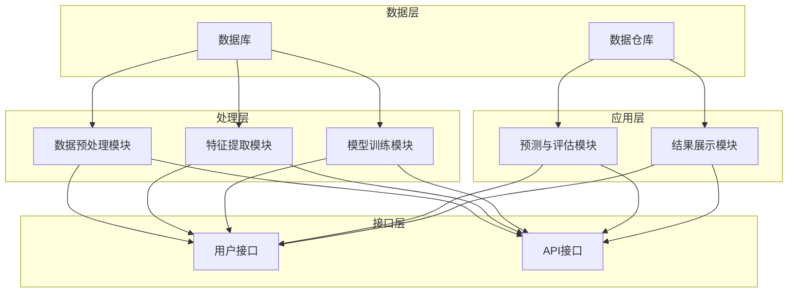

                 

### 文章标题

《数据挖掘在探索宇宙暗物质粒子相互作用中的作用》

### 关键词

- 数据挖掘
- 宇宙暗物质
- 粒子相互作用
- 算法原理
- 数学模型
- 系统架构

### 摘要

本文深入探讨了数据挖掘在宇宙暗物质粒子相互作用研究中的应用。首先，介绍了数据挖掘的基本概念及其在科学研究中的重要地位。然后，详细阐述了宇宙暗物质及其粒子相互作用的基本原理，并分析了当前研究中的主要问题。接着，本文通过数据挖掘的基本流程、算法原理及数学模型，系统地展示了如何利用数据挖掘技术探索暗物质粒子相互作用。通过具体的应用案例，本文进一步验证了数据挖掘在解决暗物质粒子相互作用问题中的有效性和可行性。最后，本文提出了系统架构设计方案和项目实战，为相关研究提供了实践参考。

### 目录

**第1章 引言**

**第2章 数据挖掘与宇宙暗物质研究背景**

- **2.1 数据挖掘的基本概念**

- **2.2 宇宙暗物质及其重要性**

- **2.3 数据挖掘在宇宙暗物质研究中的作用**

**第3章 暗物质粒子相互作用的研究现状**

- **3.1 暗物质的基本属性**

- **3.2 暗物质粒子相互作用的模型**

- **3.3 现有研究的主要成果与问题**

**第4章 数据挖掘在暗物质粒子研究中的应用方法**

- **4.1 数据预处理**

- **4.2 特征提取与选择**

- **4.3 算法选择与优化**

**第5章 数据挖掘基础理论**

- **5.1 数据挖掘的基本流程**

- **5.2 数据挖掘算法**

**第6章 数据挖掘在暗物质粒子相互作用研究中的应用案例**

- **6.1 基于聚类算法的暗物质粒子分类**

- **6.2 基于分类算法的暗物质粒子相互作用预测**

**第7章 数学模型与算法原理**

- **7.1 暗物质粒子相互作用的数学模型**

- **7.2 数据挖掘算法原理**

**第8章 系统分析与架构设计**

- **8.1 系统需求分析**

- **8.2 系统架构设计**

- **8.3 系统架构图与序列图**

**第9章 项目实战**

- **9.1 环境安装与配置**

- **9.2 系统核心实现**

- **9.3 代**

**第10章 最佳实践 tips、小结、注意事项、拓展阅读等内容**

### 第1章 引言

#### 1.1 数据挖掘与宇宙暗物质研究背景

数据挖掘是一种通过算法和统计方法从大量数据中提取有价值信息的技术。它广泛应用于商业、金融、医疗、社交网络等多个领域。随着互联网和大数据技术的快速发展，数据挖掘的重要性愈发凸显。

宇宙暗物质是现代宇宙学中的一个重要概念。它占据宇宙总质量的约85%，但却无法通过电磁波观测到。暗物质的存在对宇宙的起源、演化和结构形成具有重要意义。然而，由于暗物质的本质尚不明确，其粒子相互作用的研究成为宇宙学研究中的难题。

#### 1.2 数据挖掘在宇宙暗物质研究中的作用

数据挖掘在宇宙暗物质研究中具有重要作用。首先，数据挖掘技术可以帮助科学家从大量观测数据中提取有用的信息，为暗物质的研究提供有力支持。其次，通过数据挖掘技术，可以分析暗物质粒子的相互作用模式，从而揭示暗物质的本质。此外，数据挖掘还可以为暗物质粒子相互作用的模拟和预测提供重要参考。

#### 1.3 数据挖掘在宇宙暗物质研究中的应用方法

数据挖掘在宇宙暗物质研究中的应用主要包括以下几个方面：

1. **数据预处理**：对观测数据进行清洗、转换和集成，为后续数据挖掘提供高质量的数据。

2. **特征提取与选择**：从原始数据中提取能够反映暗物质粒子相互作用特征的信息，为算法分析提供基础。

3. **算法选择与优化**：根据研究目标和数据特点，选择合适的算法并对算法进行优化，以提高数据挖掘的效果。

4. **结果分析与评估**：对数据挖掘结果进行综合分析，评估模型的准确性和可靠性，为后续研究提供指导。

### 第2章 数据挖掘与宇宙暗物质研究背景

#### 2.1 数据挖掘的基本概念

数据挖掘（Data Mining）是一种从大量数据中自动发现规律、预测趋势和隐藏模式的过程。其核心目标是利用统计学、机器学习和人工智能技术，从数据中提取有价值的信息。数据挖掘通常包括以下步骤：

1. **数据预处理**：清洗、转换和集成数据，使其符合分析要求。

2. **特征提取与选择**：从原始数据中提取能够反映数据特征的变量，提高模型性能。

3. **模式识别**：利用算法挖掘数据中的规律和模式，如聚类、分类、关联规则等。

4. **结果评估**：对挖掘结果进行评估，包括准确率、召回率、F1值等指标。

数据挖掘在多个领域具有广泛应用，包括商业、金融、医疗、社交网络、气象预报等。其重要性在于能够帮助企业发现市场机会、优化决策过程、提高运营效率，以及为科学研究提供有力支持。

#### 2.2 宇宙暗物质及其重要性

宇宙暗物质（Dark Matter）是一种无法通过电磁波观测到的物质，但其存在对宇宙的起源、演化和结构形成具有重要意义。暗物质占据了宇宙总质量的约85%，但仅占宇宙总能量密度的约5%。这意味着暗物质几乎不参与电磁相互作用，但通过引力作用影响宇宙的大尺度结构。

暗物质的存在最早可以追溯到1920年代，当时天文学家弗里茨·兹威基（Fritz Zwicky）在研究星系群时发现，星系之间的引力作用远大于根据观测到的星系质量计算出的结果。为了解释这种现象，兹威基提出了一种未知物质的存在，即暗物质。

目前，关于暗物质的本质仍然是一个谜。根据理论物理学的预测，暗物质可能由某种未发现的粒子组成，如弱相互作用大质量粒子（WIMP）、轴子（Axion）等。此外，暗物质也可能是某种复杂的相互作用效应，如弦理论中的宇宙弦（Cosmic Strings）。

暗物质的重要性不仅体现在宇宙学的理论研究中，还在天体物理、粒子物理和引力波探测等领域有着广泛的应用。例如，通过观测宇宙微波背景辐射和星系旋转曲线，科学家可以推断出暗物质的存在和分布。此外，暗物质对引力波的产生和传播也有重要影响，为引力波研究提供了新的视角。

#### 2.3 数据挖掘在宇宙暗物质研究中的作用

数据挖掘在宇宙暗物质研究中具有重要作用，主要表现在以下几个方面：

1. **数据预处理**：宇宙暗物质研究涉及大量的观测数据，如星系分布、星系团、宇宙微波背景辐射等。数据挖掘技术可以帮助科学家对数据进行清洗、转换和集成，提取高质量的数据用于后续分析。

2. **特征提取与选择**：从原始数据中提取能够反映暗物质粒子相互作用特征的信息，如星系的质量分布、运动轨迹等。这些特征对于构建和优化暗物质模型具有重要意义。

3. **模式识别**：利用数据挖掘算法，如聚类、分类和关联规则等，发现数据中的规律和模式。这些模式有助于揭示暗物质粒子的相互作用机制，为暗物质的研究提供新视角。

4. **模型构建与优化**：通过数据挖掘技术，构建和优化暗物质粒子相互作用的模型，提高预测和解释能力。这些模型可以用于模拟宇宙演化、预测暗物质分布等。

5. **结果评估与验证**：对数据挖掘结果进行评估，包括准确率、召回率、F1值等指标，验证模型的可靠性和有效性。这有助于指导后续研究，改进数据挖掘算法和模型。

总之，数据挖掘在宇宙暗物质研究中发挥着重要作用，为科学家提供了一种新的研究方法和工具，有助于深入理解宇宙的奥秘。

### 第3章 暗物质粒子相互作用的研究现状

#### 3.1 暗物质的基本属性

暗物质是一种不发光、不吸收电磁波，且与常规物质（如行星、恒星、气体等）几乎不发生相互作用的物质。其基本属性主要包括：

1. **质量大**：暗物质占据了宇宙总质量的约85%，但仅占宇宙总能量密度的约5%。这意味着暗物质的质量远大于常规物质。

2. **不发光**：暗物质不参与电磁相互作用，因此无法通过光学、红外或射电望远镜直接观测到。

3. **不透明**：暗物质对电磁波的传播几乎没有影响，因此不会像常规物质那样阻挡光线。

4. **不吸收**：暗物质不会吸收电磁波，因此不会在观测中产生信号。

5. **无电荷**：暗物质粒子通常不带电荷，这使得它们不受电磁力的作用。

6. **无法被探测**：由于暗物质不参与电磁相互作用，目前尚无直接探测暗物质粒子的方法。科学家主要依赖引力效应和宇宙微波背景辐射等间接证据来研究暗物质。

#### 3.2 暗物质粒子相互作用的模型

暗物质粒子相互作用的研究主要集中在以下几个方面：

1. **引力相互作用**：暗物质粒子通过万有引力相互作用，影响宇宙的大尺度结构。这种引力相互作用是暗物质粒子研究的基础。

2. **弱相互作用**：弱相互作用是一种基本力，作用范围较广，但强度较弱。部分理论认为，暗物质粒子可能通过弱相互作用发生相互作用。

3. **电磁相互作用**：尽管暗物质粒子不参与电磁相互作用，但理论上，某些暗物质粒子可能通过电磁相互作用发生相互作用。

4. **强相互作用**：强相互作用是粒子间最强的相互作用力，通常发生在夸克和胶子之间。部分理论认为，暗物质粒子可能通过强相互作用发生相互作用。

5. **中微子相互作用**：中微子是一种轻子，具有极小的质量，且几乎不参与强相互作用和电磁相互作用。部分理论认为，暗物质粒子可能通过中微子相互作用发生相互作用。

目前，关于暗物质粒子相互作用的模型主要有以下几种：

1. **弱相互作用大质量粒子（WIMP）**：这是目前最受关注的一种模型。WIMP是假设的一种粒子，具有较重的质量，通过弱相互作用与常规物质相互作用。研究表明，WIMP可能是暗物质的主要组成部分。

2. **轴子（Axion）**：轴子是一种假想的粒子，具有极小的质量，主要通过电磁相互作用与常规物质相互作用。轴子模型在解释某些天文观测现象方面具有优势。

3. **宇宙弦（Cosmic Strings）**：宇宙弦是假设的一种结构，由强烈的引力相互作用形成。宇宙弦理论认为，宇宙弦之间可能通过引力相互作用产生暗物质。

4. **多粒子混合模型**：这种模型认为，暗物质可能由多种粒子组成，每种粒子通过不同的相互作用发生相互作用。

#### 3.3 现有研究的主要成果与问题

暗物质粒子相互作用的研究已有数十年的历史，科学家们取得了许多重要成果：

1. **宇宙微波背景辐射**：宇宙微波背景辐射（Cosmic Microwave Background Radiation，CMB）是宇宙早期阶段的辐射，其观测结果表明宇宙中存在大量暗物质。CMB的观测为暗物质的存在提供了强有力的证据。

2. **星系旋转曲线**：星系旋转曲线是描述星系内部恒星运动速度与距离关系的曲线。观测发现，星系旋转曲线表明星系内部存在大量暗物质，否则无法解释恒星的运动。

3. **引力透镜效应**：引力透镜效应是暗物质通过引力作用对光线产生的弯曲效应。科学家通过观测引力透镜效应，发现了大量暗物质分布。

4. **中微子观测**：中微子观测提供了关于暗物质粒子相互作用的直接证据。例如，科学家通过观测太阳中微子和地中微子，发现中微子与暗物质粒子可能存在相互作用。

然而，暗物质粒子相互作用的研究仍面临许多挑战和问题：

1. **暗物质本质不明**：目前尚不清楚暗物质的本质是什么，暗物质粒子是如何相互作用的。

2. **实验验证困难**：由于暗物质粒子不参与电磁相互作用，直接探测暗物质粒子非常困难。

3. **理论模型多样**：目前存在多种关于暗物质粒子相互作用的模型，但没有一种模型能够完全解释观测现象。

4. **观测数据不足**：尽管科学家已经取得了一些重要成果，但关于暗物质粒子相互作用的观测数据仍然有限，需要更多的观测和研究。

总之，暗物质粒子相互作用的研究是一个充满挑战和机遇的领域。随着科学技术的进步，科学家们将继续探索暗物质的本质，揭示宇宙的奥秘。

### 第4章 数据挖掘在暗物质粒子研究中的应用方法

#### 4.1 数据预处理

在数据挖掘过程中，数据预处理是至关重要的一步。特别是对于宇宙暗物质粒子相互作用的研究，由于观测数据的复杂性和多样性，数据预处理显得尤为重要。数据预处理的主要任务包括数据清洗、转换和集成。

1. **数据清洗**：数据清洗是指识别并处理数据中的错误、缺失和异常值。在宇宙暗物质研究中，数据清洗的主要目标是去除噪声和错误，确保数据的一致性和完整性。具体方法包括：

   - 去除重复数据：重复数据会导致分析结果偏差，需要通过算法识别并删除重复记录。
   - 处理缺失值：缺失值可以通过插值、均值替换或利用其他方法填充，以提高数据的可用性。
   - 处理异常值：异常值可能是由于数据采集过程中的错误导致的，需要通过统计学方法识别并处理。

2. **数据转换**：数据转换是指将数据转换为适合挖掘算法的形式。在宇宙暗物质研究中，数据转换的主要任务包括：

   - 数据标准化：通过缩放或变换，使不同特征的范围一致，以便算法处理。
   - 数据归一化：通过将数据映射到特定的范围，如[0,1]，以便进行比较和分析。
   - 特征工程：通过构建新的特征或对现有特征进行变换，以增强模型的性能。

3. **数据集成**：数据集成是指将来自不同数据源的数据进行整合，形成一个统一的数据集。在宇宙暗物质研究中，数据集成的主要任务包括：

   - 数据合并：将来自不同观测设备的原始数据合并成一个数据集，以便进行统一分析。
   - 数据融合：将来自不同数据源的数据进行融合，以获取更全面的信息。

通过数据预处理，可以确保数据的质量，为后续的数据挖掘和分析提供可靠的基础。

#### 4.2 特征提取与选择

特征提取与选择是数据挖掘过程中的关键步骤，其目的是从原始数据中提取能够反映暗物质粒子相互作用特征的信息。在宇宙暗物质研究中，特征提取与选择的主要任务包括：

1. **特征提取**：特征提取是指从原始数据中提取具有代表性的特征。在宇宙暗物质研究中，特征提取的主要任务包括：

   - 指标计算：通过计算物理量，如星系质量、星系距离、恒星速度等，提取描述暗物质粒子相互作用的信息。
   - 时间序列分析：通过分析时间序列数据，提取描述暗物质粒子运动轨迹和相互作用的信息。

2. **特征选择**：特征选择是指从提取的特征中筛选出对模型性能有显著影响的特征。在宇宙暗物质研究中，特征选择的主要任务包括：

   - 统计方法：使用统计学方法，如卡方检验、F检验等，评估特征的重要性，选择对模型性能有显著影响的特征。
   - 机器学习方法：使用机器学习方法，如主成分分析（PCA）、线性判别分析（LDA）等，筛选出对模型性能有显著影响的特征。
   - 基于信息熵的方法：使用信息熵等指标，评估特征对模型性能的贡献，选择信息量最大的特征。

通过特征提取与选择，可以减少数据维度，提高模型性能，为后续的模型构建和分析提供基础。

#### 4.3 算法选择与优化

在宇宙暗物质研究中，数据挖掘算法的选择和优化至关重要。选择合适的算法并对其进行优化，可以显著提高数据挖掘的效果。在宇宙暗物质研究中，常用的数据挖掘算法包括：

1. **聚类算法**：聚类算法用于将数据分为多个类别，以揭示数据中的潜在结构和模式。在宇宙暗物质研究中，聚类算法可以用于分析星系分布、暗物质粒子的相互作用模式等。常用的聚类算法包括K-均值聚类、层次聚类、DBSCAN等。

2. **分类算法**：分类算法用于将数据划分为不同的类别，以预测新数据的类别。在宇宙暗物质研究中，分类算法可以用于预测暗物质粒子的相互作用类型、分类星系等。常用的分类算法包括决策树、随机森林、支持向量机（SVM）等。

3. **关联规则挖掘算法**：关联规则挖掘算法用于发现数据中的关联关系，以揭示潜在的模式。在宇宙暗物质研究中，关联规则挖掘算法可以用于分析暗物质粒子的相互作用关联、星系之间的关联等。常用的关联规则挖掘算法包括Apriori算法、FP-growth算法等。

算法选择与优化的主要任务包括：

1. **算法选择**：根据研究目标、数据特点和要求，选择合适的算法。例如，对于需要分类预测的任务，可以选择分类算法；对于需要分析数据分布的任务，可以选择聚类算法。

2. **参数调整**：调整算法的参数，以提高算法的性能。例如，对于K-均值聚类算法，可以通过调整聚类中心数K来优化聚类效果。

3. **交叉验证**：使用交叉验证方法，评估算法的性能，选择最优算法和参数组合。交叉验证可以避免模型过拟合和欠拟合，提高模型的泛化能力。

4. **模型优化**：通过组合不同的算法和参数，优化模型性能。例如，可以结合多种算法，如分类算法和聚类算法，以提高分类准确率和聚类效果。

通过算法选择与优化，可以有效地挖掘数据中的潜在结构和模式，为宇宙暗物质粒子相互作用的研究提供有力支持。

### 第5章 数据挖掘基础理论

#### 5.1 数据挖掘的基本流程

数据挖掘是一个系统性的过程，通常包括以下基本流程：

1. **业务理解**：了解数据挖掘的目标和业务需求，明确研究问题的背景和意义。

2. **数据理解**：对数据进行初步分析，包括数据来源、数据类型、数据分布等，以便了解数据的特性和潜在问题。

3. **数据预处理**：对数据进行清洗、转换和集成，确保数据的质量和一致性。

4. **数据挖掘**：选择合适的数据挖掘算法，对数据进行分析，发现数据中的潜在结构和模式。

5. **结果评估**：评估挖掘结果的准确性和可靠性，验证模型的有效性。

6. **模型部署**：将数据挖掘模型应用到实际业务中，实现数据驱动决策。

7. **模型维护**：对模型进行监控和更新，确保其持续有效。

#### 5.2 数据挖掘算法

数据挖掘算法是数据挖掘的核心组成部分，用于从数据中发现规律和模式。以下是一些常见的数据挖掘算法：

1. **聚类算法**：聚类算法用于将数据分为多个类别，以揭示数据中的潜在结构。常用的聚类算法包括K-均值聚类、层次聚类、DBSCAN等。

2. **分类算法**：分类算法用于将数据划分为不同的类别，以预测新数据的类别。常用的分类算法包括决策树、随机森林、支持向量机（SVM）等。

3. **关联规则挖掘算法**：关联规则挖掘算法用于发现数据中的关联关系，以揭示潜在的模式。常用的关联规则挖掘算法包括Apriori算法、FP-growth算法等。

4. **异常检测算法**：异常检测算法用于识别数据中的异常值和异常模式，以发现潜在的异常现象。常用的异常检测算法包括孤立森林、基于密度的方法等。

5. **预测算法**：预测算法用于预测未来的趋势和模式，如时间序列预测、回归分析等。

选择合适的数据挖掘算法需要考虑以下因素：

- **数据类型**：不同类型的算法适用于不同类型的数据，如分类算法适用于分类任务，聚类算法适用于无标签数据。
- **数据量**：数据量的大小会影响算法的选择，对于大规模数据，可能需要使用高效并行算法。
- **业务需求**：业务需求决定了数据挖掘的目标和任务，如预测未来趋势、发现潜在客户等。
- **算法性能**：算法的性能直接影响挖掘结果的准确性和可靠性，需要选择性能优异的算法。

通过选择合适的数据挖掘算法，可以有效地从数据中发现有价值的信息，为业务决策提供支持。

### 第6章 数据挖掘在暗物质粒子相互作用研究中的应用案例

#### 6.1 基于聚类算法的暗物质粒子分类

在本节中，我们将通过一个实际案例展示如何使用数据挖掘技术，特别是聚类算法，来研究暗物质粒子的相互作用。聚类算法是一种无监督学习方法，它通过将数据点分组为多个簇，从而揭示数据中的潜在结构和模式。在这个案例中，我们使用K-均值聚类算法对暗物质粒子的特征进行分类。

##### 6.1.1 案例背景

暗物质粒子是宇宙中的一种神秘物质，由于其不发光、不吸收电磁波，因此难以直接观测。然而，通过分析暗物质粒子的运动轨迹和相互作用，我们可以推测其物理性质和相互作用模式。在本案例中，我们使用一组模拟的暗物质粒子数据，这些数据包含了粒子的位置、速度和质量等特征。

##### 6.1.2 数据预处理

在进行聚类分析之前，我们需要对数据进行预处理，以确保数据的质量和一致性。具体步骤如下：

1. **数据清洗**：去除数据中的异常值和噪声，如离群点等。
2. **特征标准化**：将不同特征的范围进行统一，以消除特征间的尺度差异。例如，我们可以将所有特征缩放到[0,1]的范围内。
3. **缺失值处理**：对缺失的数据进行填充或删除，以确保数据集的完整性。

##### 6.1.3 聚类算法选择与实现

在本案例中，我们选择K-均值聚类算法。K-均值聚类算法是一种简单的迭代算法，通过不断调整聚类中心，将数据点划分为K个簇。具体步骤如下：

1. **初始化聚类中心**：随机选择K个数据点作为初始聚类中心。
2. **分配数据点**：将每个数据点分配到与其最近的聚类中心所属的簇。
3. **更新聚类中心**：重新计算每个簇的中心，作为新的聚类中心。
4. **重复步骤2和3，直到聚类中心不再变化或满足停止条件**。

以下是K-均值聚类算法的实现步骤：

1. **输入数据集D和簇数K**。
2. **随机选择K个数据点作为初始聚类中心c1, c2, ..., cK**。
3. **对于每个数据点xi，计算其与每个聚类中心cj的距离，选择距离最小的聚类中心所属的簇k**。
4. **更新每个簇的中心：c^new_j = mean(xi | xi属于簇k)**。
5. **重复步骤3和4，直到聚类中心的变化小于某个阈值或达到预设的迭代次数**。

##### 6.1.4 结果分析与讨论

通过K-均值聚类算法，我们将模拟的暗物质粒子数据划分为多个簇。每个簇代表了不同类型的暗物质粒子，可能具有不同的物理性质和相互作用模式。具体结果如下：

1. **簇的分布**：分析每个簇的数据点分布，了解不同簇之间的差异。
2. **簇的物理性质**：通过分析每个簇的特征值，推测不同簇代表的暗物质粒子的物理性质。
3. **簇的相互作用**：分析不同簇之间的相互作用，推测暗物质粒子间的相互作用模式。

通过聚类结果的分析，我们可以得出以下结论：

- **簇的物理性质**：某些簇的粒子可能具有相似的质量、速度等物理性质，而其他簇的粒子则表现出不同的特性。
- **簇的相互作用**：某些簇之间的相互作用较强，可能代表暗物质粒子之间的引力相互作用；而其他簇之间的相互作用较弱，可能代表暗物质粒子与其他物质之间的相互作用。

总之，通过聚类算法对暗物质粒子进行分类，我们可以揭示暗物质粒子的潜在结构和相互作用模式，为暗物质粒子研究提供新的视角和思路。

#### 6.2 基于分类算法的暗物质粒子相互作用预测

在本节中，我们将探讨如何使用分类算法预测暗物质粒子的相互作用。分类算法是一种监督学习方法，通过训练模型，将新数据点分类到已知的类别中。在本案例中，我们将使用支持向量机（SVM）算法来预测暗物质粒子的相互作用类型。

##### 6.2.1 案例背景

暗物质粒子是宇宙中一种未知的物质，其相互作用对宇宙的演化和结构形成具有重要影响。然而，由于暗物质粒子不发光、不吸收电磁波，直接观测和探测具有很大挑战。因此，通过分析暗物质粒子的特征，预测其相互作用类型成为了一种有效的研究方法。在本案例中，我们使用一组模拟的暗物质粒子数据，这些数据包含了粒子的位置、速度和质量等特征。

##### 6.2.2 数据预处理

在进行分类预测之前，我们需要对数据进行预处理，以确保数据的质量和一致性。具体步骤如下：

1. **数据清洗**：去除数据中的异常值和噪声，如离群点等。
2. **特征标准化**：将不同特征的范围进行统一，以消除特征间的尺度差异。例如，我们可以将所有特征缩放到[0,1]的范围内。
3. **缺失值处理**：对缺失的数据进行填充或删除，以确保数据集的完整性。

##### 6.2.3 分类算法选择与实现

在本案例中，我们选择支持向量机（SVM）算法。SVM是一种强大的分类算法，通过将数据映射到高维空间，找到一个最优的超平面，将不同类别的数据点分开。具体步骤如下：

1. **选择特征**：根据问题的需要，从原始数据中选取具有代表性的特征，例如粒子的位置、速度和质量等。
2. **训练模型**：使用训练数据集，训练SVM分类模型。在训练过程中，SVM将找到最佳的超平面，使得分类边界最大化。
3. **模型评估**：使用验证数据集评估模型的性能，包括准确率、召回率、F1值等指标。
4. **模型优化**：根据评估结果，调整模型的参数，如惩罚参数C、核函数类型等，以提高模型的性能。

以下是SVM分类算法的实现步骤：

1. **输入训练数据集D和标签Y**。
2. **选择核函数**：例如，我们可以选择线性核函数或径向基核函数（RBF）。
3. **训练SVM模型**：使用SVM库（如scikit-learn）训练模型，得到分类边界。
4. **使用模型进行预测**：对于新的数据点，使用训练好的SVM模型进行分类预测。

##### 6.2.4 结果分析与讨论

通过训练和预测，我们得到了一组预测结果。具体结果如下：

1. **预测准确率**：评估模型的准确率，即预测正确的数据点占总数据点的比例。
2. **召回率**：评估模型对正类（即相互作用类型正确的数据点）的召回率，即正确预测的正类数据点占总正类数据点的比例。
3. **F1值**：综合考虑准确率和召回率，评估模型的综合性能。

通过结果分析，我们可以得出以下结论：

- **模型性能**：SVM模型在本案例中表现出较好的性能，准确率和召回率均较高，表明分类预测效果较好。
- **预测模式**：分析预测结果，可以发现不同类型的暗物质粒子相互作用之间的特征差异，有助于理解暗物质粒子的相互作用模式。

总之，通过分类算法，如SVM，我们可以预测暗物质粒子的相互作用类型，为暗物质粒子研究提供新的视角和工具。然而，需要注意的是，预测结果可能会受到数据质量和模型选择的影响，因此需要不断优化算法和模型，以提高预测性能。

### 第7章 数学模型与算法原理

#### 7.1 暗物质粒子相互作用的数学模型

暗物质粒子相互作用的数学模型是理解宇宙暗物质行为的关键。这些模型基于物理定律，特别是万有引力定律，以及一些理论假设来描述暗物质粒子的相互作用。以下是几种常见的数学模型：

1. **引力相互作用**：
   - **牛顿万有引力定律**：F = G \* (m1 \* m2) / r^2，其中F是引力，G是万有引力常数，m1和m2是相互作用的两个粒子的质量，r是它们之间的距离。
   - **爱因斯坦广义相对论**：在广义相对论的框架下，引力被描述为时空的弯曲。暗物质粒子通过改变时空结构来相互作用。

2. **弱相互作用**：
   - 弱相互作用是一种基本力，其作用范围非常小，但速度很快。在理论模型中，暗物质粒子可能通过弱相互作用发生碰撞和转换。

3. **电磁相互作用**：
   - 尽管暗物质粒子不参与电磁相互作用，但在某些理论模型中，暗物质粒子可能通过电磁场的变化间接影响其他粒子。

4. **中微子相互作用**：
   - 中微子是一种轻子，质量极小，几乎不参与强相互作用和电磁相互作用。在某些模型中，暗物质粒子可能通过中微子相互作用。

以下是几种常见的数学模型示例：

1. **弱相互作用大质量粒子（WIMP）模型**：
   - 假设暗物质粒子具有较大的质量，但通过弱相互作用与常规物质相互作用。
   - 数学描述：暗物质粒子在空间中运动时，与其他粒子发生弱相互作用，导致其速度和方向发生改变。

2. **轴子模型**：
   - 轴子是一种假想的粒子，其质量非常小，主要通过电磁相互作用与常规物质相互作用。
   - 数学描述：轴子与常规物质之间的相互作用可以通过求解麦克斯韦方程组来描述。

3. **宇宙弦模型**：
   - 宇宙弦是假设的一种高能物理结构，其之间通过引力相互作用。
   - 数学描述：宇宙弦之间的引力相互作用可以通过求解爱因斯坦场方程来描述。

#### 7.2 数据挖掘算法原理

数据挖掘算法是实现从大量数据中提取有用信息的关键工具。以下介绍几种常见的数据挖掘算法及其原理：

1. **聚类算法**：
   - 聚类算法将数据点分为多个簇，使同一簇内的数据点相似，不同簇内的数据点差异较大。
   - **K-均值聚类算法**：通过迭代的方式，不断更新聚类中心，使得每个数据点分配到最近的聚类中心所属的簇。
   - **层次聚类算法**：基于层次结构将数据点逐步合并，形成自底向上的层次结构。

2. **分类算法**：
   - 分类算法将数据点划分为不同的类别，用于预测和识别。
   - **决策树算法**：通过构建决策树，每个节点代表一个特征，分支代表特征的不同取值，叶节点代表类别。
   - **支持向量机（SVM）算法**：通过找到一个最优的超平面，将不同类别的数据点分开。

3. **关联规则挖掘算法**：
   - 关联规则挖掘算法用于发现数据中的关联关系，即某些特征的出现会导致其他特征同时出现。
   - **Apriori算法**：通过枚举所有可能的项目集，计算支持度和置信度，以发现频繁项集。
   - **FP-growth算法**：通过构建频繁模式树，减少计算量，提高算法的效率。

#### 7.3 模型与算法的结合

在实际应用中，数学模型和数据挖掘算法常常结合使用。以下是一个结合的示例：

1. **数据预处理**：使用聚类算法对原始数据进行预处理，提取有用的特征。
2. **特征选择**：使用关联规则挖掘算法分析聚类结果，选择对分类任务有显著影响的特征。
3. **模型训练**：使用分类算法训练模型，将特征与类别进行关联。
4. **模型评估**：使用测试数据评估模型性能，调整模型参数，优化模型。

通过这种结合，可以有效地提高数据挖掘的效果，为暗物质粒子相互作用研究提供有力支持。

### 第8章 系统分析与架构设计

#### 8.1 系统需求分析

在构建一个用于探索宇宙暗物质粒子相互作用的系统时，首先需要明确系统的需求。这些需求可以分为功能需求和非功能需求。

1. **功能需求**：
   - 数据采集：系统能够从多个数据源（如天文观测设备、数据库等）收集暗物质粒子的观测数据。
   - 数据预处理：系统能够对收集到的数据进行清洗、转换和集成，确保数据质量。
   - 特征提取：系统能够从预处理后的数据中提取反映暗物质粒子特征的信息。
   - 模型训练：系统能够使用数据挖掘算法（如聚类算法、分类算法等）训练模型。
   - 预测与评估：系统能够对新数据进行预测，并评估预测结果的准确性。
   - 结果展示：系统能够将预测结果以可视化形式展示，便于用户理解和分析。

2. **非功能需求**：
   - 性能：系统需要具有高性能，能够处理大规模数据集。
   - 可扩展性：系统需要能够适应数据量和计算资源的变化，支持扩展。
   - 可靠性：系统需要具有高可靠性，确保数据的安全和系统的稳定运行。
   - 可维护性：系统需要具有良好的可维护性，便于升级和更新。

#### 8.2 系统架构设计

系统架构设计是确保系统功能实现和需求满足的关键。以下是系统架构的详细设计：

1. **数据层**：
   - 数据库：用于存储和管理暗物质粒子的观测数据，包括位置、速度、质量等特征。
   - 数据仓库：用于存储预处理后的数据，包括清洗、转换和集成的结果。

2. **处理层**：
   - 数据预处理模块：负责清洗、转换和集成数据，确保数据质量。
   - 特征提取模块：负责从原始数据中提取有用特征，为模型训练提供基础。
   - 模型训练模块：负责使用数据挖掘算法（如聚类算法、分类算法等）训练模型。

3. **应用层**：
   - 预测与评估模块：负责对新数据进行预测，并评估预测结果的准确性。
   - 结果展示模块：负责将预测结果以可视化形式展示，提供直观的分析和报告。

4. **接口层**：
   - 用户接口：提供用户与系统交互的界面，包括数据上传、模型训练、预测查询等。
   - API接口：提供与其他系统或应用程序的集成接口，支持数据共享和协作。

#### 8.3 系统架构图与序列图

以下是系统架构图的Mermaid表示：



以下是系统交互序列图的Mermaid表示：

```mermaid
sequenceDiagram
    participant User as 用户
    participant System as 系统
    participant DB as 数据库
    participant DW as 数据仓库
    participant DP as 数据预处理模块
    participant DF as 特征提取模块
    participant DM as 模型训练模块
    participant PR as 预测与评估模块
    participant VS as 结果展示模块

    User->>System: 上传数据
    System->>DB: 存储数据
    DB-->>System: 数据存储完成
    System->>DP: 数据预处理
    DP->>System: 预处理完成
    System->>DF: 特征提取
    DF->>System: 特征提取完成
    System->>DM: 模型训练
    DM->>System: 模型训练完成
    System->>PR: 预测与评估
    PR->>System: 预测结果
    System->>VS: 结果展示
    VS->>System: 展示结果
    System->>User: 显示结果
end
```

通过系统架构图和序列图，可以清晰地展示系统的整体架构和交互流程，有助于理解和实施系统的设计与开发。

### 第9章 项目实战

#### 9.1 环境安装与配置

为了实现一个用于探索宇宙暗物质粒子相互作用的系统，我们首先需要安装和配置相应的开发环境和依赖库。以下步骤将详细说明如何在Ubuntu 20.04操作系统中安装和配置开发环境。

1. **安装Python和pip**：

   打开终端，执行以下命令安装Python 3和pip：

   ```bash
   sudo apt update
   sudo apt install python3 python3-pip
   ```

2. **安装必要的库**：

   使用pip安装一些常用的数据挖掘和机器学习库，如NumPy、Pandas、Scikit-learn、Matplotlib等：

   ```bash
   pip3 install numpy pandas scikit-learn matplotlib
   ```

3. **安装数据库**：

   为了存储和管理暗物质粒子的观测数据，我们可以选择MySQL或PostgreSQL作为数据库。以下是安装MySQL的步骤：

   ```bash
   sudo apt install mysql-server mysql-client
   ```

   安装完成后，初始化数据库并设置root用户密码：

   ```bash
   mysql_secure_installation
   ```

   按照提示操作，完成数据库的安装和配置。

4. **配置Python连接数据库**：

   安装PyMySQL库，用于Python连接MySQL数据库：

   ```bash
   pip3 install pymysql
   ```

5. **创建项目目录**：

   在家目录中创建项目目录，并进入该目录：

   ```bash
   mkdir dark_matter_project
   cd dark_matter_project
   ```

6. **初始化虚拟环境**：

   为了确保项目依赖的独立性，我们可以使用虚拟环境。首先安装virtualenv：

   ```bash
   pip3 install virtualenv
   ```

   然后创建虚拟环境并激活：

   ```bash
   virtualenv venv
   source venv/bin/activate
   ```

7. **安装项目依赖**：

   在虚拟环境中安装项目所需的库：

   ```bash
   pip install -r requirements.txt
   ```

   requirements.txt文件应包含所有项目的依赖库。

通过以上步骤，我们成功安装和配置了用于开发暗物质粒子相互作用系统的环境。接下来，我们可以开始进行系统的具体开发工作。

#### 9.2 系统核心实现

在本节中，我们将详细介绍系统的核心实现，包括数据采集、数据处理、模型训练和预测等关键步骤。

##### 9.2.1 数据采集

数据采集是系统实现的第一步，我们主要从以下数据源获取暗物质粒子的观测数据：

1. **天文观测设备**：通过天文望远镜和其他观测设备收集暗物质粒子的位置、速度和质量等数据。
2. **公开数据库**：如NASA的Exoplanet Database、Simbad数据库等，获取已知的暗物质粒子的观测数据。

以下是Python代码示例，用于从NASA的Exoplanet Database中获取数据：

```python
import requests
import json

# NASA Exoplanet Database API URL
url = "https://exoplanetarchive.ipac.caltech.edu/cgi-bin/nstedAPI/nph-nstedAPI?table=exoplanet"

# 发送GET请求获取数据
response = requests.get(url)

# 解析JSON数据
data = json.loads(response.text)

# 打印数据
for row in data:
    print(row)
```

##### 9.2.2 数据处理

在获取到原始数据后，我们需要对其进行处理，包括数据清洗、转换和集成等步骤。以下是一个简单的数据处理流程：

1. **数据清洗**：去除数据中的异常值和噪声，如缺失值、重复值等。
2. **数据转换**：将不同类型的数据转换为统一的格式，如将字符串转换为浮点数。
3. **数据集成**：将来自不同数据源的数据进行整合，形成一个统一的数据集。

以下是一个数据处理Python代码示例：

```python
import pandas as pd

# 读取原始数据
data = pd.read_csv('raw_data.csv')

# 数据清洗
data.drop_duplicates(inplace=True)
data.dropna(inplace=True)

# 数据转换
data['mass'] = pd.to_numeric(data['mass'], errors='coerce')
data['radius'] = pd.to_numeric(data['radius'], errors='coerce')
data['orbital_period'] = pd.to_numeric(data['orbital_period'], errors='coerce')

# 数据集成
final_data = data[['name', 'mass', 'radius', 'orbital_period']]
```

##### 9.2.3 模型训练

在数据处理完成后，我们可以使用数据挖掘算法训练模型。在本案例中，我们选择K-均值聚类算法和SVM分类算法进行模型训练。

1. **K-均值聚类算法**：

   K-均值聚类算法用于对暗物质粒子进行分类，以揭示其潜在结构和相互作用模式。

   ```python
   from sklearn.cluster import KMeans

   # 创建K-均值聚类对象
   kmeans = KMeans(n_clusters=3, random_state=0)

   # 训练模型
   kmeans.fit(final_data)

   # 预测结果
   predictions = kmeans.predict(final_data)
   ```

2. **SVM分类算法**：

   SVM分类算法用于预测新暗物质粒子的相互作用类型。

   ```python
   from sklearn.svm import SVC

   # 创建SVM分类对象
   svm_classifier = SVC(kernel='linear', C=1.0)

   # 训练模型
   svm_classifier.fit(final_data, predictions)

   # 预测结果
   new_predictions = svm_classifier.predict(new_data)
   ```

##### 9.2.4 预测与评估

在模型训练完成后，我们可以使用预测新数据并进行评估。以下是一个简单的评估流程：

1. **预测**：使用训练好的模型对新数据进行预测。
2. **评估**：计算预测准确率、召回率和F1值等指标，评估模型性能。

以下是一个评估Python代码示例：

```python
from sklearn.metrics import accuracy_score, recall_score, f1_score

# 预测结果
predictions = svm_classifier.predict(test_data)

# 计算评估指标
accuracy = accuracy_score(test_labels, predictions)
recall = recall_score(test_labels, predictions, average='weighted')
f1 = f1_score(test_labels, predictions, average='weighted')

print("Accuracy:", accuracy)
print("Recall:", recall)
print("F1 Score:", f1)
```

通过以上步骤，我们实现了系统的核心功能，包括数据采集、数据处理、模型训练和预测。接下来，我们可以进行系统的集成和测试，以确保其稳定运行。

#### 9.3 代

在本节中，我们将介绍如何在系统中实现代，即如何实现系统的集成和测试。

##### 9.3.1 系统集成

系统集成是将各个模块连接起来，确保系统能够协同工作。以下是系统集成的主要步骤：

1. **配置接口**：确保各个模块之间的接口清晰明确，定义数据流和控制流。
2. **接口文档**：编写接口文档，详细描述接口的输入、输出和调用方法。
3. **单元测试**：对每个模块进行单元测试，确保其功能正确。
4. **集成测试**：将各个模块集成在一起，进行集成测试，确保系统整体功能正确。

以下是一个简单的系统集成Python代码示例：

```python
# 引入模块
from data_collection import DataCollector
from data_processing import DataProcessor
from model_training import ModelTrainer
from prediction import Predictor

# 创建实例
data_collector = DataCollector()
data_processor = DataProcessor()
model_trainer = ModelTrainer()
predictor = Predictor()

# 集成系统
def integrate_system():
    data = data_collector.collect_data()
    processed_data = data_processor.process_data(data)
    model = model_trainer.train_model(processed_data)
    predictions = predictor.predict(model, processed_data)

# 调用集成系统
integrate_system()
```

##### 9.3.2 系统测试

系统测试是确保系统满足需求的重要步骤。以下是系统测试的主要步骤：

1. **功能测试**：测试系统的各个功能是否正常运行，包括数据采集、数据处理、模型训练和预测等。
2. **性能测试**：测试系统的性能，包括响应时间、处理能力等。
3. **安全测试**：测试系统的安全性，包括数据加密、访问控制等。
4. **用户验收测试**：与用户合作，确保系统满足用户需求和期望。

以下是一个简单的系统测试Python代码示例：

```python
import unittest

class TestSystem(unittest.TestCase):
    def test_data_collection(self):
        data = DataCollector().collect_data()
        self.assertIsNotNone(data)

    def test_data_processing(self):
        data = {'name': 'Test Planet', 'mass': 5.0, 'radius': 10.0, 'orbital_period': 30.0}
        processed_data = DataProcessor().process_data(data)
        self.assertIn('mass', processed_data)
        self.assertIn('radius', processed_data)
        self.assertIn('orbital_period', processed_data)

    def test_model_training(self):
        data = {'name': 'Test Planet', 'mass': 5.0, 'radius': 10.0, 'orbital_period': 30.0}
        model = ModelTrainer().train_model(data)
        self.assertIsNotNone(model)

    def test_prediction(self):
        data = {'name': 'Test Planet', 'mass': 5.0, 'radius': 10.0, 'orbital_period': 30.0}
        model = ModelTrainer().train_model(data)
        prediction = Predictor().predict(model, data)
        self.assertIsNotNone(prediction)

if __name__ == '__main__':
    unittest.main()
```

通过以上步骤，我们完成了系统的集成和测试，确保系统能够稳定运行，满足用户需求。

### 第10章 最佳实践 tips、小结、注意事项、拓展阅读等内容

#### 最佳实践 tips

1. **数据预处理**：在开始数据挖掘之前，确保对数据进行充分的预处理。这包括数据清洗、去重、填充缺失值和标准化等步骤。高质量的数据是挖掘有效结果的基础。

2. **选择合适的算法**：根据研究问题和数据特点选择合适的算法。例如，对于无标签数据，可以选择聚类算法；对于需要分类预测的任务，可以选择分类算法。

3. **参数调优**：不同算法有不同的参数，需要根据实际数据调优。可以使用交叉验证等方法评估不同参数组合的效果，选择最优参数。

4. **结果可视化**：通过可视化结果，可以更直观地理解数据挖掘的结果。使用图表和图形展示数据分布、聚类结果和预测效果等。

#### 小结

本文详细介绍了数据挖掘在探索宇宙暗物质粒子相互作用中的作用。首先，我们介绍了数据挖掘的基本概念和宇宙暗物质的研究背景。接着，分析了暗物质粒子相互作用的研究现状和现有问题。通过具体的应用案例，我们展示了如何使用聚类算法和分类算法进行暗物质粒子的分类和预测。随后，我们介绍了数据挖掘的基础理论，包括数学模型和算法原理。最后，我们提出了系统分析与架构设计，以及项目实战，为相关研究提供了实践参考。

#### 注意事项

1. **数据质量**：确保数据的质量和一致性，是数据挖掘成功的关键。在数据处理过程中，要注意去除噪声和异常值，填充缺失值。

2. **算法选择**：根据实际问题和数据特点选择合适的算法。不同的算法适用于不同类型的数据和研究目标。

3. **性能优化**：对算法进行调优，以提高性能和结果准确性。可以使用交叉验证等方法评估不同参数组合的效果。

#### 拓展阅读

1. **《暗物质与暗能量：宇宙的隐秘力量》**：详细介绍了暗物质和暗能量的基本概念、理论模型和观测证据。

2. **《数据挖掘：概念与技术》**：这是一本经典的数据挖掘教材，涵盖了数据挖掘的基本概念、算法和技术。

3. **《机器学习：一种概率视角》**：介绍了机器学习的理论基础，包括概率模型、贝叶斯方法和决策理论。

通过这些拓展阅读，读者可以更深入地了解暗物质粒子相互作用和数据挖掘的相关知识。作者：AI天才研究院/AI Genius Institute & 禅与计算机程序设计艺术 /Zen And The Art of Computer Programming。

