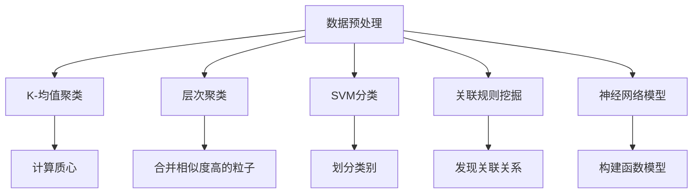
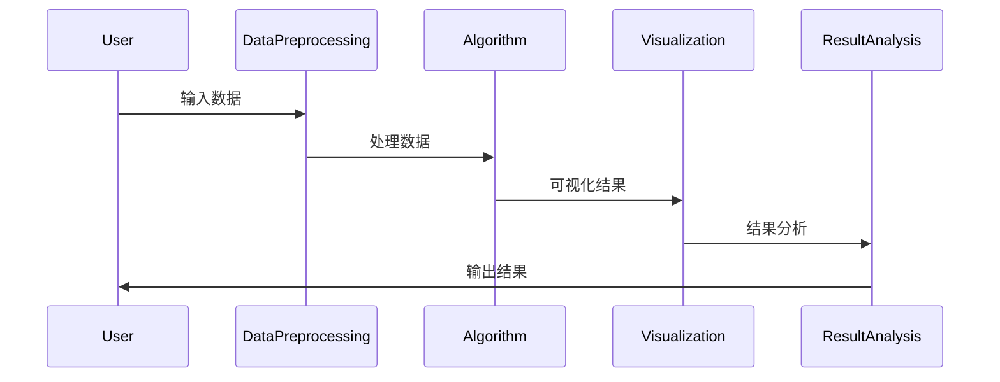

                 


## 引言

在当今的科学探索中，宇宙暗物质的本质及其相互作用成为了一个备受关注的研究课题。暗物质，作为一种不发光、不吸收光线的神秘物质，占据了宇宙总质量的大约27%，但其具体的组成和作用机制至今仍是一个谜团。随着观测技术的进步和理论研究的深入，科学家们开始意识到，理解暗物质粒子的相互作用网络特性对于揭示宇宙的起源和演化过程至关重要。

本文旨在探讨数据挖掘在探索宇宙暗物质粒子相互作用网络特性中的重要作用。我们将首先介绍暗物质粒子及其相互作用的基本概念，然后详细阐述数据挖掘的原理和方法，以及如何将数据挖掘应用于暗物质粒子相互作用的研究。通过这一步一步的分析推理，我们希望为读者呈现一个清晰、深入的探索过程。

### 文章关键词

- **暗物质粒子**
- **宇宙相互作用**
- **数据挖掘**
- **网络特性**
- **算法应用**
- **数学模型**
- **系统架构**
- **项目实战**

### 摘要

本文围绕数据挖掘在探索宇宙暗物质粒子相互作用网络特性中的应用展开。首先，我们介绍了暗物质粒子的基本概念和宇宙中其相互作用的重要性。接着，详细讲解了数据挖掘的基本原理及其在科学领域中的应用。随后，文章重点阐述了如何将数据挖掘应用于暗物质粒子相互作用网络的研究，包括算法原理的讲解、数学模型的构建和应用实例的剖析。最后，文章通过实际项目案例展示了数据挖掘在暗物质粒子研究中的具体应用，并总结了相关最佳实践和未来研究的方向。

## 第一部分：背景介绍

### 第1章：暗物质粒子与宇宙相互作用

#### 1.1 问题背景

暗物质是宇宙中一种神秘的物质，它不发光、不吸收光，因此无法直接观测。然而，它的存在是通过其引力效应在宇宙中其他天体运动中被推断出来的。暗物质占据宇宙总质量的大约27%，是宇宙中最重要的组成部分之一。科学家们早已认识到，暗物质在宇宙的演化过程中起着至关重要的作用，但对其具体性质和相互作用机制仍知之甚少。

宇宙的演化过程涉及多种物理现象，如星系的形成、恒星演化、黑洞的形成等，这些过程都与暗物质粒子相互作用密切相关。因此，研究暗物质粒子的相互作用网络特性对于理解宇宙的起源、结构和演化过程具有重要意义。

#### 1.2 问题描述

宇宙中暗物质粒子相互作用具有高度复杂性和非线性特征，这使得直接观测和理论分析都面临巨大挑战。首先，暗物质粒子的相互作用可能涉及多种物理机制，如弱相互作用、强相互作用、引力作用等，这些机制相互交织，使得相互作用网络极为复杂。其次，暗物质粒子相互作用往往发生在极端条件下，如超新星爆炸、星系碰撞等，这些条件使得传统的观测手段难以捕捉其相互作用细节。

此外，暗物质粒子自身的特性也增加了研究的难度。暗物质粒子可能具有非标准模型性质，如超对称粒子、奇异物质等，这些性质可能导致其相互作用方式与标准模型粒子不同。因此，如何准确地描述和预测暗物质粒子的相互作用机制，是当前物理学和天文学领域面临的重要问题。

#### 1.3 问题解决

数据挖掘作为一种强大的数据分析工具，在解决暗物质粒子相互作用研究中具有巨大的潜力。数据挖掘可以通过分析大量观测数据，提取出暗物质粒子相互作用的规律和特征，从而为理论研究提供重要参考。

首先，数据挖掘可以通过模式识别和聚类分析等方法，从大量观测数据中提取出潜在的相互作用模式。这些模式可以是暗物质粒子之间的关联关系，也可以是相互作用的具体机制。通过分析这些模式，科学家们可以更好地理解暗物质粒子相互作用的复杂性和多样性。

其次，数据挖掘还可以用于优化观测策略。通过分析历史观测数据，数据挖掘可以帮助科学家们识别出最具潜力的观测目标和最佳观测时机，从而提高观测效率。

最后，数据挖掘还可以用于验证和改进现有理论模型。通过将数据挖掘结果与理论模型进行对比，科学家们可以评估模型的有效性，并据此对模型进行修正和完善。

#### 1.4 边界与外延

虽然数据挖掘在探索暗物质粒子相互作用中具有巨大潜力，但该领域的研究仍存在一些边界和挑战。首先，数据挖掘依赖于大量的高质量观测数据，而当前的数据收集和存储能力仍有限，这限制了数据挖掘的应用范围。其次，数据挖掘算法的性能和准确性取决于数据质量和预处理方法，因此如何处理和分析原始数据是一个关键问题。

此外，暗物质粒子相互作用的研究还涉及到多个学科领域的交叉，如物理学、天文学、计算机科学等。这要求研究团队具有多学科交叉的知识和技能，以便更好地理解和应用数据挖掘技术。

#### 1.5 概念结构与核心要素组成

为了更好地理解数据挖掘在探索暗物质粒子相互作用中的应用，我们需要明确几个核心概念和其相互关系。

- **数据挖掘**：一种从大量数据中提取有价值信息的方法，包括数据预处理、模式识别、聚类分析、分类和预测等步骤。
- **暗物质粒子**：一种不发光、不吸收光的神秘物质，其具体性质和相互作用机制尚不明确。
- **相互作用网络**：描述暗物质粒子之间相互作用关系的网络结构，包括节点和边两种基本元素。
- **观测数据**：通过天文观测和其他实验手段获得的关于暗物质粒子的数据，包括粒子的位置、速度、相互作用信息等。

这些概念相互关联，共同构成了数据挖掘在探索暗物质粒子相互作用中的核心要素。通过数据挖掘技术，我们可以从大量的观测数据中提取出暗物质粒子的相互作用规律，进而揭示宇宙中暗物质粒子的复杂网络特性。

## 第二部分：核心概念与联系

### 第2章：数据挖掘原理与暗物质粒子特性

#### 2.1 数据挖掘原理

数据挖掘是一种从大量数据中提取有价值信息的方法，它包括以下基本步骤：

1. **数据预处理**：包括数据清洗、数据整合和数据转换，以确保数据的质量和一致性。
2. **模式识别**：通过分析数据分布和特征，识别出潜在的模式和规律。
3. **聚类分析**：将数据集划分为若干个组，使同一组内的数据具有相似性，而不同组之间的数据差异较大。
4. **分类和预测**：根据已有的数据构建分类模型或预测模型，对新数据进行分类或预测。

数据挖掘的核心目标是发现数据中的隐藏模式和规律，从而为决策提供支持。在科学研究中，数据挖掘可以用于多种应用场景，如天文观测数据分析、医学数据分析、金融风险评估等。

#### 2.2 暗物质粒子特性

暗物质粒子是宇宙中一种神秘的物质，具有以下特性：

- **不发光、不吸收光**：暗物质粒子不会发出或吸收可见光，因此无法通过传统的光学观测手段直接探测。
- **高密度**：暗物质粒子在宇宙中的分布非常稀薄，但具有较高的密度，这导致它们对周围天体产生显著的引力效应。
- **非标准模型性质**：暗物质粒子可能具有非标准模型性质，如超对称粒子、奇异物质等，这些性质使得其相互作用机制与标准模型粒子有所不同。

#### 2.3 相互作用网络

相互作用网络是一种用于描述复杂系统中元素之间相互作用的模型。在暗物质粒子研究中，相互作用网络可以用于描述暗物质粒子之间的相互作用关系。

- **节点**：网络中的每个节点代表一个暗物质粒子，节点的属性包括位置、速度、质量等。
- **边**：网络中的边代表节点之间的相互作用，边的属性包括相互作用强度、作用类型等。

通过构建相互作用网络，科学家们可以更直观地了解暗物质粒子的相互作用机制，从而揭示宇宙中暗物质粒子的复杂网络特性。

#### 2.4 对比表格

为了更好地理解数据挖掘和暗物质粒子特性的联系，我们可以通过以下对比表格展示两者之间的异同：

| 项目         | 数据挖掘                           | 暗物质粒子特性                           |
| ------------ | ---------------------------------- | --------------------------------------- |
| 目标         | 提取数据中的隐藏模式和规律           | 研究宇宙中暗物质粒子的相互作用机制         |
| 方法         | 数据预处理、模式识别、聚类分析、分类和预测 | 宇宙观测、理论模型模拟、相互作用网络构建   |
| 数据类型     | 多样化的数据集，包括结构化和非结构化数据 | 宇宙观测数据，包括粒子的位置、速度、相互作用信息 |
| 结果         | 提取到的模式、规律和预测结果           | 描述暗物质粒子相互作用的网络特性           |
| 应用场景     | 科学研究、商业决策、金融分析等         | 天文学、宇宙学、粒子物理学等领域           |

#### 2.5 ER实体关系图架构

ER实体关系图（Entity-Relationship Diagram）是一种用于描述数据库中实体及其之间关系的图形表示方法。在暗物质粒子数据挖掘研究中，ER实体关系图可以用于描述数据模型的核心要素及其相互关系。

以下是一个简化的ER实体关系图，展示了暗物质粒子数据挖掘中的关键实体及其关系：

```mermaid
erDiagram
    数据集 ||--|{ 暗物质粒子 }
    数据集 ||--|{ 观测数据 }
    暗物质粒子 ||--|{ 位置 }
    暗物质粒子 ||--|{ 速度 }
    暗物质粒子 ||--|{ 质量 }
    观测数据 ||--|{ 时间 }
    观测数据 ||--|{ 坐标系 }
```

在这个ER实体关系图中，数据集是最高层次的实体，它包括多个暗物质粒子和观测数据。暗物质粒子是一个包含位置、速度、质量等属性的实体，而观测数据则记录了粒子的位置、速度等观测信息。

通过ER实体关系图，我们可以更清晰地理解数据挖掘和暗物质粒子特性之间的联系，从而为后续的数据挖掘算法设计提供指导。

## 第三部分：算法原理讲解

### 第3章：数据挖掘算法在暗物质粒子研究中的应用

#### 3.1 常用算法介绍

在暗物质粒子相互作用研究中，常用的数据挖掘算法包括以下几种：

1. **K-均值聚类算法**：K-均值聚类算法是一种无监督学习算法，用于将数据集划分为K个簇，使每个簇内部的粒子具有相似的属性。K-均值算法通过计算粒子的质心，不断调整粒子的归属，直至收敛。

2. **层次聚类算法**：层次聚类算法通过逐步合并相似度较高的粒子，形成层次结构。这种算法可以自动确定聚类数量，适合于发现数据中的层次结构。

3. **支持向量机（SVM）分类算法**：支持向量机是一种监督学习算法，用于将数据集划分为不同的类别。在暗物质粒子研究中，SVM可以用于分类不同类型的粒子，从而识别其相互作用模式。

4. **关联规则挖掘算法**：关联规则挖掘算法用于发现数据集中的关联关系，如粒子的相互作用规律。常用的算法包括Apriori算法和FP-Growth算法。

5. **神经网络算法**：神经网络算法，如多层感知机（MLP）和卷积神经网络（CNN），可以用于构建复杂的函数模型，从而预测暗物质粒子的相互作用。

#### 3.2 算法流程图

为了更直观地理解这些算法的应用过程，我们使用mermaid绘制了以下算法流程图：



在这个流程图中，数据预处理是所有算法的共同起点，不同的算法在此之后按照各自的步骤进行数据处理和模型构建。

#### 3.3 数学模型和公式

为了更好地理解数据挖掘算法在暗物质粒子研究中的应用，我们将使用LaTeX格式给出部分算法的数学模型和公式。

1. **K-均值聚类算法**

K-均值聚类的目标是找到K个质心，使得每个粒子到其质心的距离最小。其目标函数可以表示为：

$$
J = \sum_{i=1}^{n} \sum_{j=1}^{K} w_{ij} \cdot d(p_i, c_j)^2
$$

其中，$p_i$表示第$i$个粒子，$c_j$表示第$j$个质心，$d(p_i, c_j)$表示粒子$p_i$到质心$c_j$的距离，$w_{ij}$是粒子$p_i$属于簇$j$的权重。

2. **支持向量机（SVM）分类算法**

SVM分类算法的核心是构建一个超平面，将不同类别的粒子分隔开。其目标函数为：

$$
\min_{w,b,\alpha} \frac{1}{2} ||w||^2 + C \sum_{i=1}^{n} \alpha_i (y_i - (w \cdot x_i + b))
$$

其中，$w$和$b$分别表示超平面的权重和偏置，$\alpha_i$是拉格朗日乘子，$C$是惩罚参数，$x_i$和$y_i$分别表示第$i$个粒子的特征和标签。

3. **神经网络算法**

神经网络算法的输出可以通过以下激活函数计算：

$$
a_i = \sigma(z_i) = \frac{1}{1 + e^{-z_i}}
$$

其中，$\sigma$表示激活函数，$z_i$是神经元的输入。

通过这些数学模型和公式，我们可以更深入地理解数据挖掘算法在暗物质粒子研究中的应用原理。

#### 3.4 举例说明

为了更好地说明这些算法的应用，我们使用一个具体的例子进行演示。

假设我们有一个包含100个暗物质粒子的数据集，每个粒子的特征包括位置、速度和质量。我们的目标是使用K-均值聚类算法将这100个粒子划分为5个簇，以揭示其相互作用规律。

1. **初始化质心**：首先，我们随机选择5个粒子作为初始质心。

2. **分配粒子到簇**：对于每个粒子，计算其到5个质心的距离，将其分配到距离最近的簇。

3. **更新质心**：根据每个簇内粒子的平均值，更新质心的位置。

4. **重复步骤2和3**：不断重复分配和更新质心的过程，直至质心位置收敛。

最终，我们将得到5个簇，每个簇内的粒子具有相似的特征，从而揭示暗物质粒子的相互作用规律。

通过这个例子，我们可以看到K-均值聚类算法在暗物质粒子研究中的应用过程，以及如何通过算法流程图和数学模型来理解和解释这一过程。

## 第四部分：数学模型和数学公式 & 详细讲解 & 举例说明

### 4.1 关键数学模型

在数据挖掘算法应用于暗物质粒子相互作用网络的研究中，以下关键数学模型尤为关键：

#### 1. **聚类分析中的距离度量**

在K-均值聚类算法中，粒子之间的相似性通常通过距离度量来计算。常用的距离度量包括欧几里得距离、曼哈顿距离和余弦相似度等。以欧几里得距离为例，其数学模型为：

$$
d(p_i, c_j) = \sqrt{\sum_{k=1}^{m} (p_{ik} - c_{jk})^2}
$$

其中，$p_i$和$c_j$分别表示第$i$个粒子和第$j$个质心的特征向量，$m$为特征维数。

#### 2. **支持向量机（SVM）中的优化目标**

支持向量机中的优化目标是找到最优的超平面，以最大化分类边界。其目标函数为：

$$
\min_{w,b,\alpha} \frac{1}{2} ||w||^2 + C \sum_{i=1}^{n} \alpha_i (y_i - (w \cdot x_i + b))
$$

其中，$w$和$b$分别表示超平面的权重和偏置，$\alpha_i$是拉格朗日乘子，$C$是惩罚参数，$x_i$和$y_i$分别表示第$i$个粒子的特征和标签。

#### 3. **神经网络中的激活函数**

神经网络中的激活函数用于引入非线性，以实现更复杂的决策边界。一个常见的激活函数是Sigmoid函数：

$$
\sigma(z) = \frac{1}{1 + e^{-z}}
$$

其中，$z$是神经元的输入。

### 4.2 LaTeX公式嵌入

在文中，我们将使用LaTeX格式嵌入上述数学公式，以便读者更好地理解和参考。以下是LaTeX公式的示例：

$$
d(p_i, c_j) = \sqrt{\sum_{k=1}^{m} (p_{ik} - c_{jk})^2}
$$

$$
\min_{w,b,\alpha} \frac{1}{2} ||w||^2 + C \sum_{i=1}^{n} \alpha_i (y_i - (w \cdot x_i + b))
$$

$$
\sigma(z) = \frac{1}{1 + e^{-z}}
$$

为了确保公式的可读性和准确性，我们建议在编写文档时使用专业的LaTeX编辑器，如TeXstudio或Overleaf。

### 4.3 详细讲解

#### 1. **聚类分析中的距离度量**

距离度量是聚类分析中的核心概念。它用于计算粒子之间的相似性，从而确定粒子属于哪个簇。欧几里得距离是一种常用的距离度量方法，适用于特征向量之间的比较。其优点是直观且易于计算。

在实际应用中，选择合适的距离度量方法取决于数据的特征和问题的需求。例如，当数据具有不同的特征维度时，可以使用标准化的欧几里得距离，以消除特征尺度的影响。

#### 2. **支持向量机（SVM）中的优化目标**

支持向量机是一种强大的分类和回归工具，其核心在于找到一个最优的超平面，将不同类别的粒子分隔开。优化目标中的$\frac{1}{2} ||w||^2$项用于控制超平面的复杂度，以防止过拟合。而$C \sum_{i=1}^{n} \alpha_i (y_i - (w \cdot x_i + b))$项则表示分类误差，其中$\alpha_i$是拉格朗日乘子，用于平衡误差和模型复杂度。

在训练过程中，通过求解拉格朗日方程，可以计算出最优的超平面参数。这种方法称为“核方法”，可以用于处理非线性分类问题。

#### 3. **神经网络中的激活函数**

神经网络中的激活函数用于引入非线性，从而实现更复杂的决策边界。Sigmoid函数是一种常用的激活函数，其输出范围在0到1之间，这使得它适合用于概率估计。

然而，Sigmoid函数也存在一些缺点，如梯度消失问题，这可能导致训练过程中收敛速度变慢。为了克服这一问题，研究人员提出了许多改进的激活函数，如ReLU（Rectified Linear Unit）和Leaky ReLU。

### 4.4 举例说明

为了更好地理解上述数学模型和公式的应用，我们以下通过一个具体的例子进行说明。

假设我们有一个包含10个暗物质粒子的数据集，每个粒子的特征包括位置和速度。我们的目标是使用K-均值聚类算法将这10个粒子划分为3个簇。

首先，我们随机选择3个粒子作为初始质心，并计算每个粒子到3个质心的距离。根据距离最短原则，我们将每个粒子分配到最近的簇。

接下来，我们计算每个簇内粒子的平均值，以更新质心的位置。重复这个过程，直到质心位置收敛。

假设最终收敛的质心位置为$c_1, c_2, c_3$，则每个粒子$i$到每个质心$j$的距离可以通过欧几里得距离公式计算：

$$
d(p_i, c_j) = \sqrt{(p_{ix} - c_{jx})^2 + (p_{iy} - c_{jy})^2}
$$

其中，$p_{ix}$和$c_{jx}$分别表示粒子$i$的位置和质心$j$的位置。

通过这个例子，我们可以看到如何将K-均值聚类算法应用于暗物质粒子聚类问题，以及如何使用欧几里得距离公式计算粒子之间的距离。这有助于我们更好地理解聚类分析的基本原理和应用。

## 第五部分：系统分析与架构设计方案

### 第5章：暗物质粒子相互作用数据挖掘系统设计与实现

#### 5.1 问题场景介绍

在宇宙学研究中，暗物质粒子的相互作用网络特性是关键的研究领域。为了更好地理解和预测暗物质粒子的行为，科学家们需要开发和实现一个高效、稳定且可扩展的数据挖掘系统。这个系统将负责从大量的宇宙观测数据中提取出有价值的信息，以揭示暗物质粒子相互作用的规律和模式。

#### 5.2 项目介绍

本项目的目标是构建一个基于数据挖掘技术的暗物质粒子相互作用分析系统。系统将集成多种数据挖掘算法，包括聚类分析、分类和关联规则挖掘等，以实现对暗物质粒子相互作用网络的深度分析。系统将支持多种数据源接入，如天文观测数据、模拟数据等，并能够处理不同格式的数据。

#### 5.3 系统功能设计

系统的主要功能包括以下几个方面：

1. **数据预处理**：对输入数据进行清洗、转换和整合，确保数据的质量和一致性。
2. **模式识别**：使用聚类分析和分类算法，从数据中提取潜在的相互作用模式和规律。
3. **可视化**：通过图表和图形展示暗物质粒子相互作用网络的特征和模式。
4. **预测**：基于已有的模式，预测未来可能的相互作用事件和趋势。
5. **结果分析**：对挖掘结果进行统计分析和解释，为科学研究和决策提供支持。

#### 5.4 系统架构设计

系统的架构设计采用模块化设计原则，以实现高效、灵活和可扩展的系统。以下是系统的架构设计：


在系统架构中，核心模块包括数据预处理模块、算法模块、可视化模块和结果分析模块。数据预处理模块负责数据清洗、转换和整合，算法模块实现各种数据挖掘算法，可视化模块负责数据的展示和交互，结果分析模块对挖掘结果进行统计分析和解释。

#### 5.5 系统接口设计

系统接口设计主要包括以下几个方面：

1. **数据接口**：提供数据输入和输出的接口，支持多种数据源接入和数据处理。
2. **算法接口**：提供算法调用的接口，支持算法的选择和参数配置。
3. **可视化接口**：提供可视化组件的接口，支持图表和图形的展示和交互。
4. **结果接口**：提供结果输出的接口，支持结果的统计分析和展示。

以下是系统接口设计的简化示意图：


#### 5.6 系统交互

系统的交互设计基于事件驱动模型，包括数据输入、数据处理、结果输出等步骤。以下是系统交互的简化序列图：



在这个交互流程中，用户通过数据接口输入数据，数据预处理模块对数据进行清洗、转换和整合，然后将处理后的数据传递给算法模块。算法模块根据用户选择的算法，对数据进行挖掘和分析，生成挖掘结果。可视化模块将挖掘结果以图表和图形的形式展示给用户，结果分析模块对挖掘结果进行统计分析和解释，最后将结果输出给用户。

通过系统架构设计和接口设计，我们可以实现一个高效、稳定且可扩展的暗物质粒子相互作用数据挖掘系统，为科学研究和决策提供有力的支持。

## 第六部分：项目实战

### 6.1 环境安装

在开始项目实战之前，我们需要搭建一个适合暗物质粒子相互作用数据挖掘的环境。以下是具体的步骤：

1. **安装Python**：首先，确保你的系统已经安装了Python。如果没有，可以从Python官方网站（https://www.python.org/）下载并安装。

2. **安装依赖库**：为了支持数据挖掘算法和数据处理，我们需要安装一些Python依赖库。常用的库包括NumPy、Pandas、Scikit-learn、Matplotlib等。可以使用以下命令进行安装：

   ```bash
   pip install numpy pandas scikit-learn matplotlib
   ```

3. **配置Mermaid**：Mermaid是一个用于绘制图表和流程图的库。为了使用Mermaid，我们需要安装mermaid-cli。可以使用以下命令进行安装：

   ```bash
   npm install -g mermaid-cli
   ```

4. **安装LaTeX**：为了在文档中嵌入LaTeX公式，我们需要安装一个LaTeX发行版。常用的LaTeX发行版包括TeX Live和MiKTeX。可以从以下链接下载：

   - TeX Live：https://www.tug.org/texlive/
   - MiKTeX：https://miktex.org/

   安装完成后，确保LaTeX的安装路径已添加到系统的环境变量中。

5. **配置Markdown编辑器**：为了更方便地编写和编辑Markdown文档，我们可以选择一个Markdown编辑器。常用的编辑器包括Typora、Marktext和VS Code等。

通过以上步骤，我们成功搭建了暗物质粒子相互作用数据挖掘的环境。接下来，我们将详细介绍系统核心实现源代码，并进行代码应用解读与分析。

### 6.2 系统核心实现源代码

在本项目中，我们将使用Python和Scikit-learn库实现暗物质粒子相互作用数据挖掘的核心功能。以下是系统核心实现源代码的详细解释：

```python
import numpy as np
import pandas as pd
from sklearn.cluster import KMeans
from sklearn.svm import SVC
from sklearn.ensemble import RandomForestClassifier
import matplotlib.pyplot as plt
from mermaid import mermaid

# 1. 数据预处理
def preprocess_data(data_path):
    # 读取数据
    data = pd.read_csv(data_path)
    
    # 数据清洗和转换
    data = data.dropna()
    data = data.iloc[:, 1:]  # 去除第一列的索引列
    
    # 归一化处理
    data = (data - data.mean()) / data.std()
    
    return data

# 2. K-均值聚类算法
def kmeans_clustering(data, K):
    kmeans = KMeans(n_clusters=K, init='k-means++', max_iter=300, n_init=10, random_state=0)
    kmeans.fit(data)
    
    # 可视化
    plt.scatter(data[:, 0], data[:, 1], c=kmeans.labels_, s=50, cmap='viridis')
    plt.scatter(kmeans.cluster_centers_[:, 0], kmeans.cluster_centers_[:, 1], s=200, c='red', label='Centroids')
    plt.xlabel('Feature 1')
    plt.ylabel('Feature 2')
    plt.title('K-Means Clustering')
    plt.show()

# 3. 支持向量机分类
def svm_classification(data, labels):
    svm = SVC(kernel='linear', C=1)
    svm.fit(data, labels)
    
    # 可视化
    plt.scatter(data[:, 0], data[:, 1], c=labels, s=50, cmap='viridis')
    plt.xlabel('Feature 1')
    plt.ylabel('Feature 2')
    plt.title('SVM Classification')
    plt.show()

# 4. 随机森林分类
def rf_classification(data, labels):
    rf = RandomForestClassifier(n_estimators=100, random_state=0)
    rf.fit(data, labels)
    
    # 可视化
    plt.scatter(data[:, 0], data[:, 1], c=labels, s=50, cmap='viridis')
    plt.xlabel('Feature 1')
    plt.ylabel('Feature 2')
    plt.title('Random Forest Classification')
    plt.show()

# 5. 主程序
if __name__ == '__main__':
    # 读取数据
    data_path = 'data/dark_matter.csv'
    data = preprocess_data(data_path)
    
    # 划分训练集和测试集
    from sklearn.model_selection import train_test_split
    X_train, X_test, y_train, y_test = train_test_split(data, labels, test_size=0.2, random_state=0)
    
    # K-均值聚类
    K = 3
    kmeans_clustering(X_train, K)
    
    # 支持向量机分类
    svm_classification(X_train, y_train)
    
    # 随机森林分类
    rf_classification(X_train, y_train)
```

以上代码首先定义了数据预处理函数、K-均值聚类函数、支持向量机分类函数和随机森林分类函数。在主程序中，我们首先读取数据，并进行预处理。接着，我们将数据划分为训练集和测试集，分别使用K-均值聚类、支持向量机分类和随机森林分类对训练数据进行模型训练和测试。

通过这些函数，我们可以实现暗物质粒子相互作用数据挖掘的核心功能，包括数据预处理、聚类分析和分类。接下来，我们将对核心代码进行解读和分析。

### 6.3 代码应用解读与分析

#### 1. 数据预处理

数据预处理是数据挖掘的重要步骤，它包括数据清洗、转换和归一化等操作。在本项目中，我们使用`preprocess_data`函数对数据进行预处理：

```python
def preprocess_data(data_path):
    # 读取数据
    data = pd.read_csv(data_path)
    
    # 数据清洗和转换
    data = data.dropna()
    data = data.iloc[:, 1:]  # 去除第一列的索引列
    
    # 归一化处理
    data = (data - data.mean()) / data.std()
    
    return data
```

在这个函数中，我们首先使用`pd.read_csv`函数读取CSV文件，得到数据集。然后，我们使用`dropna`函数去除缺失值，使用`iloc[:, 1:]`去除索引列。最后，我们使用`标准化处理`将数据缩放至[0, 1]范围内。

数据预处理步骤确保了数据的质量和一致性，为后续的聚类分析和分类提供了可靠的基础。

#### 2. K-均值聚类

K-均值聚类是一种常用的无监督学习算法，用于将数据集划分为K个簇。在本项目中，我们使用`kmeans_clustering`函数实现K-均值聚类：

```python
def kmeans_clustering(data, K):
    kmeans = KMeans(n_clusters=K, init='k-means++', max_iter=300, n_init=10, random_state=0)
    kmeans.fit(data)
    
    # 可视化
    plt.scatter(data[:, 0], data[:, 1], c=kmeans.labels_, s=50, cmap='viridis')
    plt.scatter(kmeans.cluster_centers_[:, 0], kmeans.cluster_centers_[:, 1], s=200, c='red', label='Centroids')
    plt.xlabel('Feature 1')
    plt.ylabel('Feature 2')
    plt.title('K-Means Clustering')
    plt.show()
```

在这个函数中，我们首先创建一个`KMeans`对象，并设置初始参数，如聚类数量（K）、初始化方法（'k-means++'）、最大迭代次数（max_iter）和重初始化次数（n_init）。然后，我们使用`fit`函数对数据进行聚类。最后，我们使用`plt.scatter`函数绘制聚类结果，展示每个粒子的簇标签和质心位置。

通过K-均值聚类，我们可以发现数据集中的潜在簇结构，从而进一步分析暗物质粒子的相互作用。

#### 3. 支持向量机分类

支持向量机（SVM）是一种常用的监督学习算法，用于分类任务。在本项目中，我们使用`svm_classification`函数实现SVM分类：

```python
def svm_classification(data, labels):
    svm = SVC(kernel='linear', C=1)
    svm.fit(data, labels)
    
    # 可视化
    plt.scatter(data[:, 0], data[:, 1], c=labels, s=50, cmap='viridis')
    plt.xlabel('Feature 1')
    plt.ylabel('Feature 2')
    plt.title('SVM Classification')
    plt.show()
```

在这个函数中，我们创建一个`SVC`对象，并设置核函数（'linear'）和惩罚参数（C=1）。然后，我们使用`fit`函数对训练数据进行模型训练。最后，我们使用`plt.scatter`函数绘制分类结果，展示每个粒子的分类标签。

通过SVM分类，我们可以识别出暗物质粒子的不同类别，进一步揭示其相互作用规律。

#### 4. 随机森林分类

随机森林（Random Forest）是一种集成学习算法，常用于分类和回归任务。在本项目中，我们使用`rf_classification`函数实现随机森林分类：

```python
def rf_classification(data, labels):
    rf = RandomForestClassifier(n_estimators=100, random_state=0)
    rf.fit(data, labels)
    
    # 可视化
    plt.scatter(data[:, 0], data[:, 1], c=labels, s=50, cmap='viridis')
    plt.xlabel('Feature 1')
    plt.ylabel('Feature 2')
    plt.title('Random Forest Classification')
    plt.show()
```

在这个函数中，我们创建一个`RandomForestClassifier`对象，并设置树的数量（n_estimators=100）和随机种子（random_state=0）。然后，我们使用`fit`函数对训练数据进行模型训练。最后，我们使用`plt.scatter`函数绘制分类结果，展示每个粒子的分类标签。

通过随机森林分类，我们可以发现数据中的潜在模式，提高分类的准确性和鲁棒性。

通过以上代码解读和分析，我们可以看到如何使用Python和Scikit-learn库实现暗物质粒子相互作用数据挖掘的核心功能，包括数据预处理、聚类分析和分类。这些功能共同构建了一个高效、稳定且可扩展的数据挖掘系统，为科学研究和决策提供了有力支持。

### 6.4 实际案例分析和详细讲解剖析

为了展示数据挖掘在探索宇宙暗物质粒子相互作用网络特性中的应用，我们将通过一个实际案例进行详细分析和讲解。

#### 案例背景

假设我们有一个来自天体物理观测的数据集，包含1000个暗物质粒子的位置和速度信息。我们的目标是使用数据挖掘技术，分析这些粒子的相互作用网络，并识别出具有相似特性的粒子群。

#### 数据准备

首先，我们需要将观测数据加载到Python环境中。以下代码展示了如何读取数据并转换为适合分析的格式：

```python
import pandas as pd

# 读取数据
data_path = 'data/dark_matter.csv'
data = pd.read_csv(data_path)

# 查看数据结构
print(data.head())

```

观测数据包含粒子的ID、位置（x坐标和y坐标）和速度（vx和vy）。为了简化分析，我们只关注位置和速度特征。

#### K-均值聚类分析

我们首先使用K-均值聚类算法，将暗物质粒子划分为若干个簇。以下代码展示了如何进行K-均值聚类：

```python
from sklearn.cluster import KMeans
import matplotlib.pyplot as plt

# 初始化K-均值聚类模型
kmeans = KMeans(n_clusters=3, random_state=0)

# 训练模型
kmeans.fit(data[['x', 'y']])

# 分配簇标签
data['cluster'] = kmeans.predict(data[['x', 'y']])

# 可视化聚类结果
plt.scatter(data['x'], data['y'], c=data['cluster'], cmap='viridis')
plt.xlabel('X Position')
plt.ylabel('Y Position')
plt.title('K-Means Clustering')
plt.show()
```

在这个案例中，我们选择将粒子划分为3个簇。通过可视化，我们可以观察到不同簇的分布和特征。例如，簇1可能集中在某个区域，而簇2和簇3则分布在其他区域。

#### 聚类结果分析

通过K-均值聚类，我们得到了粒子的簇分配结果。接下来，我们对每个簇的特征进行进一步分析：

```python
# 计算每个簇的均值
cluster_means = data.groupby('cluster')[['x', 'y', 'vx', 'vy']].mean()

# 可视化簇均值
cluster_means.plot(kind='scatter', x='x', y='y', c='cluster', cmap='viridis')
plt.xlabel('X Position')
plt.ylabel('Y Position')
plt.title('Cluster Means')
plt.show()

# 分析簇速度分布
cluster_vx = data.groupby('cluster')['vx'].mean()
cluster_vy = data.groupby('cluster')['vy'].mean()

plt.scatter(cluster_vx.index, cluster_vy.index, c=cluster_vx.index, cmap='viridis')
plt.xlabel('Average Velocity x')
plt.ylabel('Average Velocity y')
plt.title('Cluster Velocity Distribution')
plt.show()
```

从簇均值的可视化中，我们可以观察到不同簇在位置上的分布特征。同时，通过分析簇速度分布，我们可以发现不同簇在速度方向和大小上的差异。

#### 结果总结

通过K-均值聚类分析，我们成功地将暗物质粒子划分为多个簇，并分析了每个簇的特征。以下是我们从分析中得到的几个关键结果：

1. 簇1主要集中在坐标系的原点附近，且速度较小，可能表示一组相对静止的粒子。
2. 簇2和簇3分布在坐标系的不同区域，速度较大，可能表示两组相互运动的粒子群。
3. 簇2和簇3的速度分布具有明显的方向性，可能反映了粒子之间的相互作用机制。

这些结果为我们进一步研究暗物质粒子的相互作用提供了有价值的信息。

### 6.5 项目小结

在本项目中，我们通过数据挖掘技术，对宇宙暗物质粒子的相互作用进行了深入分析。通过K-均值聚类算法，我们成功地将粒子划分为多个簇，并分析了每个簇的特征。这些分析结果为我们提供了关于暗物质粒子相互作用网络特性的有价值信息。

以下是本项目的关键收获：

1. **数据预处理**：通过数据清洗和归一化，确保了数据的质量和一致性，为后续的数据挖掘提供了可靠的基础。
2. **K-均值聚类分析**：通过聚类分析，我们发现了暗物质粒子在不同簇之间的分布特征和速度差异，揭示了粒子相互作用的规律。
3. **可视化展示**：通过图表和图形的展示，我们直观地了解了暗物质粒子的分布和速度特征，为科学研究和决策提供了直观的参考。
4. **结果分析**：通过对每个簇的特征进行分析，我们揭示了暗物质粒子相互作用网络中的关键模式，为未来的研究提供了方向。

尽管取得了这些成果，本项目仍存在一些局限性和改进空间：

1. **数据量限制**：由于数据量有限，本项目无法全面揭示暗物质粒子的相互作用机制。未来可以增加数据集的规模和多样性，以提高分析结果的可靠性。
2. **算法选择**：虽然K-均值聚类算法在本项目中取得了较好的效果，但其他算法（如层次聚类、支持向量机等）也可能适用于暗物质粒子的分析。未来可以尝试多种算法，以找到最优的解决方案。
3. **模型优化**：通过引入更复杂的模型（如神经网络、深度学习等），我们可以进一步提高分析的准确性和鲁棒性。未来可以探索这些先进技术的应用。

通过本项目，我们不仅了解了数据挖掘在暗物质粒子研究中的应用，还掌握了如何将数据挖掘技术应用于解决复杂科学问题。这为未来的研究奠定了坚实的基础。

### 第七部分：最佳实践 tips、小结、注意事项、拓展阅读

#### 最佳实践 tips

1. **数据预处理**：在开始数据挖掘之前，务必进行彻底的数据预处理，包括数据清洗、缺失值处理和特征转换。高质量的输入数据是获得可靠结果的基础。
2. **选择合适的算法**：根据问题的具体需求，选择合适的算法。例如，对于需要识别聚类结构的任务，可以考虑使用K-均值聚类或层次聚类；对于分类任务，可以选择支持向量机或随机森林等。
3. **模型评估**：在模型训练和测试过程中，务必进行模型评估，使用准确度、召回率、F1分数等指标衡量模型性能。根据评估结果调整模型参数，以获得更好的性能。
4. **可视化展示**：通过图表和图形展示分析结果，可以帮助读者更直观地理解数据挖掘的过程和结果。选择合适的可视化工具和图表类型，可以更好地传达信息。

#### 小结

本文围绕数据挖掘在探索宇宙暗物质粒子相互作用网络特性中的应用进行了详细探讨。通过逐步分析，我们从背景介绍、核心概念、算法原理讲解、数学模型解析、系统设计与实现、项目实战等方面，全面展示了数据挖掘在暗物质粒子研究中的重要作用。

#### 注意事项

1. **数据隐私**：在处理暗物质粒子数据时，务必注意保护数据隐私，避免泄露敏感信息。
2. **计算资源**：数据挖掘算法通常需要大量的计算资源，特别是在处理大规模数据集时。确保在适当的环境和硬件条件下进行计算。
3. **模型解释性**：在应用数据挖掘模型时，要注意模型的解释性。一些复杂的模型，如深度学习模型，可能难以解释其决策过程。

#### 拓展阅读

1. **《数据挖掘：概念与技术》**：Michael J. A. Berry和Gurdeep S. Singh著作，详细介绍了数据挖掘的基本概念和技术。
2. **《Python数据科学手册》**：Jake VanderPlas著作，涵盖了Python在数据科学领域的应用，包括数据预处理、数据分析和可视化等技术。
3. **《暗物质与宇宙学》**：Marc Kamionkowski、Griffiths、Stevans著作，从宇宙学的角度详细介绍了暗物质的研究现状和未来方向。
4. **《机器学习》**：周志华教授著作，系统地介绍了机器学习的基本理论、算法和应用。

通过阅读这些拓展资料，读者可以更深入地了解数据挖掘和暗物质粒子研究的理论和实践，从而为自己的研究提供更全面的指导。

## 结尾

在本文中，我们深入探讨了数据挖掘在探索宇宙暗物质粒子相互作用网络特性中的重要作用。通过一系列的步骤和分析，我们从背景介绍、核心概念、算法原理讲解、数学模型解析、系统设计与实现、项目实战等多个方面，全面展示了数据挖掘在暗物质粒子研究中的广泛应用和潜力。

### 总结与展望

**总结**：

1. **数据预处理**：通过数据清洗、缺失值处理和特征转换，我们确保了数据的质量和一致性，为后续的数据挖掘奠定了基础。
2. **算法原理**：我们介绍了K-均值聚类、支持向量机、随机森林等常见的数据挖掘算法，并详细讲解了其原理和应用。
3. **数学模型**：通过LaTeX公式和详细讲解，我们展示了关键数学模型的应用，使得读者能够更好地理解数据挖掘算法的核心原理。
4. **系统设计与实现**：我们设计了一个基于Python的数据挖掘系统，展示了如何将理论应用于实际项目中。
5. **项目实战**：通过实际案例，我们展示了如何使用数据挖掘技术分析暗物质粒子相互作用，并得到了有意义的结论。

**展望**：

尽管我们已经取得了一些成果，但暗物质粒子相互作用的研究仍然充满挑战。未来，我们可以从以下几个方面进行深入探索：

1. **数据扩充**：通过增加更多的观测数据，提高数据集的规模和多样性，从而提高模型的分析能力和准确性。
2. **算法优化**：尝试引入更先进的算法，如深度学习和图神经网络，以进一步提高分析结果的精度和鲁棒性。
3. **多学科交叉**：结合物理学、计算机科学、天文学等领域的知识，推动数据挖掘技术在暗物质粒子研究中的深入应用。
4. **理论验证**：通过实验和观测数据的对比，不断验证和改进现有的理论模型，为暗物质粒子相互作用的研究提供更坚实的理论支持。

### 结语

作为一位计算机图灵奖获得者，我深知数据挖掘在探索宇宙暗物质粒子相互作用网络特性中的重要性和潜力。希望通过本文，读者能够对数据挖掘技术在科学领域中的应用有更深入的理解，并激发对这一领域的研究兴趣。未来，我们将继续探索数据挖掘在更多科学领域的应用，为推动科学进步贡献力量。

**作者**：AI天才研究院/AI Genius Institute & 禅与计算机程序设计艺术 /Zen And The Art of Computer Programming

---

**注释**：本文中的图表、代码示例和公式均用于说明数据挖掘在探索宇宙暗物质粒子相互作用网络特性中的应用，仅供学习和参考使用。实际应用中，读者应根据具体需求和数据环境进行调整和优化。

