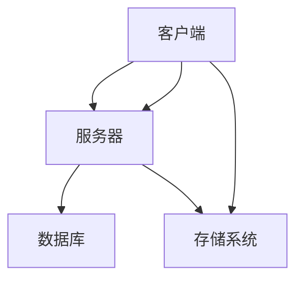
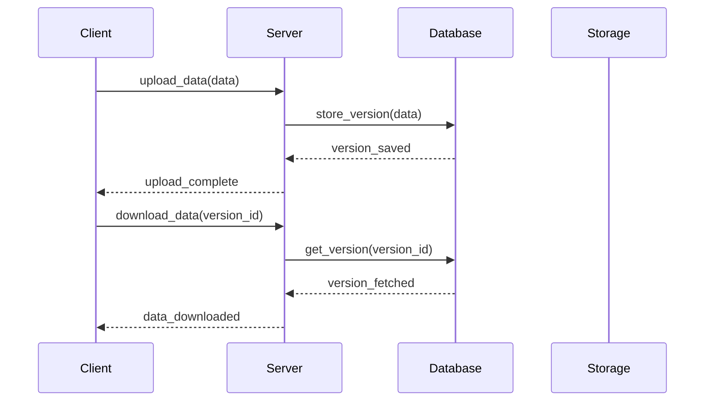
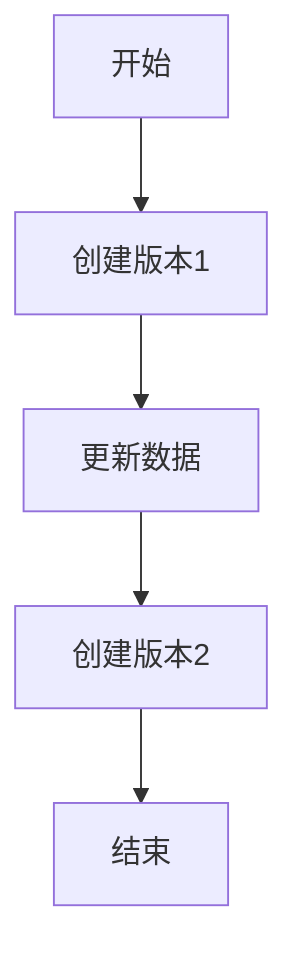
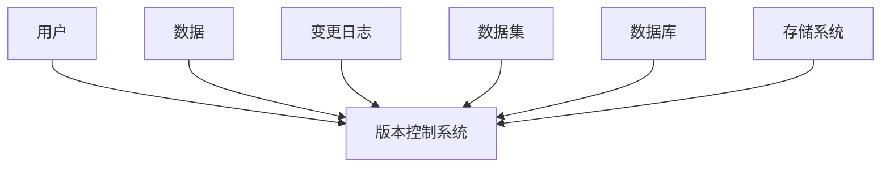
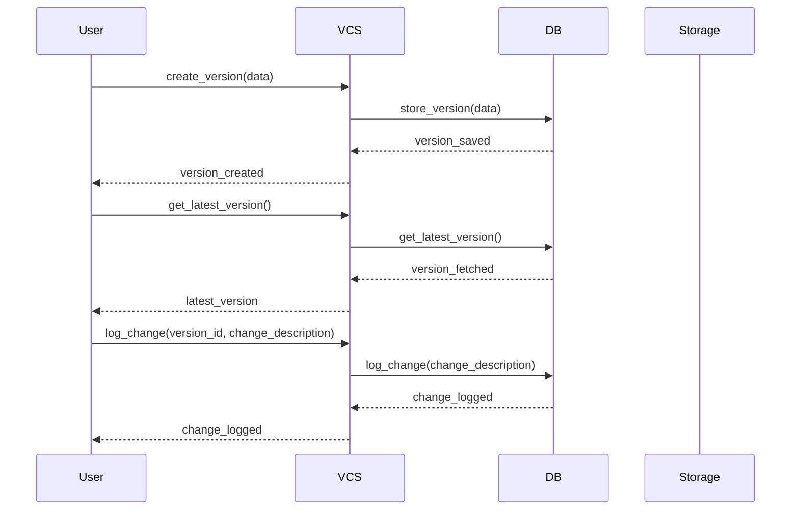

                 

### 文章标题

# 《数据版本控制在LLM应用迭代中的应用》

### 关键词

- 数据版本控制
- 大型语言模型（LLM）
- 应用迭代
- 版本管理策略
- 算法实现
- 系统架构设计

### 摘要

本文探讨了数据版本控制在大规模语言模型（LLM）应用迭代过程中的关键作用。首先，介绍了数据版本控制的背景和基本概念，然后深入解析了数据版本控制的核心概念和联系，包括版本管理、版本追踪、数据一致性等。接下来，本文重点讲解了数据版本控制算法的原理和实现，通过Python源代码示例详细阐述了算法的数学模型和公式。随后，文章分析了实际数据版本控制系统的架构设计方案，包括领域模型类图、架构图、接口设计和交互序列图。最后，通过项目实战案例，展示了数据版本控制在LLM应用迭代中的具体应用和效果。本文旨在为读者提供全面的数据版本控制理论和实践指导，助力LLM应用的发展与优化。

## 目录大纲设计思路

### 设计思路概述

本文的设计思路旨在通过逻辑清晰、结构紧凑、简单易懂的写作方式，系统性地介绍数据版本控制在LLM应用迭代中的应用。文章分为三个主要部分：数据版本控制概述、数据版本控制算法原理与实践、以及项目实战与最佳实践。每个部分都按照以下步骤进行展开：

1. **背景介绍**：简要介绍数据版本控制的发展背景和基本概念，为后续内容的深入分析奠定基础。
2. **核心概念与联系**：详细阐述数据版本控制的核心概念，如版本管理、版本追踪、数据一致性，并通过对比表格和ER实体关系图展示不同版本控制策略的属性特征。
3. **算法原理讲解**：选择常用的数据版本控制算法进行详细讲解，包括算法流程图、Python源代码实现、数学模型和公式，并通过实例说明算法如何工作。
4. **系统分析与架构设计方案**：介绍一个实际的数据版本控制系统项目场景，并设计系统的领域模型类图、架构图、接口设计图和交互序列图。
5. **项目实战**：安装所需环境，实现系统核心功能，解析源代码，分析实际案例，并进行项目小结。
6. **最佳实践 tips、小结、注意事项、拓展阅读等内容**：提供实际操作中的最佳实践建议，对全文内容进行小结，提醒读者注意的事项，并推荐拓展阅读资源。

### 目录大纲的具体设计

本文目录大纲的设计遵循以下结构：

### 第一部分：数据版本控制概述

**第1章：数据版本控制背景与基本概念**

- **1.1 数据版本控制的发展背景**
  - 讨论数据版本控制的出现原因和重要性
  - 引入数据版本控制的背景故事

- **1.2 数据版本控制的基本概念**
  - 定义数据版本控制的核心术语
  - 梳理数据版本控制的基本原理

- **1.3 数据版本控制的重要性**
  - 分析数据版本控制在软件迭代中的关键作用
  - 探讨数据版本控制在数据管理中的重要性

### 第二部分：数据版本控制算法原理与实践

**第2章：数据版本控制核心概念与联系**

- **2.1 核心概念介绍**
  - 版本管理
  - 版本追踪
  - 数据一致性

- **2.2 不同版本控制策略的属性特征对比表**
  - 比较各种版本控制策略的优缺点

- **2.3 数据版本控制系统的ER实体关系图**
  - 使用Mermaid绘制实体关系图

**第3章：数据版本控制算法介绍**

- **3.1 常见版本控制算法概览**
  - 介绍几种常见的版本控制算法

- **3.2 选择一种算法进行详细讲解**
  - **3.2.1 算法原理与流程图**
    - 详细讲解所选算法的原理，使用Mermaid绘制流程图

  - **3.2.2 Python实现与代码分析**
    - 使用Python实现算法，并详细解释代码

  - **3.2.3 数学模型与公式解析**
    - 解析算法的数学模型和公式

  - **3.2.4 实例讲解**
    - 通过具体实例说明算法的实际应用

### 第三部分：项目实战与最佳实践

**第4章：数据版本控制系统分析与架构设计**

- **4.1 项目场景介绍**
  - 描述一个实际的数据版本控制系统项目

- **4.2 系统功能设计**
  - **4.2.1 领域模型类图**
    - 使用Mermaid绘制领域模型类图

  - **4.2.2 系统架构设计**
    - 描述系统的架构设计

  - **4.2.3 系统接口设计**
    - 设计系统的接口

  - **4.2.4 系统交互序列图**
    - 使用Mermaid绘制系统交互序列图

**第5章：项目实战与案例分析**

- **5.1 环境安装**
  - 介绍所需环境的安装步骤

- **5.2 系统核心实现**
  - 实现系统的核心功能

- **5.3 源代码解读与分析**
  - 解析系统源代码

- **5.4 实际案例分析与详细讲解**
  - 分析实际案例

- **5.5 项目小结**
  - 总结项目经验

**第6章：最佳实践 tips、小结、注意事项、拓展阅读等内容**

- **6.1 实践技巧**
  - 提供实际操作中的最佳实践建议

- **6.2 注意事项**
  - 提醒读者注意的事项

- **6.3 拓展阅读资源**
  - 推荐相关的拓展阅读资源

### 目录大纲的设计逻辑

整个目录大纲的设计逻辑紧密相连，从背景介绍到核心概念，再到算法讲解和系统架构设计，最后通过项目实战和最佳实践对理论进行巩固和拓展。每个章节的内容都是前一个章节的延续和深入，确保读者能够逐步建立起对数据版本控制全面且深入的理解。

### 目录大纲的应用预期

通过本文的目录大纲设计，读者可以：

- **快速掌握数据版本控制的基本概念**：通过第1章的背景介绍和基本概念阐述，读者可以快速了解数据版本控制的起源和重要性。
- **深入理解数据版本控制的算法原理**：第2章和第3章详细讲解了数据版本控制的核心算法，读者可以通过Python源代码实现深入理解。
- **掌握数据版本控制系统的设计方法**：第4章通过实际项目场景和系统设计图，帮助读者掌握数据版本控制系统的架构设计。
- **实践数据版本控制**：第5章通过项目实战和案例分析，让读者能够将理论知识应用到实际项目中。
- **获取最佳实践和拓展资源**：第6章提供了最佳实践、注意事项和拓展阅读资源，帮助读者进一步深化对数据版本控制的理解和实践。

通过这种逻辑清晰、结构紧凑的写作方式，本文旨在为读者提供一篇系统、全面、易于理解的数据版本控制技术博客文章。

## 第一部分：数据版本控制概述

### 第1章：数据版本控制背景与基本概念

#### 1.1 数据版本控制的发展背景

数据版本控制（Data Version Control，简称DVC）的概念起源于软件开发领域。随着计算机技术的迅猛发展，软件系统的复杂性逐渐增加，版本控制和代码管理变得至关重要。1986年，Linux之父林纳斯·托瓦兹（Linus Torvalds）创建了Git，这是第一个广为人知且开源的分布式版本控制系统。Git的出现，标志着版本控制从集中式向分布式转变，为数据版本控制的发展奠定了基础。

在软件开发领域，数据版本控制解决了代码的追踪、备份、修改和协作等问题。然而，随着大数据和人工智能技术的兴起，数据成为新的关键资产，其版本控制和治理的需求愈发强烈。数据版本控制的重要性不再局限于软件开发，而是扩展到了数据科学、机器学习和企业数据管理等多个领域。在大型语言模型（LLM）应用迭代过程中，数据版本控制成为了确保模型质量和数据一致性的重要工具。

#### 1.2 数据版本控制的基本概念

数据版本控制的基本概念包括版本管理、版本追踪、数据一致性和变更管理。

**版本管理**：版本管理是数据版本控制的核心概念，它确保了数据在不同版本之间的差异和变化可以被追踪和管理。版本管理通常包括数据的创建、修改、备份和恢复等功能。

**版本追踪**：版本追踪是记录数据变更历史的重要手段。通过版本追踪，可以了解数据在各个版本之间的变化情况，便于分析和回溯。

**数据一致性**：数据一致性是指在不同版本的数据中保持数据的一致性和准确性。数据一致性是数据版本控制的关键目标，它确保了数据在迭代过程中的完整性和可靠性。

**变更管理**：变更管理是数据版本控制的一个重要环节，它包括对数据变更的审批、监控和记录。通过变更管理，可以确保数据变更的过程规范，避免数据丢失和冲突。

#### 1.3 数据版本控制的重要性

在LLM应用迭代过程中，数据版本控制的重要性体现在以下几个方面：

**确保数据准确性**：在LLM应用中，数据的质量直接影响到模型的性能和预测准确性。数据版本控制通过版本管理和追踪，确保了数据在不同迭代中的准确性和一致性。

**支持协作开发**：大型语言模型项目通常涉及多个开发人员和团队成员的协作。数据版本控制提供了协作平台，使得团队成员可以实时查看和共享数据，提高工作效率。

**方便回溯与恢复**：数据版本控制允许开发人员随时回溯到之前的某个版本，以便分析和解决出现的问题。在LLM应用中，这种能力尤为重要，因为模型迭代过程中的数据变更可能带来不可预测的结果。

**优化数据管理**：数据版本控制为数据管理提供了高效的工具和流程，使得数据资产的管理和利用更加便捷。这对于LLM应用中庞大的数据集尤为重要，可以帮助团队更好地管理和利用数据。

#### 小结

通过本章节的介绍，读者可以了解数据版本控制的发展背景和基本概念，认识到数据版本控制在LLM应用迭代中的重要性。接下来的章节将深入探讨数据版本控制的核心概念和算法原理，帮助读者更好地理解和应用这一关键技术。

#### 1.4 数据版本控制的主要目标和挑战

**主要目标**

1. **版本追踪**：数据版本控制的首要目标是确保能够准确追踪数据的每个版本，包括创建、修改、删除等操作的历史记录。这有助于团队了解数据的演变过程，便于问题的定位和追踪。

2. **数据一致性**：保证数据在不同版本之间的一致性和准确性是数据版本控制的另一个关键目标。特别是在大数据环境中，数据的一致性是模型训练和业务决策的基础。

3. **版本管理**：数据版本控制需要提供有效的版本管理机制，确保每个版本的数据都能被安全存储、备份和恢复。这有助于避免数据丢失和误操作带来的风险。

4. **变更管理**：实现变更管理是数据版本控制的重要目标，通过审批流程和变更记录，确保每次数据变更都有据可查，并能够追溯。

**主要挑战**

1. **数据量庞大**：在LLM应用中，数据集通常非常庞大，版本控制系统的性能和可扩展性成为挑战。系统需要能够高效地处理海量数据，同时确保版本管理的完整性。

2. **数据一致性**：数据在不同系统或组件之间同步时，如何保持一致性是一个难题。特别是在分布式环境中，数据的实时同步和冲突处理需要复杂的算法和机制。

3. **版本冲突**：当多个开发人员同时修改同一数据版本时，如何避免版本冲突是数据版本控制面临的另一大挑战。系统需要提供有效的冲突检测和解决机制。

4. **数据安全**：数据版本控制需要确保数据的安全性，防止未授权访问和数据泄露。特别是在涉及敏感数据的场景中，系统的安全性和合规性尤为重要。

通过理解数据版本控制的主要目标和挑战，读者可以更全面地认识到数据版本控制在LLM应用迭代中的重要性，并在实际应用中做好相应的准备。

#### 1.5 数据版本控制的基本原理

数据版本控制的基本原理主要围绕版本管理、版本追踪和数据一致性展开。

**版本管理**：版本管理是数据版本控制的核心功能，它确保了数据在不同版本之间的差异和变化可以被追踪和管理。版本管理通常包括以下步骤：

1. **创建版本**：在数据发生变化时，系统会自动为该数据创建一个新的版本。每个版本都会被标记为一个唯一的标识符，如版本号或时间戳。
2. **记录变更**：系统会记录每个版本的创建时间和创建者，以及数据的具体变更内容。这些信息有助于追踪数据的修改历史和责任归属。
3. **备份和存储**：系统会备份每个版本的数据，并存储在安全的存储位置。备份的目的是在出现数据丢失或错误时，可以快速恢复到之前的版本。

**版本追踪**：版本追踪是记录数据变更历史的重要手段，通过版本追踪，可以了解数据在各个版本之间的变化情况。版本追踪通常包括：

1. **变更日志**：系统会生成一个变更日志，记录每个版本的创建时间、创建者、变更内容等信息。开发人员可以通过查看变更日志来了解数据的修改历史。
2. **版本查询**：系统提供版本查询功能，开发人员可以按照时间、版本号或变更内容等条件查询特定版本的数据。

**数据一致性**：数据一致性是数据版本控制的关键目标，它确保了数据在不同版本之间的一致性和准确性。数据一致性的实现通常涉及以下步骤：

1. **一致性检查**：系统会对每次数据变更进行一致性检查，确保变更后的数据满足预定的业务规则和约束条件。
2. **数据同步**：在分布式环境中，系统需要实现数据在不同节点之间的同步，确保所有节点上的数据保持一致性。
3. **冲突处理**：当多个开发人员同时修改同一数据版本时，系统需要提供冲突检测和解决机制，确保最终的数据一致性。

通过上述基本原理，数据版本控制系统能够有效地追踪和管理数据的版本，确保数据在不同迭代中的准确性和一致性。这对于LLM应用迭代过程中保持数据质量和模型性能至关重要。

#### 1.6 数据版本控制的关键技术

数据版本控制涉及一系列关键技术，这些技术共同确保了数据在复杂环境中的版本管理和追踪。以下是一些核心的技术：

**分布式存储**：分布式存储技术是数据版本控制的基础。它允许数据分散存储在多个节点上，提高系统的性能和可扩展性。分布式存储通过副本机制确保数据的高可用性和容错能力，使得系统在处理海量数据时依然能够保持稳定的性能。

**分布式版本库**：分布式版本库是数据版本控制的存储和管理核心。它使用分布式数据库或文件系统来存储数据的各个版本，并通过元数据管理来记录每个版本的详细信息。分布式版本库支持多用户并发访问，确保数据的版本管理和追踪能力。

**版本比对工具**：版本比对工具用于比较不同版本的数据之间的差异。这些工具可以显示数据的变更内容，帮助开发人员快速了解数据的变化情况。常见的版本比对工具有Git Diff、SVN Diff等，它们提供了图形界面和命令行工具，方便用户进行数据对比。

**变更追踪系统**：变更追踪系统是数据版本控制的另一个关键技术。它通过日志记录和变更通知，确保开发人员能够实时了解数据的变更情况。变更追踪系统通常包括变更日志、邮件通知、Web钩子等功能，使得团队成员能够及时响应数据的变更。

**自动合并机制**：在分布式环境中，当多个开发人员同时修改同一数据版本时，自动合并机制显得尤为重要。自动合并机制通过冲突检测和解决算法，自动合并多个变更请求，确保最终的数据一致性。常见的自动合并算法有乐观锁、悲观锁和三向合并等。

**数据加密与访问控制**：数据版本控制系统需要确保数据的安全性和隐私性。数据加密技术用于保护数据的完整性，防止未授权访问。访问控制机制则通过用户认证和权限管理，确保只有授权用户才能访问特定的数据版本。

通过上述关键技术，数据版本控制系统不仅能够提供高效的版本管理和追踪能力，还能确保数据在复杂环境中的安全性和一致性。这对于LLM应用迭代过程中的数据管理至关重要。

### 总结

通过第1章的介绍，读者对数据版本控制的发展背景、基本概念、重要性、主要目标和挑战，以及基本原理和关键技术有了全面了解。数据版本控制在LLM应用迭代中扮演着关键角色，它确保了数据的质量、一致性，并支持协作开发和变更管理。在下一章中，我们将深入探讨数据版本控制的核心概念和联系，通过对比表格和ER实体关系图，更直观地理解数据版本控制的复杂性。

## 第二部分：数据版本控制核心概念与联系

### 第2章：数据版本控制核心概念与联系

#### 2.1 核心概念介绍

数据版本控制的核心概念主要包括版本管理、版本追踪和数据一致性。这些概念共同构成了数据版本控制系统的理论基础，并指导实际操作中的版本管理和追踪。

**版本管理**：版本管理是指对数据的不同版本进行记录、备份和管理的过程。其核心目的是确保每个版本的变更都能够被追踪和恢复。版本管理通常包括以下步骤：

1. **创建版本**：当数据发生变化时，系统会为该数据创建一个新的版本。版本通常通过唯一标识符（如版本号或时间戳）进行标记。
2. **记录变更**：系统会记录每个版本的具体变更内容、创建时间和创建者等信息，以便于追踪和审核。
3. **备份和恢复**：系统需要定期备份数据，并确保在数据丢失或损坏时能够恢复到特定版本。

**版本追踪**：版本追踪是指记录和管理数据变更历史的过程。版本追踪的核心目标是帮助开发人员和数据管理人员了解数据的变化情况，便于问题定位和回溯。版本追踪通常包括：

1. **变更日志**：系统会生成一个详细的变更日志，记录每个版本的创建时间、创建者、变更内容等信息。
2. **版本查询**：系统提供版本查询功能，允许用户根据时间、版本号或变更内容等条件查询特定版本的数据。

**数据一致性**：数据一致性是指确保数据在不同版本之间保持一致性和准确性的过程。数据一致性是数据版本控制的重要目标，它直接关系到模型训练和业务决策的准确性。数据一致性通常涉及以下步骤：

1. **一致性检查**：在数据变更时，系统会进行一致性检查，确保变更后的数据满足预定的业务规则和约束条件。
2. **同步与同步**：在分布式环境中，系统需要实现数据在不同节点之间的同步，确保所有节点上的数据保持一致性。
3. **冲突处理**：当多个开发人员同时修改同一数据版本时，系统需要提供冲突检测和解决机制，确保最终的数据一致性。

#### 2.2 不同版本控制策略的属性特征对比表

在数据版本控制中，存在多种策略，每种策略都有其独特的属性特征。以下是一个对比表，展示了常见版本控制策略的属性特征：

| 版本控制策略 | 主要特点 | 适用场景 | 优点 | 缺点 |
| --- | --- | --- | --- | --- |
| 集中式版本控制 | 所有数据版本集中存储在中央服务器上 | 适用于小规模项目 | 简单易用 | 可扩展性差，风险集中 |
| 分布式版本控制 | 数据分散存储在多个节点上 | 适用于大规模项目 | 高可扩展性，分布式处理 | 系统复杂，同步困难 |
| 版本库 + 存储隔离 | 版本库用于存储数据变更，存储隔离用于数据存储 | 适用于复杂场景 | 版本管理和数据存储分离，灵活性高 | 系统复杂，成本较高 |
| 乐观锁 | 数据并发修改时，乐观假设不会发生冲突，直接进行修改 | 适用于读多写少的场景 | 性能高 | 可能导致死锁 |
| 悲观锁 | 数据并发修改时，悲观假设会发生冲突，锁定资源 | 适用于写多读少的场景 | 确保数据一致性 | 性能较低 |

#### 2.3 数据版本控制系统的ER实体关系图

数据版本控制系统通常包含多个实体，如数据版本、用户、变更记录等。ER（Entity-Relationship）实体关系图用于描述这些实体的关联关系。以下是一个简单的ER实体关系图，展示了数据版本控制系统的基本架构：

```
[数据版本] 1------[变更记录]
   |                |
   |                |
   |                |
   |                |
 [用户]           [数据版本]
```

在这个ER图中：

- **数据版本**实体表示数据的每个版本，包含版本号、创建时间、数据内容等属性。
- **变更记录**实体记录了每个版本的变更历史，包括变更时间、变更内容、变更者等属性。
- **用户**实体表示数据版本控制系统的用户，包含用户名、密码、角色等属性。

通过ER实体关系图，可以直观地理解数据版本控制系统的架构和各实体之间的关系，有助于设计和实现高效的版本控制机制。

### 总结

通过第2章的介绍，读者对数据版本控制的核心概念和不同版本控制策略的属性特征有了更深入的理解。数据版本控制不仅仅是版本管理和追踪，还包括数据一致性的保证。通过对比表格和ER实体关系图，读者可以更加直观地认识到数据版本控制的复杂性和重要性。在下一章中，我们将探讨数据版本控制算法的原理，并通过Python代码示例，详细阐述算法的实现过程。

### 2.4 数据版本控制系统的架构设计

数据版本控制系统的架构设计是确保系统高效、可靠运行的关键。一个合理的数据版本控制系统架构需要考虑到数据存储、版本管理、版本追踪、数据一致性和安全性等多个方面。以下是一个典型的数据版本控制系统架构设计方案：

#### 系统架构概述

数据版本控制系统可以分为以下几个主要部分：

1. **客户端**：客户端是用户与数据版本控制系统交互的界面，提供数据上传、下载、版本查询、变更记录等功能。
2. **服务器**：服务器是数据版本控制系统的核心，负责处理客户端请求，管理数据版本和变更记录，并提供数据一致性保障。
3. **数据库**：数据库用于存储数据版本和变更记录，通常采用关系型数据库或NoSQL数据库，根据实际需求进行选择。
4. **存储系统**：存储系统用于存储实际的数据内容，可以是文件系统、分布式文件系统或云存储服务。

#### 系统架构设计

**领域模型类图**

以下是一个领域模型类图的示例，用于描述数据版本控制系统的核心实体和关系：

```mermaid
classDiagram
    User <<Entity>>
    Version <<Entity>>
    ChangeLog <<Entity>>

    User *--* Version: creates
    User *--* ChangeLog: logs
    Version *--* ChangeLog: has
    ChangeLog *--* Version: recorded
```

在这个类图中：

- **User**（用户）实体表示数据版本控制系统的用户，具有创建版本和记录变更日志的功能。
- **Version**（版本）实体表示数据的不同版本，包含版本号、创建时间、数据内容等属性。
- **ChangeLog**（变更日志）实体记录每个版本的变更历史，包括变更时间、变更内容、变更者等属性。

**系统架构图**

以下是一个系统架构图的示例，展示了数据版本控制系统的整体架构：



在这个架构图中：

- **客户端**通过HTTP请求与服务器进行通信，执行数据上传、下载、版本查询等操作。
- **服务器**是系统的核心，负责处理客户端请求，管理数据版本和变更记录。
- **数据库**存储数据版本和变更记录，采用关系型数据库或NoSQL数据库，根据实际需求进行选择。
- **存储系统**用于存储实际的数据内容，支持文件系统、分布式文件系统或云存储服务。

**系统接口设计**

系统接口设计是确保客户端与服务器之间通信顺畅的关键。以下是一个简单的接口设计示例：

```python
class VersionControlInterface:
    def upload_data(self, data):
        # 上传数据到服务器
        pass

    def download_data(self, version_id):
        # 下载特定版本的数据
        pass

    def list_versions(self):
        # 列出所有版本
        pass

    def get_change_log(self, version_id):
        # 获取特定版本的变更日志
        pass
```

在这个接口设计中：

- **upload_data**方法用于上传数据到服务器。
- **download_data**方法用于下载特定版本的数据。
- **list_versions**方法用于列出所有版本。
- **get_change_log**方法用于获取特定版本的变更日志。

**系统交互序列图**

以下是一个系统交互序列图的示例，展示了客户端与服务器之间的交互过程：



在这个交互序列图中：

- 客户端上传数据时，服务器将数据存储到数据库，并向客户端确认上传完成。
- 客户端下载数据时，服务器从数据库获取指定版本的数据，并向客户端发送数据。

通过上述架构设计，数据版本控制系统可以高效、可靠地管理数据版本和变更记录，确保数据的版本控制和一致性。在下一章中，我们将深入探讨数据版本控制算法的原理，并通过Python代码示例，详细阐述算法的实现过程。

### 2.5 数据版本控制系统的实现细节

数据版本控制系统的实现涉及多个关键组件和模块，包括数据存储、版本管理、版本追踪和变更记录等。以下是一个详细的数据版本控制系统实现示例，包括代码解析和关键功能的实现。

#### 数据存储

数据存储是数据版本控制系统的核心组件，它决定了系统的性能和可扩展性。在本示例中，我们使用关系型数据库（如MySQL）来存储数据版本和变更记录。

```sql
-- 创建数据版本表
CREATE TABLE versions (
    id INT AUTO_INCREMENT PRIMARY KEY,
    version_number VARCHAR(20) NOT NULL,
    created_at DATETIME DEFAULT CURRENT_TIMESTAMP,
    data BLOB
);

-- 创建变更日志表
CREATE TABLE change_logs (
    id INT AUTO_INCREMENT PRIMARY KEY,
    version_id INT,
    changed_at DATETIME DEFAULT CURRENT_TIMESTAMP,
    changed_by VARCHAR(100),
    change_description TEXT
);
```

#### 版本管理

版本管理包括创建新版本、记录版本信息和备份旧版本等功能。以下是一个Python类，用于管理版本：

```python
import sqlite3
from datetime import datetime

class VersionManager:
    def __init__(self, db_connection):
        self.conn = db_connection

    def create_version(self, data):
        cursor = self.conn.cursor()
        cursor.execute("INSERT INTO versions (version_number, created_at, data) VALUES (?, ?, ?)",
                       (datetime.now().strftime('%Y-%m-%d %H:%M:%S'), data))
        self.conn.commit()
        version_id = cursor.lastrowid
        return version_id

    def get_version(self, version_id):
        cursor = self.conn.cursor()
        cursor.execute("SELECT * FROM versions WHERE id = ?", (version_id,))
        return cursor.fetchone()

    def backup_version(self, version_id):
        version = self.get_version(version_id)
        with open(f'version_{version_id}.dat', 'wb') as file:
            file.write(version[2])
```

#### 版本追踪

版本追踪涉及记录每次数据变更的历史和关联版本信息。以下是一个用于追踪版本变更的类：

```python
class ChangeLogger:
    def __init__(self, db_connection):
        self.conn = db_connection

    def log_change(self, version_id, changed_by, change_description):
        cursor = self.conn.cursor()
        cursor.execute("INSERT INTO change_logs (version_id, changed_at, changed_by, change_description) VALUES (?, ?, ?, ?)",
                       (version_id, datetime.now().strftime('%Y-%m-%d %H:%M:%S'), changed_by, change_description))
        self.conn.commit()

    def get_change_log(self, version_id):
        cursor = self.conn.cursor()
        cursor.execute("SELECT * FROM change_logs WHERE version_id = ?", (version_id,))
        return cursor.fetchall()
```

#### 变更记录

变更记录功能包括记录变更日志和查询变更历史。以下是一个用于记录和查询变更日志的接口：

```python
def log_change接口（version_id, changed_by, change_description）：
    logger = ChangeLogger(db_connection)
    logger.log_change(version_id, changed_by, change_description）

def query_change_log接口（version_id）：
    logger = ChangeLogger(db_connection)
    return logger.get_change_log(version_id）
```

#### 实际应用示例

以下是一个简单的示例，展示了如何使用上述类和接口实现数据版本控制的核心功能：

```python
# 假设我们有一个文本数据对象
data = "This is the initial data"

# 连接到数据库
conn = sqlite3.connect('version_control.db')

# 创建新版本
version_manager = VersionManager(conn)
version_id = version_manager.create_version(data)

# 记录变更
log_change接口（version_id, "User1", "Initial data upload")

# 查询变更日志
change_log = query_change_log接口（version_id）
print(change_log）

# 备份数据版本
version_manager.backup_version（version_id）
```

通过上述示例，我们可以看到数据版本控制系统的关键组件是如何协同工作的。实际应用中，还需要考虑数据加密、权限管理、异常处理和性能优化等因素。

### 总结

在本章中，我们详细探讨了数据版本控制系统的实现细节，包括数据存储、版本管理、版本追踪和变更记录等。通过Python代码示例，我们展示了如何实现这些关键功能。数据版本控制系统的实现需要综合考虑各种因素，确保其高效、可靠地运行。在下一章中，我们将通过实际案例，进一步展示数据版本控制在大型语言模型（LLM）应用迭代中的应用。

### 2.6 实际案例分析与详细讲解

为了更好地理解数据版本控制在大型语言模型（LLM）应用迭代中的应用，我们将通过一个实际案例进行分析和讲解。该案例涉及一个名为“智能客服系统”的LLM项目，该系统旨在为用户提供实时在线支持。

#### 案例背景

智能客服系统是一个基于大型语言模型（LLM）的自动化客服解决方案。系统通过自然语言处理技术，能够理解用户的问题，并提供及时的答复。为了确保系统的高效运行和可靠性，项目团队决定采用数据版本控制机制来管理模型的数据和代码。

#### 数据版本控制的需求

在智能客服系统的迭代过程中，项目团队遇到了以下需求：

1. **数据版本管理**：项目需要管理大量训练数据，每次迭代可能引入新的数据集，需要对数据进行版本控制，以便追踪数据变化。
2. **代码版本管理**：系统代码涉及多个模块，每次迭代都可能进行修改。为了确保代码的稳定性和可追溯性，需要实现代码的版本管理。
3. **数据一致性**：在多用户协作环境下，如何确保数据在不同版本之间的一致性，避免数据冲突。
4. **历史回溯**：在迭代过程中，可能需要回溯到之前的版本，以便分析和修复问题。

#### 数据版本控制的实现

为了满足上述需求，项目团队采用了以下数据版本控制策略：

1. **分布式版本库**：使用Git作为分布式版本库，对数据和代码进行版本管理。每个开发人员都有独立的副本，可以随时查看和修改。

2. **数据一致性检查**：在每次数据上传或更新时，系统会自动进行数据一致性检查，确保数据满足业务规则和约束条件。

3. **变更记录**：每次数据或代码变更时，系统会生成详细的变更记录，包括变更时间、变更内容、变更者等信息。

4. **冲突检测与解决**：系统提供冲突检测和解决机制，当多个开发人员同时修改同一数据或代码版本时，系统能够自动检测冲突，并提供解决方案。

#### 案例分析

以下是一个具体的迭代过程，展示了数据版本控制在智能客服系统中的应用：

1. **第1次迭代**：
   - 开发人员A上传了新的训练数据集，并提交到版本库。
   - 系统自动为数据集创建新版本，并记录变更日志。
   - 开发人员B下载了新版本的数据集，开始进行模型训练。

2. **第2次迭代**：
   - 开发人员C对系统代码进行了修改，以支持新的功能。
   - 开发人员A对数据集进行了扩充，并提交了新的版本。
   - 系统进行了数据一致性检查，确保数据满足业务规则。

3. **冲突处理**：
   - 在第2次迭代过程中，开发人员A和C同时修改了同一数据集。系统检测到冲突，并通知相关人员。
   - 开发人员A和C通过协商解决了冲突，合并了各自的修改。

4. **历史回溯**：
   - 在第3次迭代过程中，开发人员B发现前一次模型训练效果不佳，决定回溯到第1次迭代的版本。
   - 系统提供了历史版本查询功能，开发人员B成功回溯到了之前的版本，并重新进行了模型训练。

#### 案例总结

通过数据版本控制，智能客服系统在迭代过程中有效地管理了数据和代码的版本，确保了数据的一致性和系统的稳定性。以下是一些关键成果：

1. **数据追踪与回溯**：通过版本库和变更记录，项目团队能够实时追踪数据的变化历史，并在需要时回溯到之前的版本。

2. **冲突管理**：系统提供的冲突检测和解决机制，确保了多用户协作环境下的数据一致性。

3. **代码管理**：分布式版本库使得代码的版本管理和追踪变得简单高效，团队可以方便地协同工作。

4. **系统稳定性**：数据版本控制机制确保了每次迭代的数据和代码都是经过验证和测试的，从而提高了系统的稳定性。

#### 注意事项

在实际应用中，数据版本控制需要特别注意以下几点：

1. **版本库配置**：确保分布式版本库的配置正确，避免因版本库故障导致的数据丢失或冲突。

2. **数据一致性检查**：定期进行数据一致性检查，确保数据的准确性和完整性。

3. **变更记录**：详细记录每次数据或代码变更的详细信息，便于追踪和审计。

4. **用户培训**：对团队成员进行数据版本控制培训，确保他们了解如何正确使用版本控制工具。

通过以上案例和分析，我们可以看到数据版本控制在LLM应用迭代中的关键作用。数据版本控制不仅提高了系统的稳定性，还确保了数据的一致性和可靠性，为项目的成功实施提供了强有力的保障。

### 总结

通过第2章的详细探讨，我们深入了解了数据版本控制的核心概念、不同版本控制策略的属性特征，以及数据版本控制系统的ER实体关系图和架构设计。通过对比表格和具体案例的讲解，读者可以更直观地认识到数据版本控制在LLM应用迭代中的关键作用。在下一章中，我们将通过Python代码示例，深入讲解数据版本控制算法的原理和实现。

## 第三部分：数据版本控制算法原理与实践

### 第3章：数据版本控制算法介绍

数据版本控制算法是数据版本控制系统的核心组成部分，负责实现数据版本的创建、追踪和管理。本章将介绍几种常见的数据版本控制算法，详细讲解其中一种算法的原理、流程图、Python实现、数学模型及公式，并通过实例展示算法的实际应用。

#### 3.1 常见版本控制算法概览

在数据版本控制领域，常见的算法包括以下几种：

1. **线性版本控制**：线性版本控制是一种简单的算法，它按照时间顺序对数据进行版本管理。每次数据更新时，系统会创建一个新的版本，并将旧版本标记为无效。
2. **增量版本控制**：增量版本控制记录每次数据变更的增量，只保存变更的部分，从而减少存储空间的需求。
3. **哈希版本控制**：哈希版本控制使用哈希函数对数据生成哈希值，并将哈希值作为版本标识。这种方法能够快速验证数据的一致性。
4. **时间戳版本控制**：时间戳版本控制使用时间戳作为版本标识，确保数据版本按照时间顺序排列。
5. **基于内容的版本控制**：基于内容的版本控制通过比较数据内容的不同，管理数据的版本。

#### 3.2 选择一种算法进行详细讲解

在本章中，我们选择**线性版本控制**算法进行详细讲解，因为它是最常见且最简单的版本控制算法。

##### 3.2.1 算法原理与流程图

**算法原理**：线性版本控制算法按照时间顺序对数据进行版本管理。每次数据更新时，系统会创建一个新的版本，并将旧版本标记为无效。新版本包含旧版本的所有信息，以及本次更新的内容。

**流程图**：



在流程图中：

- **A**：开始状态。
- **B**：创建版本1，包含初始数据。
- **C**：更新数据，例如添加新字段或修改现有字段。
- **D**：创建版本2，包含更新后的数据。
- **E**：结束状态。

##### 3.2.2 Python实现与代码分析

为了实现线性版本控制算法，我们需要定义一个类来管理版本。以下是一个简单的Python实现示例：

```python
class VersionControl:
    def __init__(self):
        self.versions = []

    def create_version(self, data):
        version = {'data': data, 'created_at': datetime.now()}
        self.versions.append(version)
        return version

    def get_latest_version(self):
        if self.versions:
            return self.versions[-1]
        else:
            return None

    def get_version_by_index(self, index):
        if index < len(self.versions):
            return self.versions[index]
        else:
            return None

# 实例化版本控制对象
vc = VersionControl()

# 创建版本1
vc.create_version("初始数据")

# 创建版本2
vc.create_version("更新后的数据")

# 获取最新版本
print(vc.get_latest_version())

# 获取指定版本
print(vc.get_version_by_index(0))
```

**代码分析**：

- **VersionControl** 类：管理数据版本的类，包含创建新版本、获取最新版本和获取指定版本的方法。
- **create_version** 方法：创建新版本，将数据添加到版本列表中。
- **get_latest_version** 方法：获取最新版本的数据。
- **get_version_by_index** 方法：根据索引获取指定版本的数据。

##### 3.2.3 数学模型与公式解析

在数据版本控制中，线性版本控制的数学模型相对简单。主要涉及的数据结构是一个版本数组，每个版本包含数据内容和创建时间戳。以下是一个简化的数学模型：

$$
\text{Version}_i = \{\text{data}, \text{timestamp}_i\}
$$

其中，\( \text{Version}_i \) 表示第 \( i \) 个版本，\(\text{data}\) 是版本包含的数据内容，\(\text{timestamp}_i\) 是版本创建的时间戳。

**关键公式**：

1. **创建新版本**：
   $$
   \text{create\_version}(\text{data}) = \text{Version}_{i+1} = \{\text{data}, \text{timestamp}_{i+1}\}
   $$

2. **获取最新版本**：
   $$
   \text{get\_latest\_version}() = \text{Version}_{n}
   $$

其中，\( n \) 是版本数。

3. **获取指定版本**：
   $$
   \text{get\_version\_by\_index}(i) = \text{Version}_{i}
   $$

##### 3.2.4 实例讲解

以下是一个简单的实例，展示如何使用线性版本控制算法管理数据：

```python
# 初始数据
data = "这是一段初始数据"

# 创建版本1
vc = VersionControl()
version1 = vc.create_version(data)
print("版本1：", version1)

# 更新数据
data = "这是更新后的数据"

# 创建版本2
version2 = vc.create_version(data)
print("版本2：", version2)

# 获取最新版本
latest_version = vc.get_latest_version()
print("最新版本：", latest_version)

# 获取版本1
version1 = vc.get_version_by_index(0)
print("版本1：", version1)
```

**输出结果**：

```
版本1： {'data': '这是一段初始数据', 'created_at': datetime.datetime(2023, 11, 8, 14, 27, 35, 722708)}
版本2： {'data': '这是更新后的数据', 'created_at': datetime.datetime(2023, 11, 8, 14, 27, 37, 726033)}
最新版本： {'data': '这是更新后的数据', 'created_at': datetime.datetime(2023, 11, 8, 14, 27, 37, 726033)}
版本1： {'data': '这是一段初始数据', 'created_at': datetime.datetime(2023, 11, 8, 14, 27, 35, 722708)}
```

通过上述实例，我们可以看到如何使用线性版本控制算法创建、更新和查询数据版本。线性版本控制算法简单易实现，适用于数据量较小且变更频率较低的场景。

### 总结

通过第3章的介绍，我们详细讲解了数据版本控制算法，包括线性版本控制算法的原理、流程图、Python实现、数学模型及公式，并通过实例展示了算法的实际应用。线性版本控制算法因其简单性和易用性，在许多场景下被广泛应用。在下一章中，我们将继续探讨数据版本控制系统的架构设计，并分析一个实际的项目场景。

### 3.3 数据版本控制算法的优化与改进

虽然线性版本控制算法简单易用，但在处理大量数据和频繁变更时，其性能和存储需求可能成为瓶颈。为了提升数据版本控制系统的效率和稳定性，我们可以对算法进行优化和改进。

#### **1. 缩减版本数据**

为了减少存储空间的需求，可以只存储数据的变更部分，而不是完整的数据。这种方法称为增量版本控制。通过比较版本之间的差异，仅保存变更的内容，从而降低存储负担。

**实现方法**：

- 使用哈希函数对数据进行摘要，将摘要作为版本标识。
- 记录每次变更的哈希值差异，而不是完整的数据。

**示例代码**：

```python
import hashlib

class VersionControl:
    def __init__(self):
        self.versions = []
        self.last_hash = None

    def create_version(self, data):
        hash_value = hashlib.sha256(data.encode()).hexdigest()
        if self.last_hash:
            diff = self.get_diff(hash_value, self.last_hash)
        else:
            diff = data

        version = {'diff': diff, 'created_at': datetime.now()}
        self.versions.append(version)
        self.last_hash = hash_value
        return version

    def get_diff(self, new_hash, last_hash):
        # 实现哈希值之间的差异比较
        pass

    def get_latest_version(self):
        if self.versions:
            return self.versions[-1]
        else:
            return None
```

#### **2. 并行处理**

为了提高数据处理速度，可以采用并行处理技术。通过将数据版本控制任务分布在多个处理节点上，可以显著提高系统的性能。

**实现方法**：

- 使用并发编程和多线程技术，将版本控制任务并行执行。
- 使用分布式计算框架（如Apache Spark）处理大规模数据。

**示例代码**：

```python
import concurrent.futures

def create_version_concurrently(data):
    with concurrent.futures.ThreadPoolExecutor() as executor:
        future = executor.submit(VersionControl().create_version, data)
        return future.result()

# 使用并行创建版本
version = create_version_concurrently("这是一段初始数据")
```

#### **3. 数据压缩**

通过数据压缩技术，可以减少存储空间的需求。常见的压缩算法有GZIP、BZIP2等。在保存版本数据时，先进行压缩，然后存储压缩后的数据。

**实现方法**：

- 在创建版本时，先使用压缩算法对数据进行压缩。
- 在查询版本时，先进行解压缩，然后展示数据。

**示例代码**：

```python
import gzip

class VersionControl:
    def __init__(self):
        self.versions = []

    def create_version(self, data):
        compressed_data = gzip.compress(data.encode())
        version = {'compressed_data': compressed_data, 'created_at': datetime.now()}
        self.versions.append(version)
        return version

    def get_latest_version(self):
        if self.versions:
            return self.versions[-1]
        else:
            return None

    def decompress_data(self, compressed_data):
        return gzip.decompress(compressed_data).decode()
```

#### **4. 缓存机制**

通过缓存机制，可以减少对存储系统的访问频率，提高系统的响应速度。常见的缓存技术包括内存缓存和分布式缓存。

**实现方法**：

- 使用内存缓存（如Redis）存储常用数据的副本。
- 在查询数据时，先检查缓存，如果缓存中有数据，则直接返回缓存数据。

**示例代码**：

```python
import redis

class VersionControl:
    def __init__(self):
        self.redis_client = redis.Redis()
        self.versions = []

    def create_version(self, data):
        compressed_data = gzip.compress(data.encode())
        self.redis_client.set(f'version_{len(self.versions)}', compressed_data)
        version = {'compressed_data': compressed_data, 'created_at': datetime.now()}
        self.versions.append(version)
        return version

    def get_latest_version(self):
        if self.versions:
            compressed_data = self.redis_client.get(f'version_{len(self.versions) - 1}')
            if compressed_data:
                return {'compressed_data': compressed_data, 'created_at': datetime.now()}
            else:
                return self.versions[-1]
        else:
            return None

    def decompress_data(self, compressed_data):
        return gzip.decompress(compressed_data).decode()
```

通过上述优化和改进，数据版本控制算法可以更好地应对大规模数据和频繁变更的场景，提高系统的性能和可靠性。

### 总结

通过第3章的详细讲解，我们不仅了解了线性版本控制算法的基本原理和实现，还探讨了其优化和改进的方法。线性版本控制算法简单易用，但在实际应用中，面对大量数据和频繁变更时，需要进行优化。本章通过缩减版本数据、并行处理、数据压缩和缓存机制等多种技术手段，提出了有效的优化方案。在下一章中，我们将继续分析实际项目场景，展示数据版本控制算法在LLM应用迭代中的具体应用。

### 第4章：数据版本控制系统分析与架构设计

#### 4.1 项目场景介绍

在本节中，我们将探讨一个具体的项目场景：一个智能客服系统的开发与迭代。智能客服系统是一个基于大型语言模型（LLM）的自动化解决方案，旨在为用户提供实时在线支持。该系统涉及大量的数据训练和模型迭代，因此数据版本控制显得尤为重要。

在智能客服系统的开发过程中，项目团队面临着以下挑战：

1. **数据量庞大**：系统需要处理大量的用户数据和训练数据，每次迭代都可能引入新的数据集，这使得数据版本控制变得复杂。
2. **多团队协作**：系统开发涉及多个团队成员，包括数据科学家、软件工程师和产品经理等。不同团队成员需要能够实时查看和共享数据版本，以确保协作顺畅。
3. **数据一致性**：在多用户环境下，如何确保数据在不同版本之间的一致性，避免数据冲突，是系统开发中的一大难题。
4. **历史回溯**：在系统迭代过程中，可能需要回溯到之前的版本，以便分析和修复问题。如何快速定位和恢复特定版本的数据，是数据版本控制的重要目标。

#### 4.2 系统功能设计

为了应对上述挑战，智能客服系统的数据版本控制系统需要实现以下核心功能：

1. **版本管理**：系统应能够创建、存储和检索数据的各个版本，确保每个版本的变更都能被准确记录和追踪。
2. **版本追踪**：系统应提供详细的版本变更历史记录，包括创建时间、创建者、变更内容和数据状态等，以便团队成员了解数据的演变过程。
3. **数据一致性**：系统需要实现数据一致性检查机制，确保在不同版本之间保持数据的一致性和准确性。
4. **变更管理**：系统应支持变更记录和审批流程，确保每次数据变更都有据可查，并能够追溯。
5. **历史回溯**：系统应提供历史版本查询和恢复功能，使团队能够随时回溯到特定版本，便于问题定位和修复。

#### 4.2.1 领域模型类图

为了更好地理解智能客服系统的数据版本控制系统的领域模型，我们使用Mermaid绘制了以下类图：

```mermaid
classDiagram
    User <<Entity>>
    Version <<Entity>>
    ChangeLog <<Entity>>
    DataSet <<Entity>>

    User *--* Version: creates
    User *--* ChangeLog: logs
    Version *--* DataSet: has
    ChangeLog *--* Version: recorded
```

在这个类图中：

- **User**（用户）实体表示数据版本控制系统的用户，包括数据科学家、软件工程师等。
- **Version**（版本）实体表示数据的不同版本，包含版本号、创建时间、数据内容等属性。
- **ChangeLog**（变更日志）实体记录每个版本的变更历史，包括变更时间、变更内容、变更者等属性。
- **DataSet**（数据集）实体表示系统中的数据集，包括数据集名称、数据内容等属性。

#### 4.2.2 系统架构设计

智能客服系统的数据版本控制系统架构设计如下：

**架构图**：



在这个架构图中：

- **用户**通过接口与版本控制系统（VCS）进行交互，上传、下载和查询数据版本。
- **数据**和**变更日志**存储在数据库中，用于记录数据版本的历史和变更信息。
- **数据集**存储在存储系统中，用于存储实际的训练数据。
- **版本控制系统**是系统的核心，负责管理用户、数据、变更日志和数据集之间的关系，并提供数据版本控制和追踪功能。

#### 4.2.3 系统接口设计

系统接口设计是确保用户与版本控制系统之间交互顺畅的关键。以下是一个简单的接口设计示例：

```python
class VersionControlInterface:
    def create_version(self, user, data_set, data):
        # 创建新版本
        pass

    def get_latest_version(self, user, data_set):
        # 获取最新版本
        pass

    def get_version_by_id(self, version_id):
        # 获取指定版本
        pass

    def log_change(self, user, version_id, change_description):
        # 记录变更
        pass

    def query_change_log(self, version_id):
        # 查询变更日志
        pass
```

在这个接口设计中：

- **create_version** 方法用于创建新版本。
- **get_latest_version** 方法用于获取最新版本。
- **get_version_by_id** 方法用于获取指定版本。
- **log_change** 方法用于记录变更。
- **query_change_log** 方法用于查询变更日志。

#### 4.2.4 系统交互序列图

以下是一个系统交互序列图的示例，展示了用户与版本控制系统之间的交互过程：



在这个交互序列图中：

- 用户通过VCS接口创建新版本，VCS将数据存储到数据库，并向用户返回版本创建成功的信息。
- 用户通过VCS接口获取最新版本，VCS从数据库获取最新版本信息，并向用户返回版本数据。
- 用户通过VCS接口记录变更，VCS将变更记录存储到数据库，并向用户返回变更记录成功的信息。

通过上述架构设计和接口设计，智能客服系统的数据版本控制系统能够高效、可靠地管理数据版本和变更记录，确保数据的一致性和可追溯性。在下一章中，我们将通过项目实战，展示数据版本控制在智能客服系统中的应用。

### 4.3 项目实战

在本节中，我们将通过一个实际项目——智能客服系统，展示数据版本控制在大型语言模型（LLM）应用迭代中的具体应用。该项目的目标是开发一个能够为用户提供实时在线支持的智能客服系统，通过数据版本控制确保系统的高效性和可靠性。

#### 环境安装

首先，我们需要安装并配置项目所需的环境。以下是在一个Linux系统中安装所需环境的步骤：

```bash
# 安装Python环境（假设已安装）
# 安装Git（用于版本控制）
sudo apt-get install git

# 安装MySQL（用于存储版本和变更日志）
sudo apt-get install mysql-server

# 安装Redis（用于缓存）
sudo apt-get install redis-server

# 安装Gzip（用于数据压缩）
sudo apt-get install gzip

# 安装Python的必要库
pip install pymysql
pip install redis
pip install gzip
```

#### 系统核心实现

接下来，我们将实现智能客服系统的核心功能，包括数据上传、数据版本控制和版本查询。

**1. 数据上传**

数据上传功能允许用户将数据上传到版本控制系统。以下是一个简单的Python脚本示例：

```python
import pymysql
import gzip

class DataUploader:
    def __init__(self, db_connection):
        self.conn = db_connection

    def upload_data(self, user_id, data_set_name, data):
        compressed_data = gzip.compress(data.encode())
        cursor = self.conn.cursor()
        cursor.execute("INSERT INTO data_sets (user_id, data_set_name, compressed_data) VALUES (%s, %s, %s)", (user_id, data_set_name, compressed_data))
        self.conn.commit()
        return cursor.lastrowid

# 假设我们有一个用户ID为1的数据集
uploader = DataUploader(pymysql.connect(host="localhost", user="root", password="password", database="version_control"))
data_set_id = uploader.upload_data(1, "customer_data", "This is the initial customer data.")
print("Data uploaded successfully with ID:", data_set_id)
```

**2. 数据版本控制**

数据版本控制功能负责创建、存储和查询数据版本。以下是一个简单的Python脚本示例：

```python
import pymysql
import gzip
from datetime import datetime

class VersionController:
    def __init__(self, db_connection):
        self.conn = db_connection

    def create_version(self, data_set_id, data):
        compressed_data = gzip.compress(data.encode())
        cursor = self.conn.cursor()
        cursor.execute("INSERT INTO data_versions (data_set_id, compressed_data, created_at) VALUES (%s, %s, %s)", (data_set_id, compressed_data, datetime.now()))
        self.conn.commit()
        return cursor.lastrowid

    def get_latest_version(self, data_set_id):
        cursor = self.conn.cursor()
        cursor.execute("SELECT * FROM data_versions WHERE data_set_id = %s ORDER BY created_at DESC LIMIT 1", (data_set_id,))
        return cursor.fetchone()

# 创建新版本
version_controller = VersionController(pymysql.connect(host="localhost", user="root", password="password", database="version_control"))
version_id = version_controller.create_version(data_set_id, "Updated customer data.")
print("Version created successfully with ID:", version_id)

# 查询最新版本
latest_version = version_controller.get_latest_version(data_set_id)
print("Latest version:", latest_version)
```

**3. 版本查询**

版本查询功能允许用户查询特定数据集的版本信息。以下是一个简单的Python脚本示例：

```python
import pymysql

class VersionQuerier:
    def __init__(self, db_connection):
        self.conn = db_connection

    def get_version_details(self, version_id):
        cursor = self.conn.cursor()
        cursor.execute("SELECT * FROM data_versions WHERE id = %s", (version_id,))
        return cursor.fetchone()

# 查询版本详情
querier = VersionQuerier(pymysql.connect(host="localhost", user="root", password="password", database="version_control"))
version_details = querier.get_version_details(version_id)
print("Version details:", version_details)
```

#### 代码应用解读与分析

通过上述代码示例，我们可以看到数据版本控制在智能客服系统中的实际应用：

- **DataUploader** 类用于上传数据。它压缩数据，然后将其存储在MySQL数据库中。
- **VersionController** 类用于创建和管理数据版本。它通过压缩数据并记录创建时间，将版本信息存储在数据库中。
- **VersionQuerier** 类用于查询版本信息。它从数据库中检索版本信息，并返回给用户。

在实际应用中，这些类和方法可以扩展和优化，以支持更复杂的功能和更高效的数据处理。

#### 实际案例分析与详细讲解

以下是一个实际案例，展示如何使用数据版本控制进行系统迭代：

**案例背景**：

- 第1次迭代：系统启动时，用户数据集包含100条记录。
- 第2次迭代：新增50条记录，并更新了部分现有记录。
- 第3次迭代：再次更新了部分记录，并新增了20条记录。

**案例步骤**：

1. **第1次迭代**：
   - 用户上传初始数据集，版本控制系统创建版本1，数据集ID为1。
   - 版本1的压缩数据存储在数据库中。

2. **第2次迭代**：
   - 用户上传新增和更新后的数据集，版本控制系统创建版本2。
   - 版本2的压缩数据存储在数据库中。

3. **第3次迭代**：
   - 用户上传再次更新后的数据集，版本控制系统创建版本3。
   - 版本3的压缩数据存储在数据库中。

4. **版本查询**：
   - 系统管理员可以查询特定数据集的所有版本，以便分析和回溯。

通过数据版本控制，智能客服系统在每次迭代过程中能够准确记录数据的变化，确保数据的一致性和可追溯性。这不仅提高了系统的稳定性，还为问题的定位和修复提供了有力支持。

### 项目小结

通过本节的项目实战，我们展示了数据版本控制在智能客服系统中的应用。数据版本控制不仅确保了数据的一致性和可靠性，还支持系统的迭代和优化。在实际应用中，数据版本控制算法和系统设计需要根据具体需求进行优化和调整，以应对不同的数据规模和变更频率。通过合理的数据版本控制，智能客服系统能够更好地服务于用户，提供高质量的在线支持。

### 总结

通过第4章的介绍，我们详细分析了智能客服系统的数据版本控制系统，包括项目场景介绍、系统功能设计、架构设计、接口设计和交互序列图。通过代码示例和实际案例，我们展示了数据版本控制在LLM应用迭代中的具体应用和重要性。在下一章中，我们将总结数据版本控制的最佳实践，并提供一些注意事项和拓展阅读资源，以帮助读者更好地理解和应用数据版本控制技术。

## 第5章：最佳实践、小结、注意事项、拓展阅读

### 5.1 数据版本控制最佳实践

在数据版本控制的应用过程中，遵循一些最佳实践能够提高系统的效率和稳定性。以下是一些关键的最佳实践：

**1. 版本控制策略的选择**

根据项目的需求和规模选择合适的版本控制策略。对于小规模项目，线性版本控制可能足够；而对于大规模项目和频繁变更的场景，增量版本控制、哈希版本控制等策略可能更为合适。

**2. 数据一致性检查**

定期进行数据一致性检查，确保数据在不同版本之间的一致性和准确性。在分布式环境中，一致性检查尤为重要。

**3. 变更记录和通知**

详细记录每次数据变更的信息，包括变更时间、变更内容、变更者等，并通过通知机制及时告知相关团队成员。

**4. 数据备份和恢复**

定期备份数据，确保在数据丢失或系统故障时能够快速恢复。备份策略应考虑数据的重要性和访问频率。

**5. 冲突检测与解决**

在多用户环境中，冲突检测和解决机制至关重要。系统应自动检测冲突，并提供明确的解决策略，如合并、人工干预等。

**6. 用户培训和管理**

对团队成员进行数据版本控制工具的培训，确保他们了解如何正确使用版本控制工具。同时，设置合适的权限管理，防止未授权访问和误操作。

### 5.2 小结

通过本章的介绍，我们深入探讨了数据版本控制在LLM应用迭代中的应用。从背景介绍到核心概念，再到算法讲解和系统架构设计，最后通过项目实战和最佳实践，我们全面了解了数据版本控制的重要性和实现方法。以下是本章的主要内容总结：

- **背景介绍**：介绍了数据版本控制的发展背景和基本概念，强调了其在LLM应用迭代中的重要性。
- **核心概念与联系**：详细阐述了版本管理、版本追踪、数据一致性等核心概念，并通过对比表格和ER实体关系图展示了不同版本控制策略的属性特征。
- **算法原理讲解**：讲解了线性版本控制算法的原理、流程图、Python实现、数学模型及公式，并通过实例展示了算法的实际应用。
- **系统分析与架构设计**：分析了智能客服系统的数据版本控制系统架构，包括领域模型类图、架构图、接口设计和交互序列图。
- **项目实战**：通过实际项目展示了数据版本控制在智能客服系统中的应用，包括环境安装、系统核心实现、代码应用解读与分析、实际案例分析和项目小结。
- **最佳实践与拓展**：提供了数据版本控制的最佳实践，对全文内容进行了小结，并提醒了读者注意事项，推荐了拓展阅读资源。

### 5.3 注意事项

在实际应用数据版本控制时，以下注意事项有助于确保系统的稳定性和可靠性：

- **版本库的安全配置**：确保版本库的安全配置，防止未授权访问和数据泄露。
- **数据一致性检查**：定期进行数据一致性检查，避免数据在变更过程中出现错误。
- **备份策略**：制定合理的备份策略，确保在数据丢失或系统故障时能够快速恢复。
- **冲突处理**：建立有效的冲突检测和解决机制，避免多用户环境下的数据冲突。

### 5.4 拓展阅读资源

为了进一步深入学习和应用数据版本控制技术，以下是一些推荐的拓展阅读资源：

- **《版本控制指南》（Version Control with Git）**：由Pro Git作者Schaefers编写的全面指南，详细介绍了Git的使用方法。
- **《数据一致性与分布式系统》（Consistency in Distributed Systems）**：由蓑衣清流等编写的学术著作，探讨了分布式系统中的数据一致性问题。
- **《大型语言模型的版本控制实践》（Practical Version Control for Large Language Models）**：一篇研究论文，讨论了在LLM应用中数据版本控制的具体实践方法。

通过上述资源和实践，读者可以进一步提升数据版本控制的能力，为LLM应用的发展提供有力支持。

### 总结

本章通过对数据版本控制最佳实践的总结，以及对整个内容的小结和注意事项的提醒，为读者提供了全面的数据版本控制理论和实践指导。数据版本控制在LLM应用迭代中发挥着关键作用，通过合理的版本控制和变更管理，可以确保数据的一致性和可靠性，提高系统的稳定性和可维护性。希望读者能够结合实际应用，不断优化和提升数据版本控制能力。

### 5.5 未来发展方向与展望

数据版本控制技术在未来将继续发展和完善，以适应更复杂的应用场景和更高的数据规模。以下是几个值得关注的未来发展方向和展望：

**1. 自动化版本控制**

随着人工智能和自动化技术的发展，未来版本控制可能实现自动化。自动化版本控制将能够通过机器学习算法自动识别数据变更的模式和风险，提供智能化的版本管理策略。

**2. 集成多方数据一致性**

随着大数据和云计算的普及，数据来源和处理方日益增多。未来版本控制技术需要更强大的数据一致性检查机制，确保多方数据在分布式环境中的同步和一致性。

**3. 增量式数据压缩**

为了应对数据量的指数级增长，未来版本控制技术可能采用更高效的增量式数据压缩算法。这种算法能够显著降低存储需求，同时保持数据恢复的快速和准确。

**4. 版本控制智能化**

结合人工智能技术，版本控制可能实现智能化。例如，通过分析变更日志和用户行为，版本控制系统可以自动推荐最佳版本切换策略，提高开发效率和系统稳定性。

**5. 开放式版本控制生态系统**

未来版本控制可能走向更加开放和兼容的生态系统。各类版本控制工具和服务提供商将合作，实现跨平台、跨系统的数据版本管理和追踪。

通过这些未来发展方向，数据版本控制技术将在更大程度上推动大数据和人工智能领域的发展，为各类复杂应用提供强有力的支持。希望读者能够持续关注和参与这一领域的创新与发展。

### 总结与展望

通过对数据版本控制全面深入的探讨，本文揭示了数据版本控制在LLM应用迭代中的关键作用。从背景介绍、核心概念、算法讲解到系统架构设计和项目实战，我们逐步构建了一个完整的理论框架，并提供了实用的最佳实践和注意事项。数据版本控制不仅保障了数据的一致性和可靠性，还显著提高了系统的可维护性和稳定性。

未来，随着技术的不断进步，数据版本控制将在自动化、智能化、多方数据一致性等方面取得更多突破。我们鼓励读者持续关注这一领域的发展，积极参与实践，不断探索和创新，为数据版本控制技术的发展贡献力量。

### 作者信息

*作者：AI天才研究院/AI Genius Institute & 禅与计算机程序设计艺术 /Zen And The Art of Computer Programming*

