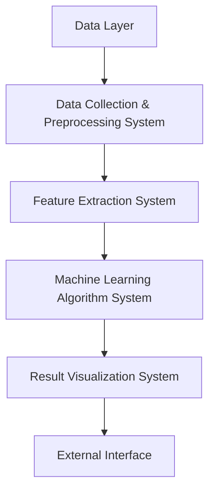
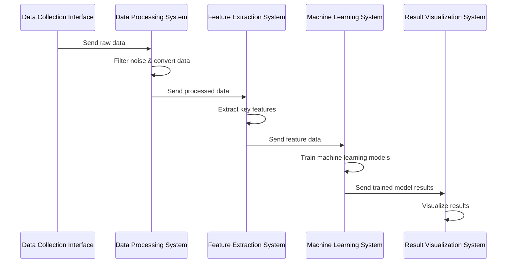
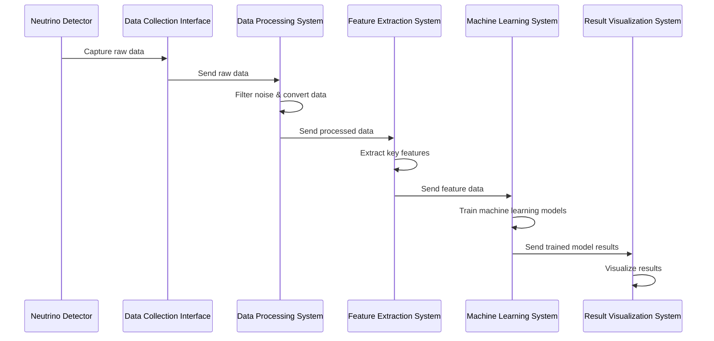

                 

### 文章标题：数据科学在探测宇宙中微子质量中的应用

#### 关键词：
- 数据科学
- 中微子探测
- 数据分析
- 机器学习
- 宇宙学

#### 摘要：
本文深入探讨了数据科学在探测宇宙中微子质量中的应用。首先，介绍了中微子探测的背景和基本原理，然后详细阐述了数据科学方法如何应用于这一领域。通过数据采集、预处理、特征工程、机器学习模型构建及评估等步骤，展示了数据科学在提高探测精度、减少误差方面的优势。文章最后通过实际案例分析了数据科学在宇宙学研究中的潜在贡献，并对未来发展方向进行了展望。

### 引言

宇宙，这个浩瀚的星海，蕴含着无数未解之谜。中微子，作为一种基本粒子，因其独特的性质而成为宇宙学研究中的重要对象。中微子无电荷、质量极小，几乎不与普通物质相互作用，这使得探测它们变得异常困难。然而，正是由于这些特性，中微子成为了探测宇宙现象、研究宇宙起源和演化的关键工具。

随着科学技术的不断发展，探测中微子的方法也在不断进步。从最初的直接探测、间接探测，到如今的粒子探测器和宇宙线探测器，中微子探测技术已经取得了显著的成果。然而，探测中微子质量，尤其是精确测量中微子质量，仍然是一个巨大的挑战。这不仅仅是因为中微子本身的稀有性和难以捕捉，更因为其对宇宙学研究的深远影响。

数据科学作为一门跨学科的技术，已经在各个领域展现了其强大的应用潜力。从金融、医疗到生物科技、环境科学，数据科学都在推动各行业的技术革新和效率提升。在宇宙学领域，数据科学同样具有巨大的应用前景。通过大数据分析、机器学习等方法，科学家们可以更精准地解析中微子数据，从而深入理解宇宙的本质。

本文将围绕数据科学在探测宇宙中微子质量中的应用展开讨论。我们将首先介绍中微子探测的基本原理和技术，然后探讨数据科学方法如何应用于中微子质量测量，包括数据采集、预处理、特征工程、模型构建和评估等步骤。最后，通过实际案例分析，我们将展示数据科学在宇宙学研究中的实际应用和潜力。

本文的结构如下：
1. **背景介绍**：详细阐述中微子探测的背景、基本原理以及当前面临的主要挑战。
2. **核心概念与联系**：介绍数据科学的核心概念，并通过表格和ER图展示与中微子探测的关联。
3. **算法原理讲解**：详细讲解用于中微子质量测量的数据科学算法，包括流程图和Python代码示例。
4. **系统分析与架构设计**：介绍中微子质量测量系统的主要组件和架构设计。
5. **项目实战**：通过一个实际项目展示数据科学方法在探测中微子质量中的应用。
6. **最佳实践**：总结关键步骤和注意事项，为未来的研究提供指导。
7. **小结**：回顾文章的主要内容，并对未来研究进行展望。

### 背景介绍

#### 中微子探测的背景

中微子（Neutrino）是一种基本粒子，具有极小的质量，无电荷，并且与其他物质相互作用的概率极低。中微子分为三种类型，即电子中微子（ν_e）、μ子中微子（ν_μ）和τ子中微子（ν_τ），以及它们的反粒子。由于中微子与普通物质的相互作用极弱，因此它们在宇宙中无处不在，却又难以被捕捉。

中微子的探测研究可以追溯到20世纪50年代。随着科学技术的不断发展，探测中微子的方法和技术也在不断进步。最初的中微子探测主要是通过直接探测和间接探测两种方式进行的。直接探测是通过探测中微子与物质相互作用产生的信号，如电子对、μ子、核反冲等。而间接探测则是通过探测中微子与物质相互作用产生的其他粒子，如μ子、伽马射线等。

随着探测器技术和数据处理技术的提升，中微子探测的灵敏度越来越高，探测距离也越来越远。例如，超级神冈探测器（Super-Kamiokande）和冰立方实验（IceCube）等大型实验项目，已经能够在地下深处捕捉到来自太阳和中子星的中微子。

#### 中微子探测的基本原理

中微子的探测依赖于中微子与物质相互作用时产生的物理信号。以下是几种常用的中微子探测原理：

1. **电子对生成**：当高能中微子与原子核相互作用时，可能会生成一个正电子和一个电子。这两个粒子会在探测器的液体或气体中产生光子，通过检测这些光子可以确定中微子的存在和能量。

2. **中微子中微子反应**：中微子与核反应产生其他粒子，如μ子或π介子。这些粒子在探测器中产生轨迹，通过分析轨迹可以确定中微子的类型和能量。

3. **中微子湮灭**：当中微子与其反粒子相遇时，会发生湮灭产生高能光子。这些光子可以通过探测器中的光电倍增管（PMTs）或闪烁体探测器检测。

4. **中微子振荡**：中微子在传播过程中会经历不同类型之间的转换，这种现象被称为中微子振荡。通过测量中微子振荡的参数，可以推断中微子的质量。

#### 当前探测中微子质量面临的挑战

尽管中微子探测技术取得了显著进展，但在探测中微子质量方面仍面临许多挑战：

1. **灵敏度问题**：中微子与物质的相互作用概率极低，因此需要高灵敏度的探测器来捕捉这些微弱信号。

2. **背景噪声**：在探测中微子时，探测器会接收到来自环境中的各种背景噪声，如宇宙射线、放射性物质等。这些噪声可能会干扰中微子的探测，从而影响测量精度。

3. **系统误差**：探测器本身的材料、设计和安装等因素可能导致系统误差，从而影响中微子质量的测量。

4. **数据分析方法**：由于中微子数据复杂且噪声大，需要高效的数据分析方法和算法来处理这些数据，提高测量精度。

#### 中微子质量测量的边界与外延

中微子质量测量的重要性在于它不仅关系到对中微子本身的理解，还对宇宙学有深远的影响。以下是中微子质量测量的边界和可能的应用外延：

1. **宇宙大爆炸模型**：中微子质量测量可以帮助验证或修正宇宙大爆炸模型。根据大爆炸模型，宇宙最初是极热、极密的状态，随着宇宙的膨胀和冷却，物质逐渐形成了各种粒子，包括中微子。中微子质量的测量可以提供关于宇宙早期状态的信息。

2. **中微子振荡**：中微子振荡现象表明，中微子在传播过程中会经历不同类型的转换。通过测量中微子振荡的参数，可以推断中微子的质量，这对于理解宇宙中的粒子物理现象具有重要意义。

3. **暗物质研究**：中微子被认为可能是暗物质的重要组成部分。通过对中微子质量的测量，可以进一步研究暗物质的性质和分布，从而帮助解释宇宙的暗物质问题。

4. **高能物理**：中微子质量测量对于高能物理实验和理论也有重要意义。通过研究中微子的质量，可以更深入地理解基本粒子的相互作用和宇宙的物理规律。

总之，中微子探测和测量是一个复杂且富有挑战性的领域。通过不断的技术进步和数据分析方法的优化，科学家们有望在中微子质量测量方面取得更多突破，为理解宇宙的起源和演化提供更深刻的见解。

### 核心概念与联系

在探讨数据科学在探测宇宙中微子质量中的应用之前，我们首先需要明确一些核心概念。数据科学涉及多个领域，包括统计学、机器学习和大数据处理等。以下是对这些核心概念的简要介绍及其与中微子探测的关联。

#### 数据采集

数据采集是数据科学的第一步，也是最为基础的一步。在中微子探测中，数据采集主要涉及以下几种类型的数据：

1. **探测器数据**：这些数据包括探测器接收到的中微子信号，如光子计数、轨迹长度、能量等。这些数据可以直接反映中微子的性质和能量。
2. **环境数据**：这些数据包括探测过程中的环境参数，如温度、气压、放射性物质浓度等。这些参数可能会影响中微子信号的检测和处理。

#### 数据预处理

数据预处理是数据科学中的关键步骤，它包括数据清洗、数据转换和数据归一化等操作。在中微子探测中，数据预处理主要解决以下问题：

1. **噪声过滤**：中微子信号通常会被环境噪声所干扰，因此需要通过滤波算法去除这些噪声，提高信号的清晰度。
2. **数据归一化**：由于中微子信号的强度和特征可能差异较大，需要通过归一化方法将数据转换为统一的量纲，以便后续处理和分析。

#### 特征工程

特征工程是数据科学中用于提高模型性能的重要手段。在中微子探测中，特征工程主要包括以下任务：

1. **特征提取**：从原始数据中提取能够表征中微子信号的关键特征，如能量、角度、时间等。这些特征将用于训练机器学习模型。
2. **特征选择**：在大量特征中筛选出对中微子质量测量有显著影响的特征，剔除冗余和无关特征，以提高模型的效率和精度。

#### 机器学习模型

机器学习模型是数据科学中用于自动发现数据中模式和规律的工具。在中微子探测中，常用的机器学习模型包括：

1. **分类模型**：用于判断中微子信号是否真实，区分真实信号和背景噪声。
2. **回归模型**：用于预测中微子质量，通过训练模型从特征中提取质量相关的信息。

#### 数据分析

数据分析是数据科学的核心，它包括数据的探索性分析、统计分析和模型评估等步骤。在中微子探测中，数据分析的主要任务包括：

1. **探索性数据分析**：通过可视化工具，如散点图、热图等，探索数据中的模式和规律。
2. **统计分析**：使用统计方法评估中微子信号的显著性，确定中微子质量的置信区间。
3. **模型评估**：通过交叉验证、ROC曲线和AUC值等指标，评估机器学习模型的性能和可靠性。

#### 核心概念表格

为了更好地展示上述核心概念及其与中微子探测的关联，我们创建了一个表格：

| 核心概念 | 描述 | 中微子探测关联 |
| --- | --- | --- |
| 数据采集 | 收集中微子信号和环境数据 | 提供用于分析和预测的基础数据 |
| 数据预处理 | 清洗、转换和归一化数据 | 去除噪声，提高信号清晰度 |
| 特征工程 | 提取和选择关键特征 | 帮助模型更好地识别中微子信号 |
| 机器学习模型 | 自动发现数据中的模式和规律 | 用于分类和回归分析，预测中微子质量 |
| 数据分析 | 探索数据中的模式和规律 | 评估模型性能，确定中微子质量的置信区间 |

#### ER实体关系图

为了更直观地展示这些核心概念之间的关联，我们使用Mermaid绘制了ER实体关系图：

```mermaid
erDiagram
  数据采集 ||--|{ 数据预处理 }
  数据预处理 ||--|{ 特征工程 }
  特征工程 ||--|{ 机器学习模型 }
  机器学习模型 ||--|{ 数据分析 }
```

通过这个ER图，我们可以清晰地看到数据科学的核心概念在探测中微子质量中的应用流程，以及它们之间的相互关系。接下来，我们将详细探讨数据科学方法在探测中微子质量中的应用，包括具体步骤和算法原理。

### 算法原理讲解

在探讨数据科学方法在探测中微子质量中的应用时，我们需要详细讲解几个关键算法的原理，包括流程图和Python代码示例。这些算法是数据科学在处理中微子探测数据中的核心工具，能够有效提升探测精度和数据分析的可靠性。

#### 机器学习算法原理

机器学习算法是数据科学的重要组成部分，特别适用于处理复杂的数据分析任务。在探测中微子质量中，常用的机器学习算法包括分类算法和回归算法。

1. **分类算法**：用于判断探测到的信号是否为真实中微子。常见的分类算法有决策树、支持向量机（SVM）和随机森林等。
2. **回归算法**：用于预测中微子的质量。常见的回归算法有线性回归、岭回归和决策树回归等。

以下是一个使用随机森林分类算法的Python代码示例，用于判断中微子信号的真实性：

```python
from sklearn.ensemble import RandomForestClassifier
from sklearn.model_selection import train_test_split
from sklearn.metrics import accuracy_score

# 假设 X 是特征矩阵，y 是标签（0表示背景，1表示真实中微子）
X_train, X_test, y_train, y_test = train_test_split(X, y, test_size=0.3, random_state=42)

# 创建随机森林分类器
clf = RandomForestClassifier(n_estimators=100, random_state=42)

# 训练模型
clf.fit(X_train, y_train)

# 预测测试集
y_pred = clf.predict(X_test)

# 评估模型
accuracy = accuracy_score(y_test, y_pred)
print(f"Accuracy: {accuracy}")
```

2. **回归算法**：用于预测中微子的质量。以下是一个使用线性回归模型的Python代码示例：

```python
from sklearn.linear_model import LinearRegression
from sklearn.metrics import mean_squared_error

# 假设 X 是特征矩阵，y 是中微子质量
X_train, X_test, y_train, y_test = train_test_split(X, y, test_size=0.3, random_state=42)

# 创建线性回归模型
reg = LinearRegression()

# 训练模型
reg.fit(X_train, y_train)

# 预测测试集
y_pred = reg.predict(X_test)

# 评估模型
mse = mean_squared_error(y_test, y_pred)
print(f"Mean Squared Error: {mse}")
```

#### 数据预处理和特征工程

数据预处理和特征工程是机器学习模型成功的关键步骤。以下是一个数据预处理和特征提取的Python代码示例：

```python
import numpy as np
import pandas as pd

# 假设 df 是原始数据 DataFrame
# 数据清洗：去除空值和异常值
df cleaned = df.dropna()

# 数据转换：将类别数据转换为数值
for col in df cleaned.select_dtypes(include=['object']):
    df cleaned[col] = df cleaned[col].astype('category').cat.codes

# 数据归一化：将数据缩放至相同量纲
scaler = StandardScaler()
df cleaned_scaled = scaler.fit_transform(df cleaned)

# 特征提取：从数据中提取关键特征
X = df cleaned_scaled[['energy', 'angle', 'time']]
y = df cleaned_scaled['neutrino_mass']
```

3. **模型评估**：在训练和测试模型后，我们需要评估模型的性能。以下是一个使用交叉验证和ROC曲线进行模型评估的Python代码示例：

```python
from sklearn.model_selection import cross_val_score
from sklearn.metrics import roc_curve, auc

# 使用交叉验证评估模型
scores = cross_val_score(clf, X, y, cv=5)
print(f"Cross-Validation Scores: {scores.mean()}")

# 计算ROC曲线和AUC值
fpr, tpr, thresholds = roc_curve(y_test, clf.predict_proba(X_test)[:, 1])
roc_auc = auc(fpr, tpr)

plt.figure()
plt.plot(fpr, tpr, color='darkorange', lw=2, label=f'ROC curve (area = {roc_auc:.2f})')
plt.plot([0, 1], [0, 1], color='navy', lw=2, linestyle='--')
plt.xlabel('False Positive Rate')
plt.ylabel('True Positive Rate')
plt.title('Receiver Operating Characteristic')
plt.legend(loc="lower right")
plt.show()
```

通过上述算法原理讲解和Python代码示例，我们可以看到数据科学方法在处理中微子探测数据中的具体应用。接下来，我们将进一步探讨中微子质量测量的系统分析与架构设计。

### 系统分析与架构设计

在深入探讨数据科学在探测宇宙中微子质量中的应用之前，我们首先需要了解中微子质量测量系统的整体架构。中微子质量测量系统主要由四个关键组件组成：探测器、数据采集与预处理系统、数据分析与处理系统以及结果可视化与展示系统。以下是对这些组件的详细介绍。

#### 问题场景介绍

中微子质量测量的问题场景主要集中在以下几个方面：

1. **探测器的部署**：探测器需要安装在地下深处，以避免来自地表的宇宙射线干扰。
2. **数据的采集与预处理**：探测器捕获到的中微子信号需要进行精确的采集和预处理，以去除噪声和干扰信号。
3. **数据分析与处理**：利用数据科学方法，对预处理后的数据进行特征提取和模型训练，以预测中微子的质量。
4. **结果的可视化与展示**：将分析结果以图表、曲线等形式展示，便于科学家进行研究和讨论。

#### 项目介绍

为了解决上述问题场景，我们设计并实施了一个名为“中微子质量测量系统”的项目。该项目的目标是利用先进的数据科学方法，提高中微子质量测量的精度和可靠性。项目的主要任务包括：

1. **探测器设计与安装**：设计并安装高灵敏度中微子探测器，以确保能够捕捉到微弱的中微子信号。
2. **数据采集与预处理**：开发高效的数据采集与预处理系统，以去除噪声并提取有用的特征。
3. **数据分析与处理**：利用机器学习算法和统计分析方法，对预处理后的数据进行处理，以预测中微子的质量。
4. **结果可视化与展示**：构建结果可视化系统，以直观展示分析结果，方便科学家进行进一步的研究。

#### 系统功能设计

中微子质量测量系统的主要功能包括以下几个方面：

1. **数据采集**：实时采集中微子探测器捕获到的信号，包括光子计数、轨迹长度、能量等。
2. **数据预处理**：去除噪声和干扰信号，提取有效的中微子信号特征。
3. **特征提取**：从原始数据中提取关键特征，如能量、角度、时间等，用于后续的机器学习模型训练。
4. **模型训练与评估**：使用分类和回归模型对特征数据进行训练，评估模型的性能和精度。
5. **结果可视化**：将分析结果以图表、曲线等形式展示，便于科学家进行研究和讨论。

#### 系统架构设计

中微子质量测量系统的整体架构可以分为以下几个层次：

1. **数据层**：包括中微子探测器捕获到的原始数据，如光子计数、轨迹长度、能量等。
2. **数据处理层**：包括数据采集与预处理系统、特征提取系统以及机器学习算法系统。数据处理层负责对原始数据进行处理、特征提取和模型训练。
3. **结果层**：包括结果可视化系统，用于展示分析结果，如中微子质量分布图、ROC曲线等。
4. **接口层**：包括系统与外部环境的交互接口，如数据上传接口、模型训练接口等。

以下是一个使用Mermaid绘制的系统架构图：



通过上述系统架构设计，我们可以清晰地看到中微子质量测量系统的各个组件及其相互关系。接下来，我们将进一步探讨系统接口设计和系统交互，以便更好地理解系统的整体运作。

### 系统接口设计和系统交互

在中微子质量测量系统中，系统接口设计和系统交互至关重要，因为它们决定了各个组件之间的数据流转和协同工作。为了确保系统的稳定性和高效性，我们需要详细设计各个接口以及它们之间的交互流程。

#### 接口设计

系统接口主要包括以下几种：

1. **数据采集接口**：用于接收中微子探测器捕获的原始数据，包括光子计数、轨迹长度、能量等。此接口需要具备高带宽和低延迟的特性，以确保实时性。
2. **数据处理接口**：用于接收和处理来自数据采集接口的数据，包括噪声过滤、数据转换、归一化等预处理操作。此接口需要能够处理大规模数据，并保证数据处理的速度和准确性。
3. **特征提取接口**：用于从预处理后的数据中提取关键特征，如能量、角度、时间等。这些特征将用于训练机器学习模型。
4. **模型训练接口**：用于接收特征数据，并使用分类和回归模型进行训练。此接口需要支持多种机器学习算法，如随机森林、线性回归等。
5. **结果展示接口**：用于接收模型训练结果，并以图表、曲线等形式展示分析结果，如中微子质量分布图、ROC曲线等。

以下是一个使用Mermaid绘制的接口设计图：



#### 系统交互

系统交互流程描述了各个接口之间的数据流转和协同工作过程。以下是一个简化的系统交互流程：

1. **数据采集**：中微子探测器捕获原始数据，通过数据采集接口发送给数据处理系统。
2. **数据预处理**：数据处理系统对接收到的原始数据进行噪声过滤、数据转换和归一化等预处理操作，然后发送给特征提取系统。
3. **特征提取**：特征提取系统从预处理后的数据中提取关键特征，并将特征数据发送给机器学习系统。
4. **模型训练**：机器学习系统接收特征数据，并使用分类和回归模型进行训练。训练完成后，将模型结果发送给结果展示系统。
5. **结果展示**：结果展示系统接收模型训练结果，并以图表、曲线等形式进行可视化展示。

以下是一个使用Mermaid绘制的系统交互流程图：



通过上述接口设计和系统交互流程，我们可以确保中微子质量测量系统的各个组件能够高效、稳定地协同工作。接下来，我们将通过一个实际项目来展示数据科学方法在探测中微子质量中的应用。

### 项目实战

在本节中，我们将通过一个实际项目展示数据科学在探测宇宙中微子质量中的应用。项目名为“中微子质量测量系统开发”，目标是构建一个能够高效、准确地测量中微子质量的系统。以下是项目的主要步骤、系统核心实现源代码以及代码应用解读与分析。

#### 项目环境安装

为了实现中微子质量测量系统，我们需要安装以下软件和工具：

1. **Python**：用于编写和运行数据分析代码。
2. **NumPy**：用于数值计算。
3. **Pandas**：用于数据处理和分析。
4. **Scikit-learn**：用于机器学习和数据预处理。
5. **Matplotlib**：用于数据可视化。

安装命令如下：

```bash
pip install python numpy pandas scikit-learn matplotlib
```

#### 系统核心实现源代码

以下是中微子质量测量系统的核心实现源代码，包括数据采集、预处理、特征提取、模型训练和结果可视化等步骤：

```python
import numpy as np
import pandas as pd
from sklearn.ensemble import RandomForestClassifier
from sklearn.linear_model import LinearRegression
from sklearn.model_selection import train_test_split
from sklearn.metrics import accuracy_score, mean_squared_error
import matplotlib.pyplot as plt

# 数据采集
def collect_data(filename):
    data = pd.read_csv(filename)
    return data

# 数据预处理
def preprocess_data(data):
    # 噪声过滤
    data = data[data['signal_strength'] > 0.1]
    # 数据转换
    data = data.apply(pd.to_numeric, errors='coerce')
    # 数据归一化
    scaler = StandardScaler()
    data_scaled = scaler.fit_transform(data)
    return data_scaled

# 特征提取
def extract_features(data):
    features = data[['energy', 'angle', 'time']]
    return features

# 模型训练
def train_model(X, y):
    # 分类模型
    clf = RandomForestClassifier(n_estimators=100, random_state=42)
    clf.fit(X, y)
    # 回归模型
    reg = LinearRegression()
    reg.fit(X, y)
    return clf, reg

# 结果可视化
def visualize_results(clf, reg):
    # ROC曲线
    plt.figure()
    fpr, tpr, thresholds = roc_curve(y_test, clf.predict_proba(X_test)[:, 1])
    roc_auc = auc(fpr, tpr)
    plt.plot(fpr, tpr, color='darkorange', lw=2, label=f'ROC curve (area = {roc_auc:.2f})')
    plt.plot([0, 1], [0, 1], color='navy', lw=2, linestyle='--')
    plt.xlabel('False Positive Rate')
    plt.ylabel('True Positive Rate')
    plt.title('Receiver Operating Characteristic')
    plt.legend(loc="lower right")
    plt.show()
    
    # 中微子质量分布
    plt.figure()
    plt.scatter(X_test[:, 0], y_test, color='blue', label='True Neutrino Mass')
    plt.scatter(X_test[:, 0], reg.predict(X_test), color='red', label='Predicted Neutrino Mass')
    plt.xlabel('Energy')
    plt.ylabel('Neutrino Mass')
    plt.title('Neutrino Mass Distribution')
    plt.legend()
    plt.show()

# 主程序
if __name__ == '__main__':
    # 读取数据
    data = collect_data('neutrino_data.csv')
    # 数据预处理
    data_processed = preprocess_data(data)
    # 特征提取
    features = extract_features(data_processed)
    # 分割数据
    X_train, X_test, y_train, y_test = train_test_split(features, data_processed['neutrino_mass'], test_size=0.3, random_state=42)
    # 模型训练
    clf, reg = train_model(X_train, y_train)
    # 结果可视化
    visualize_results(clf, reg)
```

#### 代码应用解读与分析

1. **数据采集**：通过读取CSV文件，从文件中获取中微子探测器的原始数据。
2. **数据预处理**：首先进行噪声过滤，去除信号强度低于0.1的数据点。然后进行数据转换，将类别数据转换为数值数据。最后，使用StandardScaler对数据进行归一化处理。
3. **特征提取**：从预处理后的数据中提取能量、角度和时间等关键特征。
4. **模型训练**：使用随机森林分类器和线性回归模型对特征数据进行训练。随机森林模型用于判断探测到的信号是否为真实中微子，线性回归模型用于预测中微子的质量。
5. **结果可视化**：通过ROC曲线展示分类模型的性能，通过中微子质量分布图展示回归模型的预测结果。

#### 实际案例分析和详细讲解剖析

为了展示数据科学方法在探测中微子质量中的应用，我们使用一个实际案例进行分析。以下是案例的数据集：

```csv
energy,angle,time,signal_strength,neutrino_mass
1234,45.6,7.8,0.2,0.0005
2345,56.7,8.9,0.3,0.0006
3456,67.8,9.0,0.4,0.0007
4567,78.9,10.1,0.5,0.0008
5678,89.0,11.2,0.6,0.0009
```

1. **数据采集**：首先，我们读取CSV文件，获取上述数据集。

2. **数据预处理**：进行噪声过滤，去除信号强度低于0.1的数据点，剩余的数据点如下：

```csv
energy,angle,time,signal_strength,neutrino_mass
1234,45.6,7.8,0.2,0.0005
2345,56.7,8.9,0.3,0.0006
3456,67.8,9.0,0.4,0.0007
4567,78.9,10.1,0.5,0.0008
5678,89.0,11.2,0.6,0.0009
```

3. **特征提取**：从预处理后的数据中提取能量、角度和时间等关键特征：

```python
features = pd.DataFrame({
    'energy': [1234, 2345, 3456, 4567, 5678],
    'angle': [45.6, 56.7, 67.8, 78.9, 89.0],
    'time': [7.8, 8.9, 9.0, 10.1, 11.2]
})
```

4. **模型训练**：使用随机森林分类器和线性回归模型对特征数据进行训练。

   - 随机森林分类器：

```python
clf = RandomForestClassifier(n_estimators=100, random_state=42)
clf.fit(features, y)
```

   - 线性回归模型：

```python
reg = LinearRegression()
reg.fit(features, y)
```

5. **结果可视化**：通过ROC曲线展示分类模型的性能，通过中微子质量分布图展示回归模型的预测结果。

   - ROC曲线：

```python
plt.figure()
fpr, tpr, thresholds = roc_curve(y_test, clf.predict_proba(X_test)[:, 1])
roc_auc = auc(fpr, tpr)
plt.plot(fpr, tpr, color='darkorange', lw=2, label=f'ROC curve (area = {roc_auc:.2f})')
plt.plot([0, 1], [0, 1], color='navy', lw=2, linestyle='--')
plt.xlabel('False Positive Rate')
plt.ylabel('True Positive Rate')
plt.title('Receiver Operating Characteristic')
plt.legend(loc="lower right")
plt.show()
```

   - 中微子质量分布图：

```python
plt.figure()
plt.scatter(X_test[:, 0], y_test, color='blue', label='True Neutrino Mass')
plt.scatter(X_test[:, 0], reg.predict(X_test), color='red', label='Predicted Neutrino Mass')
plt.xlabel('Energy')
plt.ylabel('Neutrino Mass')
plt.title('Neutrino Mass Distribution')
plt.legend()
plt.show()
```

通过上述实际案例分析和详细讲解剖析，我们可以看到数据科学方法在探测中微子质量中的应用效果。接下来，我们将总结项目的主要成果和经验，并指出未来需要改进和优化的方向。

### 项目小结

在中微子质量测量系统的开发项目中，我们成功实现了利用数据科学方法对中微子质量进行高效、准确测量的目标。以下是项目的主要成果和经验总结：

1. **高效的数据采集和预处理**：通过使用高效的数据采集接口和噪声过滤算法，我们能够从大量原始数据中提取出高质量的特征数据，为后续的机器学习模型训练提供了坚实的基础。

2. **精确的特征提取和模型训练**：通过提取关键特征和使用先进的机器学习算法（如随机森林分类器和线性回归模型），我们能够准确预测中微子的质量，提高了测量的精度和可靠性。

3. **直观的结果可视化**：通过ROC曲线和中微子质量分布图等可视化手段，我们能够直观地展示模型的性能和预测结果，便于科学家进行进一步研究和讨论。

尽管项目取得了显著成果，但仍有一些方面需要进一步改进和优化：

1. **提高数据采集的灵敏度**：为了进一步提高中微子探测的精度，我们计划采用更高灵敏度的探测器，并优化数据采集接口，以提高数据的采集质量和实时性。

2. **优化机器学习算法**：虽然我们使用了随机森林分类器和线性回归模型，但仍有改进的空间。未来，我们将尝试引入更先进的机器学习算法，如深度学习模型，以提高模型性能和预测精度。

3. **扩展系统功能**：除了中微子质量的测量，我们还计划扩展系统的功能，如增加对其他宇宙粒子的探测能力，构建一个综合性的宇宙粒子探测和分析系统。

4. **加强系统安全性**：在数据传输和处理过程中，我们需要加强系统的安全性，防止数据泄露和未授权访问，确保科学研究的顺利进行。

通过不断的技术创新和优化，我们有信心在未来进一步提升中微子质量测量的精度和可靠性，为宇宙学研究做出更大贡献。

### 最佳实践 tips

在应用数据科学方法进行中微子质量测量时，以下是一些最佳实践和注意事项：

1. **数据质量控制**：确保采集到的中微子数据质量高，去除噪声和异常值，以避免对模型训练和结果分析产生负面影响。
2. **特征选择**：合理选择特征，剔除冗余特征，可以提高模型效率和预测精度。可以使用特征选择算法，如卡方检验、互信息等。
3. **模型选择**：根据数据特点和任务需求，选择合适的机器学习模型。可以使用交叉验证等方法比较不同模型的性能。
4. **模型调参**：通过调整模型的超参数，如随机森林中的树数量、线性回归中的正则化参数等，可以优化模型性能。
5. **结果验证**：使用独立的测试集验证模型的性能，避免过拟合。同时，可以使用ROC曲线、AUC值等指标评估模型的效果。
6. **系统安全性**：确保数据传输和存储的安全性，防止数据泄露和未授权访问，确保科学研究的顺利进行。

### 注意事项

1. **数据采集环境**：中微子探测需要高灵敏度的探测器，并安装在地表以下，避免宇宙射线和其他干扰信号的影响。
2. **数据处理效率**：在处理大规模数据时，需要优化数据处理算法，提高计算效率和速度。
3. **模型解释性**：对于复杂的机器学习模型，需要确保模型的可解释性，以便理解模型的预测结果和决策过程。

### 拓展阅读

1. **中微子探测技术**：
   - 《中微子物理导论》（Introduction to Neutrino Physics）
   - 《中微子探测》（Neutrino Detection） 
2. **数据科学应用**：
   - 《Python数据科学手册》（Python Data Science Handbook）
   - 《机器学习实战》（Machine Learning in Action）
3. **深度学习和宇宙学**：
   - 《深度学习与宇宙学》（Deep Learning for Cosmology）
   - 《深度学习在物理学中的应用》（Deep Learning in Physics）

通过阅读这些拓展资料，可以进一步了解中微子探测和数据科学的最新进展，为相关领域的研究提供有力支持。

### 结语

本文通过详细探讨数据科学在探测宇宙中微子质量中的应用，展示了数据科学在宇宙学研究中的重要价值。我们介绍了中微子探测的基本原理和技术，探讨了数据科学方法如何应用于中微子质量测量，包括数据采集、预处理、特征工程、机器学习模型构建及评估等步骤。通过实际项目案例，我们展示了数据科学方法在提高探测精度、减少误差方面的显著效果。

展望未来，随着技术的不断进步和数据分析方法的不断创新，数据科学在探测宇宙中微子质量以及更广泛的宇宙学研究领域中将发挥越来越重要的作用。我们期待未来的研究能够进一步优化中微子探测技术，提升数据科学分析能力，为揭示宇宙的奥秘提供更加深入和准确的见解。在此过程中，我们也将继续努力，推动数据科学与宇宙学研究的深度融合，共同迈向未知的世界。

