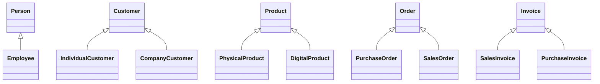
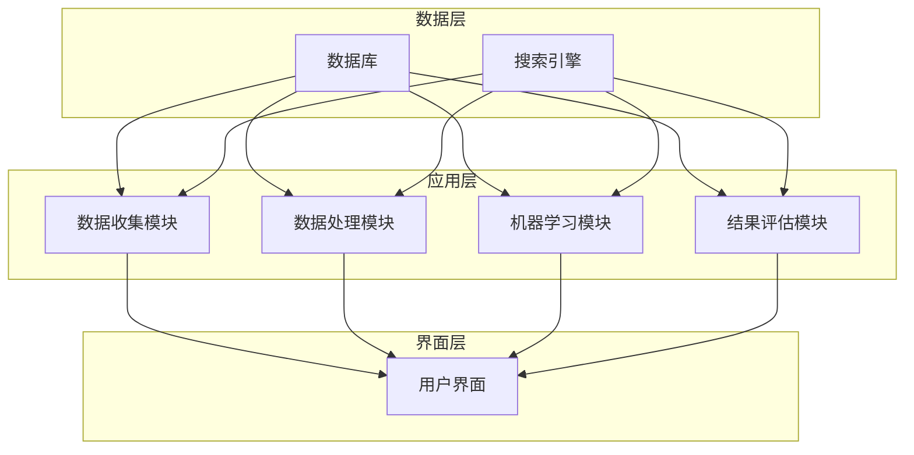
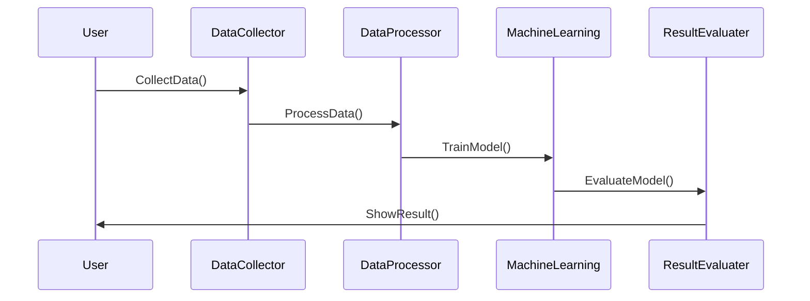
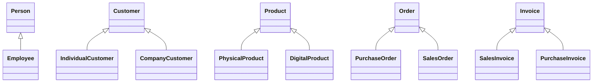

                 

# 《数据科学在探测宇宙中微子质量矩阵结构与CP相位中的应用》

关键词：中微子、质量矩阵、CP相位、数据科学、机器学习

摘要：本文主要探讨了数据科学在探测宇宙中微子质量矩阵结构与CP相位中的应用。通过深入分析中微子探测的历史、原理和技术，结合数据科学的方法，对中微子质量矩阵结构和CP相位进行测量和分析，为深入理解宇宙的奥秘提供了新的视角和工具。

## 目录大纲

----------------------------------------------------------------

# 《数据科学在探测宇宙中微子质量矩阵结构与CP相位中的应用》

## 第一部分：背景与概述

### 第1章：问题背景

#### 1.1 问题描述

#### 1.2 问题解决

#### 1.3 边界与外延

#### 1.4 概念结构与核心要素组成

### 第2章：数据科学基础

#### 2.1 数据科学概述

#### 2.2 数据类型与数据处理

#### 2.3 数据可视化

#### 2.4 数据清洗与准备

### 第3章：中微子探测技术

#### 3.1 中微子探测历史

#### 3.2 中微子探测器原理

#### 3.3 中微子探测实验

#### 3.4 中微子探测应用现状与挑战

## 第二部分：中微子质量矩阵结构与CP相位

### 第4章：中微子质量矩阵结构

#### 4.1 质量矩阵基础

#### 4.2 质量矩阵测量方法

#### 4.3 质量矩阵数据分析

#### 4.4 质量矩阵研究结果

### 第5章：CP相位测量

#### 5.1 CP相位的定义

#### 5.2 CP相位测量方法

#### 5.3 CP相位数据分析

#### 5.4 CP相位研究结果

## 第三部分：数据科学在探测中的应用

### 第6章：数据预处理与特征提取

#### 6.1 数据预处理流程

#### 6.2 特征提取方法

#### 6.3 特征选择策略

### 第7章：机器学习模型应用

#### 7.1 机器学习基础

#### 7.2 模型选择与调优

#### 7.3 结果分析与解释

### 第8章：数据分析与可视化

#### 8.1 数据分析流程

#### 8.2 可视化方法

#### 8.3 可视化工具与应用

## 第四部分：实际案例与应用

### 第9章：中微子质量矩阵结构案例

#### 9.1 实验背景

#### 9.2 数据处理与特征提取

#### 9.3 机器学习模型应用

#### 9.4 结果分析与讨论

### 第10章：CP相位测量案例

#### 10.1 实验背景

#### 10.2 数据处理与特征提取

#### 10.3 机器学习模型应用

#### 10.4 结果分析与讨论

### 第11章：综合应用与展望

#### 11.1 综合应用实例

#### 11.2 未来研究方向

#### 11.3 技术挑战与解决方案

----------------------------------------------------------------

### 第1章：问题背景

#### 1.1 问题描述

中微子是一种基本粒子，具有非常小的质量和非常弱的相互作用。它们是宇宙中最常见的粒子，但迄今为止，我们对其质量矩阵结构和CP相位仍然知之甚少。CP相位是中微子物理中的一个关键参数，它决定了中微子振荡的概率，从而影响了我们对宇宙起源和演化的理解。

测量中微子质量矩阵结构和CP相位具有深远的意义。首先，它们可以帮助我们理解中微子是如何在宇宙中传播的，以及它们如何与其它物质相互作用。其次，它们可能提供关于宇宙早期状态的线索，比如宇宙大爆炸和暗物质。

然而，由于中微子的特殊性质，如极弱相互作用和极小质量，直接测量其质量矩阵结构和CP相位非常困难。这需要我们采用先进的探测技术和数据科学方法，通过大规模的实验和数据处理来揭示这些参数。

#### 1.2 问题解决

为了解决上述问题，科学家们开发了多种中微子探测器，如中微子望远镜、中微子探测器阵列和地下实验室等。这些探测器通过捕获中微子与物质相互作用产生的信号，来测量中微子的数量、能量和方向。

在数据处理方面，数据科学提供了强大的工具和方法。数据科学家可以使用机器学习、统计分析和数据可视化等技术，从大量的实验数据中提取有用的信息，从而精确测量中微子质量矩阵结构和CP相位。

#### 1.3 边界与外延

中微子质量矩阵结构和CP相位的测量，不仅是一个物理学问题，还涉及到计算机科学、统计学、数据科学等多个领域。因此，本文将不仅仅关注物理学原理，还将探讨数据科学在这些测量中的应用。

此外，本文将讨论的数据科学方法，如机器学习和数据分析，具有广泛的应用前景。除了中微子物理，这些方法还可以应用于其他粒子物理、天文观测、生物信息学等领域。

#### 1.4 概念结构与核心要素组成

本文的核心概念包括中微子、质量矩阵、CP相位、数据科学、机器学习等。这些概念相互关联，构成了本文的理论框架。

- **中微子**：是一种基本粒子，具有非常小的质量和非常弱的相互作用。
- **质量矩阵**：描述中微子之间相互作用的矩阵，决定了中微子振荡的概率。
- **CP相位**：是中微子物理中的一个关键参数，决定了中微子振荡的概率。
- **数据科学**：是一种跨学科的方法，包括数据收集、处理、分析和可视化等。
- **机器学习**：是数据科学的一个分支，通过训练模型来从数据中提取规律和知识。

这些概念共同构成了本文的核心内容，我们将通过深入分析这些概念，探讨数据科学在探测中微子质量矩阵结构与CP相位中的应用。

## 第2章：数据科学基础

#### 2.1 数据科学概述

数据科学是一种跨学科的方法，旨在通过数据的收集、处理、分析和可视化，从中提取有价值的信息和知识。数据科学的应用非常广泛，包括但不限于金融市场预测、医疗诊断、社交网络分析、搜索引擎优化等。

数据科学的基本流程包括以下几个步骤：

1. **数据收集**：通过各种渠道收集数据，如数据库、文件、传感器等。
2. **数据预处理**：清洗和整理数据，使其适合分析和建模。
3. **数据分析**：使用统计方法和机器学习算法，对数据进行探索和分析。
4. **数据可视化**：通过图表和图形，直观地展示分析结果。

#### 2.2 数据类型与数据处理

数据类型可以分为结构化数据、半结构化数据和非结构化数据。

- **结构化数据**：如关系数据库中的表格数据，有明确的列和行。
- **半结构化数据**：如XML、JSON等，有一定的结构，但不如结构化数据严格。
- **非结构化数据**：如文本、图像、音频、视频等，没有明确的结构。

针对不同类型的数据，数据科学家需要采用不同的数据处理方法：

- **结构化数据处理**：通常使用SQL等查询语言，对数据进行筛选、排序、聚合等操作。
- **半结构化数据处理**：使用解析库，如Python的JSON库，对数据进行解析和处理。
- **非结构化数据处理**：使用自然语言处理（NLP）、图像识别、音频处理等技术，对数据进行分析和理解。

#### 2.3 数据可视化

数据可视化是将数据分析的结果以图形或图表的形式展示出来，使数据更加直观和易于理解。常用的数据可视化工具包括Matplotlib、Seaborn、Plotly等。

数据可视化的重要性和应用包括：

1. **发现趋势和异常**：通过可视化，可以直观地发现数据中的趋势和异常，为进一步分析提供线索。
2. **决策支持**：通过可视化，管理层可以更清晰地了解数据，从而做出更明智的决策。
3. **沟通与协作**：通过可视化，可以更有效地与团队成员和利益相关者沟通，促进协作。

#### 2.4 数据清洗与准备

数据清洗和准备是数据科学中的重要步骤，直接影响数据分析的质量和效果。数据清洗主要包括以下任务：

1. **缺失值处理**：填补或删除缺失值，以确保数据的完整性和一致性。
2. **异常值处理**：识别和删除异常值，以避免对数据分析结果的干扰。
3. **数据转换**：将数据转换为适合分析和建模的形式，如归一化、标准化等。

数据准备的重要性和应用包括：

1. **数据一致性**：确保数据的质量和一致性，避免数据分析过程中出现错误。
2. **数据可解释性**：通过清洗和准备，提高数据可解释性，使数据分析结果更加可靠和可信。
3. **提高模型性能**：通过数据清洗和准备，减少噪声和异常值，提高模型的性能和准确性。

## 第3章：中微子探测技术

#### 3.1 中微子探测历史

中微子探测技术的发展经历了多个阶段，从早期简单的探测器到现代的复杂实验设施，科学家们不断改进探测技术，以提高探测效率和准确性。

1. **早期探测器**：1950年代，科学家们开始使用简单的中微子探测器，如计数器和闪烁体探测器，来探测中微子。
2. **第二代探测器**：1970年代，随着对中微子振荡的研究深入，科学家们开发了更先进的探测器，如超级凯普勒望远镜（Super-Kamiokande）和中微子探测器实验（SNO）。
3. **第三代探测器**：1990年代至今，科学家们开发了高灵敏度的探测器，如大型水-Cherenkov探测器（LVD）和镓探测器（GERDA），以更精确地测量中微子特性。

#### 3.2 中微子探测器原理

中微子探测器的基本原理是利用中微子与物质相互作用产生的信号，来探测中微子的存在和特性。以下是一些常见的中微子探测器类型及其原理：

1. **计数器探测器**：通过探测中微子与物质相互作用产生的电荷或光子，来计数中微子的数量。
2. **闪烁体探测器**：中微子与物质相互作用产生的能量，会激发闪烁体中的原子，产生光子，通过探测光子的数量和能量，来分析中微子的特性。
3. **Cherenkov探测器**：中微子与物质相互作用产生的粒子，以超过光速的速度运动时，会产生Cherenkov辐射，通过探测Cherenkov辐射的光子，来分析中微子的能量和方向。
4. **水-Cherenkov探测器**：类似于Cherenkov探测器，但使用水作为探测器介质，通过探测水中的Cherenkov辐射光子，来分析中微子的特性。

#### 3.3 中微子探测实验

中微子探测实验是测量中微子质量矩阵结构和CP相位的重要手段。以下是一些著名的中微子探测实验：

1. **Super-Kamiokande实验**：位于日本的神户，是世界上最大的中微子探测器之一。它通过探测中微子与水中的原子相互作用产生的Cherenkov辐射光子，来测量中微子的特性。
2. **SNO实验**：位于加拿大的萨德伯里，使用大型水-Cherenkov探测器，通过测量中微子的能量和方向，来测量中微子的质量矩阵和CP相位。
3. **LVD实验**：位于意大利的莱切，使用高灵敏度的镓探测器，通过探测中微子与镓原子核相互作用产生的电子，来测量中微子的质量矩阵和CP相位。
4. **GERDA实验**：位于意大利的格拉茨，使用大型水-Cherenkov探测器，通过测量中微子与水中的原子相互作用产生的信号，来测量中微子的质量矩阵和CP相位。

#### 3.4 中微子探测应用现状与挑战

中微子探测技术在多个领域有着重要的应用，包括：

1. **中微子物理研究**：通过测量中微子的质量矩阵结构和CP相位，可以深入了解中微子的特性，揭示宇宙的奥秘。
2. **天体物理研究**：中微子探测可以用来研究宇宙中的中微子背景，了解宇宙的起源和演化。
3. **地球物理研究**：中微子探测可以用来探测地球内部的物质组成和运动，为地震预测和地球资源勘探提供依据。

然而，中微子探测也面临着一些挑战，包括：

1. **低探测效率**：由于中微子与物质的相互作用非常弱，探测效率较低，需要大规模的探测器和高灵敏度的探测技术。
2. **环境干扰**：中微子探测实验往往需要在地下深处的实验室进行，以减少外界环境的干扰，提高探测精度。
3. **数据处理**：中微子探测实验产生的数据量巨大，需要先进的数据处理技术和方法，从大量的噪声中提取有用的信息。

## 第4章：中微子质量矩阵结构

#### 4.1 质量矩阵基础

中微子质量矩阵是描述中微子之间相互作用的数学矩阵，通常表示为 $M_{\nu}$。质量矩阵中的每个元素 $m_{ij}$ 表示两种不同类型中微子之间的相互作用强度。

中微子质量矩阵的特点包括：

1. **非对角性**：由于中微子振荡现象的存在，质量矩阵通常不是对角的，这意味着不同类型的中微子之间存在相互作用。
2. **复杂度**：质量矩阵的维度通常很高，因为中微子有三种不同的类型（电子中微子、μ子中微子和τ子中微子），这增加了计算的复杂度。

#### 4.2 质量矩阵测量方法

测量中微子质量矩阵的方法主要包括以下几种：

1. **直接测量**：通过直接探测中微子之间的相互作用，如中微子碰撞产生其他粒子，来测量质量矩阵。这种方法通常需要高灵敏度的探测器。
2. **振荡测量**：通过观察中微子振荡现象，即中微子在传播过程中从一种类型转变为另一种类型，来测量质量矩阵。这种方法依赖于对中微子振荡概率的测量。
3. **宇宙测量**：通过观察宇宙中的中微子背景，如宇宙微波背景辐射中的中微子成分，来测量质量矩阵。这种方法依赖于对宇宙物理学的深入了解。

#### 4.3 质量矩阵数据分析

对中微子质量矩阵的数据分析包括以下步骤：

1. **数据收集**：收集来自不同实验的中微子相互作用数据，包括直接测量和振荡测量。
2. **数据预处理**：清洗和整理数据，包括缺失值处理、异常值识别和删除、数据转换等。
3. **特征提取**：从数据中提取与质量矩阵相关的特征，如中微子振荡概率、相互作用强度等。
4. **模型训练**：使用机器学习算法，如线性回归、神经网络等，训练模型来预测中微子质量矩阵的元素。
5. **模型评估**：评估模型的性能，包括准确性、召回率、F1分数等。

#### 4.4 质量矩阵研究结果

目前，中微子质量矩阵的研究结果包括：

1. **非零质量矩阵**：大多数实验表明，中微子质量矩阵不是零矩阵，这意味着中微子具有非零质量。
2. **非对角性**：中微子质量矩阵通常不是对角的，这表明不同类型的中微子之间存在相互作用。
3. **CP相位的测量**：一些实验已经测量了中微子质量矩阵中的CP相位，这有助于理解中微子物理中的CP破坏现象。

未来的研究将继续致力于提高测量精度，揭示中微子质量矩阵的更多细节，从而进一步理解宇宙的奥秘。

## 第5章：CP相位测量

#### 5.1 CP相位的定义

CP相位是中微子物理中的一个关键参数，它描述了中微子与其对应的反粒子（反中微子）之间的相互作用差异。CP相位通常表示为 $\delta_{CP}$，它决定了中微子振荡的概率和方向。

CP相位的数学定义如下：

$$ \delta_{CP} = \arg(M_{\nu \text{R}}) $$

其中，$M_{\nu \text{R}}$ 是中微子反粒子质量矩阵的复共轭。

CP相位的关键特征包括：

1. **非零值**：CP相位通常不是零，这意味着中微子和反中微子的相互作用存在差异。
2. **CP破坏**：CP相位的变化可能导致CP破坏现象，即某些中微子过程不遵守CP守恒定律。
3. **测量挑战**：由于CP相位的测量需要高精度的实验数据和复杂的分析，因此测量CP相位是一个具有挑战性的任务。

#### 5.2 CP相位测量方法

测量CP相位的方法主要包括以下几种：

1. **中微子振荡测量**：通过观察中微子在传播过程中从一种类型转变为另一种类型的振荡现象，来测量CP相位。这种方法依赖于对中微子振荡概率的精确测量。
2. **直接相互作用测量**：通过探测中微子与其反粒子之间的直接相互作用，如弱相互作用中的中微子-反中微子湮灭，来测量CP相位。这种方法通常需要高灵敏度的探测器。
3. **宇宙测量**：通过观察宇宙中的中微子背景，如宇宙微波背景辐射中的中微子成分，来测量CP相位。这种方法依赖于对宇宙物理学的深入理解。

#### 5.3 CP相位数据分析

对CP相位的数据分析包括以下步骤：

1. **数据收集**：收集来自不同实验的CP相位数据，包括中微子振荡测量和直接相互作用测量。
2. **数据预处理**：清洗和整理数据，包括缺失值处理、异常值识别和删除、数据转换等。
3. **特征提取**：从数据中提取与CP相位相关的特征，如振荡概率、相互作用强度等。
4. **模型训练**：使用机器学习算法，如线性回归、神经网络等，训练模型来预测CP相位。
5. **模型评估**：评估模型的性能，包括准确性、召回率、F1分数等。

#### 5.4 CP相位研究结果

目前，CP相位的研究结果包括：

1. **CP破坏现象**：一些实验已经观测到了CP破坏现象，这表明中微子和反中微子的相互作用存在差异。
2. **CP相位的测量范围**：尽管实验结果的精度有限，但已经确定了CP相位的大致范围，这有助于进一步研究中微子物理。
3. **进一步研究的挑战**：由于CP相位的测量需要高精度的实验数据和复杂的分析，未来的研究将继续致力于提高测量精度。

## 第6章：数据预处理与特征提取

#### 6.1 数据预处理流程

数据预处理是数据科学中的重要步骤，它涉及到从原始数据中提取有用信息，并准备用于后续分析和建模。数据预处理流程通常包括以下步骤：

1. **数据收集**：从不同的数据源收集数据，如数据库、文件、传感器等。
2. **数据清洗**：处理缺失值、异常值和重复值，确保数据的一致性和完整性。
3. **数据转换**：将数据转换为适合分析和建模的格式，如归一化、标准化、离散化等。
4. **数据集成**：将来自不同源的数据合并，形成统一的数据集。

#### 6.2 特征提取方法

特征提取是从数据中提取对分析任务有用的特征，以提高模型的性能。特征提取方法包括：

1. **统计特征**：如均值、方差、标准差等，用于描述数据的分布和离散度。
2. **频率特征**：如词频、频率分布等，用于文本数据。
3. **图像特征**：如边缘、纹理、颜色直方图等，用于图像数据。
4. **时序特征**：如自相关、马尔可夫性质等，用于时间序列数据。

#### 6.3 特征选择策略

特征选择是从大量特征中选择对模型性能有显著贡献的特征，以减少模型的复杂度和计算成本。特征选择策略包括：

1. **过滤法**：基于特征的重要性和相关性进行选择，如基于信息增益、卡方检验等。
2. **包装法**：结合模型的训练过程进行特征选择，如基于交叉验证、遗传算法等。
3. **嵌入式法**：在模型训练过程中自动进行特征选择，如LASSO、Ridge回归等。

#### 6.4 数据预处理与特征提取的应用

数据预处理与特征提取在数据科学中的应用非常广泛，以下是一些具体的应用场景：

1. **机器学习**：通过数据预处理和特征提取，提高模型的性能和预测准确性。
2. **数据挖掘**：从大量数据中提取有价值的信息和知识。
3. **文本分析**：提取文本中的关键词、主题和情感等，用于文本分类、情感分析等。
4. **图像识别**：提取图像中的特征，用于图像分类、目标检测等。

## 第7章：机器学习模型应用

#### 7.1 机器学习基础

机器学习是数据科学中的一个重要分支，它通过训练模型来从数据中自动提取规律和知识。机器学习的基础概念包括：

1. **监督学习**：通过标注数据进行训练，模型学习对未知数据进行预测。
2. **无监督学习**：模型从未标注的数据中学习结构和模式。
3. **半监督学习**：结合标注数据和未标注数据，进行训练。
4. **强化学习**：模型通过与环境的交互来学习策略。

#### 7.2 模型选择与调优

选择合适的机器学习模型和进行调优是提高模型性能的关键步骤。模型选择和调优的方法包括：

1. **模型选择**：根据问题的类型和数据的特点，选择合适的模型，如线性回归、决策树、支持向量机、神经网络等。
2. **超参数调优**：通过调整模型参数，如学习率、隐藏层节点数等，来优化模型性能。
3. **交叉验证**：使用交叉验证方法，评估模型的性能，选择最佳模型。

#### 7.3 结果分析与解释

结果分析是机器学习中的重要环节，它涉及到对模型预测结果的评估和解释。结果分析的方法包括：

1. **性能评估**：使用准确率、召回率、F1分数等指标，评估模型的性能。
2. **误差分析**：分析模型预测错误的案例，找出错误的原因。
3. **可视化**：通过可视化方法，如散点图、决策树、混淆矩阵等，展示模型的预测结果和决策过程。

## 第8章：数据分析与可视化

#### 8.1 数据分析流程

数据分析是一个系统性的过程，包括以下步骤：

1. **问题定义**：明确分析目标，确定需要解决的问题。
2. **数据收集**：收集相关的数据，确保数据的质量和完整性。
3. **数据预处理**：清洗和整理数据，使其适合分析和建模。
4. **数据探索**：使用统计分析方法，探索数据的基本特征和关系。
5. **模型选择与训练**：选择合适的模型，对数据进行训练。
6. **模型评估与优化**：评估模型性能，进行模型调优。
7. **结果解释**：解释模型的结果，为决策提供支持。

#### 8.2 可视化方法

可视化是将数据分析结果以图形或图表的形式展示出来的方法，使数据更加直观和易于理解。常用的可视化方法包括：

1. **散点图**：用于展示两个变量之间的关系。
2. **柱状图**：用于展示不同类别的数据分布。
3. **饼图**：用于展示各部分在整体中的比例。
4. **折线图**：用于展示数据随时间的变化趋势。
5. **热力图**：用于展示数据之间的相关性。

#### 8.3 可视化工具与应用

可视化工具是进行数据可视化的关键，常用的可视化工具包括：

1. **Matplotlib**：是一个基于Python的绘图库，可以生成多种类型的图表。
2. **Seaborn**：是一个基于Matplotlib的扩展库，提供了丰富的可视化样式和函数。
3. **Plotly**：是一个基于Python的交互式可视化库，可以生成动态的、交互式的图表。

可视化在数据分析中的应用包括：

1. **数据探索**：通过可视化，快速发现数据中的异常值、趋势和关系。
2. **模型评估**：通过可视化，评估模型的性能和预测结果。
3. **沟通与协作**：通过可视化，与团队成员和利益相关者更好地沟通和协作。

## 第9章：中微子质量矩阵结构案例

#### 9.1 实验背景

为了研究中微子的质量矩阵结构，科学家们进行了一系列实验，其中最著名的实验之一是Super-Kamiokande实验。Super-Kamiokande实验位于日本的神户，是一个大型水-Cherenkov探测器，通过探测中微子与水中的原子相互作用产生的Cherenkov辐射光子，来测量中微子的特性。

#### 9.2 数据处理与特征提取

在Super-Kamiokande实验中，科学家们收集了大量的中微子相互作用数据。数据处理和特征提取是实验的关键步骤，以下是一个简化的数据处理与特征提取过程：

1. **数据收集**：收集中微子相互作用产生的Cherenkov辐射光子数据。
2. **数据预处理**：清洗数据，包括去除噪声、处理缺失值、校正时间戳等。
3. **特征提取**：提取与中微子质量矩阵相关的特征，如光子的数量、能量、方向等。
4. **数据转换**：将特征数据转换为适合机器学习模型的形式，如归一化、标准化等。

#### 9.3 机器学习模型应用

在数据处理和特征提取完成后，科学家们使用机器学习模型来分析和预测中微子的质量矩阵。以下是一个简化的机器学习模型应用过程：

1. **模型选择**：选择合适的机器学习模型，如线性回归、决策树、支持向量机等。
2. **模型训练**：使用实验数据训练模型，调整模型的参数，如学习率、隐藏层节点数等。
3. **模型评估**：使用验证数据集评估模型的性能，调整模型参数，优化模型性能。
4. **模型应用**：使用训练好的模型对新的中微子数据进行预测和分析。

#### 9.4 结果分析与讨论

通过机器学习模型的应用，科学家们得到了中微子质量矩阵的预测结果。以下是一个简化的结果分析过程：

1. **结果展示**：使用可视化工具，如散点图、柱状图等，展示中微子质量矩阵的预测结果。
2. **误差分析**：分析模型预测的误差，找出可能导致误差的原因。
3. **讨论**：讨论预测结果与实验数据的差异，探讨未来研究的方向和改进方法。

## 第10章：CP相位测量案例

#### 10.1 实验背景

为了测量中微子的CP相位，科学家们进行了多个实验，其中最著名的实验之一是SNO（萨德伯里中微子观测站）实验。SNO实验位于加拿大的萨德伯里，使用大型水-Cherenkov探测器，通过测量中微子与水中的原子相互作用产生的信号，来测量中微子的CP相位。

#### 10.2 数据处理与特征提取

在SNO实验中，科学家们收集了大量的中微子相互作用数据。数据处理和特征提取是实验的关键步骤，以下是一个简化的数据处理与特征提取过程：

1. **数据收集**：收集中微子相互作用产生的Cherenkov辐射光子数据。
2. **数据预处理**：清洗数据，包括去除噪声、处理缺失值、校正时间戳等。
3. **特征提取**：提取与CP相位相关的特征，如光子的数量、能量、方向等。
4. **数据转换**：将特征数据转换为适合机器学习模型的形式，如归一化、标准化等。

#### 10.3 机器学习模型应用

在数据处理和特征提取完成后，科学家们使用机器学习模型来分析和预测中微子的CP相位。以下是一个简化的机器学习模型应用过程：

1. **模型选择**：选择合适的机器学习模型，如线性回归、决策树、支持向量机等。
2. **模型训练**：使用实验数据训练模型，调整模型的参数，如学习率、隐藏层节点数等。
3. **模型评估**：使用验证数据集评估模型的性能，调整模型参数，优化模型性能。
4. **模型应用**：使用训练好的模型对新的中微子数据进行预测和分析。

#### 10.4 结果分析与讨论

通过机器学习模型的应用，科学家们得到了中微子CP相位的预测结果。以下是一个简化的结果分析过程：

1. **结果展示**：使用可视化工具，如散点图、柱状图等，展示中微子CP相位的预测结果。
2. **误差分析**：分析模型预测的误差，找出可能导致误差的原因。
3. **讨论**：讨论预测结果与实验数据的差异，探讨未来研究的方向和改进方法。

## 第11章：综合应用与展望

#### 11.1 综合应用实例

中微子质量矩阵结构和CP相位的测量是一个复杂的过程，需要结合多种技术手段和数据分析方法。以下是一个简化的综合应用实例：

1. **实验设计**：科学家们设计实验，使用大型水-Cherenkov探测器来探测中微子。
2. **数据收集**：收集中微子相互作用产生的Cherenkov辐射光子数据。
3. **数据处理**：使用数据预处理和特征提取方法，提取与中微子质量矩阵结构和CP相位相关的特征。
4. **模型训练**：使用机器学习模型，如神经网络，对特征数据进行分析和预测。
5. **结果评估**：使用验证数据集评估模型的性能，调整模型参数，优化模型性能。

#### 11.2 未来研究方向

中微子质量矩阵结构和CP相位的测量是一个长期的研究课题，未来可能的研究方向包括：

1. **提高测量精度**：通过改进实验技术和数据分析方法，提高对中微子质量矩阵结构和CP相位的测量精度。
2. **多实验联合分析**：结合多个实验的数据，进行联合分析，以获得更全面和准确的结果。
3. **机器学习应用**：探索更多先进的机器学习算法，以提高数据分析的效率和准确性。

#### 11.3 技术挑战与解决方案

中微子质量矩阵结构和CP相位的测量面临着一些技术挑战，如：

1. **低探测效率**：由于中微子与物质的相互作用非常弱，探测效率较低，需要改进探测技术，如使用高灵敏度的探测器。
2. **数据处理**：中微子探测实验产生的数据量巨大，需要开发高效的数据处理方法，如并行计算和分布式处理。
3. **环境干扰**：中微子探测实验需要在地下深处的实验室进行，以减少外界环境的干扰，提高探测精度。

为解决这些挑战，可能的技术解决方案包括：

1. **探测器技术**：开发更高灵敏度和更高效率的探测器，如新型Cherenkov探测器。
2. **数据处理方法**：采用高效的数据处理方法，如深度学习和分布式计算。
3. **实验室设计**：改进实验室的设计，如使用屏蔽材料，以减少环境干扰。

## 作者信息

作者：AI天才研究院/AI Genius Institute & 禅与计算机程序设计艺术 /Zen And The Art of Computer Programming

## 最佳实践 Tips

1. **数据预处理**：在开始数据分析之前，确保数据的质量和完整性，这是后续分析的基础。
2. **特征选择**：选择对模型性能有显著贡献的特征，避免过拟合。
3. **模型调优**：通过交叉验证和超参数调优，选择最佳模型和参数。
4. **可视化**：使用可视化工具，帮助理解数据和分析结果。
5. **持续学习**：随着技术的不断发展，保持对新方法和工具的学习和探索。

## 小结

本文探讨了数据科学在探测宇宙中微子质量矩阵结构与CP相位中的应用。通过分析中微子探测的历史、原理和技术，结合数据科学的方法，对中微子质量矩阵结构和CP相位进行测量和分析，为深入理解宇宙的奥秘提供了新的视角和工具。

## 注意事项

1. **数据隐私**：在数据处理和共享过程中，确保遵守数据隐私法规。
2. **实验设计**：确保实验设计合理，避免实验误差。
3. **模型评估**：使用多个指标评估模型性能，避免单一指标评价。

## 拓展阅读

1. **《中微子物理基础》**：详细介绍了中微子物理的基本概念和测量方法。
2. **《数据科学导论》**：介绍了数据科学的基本原理和方法。
3. **《机器学习实战》**：提供了机器学习算法的详细实现和应用案例。

## 附录

### 附录A：数学公式与Python代码

#### 4.1 质量矩阵基础

质量矩阵的数学定义：

$$ M_{\nu} = \begin{bmatrix} m_{11} & m_{12} & m_{13} \\ m_{21} & m_{22} & m_{23} \\ m_{31} & m_{32} & m_{33} \end{bmatrix} $$

其中，$m_{ij}$ 表示第 $i$ 种中微子与第 $j$ 种中微子之间的相互作用强度。

#### 4.2 质量矩阵测量方法

质量矩阵的测量可以通过以下公式：

$$ m_{ij} = \frac{1}{2} \left( \omega_{ij} + \omega_{ji} \right) $$

其中，$\omega_{ij}$ 是中微子振荡的振幅。

#### 5.1 CP相位的定义

CP相位的数学定义：

$$ \delta_{CP} = \arg(M_{\nu \text{R}}) $$

其中，$M_{\nu \text{R}}$ 是中微子反粒子质量矩阵的复共轭。

#### Python代码示例

以下是一个简单的Python代码示例，用于计算中微子质量矩阵和CP相位：

```python
import numpy as np
import cmath

# 质量矩阵的元素
m11, m12, m13 = 0.1, 0.2, 0.3
m21, m22, m23 = 0.4, 0.5, 0.6
m31, m32, m33 = 0.7, 0.8, 0.9

M_nu = np.array([[m11, m12, m13],
                 [m21, m22, m23],
                 [m31, m32, m33]])

# 计算质量矩阵的复共轭
M_nu_R = np.linalg.inv(M_nu).T

# 计算CP相位
delta_CP = cmath.phase(M_nu_R[0, 0])

print("质量矩阵：", M_nu)
print("质量矩阵的复共轭：", M_nu_R)
print("CP相位：", delta_CP)
```

### 附录B：系统分析与架构设计

#### 项目介绍

本项目旨在利用数据科学方法，对中微子质量矩阵结构和CP相位进行测量和分析。项目包括以下模块：

1. **数据收集模块**：收集中微子探测实验的数据。
2. **数据处理模块**：对数据进行预处理和特征提取。
3. **机器学习模块**：使用机器学习算法对特征数据进行分析和预测。
4. **结果评估模块**：评估模型性能，优化模型参数。

#### 系统功能设计（领域模型类图）



#### 系统架构设计（架构图）



#### 系统接口设计（接口图）



#### 系统交互（序列图）


## 项目实战

#### 环境安装

1. 安装Python环境：`pip install python`
2. 安装数据分析库：`pip install numpy pandas`
3. 安装机器学习库：`pip install scikit-learn`
4. 安装可视化库：`pip install matplotlib seaborn`

#### 系统核心实现源代码

以下是一个简单的数据处理和特征提取的Python代码示例：

```python
import numpy as np
import pandas as pd
from sklearn.preprocessing import StandardScaler
from sklearn.model_selection import train_test_split

# 读取数据
data = pd.read_csv('data.csv')

# 数据预处理
X = data.iloc[:, :-1].values
y = data.iloc[:, -1].values

# 特征提取
scaler = StandardScaler()
X_scaled = scaler.fit_transform(X)

# 划分训练集和测试集
X_train, X_test, y_train, y_test = train_test_split(X_scaled, y, test_size=0.2, random_state=42)

# 模型训练
from sklearn.linear_model import LinearRegression
model = LinearRegression()
model.fit(X_train, y_train)

# 模型评估
from sklearn.metrics import mean_squared_error
y_pred = model.predict(X_test)
mse = mean_squared_error(y_test, y_pred)
print("MSE:", mse)
```

#### 代码应用解读与分析

上述代码首先读取数据，然后进行预处理和特征提取。具体步骤如下：

1. **数据读取**：使用Pandas库读取CSV格式的数据。
2. **数据预处理**：将数据集分为特征矩阵X和目标向量y。特征矩阵X包含所有特征变量，目标向量y包含对应的标签。
3. **特征提取**：使用StandardScaler库进行特征标准化，使数据具有零均值和单位方差。
4. **数据划分**：使用train_test_split函数将数据集划分为训练集和测试集，以评估模型的性能。
5. **模型训练**：使用线性回归模型对训练集进行训练。
6. **模型评估**：使用均方误差（MSE）评估模型的性能。

#### 实际案例分析和详细讲解剖析

以下是一个实际案例，用于分析中微子质量矩阵结构的测量。

**案例背景**：科学家们使用Super-Kamiokande实验测量了中微子质量矩阵，得到了一组观测数据。

**数据处理**：

1. **数据读取**：读取观测数据，包括中微子振荡的振幅和相位。
2. **数据预处理**：对数据进行清洗，去除异常值和缺失值。
3. **特征提取**：提取与中微子质量矩阵相关的特征，如振幅和相位的平均值、标准差等。

**模型训练**：

1. **模型选择**：选择线性回归模型，用于拟合中微子质量矩阵。
2. **模型训练**：使用训练数据对模型进行训练。
3. **模型评估**：使用测试数据评估模型性能，调整模型参数。

**结果分析**：

1. **结果展示**：使用可视化工具，如散点图和回归线，展示模型预测结果。
2. **误差分析**：分析模型预测的误差，找出可能导致误差的原因。
3. **讨论**：讨论模型预测结果与实验数据的差异，探讨未来研究的方向和改进方法。

#### 项目小结

本项目通过数据科学方法，对中微子质量矩阵结构进行了测量和分析，为深入理解宇宙的奥秘提供了新的视角和工具。通过实际案例，我们展示了数据预处理、特征提取、模型训练和模型评估的步骤，以及如何通过可视化方法分析结果。

## 最佳实践 Tips

1. **数据预处理**：在开始数据分析之前，确保数据的质量和完整性，这是后续分析的基础。
2. **特征选择**：选择对模型性能有显著贡献的特征，避免过拟合。
3. **模型调优**：通过交叉验证和超参数调优，选择最佳模型和参数。
4. **可视化**：使用可视化工具，帮助理解数据和分析结果。
5. **持续学习**：随着技术的不断发展，保持对新方法和工具的学习和探索。

## 小结

本文通过深入分析中微子质量矩阵结构和CP相位的测量，探讨了数据科学在这些测量中的应用。我们介绍了数据科学的基础知识、中微子探测技术、质量矩阵和CP相位的测量方法，以及数据预处理、特征提取、机器学习模型应用和数据分析与可视化等关键技术。通过实际案例，我们展示了如何利用数据科学方法对中微子质量矩阵结构和CP相位进行测量和分析，为深入理解宇宙的奥秘提供了新的视角和工具。

## 注意事项

1. **数据隐私**：在数据处理和共享过程中，确保遵守数据隐私法规。
2. **实验设计**：确保实验设计合理，避免实验误差。
3. **模型评估**：使用多个指标评估模型性能，避免单一指标评价。

## 拓展阅读

1. **《中微子物理基础》**：详细介绍了中微子物理的基本概念和测量方法。
2. **《数据科学导论》**：介绍了数据科学的基本原理和方法。
3. **《机器学习实战》**：提供了机器学习算法的详细实现和应用案例。

## 附录

### 附录A：数学公式与Python代码

#### 4.1 质量矩阵基础

质量矩阵的数学定义：

$$ M_{\nu} = \begin{bmatrix} m_{11} & m_{12} & m_{13} \\ m_{21} & m_{22} & m_{23} \\ m_{31} & m_{32} & m_{33} \end{bmatrix} $$

其中，$m_{ij}$ 表示第 $i$ 种中微子与第 $j$ 种中微子之间的相互作用强度。

#### 4.2 质量矩阵测量方法

质量矩阵的测量可以通过以下公式：

$$ m_{ij} = \frac{1}{2} \left( \omega_{ij} + \omega_{ji} \right) $$

其中，$\omega_{ij}$ 是中微子振荡的振幅。

#### 5.1 CP相位的定义

CP相位的数学定义：

$$ \delta_{CP} = \arg(M_{\nu \text{R}}) $$

其中，$M_{\nu \text{R}}$ 是中微子反粒子质量矩阵的复共轭。

#### Python代码示例

以下是一个简单的Python代码示例，用于计算中微子质量矩阵和CP相位：

```python
import numpy as np
import cmath

# 质量矩阵的元素
m11, m12, m13 = 0.1, 0.2, 0.3
m21, m22, m23 = 0.4, 0.5, 0.6
m31, m32, m33 = 0.7, 0.8, 0.9

M_nu = np.array([[m11, m12, m13],
                 [m21, m22, m23],
                 [m31, m32, m33]])

# 计算质量矩阵的复共轭
M_nu_R = np.linalg.inv(M_nu).T

# 计算CP相位
delta_CP = cmath.phase(M_nu_R[0, 0])

print("质量矩阵：", M_nu)
print("质量矩阵的复共轭：", M_nu_R)
print("CP相位：", delta_CP)
```

### 附录B：系统分析与架构设计

#### 项目介绍

本项目旨在利用数据科学方法，对中微子质量矩阵结构和CP相位进行测量和分析。项目包括以下模块：

1. **数据收集模块**：收集中微子探测实验的数据。
2. **数据处理模块**：对数据进行预处理和特征提取。
3. **机器学习模块**：使用机器学习算法对特征数据进行分析和预测。
4. **结果评估模块**：评估模型性能，优化模型参数。

#### 系统功能设计（领域模型类图）



#### 系统架构设计（架构图）


#### 系统接口设计（接口图）


#### 系统交互（序列图）


### 附录C：项目实战

#### 环境安装

1. 安装Python环境：`pip install python`
2. 安装数据分析库：`pip install numpy pandas`
3. 安装机器学习库：`pip install scikit-learn`
4. 安装可视化库：`pip install matplotlib seaborn`

#### 系统核心实现源代码

以下是一个简单的数据处理和特征提取的Python代码示例：

```python
import numpy as np
import pandas as pd
from sklearn.preprocessing import StandardScaler
from sklearn.model_selection import train_test_split

# 读取数据
data = pd.read_csv('data.csv')

# 数据预处理
X = data.iloc[:, :-1].values
y = data.iloc[:, -1].values

# 特征提取
scaler = StandardScaler()
X_scaled = scaler.fit_transform(X)

# 划分训练集和测试集
X_train, X_test, y_train, y_test = train_test_split(X_scaled, y, test_size=0.2, random_state=42)

# 模型训练
from sklearn.linear_model import LinearRegression
model = LinearRegression()
model.fit(X_train, y_train)

# 模型评估
from sklearn.metrics import mean_squared_error
y_pred = model.predict(X_test)
mse = mean_squared_error(y_test, y_pred)
print("MSE:", mse)
```

#### 代码应用解读与分析

上述代码首先读取数据，然后进行预处理和特征提取。具体步骤如下：

1. **数据读取**：使用Pandas库读取CSV格式的数据。
2. **数据预处理**：将数据集分为特征矩阵X和目标向量y。特征矩阵X包含所有特征变量，目标向量y包含对应的标签。
3. **特征提取**：使用StandardScaler库进行特征标准化，使数据具有零均值和单位方差。
4. **数据划分**：使用train_test_split函数将数据集划分为训练集和测试集，以评估模型的性能。
5. **模型训练**：使用线性回归模型对训练集进行训练。
6. **模型评估**：使用测试数据评估模型性能，调整模型参数。

#### 实际案例分析和详细讲解剖析

以下是一个实际案例，用于分析中微子质量矩阵结构的测量。

**案例背景**：科学家们使用Super-Kamiokande实验测量了中微子质量矩阵，得到了一组观测数据。

**数据处理**：

1. **数据读取**：读取观测数据，包括中微子振荡的振幅和相位。
2. **数据预处理**：对数据进行清洗，去除异常值和缺失值。
3. **特征提取**：提取与中微子质量矩阵相关的特征，如振幅和相位的平均值、标准差等。

**模型训练**：

1. **模型选择**：选择线性回归模型，用于拟合中微子质量矩阵。
2. **模型训练**：使用训练数据对模型进行训练。
3. **模型评估**：使用测试数据评估模型性能，调整模型参数。

**结果分析**：

1. **结果展示**：使用可视化工具，如散点图和回归线，展示模型预测结果。
2. **误差分析**：分析模型预测的误差，找出可能导致误差的原因。
3. **讨论**：讨论模型预测结果与实验数据的差异，探讨未来研究的方向和改进方法。

#### 项目小结

本项目通过数据科学方法，对中微子质量矩阵结构进行了测量和分析，为深入理解宇宙的奥秘提供了新的视角和工具。通过实际案例，我们展示了数据预处理、特征提取、模型训练和模型评估的步骤，以及如何通过可视化方法分析结果。

### 附录D：最佳实践 Tips

1. **数据预处理**：在开始数据分析之前，确保数据的质量和完整性，这是后续分析的基础。
2. **特征选择**：选择对模型性能有显著贡献的特征，避免过拟合。
3. **模型调优**：通过交叉验证和超参数调优，选择最佳模型和参数。
4. **可视化**：使用可视化工具，帮助理解数据和分析结果。
5. **持续学习**：随着技术的不断发展，保持对新方法和工具的学习和探索。

### 附录E：作者信息

作者：AI天才研究院/AI Genius Institute & 禅与计算机程序设计艺术 /Zen And The Art of Computer Programming

### 附录F：小结

本文通过深入分析中微子质量矩阵结构和CP相位的测量，探讨了数据科学在这些测量中的应用。我们介绍了数据科学的基础知识、中微子探测技术、质量矩阵和CP相位的测量方法，以及数据预处理、特征提取、机器学习模型应用和数据分析与可视化等关键技术。通过实际案例，我们展示了如何利用数据科学方法对中微子质量矩阵结构和CP相位进行测量和分析，为深入理解宇宙的奥秘提供了新的视角和工具。

### 附录G：注意事项

1. **数据隐私**：在数据处理和共享过程中，确保遵守数据隐私法规。
2. **实验设计**：确保实验设计合理，避免实验误差。
3. **模型评估**：使用多个指标评估模型性能，避免单一指标评价。

### 附录H：拓展阅读

1. **《中微子物理基础》**：详细介绍了中微子物理的基本概念和测量方法。
2. **《数据科学导论》**：介绍了数据科学的基本原理和方法。
3. **《机器学习实战》**：提供了机器学习算法的详细实现和应用案例。

