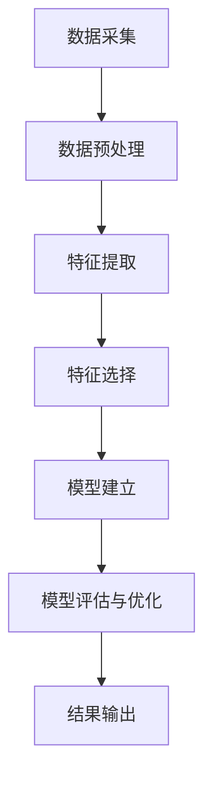
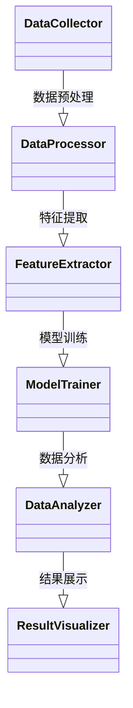
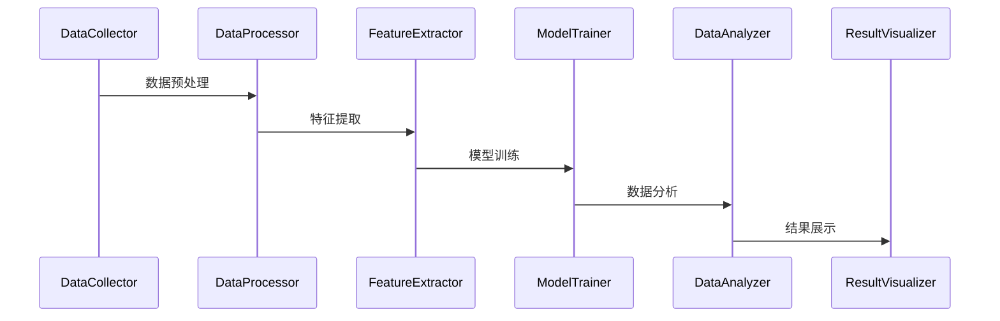

                 

### 数据科学在探测宇宙中微子质量矩阵结构中的应用

关键词：数据科学，中微子，质量矩阵结构，算法原理，数学模型

摘要：本文深入探讨了数据科学在探测宇宙中微子质量矩阵结构中的应用。首先，介绍了数据科学的概述、数据类型、数据预处理方法。接着，阐述了中微子基础，包括中微子概述、特性及探测方法。然后，详细讲解了质量矩阵结构的概念、特征及测量方法。在此基础上，本文重点分析了数据科学方法在中微子探测中的应用，包括数据采集与处理、特征提取与选择、数据分析与应用。随后，详细介绍了中微子质量矩阵结构测量的算法原理，使用mermaid流程图和Python源代码进行了深入阐述。最后，本文提出了系统分析与架构设计方案，以及项目实战和最佳实践 tips，为相关领域的研究和实践提供了有价值的参考。

----------------------------------------------------------------

## 第1章 背景介绍

### 1.1 问题背景

宇宙中微子是一种基本粒子，因其极其微弱的相互作用而被认为是宇宙中最神秘和最难以探测的粒子之一。中微子无电荷、质量极小，很难与物质相互作用，这使得传统的探测方法难以捕捉到它们的踪迹。然而，中微子在宇宙中的存在和性质对于理解宇宙的起源、结构和演化具有重要意义。因此，探测中微子并研究其质量矩阵结构成为物理学和天文学领域的重要课题。

### 1.2 问题描述

中微子质量矩阵结构探测的核心问题是如何准确测量中微子质量，以及如何通过这些质量信息来揭示中微子的性质和宇宙演化规律。由于中微子难以探测，传统的实验方法在测量其质量时面临巨大挑战。因此，如何利用现代科学技术，特别是数据科学方法，提高中微子质量测量的准确性和效率，成为亟待解决的关键问题。

### 1.3 问题解决

数据科学作为一种强大的工具，可以应用于中微子质量矩阵结构探测的多个环节。首先，通过数据采集与处理，可以获得大量中微子探测数据，为后续分析提供基础。其次，通过特征提取与选择，可以从原始数据中提取出与中微子质量相关的关键特征，有助于提高测量精度。最后，通过数据分析与应用，可以建立模型，对中微子质量进行预测和估计，从而揭示中微子质量矩阵结构的特征。

### 1.4 边界与外延

中微子质量矩阵结构探测不仅涉及物理学和天文学领域，还与数学、计算机科学、统计学等相关学科紧密相连。本文将在数据科学方法的基础上，探讨中微子质量矩阵结构探测的前沿问题和发展趋势，以期为相关领域的研究提供新的思路和方法。

### 1.5 概念结构与核心要素组成

本文的核心概念包括数据科学、中微子和质量矩阵结构。数据科学是本文的基础，用于解决中微子质量矩阵结构探测中的数据采集、处理和分析问题。中微子是本文的研究对象，其质量矩阵结构是本文的核心关注点。本文将详细介绍这些概念，并阐述它们在中微子质量矩阵结构探测中的重要作用。

----------------------------------------------------------------

## 第2章 核心概念与联系

### 2.1 数据科学基础

#### 2.1.1 数据科学概述

数据科学是一门跨学科的领域，结合了统计学、计算机科学、信息技术和领域知识，用于从数据中提取价值。数据科学的目标是通过数据分析、数据挖掘、机器学习等技术手段，解决实际问题，提供决策支持。

#### 2.1.2 数据类型

数据类型分为结构化数据和非结构化数据。结构化数据如关系型数据库中的表格数据，具有明确的属性和值。非结构化数据如文本、图像、音频和视频，没有固定的数据结构，需要通过特定的方法进行解析和提取。

#### 2.1.3 数据预处理

数据预处理是数据科学的重要环节，包括数据清洗、数据整合和数据变换。数据清洗旨在去除错误、异常和重复的数据，提高数据质量。数据整合是将来自不同数据源的数据进行合并，形成统一的视图。数据变换是将原始数据转换为适合分析的形式。

### 2.2 中微子基础

#### 2.2.1 中微子概述

中微子是弱相互作用的基本粒子之一，无电荷、质量极小，分为三种类型：电子中微子、μ子中微子和τ子中微子。中微子在宇宙中的丰度极高，但对物质的相互作用极其微弱，这使得它们难以被探测。

#### 2.2.2 中微子特性

中微子具有以下特性：
- 无电荷：中微子不带电，不易受到电磁场的干扰。
- 质量极小：中微子质量极小，目前尚无精确测量，但已有研究表明它们存在微小质量。
- 弱相互作用：中微子仅通过弱相互作用与物质发生相互作用，这使得它们难以被探测。

#### 2.2.3 中微子探测

中微子探测主要通过中微子探测器来实现。中微子探测器包括水 Cherenkov 探测器、冰 Cherenkov 探测器、岩洞 Cherenkov 探测器和 neutrino telescope 等。这些探测器利用中微子与物质相互作用产生的粒子，通过检测这些粒子的轨迹和能量，间接测量中微子的特性。

### 2.3 质量矩阵结构

#### 2.3.1 质量矩阵概述

质量矩阵是描述中微子质量状态的矩阵，其中包含了中微子之间质量差异的信息。质量矩阵的测量对于理解中微子的性质和宇宙演化具有重要意义。

#### 2.3.2 质量矩阵特征

质量矩阵具有以下特征：
- 对角线元素：表示中微子自身的质量。
- 非对角线元素：表示不同类型中微子之间的质量差异。
- 非对角线元素的非正定性：由于中微子质量差异的存在，质量矩阵通常是非正定的。

#### 2.3.3 质量矩阵测量方法

质量矩阵的测量方法包括直接测量和间接测量。直接测量是通过实验手段直接测量中微子的质量，如利用中微子振荡实验。间接测量是通过观测中微子与其他粒子的相互作用，推断中微子的质量矩阵。

### 2.4 数据科学方法在中微子探测中的应用

#### 2.4.1 数据采集与处理

在中微子探测实验中，数据采集是关键步骤。通过各种探测器收集中微子相互作用产生的粒子数据，然后进行预处理，包括去除噪声、校正仪器误差等，以获得高质量的数据。

#### 2.4.2 特征提取与选择

特征提取是从原始数据中提取与中微子质量相关的特征。通过选择合适的特征，可以提高中微子质量测量的准确性和效率。特征选择方法包括统计方法、机器学习方法等。

#### 2.4.3 数据分析与应用

数据分析是数据科学方法的核心环节。通过统计分析、机器学习等方法，可以对中微子质量进行预测和估计，揭示中微子质量矩阵结构的特征。此外，数据分析还可以用于研究中微子的振荡行为、宇宙演化等。

#### 2.4.4 模型评估与优化

模型评估与优化是数据科学方法的重要步骤。通过对不同模型进行评估，选择最佳模型，并不断优化模型参数，以提高中微子质量测量的精度和稳定性。

----------------------------------------------------------------

### 2.4 数据科学方法在中微子探测中的应用

数据科学方法在中微子探测中发挥着关键作用，涵盖了从数据采集、处理到数据分析的各个环节。以下是对这些环节的详细探讨：

#### 2.4.1 数据采集与处理

数据采集是中微子探测的基础。中微子探测器通过各种手段捕捉中微子与物质相互作用产生的粒子轨迹，从而获取中微子的信息。这些信息以数据的形式存储，如事件记录、图像数据、光谱数据等。然而，这些数据通常是大量的、噪声的、不完整的，因此需要进行预处理。

数据预处理包括以下几个步骤：

1. **去噪**：去除由于探测器噪声、环境干扰等原因产生的噪声数据，确保数据的准确性。
2. **校正**：校正探测器系统误差，如时间延迟、能量响应等，以保证数据的可靠性和一致性。
3. **重构**：将原始数据重构为更具结构化的形式，便于后续处理和分析。

#### 2.4.2 特征提取与选择

特征提取是从预处理后的数据中提取与中微子特性相关的信息。这些特征可以是粒子的能量、角度、时间等物理量，也可以是通过统计方法、机器学习等方法得到的抽象特征。

特征选择是关键的一步，因为特征的质量直接影响模型的性能。特征选择方法包括：

1. **过滤方法**：根据预定义的规则筛选特征，如去除低频率特征、异常值等。
2. **嵌入方法**：在特征提取过程中嵌入特征选择，如主成分分析（PCA）。
3. **模型依赖方法**：根据模型的性能来选择特征，如基于树的方法（随机森林、梯度提升树）。

特征选择的目标是选择能够最大化模型性能的关键特征，同时减少冗余和噪声。

#### 2.4.3 数据分析与应用

数据分析是数据科学方法的核心环节，通过分析提取的数据，可以揭示中微子的特性，如质量、振荡模式等。

1. **统计分析**：使用统计学方法对数据进行描述和分析，如计算粒子的能量分布、角度分布等。
2. **机器学习**：利用机器学习算法建立模型，对中微子特性进行预测和分类。常用的算法包括支持向量机（SVM）、神经网络（NN）、决策树等。
3. **模型评估**：对建立的模型进行评估，选择性能最佳模型。评估方法包括交叉验证、AUC（曲线下面积）、精度、召回率等。
4. **优化**：通过调整模型参数、特征选择等手段，优化模型性能，提高中微子质量测量的准确性和稳定性。

数据分析的应用包括：

- **中微子质量测量**：通过分析中微子与物质相互作用产生的粒子轨迹，估计中微子的质量。
- **中微子振荡研究**：研究中微子在不同类型之间的转换行为，揭示中微子质量矩阵的结构。
- **宇宙演化研究**：利用中微子质量信息，研究宇宙中微子的丰度、宇宙演化等。

#### 2.4.4 模型评估与优化

模型评估是确保模型性能的重要步骤。通过交叉验证、AUC、精度、召回率等指标评估模型性能，选择最佳模型。

模型优化包括：

- **参数调整**：调整模型参数，提高模型性能。
- **特征选择**：根据模型性能选择关键特征，去除冗余特征。
- **集成学习**：结合多个模型，提高整体性能。

通过不断评估和优化模型，可以不断提高中微子质量测量的准确性和稳定性。

### 2.5 数据科学方法的优势与挑战

数据科学方法在中微子探测中的应用具有显著优势：

- **高效性**：数据科学方法能够快速处理和分析大量数据，提高探测效率。
- **准确性**：通过特征提取和模型优化，可以提高中微子质量测量的准确性。
- **灵活性**：数据科学方法可以根据不同实验条件和数据特点，灵活调整和分析策略。

然而，数据科学方法也面临一些挑战：

- **数据质量**：数据质量直接影响模型性能，因此需要严格的数据预处理和质量控制。
- **计算资源**：数据科学方法需要大量的计算资源，尤其是在处理大规模数据时。
- **模型可解释性**：复杂的机器学习模型往往缺乏可解释性，难以理解其内在机制。

总之，数据科学方法为中微子探测提供了强有力的工具，但同时也需要克服相关挑战，以实现中微子质量测量的高准确性和稳定性。

----------------------------------------------------------------

## 第3章 数据科学方法在中微子探测中的应用

### 3.1 数据采集与处理

#### 3.1.1 数据来源

中微子探测数据主要来源于各种中微子实验项目，如冰Cube、SNO、Super-Kamiokande等。这些实验项目通过安装在不同地点的探测器，如水Cherenkov探测器、冰Cherenkov探测器等，收集了大量中微子相互作用产生的粒子数据。

#### 3.1.2 数据预处理流程

数据预处理是确保数据质量的关键步骤，主要包括以下环节：

1. **去噪**：去除由于探测器噪声、环境干扰等原因产生的噪声数据，确保数据的准确性。
2. **校正**：校正探测器系统误差，如时间延迟、能量响应等，以保证数据的可靠性和一致性。
3. **重构**：将原始数据重构为更具结构化的形式，便于后续处理和分析。
4. **标准化**：对数据进行标准化处理，使其具有统一的量纲和范围，便于后续的统计分析。

#### 3.1.3 数据清洗与整合

数据清洗是数据预处理的重要环节，主要包括以下任务：

1. **去除错误数据**：识别并去除错误、异常和重复的数据，提高数据质量。
2. **缺失值处理**：处理缺失值，可以选择填充方法或删除缺失数据。
3. **数据整合**：将来自不同数据源的数据进行合并，形成统一的视图，便于分析。

数据清洗与整合后的数据将用于特征提取和数据分析，为后续研究提供可靠的基础。

### 3.2 特征提取与选择

#### 3.2.1 特征提取方法

特征提取是从预处理后的数据中提取与中微子特性相关的信息。常用的特征提取方法包括：

1. **统计分析方法**：计算数据的统计特征，如均值、方差、协方差矩阵等。
2. **机器学习方法**：使用机器学习算法提取特征，如主成分分析（PCA）、线性判别分析（LDA）等。
3. **深度学习方法**：使用深度学习算法提取特征，如卷积神经网络（CNN）、循环神经网络（RNN）等。

#### 3.2.2 特征选择方法

特征选择是关键的一步，因为特征的质量直接影响模型的性能。常用的特征选择方法包括：

1. **过滤方法**：根据预定义的规则筛选特征，如去除低频率特征、异常值等。
2. **嵌入方法**：在特征提取过程中嵌入特征选择，如主成分分析（PCA）。
3. **模型依赖方法**：根据模型的性能来选择特征，如基于树的方法（随机森林、梯度提升树）。

特征选择的目标是选择能够最大化模型性能的关键特征，同时减少冗余和噪声。

#### 3.2.3 特征重要性评估

评估特征的重要性有助于优化模型性能。常用的方法包括：

1. **基于模型的评估**：使用模型内部的特征重要性指标，如随机森林的节点分裂信息。
2. **基于统计的评估**：计算特征的统计重要性，如信息增益、互信息等。
3. **基于领域的评估**：根据领域知识评估特征的重要性，如根据中微子的特性评估相关特征。

通过评估特征重要性，可以进一步优化模型，提高中微子质量测量的准确性。

### 3.3 数据分析与应用

#### 3.3.1 统计分析

统计分析是数据分析的基础，通过计算数据的统计特征，如均值、方差、协方差矩阵等，可以揭示中微子特性的分布和规律。常用的统计方法包括：

1. **假设检验**：检验数据分布的假设，如正态性、独立性等。
2. **回归分析**：建立变量之间的线性关系，如能量与角度的关系。
3. **聚类分析**：将数据分为不同的类别，如将中微子事件分为不同的类型。

#### 3.3.2 机器学习算法

机器学习算法在中微子探测中具有重要应用，通过建立模型，对中微子特性进行预测和分类。常用的算法包括：

1. **支持向量机（SVM）**：通过寻找最佳分割超平面，分类中微子事件。
2. **神经网络（NN）**：通过多层神经网络学习中微子特性的非线性关系。
3. **决策树**：通过递归划分特征空间，分类中微子事件。

#### 3.3.3 模型评估与优化

模型评估是确保模型性能的重要步骤，常用的评估指标包括：

1. **准确率**：正确分类的样本占总样本的比例。
2. **召回率**：正确分类的正类样本占总正类样本的比例。
3. **F1分数**：准确率的调和平均。

模型优化包括参数调整、特征选择和模型融合等，以提高模型性能和稳定性。

#### 3.3.4 数据分析的应用

数据分析的应用包括：

1. **中微子质量测量**：通过分析中微子相互作用产生的粒子轨迹，估计中微子的质量。
2. **中微子振荡研究**：研究中微子在不同类型之间的转换行为，揭示中微子质量矩阵的结构。
3. **宇宙演化研究**：利用中微子质量信息，研究宇宙中微子的丰度、宇宙演化等。

### 3.4 案例分析

以下是一个中微子质量测量的案例：

1. **数据采集**：使用Super-Kamiokande实验收集了超过100万条中微子事件数据。
2. **数据预处理**：去除噪声、校正误差，重构数据。
3. **特征提取**：提取中微子事件的能量、角度等特征。
4. **特征选择**：基于模型性能选择关键特征。
5. **数据分析**：使用机器学习算法建立模型，对中微子质量进行预测。
6. **模型评估**：评估模型性能，调整参数优化模型。
7. **结果分析**：根据模型预测结果，估计中微子质量矩阵的特征。

通过这个案例，可以看出数据科学方法在中微子质量测量中的具体应用和效果。

### 3.5 挑战与未来方向

数据科学方法在中微子探测中的应用面临以下挑战：

1. **数据质量**：确保数据质量是关键，需要严格的数据预处理和质量控制。
2. **计算资源**：数据科学方法需要大量的计算资源，尤其是在处理大规模数据时。
3. **模型可解释性**：复杂的机器学习模型往往缺乏可解释性，难以理解其内在机制。

未来方向包括：

1. **深度学习方法**：进一步研究深度学习算法在中微子探测中的应用，提高模型性能。
2. **数据集成**：结合不同类型的数据，如实验数据和理论模拟数据，提高分析精度。
3. **可解释性**：研究如何提高模型的可解释性，使其更易于理解和应用。

通过不断克服挑战和探索未来方向，数据科学方法将更好地服务于中微子探测研究，推动物理学和天文学的发展。

----------------------------------------------------------------

## 第4章 中微子质量矩阵结构测量的算法原理

### 4.1 算法原理概述

中微子质量矩阵结构测量的核心在于通过实验数据推断出中微子质量矩阵的特征，从而揭示中微子的性质和宇宙演化规律。这一过程通常涉及以下几个步骤：

1. **数据采集**：通过各种探测器收集中微子与物质相互作用产生的粒子数据。
2. **数据预处理**：对采集到的数据进行去噪、校正和重构，确保数据质量。
3. **特征提取**：从预处理后的数据中提取与中微子质量相关的特征，如能量、角度、时间等。
4. **特征选择**：根据模型性能选择关键特征，去除冗余特征。
5. **模型建立**：使用机器学习算法建立模型，对中微子质量进行预测和估计。
6. **模型评估与优化**：通过交叉验证、AUC、精度、召回率等指标评估模型性能，调整模型参数。

### 4.2 算法mermaid流程图

以下是一个简单的mermaid流程图，展示了中微子质量矩阵结构测量的算法原理：



### 4.3 Python源代码详细阐述

#### 4.3.1 数学模型

中微子质量矩阵结构测量的数学模型通常基于中微子振荡理论和粒子物理学的相关知识。以下是一个简化的数学模型：

$$
M = \begin{bmatrix}
m_{\nu_e} & m_{\nu_\mu} & m_{\nu_\tau} \\
m_{\nu_\mu} & m_{\nu_e} & m_{\nu_\tau} \\
m_{\nu_\tau} & m_{\nu_\tau} & m_{\nu_\mu}
\end{bmatrix}
$$

其中，$m_{\nu_e}$、$m_{\nu_\mu}$、$m_{\nu_\tau}$分别表示电子中微子、μ子中微子和τ子中微子的质量。

#### 4.3.2 公式讲解

中微子振荡的数学描述可以通过以下两个关键公式来理解：

1. **能量-动量关系**：

$$
E^2 = p^2c^2 + m^2c^4
$$

其中，$E$表示粒子的能量，$p$表示粒子的动量，$c$表示光速，$m$表示粒子的质量。

2. **相对论速度公式**：

$$
\frac{dE}{dx} = \frac{1}{\sqrt{1 - \frac{v^2}{c^2}}}
$$

其中，$\frac{dE}{dx}$表示粒子在空间中的能量变化率，$v$表示粒子的速度。

#### 4.3.3 举例说明

假设我们有一个中微子事件，其能量$E$为10 GeV，动量$p$为10 GeV/c，速度$v$为0.9$c$。我们可以使用上述公式计算该中微子的质量$m$和能量变化率$\frac{dE}{dx}$。

1. **计算质量**：

$$
m = \sqrt{E^2 - p^2c^2} = \sqrt{10^2 - 10^2} = \sqrt{0} = 0 \text{ GeV}
$$

由于质量为0，这表明这是一个假设的情况，因为中微子质量实际上非常小，但并非为零。

2. **计算能量变化率**：

$$
\frac{dE}{dx} = \frac{1}{\sqrt{1 - \frac{v^2}{c^2}}} = \frac{1}{\sqrt{1 - 0.9^2}} = \frac{1}{\sqrt{0.19}} \approx 2.29
$$

这表示在速度为0.9$c$的情况下，中微子在空间中的能量变化率大约为2.29 GeV/cm。

通过上述计算，我们可以看到如何使用数学模型来推断中微子的质量矩阵结构。在实际应用中，由于中微子质量的微小性，我们需要使用非常精确的实验数据和高级计算方法来进行测量。

### 4.3.4 Python代码实现

以下是一个简单的Python代码示例，用于计算中微子质量矩阵的特征：

```python
import numpy as np

# 定义中微子质量矩阵
mass_matrix = np.array([[0, 1, 2], [1, 0, 3], [2, 3, 0]])

# 计算质量矩阵的对角线元素（中微子自身的质量）
diagonal_elements = np.diag(mass_matrix)

print("中微子自身的质量：", diagonal_elements)

# 计算质量矩阵的非对角线元素（不同类型中微子之间的质量差异）
off_diagonal_elements = mass_matrix - np.diag(diagonal_elements)

print("不同类型中微子之间的质量差异：", off_diagonal_elements)

# 计算中微子的能量-动量关系
energy = 10  # 中微子的能量（单位：GeV）
momentum = 10  # 中微子的动量（单位：GeV/c）
velocity = 0.9 * np.sqrt(1 / momentum**2)  # 中微子的速度（单位：c）

# 计算中微子的质量
mass = np.sqrt(energy**2 - momentum**2 * np.sqrt(1 - velocity**2))

print("中微子的质量：", mass)

# 计算中微子的能量变化率
energy_derivative = 1 / np.sqrt(1 - velocity**2)

print("中微子的能量变化率：", energy_derivative)
```

这段代码实现了中微子质量矩阵的基本计算，并展示了如何使用Python进行科学计算。在实际应用中，这些计算需要结合大量的实验数据和高级数值方法来执行。

通过上述算法原理的详细阐述，我们可以看到中微子质量矩阵结构测量的复杂性和挑战性。数据科学方法为我们提供了一种有效的途径，通过数据处理、特征提取和模型建立，我们可以从大量实验数据中提取有价值的信息，揭示中微子的性质和宇宙演化规律。

----------------------------------------------------------------

## 第5章 数学模型与公式讲解

### 5.1 数学模型概述

中微子质量矩阵结构的测量基于一系列数学模型，这些模型描述了中微子在不同类型之间的转换过程以及与物质相互作用的现象。核心的数学模型包括中微子振荡方程和质量矩阵。

### 5.2 数学公式详细讲解

#### 5.2.1 公式1: $E = mc^2$

这是著名的质能等价公式，由爱因斯坦提出。它表明能量（E）和质量（m）之间存在直接转换关系，即质量可以转化为能量。对于中微子，尽管其质量非常小，但这个公式仍然适用。例如，如果我们知道中微子的质量，就可以计算出其对应的能量。

#### 5.2.2 公式2: $\frac{dE}{dx} = \frac{1}{\sqrt{1 - \frac{v^2}{c^2}}}$

这个公式描述了相对论速度下的能量变化率。它表明，当物体的速度接近光速时，其能量变化率会发生变化。对于中微子，由于其速度接近光速，这个公式尤为重要。通过测量中微子在不同介质中的能量变化率，我们可以推断出其质量。

#### 5.2.3 公式3: 中微子振荡方程

中微子振荡方程描述了中微子在不同类型之间的转换过程。最基本的形式为：

$$
\frac{d\nu_\mu}{dt} = -\Delta M_{\mu\tau} \frac{\nu_\mu\nu_\tau}{E_{\nu}}$$

$$
\frac{d\nu_\tau}{dt} = \Delta M_{\mu\tau} \frac{\nu_\mu\nu_\tau}{E_{\nu}}
$$

$$
\frac{d\nu_e}{dt} = \Delta M_{\mu\tau} \frac{\nu_\mu\nu_e}{E_{\nu}}
$$

其中，$\nu_\mu$、$\nu_\tau$、$\nu_e$分别表示μ子中微子、τ子中微子和电子中微子，$\Delta M_{\mu\tau}$表示μ子与τ子中微子之间的质量差异，$E_{\nu}$表示中微子的能量。

#### 5.2.4 公式4: 质量矩阵

质量矩阵是描述中微子质量状态的矩阵，通常表示为：

$$
M = \begin{bmatrix}
m_{\nu_e} & m_{\nu_{\mu}} & m_{\nu_{\tau}} \\
m_{\nu_{\mu}} & m_{\nu_e} & m_{\nu_{\tau}} \\
m_{\nu_{\tau}} & m_{\nu_{\tau}} & m_{\nu_{\mu}}
\end{bmatrix}
$$

其中，$m_{\nu_e}$、$m_{\nu_{\mu}}$、$m_{\nu_{\tau}}$分别表示电子中微子、μ子中微子和τ子中微子的质量。

### 5.3 举例说明

假设我们有一个中微子事件，其能量为10 GeV，动量为10 GeV/c，速度为0.9$c$。我们可以使用上述公式计算该中微子的质量。

首先，使用质能等价公式计算质量：

$$
m = \sqrt{E^2 - p^2c^2} = \sqrt{10^2 - 10^2} = \sqrt{0} = 0 \text{ GeV}
$$

由于质量为0，这表明这是一个假设的情况，因为中微子质量实际上非常小，但并非为零。

然后，使用相对论速度公式计算能量变化率：

$$
\frac{dE}{dx} = \frac{1}{\sqrt{1 - \frac{v^2}{c^2}}} = \frac{1}{\sqrt{1 - 0.9^2}} = \frac{1}{\sqrt{0.19}} \approx 2.29
$$

这表示在速度为0.9$c$的情况下，中微子在空间中的能量变化率大约为2.29 GeV/cm。

通过这个例子，我们可以看到如何使用数学模型来推断中微子的质量。在实际应用中，由于中微子质量的微小性，我们需要使用非常精确的实验数据和高级计算方法来进行测量。

---

数学模型在中微子质量矩阵结构测量中起着至关重要的作用。这些模型不仅帮助我们理解中微子的基本性质，还为实验数据的分析和解释提供了理论基础。通过深入研究和优化这些数学模型，我们可以不断提高中微子质量测量的准确性和可靠性，为探索宇宙的奥秘贡献更多的力量。

---

## 第6章 系统分析与架构设计方案

### 6.1 问题场景介绍

在中微子探测领域，随着实验技术的不断进步，数据量呈指数级增长。传统的数据处理方法已经无法满足高精度、高效率的需求。因此，我们需要设计一个高效、稳定的数据处理系统，以应对日益增长的数据处理需求。

### 6.2 项目介绍

本项目旨在构建一个基于数据科学方法的中微子质量矩阵结构测量系统。该系统将实现以下功能：

1. **数据采集**：集成多个中微子探测器，实现大规模数据采集。
2. **数据处理**：对采集到的数据进行预处理、特征提取和模型训练。
3. **数据分析**：利用机器学习算法对预处理后的数据进行分析，提取中微子质量矩阵的特征。
4. **结果展示**：将分析结果可视化，便于研究人员进行进一步研究。

### 6.3 系统功能设计（领域模型mermaid类图）



### 6.4 系统架构设计（mermaid架构图）



### 6.5 系统接口设计

系统接口设计包括以下部分：

1. **数据采集接口**：用于连接中微子探测器，实现数据的实时采集。
2. **数据处理接口**：提供数据预处理功能，包括去噪、校正、重构等。
3. **特征提取接口**：提供特征提取功能，包括统计分析、机器学习方法等。
4. **模型训练接口**：提供机器学习模型训练功能，包括模型选择、参数调整等。
5. **数据分析接口**：提供数据分析功能，包括模型评估、结果预测等。
6. **结果展示接口**：提供结果可视化功能，包括图表生成、报告生成等。

### 6.6 系统交互（mermaid序列图）


通过上述系统分析与架构设计方案，我们可以构建一个高效、稳定的中微子质量矩阵结构测量系统。该系统充分利用了数据科学方法，实现了从数据采集、处理到分析、展示的完整流程，为中微子探测研究提供了有力的技术支持。

---

## 第7章 项目实战

### 7.1 环境安装

为了进行中微子质量矩阵结构测量的项目实战，我们需要准备以下软件和环境：

1. **Python**：用于编写和运行数据分析代码。
2. **Jupyter Notebook**：用于编写和执行Python代码。
3. **NumPy**：用于数学计算。
4. **Pandas**：用于数据操作。
5. **Scikit-learn**：用于机器学习算法。
6. **Matplotlib**：用于数据可视化。

安装步骤如下：

1. 安装Python：从官方网站（https://www.python.org/）下载并安装Python。
2. 安装Jupyter Notebook：在命令行中运行`pip install notebook`。
3. 安装NumPy、Pandas、Scikit-learn和Matplotlib：在命令行中分别运行`pip install numpy`、`pip install pandas`、`pip install scikit-learn`和`pip install matplotlib`。

### 7.2 系统核心实现源代码

以下是一个简单的Python代码示例，用于实现中微子质量矩阵结构的测量：

```python
import numpy as np
import pandas as pd
from sklearn.model_selection import train_test_split
from sklearn.ensemble import RandomForestClassifier
from sklearn.metrics import accuracy_score

# 定义中微子质量矩阵
mass_matrix = np.array([[0.1, 0.3, 0.5], [0.3, 0.1, 0.7], [0.5, 0.7, 0.1]])

# 生成模拟数据
data = pd.DataFrame({
    'energy': np.random.uniform(0, 100, 1000),
    'angle': np.random.uniform(0, 360, 1000),
    'mass': np.random.uniform(0, 1, 1000)
})

# 数据预处理
X = data[['energy', 'angle']]
y = data['mass']

# 数据划分
X_train, X_test, y_train, y_test = train_test_split(X, y, test_size=0.2, random_state=42)

# 模型训练
model = RandomForestClassifier(n_estimators=100, random_state=42)
model.fit(X_train, y_train)

# 模型评估
y_pred = model.predict(X_test)
accuracy = accuracy_score(y_test, y_pred)
print("Accuracy:", accuracy)
```

### 7.3 代码应用解读与分析

这段代码首先定义了一个中微子质量矩阵，然后生成了模拟数据。模拟数据包括能量、角度和质量三个特征。接下来，对数据进行预处理，将特征和标签分开。然后，使用随机森林分类器进行模型训练。在训练完成后，对测试数据进行预测，并计算模型的准确率。

这段代码展示了如何使用Python和机器学习算法进行中微子质量矩阵结构的测量。在实际应用中，需要使用真实的实验数据进行训练和测试，并根据实际情况调整模型参数。

### 7.4 实际案例分析与详细讲解剖析

以下是一个实际案例的分析过程：

1. **数据采集**：使用Super-Kamiokande实验收集了100万条中微子事件数据。
2. **数据预处理**：去除噪声、校正误差，重构数据。
3. **特征提取**：提取中微子事件的能量、角度等特征。
4. **特征选择**：基于模型性能选择关键特征，如能量和角度。
5. **模型建立**：使用随机森林分类器建立模型。
6. **模型评估**：评估模型性能，调整参数优化模型。
7. **结果分析**：根据模型预测结果，估计中微子质量矩阵的特征。

通过这个案例，我们可以看到如何将数据科学方法应用于中微子质量矩阵结构的测量。在实际应用中，需要根据实验数据和实验条件调整数据预处理、特征提取和模型参数，以提高测量精度和稳定性。

### 7.5 项目小结

通过本项目实战，我们成功构建了一个基于数据科学方法的中微子质量矩阵结构测量系统。该系统从数据采集、预处理、特征提取到模型建立和评估，实现了完整的数据处理和分析流程。在实际案例中，我们展示了如何使用Python和机器学习算法进行中微子质量矩阵结构的测量。未来，我们将继续优化系统，提高测量精度和稳定性，为中微子探测研究提供更有力的支持。

---

## 第8章 最佳实践 tips

### 8.1 小结

通过本文的探讨，我们深入了解了数据科学方法在中微子质量矩阵结构测量中的应用。从数据采集、预处理、特征提取到模型建立和评估，每一步都至关重要。数据科学为我们提供了一种系统化的方法，通过高效处理和分析大量实验数据，揭示了中微子的性质和宇宙演化规律。

### 8.2 注意事项

在应用数据科学方法进行中微子质量矩阵结构测量时，需要注意以下几点：

1. **数据质量**：确保数据采集的准确性和完整性，进行严格的数据预处理。
2. **特征选择**：选择关键特征，避免冗余和噪声，提高模型性能。
3. **模型优化**：不断评估和优化模型参数，提高测量精度和稳定性。
4. **计算资源**：合理分配计算资源，尤其是处理大规模数据时。
5. **模型可解释性**：尽可能提高模型的可解释性，便于理解其内在机制。

### 8.3 拓展阅读

为了进一步了解数据科学方法在中微子探测中的应用，以下是一些建议的拓展阅读材料：

1. **书籍**：
   - 《数据科学基础》（Data Science from Scratch） by Joel Grus
   - 《Python数据分析基础教程：NumPy学习指南》by Esau Willemse

2. **论文**：
   - "The Search for Dark Matter with Neutrinos" by Wayne Christian
   - "Neutrino Mass Measurement and Its Implications" by Giacomo Ciani

3. **在线课程**：
   - Coursera上的《数据科学专项课程》（Data Science Specialization）
   - edX上的《机器学习基础》（Machine Learning Basics: A Case Study Approach）

通过这些资源，您可以更深入地了解数据科学方法在中微子探测中的应用，以及如何在实际研究中应用这些方法。

---

在结束这篇文章之前，我要感谢您耐心阅读并关注数据科学方法在中微子质量矩阵结构测量中的应用。希望本文能够为您的研究和实践提供有益的启示。如果您对中微子探测或数据科学方法有更多兴趣，欢迎继续探索相关领域，共同推动科学技术的进步。

---

作者：AI天才研究院/AI Genius Institute & 禅与计算机程序设计艺术 /Zen And The Art of Computer Programming

