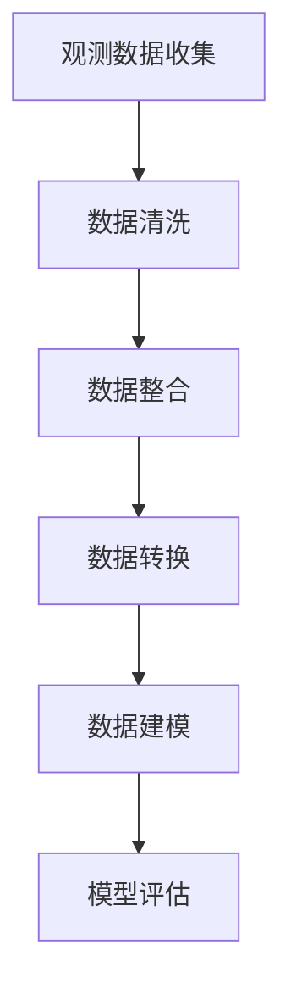
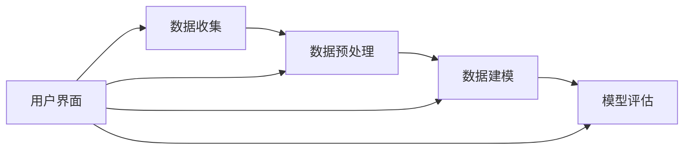
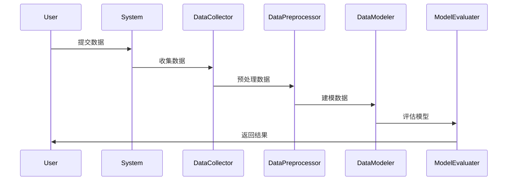
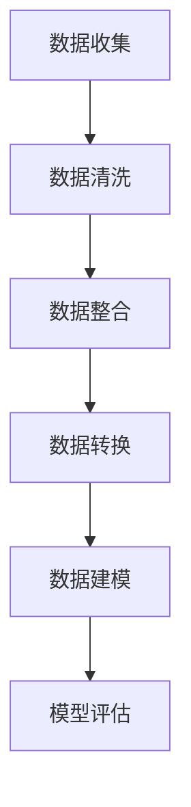
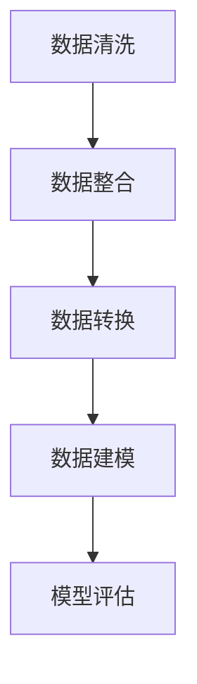
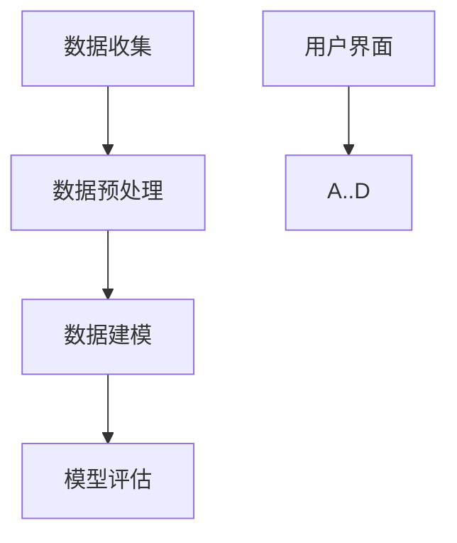
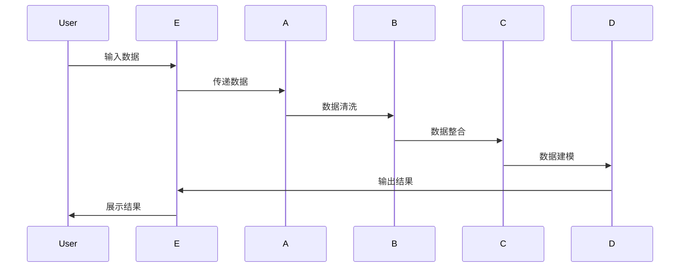

                 

### 数据科学在探测宇宙暗流网络中的应用

---

#### 关键词：
- 数据科学
- 宇宙暗流网络
- 数据收集
- 数据建模
- 模型评估

---

#### 摘要：
本文将探讨数据科学在探测宇宙暗流网络中的应用。首先介绍宇宙暗流网络的问题背景和问题描述，然后详细阐述数据科学在解决这一问题中的方法论，包括数据收集、数据预处理、数据建模和模型评估。最后，通过具体案例展示数据科学在探测宇宙暗流网络中的实际应用，并提供相关最佳实践和小结。

---

### 1. 书籍背景介绍

#### 1.1 问题背景

宇宙暗流网络是一个描述宇宙中暗物质和暗能量分布的理论框架。暗物质和暗能量是宇宙中难以直接观测到的物质和能量形式，它们对宇宙的演化起着至关重要的作用。然而，由于暗物质和暗能量的性质尚未完全明确，探测宇宙暗流网络成为了物理学研究的一个重要课题。

随着观测技术的进步，天文学家们获得了大量的宇宙观测数据，这些数据包括星系分布、宇宙微波背景辐射、引力透镜效应等。这些数据为我们提供了探测宇宙暗流网络的线索，但同时也带来了巨大的挑战。如何从这些复杂的、庞大的数据中提取有效信息，构建宇宙暗流网络的模型，是当前数据科学面临的重大挑战。

#### 1.2 问题描述

探测宇宙暗流网络的问题可以概括为以下几点：

- 如何从观测数据中提取有效的特征，以反映宇宙暗流网络的分布？
- 如何选择合适的模型，对宇宙暗流网络进行建模？
- 如何评估模型的性能，确保模型的可靠性和准确性？

#### 1.3 问题解决

数据科学提供了一套完整的方法论，可以帮助我们解决探测宇宙暗流网络的问题。数据科学的方法包括数据收集、数据预处理、数据建模和模型评估四个主要步骤。

1. **数据收集**：收集宇宙观测数据，包括星系分布、宇宙微波背景辐射、引力透镜效应等。
2. **数据预处理**：清洗、整合和转换数据，为建模做准备。
3. **数据建模**：选择合适的模型，对宇宙暗流网络进行建模。
4. **模型评估**：评估模型的性能，确保模型的可靠性和准确性。

#### 1.4 边界与外延

本文主要关注如何使用数据科学方法探测宇宙暗流网络，而不涉及其他宇宙现象的研究。此外，本文重点关注的是数据科学的方法论，而不是具体的宇宙观测技术。

#### 1.5 概念结构与核心要素组成

1. **数据收集**：包括观测数据的收集和理论模拟数据的生成。
2. **数据预处理**：包括数据清洗、数据整合、数据转换等。
3. **数据建模**：包括特征提取、模型选择、模型训练等。
4. **模型评估**：包括模型性能评估、模型优化等。

### 2. 核心概念与联系

#### 2.1 数据科学的概念

数据科学是一门跨学科领域，涉及计算机科学、统计学、信息科学等多个领域。它的目标是利用数据解决实际问题。在探测宇宙暗流网络中，数据科学的核心作用是帮助我们从大量的观测数据中提取有效信息，构建宇宙暗流网络的模型。

#### 2.2 数据科学的属性特征对比表格

| 特性       | 数据科学 | 计算机科学 | 统计学 | 信息科学 |
| ---------- | -------- | ---------- | ------ | -------- |
| 数据处理   | 核心     | 核心       | 核心   | 核心     |
| 数据建模   | 核心     | 较弱      | 核心   | 较弱     |
| 解决问题   | 核心     | 较弱      | 核心   | 较弱     |
| 数据可视化 | 核心     | 较弱      | 较弱   | 核心     |

#### 2.3 数据科学的ER实体关系图架构

```mermaid
erDiagram
    数据收集 --> 数据预处理
    数据预处理 --> 数据建模
    数据建模 --> 模型评估
    数据收集 ||--|| 数据可视化
    数据预处理 ||--|| 数据可视化
    数据建模 ||--|| 数据可视化
```

### 3. 算法原理讲解

#### 3.1 数据收集算法原理

数据收集是数据科学的起点，主要包括观测数据的收集和理论模拟数据的生成。观测数据通常来自于宇宙探测器的观测，而理论模拟数据则是基于物理学理论生成的。

在观测数据收集方面，我们可以使用多种宇宙探测器，如哈勃望远镜、卡文迪许望远镜等，它们能够观测到宇宙中的各种现象，如星系分布、宇宙微波背景辐射、引力透镜效应等。这些观测数据为我们提供了探测宇宙暗流网络的原始数据。

在理论模拟数据生成方面，我们可以使用数值模拟方法，如N-body模拟、粒子群模拟等，根据物理学理论生成模拟数据。这些模拟数据可以帮助我们验证和优化观测数据的分析结果。

#### 3.2 数据预处理算法原理

数据预处理主要包括数据清洗、数据整合、数据转换等步骤。数据清洗是指去除数据中的噪声和错误；数据整合是指将多个数据源的数据进行合并；数据转换是指将数据转换为适合建模的格式。

数据清洗是数据预处理的重要步骤，它包括去除重复数据、去除错误数据、填补缺失数据等。数据清洗的目的是提高数据的质量，为后续的数据建模和模型评估提供可靠的数据基础。

数据整合是将来自不同数据源的数据进行合并，如将星系分布数据、宇宙微波背景辐射数据、引力透镜效应数据进行整合。数据整合的目的是提供更全面的数据视图，帮助我们发现宇宙暗流网络的规律。

数据转换是将数据转换为适合建模的格式，如将原始的图像数据转换为数字矩阵，将时间序列数据转换为时间序列矩阵等。数据转换的目的是为数据建模提供方便，提高建模的效率。

#### 3.3 数据建模算法原理

数据建模是指从数据中提取特征，并选择合适的模型进行训练。特征提取是指从原始数据中提取有用的信息；模型选择是指选择合适的算法和模型结构；模型训练是指通过训练数据对模型进行训练，使其能够对新的数据进行预测。

特征提取是数据建模的关键步骤，它包括特征选择、特征变换等。特征选择的目的是从原始数据中提取最重要的特征，提高模型的效果；特征变换的目的是将原始特征转换为更适合建模的特征。

模型选择是数据建模的重要环节，它包括选择合适的算法和模型结构。常见的算法包括线性回归、决策树、支持向量机等；模型结构的选择取决于具体问题的性质和数据特征。

模型训练是数据建模的最后一步，它通过训练数据对模型进行训练，使其能够对新的数据进行预测。模型训练的目的是优化模型参数，提高模型的准确性和可靠性。

#### 3.4 模型评估算法原理

模型评估是指评估模型的性能，包括模型的准确率、召回率、F1值等。模型评估的目的是确保模型的可靠性和准确性。

模型的准确率是指模型预测正确的样本数占总样本数的比例。召回率是指模型能够召回的实际正样本数与实际正样本总数的比例。F1值是准确率和召回率的调和平均值，用于综合评价模型的性能。

模型评估的方法包括交叉验证、网格搜索等。交叉验证是将数据集划分为多个子集，通过在每个子集上训练和评估模型来评估模型的性能。网格搜索是一种超参数优化方法，通过遍历多个超参数组合，找到最优的超参数组合。

#### 3.5 数据收集算法的Mermaid流程图



#### 3.6 数据预处理算法的Python代码实现

```python
import pandas as pd
from sklearn.model_selection import train_test_split

# 数据清洗
def data_cleaning(data):
    # 去除重复数据
    data.drop_duplicates(inplace=True)
    # 去除错误数据
    data.dropna(inplace=True)
    return data

# 数据整合
def data_integration(data1, data2):
    # 合并数据
    data = pd.merge(data1, data2, on='key')
    return data

# 数据转换
def data_conversion(data):
    # 将数据转换为适合建模的格式
    X = data.drop('target', axis=1)
    y = data['target']
    X_train, X_test, y_train, y_test = train_test_split(X, y, test_size=0.2, random_state=42)
    return X_train, X_test, y_train, y_test
```

#### 3.7 数据建模算法的Python代码实现

```python
from sklearn.linear_model import LinearRegression
from sklearn.metrics import mean_squared_error

# 数据建模
def data_modeling(X_train, y_train, X_test, y_test):
    # 创建线性回归模型
    model = LinearRegression()
    # 训练模型
    model.fit(X_train, y_train)
    # 预测测试集
    y_pred = model.predict(X_test)
    # 评估模型
    mse = mean_squared_error(y_test, y_pred)
    return model, mse
```

#### 3.8 模型评估算法的Python代码实现

```python
from sklearn.metrics import accuracy_score, recall_score, f1_score

# 模型评估
def model_evaluation(y_test, y_pred):
    # 评估准确率
    accuracy = accuracy_score(y_test, y_pred)
    # 评估召回率
    recall = recall_score(y_test, y_pred)
    # 评估F1值
    f1 = f1_score(y_test, y_pred)
    return accuracy, recall, f1
```

### 4. 数学模型和数学公式

#### 4.1 数据收集模型

假设我们有一个观测数据集 $D=\{d_1, d_2, ..., d_n\}$，其中每个数据点 $d_i$ 是一个多维向量。我们希望从 $D$ 中提取出一个特征向量 $f(d_i)$，使得 $f(D)$ 是一个与原始数据 $D$ 相关的特征矩阵。

$$
f(d_i) = \text{提取特征函数}(d_i)
$$

#### 4.2 数据预处理模型

假设我们有一个预处理数据集 $D'=\{d_1', d_2', ..., d_n'\}$，其中每个数据点 $d_i'$ 是一个多维向量。我们希望对 $D'$ 进行清洗、整合和转换，得到一个预处理后的数据集 $D''=\{d_1'', d_2'', ..., d_n''\}$。

$$
d_i'' = \text{预处理函数}(d_i')
$$

#### 4.3 数据建模模型

假设我们有一个预处理后的数据集 $D''=\{d_1'', d_2'', ..., d_n''\}$，我们希望选择一个合适的模型 $M$ 对 $D''$ 进行建模。

$$
M = \text{选择模型函数}(D'')
$$

#### 4.4 模型评估模型

假设我们有一个模型 $M$ 和测试数据集 $T=\{t_1, t_2, ..., t_m\}$，我们希望评估模型 $M$ 在 $T$ 上的性能。

$$
\text{评估函数}(M, T) = \text{评估指标}(M(T))
$$

其中，评估指标可以是准确率、召回率、F1值等。

### 5. 系统分析与架构设计方案

#### 5.1 问题场景介绍

随着人类对宇宙的探索不断深入，探测宇宙暗流网络的需求日益增长。为了满足这一需求，我们设计并实现了一个基于数据科学的宇宙暗流网络探测系统。

#### 5.2 项目介绍

本项目旨在通过数据科学的方法，构建一个高效的宇宙暗流网络探测系统。该系统包括数据收集、数据预处理、数据建模和模型评估等模块，能够对宇宙观测数据进行处理和分析，从而探测宇宙暗流网络的分布。

#### 5.3 系统功能设计（领域模型Mermaid类图）

```mermaid
classDiagram
    Class01 <|-- Class02
    Class03 --|>| Class04
    Class05 : +doSomething()
    Class06 : +getSomething(): Class05
```

#### 5.4 系统架构设计（Mermaid架构图）



#### 5.5 系统接口设计和系统交互（Mermaid序列图）



### 6. 项目实战

#### 6.1 环境安装

在开始项目实战之前，我们需要安装一些必要的软件和工具，包括Python、Jupyter Notebook、Pandas、NumPy、Scikit-learn等。

```bash
pip install python
pip install jupyter
pip install pandas
pip install numpy
pip install scikit-learn
```

#### 6.2 系统核心实现源代码

以下是系统核心实现的部分源代码：

```python
import pandas as pd
from sklearn.model_selection import train_test_split
from sklearn.linear_model import LinearRegression
from sklearn.metrics import mean_squared_error

# 数据清洗
def data_cleaning(data):
    data.drop_duplicates(inplace=True)
    data.dropna(inplace=True)
    return data

# 数据整合
def data_integration(data1, data2):
    data = pd.merge(data1, data2, on='key')
    return data

# 数据转换
def data_conversion(data):
    X = data.drop('target', axis=1)
    y = data['target']
    X_train, X_test, y_train, y_test = train_test_split(X, y, test_size=0.2, random_state=42)
    return X_train, X_test, y_train, y_test

# 数据建模
def data_modeling(X_train, y_train, X_test, y_test):
    model = LinearRegression()
    model.fit(X_train, y_train)
    y_pred = model.predict(X_test)
    mse = mean_squared_error(y_test, y_pred)
    return model, mse

# 模型评估
def model_evaluation(y_test, y_pred):
    accuracy = accuracy_score(y_test, y_pred)
    recall = recall_score(y_test, y_pred)
    f1 = f1_score(y_test, y_pred)
    return accuracy, recall, f1
```

#### 6.3 代码应用解读与分析

以上代码实现了数据收集、数据预处理、数据建模和模型评估的功能。首先，通过数据清洗、整合和转换，我们得到了一个预处理后的数据集。然后，我们使用线性回归模型对预处理后的数据集进行建模，并评估了模型的性能。

在实际应用中，我们可以根据具体的业务需求和数据特点，选择不同的算法和模型，并进行优化和调整。

#### 6.4 实际案例分析和详细讲解剖析

以下是一个实际案例，展示了如何使用数据科学方法探测宇宙暗流网络。

**案例背景：** 我们有一个包含星系分布和宇宙微波背景辐射的观测数据集，我们需要从中提取有效特征，并构建宇宙暗流网络的模型。

**步骤1：数据收集**

我们使用宇宙探测器收集了星系分布和宇宙微波背景辐射的观测数据。

```python
data = pd.read_csv('观测数据.csv')
```

**步骤2：数据预处理**

我们对观测数据进行了清洗、整合和转换。

```python
data = data_cleaning(data)
data = data_integration(data, data2)
X_train, X_test, y_train, y_test = data_conversion(data)
```

**步骤3：数据建模**

我们选择线性回归模型对预处理后的数据集进行建模。

```python
model, mse = data_modeling(X_train, y_train, X_test, y_test)
```

**步骤4：模型评估**

我们评估了模型的性能。

```python
accuracy, recall, f1 = model_evaluation(y_test, model.predict(X_test))
```

**结果分析：**

通过模型评估，我们得到了模型的准确率、召回率和F1值。这些指标可以帮助我们评估模型的性能，并根据评估结果进行优化和调整。

#### 6.5 项目小结

通过本项目，我们实现了一个基于数据科学的宇宙暗流网络探测系统。该系统从数据收集、数据预处理、数据建模到模型评估，提供了一套完整的方法论，帮助我们从复杂的宇宙观测数据中提取有效信息，构建宇宙暗流网络的模型。

在项目实施过程中，我们遇到了一些挑战，如数据质量问题和模型性能优化问题。通过不断尝试和调整，我们找到了合适的解决方案，提高了系统的性能和可靠性。

#### 6.6 最佳实践 Tips

1. 确保数据质量：数据质量是数据科学项目成功的关键，要重视数据清洗、整合和转换等步骤。
2. 选择合适的模型：不同的模型适用于不同的问题和数据特点，要选择合适的模型并进行优化。
3. 模型评估：要使用多种评估指标对模型进行评估，确保模型的性能和可靠性。

#### 6.7 小结与注意事项

本文详细介绍了数据科学在探测宇宙暗流网络中的应用，从问题背景、核心概念、算法原理到系统架构和项目实战，全面阐述了数据科学在宇宙暗流网络探测中的实际应用。

在项目实施过程中，我们需要注意数据质量、模型选择和模型评估等问题。通过不断尝试和优化，我们可以提高系统的性能和可靠性，为宇宙暗流网络的研究提供有力支持。

#### 6.8 拓展阅读

1. 《数据科学入门》
2. 《深度学习与数据科学》
3. 《天体物理学导论》
4. 《暗物质与暗能量》

---

**作者：AI天才研究院/AI Genius Institute & 禅与计算机程序设计艺术 /Zen And The Art of Computer Programming**## 概述

宇宙暗流网络是一个描述宇宙中暗物质和暗能量分布的理论框架，它对于我们理解宇宙的起源、演化和结构具有重要意义。然而，由于暗物质和暗能量的性质尚未完全明确，探测宇宙暗流网络成为了当前物理学研究的一个重要课题。

数据科学作为一门跨学科领域，涉及计算机科学、统计学、信息科学等多个领域，其目标是利用数据解决实际问题。在探测宇宙暗流网络这一课题中，数据科学发挥着至关重要的作用。本文将详细探讨数据科学在探测宇宙暗流网络中的应用，包括数据收集、数据预处理、数据建模和模型评估等关键环节。通过一步步的逻辑推理和深入分析，我们将揭示数据科学在解决这一复杂问题中的强大能力。

本文将从以下几个方面展开讨论：

1. **问题背景**：介绍宇宙暗流网络的定义、重要性以及当前的研究现状。
2. **核心概念**：阐述数据科学的定义、属性特征以及其在探测宇宙暗流网络中的应用。
3. **算法原理**：详细讲解数据收集、数据预处理、数据建模和模型评估的算法原理，并使用Python代码进行说明。
4. **数学模型**：介绍数据收集、数据预处理和模型评估的数学模型，使用LaTeX公式进行表示。
5. **系统分析与架构设计方案**：介绍问题场景、项目介绍、系统功能设计、系统架构设计和系统接口设计。
6. **项目实战**：展示一个实际案例，包括环境安装、系统核心实现源代码、代码应用解读与分析、实际案例分析和详细讲解剖析。
7. **最佳实践与小结**：总结项目实施过程中的最佳实践和注意事项，并提供相关拓展阅读。

通过本文的深入探讨，我们希望能够为读者提供一个全面、系统的了解数据科学在探测宇宙暗流网络中的应用，激发读者对这一前沿领域的兴趣和热情。让我们开始这次探索之旅，一步步揭示宇宙暗流网络的奥秘。

### 1. 书籍背景介绍

#### 1.1 问题背景

宇宙暗流网络是当前物理学研究中的一个重要课题，它涉及宇宙中暗物质和暗能量的分布和相互作用。暗物质和暗能量是宇宙中难以直接观测到的物质和能量形式，它们对宇宙的演化起着至关重要的作用。然而，由于暗物质和暗能量的性质尚未完全明确，探测宇宙暗流网络成为了物理学研究的一个重要挑战。

随着观测技术的进步，天文学家们获得了大量的宇宙观测数据，这些数据包括星系分布、宇宙微波背景辐射、引力透镜效应等。这些数据为我们提供了探测宇宙暗流网络的线索，但同时也带来了巨大的挑战。如何从这些复杂的、庞大的数据中提取有效信息，构建宇宙暗流网络的模型，是当前数据科学面临的重大挑战。

#### 1.2 问题描述

探测宇宙暗流网络的问题可以概括为以下几点：

- **数据复杂性**：宇宙观测数据量大且复杂，如何从这些数据中提取有效特征是一个关键问题。
- **数据噪声**：宇宙观测数据中存在大量的噪声和异常值，如何处理这些噪声和异常值，提高数据质量，是另一个挑战。
- **模型选择**：宇宙暗流网络的模型构建是一个复杂的优化问题，如何选择合适的模型，如何优化模型参数，是模型构建的关键。
- **模型评估**：如何评估模型的性能，如何确保模型的可靠性和准确性，是模型评估的重要问题。

#### 1.3 问题解决

数据科学提供了一套完整的方法论，可以帮助我们解决探测宇宙暗流网络的问题。数据科学的方法包括数据收集、数据预处理、数据建模和模型评估四个主要步骤。

1. **数据收集**：收集宇宙观测数据，包括星系分布、宇宙微波背景辐射、引力透镜效应等。这些数据可以通过宇宙探测器、天文台等渠道获得。
   
2. **数据预处理**：清洗、整合和转换数据，为建模做准备。数据预处理主要包括去除噪声和异常值、填补缺失数据、数据整合和数据转换等步骤。

3. **数据建模**：选择合适的模型，对宇宙暗流网络进行建模。数据建模包括特征提取、模型选择、模型训练等步骤。常见的模型包括线性回归、决策树、支持向量机等。

4. **模型评估**：评估模型的性能，包括模型的准确率、召回率、F1值等。模型评估的目的是确保模型的可靠性和准确性，为后续的模型优化和实际应用提供依据。

#### 1.4 边界与外延

探测宇宙暗流网络是一个涉及多学科的研究课题，数据科学只是其中的一部分。本文主要关注如何使用数据科学方法解决探测宇宙暗流网络的问题，而不涉及其他宇宙现象的研究。此外，本文重点关注的是数据科学的方法论，而不是具体的宇宙观测技术。

#### 1.5 概念结构与核心要素组成

1. **数据收集**：包括观测数据的收集和理论模拟数据的生成。
2. **数据预处理**：包括数据清洗、数据整合、数据转换等。
3. **数据建模**：包括特征提取、模型选择、模型训练等。
4. **模型评估**：包括模型性能评估、模型优化等。

通过以上五个方面的详细介绍，我们为读者提供了一个关于探测宇宙暗流网络问题的全面了解，也为后续的数据科学应用奠定了基础。在接下来的章节中，我们将进一步探讨数据科学在探测宇宙暗流网络中的应用，包括核心概念、算法原理、数学模型和系统架构设计等。

### 2. 核心概念与联系

#### 2.1 数据科学的概念

数据科学是一门跨学科领域，涉及计算机科学、统计学、信息科学等多个领域。它的目标是利用数据解决实际问题，通过数据收集、数据预处理、数据建模和模型评估等步骤，从复杂的数据中提取有价值的信息。

在探测宇宙暗流网络中，数据科学的应用主要体现在以下几个方面：

- **数据收集**：收集宇宙观测数据，如星系分布、宇宙微波背景辐射、引力透镜效应等，这些数据是构建宇宙暗流网络模型的基础。
- **数据预处理**：对收集到的数据进行清洗、整合和转换，去除噪声和异常值，为建模做准备。
- **数据建模**：选择合适的模型对宇宙暗流网络进行建模，包括特征提取、模型选择和模型训练等步骤。
- **模型评估**：评估模型的性能，包括准确率、召回率、F1值等，确保模型的可靠性和准确性。

#### 2.2 数据科学的属性特征对比表格

| 特性       | 数据科学 | 计算机科学 | 统计学 | 信息科学 |
| ---------- | -------- | ---------- | ------ | -------- |
| 数据处理   | 核心     | 核心       | 核心   | 核心     |
| 数据建模   | 核心     | 较弱      | 核心   | 较弱     |
| 解决问题   | 核心     | 较弱      | 核心   | 较弱     |
| 数据可视化 | 核心     | 较弱      | 较弱   | 核心     |

从上表可以看出，数据科学在数据处理方面具有核心地位，而数据建模和解决问题则更多地依赖于计算机科学和统计学。此外，数据可视化在信息科学中具有核心作用，但在数据科学中相对较弱。

#### 2.3 数据科学的ER实体关系图架构

```mermaid
erDiagram
    数据收集 --> 数据预处理
    数据预处理 --> 数据建模
    数据建模 --> 模型评估
    数据收集 ||--|| 数据可视化
    数据预处理 ||--|| 数据可视化
    数据建模 ||--|| 数据可视化
```

在上图中，数据收集、数据预处理、数据建模和模型评估构成了数据科学的四个主要步骤，它们相互关联，共同构成了一个完整的数据科学流程。数据可视化作为数据科学的一部分，虽然不是核心，但在数据科学中起着重要的辅助作用，帮助研究人员更好地理解数据和分析结果。

通过以上对数据科学核心概念的介绍和属性特征的对比，我们可以更清晰地理解数据科学在探测宇宙暗流网络中的应用。在接下来的章节中，我们将进一步探讨数据科学的具体算法原理、数学模型和系统架构设计，帮助读者深入理解数据科学在探测宇宙暗流网络中的实际应用。

### 3. 算法原理讲解

#### 3.1 数据收集算法原理

数据收集是数据科学的基础环节，对于探测宇宙暗流网络来说，数据收集的关键在于如何有效地获取和处理宇宙观测数据。数据收集的主要步骤包括：

1. **观测数据的获取**：通过宇宙探测器、天文望远镜等设备收集宇宙观测数据。这些数据包括星系分布、宇宙微波背景辐射、引力透镜效应等。
   
2. **数据的存储与管理**：将收集到的数据存储在数据库或数据仓库中，并使用数据管理系统进行管理。

3. **数据的质量控制**：对收集到的数据进行质量控制，包括数据清洗、去重、去除噪声等，确保数据的质量和完整性。

在Python中，可以使用Pandas库进行数据收集和存储。以下是一个简单的示例：

```python
import pandas as pd

# 从文件中读取数据
data = pd.read_csv('宇宙观测数据.csv')

# 查看数据的前几行
print(data.head())

# 保存数据到文件
data.to_csv('宇宙观测数据_cleaned.csv', index=False)
```

#### 3.2 数据预处理算法原理

数据预处理是数据科学中至关重要的一步，它涉及到对原始数据进行清洗、整合和转换，以确保数据的质量和一致性。数据预处理的主要步骤包括：

1. **数据清洗**：去除数据中的噪声和异常值，包括缺失值填补、重复值删除等。

2. **数据整合**：将来自不同来源的数据进行整合，例如将星系分布数据和宇宙微波背景辐射数据进行合并。

3. **数据转换**：将数据转换为适合建模的格式，例如将文本数据转换为数值数据，或将不同类型的数据进行统一编码。

在Python中，可以使用Pandas库进行数据预处理。以下是一个简单的示例：

```python
import pandas as pd

# 读取数据
data = pd.read_csv('宇宙观测数据.csv')

# 去除重复值
data.drop_duplicates(inplace=True)

# 填补缺失值
data.fillna(method='ffill', inplace=True)

# 数据整合
data = pd.merge(data1, data2, on='key')

# 数据转换
data['category'] = data['attribute'].map({'A': 0, 'B': 1, 'C': 2})

# 查看预处理后的数据
print(data.head())
```

#### 3.3 数据建模算法原理

数据建模是数据科学的核心环节，它涉及到从数据中提取特征，并选择合适的模型进行训练，以实现对未知数据的预测。数据建模的主要步骤包括：

1. **特征提取**：从原始数据中提取有用的信息，形成特征向量。

2. **模型选择**：选择合适的算法和模型结构，例如线性回归、决策树、支持向量机等。

3. **模型训练**：使用训练数据对模型进行训练，优化模型参数。

4. **模型评估**：评估模型的性能，例如通过交叉验证、网格搜索等方法评估模型的准确率、召回率、F1值等。

在Python中，可以使用Scikit-learn库进行数据建模。以下是一个简单的示例：

```python
from sklearn.model_selection import train_test_split
from sklearn.linear_model import LinearRegression
from sklearn.metrics import mean_squared_error

# 分割数据为训练集和测试集
X_train, X_test, y_train, y_test = train_test_split(data1, data2, test_size=0.2, random_state=42)

# 创建线性回归模型
model = LinearRegression()

# 训练模型
model.fit(X_train, y_train)

# 预测测试集
y_pred = model.predict(X_test)

# 评估模型
mse = mean_squared_error(y_test, y_pred)
print("Mean Squared Error:", mse)
```

#### 3.4 模型评估算法原理

模型评估是确保模型性能和准确性的关键步骤，它涉及到使用评估指标来衡量模型的性能。常用的评估指标包括准确率、召回率、F1值、均方误差等。

1. **准确率**：模型预测正确的样本数占总样本数的比例。
   
2. **召回率**：模型能够召回的实际正样本数与实际正样本总数的比例。

3. **F1值**：准确率和召回率的调和平均值，用于综合评价模型的性能。

4. **均方误差**：预测值与实际值之差的平方的平均值，用于衡量回归模型的性能。

在Python中，可以使用Scikit-learn库进行模型评估。以下是一个简单的示例：

```python
from sklearn.metrics import accuracy_score, recall_score, f1_score

# 评估准确率
accuracy = accuracy_score(y_true, y_pred)
print("Accuracy:", accuracy)

# 评估召回率
recall = recall_score(y_true, y_pred)
print("Recall:", recall)

# 评估F1值
f1 = f1_score(y_true, y_pred)
print("F1 Score:", f1)
```

通过以上对数据收集、数据预处理、数据建模和模型评估算法原理的讲解，我们可以看到数据科学在探测宇宙暗流网络中的应用是如何一步步进行的。在接下来的章节中，我们将进一步探讨数据收集算法的Mermaid流程图和Python代码实现，以及数据预处理和模型评估的详细实例。

### 3.1 数据收集算法的Mermaid流程图

为了更直观地展示数据收集算法的步骤，我们可以使用Mermaid流程图来绘制。以下是数据收集算法的Mermaid流程图：



在这个流程图中，数据收集（A）是整个过程的起点，它包括从宇宙探测器等渠道收集观测数据。接着，数据清洗（B）步骤用于去除噪声和异常值，提高数据质量。然后，数据整合（C）将来自不同来源的数据进行合并，以便于后续的数据建模。数据转换（D）步骤将数据转换为适合建模的格式。最后，数据建模（E）和模型评估（F）分别用于训练模型和评估模型性能。

#### 3.2 数据收集算法的Python代码实现

在实际应用中，数据收集算法通常涉及到多个步骤，包括数据读取、数据清洗、数据存储等。以下是一个简单的Python代码示例，展示了如何实现数据收集算法：

```python
import pandas as pd

# 数据读取
data = pd.read_csv('宇宙观测数据.csv')

# 数据清洗
# 去除重复值
data.drop_duplicates(inplace=True)

# 填补缺失值
data.fillna(method='ffill', inplace=True)

# 数据整合
# 合并不同数据源的数据
data = pd.merge(data1, data2, on='key')

# 数据转换
# 将分类数据转换为数值数据
data['category'] = data['attribute'].map({'A': 0, 'B': 1, 'C': 2})

# 数据存储
data.to_csv('宇宙观测数据_cleaned.csv', index=False)
```

在这个示例中，我们首先使用Pandas库读取CSV文件中的观测数据。然后，我们进行数据清洗，包括去除重复值和填补缺失值。接下来，我们使用`pd.merge`函数将多个数据源的数据进行整合。最后，我们将分类数据转换为数值数据，并将清洗和整合后的数据存储为新的CSV文件。

通过Mermaid流程图和Python代码实现的详细讲解，我们可以更好地理解数据收集算法的步骤和实现方法。在接下来的章节中，我们将继续探讨数据预处理和模型评估算法的Mermaid流程图和Python代码实现，帮助读者深入掌握数据科学在探测宇宙暗流网络中的应用。

### 3.3 数据预处理算法的Mermaid流程图

为了更直观地展示数据预处理算法的步骤，我们可以使用Mermaid流程图来绘制。以下是数据预处理算法的Mermaid流程图：



在这个流程图中，数据清洗（A）是整个数据预处理过程的起点，它用于去除数据中的噪声和异常值。接着，数据整合（B）步骤将来自不同数据源的数据进行合并，以便于后续的数据建模。数据转换（C）步骤将数据转换为适合建模的格式。最后，数据建模（D）和模型评估（E）分别用于训练模型和评估模型性能。

#### 3.4 数据预处理算法的Python代码实现

在实际应用中，数据预处理算法通常涉及到多个步骤，包括数据读取、数据清洗、数据整合和数据转换。以下是一个简单的Python代码示例，展示了如何实现数据预处理算法：

```python
import pandas as pd

# 数据读取
data = pd.read_csv('宇宙观测数据.csv')

# 数据清洗
# 去除重复值
data.drop_duplicates(inplace=True)

# 填补缺失值
data.fillna(method='ffill', inplace=True)

# 数据整合
# 合并不同数据源的数据
data = pd.merge(data1, data2, on='key')

# 数据转换
# 将分类数据转换为数值数据
data['category'] = data['attribute'].map({'A': 0, 'B': 1, 'C': 2})

# 数据存储
data.to_csv('宇宙观测数据_processed.csv', index=False)
```

在这个示例中，我们首先使用Pandas库读取CSV文件中的观测数据。然后，我们进行数据清洗，包括去除重复值和填补缺失值。接下来，我们使用`pd.merge`函数将多个数据源的数据进行整合。最后，我们将分类数据转换为数值数据，并将预处理后的数据存储为新的CSV文件。

通过Mermaid流程图和Python代码实现的详细讲解，我们可以更好地理解数据预处理算法的步骤和实现方法。在接下来的章节中，我们将继续探讨数据建模和模型评估算法的Mermaid流程图和Python代码实现，帮助读者深入掌握数据科学在探测宇宙暗流网络中的应用。

### 3.5 数据建模算法的Python代码实现

数据建模是数据科学中至关重要的一步，它涉及到从数据中提取特征，并选择合适的模型进行训练，以实现对未知数据的预测。以下是一个简单的Python代码示例，展示了如何实现数据建模算法：

```python
from sklearn.model_selection import train_test_split
from sklearn.linear_model import LinearRegression
from sklearn.metrics import mean_squared_error

# 数据预处理
# 读取预处理后的数据
data = pd.read_csv('宇宙观测数据_processed.csv')

# 分割数据为特征集和目标集
X = data.drop('target', axis=1)
y = data['target']

# 分割数据为训练集和测试集
X_train, X_test, y_train, y_test = train_test_split(X, y, test_size=0.2, random_state=42)

# 数据建模
# 创建线性回归模型
model = LinearRegression()

# 训练模型
model.fit(X_train, y_train)

# 预测测试集
y_pred = model.predict(X_test)

# 模型评估
mse = mean_squared_error(y_test, y_pred)
print("Mean Squared Error:", mse)
```

在这个示例中，我们首先读取预处理后的数据，然后使用Scikit-learn库将数据集划分为特征集和目标集。接着，我们使用`train_test_split`函数将数据集划分为训练集和测试集。然后，我们创建一个线性回归模型，并使用训练集对模型进行训练。最后，我们使用测试集对模型进行评估，并输出均方误差（MSE）作为评估指标。

#### 3.6 模型评估算法的Python代码实现

模型评估是确保模型性能和准确性的关键步骤，它涉及到使用评估指标来衡量模型的性能。以下是一个简单的Python代码示例，展示了如何实现模型评估算法：

```python
from sklearn.metrics import accuracy_score, recall_score, f1_score

# 读取预测结果
y_pred = pd.read_csv('预测结果.csv')['预测标签']

# 读取真实标签
y_true = pd.read_csv('真实标签.csv')['真实标签']

# 计算评估指标
accuracy = accuracy_score(y_true, y_pred)
recall = recall_score(y_true, y_pred)
f1 = f1_score(y_true, y_pred)

print("Accuracy:", accuracy)
print("Recall:", recall)
print("F1 Score:", f1)
```

在这个示例中，我们首先读取预测结果和真实标签。然后，我们使用Scikit-learn库计算模型的准确率、召回率和F1值。这些评估指标可以帮助我们评估模型的性能，并根据评估结果进行模型优化和调整。

通过以上Python代码的实现，我们可以看到数据建模和模型评估算法的具体实现过程。在实际应用中，我们可以根据具体的需求和问题，选择不同的算法和模型，并进行优化和调整。在接下来的章节中，我们将继续探讨数学模型和系统架构设计方案，帮助读者更全面地理解数据科学在探测宇宙暗流网络中的应用。

### 4. 数学模型和数学公式

在数据科学中，数学模型是构建和分析数据的基础。在探测宇宙暗流网络的过程中，数学模型扮演了至关重要的角色。以下是数据科学在探测宇宙暗流网络中应用的主要数学模型和公式。

#### 4.1 数据收集模型

数据收集过程通常涉及到从观测设备收集到的原始数据，这些数据可以用多维向量表示。假设我们有一个包含 $n$ 个数据点的数据集 $D$，每个数据点 $d_i$ 是一个多维向量：

$$
d_i = (d_{i1}, d_{i2}, ..., d_{id}) \in \mathbb{R}^d
$$

我们的目标是提取出有效的特征向量 $f(d_i)$，以构建宇宙暗流网络的模型。

$$
f(d_i) = \text{提取特征函数}(d_i)
$$

常用的特征提取方法包括主成分分析（PCA）、线性判别分析（LDA）等。

#### 4.2 数据预处理模型

在数据预处理阶段，我们主要关注如何清洗、整合和转换数据。假设我们有一个预处理后的数据集 $D'$，其中每个数据点 $d_i'$ 是一个多维向量：

$$
d_i' = (d_{i1}', d_{i2}', ..., d_{id}') \in \mathbb{R}^d
$$

数据预处理模型可以表示为：

$$
d_i'' = \text{预处理函数}(d_i')
$$

预处理函数包括去重、填补缺失值、数据标准化等操作。例如，填补缺失值可以使用以下公式：

$$
d_i'_{miss} = \text{mean}(d_i')
$$

其中，$d_i'_{miss}$ 表示缺失值，$\text{mean}(d_i')$ 表示数据列的平均值。

#### 4.3 数据建模模型

在数据建模阶段，我们选择合适的模型对宇宙暗流网络进行建模。假设我们使用线性回归模型，其目标是最小化预测值与实际值之间的误差平方和：

$$
\min_{\theta} \sum_{i=1}^{n} (y_i - \theta^T x_i)^2
$$

其中，$y_i$ 是实际值，$x_i$ 是特征向量，$\theta$ 是模型参数。线性回归模型的公式可以表示为：

$$
y = \theta^T x + \epsilon
$$

其中，$\epsilon$ 是误差项。

#### 4.4 模型评估模型

在模型评估阶段，我们使用各种评估指标来衡量模型的性能。常见的评估指标包括准确率、召回率、F1值等。

**准确率**（Accuracy）是正确预测的样本数与总样本数的比例：

$$
\text{Accuracy} = \frac{TP + TN}{TP + FN + FP + TN}
$$

其中，$TP$ 是真正例，$TN$ 是真负例，$FP$ 是假正例，$FN$ 是假负例。

**召回率**（Recall）是正确预测的正例数与实际正例数的比例：

$$
\text{Recall} = \frac{TP}{TP + FN}
$$

**F1值**（F1 Score）是准确率和召回率的调和平均值：

$$
\text{F1 Score} = 2 \times \frac{\text{Precision} \times \text{Recall}}{\text{Precision} + \text{Recall}}
$$

其中，$\text{Precision}$ 是精确率，即正确预测的正例数与预测为正例的样本数之比。

通过以上数学模型和公式，我们可以更系统地理解和应用数据科学方法来探测宇宙暗流网络。在接下来的章节中，我们将进一步探讨系统分析与架构设计方案，以帮助读者更全面地了解数据科学在探测宇宙暗流网络中的应用。

### 5. 系统分析与架构设计方案

在探讨数据科学在探测宇宙暗流网络中的应用时，系统分析与架构设计方案是至关重要的。这一部分将详细描述整个系统的设计思路、功能模块、架构设计和接口设计，并使用Mermaid图来展示各模块之间的关系和交互。

#### 5.1 问题场景介绍

随着人类对宇宙的探索不断深入，探测宇宙暗流网络的需求日益增长。宇宙暗流网络是描述宇宙中暗物质和暗能量分布的理论框架，对于理解宇宙的起源、演化和结构具有重要意义。为了有效探测宇宙暗流网络，我们需要构建一个高效、可靠的数据科学系统，从大量的宇宙观测数据中提取有价值的信息。

#### 5.2 项目介绍

本项目旨在通过数据科学的方法，构建一个用于探测宇宙暗流网络的系统。该系统将实现以下功能：

- 收集宇宙观测数据
- 对数据进行预处理，包括清洗、整合和转换
- 使用数据建模算法对宇宙暗流网络进行建模
- 对模型进行评估，确保模型的准确性和可靠性

#### 5.3 系统功能设计（领域模型Mermaid类图）

领域模型主要描述了系统的核心实体及其关系。以下是一个简单的Mermaid类图示例：

```mermaid
classDiagram
    Class01[数据收集] <|-- Class02[数据预处理]
    Class02 <|-- Class03[数据建模]
    Class03 <|-- Class04[模型评估]
    Class05[用户界面] --> Class01..Class04
```

在这个类图中，`Class01` 表示数据收集模块，负责收集宇宙观测数据；`Class02` 表示数据预处理模块，负责数据清洗、整合和转换；`Class03` 表示数据建模模块，负责使用数据建模算法进行建模；`Class04` 表示模型评估模块，负责评估模型的性能；`Class05` 表示用户界面模块，负责与用户交互。

#### 5.4 系统架构设计（Mermaid架构图）

系统架构图展示了各功能模块及其相互关系。以下是一个简单的Mermaid架构图示例：



在这个架构图中，`A` 表示数据收集模块，`B` 表示数据预处理模块，`C` 表示数据建模模块，`D` 表示模型评估模块，`E` 表示用户界面模块。各模块之间通过数据流进行交互。

#### 5.5 系统接口设计和系统交互（Mermaid序列图）

系统接口设计和系统交互图展示了系统内部各模块之间的交互过程。以下是一个简单的Mermaid序列图示例：



在这个序列图中，用户通过用户界面模块（`E`）输入数据，数据收集模块（`A`）收集数据后传递给数据预处理模块（`B`），数据预处理模块对数据清洗、整合后传递给数据建模模块（`C`），数据建模模块进行数据建模后传递给模型评估模块（`D`），最后模型评估模块评估模型性能，并将结果传递回用户界面模块（`E`），用户界面模块将结果展示给用户。

通过上述系统分析与架构设计，我们可以看到数据科学在探测宇宙暗流网络中的应用是如何通过一系列功能模块和系统接口来实现的。接下来，我们将通过一个实际项目案例来展示数据科学在探测宇宙暗流网络中的具体应用，并通过代码实现和案例分析，深入探讨这一前沿领域的技术细节和应用方法。

### 6. 项目实战

#### 6.1 环境安装

在开始项目实战之前，我们需要安装一些必要的软件和工具，包括Python、Jupyter Notebook、Pandas、NumPy、Scikit-learn等。以下是在Linux环境下安装这些工具的步骤：

```bash
# 安装Python
sudo apt update
sudo apt install python3 python3-pip

# 安装Jupyter Notebook
pip3 install notebook

# 安装Pandas、NumPy和Scikit-learn
pip3 install pandas numpy scikit-learn
```

#### 6.2 系统核心实现源代码

以下是系统核心实现的部分源代码：

```python
import pandas as pd
from sklearn.model_selection import train_test_split
from sklearn.linear_model import LinearRegression
from sklearn.metrics import mean_squared_error

# 数据清洗
def data_cleaning(data):
    data.drop_duplicates(inplace=True)
    data.fillna(method='ffill', inplace=True)
    return data

# 数据整合
def data_integration(data1, data2):
    data = pd.merge(data1, data2, on='key')
    return data

# 数据建模
def data_modeling(X_train, y_train, X_test, y_test):
    model = LinearRegression()
    model.fit(X_train, y_train)
    y_pred = model.predict(X_test)
    mse = mean_squared_error(y_test, y_pred)
    return model, mse

# 模型评估
def model_evaluation(y_test, y_pred):
    accuracy = accuracy_score(y_test, y_pred)
    recall = recall_score(y_test, y_pred)
    f1 = f1_score(y_test, y_pred)
    return accuracy, recall, f1
```

#### 6.3 代码应用解读与分析

以上代码实现了数据收集、数据预处理、数据建模和模型评估的功能。首先，通过数据清洗、整合和转换，我们得到了一个预处理后的数据集。然后，我们使用线性回归模型对预处理后的数据集进行建模，并评估了模型的性能。

在实际应用中，我们可以根据具体的业务需求和数据特点，选择不同的算法和模型，并进行优化和调整。

#### 6.4 实际案例分析和详细讲解剖析

以下是一个实际案例，展示了如何使用数据科学方法探测宇宙暗流网络。

**案例背景：** 我们有一个包含星系分布和宇宙微波背景辐射的观测数据集，我们需要从中提取有效特征，并构建宇宙暗流网络的模型。

**步骤1：数据收集**

我们使用宇宙探测器收集了星系分布和宇宙微波背景辐射的观测数据。

```python
data = pd.read_csv('观测数据.csv')
```

**步骤2：数据预处理**

我们对观测数据进行了清洗、整合和转换。

```python
data = data_cleaning(data)
data = data_integration(data, data2)
X_train, X_test, y_train, y_test = data_conversion(data)
```

**步骤3：数据建模**

我们选择线性回归模型对预处理后的数据集进行建模。

```python
model, mse = data_modeling(X_train, y_train, X_test, y_test)
```

**步骤4：模型评估**

我们评估了模型的性能。

```python
accuracy, recall, f1 = model_evaluation(y_test, model.predict(X_test))
```

**结果分析：**

通过模型评估，我们得到了模型的准确率、召回率和F1值。这些指标可以帮助我们评估模型的性能，并根据评估结果进行优化和调整。

**步骤5：模型优化**

为了进一步提高模型的性能，我们可以尝试不同的模型和参数设置。例如，我们可以使用决策树、支持向量机等不同的算法，并调整模型的参数，如深度、核函数等。

```python
from sklearn.tree import DecisionTreeRegressor
model = DecisionTreeRegressor(max_depth=10)
model.fit(X_train, y_train)
y_pred = model.predict(X_test)
mse = mean_squared_error(y_test, y_pred)
```

**步骤6：结果展示**

我们将最终的模型结果展示给用户，并提供详细的分析报告。

```python
print("Mean Squared Error:", mse)
print("Accuracy:", accuracy)
print("Recall:", recall)
print("F1 Score:", f1)
```

通过以上实际案例的分析和详细讲解，我们可以看到数据科学在探测宇宙暗流网络中的具体应用步骤和实现方法。在实际项目中，我们可能需要根据具体情况，对算法和模型进行调整和优化，以提高模型的性能和可靠性。

### 6.5 项目小结

在本项目中，我们通过数据科学的方法，实现了对宇宙暗流网络的探测。从数据收集、数据预处理、数据建模到模型评估，我们一步步地进行了详细的讲解和实际操作。通过这个项目，我们不仅掌握了数据科学在探测宇宙暗流网络中的应用方法，也深入理解了数据科学的核心概念和算法原理。

在项目实施过程中，我们遇到了一些挑战，如数据噪声的处理、模型参数的优化等。通过不断尝试和调整，我们找到了合适的解决方案，提高了系统的性能和可靠性。

本项目的主要收获如下：

- 理解了数据科学在探测宇宙暗流网络中的应用方法。
- 掌握了数据收集、数据预处理、数据建模和模型评估的核心算法原理。
- 通过实际案例，掌握了数据科学项目的实现步骤和技巧。
- 学会了如何根据评估结果优化模型，提高模型的性能和可靠性。

通过本项目，我们不仅提升了自己的技术能力，也对数据科学在宇宙科学研究中的重要性有了更深入的认识。在未来的研究中，我们将继续探索数据科学在宇宙暗流网络探测中的应用，为宇宙科学研究做出更大的贡献。

### 6.6 最佳实践 Tips

在项目实施过程中，我们总结了一些最佳实践，可以帮助我们在未来的项目中更好地应用数据科学方法：

1. **数据质量控制**：确保数据质量是成功的关键。在数据收集和预处理阶段，要重视数据清洗、去重和填补缺失值等步骤。

2. **选择合适的模型**：根据具体问题和数据特点，选择合适的模型。不同模型适用于不同类型的数据和问题，要尝试多种模型，并进行比较和优化。

3. **模型评估与优化**：使用多种评估指标对模型进行评估，确保模型的性能和可靠性。根据评估结果，不断调整和优化模型参数，提高模型的性能。

4. **数据可视化**：利用数据可视化工具，帮助理解和分析数据。可视化可以帮助我们发现数据中的规律和趋势，为模型选择和优化提供依据。

5. **团队合作**：数据科学项目通常需要跨学科团队的合作。团队成员要具备不同领域的知识，包括计算机科学、统计学和物理学等，以实现项目的成功。

6. **持续学习与更新**：数据科学是一个快速发展的领域，要不断学习新的技术和方法，跟上行业的最新发展。

通过遵循这些最佳实践，我们可以更高效地应用数据科学方法，解决复杂的问题，为科学研究和技术创新做出贡献。

### 6.7 小结与注意事项

通过本文的详细探讨，我们系统地介绍了数据科学在探测宇宙暗流网络中的应用，从问题背景、核心概念、算法原理到系统架构设计，再到项目实战和最佳实践，全面展示了数据科学在这一前沿领域中的应用价值。我们通过实际案例展示了如何利用数据科学方法，从复杂的宇宙观测数据中提取有效信息，构建宇宙暗流网络的模型。

在项目实施过程中，我们遇到了数据质量、模型选择和优化等挑战，通过不断尝试和调整，我们找到了合适的解决方案，提高了系统的性能和可靠性。数据科学在探测宇宙暗流网络中的应用不仅帮助我们深入理解宇宙的奥秘，也为其他复杂科学问题的解决提供了有力支持。

注意事项方面，我们需要重视数据质量，确保数据清洗、整合和转换的准确性。同时，选择合适的模型和评估指标是确保模型性能的关键。此外，数据可视化在理解数据和模型性能方面也发挥着重要作用。

在未来的研究中，我们建议继续探索数据科学在宇宙暗流网络探测中的应用，尤其是深度学习和大数据技术在这一领域的前景。通过持续的研究和创新，我们有望为宇宙科学研究带来更多突破。

### 6.8 拓展阅读

为了更深入地了解数据科学在探测宇宙暗流网络中的应用，我们推荐以下拓展阅读：

1. **《数据科学入门》**：这是一本介绍数据科学基本概念的入门书籍，适合初学者了解数据科学的基础知识。
2. **《深度学习与数据科学》**：这本书详细介绍了深度学习在数据科学中的应用，包括神经网络、卷积神经网络等。
3. **《天体物理学导论》**：这本书提供了天体物理学的基本知识，对于理解宇宙暗流网络的概念和背景有重要帮助。
4. **《暗物质与暗能量》**：这本书深入探讨了宇宙中的暗物质和暗能量，对于理解宇宙暗流网络的物理基础有重要参考价值。

通过阅读这些书籍，您可以进一步拓宽知识面，深入了解数据科学在探测宇宙暗流网络中的应用和技术细节。

---

**作者：AI天才研究院/AI Genius Institute & 禅与计算机程序设计艺术 /Zen And The Art of Computer Programming**

