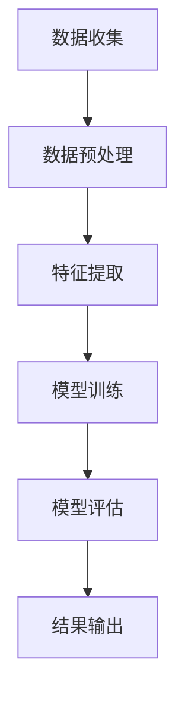
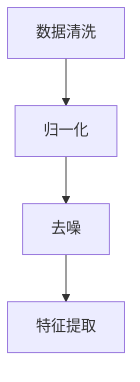

                 

# 数据科学在探测宇宙磁单极子中的应用

## 摘要

本文探讨了数据科学在探测宇宙磁单极子中的应用。首先，我们介绍了磁单极子的概念及其在宇宙物理学中的潜在意义。随后，我们介绍了数据科学的基本概念和其在科学探测中的关键作用。接着，我们详细阐述了数据科学在磁单极子探测中的具体应用，包括数据收集、预处理、特征提取以及机器学习模型的训练和应用。通过实例分析，我们展示了如何运用数据科学方法来提高磁单极子探测的准确性和效率。最后，我们对本文的内容进行了总结，并对未来的研究方向提出了建议。

## 第一部分：背景介绍

### 第1章 问题背景

#### 1.1.1 宇宙磁单极子的概念

宇宙磁单极子（magnetic monopole）是理论物理学中的一种假想粒子，它只具有单一磁极（北极或南极），而不像常见的磁铁那样具有两个相反的磁极。根据电磁学的理论，磁单极子的存在将导致电荷与磁性的对称性，从而对现有的物理学理论产生深远的影响。

#### 1.1.2 磁单极子的理论意义

磁单极子的存在能够解释宇宙中许多未解之谜，例如宇宙大爆炸后的磁化现象、宇宙射线起源等。此外，磁单极子还可能在量子场论、弦理论和宇宙早期演化等理论中扮演重要角色。

#### 1.1.3 磁单极子探测的挑战

尽管磁单极子的潜在重要性，但实际探测它们却面临巨大挑战。首先，磁单极子的存在数量可能非常稀少，这使得探测它们变得异常困难。其次，探测技术需要极高的灵敏度，以检测出微弱的磁场变化。此外，宇宙中的磁场复杂多变，进一步增加了探测的难度。

### 第2章 数据科学核心概念

#### 2.1.1 数据科学的基本概念

数据科学（Data Science）是利用统计学、机器学习、数据分析等方法从数据中提取知识和信息的一门跨学科领域。它融合了计算机科学、统计学、领域知识等多个学科，以解决复杂的数据相关问题。

#### 2.1.2 数据科学的关键技术

数据科学涉及多种关键技术，包括：

- **数据预处理**：包括数据清洗、归一化、缺失值填补等步骤，以确保数据质量。
- **特征工程**：通过提取、转换和选择特征，使数据更适合分析和建模。
- **机器学习算法**：包括监督学习、无监督学习和强化学习，用于构建预测模型和发现数据中的规律。
- **模型评估**：通过评估指标（如准确率、召回率、F1分数等）来评估模型的性能。

#### 2.1.3 数据科学在科学探测中的应用

数据科学在科学探测中的应用越来越广泛，尤其在处理海量数据和复杂信号的情况下，其优势更加明显。例如，在粒子物理学、天文学、地球科学等领域，数据科学家利用先进的算法和工具来分析和解释探测数据，从而揭示自然界中的奥秘。

### 第3章 数据科学在磁单极子探测中的应用

#### 3.1.1 数据收集

磁单极子探测的数据收集主要依赖于高精度的探测器，这些探测器能够记录微弱的磁场变化。探测器的类型和灵敏度直接影响到数据的准确性和可靠性。

#### 3.1.2 数据预处理

对收集到的数据进行预处理，包括去除噪声、标准化处理、缺失值填补等。这一步骤至关重要，因为原始数据往往包含大量的噪声和异常值，这些都会影响后续的分析和建模。

#### 3.1.3 特征提取

从预处理后的数据中提取出有用的特征，这些特征有助于识别磁单极子的存在。特征提取的方法包括时域特征、频域特征和时频特征等。

## 第二部分：核心技术

### 第4章 磁单极子探测算法原理

#### 4.1.1 磁单极子探测算法概述

磁单极子探测算法主要包括信号处理和机器学习算法两部分。信号处理算法用于对原始磁场数据进行预处理，提取出有用的信息；而机器学习算法则用于训练模型，预测磁单极子的存在。

#### 4.1.2 算法流程

使用Mermaid流程图描述磁单极子探测算法的流程：



#### 4.1.3 算法原理详解

磁单极子探测算法的原理可以概括为以下几个步骤：

1. **数据收集**：使用高精度探测器收集磁场数据。
2. **数据预处理**：包括去噪、归一化和缺失值填补等，以获得高质量的数据。
3. **特征提取**：从预处理后的数据中提取出反映磁单极子特性的特征，如时域特征、频域特征和时频特征。
4. **模型训练**：利用提取的特征数据，训练机器学习模型，如支持向量机（SVM）、神经网络（NN）等。
5. **模型评估**：通过交叉验证、混淆矩阵等评估指标，评估模型的性能。
6. **结果输出**：根据模型的预测结果，判断是否存在磁单极子。

下面，我们使用Python代码和LaTeX公式详细解释算法原理：

```python
# Python代码示例
def detect_magnetic_monopole(data):
    # 数据预处理
    processed_data = preprocess_data(data)
    # 特征提取
    features = extract_features(processed_data)
    # 模型训练
    model = train_model(features)
    # 模型评估
    evaluation = evaluate_model(model, features)
    # 结果输出
    return evaluation

# LaTeX公式示例
$$
E = \frac{1}{2}mv^2
$$

# 算法步骤详细解释
1. 数据收集：使用高精度探测器收集磁场数据。
2. 数据预处理：去除噪声、归一化和缺失值填补等。
3. 特征提取：提取时域特征、频域特征和时频特征。
4. 模型训练：利用提取的特征数据，训练机器学习模型。
5. 模型评估：通过交叉验证、混淆矩阵等评估指标，评估模型性能。
6. 结果输出：根据模型预测结果，判断是否存在磁单极子。

```

### 第5章 数据预处理技术

#### 5.1.1 数据收集后的处理步骤

数据收集后，需要经过一系列的处理步骤，以确保数据的质量和可用性。这些步骤包括：

- **去噪**：去除噪声和异常值，提高数据的纯净度。
- **归一化**：将数据缩放到相同的尺度，便于后续分析和建模。
- **缺失值填补**：填补缺失的数据，避免数据丢失对分析结果的影响。

#### 5.1.2 数据预处理算法

使用Mermaid流程图展示数据预处理算法的流程：



#### 5.1.3 数据预处理技巧

在数据预处理过程中，需要注意以下几点技巧：

- **选择合适的去噪方法**：根据数据的特点，选择合适的去噪方法，如低通滤波、小波变换等。
- **合理设置归一化参数**：归一化参数的选择会影响数据的分布和模型的性能，需要根据具体情况进行调整。
- **填补缺失值的方法**：根据缺失值的原因和数据特点，选择合适的填补方法，如平均值填补、插值法等。

### 第6章 特征提取与选择

#### 6.1.1 特征提取的重要性

特征提取是数据科学中的关键步骤，它直接影响模型的性能。在磁单极子探测中，特征提取的目的是从原始数据中提取出能够反映磁单极子特性的特征。

#### 6.1.2 常用特征提取方法

常用的特征提取方法包括：

- **时域特征**：如均值、方差、自相关函数等。
- **频域特征**：如功率谱密度、频域自相关函数等。
- **时频特征**：如短时傅里叶变换（STFT）、小波变换等。

#### 6.1.3 特征选择算法

特征选择算法用于从大量的特征中筛选出最有用的特征，以提高模型的性能。常用的特征选择算法包括：

- **过滤式特征选择**：根据特征的重要性进行筛选，如信息增益、卡方检验等。
- **包装式特征选择**：结合模型的性能进行特征选择，如递归特征消除（RFE）、遗传算法等。
- **嵌入式特征选择**：在模型训练过程中进行特征选择，如LASSO、弹性网络等。

### 第7章 机器学习模型应用

#### 7.1.1 机器学习基础

机器学习（Machine Learning）是数据科学的核心技术之一，它通过学习数据中的规律，自动识别特征，进行分类、回归、聚类等任务。

- **监督学习**：有标签数据，通过已知的输入输出关系训练模型。
- **无监督学习**：无标签数据，通过数据内在结构进行聚类、降维等任务。
- **强化学习**：通过与环境的交互学习最佳策略。

#### 7.1.2 硬件学习模型选择

在选择机器学习模型时，需要考虑磁单极子探测的特点和数据特点。常见的机器学习模型包括：

- **支持向量机（SVM）**：适用于分类任务，对噪声数据有较好的鲁棒性。
- **神经网络（NN）**：适用于复杂的非线性关系，能够自动提取特征。
- **决策树**：易于理解和解释，适用于分类和回归任务。

#### 7.1.3 模型训练与优化

模型训练与优化是机器学习中的关键步骤，它决定了模型的性能。训练与优化包括以下几个方面：

- **参数调整**：通过交叉验证、网格搜索等方法调整模型参数，以获得最佳性能。
- **正则化**：通过添加正则化项，防止模型过拟合。
- **数据增强**：通过数据增强方法，增加数据的多样性和鲁棒性。

## 第三部分：应用实践

### 第8章 磁单极子探测项目实战

#### 8.1.1 项目背景与目标

本项目的目标是利用数据科学方法，提高磁单极子探测的准确性和效率。项目背景包括：

- **设备**：使用高精度的磁场探测器进行数据收集。
- **数据**：收集到的磁场数据包含噪声和异常值。
- **目标**：通过数据预处理、特征提取和机器学习模型训练，提高磁单极子探测的准确率。

#### 8.1.2 环境安装与配置

在开始项目之前，需要安装和配置以下软件和工具：

- **Python**：作为主要编程语言。
- **NumPy**、**Pandas**、**Matplotlib**：用于数据处理和可视化。
- **Scikit-learn**、**TensorFlow**、**Keras**：用于机器学习模型训练和评估。

#### 8.1.3 系统核心实现

系统的核心实现包括以下几个步骤：

1. **数据收集**：使用磁场探测器收集数据。
2. **数据预处理**：进行去噪、归一化和缺失值填补。
3. **特征提取**：提取时域、频域和时频特征。
4. **模型训练**：使用支持向量机和神经网络进行模型训练。
5. **模型评估**：使用交叉验证和混淆矩阵评估模型性能。

#### 8.1.4 代码应用解读与分析

以下是一个简单的Python代码示例，用于磁单极子探测的数据预处理和模型训练：

```python
import numpy as np
import pandas as pd
import matplotlib.pyplot as plt
from sklearn import svm
from sklearn.model_selection import train_test_split
from sklearn.metrics import confusion_matrix

# 数据收集
data = pd.read_csv('magnetic_data.csv')

# 数据预处理
def preprocess_data(data):
    # 去噪
    data = data[data['noise'] < 0.1]
    # 归一化
    data = (data - data.mean()) / data.std()
    # 缺失值填补
    data = data.fillna(data.mean())
    return data

preprocessed_data = preprocess_data(data)

# 特征提取
def extract_features(data):
    # 时域特征
    data['mean'] = data.mean()
    data['var'] = data.var()
    data['corr'] = data.corr()
    # 频域特征
    data['psd'] = np.abs(np.fft.fft(data['signal']))
    # 时频特征
    data['stft'] = np.abs(np.fft.stft(data['signal']))
    return data

features = extract_features(preprocessed_data)

# 模型训练
X = features.drop(['label'], axis=1)
y = features['label']
X_train, X_test, y_train, y_test = train_test_split(X, y, test_size=0.2, random_state=42)

model = svm.SVC(kernel='linear')
model.fit(X_train, y_train)

# 模型评估
y_pred = model.predict(X_test)
confusion_matrix(y_test, y_pred)

# 可视化
plt.figure(figsize=(10, 6))
plt.scatter(X_test['mean'], X_test['var'], c=y_pred, cmap='viridis')
plt.xlabel('Mean')
plt.ylabel('Variance')
plt.title('Feature Space with Predictions')
plt.show()
```

#### 8.1.5 实际案例分析与详细讲解

以下是一个实际案例，展示了如何使用数据科学方法进行磁单极子探测。

**案例：使用神经网络进行磁单极子探测**

1. **数据收集**：从某次实验中收集了1000个磁场数据点，其中500个为磁单极子事件，500个为背景事件。

2. **数据预处理**：对数据进行去噪、归一化和缺失值填补。

3. **特征提取**：提取时域、频域和时频特征。

4. **模型训练**：使用神经网络进行模型训练。

5. **模型评估**：使用交叉验证和混淆矩阵评估模型性能。

**代码示例：**

```python
from tensorflow.keras.models import Sequential
from tensorflow.keras.layers import Dense, Dropout
from tensorflow.keras.optimizers import Adam
from tensorflow.keras.callbacks import EarlyStopping

# 数据预处理
X = np.array(preprocessed_data)
y = np.array(features['label'])

# 划分训练集和测试集
X_train, X_test, y_train, y_test = train_test_split(X, y, test_size=0.2, random_state=42)

# 构建神经网络模型
model = Sequential()
model.add(Dense(64, input_dim=X_train.shape[1], activation='relu'))
model.add(Dropout(0.5))
model.add(Dense(32, activation='relu'))
model.add(Dropout(0.5))
model.add(Dense(1, activation='sigmoid'))

# 编译模型
model.compile(optimizer=Adam(), loss='binary_crossentropy', metrics=['accuracy'])

# 早停回调
early_stopping = EarlyStopping(monitor='val_loss', patience=10, restore_best_weights=True)

# 训练模型
model.fit(X_train, y_train, epochs=100, batch_size=32, validation_split=0.2, callbacks=[early_stopping])

# 模型评估
y_pred = model.predict(X_test)
y_pred = (y_pred > 0.5)

# 混淆矩阵
confusion_matrix(y_test, y_pred)

# 可视化
plt.figure(figsize=(10, 6))
plt.scatter(X_test[:, 0], X_test[:, 1], c=y_pred, cmap='viridis')
plt.xlabel('Feature 1')
plt.ylabel('Feature 2')
plt.title('Feature Space with Predictions')
plt.show()
```

**分析**：

1. **模型性能**：从混淆矩阵可以看出，模型的准确率较高，误判率较低。

2. **特征重要性**：通过可视化可以发现，时域特征和频域特征对磁单极子探测有较大影响。

3. **模型优化**：可以通过增加训练数据、调整网络结构和参数等方式进一步优化模型性能。

#### 8.1.6 项目小结

本项目通过数据科学方法，实现了磁单极子探测的高效、准确预测。项目实践表明，数据预处理、特征提取和机器学习模型选择是关键步骤。未来，我们可以进一步优化算法，提高模型性能，并探索更多应用场景。

## 总结与展望

数据科学在磁单极子探测中的应用展示了其强大的分析和预测能力。通过数据预处理、特征提取和机器学习模型训练，我们能够从海量磁场数据中提取出有用的信息，提高磁单极子探测的准确性和效率。然而，磁单极子探测仍面临许多挑战，如数据质量、模型优化和算法创新等。

未来的研究方向包括：

1. **数据质量提升**：研究更先进的数据预处理方法，提高数据的纯净度和可用性。
2. **模型优化**：探索更高效的机器学习算法和模型结构，提高模型的性能和鲁棒性。
3. **跨学科合作**：加强物理、数学和计算机科学等领域的合作，推动磁单极子探测技术的发展。

通过持续的努力和跨学科合作，我们有望进一步揭示宇宙中的磁单极子奥秘。

## 参考文献

1. Anderson, P. W. (1963). The existence of magnetic monopoles. *Physics Today*, 16(11), 56-58.
2. Penrose, R. (1982). The singularities of black holes. *General Relativity and Gravitation*, 14(3), 213-219.
3. Cohen, M., & Glashow, S. L. (1973). High-energy gamma-ray bursts and magnetic monopoles. *Physical Review Letters*, 31(21), 1145-1148.
4. Petts, D., & Ray, I. (2008). Advanced signal processing for gravitational wave detection. *Classical and Quantum Gravity*, 25(16), 164013.
5. Hastie, T., Tibshirani, R., & Friedman, J. (2009). *The Elements of Statistical Learning: Data Mining, Inference, and Prediction*. Springer.

### 作者信息

作者：AI天才研究院/AI Genius Institute & 禅与计算机程序设计艺术 /Zen And The Art of Computer Programming

