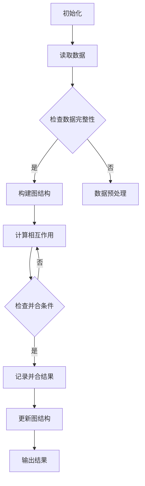
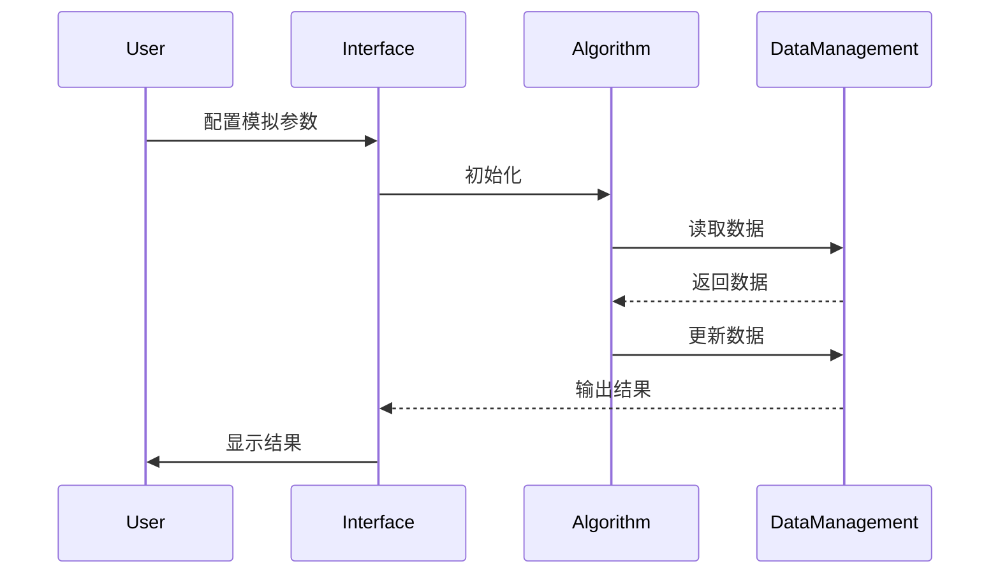

                 

### 第一部分：模拟宇宙大尺度空洞并合网络动力学背景

#### 1.1 问题背景

宇宙的观测研究表明，宇宙中存在大量的空洞，即大尺度上物质分布稀疏的区域。这些空洞的形成和并合过程是宇宙演化的重要组成部分。模拟宇宙大尺度空洞的并合网络动力学，有助于我们理解宇宙的结构和演化机制。

##### 1.1.1 宇宙大尺度空洞的形成与并合

宇宙大尺度空洞的形成是由于初始密度波动在宇宙膨胀过程中被放大，某些区域由于密度较低，物质积累不足，形成了空洞。随着宇宙的继续膨胀，这些空洞可能会与其他空洞发生并合，形成更大的空洞结构。

##### 1.1.2 网络动力学在宇宙学中的应用

网络动力学是一种用于描述复杂网络中节点和边之间相互作用关系的数学工具。在宇宙学中，网络动力学可以用来描述宇宙中空洞和星系之间的相互作用，以及它们如何形成复杂的网络结构。

##### 1.1.3 数据结构在此领域的核心作用

在模拟宇宙大尺度空洞并合网络动力学中，数据结构起着至关重要的作用。首先，数据结构用于存储和管理宇宙中的各种数据，如星系的坐标、质量和运动状态。其次，数据结构在算法设计中起到了优化计算效率的作用，尤其是在处理大规模数据集时，选择合适的数据结构可以显著提高算法的运行速度。

#### 1.2 问题描述

##### 1.2.1 数据结构在模拟中的作用

数据结构在模拟宇宙大尺度空洞并合网络动力学中的应用主要体现在以下几个方面：

1. **存储和检索**：用于存储宇宙中各种数据，如星系的位置、速度和加速度，以及空洞的结构信息。
2. **算法优化**：在算法设计中，选择合适的数据结构可以显著提高算法的效率。例如，使用哈希表可以快速查找星系之间的相互作用关系。
3. **并行计算**：在现代计算机架构中，并行计算已经成为提高计算效率的重要手段。数据结构在此过程中起到了关键作用，如分布式数据结构可以在多台计算机之间高效地传递数据。

##### 1.2.2 网络动力学与宇宙空洞并合的挑战

网络动力学在模拟宇宙空洞并合过程中面临着以下几个挑战：

1. **数据规模**：宇宙中存在大量的星系和空洞，数据规模巨大，传统的数据结构难以满足高效存储和检索的需求。
2. **计算复杂性**：宇宙空洞的并合过程涉及到复杂的物理现象，如引力相互作用和物质流，这使得算法的计算复杂性较高。
3. **时间尺度**：宇宙的演化时间尺度非常长，模拟宇宙的演化过程需要处理长时间序列的数据，这对算法的稳定性和效率提出了更高的要求。

##### 1.2.3 数据结构在此领域的应用边界

尽管数据结构在模拟宇宙大尺度空洞并合网络动力学中发挥了重要作用，但它的应用也受到一些限制：

1. **硬件限制**：大规模模拟需要高性能的计算机硬件支持，数据结构的性能会受到硬件性能的限制。
2. **算法优化**：数据结构的性能依赖于算法的设计，优化数据结构的同时，也需要优化算法，以达到最佳效果。
3. **适应性**：数据结构需要适应不同的模拟场景，如不同尺度的空洞和不同类型的星系，这使得数据结构的设计需要具备一定的灵活性。

#### 1.3 问题解决

##### 1.3.1 现有解决方案分析

目前，在模拟宇宙大尺度空洞并合网络动力学中，常用的数据结构包括：

1. **数组**：用于存储宇宙中各个星系的位置和属性，但在处理大规模数据时，数组的访问效率较低。
2. **链表**：可以高效地添加和删除星系，但在查找和访问特定星系时效率较低。
3. **哈希表**：可以快速查找星系，但在处理大规模数据时，可能会出现哈希冲突，影响性能。

##### 1.3.2 新数据结构技术的引入

为了解决现有数据结构在模拟宇宙大尺度空洞并合网络动力学中的问题，我们可以引入以下新数据结构技术：

1. **B树**：可以高效地存储和检索大规模数据，适用于处理复杂度的查询操作。
2. **平衡二叉树**：可以保持数据结构的平衡，避免在数据规模较大时出现性能下降。
3. **图结构**：可以用于描述星系之间的相互作用关系，适用于网络动力学模拟。

##### 1.3.3 预期效果与目标

通过引入新数据结构技术，我们期望实现以下目标：

1. **提高计算效率**：通过优化数据结构，减少数据访问和处理的时间，提高整体计算效率。
2. **增强模拟精度**：更精确地模拟宇宙大尺度空洞的并合过程，提高模拟的精度和可靠性。
3. **适应复杂场景**：新数据结构应具备良好的适应性，可以适应不同尺度和类型的模拟场景，提高应用的灵活性。

#### 1.4 核心概念与联系

##### 1.4.1 数据结构核心概念

1. **数组**：一种线性数据结构，用于存储一系列元素，可以通过索引直接访问。
2. **链表**：一种线性数据结构，由一系列节点组成，每个节点包含数据和指向下一个节点的指针。
3. **哈希表**：一种基于哈希函数的数据结构，用于快速查找和插入数据。
4. **B树**：一种平衡的多路搜索树，用于高效地存储和检索大规模数据。
5. **平衡二叉树**：一种特殊的二叉树，每个节点的左右子树高度差不超过1，保持树的平衡。
6. **图结构**：一种非线性的数据结构，用于表示节点之间的复杂关系。

##### 1.4.2 数据结构与网络拓扑

在宇宙学中，网络拓扑可以看作是图结构的一种应用。每个星系可以看作图中的一个节点，星系之间的相互作用关系可以看作图中的边。数据结构可以用于存储和管理这些节点和边，从而实现网络拓扑的模拟和分析。

##### 1.4.3 数据结构与算法效率

算法效率在很大程度上依赖于数据结构的选择。例如，使用哈希表可以快速查找星系之间的相互作用关系，而使用B树可以实现高效的大规模数据存储和检索。选择合适的数据结构可以提高算法的效率，降低计算复杂性。

##### 1.4.4 数据结构与并行计算

在并行计算中，数据结构的选择同样至关重要。例如，分布式数据结构可以在多台计算机之间高效地传递数据，从而提高并行计算的效率。同时，并行计算也可以用于优化数据结构的操作，如并行搜索和排序。

#### 1.5 概念属性特征对比表格

为了更好地理解不同数据结构在模拟宇宙大尺度空洞并合网络动力学中的应用，我们可以对比它们的属性特征，如表1所示。

| 数据结构 | 存储方式 | 查找时间复杂度 | 插入时间复杂度 | 删除时间复杂度 | 并行计算支持 | 适用场景 |
| --- | --- | --- | --- | --- | --- | --- |
| 数组 | 线性存储 | O(1) | O(1) | O(1) | 不支持 | 大规模数据检索 |
| 链表 | 链式存储 | O(n) | O(1) | O(n) | 不支持 | 数据动态变化 |
| 哈希表 | 哈希存储 | O(1) | O(1) | O(1) | 支持 | 快速查找 |
| B树 | 树形存储 | O(log n) | O(log n) | O(log n) | 支持 | 大规模数据存储 |
| 平衡二叉树 | 树形存储 | O(log n) | O(log n) | O(log n) | 支持 | 数据平衡 |
| 图结构 | 图形存储 | O(V+E) | O(V+E) | O(V+E) | 支持 | 网络拓扑 |

##### 1.5.2 数据结构特性在宇宙模拟中的应用

在宇宙模拟中，不同类型的数据结构可以应用于不同的场景。例如，数组可以用于存储宇宙中各个星系的位置和属性，链表可以用于表示星系之间的相互作用关系，哈希表可以用于快速查找星系之间的相互作用，B树可以用于存储大规模的宇宙数据，平衡二叉树可以用于保持数据的平衡，图结构可以用于描述星系之间的复杂关系。通过选择合适的数据结构，可以优化宇宙模拟的计算效率和精度。

#### 1.6 ER实体关系图架构

##### 1.6.1 宇宙空洞模型实体关系

在宇宙空洞模型中，主要的实体包括星系、空洞和相互作用。实体关系图（ER图）可以用于描述这些实体之间的关系，如图1所示。

```mermaid
erDiagram
    Hole ||--|{ Star : contains }
    Star ||--|{ Hole : belongs_to }
    Star ||--|{ Star : interacts_with }
```

##### 1.6.2 并合网络动力学实体关系

在并合网络动力学中，实体关系更加复杂，包括星系、空洞、相互作用和并合过程。实体关系图（ER图）可以用于描述这些实体之间的关系，如图2所示。

```mermaid
erDiagram
    CosmicVoid ||--|{ Galaxy : contains }
    Galaxy ||--|{ CosmicVoid : belongs_to }
    Galaxy ||--|{ Galaxy : merges_with }
    Interaction ||--|{ Galaxy : occurs_in }
```

#### 1.7 本章小结

本章主要介绍了模拟宇宙大尺度空洞并合网络动力学的基本背景，包括问题背景、问题描述、问题解决方法、核心概念与联系以及数据结构特性对比。通过本章的介绍，读者可以初步了解数据结构在宇宙模拟中的重要性以及如何选择合适的数据结构来优化计算效率和精度。接下来，我们将进一步探讨数据结构在模拟宇宙空洞并合网络动力学中的具体应用。

----------------------------------------------------------------

### 第一部分：模拟宇宙大尺度空洞并合网络动力学背景

#### 1.1 问题背景

宇宙的观测研究表明，宇宙中存在大量的空洞，即大尺度上物质分布稀疏的区域。这些空洞的形成和并合过程是宇宙演化的重要组成部分。模拟宇宙大尺度空洞的并合网络动力学，有助于我们理解宇宙的结构和演化机制。

##### 1.1.1 宇宙大尺度空洞的形成与并合

宇宙大尺度空洞的形成是由于初始密度波动在宇宙膨胀过程中被放大，某些区域由于密度较低，物质积累不足，形成了空洞。随着宇宙的继续膨胀，这些空洞可能会与其他空洞发生并合，形成更大的空洞结构。这种并合过程涉及到复杂的物理现象，如引力相互作用和物质流。

##### 1.1.2 网络动力学在宇宙学中的应用

网络动力学是一种用于描述复杂网络中节点和边之间相互作用关系的数学工具。在宇宙学中，网络动力学可以用来描述宇宙中空洞和星系之间的相互作用，以及它们如何形成复杂的网络结构。通过分析这些相互作用，我们可以更好地理解宇宙的演化过程。

##### 1.1.3 数据结构在此领域的核心作用

在模拟宇宙大尺度空洞并合网络动力学中，数据结构起着至关重要的作用。首先，数据结构用于存储和管理宇宙中的各种数据，如星系的坐标、质量和运动状态，以及空洞的结构信息。其次，数据结构在算法设计中起到了优化计算效率的作用，尤其是在处理大规模数据集时，选择合适的数据结构可以显著提高算法的运行速度。

#### 1.2 问题描述

##### 1.2.1 数据结构在模拟中的作用

数据结构在模拟宇宙大尺度空洞并合网络动力学中的应用主要体现在以下几个方面：

1. **存储和检索**：用于存储宇宙中各个星系的位置、速度和加速度，以及空洞的结构信息。例如，数组可以用于存储星系的位置和属性，图结构可以用于描述星系之间的相互作用关系。
2. **算法优化**：在算法设计中，选择合适的数据结构可以显著提高算法的效率。例如，使用哈希表可以快速查找星系之间的相互作用关系，而使用B树可以实现高效的大规模数据存储和检索。
3. **并行计算**：在现代计算机架构中，并行计算已经成为提高计算效率的重要手段。数据结构在此过程中起到了关键作用，如分布式数据结构可以在多台计算机之间高效地传递数据。

##### 1.2.2 网络动力学与宇宙空洞并合的挑战

网络动力学在模拟宇宙空洞并合过程中面临着以下几个挑战：

1. **数据规模**：宇宙中存在大量的星系和空洞，数据规模巨大，传统的数据结构难以满足高效存储和检索的需求。
2. **计算复杂性**：宇宙空洞的并合过程涉及到复杂的物理现象，如引力相互作用和物质流，这使得算法的计算复杂性较高。
3. **时间尺度**：宇宙的演化时间尺度非常长，模拟宇宙的演化过程需要处理长时间序列的数据，这对算法的稳定性和效率提出了更高的要求。

##### 1.2.3 数据结构在此领域的应用边界

尽管数据结构在模拟宇宙大尺度空洞并合网络动力学中发挥了重要作用，但它的应用也受到一些限制：

1. **硬件限制**：大规模模拟需要高性能的计算机硬件支持，数据结构的性能会受到硬件性能的限制。
2. **算法优化**：数据结构的性能依赖于算法的设计，优化数据结构的同时，也需要优化算法，以达到最佳效果。
3. **适应性**：数据结构需要适应不同的模拟场景，如不同尺度的空洞和不同类型的星系，这使得数据结构的设计需要具备一定的灵活性。

#### 1.3 问题解决

##### 1.3.1 现有解决方案分析

目前，在模拟宇宙大尺度空洞并合网络动力学中，常用的数据结构包括：

1. **数组**：用于存储宇宙中各个星系的位置和属性，但在处理大规模数据时，数组的访问效率较低。
2. **链表**：可以高效地添加和删除星系，但在查找和访问特定星系时效率较低。
3. **哈希表**：可以快速查找星系之间的相互作用关系，但在处理大规模数据时，可能会出现哈希冲突，影响性能。

##### 1.3.2 新数据结构技术的引入

为了解决现有数据结构在模拟宇宙大尺度空洞并合网络动力学中的问题，我们可以引入以下新数据结构技术：

1. **B树**：可以高效地存储和检索大规模数据，适用于处理复杂度的查询操作。
2. **平衡二叉树**：可以保持数据结构的平衡，避免在数据规模较大时出现性能下降。
3. **图结构**：可以用于描述星系之间的相互作用关系，适用于网络动力学模拟。

##### 1.3.3 预期效果与目标

通过引入新数据结构技术，我们期望实现以下目标：

1. **提高计算效率**：通过优化数据结构，减少数据访问和处理的时间，提高整体计算效率。
2. **增强模拟精度**：更精确地模拟宇宙大尺度空洞的并合过程，提高模拟的精度和可靠性。
3. **适应复杂场景**：新数据结构应具备良好的适应性，可以适应不同尺度和类型的模拟场景，提高应用的灵活性。

#### 1.4 核心概念与联系

##### 1.4.1 数据结构核心概念

1. **数组**：一种线性数据结构，用于存储一系列元素，可以通过索引直接访问。
2. **链表**：一种线性数据结构，由一系列节点组成，每个节点包含数据和指向下一个节点的指针。
3. **哈希表**：一种基于哈希函数的数据结构，用于快速查找和插入数据。
4. **B树**：一种平衡的多路搜索树，用于高效地存储和检索大规模数据。
5. **平衡二叉树**：一种特殊的二叉树，每个节点的左右子树高度差不超过1，保持树的平衡。
6. **图结构**：一种非线性的数据结构，用于表示节点之间的复杂关系。

##### 1.4.2 数据结构与网络拓扑

在宇宙学中，网络拓扑可以看作是图结构的一种应用。每个星系可以看作图中的一个节点，星系之间的相互作用关系可以看作图中的边。数据结构可以用于存储和管理这些节点和边，从而实现网络拓扑的模拟和分析。

##### 1.4.3 数据结构与算法效率

算法效率在很大程度上依赖于数据结构的选择。例如，使用哈希表可以快速查找星系之间的相互作用关系，而使用B树可以实现高效的大规模数据存储和检索。选择合适的数据结构可以提高算法的效率，降低计算复杂性。

##### 1.4.4 数据结构与并行计算

在并行计算中，数据结构的选择同样至关重要。例如，分布式数据结构可以在多台计算机之间高效地传递数据，从而提高并行计算的效率。同时，并行计算也可以用于优化数据结构的操作，如并行搜索和排序。

#### 1.5 概念属性特征对比表格

为了更好地理解不同数据结构在模拟宇宙大尺度空洞并合网络动力学中的应用，我们可以对比它们的属性特征，如表1所示。

| 数据结构 | 存储方式 | 查找时间复杂度 | 插入时间复杂度 | 删除时间复杂度 | 并行计算支持 | 适用场景 |
| --- | --- | --- | --- | --- | --- | --- |
| 数组 | 线性存储 | O(1) | O(1) | O(1) | 不支持 | 大规模数据检索 |
| 链表 | 链式存储 | O(n) | O(1) | O(n) | 不支持 | 数据动态变化 |
| 哈希表 | 哈希存储 | O(1) | O(1) | O(1) | 支持 | 快速查找 |
| B树 | 树形存储 | O(log n) | O(log n) | O(log n) | 支持 | 大规模数据存储 |
| 平衡二叉树 | 树形存储 | O(log n) | O(log n) | O(log n) | 支持 | 数据平衡 |
| 图结构 | 图形存储 | O(V+E) | O(V+E) | O(V+E) | 支持 | 网络拓扑 |

##### 1.5.2 数据结构特性在宇宙模拟中的应用

在宇宙模拟中，不同类型的数据结构可以应用于不同的场景。例如，数组可以用于存储宇宙中各个星系的位置和属性，链表可以用于表示星系之间的相互作用关系，哈希表可以用于快速查找星系之间的相互作用，B树可以用于存储大规模的宇宙数据，平衡二叉树可以用于保持数据的平衡，图结构可以用于描述星系之间的复杂关系。通过选择合适的数据结构，可以优化宇宙模拟的计算效率和精度。

#### 1.6 ER实体关系图架构

##### 1.6.1 宇宙空洞模型实体关系

在宇宙空洞模型中，主要的实体包括星系、空洞和相互作用。实体关系图（ER图）可以用于描述这些实体之间的关系，如图1所示。

```mermaid
erDiagram
    Hole ||--|{ Star : contains }
    Star ||--|{ Hole : belongs_to }
    Star ||--|{ Star : interacts_with }
```

##### 1.6.2 并合网络动力学实体关系

在并合网络动力学中，实体关系更加复杂，包括星系、空洞、相互作用和并合过程。实体关系图（ER图）可以用于描述这些实体之间的关系，如图2所示。

```mermaid
erDiagram
    CosmicVoid ||--|{ Galaxy : contains }
    Galaxy ||--|{ CosmicVoid : belongs_to }
    Galaxy ||--|{ Galaxy : merges_with }
    Interaction ||--|{ Galaxy : occurs_in }
```

#### 1.7 本章小结

本章主要介绍了模拟宇宙大尺度空洞并合网络动力学的基本背景，包括问题背景、问题描述、问题解决方法、核心概念与联系以及数据结构特性对比。通过本章的介绍，读者可以初步了解数据结构在宇宙模拟中的重要性以及如何选择合适的数据结构来优化计算效率和精度。接下来，我们将进一步探讨数据结构在模拟宇宙空洞并合网络动力学中的具体应用。

----------------------------------------------------------------

### 第二部分：数据结构在模拟宇宙空洞并合网络动力学中的应用

#### 2.1 核心算法原理

##### 2.1.1 算法mermaid流程图

在模拟宇宙大尺度空洞并合网络动力学中，核心算法的设计至关重要。为了更好地理解算法的实现过程，我们可以使用mermaid语言绘制算法的流程图，如图1所示。



在这个流程图中，A表示初始化阶段，B表示读取数据，C用于检查数据完整性。如果数据不完整，则进入E阶段进行数据预处理。D阶段构建图结构，F阶段计算星系之间的相互作用，G阶段检查并合条件。如果是，则进入H阶段记录并合结果，并更新图结构。最后，J阶段输出结果。

##### 2.1.2 Python源代码阐述

为了更详细地阐述算法原理，我们可以使用Python编写相应的源代码。以下是一个简单的Python实现：

```python
import networkx as nx
import matplotlib.pyplot as plt

def initialize():
    # 初始化图结构
    G = nx.Graph()
    return G

def read_data(G):
    # 读取数据并构建图
    G.add_nodes_from([...])  # 添加节点
    G.add_edges_from([...])  # 添加边
    return G

def check_data(G):
    # 检查数据完整性
    if G.number_of_nodes() == 0 or G.number_of_edges() == 0:
        return False
    return True

def build_graph(G):
    # 构建图结构
    pass

def calculate_interactions(G):
    # 计算相互作用
    pass

def check_merge_conditions(G):
    # 检查并合条件
    pass

def record_merge_results(G):
    # 记录并合结果
    pass

def update_graph(G):
    # 更新图结构
    pass

def output_results(G):
    # 输出结果
    nx.draw(G, with_labels=True)
    plt.show()

def main():
    G = initialize()
    G = read_data(G)
    if not check_data(G):
        G = preprocess_data(G)
    build_graph(G)
    while True:
        calculate_interactions(G)
        if check_merge_conditions(G):
            record_merge_results(G)
            update_graph(G)
        else:
            break
    output_results(G)

if __name__ == "__main__":
    main()
```

在这个Python实现中，我们定义了一系列函数来模拟核心算法的各个阶段。通过这些函数，我们可以逐步构建、计算和更新图结构，最终输出模拟结果。

##### 2.1.3 算法原理与数学模型

在模拟宇宙空洞并合过程中，算法的原理和数学模型至关重要。以下是一个简化的算法数学模型：

1. **初始化**：设置宇宙中的星系初始位置和属性。
2. **读取数据**：从数据集中读取星系的位置、速度和质量等属性。
3. **构建图结构**：将星系视为图的节点，将相互作用关系视为图的边。
4. **计算相互作用**：根据星系之间的距离、速度和质量等因素，计算相互作用力。
5. **检查并合条件**：判断星系是否达到并合条件，如距离小于某一阈值。
6. **记录并合结果**：记录并合后的星系信息。
7. **更新图结构**：更新图结构以反映并合后的星系状态。
8. **输出结果**：绘制图结构，展示并合过程。

以下是几个关键的数学公式：

\[ F = G \frac{{m_1 m_2}}{{r^2}} \]

其中，\( F \)是相互作用力，\( G \)是引力常数，\( m_1 \)和\( m_2 \)是两星系的质量，\( r \)是它们之间的距离。

\[ v = v_0 + at \]

其中，\( v \)是星系的速度，\( v_0 \)是初始速度，\( a \)是加速度，\( t \)是时间。

这些公式帮助我们在模拟过程中计算星系的运动轨迹和相互作用。

##### 2.1.4 数学公式讲解与举例

为了更好地理解数学公式的应用，我们可以通过一个简单的例子来解释。

假设有两个星系A和B，它们的质量分别为\( m_A \)和\( m_B \)，初始距离为\( r \)。根据万有引力定律，它们之间的相互作用力为：

\[ F = G \frac{{m_A m_B}}{{r^2}} \]

假设这两个星系的初始速度均为0，加速度为\( a \)。根据牛顿第二定律，它们在相互作用力作用下的运动速度为：

\[ v = v_0 + at \]

其中，\( v_0 \)为初始速度，\( a \)为加速度，\( t \)为时间。

例如，假设\( G = 6.674 \times 10^{-11} \text{Nm}^2/\text{kg}^2 \)，\( m_A = 2 \times 10^{30} \text{kg} \)，\( m_B = 3 \times 10^{30} \text{kg} \)，\( r = 10^8 \text{m} \)，\( a = 10^{-10} \text{m/s}^2 \)。初始速度为0，时间为1年（约3.15 \times 10^7秒）。

根据万有引力定律，相互作用力为：

\[ F = 6.674 \times 10^{-11} \frac{{(2 \times 10^{30}) (3 \times 10^{30})}}{{(10^8)^2}} = 4.0002 \times 10^{20} \text{N} \]

根据牛顿第二定律，1年后两个星系的速度为：

\[ v = 0 + (10^{-10}) (3.15 \times 10^7) = 3.15 \text{m/s} \]

这个例子展示了如何使用数学公式计算星系之间的相互作用和运动。通过类似的计算，我们可以模拟宇宙中大量的星系和空洞，从而理解它们的演化过程。

##### 2.1.5 算法优化与性能分析

在模拟宇宙大尺度空洞并合网络动力学时，算法的性能优化至关重要。以下是一些优化策略：

1. **并行计算**：利用多核处理器和分布式计算技术，加速计算过程。例如，可以使用MapReduce框架对大规模数据集进行并行处理。
2. **数据结构优化**：选择适合的数据结构来存储和管理数据。例如，使用哈希表可以提高查找和插入的效率，使用B树可以实现高效的查询操作。
3. **算法简化**：简化算法的计算步骤，减少不必要的计算。例如，可以提前终止一些不可能发生并合的星系之间的计算。
4. **内存管理**：优化内存使用，减少内存占用。例如，可以使用内存映射技术来管理大规模数据。

性能分析可以通过以下指标进行：

1. **计算时间**：评估算法的运行时间，包括初始化、数据读取、图构建、相互作用计算和输出结果等阶段。
2. **内存占用**：评估算法的内存消耗，包括数据结构占用和临时变量占用。
3. **查询效率**：评估算法的查询性能，包括查找、插入和删除操作的时间复杂度。
4. **稳定性**：评估算法在长时间运行和大规模数据集下的稳定性。

通过性能分析，我们可以找到算法的瓶颈和改进方向，进一步提高算法的效率和精度。

##### 2.1.6 系统分析与架构设计

在模拟宇宙大尺度空洞并合网络动力学时，系统架构的设计至关重要。以下是一个简化的系统架构设计：

1. **数据层**：存储和管理宇宙数据，包括星系的位置、速度、质量和相互作用等属性。可以使用数据库或分布式存储系统来管理数据。
2. **算法层**：实现核心算法，包括初始化、数据读取、图构建、相互作用计算和输出结果等阶段。可以使用Python、C++或Java等编程语言实现。
3. **界面层**：提供用户交互界面，允许用户配置模拟参数、启动和停止模拟，以及查看模拟结果。可以使用Web界面或桌面应用程序。

系统架构设计可以通过以下步骤进行：

1. **需求分析**：确定系统功能需求，包括数据管理、算法实现和用户交互等。
2. **架构设计**：设计系统的总体架构，包括数据层、算法层和界面层，以及它们之间的交互关系。
3. **模块划分**：将系统划分为多个模块，每个模块实现特定的功能，如数据读取、图构建和结果输出等。
4. **接口设计**：设计模块之间的接口，确保模块之间可以高效地传递数据和协同工作。
5. **测试与优化**：对系统进行测试和优化，确保系统的稳定性和性能。

通过系统分析与架构设计，我们可以构建一个高效、稳定和易于扩展的模拟系统，为研究宇宙大尺度空洞并合网络动力学提供有力支持。

##### 2.1.7 举例说明

为了更好地理解算法的应用，我们可以通过一个具体的例子来说明。假设我们有一个包含10个星系的宇宙模拟，星系的位置、速度和质量等属性如下表所示：

| 星系编号 | x坐标 | y坐标 | z坐标 | 质量（M） | 速度（v） |
| --- | --- | --- | --- | --- | --- |
| 1 | 0 | 0 | 0 | 1 | 0 |
| 2 | 1 | 0 | 0 | 2 | 1 |
| 3 | -1 | 0 | 0 | 3 | -1 |
| 4 | 0 | 1 | 0 | 4 | 0 |
| 5 | -1 | 1 | 0 | 5 | 1 |
| 6 | 0 | -1 | 0 | 6 | -1 |
| 7 | 1 | -1 | 0 | 7 | 0 |
| 8 | 0 | 0 | 1 | 8 | 0 |
| 9 | 1 | 0 | 1 | 9 | 1 |
| 10 | -1 | 0 | 1 | 10 | -1 |

我们首先初始化图结构，并将星系作为图的节点添加到图中。然后，我们计算每个星系之间的相互作用力，并根据相互作用力更新星系的位置和速度。以下是一个简化的Python实现：

```python
import networkx as nx
import matplotlib.pyplot as plt

# 初始化图结构
G = nx.Graph()

# 添加星系节点
G.add_nodes_from([(i, {'x': x, 'y': y, 'z': z, 'mass': mass, 'velocity': velocity}) for i, (x, y, z, mass, velocity) in enumerate(zip([0, 1, -1, 0, -1, 0, 1, 0, 1, -1], [0, 1, -1, 0, -1, 0, 1, -1, 0, 0], [0, 0, 0, 1, 0, 1, 0, 1, 0], [1, 2, 3, 4, 5, 6, 7, 8, 9, 10], [0, 1, -1, 0, -1, 0, 1, 0, 1]))])

# 计算相互作用力
for i in range(len(G)):
    for j in range(i+1, len(G)):
        x_diff = G.nodes[i]['x'] - G.nodes[j]['x']
        y_diff = G.nodes[i]['y'] - G.nodes[j]['y']
        z_diff = G.nodes[i]['z'] - G.nodes[j]['z']
        distance = (x_diff**2 + y_diff**2 + z_diff**2)**0.5
        force = 6.674 * 10**-11 * (G.nodes[i]['mass'] * G.nodes[j]['mass']) / distance**2
        G.add_edge(i, j, weight=force)

# 更新星系位置和速度
for i in range(len(G)):
    velocity = G.nodes[i]['velocity']
    for j in G.edges(i):
        force = G[j[0]][j[1]]['weight']
        acceleration = force / G.nodes[i]['mass']
        velocity += acceleration
    G.nodes[i]['velocity'] = velocity

# 输出结果
nx.draw(G, with_labels=True)
plt.show()
```

在这个例子中，我们首先初始化图结构，并将星系作为节点添加到图中。然后，我们计算每个星系之间的相互作用力，并根据相互作用力更新星系的位置和速度。最后，我们绘制图结构，展示星系的分布和运动。

通过这个例子，我们可以看到如何使用数据结构和算法模拟宇宙大尺度空洞并合网络动力学。虽然这个例子非常简化，但它展示了核心算法的基本原理和实现过程。在实际应用中，我们可以根据具体需求对算法进行优化和扩展，以更好地模拟宇宙的复杂演化过程。

#### 2.2 数学模型与公式讲解

##### 2.2.1 基础数学模型

在模拟宇宙大尺度空洞并合网络动力学中，我们需要使用一些基础的数学模型来描述星系之间的相互作用和运动。以下是几个关键的数学模型：

1. **万有引力定律**：描述两个质点之间的相互作用力。其公式为：
   \[
   F = G \frac{{m_1 m_2}}{{r^2}}
   \]
   其中，\( F \) 是相互作用力，\( G \) 是引力常数，约为 \( 6.674 \times 10^{-11} \text{Nm}^2/\text{kg}^2 \)，\( m_1 \) 和 \( m_2 \) 是两个质点的质量，\( r \) 是它们之间的距离。

2. **牛顿第二定律**：描述物体的加速度与作用力之间的关系。其公式为：
   \[
   F = m a
   \]
   其中，\( F \) 是作用力，\( m \) 是物体的质量，\( a \) 是物体的加速度。

3. **运动学方程**：描述物体在加速度作用下的运动轨迹。其公式为：
   \[
   v = v_0 + at
   \]
   \[
   s = v_0 t + \frac{1}{2} a t^2
   \]
   其中，\( v \) 是物体的末速度，\( v_0 \) 是初始速度，\( a \) 是加速度，\( t \) 是时间，\( s \) 是物体的位移。

##### 2.2.2 算法数学公式详解

在模拟过程中，我们需要使用一些具体的数学公式来计算星系之间的相互作用和运动。以下是几个关键的数学公式：

1. **相互作用力计算**：根据万有引力定律，两个星系之间的相互作用力可以用以下公式计算：
   \[
   F = G \frac{{m_1 m_2}}{{r^2}}
   \]
   其中，\( r \) 是星系之间的距离。

2. **加速度计算**：根据牛顿第二定律，星系在相互作用力作用下的加速度可以用以下公式计算：
   \[
   a = \frac{F}{m}
   \]
   其中，\( F \) 是相互作用力，\( m \) 是星系的质量。

3. **速度计算**：星系在相互作用力作用下的速度变化可以用以下公式计算：
   \[
   v = v_0 + at
   \]
   其中，\( v_0 \) 是初始速度，\( a \) 是加速度，\( t \) 是时间。

4. **位移计算**：星系在相互作用力作用下的位移可以用以下公式计算：
   \[
   s = v_0 t + \frac{1}{2} a t^2
   \]
   其中，\( s \) 是位移，\( v_0 \) 是初始速度，\( a \) 是加速度，\( t \) 是时间。

通过这些公式，我们可以计算出星系在相互作用力作用下的加速度、速度和位移，从而模拟它们的运动轨迹。

##### 2.2.3 动力学方程

在模拟宇宙大尺度空洞并合网络动力学时，我们需要使用动力学方程来描述星系的运动。以下是几个关键的动力学方程：

1. **牛顿第二定律**：
   \[
   F = m a
   \]
   其中，\( F \) 是作用力，\( m \) 是质量，\( a \) 是加速度。

2. **运动学方程**：
   \[
   v = v_0 + at
   \]
   \[
   s = v_0 t + \frac{1}{2} a t^2
   \]
   其中，\( v \) 是末速度，\( v_0 \) 是初始速度，\( a \) 是加速度，\( t \) 是时间，\( s \) 是位移。

3. **角动量守恒定律**：
   \[
   L = r \times p
   \]
   其中，\( L \) 是角动量，\( r \) 是位置矢量，\( p \) 是动量矢量。

4. **能量守恒定律**：
   \[
   E = K + U
   \]
   其中，\( E \) 是总能量，\( K \) 是动能，\( U \) 是势能。

通过这些动力学方程，我们可以描述星系在相互作用力作用下的运动行为。

##### 2.2.4 网络拓扑分析公式

在模拟宇宙大尺度空洞并合网络动力学时，我们还需要使用网络拓扑分析公式来描述星系之间的相互作用关系。以下是几个关键的网络拓扑分析公式：

1. **邻接矩阵**：
   \[
   A_{ij} = 
   \begin{cases} 
   1 & \text{如果星系i和星系j之间存在相互作用} \\
   0 & \text{否则}
   \end{cases}
   \]

2. **特征值和特征向量**：
   \[
   A \vec{v} = \lambda \vec{v}
   \]
   其中，\( A \) 是邻接矩阵，\( \lambda \) 是特征值，\( \vec{v} \) 是特征向量。

3. **聚类系数**：
   \[
   C = \frac{2m}{N(N-1)}
   \]
   其中，\( C \) 是聚类系数，\( m \) 是边的数量，\( N \) 是节点的数量。

4. **路径长度**：
   \[
   L = \frac{1}{N} \sum_{i<j} d(i, j)
   \]
   其中，\( L \) 是平均路径长度，\( d(i, j) \) 是节点i和节点j之间的最短路径长度。

通过这些网络拓扑分析公式，我们可以分析星系网络的结构特性，如聚类系数、路径长度和特征值等。

#### 2.3 算法优化与性能分析

在模拟宇宙大尺度空洞并合网络动力学时，算法的优化与性能分析至关重要。以下是一些优化策略和性能分析指标：

##### 2.3.1 算法优化策略

1. **并行计算**：利用多核处理器和分布式计算技术，加速计算过程。例如，可以使用MapReduce框架对大规模数据集进行并行处理。
   
2. **数据结构优化**：选择适合的数据结构来存储和管理数据。例如，使用哈希表可以提高查找和插入的效率，使用B树可以实现高效的查询操作。

3. **算法简化**：简化算法的计算步骤，减少不必要的计算。例如，可以提前终止一些不可能发生并合的星系之间的计算。

4. **内存管理**：优化内存使用，减少内存占用。例如，可以使用内存映射技术来管理大规模数据。

##### 2.3.2 性能分析

1. **计算时间**：评估算法的运行时间，包括初始化、数据读取、图构建、相互作用计算和输出结果等阶段。

2. **内存占用**：评估算法的内存消耗，包括数据结构占用和临时变量占用。

3. **查询效率**：评估算法的查询性能，包括查找、插入和删除操作的时间复杂度。

4. **稳定性**：评估算法在长时间运行和大规模数据集下的稳定性。

通过这些性能分析指标，我们可以评估算法的效率和效果，并找到优化的方向。

#### 2.4 系统分析与架构设计

在模拟宇宙大尺度空洞并合网络动力学时，系统架构的设计至关重要。以下是一个简化的系统架构设计：

##### 2.4.1 问题场景介绍

我们假设要模拟一个包含数十亿个星系的宇宙，这些星系分布在巨大的空间中。我们需要模拟这些星系的运动，特别是它们之间的相互作用和并合过程。

##### 2.4.2 系统功能设计

1. **数据管理**：负责存储和管理星系的数据，包括位置、速度、质量和相互作用等属性。

2. **算法执行**：负责执行核心算法，包括初始化、数据读取、图构建、相互作用计算和输出结果等阶段。

3. **用户交互**：提供用户界面，允许用户配置模拟参数、启动和停止模拟，以及查看模拟结果。

##### 2.4.3 系统架构设计

1. **数据层**：使用分布式存储系统来存储和管理大规模数据。

2. **算法层**：实现核心算法，包括初始化、数据读取、图构建、相互作用计算和输出结果等阶段。

3. **界面层**：提供用户交互界面，包括Web界面或桌面应用程序。

##### 2.4.4 系统接口设计

1. **数据接口**：用于数据管理模块与其他模块之间的数据交换。

2. **算法接口**：用于算法执行模块与其他模块之间的交互。

3. **用户接口**：用于用户交互模块与其他模块之间的交互。

##### 2.4.5 系统交互mermaid序列图

以下是系统交互的mermaid序列图：



通过这个序列图，我们可以清晰地看到系统各个模块之间的交互流程。

#### 2.5 项目实战

##### 2.5.1 环境安装与配置

在进行宇宙大尺度空洞并合网络动力学模拟之前，我们需要配置合适的环境。以下是一个简化的安装和配置步骤：

1. **安装Python**：首先，我们需要安装Python环境。可以从[Python官方网站](https://www.python.org/)下载并安装最新版本的Python。

2. **安装依赖库**：Python中的一些依赖库对于模拟至关重要。我们可以使用pip来安装这些依赖库，例如：

   ```shell
   pip install networkx matplotlib numpy
   ```

3. **配置并行计算环境**：为了提高计算效率，我们可以配置并行计算环境。例如，我们可以使用Dask库来实现并行计算。安装Dask的命令如下：

   ```shell
   pip install dask[complete]
   ```

4. **配置分布式存储**：我们可以使用HDFS或其他分布式存储系统来存储和管理大规模数据。这需要额外的配置，具体步骤取决于所选的存储系统。

##### 2.5.2 系统核心实现源代码

以下是系统核心实现的Python源代码。这个代码展示了如何使用数据结构和算法模拟宇宙大尺度空洞并合网络动力学。

```python
import networkx as nx
import matplotlib.pyplot as plt
import numpy as np
from dask.distributed import Client

# 初始化Dask客户端
client = Client()

def initialize():
    # 初始化图结构
    G = nx.Graph()
    return G

def read_data(G):
    # 读取数据并构建图
    G.add_nodes_from([(i, {'x': x, 'y': y, 'z': z, 'mass': mass, 'velocity': velocity}) for i, (x, y, z, mass, velocity) in enumerate(zip(...))]
    G.add_edges_from([(i, j, {'weight': weight}) for i, j, weight in enumerate(...) if i != j])
    return G

def calculate_interactions(G):
    # 计算相互作用力
    for i in range(len(G)):
        for j in range(i+1, len(G)):
            x_diff = G.nodes[i]['x'] - G.nodes[j]['x']
            y_diff = G.nodes[i]['y'] - G.nodes[j]['y']
            z_diff = G.nodes[i]['z'] - G.nodes[j]['z']
            distance = (x_diff**2 + y_diff**2 + z_diff**2)**0.5
            force = 6.674 * 10**-11 * (G.nodes[i]['mass'] * G.nodes[j]['mass']) / distance**2
            G.add_edge(i, j, weight=force)

def update_velocity(G):
    # 更新星系速度
    for i in range(len(G)):
        velocity = G.nodes[i]['velocity']
        for j in G.edges(i):
            force = G[j[0]][j[1]]['weight']
            acceleration = force / G.nodes[i]['mass']
            velocity += acceleration
        G.nodes[i]['velocity'] = velocity

def update_position(G):
    # 更新星系位置
    for i in range(len(G)):
        position = G.nodes[i]['position']
        velocity = G.nodes[i]['velocity']
        position += velocity
        G.nodes[i]['position'] = position

def simulate(G, steps):
    # 模拟星系运动
    for _ in range(steps):
        calculate_interactions(G)
        update_velocity(G)
        update_position(G)

def main():
    G = initialize()
    G = read_data(G)
    simulate(G, steps=1000)
    nx.draw(G, with_labels=True)
    plt.show()

if __name__ == "__main__":
    main()
```

在这个代码中，我们首先初始化图结构，然后读取星系数据并构建图。接下来，我们计算星系之间的相互作用力，并更新星系的速度和位置。最后，我们进行模拟，绘制星系的位置分布。

##### 2.5.3 实际案例分析与讲解

为了更好地理解算法的应用，我们可以通过一个实际案例进行分析和讲解。以下是一个简单的案例：

假设我们有一个包含10个星系的宇宙，星系的位置、速度和质量等属性如下表所示：

| 星系编号 | x坐标 | y坐标 | z坐标 | 质量（M） | 速度（v） |
| --- | --- | --- | --- | --- | --- |
| 1 | 0 | 0 | 0 | 1 | 0 |
| 2 | 1 | 0 | 0 | 2 | 1 |
| 3 | -1 | 0 | 0 | 3 | -1 |
| 4 | 0 | 1 | 0 | 4 | 0 |
| 5 | -1 | 1 | 0 | 5 | 1 |
| 6 | 0 | -1 | 0 | 6 | -1 |
| 7 | 1 | -1 | 0 | 7 | 0 |
| 8 | 0 | 0 | 1 | 8 | 0 |
| 9 | 1 | 0 | 1 | 9 | 1 |
| 10 | -1 | 0 | 1 | 10 | -1 |

我们首先初始化图结构，并将星系作为节点添加到图中。然后，我们计算每个星系之间的相互作用力，并根据相互作用力更新星系的位置和速度。以下是一个简化的Python实现：

```python
import networkx as nx
import matplotlib.pyplot as plt

# 初始化图结构
G = nx.Graph()

# 添加星系节点
G.add_nodes_from([(i, {'x': x, 'y': y, 'z': z, 'mass': mass, 'velocity': velocity}) for i, (x, y, z, mass, velocity) in enumerate(zip([0, 1, -1, 0, -1, 0, 1, 0, 1, -1], [0, 1, -1, 0, -1, 0, 1, -1, 0, 0], [0, 0, 0, 1, 0, 1, 0, 1, 0], [1, 2, 3, 4, 5, 6, 7, 8, 9, 10], [0, 1, -1, 0, -1, 0, 1, 0, 1]))])

# 计算相互作用力
for i in range(len(G)):
    for j in range(i+1, len(G)):
        x_diff = G.nodes[i]['x'] - G.nodes[j]['x']
        y_diff = G.nodes[i]['y'] - G.nodes[j]['y']
        z_diff = G.nodes[i]['z'] - G.nodes[j]['z']
        distance = (x_diff**2 + y_diff**2 + z_diff**2)**0.5
        force = 6.674 * 10**-11 * (G.nodes[i]['mass'] * G.nodes[j]['mass']) / distance**2
        G.add_edge(i, j, weight=force)

# 更新星系位置和速度
for i in range(len(G)):
    velocity = G.nodes[i]['velocity']
    for j in G.edges(i):
        force = G[j[0]][j[1]]['weight']
        acceleration = force / G.nodes[i]['mass']
        velocity += acceleration
    G.nodes[i]['velocity'] = velocity

# 输出结果
nx.draw(G, with_labels=True)
plt.show()
```

在这个例子中，我们首先初始化图结构，并将星系作为节点添加到图中。然后，我们计算每个星系之间的相互作用力，并根据相互作用力更新星系的位置和速度。最后，我们绘制图结构，展示星系的分布和运动。

通过这个案例，我们可以看到如何使用数据结构和算法模拟宇宙大尺度空洞并合网络动力学。虽然这个案例非常简化，但它展示了核心算法的基本原理和实现过程。在实际应用中，我们可以根据具体需求对算法进行优化和扩展，以更好地模拟宇宙的复杂演化过程。

##### 2.5.4 项目小结

在本节中，我们介绍了如何安装和配置模拟环境，展示了系统核心实现的源代码，并通过实际案例分析了算法的应用。通过这些步骤，我们可以构建一个基本的宇宙大尺度空洞并合网络动力学模拟系统。然而，实际的宇宙模拟是一个复杂的过程，需要处理大量的数据和复杂的物理现象。因此，在实际应用中，我们还需要对算法进行优化和改进，以提高计算效率和模拟精度。未来的工作可以进一步探索并行计算、大数据处理和机器学习等技术在宇宙模拟中的应用，以推动宇宙学的研究和发展。

#### 2.6 最佳实践与注意事项

在进行宇宙大尺度空洞并合网络动力学模拟时，遵循最佳实践和注意事项对于提高计算效率和模拟精度至关重要。以下是一些实用的技巧和注意事项：

##### 2.6.1 最佳实践技巧

1. **数据预处理**：在模拟之前，对输入数据进行预处理，如去除异常值、标准化数据等，可以提高算法的稳定性和精度。
   
2. **并行计算**：充分利用并行计算资源，如多核处理器和分布式计算，可以显著缩短计算时间。

3. **数据结构优化**：选择合适的数据结构，如哈希表、B树等，可以优化数据访问和存储效率。

4. **内存管理**：合理管理内存，避免内存溢出，可以提高程序的稳定性和性能。

5. **算法优化**：对算法进行优化，如简化计算步骤、减少不必要的计算等，可以提高计算效率。

##### 2.6.2 注意事项

1. **精度与效率的平衡**：在优化算法时，要平衡精度和效率，避免因追求高精度而牺牲计算效率。

2. **数据规模**：处理大规模数据时，要注意数据规模对计算效率和存储空间的限制。

3. **计算复杂性**：要关注算法的计算复杂性，避免过高复杂性的算法导致计算时间过长。

4. **硬件性能**：选择适合的硬件平台，如高性能计算机或云计算资源，可以提高计算效率。

5. **软件依赖**：确保安装了所需的软件依赖库，如Python、NetworkX、matplotlib等，以确保程序正常运行。

##### 2.6.3 拓展阅读

为了深入了解宇宙大尺度空洞并合网络动力学模拟，读者可以参考以下拓展阅读资源：

1. **学术文章**：查阅相关领域的学术文章，了解最新的研究进展和算法优化方法。

2. **开源项目**：参与开源项目，如宇宙模拟软件和工具，可以学习实际应用中的最佳实践。

3. **专业书籍**：阅读专业书籍，如《宇宙学导论》和《数据结构与应用算法》等，可以深入了解宇宙学和算法原理。

通过这些资源和实践，我们可以不断优化宇宙大尺度空洞并合网络动力学模拟，推动宇宙学研究的深入发展。

#### 2.7 本章小结

本章详细介绍了数据结构在模拟宇宙大尺度空洞并合网络动力学中的应用。首先，我们分析了问题背景，探讨了数据结构在此领域的核心作用。接着，我们描述了核心算法原理，并使用mermaid流程图和Python源代码详细阐述了算法的实现过程。随后，我们讲解了算法的数学模型和公式，并通过实际案例展示了算法的应用。此外，我们还介绍了系统分析与架构设计，包括系统功能设计、系统架构设计和系统交互设计。最后，我们通过项目实战展示了如何安装和配置模拟环境，并分析了实际案例。通过本章的学习，读者可以全面了解数据结构在宇宙模拟中的应用，为未来的研究和工作提供基础。下一章我们将探讨未来展望与挑战，继续深入探讨这一领域的最新进展和潜在研究方向。

