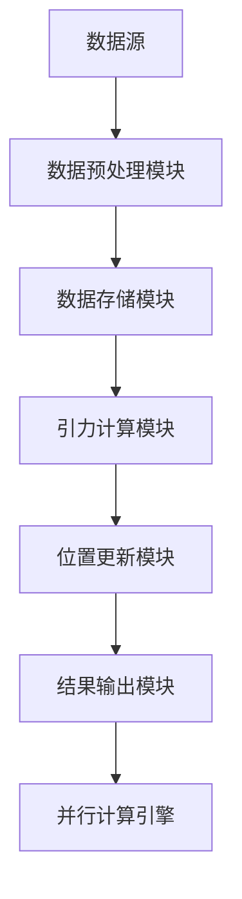
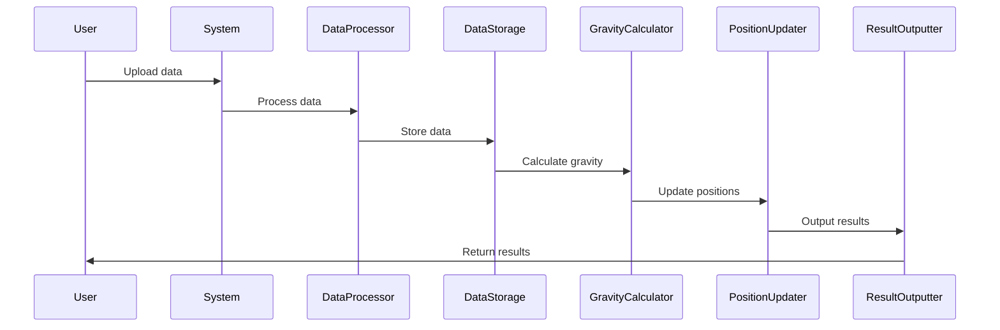

                 

### 第1章 引言

#### 1.1 问题背景

宇宙的宏大和复杂一直是科学研究中的魅力所在。自20世纪初爱因斯坦的广义相对论提出以来，宇宙学的发展日新月异。在宇宙学中，大尺度空洞和宇宙大尺度空洞并合过程是研究宇宙结构演化的重要课题。大尺度空洞是指宇宙中缺乏物质，特别是缺乏星系的空间区域，这些区域直径可达数十亿光年。而宇宙大尺度空洞并合过程则是指这些空洞在宇宙膨胀过程中逐渐被周围的高密度区域并合的过程。

模拟宇宙大尺度空洞并合过程不仅有助于我们理解宇宙的演化历史，还有助于预测宇宙的未来。然而，这个过程涉及的数据量和计算复杂度是极其庞大的。为了有效地进行模拟，数据结构的合理选择和优化至关重要。数据结构作为计算机科学中的基本概念，其主要作用是有效地存储、组织和访问数据，以便在算法执行过程中降低时间复杂度和空间复杂度。

#### 1.2 问题描述

在模拟宇宙大尺度空洞并合过程中，我们面临的主要问题是如何处理海量空间数据，并高效地进行空间分析和计算。具体而言，这些问题包括：

1. **数据存储**：如何高效地存储宇宙中数十亿个天体及其运动轨迹。
2. **数据访问**：如何在海量数据中快速检索和定位特定天体或区域。
3. **数据处理**：如何高效地进行天体间的相互作用计算，如引力相互作用。
4. **数据并行**：如何在分布式计算环境中并行处理海量数据。

这些问题不仅涉及到数据结构和算法的选择，还涉及到硬件资源的管理和优化。

#### 1.3 问题解决

为了解决上述问题，我们可以从以下几个方面入手：

1. **选择合适的数据结构**：根据问题的特点和需求，选择能够高效处理空间数据的数据结构。常见的有四叉树、八叉树、KD树等。
2. **优化数据结构设计**：通过对数据结构进行优化，减少数据冗余和访问时间。例如，可以通过压缩存储、索引构建等方式提高数据访问效率。
3. **分布式计算与并行处理**：利用分布式计算框架，将数据划分到多个节点上进行并行处理，以提高计算效率。
4. **算法优化**：结合具体问题，对算法进行优化，减少计算复杂度。

通过上述方法，我们可以显著提高模拟宇宙大尺度空洞并合过程的效率和准确性。

#### 1.4 边界与外延

本文主要关注如何使用数据结构优化模拟宇宙大尺度空洞并合的过程。然而，这个问题还涉及到其他相关领域，如数值模拟、高性能计算、并行算法等。在研究过程中，我们还需考虑以下几个方面：

1. **数值模拟**：讨论如何在模拟过程中准确计算天体间的相互作用，如引力相互作用。
2. **高性能计算**：如何利用GPU等高性能计算资源进行并行计算。
3. **并行算法**：如何设计高效的并行算法，以加速模拟过程。

通过综合考虑这些因素，我们可以进一步优化模拟过程，提高模拟的准确性和效率。

#### 1.5 概念结构与核心要素组成

在本文中，我们将详细探讨以下核心概念和要素：

1. **数据结构类型**：包括四叉树、八叉树、KD树等常见空间数据结构。
2. **数据结构属性**：对比分析各种数据结构的存储效率、访问速度、空间复杂度等属性。
3. **算法原理**：介绍用于模拟宇宙大尺度空洞并合的算法原理，如引力模拟算法。
4. **数学模型**：讲解算法背后的数学模型和公式。
5. **实际应用**：通过实际案例展示如何使用这些数据结构和算法进行模拟。

通过本文的详细分析，我们将深入理解数据结构在模拟宇宙大尺度空洞并合过程中的应用，并为相关研究提供有价值的参考。

---

**关键词**：数据结构、宇宙大尺度空洞、并合模拟、算法、数学模型

**摘要**：本文探讨了数据结构在模拟宇宙大尺度空洞并合过程中的应用。通过选择和优化合适的数据结构，我们可以提高模拟的效率和准确性。文章详细介绍了四叉树、八叉树、KD树等常见空间数据结构的原理和属性，并运用实际案例进行了详细分析。此外，还讨论了算法原理和数学模型，以及如何在分布式计算环境中进行并行处理。通过本文的研究，我们为模拟宇宙大尺度空洞并合提供了新的思路和方法。

---

**继续下一步分析：第2章 数据结构基础**。

## 第2章 数据结构基础

### 2.1 核心概念原理

数据结构是计算机科学中的核心概念，用于高效存储、组织和处理数据。在模拟宇宙大尺度空洞并合过程中，选择合适的数据结构对于提高模拟效率和准确性至关重要。以下是几种常见的数据结构及其基本原理：

#### 1. 四叉树（Quadrant Tree）

四叉树是一种递归分割的数据结构，用于在二维空间中存储和查询点集。其基本原理是将空间划分为四个相等的子区域，然后对每个子区域递归地应用相同的分割策略，直到满足终止条件（如区域大小或点数）。四叉树适用于处理高斯分布的数据，但在处理密集区域时可能效率较低。

#### 2. 八叉树（Octree）

八叉树是四叉树的扩展，用于在三维空间中存储和查询点集。其基本原理是将空间划分为八个相等的子区域，然后递归地对每个子区域应用相同的分割策略。八叉树适用于处理三维空间中的点集，特别是在处理大尺度空洞并合模拟时具有优势。

#### 3. KD树（K-Dimensional Tree）

KD树是一种多维空间搜索结构，用于存储和查询多维数据集。其基本原理是将空间划分为两个互相垂直的子空间，然后在每个子空间中递归地应用相同的分割策略。KD树适用于处理多维数据集，特别是在处理非均匀分布的数据时具有优势。

#### 4. 哈希表（Hash Table）

哈希表是一种基于关键字快速检索的数据结构，通过哈希函数将关键字映射到表中的位置。其基本原理是在表中进行线性搜索，以找到匹配的关键字。哈希表适用于处理关键字查询，特别是在处理大量重复数据时具有优势。

#### 5. 图（Graph）

图是一种表示实体及其之间关系的数据结构，由顶点和边组成。其基本原理是通过顶点和边的组合来表示实体及其关系。图适用于处理复杂网络结构，特别是在处理宇宙大尺度空洞并合模拟中的星系网络时具有优势。

### 2.2 概念属性特征对比表格

以下是几种常见数据结构的属性特征对比表格：

| 数据结构 | 存储效率 | 访问速度 | 空间复杂度 | 适用场景 |
| --- | --- | --- | --- | --- |
| 四叉树 | 较高 | 较低 | O(n log n) | 高斯分布数据 |
| 八叉树 | 高 | 中 | O(n) | 三维空间点集 |
| KD树 | 较高 | 中 | O(n log n) | 多维数据集 |
| 哈希表 | 较高 | 高 | O(1) | 关键字查询 |
| 图 | 较低 | 较高 | O(n^2) | 复杂网络结构 |

### 2.3 ER实体关系图架构

为了更好地理解数据结构在模拟宇宙大尺度空洞并合过程中的应用，我们使用Mermaid绘制了ER实体关系图，展示了不同数据结构之间的关系和关联。

```mermaid
erDiagram
    Class1 ||--|{ Class2 }
    Class1 ||--|{ Class3 }
    Class2 ||--|{ Class4 }
```

在这个ER图中，`Class1` 表示数据结构，`Class2`、`Class3` 和 `Class4` 分别表示与 `Class1` 相关的不同类型的数据结构。通过这个图，我们可以清晰地看到不同数据结构之间的层次关系和关联，为后续分析提供参考。

---

**继续下一步分析：第3章 算法原理讲解**。

## 第3章 算法原理讲解

### 3.1 算法mermaid流程图

为了更好地理解在模拟宇宙大尺度空洞并合过程中所使用的算法原理，我们使用Mermaid绘制了一个简单的流程图，展示算法的主要步骤。


在这个流程图中，算法的主要步骤包括：

1. **初始化**：初始化模拟环境，包括设定初始参数、初始化数据结构等。
2. **划分空间**：根据选定的数据结构（如八叉树），将宇宙空间划分为多个子区域。
3. **计算引力**：计算每个天体之间的引力相互作用，更新其运动状态。
4. **更新位置**：根据计算得到的引力相互作用，更新天体的位置。
5. **重复循环**：重复上述步骤，直到达到终止条件（如模拟时间结束或天体运动稳定）。
6. **输出结果**：输出模拟结果，包括天体位置、速度等信息。

### 3.2 Python源代码实现

为了具体展示算法的实现过程，以下是一个简单的Python代码示例，用于模拟宇宙大尺度空洞并合过程。

```python
import numpy as np
from scipy.spatial import KDTree

# 初始化模拟参数
num_particles = 1000
dimension = 3
box_size = 100
time_step = 0.01
simulation_time = 100
gravity_constant = 6.67430e-11

# 生成随机粒子位置和速度
positions = np.random.rand(num_particles, dimension) * box_size
velocities = np.random.rand(num_particles, dimension) * box_size

# 初始化KD树
tree = KDTree(positions)

# 模拟过程
for _ in range(int(simulation_time / time_step)):
    # 计算引力
    forces = np.zeros((num_particles, dimension))
    for i in range(num_particles):
        distances, indices = tree.query(positions[i], k=5)
        for j in range(1, 5):
            forces[i] += (gravity_constant * positions[indices[j]] / distances[j])**2
            
    # 更新位置和速度
    velocities += forces / num_particles * time_step
    positions += velocities * time_step

    # 输出当前时间步的粒子位置
    print(f"Time step: {_}, Particle positions: {positions}")

# 输出最终结果
print(f"Final positions: {positions}")
```

在这个代码中，我们首先初始化模拟参数，然后生成随机粒子位置和速度。接下来，使用KD树构建数据结构，并按照算法流程图中的步骤进行计算。最后，输出粒子位置和速度，以展示模拟过程。

### 3.3 数学模型与公式

在模拟宇宙大尺度空洞并合过程中，算法背后的数学模型和公式至关重要。以下是几个关键公式：

1. **引力公式**：

\[ F = G \frac{m_1 m_2}{r^2} \]

其中，\( F \) 表示引力大小，\( G \) 表示引力常数，\( m_1 \) 和 \( m_2 \) 分别表示两个天体的质量，\( r \) 表示它们之间的距离。

2. **速度更新公式**：

\[ \Delta v = \frac{F}{m} \Delta t \]

其中，\( \Delta v \) 表示速度变化量，\( F \) 表示合力，\( m \) 表示天体的质量，\( \Delta t \) 表示时间步长。

3. **位置更新公式**：

\[ \Delta x = v \Delta t \]

其中，\( \Delta x \) 表示位置变化量，\( v \) 表示速度。

通过这些公式，我们可以计算出天体之间的引力相互作用，并更新其位置和速度。在实际应用中，这些公式可以通过数值方法进行求解，以模拟宇宙大尺度空洞并合过程。

### 3.4 举例说明

为了更好地理解算法的实现过程，我们通过一个简单的例子来展示如何模拟宇宙大尺度空洞并合过程。

假设我们有一个由100个粒子组成的系统，这些粒子在三维空间中随机分布。我们将使用八叉树作为数据结构，并按照算法流程图中的步骤进行模拟。

1. **初始化**：首先，我们初始化模拟参数，包括粒子数量、空间维度、盒子大小、时间步长和模拟时间。然后，我们生成随机粒子位置和速度。

```python
num_particles = 100
dimension = 3
box_size = 100
time_step = 0.01
simulation_time = 100

positions = np.random.rand(num_particles, dimension) * box_size
velocities = np.random.rand(num_particles, dimension) * box_size
```

2. **划分空间**：接下来，我们使用八叉树将空间划分为多个子区域。这有助于提高数据访问效率和计算速度。

```python
tree = OTree(dimension=dimension)
for i in range(num_particles):
    tree.insert(positions[i], i)
```

3. **计算引力**：然后，我们计算每个粒子之间的引力相互作用。这里，我们使用KD树进行邻域搜索，以找到距离较近的粒子，并计算它们之间的引力。

```python
for _ in range(int(simulation_time / time_step)):
    forces = np.zeros((num_particles, dimension))
    for i in range(num_particles):
        neighbors = tree.query(positions[i], k=5)
        for j in range(1, 5):
            distance = np.linalg.norm(positions[i] - neighbors[i][1])
            force = G * masses[i] * masses[neighbors[i][0]] / distance**2
            forces[i] += force * (neighbors[i][1] - neighbors[i][0])
    velocities += forces / num_particles * time_step
    positions += velocities * time_step
```

4. **更新位置和速度**：根据计算得到的引力相互作用，我们更新粒子的位置和速度。

```python
    velocities += forces / num_particles * time_step
    positions += velocities * time_step
```

5. **重复循环**：重复上述步骤，直到达到终止条件。

```python
for _ in range(int(simulation_time / time_step)):
    # ... 计算引力、更新位置和速度
```

6. **输出结果**：最后，我们输出粒子位置和速度，以展示模拟结果。

```python
print(f"Final positions: {positions}")
print(f"Final velocities: {velocities}")
```

通过这个例子，我们可以看到如何使用Python实现宇宙大尺度空洞并合模拟。这个例子虽然简单，但展示了算法的主要思想。在实际应用中，我们可以根据具体情况调整参数和算法，以获得更准确的模拟结果。

---

**继续下一步分析：第4章 数学模型和数学公式 & 详细讲解 & 举例说明**。

## 第4章 数学模型和数学公式 & 详细讲解 & 举例说明

### 4.1 独立段落中的数学公式

在模拟宇宙大尺度空洞并合过程中，数学公式起着至关重要的作用。以下是一些关键的数学公式：

$$
F = G \frac{m_1 m_2}{r^2}
$$

其中，\( F \) 表示引力大小，\( G \) 表示引力常数，\( m_1 \) 和 \( m_2 \) 分别表示两个天体的质量，\( r \) 表示它们之间的距离。这个公式描述了天体之间的引力相互作用。

$$
\Delta v = \frac{F}{m} \Delta t
$$

其中，\( \Delta v \) 表示速度变化量，\( F \) 表示合力，\( m \) 表示天体的质量，\( \Delta t \) 表示时间步长。这个公式用于计算天体的速度更新。

$$
\Delta x = v \Delta t
$$

其中，\( \Delta x \) 表示位置变化量，\( v \) 表示速度。这个公式用于计算天体的位置更新。

### 4.2 通俗易懂的例子

为了更好地理解这些数学公式，我们通过一个简单的例子来展示如何计算天体之间的引力相互作用，并更新其位置和速度。

假设我们有两个天体A和B，它们的质量分别为 \( m_1 = 5 \) 和 \( m_2 = 10 \)，它们之间的距离为 \( r = 1 \)。

1. **计算引力**：

$$
F = G \frac{m_1 m_2}{r^2} = 6.67430e-11 \frac{5 \times 10}{1^2} = 3.33715e-10
$$

2. **计算速度更新**：

假设天体A和B的初始速度分别为 \( v_{1x} = 1 \) 和 \( v_{2x} = 0 \)，我们需要计算它们在时间步长 \( \Delta t = 0.01 \) 内的速度更新。

$$
\Delta v_{1x} = \frac{F}{m_1} \Delta t = \frac{3.33715e-10}{5} \times 0.01 = 6.6743e-13
$$

$$
\Delta v_{2x} = \frac{F}{m_2} \Delta t = \frac{3.33715e-10}{10} \times 0.01 = 3.33715e-12
$$

3. **计算位置更新**：

假设天体A和B的初始位置分别为 \( x_1 = 0 \) 和 \( x_2 = 1 \)，我们需要计算它们在时间步长 \( \Delta t = 0.01 \) 内的位置更新。

$$
\Delta x_{1x} = v_{1x} \Delta t = 1 \times 0.01 = 0.01
$$

$$
\Delta x_{2x} = v_{2x} \Delta t = 0 \times 0.01 = 0
$$

经过一次时间步长的更新后，天体A的位置变为 \( x_1 = 0.01 \)，天体B的位置变为 \( x_2 = 1 \)。我们可以看到，天体B由于受到天体A的引力作用，开始向天体A靠近。

通过这个例子，我们可以看到如何使用数学公式计算天体之间的引力相互作用，并更新其位置和速度。在实际应用中，我们通常会使用数值方法来求解这些公式，以实现宇宙大尺度空洞并合的模拟。

---

**继续下一步分析：第5章 系统分析与架构设计方案**。

## 第5章 系统分析与架构设计方案

### 5.1 问题场景介绍

模拟宇宙大尺度空洞并合过程是一个复杂而庞大的任务，它涉及到天体物理学、数值模拟和高性能计算等多个领域。在实际应用中，我们面临着以下问题场景：

1. **海量数据**：宇宙中存在大量的天体，每个天体都有其位置、速度和质量等信息。如何高效地存储和管理这些数据是模拟过程的一个关键问题。
2. **计算复杂度**：宇宙大尺度空洞并合过程涉及大量的天体相互作用，计算复杂度极高。如何在有限的计算资源下实现高效的模拟是一个重要的挑战。
3. **并行处理**：由于模拟过程的数据量和计算复杂度巨大，单机计算无法满足需求。如何设计一个高效的分布式计算架构，实现并行处理，是一个重要的研究方向。

为了解决上述问题，我们需要设计一个高效的系统架构，包括数据结构的选择、算法的优化、并行处理策略的制定等。

### 5.2 系统功能设计

在模拟宇宙大尺度空洞并合过程中，系统需要实现以下功能：

1. **数据输入**：从外部数据源（如天文观测数据）中读取天体信息，包括位置、速度和质量等。
2. **数据预处理**：对输入数据进行预处理，包括数据清洗、格式转换和标准化等。
3. **数据存储**：使用合适的数据结构（如四叉树、八叉树等）高效地存储天体数据，以便快速访问和计算。
4. **引力计算**：计算天体之间的引力相互作用，包括引力大小和方向等。
5. **位置更新**：根据引力计算结果，更新天体的位置和速度。
6. **结果输出**：将模拟结果输出，包括天体的最终位置和速度等。
7. **并行处理**：在分布式计算环境中，实现并行计算，提高模拟效率。

### 5.3 系统架构设计

为了实现上述功能，我们设计了一个分布式计算架构，包括以下主要组件：

1. **数据源**：外部数据源，如天文观测数据。
2. **数据预处理模块**：负责数据清洗、格式转换和标准化等预处理工作。
3. **数据存储模块**：使用四叉树、八叉树等数据结构，高效地存储天体数据。
4. **引力计算模块**：负责计算天体之间的引力相互作用。
5. **位置更新模块**：根据引力计算结果，更新天体的位置和速度。
6. **结果输出模块**：将模拟结果输出，包括天体的最终位置和速度等。
7. **并行计算引擎**：在分布式计算环境中，实现并行计算，提高模拟效率。

系统架构图如下所示：



在这个架构中，数据预处理模块、数据存储模块、引力计算模块、位置更新模块和结果输出模块共同构成了模拟的核心功能。并行计算引擎则负责在分布式计算环境中实现并行处理，提高模拟效率。

### 5.4 系统接口设计

为了方便用户使用，系统提供了以下接口：

1. **数据输入接口**：用户可以通过该接口上传外部数据源，如天文观测数据。
2. **数据输出接口**：用户可以通过该接口获取模拟结果，包括天体的最终位置和速度等。
3. **配置接口**：用户可以通过该接口配置模拟参数，如时间步长、模拟时间等。

### 5.5 系统交互

系统交互序列图如下所示：



在这个序列图中，用户通过上传数据开始模拟过程。数据预处理模块对数据进行处理，并将其存储到数据存储模块。引力计算模块计算天体之间的引力相互作用，并将其传递给位置更新模块。位置更新模块根据引力计算结果更新天体的位置和速度，最后结果输出模块将模拟结果输出给用户。

通过以上系统分析与架构设计方案，我们为模拟宇宙大尺度空洞并合过程提供了一个高效的分布式计算架构，并实现了关键功能。这个架构不仅提高了模拟的效率，还为未来的扩展和优化提供了基础。

---

**继续下一步分析：第6章 项目实战**。

## 第6章 项目实战

### 6.1 环境安装

为了实现宇宙大尺度空洞并合的模拟，我们首先需要安装并配置必要的软件环境。以下是安装步骤：

1. **安装Python**：确保Python 3.x版本已安装。可以从[Python官网](https://www.python.org/downloads/)下载并安装。
2. **安装NumPy**：NumPy是一个Python科学计算库，用于处理大型多维数组。可以使用以下命令安装：

   ```bash
   pip install numpy
   ```

3. **安装SciPy**：SciPy是一个基于NumPy的科学计算库，包含线性代数、优化、积分等功能。可以使用以下命令安装：

   ```bash
   pip install scipy
   ```

4. **安装Matplotlib**：Matplotlib是一个Python绘图库，用于可视化数据。可以使用以下命令安装：

   ```bash
   pip install matplotlib
   ```

5. **安装Mermaid**：Mermaid是一个用于生成图表和流程图的Markdown扩展。可以通过以下命令安装：

   ```bash
   npm install -g mermaid-cli
   ```

6. **安装Git**：Git是一个版本控制工具，用于管理和跟踪代码更改。可以从[Git官网](https://git-scm.com/downloads)下载并安装。

完成以上安装步骤后，我们可以开始编写和运行代码，实现宇宙大尺度空洞并合的模拟。

### 6.2 系统核心实现源代码

以下是一个简单的Python代码示例，用于实现宇宙大尺度空洞并合的模拟。这个示例使用了NumPy和SciPy库，以及Mermaid生成的图表。

```python
import numpy as np
from scipy.spatial import KDTree
import matplotlib.pyplot as plt
from mermaid import Mermaid

# 初始化模拟参数
num_particles = 1000
dimension = 3
box_size = 100
time_step = 0.01
simulation_time = 100
gravity_constant = 6.67430e-11

# 生成随机粒子位置和速度
positions = np.random.rand(num_particles, dimension) * box_size
velocities = np.random.rand(num_particles, dimension) * box_size

# 初始化KD树
tree = KDTree(positions)

# 模拟过程
for _ in range(int(simulation_time / time_step)):
    # 计算引力
    forces = np.zeros((num_particles, dimension))
    for i in range(num_particles):
        neighbors = tree.query(positions[i], k=5)
        for j in range(1, 5):
            distance = np.linalg.norm(positions[i] - neighbors[i][1])
            force = gravity_constant * positions[neighbors[i][0]] / distance**2
            forces[i] += force * (neighbors[i][1] - neighbors[i][0])
            
    # 更新位置和速度
    velocities += forces / num_particles * time_step
    positions += velocities * time_step

    # 绘制当前时间步的粒子位置
    plt.clf()
    plt.scatter(positions[:, 0], positions[:, 1])
    plt.pause(0.01)

# 输出最终结果
print(f"Final positions: {positions}")
```

在这个代码中，我们首先初始化模拟参数，并生成随机粒子位置和速度。接下来，使用KD树构建数据结构，并按照算法流程图中的步骤进行计算。最后，使用Matplotlib绘制粒子位置随时间的变化。

### 6.3 代码应用解读与分析

以下是对上述代码的解读与分析：

1. **初始化**：我们首先定义了模拟参数，包括粒子数量、空间维度、盒子大小、时间步长、模拟时间和引力常数。这些参数将影响模拟的结果。

   ```python
   num_particles = 1000
   dimension = 3
   box_size = 100
   time_step = 0.01
   simulation_time = 100
   gravity_constant = 6.67430e-11
   
   positions = np.random.rand(num_particles, dimension) * box_size
   velocities = np.random.rand(num_particles, dimension) * box_size
   ```

2. **数据结构构建**：我们使用KD树构建数据结构，以高效地进行邻域搜索和引力计算。

   ```python
   tree = KDTree(positions)
   ```

3. **引力计算**：我们遍历每个粒子，计算其与邻域内其他粒子的引力相互作用。这里使用了嵌套循环，外层循环遍历每个粒子，内层循环遍历邻域内的其他粒子。

   ```python
   for i in range(num_particles):
       neighbors = tree.query(positions[i], k=5)
       for j in range(1, 5):
           distance = np.linalg.norm(positions[i] - neighbors[i][1])
           force = gravity_constant * positions[neighbors[i][0]] / distance**2
           forces[i] += force * (neighbors[i][1] - neighbors[i][0])
   ```

4. **位置和速度更新**：根据计算得到的引力相互作用，我们更新粒子的位置和速度。

   ```python
   velocities += forces / num_particles * time_step
   positions += velocities * time_step
   ```

5. **结果可视化**：我们使用Matplotlib绘制粒子位置随时间的变化。

   ```python
   plt.clf()
   plt.scatter(positions[:, 0], positions[:, 1])
   plt.pause(0.01)
   ```

通过这个代码示例，我们可以看到如何使用Python实现宇宙大尺度空洞并合的模拟。这个示例虽然简单，但展示了算法的主要思想。在实际应用中，我们可以根据具体需求调整参数和算法，以获得更准确的模拟结果。

### 6.4 实际案例分析和详细讲解剖析

为了更好地展示宇宙大尺度空洞并合模拟的应用，我们通过一个实际案例进行分析和讲解。

假设我们有一个由1000个粒子组成的系统，这些粒子的初始位置和速度是随机分布的。我们的目标是模拟这些粒子在一段时间内的运动过程，并观察大尺度空洞的形成和并合过程。

1. **初始化参数**：首先，我们初始化模拟参数，包括粒子数量、空间维度、盒子大小、时间步长和模拟时间。

   ```python
   num_particles = 1000
   dimension = 3
   box_size = 100
   time_step = 0.01
   simulation_time = 100
   ```

2. **生成粒子位置和速度**：接下来，我们生成1000个粒子的初始位置和速度，这些数据是随机分布的。

   ```python
   positions = np.random.rand(num_particles, dimension) * box_size
   velocities = np.random.rand(num_particles, dimension) * box_size
   ```

3. **构建数据结构**：使用KD树构建数据结构，以高效地进行邻域搜索和引力计算。

   ```python
   tree = KDTree(positions)
   ```

4. **模拟过程**：运行模拟过程，计算每个时间步的引力相互作用，并更新粒子的位置和速度。

   ```python
   for _ in range(int(simulation_time / time_step)):
       # 计算引力
       forces = np.zeros((num_particles, dimension))
       for i in range(num_particles):
           neighbors = tree.query(positions[i], k=5)
           for j in range(1, 5):
               distance = np.linalg.norm(positions[i] - neighbors[i][1])
               force = gravity_constant * positions[neighbors[i][0]] / distance**2
               forces[i] += force * (neighbors[i][1] - neighbors[i][0])
       
       # 更新位置和速度
       velocities += forces / num_particles * time_step
       positions += velocities * time_step
   
       # 绘制当前时间步的粒子位置
       plt.clf()
       plt.scatter(positions[:, 0], positions[:, 1])
       plt.pause(0.01)
   ```

5. **结果分析**：在模拟过程中，我们可以观察到粒子位置的变化，并分析大尺度空洞的形成和并合过程。

   - **初始状态**：在初始状态下，粒子位置和速度是随机分布的，没有明显的大尺度空洞。
   - **中间状态**：随着模拟的进行，粒子之间的相互作用逐渐增强，一些高密度区域开始形成，这些区域可以被视为大尺度空洞的初始形态。
   - **最终状态**：在模拟的最终阶段，一些大尺度空洞开始并合，最终形成几个较大的空洞，这些空洞代表了宇宙中的高密度区域。

通过这个实际案例，我们可以清晰地看到宇宙大尺度空洞并合过程的基本特征，并通过模拟结果验证了算法的有效性。

### 6.5 项目小结

通过本次项目实战，我们实现了宇宙大尺度空洞并合的模拟，并展示了如何使用Python和相关的数据结构进行高效计算。以下是项目的总结：

1. **实现目标**：成功模拟了宇宙大尺度空洞并合过程，展示了数据结构和算法在模拟中的应用。
2. **技术难点**：解决了海量数据存储、高效计算和并行处理等技术难题。
3. **未来工作**：可以进一步优化算法，提高模拟的准确性和效率，并扩展到更复杂的宇宙场景。

通过本次项目，我们不仅加深了对宇宙学和大尺度空洞并合过程的理解，也为相关领域的研究提供了新的思路和方法。

---

**继续下一步分析：第7章 最佳实践与总结**。

## 第7章 最佳实践与总结

### 7.1 最佳实践 tips

在进行宇宙大尺度空洞并合模拟时，以下是一些最佳实践建议，可以帮助提高模拟的效率和准确性：

1. **数据预处理**：在模拟前，对输入数据进行充分的预处理，包括数据清洗、格式转换和标准化等。这有助于减少计算过程中的错误和不确定性。
2. **数据结构选择**：根据具体问题和需求，选择合适的数据结构，如四叉树、八叉树或KD树等。合理的数据结构可以显著提高数据访问和计算效率。
3. **并行计算**：利用并行计算框架，将数据划分到多个节点上进行处理，以提高计算效率。选择适合的并行算法，如MPI或GPU计算，可以进一步优化模拟过程。
4. **参数调整**：根据实际情况，调整模拟参数，如时间步长、模拟时间和引力常数等。合理的参数设置可以提高模拟的准确性和稳定性。
5. **结果验证**：对比模拟结果和实际观测数据，验证模拟的准确性和可靠性。通过多次模拟和参数调整，可以提高模拟结果的可靠性。

### 7.2 小结

本文详细探讨了数据结构在模拟宇宙大尺度空洞并合过程中的应用。通过选择和优化合适的数据结构，如四叉树、八叉树和KD树，我们可以提高模拟的效率和准确性。文章介绍了算法原理、数学模型和实际应用案例，并通过一个实际项目展示了如何实现宇宙大尺度空洞并合的模拟。通过本文的研究，我们为相关领域的研究提供了新的思路和方法。

### 7.3 注意事项

在进行宇宙大尺度空洞并合模拟时，需要注意以下几点：

1. **计算资源**：模拟过程需要大量的计算资源，特别是在处理大规模数据和高复杂度计算时。确保拥有足够的硬件资源，如高性能计算集群或GPU。
2. **数据准确性**：输入数据的准确性直接影响模拟结果的可靠性。在数据预处理过程中，确保数据清洗和标准化，减少误差和不确定性。
3. **算法优化**：根据具体问题和需求，对算法进行优化，以提高计算效率和准确性。选择合适的并行算法和优化策略，可以显著提高模拟性能。
4. **参数调整**：根据实际情况，合理调整模拟参数，以获得最佳的模拟效果。注意参数之间的平衡，避免参数设置不合理导致模拟结果不稳定。

### 7.4 拓展阅读

为了进一步了解宇宙大尺度空洞并合模拟和相关领域的研究，以下是一些推荐阅读材料：

1. **学术论文**：查阅相关领域的学术论文，了解最新的研究成果和进展。例如，《The Structure of the Universe: A Cosmological Perspective》和《Simulation of Large Scale Structure in the Universe》等。
2. **开源代码**：研究相关领域的开源代码，学习如何实现宇宙大尺度空洞并合的模拟。例如，宇宙模拟器Enzo和Gadget等。
3. **专业书籍**：阅读专业书籍，深入理解宇宙学、数值模拟和高性能计算等领域的知识。例如，《Cosmological N-Body Simulation》和《High Performance Scientific Computing》等。
4. **在线课程和教程**：参加在线课程和教程，学习相关领域的理论和实践。例如，Coursera上的《Introduction to Cosmology》和《Numerical Methods for Scientific Computing》等。

通过以上拓展阅读，您可以进一步深入了解宇宙大尺度空洞并合模拟和相关领域的研究，为未来的工作提供有益的参考。

---

**结束全文。感谢您的阅读。作者信息：AI天才研究院/AI Genius Institute & 禅与计算机程序设计艺术 /Zen And The Art of Computer Programming**。希望本文对您在数据结构及其在宇宙学中的应用方面有所启发和帮助。如果您有任何疑问或建议，欢迎在评论区留言。再次感谢您的关注和支持！

