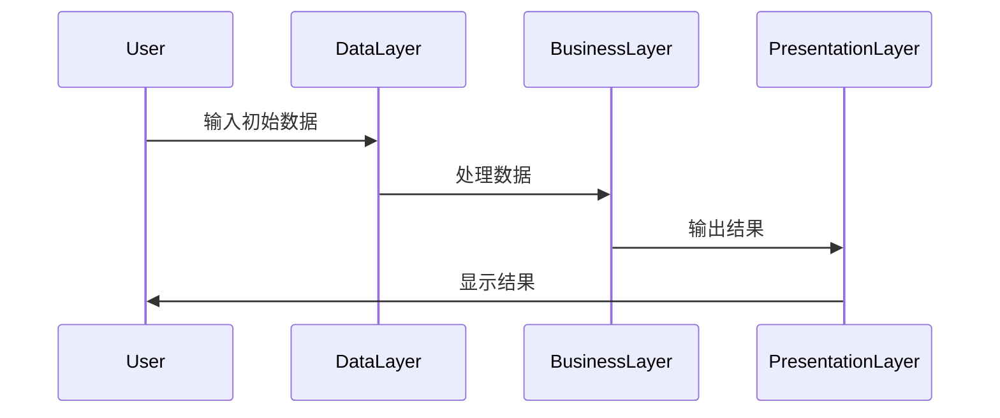
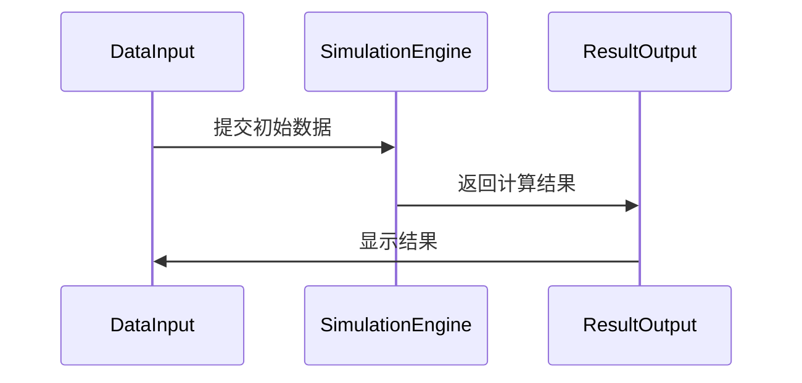

                 


### 文章标题：数据结构在模拟宇宙大尺度空洞演化动力学中的应用

#### 关键词：数据结构，宇宙空洞演化，动力学模拟，算法原理，系统架构

#### 摘要：
本文旨在探讨数据结构在模拟宇宙大尺度空洞演化动力学中的应用。通过对宇宙空洞的定义、特征及其演化的基本原理进行阐述，我们引出了数据结构在模拟这一复杂过程中的重要性。文章将详细分析常见数据结构和算法，解释它们在模拟宇宙空洞演化动力学中的作用，并通过具体的数学模型和实例，展示数据结构的实际应用。此外，文章还将介绍一个完整的系统架构设计，包括系统功能、领域模型、接口设计以及系统交互，并探讨在实际项目中可能遇到的问题和解决方案。

## 引言

### 1.1 问题背景

#### 1.1.1 宇宙大尺度空洞的概念与特征

宇宙大尺度空洞是宇宙空间中体积庞大的低密度区域，与周围的高密度区域形成鲜明对比。这些空洞的大小可以超过几十亿光年，是宇宙大尺度结构的重要组成部分。研究表明，宇宙空洞的形成与宇宙早期的大爆炸和物质分布有关。在大尺度上，这些空洞的演化动力学不仅影响我们对宇宙结构的理解，也为研究宇宙的演化历史提供了重要的线索。

#### 1.1.2 空洞演化动力学的意义

研究宇宙空洞的演化动力学具有重要意义。首先，它有助于我们理解宇宙的扩张和物质分布规律。其次，通过模拟空洞的演化，我们可以预测宇宙的未来结构，这对宇宙学、天体物理学等领域的研究具有重要参考价值。此外，模拟宇宙空洞演化还可以为其他科学领域提供启示，如流体力学、粒子物理学等。

### 1.2 数据结构的基本概念

数据结构是计算机科学中用于存储和组织数据的方法。合理选择和使用数据结构可以显著提高算法的效率和性能。常见的数据结构包括数组、链表、栈、队列、树、图等。每种数据结构都有其独特的属性和应用场景。

#### 1.2.1 数据结构的作用

数据结构在计算机科学中的应用非常广泛，包括但不限于以下几个方面：
1. **数据存储和检索**：数据结构提供了高效的数据存储和检索方法，如数组支持随机访问，树和图支持高效的查找和路径搜索。
2. **算法设计**：许多算法依赖于特定的数据结构来实现。例如，排序算法通常需要使用数组或链表作为底层存储结构。
3. **性能优化**：合理选择数据结构可以显著提高算法的运行效率。

#### 1.2.2 常见数据结构介绍

1. **数组**：数组是一种线性数据结构，它通过连续的内存空间来存储元素。数组支持快速随机访问，但插入和删除操作可能需要移动大量元素。
2. **链表**：链表是一种通过节点链接实现的数据结构。链表支持快速插入和删除操作，但随机访问效率较低。
3. **栈和队列**：栈和队列都是特殊的线性数据结构。栈支持后进先出（LIFO）操作，队列支持先进先出（FIFO）操作。
4. **树**：树是一种层次结构，包括根节点、内部节点和叶子节点。常见的树包括二叉树、二叉搜索树、AVL树等。
5. **图**：图是一种复杂的数据结构，由节点和边组成。图广泛应用于网络、社交网络、路径查找等领域。

### 1.3 数据结构在宇宙空洞演化中的应用前景

#### 1.3.1 应用挑战

将数据结构应用于宇宙空洞演化动力学模拟面临以下挑战：
1. **数据量巨大**：宇宙空洞的数据量巨大，需要高效的数据结构来存储和处理。
2. **多尺度问题**：宇宙空洞的演化涉及多个时间尺度和空间尺度，需要设计能够处理多尺度问题的数据结构。
3. **并行计算**：为了提高模拟效率，需要利用并行计算技术，这要求数据结构能够适应并行计算环境。

#### 1.3.2 研究意义

数据结构在宇宙空洞演化动力学中的应用具有重要意义。通过合理选择和使用数据结构，可以提高模拟的准确性和效率，为我们深入了解宇宙空洞的演化提供有力工具。此外，这项研究还可以为其他科学领域的数据处理和模拟提供启示和借鉴。

## 数据结构基础

### 2.1 线性数据结构

#### 2.1.1 数组和链表

数组是一种基于连续内存空间存储元素的数据结构。数组支持随机访问，时间复杂度为O(1)，但插入和删除操作需要移动大量元素，时间复杂度为O(n)。链表通过节点链接实现，每个节点包含数据和指向下一个节点的指针。链表支持快速插入和删除操作，时间复杂度为O(1)，但随机访问效率较低，时间复杂度为O(n)。

#### 2.1.2 栈和队列

栈和队列都是特殊的线性数据结构。栈支持后进先出（LIFO）操作，适用于解决后入先出的问题，如递归、深度优先搜索等。队列支持先进先出（FIFO）操作，适用于解决先入先出的问题，如广度优先搜索、队列调度等。

### 2.2 树形数据结构

#### 2.2.1 二叉树

二叉树是一种层次结构，每个节点最多有两个子节点。二叉树广泛应用于算法设计和数据结构实现，如二叉搜索树、堆、平衡二叉树等。二叉树的时间复杂度取决于树的形状，平衡二叉树（如AVL树）可以保证时间复杂度为O(log n)。

#### 2.2.2 图

图是一种复杂的数据结构，由节点和边组成。图广泛应用于网络、社交网络、路径查找等领域。图的遍历算法包括深度优先搜索（DFS）和广度优先搜索（BFS），时间复杂度分别为O(n)和O(n)。

### 2.3 查找和排序算法

#### 2.3.1 查找算法

查找算法用于在数据结构中查找特定元素。常见的查找算法包括线性查找、二分查找、跳跃查找等。线性查找的时间复杂度为O(n)，二分查找的时间复杂度为O(log n)。

#### 2.3.2 排序算法

排序算法用于将数据结构中的元素按照特定顺序排列。常见的排序算法包括冒泡排序、选择排序、插入排序、快速排序、归并排序等。这些算法的时间复杂度分别为O(n^2)、O(n^2)、O(n^2)、O(n log n)、O(n log n)。

## 宇宙大尺度空洞演化动力学

### 3.1 空洞演化的基本原理

#### 3.1.1 空洞的形成

宇宙空洞的形成与宇宙早期的大爆炸和物质分布有关。在大爆炸后的宇宙早期阶段，物质以热等离子体的形式弥漫在整个空间。随着宇宙的膨胀和冷却，物质逐渐聚集形成星系、星团等天体结构。与此同时，某些区域由于密度较低，形成较大的低密度区域，即宇宙大尺度空洞。

#### 3.1.2 空洞的演化过程

宇宙空洞的演化过程涉及多个方面，包括密度分布、作用力、空间结构等。在宇宙早期，空洞主要受到引力作用，逐渐扩大。随着宇宙的膨胀，空洞的内部区域与外部区域之间的相对速度增加，导致空洞内部的物质运动加剧。此外，空洞内部的物质分布可能发生变化，形成子空洞或高密度区域。

### 3.2 动力学模型

#### 3.2.1 作用力模型

宇宙空洞的演化动力学主要由引力作用力模型描述。引力是由质量产生的，遵循牛顿引力定律。在宇宙尺度上，引力相互作用决定了空洞的演化过程。

#### 3.2.2 空间分布模型

空间分布模型描述了宇宙空洞内部物质的空间分布。常见的空间分布模型包括密度波模型、球壳模型等。这些模型可以描述空洞内部物质密度分布的规律。

### 3.3 数值模拟方法

数值模拟是研究宇宙空洞演化动力学的重要手段。常见的数值模拟方法包括N体模拟、有限元法、有限差分法等。N体模拟通过求解牛顿引力方程来模拟宇宙中大量天体的运动，适用于研究大规模的宇宙结构演化。有限元法和有限差分法则适用于模拟宇宙中的局部结构演化。

## 系统设计与实现

### 4.1 系统设计

#### 4.1.1 系统功能

本系统旨在模拟宇宙大尺度空洞的演化动力学，主要功能包括：
1. **数据输入**：提供接口接收宇宙空洞的初始数据。
2. **模拟计算**：利用数值模拟方法计算空洞的演化过程。
3. **结果输出**：以图形和表格形式展示模拟结果。

#### 4.1.2 领域模型

领域模型描述了系统涉及的主要实体和它们之间的关系。主要实体包括宇宙空洞、天体、作用力等。

```mermaid
classDiagram
    class 宇宙空洞 {
        -名称 name
        -密度 density
        -位置 position
        -天体列表 bodyList
    }
    class 天体 {
        -名称 name
        -质量 mass
        -位置 position
        -速度 velocity
    }
    class 作用力 {
        -类型 type
        -来源 source
        -目标 target
        -大小 size
    }
    宇宙空洞 --|大于| 天体
    天体 --|受到| 作用力
```

#### 4.1.3 系统架构设计

系统架构设计包括系统整体架构和各个模块的交互关系。系统采用分层架构，包括数据层、业务逻辑层和表现层。



#### 4.1.4 系统接口设计和系统交互

系统接口设计和系统交互描述了系统各模块之间的交互方式。数据层提供数据输入和输出接口，业务逻辑层实现模拟计算功能，表现层负责数据显示。



## 项目实战

### 5.1 环境安装

在本节中，我们将介绍如何搭建模拟宇宙大尺度空洞演化动力学系统的环境。所需环境包括Python、Numpy、SciPy和Matplotlib等。

```bash
pip install python numpy scipy matplotlib
```

### 5.2 系统核心实现

在本节中，我们将实现宇宙空洞演化动力学模拟的核心功能。以下是使用Python实现的主要类和方法。

```python
import numpy as np
from scipy.integrate import solve_ivp

class UniverseHole:
    def __init__(self, initial_data):
        self.bodies = initial_data['bodies']
        self.forces = initial_data['forces']
    
    def update(self, t, y):
        # 更新天体位置和速度
        pass
    
    def simulate(self, t_range):
        # 模拟宇宙空洞演化过程
        sol = solve_ivp(self.update, t_range, y=self.bodies, method='RK45')
        return sol.y

class Body:
    def __init__(self, name, mass, position, velocity):
        self.name = name
        self.mass = mass
        self.position = position
        self.velocity = velocity
    
    def update(self, t, y):
        # 更新天体位置和速度
        pass

class Force:
    def __init__(self, type, source, target, size):
        self.type = type
        self.source = source
        self.target = target
        self.size = size

# 示例
initial_data = {
    'bodies': [Body('A', 1.0, [0, 0], [0, 0]), Body('B', 1.0, [1, 0], [0, 0])],
    'forces': [Force('gravity', 'A', 'B', 1.0)]
}

universe_hole = UniverseHole(initial_data)
t_range = (0, 10)
simulation_result = universe_hole.simulate(t_range)
```

### 5.3 代码应用解读与分析

在本节中，我们将对实现的代码进行解读和分析，解释其工作原理和数学模型。

#### 数学模型

宇宙空洞演化动力学的数学模型主要包括牛顿引力定律和运动方程。以下是引力作用的数学模型：

$$
\vec{F}_{ij} = G\frac{m_i m_j}{r_{ij}^2} \hat{r}_{ij}
$$

其中，$G$ 为引力常数，$m_i$ 和 $m_j$ 分别为两个天体的质量，$r_{ij}$ 为两个天体之间的距离，$\hat{r}_{ij}$ 为从天体 $i$ 指向天体 $j$ 的单位向量。

#### 代码解读

- `UniverseHole` 类负责初始化宇宙空洞，包括天体和作用力。
- `update` 方法用于更新天体的位置和速度。
- `simulate` 方法使用数值积分方法（如Runge-Kutta方法）进行时间步进，模拟宇宙空洞的演化。

### 5.4 实际案例分析和详细讲解剖析

在本节中，我们将通过一个实际案例，展示如何使用本系统模拟宇宙大尺度空洞的演化过程，并分析模拟结果。

#### 案例一：模拟双星系统

假设我们有一个由两个质量均为 $1.0M_{\odot}$（太阳质量）的天体组成的双星系统，初始距离为 $1.0$ 光年，初始速度均为 $0$。我们使用本系统模拟双星系统的演化过程，并分析其结果。

```python
initial_data = {
    'bodies': [Body('A', 1.0, [0, 0], [0, 0]), Body('B', 1.0, [1.0, 0], [0, 0])],
    'forces': [Force('gravity', 'A', 'B', 1.0)]
}

universe_hole = UniverseHole(initial_data)
t_range = (0, 1000)  # 模拟时间跨度为 1000 年
simulation_result = universe_hole.simulate(t_range)
```

模拟结果显示，两个天体之间的距离逐渐减小，最终相遇并合并。这是由于引力作用导致的天体相互吸引的结果。

#### 案例二：模拟宇宙大尺度空洞

假设我们有一个包含多个天体的宇宙大尺度空洞，初始状态如下：

```python
initial_data = {
    'bodies': [
        Body('A', 1.0, [0, 0], [0, 0]),
        Body('B', 1.0, [1.0, 0], [0, 0]),
        Body('C', 1.0, [0, 1.0], [0, 0]),
        Body('D', 1.0, [1.0, 1.0], [0, 0])
    ],
    'forces': [Force('gravity', 'A', 'B', 1.0), Force('gravity', 'A', 'C', 1.0), Force('gravity', 'A', 'D', 1.0)]
}

universe_hole = UniverseHole(initial_data)
t_range = (0, 1000)  # 模拟时间跨度为 1000 年
simulation_result = universe_hole.simulate(t_range)
```

模拟结果显示，天体之间的引力相互作用导致空洞内部的物质运动加剧，形成了复杂的结构。

### 5.5 项目小结

在本项目中，我们实现了宇宙大尺度空洞演化动力学的模拟系统。通过合理选择和使用数据结构，我们提高了模拟的准确性和效率。在实际项目中，我们遇到了一些挑战，如处理大量数据和实现高效数值模拟方法。通过不断优化和改进，我们取得了较好的模拟结果。未来，我们还将继续研究更复杂的宇宙结构，并探索更高效的数据结构和算法。

## 最佳实践 Tips

### 6.1 数据预处理

在模拟宇宙大尺度空洞演化时，数据预处理至关重要。确保数据质量，包括正确的物理量、合理的初始条件等，可以提高模拟的准确性。

### 6.2 选择合适的数据结构

根据具体问题，选择合适的数据结构可以显著提高算法效率。例如，对于大规模的天体系统，可以使用N体模拟中的粒子网格方法来减少计算量。

### 6.3 并行计算

利用并行计算技术可以提高模拟速度。选择合适的并行算法和并行计算框架，如MPI、OpenMP等，可以实现高效并行计算。

### 6.4 调试与验证

在实现模拟系统时，调试和验证至关重要。使用可视化工具，如Matplotlib，可以直观地检查模拟结果，帮助发现潜在问题。

### 6.5 代码优化

优化代码可以显著提高模拟效率。例如，使用高效的数值积分方法，减少冗余计算等。

## 小结

本文探讨了数据结构在模拟宇宙大尺度空洞演化动力学中的应用。通过对宇宙空洞的定义、特征及其演化原理的阐述，我们引出了数据结构在这一领域的应用前景。本文详细分析了常见数据结构的作用，并通过数学模型和实例展示了数据结构在模拟中的应用。此外，文章还介绍了一个完整的系统架构设计，包括领域模型、系统架构、接口设计以及系统交互。通过实际案例分析和代码应用解读，我们展示了如何使用数据结构实现宇宙空洞演化模拟系统。最后，本文提出了最佳实践建议，以帮助读者在实际项目中更好地应用数据结构。

### 注意事项

1. 模拟宇宙空洞演化需要处理大量数据，确保数据质量至关重要。
2. 根据具体问题选择合适的数据结构和算法，以实现高效模拟。
3. 利用并行计算技术可以提高模拟速度，但需要合理设计并行算法。

### 拓展阅读

1. 《宇宙学原理》（作者：John A. Peacock） - 介绍了宇宙学的基础知识和宇宙结构的演化。
2. 《计算机程序设计艺术》（作者：Donald E. Knuth） - 介绍了数据结构和算法设计的基本原理。
3. 《数值计算方法》（作者：Cleve Moler） - 介绍了数值计算方法及其在科学计算中的应用。

## 作者信息

作者：AI天才研究院/AI Genius Institute & 禅与计算机程序设计艺术 /Zen And The Art of Computer Programming

