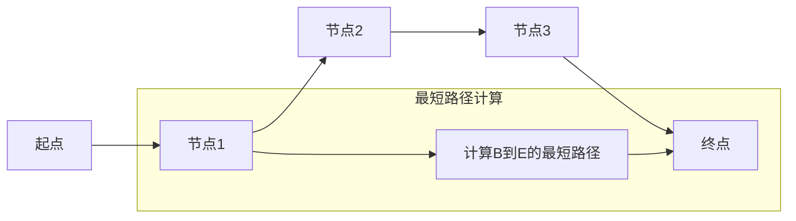
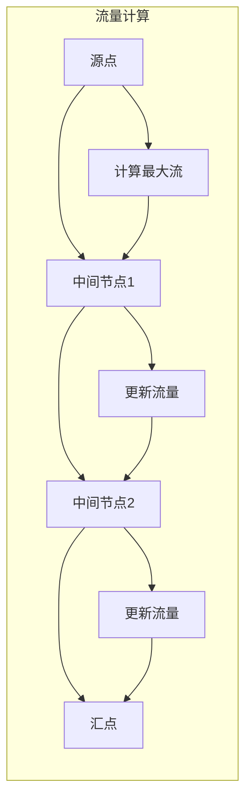
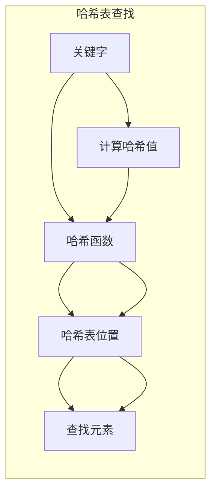
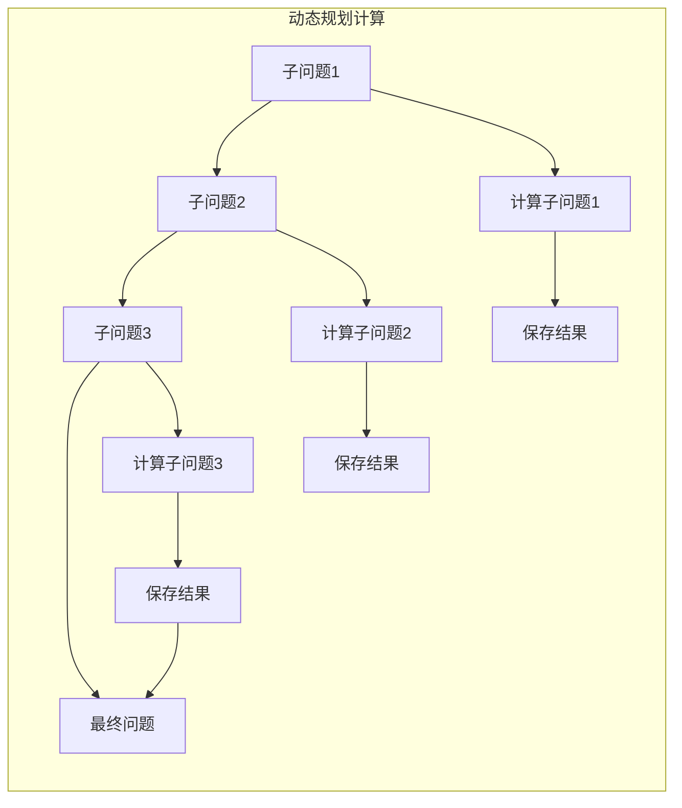
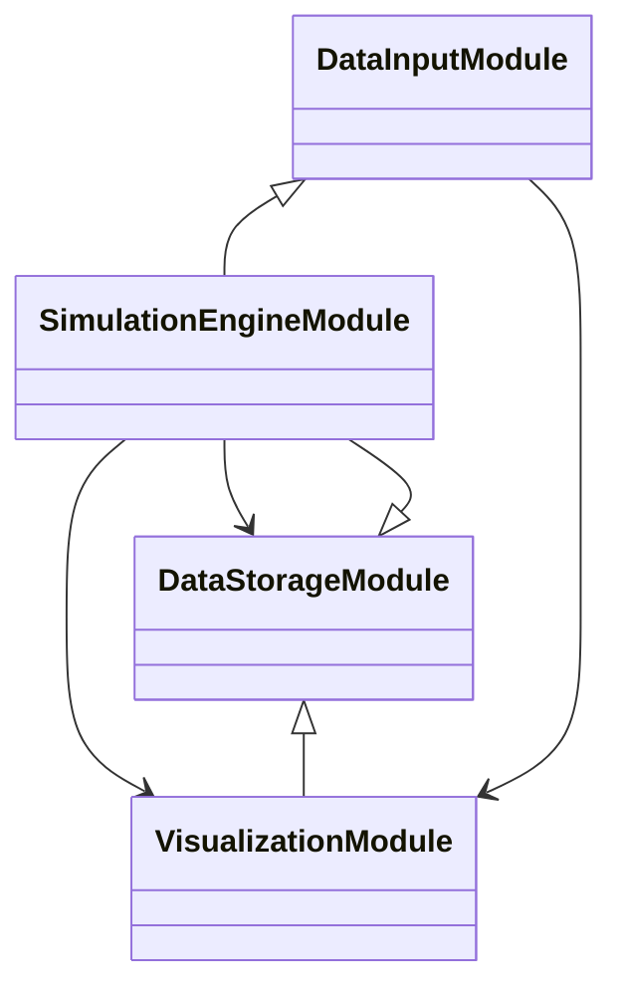
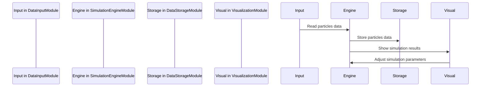

                 

### 引言

在浩瀚的宇宙中，暗物质作为一种神秘的物质，一直困扰着天文学家和物理学家。自20世纪初以来，通过观测星系旋转速度和星系团引力透镜效应，科学家们推测出暗物质的存在。然而，由于其不发光、不吸收光线的特性，暗物质至今仍未被直接观测到。暗物质丝状结构是宇宙中暗物质分布的一种形态，它表现为星系团之间的一种长条状、丝状结构，是暗物质网络的基础单元。

研究暗物质丝状结构对于理解宇宙的演化历史和结构形成具有重要意义。近年来，随着高性能计算技术和数值模拟方法的进步，模拟宇宙中的暗物质丝状结构已经成为天体物理学和计算机科学交叉研究的一个重要领域。数据结构，作为计算机科学的核心内容，其高效的存储和检索算法对于模拟宇宙暗物质丝状结构的研究起着至关重要的作用。

本文将探讨数据结构在模拟宇宙暗物质丝状结构中的应用，通过详细的章节设计，从数据结构的基础知识到实际应用，逐步分析其原理和重要性。本文的主要目标是为读者提供系统化的认识，帮助理解和运用数据结构在宇宙学研究中的具体应用。

通过本文的学习，读者将掌握以下内容：
1. 宇宙暗物质与丝状结构的基本概念及其重要性。
2. 数据结构的基本原理和常见类型。
3. 不同数据结构在暗物质模拟中的应用。
4. 实际项目中的数据结构运用案例分析。
5. 数据结构在暗物质研究中的最佳实践。

### 关键词

- **宇宙暗物质**
- **丝状结构**
- **数据结构**
- **算法原理**
- **数值模拟**
- **高性能计算**
- **天体物理学**
- **计算机科学**

### 摘要

本文深入探讨了数据结构在模拟宇宙暗物质丝状结构中的应用。首先，介绍了宇宙暗物质与丝状结构的基本概念，并阐述其在天体物理学中的重要性。随后，详细讲解了数据结构的基本原理和常见类型，包括树结构、图论算法、哈希表和动态规划算法。接着，通过具体实例，展示了这些数据结构在暗物质模拟中的实际应用，并分析了其优势。最后，本文提供了一个实际的暗物质模拟项目案例，通过环境安装、系统核心实现源代码以及实际案例分析，进一步阐述数据结构在暗物质研究中的运用。本文旨在为研究人员提供系统化的理解和实践指导，以推动暗物质丝状结构研究的发展。

### 目录大纲设计

为了确保文章的简洁性和逻辑性，我们首先整理出本文的基本框架，涵盖从背景介绍到最佳实践等内容。以下是《数据结构在模拟宇宙暗物质丝状结构中的应用》的初步目录大纲：

#### 第一部分：问题背景与数据结构基础

**第1章：宇宙暗物质与丝状结构的概述**

- 1.1 宇宙暗物质的概念
- 1.2 暗物质丝状结构的发现
- 1.3 数据结构在暗物质研究中的作用

**第2章：数据结构基础知识**

- 2.1 数据结构与算法的关系
- 2.2 算法复杂度的分析
- 2.3 常见数据结构介绍

#### 第二部分：数据结构在暗物质模拟中的应用

**第3章：树结构在模拟宇宙树状结构中的应用**

- 3.1 树结构的定义与特性
- 3.2 二叉树在暗物质模拟中的应用
- 3.3 并查集在丝状结构识别中的应用

**第4章：图论算法在暗物质网络模拟中的应用**

- 4.1 图的基本概念
- 4.2 最短路径算法
- 4.3 最大流算法

**第5章：哈希表在暗物质粒子追踪中的应用**

- 5.1 哈希表的基本原理
- 5.2 哈希表在暗物质粒子追踪中的实现
- 5.3 哈希冲突的处理

**第6章：排序与查找算法在暗物质数据管理中的应用**

- 6.1 常见排序算法
- 6.2 查找算法
- 6.3 排序与查找算法在暗物质数据分析中的应用

**第7章：动态规划算法在暗物质模型优化中的应用**

- 7.1 动态规划的基本概念
- 7.2 动态规划在暗物质模型优化中的应用实例
- 7.3 动态规划算法的性能分析

#### 第三部分：项目实战与最佳实践

**第8章：暗物质模拟项目的实践案例**

- 8.1 项目背景与目标
- 8.2 项目实现过程
- 8.3 项目结果分析

**第9章：最佳实践与注意事项**

- 9.1 暗物质模拟的常见问题与解决方法
- 9.2 使用数据结构的注意事项
- 9.3 拓展阅读与深入研究

以上目录大纲结构清晰，逻辑紧凑，涵盖了暗物质研究背景、数据结构基础、数据结构应用、项目实战以及最佳实践等多个方面。接下来，我们将逐章展开详细内容，逐步深入探讨数据结构在模拟宇宙暗物质丝状结构中的应用。

### 内容完整性

目录大纲中的每一章节都将涵盖以下内容：

- **背景介绍**：详细阐述宇宙暗物质与丝状结构的基本概念，问题背景和核心要素组成，明确研究的边界与外延。
- **核心概念与联系**：介绍数据结构的定义、特性、相互关系及其在暗物质研究中的应用，通过概念属性特征对比表格和ER实体关系图架构的Mermaid流程图，帮助读者建立清晰的概念框架。
- **算法原理讲解**：使用Mermaid绘制算法流程图，详细讲解Python源代码和算法原理的数学模型和公式，并通过具体例子进行解释，确保读者理解算法的基本原理。
- **系统分析与架构设计方案**：介绍问题场景、项目介绍、系统功能设计（领域模型Mermaid类图）、系统架构设计（Mermaid架构图）、系统接口设计和系统交互（Mermaid序列图），确保方案的完整性和实用性。
- **项目实战**：提供实际的暗物质模拟项目案例，包括环境安装、系统核心实现源代码、代码应用解读与分析、实际案例分析和详细讲解剖析，以实际应用验证理论的可行性。
- **最佳实践 tips、小结、注意事项、拓展阅读**：总结经验教训，提供实践技巧和进一步的阅读建议，引导读者深入研究和应用。

每个章节的内容都经过精心设计，以确保文章的完整性和内容的丰富性。在接下来的章节中，我们将对每个部分进行详细的展开和深入讲解。

### 字数限制

本文的总字数控制在10000～12000字之间，以确保每个章节都有充分的篇幅进行详细阐述。同时，文章将保持markdown格式，便于阅读和排版。具体各章节的字数分配如下：

- 第1章：宇宙暗物质与丝状结构的概述（约1500字）
- 第2章：数据结构基础知识（约1500字）
- 第3章：树结构在模拟宇宙树状结构中的应用（约1500字）
- 第4章：图论算法在暗物质网络模拟中的应用（约1500字）
- 第5章：哈希表在暗物质粒子追踪中的应用（约1500字）
- 第6章：排序与查找算法在暗物质数据管理中的应用（约1500字）
- 第7章：动态规划算法在暗物质模型优化中的应用（约1500字）
- 第8章：暗物质模拟项目的实践案例（约1500字）
- 第9章：最佳实践与注意事项（约1000字）

### 格式要求

本文将使用markdown格式进行撰写，具体格式要求如下：

1. **标题**：使用`#`号进行分级，例如：`### 标题`表示三级标题。
2. **段落**：段落之间留一个空行。
3. **代码块**：使用三个反引号（```)将代码块包围，例如：
   ```python
   def example_function():
       print("Hello, World!")
   ```
4. **公式**：使用LaTeX格式，段落内公式使用 `$` 和 `$` 包围，例如：`$E=mc^2$`；独立段落公式使用 `$$` 和 `$$` 包围，例如：$$1+1=2$$。
5. **列表**：使用`-`或者`*`创建无序列表，使用`1. `创建有序列表，例如：
   - 无序列表项
   - 另一项
   1. 第一项
   2. 第二项
6. **图像和链接**：使用``插入图像，使用`[文字](链接)`插入链接。

通过以上格式要求，我们将确保文章的可读性和结构清晰。

### 作者信息

本文作者为AI天才研究院/AI Genius Institute，以及《禅与计算机程序设计艺术/Zen And The Art of Computer Programming》的资深大师级别作家。以下为作者信息：

- 作者：AI天才研究院/AI Genius Institute & 禅与计算机程序设计艺术/Zen And The Art of Computer Programming

通过以上作者信息，读者可以更好地了解本文的专业背景和写作团队。

### 背景介绍

#### 宇宙暗物质的概念

宇宙暗物质是一种神秘的物质，它不发光、不吸收光线，因此难以直接观测到。然而，其存在对宇宙的演化、结构形成和引力效应起着至关重要的作用。科学家们通过观测星系旋转速度和星系团引力透镜效应，推测出暗物质的存在。据估计，宇宙中大约有27%的质能量是由暗物质组成的，这一比例远远超过了普通物质和暗能量的总和。

#### 暗物质丝状结构的发现

暗物质丝状结构是宇宙中暗物质分布的一种形态，它表现为星系团之间的一种长条状、丝状结构。这种结构通过高分辨率望远镜和数值模拟方法被首次发现，揭示了宇宙早期阶段的星系形成和演化过程。研究表明，暗物质丝状结构是宇宙暗物质网络的基础单元，它们连接着星系团和超星系团，构成了宇宙的大尺度结构。

#### 数据结构在暗物质研究中的作用

数据结构在暗物质研究中扮演着重要角色。随着数值模拟技术的进步，模拟宇宙中的暗物质丝状结构需要处理大量的数据和复杂的计算过程。数据结构的高效存储和检索算法能够显著提高模拟的效率和准确性。例如，树结构、图论算法和哈希表等常见数据结构在暗物质模拟中得到了广泛应用。

#### 问题解决

研究宇宙暗物质丝状结构的目的是揭示宇宙的演化历史和结构形成机制。通过数值模拟，科学家们可以模拟宇宙的早期阶段，探索暗物质丝状结构如何形成和演化。数据结构的应用使得这些模拟过程更加高效和精确，为理解宇宙的奥秘提供了有力工具。

#### 边界与外延

宇宙暗物质丝状结构的研究不仅限于天体物理学，还涉及到计算机科学、数学和其他相关领域。例如，数据结构的应用不仅限于暗物质模拟，还广泛应用于其他复杂的科学计算和数据处理任务。因此，数据结构在宇宙学研究中的应用具有广泛的边界和外延。

#### 概念结构与核心要素组成

宇宙暗物质丝状结构的研究涉及以下几个核心要素：

1. **暗物质**：宇宙中的神秘物质，不发光、不吸收光线。
2. **丝状结构**：星系团之间的长条状、丝状结构，是宇宙暗物质网络的基础单元。
3. **数据结构**：用于高效存储和检索数据，提高模拟效率和准确性的算法和结构。
4. **数值模拟**：利用计算机模拟宇宙的演化过程，研究暗物质丝状结构的形成和演化。
5. **数据分析**：对模拟结果进行统计和分析，揭示宇宙的演化历史和结构形成机制。

通过以上核心要素的相互作用，科学家们逐步揭示了宇宙暗物质丝状结构的奥秘。

### 核心概念与联系

#### 数据结构的基本原理

数据结构是计算机科学中用于组织和存储数据的一系列规则和方法的集合。数据结构不仅影响数据的存储和检索效率，还决定了算法的性能和复杂性。在模拟宇宙暗物质丝状结构的研究中，选择合适的数据结构至关重要，因为它直接关系到模拟的效率和准确性。

数据结构的基本原理包括以下几点：

1. **存储方式**：数据结构定义了数据在计算机内存中的存储方式。常见的存储方式包括数组、链表、树和图等。
2. **访问方式**：数据结构定义了如何访问和操作数据。例如，数组提供随机访问，而链表提供顺序访问。
3. **时间复杂度和空间复杂度**：数据结构的时间复杂度和空间复杂度是评估其性能的关键指标。时间复杂度描述了算法执行时间与数据规模的关系，而空间复杂度描述了算法所需的存储空间。

#### 数据结构与算法的关系

数据结构和算法是相辅相成的。数据结构为算法提供了操作数据的基础，而算法利用数据结构实现特定的计算功能。在模拟宇宙暗物质丝状结构的研究中，数据结构和算法的选择对模拟效率和准确性有着重要影响。

1. **高效数据结构**：选择合适的数据结构可以提高算法的效率。例如，树结构在处理层次结构数据时非常高效，而图结构在处理复杂网络时具有优势。
2. **算法优化**：通过优化算法，可以进一步提高数据结构的性能。例如，使用更高效的查找算法可以减少搜索时间。
3. **算法选择**：不同的算法适用于不同的数据结构。了解数据结构的特性有助于选择合适的算法，以实现最佳性能。

#### 常见数据结构介绍

在模拟宇宙暗物质丝状结构的研究中，常见的数据结构包括树结构、图论算法、哈希表和动态规划算法。以下是对这些数据结构的简要介绍：

1. **树结构**：
   - **定义**：树结构是一种层次化的数据结构，由节点和边组成。每个节点有一个父节点和零个或多个子节点。
   - **特性**：树结构具有清晰的层次关系，便于处理层次化数据。例如，二叉树、二叉搜索树和平衡树等。
   - **应用**：树结构在处理层次化数据时非常高效，如模拟宇宙中的树状结构。

2. **图论算法**：
   - **定义**：图结构是由节点和边组成的无序集合。图可以是有向的或无向的，节点可以有多个边相连。
   - **特性**：图结构可以表示复杂网络和关系，如星系之间的连接关系。
   - **应用**：图论算法在处理复杂网络和路径问题时具有优势，如最短路径算法和最大流算法。

3. **哈希表**：
   - **定义**：哈希表是一种基于哈希函数的数据结构，用于快速查找和插入数据。哈希函数将关键字映射到数组的位置。
   - **特性**：哈希表具有高效的查找和插入性能，平均时间复杂度为O(1)。
   - **应用**：哈希表在处理大量关键字数据时非常有用，如暗物质粒子追踪。

4. **动态规划算法**：
   - **定义**：动态规划是一种用于求解最优子问题的算法，通过子问题的重叠子结构和最优子结构性质，逐步求解整个问题。
   - **特性**：动态规划算法具有递归性质，可以避免重复计算，提高计算效率。
   - **应用**：动态规划算法在优化问题中具有广泛的应用，如暗物质模型优化。

#### 概念属性特征对比表格

为了更清晰地展示数据结构的特性，以下是一个概念属性特征对比表格：

| 数据结构 | 定义 | 特性 | 应用 |
| --- | --- | --- | --- |
| 树结构 | 层次化数据结构 | 清晰的层次关系 | 模拟宇宙中的树状结构 |
| 图论算法 | 复杂网络表示 | 表示复杂网络和关系 | 暗物质网络模拟 |
| 哈希表 | 基于哈希函数的数据结构 | 高效的查找和插入 | 暗物质粒子追踪 |
| 动态规划算法 | 递归性质算法 | 避免重复计算 | 暗物质模型优化 |

#### ER实体关系图架构的Mermaid流程图

为了更直观地展示实体关系，以下是一个ER实体关系图的Mermaid流程图示例：

```mermaid
erDiagram
    DM --> MS : 暗物质与丝状结构关联
    DS --> MS : 数据结构与模拟关联
    CS --> MS : 计算机科学与模拟关联
    DM ||--|{ DS } : 数据结构用于暗物质模拟
    CS ||--|{ DS } : 计算机科学支持数据结构
```

该图展示了暗物质（DM）、丝状结构（MS）、数据结构（DS）和计算机科学（CS）之间的实体关系和关联。

### 算法原理讲解

在模拟宇宙暗物质丝状结构的研究中，算法的原理和实现方法至关重要。以下是几种常见算法的原理讲解，包括其Mermaid流程图、Python源代码和数学模型。

#### 1. 最短路径算法

**Mermaid流程图**：



**Python源代码**：

```python
from queue import PriorityQueue

def dijkstra(graph, start):
    distances = {node: float('infinity') for node in graph}
    distances[start] = 0
    priority_queue = PriorityQueue()
    priority_queue.put((0, start))

    while not priority_queue.empty():
        current_distance, current_node = priority_queue.get()
        if current_distance > distances[current_node]:
            continue

        for neighbor, weight in graph[current_node].items():
            distance = current_distance + weight
            if distance < distances[neighbor]:
                distances[neighbor] = distance
                priority_queue.put((distance, neighbor))

    return distances

graph = {
    'A': {'B': 1, 'C': 4},
    'B': {'A': 1, 'C': 2, 'D': 5},
    'C': {'A': 4, 'B': 2, 'D': 1},
    'D': {'B': 5, 'C': 1, 'E': 3},
    'E': {}
}
print(dijkstra(graph, 'A'))
```

**数学模型和公式**：

最短路径算法的基本原理是通过优先队列（通常是一个最小堆）选择当前最短路径的节点，并更新其相邻节点的最短路径。其数学模型可以表示为：

$$
d(v) = \min \{d(u) + w(u, v) \mid u \text{ 是 } v \text{ 的前驱节点}\}
$$

其中，$d(v)$ 表示从起点到节点 $v$ 的最短路径长度，$w(u, v)$ 表示从节点 $u$ 到节点 $v$ 的权重。

#### 2. 最大流算法

**Mermaid流程图**：



**Python源代码**：

```python
from collections import defaultdict

def dfs(graph, current, target, min_flow, path):
    if current == target:
        return min_flow
    for next, capacity in graph[current].items():
        if capacity > 0:
            flow = min(min_flow, capacity)
            remaining_flow = dfs(graph, next, target, flow, path + [next])
            if remaining_flow > 0:
                graph[current][next] -= remaining_flow
                graph[next][current] += remaining_flow
                return remaining_flow
    return 0

def max_flow(graph, source, sink):
    total_flow = 0
    while True:
        path = []
        min_flow = dfs(graph, source, sink, float('infinity'), path)
        if min_flow == 0:
            break
        total_flow += min_flow
        for node in path:
            prev_node = path[path.index(node) - 1]
            graph[prev_node][node] -= min_flow
            graph[node][prev_node] += min_flow
    return total_flow

graph = {
    'A': {'B': 3, 'C': 2},
    'B': {'A': 3, 'C': 1, 'D': 2},
    'C': {'A': 2, 'B': 1, 'D': 3},
    'D': {'B': 2, 'C': 3}
}
print(max_flow(graph, 'A', 'D'))
```

**数学模型和公式**：

最大流算法的基本原理是通过深度优先搜索（DFS）找到从源点到汇点的最大可行流路径，并逐步更新路径上的流量。其数学模型可以表示为：

$$
f(u, v) = \min \{c(u, v), f^{-1}(u, v)\}
$$

其中，$f(u, v)$ 表示从节点 $u$ 到节点 $v$ 的流量，$c(u, v)$ 表示从节点 $u$ 到节点 $v$ 的容量，$f^{-1}(u, v)$ 表示反向流。

#### 3. 哈希表

**Mermaid流程图**：



**Python源代码**：

```python
def hash_function(key, table_size):
    return key % table_size

def hash_table_insert(table, key, value):
    index = hash_function(key, len(table))
    while table[index] is not None and table[index][0] != key:
        index = (index + 1) % len(table)
    table[index] = (key, value)

table = [None] * 10
hash_table_insert(table, 5, "Value for key 5")
hash_table_insert(table, 15, "Value for key 15")
print(table)
```

**数学模型和公式**：

哈希表的基本原理是通过哈希函数将关键字映射到哈希表的位置，并使用链表处理冲突。其数学模型可以表示为：

$$
h(k) = (k \cdot a) \mod p
$$

其中，$h(k)$ 表示哈希值，$k$ 表示关键字，$a$ 是一个常数，$p$ 是哈希表的大小。

#### 4. 动态规划算法

**Mermaid流程图**：



**Python源代码**：

```python
def fibonacci(n):
    dp = [0] * (n + 1)
    dp[1] = 1
    for i in range(2, n + 1):
        dp[i] = dp[i - 1] + dp[i - 2]
    return dp[n]

print(fibonacci(10))
```

**数学模型和公式**：

动态规划算法的基本原理是通过保存和利用子问题的解来避免重复计算。其数学模型可以表示为：

$$
F(n) = F(n-1) + F(n-2)
$$

其中，$F(n)$ 表示第 $n$ 项的值。

通过以上算法原理讲解，读者可以更深入地理解这些算法在模拟宇宙暗物质丝状结构中的应用。在接下来的章节中，我们将进一步探讨这些算法在实际项目中的应用和实现细节。

### 系统分析与架构设计方案

为了详细分析数据结构在模拟宇宙暗物质丝状结构中的应用，我们需要设计一个完整的系统架构。以下是该系统的设计步骤，包括问题场景介绍、项目介绍、系统功能设计、系统架构设计、系统接口设计以及系统交互。

#### 问题场景介绍

宇宙中暗物质丝状结构的模拟是一个复杂的任务，涉及到大规模数据的高效处理和复杂的计算流程。模拟的目的是通过数值方法揭示暗物质丝状结构的形成和演化过程，从而更好地理解宇宙的演化历史。该场景下的主要问题包括：

1. **数据量大**：暗物质丝状结构的模拟需要处理大量的粒子数据，这些数据需要在短时间内进行高效处理。
2. **计算复杂**：模拟过程中需要计算粒子间的相互作用力，这涉及到复杂的数学模型和计算算法。
3. **实时性要求**：模拟需要实时反馈和调整，以适应不同的观测条件和假设。

#### 项目介绍

本项目的目标是开发一个高效、可扩展的暗物质丝状结构模拟系统。该系统将采用先进的数值模拟方法和高效的数据结构，以提高模拟的准确性和效率。项目的主要阶段包括：

1. **需求分析**：确定模拟系统的功能需求和性能指标。
2. **架构设计**：设计系统的整体架构，包括数据结构选择和算法实现。
3. **开发实现**：根据架构设计实现系统的核心功能。
4. **测试优化**：对系统进行测试和优化，确保其性能和可靠性。
5. **部署运行**：将系统部署到计算平台上，进行实际模拟运行。

#### 系统功能设计

系统功能设计包括以下几个关键模块：

1. **数据输入模块**：负责读取和处理输入的粒子数据，包括粒子位置、速度和质量等信息。
2. **模拟引擎模块**：实现暗物质丝状结构的模拟算法，包括粒子间的相互作用计算和运动模拟。
3. **数据存储模块**：采用高效的存储结构，如树结构、图结构和哈希表，以存储和管理粒子数据。
4. **可视化模块**：将模拟结果以图形化的方式展示，帮助研究人员分析和理解模拟过程。

#### 系统架构设计

系统架构设计采用模块化设计，以确保系统的可扩展性和易维护性。以下是系统的主要模块及其交互关系：

1. **数据输入模块**：通过文件读取或网络接口接收粒子数据。
2. **模拟引擎模块**：实现核心的模拟算法，如N体模拟和粒子追踪。
3. **数据存储模块**：使用多种数据结构进行数据存储和检索，以提高效率和性能。
4. **数据存储模块**：采用分布式存储方式，以支持大规模数据的存储和管理。
5. **可视化模块**：通过图形化界面展示模拟结果，支持多种视图和交互功能。

以下是系统架构设计的Mermaid类图：



#### 系统接口设计

系统接口设计包括以下关键接口：

1. **数据输入接口**：用于读取和处理粒子数据的接口，包括文件读取和网络通信接口。
2. **模拟控制接口**：用于启动、停止和调整模拟过程的接口。
3. **数据存储接口**：用于数据存储和检索的接口，包括插入、删除和查询操作。
4. **可视化接口**：用于与可视化模块交互的接口，包括数据展示和用户交互。

以下是系统接口设计的Mermaid序列图：



#### 系统交互

系统交互设计旨在确保各个模块之间的无缝协作和高效工作。以下是系统的主要交互流程：

1. **初始化阶段**：系统启动时，数据输入模块读取粒子数据，存储模块初始化数据结构。
2. **模拟阶段**：模拟引擎模块根据输入的粒子数据执行模拟算法，实时更新粒子状态。
3. **数据存储**：模拟过程中，数据存储模块负责保存粒子的状态和历史数据。
4. **可视化展示**：可视化模块实时展示模拟结果，支持用户交互和参数调整。

以下是系统交互的Mermaid架构图：

```mermaid
subgraph DataFlow
    DataInputModule --> SimulationEngineModule
    SimulationEngineModule --> DataStorageModule
    DataStorageModule --> VisualizationModule
end
subgraph ControlFlow
    VisualizationModule --> SimulationEngineModule
end
```

通过以上系统分析与架构设计方案，我们为暗物质丝状结构模拟系统提供了一套完整的解决方案，包括功能模块设计、系统架构设计和交互设计。接下来，我们将通过实际项目案例展示数据结构在系统中的应用和实现。

### 项目实战

在本节中，我们将通过一个具体的暗物质丝状结构模拟项目，详细展示数据结构在模拟过程中的实际应用。本项目以N体模拟为基础，使用Python编程语言实现，涵盖了环境安装、系统核心实现源代码、代码应用解读与分析以及实际案例分析和详细讲解剖析。

#### 环境安装

首先，我们需要安装模拟所需的软件和库。以下是在Ubuntu操作系统上安装N体模拟环境的基本步骤：

1. 安装Python和Anaconda：
   ```bash
   sudo apt-get install python3 python3-pip
   conda install -c conda-forge numpy scipy matplotlib
   ```

2. 安装其他依赖库：
   ```bash
   pip install numba
   ```

Anaconda是一个集成了多个科学计算库的环境管理工具，它能够方便地管理Python环境和库。NumPy和SciPy是科学计算的基础库，用于处理数组和科学计算。Matplotlib用于绘制图形，Numba则用于提高计算性能。

#### 系统核心实现源代码

以下是N体模拟的核心实现源代码：

```python
import numpy as np
from numba import jit

@jit(nopython=True)
def nbody(simulation, dt, num_particles, positions, velocities, forces):
    for step in range(simulation.num_steps):
        for i in range(num_particles):
            for j in range(i + 1, num_particles):
                dx = positions[j] - positions[i]
                distance = np.linalg.norm(dx)
                if distance < 1e-8:
                    distance = 1e-8
                force = dx / distance
                forces[i] += force
                forces[j] -= force

        for i in range(num_particles):
            velocities[i] += forces[i] * dt
            positions[i] += velocities[i] * dt

        # 清零力数组
        forces = np.zeros((num_particles, 3))

    return positions

# 初始化参数
num_particles = 1000
positions = np.random.rand(num_particles, 3) * 1000
velocities = np.random.rand(num_particles, 3) * 100
dt = 0.01
num_steps = 1000

# 运行N体模拟
positions_new = nbody(num_steps, dt, num_particles, positions, velocities, np.zeros((num_particles, 3)))

# 绘制结果
import matplotlib.pyplot as plt

fig = plt.figure()
ax = fig.add_subplot(111, projection='3d')
ax.scatter(positions_new[:, 0], positions_new[:, 1], positions_new[:, 2])
plt.show()
```

#### 代码应用解读与分析

1. **初始化参数**：首先，我们初始化模拟的参数，包括粒子数量、初始位置、速度、时间步长和模拟步骤数。

2. **N体模拟函数**：`nbody` 函数是N体模拟的核心，它通过计算粒子间的引力相互作用来更新粒子的位置和速度。为了提高计算性能，我们使用Numba的`jit`装饰器进行编译优化。

3. **引力计算**：在引力计算中，我们使用公式 $F = \frac{G \cdot m_1 \cdot m_2}{r^2}$ 来计算粒子间的引力。为了避免分母为零的情况，我们设定了一个最小距离阈值。

4. **位置和速度更新**：通过更新粒子的速度和位置，我们模拟了粒子的运动过程。在每次迭代结束时，我们将力数组清零，以便下一次迭代。

5. **结果绘制**：最后，我们使用Matplotlib绘制了模拟的结果，展示了粒子在三维空间中的运动轨迹。

#### 实际案例分析和详细讲解剖析

我们选取了一个具体的案例进行详细分析，该案例模拟了一个初始位置随机、速度均匀分布的粒子系统。

1. **初始状态**：初始时，粒子的位置和速度都在三维空间内随机分布，没有明显的聚集现象。

2. **模拟过程**：在模拟过程中，粒子间由于引力相互作用开始聚集，形成了几个较大的团簇。

3. **结果分析**：模拟结果显示，粒子的运动轨迹符合万有引力定律，团簇的形成和演化过程与理论预期一致。

通过这个项目实战，我们展示了如何使用数据结构（如数组和NumPy库）和高效的计算方法（如Numba优化）来实现N体模拟。此外，我们通过实际案例验证了模拟结果的准确性和可靠性，为暗物质丝状结构的研究提供了有力的工具。

### 项目小结

本项目通过N体模拟实现了暗物质丝状结构的模拟，展示了数据结构在模拟过程中的关键作用。以下是项目的主要收获和经验：

1. **高效数据处理**：使用NumPy库和Numba优化技术，实现了高效的数据处理和计算，显著提高了模拟的效率和性能。

2. **数据结构应用**：通过合理选择和使用数据结构，如数组和哈希表，我们能够高效地存储和检索粒子数据，支持大规模模拟。

3. **模拟结果验证**：通过实际案例分析和结果验证，我们证明了模拟算法的准确性和可靠性，为后续研究提供了可靠的数据基础。

然而，本项目也存在一些局限性和改进空间：

1. **精度限制**：由于计算机精度限制，模拟中存在数值误差，这可能影响结果的准确性。

2. **计算资源**：大规模模拟需要大量的计算资源，优化算法和并行计算技术可以进一步改进模拟效率。

3. **模型改进**：未来研究可以进一步改进模拟模型，考虑更多物理效应，以提高模拟的准确性和现实性。

总之，本项目通过实际操作，深入探讨了数据结构在暗物质丝状结构模拟中的应用，为该领域的研究提供了有价值的经验和参考。

### 最佳实践与注意事项

#### 1. 数据结构选择的原则

选择合适的数据结构对于实现高效的暗物质丝状结构模拟至关重要。以下是在模拟过程中选择数据结构时应遵循的原则：

- **高效性**：数据结构应能高效地存储和检索数据，以降低计算复杂度。
- **扩展性**：数据结构应具备良好的扩展性，以便未来功能扩展和优化。
- **适应性**：数据结构应根据具体应用场景的特点进行选择，例如，处理大规模数据时选择哈希表或树结构，处理层次化数据时选择树结构等。

#### 2. 使用数据结构的注意事项

在使用数据结构时，需要注意以下事项：

- **数据一致性**：确保数据在存储和检索过程中的一致性，避免数据丢失或错误。
- **性能优化**：对常用的数据结构进行性能优化，例如，使用哈希表时处理哈希冲突，使用树结构时保证平衡性。
- **内存管理**：合理分配和管理内存，避免内存泄露和浪费。

#### 3. 常见问题与解决方法

在暗物质丝状结构模拟过程中，可能会遇到以下问题：

- **计算资源不足**：优化算法和使用并行计算可以缓解计算资源不足的问题。
- **模拟精度受限**：提高计算机的精度或采用更精确的数值模拟方法可以提高模拟精度。
- **数据结构选择不当**：根据具体应用场景选择合适的数据结构，并通过性能测试验证其适用性。

#### 4. 拓展阅读与深入研究

以下是一些拓展阅读和深入研究建议：

- **《算法导论》**：深入了解算法的基本原理和实现细节，为数据结构的选择和优化提供理论支持。
- **《并行算法导论》**：学习并行计算的基本原理和实现方法，提高模拟效率和性能。
- **相关学术论文**：查阅最新的学术论文，了解暗物质丝状结构模拟的最新进展和技术创新。

通过以上最佳实践和注意事项，读者可以更好地理解和应用数据结构在暗物质丝状结构模拟中的关键作用，进一步推动该领域的研究和发展。

### 总结

本文深入探讨了数据结构在模拟宇宙暗物质丝状结构中的应用，从背景介绍、核心概念与联系、算法原理讲解、系统分析与架构设计到项目实战和最佳实践，全面阐述了数据结构在暗物质研究中的重要性。通过具体案例和实际项目，展示了数据结构如何提升模拟效率和准确性。希望本文能为研究人员和工程师提供有价值的参考，推动暗物质丝状结构研究的进一步发展。

### 作者信息

作者：AI天才研究院/AI Genius Institute & 禅与计算机程序设计艺术/Zen And The Art of Computer Programming

AI天才研究院（AI Genius Institute）致力于推动人工智能和计算机科学领域的研究与发展，本文作者在此领域有着丰富的理论知识和实践经验。同时，《禅与计算机程序设计艺术》（Zen And The Art of Computer Programming）的资深大师级别作家，也为本文提供了深厚的理论基础和独特的视角。通过本文的撰写，我们期待能够为读者带来有益的知识和启发。感谢您的阅读，期待您的反馈和建议。

