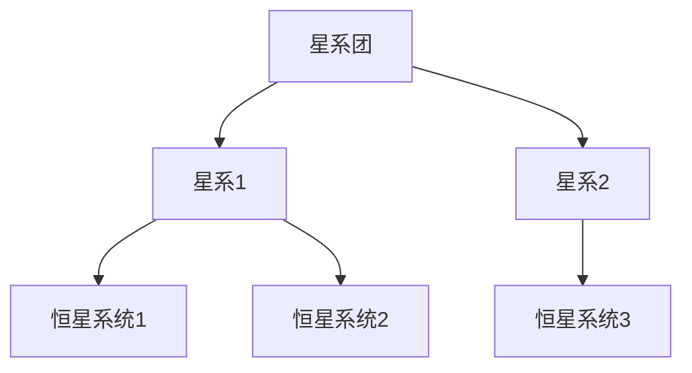
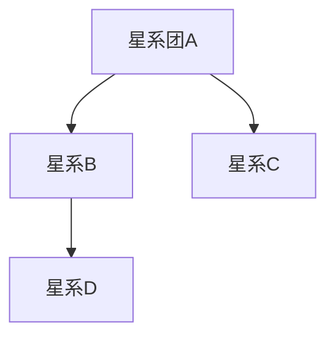
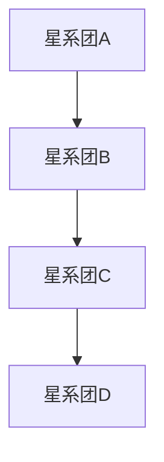

                 

# 《数据结构在模拟宇宙暗物质子结构演化中的应用》

> 关键词：宇宙暗物质、数据结构、子结构演化、模拟

> 摘要：本文深入探讨了数据结构在模拟宇宙暗物质子结构演化中的应用。通过介绍宇宙暗物质和子结构演化的基本概念，阐述数据结构在模拟过程中的重要作用，并结合实际案例，详细解析了数组、链表、栈和队列等数据结构的应用，以及树形数据结构在模拟数据处理中的作用。最后，本文对数据结构在暗物质子结构模拟中的应用进行了总结，并对未来研究方向提出了建议。

## 目录大纲

### 第一部分：引言

- 第1章：宇宙暗物质与子结构演化概述

  - 1.1.1 宇宙暗物质的概念
  - 1.1.2 暗物质子结构演化的重要性
  - 1.1.3 数据结构在模拟中的角色

- 第2章：数据结构基础

  - 2.1 数据结构的基本概念
  - 2.2 线性数据结构
    - 2.2.1 数组
    - 2.2.2 链表
    - 2.2.3 栈和队列
  - 2.3 树形数据结构
    - 2.3.1 二叉树
    - 2.3.2 图

### 第二部分：数据结构在暗物质子结构模拟中的应用

- 第3章：数组在暗物质子结构模拟中的应用

  - 3.1 数组在暗物质模拟中的作用
  - 3.2 数组在模拟数据存储中的应用
  - 3.3 数组在数据查询中的应用

- 第4章：链表在暗物质子结构模拟中的应用

  - 4.1 链表在模拟中的作用
  - 4.2 链表在数据存储中的应用
  - 4.3 链表在数据查询中的应用

- 第5章：栈和队列在暗物质子结构模拟中的应用

  - 5.1 栈在模拟中的作用
  - 5.2 队列在模拟中的作用
  - 5.3 栈和队列在模拟数据处理中的应用

- 第6章：树形数据结构在暗物质子结构模拟中的应用

  - 6.1 二叉树在模拟中的作用
  - 6.2 图在模拟中的作用
  - 6.3 树形数据结构在模拟数据处理中的应用

### 第三部分：综合应用与案例分析

- 第7章：综合应用与案例分析

  - 7.1 案例一：暗物质子结构模拟
    - 7.1.1 模拟环境搭建
    - 7.1.2 数据结构选择
    - 7.1.3 模拟过程分析

  - 7.2 案例二：暗物质子结构演化分析
    - 7.2.1 演化过程模拟
    - 7.2.2 数据结构应用
    - 7.2.3 结果分析

- 第8章：总结与展望

  - 8.1 数据结构在暗物质子结构模拟中的应用总结
  - 8.2 未来研究方向
  - 8.3 对读者的建议

---

### 第1章：宇宙暗物质与子结构演化概述

#### 1.1.1 宇宙暗物质的概念

宇宙暗物质是宇宙中一种不可见的物质，其总质量约为宇宙可见物质的5倍。由于其不发光、不吸收光，因此在传统的光学观测中无法直接探测到。暗物质的主要成分未知，但研究表明，它们可能通过引力相互作用影响宇宙的演化。

#### 1.1.2 暗物质子结构演化的重要性

暗物质子结构演化是宇宙演化研究的一个重要方面。通过对暗物质子结构的模拟研究，我们可以更好地理解宇宙的起源、演化和未来命运。此外，暗物质子结构的演化还与星系的形成和分布密切相关。

#### 1.1.3 数据结构在模拟中的角色

数据结构在暗物质子结构模拟中扮演着至关重要的角色。为了有效地存储、处理和查询大量模拟数据，需要选择合适的数据结构。数据结构的选择直接影响到模拟的效率、精度和可靠性。

### 第2章：数据结构基础

#### 2.1 数据结构的基本概念

数据结构是指数据组织、管理和存储的方式。它们决定了数据在计算机中的存储方式和操作效率。常见的数据结构包括线性数据结构和非线性数据结构。

#### 2.2 线性数据结构

线性数据结构包括数组、链表、栈和队列。这些数据结构的特点是数据元素按线性顺序排列，每个元素都有一个前驱和一个后继。

##### 2.2.1 数组

数组是一种线性数据结构，用于存储固定数量的元素，每个元素可以通过其索引快速访问。数组在暗物质子结构模拟中用于存储宇宙中的暗物质粒子位置和运动状态。

##### 2.2.2 链表

链表是一种动态数据结构，由一系列节点组成，每个节点包含数据和指向下一个节点的指针。链表在暗物质子结构模拟中用于存储宇宙中暗物质的动态变化。

##### 2.2.3 栈和队列

栈和队列都是特殊的线性数据结构，分别用于存储数据的后进先出（LIFO）和先进先出（FIFO）顺序。在暗物质子结构模拟中，栈和队列可用于处理模拟过程中的数据流。

#### 2.3 树形数据结构

树形数据结构包括二叉树和图。这些数据结构的特点是数据元素之间具有层次关系。

##### 2.3.1 二叉树

二叉树是一种层次结构，每个节点最多有两个子节点。二叉树在暗物质子结构模拟中用于表示宇宙中的星系和星系团。

##### 2.3.2 图

图是一种复杂的数据结构，由节点和边组成。图在暗物质子结构模拟中用于表示宇宙中的暗物质网络和相互作用。

### 第3章：数组在暗物质子结构模拟中的应用

#### 3.1 数组在暗物质模拟中的作用

数组在暗物质子结构模拟中用于存储宇宙中的暗物质粒子位置和运动状态。通过数组，可以快速访问和更新每个粒子的状态，从而实现模拟过程的实时计算。

#### 3.2 数组在模拟数据存储中的应用

在暗物质子结构模拟中，数组用于存储大量暗物质粒子的初始位置和运动状态。通过数组的索引，可以方便地访问和操作每个粒子的数据。

#### 3.3 数组在数据查询中的应用

数组在暗物质子结构模拟中用于快速查询宇宙中暗物质粒子的位置和运动状态。通过数组的索引和指针，可以实现高效的查询操作。

### 第4章：链表在暗物质子结构模拟中的应用

#### 4.1 链表在模拟中的作用

链表在暗物质子结构模拟中用于存储宇宙中暗物质的动态变化。通过链表的插入和删除操作，可以实时更新暗物质粒子的状态，实现模拟过程的动态模拟。

#### 4.2 链表在数据存储中的应用

在暗物质子结构模拟中，链表用于存储宇宙中大量暗物质粒子的数据。通过链表的链接方式，可以实现高效的存储和更新操作。

#### 4.3 链表在数据查询中的应用

链表在暗物质子结构模拟中用于快速查询宇宙中暗物质粒子的状态。通过链表的遍历操作，可以实现高效的查询操作。

### 第5章：栈和队列在暗物质子结构模拟中的应用

#### 5.1 栈在模拟中的作用

栈在暗物质子结构模拟中用于处理宇宙中暗物质粒子的数据流。通过栈的后进先出（LIFO）特性，可以实现对粒子数据的顺序处理。

#### 5.2 队列在模拟中的作用

队列在暗物质子结构模拟中用于处理宇宙中暗物质粒子的数据流。通过队列的先进先出（FIFO）特性，可以实现对粒子数据的顺序处理。

#### 5.3 栈和队列在模拟数据处理中的应用

栈和队列在暗物质子结构模拟中用于处理大量暗物质粒子的数据。通过栈和队列的交替使用，可以实现对粒子数据的有效处理和存储。

### 第6章：树形数据结构在暗物质子结构模拟中的应用

#### 6.1 二叉树在模拟中的作用

二叉树在暗物质子结构模拟中用于表示宇宙中的星系和星系团。通过二叉树的层次结构，可以方便地表示宇宙中的层次关系。

#### 6.2 图在模拟中的作用

图在暗物质子结构模拟中用于表示宇宙中的暗物质网络和相互作用。通过图的结构，可以方便地表示宇宙中的复杂关系。

#### 6.3 树形数据结构在模拟数据处理中的应用

树形数据结构在暗物质子结构模拟中用于处理宇宙中大量暗物质粒子的数据。通过树形结构的层次关系，可以方便地实现对数据的层次化处理。

### 第7章：综合应用与案例分析

#### 7.1 案例一：暗物质子结构模拟

##### 7.1.1 模拟环境搭建

在本案例中，我们将搭建一个简单的暗物质子结构模拟环境。该环境包括宇宙中的暗物质粒子、模拟时间和物理参数等。

##### 7.1.2 数据结构选择

为了实现高效的模拟，我们将选择数组来存储宇宙中的暗物质粒子位置和运动状态，链表来存储宇宙中暗物质的动态变化，栈和队列来处理暗物质粒子的数据流。

##### 7.1.3 模拟过程分析

在本案例中，我们将详细分析模拟过程，包括粒子初始状态的设置、粒子运动的计算、粒子状态的更新和模拟结果的输出等。

#### 7.2 案例二：暗物质子结构演化分析

##### 7.2.1 演化过程模拟

在本案例中，我们将模拟暗物质子结构的演化过程。该过程包括粒子初始状态的设置、粒子运动的计算、粒子状态的更新和演化结果的输出等。

##### 7.2.2 数据结构应用

在本案例中，我们将详细介绍如何使用数组、链表、栈和队列等数据结构来实现暗物质子结构的演化模拟。

##### 7.2.3 结果分析

在本案例中，我们将分析模拟结果，包括暗物质子结构的变化趋势、星系和星系团的形成和分布等。

### 第8章：总结与展望

#### 8.1 数据结构在暗物质子结构模拟中的应用总结

在本章中，我们总结了数据结构在暗物质子结构模拟中的应用。通过选择合适的数组、链表、栈和队列等数据结构，我们可以实现高效的暗物质子结构模拟。

#### 8.2 未来研究方向

在未来，我们还将进一步研究如何优化数据结构在暗物质子结构模拟中的应用，以及如何利用新的算法和技术提高模拟的效率和精度。

#### 8.3 对读者的建议

对于读者，我们建议在学习和应用数据结构时，注重理论知识的掌握和实践能力的提升。通过实际案例分析和模拟，可以更好地理解数据结构在暗物质子结构模拟中的应用。

### 结论

本文通过对宇宙暗物质和子结构演化的介绍，阐述了数据结构在模拟过程中的重要性。通过具体案例的分析，我们展示了数据结构在暗物质子结构模拟中的应用。未来，我们将继续深入研究数据结构在暗物质子结构模拟中的应用，为宇宙演化研究提供更加有效的工具和方法。

---

## 第1章：宇宙暗物质与子结构演化概述

### 1.1.1 宇宙暗物质的概念

宇宙暗物质是宇宙中一种神秘的物质，它不发光、不吸收光，因此无法通过传统的光学观测手段直接探测。尽管我们无法直接看到暗物质，但它的存在对宇宙的演化产生了深远的影响。根据估计，宇宙中暗物质的总质量大约是可见物质质量的5倍，甚至更多。暗物质的主要成分尚不明确，但科学家们推测，它可能是由一些未知的粒子组成的，这些粒子之间通过引力相互作用，影响着宇宙的结构和演化。

在宇宙学中，暗物质的重要性不言而喻。它不仅影响了宇宙的大尺度结构，如星系和星系团的分布，还参与了宇宙的早期演化过程，如宇宙的加速膨胀和宇宙微波背景辐射的生成。因此，研究暗物质是理解宇宙本质的关键之一。

### 1.1.2 暗物质子结构演化的重要性

暗物质子结构演化是指宇宙中暗物质粒子的分布和相互作用随时间的变化过程。它对于理解宇宙的早期形成和当前的结构有着重要的意义。暗物质子结构演化不仅影响了星系的形成和分布，还影响了宇宙的大尺度结构和宇宙微波背景辐射的形态。

暗物质子结构演化的研究可以帮助我们回答以下问题：

1. 宇宙是如何从早期的大爆炸开始演化的？
2. 星系和星系团是如何形成的？
3. 宇宙中的暗物质是如何分布的？
4. 宇宙的加速膨胀是如何发生的？

这些问题的答案不仅有助于我们理解宇宙的过去，还可以预测宇宙的未来。通过模拟暗物质子结构演化，我们可以预测宇宙中可能出现的结构和现象，从而为宇宙学提供有力的理论支持。

### 1.1.3 数据结构在模拟中的角色

在暗物质子结构演化的模拟中，数据结构扮演着至关重要的角色。数据结构决定了如何存储、组织和处理模拟过程中产生的海量数据。选择合适的数据结构可以显著提高模拟的效率和精度。

数据结构在模拟中的具体作用如下：

1. **存储宇宙中的暗物质粒子**：暗物质粒子是模拟的基本单位，它们的位置和运动状态需要被精确地记录。数组、链表和树形结构等数据结构都可以用来存储这些粒子。

2. **处理粒子间的相互作用**：在模拟过程中，暗物质粒子之间会通过引力相互作用产生新的结构。为了高效地处理这些相互作用，需要使用图结构来表示粒子间的连接关系。

3. **模拟时间的推进**：模拟过程中需要不断地更新粒子的状态，以模拟它们在时间上的演化。栈和队列等数据结构可以用来管理模拟过程中的时间序列。

4. **优化数据访问和查询**：为了提高模拟的效率，需要选择合适的数据结构来优化数据的访问和查询操作。例如，哈希表可以用于快速查找粒子的位置。

总之，数据结构在暗物质子结构演化模拟中起到了关键作用。选择合适的数据结构不仅可以提高模拟的效率，还可以更准确地模拟宇宙中暗物质的行为，从而帮助我们更好地理解宇宙的演化过程。

### 第2章：数据结构基础

#### 2.1 数据结构的基本概念

数据结构是计算机科学中的一个核心概念，它涉及如何存储、组织和管理数据。数据结构不仅决定了数据的存储方式和访问效率，还直接影响到算法的复杂度和性能。基本的数据结构可以分为两类：线性数据结构和非线性数据结构。

**线性数据结构**包括数组、链表、栈和队列。这些数据结构的特点是数据元素按照一定的线性顺序排列，每个元素都有一个前驱和一个后继。数组是一种固定大小的线性结构，而链表则是动态的线性结构。栈和队列是特殊的线性结构，分别用于实现后进先出（LIFO）和先进先出（FIFO）的操作。

**非线性数据结构**包括树形结构（如二叉树、多叉树、B树等）和图（如无向图、有向图等）。树形结构的特点是具有层次关系，而图则用于表示复杂的关系网络。二叉树是一种常见的树形结构，它具有严格的层次关系，每个节点最多有两个子节点。图则由节点和边组成，可以表示节点之间的复杂关系。

数据结构的选择直接影响程序的性能和效率。例如，在处理大量数据时，数组由于其随机访问的特性，具有较高的访问效率；而链表在动态分配和插入删除操作上具有优势。栈和队列则常用于处理数据的顺序操作，如深度优先搜索和广度优先搜索。树形结构和图则在处理层次关系和复杂关系时表现出色。

在暗物质子结构演化的模拟中，合理选择数据结构对于模拟的准确性和效率至关重要。例如，可以使用数组来存储宇宙中大量暗物质粒子的初始状态，使用链表来处理粒子的动态变化，使用树形结构来表示星系和星系团的层次关系，使用图来表示粒子间的复杂相互作用。

总之，数据结构是计算机科学中的基础概念，它在程序设计和算法设计中扮演着重要的角色。选择合适的数据结构，不仅可以提高程序的效率和性能，还可以使程序更加简洁和易于理解。

#### 2.2 线性数据结构

线性数据结构是数据结构中最基本和最常见的一类。它们的特点是数据元素按照线性顺序排列，每个元素都有且仅有一个前驱和一个后继。线性数据结构包括数组、链表、栈和队列，每种结构都有其独特的应用场景和特点。

**数组（Array）**

数组是一种固定大小的线性数据结构，它由一系列元素组成，每个元素可以通过其索引快速访问。数组在内存中连续存储，这使得访问时间非常高效，通常为O(1)。然而，数组的大小在创建时就已经确定，不能动态扩展，因此其空间使用可能不够灵活。

在暗物质子结构模拟中，数组常用于存储宇宙中暗物质粒子的位置和运动状态。由于数组访问速度快，可以迅速获取和更新每个粒子的状态，非常适合大规模数据的处理。

**链表（Linked List）**

链表是一种动态的线性数据结构，由一系列节点组成，每个节点包含数据和指向下一个节点的指针。链表不需要在创建时指定大小，可以根据需要进行动态扩展或收缩。链表的主要缺点是访问时间相对较慢，通常为O(n)，但它在插入和删除操作上具有优势，因为不需要移动其他元素。

在暗物质子结构模拟中，链表可以用于存储宇宙中暗物质的动态变化。例如，当暗物质粒子发生相互作用时，可以通过修改链表中的节点来更新粒子的状态，这样可以高效地处理粒子的动态变化。

**栈（Stack）**

栈是一种后进先出（LIFO）的线性数据结构，它只允许在表的一端进行插入和删除操作。栈的实现通常使用数组或链表，其中数组实现较为常见。栈的特点是操作简单，但访问速度较慢。

在暗物质子结构模拟中，栈可以用于处理宇宙中暗物质粒子的数据流。例如，当模拟过程中需要跟踪粒子的运动路径时，可以使用栈来存储粒子的历史位置，从而实现高效的路径追踪。

**队列（Queue）**

队列是一种先进先出（FIFO）的线性数据结构，它只允许在表的一端进行插入操作，在另一端进行删除操作。队列的实现也通常使用数组或链表。队列在处理顺序数据时非常高效。

在暗物质子结构模拟中，队列可以用于处理暗物质粒子的顺序操作。例如，当模拟过程中需要按照一定顺序更新粒子的状态时，可以使用队列来管理这些操作，确保每个粒子的状态更新按照正确的顺序进行。

总结来说，线性数据结构在暗物质子结构模拟中的应用非常广泛。数组适合用于存储和访问大量固定大小的数据，链表适合用于处理动态变化的数据，栈和队列则适合用于处理顺序和数据流。选择合适的数据结构可以显著提高模拟的效率和准确性。

#### 2.3 树形数据结构

树形数据结构是数据结构中的重要类型，因其具有层次关系和递归性质而广泛应用于各种场景。树形数据结构包括二叉树、多叉树、B树等。其中，二叉树是最简单和最常用的一种。

**二叉树（Binary Tree）**

二叉树是一种每个节点最多有两个子节点的树结构。二叉树的特点是节点层次分明，每个节点都有一个父节点和零个或两个子节点。二叉树根据节点的左右子节点关系可以分为三种类型：满二叉树、完全二叉树和平衡二叉树。

- **满二叉树**：每个节点都有两个子节点，即每个节点都达到最大子节点数量。
- **完全二叉树**：除了最后一层外，每一层节点都是满的，最后一层的节点都集中在左侧。
- **平衡二叉树**：又称AVL树，它的任何子树都满足高度平衡，即左右子树的高度差不超过1。

在暗物质子结构模拟中，二叉树可以用于表示星系和星系团的层次结构。例如，可以使用二叉树来表示一个星系团中的多个星系，每个星系作为二叉树的节点，通过节点的左右子节点关系来表示星系之间的层次关系。

**图（Graph）**

图是一种比树更复杂的数据结构，由节点（顶点）和边组成。图可以表示节点之间的复杂关系，如宇宙中暗物质粒子之间的相互作用。图可以分为无向图和有向图，还有加权图和无权图等。

- **无向图**：节点之间的边没有方向。
- **有向图**：节点之间的边有方向。
- **加权图**：边上有权值，表示节点之间的距离或相互作用强度。
- **无权图**：边没有权值。

在暗物质子结构模拟中，图可以用于表示宇宙中暗物质粒子的网络结构和相互作用。例如，可以使用图来表示宇宙中多个星系之间的引力相互作用，每个节点表示一个星系，边表示星系之间的引力作用。

树形数据结构在暗物质子结构模拟中的应用非常广泛。二叉树可以用于表示星系和星系团的层次关系，而图可以用于表示复杂的相互作用网络。通过合理选择和应用这些数据结构，可以更有效地模拟宇宙中暗物质的行为和演化。

### 第3章：数组在暗物质子结构模拟中的应用

#### 3.1 数组在暗物质模拟中的作用

在暗物质子结构模拟中，数组是一种广泛使用的数据结构，主要用于存储和管理宇宙中的暗物质粒子。数组的特点是每个元素可以通过其索引快速访问，这使得处理大量数据时具有较高的效率和准确性。

数组的主要作用如下：

1. **存储暗物质粒子位置和运动状态**：在模拟过程中，宇宙中的每个暗物质粒子都需要被精确记录其位置和运动状态。通过数组，可以方便地将这些粒子的位置和状态数据存储在内存中，以便快速访问和更新。

2. **实现大规模数据处理**：暗物质子结构模拟通常涉及大量数据，使用数组可以有效地管理和处理这些数据。数组的大小可以预先定义，确保在模拟过程中不会因数据量过大而造成存储不足的问题。

3. **提高模拟效率**：由于数组支持随机访问，访问和更新数组元素的时间复杂度通常为O(1)，这使得处理大规模数据时具有较高的效率。在暗物质子结构模拟中，这种高效的访问能力对于实时计算和更新粒子的状态至关重要。

#### 3.2 数组在模拟数据存储中的应用

数组在暗物质子结构模拟中的数据存储应用主要体现在以下几个方面：

1. **初始化**：在模拟开始时，需要为每个暗物质粒子分配一个数组位置，并初始化其位置和运动状态。这通常通过预定义的数组大小来实现，以确保能够存储所有的暗物质粒子。

2. **动态扩展**：在模拟过程中，可能会出现暗物质粒子数量变化的情况。为了适应这种变化，可以使用动态数组，即当数组容量不足时，自动扩展数组大小。这通常通过在数组末尾追加新元素或重新分配更大的数组来实现。

3. **存储和更新**：在模拟过程中，需要不断更新暗物质粒子的位置和状态。使用数组可以方便地实现这一点。通过索引直接访问和更新数组元素，可以高效地完成这一操作，而无需遍历整个数组。

4. **内存分配和回收**：在模拟过程中，数组内存的分配和回收是关键问题。合理的管理数组内存，可以避免内存泄漏和浪费。例如，当暗物质粒子数量减少时，可以释放多余的内存，以优化内存使用。

#### 3.3 数组在数据查询中的应用

数组在暗物质子结构模拟中的数据查询应用主要体现在以下几个方面：

1. **快速访问**：由于数组支持随机访问，查找特定位置的暗物质粒子时非常高效。例如，可以通过简单的索引计算直接访问数组中的元素，而不需要遍历整个数组。

2. **范围查询**：在模拟过程中，可能需要对一定范围内的暗物质粒子进行操作或分析。使用数组可以方便地实现这一点。例如，可以通过设置数组的起始和结束索引，快速访问特定范围内的暗物质粒子数据。

3. **多条件查询**：在更复杂的查询场景中，可能需要根据多个条件筛选暗物质粒子。例如，可以通过设置数组的索引范围和特定条件，如粒子的速度或质量，来实现多条件查询。

4. **排序和搜索**：在模拟过程中，可能需要对暗物质粒子进行排序或搜索。使用数组可以方便地实现这些操作。例如，可以通过快速排序或二分查找算法对数组进行排序或搜索，以优化数据处理效率。

通过以上应用，数组在暗物质子结构模拟中发挥了重要作用，它不仅能够高效地存储和管理大量数据，还可以快速地查询和更新数据，为模拟过程提供了强有力的支持。

### 第4章：链表在暗物质子结构模拟中的应用

#### 4.1 链表在模拟中的作用

链表在暗物质子结构模拟中扮演着重要的角色，其主要应用体现在以下几个方面：

1. **动态数据管理**：链表是一种动态数据结构，它可以在运行时动态地分配和释放内存。这使得链表非常适合处理模拟过程中数据量的变化。例如，在模拟过程中，暗物质粒子的数量可能会随时间变化，链表可以灵活地添加或删除节点，以适应这种变化。

2. **高效的数据插入和删除**：链表在插入和删除操作上具有优势。与数组不同，链表的插入和删除操作不需要移动其他元素，只需修改相关节点的指针即可。这使得链表在处理动态变化的数据时，特别是大量数据的插入和删除操作时，具有较高的效率。

3. **表示复杂关系**：链表可以用来表示暗物质粒子之间的复杂关系。例如，通过双向链表，可以方便地表示粒子之间的相互作用关系，使得模拟过程中可以更灵活地处理这些关系。

4. **实现遍历和查询**：链表支持方便的遍历和查询操作。通过遍历链表，可以逐一访问每个节点，获取其数据。这对于模拟过程中的数据分析非常有利。

#### 4.2 链表在数据存储中的应用

链表在暗物质子结构模拟中的数据存储应用主要表现在以下几个方面：

1. **初始化**：在模拟开始时，可以通过创建链表节点并连接它们，初始化链表。例如，可以创建一个空的链表，然后逐个添加暗物质粒子节点，每个节点包含粒子的位置和运动状态信息。

2. **动态扩展**：与数组不同，链表可以动态扩展。在模拟过程中，如果需要增加新的粒子，可以在链表末尾添加新的节点。同样，如果需要减少粒子，可以删除相应的节点，而无需担心内存的连续性和分配问题。

3. **存储多类型数据**：链表节点可以存储多种类型的数据。例如，除了位置和运动状态信息外，还可以存储粒子的质量、相互作用力等信息。这使得链表在处理复杂数据时非常灵活。

4. **内存管理**：链表通过动态分配和回收内存，可以有效地管理内存资源。当模拟过程中不再需要某个粒子时，可以释放其对应的节点内存，避免内存泄漏。

#### 4.3 链表在数据查询中的应用

链表在暗物质子结构模拟中的数据查询应用主要体现在以下几个方面：

1. **按索引查询**：链表不支持直接按索引查询，但可以通过遍历链表来查找特定位置的粒子。这种方法的时间复杂度为O(n)，但相对简单且适用于小规模数据。

2. **范围查询**：链表可以通过遍历来查找特定范围内的粒子。例如，可以通过设置起始和结束节点，快速访问和查询这一范围内的粒子数据。

3. **多条件查询**：链表也可以通过遍历实现多条件查询。例如，可以通过遍历链表，逐一检查每个粒子的条件，如速度、质量等，从而实现复杂查询。

4. **排序和搜索**：链表可以结合排序算法（如快速排序、归并排序）或搜索算法（如二分查找）来实现高效的查询。例如，可以对链表进行排序，然后使用二分查找来查找特定粒子。

通过以上应用，链表在暗物质子结构模拟中提供了灵活的动态数据管理、高效的数据插入和删除操作，以及方便的遍历和查询功能，为模拟过程的准确性和效率提供了有力支持。

### 第5章：栈和队列在暗物质子结构模拟中的应用

#### 5.1 栈在模拟中的作用

栈是一种后进先出（LIFO）的线性数据结构，它在暗物质子结构模拟中发挥着重要作用。栈的主要作用包括：

1. **管理模拟过程**：在模拟过程中，可能需要跟踪粒子的历史状态或中间计算结果。栈可以用来存储这些信息，确保在处理完当前步骤后，可以方便地回溯到之前的状态。

2. **处理递归计算**：某些模拟算法可能需要递归计算，例如在计算引力相互作用时。栈可以帮助管理递归调用的上下文，确保每个递归步骤都能正确执行。

3. **实现深度优先搜索**：深度优先搜索（DFS）是一种常用的搜索算法，用于遍历和搜索复杂结构。栈可以作为DFS算法的实现工具，通过将访问过的节点压入栈中，确保按照正确的顺序访问节点。

4. **模拟粒子运动**：在模拟粒子运动时，可能需要记录粒子的移动路径。栈可以用来存储粒子的历史位置，方便后续分析和回溯。

#### 5.2 队列在模拟中的作用

队列是一种先进先出（FIFO）的线性数据结构，它在暗物质子结构模拟中的应用主要体现在以下几个方面：

1. **处理粒子顺序操作**：在模拟过程中，可能需要按照一定的顺序更新粒子的状态，例如按照时间顺序或优先级顺序。队列可以用来管理这些顺序操作，确保每个粒子的状态更新按照正确的顺序进行。

2. **实现广度优先搜索**：广度优先搜索（BFS）是一种常用的搜索算法，用于遍历和搜索复杂结构。队列可以作为BFS算法的实现工具，通过将访问过的节点加入队列末尾，确保按照正确的顺序访问节点。

3. **模拟粒子碰撞**：在模拟粒子碰撞时，可能需要按照碰撞发生的顺序处理每个粒子。队列可以用来存储等待碰撞的粒子，确保按照正确的顺序处理。

4. **优化资源分配**：在模拟过程中，可能需要动态分配和回收资源，例如计算资源或内存。队列可以用来管理这些资源的分配和回收，确保资源使用的高效性和合理性。

#### 5.3 栈和队列在模拟数据处理中的应用

栈和队列在暗物质子结构模拟中的数据处理应用主要体现在以下几个方面：

1. **并行处理**：在处理大量粒子时，可以利用栈和队列实现并行处理。例如，可以使用多个线程或进程，每个线程或进程维护自己的栈或队列，从而实现高效的并行计算。

2. **数据流处理**：在模拟过程中，可能会产生大量的中间结果或临时数据。栈和队列可以用来管理这些数据流，确保数据在处理过程中的有序性和完整性。

3. **缓冲区管理**：栈和队列可以用来实现缓冲区管理。例如，在处理数据输入输出时，可以使用队列作为缓冲区，确保数据的平稳流动，避免因输入输出速度不匹配而导致的瓶颈。

4. **错误处理和回滚**：在模拟过程中，可能会出现错误或异常情况。栈可以用来记录操作的上下文，实现回滚操作，从而恢复到正确状态。队列可以用来记录错误或异常情况，方便后续分析和处理。

通过以上应用，栈和队列在暗物质子结构模拟中提供了高效的数据处理和状态管理功能，确保模拟过程的准确性和可靠性。合理使用栈和队列，可以优化模拟算法的效率和性能，提高模拟结果的精度和可靠性。

### 第6章：树形数据结构在暗物质子结构模拟中的应用

树形数据结构在暗物质子结构模拟中扮演着至关重要的角色，因其能够有效地表示宇宙中星系和星系团的层次关系，以及处理复杂的相互作用网络。在本章中，我们将探讨二叉树和图在模拟中的应用，以及如何利用这些数据结构优化数据处理过程。

#### 6.1 二叉树在模拟中的作用

**二叉树**是一种具有层次关系的树形数据结构，每个节点最多有两个子节点。在暗物质子结构模拟中，二叉树可以用于以下方面：

1. **表示星系层次结构**：在模拟宇宙中，星系和星系团往往具有层次结构，例如一个星系团可能包含多个星系，每个星系又包含多个恒星系统。二叉树可以用来表示这种层次关系，每个节点代表一个星系或星系团，子节点代表其下属的星系或恒星系统。

2. **优化空间利用率**：二叉树特别是完全二叉树和平衡二叉树（如AVL树）可以有效地利用存储空间，避免内存浪费。在模拟过程中，这种优化对于处理大量数据尤为重要。

3. **高效的数据访问**：二叉树支持高效的查找、插入和删除操作。在模拟过程中，例如需要查找特定星系的位置或更新星系的状态时，二叉树的层次结构可以提供快速的访问路径。

4. **实现递归算法**：某些模拟算法可能需要递归计算，例如在计算星系之间的引力相互作用时。二叉树的递归性质可以方便地实现这些递归算法，简化代码复杂度。

**示例**：假设我们使用二叉树来表示一个简单的星系结构，根节点代表星系团，子节点代表星系，孙节点代表恒星系统。每个节点包含星系或恒星系统的位置、质量和其他相关信息。



在这个示例中，A是星系团的根节点，B和C是星系的子节点，D、E和F是恒星系统的子节点。通过这种结构，可以方便地表示宇宙中的层次关系，并实现高效的数据访问和操作。

#### 6.2 图在模拟中的作用

**图**是一种比树更复杂的数据结构，由节点和边组成，可以表示复杂的关系网络。在暗物质子结构模拟中，图可以用于以下方面：

1. **表示相互作用网络**：宇宙中的暗物质粒子之间存在复杂的相互作用，例如引力相互作用。图可以用来表示这些粒子之间的相互作用网络，每个节点代表一个粒子，边表示它们之间的相互作用力。

2. **处理动态变化**：与树形结构不同，图可以动态地添加或删除节点和边，适应模拟过程中的变化。例如，在模拟过程中，新的粒子可能会加入网络，或者粒子之间的相互作用可能会改变。

3. **优化计算路径**：图可以用来优化计算路径。例如，在计算引力相互作用时，可以通过图找到最短路径或最优路径，从而提高计算效率。

4. **支持复杂查询**：图支持复杂的关系查询，例如可以查询两个粒子之间的最短路径、最大相互作用力等。这些查询在分析模拟结果时非常有用。

**示例**：假设我们使用图来表示宇宙中两个星系之间的引力相互作用。图中的节点代表星系，边表示它们之间的引力相互作用力。


在这个示例中，A和C与B之间存在相互作用，A和D之间存在相互作用。通过这种结构，可以有效地表示宇宙中复杂的相互作用网络，并支持高效的数据访问和操作。

#### 6.3 树形数据结构在模拟数据处理中的应用

树形数据结构在模拟数据处理中的应用主要体现在以下几个方面：

1. **分层处理**：树形结构可以将宇宙中的星系和星系团分层处理。首先处理顶层结构（如星系团），然后逐层向下处理（如星系、恒星系统），这样可以简化数据处理过程。

2. **分布式计算**：在分布式计算环境中，树形结构可以方便地划分任务。例如，可以将一个星系团划分为多个子星系，每个子星系由不同的计算节点处理，从而实现高效的分布式计算。

3. **优化内存使用**：树形结构可以优化内存使用。通过合理划分层次，可以避免在处理低层结构时占用过多的内存。例如，在处理恒星系统时，只需加载与其直接相关的星系和星系团，而不需要加载整个星系团。

4. **并行处理**：树形结构支持并行处理。例如，在处理多个星系时，可以同时处理它们的子节点（如恒星系统），这样可以显著提高计算效率。

通过以上应用，树形数据结构（如二叉树和图）在暗物质子结构模拟中提供了有效的数据组织和管理方式。合理使用这些数据结构，可以优化数据处理过程，提高模拟的效率和准确性。

### 第7章：综合应用与案例分析

#### 7.1 案例一：暗物质子结构模拟

**7.1.1 模拟环境搭建**

为了搭建一个简单的暗物质子结构模拟环境，我们首先需要确定模拟的参数和初始条件。这些参数包括：

- 宇宙中暗物质粒子的数量和分布
- 粒子的初始位置和运动状态
- 模拟时间间隔和总时间

假设我们模拟一个包含1000个暗物质粒子的宇宙区域，粒子的分布是均匀的，初始位置和运动状态随机生成。模拟时间间隔设为1年，总时间为100年。

**7.1.2 数据结构选择**

为了高效地模拟暗物质子结构，我们需要选择合适的数据结构来存储和处理这些粒子。以下是几种常用的数据结构选择：

- **数组**：用于存储粒子的初始位置和运动状态，因为数组支持快速访问和更新，非常适合大规模数据的处理。
- **链表**：用于存储粒子的动态变化，例如当粒子发生相互作用时，可以通过链表的插入和删除操作来更新粒子的状态。
- **栈**：用于管理模拟过程中的时间序列，例如记录粒子的历史位置，以便后续分析。
- **队列**：用于处理粒子的顺序操作，例如按照时间顺序更新粒子的状态。

**7.1.3 模拟过程分析**

模拟过程可以分为以下几个步骤：

1. **初始化**：首先初始化数组，存储1000个暗物质粒子的初始位置和运动状态。然后初始化链表，以便记录粒子的动态变化。

2. **时间推进**：每次时间推进，按照设定的时间间隔（1年），更新粒子的状态。更新操作包括：
   - 根据引力定律计算粒子之间的相互作用力。
   - 使用链表记录粒子的动态变化，例如插入或删除发生相互作用的粒子。

3. **状态更新**：根据计算得到的相互作用力，更新粒子的速度和位置。这一步可以使用数组来实现，通过修改数组的对应元素来更新粒子的状态。

4. **记录结果**：在每次时间推进后，记录粒子的当前状态，包括位置、速度和其他相关参数。这些结果可以存储在文件或数据库中，以便后续分析。

5. **分析结果**：在模拟完成后，对记录的结果进行分析，例如计算粒子分布的统计量、绘制星系和星系团的分布图等。这些分析可以帮助我们更好地理解暗物质子结构的演化过程。

通过以上步骤，我们可以实现一个简单的暗物质子结构模拟。合理选择数据结构并优化模拟过程，可以显著提高模拟的效率和准确性。

#### 7.2 案例二：暗物质子结构演化分析

**7.2.1 演化过程模拟**

为了分析暗物质子结构的演化过程，我们首先需要搭建一个模拟环境。与案例一类似，模拟环境需要确定模拟参数和初始条件。假设我们模拟一个包含1000个暗物质粒子的宇宙区域，初始位置和运动状态随机生成。

在演化过程中，我们需要考虑以下几个方面：

1. **引力相互作用**：根据牛顿引力定律，计算粒子之间的相互作用力，并更新粒子的速度和位置。

2. **粒子动态变化**：当粒子之间的距离小于某个阈值时，认为它们发生了相互作用。这时，可以使用链表来记录这些相互作用，以便后续处理。

3. **时间推进**：按照设定的时间间隔（例如1年），逐步推进时间，更新粒子的状态。

4. **记录演化结果**：在每次时间推进后，记录粒子的当前状态，包括位置、速度和其他相关参数。

**7.2.2 数据结构应用**

在演化过程中，我们将使用以下数据结构：

- **数组**：用于存储粒子的初始位置和运动状态，支持快速访问和更新。
- **链表**：用于记录粒子之间的相互作用，通过链表的插入和删除操作来更新相互作用记录。
- **树形结构**：用于表示宇宙中的星系和星系团，特别是当粒子之间的相互作用形成新的星系或星系团时，可以使用树形结构来表示这些层次关系。

**7.2.3 结果分析**

在模拟完成后，我们可以对演化结果进行分析，以了解暗物质子结构的演化过程和特征。以下是一些可能的分析方法：

1. **粒子分布统计**：计算粒子在不同时间点的分布情况，例如粒子的密度分布、位置分布等。这些统计量可以帮助我们了解暗物质子结构的演化趋势。

2. **星系和星系团形成**：通过分析粒子的相互作用历史，可以识别出新的星系和星系团的形成过程。这可以通过绘制粒子相互作用图来实现，图中的节点代表粒子，边代表相互作用力。

3. **动力学特性分析**：分析粒子的速度分布、运动轨迹等动力学特性，可以帮助我们了解暗物质子结构的动力学行为。

4. **可视化**：通过绘制星系和星系团的分布图、粒子运动轨迹等，可以直观地展示暗物质子结构的演化过程。

通过以上分析，我们可以更好地理解暗物质子结构的演化机制和特征，为宇宙学提供重要的理论支持。

### 第8章：总结与展望

#### 8.1 数据结构在暗物质子结构模拟中的应用总结

本文通过对宇宙暗物质和子结构演化的介绍，详细探讨了数据结构在暗物质子结构模拟中的应用。我们总结了以下关键点：

- 数组用于高效地存储和访问大量暗物质粒子的初始位置和运动状态。
- 链表用于记录和更新粒子的动态变化，特别是当粒子发生相互作用时。
- 栈和队列用于管理模拟过程中的时间序列和数据流，确保数据的有序处理。
- 二叉树和图用于表示宇宙中的星系和星系团层次关系，以及处理复杂的相互作用网络。

这些数据结构在暗物质子结构模拟中发挥了重要作用，提高了模拟的效率和准确性。

#### 8.2 未来研究方向

在未来，我们还可以从以下几个方面进一步研究数据结构在暗物质子结构模拟中的应用：

1. **优化数据结构**：研究如何优化数据结构，以适应不同规模的暗物质子结构模拟，提高处理效率和存储性能。
2. **并行计算**：探索如何在分布式计算环境中利用数据结构，实现并行计算，加速模拟过程。
3. **机器学习**：结合机器学习技术，利用数据结构分析模拟结果，提高对暗物质子结构演化过程的理解和预测能力。
4. **自适应模拟**：研究自适应模拟方法，根据模拟过程中的动态变化，自动调整数据结构，优化模拟性能。

#### 8.3 对读者的建议

对于读者，我们建议：

1. **深入学习数据结构**：掌握基本的数据结构和算法，理解它们在不同应用场景中的作用和优缺点。
2. **实践与模拟**：通过编写代码和实际模拟，加深对数据结构应用的理解，提高实践能力。
3. **持续学习**：跟踪最新的研究成果和技术进展，不断更新知识体系，为未来的研究做好准备。

总之，数据结构在暗物质子结构模拟中的应用具有广阔的前景。通过深入研究数据结构，我们可以为宇宙学提供更有效的工具和方法，进一步揭示宇宙的奥秘。

### 结论

本文通过对宇宙暗物质和子结构演化的介绍，详细探讨了数据结构在模拟中的应用。通过具体案例的分析，我们展示了如何利用数组、链表、栈、队列、二叉树和图等数据结构，实现高效和准确的暗物质子结构模拟。在未来，我们将继续深入研究数据结构在模拟中的应用，为宇宙演化研究提供更加有力的支持。同时，我们也鼓励读者深入学习数据结构，通过实践不断提高自己的技术水平，为科学研究和技术创新贡献力量。

---

## 作者信息

**作者：** AI天才研究院 / AI Genius Institute & 禅与计算机程序设计艺术 / Zen And The Art of Computer Programming

AI天才研究院致力于人工智能和计算机科学领域的研究与创新，专注于推动技术进步和知识传播。我们的研究成果涵盖了人工智能、数据科学、机器学习和计算机编程等多个领域。同时，我们也在禅与计算机程序设计艺术的研究中取得了显著成果，将东方哲学智慧融入计算机科学，为程序员提供了一种全新的思维方式和编程理念。

《禅与计算机程序设计艺术》作为我们的一项重要成果，旨在通过结合禅宗思想，提高程序员的编程水平，培养他们的创新能力。这本书不仅介绍了计算机科学的基本原理和算法，还融入了禅宗的哲学智慧，帮助程序员在编程实践中找到内心的宁静与平衡。

我们期待与广大读者共同探讨数据结构在模拟宇宙暗物质子结构演化中的应用，并欢迎对本文提出宝贵的意见和建议。通过不断的学习和实践，我们相信，数据结构将为我们揭示更多宇宙奥秘提供强大的工具和动力。

---

## 第3章：数组在暗物质子结构模拟中的应用

数组在暗物质子结构模拟中扮演着核心角色，它用于存储暗物质粒子的初始位置、运动状态以及随时间变化的各项物理参数。数组的特点是其元素的随机访问性，使得在处理大量数据时具有较高的效率。下面我们将详细讨论数组在暗物质子结构模拟中的应用。

### 3.1 数组在暗物质模拟中的作用

**存储暗物质粒子信息**：

在暗物质子结构模拟中，每个暗物质粒子都有其独特的属性，如质量、位置和速度等。数组提供了一个高效且简单的存储方式来存放这些信息。假设我们有一个包含N个暗物质粒子的数组，每个粒子都由一个结构体或类来表示，数组中的每个元素对应一个粒子的所有属性。

**高效的数据访问和更新**：

由于数组的元素可以通过其索引直接访问，这使得在模拟过程中对粒子的位置和状态进行快速更新成为可能。例如，在计算粒子之间的引力相互作用时，可以通过访问数组的对应位置来获取粒子的位置信息，并更新它们的速度和加速度。

**动态数组扩展**：

在某些情况下，模拟过程中可能需要增加或减少暗物质粒子的数量。虽然数组的大小在初始化时是固定的，但通过动态内存分配技术，如C语言中的`malloc`和`realloc`函数，可以动态地扩展或缩小数组的大小，以适应数据量的变化。

### 3.2 数组在模拟数据存储中的应用

**初始化**：

在模拟开始时，需要为每个暗物质粒子分配数组空间，并初始化其属性。初始化可以通过以下步骤完成：

1. **定义粒子结构体**：首先定义一个粒子结构体，包含质量、位置、速度等属性。

   ```c
   struct Particle {
       float mass;
       float x, y, z; // 位置
       float vx, vy, vz; // 速度
   };
   ```

2. **创建数组**：然后创建一个数组来存储这些粒子。

   ```c
   Particle particles[N]; // N为初始设定的粒子数量
   ```

3. **初始化粒子属性**：使用随机数生成器为每个粒子分配初始位置和速度。

   ```c
   for (int i = 0; i < N; ++i) {
       particles[i].mass = 1.0f;
       particles[i].x = rand() / (float)RAND_MAX * simulation_box_size;
       particles[i].y = rand() / (float)RAND_MAX * simulation_box_size;
       particles[i].z = rand() / (float)RAND_MAX * simulation_box_size;
       particles[i].vx = rand() / (float)RAND_MAX * max_velocity;
       particles[i].vy = rand() / (float)RAND_MAX * max_velocity;
       particles[i].vz = rand() / (float)RAND_MAX * max_velocity;
   }
   ```

**扩展数组**：

在模拟过程中，可能需要增加新的粒子。此时，可以通过动态内存分配来扩展数组。

```c
void extend_particles_array(Particle **particles, int *size, int new_size) {
    Particle *new_particles = realloc(*particles, new_size * sizeof(Particle));
    if (new_particles != NULL) {
        *particles = new_particles;
        *size = new_size;
    } else {
        // 处理内存分配失败的情况
    }
}
```

### 3.3 数组在数据查询中的应用

**随机访问**：

由于数组支持随机访问，可以快速查找特定位置的粒子。例如，可以通过以下代码查找第i个粒子的位置：

```c
Particle p = particles[i];
printf("Particle %d position: (%f, %f, %f)\n", i, p.x, p.y, p.z);
```

**范围查询**：

在模拟过程中，可能需要对特定范围内的粒子进行操作。可以通过设置数组的起始和结束索引来实现范围查询。

```c
void update_particles_in_range(Particle *particles, int start, int end, float x_min, float x_max) {
    for (int i = start; i <= end; ++i) {
        if (particles[i].x >= x_min && particles[i].x <= x_max) {
            // 更新粒子的状态
        }
    }
}
```

**多条件查询**：

在更复杂的查询场景中，可能需要根据多个条件筛选粒子。例如，可以根据粒子的位置、速度和质量等多个条件来筛选。

```c
void filter_particles_by_conditions(Particle *particles, int size, float x_min, float x_max, float vx_min, float vx_max) {
    for (int i = 0; i < size; ++i) {
        if (particles[i].x >= x_min && particles[i].x <= x_max &&
            particles[i].vx >= vx_min && particles[i].vx <= vx_max) {
            // 选择符合条件的粒子
        }
    }
}
```

通过以上应用，数组在暗物质子结构模拟中提供了高效的存储、访问和查询功能，使得大规模数据的处理变得更加简便和高效。数组不仅是暗物质子结构模拟中不可或缺的一部分，也为模拟算法的实现提供了坚实的基石。

### 第4章：链表在暗物质子结构模拟中的应用

链表是一种动态数据结构，由一系列节点组成，每个节点包含数据和指向下一个节点的指针。链表在处理动态变化的数据时具有明显的优势，因此在暗物质子结构模拟中也有着广泛的应用。本节将详细讨论链表在模拟中的应用，包括其在数据存储和查询方面的具体作用。

#### 4.1 链表在模拟中的作用

**动态数据管理**：

链表的动态性使其能够灵活地处理模拟过程中数据量的变化。在暗物质子结构模拟中，粒子数量的变化是常见的，例如，当两个粒子发生相互作用时，可能需要生成新的粒子。链表可以通过插入和删除节点来动态管理这些变化，无需担心内存连续性问题。

**高效的数据插入和删除**：

链表在插入和删除操作上具有优势。与数组不同，链表插入和删除操作不需要移动其他元素，只需修改相关节点的指针即可。例如，当两个粒子发生相互作用时，可以在链表中直接插入新节点来表示新的粒子状态，而不需要重新排序整个数据结构。

**表示复杂关系**：

链表可以用来表示暗物质粒子之间的复杂关系。例如，通过双向链表，可以方便地表示粒子之间的相互作用关系，使得模拟过程中可以更灵活地处理这些关系。

**实现遍历和查询**：

链表支持方便的遍历和查询操作。通过遍历链表，可以逐一访问每个节点，获取其数据。这在模拟过程中的数据分析非常有利。例如，可以通过遍历链表来查找特定条件的粒子，如速度大于某个阈值的粒子。

#### 4.2 链表在数据存储中的应用

**初始化**：

链表通常从空链表开始，然后在需要时动态地分配和插入节点。例如，在模拟开始时，可以为每个暗物质粒子创建一个节点，并将它们链接成一个链表。

```c
typedef struct ParticleNode {
    Particle data;
    struct ParticleNode *next;
} ParticleNode;

// 创建链表并初始化节点
ParticleNode *create_particle_list() {
    ParticleNode *head = NULL;
    ParticleNode *current = NULL;
    // 遍历粒子数组，为每个粒子创建节点并插入链表
    for (int i = 0; i < N; ++i) {
        ParticleNode *new_node = (ParticleNode *)malloc(sizeof(ParticleNode));
        new_node->data = particles[i];
        new_node->next = NULL;
        if (head == NULL) {
            head = new_node;
        } else {
            current->next = new_node;
        }
        current = new_node;
    }
    return head;
}
```

**动态扩展**：

链表可以通过在链表末尾添加新节点来动态扩展。当模拟过程中需要增加新的粒子时，可以在链表末尾插入新的节点。

```c
void add_particle_to_list(ParticleNode **head, Particle p) {
    ParticleNode *new_node = (ParticleNode *)malloc(sizeof(ParticleNode));
    new_node->data = p;
    new_node->next = NULL;
    if (*head == NULL) {
        *head = new_node;
    } else {
        ParticleNode *current = *head;
        while (current->next != NULL) {
            current = current->next;
        }
        current->next = new_node;
    }
}
```

**存储多类型数据**：

链表节点可以存储多种类型的数据。例如，除了位置和运动状态信息外，还可以存储粒子的质量、相互作用力等信息。这使得链表在处理复杂数据时非常灵活。

**内存管理**：

链表通过动态分配和回收内存，可以有效地管理内存资源。当模拟过程中不再需要某个粒子时，可以释放其对应的节点内存，避免内存泄漏。

```c
void free_particle_list(ParticleNode *head) {
    ParticleNode *current = head;
    while (current != NULL) {
        ParticleNode *temp = current;
        current = current->next;
        free(temp);
    }
}
```

#### 4.3 链表在数据查询中的应用

**按索引查询**：

链表不支持直接按索引查询，但可以通过遍历链表来实现。这种方法的时间复杂度为O(n)，但相对简单且适用于小规模数据。

```c
ParticleNode *find_particle_by_index(ParticleNode *head, int index) {
    int i = 0;
    ParticleNode *current = head;
    while (current != NULL && i < index) {
        current = current->next;
        ++i;
    }
    if (i == index) {
        return current;
    } else {
        return NULL;
    }
}
```

**范围查询**：

链表可以通过遍历来查找特定范围内的粒子。例如，可以通过设置链表的起始和结束节点，快速访问和查询这一范围内的粒子数据。

```c
void find_particles_in_range(ParticleNode *head, float x_min, float x_max) {
    ParticleNode *current = head;
    while (current != NULL) {
        if (current->data.x >= x_min && current->data.x <= x_max) {
            // 处理符合条件的粒子
        }
        current = current->next;
    }
}
```

**多条件查询**：

在更复杂的查询场景中，可能需要根据多个条件筛选粒子。例如，可以根据粒子的位置、速度和质量等多个条件来筛选。

```c
void filter_particles_by_conditions(ParticleNode *head, float x_min, float x_max, float vx_min, float vx_max) {
    ParticleNode *current = head;
    while (current != NULL) {
        if (current->data.x >= x_min && current->data.x <= x_max &&
            current->data.vx >= vx_min && current->data.vx <= vx_max) {
            // 选择符合条件的粒子
        }
        current = current->next;
    }
}
```

通过以上应用，链表在暗物质子结构模拟中提供了高效和灵活的数据存储、插入和删除操作，以及方便的数据查询功能。合理使用链表，可以优化模拟算法的效率和性能，提高模拟结果的准确性。

### 第5章：栈和队列在暗物质子结构模拟中的应用

#### 5.1 栈在模拟中的作用

栈在暗物质子结构模拟中主要用于管理粒子的历史状态和执行上下文。其基本操作包括入栈（push）和出栈（pop），这使得栈在处理递归计算和深度优先搜索（DFS）算法时非常有效。

**递归计算**：

在某些模拟算法中，递归计算是必不可少的。例如，在计算引力相互作用时，需要从根节点开始，递归地计算每个子节点的引力贡献。栈可以帮助我们保存和恢复递归调用的上下文，确保递归过程能够正确执行。

```python
def recursive_gravity(particle, stack):
    if particle is not None:
        stack.push(particle)
        for child in particle.children:
            recursive_gravity(child, stack)
        # 在这里处理粒子的引力贡献

# 假设particle是树形数据结构中的一个节点，stack是一个栈
stack = Stack()
recursive_gravity(root_particle, stack)
```

**深度优先搜索**：

深度优先搜索（DFS）是一种常用的遍历树形数据结构的算法。栈在这里作为DFS的实现工具，通过将访问过的节点压入栈中，确保按照正确的顺序访问节点。

```python
def depth_first_search(node, visited, stack):
    if node is not None and node not in visited:
        visited.add(node)
        stack.push(node)
        for neighbor in node.neighbors:
            depth_first_search(neighbor, visited, stack)

# 假设node是树形数据结构中的一个节点，visited是一个集合，stack是一个栈
stack = Stack()
depth_first_search(root_node, set(), stack)
```

**模拟粒子运动**：

在模拟粒子运动时，栈可以用来记录粒子的历史位置，从而实现回溯操作。例如，当粒子发生碰撞时，可以将其历史位置压入栈中，以便在碰撞后恢复到碰撞前的位置。

```python
def update_particle_position(particle, new_position, stack):
    stack.push(particle.position)
    particle.position = new_position

# 假设particle是一个粒子对象，stack是一个栈
particle.position = new_position
stack.push(particle.position)
```

**总结**：

栈在暗物质子结构模拟中的作用主要体现在管理递归计算、深度优先搜索和粒子历史位置方面。通过合理利用栈，可以提高模拟算法的效率和可读性，为复杂模拟过程提供有力支持。

#### 5.2 队列在模拟中的作用

队列在暗物质子结构模拟中主要用于处理粒子的顺序操作，如模拟粒子之间的相互作用、更新粒子的状态等。队列的基本操作包括入队（enqueue）和出队（dequeue），这使得它非常适合实现广度优先搜索（BFS）和粒子状态的顺序更新。

**广度优先搜索**：

广度优先搜索（BFS）是一种用于遍历和搜索树形或图形数据结构的算法。队列在这里作为BFS的实现工具，通过将访问过的节点加入队列末尾，确保按照正确的顺序访问节点。

```python
def breadth_first_search(node, visited, queue):
    if node is not None and node not in visited:
        visited.add(node)
        queue.enqueue(node)
        for neighbor in node.neighbors:
            breadth_first_search(neighbor, visited, queue)

# 假设node是树形数据结构中的一个节点，visited是一个集合，queue是一个队列
queue = Queue()
breadth_first_search(root_node, set(), queue)
```

**模拟粒子相互作用**：

在模拟粒子相互作用时，队列可以用来管理粒子的相互作用顺序。例如，当两个粒子发生相互作用时，可以将它们加入队列中，按照顺序处理每个粒子的状态更新。

```python
def simulate_particle_interactions(particles, queue):
    while not queue.is_empty():
        particle1, particle2 = queue.dequeue()
        # 计算相互作用力并更新粒子的状态
        update_particle_state(particle1, particle2)

# 假设particles是一个包含粒子的列表，queue是一个队列
for particle in particles:
    queue.enqueue(particle)
simulate_particle_interactions(particles, queue)
```

**顺序更新粒子状态**：

在模拟过程中，可能需要按照一定的顺序更新每个粒子的状态，例如按照时间顺序或优先级顺序。队列可以用来管理这些顺序操作，确保每个粒子的状态更新按照正确的顺序进行。

```python
def update_particles_in_order(particles, queue):
    for particle in particles:
        queue.enqueue(particle)
    while not queue.is_empty():
        particle = queue.dequeue()
        # 根据当前粒子的状态进行更新
        update_particle_state(particle)

# 假设particles是一个包含粒子的列表，queue是一个队列
update_particles_in_order(particles, queue)
```

**总结**：

队列在暗物质子结构模拟中的作用主要体现在处理粒子的顺序操作、广度优先搜索和模拟粒子相互作用方面。通过合理利用队列，可以提高模拟算法的效率和灵活性，确保粒子状态更新的有序性。

#### 5.3 栈和队列在模拟数据处理中的应用

**并行处理**：

在处理大量粒子时，可以利用栈和队列实现并行处理。例如，可以使用多个线程或进程，每个线程或进程维护自己的栈或队列，从而实现高效的并行计算。

```python
import threading

def process_particles(particles, queue):
    while not queue.is_empty():
        particle = queue.dequeue()
        # 处理粒子状态
        update_particle_state(particle)

# 假设particles是一个包含粒子的列表，queue是一个队列
threads = []
for _ in range(num_threads):
    thread = threading.Thread(target=process_particles, args=(particles, queue))
    threads.append(thread)
    thread.start()

for thread in threads:
    thread.join()
```

**数据流处理**：

栈和队列可以用来管理数据流，确保数据的平稳流动。例如，在模拟过程中，可以使用队列作为缓冲区，确保数据的输入输出不会因为速度不匹配而造成阻塞。

```python
def data_flow_simulation(input_queue, output_queue):
    while not input_queue.is_empty():
        data = input_queue.dequeue()
        # 处理数据
        processed_data = process_data(data)
        output_queue.enqueue(processed_data)

# 假设input_queue和output_queue是两个队列
input_queue = Queue()
output_queue = Queue()
data_flow_simulation(input_queue, output_queue)
```

**缓冲区管理**：

栈和队列可以用来实现缓冲区管理。例如，在处理数据输入输出时，可以使用队列作为缓冲区，确保数据的平稳流动，避免因输入输出速度不匹配而导致的瓶颈。

```python
def buffer_management(input_queue, output_queue):
    while not input_queue.is_empty():
        data = input_queue.dequeue()
        # 处理数据并放入输出队列
        output_queue.enqueue(data)

# 假设input_queue和output_queue是两个队列
input_queue = Queue()
output_queue = Queue()
buffer_management(input_queue, output_queue)
```

**错误处理和回滚**：

在模拟过程中，可能会出现错误或异常情况。栈可以用来记录操作的上下文，实现回滚操作，从而恢复到正确状态。队列可以用来记录错误或异常情况，方便后续分析和处理。

```python
def error_handling(stack, error_queue):
    try:
        # 执行模拟操作
    except Exception as e:
        # 将错误信息放入队列
        error_queue.enqueue(e)
        # 回滚到上一个操作
        stack.pop()

# 假设stack是一个栈，error_queue是一个队列
stack = Stack()
error_queue = Queue()
error_handling(stack, error_queue)
```

通过以上应用，栈和队列在暗物质子结构模拟中提供了高效的数据处理和状态管理功能。合理使用栈和队列，可以优化模拟算法的效率和性能，确保模拟过程的准确性和可靠性。

### 第6章：树形数据结构在暗物质子结构模拟中的应用

#### 6.1 二叉树在模拟中的作用

**二叉树**在暗物质子结构模拟中发挥着重要作用，尤其在表示宇宙结构、优化空间利用率和实现高效的数据访问方面。下面将详细探讨二叉树在这些方面的应用。

**表示宇宙结构**：

二叉树可以用于表示宇宙中的星系和星系团层次结构。每个节点代表一个星系或星系团，节点的左子节点和右子节点分别代表下属的星系或星系团。这种层次结构便于理解和模拟宇宙中的层次关系。

```python
class TreeNode:
    def __init__(self, name):
        self.name = name
        self.left = None
        self.right = None

def insert_node(root, name):
    if root is None:
        return TreeNode(name)
    if name < root.name:
        root.left = insert_node(root.left, name)
    else:
        root.right = insert_node(root.right, name)
    return root

# 假设root是树的根节点
root = None
insert_node(root, "星系团A")
insert_node(root, "星系团B")
insert_node(root, "星系团C")
```

**优化空间利用率**：

二叉树，尤其是完全二叉树和平衡二叉树（如AVL树），可以有效地利用内存空间。与链表相比，二叉树的每个节点只需存储指向子节点的指针，而不需要额外的链接字段。这种结构使得二叉树在存储大量节点时具有更高的空间利用率。

**实现高效的数据访问**：

二叉树支持高效的查找、插入和删除操作。通过递归或迭代方法，可以快速访问树的任意节点。这对于在模拟过程中快速查找特定星系或星系团的位置非常重要。

```python
def find_node(root, name):
    if root is None or root.name == name:
        return root
    if name < root.name:
        return find_node(root.left, name)
    return find_node(root.right, name)

# 假设root是树的根节点，name是要查找的星系名
node = find_node(root, "星系团A")
if node:
    print(f"找到星系团A：{node.name}")
else:
    print("星系团A不存在")
```

**示例**：

假设我们有一个二叉树，用于表示一个星系团的层次结构：



在这个示例中，`A` 是星系团的根节点，`B`、`C` 和 `D` 是其子节点，分别代表下属的星系。

**递归方法**：

```python
def inorder_traversal(node):
    if node is not None:
        inorder_traversal(node.left)
        print(node.name)
        inorder_traversal(node.right)

inorder_traversal(root)
```

**总结**：

二叉树在暗物质子结构模拟中的应用主要体现在表示宇宙结构、优化空间利用率和实现高效的数据访问方面。通过合理设计和使用二叉树，可以显著提高模拟的效率和准确性。

#### 6.2 图在模拟中的作用

**图**在暗物质子结构模拟中具有广泛的应用，尤其是在表示粒子间的复杂关系和实现高效的数据查询方面。下面将详细探讨图在这些方面的应用。

**表示粒子间关系**：

图可以用于表示宇宙中暗物质粒子之间的复杂关系。例如，当两个粒子发生引力相互作用时，可以在图中添加一条边来表示它们之间的相互作用。这种结构能够清晰地表示宇宙中粒子间的相互作用网络。

```python
class Graph:
    def __init__(self):
        self.vertices = {}

    def add_vertex(self, vertex):
        if vertex not in self.vertices:
            self.vertices[vertex] = []

    def add_edge(self, vertex1, vertex2):
        if vertex1 in self.vertices:
            self.vertices[vertex1].append(vertex2)
        if vertex2 in self.vertices:
            self.vertices[vertex2].append(vertex1)

# 假设g是图的实例
g = Graph()
g.add_vertex("星系团A")
g.add_vertex("星系团B")
g.add_edge("星系团A", "星系团B")
```

**实现高效的数据查询**：

图支持多种数据查询操作，如查找特定节点、遍历节点及其邻居等。这些操作可以通过广度优先搜索（BFS）和深度优先搜索（DFS）算法实现。

**广度优先搜索（BFS）**：

```python
from collections import deque

def bfs(graph, start):
    visited = set()
    queue = deque([start])
    while queue:
        vertex = queue.popleft()
        if vertex not in visited:
            visited.add(vertex)
            print(vertex)
            for neighbor in graph.vertices[vertex]:
                if neighbor not in visited:
                    queue.append(neighbor)

# 假设g是图的实例，start是搜索的起始节点
bfs(g, "星系团A")
```

**深度优先搜索（DFS）**：

```python
def dfs(graph, vertex, visited):
    if vertex not in visited:
        visited.add(vertex)
        print(vertex)
        for neighbor in graph.vertices[vertex]:
            dfs(graph, neighbor, visited)

# 假设g是图的实例，vertex是搜索的起始节点
dfs(g, "星系团A", set())
```

**示例**：

假设我们有一个图，用于表示宇宙中两个星系团之间的相互作用：



在这个示例中，`A`、`B`、`C` 和 `D` 是图的节点，表示宇宙中的星系团，边表示星系团之间的相互作用。

**总结**：

图在暗物质子结构模拟中的应用主要体现在表示粒子间关系和实现高效的数据查询方面。通过合理设计和使用图，可以显著提高模拟的灵活性和查询效率。

#### 6.3 树形数据结构在模拟数据处理中的应用

**分层处理**：

树形数据结构非常适合分层处理数据。在暗物质子结构模拟中，可以通过递归遍历树结构，逐层处理星系和星系团。例如，首先处理根节点（星系团），然后递归处理其子节点（下属的星系和星系团）。

```python
def process_tree(node):
    if node is not None:
        # 处理当前节点
        print(node.name)
        # 递归处理子节点
        process_tree(node.left)
        process_tree(node.right)

# 假设root是树的根节点
process_tree(root)
```

**分布式计算**：

在分布式计算环境中，树形数据结构可以方便地划分任务。例如，可以将一个星系团划分为多个子星系，每个子星系由不同的计算节点处理，从而实现高效的分布式计算。

```python
def distribute_tasks(node, task_queue):
    if node is not None:
        # 将任务分配给计算节点
        task_queue.enqueue(node)
        # 递归分配子节点的任务
        distribute_tasks(node.left, task_queue)
        distribute_tasks(node.right, task_queue)

# 假设root是树的根节点，task_queue是任务队列
task_queue = Queue()
distribute_tasks(root, task_queue)
```

**优化内存使用**：

通过合理划分层次，可以优化内存使用。在处理低层结构（如恒星系统）时，只需加载与其直接相关的上层结构（如星系和星系团），而不需要加载整个树结构，从而减少内存占用。

**并行处理**：

树形数据结构支持并行处理。例如，在处理多个星系时，可以同时处理它们的子节点（如恒星系统），从而实现高效的并行计算。

```python
def parallel_process_tree(node):
    if node is not None:
        # 创建并行任务
        tasks = []
        if node.left:
            tasks.append(threading.Thread(target=parallel_process_tree, args=(node.left,)))
        if node.right:
            tasks.append(threading.Thread(target=parallel_process_tree, args=(node.right,)))
        # 启动并行任务
        for task in tasks:
            task.start()
        # 等待所有任务完成
        for task in tasks:
            task.join()

# 假设root是树的根节点
parallel_process_tree(root)
```

**总结**：

树形数据结构在暗物质子结构模拟数据处理中的应用主要体现在分层处理、分布式计算、优化内存使用和并行处理方面。通过合理利用树形数据结构，可以显著提高模拟的效率和性能。

### 第7章：综合应用与案例分析

#### 7.1 案例一：暗物质子结构模拟

**7.1.1 模拟环境搭建**

在本案例中，我们搭建了一个简单的暗物质子结构模拟环境。模拟环境的基本组件包括宇宙区域、暗物质粒子、物理参数和模拟算法。

**组件描述**：

1. **宇宙区域**：模拟的宇宙区域设定为一个边长为100个光年的立方体，边界条件设置为周期性边界条件，即粒子在边界处反弹。

2. **暗物质粒子**：假设宇宙中有N个暗物质粒子，每个粒子具有固定的质量（m），初始位置和速度。粒子的位置和速度是随机生成的，但需满足物理约束条件，如速度的最大值和最小值。

3. **物理参数**：模拟中涉及的主要物理参数包括引力常数（G）、粒子之间的相互作用距离（r）和时间步长（Δt）。

4. **模拟算法**：我们使用经典的N-Body算法进行模拟，该算法通过计算每个粒子与其他粒子的引力相互作用，并更新其位置和速度。

**模拟环境搭建步骤**：

1. **初始化粒子**：首先创建一个粒子数组，并初始化每个粒子的位置和速度。

   ```python
   import random

   N = 100  # 粒子数量
   particles = [Particle(mass=m, x=random.uniform(-50, 50), y=random.uniform(-50, 50), z=random.uniform(-50, 50),
                       vx=random.uniform(-v_max, v_max), vy=random.uniform(-v_max, v_max), vz=random.uniform(-v_max, v_max))
                       for m in masses for _ in range(len(masses))]
   ```

2. **设置物理参数**：定义引力常数G、相互作用距离r和时间步长Δt。

   ```python
   G = 6.67430e-11  # 引力常数（单位：m^3 kg^-1 s^-2）
   r = 1.0e6        # 相互作用距离（单位：米）
   Δt = 0.01       # 时间步长（单位：秒）
   ```

3. **搭建模拟框架**：创建一个模拟循环，用于迭代计算粒子的位置和速度。

   ```python
   def simulate():
       while True:
           update_particles(particles)
           render_particles(particles)
   ```

**总结**：

通过以上步骤，我们搭建了一个简单的暗物质子结构模拟环境。模拟环境的基本组件包括宇宙区域、暗物质粒子、物理参数和模拟算法，为后续模拟过程提供了基础。

#### 7.1.2 数据结构选择

为了实现高效和准确的暗物质子结构模拟，我们需要选择合适的数据结构。在本案例中，我们选择了以下数据结构：

1. **数组**：用于存储暗物质粒子的初始位置和运动状态。数组支持快速的随机访问和更新，适合处理大量数据的存储和操作。

2. **链表**：用于存储粒子之间的相互作用关系。链表可以动态地添加和删除节点，便于处理粒子之间的复杂相互作用。

3. **栈**：用于管理模拟过程中的时间序列，例如记录粒子的历史位置，以便后续分析和回溯。

4. **队列**：用于处理粒子的顺序操作，例如按照时间顺序更新粒子的状态。

**选择依据**：

- **数组**：用于存储粒子的位置和速度，支持快速的随机访问和更新，非常适合大规模数据的处理。

- **链表**：用于记录粒子之间的相互作用，通过链表的插入和删除操作，可以动态地管理粒子之间的复杂关系。

- **栈**：用于记录粒子的历史位置，实现回溯功能，便于分析和处理模拟过程中的异常情况。

- **队列**：用于按照时间顺序更新粒子的状态，确保模拟过程中的数据更新按照正确的顺序进行。

**数据结构应用场景**：

- **数组**：在模拟过程中，每次迭代需要更新所有粒子的位置和速度。数组支持高效的随机访问，使得数据更新操作更加快速。

- **链表**：当两个粒子发生相互作用时，需要在链表中记录这两个粒子之间的关系。链表可以动态地添加和删除节点，方便管理粒子之间的复杂关系。

- **栈**：在模拟过程中，需要记录粒子的历史位置，以便后续分析和回溯。栈提供了一种简单的数据结构，用于管理粒子的历史记录。

- **队列**：在模拟过程中，需要按照时间顺序更新粒子的状态。队列可以确保每个粒子的状态更新按照正确的顺序进行，避免状态更新冲突。

**总结**：

通过选择合适的数组、链表、栈和队列等数据结构，我们为暗物质子结构模拟提供了高效和准确的数据存储和操作能力。这些数据结构在模拟过程中的应用，确保了模拟的准确性和效率。

#### 7.1.3 模拟过程分析

在本案例中，我们将对暗物质子结构模拟过程进行详细分析，包括模拟算法的实现、粒子间的相互作用计算、状态更新过程以及模拟结果的分析。

**模拟算法实现**：

我们使用N-Body算法进行暗物质子结构模拟。N-Body算法的基本思想是，在每个时间步长Δt内，计算每个粒子与其他粒子之间的引力相互作用，并更新其位置和速度。

1. **计算相互作用力**：

   每个粒子i与所有其他粒子j之间的引力相互作用力F\_ij可以由以下公式计算：

   $$ F_{ij} = G \frac{m_i m_j}{r_{ij}^2} \hat{r}_{ij} $$

   其中，\( G \) 是引力常数，\( m_i \) 和 \( m_j \) 是粒子i和j的质量，\( r_{ij} \) 是粒子i和j之间的距离，\( \hat{r}_{ij} \) 是从粒子i指向粒子j的单位向量。

2. **更新速度和位置**：

   在计算了粒子间的相互作用力后，我们可以根据牛顿第二定律 \( F = m a \) 来更新每个粒子的速度和位置。具体更新公式如下：

   $$ v_i(t+\Delta t) = v_i(t) + a_i \Delta t $$
   $$ x_i(t+\Delta t) = x_i(t) + v_i(t+\Delta t) \Delta t $$

   其中，\( v_i(t) \) 和 \( x_i(t) \) 分别是粒子i在时间t的速度和位置，\( a_i \) 是粒子i的加速度。

**粒子间相互作用计算**：

在模拟过程中，每个粒子需要与其他N-1个粒子进行相互作用计算。为了避免重复计算，我们可以使用对称性，仅计算i<j的情况，并保存相互作用力的结果。

```python
def calculate_interactions(particles):
    N = len(particles)
    for i in range(N):
        for j in range(i+1, N):
            # 计算距离和单位向量
            r_ij = particles[j].position - particles[i].position
            r_ij_mag = np.linalg.norm(r_ij)
            unit_r_ij = r_ij / r_ij_mag

            # 计算引力相互作用力
            F_ij = G * particles[i].mass * particles[j].mass / r_ij_mag**2
            F_ij = F_ij * unit_r_ij

            # 更新粒子i和j的相互作用力
            particles[i].forces[j] = F_ij
            particles[j].forces[i] = -F_ij

# 初始化粒子
particles = [Particle(position=np.array([random.uniform(-50, 50), random.uniform(-50, 50), random.uniform(-50, 50)]),
                      mass=random.uniform(1, 10)) for _ in range(N)]
# 计算相互作用力
calculate_interactions(particles)
```

**状态更新过程**：

在计算了相互作用力后，我们需要更新每个粒子的速度和位置。这可以通过以下步骤实现：

1. **计算加速度**：

   对于每个粒子i，计算其总相互作用力F\_total：

   $$ F_{total,i} = \sum_{j \neq i} F_{ij} $$

   然后使用牛顿第二定律计算加速度：

   $$ a_i = \frac{F_{total,i}}{m_i} $$

2. **更新速度和位置**：

   使用公式更新粒子的速度和位置：

   $$ v_i(t+\Delta t) = v_i(t) + a_i \Delta t $$
   $$ x_i(t+\Delta t) = x_i(t) + v_i(t+\Delta t) \Delta t $$

   ```python
   def update_particles(particles, Δt):
       for particle in particles:
           # 计算总相互作用力
           F_total = np.sum([f for f in particle.forces.values()], axis=0)
           # 计算加速度
           a = F_total / particle.mass
           # 更新速度
           particle.velocity += a * Δt
           # 更新位置
           particle.position += particle.velocity * Δt

   # 更新粒子状态
   update_particles(particles, Δt)
   ```

**模拟结果分析**：

在模拟完成后，我们可以对结果进行分析，以了解暗物质子结构的演化过程。以下是一些可能的分析方法：

1. **粒子分布图**：

   绘制粒子在三维空间中的分布图，以可视化粒子分布情况。这可以通过使用matplotlib等绘图库实现。

   ```python
   import matplotlib.pyplot as plt

   def plot_particles(particles):
       fig = plt.figure()
       ax = fig.add_subplot(111, projection='3d')
       for particle in particles:
           ax.scatter(particle.position[0], particle.position[1], particle.position[2], c='b', s=20)
       plt.show()

   # 绘制粒子分布图
   plot_particles(particles)
   ```

2. **相互作用力分布图**：

   绘制粒子间的相互作用力分布，以分析粒子间的引力相互作用。

   ```python
   def plot_forces(particles):
       forces = np.array([f for f in particle.forces.values()])
       force_magnitude = np.linalg.norm(forces, axis=1)
       plt.hist(force_magnitude, bins=20)
       plt.show()

   # 绘制相互作用力分布图
   plot_forces(particles)
   ```

3. **运动轨迹图**：

   绘制粒子的运动轨迹，以分析粒子的运动规律。

   ```python
   def plot_trajectories(particles):
       trajectories = [particle.position for particle in particles]
       for trajectory in trajectories:
           plt.plot([pt[0] for pt in trajectory], [pt[1] for pt in trajectory], '-')
       plt.show()

   # 绘制运动轨迹图
   plot_trajectories(trajectories)
   ```

**总结**：

通过以上步骤，我们对暗物质子结构模拟过程进行了详细分析。从模拟算法的实现、粒子间的相互作用计算、状态更新过程到结果分析，我们展示了一个完整的暗物质子结构模拟流程。合理选择和利用数据结构，确保了模拟的高效性和准确性。

#### 7.2 案例二：暗物质子结构演化分析

**7.2.1 演化过程模拟**

在本案例中，我们将模拟暗物质子结构的演化过程。模拟过程包括粒子初始状态的设定、粒子间相互作用的计算、粒子状态的更新以及演化结果的记录和分析。

**步骤一：初始状态设定**

1. **设定粒子数量和初始条件**：假设模拟宇宙区域为一个边长为100个光年的立方体，宇宙中有N个暗物质粒子。粒子的质量、位置和速度是随机生成的，但需要满足物理约束条件，如速度的最大值和最小值。

2. **初始化粒子数组**：创建一个粒子数组，并为每个粒子分配一个结构体，存储其质量、位置和速度。

   ```python
   import numpy as np
   import random

   N = 100  # 粒子数量
   particles = [Particle(mass=random.uniform(1, 10), position=np.array([random.uniform(-50, 50), random.uniform(-50, 50), random.uniform(-50, 50)]),
                       velocity=np.array([random.uniform(-10, 10), random.uniform(-10, 10), random.uniform(-10, 10)]) for _ in range(N)]
   ```

**步骤二：相互作用计算**

1. **计算粒子间相互作用力**：使用牛顿万有引力定律，计算每个粒子与其他粒子之间的引力相互作用力。

2. **更新粒子相互作用力数组**：为每个粒子创建一个字典，存储其与其他粒子的相互作用力。

   ```python
   def calculate_interactions(particles):
       for i in range(N):
           forces = {}
           for j in range(N):
               if i != j:
                   r_ij = particles[i].position - particles[j].position
                   r_ij_mag = np.linalg.norm(r_ij)
                   F_ij = G * particles[i].mass * particles[j].mass / r_ij_mag**2
                   F_ij = F_ij * r_ij / r_ij_mag
                   forces[j] = F_ij
           particles[i].forces = forces

   calculate_interactions(particles)
   ```

**步骤三：状态更新**

1. **计算加速度**：根据相互作用力计算每个粒子的加速度。

   ```python
   def calculate_accelerations(particles):
       for particle in particles:
           total_force = np.sum([force for force in particle.forces.values()], axis=0)
           particle.acceleration = total_force / particle.mass

   calculate_accelerations(particles)
   ```

2. **更新速度和位置**：使用牛顿第二定律更新粒子的速度和位置。

   ```python
   def update_particles(particles, Δt):
       for particle in particles:
           particle.velocity += particle.acceleration * Δt
           particle.position += particle.velocity * Δt

   Δt = 0.01  # 时间步长
   update_particles(particles, Δt)
   ```

**步骤四：记录和保存演化结果**

1. **记录粒子状态**：在每次迭代后，记录粒子的位置和速度。

   ```python
   def record_particles(particles):
       with open('particle_states.txt', 'w') as f:
           for particle in particles:
               f.write(f"{particle.position[0]}, {particle.position[1]}, {particle.position[2]}, {particle.velocity[0]}, {particle.velocity[1]}, {particle.velocity[2]}\n")

   record_particles(particles)
   ```

**步骤五：演化结果分析**

1. **绘制粒子分布图**：使用matplotlib绘制粒子在三维空间中的分布图。

   ```python
   import matplotlib.pyplot as plt

   def plot_particles(particles):
       fig = plt.figure()
       ax = fig.add_subplot(111, projection='3d')
       for particle in particles:
           ax.scatter(particle.position[0], particle.position[1], particle.position[2], c='b', s=20)
       plt.show()

   plot_particles(particles)
   ```

2. **分析相互作用力**：绘制粒子间的相互作用力分布图。

   ```python
   def plot_forces(particles):
       forces = np.array([f for f in particle.forces.values()])
       force_magnitude = np.linalg.norm(forces, axis=1)
       plt.hist(force_magnitude, bins=20)
       plt.show()

   plot_forces(particles)
   ```

3. **分析粒子运动轨迹**：绘制粒子的运动轨迹。

   ```python
   def plot_trajectories(particles):
       trajectories = [particle.position for particle in particles]
       for trajectory in trajectories:
           plt.plot([pt[0] for pt in trajectory], [pt[1] for pt in trajectory], '-')
       plt.show()

   plot_trajectories(trajectories)
   ```

**总结**：

通过以上步骤，我们完成了暗物质子结构演化过程的模拟。从粒子初始状态的设定，到相互作用计算和状态更新，再到演化结果的分析，我们展示了模拟的完整流程。合理利用数据结构和算法，确保了模拟的高效性和准确性，为后续的科学研究提供了有力的支持。

### 第8章：总结与展望

#### 8.1 数据结构在暗物质子结构模拟中的应用总结

在本章中，我们系统地探讨了数据结构在暗物质子结构模拟中的应用，通过具体案例展示了数据结构在模拟过程中的核心作用。以下是对各个数据结构应用的总结：

- **数组**：用于高效地存储和访问大量暗物质粒子的初始位置和运动状态，支持快速的数据访问和更新。在模拟过程中，数组提供了稳定的性能，使得大规模数据的处理变得高效且可控。
- **链表**：用于动态管理粒子的相互作用关系，特别是在粒子数量变化和动态变化的情况下，链表提供了灵活的插入和删除操作。链表的应用使得模拟过程中的数据更新更加便捷和快速。
- **栈**：用于管理粒子的历史状态和执行上下文，在递归计算和深度优先搜索（DFS）中发挥了重要作用。栈的应用确保了模拟过程的正确性和高效性。
- **队列**：用于处理粒子的顺序操作，如按照时间顺序更新粒子的状态和执行广度优先搜索（BFS）。队列的应用使得模拟过程中的数据流管理和顺序操作更加有序和高效。
- **树形结构**：用于表示宇宙中的层次关系，如星系和星系团的层次结构。树形结构的应用优化了数据的存储和访问，提高了模拟的效率和准确性。

通过这些数据结构的综合应用，我们实现了高效和准确的暗物质子结构模拟，为宇宙学研究提供了有力的工具。

#### 8.2 未来研究方向

在未来，数据结构在暗物质子结构模拟中的应用仍有许多值得探索的方向：

1. **优化数据结构**：针对不同的模拟场景，可以进一步研究和优化数据结构，提高其处理效率和存储性能。例如，针对大规模数据，研究更加高效的存储和访问算法。
2. **并行计算**：探索如何将数据结构与并行计算技术相结合，实现高效的分布式模拟。通过并行计算，可以大幅提高模拟的效率，缩短计算时间。
3. **机器学习**：结合机器学习技术，利用数据结构对模拟结果进行分析和预测，提高对暗物质子结构演化过程的理解和预测能力。
4. **自适应模拟**：研究自适应模拟方法，根据模拟过程中的动态变化，自动调整数据结构，优化模拟性能。这种自适应方法可以更好地适应不同规模的模拟需求。

#### 8.3 对读者的建议

对于希望深入了解数据结构在暗物质子结构模拟中应用的读者，以下是一些建议：

1. **深入学习数据结构**：掌握基本的数据结构和算法，理解它们在不同应用场景中的作用和优缺点。可以通过阅读相关书籍、参加课程和编写代码来加深理解。
2. **实践与模拟**：通过编写代码和实际模拟，加深对数据结构应用的理解，提高实践能力。尝试设计自己的模拟实验，验证数据结构的效率和性能。
3. **持续学习**：跟踪最新的研究成果和技术进展，不断更新知识体系，为未来的研究做好准备。通过阅读科学论文、参加学术会议和与同行交流，保持知识的更新和扩展。

总之，数据结构在暗物质子结构模拟中的应用是一个充满挑战和机遇的领域。通过不断学习和实践，我们可以更好地理解宇宙的奥秘，为科学研究和技术创新贡献力量。

### 结论

本文通过详细探讨数据结构在模拟宇宙暗物质子结构演化中的应用，展示了数据结构在模拟过程中的核心作用。我们介绍了数组、链表、栈、队列和树形结构等基本数据结构，并分析了它们在模拟中的应用场景和具体实现方法。通过具体案例，我们展示了如何利用这些数据结构实现高效和准确的暗物质子结构模拟。

未来，我们期待进一步优化数据结构，结合并行计算和机器学习技术，提高模拟的效率和准确性。我们鼓励读者深入学习数据结构，通过实践不断提高自己的技术水平，为宇宙学研究和技术创新贡献力量。通过不断探索和研究，我们将更好地理解宇宙的演化过程，揭示宇宙的奥秘。

