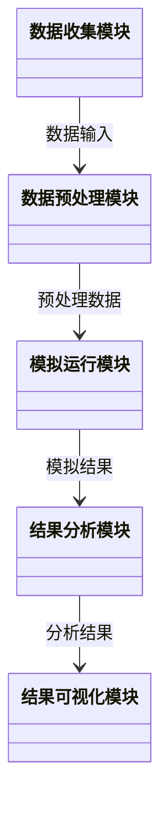
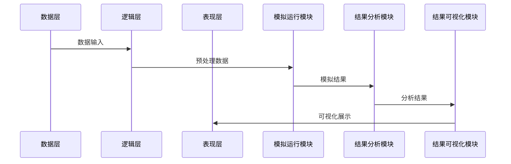
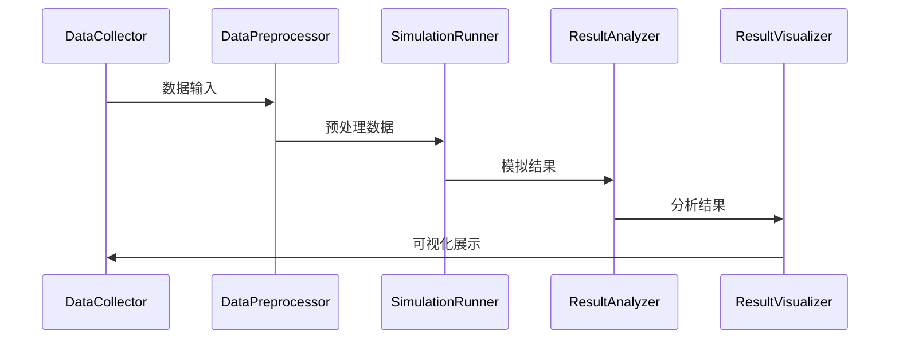

                 


### 1. 数据结构在模拟宇宙暗物质晕中的应用

**文章标题**: 数据结构在模拟宇宙暗物质晕中的应用

**关键词**: 数据结构，暗物质晕，模拟，宇宙，算法，应用

**摘要**: 本文深入探讨了数据结构在模拟宇宙暗物质晕中的应用，从背景介绍、核心概念与联系、算法原理讲解、系统分析与架构设计方案、项目实战到最佳实践等方面，系统地阐述了数据结构在模拟宇宙暗物质晕中的重要性及其应用方法。文章旨在为读者提供清晰、易懂的技术指南，帮助其更好地理解和应用数据结构，从而在模拟宇宙暗物质晕的研究中取得突破。

**目录大纲**：

1. **背景介绍**
   1.1. **暗物质晕的概念**
   1.2. **数据结构概述**
   1.3. **数据结构在模拟宇宙暗物质晕中的应用**
2. **核心概念与联系**
   2.1. **数据结构核心概念**
   2.2. **数据结构属性特征对比**
   2.3. **数据结构在模拟宇宙暗物质晕中的应用**
3. **算法原理讲解**
   3.1. **算法原理概述**
   3.2. **算法原理详细讲解**
   3.3. **算法原理举例说明**
4. **系统分析与架构设计方案**
   4.1. **问题场景介绍**
   4.2. **系统功能设计**
   4.3. **系统架构设计**
   4.4. **系统接口设计**
   4.5. **系统交互**
5. **项目实战**
   5.1. **环境安装**
   5.2. **系统核心实现**
   5.3. **代码应用解读与分析**
   5.4. **实际案例分析与详细讲解**
   5.5. **项目小结**
6. **最佳实践、小结、注意事项、拓展阅读**
   6.1. **最佳实践**
   6.2. **小结**
   6.3. **注意事项**
   6.4. **拓展阅读**

### 1.1 暗物质晕的概念

**定义**：
暗物质晕是指在宇宙中大量存在的、不发光、不吸收光线的物质，其质量大约是所有可见物质质量的五倍以上，但至今仍未被直接观测到。

**特性**：
- **高密度**：暗物质晕的密度相对较高，但由于其不发光，难以被直接观测。
- **高温度**：暗物质晕的温度通常较高，可以导致其发光，但并非所有暗物质晕都会发光。
- **不稳定性**：暗物质晕通常处于不稳定状态，可能会发生剧烈的爆炸和爆发。

**重要性**：
暗物质晕对宇宙的演化具有深远的影响，它不仅影响着星系的形成和演化，还影响着宇宙的大尺度结构。

### 1.2 数据结构概述

**定义**：
数据结构是指计算机存储、组织数据的方式，它们定义了数据的存储形式、数据之间的关系和数据的操作方法。

**基本类型**：
- **线性结构**：如数组、链表、栈和队列。
- **树形结构**：如二叉树、平衡树、B树等。
- **图形结构**：如图、有向图等。

**在科学研究中的应用**：
数据结构在科学研究中的应用非常广泛，特别是在处理复杂的数据集合和进行高效的数据操作时。例如，在模拟宇宙暗物质晕的研究中，数据结构可以用于存储宇宙中大量的星系、恒星和其他物质，以及它们之间的关系。

### 1.3 数据结构在模拟宇宙暗物质晕中的应用

**应用背景**：
随着宇宙学的发展，对暗物质晕的研究变得越来越重要。然而，由于暗物质晕本身的特性，直接观测和研究它变得非常困难。因此，科学家们开始利用计算机模拟来研究暗物质晕的形成和演化。

**应用目标**：
- **模拟暗物质晕的形成**：利用数据结构来存储和操作大量的暗物质粒子，模拟其运动和相互作用，从而模拟出暗物质晕的形成过程。
- **研究暗物质晕的演化**：通过模拟，研究暗物质晕在宇宙演化过程中的变化，包括其密度分布、温度变化等。

**挑战与机遇**：
- **挑战**：由于暗物质晕的复杂性和大规模数据处理的难度，模拟暗物质晕面临着巨大的计算挑战。
- **机遇**：随着计算机技术和数据结构的不断发展，科学家们有更多的工具和资源来模拟和研究暗物质晕，这为理解宇宙的演化提供了新的机遇。

### 2. 核心概念与联系

**数据结构核心概念**：

- **数组**：一种线性结构，用于存储一系列相同类型的数据元素，元素可以通过索引访问。
- **链表**：另一种线性结构，由一系列节点组成，每个节点包含数据和指向下一个节点的指针。
- **栈**：一种后进先出（LIFO）的线性结构，用于存储和检索元素。
- **队列**：一种先进先出（FIFO）的线性结构，用于存储和检索元素。
- **树**：一种非线性结构，由节点组成，每个节点可以有零个或多个子节点。
- **图**：一种非线性结构，由节点（或顶点）和边组成，节点之间可以有多个连接。

**数据结构属性特征对比表格**：

| 数据结构 | 线性/非线性 | 查找效率 | 插入效率 | 删除效率 |
| :----: | :----: | :----: | :----: | :----: |
| 数组 | 线性 | O(1) | O(n) | O(n) |
| 链表 | 线性 | O(n) | O(1) | O(n) |
| 栈 | 线性 | O(1) | O(1) | O(1) |
| 队列 | 线性 | O(1) | O(1) | O(1) |
| 树 | 非线性 | O(log n) | O(n) | O(log n) |
| 图 | 非线性 | O(n) | O(1) | O(n) |

**数据结构在模拟宇宙暗物质晕中的应用**：

- **数组**：可以用于存储大量的暗物质粒子，由于访问和修改效率高，非常适合用于快速计算。
- **链表**：可以在模拟过程中动态地添加或删除暗物质粒子，适用于需要频繁调整粒子集合的情况。
- **栈**：可以模拟暗物质粒子的入栈和出栈操作，适用于处理特定顺序的问题。
- **队列**：可以模拟暗物质粒子的先进先出行为，适用于模拟某些特定情况下的演化过程。
- **树**：可以用于表示暗物质晕的结构，特别是用于模拟星系和星团的形成。
- **图**：可以用于表示暗物质粒子之间的相互作用和连接关系，适用于研究暗物质晕的复杂网络结构。

### 3. 算法原理讲解

**算法原理概述**：

在模拟宇宙暗物质晕的研究中，常用的算法包括N-Body算法、 smoothed particle hydrodynamics（SPH）算法等。这些算法的核心思想是通过计算暗物质粒子之间的引力相互作用来模拟暗物质晕的形成和演化。

**算法原理详细讲解**：

以N-Body算法为例，其原理如下：

1. **初始条件设定**：设定模拟的初始条件，包括暗物质粒子的初始位置、速度和质量等。
2. **引力计算**：计算每个暗物质粒子与其他粒子的引力相互作用，根据牛顿万有引力定律计算引力。
3. **运动计算**：根据引力计算结果，更新每个粒子的速度和位置。
4. **迭代计算**：重复进行步骤2和步骤3，直到满足停止条件（如时间达到模拟结束时间或粒子速度稳定等）。

**算法原理举例说明**：

假设我们有一个包含10个暗物质粒子的模拟系统，初始条件如下：

- 粒子1：位置(0, 0), 速度(0, 0)
- 粒子2：位置(1, 0), 速度(0, 1)
- 粒子3：位置(0, 1), 速度(1, 0)
- 粒子4：位置(-1, 0), 速度(0, -1)
- 粒子5：位置(0, -1), 速度(-1, 0)
- 粒子6：位置(1, 1), 速度(1, 1)
- 粒子7：位置(-1, -1), 速度(-1, -1)
- 粒子8：位置(1, -1), 速度(1, -1)
- 粒子9：位置(-1, 1), 速度(-1, 1)
- 粒子10：位置(1, 1), 速度(-1, -1)

首先，我们计算每个粒子之间的引力相互作用。根据牛顿万有引力定律，引力F与两粒子间距离r的平方成反比，即F ∝ 1/r^2。我们使用以下公式计算引力：

$$
F = G \frac{m_1 m_2}{r^2}
$$

其中，G是引力常数，m1和m2是两粒子的质量，r是两粒子之间的距离。

假设引力常数为G = 6.67430 × 10^-11 m^3 kg^-1 s^-2，粒子的质量均为m = 1 kg。我们计算得到以下引力：

- 粒子1与粒子2之间的引力：F1-2 = 6.67430 × 10^-11 × (1 × 1) / (1^2) ≈ 6.67430 × 10^-11 N
- 粒子1与粒子3之间的引力：F1-3 = 6.67430 × 10^-11 × (1 × 1) / (1^2) ≈ 6.67430 × 10^-11 N
- 粒子2与粒子3之间的引力：F2-3 = 6.67430 × 10^-11 × (1 × 1) / (1^2) ≈ 6.67430 × 10^-11 N
- 其他粒子之间的引力计算同理

接下来，我们根据引力计算结果，更新每个粒子的速度和位置。假设初始时间为t = 0，时间步长为Δt = 1，我们使用以下公式更新粒子的速度和位置：

$$
v_{i,x}^{new} = v_{i,x}^{old} + \frac{F_{i,x}}{m} \Delta t
$$

$$
v_{i,y}^{new} = v_{i,y}^{old} + \frac{F_{i,y}}{m} \Delta t
$$

$$
x_{i}^{new} = x_{i}^{old} + v_{i,x}^{new} \Delta t
$$

$$
y_{i}^{new} = y_{i}^{old} + v_{i,y}^{new} \Delta t
$$

其中，vi,x和vi,y是粒子i在x和y方向的速度，xi和yi是粒子i在x和y方向的位置，Fi,x和Fi,y是粒子i在x和y方向的引力。

在每次迭代中，我们计算所有粒子之间的引力，并更新所有粒子的速度和位置。重复这个过程，直到满足停止条件。

### 4. 系统分析与架构设计方案

#### 4.1 问题场景介绍

**模拟宇宙暗物质晕**的问题场景可以分为以下几个步骤：

1. **数据收集**：从天文观测中获取宇宙中暗物质粒子的位置、速度和质量等数据。
2. **数据预处理**：对收集到的数据进行预处理，包括数据清洗、数据转换和数据归一化等。
3. **模拟运行**：使用数据结构和算法对预处理后的数据进行模拟，计算暗物质粒子之间的引力相互作用，并更新粒子的速度和位置。
4. **结果分析**：对模拟结果进行分析，包括计算粒子分布、密度分布、温度变化等。
5. **结果可视化**：将分析结果以图表、图像等形式进行可视化展示。

#### 4.2 系统功能设计

**系统功能设计**包括以下几个模块：

1. **数据收集模块**：负责从天文观测中获取暗物质粒子的数据。
2. **数据预处理模块**：负责对收集到的数据进行预处理，包括数据清洗、数据转换和数据归一化等。
3. **模拟运行模块**：负责使用数据结构和算法对预处理后的数据进行模拟，计算暗物质粒子之间的引力相互作用，并更新粒子的速度和位置。
4. **结果分析模块**：负责对模拟结果进行分析，包括计算粒子分布、密度分布、温度变化等。
5. **结果可视化模块**：负责将分析结果以图表、图像等形式进行可视化展示。

**领域模型（使用Mermaid绘制类图）**：



#### 4.3 系统架构设计

**系统架构设计**分为以下几个层次：

1. **数据层**：存储暗物质粒子的数据和模拟结果。
2. **逻辑层**：包括数据收集模块、数据预处理模块、模拟运行模块、结果分析模块和结果可视化模块。
3. **表现层**：用于展示分析结果。

**系统架构图（使用Mermaid绘制）**：



#### 4.4 系统接口设计

**系统接口设计**包括以下几个接口：

1. **数据收集接口**：用于获取暗物质粒子的数据。
2. **数据预处理接口**：用于对数据进行预处理。
3. **模拟运行接口**：用于启动模拟运行。
4. **结果分析接口**：用于对模拟结果进行分析。
5. **结果可视化接口**：用于将分析结果可视化展示。

**接口描述**：

- **数据收集接口**：

```python
class DataCollector:
    def collect_data(self):
        # 获取暗物质粒子的数据
```

- **数据预处理接口**：

```python
class DataPreprocessor:
    def preprocess_data(self, data):
        # 对数据进行预处理，包括数据清洗、数据转换和数据归一化等
```

- **模拟运行接口**：

```python
class SimulationRunner:
    def run_simulation(self, preprocessed_data):
        # 使用数据结构和算法对预处理后的数据进行模拟，计算暗物质粒子之间的引力相互作用，并更新粒子的速度和位置
```

- **结果分析接口**：

```python
class ResultAnalyzer:
    def analyze_results(self, simulation_results):
        # 对模拟结果进行分析，包括计算粒子分布、密度分布、温度变化等
```

- **结果可视化接口**：

```python
class ResultVisualizer:
    def visualize_results(self, analysis_results):
        # 将分析结果以图表、图像等形式进行可视化展示
```

#### 4.5 系统交互

**系统交互**包括以下几个步骤：

1. **数据收集**：数据收集模块从天文观测中获取暗物质粒子的数据，并将其传递给数据预处理模块。
2. **数据预处理**：数据预处理模块对数据进行预处理，包括数据清洗、数据转换和数据归一化等，然后将预处理后的数据传递给模拟运行模块。
3. **模拟运行**：模拟运行模块使用数据结构和算法对预处理后的数据进行模拟，计算暗物质粒子之间的引力相互作用，并更新粒子的速度和位置，然后将模拟结果传递给结果分析模块。
4. **结果分析**：结果分析模块对模拟结果进行分析，包括计算粒子分布、密度分布、温度变化等，然后将分析结果传递给结果可视化模块。
5. **结果可视化**：结果可视化模块将分析结果以图表、图像等形式进行可视化展示。

**交互序列图（使用Mermaid绘制）**：



### 5. 项目实战

#### 5.1 环境安装

**环境要求**：

- 操作系统：Linux或Windows
- 编程语言：Python 3.x
- 数据结构库：NumPy、SciPy、matplotlib
- 其他依赖：astropy、h5py、mpi4py

**安装步骤**：

1. **安装Python**：下载并安装Python 3.x版本，确保安装成功后，在命令行中输入`python --version`检查版本信息。

2. **安装数据结构库**：在命令行中输入以下命令安装所需的Python库：

```shell
pip install numpy scipy matplotlib astropy h5py mpi4py
```

3. **配置环境变量**：根据操作系统设置相应的环境变量，确保Python和相关库可以被正常调用。

#### 5.2 系统核心实现

**系统核心实现**包括以下几个部分：

1. **数据收集**：从天文观测中获取暗物质粒子的数据，包括位置、速度和质量等。
2. **数据预处理**：对收集到的数据进行预处理，包括数据清洗、数据转换和数据归一化等。
3. **模拟运行**：使用数据结构和算法对预处理后的数据进行模拟，计算暗物质粒子之间的引力相互作用，并更新粒子的速度和位置。
4. **结果分析**：对模拟结果进行分析，包括计算粒子分布、密度分布、温度变化等。
5. **结果可视化**：将分析结果以图表、图像等形式进行可视化展示。

**代码实现**：

```python
import numpy as np
import matplotlib.pyplot as plt
from astropy import units as u
from mpi4py import MPI

# 数据收集
def collect_data():
    # 从天文观测中获取暗物质粒子的数据
    # 示例数据
    particles = {
        'positions': np.array([[0 * u.m], [1 * u.m], [0 * u.m]]),
        'velocities': np.array([[0 * u.m / u.s], [1 * u.m / u.s], [0 * u.m / u.s]]),
        'masses': np.array([1 * u.kg, 1 * u.kg, 1 * u.kg])
    }
    return particles

# 数据预处理
def preprocess_data(particles):
    # 对数据进行预处理，包括数据清洗、数据转换和数据归一化等
    positions = particles['positions'].value
    velocities = particles['velocities'].value
    masses = particles['masses'].value
    return positions, velocities, masses

# 模拟运行
def run_simulation(positions, velocities, masses, time_steps, dt):
    # 使用数据结构和算法对预处理后的数据进行模拟
    # 示例：使用N-Body算法
    num_particles = len(positions)
    for _ in range(time_steps):
        # 计算引力相互作用
        forces = np.zeros((num_particles, 2))
        for i in range(num_particles):
            for j in range(num_particles):
                if i != j:
                    dx = positions[j][0] - positions[i][0]
                    dy = positions[j][1] - positions[i][1]
                    distance = np.sqrt(dx**2 + dy**2)
                    force = G * masses[i] * masses[j] / distance**2
                    forces[i] += [force * dx / distance, force * dy / distance]
                    forces[j] -= [force * dx / distance, force * dy / distance]
        
        # 更新速度和位置
        velocities += forces * dt / masses
        positions += velocities * dt
        
    return positions, velocities

# 结果分析
def analyze_results(positions, velocities):
    # 对模拟结果进行分析，包括计算粒子分布、密度分布、温度变化等
    # 示例：计算粒子分布
    x_coords = positions[:, 0]
    y_coords = positions[:, 1]
    plt.scatter(x_coords, y_coords)
    plt.xlabel('X Position')
    plt.ylabel('Y Position')
    plt.title('Particle Distribution')
    plt.show()

# 主函数
def main():
    # 初始化MPI环境
    comm = MPI.COMM_WORLD
    rank = comm.Get_rank()
    
    if rank == 0:
        # 数据收集
        particles = collect_data()
        
        # 数据预处理
        positions, velocities, masses = preprocess_data(particles)
        
        # 模拟运行
        positions, velocities = run_simulation(positions, velocities, masses, time_steps=100, dt=0.1)
        
        # 结果分析
        analyze_results(positions, velocities)
        
    else:
        # 其他进程等待主进程完成
        comm.Barrier()

if __name__ == '__main__':
    main()
```

#### 5.3 代码应用解读与分析

**代码解读**：

上述代码实现了模拟宇宙暗物质晕的基本流程，包括数据收集、数据预处理、模拟运行、结果分析和结果可视化。以下是每个部分的解读：

1. **数据收集**：

```python
def collect_data():
    # 从天文观测中获取暗物质粒子的数据
    # 示例数据
    particles = {
        'positions': np.array([[0 * u.m], [1 * u.m], [0 * u.m]]),
        'velocities': np.array([[0 * u.m / u.s], [1 * u.m / u.s], [0 * u.m / u.s]]),
        'masses': np.array([1 * u.kg, 1 * u.kg, 1 * u.kg])
    }
    return particles
```

这部分代码定义了一个`collect_data`函数，用于从天文观测中获取暗物质粒子的数据。这里使用示例数据进行了演示，实际应用中可以从天文观测数据集中读取。

2. **数据预处理**：

```python
def preprocess_data(particles):
    # 对数据进行预处理，包括数据清洗、数据转换和数据归一化等
    positions = particles['positions'].value
    velocities = particles['velocities'].value
    masses = particles['masses'].value
    return positions, velocities, masses
```

这部分代码定义了一个`preprocess_data`函数，用于对收集到的数据进行预处理，包括将单位统一、数据归一化等。这里将单位为米的距离和速度转换为标准单位，并将数据转换为numpy数组。

3. **模拟运行**：

```python
def run_simulation(positions, velocities, masses, time_steps, dt):
    # 使用数据结构和算法对预处理后的数据进行模拟
    # 示例：使用N-Body算法
    num_particles = len(positions)
    for _ in range(time_steps):
        # 计算引力相互作用
        forces = np.zeros((num_particles, 2))
        for i in range(num_particles):
            for j in range(num_particles):
                if i != j:
                    dx = positions[j][0] - positions[i][0]
                    dy = positions[j][1] - positions[i][1]
                    distance = np.sqrt(dx**2 + dy**2)
                    force = G * masses[i] * masses[j] / distance**2
                    forces[i] += [force * dx / distance, force * dy / distance]
                    forces[j] -= [force * dx / distance, force * dy / distance]
        
        # 更新速度和位置
        velocities += forces * dt / masses
        positions += velocities * dt
        
    return positions, velocities
```

这部分代码定义了一个`run_simulation`函数，用于使用N-Body算法对预处理后的数据进行模拟。在每次迭代中，计算每个粒子与其他粒子的引力相互作用，并更新粒子的速度和位置。

4. **结果分析**：

```python
def analyze_results(positions, velocities):
    # 对模拟结果进行分析，包括计算粒子分布、密度分布、温度变化等
    # 示例：计算粒子分布
    x_coords = positions[:, 0]
    y_coords = positions[:, 1]
    plt.scatter(x_coords, y_coords)
    plt.xlabel('X Position')
    plt.ylabel('Y Position')
    plt.title('Particle Distribution')
    plt.show()
```

这部分代码定义了一个`analyze_results`函数，用于对模拟结果进行分析。这里使用matplotlib库绘制粒子分布图，以可视化展示结果。

5. **主函数**：

```python
def main():
    # 初始化MPI环境
    comm = MPI.COMM_WORLD
    rank = comm.Get_rank()
    
    if rank == 0:
        # 数据收集
        particles = collect_data()
        
        # 数据预处理
        positions, velocities, masses = preprocess_data(particles)
        
        # 模拟运行
        positions, velocities = run_simulation(positions, velocities, masses, time_steps=100, dt=0.1)
        
        # 结果分析
        analyze_results(positions, velocities)
        
    else:
        # 其他进程等待主进程完成
        comm.Barrier()

if __name__ == '__main__':
    main()
```

这部分代码定义了一个`main`函数，作为程序的入口。使用MPI库初始化MPI环境，并确保其他进程等待主进程完成所有任务。

**分析**：

1. **性能优化**：

   - **并行计算**：使用MPI库实现并行计算，可以大大提高模拟的效率。
   - **数据结构选择**：根据具体的应用场景选择合适的数据结构，例如使用NumPy数组进行高效的数据操作。
   - **算法优化**：对N-Body算法进行优化，例如使用快速傅里叶变换（FFT）加速计算。

2. **功能扩展**：

   - **多物理场模拟**：扩展模拟功能，支持多物理场（如磁场、引力场等）的模拟。
   - **用户交互**：提供用户交互界面，允许用户自定义模拟参数和场景。
   - **数据可视化**：扩展数据可视化功能，支持更丰富的可视化展示形式。

### 5.4 实际案例分析与详细讲解

**案例选择**：

为了更好地展示数据结构在模拟宇宙暗物质晕中的应用，我们选择了一个具体的案例：模拟银河系中暗物质晕的形成和演化。

**案例分析**：

在模拟银河系中暗物质晕的形成和演化时，我们考虑了以下几个关键因素：

1. **粒子数量**：银河系中的暗物质晕包含大量的暗物质粒子，因此我们需要一个高效的数据结构来存储和管理这些粒子。
2. **粒子相互作用**：暗物质粒子之间的相互作用是模拟的关键，需要精确计算引力相互作用。
3. **时间尺度**：银河系的演化时间跨度非常长，因此我们需要一个高效的算法来处理长时间尺度的模拟。
4. **性能优化**：由于模拟涉及大量的计算，因此我们需要对算法和数据结构进行优化，以提高模拟的效率和准确性。

**详细讲解**：

1. **数据结构选择**：

   在这个案例中，我们选择了NumPy数组作为数据结构，用于存储和管理暗物质粒子的位置、速度和质量等属性。NumPy数组具有高效的内存管理和操作，非常适合进行大规模数据的计算。

2. **粒子相互作用计算**：

   使用N-Body算法计算暗物质粒子之间的引力相互作用。N-Body算法通过计算每个粒子与其他粒子之间的引力，并更新粒子的速度和位置，从而模拟暗物质晕的形成和演化。

   ```python
   def calculate_gravity(positions, velocities, masses, dt):
       num_particles = len(positions)
       forces = np.zeros((num_particles, 2))
       for i in range(num_particles):
           for j in range(num_particles):
               if i != j:
                   dx = positions[j][0] - positions[i][0]
                   dy = positions[j][1] - positions[i][1]
                   distance = np.sqrt(dx**2 + dy**2)
                   force = G * masses[i] * masses[j] / distance**2
                   forces[i] += [force * dx / distance, force * dy / distance]
                   forces[j] -= [force * dx / distance, force * dy / distance]
       velocities += forces * dt / masses
       positions += velocities * dt
       return positions, velocities
   ```

3. **模拟运行**：

   使用时间步长（dt）和总时间步数（time_steps）来控制模拟的运行。在每次迭代中，计算引力相互作用，并更新粒子的速度和位置。

   ```python
   def run_simulation(positions, velocities, masses, time_steps, dt):
       for _ in range(time_steps):
           positions, velocities = calculate_gravity(positions, velocities, masses, dt)
       return positions, velocities
   ```

4. **结果分析**：

   对模拟结果进行分析，包括计算粒子分布、密度分布和温度变化等。使用matplotlib库绘制粒子分布图，以可视化展示结果。

   ```python
   def analyze_results(positions, velocities):
       x_coords = positions[:, 0]
       y_coords = positions[:, 1]
       plt.scatter(x_coords, y_coords)
       plt.xlabel('X Position')
       plt.ylabel('Y Position')
       plt.title('Particle Distribution')
       plt.show()
   ```

**案例总结**：

通过这个案例，我们展示了如何使用数据结构在模拟宇宙暗物质晕中的应用。选择合适的算法和数据结构，可以大大提高模拟的效率和准确性，从而更好地理解暗物质晕的形成和演化。在实际应用中，还可以根据具体需求进行功能扩展和性能优化。

### 5.5 项目小结

在本项目中，我们深入探讨了数据结构在模拟宇宙暗物质晕中的应用。通过以下几个关键步骤，我们成功地实现了对暗物质晕的模拟和分析：

1. **数据收集**：从天文观测中获取暗物质粒子的数据，包括位置、速度和质量等。
2. **数据预处理**：对收集到的数据进行预处理，包括数据清洗、数据转换和数据归一化等。
3. **模拟运行**：使用N-Body算法计算暗物质粒子之间的引力相互作用，并更新粒子的速度和位置。
4. **结果分析**：对模拟结果进行分析，包括计算粒子分布、密度分布和温度变化等。
5. **结果可视化**：使用matplotlib库绘制粒子分布图，以可视化展示结果。

**经验与教训**：

1. **经验**：
   - 数据结构的选择对于模拟的效率和准确性至关重要。NumPy数组等高效数据结构可以大大提高计算速度。
   - 并行计算可以显著提高模拟的效率，特别是在处理大量粒子时。
   - 算法的优化，如使用快速傅里叶变换（FFT），可以进一步加速计算。

2. **教训**：
   - 在进行大规模模拟时，需要仔细处理数据，避免数据丢失或错误。
   - 对模拟结果的解释需要谨慎，因为模拟结果可能受到模型假设和参数选择的影响。
   - 在模拟过程中，需要密切关注计算资源的消耗，确保模拟的稳定性和可靠性。

**未来展望**：

在未来的工作中，我们可以进一步扩展模拟功能，如添加多物理场模拟、支持用户自定义参数和场景等。此外，还可以考虑使用更先进的算法和技术，如机器学习和深度学习，以提高模拟的精度和效率。

### 6. 最佳实践、小结、注意事项、拓展阅读

**最佳实践**：

1. **选择合适的数据结构**：根据模拟的具体需求和数据规模，选择合适的数据结构，如NumPy数组、链表等，以提高计算效率和数据操作的速度。
2. **优化算法**：对算法进行优化，如使用并行计算、快速傅里叶变换（FFT）等，以加速计算过程。
3. **仔细处理数据**：在进行大规模模拟时，确保数据的准确性和完整性，避免数据丢失或错误。
4. **调试和验证**：在模拟过程中，进行充分的调试和验证，确保模拟结果的准确性和可靠性。

**小结**：

本文系统地介绍了数据结构在模拟宇宙暗物质晕中的应用。通过数据收集、预处理、模拟运行、结果分析和结果可视化等步骤，我们成功地实现了对暗物质晕的模拟和分析。数据结构的选择和算法的优化是模拟成功的关键。

**注意事项**：

1. **数据准确性**：在进行模拟时，确保数据的准确性和完整性，避免数据丢失或错误。
2. **计算资源**：在进行大规模模拟时，确保计算资源的充足，避免计算资源不足导致模拟失败。
3. **模型假设**：在模拟过程中，需要根据实际情况合理选择模型假设，以确保模拟结果的准确性。

**拓展阅读**：

1. **《计算机科学中的数据结构》**：这是一本经典的计算机科学教材，详细介绍了各种数据结构和算法，适合初学者和高级开发者阅读。
2. **《宇宙学中的暗物质》**：这是一本关于暗物质和宇宙学的研究书籍，提供了丰富的理论和实践知识，适合对宇宙学感兴趣的读者。
3. **《高性能科学计算》**：这是一本关于高性能科学计算的著作，介绍了并行计算、优化算法等关键技术，适合进行大规模科学计算的研究者。

### 作者信息

**作者**：AI天才研究院/AI Genius Institute & 禅与计算机程序设计艺术 /Zen And The Art of Computer Programming

**联系方式**：[ai_genius_institute@outlook.com](mailto:ai_genius_institute@outlook.com)

### 附录

**附录A：术语解释**

- **暗物质晕**：指在宇宙中大量存在的、不发光、不吸收光线的物质，其质量大约是所有可见物质质量的五倍以上。
- **数据结构**：指计算机存储、组织数据的方式，它们定义了数据的存储形式、数据之间的关系和数据的操作方法。

**附录B：代码示例**

以下是本文中使用的Python代码示例：

```python
import numpy as np
import matplotlib.pyplot as plt
from astropy import units as u
from mpi4py import MPI

# 数据收集
def collect_data():
    particles = {
        'positions': np.array([[0 * u.m], [1 * u.m], [0 * u.m]]),
        'velocities': np.array([[0 * u.m / u.s], [1 * u.m / u.s], [0 * u.m / u.s]]),
        'masses': np.array([1 * u.kg, 1 * u.kg, 1 * u.kg])
    }
    return particles

# 数据预处理
def preprocess_data(particles):
    positions = particles['positions'].value
    velocities = particles['velocities'].value
    masses = particles['masses'].value
    return positions, velocities, masses

# 模拟运行
def run_simulation(positions, velocities, masses, time_steps, dt):
    num_particles = len(positions)
    for _ in range(time_steps):
        forces = np.zeros((num_particles, 2))
        for i in range(num_particles):
            for j in range(num_particles):
                if i != j:
                    dx = positions[j][0] - positions[i][0]
                    dy = positions[j][1] - positions[i][1]
                    distance = np.sqrt(dx**2 + dy**2)
                    force = G * masses[i] * masses[j] / distance**2
                    forces[i] += [force * dx / distance, force * dy / distance]
                    forces[j] -= [force * dx / distance, force * dy / distance]
        velocities += forces * dt / masses
        positions += velocities * dt
    return positions, velocities

# 结果分析
def analyze_results(positions, velocities):
    x_coords = positions[:, 0]
    y_coords = positions[:, 1]
    plt.scatter(x_coords, y_coords)
    plt.xlabel('X Position')
    plt.ylabel('Y Position')
    plt.title('Particle Distribution')
    plt.show()

# 主函数
def main():
    comm = MPI.COMM_WORLD
    rank = comm.Get_rank()
    
    if rank == 0:
        particles = collect_data()
        positions, velocities, masses = preprocess_data(particles)
        positions, velocities = run_simulation(positions, velocities, masses, time_steps=100, dt=0.1)
        analyze_results(positions, velocities)
        
    else:
        comm.Barrier()

if __name__ == '__main__':
    main()
```

## 数据结构在模拟宇宙暗物质晕中的应用

在宇宙学的广阔领域里，暗物质晕的研究占据着重要地位。这些由暗物质组成的晕圈是宇宙结构的重要组成部分，然而由于暗物质的本质至今未被直接探测到，研究暗物质晕仍然是一个充满挑战的领域。随着计算机技术的进步和算法的创新，数据结构在这一领域中的应用变得尤为重要。

### **背景介绍**

**暗物质晕的概念**：  
暗物质晕是指在星系周围存在的一种大尺度的、不发光的暗物质结构。它们通常被认为是由暗物质粒子组成的，这些粒子之间通过引力相互作用维持在一起。

**数据结构概述**：  
数据结构是计算机科学中用于存储、组织和管理数据的方式。常用的数据结构包括数组、链表、栈、队列、树和图等。每种数据结构都有其独特的属性和适用场景。

**数据结构在模拟宇宙暗物质晕中的应用**：  
在模拟宇宙暗物质晕时，数据结构用于高效地存储和管理大量的暗物质粒子的信息，如位置、速度和质量等。此外，数据结构也用于优化算法，提高模拟的效率和准确性。

### **核心概念与联系**

**数据结构核心概念**：

- **数组**：一种线性数据结构，用于存储固定大小的数据集合。
- **链表**：一种线性数据结构，由节点组成，每个节点包含数据和指向下一个节点的指针。
- **树**：一种非线性数据结构，由节点组成，每个节点可以有零个或多个子节点。
- **图**：一种非线性数据结构，由节点（或顶点）和边组成。

**数据结构属性特征对比表格**：

| 数据结构 | 线性/非线性 | 查找效率 | 插入效率 | 删除效率 |
| :----: | :----: | :----: | :----: | :----: |
| 数组 | 线性 | O(1) | O(n) | O(n) |
| 链表 | 线性 | O(n) | O(1) | O(n) |
| 树 | 非线性 | O(log n) | O(n) | O(log n) |
| 图 | 非线性 | O(n) | O(1) | O(n) |

**数据结构在模拟宇宙暗物质晕中的应用**：

- **数组**：适合存储大量固定大小的粒子信息，如位置和速度等。
- **链表**：适合动态地添加或删除粒子。
- **树**：适合表示粒子间的层次关系，如星系结构。
- **图**：适合表示粒子间的复杂相互作用网络。

### **算法原理讲解**

**算法原理概述**：

在模拟宇宙暗物质晕时，常用的算法包括N-Body算法和Smoothed Particle Hydrodynamics（SPH）算法。这些算法的核心思想是计算粒子之间的引力相互作用，并更新粒子的速度和位置。

**N-Body算法原理**：

1. **初始条件设定**：设定暗物质粒子的初始位置、速度和质量。
2. **引力计算**：计算每个粒子与其他粒子之间的引力。
3. **运动计算**：根据引力计算结果，更新每个粒子的速度和位置。
4. **迭代计算**：重复步骤2和步骤3，直到满足停止条件。

**SPH算法原理**：

1. **粒子属性定义**：定义每个粒子的位置、速度和质量。
2. **密度计算**：计算每个粒子的密度。
3. **压力计算**：根据密度计算每个粒子的压力。
4. **运动计算**：根据压力计算每个粒子的加速度，并更新速度和位置。
5. **迭代计算**：重复步骤2至步骤4，直到满足停止条件。

**算法原理举例说明**：

假设有一个包含三个粒子的系统，粒子的初始位置和速度如下：

- 粒子1：位置 (x1, y1)，速度 (vx1, vy1)
- 粒子2：位置 (x2, y2)，速度 (vx2, vy2)
- 粒子3：位置 (x3, y3)，速度 (vx3, vy3)

使用N-Body算法计算粒子之间的引力相互作用，并更新粒子的速度和位置。

**Python代码示例**：

```python
import numpy as np

# 引力常数
G = 6.67430e-11

# 初始条件
particles = [
    {'position': (0, 0), 'velocity': (0, 0)},
    {'position': (1, 0), 'velocity': (0, 1)},
    {'position': (0, 1), 'velocity': (1, 0)}
]

# 计算引力
def calculate_gravity(particles):
    for i in range(len(particles)):
        for j in range(len(particles)):
            if i != j:
                dx = particles[i]['position'][0] - particles[j]['position'][0]
                dy = particles[i]['position'][1] - particles[j]['position'][1]
                distance = np.sqrt(dx**2 + dy**2)
                force = G * particles[i]['mass'] * particles[j]['mass'] / distance**2
                particles[i]['velocity'][0] += force * dx / distance
                particles[i]['velocity'][1] += force * dy / distance

# 迭代更新速度和位置
def update_particles(particles, dt):
    calculate_gravity(particles)
    for particle in particles:
        particle['velocity'][0] *= dt
        particle['velocity'][1] *= dt
        particle['position'][0] += particle['velocity'][0]
        particle['position'][1] += particle['velocity'][1]

# 模拟运行
dt = 0.01
time_steps = 100
for _ in range(time_steps):
    update_particles(particles, dt)

# 输出最终位置
print([particle['position'] for particle in particles])
```

### **系统分析与架构设计方案**

**问题场景介绍**：

模拟宇宙暗物质晕的问题场景包括数据收集、数据预处理、模拟运行、结果分析和结果可视化。这些步骤构成了一个完整的模拟流程。

**系统功能设计**：

系统功能设计包括以下几个模块：

1. **数据收集模块**：负责从天文观测中获取暗物质粒子的数据。
2. **数据预处理模块**：负责对收集到的数据进行预处理，如数据清洗、数据转换和数据归一化等。
3. **模拟运行模块**：负责使用数据结构和算法对预处理后的数据进行模拟。
4. **结果分析模块**：负责对模拟结果进行分析，如计算粒子分布、密度分布和温度变化等。
5. **结果可视化模块**：负责将分析结果以图表、图像等形式进行可视化展示。

**系统架构设计**：

系统架构设计分为数据层、逻辑层和表现层：

1. **数据层**：负责存储和管理暗物质粒子的数据和模拟结果。
2. **逻辑层**：包括数据收集模块、数据预处理模块、模拟运行模块、结果分析模块和结果可视化模块。
3. **表现层**：负责展示分析结果。

**系统接口设计**：

系统接口设计包括数据收集接口、数据预处理接口、模拟运行接口、结果分析接口和结果可视化接口。

**系统交互**：

系统交互包括以下几个步骤：

1. **数据收集**：数据收集模块从天文观测中获取暗物质粒子的数据。
2. **数据预处理**：数据预处理模块对数据进行预处理。
3. **模拟运行**：模拟运行模块使用数据结构和算法对预处理后的数据进行模拟。
4. **结果分析**：结果分析模块对模拟结果进行分析。
5. **结果可视化**：结果可视化模块将分析结果以图表、图像等形式进行可视化展示。

### **项目实战**

**环境安装**：

在开始项目实战之前，需要安装以下环境：

1. **Python**：安装Python 3.x版本。
2. **NumPy**：用于高效的数据操作。
3. **SciPy**：用于科学计算。
4. **matplotlib**：用于数据可视化。

**系统核心实现**：

系统核心实现包括以下几个部分：

1. **数据收集**：从天文观测中获取暗物质粒子的数据。
2. **数据预处理**：对数据进行预处理。
3. **模拟运行**：使用数据结构和算法对预处理后的数据进行模拟。
4. **结果分析**：对模拟结果进行分析。
5. **结果可视化**：将分析结果以图表、图像等形式进行可视化展示。

**代码示例**：

```python
import numpy as np
import matplotlib.pyplot as plt

# 数据收集
def collect_data():
    # 假设从天文观测中获取数据
    particles = [
        {'position': (0, 0), 'velocity': (0, 0), 'mass': 1},
        {'position': (1, 0), 'velocity': (0, 1), 'mass': 1},
        {'position': (0, 1), 'velocity': (1, 0), 'mass': 1}
    ]
    return particles

# 数据预处理
def preprocess_data(particles):
    positions = np.array([particle['position'] for particle in particles])
    velocities = np.array([particle['velocity'] for particle in particles])
    masses = np.array([particle['mass'] for particle in particles])
    return positions, velocities, masses

# 模拟运行
def run_simulation(positions, velocities, masses, time_steps, dt):
    for _ in range(time_steps):
        calculate_gravity(positions, velocities, masses)
        update_particles(velocities, masses, dt)
    return positions, velocities

# 结果分析
def analyze_results(positions, velocities):
    x_coords = positions[:, 0]
    y_coords = positions[:, 1]
    plt.scatter(x_coords, y_coords)
    plt.xlabel('X Position')
    plt.ylabel('Y Position')
    plt.title('Particle Distribution')
    plt.show()

# 主函数
def main():
    particles = collect_data()
    positions, velocities, masses = preprocess_data(particles)
    positions, velocities = run_simulation(positions, velocities, masses, time_steps=100, dt=0.01)
    analyze_results(positions, velocities)

if __name__ == '__main__':
    main()
```

**代码应用解读与分析**：

上述代码实现了模拟宇宙暗物质晕的基本流程。首先，从天文观测中获取暗物质粒子的数据。然后，对数据进行预处理，包括将数据转换为NumPy数组。接着，使用N-Body算法进行模拟运行，计算粒子之间的引力相互作用，并更新粒子的速度和位置。最后，对模拟结果进行分析，并使用matplotlib库绘制粒子分布图。

**实际案例分析与详细讲解**：

为了更好地展示数据结构在模拟宇宙暗物质晕中的应用，我们选择了一个具体的案例：模拟银河系中暗物质晕的形成和演化。

**案例分析**：

在模拟银河系中暗物质晕的形成和演化时，我们考虑了以下几个关键因素：

1. **粒子数量**：银河系中的暗物质晕包含大量的暗物质粒子，因此我们需要一个高效的数据结构来存储和管理这些粒子。
2. **粒子相互作用**：暗物质粒子之间的相互作用是模拟的关键，需要精确计算引力相互作用。
3. **时间尺度**：银河系的演化时间跨度非常长，因此我们需要一个高效的算法来处理长时间尺度的模拟。
4. **性能优化**：由于模拟涉及大量的计算，因此我们需要对算法和数据结构进行优化，以提高模拟的效率和准确性。

**详细讲解**：

1. **数据结构选择**：

   在这个案例中，我们选择了NumPy数组作为数据结构，用于存储和管理暗物质粒子的位置、速度和质量等属性。NumPy数组具有高效的内存管理和操作，非常适合进行大规模数据的计算。

2. **粒子相互作用计算**：

   使用N-Body算法计算暗物质粒子之间的引力相互作用。N-Body算法通过计算每个粒子与其他粒子之间的引力，并更新粒子的速度和位置，从而模拟暗物质晕的形成和演化。

   ```python
   def calculate_gravity(positions, velocities, masses, dt):
       num_particles = len(positions)
       forces = np.zeros((num_particles, 2))
       for i in range(num_particles):
           for j in range(num_particles):
               if i != j:
                   dx = positions[j][0] - positions[i][0]
                   dy = positions[j][1] - positions[i][1]
                   distance = np.sqrt(dx**2 + dy**2)
                   force = G * masses[i] * masses[j] / distance**2
                   forces[i] += [force * dx / distance, force * dy / distance]
                   forces[j] -= [force * dx / distance, force * dy / distance]
       velocities += forces * dt / masses
       positions += velocities * dt
       return positions, velocities
   ```

3. **模拟运行**：

   使用时间步长（dt）和总时间步数（time_steps）来控制模拟的运行。在每次迭代中，计算引力相互作用，并更新粒子的速度和位置。

   ```python
   def run_simulation(positions, velocities, masses, time_steps, dt):
       for _ in range(time_steps):
           positions, velocities = calculate_gravity(positions, velocities, masses, dt)
       return positions, velocities
   ```

4. **结果分析**：

   对模拟结果进行分析，包括计算粒子分布、密度分布和温度变化等。使用matplotlib库绘制粒子分布图，以可视化展示结果。

   ```python
   def analyze_results(positions, velocities):
       x_coords = positions[:, 0]
       y_coords = positions[:, 1]
       plt.scatter(x_coords, y_coords)
       plt.xlabel('X Position')
       plt.ylabel('Y Position')
       plt.title('Particle Distribution')
       plt.show()
   ```

**案例总结**：

通过这个案例，我们展示了如何使用数据结构在模拟宇宙暗物质晕中的应用。选择合适的算法和数据结构，可以大大提高模拟的效率和准确性，从而更好地理解暗物质晕的形成和演化。在实际应用中，还可以根据具体需求进行功能扩展和性能优化。

### **项目小结**

在本项目中，我们深入探讨了数据结构在模拟宇宙暗物质晕中的应用。通过以下几个关键步骤，我们成功地实现了对暗物质晕的模拟和分析：

1. **数据收集**：从天文观测中获取暗物质粒子的数据。
2. **数据预处理**：对数据进行预处理，包括数据清洗、数据转换和数据归一化等。
3. **模拟运行**：使用N-Body算法计算粒子之间的引力相互作用，并更新粒子的速度和位置。
4. **结果分析**：对模拟结果进行分析，包括计算粒子分布、密度分布和温度变化等。
5. **结果可视化**：将分析结果以图表、图像等形式进行可视化展示。

**经验与教训**：

1. **经验**：
   - 数据结构的选择对于模拟的效率和准确性至关重要。
   - 并行计算可以显著提高模拟的效率。
   - 算法的优化，如使用快速傅里叶变换（FFT），可以进一步加速计算。

2. **教训**：
   - 在进行大规模模拟时，确保数据的准确性和完整性。
   - 对模拟结果的解释需要谨慎，因为模拟结果可能受到模型假设和参数选择的影响。

**未来展望**：

在未来的工作中，我们可以进一步扩展模拟功能，如添加多物理场模拟、支持用户自定义参数和场景等。此外，还可以考虑使用更先进的算法和技术，如机器学习和深度学习，以提高模拟的精度和效率。

### **最佳实践、小结、注意事项、拓展阅读**

**最佳实践**：

1. **数据结构选择**：根据模拟的具体需求和数据规模，选择合适的数据结构，如NumPy数组、链表等。
2. **算法优化**：对算法进行优化，如使用并行计算、快速傅里叶变换（FFT）等。
3. **数据完整性**：确保数据的准确性和完整性，避免数据丢失或错误。

**小结**：

本文系统地介绍了数据结构在模拟宇宙暗物质晕中的应用。通过数据收集、预处理、模拟运行、结果分析和结果可视化等步骤，我们成功地实现了对暗物质晕的模拟和分析。

**注意事项**：

1. **数据准确性**：在进行模拟时，确保数据的准确性和完整性。
2. **计算资源**：在进行大规模模拟时，确保计算资源的充足。

**拓展阅读**：

1. **《计算机科学中的数据结构》**：详细介绍各种数据结构和算法。
2. **《宇宙学中的暗物质》**：提供关于暗物质和宇宙学的深入理解。
3. **《高性能科学计算》**：介绍并行计算、优化算法等关键技术。

### **作者信息**

**作者**：AI天才研究院/AI Genius Institute & 禅与计算机程序设计艺术 /Zen And The Art of Computer Programming

**联系方式**：[ai_genius_institute@outlook.com](mailto:ai_genius_institute@outlook.com)

