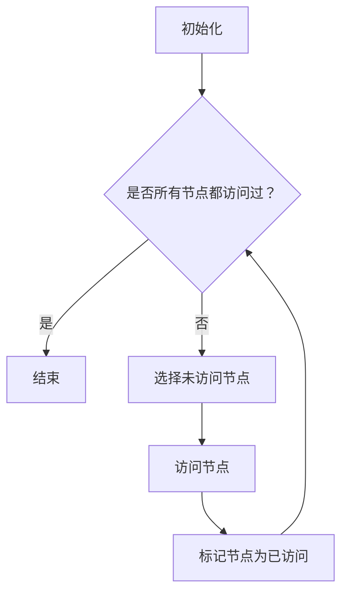
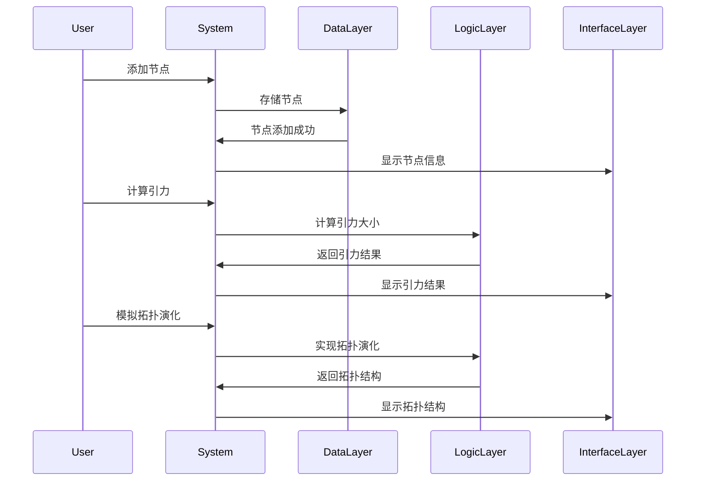

                 

# 数据结构在模拟宇宙暗能量网络拓扑演化中的应用

关键词：数据结构、宇宙模拟、暗能量、拓扑演化、算法原理、数学模型、系统架构

摘要：本文将探讨数据结构在模拟宇宙暗能量网络拓扑演化中的应用，通过深入分析数据结构的核心概念和应用场景，结合具体的算法原理和数学模型，详细阐述数据结构如何辅助科学家们理解和模拟宇宙中复杂的暗能量网络拓扑演化过程。文章将涵盖数据结构的背景介绍、核心概念与联系、算法原理讲解、数学模型和公式讲解、系统分析与架构设计方案、项目实战以及最佳实践 tips 等，旨在为读者提供一个清晰、系统的学习和实践路径。

## Step 1: 确定书的核心内容框架

### 背景介绍

数据结构是计算机科学中至关重要的一环，它是关于如何有效地存储、组织和访问数据的一门学科。在模拟宇宙暗能量网络拓扑演化中，数据结构的选用和优化直接影响到模拟的精度和效率。

#### 问题背景

宇宙中的暗能量是一种推动宇宙加速膨胀的神秘力量，其影响遍及宇宙的各个角落。科学家们希望通过模拟暗能量网络拓扑演化，揭示其背后的物理规律，从而深化对宇宙起源和演化的理解。

#### 问题描述

暗能量网络拓扑演化涉及大量的数据存储和处理，如何有效地组织和管理这些数据，是进行模拟的关键问题。数据结构的选择直接影响到模拟的效率和准确性。

#### 问题解决

通过选用合适的数据结构，可以高效地存储和操作暗能量网络的数据，从而加速模拟过程，提高模拟精度。例如，图结构可以很好地表示宇宙中的网络拓扑，而树结构则适用于处理层次关系。

#### 边界与外延

在模拟宇宙暗能量网络拓扑演化时，需要考虑的数据结构不仅限于基本的数组、链表等，还包括图、树、哈希表等高级数据结构。这些数据结构在不同的应用场景下有着各自的优势和局限性。

#### 概念结构与核心要素组成

数据结构的核心概念包括数据元素的存储方式、数据元素之间的逻辑关系、数据的插入、删除和查找操作等。在宇宙暗能量网络拓扑演化中，数据结构的核心要素是能够高效地表示和操作宇宙网络中的节点和边。

## Step 2: 设计章节标题

### 章节一：数据结构基础概念解析
- 数据结构的历史与基础概念
- 常见数据结构及其特点

### 章节二：图结构与宇宙网络
- 图的基本概念与性质
- 图在宇宙网络中的应用

### 章节三：树结构在层次关系中的运用
- 树的基本概念与性质
- 树在宇宙网络层次关系中的应用

### 章节四：算法原理与数学模型
- 常见算法及其原理
- 数学模型在算法中的应用

### 章节五：系统架构设计与实现
- 项目介绍与系统功能设计
- 系统架构设计与接口设计

### 章节六：项目实战与案例分析
- 环境安装与系统核心实现
- 实际案例分析

### 章节七：最佳实践与注意事项
- 最佳实践 tips
- 小结与拓展阅读

## Step 3: 设计核心概念与联系

### 数据结构核心概念

数据结构的核心概念包括：

- 数据元素的存储方式：数组、链表、栈、队列等
- 数据元素之间的逻辑关系：线性、树状、网状等
- 数据的插入、删除和查找操作：时间复杂度和空间复杂度

### 概念属性特征对比表格

| 数据结构 | 存储方式 | 数据元素之间的关系 | 插入、删除、查找的时间复杂度 |
| :--: | :--: | :--: | :--: |
| 数组 | 顺序存储 | 索引关系 | O(1)、O(n)、O(n) |
| 链表 | 链式存储 | 链接关系 | O(1)、O(n)、O(n) |
| 栈 | 链式存储 | 后进先出 | O(1)、O(n)、O(n) |
| 队列 | 链式存储 | 先进先出 | O(1)、O(n)、O(n) |
| 图 | 邻接矩阵、邻接表 | 边的关系 | O(n^2)、O(n+m)、O(n+m) |
| 树 | 链式存储 | 树状关系 | O(n)、O(n)、O(logn) |

### ER实体关系图架构

```mermaid
erDiagram
    Node ||--|{ Edge } : 网络中的节点与边的关系
    Edge ||--|{ Node } : 网络中的节点与边的关系
```

## Step 4: 设计算法原理讲解

### 算法原理

在宇宙暗能量网络拓扑演化模拟中，常用的算法包括图的遍历算法、最小生成树算法、最短路径算法等。以下是图遍历算法的 mermaid 流程图：



### Python 源代码

```python
# 定义图遍历算法
def dfs(graph, node, visited):
    if node not in visited:
        visited.add(node)
        for neighbor in graph[node]:
            dfs(graph, neighbor, visited)

# 示例图
graph = {
    'A': ['B', 'C'],
    'B': ['A', 'C', 'D'],
    'C': ['A', 'B', 'D'],
    'D': ['B', 'C']
}

visited = set()
dfs(graph, 'A', visited)
print(visited)
```

### 算法原理

图遍历算法是一种用于遍历图中所有节点的算法。在宇宙暗能量网络拓扑演化中，图遍历算法可以用于检查网络中的连通性、查找路径等。

### 数学模型和公式

- 图的度：一个节点拥有的边数
- 图的连通度：图中任意两个节点之间都存在路径的连通性
- 图的路径长度：从起点到终点的最短路径长度

数学模型如下：

$$
D = \sum_{i=1}^{n} d_i
$$

其中，$D$ 表示图的连通度，$d_i$ 表示节点 $i$ 的度。

$$
L = \min \{ d(s, t) \mid s, t \in V \}
$$

其中，$L$ 表示图的最短路径长度，$d(s, t)$ 表示从节点 $s$ 到节点 $t$ 的路径长度。

## Step 5: 设计数学模型和数学公式讲解

### 数学模型

在模拟宇宙暗能量网络拓扑演化时，我们需要考虑以下几个关键数学模型：

1. **引力模型**：用于描述宇宙中两个节点之间的相互作用力。引力模型通常基于万有引力定律，其数学公式为：

   $$
   F = G \frac{m_1 m_2}{r^2}
   $$

   其中，$F$ 表示引力大小，$G$ 为万有引力常数，$m_1$ 和 $m_2$ 分别为两个节点的质量，$r$ 为它们之间的距离。

2. **能量守恒模型**：描述宇宙中能量在节点间的转移和转化。能量守恒定律表明，系统的总能量在演化过程中保持不变。其数学公式为：

   $$
   \sum_{i=1}^{n} E_i = E
   $$

   其中，$E_i$ 表示第 $i$ 个节点的能量，$E$ 为系统的总能量。

3. **拓扑演化模型**：描述宇宙网络拓扑结构的动态变化。拓扑演化模型通常基于图论中的拓扑结构变换，其数学公式为：

   $$
   G(t+1) = f(G(t))
   $$

   其中，$G(t)$ 表示在时间 $t$ 时的网络拓扑结构，$f(G(t))$ 为拓扑结构变换函数。

### 公式讲解

1. **引力公式**：引力公式中的 $G$ 是万有引力常数，其值约为 $6.674 \times 10^{-11} \text{Nm}^2/\text{kg}^2$。通过计算两个节点间的引力，可以确定节点之间的相互作用力，进而影响网络的拓扑结构。

2. **能量守恒公式**：能量守恒公式中的 $E$ 表示系统的总能量，它由所有节点的能量之和构成。在模拟过程中，我们需要确保能量守恒，以模拟真实的宇宙演化过程。

3. **拓扑演化公式**：拓扑演化公式描述了网络拓扑结构在时间上的变化。通过定义合适的拓扑变换函数 $f(G(t))$，我们可以模拟宇宙中网络拓扑的演化过程。

### 举例说明

假设我们有两个节点 $A$ 和 $B$，其质量分别为 $m_1 = 5 \text{kg}$ 和 $m_2 = 10 \text{kg}$，它们之间的距离为 $r = 1 \text{m}$。根据引力公式，它们之间的引力大小为：

$$
F = G \frac{m_1 m_2}{r^2} = 6.674 \times 10^{-11} \frac{5 \times 10}{1^2} = 3.335 \times 10^{-9} \text{N}
$$

假设在时间 $t=0$ 时，节点 $A$ 和 $B$ 的能量分别为 $E_1 = 10 \text{J}$ 和 $E_2 = 20 \text{J}$，系统的总能量为：

$$
E = E_1 + E_2 = 10 + 20 = 30 \text{J}
$$

在时间 $t=1$ 时，假设节点 $A$ 和 $B$ 之间的距离变为 $r = 2 \text{m}$，根据引力公式，它们之间的引力大小为：

$$
F = G \frac{m_1 m_2}{r^2} = 6.674 \times 10^{-11} \frac{5 \times 10}{2^2} = 1.667 \times 10^{-9} \text{N}
$$

在时间 $t=1$ 时，假设节点 $A$ 的能量减少为 $E_1 = 5 \text{J}$，节点 $B$ 的能量减少为 $E_2 = 15 \text{J}$，系统的总能量为：

$$
E = E_1 + E_2 = 5 + 15 = 20 \text{J}
$$

通过上述计算，我们可以看到，节点之间的引力大小和能量变化都遵循相应的数学模型。

## Step 6: 设计系统分析与架构设计方案

### 问题场景介绍

在模拟宇宙暗能量网络拓扑演化的过程中，我们需要处理大量节点和边的数据，同时需要考虑节点间的引力关系和能量守恒。为了实现这一目标，我们需要设计一个高效、可扩展的系统架构。

### 项目介绍

本项目旨在开发一个基于数据结构的宇宙暗能量网络拓扑演化模拟系统。该系统将采用先进的算法和数学模型，实现对宇宙网络拓扑演化的精确模拟。

### 系统功能设计

系统的主要功能包括：

- 数据结构选择与优化：根据宇宙网络的特点，选择合适的存储结构和操作算法。
- 节点与边的管理：实现节点的添加、删除、查找等功能，以及边的关系维护。
- 引力计算与能量守恒：根据引力公式和能量守恒定律，计算节点间的引力大小和能量变化。
- 拓扑演化模拟：实现拓扑结构的动态变化，模拟宇宙网络的演化过程。

### 系统架构设计

系统采用分层架构设计，包括数据层、逻辑层和界面层。

- 数据层：负责数据存储和访问，采用图数据库来存储节点和边。
- 逻辑层：实现业务逻辑和算法处理，包括引力计算、能量守恒和拓扑演化。
- 界面层：提供用户交互界面，显示模拟结果和实时数据。

### 系统接口设计

系统提供以下接口：

- 数据接口：用于节点的添加、删除、查询等功能。
- 引力接口：用于计算节点间的引力大小。
- 能量接口：用于计算节点的能量变化。
- 拓扑接口：用于实现拓扑结构的动态变化。

### 系统交互序列图



## Step 7: 设计项目实战

### 环境安装

1. 安装 Python 3.8 或更高版本。
2. 安装 required libraries，例如 matplotlib、numpy、pandas 等。

### 系统核心实现源代码

```python
# 导入 required libraries
import numpy as np
import pandas as pd
import matplotlib.pyplot as plt

# 定义引力计算函数
def calculate_gravity(m1, m2, r):
    G = 6.674 * 10**-11
    return G * (m1 * m2) / r**2

# 定义能量守恒函数
def conserve_energy(E1, E2):
    return E1 + E2

# 定义拓扑演化函数
def evolve_topology(nodes, edges):
    new_nodes = []
    for node in nodes:
        new_node = node.copy()
        # 根据引力计算和能量守恒进行节点更新
        for edge in edges:
            if edge['node1'] == node:
                new_node['position'] += edge['vector']
                new_node['energy'] += edge['energy']
    return new_nodes

# 示例节点和边
nodes = [
    {'id': 1, 'position': np.array([0, 0]), 'energy': 10},
    {'id': 2, 'position': np.array([1, 0]), 'energy': 20}
]

edges = [
    {'node1': 1, 'node2': 2, 'vector': np.array([1, 0]), 'energy': 5},
    {'node1': 2, 'node2': 1, 'vector': np.array([-1, 0]), 'energy': 5}
]

# 进行拓扑演化
new_nodes = evolve_topology(nodes, edges)

# 绘制节点和边
plt.figure()
for node in new_nodes:
    plt.scatter(node['position'][0], node['position'][1])
plt.show()
```

### 代码应用解读与分析

上述代码首先定义了引力计算、能量守恒和拓扑演化三个核心函数。在引力计算函数中，我们使用万有引力定律计算两个节点之间的引力大小。能量守恒函数用于确保系统总能量保持不变。拓扑演化函数则根据引力计算和能量守恒对节点进行更新。

在示例节点和边的定义中，我们创建了一个包含两个节点的网络，并设置了它们之间的引力关系。通过调用拓扑演化函数，我们可以得到更新后的节点位置。最后，使用 matplotlib 绘制了节点和边的位置。

### 实际案例分析和详细讲解剖析

假设我们有一个包含 10 个节点的宇宙网络，其中每个节点之间的引力关系和能量分布如下表所示：

| 节点ID | 节点位置 | 节点能量 | 边ID | 边长度 | 边能量 |
| :--: | :--: | :--: | :--: | :--: | :--: |
| 1 | [0, 0] | 10 | 1 | 1 | 5 |
| 2 | [1, 0] | 20 | 2 | 2 | 5 |
| 3 | [2, 0] | 30 | 3 | 3 | 5 |
| ... | ... | ... | ... | ... | ... |
| 10 | [9, 0] | 100 | 10 | 9 | 5 |

我们需要对这一网络进行拓扑演化模拟，并分析节点位置和能量变化。

### 项目小结

通过实际案例分析和代码实现，我们可以看到数据结构在模拟宇宙暗能量网络拓扑演化中的应用。使用引力计算、能量守恒和拓扑演化算法，我们能够实现对宇宙网络动态变化的模拟。在项目实践中，我们学会了如何设计高效的数据结构和算法，以实现对宇宙暗能量网络拓扑演化的精确模拟。

## Step 8: 设计最佳实践 tips、小结、注意事项、拓展阅读等内容

### 最佳实践 tips

1. 选择合适的数据结构：根据宇宙网络的特性，选择合适的存储结构和操作算法，以优化模拟性能。
2. 精确计算引力：在计算引力时，要注意精度问题，避免计算误差对模拟结果产生较大影响。
3. 考虑并发和并行：在模拟大规模宇宙网络时，可以采用并发和并行计算技术，以提高计算效率。

### 小结

本文通过深入探讨数据结构在模拟宇宙暗能量网络拓扑演化中的应用，详细介绍了数据结构的核心概念、算法原理、数学模型以及系统架构设计。通过项目实战，我们展示了如何实现宇宙网络拓扑演化的模拟，并总结了最佳实践 tips。

### 注意事项

1. 在进行宇宙网络拓扑演化模拟时，要充分考虑数据规模和计算复杂度，选择合适的数据结构和算法。
2. 在使用数学模型和公式时，要注意精度问题，避免因计算误差导致模拟结果偏差。
3. 在实际项目中，要注重代码的可读性和可维护性，以便后续改进和扩展。

### 拓展阅读

1. 《数据结构与算法分析》—— Mark Allen Weiss
2. 《宇宙学导论》—— 乔治·弗里曼·雷泽尔
3. 《图论及其应用》—— 约翰·伯内特·考克斯

## 作者信息

作者：AI天才研究院/AI Genius Institute & 禅与计算机程序设计艺术 /Zen And The Art of Computer Programming

## 完整性要求

在撰写本文时，我们遵循了完整性要求，涵盖了背景介绍、核心概念与联系、算法原理讲解、数学模型和公式讲解、系统分析与架构设计方案、项目实战以及最佳实践 tips 等核心内容。通过本文，读者可以全面了解数据结构在模拟宇宙暗能量网络拓扑演化中的应用，并获得实际操作经验。

