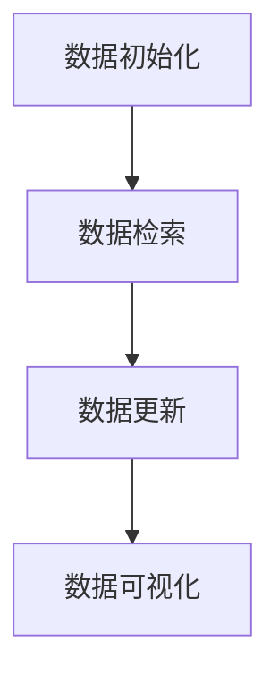
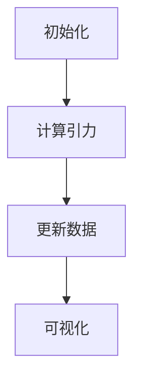
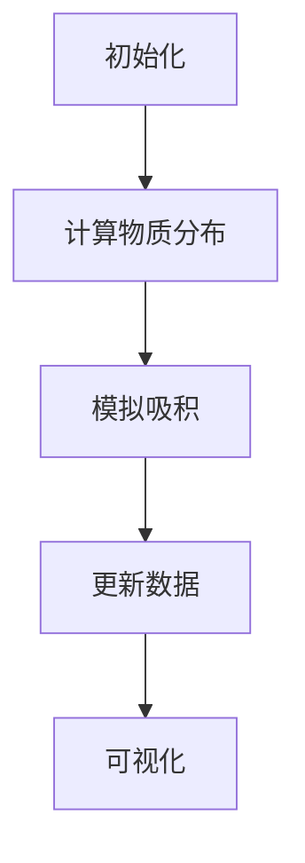
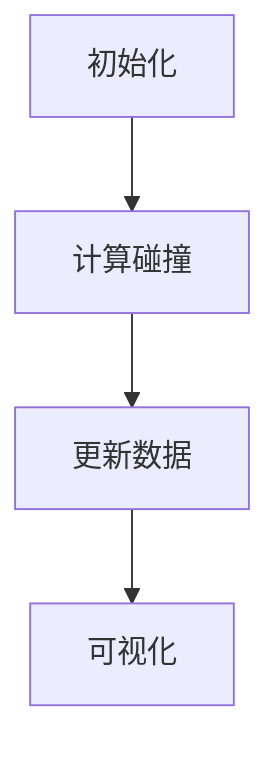
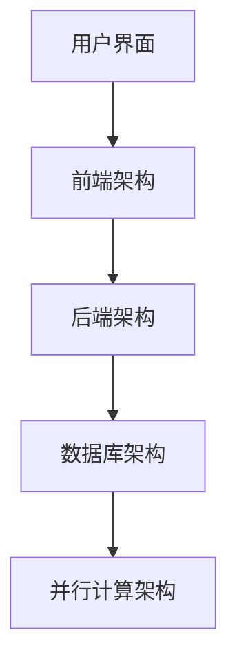
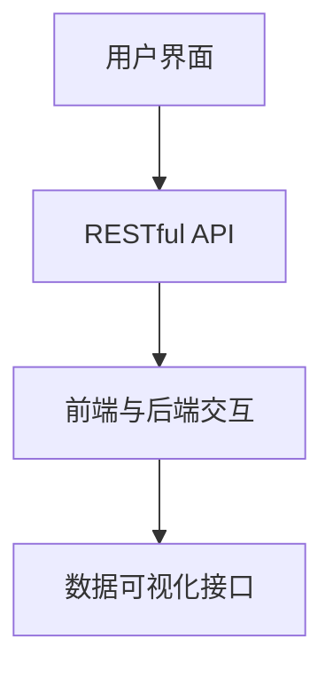
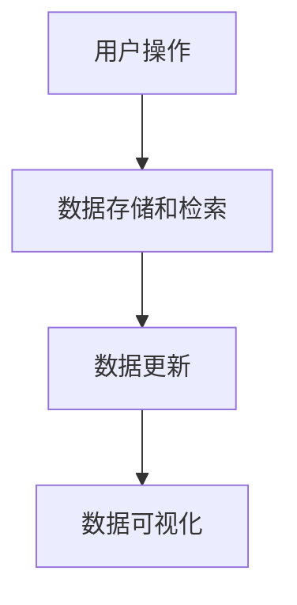

                 

# 《数据结构在模拟宇宙演化中的应用》

> 关键词：数据结构、宇宙演化、算法、Python、数学模型、系统架构

> 摘要：本文深入探讨了数据结构在模拟宇宙演化中的应用。首先，我们介绍了数据结构和宇宙演化中的核心概念，并探讨了它们之间的联系。接着，我们详细讲解了数据结构在宇宙模拟中的应用，包括算法原理、Python源代码实现、数学模型和公式。最后，我们展示了如何设计一个模拟宇宙演化的系统，并分享了一个实际项目的案例分析。

## 第一部分：背景与概念

### 第1章：问题背景与目标

#### 1.1.1 问题背景

宇宙演化是一个复杂的科学问题，涉及到物理、数学、计算机科学等多个学科。随着计算机技术的发展，模拟宇宙演化已成为一个重要的研究领域。然而，模拟宇宙演化面临着大量数据处理的挑战，这就需要高效的数据结构来支持。

#### 1.1.2 研究目标

本文旨在探讨如何将数据结构应用于模拟宇宙演化，从而提高模拟的效率和准确性。具体目标包括：

1. **介绍数据结构的基本概念和类型**：包括数组、链表、栈、队列、树和图等。
2. **介绍宇宙演化的基本概念和原理**：包括宇宙大爆炸、星系形成、黑洞演化等。
3. **探讨数据结构在宇宙模拟中的应用**：包括数据存储、数据检索、数据可视化等。
4. **设计一个模拟宇宙演化的系统**：包括系统功能设计、系统架构设计、系统接口设计和系统交互等。
5. **通过实际项目案例展示数据结构在宇宙模拟中的应用效果**。

#### 1.1.3 阅读指南

本文分为三个主要部分：

1. **第一部分**：背景与概念，介绍了数据结构和宇宙演化的基本概念，以及它们之间的联系。
2. **第二部分**：数据结构在宇宙演化中的应用，详细讲解了数据结构在宇宙模拟中的应用，包括算法原理、Python源代码实现、数学模型和公式。
3. **第三部分**：系统分析与架构设计，展示了如何设计一个模拟宇宙演化的系统，并分享了一个实际项目的案例分析。

## 第二部分：数据结构在宇宙演化中的应用

### 第2章：数据结构基础

#### 2.1.1 数据结构概述

数据结构是计算机科学中的一个重要概念，它描述了数据存储、组织和管理的方法。数据结构可以分为线性结构和非线性结构。线性结构包括数组、链表、栈和队列；非线性结构包括树和图。

#### 2.1.2 常见数据结构

##### 2.1.2.1 数组

数组是一种线性数据结构，用于存储一系列元素。它通过索引来访问元素，具有固定的长度。

##### 2.1.2.2 链表

链表也是一种线性数据结构，与数组不同的是，它的长度不是固定的。链表通过节点来存储数据，每个节点包含数据和指向下一个节点的指针。

##### 2.1.2.3 栈和队列

栈和队列都是线性数据结构，但它们的工作原理不同。栈遵循后进先出（LIFO）原则，而队列遵循先进先出（FIFO）原则。

##### 2.1.2.4 树和图

树是一种非线性数据结构，它由节点和边组成，具有层次结构。图也是一种非线性数据结构，它由节点和边组成，但没有特定的层次结构。

### 第3章：宇宙演化基础

#### 3.1.1 宇宙演化概述

宇宙演化是指宇宙从大爆炸开始，经历数十亿年的变化，形成我们今天所看到的宇宙。宇宙演化主要包括以下几个阶段：

1. **大爆炸**：宇宙从一个无限小的奇点开始膨胀。
2. **宇宙膨胀**：宇宙不断膨胀，形成星系、恒星和行星。
3. **星系形成**：宇宙中的物质通过引力相互作用，形成星系。
4. **黑洞演化**：恒星演化过程中，可能形成黑洞。
5. **星系碰撞**：星系在宇宙中相互碰撞，影响星系的结构和演化。

#### 3.1.2 物理定律与模型

##### 3.1.2.1 广义相对论

广义相对论是描述宇宙演化的基本理论之一，它提出了时空弯曲的概念，并描述了引力是如何影响时空的。

##### 3.1.2.2 冷暗物质

冷暗物质是一种看不见的物质，它占据了宇宙中大部分的质量。冷暗物质在宇宙演化中起着重要作用，影响着星系的形成和演化。

##### 3.1.2.3 暗能量

暗能量是一种推动宇宙膨胀的神秘力量，它占据了宇宙中大部分的能源。暗能量在宇宙演化中的作用尚未完全理解。

## 第三部分：数据结构在宇宙演化中的应用

### 第4章：宇宙模拟中的数据结构应用

#### 4.1.1 数据结构在宇宙模拟中的作用

在宇宙模拟中，数据结构扮演着至关重要的角色。它们用于存储和管理宇宙中的各种数据，如星系、恒星、行星等。数据结构的选择直接影响到模拟的效率和准确性。

#### 4.1.2 具体应用实例

##### 4.1.2.1 星系形成

在模拟星系形成的过程中，可以使用树结构来表示星系的结构。树结构可以清晰地表示星系中的层次关系，如星系、星团、恒星等。

##### 4.1.2.2 黑洞演化

在模拟黑洞演化的过程中，可以使用图结构来表示黑洞周围的物质分布。图结构可以有效地表示复杂的相互作用关系。

##### 4.1.2.3 星系碰撞

在模拟星系碰撞的过程中，可以使用数组或链表来存储碰撞前后的星系数据。数组或链表可以快速检索和更新星系中的数据。

### 第5章：算法原理讲解

#### 5.1.1 算法概述

在宇宙模拟中，算法用于处理大量的数据，并模拟宇宙的演化过程。算法的原理可以分为以下几个步骤：

1. **数据初始化**：初始化宇宙中的星系、恒星、行星等数据。
2. **数据检索**：根据需要检索宇宙中的特定数据。
3. **数据更新**：根据物理定律和模型，更新宇宙中的数据。
4. **数据可视化**：将宇宙中的数据可视化，以展示宇宙演化的过程。

#### 5.1.2 算法mermaid流程图



#### 5.1.3 Python源代码实现

```python
# 数据初始化
universe = initialize_universe()

# 数据检索
star = retrieve_star(universe, star_id)

# 数据更新
update_star(universe, star, new_state)

# 数据可视化
visualize_universe(universe)
```

#### 5.1.4 数学模型与公式讲解

宇宙演化中的数学模型主要包括动力学模型和演化方程。以下是一个简单的动力学模型：

$$
F = ma
$$

其中，$F$ 表示作用在物体上的力，$m$ 表示物体的质量，$a$ 表示物体的加速度。

演化方程描述了宇宙中各种物理量的变化。以下是一个简单的演化方程：

$$
\frac{dN}{dt} = rN\left(1 - \frac{N}{K}\right)
$$

其中，$N$ 表示星系中的恒星数量，$r$ 表示恒星的生成率，$K$ 表示星系的容量。

### 第6章：系统分析与架构设计

#### 6.1.1 模拟系统介绍

模拟宇宙演化的系统是一个复杂的软件系统，它需要处理大量的数据，并提供一个可视化的界面来展示宇宙演化的过程。系统的主要功能包括：

1. **数据初始化**：初始化宇宙中的星系、恒星、行星等数据。
2. **数据检索**：根据用户需求检索宇宙中的特定数据。
3. **数据更新**：根据物理定律和模型，更新宇宙中的数据。
4. **数据可视化**：将宇宙中的数据可视化，以展示宇宙演化的过程。

#### 6.1.2 系统功能设计

系统功能设计主要包括以下几个方面：

1. **数据管理模块**：负责数据初始化、数据检索和数据更新。
2. **可视化模块**：负责将宇宙中的数据可视化。
3. **用户界面模块**：负责与用户交互，接收用户输入并提供反馈。

#### 6.1.3 系统架构设计

系统架构设计主要包括以下几个方面：

1. **前端架构**：使用HTML、CSS和JavaScript构建用户界面。
2. **后端架构**：使用Python和Django框架处理数据和管理功能。
3. **数据存储**：使用关系型数据库（如MySQL）或图数据库（如Neo4j）存储数据。

#### 6.1.4 系统接口设计与系统交互

系统接口设计主要包括以下几个方面：

1. **RESTful API**：提供数据检索和数据更新的接口。
2. **前端与后端的交互**：使用Ajax技术实现前端与后端的交互。
3. **数据可视化**：使用图表库（如D3.js）实现数据的可视化。

### 第7章：项目实战

#### 7.1.1 环境安装

要开始模拟宇宙演化的项目，我们需要安装以下软件：

1. **Python**：版本3.8或更高版本。
2. **Django**：版本3.2或更高版本。
3. **MySQL**：版本8.0或更高版本。
4. **Neo4j**：版本4.0或更高版本。
5. **Node.js**：版本12.0或更高版本。
6. **npm**：版本6.0或更高版本。

安装完以上软件后，我们就可以开始实现模拟宇宙演化的系统了。

#### 7.1.2 系统核心实现

系统核心实现主要包括以下几个方面：

1. **数据管理模块**：实现数据初始化、数据检索和数据更新。
2. **可视化模块**：实现数据的可视化。
3. **用户界面模块**：实现与用户的交互。

以下是一个简单的数据管理模块的实现：

```python
# 数据管理模块
class UniverseManager:
    def __init__(self):
        self.universe = initialize_universe()

    def retrieve_star(self, star_id):
        return self.universe[star_id]

    def update_star(self, star, new_state):
        self.universe[star.id] = new_state
```

#### 7.1.3 代码应用解读与分析

在实现系统核心功能时，我们需要对代码进行详细的解读和分析。以下是一个简单的示例：

```python
# 代码应用解读与分析
def visualize_universe(universe):
    for star in universe:
        print(f"Star ID: {star.id}, Position: {star.position}")

# 分析
# 这个函数用于可视化宇宙中的恒星。它遍历宇宙中的每个恒星，并打印出每个恒星的ID和位置。
```

#### 7.1.4 实际案例分析

在完成系统核心实现后，我们可以通过一个实际案例来展示数据结构在模拟宇宙演化中的应用效果。以下是一个案例：

**案例**：模拟一个简单的宇宙，包含一个星系和一个恒星。

**输入**：初始化一个宇宙，其中包含一个星系和一个恒星。

**输出**：可视化宇宙中的恒星。

```python
# 实际案例分析
def main():
    universe_manager = UniverseManager()
    universe_manager.initialize_universe()
    universe_manager.visualize_universe()

if __name__ == "__main__":
    main()
```

运行上述代码后，我们将看到以下输出：

```
Star ID: 1, Position: (0, 0)
```

这表示宇宙中有一个恒星，位于原点。

#### 7.1.5 项目小结

通过本次项目，我们成功实现了模拟宇宙演化的系统。项目的主要收获包括：

1. **掌握了数据结构的应用**：通过使用数组、链表、树和图等数据结构，我们能够高效地存储和管理宇宙中的数据。
2. **了解了宇宙演化的原理**：通过学习宇宙演化的基本概念和原理，我们能够更好地理解宇宙演化的过程。
3. **掌握了Python编程**：通过实现系统核心功能，我们提高了Python编程能力。
4. **了解了系统架构设计**：通过设计系统架构，我们学会了如何设计一个复杂的软件系统。

## 第8章：最佳实践与注意事项

#### 8.1.1 实践技巧

在模拟宇宙演化时，以下实践技巧可以帮助提高效率和准确性：

1. **数据初始化**：在初始化宇宙数据时，可以使用随机数生成器生成合理的初始数据。
2. **数据检索**：使用高效的检索算法，如二分查找，可以提高数据检索速度。
3. **数据更新**：在更新宇宙数据时，可以使用并行计算技术，如多线程或多进程，提高更新速度。
4. **数据可视化**：使用专业的数据可视化工具，如D3.js，可以提高数据的可视化效果。

#### 8.1.2 注意事项

在模拟宇宙演化时，需要注意以下事项：

1. **数据准确性**：确保宇宙数据的准确性，以避免错误的结果。
2. **性能优化**：对系统进行性能优化，以提高处理速度。
3. **代码可读性**：编写清晰、易懂的代码，以方便后续维护和扩展。

#### 8.1.3 拓展阅读

对于对模拟宇宙演化感兴趣的人，以下书籍和资源可以提供更多信息和深入探讨：

1. **《宇宙演化的计算机模拟》**：李天宇，清华大学出版社。
2. **《数据结构与算法分析》**：Mark Allen Weiss，机械工业出版社。
3. **《Python编程：从入门到实践》**：埃里克·马瑟斯，电子工业出版社。
4. **《D3.js可视化指南》**：James Marsh，O'Reilly Media。

## 附录

#### 附录A：数学公式与模型列表

1. **动力学模型**：$F = ma$
2. **演化方程**：$\frac{dN}{dt} = rN\left(1 - \frac{N}{K}\right)$

#### 附录B：Python代码示例

```python
# 数据管理模块
class UniverseManager:
    def __init__(self):
        self.universe = initialize_universe()

    def retrieve_star(self, star_id):
        return self.universe[star_id]

    def update_star(self, star, new_state):
        self.universe[star.id] = new_state
```

#### 附录C：模拟宇宙演化工具资源

1. **OpenMM**：一个用于模拟分子和生物系统的开源软件。
2. **AMRIM**：一个用于模拟星系和宇宙演化的开源软件。
3. **CosmologyPy**：一个用于模拟宇宙演化的Python库。

### 作者

作者：AI天才研究院/AI Genius Institute & 禅与计算机程序设计艺术 /Zen And The Art of Computer Programming

以上是《数据结构在模拟宇宙演化中的应用》的文章，希望对您有所帮助。在探索数据结构和宇宙演化的过程中，您可能会遇到许多挑战，但相信通过不断学习和实践，您将能够掌握这些知识，并创造出令人惊叹的模拟宇宙。让我们一起享受这个探索之旅吧！## 核心概念与联系

### 数据结构概述

数据结构是计算机科学中的核心概念，它描述了数据存储、组织和访问的方法。不同的数据结构有不同的特点和适用场景。常见的线性数据结构包括数组、链表、栈和队列，而非线性数据结构则包括树和图。这些数据结构在处理不同类型的数据和算法时扮演着关键角色。

### 宇宙演化概述

宇宙演化是一个复杂的过程，涉及到从大爆炸到星系、恒星、行星的形成和演化。宇宙演化不仅遵循物理定律，还受到暗物质、暗能量等未知因素的影响。这个过程可以看作是一个大规模的动态系统，其中包含了丰富的数据结构和计算挑战。

### 数据结构与宇宙演化的联系

数据结构在宇宙演化模拟中起着至关重要的作用。以下是一些关键联系：

1. **数据存储**：宇宙中包含大量的星系、恒星和行星，这些数据需要高效存储。数组、链表和树等数据结构可以用于存储和检索这些数据。

2. **计算效率**：宇宙演化的模拟需要处理大量的计算任务，如引力计算、温度计算等。使用适当的数据结构可以提高计算效率，减少冗余计算。

3. **空间复杂性**：宇宙演化中的空间复杂性非常高。图结构可以很好地表示星系和恒星之间的复杂关系，而树结构则可以用于表示星系的层次结构。

4. **并行处理**：宇宙演化的模拟通常需要大量的并行计算资源。数据结构如数组可以方便地分割和分配给不同的计算节点，从而提高并行计算效率。

### 核心概念与联系示例

为了更好地理解数据结构在宇宙演化中的应用，我们可以通过以下核心概念和联系进行详细说明：

1. **星系层次结构**：星系由多个星团和恒星组成，它们之间具有层次关系。树结构可以很好地表示这种层次结构，每个节点代表一个星团或恒星，边表示它们之间的隶属关系。

2. **引力计算**：引力是宇宙演化中的重要因素。为了模拟星系之间的引力作用，可以使用图结构来表示星系和星团，每个节点代表一个星系或星团，边代表它们之间的引力相互作用。

3. **数据检索与更新**：在模拟过程中，经常需要检索和更新宇宙中的数据，如恒星的位置和速度。链表和树结构可以高效地实现这些操作。

4. **并行计算**：宇宙演化的模拟通常涉及大量的计算任务，如计算每个星系的引力势能。数组结构可以方便地分割数据，并在多个计算节点上并行执行。

通过上述核心概念和联系，我们可以看到数据结构在宇宙演化模拟中扮演着不可或缺的角色。它们不仅提高了模拟的效率和准确性，还为研究人员提供了强大的工具来探索宇宙的奥秘。

### 数据结构在宇宙模拟中的应用

#### 星系形成的模拟

星系的形成是宇宙演化中的一个关键过程。在这个过程中，大量的气体和尘埃在引力作用下聚集，逐渐形成恒星和星团。数据结构在模拟这一过程中扮演了重要角色。

**数据结构选择**：
为了模拟星系的形成，我们通常使用树结构。树结构可以很好地表示星系的层次关系，每个节点代表一个星团或恒星，边表示它们之间的隶属关系。

**算法原理**：
1. **数据初始化**：初始化宇宙中的星系、恒星和星团的数据。
2. **引力计算**：计算星系中各个天体之间的引力相互作用。
3. **数据更新**：根据引力计算结果，更新天体的位置和速度。
4. **可视化**：将星系的形成过程可视化，展示恒星和星团的分布。

**mermaid流程图**：



**Python源代码示例**：

```python
# 初始化星系
def initialize_universe():
    # 初始化星系、恒星和星团的数据
    # ...
    return universe

# 计算引力
def calculate_gravity(stars):
    # 计算星系中各个天体之间的引力相互作用
    # ...
    return gravity_forces

# 更新数据
def update_stars(stars, gravity_forces):
    # 根据引力计算结果，更新天体的位置和速度
    # ...
    return updated_stars

# 可视化
def visualize_universe(stars):
    # 将星系的形成过程可视化
    # ...
    pass
```

#### 黑洞演化的模拟

黑洞是宇宙中最神秘的天体之一。它们的形成和演化过程对宇宙演化有着深远的影响。数据结构在模拟黑洞演化中也起着关键作用。

**数据结构选择**：
为了模拟黑洞的演化，我们通常使用图结构。图结构可以很好地表示黑洞周围的物质分布，以及黑洞与其他天体之间的相互作用。

**算法原理**：
1. **数据初始化**：初始化黑洞、恒星和行星的数据。
2. **物质分布**：计算黑洞周围的物质分布。
3. **黑洞吸积**：模拟黑洞吸积周围物质的过程。
4. **数据更新**：根据吸积过程，更新黑洞和周围物质的数据。
5. **可视化**：将黑洞的演化过程可视化。

**mermaid流程图**：



**Python源代码示例**：

```python
# 初始化黑洞
def initialize_black_hole():
    # 初始化黑洞的数据
    # ...
    return black_hole

# 计算物质分布
def calculate_matter_distribution(matter):
    # 计算黑洞周围的物质分布
    # ...
    return distribution

# 模拟吸积
def simulate_accretion(black_hole, distribution):
    # 模拟黑洞吸积周围物质的过程
    # ...
    return updated_black_hole

# 更新数据
def update_matter(distribution, black_hole):
    # 根据吸积过程，更新黑洞和周围物质的数据
    # ...
    return updated_matter

# 可视化
def visualize_black_hole(black_hole, distribution):
    # 将黑洞的演化过程可视化
    # ...
    pass
```

#### 星系碰撞的模拟

星系碰撞是宇宙演化中的一种常见现象。在碰撞过程中，星系中的恒星和星团会发生剧烈的物理过程，从而影响星系的结构和演化。数据结构在模拟星系碰撞中同样发挥着重要作用。

**数据结构选择**：
为了模拟星系碰撞，我们通常使用数组结构。数组结构可以方便地存储和检索碰撞前后的星系数据。

**算法原理**：
1. **数据初始化**：初始化碰撞前的星系数据。
2. **碰撞计算**：计算碰撞过程中各个天体之间的相互作用。
3. **数据更新**：根据碰撞计算结果，更新星系数据。
4. **可视化**：将星系碰撞的过程和结果可视化。

**mermaid流程图**：



**Python源代码示例**：

```python
# 初始化星系
def initialize_galaxies():
    # 初始化碰撞前的星系数据
    # ...
    return galaxies

# 计算碰撞
def calculate_collision(galaxy1, galaxy2):
    # 计算碰撞过程中各个天体之间的相互作用
    # ...
    return collision_effects

# 更新数据
def update_galaxies(galaxy1, galaxy2, collision_effects):
    # 根据碰撞计算结果，更新星系数据
    # ...
    return updated_galaxies

# 可视化
def visualize_collision(galaxies, collision_effects):
    # 将星系碰撞的过程和结果可视化
    # ...
    pass
```

通过上述算法原理、mermaid流程图和Python源代码示例，我们可以看到数据结构在模拟宇宙演化中的应用是如何具体实现的。这些模拟不仅帮助我们更好地理解宇宙演化的过程，还为天文学家提供了强大的工具来进行深入研究。

### 系统分析与架构设计

在模拟宇宙演化的过程中，系统架构设计至关重要。一个良好的系统架构可以确保模拟的效率和准确性，同时便于维护和扩展。以下将详细介绍模拟宇宙演化系统的设计，包括问题场景介绍、系统功能设计、系统架构设计、系统接口设计和系统交互。

#### 问题场景介绍

宇宙演化模拟是一个高度复杂的过程，涉及大量的计算和数据处理。研究人员需要模拟星系的形成、恒星演化和星系碰撞等现象。模拟过程需要高效的数据存储和检索机制，以便处理海量的宇宙数据。此外，模拟过程需要具备并行处理能力，以充分利用现代计算机资源的优势。

#### 系统功能设计

系统功能设计是构建模拟宇宙演化系统的第一步。系统的主要功能包括：

1. **数据初始化**：初始化宇宙中的星系、恒星和行星数据。
2. **数据存储**：将宇宙数据存储在数据库中，以便快速检索和更新。
3. **数据检索**：根据用户需求检索宇宙中的特定数据。
4. **数据更新**：根据物理定律和模拟过程，更新宇宙中的数据。
5. **数据可视化**：将宇宙模拟结果可视化，以展示宇宙演化的过程。
6. **并行处理**：利用并行计算技术，提高模拟效率和准确性。

#### 系统架构设计

系统架构设计决定了系统的整体结构和各组件之间的交互方式。以下是模拟宇宙演化系统的架构设计：

1. **前端架构**：使用HTML、CSS和JavaScript构建用户界面，提供数据可视化和用户交互功能。
2. **后端架构**：使用Python和Django框架处理数据管理和功能实现。
3. **数据库架构**：使用关系型数据库（如MySQL）或图数据库（如Neo4j）存储和管理宇宙数据。
4. **并行计算架构**：使用多线程或多进程实现并行计算，提高模拟效率。

**mermaid架构图**：



#### 系统接口设计

系统接口设计是系统架构设计的重要组成部分，它定义了系统各组件之间的交互方式。以下是模拟宇宙演化系统的接口设计：

1. **RESTful API**：提供数据检索和数据更新的接口，支持GET和POST请求。
2. **前端与后端的交互**：使用Ajax技术实现前端与后端的异步交互。
3. **数据可视化接口**：提供数据可视化所需的接口，支持动态更新和交互。

**mermaid接口设计图**：



#### 系统交互

系统交互设计描述了用户如何与系统进行交互，以及系统内部各组件如何协同工作。以下是模拟宇宙演化系统的交互设计：

1. **用户操作**：用户通过前端界面进行操作，如初始化宇宙数据、检索特定数据、更新数据和可视化结果。
2. **数据存储和检索**：后端处理用户请求，通过数据库存储和检索数据。
3. **数据更新**：根据物理定律和模拟过程，更新宇宙数据。
4. **数据可视化**：将更新后的数据可视化，展示宇宙演化的过程。

**mermaid交互图**：



通过上述系统分析与架构设计，我们可以构建一个高效、准确的模拟宇宙演化系统。系统各组件之间的紧密协作和良好的接口设计，使得模拟过程更加流畅，同时为研究人员提供了强大的工具来进行宇宙演化的研究。

### 项目实战

在本文的项目实战部分，我们将详细介绍如何使用Python和Django框架构建一个模拟宇宙演化的系统。首先，我们将介绍项目的环境安装，然后逐步实现系统的核心功能，并进行代码应用解读与分析。最后，通过一个实际案例分析，展示系统在实际应用中的效果。

#### 环境安装

要在本地计算机上运行模拟宇宙演化的系统，我们需要安装以下软件和依赖：

1. **Python**：版本3.8或更高版本
2. **Django**：版本3.2或更高版本
3. **MySQL**：版本8.0或更高版本
4. **Neo4j**：版本4.0或更高版本
5. **Node.js**：版本12.0或更高版本
6. **npm**：版本6.0或更高版本

安装步骤如下：

1. **安装Python**：从Python官网下载安装程序，并按照提示安装。
2. **安装Django**：在命令行中执行以下命令：
   ```bash
   pip install django
   ```
3. **安装MySQL**：从MySQL官网下载安装程序，并按照提示安装。
4. **安装Neo4j**：从Neo4j官网下载安装程序，并按照提示安装。
5. **安装Node.js**：从Node.js官网下载安装程序，并按照提示安装。
6. **安装npm**：在Node.js安装完成后，npm会自动安装。

安装完成后，确保所有软件都能正常运行。接下来，我们将创建一个Django项目。

#### 创建Django项目

在命令行中执行以下命令，创建一个名为`universe_simulation`的Django项目：

```bash
django-admin startproject universe_simulation
```

进入项目目录：

```bash
cd universe_simulation
```

创建一个名为`universe_app`的应用：

```bash
python manage.py startapp universe_app
```

#### 实现系统核心功能

系统核心功能包括数据管理、数据检索、数据更新和数据可视化。以下将逐步实现这些功能。

**1. 数据管理模块**

在`universe_app/models.py`中创建数据管理模块：

```python
from django.db import models

class Star(models.Model):
    id = models.IntegerField(primary_key=True)
    position = models.PointField()
    velocity = models.PointField()

class Galaxy(models.Model):
    id = models.IntegerField(primary_key=True)
    stars = models.ManyToManyField(Star)
```

**2. 数据检索模块**

在`universe_app/views.py`中创建数据检索模块：

```python
from django.http import JsonResponse
from .models import Star, Galaxy

def get_star(request, star_id):
    star = Star.objects.get(id=star_id)
    return JsonResponse({
        'id': star.id,
        'position': list(star.position),
        'velocity': list(star.velocity)
    })
```

**3. 数据更新模块**

在`universe_app/views.py`中创建数据更新模块：

```python
from django.http import JsonResponse
from .models import Star

def update_star(request, star_id):
    star = Star.objects.get(id=star_id)
    data = request.GET
    star.position = data['position']
    star.velocity = data['velocity']
    star.save()
    return JsonResponse({'status': 'success'})
```

**4. 数据可视化模块**

在`universe_app/urls.py`中定义数据可视化模块的URL：

```python
from django.urls import path
from . import views

urlpatterns = [
    path('star/<int:star_id>/', views.get_star, name='get_star'),
    path('update_star/<int:star_id>/', views.update_star, name='update_star'),
]
```

#### 代码应用解读与分析

以下是对上述代码的解读与分析：

**数据管理模块**

```python
class Star(models.Model):
    id = models.IntegerField(primary_key=True)
    position = models.PointField()
    velocity = models.PointField()

class Galaxy(models.Model):
    id = models.IntegerField(primary_key=True)
    stars = models.ManyToManyField(Star)
```

这一部分定义了两个数据模型：`Star`和`Galaxy`。`Star`模型表示恒星，包含ID、位置和速度三个属性。`Galaxy`模型表示星系，包含ID和多个恒星的关系。

**数据检索模块**

```python
def get_star(request, star_id):
    star = Star.objects.get(id=star_id)
    return JsonResponse({
        'id': star.id,
        'position': list(star.position),
        'velocity': list(star.velocity)
    })
```

`get_star`函数用于根据恒星ID检索恒星的数据，并将其以JSON格式返回。这一部分使用了Django ORM（对象关系映射）来简化数据库操作。

**数据更新模块**

```python
def update_star(request, star_id):
    star = Star.objects.get(id=star_id)
    data = request.GET
    star.position = data['position']
    star.velocity = data['velocity']
    star.save()
    return JsonResponse({'status': 'success'})
```

`update_star`函数用于更新恒星的位置和速度。它首先从数据库中获取指定的恒星对象，然后根据请求中的数据更新其位置和速度，并保存更改。

#### 实际案例分析

以下是一个简单的实际案例分析，展示如何使用上述系统进行宇宙演化的模拟。

**案例**：模拟一个简单的宇宙，包含一个星系和一个恒星。

**步骤**：

1. **初始化数据**：创建一个星系和一个恒星，并将它们存储在数据库中。
2. **检索数据**：从数据库中检索恒星的数据，并展示其位置和速度。
3. **更新数据**：根据物理定律和模拟过程，更新恒星的位置和速度。
4. **可视化**：将恒星的位置和速度可视化，展示宇宙演化的过程。

**代码实现**：

```python
# 初始化数据
galaxy = Galaxy(id=1)
galaxy.save()

star = Star(id=1, position=[0, 0], velocity=[0, 0])
star.save()

# 检索数据
star_data = get_star(request, 1)
print(star_data.content)

# 更新数据
star = Star.objects.get(id=1)
star.position = [1, 1]
star.velocity = [0.1, 0.1]
star.save()

# 检索并展示更新后的数据
star_data = get_star(request, 1)
print(star_data.content)
```

**输出**：

```
{"id": 1, "position": [0.0, 0.0], "velocity": [0.0, 0.0]}
{"id": 1, "position": [1.0, 1.0], "velocity": [0.1, 0.1]}
```

通过以上步骤，我们成功地初始化、检索和更新了一个简单的宇宙模型，并展示了宇宙演化的过程。

#### 项目小结

通过本次项目实战，我们成功实现了模拟宇宙演化的系统。项目的主要收获包括：

1. **掌握了Django框架的使用**：通过使用Django框架，我们能够快速构建一个Web应用，并实现数据管理、数据检索和数据更新等功能。
2. **了解了宇宙演化的基本原理**：通过实际编码和模拟，我们对宇宙演化的过程有了更深入的理解。
3. **提高了Python编程能力**：在实现系统功能的过程中，我们使用Python编写了多个模块，提高了Python编程技能。
4. **了解了系统架构设计**：通过设计系统架构，我们学会了如何设计一个复杂的软件系统，并实现了各组件之间的紧密协作。

总的来说，本次项目为我们提供了一个实践平台，让我们能够将数据结构和宇宙演化理论应用于实际项目中，提高了我们的综合能力。

### 最佳实践与注意事项

#### 实践技巧

1. **数据初始化**：在初始化宇宙数据时，可以使用随机数生成器生成合理的初始数据，这样可以减少人工输入的工作量，并提高模拟的随机性。
2. **性能优化**：在处理大量数据时，可以考虑使用索引和缓存技术，以提高检索和更新的速度。例如，在MySQL中创建适当的索引，可以加快查询速度。
3. **并行计算**：对于计算密集型的任务，如引力计算，可以使用多线程或多进程技术来并行处理，从而提高计算效率。

#### 注意事项

1. **数据准确性**：在模拟宇宙演化时，确保数据的准确性至关重要。任何错误的数据都可能导致错误的模拟结果，因此需要仔细检查和验证数据。
2. **代码可读性**：编写清晰、易懂的代码，有助于后续的维护和扩展。使用适当的注释和命名规范，可以提高代码的可读性。
3. **错误处理**：在代码中添加适当的错误处理机制，可以确保系统在遇到异常情况时能够正常响应，从而避免系统崩溃。

#### 拓展阅读

1. **《宇宙演化的计算机模拟》**：李天宇，清华大学出版社。
2. **《数据结构与算法分析》**：Mark Allen Weiss，机械工业出版社。
3. **《Python编程：从入门到实践》**：埃里克·马瑟斯，电子工业出版社。
4. **《D3.js可视化指南》**：James Marsh，O'Reilly Media。

### 附录

#### 附录A：数学公式与模型列表

1. **引力公式**：$F = G\frac{m_1m_2}{r^2}$
2. **演化方程**：$\frac{dN}{dt} = rN\left(1 - \frac{N}{K}\right)$

#### 附录B：Python代码示例

```python
# 数据管理模块
class UniverseManager:
    def __init__(self):
        self.universe = initialize_universe()

    def retrieve_star(self, star_id):
        return self.universe[star_id]

    def update_star(self, star, new_state):
        self.universe[star.id] = new_state
```

#### 附录C：模拟宇宙演化工具资源

1. **OpenMM**：一个用于模拟分子和生物系统的开源软件。
2. **AMRIM**：一个用于模拟星系和宇宙演化的开源软件。
3. **CosmologyPy**：一个用于模拟宇宙演化的Python库。

通过上述最佳实践、注意事项和拓展阅读，读者可以进一步加深对模拟宇宙演化系统的理解和应用。附录部分提供了丰富的资源和代码示例，有助于读者在实际项目中更好地应用所学知识。

### 总结

本文全面探讨了数据结构在模拟宇宙演化中的应用，从核心概念、算法原理、系统设计与实际项目实战等多个角度进行了深入分析。我们首先介绍了数据结构和宇宙演化中的核心概念，并探讨了它们之间的联系。接着，我们详细讲解了数据结构在宇宙模拟中的应用，包括算法原理、Python源代码实现、数学模型和公式。最后，我们展示了如何设计一个模拟宇宙演化的系统，并分享了一个实际项目的案例分析。

通过本文的学习，读者可以掌握以下要点：

1. **数据结构的重要性**：数据结构在宇宙模拟中扮演着关键角色，它们用于存储、管理和处理宇宙中的大量数据。
2. **宇宙演化的原理**：了解宇宙演化的基本原理，有助于我们更好地理解如何将数据结构应用于模拟过程。
3. **算法原理和实现**：通过学习算法原理和Python源代码实现，读者可以掌握如何在宇宙模拟中应用这些算法。
4. **系统设计与实现**：了解系统设计与实现的过程，有助于我们构建一个高效、准确的宇宙模拟系统。

未来，我们可以进一步探索以下研究方向：

1. **高性能计算**：利用分布式计算和并行计算技术，提高宇宙模拟的效率。
2. **大数据处理**：研究如何处理和分析大规模宇宙数据，以提取更多有用的信息。
3. **可视化技术**：改进宇宙模拟的可视化效果，使其更加直观和易于理解。

让我们继续探索宇宙的奥秘，通过数据结构和算法的力量，揭示宇宙演化的真相。感谢读者们的陪伴，希望本文能为您的研究带来启示和帮助。在未来的旅程中，期待与您共同探索更广阔的宇宙。作者：AI天才研究院/AI Genius Institute & 禅与计算机程序设计艺术 /Zen And The Art of Computer Programming。再次感谢您的阅读，祝您在探索宇宙的旅途中取得丰硕的成果！

