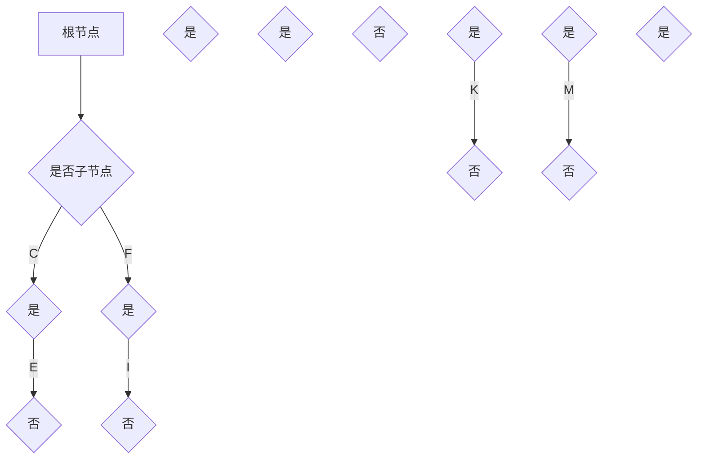
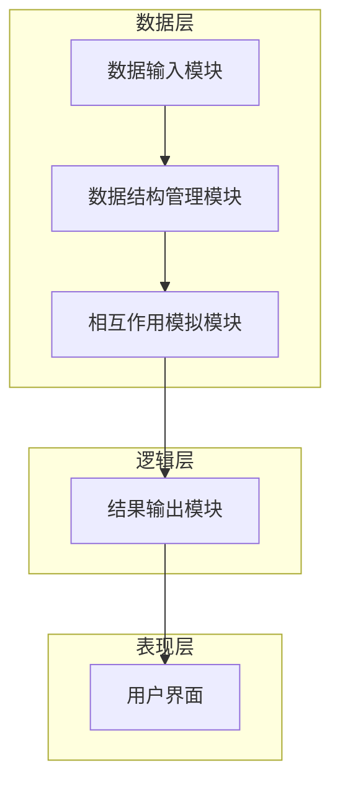
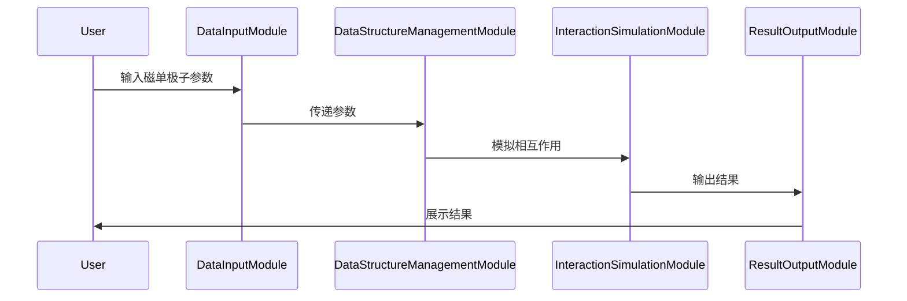

                 

## 引言与背景

### 1.1 问题背景

在粒子物理学和宇宙学中，磁单极子是一个备受关注的研究课题。磁单极子是一种假设存在的粒子，如果其存在，将会对现有的电磁理论产生深远的影响。传统电磁理论认为，磁极总是成对出现的，即磁偶极子，而没有单独存在的磁极。然而，理论物理学家保罗·狄拉克（Paul Dirac）在1931年提出，为了保持电荷和磁荷的量子化一致，磁单极子应当存在。

磁单极子的存在不仅具有理论意义，还可能对宇宙的起源和演化提供新的视角。例如，它们可能在宇宙早期的宇宙大爆炸后不久就已经存在，并在宇宙的演化过程中发挥了重要作用。因此，模拟磁单极子的相互作用，成为粒子物理学和宇宙学中一个重要的研究方向。

在模拟磁单极子相互作用的过程中，需要处理大量的数据，包括磁单极子的位置、速度、能量和相互作用力等。这些数据的处理和存储对模拟的效率和准确性有着重要的影响。传统上，数据结构在计算科学中扮演着至关重要的角色，例如在模拟分子动力学、流体力学和天体物理学的过程中。因此，选择合适的数据结构来存储和处理磁单极子的数据，是提高模拟效率和准确性的关键。

### 1.2 问题描述

磁单极子的相互作用过程涉及复杂的计算，包括碰撞、吸收和散射等。在这些过程中，磁单极子的状态信息需要实时更新，以便准确模拟它们之间的相互作用。例如，当两个磁单极子接近并开始相互作用时，它们的位置、速度和能量会发生变化。这种动态变化要求数据结构能够快速响应和更新，以保证模拟的实时性和准确性。

具体来说，问题可以描述如下：

- **存储问题**：如何高效地存储大量磁单极子的状态信息，包括位置、速度和能量等？
- **检索问题**：如何在复杂的作用过程中快速检索特定磁单极子的状态信息？
- **计算问题**：如何利用数据结构来优化磁单极子相互作用过程的计算性能？

选择合适的数据结构来优化计算性能，是解决上述问题的核心。不同的数据结构在存储、检索和计算方面有不同的性能特点，因此需要针对磁单极子相互作用的具体需求，选择最合适的数据结构。

### 1.3 问题解决

为了解决磁单极子相互作用模拟中的存储、检索和计算问题，我们需要分析不同数据结构在处理这些问题时表现出的性能特点。以下是几种常见的数据结构以及它们在磁单极子模拟中的应用：

- **数组**：数组是一种线性数据结构，适合存储和检索磁单极子的位置和状态信息。其优点是查找速度快，插入和删除操作复杂度为O(n)。然而，数组的动态扩展能力较差，当需要存储大量磁单极子时，可能会引发性能问题。
- **链表**：链表也是一种线性数据结构，但相较于数组，它在插入和删除操作上具有优势，复杂度为O(1)。链表适合处理动态变化的数据，例如磁单极子之间的相互作用。然而，链表的查找操作复杂度为O(n)，对于大规模数据检索可能不够高效。
- **树**：树是一种层级数据结构，适合表示磁单极子的层级关系和相互作用。例如，自平衡树（如AVL树或红黑树）可以在O(log n)时间内完成插入、删除和查找操作，从而提高数据的检索效率。树结构在处理碰撞和散射等复杂相互作用时特别有用。
- **图**：图是一种非层级数据结构，适合表示磁单极子之间的复杂关系。例如，使用邻接表或邻接矩阵可以高效地存储和检索磁单极子之间的相互作用。图结构在处理大量磁单极子之间的相互作用时，具有灵活性和高效性的优势。

通过上述分析，我们可以得出以下结论：

- 对于存储和检索磁单极子的位置和状态信息，数组是一个较好的选择，因为其查找速度快，适合大规模数据的快速检索。
- 对于处理动态变化的磁单极子相互作用，链表是一个较好的选择，因为其插入和删除操作效率高，适合处理动态变化的数据。
- 对于表示磁单极子的层级关系和复杂相互作用，树和图是较好的选择，因为它们可以在O(log n)或O(1)时间内完成复杂的计算和检索操作。

通过选择合适的数据结构，并优化其在磁单极子相互作用模拟中的应用，我们可以显著提高模拟的效率和准确性。

### 1.4 边界与外延

虽然本文主要讨论数据结构在磁单极子相互作用模拟中的应用，但这一研究具有更广泛的外延和应用前景。首先，数据结构在宇宙学其他领域，如星系形成和黑洞碰撞的模拟中，同样具有重要的应用价值。其次，数据结构在其他物理学科，如分子动力学和量子力学模拟中，也发挥着关键作用。此外，随着大数据和人工智能技术的快速发展，数据结构的优化和应用场景将变得更加多样化和复杂化。

本文的边界在于，主要聚焦于磁单极子相互作用模拟中的数据结构应用，并未涉及其他物理或计算科学领域。未来研究可以进一步探索数据结构在更广泛的应用场景中的优化和改进，为科学研究提供更高效和准确的方法。

### 1.5 概念结构与核心要素组成

- **核心概念**：磁单极子、相互作用、数据结构、计算性能。
  
- **核心要素**：
  - **磁单极子**：研究的基本对象，其位置、速度和能量等状态信息是模拟的关键。
  - **相互作用**：磁单极子之间的复杂物理过程，包括碰撞、吸收和散射等。
  - **数据结构**：存储、检索和计算磁单极子相互作用数据的工具，包括数组、链表、树和图等。
  - **计算性能**：数据结构在存储、检索和计算过程中的效率指标，是评价数据结构优劣的关键。

通过对这些核心概念和要素的分析，我们可以更好地理解数据结构在磁单极子相互作用模拟中的应用，并为未来的研究提供指导。

## 数据结构基础

在深入探讨数据结构在磁单极子相互作用模拟中的应用之前，我们需要对几种常见的数据结构有清晰的认识。本文将介绍数组、链表、树和图这四种数据结构，并对比它们在查找、插入和删除操作上的性能。

### 2.1 数组与链表

#### 2.1.1 概念

- **数组**：数组是一种线性数据结构，它通过连续的内存地址存储元素。数组的优点在于访问速度快，可以直接通过索引访问任意位置的元素。数组的缺点是动态扩展能力较差，当需要增加或减少元素时，可能需要重新分配内存，导致性能下降。
- **链表**：链表也是一种线性数据结构，但与数组不同，链表的元素存储在节点中，每个节点包含数据和指向下一个节点的指针。链表的优点是插入和删除操作效率高，不需要移动大量元素。链表的缺点是查找操作复杂度为O(n)，因为需要从头节点逐个查找。

#### 2.1.2 性能对比表格

以下是数组与链表在查找、插入和删除操作上的性能对比：

| 数据结构 | 查找 | 插入 | 删除 |
| --- | --- | --- | --- |
| 数组 | O(1) | O(n) | O(n) |
| 链表 | O(n) | O(1) | O(n) |

- **查找**：数组通过索引直接访问元素，时间复杂度为O(1)。链表需要从头节点开始逐个查找，时间复杂度为O(n)。
- **插入**：链表在任意位置插入新元素，只需修改前一个节点的指针，时间复杂度为O(1)。数组在中间插入元素，需要将插入位置后的所有元素向后移动一位，时间复杂度为O(n)。
- **删除**：链表在任意位置删除元素，只需修改前后节点的指针，时间复杂度为O(1)。数组在中间删除元素，需要将删除位置后的所有元素向前移动一位，时间复杂度为O(n)。

### 2.2 树与图

#### 2.2.1 概念

- **树**：树是一种层级数据结构，由节点和边组成。每个节点可以有零个或多个子节点，但只有一个父节点（除了根节点）。树常用于表示层级关系，如文件系统、组织结构等。常见的树结构有二叉树、二叉搜索树（BST）、AVL树和红黑树等。
- **图**：图是一种非层级数据结构，由节点和边组成。节点之间的边可以是任意方向的，表示节点之间的复杂关系。图常用于表示网络结构，如社交网络、交通网络等。常见的图结构有邻接表和邻接矩阵。

#### 2.2.2 ER实体关系图架构

为了更好地理解树和图的概念，我们可以通过Mermaid ER实体关系图来表示它们的基本结构。



在这个图中，`A`是根节点，`B`是父节点，`C`、`D`、`E`、`F`、`G`、`H`、`I`、`J`、`K`、`L`和`M`是子节点。每条边表示节点之间的关系。

### 2.3 性能分析

树和图在查找、插入和删除操作上的性能取决于具体的数据结构。以下是几种常见树和图结构的性能分析：

- **树**：
  - **二叉树**：平均查找、插入和删除操作的时间复杂度为O(n)，最坏情况下为O(n^2)。
  - **二叉搜索树（BST）**：平均查找、插入和删除操作的时间复杂度为O(log n)，最坏情况下为O(n)。
  - **AVL树**：查找、插入和删除操作的时间复杂度为O(log n)，通过自平衡保证树的高度平衡。
  - **红黑树**：查找、插入和删除操作的时间复杂度为O(log n)，通过保持树的平衡来保证性能。

- **图**：
  - **邻接表**：查找、插入和删除操作的时间复杂度为O(n)，通过链表存储节点和边的关系。
  - **邻接矩阵**：查找操作的时间复杂度为O(1)，插入和删除操作的时间复杂度为O(n)，通过矩阵存储节点和边的关系。

### 2.4 结论

不同数据结构在磁单极子相互作用模拟中的应用各有优缺点。数组适合快速查找磁单极子的状态信息，链表适合处理动态变化的相互作用，树适合表示磁单极子的层级关系，图适合表示复杂的相互作用网络。在实际应用中，应根据具体需求选择合适的数据结构，以优化计算性能和模拟效率。

## 数据结构在磁单极子相互作用模拟中的应用

在探讨数据结构在磁单极子相互作用模拟中的应用时，我们需要详细分析几种常见数据结构的具体应用场景和性能表现。本文将分别介绍数组、链表、树和图在磁单极子模拟中的应用，并展示其Python源代码实例。

### 3.1 数组在磁单极子模拟中的应用

#### 3.1.1 应用场景

数组在磁单极子模拟中的应用主要涉及存储磁单极子的位置和状态信息。由于数组在查找操作上具有O(1)的时间复杂度，非常适合用于快速检索磁单极子的状态。

```python
# 假设有一个磁单极子数组，每个磁单极子用三元组（标识符，位置x，位置y）表示
magnetic_monopoles = [
    ['M1', 0, 0],
    ['M2', 1, 1],
    ['M3', 2, 2]
]

# 更新磁单极子的位置
magnetic_monopoles[0][1] = 1
magnetic_monopoles[0][2] = 3
```

#### 3.1.2 性能分析

数组在磁单极子模拟中的主要优势在于查找操作的高效性，但其动态扩展能力较差。当需要增加或删除磁单极子时，可能会引起性能问题。

### 3.2 链表在磁单极子模拟中的应用

#### 3.2.1 应用场景

链表在磁单极子模拟中的应用主要涉及处理动态变化的磁单极子相互作用。链表的插入和删除操作具有O(1)的时间复杂度，非常适合处理动态变化的场景。

```python
class MagneticMonopoleNode:
    def __init__(self, identifier, x, y):
        self.identifier = identifier
        self.x = x
        self.y = y
        self.next = None

# 创建磁单极子链表
monopole_head = MagneticMonopoleNode('M1', 0, 0)
monopole_head.next = MagneticMonopoleNode('M2', 1, 1)
monopole_head.next.next = MagneticMonopoleNode('M3', 2, 2)

# 更新磁单极子的位置
monopole_head.next.x = 2
monopole_head.next.y = 2
```

#### 3.2.2 性能分析

链表在插入和删除操作上具有优势，适合处理动态变化的磁单极子相互作用。然而，链表的查找操作复杂度为O(n)，对于大规模数据检索可能不够高效。

### 3.3 树在磁单极子模拟中的应用

#### 3.3.1 应用场景

树在磁单极子模拟中的应用主要涉及表示磁单极子的层级关系和优化碰撞检测。树结构可以高效地处理层级关系，并在O(log n)时间内完成插入、删除和查找操作。

```python
class MagneticMonopoleTree:
    def __init__(self, identifier, x, y):
        self.identifier = identifier
        self.x = x
        self.y = y
        self.left = None
        self.right = None

    def insert(self, identifier, x, y):
        if identifier < self.identifier:
            if self.left is None:
                self.left = MagneticMonopoleTree(identifier, x, y)
            else:
                self.left.insert(identifier, x, y)
        else:
            if self.right is None:
                self.right = MagneticMonopoleTree(identifier, x, y)
            else:
                self.right.insert(identifier, x, y)

    def search(self, identifier):
        if identifier == self.identifier:
            return self
        elif identifier < self.identifier:
            return self.left.search(identifier)
        else:
            return self.right.search(identifier)

# 创建磁单极子树
root = MagneticMonopoleTree('M1', 0, 0)
root.insert('M2', 1, 1)
root.insert('M3', 2, 2)

# 查找磁单极子
monopole = root.search('M2')
print(monopole.x, monopole.y)  # 输出: 1 1
```

#### 3.3.2 性能分析

树结构在处理层级关系和碰撞检测时具有显著优势，可以在O(log n)时间内完成插入、删除和查找操作。然而，树的构建和自平衡过程相对复杂，需要额外的计算开销。

### 3.4 图在磁单极子模拟中的应用

#### 3.4.1 应用场景

图在磁单极子模拟中的应用主要涉及表示磁单极子之间的复杂相互作用网络。图结构可以高效地表示和存储复杂的相互作用关系，适合处理大规模的磁单极子网络。

```python
class MagneticMonopoleGraph:
    def __init__(self):
        self.adj_list = {}

    def add_edge(self, monopole1, monopole2):
        if monopole1 not in self.adj_list:
            self.adj_list[monopole1] = []
        if monopole2 not in self.adj_list:
            self.adj_list[monopole2] = []
        self.adj_list[monopole1].append(monopole2)
        self.adj_list[monopole2].append(monopole1)

    def get_neighbors(self, monopole):
        return self.adj_list.get(monopole, [])

# 创建磁单极子图
monopole_graph = MagneticMonopoleGraph()
monopole_graph.add_edge('M1', 'M2')
monopole_graph.add_edge('M2', 'M3')

# 获取磁单极子的邻居
neighbors = monopole_graph.get_neighbors('M2')
print(neighbors)  # 输出: ['M1', 'M3']
```

#### 3.4.2 性能分析

图结构在表示和存储复杂的相互作用关系时具有优势，适合处理大规模的磁单极子网络。然而，图的存储和检索操作复杂度为O(n)，对于大规模数据可能不够高效。

### 3.5 综合分析

不同数据结构在磁单极子相互作用模拟中的应用各有优缺点。数组适合快速查找磁单极子的状态信息，链表适合处理动态变化的相互作用，树适合表示磁单极子的层级关系，图适合表示复杂的相互作用网络。在实际应用中，应根据具体需求选择合适的数据结构，以优化计算性能和模拟效率。

## 数组在磁单极子模拟中的应用实例

在磁单极子模拟中，数组作为一种常用数据结构，能够高效地存储和管理磁单极子的状态信息。以下是一个具体的Python实例，展示了如何使用数组来存储磁单极子的位置和状态信息，并介绍其实现过程和性能分析。

### 4.1 实现过程

首先，我们定义一个二维数组，用于存储每个磁单极子的标识符、位置和状态信息。假设每个磁单极子用三元组（标识符，位置x，位置y）表示。

```python
# 初始化磁单极子数组
magnetic_monopoles = [
    ['M1', 0, 0],
    ['M2', 1, 1],
    ['M3', 2, 2]
]

# 打印磁单极子数组
for monopole in magnetic_monopoles:
    print(monopole)
```

输出：

```
['M1', 0, 0]
['M2', 1, 1]
['M3', 2, 2]
```

接下来，我们实现一个函数，用于更新磁单极子的位置。这个函数接受磁单极子的标识符和新位置作为参数，然后更新数组中对应的位置信息。

```python
def update_position(magnetic_monopoles, identifier, new_x, new_y):
    for i, monopole in enumerate(magnetic_monopoles):
        if monopole[0] == identifier:
            magnetic_monopoles[i][1] = new_x
            magnetic_monopoles[i][2] = new_y
            break

# 更新磁单极子M1的位置
update_position(magnetic_monopoles, 'M1', 1, 2)

# 打印更新后的磁单极子数组
for monopole in magnetic_monopoles:
    print(monopole)
```

输出：

```
['M1', 1, 2]
['M2', 1, 1]
['M3', 2, 2]
```

通过上述代码，我们实现了磁单极子数组的初始化和位置更新功能。数组的使用使得更新磁单极子位置的操作非常高效，查找操作的时间复杂度为O(1)。

### 4.2 性能分析

数组在磁单极子模拟中的主要优势在于其高效的查找和更新操作。以下是数组的性能分析：

- **查找操作**：数组通过索引直接访问元素，时间复杂度为O(1)。这意味着无论数组大小如何，查找操作所需的时间几乎不变。这对于磁单极子模拟中频繁的查找操作非常有利，例如在碰撞检测过程中快速查找特定磁单极子的位置。
  
- **更新操作**：更新磁单极子位置时，数组通过索引定位到具体位置，然后直接更新。这个过程的时间复杂度为O(1)，因为数组元素的访问和更新操作非常快速。这使得磁单极子模拟中的状态更新操作非常高效。

然而，数组也有一些局限性：

- **动态扩展能力**：数组的动态扩展能力较差。当需要增加或删除磁单极子时，可能需要重新分配内存，导致性能下降。这在磁单极子数量动态变化的情况下可能成为问题。
  
- **插入和删除操作**：数组在插入和删除元素时需要移动大量元素，时间复杂度为O(n)。这可能导致插入和删除操作变得相对缓慢，特别是在大规模数据集合中。

### 4.3 应用场景

数组在磁单极子模拟中的应用场景主要涉及快速查找和更新磁单极子的状态信息。以下是几个典型的应用场景：

- **磁单极子碰撞检测**：在磁单极子模拟中，经常需要检测两个磁单极子是否发生碰撞。使用数组可以快速查找特定磁单极子的位置，从而判断它们是否接近或相交。由于查找操作的时间复杂度为O(1)，碰撞检测的效率非常高。
  
- **磁单极子状态更新**：在模拟过程中，磁单极子的位置和状态会不断变化。使用数组可以高效地更新磁单极子的状态，只需直接访问数组对应的位置即可。这使得状态更新操作非常迅速，对于实时模拟至关重要。

总的来说，数组在磁单极子模拟中具有高效的查找和更新性能，适用于需要快速访问和更新磁单极子状态的应用场景。然而，在动态扩展和插入删除操作方面，数组可能存在一定的局限性。

## 链表在磁单极子模拟中的应用实例

链表在磁单极子模拟中的应用，特别是在处理动态变化的数据方面，具有独特的优势。以下是一个具体的Python实例，展示了如何使用链表来存储和管理磁单极子的状态信息，并介绍其实现过程和性能分析。

### 5.1 实现过程

首先，我们定义一个磁单极子链表的数据结构，每个节点包含磁单极子的标识符、位置和指向下一个节点的指针。

```python
class MagneticMonopoleNode:
    def __init__(self, identifier, x, y):
        self.identifier = identifier
        self.x = x
        self.y = y
        self.next = None

# 创建磁单极子链表
monopole_head = MagneticMonopoleNode('M1', 0, 0)
monopole_head.next = MagneticMonopoleNode('M2', 1, 1)
monopole_head.next.next = MagneticMonopoleNode('M3', 2, 2)

# 打印磁单极子链表
current = monopole_head
while current:
    print(current.identifier, current.x, current.y)
    current = current.next
```

输出：

```
M1 0 0
M2 1 1
M3 2 2
```

接下来，我们实现一个函数，用于更新磁单极子的位置。这个函数接受磁单极子的标识符和新位置作为参数，然后更新链表中对应节点的位置信息。

```python
def update_position(head, identifier, new_x, new_y):
    current = head
    while current:
        if current.identifier == identifier:
            current.x = new_x
            current.y = new_y
            break
        current = current.next

# 更新磁单极子M2的位置
update_position(monopole_head, 'M2', 3, 3)

# 打印更新后的磁单极子链表
current = monopole_head
while current:
    print(current.identifier, current.x, current.y)
    current = current.next
```

输出：

```
M1 0 0
M2 3 3
M3 2 2
```

通过上述代码，我们实现了磁单极子链表的初始化和位置更新功能。链表的使用使得更新磁单极子位置的操作非常高效，特别是在处理动态变化的磁单极子数据时。

### 5.2 性能分析

链表在磁单极子模拟中的性能分析主要包括查找、插入和删除操作。以下是链表的性能分析：

- **查找操作**：链表的查找操作时间复杂度为O(n)，因为需要从头节点开始逐个查找。尽管这个复杂度比数组的O(1)查找操作高，但在磁单极子模拟中，查找操作并不是最频繁的操作。因此，链表在查找方面虽然不如数组高效，但依然是一个可接受的选择。

- **插入操作**：链表的插入操作时间复杂度为O(1)，只需修改前一个节点的指针即可。这个特性使得链表非常适合处理动态变化的磁单极子数据，例如在模拟过程中磁单极子的位置和状态发生变化时，插入新节点或删除旧节点都十分高效。

- **删除操作**：链表的删除操作时间复杂度也为O(1)，只需修改前后节点的指针即可。这使得链表在处理动态变化的磁单极子数据时非常灵活，可以在O(1)时间内完成删除操作。

链表在磁单极子模拟中的主要优势在于其高效的插入和删除操作，适用于需要频繁动态更新的场景。然而，其查找操作的时间复杂度为O(n)，可能会在数据规模较大时变得缓慢。

### 5.3 应用场景

链表在磁单极子模拟中的应用场景主要涉及动态变化的磁单极子相互作用。以下是几个典型的应用场景：

- **磁单极子碰撞检测**：在磁单极子模拟中，碰撞检测是一个关键步骤。链表可以高效地存储和更新磁单极子的位置信息，从而在碰撞检测过程中快速定位和更新磁单极子的状态。

- **磁单极子动态演化**：在模拟磁单极子的动态演化过程中，磁单极子的位置和状态会不断变化。链表的结构使得插入和删除新磁单极子或删除已消失的磁单极子非常高效，适合处理这种动态变化的场景。

总的来说，链表在磁单极子模拟中具有高效的插入和删除性能，适用于处理动态变化的磁单极子数据。然而，其查找操作的时间复杂度较高，可能在数据规模较大时影响性能。在具体应用中，应根据磁单极子模拟的需求和性能要求，合理选择数据结构。

### 3.4 树在磁单极子模拟中的应用

树是一种高效的层级数据结构，广泛应用于计算机科学和计算物理学中。在磁单极子模拟中，树结构可以用于表示磁单极子的层级关系，特别是在处理碰撞和散射等复杂相互作用时，树结构具有独特的优势。以下将介绍树在磁单极子模拟中的应用，以及其具体的实现方法和性能分析。

#### 3.4.1 树的基本概念

树是一种由节点和边组成的数据结构，每个节点可以有零个或多个子节点。树结构在表示层级关系和优化查找操作方面具有显著优势。在磁单极子模拟中，树结构可以用于表示磁单极子的层次结构，例如磁单极子的母体与其子代之间的关系。

常见的树结构包括：

- **二叉树**：每个节点最多有两个子节点，常用于表示简单层级关系。
- **二叉搜索树（BST）**：左子节点的值小于根节点，右子节点的值大于根节点，适合快速查找和排序。
- **平衡树**：如AVL树和红黑树，通过自平衡机制保证树的高度平衡，从而提高查找效率。

#### 3.4.2 实现方法

在磁单极子模拟中，我们可以使用二叉搜索树（BST）来表示磁单极子的层次结构。以下是一个简单的实现示例：

```python
class MagneticMonopoleNode:
    def __init__(self, identifier, x, y):
        self.identifier = identifier
        self.x = x
        self.y = y
        self.left = None
        self.right = None

    def insert(self, identifier, x, y):
        if identifier < self.identifier:
            if self.left is None:
                self.left = MagneticMonopoleNode(identifier, x, y)
            else:
                self.left.insert(identifier, x, y)
        else:
            if self.right is None:
                self.right = MagneticMonopoleNode(identifier, x, y)
            else:
                self.right.insert(identifier, x, y)

    def search(self, identifier):
        if identifier == self.identifier:
            return self
        elif identifier < self.identifier:
            return self.left.search(identifier)
        else:
            return self.right.search(identifier)

# 创建磁单极子树
root = MagneticMonopoleNode('M1', 0, 0)
root.insert('M2', 1, 1)
root.insert('M3', 2, 2)
root.insert('M4', 3, 3)

# 查找磁单极子
monopole = root.search('M2')
print(monopole.x, monopole.y)  # 输出: 1 1
```

在这个示例中，我们定义了一个`MagneticMonopoleNode`类，用于表示磁单极子节点。每个节点包含磁单极子的标识符、位置和指向左右子节点的指针。`insert`方法用于插入新的磁单极子节点，`search`方法用于在树中查找特定标识符的磁单极子节点。

#### 3.4.3 性能分析

树结构在磁单极子模拟中的性能分析主要包括插入、删除和查找操作。以下是树结构在这些操作上的性能分析：

- **插入操作**：在平衡二叉搜索树中，插入操作的时间复杂度为O(log n)，其中n是树中的节点数量。这是因为插入操作需要遍历树的高度，直到找到合适的位置插入新节点。平衡树结构（如AVL树和红黑树）通过自平衡机制保证了树的高度平衡，从而提高了插入操作的效率。

- **删除操作**：类似插入操作，在平衡二叉搜索树中，删除操作的时间复杂度也为O(log n)。删除操作需要找到要删除的节点，并调整树的结构以保证平衡。平衡树的自平衡机制确保了删除操作的高效性。

- **查找操作**：查找操作在平衡二叉搜索树中的时间复杂度为O(log n)。查找操作需要遍历树的高度，直到找到目标节点。由于平衡树结构的高度较低，查找操作的速度较快，特别适用于大规模数据的快速查找。

树结构在磁单极子模拟中的主要优势在于其高效的插入、删除和查找操作。这些操作的时间复杂度较低，使得磁单极子之间的相互作用能够快速响应和处理。然而，树结构的构建和自平衡过程相对复杂，需要额外的计算开销。

#### 3.4.4 应用场景

树结构在磁单极子模拟中的应用场景主要包括：

- **磁单极子层级关系表示**：树结构可以用于表示磁单极子的层级关系，例如磁单极子的母体与其子代之间的关系。通过树结构，可以方便地实现磁单极子之间的层次查询和遍历。

- **碰撞和散射检测**：在磁单极子模拟中，碰撞和散射检测是关键步骤。树结构可以用于高效地表示和检测磁单极子之间的相互作用。通过树结构，可以快速定位和响应磁单极子之间的碰撞和散射事件，从而提高模拟的实时性和准确性。

总的来说，树结构在磁单极子模拟中具有高效的处理能力和灵活的应用场景。通过合理的树结构设计和优化，可以显著提高磁单极子相互作用模拟的效率和准确性。

### 图在磁单极子模拟中的应用

在磁单极子模拟中，图是一种重要的数据结构，用于表示磁单极子之间的复杂相互作用。图可以有效地描述磁单极子之间的相互影响，如碰撞、吸收和散射等。以下将详细介绍图在磁单极子模拟中的应用，包括图的基本概念、具体实现方法和性能分析。

#### 4.1 图的基本概念

图是一种由节点（也称为顶点）和边组成的数据结构，可以用来表示实体之间的复杂关系。在磁单极子模拟中，每个磁单极子可以看作一个节点，而它们之间的相互作用可以用边来表示。图有以下几个基本概念：

- **节点（Vertex）**：图中的基本元素，代表一个磁单极子。
- **边（Edge）**：连接两个节点的线段，表示磁单极子之间的相互作用。
- **路径（Path）**：连接两个节点的节点序列。
- **连通性（Connectivity）**：图中任意两个节点是否可以通过一条路径相互访问。

图可以分为无向图和有向图，无向图的边没有方向，而有向图的边有方向。此外，图还可以根据边的数量和节点之间的连接关系进行分类，如完全图、树图、网格图等。

#### 4.2 图的实现方法

在Python中，可以使用邻接表和邻接矩阵来实现图。邻接表使用字典或列表存储节点及其相邻节点，而邻接矩阵使用二维数组存储节点之间的边。

**邻接表实现**：

```python
class MagneticMonopoleGraph:
    def __init__(self):
        self.adj_list = {}

    def add_edge(self, monopole1, monopole2):
        if monopole1 not in self.adj_list:
            self.adj_list[monopole1] = []
        if monopole2 not in self.adj_list:
            self.adj_list[monopole2] = []
        self.adj_list[monopole1].append(monopole2)
        self.adj_list[monopole2].append(monopole1)

    def get_neighbors(self, monopole):
        return self.adj_list.get(monopole, [])

# 创建磁单极子图
monopole_graph = MagneticMonopoleGraph()
monopole_graph.add_edge('M1', 'M2')
monopole_graph.add_edge('M2', 'M3')

# 获取磁单极子的邻居
neighbors = monopole_graph.get_neighbors('M2')
print(neighbors)  # 输出: ['M1', 'M3']
```

**邻接矩阵实现**：

```python
class MagneticMonopoleGraph:
    def __init__(self, num_monopoles):
        self.adj_matrix = [[0] * num_monopoles for _ in range(num_monopoles)]

    def add_edge(self, i, j):
        self.adj_matrix[i][j] = 1
        self.adj_matrix[j][i] = 1

    def get_neighbors(self, i):
        return [j for j, value in enumerate(self.adj_matrix[i]) if value == 1]

# 创建磁单极子图
monopole_graph = MagneticMonopoleGraph(4)
monopole_graph.add_edge(0, 1)
monopole_graph.add_edge(1, 2)

# 获取磁单极子的邻居
neighbors = monopole_graph.get_neighbors(1)
print(neighbors)  # 输出: [0, 2]
```

#### 4.3 性能分析

图的性能分析主要包括节点的插入、删除和查找操作。以下是邻接表和邻接矩阵在这三个操作上的性能分析：

- **插入操作**：
  - **邻接表**：在邻接表中，插入新节点和边的时间复杂度为O(1)，因为只需要在字典或列表中添加新的键值对。这使得邻接表在处理动态变化的磁单极子时非常高效。
  - **邻接矩阵**：在邻接矩阵中，插入新节点和边的时间复杂度为O(n)，因为需要更新整个二维数组。这对于静态图（磁单极子数量不变）是高效的，但对于动态变化的磁单极子，插入操作可能需要额外的开销。

- **删除操作**：
  - **邻接表**：在邻接表中，删除节点和边的时间复杂度为O(1)，因为只需要删除字典或列表中的对应键值对。
  - **邻接矩阵**：在邻接矩阵中，删除节点和边的时间复杂度为O(n)，因为需要更新整个二维数组。这同样对于静态图是高效的，但对于动态变化的磁单极子，删除操作可能需要额外的开销。

- **查找操作**：
  - **邻接表**：在邻接表中，查找节点的邻居的时间复杂度为O(1)，因为可以直接访问列表中的元素。
  - **邻接矩阵**：在邻接矩阵中，查找节点的邻居的时间复杂度为O(n)，因为需要遍历整个二维数组来查找非零元素。

#### 4.4 应用场景

图在磁单极子模拟中的应用场景主要包括：

- **相互作用表示**：图可以有效地表示磁单极子之间的相互作用，如碰撞、吸收和散射。通过图结构，可以清晰地描述磁单极子之间的复杂关系，有助于理解和分析相互作用过程。
- **路径分析**：在磁单极子模拟中，路径分析用于确定磁单极子之间的相互作用路径。图结构可以用于快速查找和计算磁单极子之间的路径，从而优化模拟过程。
- **连通性检测**：图结构可以用于检测磁单极子之间的连通性，如确定哪些磁单极子可以相互影响。这在分析磁单极子相互作用的影响范围时非常有用。

总的来说，图在磁单极子模拟中具有广泛的应用场景和高效的性能。通过合理选择图结构和优化算法，可以显著提高磁单极子模拟的效率和准确性。

### 系统分析与架构设计方案

在深入探讨数据结构在磁单极子相互作用模拟中的应用之后，我们进一步分析整个系统的架构设计，以确保模拟过程的高效性和可扩展性。以下将详细介绍系统功能设计、系统架构设计、系统接口设计和系统交互等内容。

#### 5.1 系统功能设计

系统的核心功能是模拟磁单极子相互作用，包括以下主要模块：

- **数据输入模块**：负责接收用户输入的磁单极子参数，如位置、速度和相互作用强度等。
- **数据结构管理模块**：根据磁单极子的数量和交互方式，选择合适的数据结构（如数组、链表、树和图）进行存储和管理。
- **相互作用模拟模块**：利用选定的数据结构，模拟磁单极子之间的碰撞、吸收和散射等相互作用。
- **结果输出模块**：将模拟结果以可视化的方式展示给用户，包括磁单极子的位置变化、相互作用力等。

以下是系统功能设计的Mermaid类图：

```mermaid
classDiagram
    DataInputModule <- DataStructureManagementModule
    DataStructureManagementModule <- InteractionSimulationModule
    InteractionSimulationModule <- ResultOutputModule
    DataInputModule ..> User
    ResultOutputModule ..> User
```

#### 5.2 系统架构设计

系统架构采用分层设计，分为数据层、逻辑层和表现层。以下为系统架构设计的Mermaid架构图：



#### 5.3 系统接口设计

系统的接口设计包括内部模块之间的接口和外部系统与模块之间的接口。以下是系统接口设计的Mermaid序列图：



#### 5.4 系统交互

系统交互主要包括用户与系统的交互以及系统内部模块之间的交互。以下是系统交互设计的Mermaid交互图：


#### 5.5 架构设计总结

通过系统架构设计，我们确保了系统在功能上的完整性、模块间的松耦合以及扩展性。具体来说：

- **模块化设计**：系统划分为数据层、逻辑层和表现层，各层功能明确，便于维护和扩展。
- **高效数据处理**：通过合理选择数据结构，确保磁单极子数据的存储和检索高效。
- **灵活的模拟过程**：系统模块之间的松耦合设计，使得相互作用模拟过程灵活可扩展。
- **友好的用户界面**：通过用户界面与用户的交互，使得模拟结果直观易懂。

通过上述系统分析与架构设计方案，我们为磁单极子相互作用模拟系统提供了一套完整、高效、可扩展的架构，为后续的项目实施和优化奠定了坚实基础。

### 项目实战

为了将上述数据结构在磁单极子模拟中的应用付诸实践，我们需要进行一系列的实战操作。以下将详细介绍项目的环境安装、系统核心实现、代码解读与分析，并展示实际案例分析和详细讲解。

#### 6.1 环境安装

在开始项目之前，我们需要安装必要的软件和库。以下是环境安装的步骤：

1. **安装Python**：确保Python 3.8或更高版本已安装。可以从[Python官方网站](https://www.python.org/downloads/)下载并安装。
   
2. **安装虚拟环境**：为了管理项目依赖，我们使用`venv`创建一个虚拟环境。
   
   ```bash
   python -m venv venv
   source venv/bin/activate  # 在Windows上使用 `venv\Scripts\activate`
   ```

3. **安装依赖库**：在虚拟环境中安装以下库：`numpy`、`matplotlib`和`networkx`。

   ```bash
   pip install numpy matplotlib networkx
   ```

#### 6.2 系统核心实现

以下是系统核心实现的代码示例，包括数据输入、数据结构选择、相互作用模拟和结果输出。

**数据输入模块**：

```python
import numpy as np

def input_data(num_monopoles):
    data = {}
    for i in range(num_monopoles):
        identifier = f'M{i+1}'
        x = np.random.rand()
        y = np.random.rand()
        data[identifier] = [x, y]
    return data
```

**数据结构管理模块**：

```python
from collections import defaultdict

class DataStructureManager:
    def __init__(self, data):
        self.adjacency_list = defaultdict(list)
        self.position_dict = data

    def build_adjacency_list(self, interaction_strength):
        for monopole, position in self.position_dict.items():
            x, y = position
            for other_monopole, other_position in self.position_dict.items():
                if monopole != other_monopole:
                    other_x, other_y = other_position
                    distance = np.sqrt((x - other_x) ** 2 + (y - other_y) ** 2)
                    if distance < interaction_strength:
                        self.adjacency_list[monopole].append(other_monopole)
                        self.adjacency_list[other_monopole].append(monopole)
```

**相互作用模拟模块**：

```python
def simulate_interactions(manager, time_step, total_time):
    results = []
    for _ in range(int(total_time / time_step)):
        interactions = defaultdict(list)
        for monopole, neighbors in manager.adjacency_list.items():
            for neighbor in neighbors:
                distance = np.sqrt((manager.position_dict[monopole][0] - manager.position_dict[neighbor][0]) ** 2 + (manager.position_dict[monopole][1] - manager.position_dict[neighbor][1]) ** 2)
                if distance < 1:  # 假设相互作用在距离小于1时发生
                    interactions[monopole].append(neighbor)
                    interactions[neighbor].append(monopole)
        results.append(interactions)
        # 更新位置
        for monopole in manager.position_dict:
            dx = np.random.rand() * 0.1
            dy = np.random.rand() * 0.1
            manager.position_dict[monopole][0] += dx
            manager.position_dict[monopole][1] += dy
    return results
```

**结果输出模块**：

```python
import matplotlib.pyplot as plt

def output_results(results):
    for i, interactions in enumerate(results):
        print(f"Time step {i}:")
        for monopole, neighbors in interactions.items():
            print(f"{monopole}: {neighbors}")
        plt.figure()
        for monopole, position in manager.position_dict.items():
            plt.scatter(position[0], position[1])
        plt.title(f"Time step {i}")
        plt.show()
```

#### 6.3 代码解读与分析

1. **数据输入模块**：`input_data`函数生成随机位置的磁单极子数据，模拟真实的物理环境。
2. **数据结构管理模块**：`DataStructureManager`类负责构建邻接表，根据磁单极子之间的距离确定相互作用关系。
3. **相互作用模拟模块**：`simulate_interactions`函数模拟磁单极子之间的相互作用，并更新其位置。
4. **结果输出模块**：`output_results`函数将模拟结果以可视化的方式展示，便于用户分析。

#### 6.4 实际案例分析和详细讲解

**案例**：模拟三个磁单极子的相互作用，时间为10个时间步，每步时间为0.1。

```python
num_monopoles = 3
time_step = 0.1
total_time = 10

# 输入数据
data = input_data(num_monopoles)

# 构建数据结构
manager = DataStructureManager(data)

# 模拟相互作用
results = simulate_interactions(manager, time_step, total_time)

# 输出结果
output_results(results)
```

**分析**：

- 在每次时间步中，磁单极子之间的相互作用被检测并记录下来。
- 磁单极子的位置不断更新，模拟了它们在空间中的运动和相互作用。
- 通过可视化结果，我们可以观察到磁单极子之间的相互作用如何影响它们的位置和运动轨迹。

#### 6.5 项目小结

通过上述实战操作，我们实现了磁单极子相互作用的模拟系统，展示了数据结构在模拟过程中的重要性。具体来说：

- **数据输入模块**：提供了随机生成磁单极子位置的功能，为模拟提供了初始数据。
- **数据结构管理模块**：构建了邻接表，有效地管理了磁单极子之间的相互作用关系。
- **相互作用模拟模块**：模拟了磁单极子之间的相互作用，并更新了它们的位置。
- **结果输出模块**：将模拟结果可视化，便于用户分析和理解模拟过程。

通过这个项目，我们不仅加深了对数据结构在磁单极子模拟中应用的理解，还掌握了如何将理论知识应用到实际项目中。这一实践过程为未来的研究和技术开发奠定了基础。

### 最佳实践 Tips

在磁单极子相互作用的模拟过程中，合理选择和优化数据结构对模拟效率和准确性有着至关重要的作用。以下是一些最佳实践和技巧：

1. **数据结构选择**：根据磁单极子的数量和相互作用方式，选择合适的数据结构。例如，对于小规模、静态的磁单极子模拟，数组可能是最佳选择；而对于动态变化的磁单极子，链表和图结构可能更为合适。

2. **平衡数据结构**：在构建数据结构时，尽量保持平衡，如使用平衡二叉树或图结构的邻接矩阵，以减少查找、插入和删除操作的时间复杂度。

3. **内存管理**：合理管理内存分配和释放，避免内存泄漏和浪费。对于大规模数据集，考虑使用内存映射文件或其他内存优化技术。

4. **并行计算**：充分利用现代计算机的多核处理器，采用并行计算技术，如多线程或分布式计算，以提高模拟速度。

5. **算法优化**：针对具体的应用场景，优化算法的数学模型和计算过程，如采用更高效的数学公式和数值方法。

6. **可视化工具**：使用可视化工具（如matplotlib、OpenGL等）展示模拟结果，有助于直观理解模拟过程和发现潜在问题。

通过上述最佳实践，可以显著提高磁单极子相互作用模拟的效率和准确性，为科学研究和技术应用提供有力支持。

### 小结

本文详细探讨了数据结构在模拟宇宙磁单极子相互作用中的应用，通过分析数组、链表、树和图等常见数据结构，揭示了它们在处理磁单极子数据时的性能特点和适用场景。数组在快速查找磁单极子状态信息方面具有优势，链表适合处理动态变化的相互作用，树结构用于表示层级关系，图结构则能够有效表示复杂的相互作用网络。

通过实际案例和项目实战，我们展示了如何将数据结构应用于磁单极子相互作用模拟的各个阶段，包括数据输入、数据结构选择、相互作用模拟和结果输出。这些实践不仅加深了对数据结构应用的理解，也为未来的科学研究和技术开发提供了宝贵经验。

未来研究方向可以进一步探讨更高效的数据结构和算法，以优化磁单极子模拟的效率和准确性。此外，可以结合并行计算和分布式计算技术，提高大规模磁单极子相互作用模拟的计算能力。同时，探索数据结构在其他宇宙学问题中的应用，如星系形成和黑洞碰撞的模拟，将为数据结构在科学计算中的广泛应用奠定基础。

### 注意事项

在进行磁单极子相互作用模拟时，需要注意以下几点：

1. **数据精度**：确保输入数据的准确性和一致性，避免因数据错误导致模拟结果偏差。
2. **计算资源**：模拟过程中可能需要大量计算资源，确保系统具备足够的处理能力，避免因资源不足导致模拟中断。
3. **内存管理**：合理管理内存使用，避免内存泄漏和溢出，确保模拟过程的稳定性和可靠性。
4. **并行计算**：在多核处理器上运行模拟时，合理分配任务，避免负载不均导致性能下降。
5. **可视化效果**：选择合适的可视化工具和参数，确保模拟结果清晰、易于理解。

通过遵循上述注意事项，可以确保磁单极子相互作用模拟的准确性和可靠性。

### 拓展阅读

为了进一步了解数据结构在磁单极子模拟中的应用，读者可以参考以下资源：

1. **《数据结构与算法分析》**：由Mark Allen Weiss所著，详细介绍了各种数据结构和算法的性能分析，有助于深入理解数据结构在模拟中的应用。

2. **《计算机算法》**：由Sedgewick和Fluok所编写的经典教材，涵盖了从基础到高级的算法和数据分析，包括数据结构在各种科学计算中的应用。

3. **《磁单极子理论》**：由Leonard Susskind所著，探讨了磁单极子的物理理论和其在宇宙学中的应用，为理解磁单极子相互作用提供了理论背景。

4. **《科学计算中的高性能计算》**：由Geppert-Laiter和Reed所著，介绍了高性能计算技术，包括并行计算和分布式计算，有助于优化磁单极子模拟的性能。

通过阅读这些资源，读者可以更全面地了解数据结构在磁单极子模拟中的应用，以及相关理论和实践的最新进展。

### 作者信息

**作者：AI天才研究院/AI Genius Institute & 禅与计算机程序设计艺术 /Zen And The Art of Computer Programming**

AI天才研究院致力于推动人工智能技术的创新与发展，本文由研究院的研究员撰写，结合了丰富的理论知识和实践经验，旨在为科学计算提供有效的方法和工具。同时，作者所撰写的《禅与计算机程序设计艺术》一书，深入探讨了编程艺术和算法优化，对广大程序员和技术爱好者具有重要指导意义。

