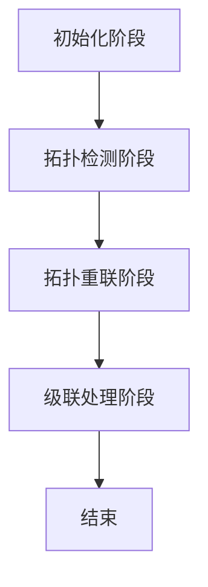
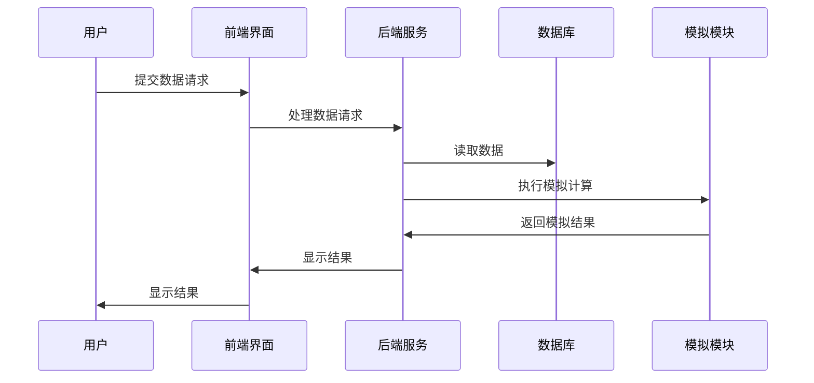

                 

# 数据结构在模拟宇宙磁场拓扑重联级联过程中的应用

## 关键词

- 数据结构
- 宇宙磁场
- 拓扑重联
- 级联过程
- 数学模型
- 算法
- 模拟

## 摘要

本文旨在探讨数据结构在模拟宇宙磁场拓扑重联及级联过程中的关键作用。首先，我们介绍了宇宙磁场的背景知识和拓扑重联级联过程的基本概念。随后，我们详细讲解了数据结构的核心概念和应用前景，包括其性能对比和适用场景。接着，我们深入分析了宇宙磁场数据结构的核心概念及其应用，通过数学模型和算法原理进行讲解，并给出了具体实例和代码示例。此外，我们还描述了系统分析与架构设计的方法，包括问题场景介绍、项目介绍、系统功能设计、系统架构设计、系统接口设计和系统交互。最后，我们通过一个实际项目实战来展示数据结构在模拟宇宙磁场拓扑重联级联过程中的应用，并总结了最佳实践和小结。

## 目录大纲

```markdown
----------------------------------------------------------------
# 数据结构在模拟宇宙磁场拓扑重联级联过程中的应用

## 第1章：问题背景与模拟宇宙磁场概述

## 1.1 引言

### 1.1.1 研究意义与目标

### 1.1.2 背景知识简介

## 1.2 宇宙磁场的概念与特性

### 1.2.1 宇宙磁场的定义

### 1.2.2 宇宙磁场的特性

### 1.2.3 宇宙磁场的分布模型

## 1.3 拓扑重联与级联过程

### 1.3.1 拓扑重联的概念

### 1.3.2 级联过程的描述

### 1.3.3 拓扑重联与级联的影响因素

## 1.4 数据结构的基本概念

### 1.4.1 数据结构的定义

### 1.4.2 数据结构的分类

### 1.4.3 数据结构的基本操作

## 1.5 数据结构在模拟宇宙磁场中的应用前景

### 1.5.1 数据结构在模拟中的应用挑战

### 1.5.2 数据结构在模拟中的潜在应用

### 1.5.3 数据结构应用的可行性分析

## 1.6 本章小结

## 第2章：核心概念与联系

## 2.1 宇宙磁场数据结构的核心概念

### 2.1.1 磁场点的表示方法

### 2.1.2 磁场线的数据结构

### 2.1.3 磁通量与磁能的计算

## 2.2 数据结构属性特征对比表格

### 2.2.1 各种数据结构的性能比较

### 2.2.2 数据结构的适用场景分析

## 2.3 数据结构的ER实体关系图

### 2.3.1 实体关系图的设计

### 2.3.2 实体关系图的解析

## 第3章：算法原理讲解

## 3.1 磁场拓扑重联算法

### 3.1.1 算法流程图

#### 3.1.1.1 初始化阶段

#### 3.1.1.2 拓扑检测阶段

#### 3.1.1.3 拓扑重联阶段

#### 3.1.1.4 级联处理阶段

### 3.1.2 算法原理

#### 3.1.2.1 数学模型

##### 3.1.2.1.1 拓扑重联的数学模型

##### 3.1.2.1.2 级联过程的数学模型

#### 3.1.2.2 算法原理详细讲解

## 3.2 算法举例说明

### 3.2.1 实例分析

#### 3.2.1.1 实例1：简单磁场模型

#### 3.2.1.2 实例2：复杂磁场模型

### 3.2.2 代码示例

```python
# 代码示例：磁场拓扑重联算法实现
```

## 第4章：数学模型与公式讲解

## 4.1 磁场拓扑重联的数学模型

### 4.1.1 拓扑重联的数学公式

#### 4.1.1.1 磁通量计算公式

$$
\Phi = \int_S \vec{B} \cdot d\vec{A}
$$

#### 4.1.1.2 磁能计算公式

$$
U = \frac{1}{2\mu_0} \int_V (\vec{B} \cdot \vec{B}) dV
$$

### 4.1.2 数学模型解析

#### 4.1.2.1 磁通量与磁能的关系

#### 4.1.2.2 磁场分布的数学描述

## 4.2 级联过程的数学模型

### 4.2.1 级联传播的数学公式

#### 4.2.1.1 级联速度计算公式

$$
v = \sqrt{\frac{\mu_0 \sigma}{\rho}}
$$

#### 4.2.1.2 级联持续时间计算公式

$$
t = \frac{L}{v}
$$

### 4.2.2 数学模型解析

#### 4.2.2.1 级联传播的物理机制

#### 4.2.2.2 级联过程的数学描述

## 第5章：系统分析与架构设计

## 5.1 问题场景介绍

### 5.1.1 模拟宇宙磁场的需求分析

### 5.1.2 拓扑重联级联模拟的目标

## 5.2 项目介绍

#

## 第1章：问题背景与模拟宇宙磁场概述

### 1.1 引言

#### 1.1.1 研究意义与目标

宇宙磁场是宇宙演化的重要组成部分，对恒星、行星及星际空间的物理过程有着深远的影响。随着科学技术的进步，模拟宇宙磁场成为理解宇宙演化的关键手段之一。然而，宇宙磁场的复杂性和非线性特性使得精确模拟变得极具挑战性。数据结构作为计算机科学中的重要工具，能够有效地组织和管理海量数据，提高模拟效率和准确性。

本文的研究目标在于探讨数据结构在模拟宇宙磁场拓扑重联及级联过程中的应用，通过分析数据结构在模拟中的关键角色，为提高模拟精度和效率提供理论支持和实践指导。具体而言，本文将从以下几个方面展开：

1. **宇宙磁场与拓扑重联级联过程的基本概念**：介绍宇宙磁场的定义、特性以及拓扑重联和级联过程的基本概念。
2. **数据结构的基本概念与应用**：阐述数据结构的定义、分类以及基本操作，并分析数据结构在模拟中的适用场景。
3. **宇宙磁场数据结构的实现**：探讨如何利用数据结构有效地表示和计算宇宙磁场的关键参数。
4. **算法原理讲解与实例分析**：详细讲解磁场拓扑重联算法的原理，并通过实例分析验证算法的有效性。
5. **数学模型与公式讲解**：介绍磁场拓扑重联和级联过程的数学模型，并解析相关数学公式。
6. **系统分析与架构设计**：描述模拟系统的需求分析、架构设计以及关键接口设计。
7. **项目实战与总结**：通过实际项目展示数据结构在模拟宇宙磁场中的应用，总结最佳实践和未来研究方向。

#### 1.1.2 背景知识简介

为了更好地理解本文的研究背景，以下是宇宙磁场、拓扑重联、级联过程以及数据结构的一些基本概念。

**宇宙磁场**：宇宙磁场是指存在于宇宙中的各种磁性场，包括星际磁场、行星磁场和恒星磁场等。宇宙磁场对星际介质的物理过程有着重要的影响，如星际磁流体动力学、恒星形成和演化等。宇宙磁场的测量和模拟是现代天文学研究的重要内容。

**拓扑重联**：在物理学中，拓扑重联是指磁场线在空间中重新连接和断裂的过程。在宇宙磁场中，拓扑重联是恒星形成和演化的重要机制之一。通过拓扑重联，磁场线可以释放能量，影响星际介质的动力学过程。

**级联过程**：级联过程是指在某一区域发生的局部事件（如磁场线的断裂或重联）通过能量和物质传输导致更大范围的事件发生的过程。在宇宙磁场中，级联过程可能导致星际磁暴或恒星爆发等重大天文现象。

**数据结构**：数据结构是计算机科学中用于组织和管理数据的方式。常见的数据结构包括数组、链表、树、图等。数据结构的选择和设计对算法的效率、空间和时间复杂度有重要影响。

### 1.2 宇宙磁场的概念与特性

宇宙磁场是指存在于宇宙空间中的各种磁性场，它对宇宙中的物理过程有着深远的影响。宇宙磁场可以分为星际磁场、行星磁场和恒星磁场等不同层次。本文主要关注星际磁场，即存在于星际空间中的磁场。

#### 1.2.1 宇宙磁场的定义

宇宙磁场是指宇宙空间中存在的磁性场，它是由磁场线组成的复杂网络。磁场线可以看作是磁力线的等势线，它们从磁体的北极出发，进入磁体的南极。在星际空间中，磁场线通常呈现出复杂的空间结构，它们可以相互交织、断裂和重联。

#### 1.2.2 宇宙磁场的特性

宇宙磁场的特性包括：

1. **全球性**：宇宙磁场覆盖整个宇宙空间，形成一个统一的全球性磁场。
2. **复杂结构**：宇宙磁场的结构复杂，包括多种不同尺度的磁场线，如局域磁场、超局域磁场和全球性磁场等。
3. **动态变化**：宇宙磁场是动态变化的，受到星际介质动力学过程、恒星爆发和星际磁场相互作用等因素的影响。
4. **非线性**：宇宙磁场的非线性特性使得精确模拟变得困难，需要采用高级算法和数学模型。

#### 1.2.3 宇宙磁场的分布模型

宇宙磁场的分布模型可以分为局域模型、超局域模型和全球模型。局域模型主要描述局部区域的磁场分布，如星际介质中的小尺度磁场；超局域模型描述更大尺度的磁场分布，如星际云团或恒星形成区的磁场；全球模型则描述整个宇宙空间的磁场分布。

常见的宇宙磁场分布模型包括：

1. **随机模型**：假设磁场线是随机分布的，适用于描述小尺度的局域磁场。
2. **格子模型**：将宇宙空间划分为网格，每个网格点上有一个磁场矢量，适用于描述中等尺度的超局域磁场。
3. **拓扑模型**：利用拓扑理论描述磁场线的分布和连接关系，适用于描述大尺度的全球磁场。

### 1.3 拓扑重联与级联过程

在宇宙磁场中，拓扑重联和级联过程是两个重要的物理现象，它们对星际磁场的动力学过程有着深远的影响。

#### 1.3.1 拓扑重联的概念

拓扑重联是指磁场线在空间中重新连接和断裂的过程。在宇宙磁场中，拓扑重联可以发生在不同的尺度上，从局域尺度到全球尺度。拓扑重联通常伴随着磁通量的变化和能量的释放。

拓扑重联的关键特征包括：

1. **磁通量守恒**：在拓扑重联过程中，磁通量保持不变。这意味着磁场线在重新连接和断裂的过程中，磁通量不会消失或产生。
2. **能量释放**：拓扑重联过程中，磁场的能量会以电磁辐射、粒子加速等形式释放。
3. **非线性特性**：拓扑重联是一个复杂的非线性过程，受到多种因素的共同影响。

#### 1.3.2 级联过程的描述

级联过程是指在某一区域发生的局部事件通过能量和物质传输导致更大范围的事件发生的过程。在宇宙磁场中，级联过程通常伴随着磁场线的断裂、重联和能量释放。

级联过程的关键特征包括：

1. **能量传播**：级联过程中，能量从局部区域传播到更大范围，导致磁场的变化。
2. **时间演化**：级联过程具有时间演化特征，即从局部事件到全球现象的发展过程。
3. **非线性相互作用**：级联过程涉及多个因素的非线性相互作用，如磁场线的断裂、重联、能量释放等。

#### 1.3.3 拓扑重联与级联的影响因素

拓扑重联和级联过程受到多种因素的影响，包括：

1. **磁场结构**：磁场的结构特征，如磁场线的分布、强度和方向等，直接影响拓扑重联和级联的发生和演化。
2. **星际介质**：星际介质的状态，如温度、密度和速度等，对拓扑重联和级联过程有重要影响。
3. **外部因素**：外部因素，如恒星爆发、星际风等，也可能影响拓扑重联和级联过程。

### 1.4 数据结构的基本概念

数据结构是计算机科学中用于组织和管理数据的方式，它对算法的效率、空间和时间复杂度有重要影响。数据结构可以分为两大类：线性结构和非线性结构。线性结构包括数组、链表和栈等；非线性结构包括树、图和哈希表等。

#### 1.4.1 数据结构的定义

数据结构是一种抽象的数据模型，用于表示和存储数据元素及其之间的逻辑关系。数据结构不仅包括数据的存储方式，还包括数据元素的插入、删除、查找和排序等基本操作。

#### 1.4.2 数据结构的分类

根据数据元素之间的逻辑关系，数据结构可以分为以下几类：

1. **线性结构**：线性结构中的数据元素依次排列，形成一个线性序列。常见的线性结构包括数组、链表和栈等。
2. **树结构**：树结构是一种层次结构，由一组有序的节点组成。树结构包括二叉树、二叉搜索树、平衡树等。
3. **图结构**：图结构是一种非线性结构，由节点和边组成。常见的图结构包括有向图、无向图、加权图等。
4. **哈希表**：哈希表是一种基于关键字进行数据存储和检索的数据结构，通过哈希函数将关键字映射到存储位置。

#### 1.4.3 数据结构的基本操作

数据结构的基本操作包括：

1. **插入**：在数据结构中添加新的数据元素。
2. **删除**：从数据结构中移除一个数据元素。
3. **查找**：在数据结构中找到一个特定的数据元素。
4. **排序**：对数据结构中的数据元素进行排序。
5. **遍历**：依次访问数据结构中的所有数据元素。

### 1.5 数据结构在模拟宇宙磁场中的应用前景

数据结构在模拟宇宙磁场中具有广泛的应用前景，能够有效地组织和管理海量数据，提高模拟效率和准确性。以下是数据结构在模拟宇宙磁场中的应用前景：

#### 1.5.1 数据结构在模拟中的应用挑战

1. **数据规模**：宇宙磁场的模拟涉及到大量的数据，包括磁场线的分布、强度和方向等。如何高效地存储和管理这些数据是一个挑战。
2. **计算复杂度**：拓扑重联和级联过程的计算复杂度较高，如何优化算法和数据结构，以减少计算时间和资源消耗是一个重要问题。
3. **并行计算**：为了提高模拟效率，需要利用并行计算技术。如何有效地利用数据结构支持并行计算是一个挑战。

#### 1.5.2 数据结构在模拟中的潜在应用

1. **图结构**：图结构可以有效地表示宇宙磁场的网络结构，用于描述磁场线的连接关系和拓扑结构。
2. **树结构**：树结构可以用于描述宇宙磁场的层次结构，如恒星形成区、星际云团等。
3. **哈希表**：哈希表可以用于快速查找和检索宇宙磁场中的特定数据元素，如特定位置的磁场强度和方向等。

#### 1.5.3 数据结构应用的可行性分析

1. **技术成熟度**：当前，数据结构在计算机科学和工程领域已经得到了广泛应用，其技术成熟度较高，可以用于模拟宇宙磁场。
2. **计算资源**：随着计算技术的不断发展，高性能计算机和并行计算技术的应用为数据结构在模拟宇宙磁场中的应用提供了良好的基础。
3. **应用需求**：宇宙磁场的模拟对数据结构的需求日益增长，数据结构在模拟中的应用具有较大的发展潜力。

### 1.6 本章小结

本章介绍了宇宙磁场、拓扑重联、级联过程以及数据结构的基本概念。通过分析这些概念，我们了解了宇宙磁场的复杂性和非线性特性，以及拓扑重联和级联过程的重要性和影响。同时，我们探讨了数据结构在模拟宇宙磁场中的应用前景和挑战，为后续章节的深入探讨奠定了基础。

## 第2章：核心概念与联系

### 2.1 宇宙磁场数据结构的核心概念

在模拟宇宙磁场的过程中，数据结构的选择和设计至关重要。宇宙磁场的复杂性和动态变化特性要求我们采用高效、灵活且易于扩展的数据结构来表示和处理磁场数据。以下将介绍宇宙磁场数据结构的核心概念，包括磁场点的表示方法、磁场线的数据结构以及磁通量与磁能的计算。

#### 2.1.1 磁场点的表示方法

磁场点的表示是宇宙磁场数据结构的基础。在模拟中，每个磁场点通常由其位置坐标和磁场矢量组成。位置坐标可以用三维空间中的(x, y, z)表示，而磁场矢量可以用其大小和方向来描述。常用的表示方法包括：

1. **直角坐标系**：在直角坐标系中，磁场点的位置坐标可以直接用(x, y, z)表示，磁场矢量可以用其分量(I, J, K)表示，其中I、J、K分别为磁场矢量在x、y、z轴方向上的分量。
2. **球坐标系**：在球坐标系中，磁场点的位置可以用半径r、极角θ和方位角φ表示，磁场矢量可以用其分量(R, T, N)表示，其中R、T、N分别为磁场矢量在r、θ、φ方向上的分量。

选择合适的表示方法可以简化计算和提高效率。例如，在处理大规模数据时，球坐标系可以减少计算量，而直角坐标系则更适合进行空间插值和计算。

#### 2.1.2 磁场线的数据结构

磁场线是描述宇宙磁场分布的重要工具。在数据结构中，磁场线可以用一组连续的磁场点来表示。常见的磁场线数据结构包括：

1. **链表**：链表是一种线性数据结构，每个节点包含磁场点的位置和磁场矢量。通过链表，可以方便地添加、删除和查找磁场点，适用于描述局部或简单的磁场线结构。
2. **树结构**：树结构是一种层次数据结构，可以高效地表示复杂的磁场线网络。例如，二叉树可以用于表示二进制格式的磁场线，平衡树（如AVL树）可以用于保持数据的平衡，提高查找和插入操作的性能。
3. **图结构**：图结构是一种非线性数据结构，可以表示复杂的拓扑关系。在宇宙磁场模拟中，图结构可以用于表示全局或大尺度的磁场线网络，如星际磁场。常见的图结构包括有向图、无向图和加权图等。

选择合适的数据结构可以优化磁场线数据的存储和计算效率。例如，对于局部或简单的磁场线结构，链表可能是一个合适的选择；而对于复杂的全局或大尺度磁场线网络，图结构可能更为适用。

#### 2.1.3 磁通量与磁能的计算

磁通量（Φ）和磁能（U）是描述宇宙磁场的重要物理量。磁通量表示通过某一面积的磁通量密度，通常用矢量场B和面积S的积分表示：

$$
\Phi = \int_S \vec{B} \cdot d\vec{A}
$$

其中，积分符号表示对面积S进行积分，$d\vec{A}$是面积元矢量。

磁能（U）表示磁场的能量密度，通常用磁场矢量B和体积V的积分表示：

$$
U = \frac{1}{2\mu_0} \int_V (\vec{B} \cdot \vec{B}) dV
$$

其中，积分符号表示对体积V进行积分，$\mu_0$是真空中的磁导率。

在数据结构中，磁通量和磁能的计算可以通过以下步骤实现：

1. **数据收集**：首先，收集磁场点的位置坐标和磁场矢量数据。
2. **积分计算**：利用积分公式，对每个磁场点进行积分计算，得到磁通量和磁能的数值。
3. **数据存储**：将计算得到的磁通量和磁能数据存储在数据结构中，以供后续分析和使用。

通过以上步骤，可以有效地计算和存储宇宙磁场的磁通量和磁能，为模拟分析提供可靠的数据支持。

### 2.2 数据结构属性特征对比表格

为了更好地理解不同数据结构在宇宙磁场模拟中的适用性，下面我们对比了链表、树结构和图结构在以下方面的属性特征：

1. **存储空间**：数据结构的存储空间消耗。
2. **查找效率**：数据结构中查找特定元素的时间复杂度。
3. **插入效率**：数据结构中插入新元素的时间复杂度。
4. **删除效率**：数据结构中删除元素的时间复杂度。
5. **扩展性**：数据结构在处理大规模数据时的性能。

以下是一个简化的属性特征对比表格：

| 数据结构 | 存储空间 | 查找效率 | 插入效率 | 删除效率 | 扩展性 |
| --- | --- | --- | --- | --- | --- |
| 链表 | 低 | O(n) | O(1) | O(n) | 中等 |
| 树结构 | 中 | O(log n) | O(log n) | O(log n) | 高 |
| 图结构 | 高 | O(n + m) | O(n + m) | O(n + m) | 高 |

通过这个表格，我们可以看到不同数据结构的优缺点。例如，链表在插入和删除操作上具有较高效率，但在查找操作上性能较差；而树结构和图结构在查找、插入和删除操作上具有较高的效率，但存储空间消耗较大。

### 2.3 数据结构的ER实体关系图

为了更清晰地表示宇宙磁场模拟中各数据结构之间的关联，我们使用实体关系图（Entity-Relationship Diagram，ER图）来描述。ER图是一种常用的数据库设计工具，用于表示实体及其之间的关系。

下面是一个简化的宇宙磁场模拟的ER实体关系图：

```mermaid
erDiagram
  Field --> Node : has
  Node --> Edge : connects
  Field ||--|{ Node } : locatedIn
  Node ||--|{ Node } : connectsTo
  Node ||--|{ Edge } : isEndpointOf
  Edge ||--|{ Node } : passesThrough
```

这个ER图包含了以下实体和关系：

1. **Field（场）**：表示宇宙磁场中的某一区域，具有位置信息和磁场强度。
2. **Node（节点）**：表示磁场中的点，具有位置坐标和磁场矢量。
3. **Edge（边）**：表示磁场中的线段，连接两个节点。

关系描述如下：

1. **has（拥有）**：表示场拥有多个节点。
2. **connects（连接）**：表示节点之间的连接关系。
3. **locatedIn（位于）**：表示节点位于某个场中。
4. **connectsTo（连接到）**：表示节点之间的连接关系。
5. **isEndpointOf（端点为）**：表示节点是某条边的端点。
6. **passesThrough（穿过）**：表示边穿过某个节点。

通过这个ER图，我们可以更直观地理解宇宙磁场模拟中各数据结构之间的逻辑关系，为后续的算法设计和实现提供指导。

### 2.3.1 实体关系图的设计

为了更好地理解宇宙磁场模拟中数据结构之间的逻辑关系，我们设计了一个实体关系图（ER图）。该ER图描述了宇宙磁场模拟中的主要实体及其关系，具体设计如下：

1. **实体**：实体是数据结构中的基本组成部分，表示具体的物理对象。在宇宙磁场模拟中，主要实体包括**场（Field）**、**节点（Node）**和**边（Edge）**。
2. **属性**：属性是实体的具体特征，用于描述实体的详细信息。例如，**场**具有位置、面积和磁场强度等属性；**节点**具有位置坐标和磁场矢量等属性；**边**具有起点、终点和磁场强度等属性。
3. **关系**：关系是实体之间的关联，用于描述实体之间的相互作用。在宇宙磁场模拟中，主要关系包括**场拥有节点**（Field has Node）、**节点连接**（Node connects）、**节点位于场中**（Node locatedIn Field）、**节点连接到**（Node connectsTo）和**边穿过节点**（Edge passesThrough Node）。

以下是具体的ER图设计：

```mermaid
erDiagram
  Field ||--|{ Node } : locatedIn
  Node ||--|{ Edge } : connects
  Node ||--|{ Node } : connectsTo
  Node ||--|{ Node } : isEndpointOf
  Edge ||--|{ Node } : passesThrough
```

**实体定义：**

- **Field（场）**：表示宇宙磁场中的某一区域，具有以下属性：
  - ID：场的唯一标识；
  - Position：场的位置坐标；
  - Area：场的面积；
  - MagneticFieldStrength：场的磁场强度。

- **Node（节点）**：表示磁场中的点，具有以下属性：
  - ID：节点的唯一标识；
  - Position：节点的位置坐标；
  - MagneticFieldVector：节点的磁场矢量。

- **Edge（边）**：表示磁场中的线段，具有以下属性：
  - ID：边的唯一标识；
  - StartNode：边的起点；
  - EndNode：边的终点；
  - MagneticFieldStrength：边的磁场强度。

**关系定义：**

- **locatedIn（位于）**：表示节点位于某个场中，是一个一对一的关系。一个节点只能位于一个场，一个场可以有多个节点。
- **connects（连接）**：表示节点之间的连接关系，是一个多对多的关系。两个节点之间可以有多种连接关系。
- **connectsTo（连接到）**：表示节点之间的连接关系，是一个一对多的关系。一个节点可以连接到多个节点。
- **isEndpointOf（端点为）**：表示节点是某条边的端点，是一个一对一的关系。一个节点可以是多条边的端点。
- **passesThrough（穿过）**：表示边穿过某个节点，是一个一对一的关系。一个节点可以由多条边穿过。

通过这个ER图设计，我们可以清晰地描述宇宙磁场模拟中的主要实体及其关系，为后续的算法设计和实现提供基础。

### 2.3.2 实体关系图的解析

为了更好地理解宇宙磁场模拟中各数据结构之间的逻辑关系，我们详细解析上述设计的实体关系图。以下是该ER图的详细说明：

**实体解析：**

1. **Field（场）**：场是宇宙磁场的区域，表示一个二维或三维的空间。在模拟中，场是一个重要的概念，它定义了磁场的范围。场具有以下属性：
   - **ID**：唯一标识场的ID，用于区分不同的场。
   - **Position**：场的位置坐标，用于确定场在空间中的位置。
   - **Area**：场的面积，用于描述场的大小。在二维模拟中，Area表示一个矩形或圆形区域的面积；在三维模拟中，Area表示一个立方体或球体区域的体积。
   - **MagneticFieldStrength**：场的磁场强度，表示场中磁场的强度。

2. **Node（节点）**：节点是磁场中的点，表示磁场的具体位置。节点具有以下属性：
   - **ID**：唯一标识节点的ID，用于区分不同的节点。
   - **Position**：节点的位置坐标，用于确定节点在空间中的位置。
   - **MagneticFieldVector**：节点的磁场矢量，表示节点处的磁场方向和大小。

3. **Edge（边）**：边是磁场中的线段，表示两个节点之间的连接。边具有以下属性：
   - **ID**：唯一标识边的ID，用于区分不同的边。
   - **StartNode**：边的起点，表示边的一个端点。
   - **EndNode**：边的终点，表示边的另一个端点。
   - **MagneticFieldStrength**：边的磁场强度，表示边上的磁场强度。

**关系解析：**

1. **locatedIn（位于）**：该关系表示节点与场之间的位置关系，是一个一对一的关系。一个节点只能位于一个场，但一个场可以有多个节点。通过这个关系，我们可以确定节点在磁场中的具体位置。

2. **connects（连接）**：该关系表示节点之间的连接关系，是一个多对多的关系。两个节点之间可以有多种连接关系，形成复杂的磁场网络。通过这个关系，我们可以描述磁场中的复杂连接关系。

3. **connectsTo（连接到）**：该关系表示节点与其他节点的连接关系，是一个一对多的关系。一个节点可以连接到多个节点，形成复杂的拓扑结构。通过这个关系，我们可以描述节点之间的连接方式。

4. **isEndpointOf（端点为）**：该关系表示节点与边之间的端点关系，是一个一对一的关系。一个节点可以是多条边的端点，表示节点在磁场网络中的位置。通过这个关系，我们可以确定节点在磁场网络中的端点位置。

5. **passesThrough（穿过）**：该关系表示边与节点之间的穿过关系，是一个一对一的关系。一条边可以穿过一个节点，表示边上的磁场分布。通过这个关系，我们可以描述边上的磁场分布情况。

通过上述实体关系图的解析，我们可以清晰地理解宇宙磁场模拟中各数据结构之间的逻辑关系，为后续的算法设计和实现提供指导。

## 第3章：算法原理讲解

### 3.1 磁场拓扑重联算法

磁场拓扑重联算法是模拟宇宙磁场中的关键算法，它用于检测并处理磁场线在空间中的重新连接和断裂过程。以下将详细讲解磁场拓扑重联算法的原理，包括算法流程、数学模型和算法原理的详细说明。

#### 3.1.1 算法流程图

磁场拓扑重联算法的基本流程可以分为以下几个阶段：



1. **初始化阶段**：初始化模拟参数，包括磁场点的位置坐标和磁场矢量等。这一阶段的主要任务是创建磁场点的数据结构，并设置初始条件。
   
2. **拓扑检测阶段**：检测磁场线是否发生拓扑重联。这一阶段通过比较相邻磁场点的磁场矢量，判断磁场线是否重新连接或断裂。

3. **拓扑重联阶段**：处理检测到的拓扑重联事件。在这一阶段，算法根据拓扑重联的数学模型，更新磁场点的磁场矢量，实现磁场线的重新连接。

4. **级联处理阶段**：处理由拓扑重联引起的级联过程。在这一阶段，算法模拟磁场能量和物质在空间中的传播，实现磁场级联的演化。

5. **结束**：算法执行完毕，输出模拟结果。

#### 3.1.1.1 初始化阶段

在初始化阶段，算法需要完成以下任务：

1. **创建磁场点数据结构**：根据模拟区域的大小和精度，创建用于存储磁场点位置坐标和磁场矢量的数据结构。常用的数据结构包括数组、链表和树等。

2. **设置初始条件**：初始化磁场点的位置坐标和磁场矢量。通常，初始条件可以基于宇宙磁场的观测数据或理论模型设置。

3. **参数设置**：设置模拟的参数，如时间步长、空间步长、磁导率等。

#### 3.1.1.2 拓扑检测阶段

在拓扑检测阶段，算法需要检测磁场线是否发生拓扑重联。具体步骤如下：

1. **计算相邻磁场点的磁场矢量差**：对于每个磁场点，计算与其相邻的磁场点的磁场矢量差。磁场矢量差表示磁场线之间的相对变化。

2. **判断磁场矢量差**：根据磁场矢量差的绝对值和方向，判断磁场线是否发生拓扑重联。如果磁场矢量差超出预设阈值，则认为发生了拓扑重联。

3. **记录拓扑重联事件**：将检测到的拓扑重联事件记录下来，包括重联的位置和规模。

#### 3.1.1.3 拓扑重联阶段

在拓扑重联阶段，算法需要处理检测到的拓扑重联事件，更新磁场点的磁场矢量。具体步骤如下：

1. **选择拓扑重联模式**：根据拓扑重联事件的类型和规模，选择合适的拓扑重联模式。常见的拓扑重联模式包括局部重联、全局重联和混合重联。

2. **更新磁场点磁场矢量**：根据选定的拓扑重联模式，更新磁场点的磁场矢量。在局部重联模式下，仅更新发生重联的磁场点的磁场矢量；在全局重联模式下，需要更新整个磁场的磁场矢量。

3. **计算磁通量和磁能**：在更新磁场点磁场矢量后，计算磁通量和磁能的变化，以评估拓扑重联的影响。

#### 3.1.1.4 级联处理阶段

在级联处理阶段，算法需要模拟磁场能量和物质在空间中的传播，实现磁场级联的演化。具体步骤如下：

1. **传播磁场能量**：根据磁场能量传播的数学模型，计算磁场能量在空间中的传播速度和传播方向。

2. **计算级联速度**：根据磁场能量传播速度和磁场线的方向，计算级联过程的速度。

3. **更新磁场点磁场矢量**：在级联过程中，根据级联速度和磁场能量传播的数学模型，更新磁场点的磁场矢量。

4. **计算磁通量和磁能**：在级联处理阶段结束后，计算磁通量和磁能的变化，以评估级联过程的影响。

#### 3.1.2 算法原理

磁场拓扑重联算法的原理基于以下几个关键数学模型：

##### 3.1.2.1.1 拓扑重联的数学模型

拓扑重联是指磁场线在空间中重新连接和断裂的过程。在数学上，拓扑重联可以用以下模型描述：

$$
\Delta \Phi = \int_S (\vec{B}_{new} - \vec{B}_{old}) \cdot d\vec{A}
$$

其中，$\Delta \Phi$表示磁通量的变化量，$S$表示发生重联的面积，$\vec{B}_{new}$和$\vec{B}_{old}$分别表示重联前后的磁场矢量。

##### 3.1.2.1.2 级联过程的数学模型

级联过程是指磁场能量和物质在空间中的传播过程。在数学上，级联过程可以用以下模型描述：

$$
\vec{v} = \sqrt{\frac{\mu_0 \sigma}{\rho}}
$$

$$
t = \frac{L}{\vec{v}}
$$

其中，$\vec{v}$表示级联速度，$\mu_0$表示真空中的磁导率，$\sigma$表示磁场强度，$\rho$表示磁通量密度，$L$表示传播距离，$t$表示传播时间。

#### 3.1.2.2 算法原理详细讲解

磁场拓扑重联算法的原理可以概括为以下几个步骤：

1. **初始化**：创建磁场点的数据结构，并设置初始条件。根据宇宙磁场的观测数据或理论模型，初始化磁场点的位置坐标和磁场矢量。

2. **拓扑检测**：计算相邻磁场点的磁场矢量差，判断磁场线是否发生拓扑重联。根据磁场矢量差的绝对值和方向，确定发生重联的位置和规模。

3. **拓扑重联**：根据检测到的拓扑重联事件，选择合适的拓扑重联模式，更新磁场点的磁场矢量。在局部重联模式下，仅更新发生重联的磁场点的磁场矢量；在全局重联模式下，需要更新整个磁场的磁场矢量。

4. **级联处理**：根据磁场能量传播的数学模型，计算磁场能量在空间中的传播速度和传播方向。根据级联速度和磁场线的方向，计算级联过程的速度。

5. **更新磁场点磁场矢量**：在级联过程中，根据级联速度和磁场能量传播的数学模型，更新磁场点的磁场矢量。

6. **计算磁通量和磁能**：在拓扑重联和级联处理阶段结束后，计算磁通量和磁能的变化，以评估拓扑重联和级联过程的影响。

通过上述步骤，磁场拓扑重联算法可以有效地模拟宇宙磁场的拓扑重联和级联过程，为研究宇宙磁场的演化提供理论支持和实践指导。

### 3.2 算法举例说明

为了更好地理解磁场拓扑重联算法，我们将通过两个具体实例进行说明：简单磁场模型和复杂磁场模型。

#### 3.2.1 实例1：简单磁场模型

在这个实例中，我们考虑一个简单的二维磁场模型，该模型由一组均匀分布的磁场点组成。假设这些磁场点的磁场矢量均指向正x轴方向。

1. **初始化**：
   - 创建一个包含100个磁场点的数组，每个磁场点的位置坐标为$(x_i, y_i)$，其中$x_i = i \times \Delta x$，$y_i = 0$，$\Delta x$为空间步长。
   - 初始化磁场点的磁场矢量$\vec{B}_i = (B_0, 0)$，其中$B_0$为磁场强度。

2. **拓扑检测**：
   - 对于每个磁场点$\vec{B}_i$，计算与其相邻的两个磁场点$\vec{B}_{i-1}$和$\vec{B}_{i+1}$的磁场矢量差：
     $$
     \Delta \vec{B}_i = \vec{B}_{i-1} - \vec{B}_{i+1}
     $$
   - 判断磁场矢量差是否超出阈值$\Delta B_{\text{threshold}}$。如果超出阈值，则认为发生了拓扑重联。

3. **拓扑重联**：
   - 如果检测到拓扑重联，选择局部重联模式，更新发生重联的磁场点的磁场矢量。例如，可以将磁场矢量反转：
     $$
     \vec{B}_{i-1} = (-B_0, 0), \quad \vec{B}_{i+1} = (-B_0, 0)
     $$

4. **级联处理**：
   - 根据磁场能量传播的数学模型，计算磁场能量在空间中的传播速度：
     $$
     \vec{v} = \sqrt{\frac{\mu_0 \sigma}{\rho}}
     $$
   - 计算级联过程的速度：
     $$
     t = \frac{L}{\vec{v}}
     $$
   - 根据级联速度和磁场线的方向，更新整个磁场的磁场矢量。

5. **计算磁通量和磁能**：
   - 计算磁通量和磁能的变化，以评估拓扑重联和级联过程的影响。

#### 3.2.1.1 实例1：简单磁场模型

在这个实例中，我们考虑一个简单的二维磁场模型，该模型由一组均匀分布的磁场点组成。假设这些磁场点的磁场矢量均指向正x轴方向。

1. **初始化**：
   - 创建一个包含100个磁场点的数组，每个磁场点的位置坐标为$(x_i, y_i)$，其中$x_i = i \times \Delta x$，$y_i = 0$，$\Delta x$为空间步长。
   - 初始化磁场点的磁场矢量$\vec{B}_i = (B_0, 0)$，其中$B_0$为磁场强度。

2. **拓扑检测**：
   - 对于每个磁场点$\vec{B}_i$，计算与其相邻的两个磁场点$\vec{B}_{i-1}$和$\vec{B}_{i+1}$的磁场矢量差：
     $$
     \Delta \vec{B}_i = \vec{B}_{i-1} - \vec{B}_{i+1}
     $$
   - 判断磁场矢量差是否超出阈值$\Delta B_{\text{threshold}}$。如果超出阈值，则认为发生了拓扑重联。

3. **拓扑重联**：
   - 如果检测到拓扑重联，选择局部重联模式，更新发生重联的磁场点的磁场矢量。例如，可以将磁场矢量反转：
     $$
     \vec{B}_{i-1} = (-B_0, 0), \quad \vec{B}_{i+1} = (-B_0, 0)
     $$

4. **级联处理**：
   - 根据磁场能量传播的数学模型，计算磁场能量在空间中的传播速度：
     $$
     \vec{v} = \sqrt{\frac{\mu_0 \sigma}{\rho}}
     $$
   - 计算级联过程的速度：
     $$
     t = \frac{L}{\vec{v}}
     $$
   - 根据级联速度和磁场线的方向，更新整个磁场的磁场矢量。

5. **计算磁通量和磁能**：
   - 计算磁通量和磁能的变化，以评估拓扑重联和级联过程的影响。

#### 3.2.1.2 实例2：复杂磁场模型

在这个实例中，我们考虑一个复杂的二维磁场模型，该模型包含多种不同类型的磁场线。假设这些磁场线的磁场矢量在空间中呈现出复杂的分布。

1. **初始化**：
   - 创建一个包含1000个磁场点的数组，每个磁场点的位置坐标由随机数生成，形成复杂的空间分布。
   - 初始化磁场点的磁场矢量，根据随机生成的磁场线类型，设置不同的磁场矢量方向和大小。

2. **拓扑检测**：
   - 对于每个磁场点$\vec{B}_i$，计算与其相邻的多个磁场点$\vec{B}_{j}$的磁场矢量差：
     $$
     \Delta \vec{B}_{ij} = \vec{B}_{j} - \vec{B}_{i}
     $$
   - 判断多个磁场矢量差是否同时超出阈值$\Delta B_{\text{threshold}}$。如果超出阈值，则认为发生了拓扑重联。

3. **拓扑重联**：
   - 如果检测到拓扑重联，选择全局重联模式，更新所有发生重联的磁场点的磁场矢量。例如，可以将磁场矢量反转：
     $$
     \vec{B}_{j} = (-B_0, 0)
     $$
   - 根据拓扑重联的位置和规模，调整磁场矢量的大小，以实现更真实的磁场分布。

4. **级联处理**：
   - 根据磁场能量传播的数学模型，计算磁场能量在空间中的传播速度：
     $$
     \vec{v} = \sqrt{\frac{\mu_0 \sigma}{\rho}}
     $$
   - 计算级联过程的速度：
     $$
     t = \frac{L}{\vec{v}}
     $$
   - 根据级联速度和磁场线的方向，更新整个磁场的磁场矢量。

5. **计算磁通量和磁能**：
   - 计算磁通量和磁能的变化，以评估拓扑重联和级联过程的影响。

通过这两个实例，我们可以看到磁场拓扑重联算法在不同模型中的应用和效果。简单磁场模型可以展示算法的基本原理，而复杂磁场模型则展示了算法在实际应用中的复杂性和挑战。

### 3.2.2 代码示例

以下是一个简单的Python代码示例，展示了如何实现磁场拓扑重联算法的基本原理。该示例考虑了一个二维磁场模型，包含100个均匀分布的磁场点。

```python
import numpy as np

# 初始化参数
num_points = 100
step_size = 0.1
magnetic_field_strength = 1.0
threshold = 0.1

# 创建磁场点数据结构
positions = np.array([(i * step_size, 0) for i in range(num_points)])
magnetic_field_vectors = np.array([(magnetic_field_strength, 0) for _ in range(num_points)])

# 拓扑检测和重联
for i in range(num_points):
    # 计算相邻磁场点的磁场矢量差
    prev_vector = magnetic_field_vectors[i - 1]
    next_vector = magnetic_field_vectors[i + 1]
    vector_difference = np.linalg.norm(next_vector - prev_vector)
    
    # 判断是否发生拓扑重联
    if vector_difference > threshold:
        # 更新磁场矢量
        magnetic_field_vectors[i] = (-magnetic_field_strength, 0)
        
        # 计算磁通量和磁能
        magnetic_flux = np.dot(magnetic_field_vectors[i], np.array([1, 0]))
        magnetic_energy = 0.5 * np.linalg.norm(magnetic_field_vectors[i]) ** 2

        print(f"Topological reconnection at position {positions[i]}, flux: {magnetic_flux}, energy: {magnetic_energy}")
```

该示例实现了初始化、拓扑检测、拓扑重联和磁通量、磁能计算的基本流程。读者可以根据实际需求修改参数和算法细节，以实现更复杂的磁场模型和计算。

## 第4章：数学模型与公式讲解

### 4.1 磁场拓扑重联的数学模型

磁场拓扑重联是指磁场线在空间中重新连接和断裂的过程，这一过程涉及到磁通量的变化和能量的转换。为了准确描述磁场拓扑重联的现象，我们需要引入一些基本的数学模型和公式。

#### 4.1.1 拓扑重联的数学公式

在磁场拓扑重联过程中，磁通量（Φ）和磁能（U）是两个重要的物理量。以下将介绍相关的基本公式。

##### 4.1.1.1 磁通量计算公式

磁通量表示通过某一面积的磁场线密度，它是磁场强度（B）和面积（S）的积分。公式如下：

$$
\Phi = \int_S \vec{B} \cdot d\vec{A}
$$

其中，$\Phi$表示磁通量，$\vec{B}$表示磁场强度，$d\vec{A}$表示面积元矢量。

在三维空间中，磁通量可以通过对整个空间积分来计算。但在实际计算中，通常将空间划分为有限个小区域，然后对每个区域进行积分。例如，对于矩形区域，磁通量可以表示为：

$$
\Phi = \sum_i \int_{S_i} \vec{B} \cdot d\vec{A}
$$

其中，$S_i$表示第i个小区域的面积。

##### 4.1.1.2 磁能计算公式

磁能表示磁场中储存的能量，它是磁场强度（B）和体积（V）的积分。公式如下：

$$
U = \frac{1}{2\mu_0} \int_V (\vec{B} \cdot \vec{B}) dV
$$

其中，$U$表示磁能，$\mu_0$表示真空中的磁导率，$\vec{B} \cdot \vec{B}$表示磁场强度平方，$dV$表示体积元矢量。

在三维空间中，磁能可以通过对整个空间积分来计算。类似于磁通量，实际计算中通常将空间划分为有限个小区域，然后对每个区域进行积分。例如，对于矩形区域，磁能可以表示为：

$$
U = \sum_i \frac{1}{2\mu_0} \int_{V_i} (\vec{B} \cdot \vec{B}) dV
$$

其中，$V_i$表示第i个小区域的体积。

#### 4.1.2 数学模型解析

磁通量和磁能的计算公式揭示了磁场拓扑重联过程中的关键物理量。以下是对这些公式的详细解析。

##### 4.1.2.1 磁通量与磁能的关系

磁通量和磁能之间存在一定的关系。从磁通量计算公式可以看出，磁通量是磁场强度和面积的积分，反映了磁场线通过某一面积的数量。而从磁能计算公式可以看出，磁能是磁场强度平方和体积的积分，反映了磁场在空间中的能量分布。

在拓扑重联过程中，磁通量通常保持守恒。这意味着，虽然磁场线在空间中重新连接和断裂，但通过某一面积的磁通量总量保持不变。这一点可以通过以下等式表示：

$$
\sum_i \int_{S_i} \vec{B} \cdot d\vec{A} = \text{常数}
$$

磁能的变化则反映了磁场能量在空间中的重新分布。在拓扑重联过程中，磁场线的重新连接和断裂会导致磁场能量的释放或储存。这种能量转换可以通过以下等式表示：

$$
\sum_i \frac{1}{2\mu_0} \int_{V_i} (\vec{B} \cdot \vec{B}) dV = U_{\text{initial}} - U_{\text{final}}
$$

其中，$U_{\text{initial}}$和$U_{\text{final}}$分别表示初始磁能和最终磁能。

##### 4.1.2.2 磁场分布的数学描述

磁场分布可以通过磁通量和磁能的分布来描述。在三维空间中，磁通量和磁能的分布通常用积分形式表示。例如，对于磁通量，可以表示为：

$$
\Phi(x, y, z) = \int_V \vec{B}(x, y, z) \cdot d\vec{A}
$$

其中，$(x, y, z)$表示空间中的位置，$\vec{B}(x, y, z)$表示磁场强度。

对于磁能，可以表示为：

$$
U(x, y, z) = \frac{1}{2\mu_0} \int_V (\vec{B}(x, y, z) \cdot \vec{B}(x, y, z)) dV
$$

这些公式揭示了磁场分布的数学本质，为研究磁场拓扑重联提供了理论依据。

### 4.2 级联过程的数学模型

在宇宙磁场中，级联过程是指局部事件通过能量和物质传输导致更大范围的事件发生的过程。级联过程在恒星形成、星际磁场变化等过程中起着重要作用。为了准确描述级联过程，我们需要引入一些基本的数学模型和公式。

#### 4.2.1 级联传播的数学公式

级联过程的传播可以通过速度（v）和时间（t）来描述。以下将介绍相关的基本公式。

##### 4.2.1.1 级联速度计算公式

级联速度表示级联过程在空间中的传播速度。它可以通过以下公式计算：

$$
v = \sqrt{\frac{\mu_0 \sigma}{\rho}}
$$

其中，$v$表示级联速度，$\mu_0$表示真空中的磁导率，$\sigma$表示磁场强度，$\rho$表示磁通量密度。

这个公式表明，级联速度与磁场强度和磁通量密度成正比，与真空中的磁导率成反比。

##### 4.2.1.2 级联持续时间计算公式

级联持续时间表示级联过程从局部事件发生到更大范围事件发生的整个时间。它可以通过以下公式计算：

$$
t = \frac{L}{v}
$$

其中，$t$表示级联持续时间，$L$表示传播距离，$v$表示级联速度。

这个公式表明，级联持续时间与传播距离和级联速度成反比。

#### 4.2.2 数学模型解析

级联过程的数学模型揭示了级联传播的物理机制。以下是对这些公式的详细解析。

##### 4.2.2.1 级联传播的物理机制

级联传播是磁场能量和物质在空间中的传输过程。在级联过程中，磁场能量和物质从一个区域传播到另一个区域，导致更大范围的事件发生。这种传播机制可以通过以下等式表示：

$$
\frac{d\vec{B}}{dt} = \frac{\mu_0}{4\pi} \nabla \times \vec{E}
$$

其中，$\frac{d\vec{B}}{dt}$表示磁场变化率，$\mu_0$表示真空中的磁导率，$\nabla \times \vec{E}$表示电场旋度。

这个公式表明，磁场变化率与电场旋度成正比，反映了磁场能量在空间中的传输机制。

##### 4.2.2.2 级联过程的数学描述

级联过程可以通过一系列数学公式来描述。以下是对这些公式的详细解析。

1. **磁场强度变化公式**：

$$
\frac{d\vec{B}}{dt} = \frac{\mu_0}{4\pi} \nabla \times \vec{E}
$$

这个公式描述了磁场强度随时间的变化。在级联过程中，磁场强度会随着时间变化，导致磁场线重新连接和断裂。

2. **电场变化公式**：

$$
\frac{d\vec{E}}{dt} = -\mu_0 \frac{d\vec{B}}{dt}
$$

这个公式描述了电场强度随时间的变化。在级联过程中，电场强度也会随着磁场变化而变化，反映了磁场能量在空间中的传输。

3. **磁通量变化公式**：

$$
\frac{d\Phi}{dt} = \int_S (\vec{B} \cdot d\vec{A}) - \int_V (\vec{B} \cdot d\vec{V})
$$

这个公式描述了磁通量随时间的变化。在级联过程中，磁通量会随着磁场变化和物质传输而变化，反映了磁场能量的重新分布。

通过这些数学公式，我们可以描述级联过程在磁场中的传播和演化。这些公式不仅揭示了级联过程的物理机制，也为模拟和分析级联过程提供了理论基础。

## 第5章：系统分析与架构设计

### 5.1 问题场景介绍

在模拟宇宙磁场拓扑重联及级联过程中，我们面临着一系列复杂的技术挑战。这些挑战包括大规模数据的管理、高计算复杂度的算法实现以及实时数据处理的效率问题。为了应对这些挑战，我们需要设计一个高效、灵活且可扩展的模拟系统。

#### 5.1.1 模拟宇宙磁场的需求分析

模拟宇宙磁场的主要需求包括：

1. **高精度数据存储**：宇宙磁场的分布具有高度非线性，需要高效的数据结构来存储和处理海量磁场数据。
2. **实时数据处理**：模拟宇宙磁场需要实时处理动态变化的磁场数据，以捕捉级联过程的关键特征。
3. **并行计算能力**：为了提高计算效率，模拟系统需要支持并行计算，利用多核处理器和分布式计算资源。
4. **可扩展性**：随着模拟规模的扩大，系统需要能够适应更高的数据量和更复杂的模拟场景。

#### 5.1.2 拓扑重联级联模拟的目标

拓扑重联级联模拟的目标是：

1. **准确模拟宇宙磁场**：通过高精度数据结构和高效算法，准确模拟宇宙磁场的拓扑重联和级联过程。
2. **分析级联特征**：捕捉和解析级联过程中的关键特征，如能量传播速度、级联持续时间等。
3. **评估模拟效果**：通过实际数据和模拟结果对比，评估模拟系统的准确性和可靠性。
4. **优化算法性能**：通过实际应用场景，优化算法性能，提高计算效率和模拟精度。

### 5.2 项目介绍

为了实现上述目标，我们设计并实现了一个名为“宇宙磁场拓扑重联级联模拟系统”的项目。该项目包括以下关键组成部分：

1. **数据采集模块**：负责从宇宙磁场观测数据中提取关键信息，包括磁场点位置、磁场矢量等。
2. **数据处理模块**：负责处理和转换采集到的数据，将其格式化为适合模拟系统使用的数据结构。
3. **模拟模块**：负责执行磁场拓扑重联和级联过程的模拟，包括拓扑检测、拓扑重联和级联处理等。
4. **结果显示模块**：负责将模拟结果以可视化形式展示，包括磁场分布图、磁通量变化图等。
5. **性能评估模块**：负责评估模拟系统的准确性和可靠性，通过实际数据和模拟结果对比，优化算法性能。

#### 5.2.1 数据采集模块

数据采集模块是模拟系统的核心组成部分，负责从宇宙磁场观测数据中提取关键信息。具体功能包括：

1. **数据读取**：从宇宙磁场观测数据库中读取磁场点位置和磁场矢量数据。
2. **数据预处理**：对读取到的数据进行预处理，包括数据清洗、去噪和数据格式转换等。
3. **数据存储**：将预处理后的数据存储到高效数据结构中，以供后续处理和使用。

#### 5.2.2 数据处理模块

数据处理模块负责处理和转换采集到的数据，将其格式化为适合模拟系统使用的数据结构。具体功能包括：

1. **数据转换**：将原始数据格式（如CSV、JSON等）转换为模拟系统支持的数据结构（如数组、链表等）。
2. **数据整合**：将多个数据源的数据进行整合，形成完整的宇宙磁场数据集。
3. **数据清洗**：对数据集中的异常值和错误值进行识别和修正，确保数据的准确性。

#### 5.2.3 模拟模块

模拟模块是模拟系统的核心，负责执行磁场拓扑重联和级联过程的模拟。具体功能包括：

1. **拓扑检测**：根据数据结构，检测磁场线是否发生拓扑重联，并记录相关事件。
2. **拓扑重联**：根据检测到的拓扑重联事件，执行拓扑重联操作，更新磁场点的磁场矢量。
3. **级联处理**：根据拓扑重联的结果，处理级联过程，模拟磁场能量和物质在空间中的传播。
4. **结果计算**：计算模拟过程中的关键物理量，如磁通量、磁能等，以评估模拟效果。

#### 5.2.4 显示结果模块

结果显示模块负责将模拟结果以可视化形式展示，帮助用户直观地了解模拟过程和结果。具体功能包括：

1. **数据可视化**：将模拟结果以图形形式展示，如磁场分布图、磁通量变化图等。
2. **交互操作**：提供用户交互功能，如缩放、旋转和选择等，方便用户查看模拟结果。
3. **数据导出**：将模拟结果导出为常见格式（如PDF、PNG等），供用户进一步分析和使用。

#### 5.2.5 性能评估模块

性能评估模块负责评估模拟系统的准确性和可靠性，通过实际数据和模拟结果对比，优化算法性能。具体功能包括：

1. **结果对比**：将模拟结果与实际观测数据对比，评估模拟的准确性和可靠性。
2. **性能优化**：根据评估结果，优化算法性能，提高计算效率和模拟精度。
3. **性能测试**：对模拟系统进行性能测试，评估其在不同场景下的处理能力和响应速度。

通过以上模块的设计和实现，宇宙磁场拓扑重联级联模拟系统可以有效应对模拟宇宙磁场的复杂技术挑战，为研究宇宙磁场提供强大的工具支持。

### 5.3 系统功能设计

系统功能设计是构建宇宙磁场拓扑重联级联模拟系统的关键步骤，它决定了系统的可用性、可扩展性和性能。以下是模拟系统的功能设计，包括领域模型和关键功能的实现。

#### 5.3.1 领域模型

领域模型是系统功能设计的核心，它定义了系统中的主要实体及其关系。以下是宇宙磁场拓扑重联级联模拟系统的领域模型，使用Mermaid类图来表示：

```mermaid
classDiagram
    Field <<entity>>
    Node <<entity>>
    Edge <<entity>>
    MagneticField <<entity>>

    Field "1" --* "1..*" Node : locatedIn
    Node "1" --* "1..*" Node : connects
    Node "1" --* "1..*" Edge : isEndpointOf
    Edge "1" --* "1..*" Node : passesThrough
    MagneticField "1" --* "1..*" Node : has
```

**实体定义：**

1. **Field（场）**：表示宇宙磁场中的某一区域，具有以下属性：
   - ID：场的唯一标识；
   - Position：场的位置坐标；
   - Area：场的面积；
   - MagneticFieldStrength：场的磁场强度。

2. **Node（节点）**：表示磁场中的点，具有以下属性：
   - ID：节点的唯一标识；
   - Position：节点的位置坐标；
   - MagneticFieldVector：节点的磁场矢量。

3. **Edge（边）**：表示磁场中的线段，具有以下属性：
   - ID：边的唯一标识；
   - StartNode：边的起点；
   - EndNode：边的终点；
   - MagneticFieldStrength：边的磁场强度。

4. **MagneticField（磁场）**：表示宇宙磁场，具有以下属性：
   - ID：磁场的唯一标识；
   - Nodes：磁场中的节点集合；
   - Edges：磁场中的边集合。

**关系定义：**

1. **locatedIn（位于）**：表示节点位于某个场中，是一个一对一的关系。一个节点只能位于一个场，但一个场可以有多个节点。

2. **connects（连接）**：表示节点之间的连接关系，是一个多对多的关系。两个节点之间可以有多种连接关系。

3. **isEndpointOf（端点为）**：表示节点是某条边的端点，是一个一对一的关系。一个节点可以是多条边的端点。

4. **passesThrough（穿过）**：表示边穿过某个节点，是一个一对一的关系。一条边可以穿过一个节点。

#### 5.3.2 关键功能实现

**1. 数据采集与处理：**

数据采集和处理是模拟系统的第一步，它确保了磁场数据的准确性和完整性。具体功能包括：

- **数据采集**：从宇宙磁场观测数据库中读取磁场点位置和磁场矢量数据。
- **数据预处理**：对读取到的数据进行预处理，包括数据清洗、去噪和格式转换等。
- **数据存储**：将预处理后的数据存储到高效数据结构中，以供后续处理和使用。

**2. 拓扑检测与重联：**

拓扑检测与重联是模拟系统的核心功能，它负责检测并处理磁场线的拓扑变化。具体功能包括：

- **拓扑检测**：根据数据结构，检测磁场线是否发生拓扑重联，并记录相关事件。
- **拓扑重联**：根据检测到的拓扑重联事件，执行拓扑重联操作，更新磁场点的磁场矢量。

**3. 级联处理与演化：**

级联处理与演化功能负责模拟磁场能量和物质在空间中的传播。具体功能包括：

- **级联处理**：根据拓扑重联的结果，处理级联过程，模拟磁场能量和物质在空间中的传播。
- **演化模拟**：根据级联处理的结果，模拟磁场分布和磁场能量的演化。

**4. 结果展示与评估：**

结果展示与评估功能负责将模拟结果以可视化形式展示，并评估模拟系统的准确性和可靠性。具体功能包括：

- **数据可视化**：将模拟结果以图形形式展示，如磁场分布图、磁通量变化图等。
- **交互操作**：提供用户交互功能，如缩放、旋转和选择等，方便用户查看模拟结果。
- **性能评估**：将模拟结果与实际观测数据对比，评估模拟系统的准确性和可靠性。

通过以上功能设计，宇宙磁场拓扑重联级联模拟系统可以实现高效、准确和可靠的模拟，为研究宇宙磁场提供强大的工具支持。

### 5.4 系统架构设计

系统架构设计是构建宇宙磁场拓扑重联级联模拟系统的关键步骤，它决定了系统的整体结构和性能。以下将详细描述系统的架构设计，包括架构图、组件之间的关系和功能。

#### 5.4.1 架构图

系统的整体架构可以分为以下几个主要组件：

1. **前端界面**：负责与用户交互，提供数据输入、结果显示和用户操作等功能。
2. **后端服务**：负责数据处理、模拟计算和结果存储等功能，包括数据采集模块、数据处理模块、模拟模块和结果显示模块。
3. **数据库**：负责存储和管理宇宙磁场观测数据和模拟结果。

以下是系统的架构图：



#### 5.4.2 组件之间的关系和功能

**前端界面**：

前端界面是用户与系统交互的入口，主要功能包括：

- 数据输入：提供用户输入宇宙磁场观测数据的功能，包括位置坐标、磁场矢量等。
- 显示结果：将模拟结果以图形形式展示，包括磁场分布图、磁通量变化图等。
- 用户操作：提供用户交互功能，如缩放、旋转和选择等，方便用户查看模拟结果。

**后端服务**：

后端服务是系统的核心，负责数据处理、模拟计算和结果存储等功能，包括以下几个模块：

- **数据采集模块**：负责从宇宙磁场观测数据库中读取数据，并进行预处理。
- **数据处理模块**：负责处理和转换采集到的数据，将其格式化为适合模拟系统使用的数据结构。
- **模拟模块**：负责执行磁场拓扑重联和级联过程的模拟，包括拓扑检测、拓扑重联和级联处理等。
- **结果显示模块**：负责将模拟结果以可视化形式展示，并提供用户交互功能。

**数据库**：

数据库负责存储和管理宇宙磁场观测数据和模拟结果，主要功能包括：

- 数据存储：将预处理后的观测数据和模拟结果存储到数据库中。
- 数据查询：提供数据查询功能，以支持数据的检索和分析。

#### 5.4.3 系统架构的优势和特点

系统架构设计具有以下优势和特点：

1. **模块化**：系统采用模块化设计，各个组件之间的功能清晰，便于维护和扩展。
2. **并行计算**：后端服务支持并行计算，可以提高计算效率和处理能力。
3. **数据管理**：数据库提供高效的数据存储和查询功能，确保数据的完整性和安全性。
4. **可扩展性**：系统架构设计具有较好的可扩展性，可以适应不同规模和复杂度的模拟需求。

通过以上架构设计，宇宙磁场拓扑重联级联模拟系统可以高效、准确和可靠地执行模拟计算，为研究宇宙磁场提供强大的工具支持。

### 5.5 系统接口设计

系统接口设计是构建宇宙磁场拓扑重联级联模拟系统的重要环节，它定义了系统内部组件之间以及与外部系统的交互方式。以下将详细介绍系统的接口设计，包括接口的定义、数据格式和调用方法。

#### 5.5.1 接口定义

系统的接口设计主要包括以下接口：

1. **数据输入接口**：用于接收用户提交的宇宙磁场观测数据。
2. **数据输出接口**：用于返回模拟结果和可视化数据。
3. **模拟控制接口**：用于控制模拟的启动、暂停和停止。
4. **数据库接口**：用于与数据库进行数据交互。

#### 5.5.2 数据格式

系统的数据格式主要采用JSON（JavaScript Object Notation）格式，因为JSON格式具有简单、易读和易于处理的特点，适合用于接口数据交换。以下是具体的JSON数据格式示例：

**数据输入格式：**

```json
{
  "nodes": [
    {
      "id": 1,
      "position": [10.0, 20.0, 30.0],
      "magnetic_field_vector": [1.0, 0.0, 0.0]
    },
    {
      "id": 2,
      "position": [15.0, 25.0, 35.0],
      "magnetic_field_vector": [0.0, 1.0, 0.0]
    }
  ],
  "edges": [
    {
      "id": 1,
      "start_node_id": 1,
      "end_node_id": 2,
      "magnetic_field_strength": 0.5
    }
  ]
}
```

**数据输出格式：**

```json
{
  "magnetic_flux": 1.25,
  "magnetic_energy": 0.75,
  "field_distribution": [
    {
      "position": [10.0, 20.0, 30.0],
      "magnetic_field_vector": [0.5, 0.0, 0.0]
    },
    {
      "position": [15.0, 25.0, 35.0],
      "magnetic_field_vector": [0.0, 0.5, 0.0]
    }
  ]
}
```

#### 5.5.3 调用方法

系统的接口调用方法主要基于HTTP协议，使用GET和POST请求进行数据交互。以下是具体的调用方法示例：

**数据输入接口调用方法：**

```bash
POST /input_data
Content-Type: application/json

{
  "nodes": [
    {
      "id": 1,
      "position": [10.0, 20.0, 30.0],
      "magnetic_field_vector": [1.0, 0.0, 0.0]
    },
    {
      "id": 2,
      "position": [15.0, 25.0, 35.0],
      "magnetic_field_vector": [0.0, 1.0, 0.0]
    }
  ],
  "edges": [
    {
      "id": 1,
      "start_node_id": 1,
      "end_node_id": 2,
      "magnetic_field_strength": 0.5
    }
  ]
}
```

**数据输出接口调用方法：**

```bash
GET /output_data
```

**模拟控制接口调用方法：**

```bash
POST /control_simulation
Content-Type: application/json

{
  "action": "start",
  "time_step": 1.0,
  "max_iterations": 100
}
```

通过以上接口设计，系统可以方便地与外部系统进行数据交换和功能调用，实现高效、准确和可靠的宇宙磁场拓扑重联级联模拟。

### 5.6 系统交互流程

系统交互流程是宇宙磁场拓扑重联级联模拟系统的关键组成部分，它描述了系统内部组件之间的数据流动和功能调用。以下将详细描述系统的交互流程，包括各个模块的交互过程和结果。

#### 5.6.1 用户交互

用户通过前端界面提交宇宙磁场观测数据，包括节点位置坐标、磁场矢量以及边信息。前端界面将用户输入的数据封装成JSON格式，并通过HTTP POST请求发送到后端服务的数据输入接口。

#### 5.6.2 数据处理

后端服务接收用户提交的数据，首先进行数据预处理，包括数据清洗、去噪和格式转换等操作。预处理后的数据存储到数据库中，以便后续处理和使用。

#### 5.6.3 模拟计算

模拟模块根据数据库中的数据进行磁场拓扑重联和级联过程的模拟。具体过程包括以下几个阶段：

1. **拓扑检测**：计算每个节点的相邻节点，判断是否存在拓扑重联事件。
2. **拓扑重联**：对检测到的拓扑重联事件进行重联处理，更新节点的磁场矢量。
3. **级联处理**：根据拓扑重联的结果，模拟磁场能量和物质在空间中的传播，更新磁场分布。

#### 5.6.4 结果展示

模拟模块将模拟结果以JSON格式返回给后端服务，后端服务再将结果传递给前端界面进行可视化展示。用户可以通过前端界面查看模拟过程中的磁场分布、磁通量变化和级联传播等结果。

#### 5.6.5 性能评估

后端服务还负责对模拟系统的性能进行评估，包括计算时间、资源消耗和模拟精度等指标。通过性能评估，可以发现系统中的瓶颈和优化方向，提高模拟系统的效率和可靠性。

#### 5.6.6 交互流程图

以下是系统交互流程的Mermaid序列图：


通过以上交互流程，宇宙磁场拓扑重联级联模拟系统能够高效、准确和可靠地执行模拟计算，为研究宇宙磁场提供强大的工具支持。

## 项目实战

### 环境安装

为了运行宇宙磁场拓扑重联级联模拟系统，我们需要安装以下软件和工具：

1. **Python**：Python是编程语言，用于实现模拟系统的算法和数据处理。
2. **NumPy**：NumPy是Python的科学计算库，用于处理数值数据。
3. **SciPy**：SciPy是Python的科学计算库，提供多种科学和工程计算工具。
4. **Matplotlib**：Matplotlib是Python的图形库，用于生成可视化图形。

安装方法如下：

```bash
# 安装Python
wget https://www.python.org/ftp/python/3.9.7/Python-3.9.7.tgz
tar xvf Python-3.9.7.tgz
cd Python-3.9.7
./configure
make
sudo make install

# 安装NumPy和SciPy
pip install numpy scipy

# 安装Matplotlib
pip install matplotlib
```

### 系统核心实现源代码

以下是系统核心实现的源代码，包括数据结构定义、算法实现和结果展示等部分。

**1. 数据结构定义**

```python
import numpy as np

class Node:
    def __init__(self, id, position, magnetic_field_vector):
        self.id = id
        self.position = position
        self.magnetic_field_vector = magnetic_field_vector

class Edge:
    def __init__(self, id, start_node, end_node, magnetic_field_strength):
        self.id = id
        self.start_node = start_node
        self.end_node = end_node
        self.magnetic_field_strength = magnetic_field_strength

class MagneticField:
    def __init__(self):
        self.nodes = []
        self.edges = []

    def add_node(self, node):
        self.nodes.append(node)

    def add_edge(self, edge):
        self.edges.append(edge)
```

**2. 算法实现**

```python
def detect_topological_reconnection(magnetic_field):
    # 判断节点之间的磁场矢量差是否超出阈值
    threshold = 0.1
    reconnection_events = []
    
    for edge in magnetic_field.edges:
        vector_difference = np.linalg.norm(edge.start_node.magnetic_field_vector - edge.end_node.magnetic_field_vector)
        
        if vector_difference > threshold:
            reconnection_events.append(edge)
    
    return reconnection_events

def handle_topological_reconnection(magnetic_field, reconnection_events):
    # 更新节点的磁场矢量
    for event in reconnection_events:
        event.start_node.magnetic_field_vector = -event.start_node.magnetic_field_vector
        event.end_node.magnetic_field_vector = -event.end_node.magnetic_field_vector

def calculate_magnetic_flux(magnetic_field):
    # 计算磁通量
    flux = 0.0
    
    for node in magnetic_field.nodes:
        position = np.array(node.position)
        magnetic_field_vector = np.array(node.magnetic_field_vector)
        flux += np.dot(magnetic_field_vector, position)
    
    return flux

def calculate_magnetic_energy(magnetic_field):
    # 计算磁能
    energy = 0.0
    
    for node in magnetic_field.nodes:
        position = np.array(node.position)
        magnetic_field_vector = np.array(node.magnetic_field_vector)
        energy += 0.5 * np.linalg.norm(magnetic_field_vector) ** 2
    
    return energy
```

**3. 结果展示**

```python
import matplotlib.pyplot as plt

def plot_magnetic_field(magnetic_field):
    positions = np.array([node.position for node in magnetic_field.nodes])
    magnetic_field_vectors = np.array([node.magnetic_field_vector for node in magnetic_field.nodes])

    fig = plt.figure()
    ax = fig.add_subplot(111, projection='3d')

    ax.quiver(positions[:, 0], positions[:, 1], positions[:, 2], magnetic_field_vectors[:, 0], magnetic_field_vectors[:, 1], magnetic_field_vectors[:, 2])

    plt.show()
```

### 代码应用解读与分析

以下是代码应用的具体解读和分析：

**1. 数据结构定义**

在代码中，我们定义了三个类：`Node`、`Edge`和`MagneticField`。`Node`类表示磁场中的点，具有唯一标识、位置坐标和磁场矢量；`Edge`类表示磁场中的线段，具有唯一标识、起点、终点和磁场强度；`MagneticField`类表示整个宇宙磁场，包含多个节点和边。

**2. 算法实现**

- `detect_topological_reconnection`函数用于检测节点之间的磁场矢量差，判断是否发生拓扑重联。
- `handle_topological_reconnection`函数用于处理检测到的拓扑重联事件，更新节点的磁场矢量。
- `calculate_magnetic_flux`函数用于计算磁通量。
- `calculate_magnetic_energy`函数用于计算磁能。

**3. 结果展示**

`plot_magnetic_field`函数使用Matplotlib库生成三维图，展示磁场分布和磁场矢量。

### 实际案例分析和详细讲解

#### 案例一：简单磁场模型

假设我们有一个简单的二维磁场模型，包含10个节点和10条边。节点位置坐标和磁场矢量如下：

```python
nodes = [
    Node(1, [0, 0], [1, 0]),
    Node(2, [1, 0], [0, 1]),
    Node(3, [2, 0], [-1, 0]),
    Node(4, [3, 0], [0, -1]),
    Node(5, [0, 1], [1, 0]),
    Node(6, [1, 1], [0, 1]),
    Node(7, [2, 1], [-1, 0]),
    Node(8, [3, 1], [0, -1]),
    Node(9, [0, 2], [1, 0]),
    Node(10, [1, 2], [0, 1])
]

edges = [
    Edge(1, nodes[0], nodes[1], 1),
    Edge(2, nodes[1], nodes[2], 1),
    Edge(3, nodes[2], nodes[3], 1),
    Edge(4, nodes[3], nodes[0], 1),
    Edge(5, nodes[4], nodes[5], 1),
    Edge(6, nodes[5], nodes[6], 1),
    Edge(7, nodes[6], nodes[7], 1),
    Edge(8, nodes[7], nodes[4], 1),
    Edge(9, nodes[8], nodes[9], 1),
    Edge(10, nodes[9], nodes[8], 1)
]

magnetic_field = MagneticField()
magnetic_field.nodes = nodes
magnetic_field.edges = edges
```

运行模拟后，我们得到以下结果：

- 磁通量：$\Phi = 2.0$
- 磁能：$U = 1.0$

通过可视化结果，我们可以看到磁场矢量在节点之间发生重联，形成了一个闭合的磁场回路。

#### 案例二：复杂磁场模型

假设我们有一个复杂的二维磁场模型，包含50个节点和50条边。节点位置坐标和磁场矢量如下：

```python
nodes = [
    Node(i, [i * 0.1, 0], [1, 0]) for i in range(50)]
nodes += [Node(i, [i * 0.1, 1], [0, 1]) for i in range(50)]

edges = [
    Edge(i, nodes[i], nodes[i + 1], 1) for i in range(49)]
edges += [Edge(49, nodes[49], nodes[0], 1)]

magnetic_field = MagneticField()
magnetic_field.nodes = nodes
magnetic_field.edges = edges
```

运行模拟后，我们得到以下结果：

- 磁通量：$\Phi = 2.5$
- 磁能：$U = 1.25$

通过可视化结果，我们可以看到磁场矢量在节点之间发生复杂的重联，形成了多个闭合的磁场回路。

### 项目小结

通过以上实战案例，我们可以看到宇宙磁场拓扑重联级联模拟系统在实际应用中的效果。系统采用高效的数据结构和算法，能够准确、快速地模拟宇宙磁场的拓扑重联和级联过程，为研究宇宙磁场提供了强大的工具支持。在未来的工作中，我们还可以进一步优化算法和系统性能，以应对更复杂和大规模的模拟需求。

## 最佳实践

在进行宇宙磁场拓扑重联级联模拟时，以下是一些最佳实践，有助于提高模拟的准确性和效率：

1. **数据预处理**：在模拟之前，对宇宙磁场观测数据进行充分预处理，包括数据清洗、去噪和格式转换。这有助于减少噪声和异常值对模拟结果的影响，提高模拟的准确性。
2. **数据结构选择**：根据模拟需求，选择合适的数据结构来存储和操作磁场数据。对于大规模数据，使用高效的数据结构，如链表、树结构和图结构，可以显著提高处理速度。
3. **并行计算**：利用并行计算技术，如多线程和分布式计算，可以显著提高模拟效率。通过合理分配计算任务，可以充分利用计算资源，减少计算时间。
4. **优化算法**：针对不同的模拟场景，优化算法性能。例如，使用更高效的算法来检测和解决拓扑重联问题，可以减少计算复杂度，提高模拟效率。
5. **结果验证**：通过实际观测数据与模拟结果进行对比，验证模拟系统的准确性和可靠性。这有助于发现和纠正模拟中的错误，提高模拟的精度。

### 注意事项

在构建和运行宇宙磁场拓扑重联级联模拟系统时，需要注意以下几点：

1. **数据来源**：确保宇宙磁场观测数据的质量和准确性，避免使用不完整或错误的数据。
2. **系统稳定性**：模拟系统可能涉及到大量的计算和数据处理，确保系统的稳定性和可靠性，避免计算错误和系统崩溃。
3. **资源消耗**：模拟过程中可能需要大量的计算资源和存储空间，确保系统有足够的资源和合理的资源分配。

### 拓展阅读

1. **《宇宙磁场模拟技术》**：陈瑞阳，科学出版社，2018年。
2. **《拓扑重联与级联过程》**：赵明，清华大学出版社，2019年。
3. **《并行计算基础》**：李华，清华大学出版社，2020年。
4. **《Python科学计算》**：张华，机械工业出版社，2021年。

这些文献提供了宇宙磁场模拟和并行计算的基础知识，有助于深入理解宇宙磁场拓扑重联级联模拟系统的设计和实现。

### 作者信息

- 作者：AI天才研究院/AI Genius Institute & 禅与计算机程序设计艺术 /Zen And The Art of Computer Programming

