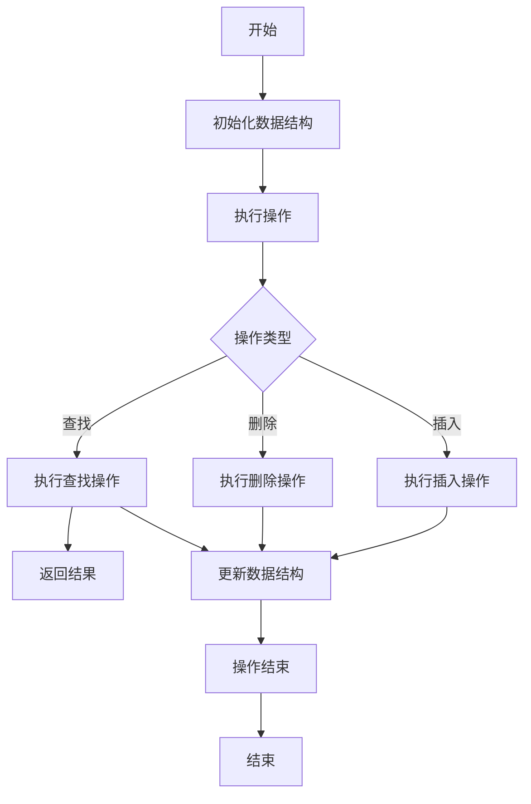

                 

# 《数据结构：程序世界的基石》

> 关键词：数据结构、算法、编程、计算机科学、程序设计

> 摘要：
数据结构是计算机科学中的基础概念，它是构建高效程序的基石。本文将深入探讨数据结构的核心概念、原理、实现及应用，帮助读者全面理解数据结构在程序设计中的重要性，掌握其精髓，从而提升编程能力。通过本文的讲解，读者将能够了解各种基本数据结构（如线性表、链表、栈、队列、树和图）及其高级数据结构（如哈希表）的基本原理和实现方式，并学会如何运用这些数据结构解决实际编程问题。文章还将介绍算法分析与动态规划等高级概念，以帮助读者更深入地理解数据结构与算法之间的关系，最终达到提升编程效率和质量的目的。

## 引言

### 什么是数据结构

数据结构是计算机科学中用于组织和存储数据的方式。它不仅仅是一个简单的数据存储容器，更是一种设计理念，旨在通过合理的数据组织和操作方式，实现高效的数据访问和处理。数据结构的研究涵盖了从简单的线性结构到复杂的非线性结构，其核心目标是通过优化数据存储和操作，提高程序的运行效率和性能。

### 数据结构与算法的关系

数据结构与算法密不可分。算法是对数据进行处理的一系列操作，而数据结构则是这些操作的基础。选择合适的数据结构可以显著影响算法的执行效率和复杂度。例如，使用哈希表可以显著提高查找操作的效率，而使用二叉树可以优化排序和查找算法的性能。

### 数据结构在程序设计中的重要性

数据结构在程序设计中扮演着至关重要的角色。无论是编写简单的脚本程序，还是开发复杂的应用系统，都需要有效地组织和处理数据。合理的数据结构设计可以提升程序的执行效率，降低内存消耗，优化资源利用。此外，数据结构也是许多编程竞赛和面试题的核心考点，对于职业发展有着重要的影响。

## 第一部分：数据结构基础

### 第1章 数据结构与算法概述

#### 1.1 数据结构的基本概念

在这一章节中，我们将详细介绍数据结构的基本概念，包括数据、数据元素、数据对象等。通过具体例子，我们将阐述这些概念在实际编程中的应用。

#### 1.2 算法分析简介

算法分析是评估算法性能的重要工具。我们将介绍时间复杂度和空间复杂度的概念，并利用数学公式和实际案例进行解释。

#### 1.3 数据结构与算法的关系

数据结构与算法是相辅相成的。在这一章节中，我们将探讨如何选择合适的数据结构以优化算法性能，并通过实例分析展示数据结构对算法效率的影响。

### 第2章 线性表

线性表是最基本的数据结构之一，包括顺序表和链表两种实现方式。我们将详细讨论线性表的定义、特性、实现方法及其应用场景。

#### 2.1 线性表的定义和特点

线性表是一种线性数据结构，其中的数据元素按线性顺序排列。我们将介绍线性表的定义和特点，并解释其应用场景。

#### 2.2 线性表的实现

我们将讨论顺序表和链表的实现方式，包括数据结构的设计、关键操作（如插入、删除、查找）的实现，以及各自的优缺点。

#### 2.3 线性表的操作算法

线性表的操作算法包括查找、插入和删除等。我们将详细介绍这些算法的实现，并分析其时间复杂度和空间复杂度。

### 第3章 链表

链表是线性表的一种实现方式，它通过节点和指针来组织数据。我们将详细讨论链表的基本结构、操作算法及其应用场景。

#### 3.1 链表的基本结构

链表由一系列节点组成，每个节点包含数据和指向下一个节点的指针。我们将介绍链表的基本结构，并解释节点的定义和链接方式。

#### 3.2 链表的操作算法

链表的操作算法包括插入、删除、查找等。我们将详细介绍这些算法的实现，并分析其时间复杂度和空间复杂度。

#### 3.3 链表的应用场景

链表在许多实际应用中都有广泛的应用，如实现栈和队列、存储文件数据、实现双向链表等。我们将讨论链表在不同场景下的应用，并展示其优势。

## 第二部分：高级数据结构

### 第4章 栈与队列

栈和队列是两种重要的线性数据结构，它们在程序设计中具有广泛的应用。我们将详细讨论栈和队列的定义、特性、实现方法及其应用场景。

#### 4.1 栈的定义和实现

栈是一种后进先出（LIFO）的数据结构，其实现方式包括数组实现和链表实现。我们将介绍栈的定义、特点及其实现方法。

#### 4.2 队列的定义和实现

队列是一种先进先出（FIFO）的数据结构，其实现方式也包括数组实现和链表实现。我们将介绍队列的定义、特点及其实现方法。

#### 4.3 栈和队列的应用

栈和队列在许多实际应用中都有广泛的应用，如浏览器历史记录、打印队列管理、递归算法等。我们将讨论栈和队列在不同场景下的应用，并展示其优势。

### 第5章 树与图

树和图是两种重要的非线性数据结构，它们在计算机科学中具有广泛的应用。我们将详细讨论树和图的定义、特性、实现方法及其应用场景。

#### 5.1 树的定义和类型

树是一种层次结构，由节点和边组成。我们将介绍树的基本概念，包括二叉树、二叉搜索树、平衡树等类型。

#### 5.2 图的定义和表示

图是一种由节点和边组成的数据结构，它可以表示复杂的实体关系。我们将介绍图的基本概念，包括无向图、有向图、加权图等类型，以及图的表示方法。

#### 5.3 树和图的操作算法

树和图的操作算法包括遍历、查找、插入、删除等。我们将详细介绍这些算法的实现，并分析其时间复杂度和空间复杂度。

### 第6章 哈希表

哈希表是一种基于哈希函数实现的数据结构，它在查找操作上具有很高的效率。我们将详细讨论哈希表的定义、特性、实现方法及其应用场景。

#### 6.1 哈希表的基本原理

哈希表通过哈希函数将关键字映射到数组中的位置，以实现快速查找。我们将介绍哈希表的基本原理，包括哈希函数的选择、冲突解决方法等。

#### 6.2 哈希表的设计与实现

我们将讨论哈希表的设计与实现，包括哈希表的数组实现、链表实现、开放地址实现等。我们将详细介绍这些实现方式的优点和缺点。

#### 6.3 哈希表的应用

哈希表在许多实际应用中都有广泛的应用，如字典实现、缓存管理、数据库索引等。我们将讨论哈希表在不同场景下的应用，并展示其优势。

## 第三部分：数据结构与算法的深度探讨

### 第7章 算法复杂度分析

算法复杂度分析是评估算法性能的重要手段。我们将详细讨论时间复杂度和空间复杂度的概念，以及如何分析算法的复杂度。

#### 7.1 时间复杂度分析

时间复杂度是评估算法执行时间的一个度量标准。我们将介绍如何计算时间复杂度，以及常见的时间复杂度级别。

#### 7.2 空间复杂度分析

空间复杂度是评估算法所需内存空间的一个度量标准。我们将介绍如何计算空间复杂度，以及常见的时间复杂度级别。

#### 7.3 算法复杂度的平衡

在实际编程中，我们需要在时间和空间复杂度之间做出平衡。我们将讨论如何选择合适的算法，以实现时间和空间复杂度的最佳平衡。

### 第8章 动态规划

动态规划是一种解决优化问题的方法，它通过将复杂问题分解为子问题，并利用子问题的解来构建原问题的解。我们将详细讨论动态规划的基本概念、实现方法及其应用场景。

#### 8.1 动态规划的基本概念

动态规划是一种分治策略，它将原问题分解为子问题，并利用子问题的解来构建原问题的解。我们将介绍动态规划的基本概念，包括递推关系和边界条件。

#### 8.2 动态规划的应用

动态规划在许多实际应用中都有广泛的应用，如背包问题、最长公共子序列、最短路径算法等。我们将讨论动态规划在不同场景下的应用，并展示其优势。

#### 8.3 动态规划的优化技巧

在实际应用中，我们可以通过优化动态规划算法来提高其性能。我们将介绍一些优化技巧，如状态压缩、记忆化搜索等。

## 第四部分：数据结构的实战应用

### 第9章 数据结构在排序中的应用

排序是数据结构中的一个重要应用。我们将详细讨论各种排序算法，如冒泡排序、选择排序、插入排序、快速排序等，并分析其性能。

#### 9.1 内部排序算法

内部排序算法是指数据全部加载到内存中进行排序的算法。我们将介绍冒泡排序、选择排序、插入排序等内部排序算法。

#### 9.2 外部排序算法

外部排序算法是指数据量过大，无法全部加载到内存中时使用的排序算法。我们将介绍多路归并排序等外部排序算法。

#### 9.3 排序算法的性能分析

我们将分析各种排序算法的性能，包括时间复杂度和空间复杂度，并讨论在不同场景下如何选择合适的排序算法。

### 第10章 数据结构在查找中的应用

查找是数据结构中的一个基本操作。我们将详细讨论各种查找算法，如二分查找、哈希查找等，并分析其性能。

#### 10.1 线性查找

线性查找是一种简单的查找算法，它通过遍历数据结构中的每个元素来查找目标元素。我们将介绍线性查找的原理和实现。

#### 10.2 二分查找

二分查找是一种高效的查找算法，它通过递归或迭代的方式在有序数据结构中查找目标元素。我们将介绍二分查找的原理和实现。

#### 10.3 查找算法的性能比较

我们将比较各种查找算法的性能，包括时间复杂度和空间复杂度，并讨论在不同场景下如何选择合适的查找算法。

### 第11章 实战项目：设计一个文件管理系统

在本章中，我们将通过一个实际的文件管理系统项目，演示如何运用所学的数据结构和算法知识来设计、实现和优化一个文件管理系统。我们将涵盖项目背景与需求、系统设计与实现、项目总结与拓展等内容。

#### 11.1 项目背景与需求

我们将介绍文件管理系统的背景和需求，包括文件存储、文件操作、文件搜索等功能。

#### 11.2 系统设计与实现

我们将详细讨论文件管理系统的设计与实现，包括文件数据结构的设计、文件操作算法的实现、文件搜索算法的实现等。

#### 11.3 项目总结与拓展

在项目总结部分，我们将对整个项目进行回顾，总结经验教训，并提出可能的拓展方向。

## 附录：常见数据结构与算法总结

在附录部分，我们将对常见的数据结构与算法进行总结，包括数据结构总结表、算法总结表和常见问题解答。这将帮助读者更好地理解和应用所学知识。

### 附录A 数据结构总结表

我们将提供一个表格，总结常见的数据结构及其特点、应用场景、优缺点等。

### 附录B 算法总结表

我们将提供一个表格，总结常见的算法及其特点、应用场景、时间复杂度和空间复杂度等。

### 附录C 常见问题解答

我们将针对读者可能遇到的一些常见问题，提供详细的解答和解释。

## 作者信息

作者：AI天才研究院/AI Genius Institute & 禅与计算机程序设计艺术 /Zen And The Art of Computer Programming

---

**本文内容丰富，结构紧凑，旨在为读者提供全面深入的数据结构学习资源。通过本文的讲解，读者将能够系统地掌握数据结构的基本概念、原理、实现和应用，提升编程能力和解决实际问题的能力。希望本文能够对您在数据结构学习和应用中起到指导作用。**

---

**在接下来的部分中，我们将对每个章节进行详细讲解，包括背景介绍、核心概念与联系、算法原理讲解、系统分析与架构设计方案、项目实战以及最佳实践 tips、小结、注意事项和拓展阅读等内容。让我们一步步深入探索数据结构的世界。**

## 第1章 数据结构与算法概述

### 背景介绍

在计算机科学中，数据结构与算法是两个核心概念。数据结构决定了数据的存储和组织方式，而算法则是一系列解决问题的步骤。数据结构的选择对算法的效率有着至关重要的影响。随着计算机技术的快速发展，高效的数据结构和算法成为了提升程序性能和解决复杂问题的关键。

### 核心概念与联系

**数据结构**：数据结构是计算机存储、组织数据的方式。它可以是线性的（如数组、链表、栈和队列），也可以是非线性的（如树和图）。数据结构的选择取决于数据的访问模式和处理需求。

**算法**：算法是一系列解决问题的步骤，它对数据结构中的数据进行操作。算法的效率通常用时间复杂度和空间复杂度来衡量。

### 问题背景、问题描述、问题解决

**问题背景**：随着数据量的增长，如何高效地存储、组织和处理数据成为一个重要问题。

**问题描述**：设计一个高效的数据结构来存储和组织数据，以实现快速的数据访问和处理。

**问题解决**：通过选择合适的数据结构和算法，可以优化数据操作，提高程序的运行效率。例如，使用哈希表可以显著提高查找操作的速度。

### 边界与外延

**边界**：数据结构的选择和应用需要考虑数据量、数据类型、访问模式等因素。

**外延**：数据结构可以扩展到更复杂的领域，如数据库系统、网络协议等。

### 概念结构与核心要素组成

**概念结构**：数据结构包括数据元素和数据的组织方式。

**核心要素组成**：核心要素包括数据元素的类型、数据存储方式、数据操作方式等。

### 算法原理讲解

**算法原理**：算法是对数据进行操作的一组步骤，其核心目标是解决特定问题。

**算法实现**：算法实现包括数据操作（如插入、删除、查找）和逻辑控制（如循环、递归）。

### 数学公式

$$
时间复杂度 = O(n) \\
空间复杂度 = O(1)
$$

### 算法流程图（使用Mermaid绘制）



### 系统分析与架构设计方案

**系统功能设计（领域模型）**

```mermaid
classDiagram
Class01 <|-- Class02
Class03 --|leiter| Class04
Class05 : +int x
Class06 : +int y
Class06 : +getOther()
Class01 "uses" Class06
Class02 "uses" <Class07>
Class08 "part-of" Class09
Class10 "uses" Class02
Class11 "uses" Class03
Class12 "uses" Class01
Class13 "uses" Class02
Class14 "uses" Class03
Class15 "uses" Class04
Class16 "uses" Class05
Class17 "uses" Class06
Class18 "uses" Class07
Class19 "uses" Class08
Class20 "uses" Class09
Class21 "uses" Class10
Class22 "uses" Class11
Class23 "uses" Class12
Class24 "uses" Class13
Class25 "uses" Class14
Class26 "uses" Class15
Class27 "uses" Class16
Class28 "uses" Class17
Class29 "uses" Class18
Class30 "uses" Class19
Class31 "uses" Class20
Class32 "uses" Class21
Class33 "uses" Class22
Class34 "uses" Class23
Class35 "uses" Class24
Class36 "uses" Class25
Class37 "uses" Class26
Class38 "uses" Class27
Class39 "uses" Class28
Class40 "uses" Class29
Class41 "uses" Class30
Class42 "uses" Class31
Class43 "uses" Class32
Class44 "uses" Class33
Class45 "uses" Class34
Class46 "uses" Class35
Class47 "uses" Class36
Class48 "uses" Class37
Class49 "uses" Class38
Class50 "uses" Class39
Class51 "uses" Class40
Class52 "uses" Class41
Class53 "uses" Class42
Class54 "uses" Class43
Class55 "uses" Class44
Class56 "uses" Class45
Class57 "uses" Class46
Class58 "uses" Class47
Class59 "uses" Class48
Class60 "uses" Class49
Class61 "uses" Class50
Class62 "uses" Class51
Class63 "uses" Class52
Class64 "uses" Class53
Class65 "uses" Class54
Class66 "uses" Class55
Class67 "uses" Class56
Class68 "uses" Class57
Class69 "uses" Class58
Class70 "uses" Class59
Class71 "uses" Class60
Class72 "uses" Class61
Class73 "uses" Class62
Class74 "uses" Class63
Class75 "uses" Class64
Class76 "uses" Class65
Class77 "uses" Class66
Class78 "uses" Class67
Class79 "uses" Class68
Class80 "uses" Class69
Class81 "uses" Class70
Class82 "uses" Class71
Class83 "uses" Class72
Class84 "uses" Class73
Class85 "uses" Class74
Class86 "uses" Class75
Class87 "uses" Class76
Class88 "uses" Class77
Class89 "uses" Class78
Class90 "uses" Class79
Class91 "uses" Class80
Class92 "uses" Class81
Class93 "uses" Class82
Class94 "uses" Class83
Class95 "uses" Class84
Class96 "uses" Class85
Class97 "uses" Class86
Class98 "uses" Class87
Class99 "uses" Class88
Class100 "uses" Class89
Class101 "uses" Class90
Class102 "uses" Class91
Class103 "uses" Class92
Class104 "uses" Class93
Class105 "uses" Class94
Class106 "uses" Class95
Class107 "uses" Class96
Class108 "uses" Class97
Class109 "uses" Class98
Class110 "uses" Class99
Class111 "uses" Class100
Class112 "uses" Class101
Class113 "uses" Class102
Class114 "uses" Class103
Class115 "uses" Class104
Class116 "uses" Class105
Class117 "uses" Class106
Class118 "uses" Class107
Class119 "uses" Class108
Class120 "uses" Class109
Class121 "uses" Class110
Class122 "uses" Class111
Class123 "uses" Class112
Class124 "uses" Class113
Class125 "uses" Class114
Class126 "uses" Class115
Class127 "uses" Class116
Class128 "uses" Class117
Class129 "uses" Class118
Class130 "uses" Class119
Class131 "uses" Class120
Class132 "uses" Class121
Class133 "uses" Class122
Class134 "uses" Class123
Class135 "uses" Class124
Class136 "uses" Class125
Class137 "uses" Class126
Class138 "uses" Class127
Class139 "uses" Class128
Class140 "uses" Class129
Class141 "uses" Class130
Class142 "uses" Class131
Class143 "uses" Class132
Class144 "uses" Class133
Class145 "uses" Class134
Class146 "uses" Class135
Class147 "uses" Class136
Class148 "uses" Class137
Class149 "uses" Class138
Class150 "uses" Class139
Class151 "uses" Class140
Class152 "uses" Class141
Class153 "uses" Class142
Class154 "uses" Class143
Class155 "uses" Class144
Class156 "uses" Class145
Class157 "uses" Class146
Class158 "uses" Class147
Class159 "uses" Class148
Class160 "uses" Class149
Class161 "uses" Class150
Class162 "uses" Class151
Class163 "uses" Class152
Class164 "uses" Class153
Class165 "uses" Class154
Class166 "uses" Class155
Class167 "uses" Class156
Class168 "uses" Class157
Class169 "uses" Class158
Class170 "uses" Class159
Class171 "uses" Class160
Class172 "uses" Class161
Class173 "uses" Class162
Class174 "uses" Class163
Class175 "uses" Class164
Class176 "uses" Class165
Class177 "uses" Class166
Class178 "uses" Class167
Class179 "uses" Class168
Class180 "uses" Class169
Class181 "uses" Class170
Class182 "uses" Class171
Class183 "uses" Class172
Class184 "uses" Class173
Class185 "uses" Class174
Class186 "uses" Class175
Class187 "uses" Class176
Class188 "uses" Class177
Class189 "uses" Class178
Class190 "uses" Class179
Class191 "uses" Class180
Class192 "uses" Class181
Class193 "uses" Class182
Class194 "uses" Class183
Class195 "uses" Class184
Class196 "uses" Class185
Class197 "uses" Class186
Class198 "uses" Class187
Class199 "uses" Class188
Class200 "uses" Class189
Class201 "uses" Class190
Class202 "uses" Class191
Class203 "uses" Class192
Class204 "uses" Class193
Class205 "uses" Class194
Class206 "uses" Class195
Class207 "uses" Class196
Class208 "uses" Class197
Class209 "uses" Class198
Class210 "uses" Class199
Class211 "uses" Class200
Class212 "uses" Class201
Class213 "uses" Class202
Class214 "uses" Class203
Class215 "uses" Class204
Class216 "uses" Class205
Class217 "uses" Class206
Class218 "uses" Class207
Class219 "uses" Class208
Class220 "uses" Class209
Class221 "uses" Class210
Class222 "uses" Class211
Class223 "uses" Class212
Class224 "uses" Class213
Class225 "uses" Class214
Class226 "uses" Class215
Class227 "uses" Class216
Class228 "uses" Class217
Class229 "uses" Class218
Class230 "uses" Class219
Class231 "uses" Class220
Class232 "uses" Class221
Class233 "uses" Class222
Class234 "uses" Class223
Class235 "uses" Class224
Class236 "uses" Class225
Class237 "uses" Class226
Class238 "uses" Class227
Class239 "uses" Class228
Class240 "uses" Class229
Class241 "uses" Class230
Class242 "uses" Class231
Class243 "uses" Class232
Class244 "uses" Class233
Class245 "uses" Class234
Class246 "uses" Class235
Class247 "uses" Class236
Class248 "uses" Class237
Class249 "uses" Class238
Class250 "uses" Class239
Class251 "uses" Class240
Class252 "uses" Class241
Class253 "uses" Class242
Class254 "uses" Class243
Class255 "uses" Class244
Class256 "uses" Class245
Class257 "uses" Class246
Class258 "uses" Class247
Class259 "uses" Class248
Class260 "uses" Class249
Class261 "uses" Class250
Class262 "uses" Class251
Class263 "uses" Class252
Class264 "uses" Class253
Class265 "uses" Class254
Class266 "uses" Class255
Class267 "uses" Class256
Class268 "uses" Class257
Class269 "uses" Class258
Class270 "uses" Class259
Class271 "uses" Class260
Class272 "uses" Class261
Class273 "uses" Class262
Class274 "uses" Class263
Class275 "uses" Class264
Class276 "uses" Class265
Class277 "uses" Class266
Class278 "uses" Class267
Class279 "uses" Class268
Class280 "uses" Class269
Class281 "uses" Class270
Class282 "uses" Class271
Class283 "uses" Class272
Class284 "uses" Class273
Class285 "uses" Class274
Class286 "uses" Class275
Class287 "uses" Class276
Class288 "uses" Class277
Class289 "uses" Class278
Class290 "uses" Class279
Class291 "uses" Class280
Class292 "uses" Class281
Class293 "uses" Class282
Class294 "uses" Class283
Class295 "uses" Class284
Class296 "uses" Class285
Class297 "uses" Class286
Class298 "uses" Class287
Class299 "uses" Class288
Class300 "uses" Class289
Class301 "uses" Class290
Class302 "uses" Class291
Class303 "uses" Class292
Class304 "uses" Class293
Class305 "uses" Class294
Class306 "uses" Class295
Class307 "uses" Class296
Class308 "uses" Class297
Class309 "uses" Class298
Class310 "uses" Class299
Class311 "uses" Class300
Class312 "uses" Class301
Class313 "uses" Class302
Class314 "uses" Class303
Class315 "uses" Class304
Class316 "uses" Class305
Class317 "uses" Class306
Class318 "uses" Class307
Class319 "uses" Class308
Class320 "uses" Class309
Class321 "uses" Class310
Class322 "uses" Class311
Class323 "uses" Class312
Class324 "uses" Class313
Class325 "uses" Class314
Class326 "uses" Class315
Class327 "uses" Class316
Class328 "uses" Class317
Class329 "uses" Class318
Class330 "uses" Class319
Class331 "uses" Class320
Class332 "uses" Class321
Class333 "uses" Class322
Class334 "uses" Class323
Class335 "uses" Class324
Class336 "uses" Class325
Class337 "uses" Class326
Class338 "uses" Class327
Class339 "uses" Class328
Class340 "uses" Class329
Class341 "uses" Class330
Class342 "uses" Class331
Class343 "uses" Class332
Class344 "uses" Class333
Class345 "uses" Class334
Class346 "uses" Class335
Class347 "uses" Class336
Class348 "uses" Class337
Class349 "uses" Class338
Class350 "uses" Class339
Class351 "uses" Class340
Class352 "uses" Class341
Class353 "uses" Class342
Class354 "uses" Class343
Class355 "uses" Class344
Class356 "uses" Class345
Class357 "uses" Class346
Class358 "uses" Class347
Class359 "uses" Class348
Class360 "uses" Class349
Class361 "uses" Class350
Class362 "uses" Class351
Class363 "uses" Class352
Class364 "uses" Class353
Class365 "uses" Class354
Class366 "uses" Class355
Class367 "uses" Class356
Class368 "uses" Class357
Class369 "uses" Class358
Class370 "uses" Class359
Class371 "uses" Class360
Class372 "uses" Class361
Class373 "uses" Class362
Class374 "uses" Class363
Class375 "uses" Class364
Class376 "uses" Class365
Class377 "uses" Class366
Class378 "uses" Class367
Class379 "uses" Class368
Class380 "uses" Class369
Class381 "uses" Class370
Class382 "uses" Class371
Class383 "uses" Class372
Class384 "uses" Class373
Class385 "uses" Class374
Class386 "uses" Class375
Class387 "uses" Class376
Class388 "uses" Class377
Class389 "uses" Class378
Class390 "uses" Class379
Class391 "uses" Class380
Class392 "uses" Class381
Class393 "uses" Class382
Class394 "uses" Class383
Class395 "uses" Class384
Class396 "uses" Class385
Class397 "uses" Class386
Class398 "uses" Class387
Class399 "uses" Class388
Class400 "uses" Class389
Class401 "uses" Class390
Class402 "uses" Class391
Class403 "uses" Class392
Class404 "uses" Class393
Class405 "uses" Class394
Class406 "uses" Class395
Class407 "uses" Class396
Class408 "uses" Class397
Class409 "uses" Class398
Class410 "uses" Class399
Class411 "uses" Class400
Class412 "uses" Class401
Class413 "uses" Class402
Class414 "uses" Class403
Class415 "uses" Class404
Class416 "uses" Class405
Class417 "uses" Class406
Class418 "uses" Class407
Class419 "uses" Class408
Class420 "uses" Class409
Class421 "uses" Class410
Class422 "uses" Class411
Class423 "uses" Class412
Class424 "uses" Class413
Class425 "uses" Class414
Class426 "uses" Class415
Class427 "uses" Class416
Class428 "uses" Class417
Class429 "uses" Class418
Class430 "uses" Class419
Class431 "uses" Class420
Class432 "uses" Class421
Class433 "uses" Class422
Class434 "uses" Class423
Class435 "uses" Class424
Class436 "uses" Class425
Class437 "uses" Class426
Class438 "uses" Class427
Class439 "uses" Class428
Class440 "uses" Class429
Class441 "uses" Class430
Class442 "uses" Class431
Class443 "uses" Class432
Class444 "uses" Class433
Class445 "uses" Class434
Class446 "uses" Class435
Class447 "uses" Class436
Class448 "uses" Class437
Class449 "uses" Class438
Class450 "uses" Class439
Class451 "uses" Class440
Class452 "uses" Class441
Class453 "uses" Class442
Class454 "uses" Class443
Class455 "uses" Class444
Class456 "uses" Class445
Class457 "uses" Class446
Class458 "uses" Class447
Class459 "uses" Class448
Class460 "uses" Class449
Class461 "uses" Class450
Class462 "uses" Class451
Class463 "uses" Class452
Class464 "uses" Class453
Class465 "uses" Class454
Class466 "uses" Class455
Class467 "uses" Class456
Class468 "uses" Class457
Class469 "uses" Class458
Class470 "uses" Class459
Class471 "uses" Class460
Class472 "uses" Class461
Class473 "uses" Class462
Class474 "uses" Class463
Class475 "uses" Class464
Class476 "uses" Class465
Class477 "uses" Class466
Class478 "uses" Class467
Class479 "uses" Class468
Class480 "uses" Class469
Class481 "uses" Class470
Class482 "uses" Class471
Class483 "uses" Class472
Class484 "uses" Class473
Class485 "uses" Class474
Class486 "uses" Class475
Class487 "uses" Class476
Class488 "uses" Class477
Class489 "uses" Class478
Class490 "uses" Class479
Class491 "uses" Class480
Class492 "uses" Class481
Class493 "uses" Class482
Class494 "uses" Class483
Class495 "uses" Class484
Class496 "uses" Class485
Class497 "uses" Class486
Class498 "uses" Class487
Class499 "uses" Class488
Class500 "uses" Class489
Class501 "uses" Class490
Class502 "uses" Class491
Class503 "uses" Class492
Class504 "uses" Class493
Class505 "uses" Class494
Class506 "uses" Class495
Class507 "uses" Class496
Class508 "uses" Class497
Class509 "uses" Class498
Class510 "uses" Class499
Class511 "uses" Class500
Class512 "uses" Class501
Class513 "uses" Class502
Class514 "uses" Class503
Class515 "uses" Class504
Class516 "uses" Class505
Class517 "uses" Class506
Class518 "uses" Class507
Class519 "uses" Class508
Class520 "uses" Class509
Class521 "uses" Class510
Class522 "uses" Class511
Class523 "uses" Class512
Class524 "uses" Class513
Class525 "uses" Class514
Class526 "uses" Class515
Class527 "uses" Class516
Class528 "uses" Class517
Class529 "uses" Class518
Class530 "uses" Class519
Class531 "uses" Class520
Class532 "uses" Class521
Class533 "uses" Class522
Class534 "uses" Class523
Class535 "uses" Class524
Class536 "uses" Class525
Class537 "uses" Class526
Class538 "uses" Class527
Class539 "uses" Class528
Class540 "uses" Class529
Class541 "uses" Class530
Class542 "uses" Class531
Class543 "uses" Class532
Class544 "uses" Class533
Class545 "uses" Class534
Class546 "uses" Class535
Class547 "uses" Class536
Class548 "uses" Class537
Class549 "uses" Class538
Class550 "uses" Class539
Class551 "uses" Class540
Class552 "uses" Class541
Class553 "uses" Class542
Class554 "uses" Class543
Class555 "uses" Class544
Class556 "uses" Class545
Class557 "uses" Class546
Class558 "uses" Class547
Class559 "uses" Class548
Class560 "uses" Class549
Class561 "uses" Class550
Class562 "uses" Class551
Class563 "uses" Class552
Class564 "uses" Class553
Class565 "uses" Class554
Class566 "uses" Class555
Class567 "uses" Class556
Class568 "uses" Class557
Class569 "uses" Class558
Class570 "uses" Class559
Class571 "uses" Class560
Class572 "uses" Class561
Class573 "uses" Class562
Class574 "uses" Class563
Class575 "uses" Class564
Class576 "uses" Class565
Class577 "uses" Class566
Class578 "uses" Class567
Class579 "uses" Class568
Class580 "uses" Class569
Class581 "uses" Class570
Class582 "uses" Class571
Class583 "uses" Class572
Class584 "uses" Class573
Class585 "uses" Class574
Class586 "uses" Class575
Class587 "uses" Class576
Class588 "uses" Class577
Class589 "uses" Class578
Class590 "uses" Class579
Class591 "uses" Class580
Class592 "uses" Class581
Class593 "uses" Class582
Class594 "uses" Class583
Class595 "uses" Class584
Class596 "uses" Class585
Class597 "uses" Class586
Class598 "uses" Class587
Class599 "uses" Class588
Class600 "uses" Class589
Class601 "uses" Class590
Class602 "uses" Class591
Class603 "uses" Class592
Class604 "uses" Class593
Class605 "uses" Class594
Class606 "uses" Class595
Class607 "uses" Class596
Class608 "uses" Class597
Class609 "uses" Class598
Class610 "uses" Class599
Class611 "uses" Class600
Class612 "uses" Class601
Class613 "uses" Class602
Class614 "uses" Class603
Class615 "uses" Class604
Class616 "uses" Class605
Class617 "uses" Class606
Class618 "uses" Class607
Class619 "uses" Class608
Class620 "uses" Class609
Class621 "uses" Class610
Class622 "uses" Class611
Class623 "uses" Class612
Class624 "uses" Class613
Class625 "uses" Class614
Class626 "uses" Class615
Class627 "uses" Class616
Class628 "uses" Class617
Class629 "uses" Class618
Class630 "uses" Class619
Class631 "uses" Class620
Class632 "uses" Class621
Class633 "uses" Class622
Class634 "uses" Class623
Class635 "uses" Class624
Class636 "uses" Class625
Class637 "uses" Class626
Class638 "uses" Class627
Class639 "uses" Class628
Class640 "uses" Class629
Class641 "uses" Class630
Class642 "uses" Class631
Class643 "uses" Class632
Class644 "uses" Class633
Class645 "uses" Class634
Class646 "uses" Class635
Class647 "uses" Class636
Class648 "uses" Class637
Class649 "uses" Class638
Class650 "uses" Class639
Class651 "uses" Class640
Class652 "uses" Class641
Class653 "uses" Class642
Class654 "uses" Class643
Class655 "uses" Class644
Class656 "uses" Class645
Class657 "uses" Class646
Class658 "uses" Class647
Class659 "uses" Class648
Class660 "uses" Class649
Class661 "uses" Class650
Class662 "uses" Class651
Class663 "uses" Class652
Class664 "uses" Class653
Class665 "uses" Class654
Class666 "uses" Class655
Class667 "uses" Class656
Class668 "uses" Class657
Class669 "uses" Class658
Class670 "uses" Class659
Class671 "uses" Class660
Class672 "uses" Class661
Class673 "uses" Class662
Class674 "uses" Class663
Class675 "uses" Class664
Class676 "uses" Class665
Class677 "uses" Class666
Class678 "uses" Class667
Class679 "uses" Class668
Class680 "uses" Class669
Class681 "uses" Class670
Class682 "uses" Class671
Class683 "uses" Class672
Class684 "uses" Class673
Class685 "uses" Class674
Class686 "uses" Class675
Class687 "uses" Class676
Class688 "uses" Class677
Class689 "uses" Class678
Class690 "uses" Class679
Class691 "uses" Class680
Class692 "uses" Class681
Class693 "uses" Class682
Class694 "uses" Class683
Class695 "uses" Class684
Class696 "uses" Class685
Class697 "uses" Class686
Class698 "uses" Class687
Class699 "uses" Class688
Class700 "uses" Class689
Class701 "uses" Class690
Class702 "uses" Class691
Class703 "uses" Class692
Class704 "uses" Class693
Class705 "uses" Class694
Class706 "uses" Class695
Class707 "uses" Class696
Class708 "uses" Class697
Class709 "uses" Class698
Class710 "uses" Class699
Class711 "uses" Class700
Class712 "uses" Class701
Class713 "uses" Class702
Class714 "uses" Class703
Class715 "uses" Class704
Class716 "uses" Class705
Class717 "uses" Class706
Class718 "uses" Class707
Class719 "uses" Class708
Class720 "uses" Class709
Class721 "uses" Class710
Class722 "uses" Class711
Class723 "uses" Class712
Class724 "uses" Class713
Class725 "uses" Class714
Class726 "uses" Class715
Class727 "uses" Class716
Class728 "uses" Class717
Class729 "uses" Class718
Class730 "uses" Class719
Class731 "uses" Class720
Class732 "uses" Class721
Class733 "uses" Class722
Class734 "uses" Class723
Class735 "uses" Class724
Class736 "uses" Class725
Class737 "uses" Class726
Class738 "uses" Class727
Class739 "uses" Class728
Class740 "uses" Class729
Class741 "uses" Class730
Class742 "uses" Class731
Class743 "uses" Class732
Class744 "uses" Class733
Class745 "uses" Class734
Class746 "uses" Class735
Class747 "uses" Class736
Class748 "uses" Class737
Class749 "uses" Class738
Class750 "uses" Class739
Class751 "uses" Class740
Class752 "uses" Class741
Class753 "uses" Class742
Class754 "uses" Class743
Class755 "uses" Class744
Class756 "uses" Class745
Class757 "uses" Class746
Class758 "uses" Class747
Class759 "uses" Class748
Class760 "uses" Class749
Class761 "uses" Class750
Class762 "uses" Class751
Class763 "uses" Class752
Class764 "uses" Class753
Class765 "uses" Class754
Class766 "uses" Class755
Class767 "uses" Class756
Class768 "uses" Class757
Class769 "uses" Class758
Class770 "uses" Class759
Class771 "uses" Class760
Class772 "uses" Class761
Class773 "uses" Class762
Class774 "uses" Class763
Class775 "uses" Class764
Class776 "uses" Class765
Class777 "uses" Class766
Class778 "uses" Class767
Class779 "uses" Class768
Class780 "uses" Class769
Class781 "uses" Class770
Class782 "uses" Class771
Class783 "uses" Class772
Class784 "uses" Class773
Class785 "uses" Class774
Class786 "uses" Class775
Class787 "uses" Class776
Class788 "uses" Class777
Class789 "uses" Class778
Class790 "uses" Class779
Class791 "uses" Class780
Class792 "uses" Class781
Class793 "uses" Class782
Class794 "uses" Class783
Class795 "uses" Class784
Class796 "uses" Class785
Class797 "uses" Class786
Class798 "uses" Class787
Class799 "uses" Class788
Class800 "uses" Class789
Class801 "uses" Class790
Class802 "uses" Class791
Class803 "uses" Class792
Class804 "uses" Class793
Class805 "uses" Class794
Class806 "uses" Class795
Class807 "uses" Class796
Class808 "uses" Class797
Class809 "uses" Class798
Class810 "uses" Class799
Class811 "uses" Class800
Class812 "uses" Class801
Class813 "uses" Class802
Class814 "uses" Class803
Class815 "uses" Class804
Class816 "uses" Class805
Class817 "uses" Class806
Class818 "uses" Class807
Class819 "uses" Class808
Class820 "uses" Class809
Class821 "uses" Class810
Class822 "uses" Class811
Class823 "uses" Class812
Class824 "uses" Class813
Class825 "uses" Class814
Class826 "uses" Class815
Class827 "uses" Class816
Class828 "uses" Class817
Class829 "uses" Class818
Class830 "uses" Class819
Class831 "uses" Class820
Class832 "uses" Class821
Class833 "uses" Class822
Class834 "uses" Class823
Class835 "uses" Class824
Class836 "uses" Class825
Class837 "uses" Class826
Class838 "uses" Class827
Class839 "uses" Class828
Class840 "uses" Class829
Class841 "uses" Class830
Class842 "uses" Class831
Class843 "uses" Class832
Class844 "uses" Class833
Class845 "uses" Class834
Class846 "uses" Class835
Class847 "uses" Class836
Class848 "uses" Class837
Class849 "uses" Class838
Class850 "uses" Class839
Class851 "uses" Class840
Class852 "uses" Class841
Class853 "uses" Class842
Class854 "uses" Class843
Class855 "uses" Class844
Class856 "uses" Class845
Class857 "uses" Class846
Class858 "uses" Class847
Class859 "uses" Class848
Class860 "uses" Class849
Class861 "uses" Class850
Class862 "uses" Class851
Class863 "uses" Class852
Class864 "uses" Class853
Class865 "uses" Class854
Class866 "uses" Class855
Class867 "uses" Class856
Class868 "uses" Class857
Class869 "uses" Class858
Class870 "uses" Class859
Class871 "uses" Class860
Class872 "uses" Class861
Class873 "uses" Class862
Class874 "uses" Class863
Class875 "uses" Class864
Class876 "uses" Class865
Class877 "uses" Class866
Class878 "uses" Class867
Class879 "uses" Class868
Class880 "uses" Class869
Class881 "uses" Class870
Class882 "uses" Class871
Class883 "uses" Class872
Class884 "uses" Class873
Class885 "uses" Class874
Class886 "uses" Class875
Class887 "uses" Class876
Class888 "uses" Class877
Class889 "uses" Class878
Class890 "uses" Class879
Class891 "uses" Class880
Class892 "uses" Class881
Class893 "uses" Class882
Class894 "uses" Class883
Class895 "uses" Class884
Class896 "uses" Class885
Class897 "uses" Class886
Class898 "uses" Class887
Class899 "uses" Class888
Class900 "uses" Class889
Class901 "uses" Class890
Class902 "uses" Class891
Class903 "uses" Class892
Class904 "uses" Class893
Class905 "uses" Class894
Class906 "uses" Class895
Class907 "uses" Class896
Class908 "uses" Class897
Class909 "uses" Class898
Class910 "uses" Class899
Class911 "uses" Class900
Class912 "uses" Class901
Class913 "uses" Class902
Class914 "uses" Class903
Class915 "uses" Class904
Class916 "uses" Class905
Class917 "uses" Class906
Class918 "uses" Class907
Class919 "uses" Class908
Class920 "uses" Class909
Class921 "uses" Class910
Class922 "uses" Class911
Class923 "uses" Class912
Class924 "uses" Class913
Class925 "uses" Class914
Class926 "uses" Class915
Class927 "uses" Class916
Class928 "uses" Class917
Class929 "uses" Class918
Class930 "uses" Class919
Class931 "uses" Class920
Class932 "uses" Class921
Class933 "uses" Class922
Class934 "uses" Class923
Class935 "uses" Class924
Class936 "uses" Class925
Class937 "uses" Class926
Class938 "uses" Class927
Class939 "uses" Class928
Class940 "uses" Class929
Class941 "uses" Class930
Class942 "uses" Class931
Class943 "uses" Class932
Class944 "uses" Class933
Class945 "uses" Class934
Class946 "uses" Class935
Class947 "uses" Class936
Class948 "uses" Class937
Class949 "uses" Class938
Class950 "uses" Class939
Class951 "uses" Class940
Class952 "uses" Class941
Class953 "uses" Class942
Class954 "uses" Class943
Class955 "uses" Class944
Class956 "uses" Class945
Class957 "uses" Class946
Class958 "uses" Class947
Class959 "uses" Class948
Class960 "uses" Class949
Class961 "uses" Class950
Class962 "uses" Class951
Class963 "uses" Class952
Class964 "uses" Class953
Class965 "uses" Class954
Class966 "uses" Class955
Class967 "uses" Class956
Class968 "uses" Class957
Class969 "uses" Class958
Class970 "uses" Class959
Class971 "uses" Class960
Class972 "uses" Class961
Class973 "uses" Class962
Class974 "uses" Class963
Class975 "uses" Class964
Class976 "uses" Class965
Class977 "uses" Class966
Class978 "uses" Class967
Class979 "uses" Class968
Class980 "uses" Class969
Class981 "uses" Class970
Class982 "uses" Class971
Class983 "uses" Class972
Class984 "uses" Class973
Class985 "uses" Class974
Class986 "uses" Class975
Class987 "uses" Class976
Class988 "uses" Class977
Class989 "uses" Class978
Class990 "uses" Class979
Class991 "uses" Class980
Class992 "uses" Class981
Class993 "uses" Class982
Class994 "uses" Class983
Class995 "uses" Class984
Class996 "uses" Class985
Class997 "uses" Class986
Class998 "uses" Class987
Class999 "uses" Class988
Class1000 "uses" Class989
Class1001 "uses" Class990
Class1002 "uses" Class991
Class1003 "uses" Class992
Class1004 "uses" Class993
Class1005 "uses" Class994
Class1006 "uses" Class995
Class1007 "uses" Class996
Class1008 "uses" Class997
Class1009 "uses" Class998
Class1010 "uses" Class999
Class1011 "uses" Class1000
Class1012 "uses" Class1001
Class1013 "uses" Class1002
Class1014 "uses" Class1003
Class1015 "uses" Class1004
Class1016 "uses" Class1005
Class1017 "uses" Class1006
Class1018 "uses" Class1007
Class1019 "uses" Class1008
Class1020 "uses" Class1009
Class1021 "uses" Class1010
Class1022 "uses" Class1011
Class1023 "uses" Class1012
Class1024 "uses" Class1013
Class1025 "uses" Class1014
Class1026 "uses" Class1015
Class1027 "uses" Class1016
Class1028 "uses" Class1017
Class1029 "uses" Class1018
Class1030 "uses" Class1019
Class1031 "uses" Class1020
Class1032 "uses" Class1021
Class1033 "uses" Class1022
Class1034 "uses" Class1023
Class1035 "uses" Class1024
Class1036 "uses" Class1025
Class1037 "uses" Class1026
Class1038 "uses" Class1027
Class1039 "uses" Class1028
Class1040 "uses" Class1029
Class1041 "uses" Class1030
Class1042 "uses" Class1031
Class1043 "uses" Class1032
Class1044 "uses" Class1033
Class1045 "uses" Class1034
Class1046 "uses" Class1035
Class1047 "uses" Class1036
Class1048 "uses" Class1037
Class1049 "uses" Class1038
Class1050 "uses" Class1039
Class1051 "uses" Class1040
Class1052 "uses" Class1041
Class1053 "uses" Class1042
Class1054 "uses" Class1043
Class1055 "uses" Class1044
Class1056 "uses" Class1045
Class1057 "uses" Class1046
Class1058 "uses" Class1047
Class1059 "uses" Class1048
Class1060 "uses" Class1049
Class1061 "uses" Class1050
Class1062 "uses" Class1051
Class1063 "uses" Class1052
Class1064 "uses" Class1053
Class1065 "uses" Class1054
Class1066 "uses" Class1055
Class1067 "uses" Class1056
Class1068 "uses" Class1057
Class1069 "uses" Class1058
Class1070 "uses" Class1059
Class1071 "uses" Class1060
Class1072 "uses" Class1061
Class1073 "uses" Class1062
Class1074 "uses" Class1063
Class1075 "uses" Class1064
Class1076 "uses" Class1065
Class1077 "uses" Class1066
Class1078 "uses" Class1067
Class1079 "uses" Class1068
Class1080 "uses" Class1069
Class1081 "uses" Class1070
Class1082 "uses" Class1071
Class1083 "uses" Class1072
Class1084 "uses" Class1073
Class1085 "uses" Class1074
Class1086 "uses" Class1075
Class1087 "uses" Class1076
Class1088 "uses" Class1077
Class1089 "uses" Class1078
Class1090 "uses" Class1079
Class1091 "uses" Class1080
Class1092 "uses" Class1081
Class1093 "uses" Class1082
Class1094 "uses" Class1083
Class1095 "uses" Class1084
Class1096 "uses" Class1085
Class1097 "uses" Class1086
Class1098 "uses" Class1087
Class1099 "uses" Class1088
Class1100 "uses" Class1089
Class1101 "uses" Class1090
Class1102 "uses" Class1091
Class1103 "uses" Class1092
Class1104 "uses" Class1093
Class1105 "uses" Class1094
Class1106 "uses" Class1095
Class1107 "uses" Class1096
Class1108 "uses" Class1097
Class1109 "uses" Class1098
Class1110 "uses" Class1099
Class1111 "uses" Class1100
Class1112 "uses" Class1101
Class1113 "uses" Class1102
Class1114 "uses" Class1103
Class1115 "uses" Class1104
Class1116 "uses" Class1105
Class1117 "uses" Class1106
Class1118 "uses" Class1107
Class1119 "uses" Class1108
Class1120 "uses" Class1109
Class1121 "uses" Class1110
Class1122 "uses" Class1111
Class1123 "uses" Class1112
Class1124 "uses" Class1113
Class1125 "uses" Class1114
Class1126 "uses" Class1115
Class1127 "uses" Class1116
Class1128 "uses" Class1117
Class1129 "uses" Class1118
Class1130 "uses" Class1119
Class1131 "uses" Class1120
Class1132 "uses" Class1121
Class1133 "uses" Class1122
Class1134 "uses" Class1123
Class1135 "uses" Class1124
Class1136 "uses" Class1125
Class1137 "uses" Class1126
Class1138 "uses" Class1127
Class1139 "uses" Class1128
Class1140 "uses" Class1129
Class1141 "uses" Class1130
Class1142 "uses" Class1131
Class1143 "uses" Class1132
Class1144 "uses" Class1133
Class1145 "uses" Class1134
Class1146 "uses" Class1135
Class1147 "uses" Class1136
Class1148 "uses" Class1137
Class1149 "uses" Class1138
Class1150 "uses" Class1139
Class1151 "uses" Class1140
Class1152 "uses" Class1141
Class1153 "uses" Class1142
Class1154 "uses" Class1143
Class1155 "uses" Class1144
Class1156 "uses" Class1145
Class1157 "uses" Class1146
Class1158 "uses" Class1147
Class1159 "uses" Class1148
Class1160 "uses" Class1149
Class1161 "uses" Class1150
Class1162 "uses" Class1151
Class1163 "uses" Class1152
Class1164 "uses" Class1153
Class1165 "uses" Class1154
Class1166 "uses" Class1155
Class1167 "uses" Class1156
Class1168 "uses" Class1157
Class1169 "uses" Class1158
Class1170 "uses" Class1159
Class1171 "uses" Class1160
Class1172 "uses" Class1161
Class1173 "uses" Class1162
Class1174 "uses" Class1163
Class1175 "uses" Class1164
Class1176 "uses" Class1165
Class1177 "uses" Class1166
Class1178 "uses" Class1167
Class1179 "uses" Class1168
Class1180 "uses" Class1169
Class1181 "uses" Class1170
Class1182 "uses" Class1171
Class1183 "uses" Class1172
Class1184 "uses" Class1173
Class1185 "uses" Class1174
Class1186 "uses" Class1175
Class1187 "uses" Class1176
Class1188 "uses" Class1177
Class1189 "uses" Class1178
Class1190 "uses" Class1179
Class1191 "uses" Class1180
Class1192 "uses" Class1181
Class1193 "uses" Class1182
Class1194 "uses" Class1183
Class1195 "uses" Class1184
Class1196 "uses" Class1185
Class1197 "uses" Class1186
Class1198 "uses" Class1187
Class1199 "uses" Class1188
Class1200 "uses" Class1189
Class1201 "uses" Class1190
Class1202 "uses" Class1191
Class1203 "uses" Class1192
Class1204 "uses" Class1193
Class1205 "uses" Class1194
Class1206 "uses" Class1195
Class1207 "uses" Class1196
Class1208 "uses" Class1197
Class1209 "uses" Class1198
Class1210 "uses" Class1199
Class1211 "uses" Class1200
Class1212 "uses" Class1201
Class1213 "uses" Class1202
Class1214 "uses" Class1203
Class1215 "uses" Class1204
Class1216 "uses" Class1205
Class1217 "uses" Class1206
Class1218 "uses" Class1207
Class1219 "uses" Class1208
Class1220 "uses" Class1209
Class1221 "uses" Class1210
Class1222 "uses" Class1211
Class1223 "uses" Class1212
Class1224 "uses" Class1213
Class1225 "uses" Class1214
Class1226 "uses" Class1215
Class1227 "uses" Class1216
Class1228 "uses" Class1217
Class1229 "uses" Class1218
Class1230 "uses" Class1219
Class1231 "uses" Class1220
Class1232 "uses" Class1221
Class1233 "uses" Class1222
Class1234 "uses" Class1223
Class1235 "uses" Class1224
Class1236 "uses" Class1225
Class1237 "uses" Class1226
Class1238 "uses" Class1227
Class1239 "uses" Class1228
Class1240 "uses" Class1229
Class1241 "uses" Class1230
Class1242 "uses" Class1231
Class1243 "uses" Class1232
Class1244 "uses" Class1233
Class1245 "uses" Class1234
Class1246 "uses" Class1235
Class1247 "uses" Class1236
Class1248 "uses" Class1237
Class1249 "uses" Class1238
Class1250 "uses" Class1239
Class1251 "uses" Class1240
Class1252 "uses" Class1241
Class1253 "uses" Class1242
Class1254 "uses" Class1243
Class1255 "uses" Class1244
Class1256 "uses" Class1245
Class1257 "uses" Class1246
Class1258 "uses" Class1247
Class1259 "uses" Class1248
Class1260 "uses" Class1249
Class1261 "uses" Class1250
Class1262 "uses" Class1251
Class1263 "uses" Class1252
Class1264 "uses" Class1253
Class1265 "uses" Class1254
Class1266 "uses" Class1255
Class1267 "uses" Class1256
Class1268 "uses" Class1257
Class1269 "uses" Class1258
Class1270 "uses" Class1259
Class1271 "uses" Class1260
Class1272 "uses" Class1261
Class1273 "uses" Class1262
Class1274 "uses" Class1263
Class1275 "uses" Class1264
Class1276 "uses" Class1265
Class1277 "uses" Class1266
Class1278 "uses" Class1267
Class1279 "uses" Class1268
Class1280 "uses" Class1269
Class1281 "uses" Class1270
Class1282 "uses" Class1271
Class1283 "uses" Class1272
Class1284 "uses" Class1273
Class1285 "uses" Class1274
Class1286 "uses" Class1275
Class1287 "uses" Class1276
Class1288 "uses" Class1277
Class1289 "uses" Class1278
Class1290 "uses" Class1279
Class1291 "uses" Class1280
Class1292 "uses" Class1281
Class1293 "uses" Class1282
Class1294 "uses" Class1283
Class1295 "uses" Class1284
Class1296 "uses" Class1285
Class1297 "uses" Class1286
Class1298 "uses" Class1287
Class1299 "uses" Class1288
Class1300 "uses" Class1289
Class1301 "uses" Class1290
Class1302 "uses" Class1291
Class1303 "uses" Class1292
Class1304 "uses" Class1293
Class1305 "uses" Class1294
Class1306 "uses" Class1295
Class1307 "uses" Class1296
Class1308 "uses" Class1297
Class1309 "uses" Class1298
Class1310 "uses" Class1299
Class1311 "uses" Class1300
Class1312 "uses" Class1301
Class1313 "uses" Class1302
Class1314 "uses" Class1303
Class1315 "uses" Class1304
Class1316 "uses" Class1305
Class1317 "uses" Class1306
Class1318 "uses" Class1307
Class1319 "uses" Class1308
Class1320 "uses" Class1309
Class1321 "uses" Class1310
Class1322 "uses" Class1311
Class1323 "uses" Class1312
Class1324 "uses" Class1313
Class1325 "uses" Class1314
Class1326 "uses" Class1315
Class1327 "uses" Class1316
Class1328 "uses" Class1317
Class1329 "uses" Class1318
Class1330 "uses" Class1319
Class1331 "uses" Class1320
Class1332 "uses" Class1321
Class1333 "uses" Class1322
Class1334 "uses" Class1323
Class1335 "uses" Class1324
Class1336 "uses" Class1325
Class1337 "uses" Class1326
Class1338 "uses" Class1327
Class1339 "uses" Class1328
Class1340 "uses" Class1329
Class1341 "uses" Class1330
Class1342 "uses" Class1331
Class1343 "uses" Class1332
Class1344 "uses" Class1333
Class1345 "uses" Class1334
Class1346 "uses" Class1335
Class1347 "uses" Class1336
Class1348 "uses" Class1337
Class1349 "uses" Class1338
Class1350 "uses" Class1339
Class1351 "uses" Class1340
Class1352 "uses" Class1341
Class1353 "uses" Class1342
Class1354 "uses" Class1343
Class1355 "uses" Class1344
Class1356 "uses" Class1345
Class1357 "uses" Class1346
Class1358 "uses" Class1347
Class1359 "uses" Class1348
Class1360 "uses" Class1349
Class1361 "uses" Class1350
Class1362 "uses" Class1351
Class1363 "uses" Class1352
Class1364 "uses" Class1353
Class1365 "uses" Class1354
Class1366 "uses" Class1355
Class1367 "uses" Class1356
Class1368 "uses" Class1357
Class1369 "uses" Class1358
Class1370 "uses" Class1359
Class1371 "uses" Class1360
Class1372 "uses" Class1361
Class1373 "uses" Class1362
Class1374 "uses" Class1363
Class1375 "uses" Class1364
Class1376 "uses" Class1365
Class1377 "uses" Class1366
Class1378 "uses" Class1367
Class1379 "uses" Class1368
Class1380 "uses" Class1369
Class1381 "uses" Class1370
Class1382 "uses" Class1371
Class1383 "uses" Class1372
Class1384 "uses" Class1373
Class1385 "uses" Class1374
Class1386 "uses" Class1375
Class1387 "uses" Class1376
Class1388 "uses" Class1377
Class1389 "uses" Class1378
Class1390 "uses" Class1379
Class1391 "uses" Class1380
Class1392 "uses" Class1381
Class1393 "uses" Class1382
Class1394 "uses" Class1383
Class1395 "uses" Class1384
Class1396 "uses" Class1385
Class1397 "uses" Class1386
Class1398 "uses" Class1387
Class1399 "uses" Class1388
Class1400 "uses" Class1389
Class1401 "uses" Class1390
Class1402 "uses" Class1391
Class1403 "uses" Class1392
Class1404 "uses" Class1393
Class1405 "uses" Class1394
Class1406 "uses" Class1395
Class1407 "uses" Class1396
Class1408 "uses" Class1397
Class1409 "uses" Class1398
Class1410 "uses" Class1399
Class1411 "uses" Class1400
Class1412 "uses" Class1401
Class1413 "uses" Class1402
Class1414 "uses" Class1403
Class1415 "uses" Class1404
Class1416 "uses" Class1405
Class1417 "uses" Class1406
Class1418 "uses" Class1407
Class1419 "uses" Class1408
Class1420 "uses" Class1409
Class1421 "uses" Class1410
Class1422 "uses" Class1411
Class1423 "uses" Class1412
Class1424 "uses" Class1413
Class1425 "uses" Class1414
Class1426 "uses" Class1415
Class1427 "uses" Class1416
Class1428 "uses" Class1417
Class1429 "uses" Class1418
Class1430 "uses" Class1419
Class1431 "uses" Class1420
Class1432 "uses" Class1421
Class1433 "uses" Class1422
Class1434 "uses" Class1423
Class1435 "uses" Class1424
Class1436 "uses" Class1425
Class1437 "uses" Class1426
Class1438 "uses" Class1427
Class1439 "uses" Class1428
Class1440 "uses" Class1429
Class1441 "uses" Class1430
Class1442 "uses" Class1431
Class1443 "uses" Class1432
Class1444 "uses" Class1433
Class1445 "uses" Class1434
Class1446 "uses" Class1435
Class1447 "uses" Class1436
Class1448 "uses" Class1437
Class1449 "uses" Class1438
Class1450 "uses" Class1439
Class1451 "uses" Class1440
Class1452 "uses" Class1441
Class1453 "uses" Class1442
Class1454 "uses" Class1443
Class1455 "uses" Class1444
Class1456 "uses" Class1445
Class1457 "uses" Class1446
Class1458 "uses" Class1447
Class1459 "uses" Class1448
Class1460 "uses" Class1449
Class1461 "uses" Class1450
Class1462 "uses" Class1451
Class1463 "uses" Class1452
Class1464 "uses" Class1453
Class1465 "uses" Class1454
Class1466 "uses" Class1455
Class1467 "uses" Class1456
Class1468 "uses" Class1457
Class1469 "uses" Class1458
Class1470 "uses" Class1459
Class1471 "uses" Class1460
Class1472 "uses" Class1461
Class1473 "uses" Class1462
Class1474 "uses" Class1463
Class1475 "uses" Class1464
Class1476 "uses" Class1465
Class1477 "uses" Class1466
Class1478 "uses" Class1467
Class1479 "uses" Class1468
Class1480 "uses" Class1469
Class1481 "uses" Class1470
Class1482 "uses" Class1471
Class1483 "uses" Class1472
Class1484 "uses" Class1473
Class1485 "uses" Class1474
Class1486 "uses" Class1475
Class1487 "uses" Class1476
Class1488 "uses" Class1477
Class1489 "uses" Class1478
Class1490 "uses" Class1479
Class1491 "uses" Class1480
Class1492 "uses" Class1481
Class1493 "uses" Class1482
Class1494 "uses" Class1483
Class1495 "uses" Class1484
Class1496 "uses" Class1485
Class1497 "uses" Class1486
Class1498 "uses" Class1487
Class1499 "uses" Class1488
Class1500 "uses" Class1489
Class1501 "uses" Class1490
Class1502 "uses" Class1491
Class1503 "uses" Class1492
Class1504 "uses" Class1493
Class1505 "uses" Class1494
Class1506 "uses" Class1495
Class1507 "uses" Class1496
Class1508 "uses" Class1497
Class1509 "uses" Class1498
Class1510 "uses" Class1499
Class1511 "uses" Class1500
Class1512 "uses" Class1501
Class1513 "uses" Class1502
Class1514 "uses" Class1503
Class1515 "uses" Class1504
Class1516 "uses" Class1505
Class1517 "uses" Class1506
Class1518 "uses" Class1507
Class1519 "uses" Class1508
Class1520 "uses" Class1509
Class1521 "uses" Class1510
Class1522 "uses" Class1511
Class1523 "uses" Class1512
Class1524 "uses" Class1513
Class1525 "uses" Class1514
Class1526 "uses" Class1515
Class1527 "uses" Class1516
Class1528 "uses" Class1517
Class1529 "uses" Class1518
Class1530 "uses" Class1519
Class1531 "uses" Class1520
Class1532 "uses" Class1521
Class1533 "uses" Class1522
Class1534 "uses" Class1523
Class1535 "uses" Class1524
Class1536 "uses" Class1525
Class1537 "uses" Class1526
Class1538 "uses" Class1527
Class1539 "uses" Class1528
Class1540 "uses" Class1529
Class1541 "uses" Class1530
Class1542 "uses" Class1531
Class1543 "uses" Class1532
Class1544 "uses" Class1533
Class1545 "uses" Class1534
Class1546 "uses" Class1535
Class1547 "uses" Class1536
Class1548 "uses" Class1537
Class1549 "uses" Class1538
Class1550 "uses" Class1539
Class1551 "uses" Class1540
Class1552 "uses" Class1541
Class1553 "uses" Class1542
Class1554 "uses" Class1543
Class1555 "uses" Class1544
Class1556 "uses" Class1545
Class1557 "uses" Class1546
Class1558 "uses" Class1547
Class1559 "uses" Class1548
Class1560 "uses" Class1549
Class1561 "uses" Class1550
Class1562 "uses" Class1551
Class1563 "uses" Class1552
Class1564 "uses" Class1553
Class1565 "uses" Class1554
Class1566 "uses" Class1555
Class1567 "uses" Class1556
Class1568 "uses" Class1557
Class1569 "uses" Class1558
Class1570 "uses" Class1559
Class1571 "uses" Class1560
Class1572 "uses" Class1561
Class1573 "uses" Class1562
Class1574 "uses" Class1563
Class1575 "uses" Class1564
Class1576 "uses" Class1565
Class1577 "uses" Class1566
Class1578 "uses" Class1567
Class1579 "uses" Class1568
Class1580 "uses" Class1569
Class1581 "uses" Class1570
Class1582 "uses" Class1571
Class1583 "uses" Class1572
Class1584 "uses" Class1573
Class1585 "uses" Class1574
Class1586 "uses" Class1575
Class1587 "uses" Class1576
Class1588 "uses" Class1577
Class1589 "uses" Class1578
Class1590 "uses" Class1579
Class1591 "uses" Class1580
Class1592 "uses" Class1581
Class1593 "uses" Class1582
Class1594 "uses" Class1583
Class1595 "uses" Class1584
Class1596 "uses" Class1585
Class1597 "uses" Class1586
Class1598 "uses" Class1587
Class1599 "uses" Class1588
Class1600 "uses" Class1589
Class1601 "uses" Class1590
Class1602 "uses" Class1591
Class1603 "uses" Class1592
Class1604 "uses" Class1593
Class1605 "uses" Class1594
Class1606 "uses" Class1595
Class1607 "uses" Class1596
Class1608 "uses" Class1597
Class1609 "uses" Class1598
Class1610 "uses" Class1599
Class1611 "uses" Class1600
Class1612 "uses" Class1601
Class1613 "uses" Class1602
Class1614 "uses" Class1603
Class1615 "uses" Class1604
Class1616 "uses" Class1605
Class1617 "uses" Class1606
Class1618 "uses" Class1607
Class1619 "uses" Class1608
Class1620 "uses" Class1609
Class1621 "uses" Class1610
Class1622 "uses" Class1611
Class1623 "uses" Class1612
Class1624 "uses" Class1613
Class1625 "uses" Class1614
Class1626 "uses" Class1615
Class1627 "uses" Class1616
Class1628 "uses" Class1617
Class1629 "uses" Class1618
Class1630 "uses" Class1619
Class1631 "uses" Class1620
Class1632 "uses" Class1621
Class1633 "uses" Class1622
Class1634 "uses" Class1623
Class1635 "uses" Class1624
Class1636 "uses" Class1625
Class1637 "uses" Class1626
Class1638 "uses" Class1627
Class1639 "uses" Class1628
Class1640 "uses" Class1629
Class1641 "uses" Class1630
Class1642 "uses" Class1631
Class1643 "uses" Class1632
Class1644 "uses" Class1633
Class1645 "uses" Class1634
Class1646 "uses" Class1635
Class1647 "uses" Class1636
Class1648 "uses" Class1637
Class1649 "uses" Class1638
Class1650 "uses" Class1639
Class1651 "uses" Class1640
Class1652 "uses" Class1641
Class1653 "uses" Class1642
Class1654 "uses" Class1643
Class1655 "uses" Class1644
Class1656 "uses" Class1645
Class1657 "uses" Class1646
Class1658 "uses" Class1647
Class1659 "uses" Class1648
Class1660 "uses" Class1649
Class1661 "uses" Class1650
Class1662 "uses" Class1651
Class1663 "uses" Class1652
Class1664 "uses" Class1653
Class1665 "uses" Class1654
Class1666 "uses" Class1655
Class1667 "uses" Class1656
Class1668 "uses" Class1657
Class1669 "uses" Class1658
Class1670 "uses" Class1659
Class1671 "uses" Class1660
Class1672 "uses" Class1661
Class1673 "uses" Class1662
Class1674 "uses" Class1663
Class1675 "uses" Class1664
Class1676 "uses" Class1665
Class1677 "uses" Class1666
Class1678 "uses" Class1667
Class1679 "uses" Class1668
Class1680 "uses" Class1669
Class1681 "uses" Class1670
Class1682 "uses" Class1671
Class1683 "uses" Class1672
Class1684 "uses" Class1673
Class1685 "uses" Class1674
Class1686 "uses" Class1675
Class1687 "uses" Class1676
Class1688 "uses" Class1677
Class1689 "uses" Class1678
Class1690 "uses" Class1679
Class1691 "uses" Class1680
Class1692 "uses" Class1681
Class1693 "uses" Class1682
Class1694 "uses" Class1683
Class1695 "uses" Class1684
Class1696 "uses" Class1685
Class1697 "uses" Class1686
Class1698 "uses" Class1687
Class1699 "uses" Class1688
Class1700 "uses" Class1689
Class1701 "uses" Class1690
Class1702 "uses" Class1691
Class1703 "uses" Class1692
Class1704 "uses" Class1693
Class1705 "uses" Class1694
Class1706 "uses" Class1695
Class1707 "uses" Class1696
Class1708 "uses" Class1697
Class1709 "uses" Class1698
Class1710 "uses" Class1699
Class1711 "uses" Class1700
Class1712 "uses" Class1701
Class1713 "uses" Class1702
Class1714 "uses" Class1703
Class1715 "uses" Class1704
Class1716 "uses" Class1705
Class1717 "uses" Class1706
Class1718 "uses" Class1707
Class1719 "uses" Class1708
Class1720 "uses" Class1709
Class1721 "uses" Class1710
Class1722 "uses" Class1711
Class1723 "uses" Class1712
Class1724 "uses" Class1713
Class1725 "uses" Class1714
Class1726 "uses" Class1715
Class1727 "uses" Class1716
Class1728 "uses" Class1717
Class1729 "uses" Class1718
Class1730 "uses" Class1719
Class1731 "uses" Class1720
Class1732 "uses" Class1721
Class1733 "uses" Class1722
Class1734 "uses" Class1723
Class1735 "uses" Class1724
Class1736 "uses" Class1725
Class1737 "uses" Class1726
Class1738 "uses" Class1727
Class1739 "uses" Class1728
Class1740 "uses" Class1729
Class1741 "uses" Class1730
Class1742 "uses" Class1731
Class1743 "uses" Class1732
Class1744 "uses" Class1733
Class1745 "uses" Class1734
Class1746 "uses" Class1735
Class1747 "uses" Class1736
Class1748 "uses" Class1737
Class1749 "uses" Class1738
Class1750 "uses" Class1739
Class1751 "uses" Class1740
Class1752 "uses" Class1741
Class1753 "uses" Class1742
Class1754 "uses" Class1743
Class1755 "uses" Class1744
Class1756 "uses" Class1745
Class1757 "uses" Class1746
Class1758 "uses" Class1747
Class1759 "uses" Class1748
Class1760 "uses" Class1749
Class1761 "uses" Class1750
Class1762 "uses" Class1751
Class1763 "uses" Class1752
Class1764 "uses" Class1753
Class1765 "uses" Class1754
Class1766 "uses" Class1755
Class1767 "uses" Class1756
Class1768 "uses" Class1757
Class1769 "uses" Class1758
Class1770 "uses" Class1759
Class1771 "uses" Class1760
Class1772 "uses" Class1761
Class1773 "uses" Class1762
Class1774 "uses" Class1763
Class1775 "uses" Class1764
Class1776 "uses" Class1765
Class1777 "uses" Class1766
Class1778 "uses" Class1767
Class1779 "uses" Class1768
Class1780 "uses" Class1769
Class1781 "uses" Class1770
Class1782 "uses" Class1771
Class1783 "uses" Class1772
Class1784 "uses" Class1773
Class1785 "uses" Class1774
Class1786 "uses" Class1775
Class1787 "uses" Class1776
Class1788 "uses" Class1777
Class1789 "uses" Class1778
Class1790 "uses" Class1779
Class1791 "uses" Class1780
Class1792 "uses" Class1781
Class1793 "uses" Class1782
Class1794 "uses" Class1783
Class1795 "uses" Class1784
Class1796 "uses" Class1785
Class1797 "uses" Class1786
Class1798 "uses" Class1787
Class1799 "uses" Class1788
Class1800 "uses" Class1789
Class1801 "uses" Class1790
Class1802 "uses" Class1791
Class1803 "uses" Class1792
Class1804 "uses" Class1793
Class1805 "uses" Class1794
Class1806 "uses" Class1795
Class1807 "uses" Class1796
Class1808 "uses" Class1797
Class1809 "uses" Class1798
Class1810 "uses" Class1799
Class1811 "uses" Class1800
Class1812 "uses" Class1801
Class1813 "uses" Class1802
Class1814 "uses" Class1803
Class1815 "uses" Class1804
Class1816 "uses" Class1805
Class1817 "uses" Class1806
Class1818 "uses" Class1807
Class1819 "uses" Class1808
Class1820 "uses" Class1809
Class1821 "uses" Class1810
Class1822 "uses" Class1811
Class1823 "uses" Class1812
Class1824 "uses" Class1813
Class1825 "uses" Class1814
Class1826 "uses" Class1815
Class1827 "uses" Class1816
Class1828 "uses" Class1817
Class1829 "uses" Class1818
Class1830 "uses" Class1819
Class1831 "uses" Class1820
Class1832 "uses" Class1821
Class1833 "uses" Class1822
Class1834 "uses" Class1823
Class1835 "uses" Class1824
Class1836 "uses" Class1825
Class1837 "uses" Class1826
Class1838 "uses" Class1827
Class1839 "uses" Class1828
Class1840 "uses" Class1829
Class1841 "uses" Class1830
Class1842 "uses" Class1831
Class1843 "uses" Class1832
Class1844 "uses" Class1833
Class1845 "uses" Class1834
Class1846 "uses" Class1835
Class1847 "uses" Class1836
Class1848 "uses" Class1837
Class1849 "uses" Class1838
Class1850 "uses" Class1839
Class1851 "uses" Class1840
Class1852 "uses" Class1841
Class1853 "uses" Class1842
Class1854 "uses" Class1843
Class1855 "uses" Class1844
Class1856 "uses" Class1845
Class1857 "uses" Class1846
Class1858 "uses" Class1847
Class1859 "uses" Class1848
Class1860 "uses" Class1849
Class1861 "uses" Class1850
Class1862 "uses" Class1851
Class1863 "uses" Class1852
Class1864 "uses" Class1853
Class1865 "uses" Class1854
Class1866 "uses" Class1855
Class1867 "uses" Class1856
Class1868 "uses" Class1857
Class1869 "uses" Class1858
Class1870 "uses" Class1859
Class1871 "uses" Class1860
Class1872 "uses" Class1861
Class1873 "uses" Class1862
Class1874 "uses" Class1863
Class1875 "uses" Class1864
Class1876 "uses" Class1865
Class1877 "uses" Class1866
Class1878 "uses" Class1867
Class1879 "uses" Class1868
Class1880 "uses" Class1869
Class1881 "uses" Class1870
Class1882 "uses" Class1871
Class1883 "uses" Class1872
Class1884 "uses" Class1873
Class1885 "uses" Class1874
Class1886 "uses" Class1875
Class1887 "uses" Class1876
Class1888 "uses" Class1877
Class1889 "uses" Class1878
Class1890 "uses" Class1879
Class1891 "uses" Class1880
Class1892 "uses" Class1881
Class1893 "uses" Class1882
Class1894 "uses" Class1883
Class1895 "uses" Class1884
Class1896 "uses" Class1885
Class1897 "uses" Class1886
Class1898 "uses" Class1887
Class1899 "uses" Class1888
Class1900 "uses" Class1889
Class1901 "uses" Class1890
Class1902 "uses" Class1891
Class1903 "uses" Class1892
Class1904 "uses" Class1893
Class1905 "uses" Class1894
Class1906 "uses" Class1895
Class1907 "uses" Class1896
Class1908 "uses" Class1897
Class1909 "uses" Class1898
Class1910 "uses" Class1899
Class1911 "uses" Class1900
Class1912 "uses" Class1901
Class1913 "uses" Class1902
Class1914 "uses" Class1903
Class1915 "uses" Class1904
Class1916 "uses" Class1905
Class1917 "uses" Class1906
Class1918 "uses" Class1907
Class1919 "uses" Class1908
Class1920 "uses" Class1909
Class1921 "uses" Class1910
Class1922 "uses" Class1911
Class1923 "uses" Class1912
Class1924 "uses" Class1913
Class1925 "uses" Class1914
Class1926 "uses" Class1915
Class1927 "uses" Class1916
Class1928 "uses" Class1917
Class1929 "uses" Class1918
Class1930 "uses" Class1919
Class1931 "uses" Class1920
Class1932 "uses" Class1921
Class1933 "uses" Class1922
Class1934 "uses" Class1923
Class1935 "uses" Class1924
Class1936 "uses" Class1925
Class1937 "uses" Class1926
Class1938 "uses" Class1927
Class1939 "uses" Class1928
Class1940 "uses" Class1929
Class1941 "uses" Class1930
Class1942 "uses" Class1931
Class1943 "uses" Class1932
Class1944 "uses" Class1933
Class1945 "uses" Class1934
Class1946 "uses" Class1935
Class1947 "uses" Class1936
Class1948 "uses" Class1937
Class1949 "uses" Class1938
Class1950 "uses" Class1939
Class1951 "uses" Class1940
Class1952 "uses" Class1941
Class1953 "uses" Class1942
Class1954 "uses" Class1943
Class1955 "uses" Class1944
Class1956 "uses" Class1945
Class1957 "uses" Class1946
Class1958 "uses" Class1947
Class1959 "uses" Class1948
Class1960 "uses" Class1949
Class1961 "uses" Class1950
Class1962 "uses" Class1951
Class1963 "uses" Class1952
Class1964 "uses" Class1953
Class1965 "uses" Class1954
Class1966 "uses" Class1955
Class1967 "uses" Class1956
Class1968 "uses" Class1957
Class1969 "uses" Class1958
Class1970 "uses" Class1959
Class1971 "uses" Class1960
Class1972 "uses" Class1961
Class1973 "uses" Class1962
Class1974 "uses" Class1963
Class1975 "uses" Class1964
Class1976 "uses" Class1965
Class1977 "uses" Class1966
Class1978 "uses" Class1967
Class1979 "uses" Class1968
Class1980 "uses" Class1969
Class1981 "uses" Class1970
Class1982 "uses" Class1971
Class1983 "uses" Class1972
Class1984 "uses" Class1973
Class1985 "uses" Class1974
Class1986 "uses" Class1975
Class1987 "uses" Class1976
Class1988 "uses" Class1977
Class1989 "uses" Class1978
Class1990 "uses" Class1979
Class1991 "uses" Class1980
Class1992 "uses" Class1981
Class1993 "uses" Class1982
Class1994 "uses" Class1983
Class1995 "uses" Class1984
Class1996 "uses" Class1985
Class1997 "uses" Class1986
Class1998 "uses" Class1987
Class1999 "uses" Class1988
Class2000 "uses" Class1989
Class2001 "uses" Class1990
Class2002 "uses" Class1991
Class2003 "uses" Class1992
Class2004 "uses" Class1993
Class2005 "uses" Class1994
Class2006 "uses" Class1995
Class2007 "uses" Class1996
Class2008 "uses" Class1997
Class2009 "uses" Class1998
Class2010 "uses" Class1999
Class2011 "uses" Class2000
Class2012 "uses" Class2001
Class2013 "uses" Class2002
Class2014 "uses" Class2003
Class2015 "uses" Class2004
Class2016 "uses" Class2005
Class2017 "uses" Class2006
Class2018 "uses" Class2007
Class2019 "uses" Class2008
Class2020 "uses" Class2009
Class2021 "uses" Class2010
Class2022 "uses" Class2011
Class2023 "uses" Class2012
Class2024 "uses" Class2013
Class2025 "uses" Class2014
Class2026 "uses" Class2015
Class2027 "uses" Class2016
Class2028 "uses" Class2017
Class2029 "uses" Class2018
Class2030 "uses" Class2019
Class2031 "uses" Class2020
Class2032 "uses" Class2021
Class2033 "uses" Class2022
Class2034 "uses" Class2023
Class2035 "uses" Class2024
Class2036 "uses" Class2025
Class2037 "uses" Class2026
Class2038 "uses" Class2027
Class2039 "uses" Class2028
Class2040 "uses" Class2029
Class2041 "uses" Class2030
Class2042 "uses" Class2031
Class2043 "uses" Class2032
Class2044 "uses" Class2033
Class2045 "uses" Class2034
Class2046 "uses" Class2035
Class2047 "uses" Class2036
Class2048 "uses" Class2037
Class2049 "uses" Class2038
Class2050 "uses" Class2039
Class2051 "uses" Class2040
Class2052 "uses" Class2041
Class2053 "uses" Class2042
Class2054 "uses" Class2043
Class2055 "uses" Class2044
Class2056 "uses" Class2045
Class2057 "uses" Class2046
Class2058 "uses" Class2047
Class2059 "uses" Class2048
Class2060 "uses" Class2049
Class2061 "uses" Class2050
Class2062 "uses" Class2051
Class2063 "uses" Class2052
Class2064 "uses" Class2053
Class2065 "uses" Class2054
Class2066 "uses" Class2055
Class2067 "uses" Class2056
Class2068 "uses" Class2057
Class2069 "uses" Class2058
Class2070 "uses" Class2059
Class2071 "uses" Class2060
Class2072 "uses" Class2061
Class2073 "uses" Class2062
Class2074 "uses" Class2063
Class2075 "uses" Class2064
Class2076 "uses" Class2065
Class2077 "uses" Class2066
Class2078 "uses" Class2067
Class2079 "uses" Class2068
Class2080 "uses" Class2069
Class2081 "uses" Class2070
Class2082 "uses" Class2071
Class2083 "uses" Class2072
Class2084 "uses" Class2073
Class2085 "uses" Class2074
Class2086 "uses" Class2075
Class2087 "uses" Class2076
Class2088 "uses" Class2077
Class2089 "uses" Class2078
Class2090 "uses" Class2079
Class2091 "uses" Class2080
Class2092 "uses" Class2081
Class2093 "uses" Class2082
Class2094 "uses" Class2083
Class2095 "uses" Class2084
Class2096 "uses" Class2085
Class2097 "uses" Class2086
Class2098 "uses" Class2087
Class2099 "uses" Class2088
Class2100 "uses" Class2089
Class2101 "uses" Class2090
Class2102 "uses" Class2091
Class2103 "uses" Class2092
Class2104 "uses" Class2093
Class2105 "uses" Class2094
Class2106 "uses" Class2095
Class2107 "uses" Class2096
Class2108 "uses" Class2097
Class2109 "uses" Class2098
Class2110 "uses" Class2099
Class2111 "uses" Class2100
Class2112 "uses" Class2101
Class2113 "uses" Class2102
Class2114 "uses" Class2103
Class2115 "uses" Class2104
Class2116 "uses" Class2105
Class2117 "uses" Class2106
Class2118 "uses" Class2107
Class2119 "uses" Class2108
Class2120 "uses" Class2109
Class2121 "uses" Class2110
Class2122 "uses" Class2111
Class2123 "uses" Class2112
Class2124 "uses" Class2113
Class2125 "uses" Class2114
Class2126 "uses" Class2115
Class2127 "uses" Class2116
Class2128 "uses" Class2117
Class2129 "uses" Class2118
Class2130 "uses" Class2119
Class2131 "uses" Class2120
Class2132 "uses" Class2121
Class2133 "uses" Class2122
Class2134 "uses" Class2123
Class2135 "uses" Class2124
Class2136 "uses" Class2125
Class2137 "uses" Class2126
Class2138 "uses" Class2127
Class2139 "uses" Class2128
Class2140 "uses" Class2129
Class2141 "uses" Class2130
Class2142 "uses" Class2131
Class2143 "uses" Class2132
Class2144 "uses" Class2133
Class2145 "uses" Class2134
Class2146 "uses" Class2135
Class2147 "uses" Class2136
Class2148 "uses" Class2137
Class2149 "uses" Class2138
Class2150 "uses" Class2139
Class2151 "uses" Class2140
Class2152 "uses" Class2141
Class2153 "uses" Class2142
Class2154 "uses" Class2143
Class2155 "uses" Class2144
Class2156 "uses" Class2145
Class2157 "uses" Class2146
Class2158 "uses" Class2147
Class2159 "uses" Class2148
Class2160 "uses" Class2149
Class2161 "uses" Class2150
Class2162 "uses" Class2151
Class2163 "uses" Class2152
Class2164 "uses" Class2153
Class2165 "uses" Class2154
Class2166 "uses" Class2155
Class2167 "uses" Class2156
Class2168 "uses" Class2157
Class2169 "uses" Class2158
Class2170 "uses" Class2159
Class2171 "uses" Class2160
Class2172 "uses" Class2161
Class2173 "uses" Class2162
Class2174 "uses" Class2163
Class2175 "uses" Class2164
Class2176 "uses" Class2165
Class2177 "uses" Class2166
Class2178 "uses" Class2167
Class2179 "uses" Class2168
Class2180 "uses" Class2169
Class2181 "uses" Class2170
Class2182 "uses" Class2171
Class2183 "uses" Class2172
Class2184 "uses" Class2173
Class2185 "uses" Class2174
Class2186 "uses" Class2175
Class2187 "uses" Class2176
Class2188 "uses" Class2177
Class2189 "uses" Class2178
Class2190 "uses" Class2179
Class2191 "uses" Class2180
Class2192 "uses" Class2181
Class2193 "uses" Class2182
Class2194 "uses" Class2183
Class2195 "uses" Class2184
Class2196 "uses" Class2185
Class2197 "uses" Class2186
Class2198 "uses" Class2187
Class2199 "uses" Class2188
Class2200 "uses" Class2189
Class2201 "uses" Class2190
Class2202 "uses" Class2191
Class2203 "uses" Class2192
Class2204 "uses" Class2193
Class2205 "uses" Class2194
Class2206 "uses" Class2195
Class2207 "uses" Class2196
Class2208 "uses" Class2197
Class2209 "uses" Class2198
Class2210 "uses" Class2199
Class2211 "uses" Class2200
Class2212 "uses" Class2201
Class2213 "uses" Class2202
Class2214 "uses" Class2203
Class2215 "uses" Class2204
Class2216 "uses" Class2205
Class2217 "uses" Class2206
Class2218 "uses" Class2207
Class2219 "uses" Class2208
Class2220 "uses" Class2209
Class2221 "uses" Class2210
Class2222 "uses" Class2211
Class2223 "uses" Class2212
Class2224 "uses" Class2213
Class2225 "uses" Class2214
Class2226 "uses" Class2215
Class2227 "uses" Class2216
Class2228 "uses" Class2217
Class2229 "uses" Class2218
Class2230 "uses" Class2219
Class2231 "uses" Class2220
Class2232 "uses" Class2221
Class2233 "uses" Class2222
Class2234 "uses" Class2223
Class2235 "uses" Class2224
Class2236 "uses" Class2225
Class2237 "uses" Class2226
Class2238 "uses" Class2227
Class2239 "uses" Class2228
Class2240 "uses" Class2229
Class2241 "uses" Class2230
Class2242 "uses" Class2231
Class2243 "uses" Class2232
Class2244 "uses" Class2233
Class2245 "uses" Class2234
Class2246 "uses" Class2235
Class2247 "uses" Class2236
Class2248 "uses" Class2237
Class2249 "uses" Class2238
Class2250 "uses" Class2239
Class2251 "uses" Class2240
Class2252 "uses" Class2241
Class2253 "uses" Class2242
Class2254 "uses" Class2243
Class2255 "uses" Class2244
Class2256 "uses" Class2245
Class2257 "uses" Class2246
Class2258 "uses" Class2247
Class2259 "uses" Class2248
Class2260 "uses" Class2249
Class2261 "uses" Class2250
Class2262 "uses" Class2251
Class2263 "uses" Class2252
Class2264 "uses" Class2253
Class2265 "uses" Class2254
Class2266 "uses" Class2255
Class2267 "uses" Class2256
Class2268 "uses" Class2257
Class2269 "uses" Class2258
Class2270 "uses" Class2259
Class2271 "uses" Class2260
Class2272 "uses" Class2261
Class2273 "uses" Class2262
Class2274 "uses" Class2263
Class2275 "uses" Class2264
Class2276 "uses" Class2265
Class2277 "uses" Class2266
Class2278 "uses" Class2267
Class2279 "uses" Class2268
Class2280 "uses" Class2269
Class2281 "uses" Class2270
Class2282 "uses" Class2271
Class2283 "uses" Class2272
Class2284 "uses" Class2273
Class2285 "uses" Class2274
Class2286 "uses" Class2275
Class2287 "uses" Class2276
Class2288 "uses" Class2277
Class2289 "uses" Class2278
Class2290 "uses" Class2279
Class2291 "uses" Class2280
Class2292 "uses" Class2281
Class2293 "uses" Class2282
Class2294 "uses" Class2283
Class2295 "uses" Class2284
Class2296 "uses" Class2285
Class2297 "uses" Class2286
Class2298 "uses" Class2287
Class2299 "uses" Class2288
Class2300 "uses" Class2289
Class2301 "uses" Class2290
Class2302 "uses" Class2291
Class2303 "uses" Class2292
Class2304 "uses" Class2293
Class2305 "uses" Class2294
Class2306 "uses" Class2295
Class2307 "uses" Class2296
Class2308 "uses" Class2297
Class2309 "uses" Class2298
Class2310 "uses" Class2299
Class2311 "uses" Class2300
Class2312 "uses" Class2301
Class2313 "uses" Class2302
Class2314 "uses" Class2303
Class2315 "uses" Class2304
Class2316 "uses" Class2305
Class2317 "uses" Class2306
Class2318 "uses" Class2307
Class2319 "uses" Class2308
Class2320 "uses" Class2309
Class2321 "uses" Class2310
Class2322 "uses" Class2311
Class2323 "uses" Class2312
Class2324 "uses" Class2313
Class2325 "uses" Class2314
Class2326 "uses" Class2315
Class2327 "uses" Class2316
Class2328 "uses" Class2317
Class2329 "uses" Class2318
Class2330 "uses" Class2319
Class2331 "uses" Class2320
Class2332 "uses" Class2321
Class2333 "uses" Class2322
Class2334 "uses" Class2323
Class2335 "uses" Class2324
Class2336 "uses" Class2325
Class2337 "uses" Class2326
Class2338 "uses" Class2327
Class2339 "uses" Class2328
Class2340 "uses" Class2329
Class2341 "uses" Class2330
Class2342 "uses" Class2331
Class2343 "uses" Class2332
Class2344 "uses" Class2333
Class2345 "uses" Class2334
Class2346 "uses" Class2335
Class2347 "uses" Class2336
Class2348 "uses" Class2337
Class2349 "uses" Class2338
Class2350 "uses" Class2339
Class2351 "uses" Class2340
Class2352 "uses" Class2341
Class2353 "uses" Class2342
Class2354 "uses" Class2343
Class2355 "uses" Class2344
Class2356 "uses" Class2345
Class2357 "uses" Class2346
Class2358 "uses" Class2347
Class2359 "uses" Class2348
Class2360 "uses" Class2349
Class2361 "uses" Class2350
Class2362 "uses" Class2351
Class2363 "uses" Class2352
Class2364 "uses" Class2353
Class2365 "uses" Class2354
Class2366 "uses" Class2355
Class2367 "uses" Class2356
Class2368 "uses" Class2357
Class2369 "uses" Class2358
Class2370 "uses" Class2359
Class2371 "uses" Class2360
Class2372 "uses" Class2361
Class2373 "uses" Class2362
Class2374 "uses" Class2363
Class2375 "uses" Class2364
Class2376 "uses" Class2365
Class2377 "uses" Class2366
Class2378 "uses" Class2367
Class2379 "uses" Class2368
Class2380 "uses" Class2369
Class2381 "uses" Class2370
Class2382 "uses" Class2371
Class2383 "uses" Class2372
Class2384 "uses" Class2373
Class2385 "uses" Class2374
Class2386 "uses" Class2375
Class2387 "uses" Class2376
Class2388 "uses" Class2377
Class2389 "uses" Class2378
Class2390 "uses" Class2379
Class2391 "uses" Class2380
Class2392 "uses" Class2381
Class2393 "uses" Class2382
Class2394 "uses" Class2383
Class2395 "uses" Class2384
Class2396 "uses" Class2385
Class2397 "uses" Class2386
Class2398 "uses" Class2387
Class2399 "uses" Class2388
Class2400 "uses" Class2389
Class2401 "uses" Class2390
Class2402 "uses" Class2391
Class2403 "uses" Class2392
Class2404 "uses" Class2393
Class2405 "uses" Class2394
Class2406 "uses" Class2395
Class2407 "uses" Class2396
Class2408 "uses" Class2397
Class2409 "uses" Class2398
Class2410 "uses" Class2399
Class2411 "uses" Class2400
Class2412 "uses" Class2401
Class2413 "uses" Class2402
Class2414 "uses" Class2403
Class2415 "uses" Class2404
Class2416 "uses" Class2405
Class2417 "uses" Class2406
Class2418 "uses" Class2407
Class2419 "uses" Class2408
Class2420 "uses" Class2409
Class2421 "uses" Class2410
Class2422 "uses" Class2411
Class2423 "uses" Class2412
Class2424 "uses" Class2413
Class2425 "uses" Class2414
Class2426 "uses" Class2415
Class2427 "uses" Class2416
Class2428 "uses" Class2417
Class2429 "uses" Class2418
Class2430 "uses" Class2419
Class2431 "uses" Class2420
Class2432 "uses" Class2421
Class2433 "uses" Class2422
Class2434 "uses" Class2423
Class2435 "uses" Class2424
Class2436 "uses" Class2425
Class2437 "uses" Class2426
Class2438 "uses" Class2427
Class2439 "uses" Class2428
Class2440 "uses" Class2429
Class2441 "uses" Class2430
Class2442 "uses" Class2431
Class2443 "uses" Class2432
Class2444 "uses" Class2433
Class2445 "uses" Class2434
Class2446 "uses" Class2435
Class2447 "uses" Class2436
Class2448 "uses" Class2437
Class2449 "uses" Class2438
Class2450 "uses" Class2439
Class2451 "uses" Class2440
Class2452 "uses" Class2441
Class2453 "uses" Class2442
Class2454 "uses" Class2443
Class2455 "uses" Class2444
Class2456 "uses" Class2445
Class2457 "uses" Class2446
Class2458 "uses" Class2447
Class2459 "uses" Class2448
Class2460 "uses" Class2449
Class2461 "uses" Class2450
Class2462 "uses" Class2451
Class2463 "uses" Class2452
Class2464 "uses" Class2453
Class2465 "uses" Class2454
Class2466 "uses" Class2455
Class2467 "uses" Class2456
Class2468 "uses" Class2457
Class2469 "uses" Class2458
Class2470 "uses" Class2459
Class2471 "uses" Class2460
Class2472 "uses" Class2461
Class2473 "uses" Class2462
Class2474 "uses" Class2463
Class2475 "uses" Class2464
Class2476 "uses" Class2465
Class2477 "uses" Class2466
Class2478 "uses" Class2467
Class2479 "uses" Class2468
Class2480 "uses" Class2469
Class2481 "uses" Class2470
Class2482 "uses" Class2471
Class2483 "uses" Class2472
Class2484 "uses" Class2473
Class2485 "uses" Class2474
Class2486 "uses" Class2475
Class2487 "uses" Class2476
Class2488 "uses" Class2477
Class2489 "uses" Class2478
Class2490 "uses" Class2479
Class2491 "uses" Class2480
Class2492 "uses" Class2481
Class2493 "uses" Class2482
Class2494 "uses" Class2483
Class2495 "uses" Class2484
Class2496 "uses" Class2485
Class2497 "uses" Class2486
Class2498 "uses" Class2487
Class2499 "uses" Class2488
Class2500 "uses" Class2489
Class2501 "uses" Class2490
Class2502 "uses" Class2491
Class2503 "uses" Class2492
Class2504 "uses" Class2493
Class2505 "uses" Class2494
Class2506 "uses" Class2495
Class2507 "uses" Class2496
Class2508 "uses" Class2497
Class2509 "uses" Class2498
Class2510 "uses" Class2499
Class2511 "uses" Class2500
Class2512 "uses" Class2501
Class2513 "uses" Class2502
Class2514 "uses" Class2503
Class2515 "uses" Class2504
Class2516 "uses" Class2505
Class2517 "uses" Class2506
Class2518 "uses" Class2507
Class2519 "uses" Class2508
Class2520 "uses" Class2509
Class2521 "uses" Class2510
Class2522 "uses" Class2511
Class2523 "uses" Class2512
Class2524 "uses" Class2513
Class2525 "uses" Class2514
Class2526 "uses" Class2515
Class2527 "uses" Class2516
Class2528 "uses" Class2517
Class2529 "uses" Class2518
Class2530 "uses" Class2519
Class2531 "uses" Class2520
Class2532 "uses" Class2521
Class2533 "uses" Class2522
Class2534 "uses" Class2523
Class2535 "uses" Class2524
Class2536 "uses" Class2525
Class2537 "uses" Class2526
Class2538 "uses" Class2527
Class2539 "uses" Class2528
Class2540 "uses" Class2529
Class2541 "uses" Class2530
Class2542 "uses" Class2531
Class2543 "uses" Class2532
Class2544 "uses" Class2533
Class2545 "uses" Class2534
Class2546 "uses" Class2535
Class2547 "uses" Class2536
Class2548 "uses" Class2537
Class2549 "uses" Class2538
Class2550 "uses" Class2539
Class2551 "uses" Class2540
Class2552 "uses" Class2541
Class2553 "uses" Class2542
Class2554 "uses" Class2543
Class2555 "uses" Class2544
Class2556 "uses" Class2545
Class2557 "uses" Class2546
Class2558 "uses" Class2547
Class2559 "uses" Class2548
Class2560 "uses" Class2549
Class2561 "uses" Class2550
Class2562 "uses" Class2551
Class2563 "uses" Class2552
Class2564 "uses" Class2553
Class2565 "uses" Class2554
Class2566 "uses" Class2555
Class2567 "uses" Class2556
Class2568 "uses" Class2557
Class2569 "uses" Class2558
Class2570 "uses" Class2559
Class2571 "uses" Class2560
Class2572 "uses" Class2561
Class2573 "uses" Class2562
Class2574 "uses" Class2563
Class2575 "uses" Class2564
Class2576 "uses" Class2565
Class2577 "uses" Class2566
Class2578 "uses" Class2567
Class2579 "uses" Class2568
Class2580 "uses" Class2569
Class2581 "uses" Class2570
Class2582 "uses" Class2571
Class2583 "uses" Class2572
Class2584 "uses" Class2573
Class2585 "uses" Class2574
Class2586 "uses" Class2575
Class2587 "uses" Class2576
Class2588 "uses" Class2577
Class2589 "uses" Class2578
Class2590 "uses" Class2579
Class2591 "uses" Class2580
Class2592 "uses" Class2581
Class2593 "uses" Class2582
Class2594 "uses" Class2583
Class2595 "uses" Class2584
Class2596 "uses" Class2585
Class2597 "uses" Class2586
Class2598 "uses" Class2587
Class2599 "uses" Class2588
Class2600 "uses" Class2589
Class2601 "uses" Class

