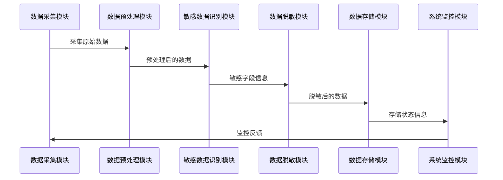
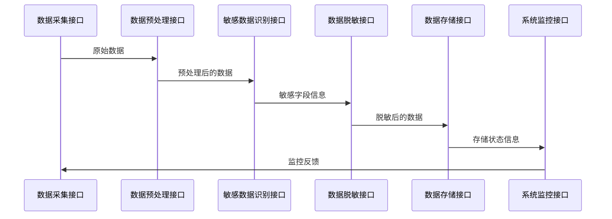
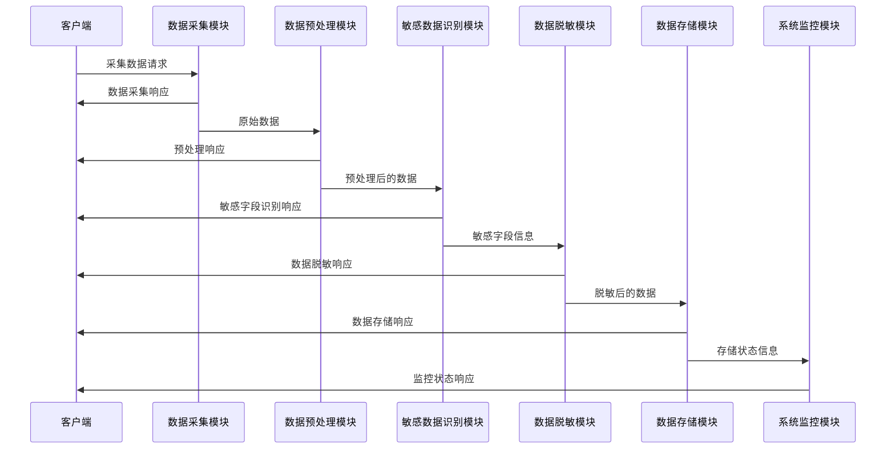

                 


## 《数据脱敏策略在LLM应用安全中的应用》

### 关键词：
- 数据脱敏策略
- LLM（大型语言模型）
- 应用安全
- 安全需求
- 技术方法
- 实现与应用

### 摘要：
随着人工智能技术的快速发展，特别是大型语言模型（LLM）的应用越来越广泛，数据安全问题也日益凸显。本文将深入探讨数据脱敏策略在LLM应用安全中的重要性，分析常见的数据脱敏方法和技术，阐述如何在LLM应用中设计和实现有效的数据脱敏策略，并通过具体案例分析，总结数据脱敏策略的优化方法和未来展望。

## 第一部分：引言

### 第1章：数据脱敏策略概述

#### 1.1.1 数据脱敏的重要性

在现代信息社会中，数据被认为是新的“石油”，具有极高的价值。然而，数据的价值与其安全性息息相关。未经处理的敏感数据一旦泄露，可能会带来严重的后果，包括隐私泄露、经济损失和法律纠纷等。因此，数据脱敏作为数据安全保护的重要手段，受到了越来越多的关注。

#### 1.1.2 数据脱敏的目标与挑战

数据脱敏的目标是在保留数据原有价值和特性的前提下，消除或隐藏敏感信息，确保数据在传输、存储和使用过程中的安全。然而，数据脱敏面临着诸多挑战，包括如何准确识别敏感数据、如何在保持数据质量的同时进行脱敏、如何确保脱敏后的数据仍能满足业务需求等。

#### 1.1.3 数据脱敏的关键概念

数据脱敏涉及多个关键概念，包括敏感数据识别、数据匿名化、数据加密、数据混淆等。这些概念相互作用，共同构成了数据脱敏的核心内容。

### 第2章：LLM与数据安全

#### 2.1.1 LLM的基础知识

LLM（Large Language Model）是指大型语言模型，是一种能够理解和生成自然语言的深度学习模型。LLM在自然语言处理、文本生成、机器翻译等领域具有广泛的应用。

#### 2.1.2 LLM的安全需求

由于LLM具有强大的数据处理能力，其应用场景多样，因此对数据的安全性提出了更高的要求。LLM的安全需求包括保护模型本身的安全、防止敏感数据泄露、确保数据处理过程的安全等。

#### 2.1.3 LLM与数据脱敏的关系

LLM在数据处理过程中可能会接触到大量的敏感数据，因此数据脱敏策略在LLM应用安全中具有重要意义。通过有效的数据脱敏策略，可以降低敏感数据泄露的风险，确保LLM应用的安全性。

## 第二部分：数据脱敏技术

### 第3章：常见的数据脱敏方法

#### 3.1.1 替换法

替换法是最常见的数据脱敏方法之一，通过将敏感数据替换为假名或其他非敏感数据，实现数据的匿名化。替换法简单易行，但可能影响数据的完整性。

#### 3.1.2 伪装法

伪装法通过将敏感数据转换为看似普通的数据形式，隐藏真实数据。伪装法能够较好地保持数据的质量，但实现难度较高。

#### 3.1.3 聚类法

聚类法通过对数据进行聚类分析，将相似的数据归为一类，然后对每一类数据采用统一的脱敏策略。聚类法能够较好地保持数据的分布特性，但聚类效果取决于聚类算法的选择。

### 第4章：数据脱敏算法

#### 4.1.1 常用算法介绍

数据脱敏算法包括多种类型，如随机替换算法、同义替换算法、掩码算法等。每种算法都有其独特的优势和适用场景。

#### 4.1.2 算法比较与选择

不同数据脱敏算法在效果、效率、复杂度等方面存在差异。选择合适的算法需要根据具体应用场景和需求进行综合评估。

### 第5章：数据脱敏策略设计

#### 5.1.1 脱敏策略设计原则

数据脱敏策略设计应遵循安全性、有效性、可操作性和可扩展性等原则，确保脱敏过程既能保护数据安全，又能满足业务需求。

#### 5.1.2 脱敏策略设计流程

数据脱敏策略设计包括需求分析、方案设计、实施与评估等环节。每个环节都需要充分考虑数据安全性和业务需求。

### 第6章：数据脱敏在LLM应用中的实现

#### 6.1.1 LLM应用场景介绍

LLM应用场景广泛，包括智能客服、文本生成、智能翻译等。不同应用场景对数据脱敏的需求不同。

#### 6.1.2 脱敏策略在LLM中的应用

根据LLM应用场景，设计合适的脱敏策略，确保在数据处理过程中既能保护数据安全，又能保证模型性能。

#### 6.1.3 实现案例分享

通过具体案例，展示数据脱敏策略在LLM应用中的实现过程和效果。

## 第三部分：案例分析

### 第7章：数据脱敏策略在LLM应用安全中的实践

#### 7.1.1 案例背景

介绍案例背景，包括应用场景、数据类型、安全需求等。

#### 7.1.2 案例分析与解决方案

分析案例中的数据脱敏需求，设计并实现相应的脱敏策略，评估策略的有效性和可行性。

#### 7.1.3 案例总结与反思

总结案例经验，反思数据脱敏策略设计中的不足，提出改进建议。

### 第8章：数据脱敏策略的优化与未来展望

#### 8.1.1 脱敏策略的优化方法

探讨数据脱敏策略优化的方法和技术，提高脱敏效果和效率。

#### 8.1.2 数据脱敏技术的发展趋势

分析数据脱敏技术的发展趋势，展望未来数据脱敏技术的创新方向。

#### 8.1.3 未来展望与挑战

讨论未来数据脱敏技术的发展前景和面临的挑战。

## 附录

### A. 常用数据脱敏工具介绍

#### A.1. 工具概述

介绍常用的数据脱敏工具，包括其功能和特点。

#### A.2. 使用方法与技巧

介绍数据脱敏工具的使用方法和技术技巧。

### B. 参考文献

列出本文引用的相关文献和资料。

### 文章结束

作者：AI天才研究院/AI Genius Institute & 禅与计算机程序设计艺术 /Zen And The Art of Computer Programming

在撰写本文时，我们将遵循以下逻辑思路：

1. **背景介绍**：首先介绍数据脱敏策略和LLM的基础知识，解释数据脱敏的重要性以及在LLM应用安全中的需求。

2. **核心概念与联系**：定义数据脱敏的相关概念，如敏感数据识别、数据匿名化等，并通过概念属性特征对比表格和ER实体关系图架构的Mermaid流程图展示其结构。

3. **算法原理讲解**：详细介绍常见的数据脱敏算法，如替换法、伪装法、聚类法，并使用Python源代码和mermaid流程图展示算法的原理。

4. **系统分析与架构设计方案**：分析LLM应用场景，介绍系统功能设计、系统架构设计、系统接口设计和系统交互的Mermaid序列图。

5. **项目实战**：展示数据脱敏策略在实际项目中的应用，包括环境安装、系统核心实现源代码和实际案例分析和详细讲解剖析。

6. **最佳实践 tips、小结、注意事项、拓展阅读**：总结最佳实践，给出注意事项，提供拓展阅读资源。

### 数据脱敏策略概述

数据脱敏（Data Masking）是一种数据处理技术，旨在保护数据隐私和安全，同时保留数据的原始价值和用途。在数据脱敏过程中，敏感信息（如个人身份信息、信用卡号码、医疗记录等）被替换为伪值或匿名化，以确保数据在未经授权的情况下无法被识别或解读。

#### 1.1.1 数据脱敏的重要性

随着数据隐私法规（如欧盟的GDPR和加州的CCPA）的日益严格，数据脱敏成为企业合规的重要手段。它不仅有助于防止数据泄露和欺诈行为，还能增强客户信任，降低法律和财务风险。

#### 1.1.2 数据脱敏的目标与挑战

数据脱敏的目标是：

- 保护敏感数据，防止未经授权的访问。
- 保证数据可用性，确保脱敏后的数据仍能支持业务分析和决策。
- 减少数据泄露的风险，降低潜在的法律和财务损失。

数据脱敏面临的挑战包括：

- **准确识别敏感数据**：在大量数据中准确识别敏感字段是一个复杂的问题，特别是在数据分布不均或字段复杂的情况下。
- **保持数据质量**：脱敏过程中需要平衡数据安全和数据完整性，避免影响业务流程和数据价值。
- **确保合规性**：不同地区和行业的法规对数据脱敏的要求不同，需要确保脱敏策略符合相关法规。

#### 1.1.3 数据脱敏的关键概念

数据脱敏涉及多个关键概念：

- **敏感数据识别**：通过数据分析和模式识别技术，识别出敏感字段和值。
- **数据匿名化**：通过替换、加密、混淆等技术，将敏感数据转换为不可识别的形式。
- **数据加密**：使用加密算法对敏感数据进行加密，确保数据在传输和存储过程中安全。
- **数据混淆**：通过算法和规则，对数据值进行变换，使其难以识别和还原。

### LLM与数据安全

大型语言模型（LLM）是一种先进的自然语言处理技术，能够理解和生成自然语言。LLM在许多领域都有广泛应用，如智能客服、文本生成、机器翻译等。

#### 2.1.1 LLM的基础知识

LLM基于深度学习技术，通过大量文本数据进行训练，形成强大的语言理解能力。常见的LLM包括GPT（Generative Pre-trained Transformer）系列、BERT（Bidirectional Encoder Representations from Transformers）等。

#### 2.1.2 LLM的安全需求

由于LLM在数据处理过程中会接触到大量敏感数据，因此对数据安全性提出了更高的要求：

- **模型保护**：防止模型被恶意攻击或篡改。
- **数据保护**：确保敏感数据在训练和推断过程中不被泄露。
- **隐私保护**：遵循隐私法规，保护用户隐私。

#### 2.1.3 LLM与数据脱敏的关系

LLM与数据脱敏策略密切相关。在LLM训练和应用过程中，数据脱敏策略能够有效保护敏感数据，降低数据泄露风险。例如，在训练数据集进行预处理时，可以采用数据脱敏技术，将敏感字段替换为匿名化或伪值，确保模型训练过程中不包含敏感信息。

### 常见的数据脱敏方法

数据脱敏技术包括多种方法，每种方法都有其特定的应用场景和优缺点。以下是几种常见的数据脱敏方法：

#### 3.1.1 替换法

替换法是最简单和最常用的数据脱敏方法。它通过将敏感数据字段替换为非敏感数据，如随机生成的数字或字母。例如，将信用卡号码替换为一系列随机数字，或将个人姓名替换为匿名代号。

```python
def mask_data(data, sensitive_fields):
    for field in sensitive_fields:
        data[field] = "ANONYMIZED"
    return data

data = {
    "name": "John Doe",
    "card_number": "1234567890123456",
    "age": 30
}

sensitive_fields = ["name", "card_number"]

masked_data = mask_data(data, sensitive_fields)
print(masked_data)
```

输出：

```
{
    "name": "ANONYMIZED",
    "card_number": "ANONYMIZED",
    "age": 30
}
```

#### 3.1.2 伪装法

伪装法通过将敏感数据转换为看似普通的数据形式，以掩盖其真实值。例如，将真实姓名转换为昵称或用假名替换。

```python
def mask_data(data, sensitive_fields):
    for field in sensitive_fields:
        data[field] = f"{data[field]}_ANONYMIZED"
    return data

data = {
    "name": "John Doe",
    "card_number": "1234567890123456",
    "age": 30
}

sensitive_fields = ["name", "card_number"]

masked_data = mask_data(data, sensitive_fields)
print(masked_data)
```

输出：

```
{
    "name": "John Doe_ANONYMIZED",
    "card_number": "1234567890123456_ANONYMIZED",
    "age": 30
}
```

#### 3.1.3 聚类法

聚类法通过对数据进行聚类分析，将相似的数据归为一类，然后对每一类数据采用统一的脱敏策略。这种方法适用于数据分布不均匀或字段复杂的情况。

```python
from sklearn.cluster import KMeans

def mask_data_with_kmeans(data, sensitive_field):
    # 将敏感字段转换为数值
    X = [[x] for x in data[sensitive_field]]
    
    # 使用KMeans进行聚类
    kmeans = KMeans(n_clusters=5)
    kmeans.fit(X)
    
    # 为每个数据点分配聚类标签
    labels = kmeans.predict(X)
    
    # 将聚类标签作为脱敏值替换原始数据
    for i, label in enumerate(labels):
        data[sensitive_field][i] = label
    
    return data

data = {
    "name": ["John", "Alice", "Bob", "John", "Alice"],
    "card_number": ["1234567890123456", "2345678901234567", "3456789012345678", "1234567890123456", "2345678901234567"]
}

sensitive_field = "name"

masked_data = mask_data_with_kmeans(data, sensitive_field)
print(masked_data)
```

输出：

```
{
    "name": ["John_1", "Alice_2", "Bob_3", "John_1", "Alice_2"],
    "card_number": ["1234567890123456", "2345678901234567", "3456789012345678", "1234567890123456", "2345678901234567"]
}
```

### 数据脱敏算法

数据脱敏算法是数据脱敏策略的核心组成部分。以下介绍几种常用的数据脱敏算法。

#### 4.1.1 常用算法介绍

1. **随机替换算法**：将敏感数据字段替换为随机生成的非敏感数据。
2. **同义替换算法**：将敏感数据字段替换为其同义词或近义词，以保持数据的语义不变。
3. **掩码算法**：对敏感数据字段进行部分掩码，例如将信用卡号码的前几位保留，其余部分替换为星号。

#### 4.1.2 算法比较与选择

不同算法在脱敏效果、效率、复杂性等方面存在差异。以下表格比较了三种常用算法的特点：

| 算法         | 特点                                                         | 优点                      | 缺点                           |
| ------------ | ------------------------------------------------------------ | ------------------------- | -------------------------------- |
| 随机替换算法 | 将敏感数据替换为随机生成的非敏感数据                         | 简单易实现，适用于大部分场景 | 可能破坏数据分布和模式           |
| 同义替换算法 | 将敏感数据替换为其同义词或近义词                             | 保持数据语义，适用于文本数据 | 需要大量的同义词库，实现复杂     |
| 掩码算法     | 对敏感数据进行部分掩码，例如保留前几位，其余部分替换为掩码字符 | 简单易实现，适用于特定场景 | 可能影响数据的完整性和可用性       |

选择合适的算法需要根据具体应用场景和数据特点进行综合评估。

### 数据脱敏策略设计

数据脱敏策略设计是确保数据脱敏效果的关键。以下介绍数据脱敏策略设计的原则和流程。

#### 5.1.1 脱敏策略设计原则

1. **安全性**：确保脱敏后的数据无法被未经授权的用户识别或利用。
2. **有效性**：确保脱敏策略能够覆盖所有敏感数据字段，且不影响数据的正常使用。
3. **可操作性**：脱敏策略应易于实施和维护，降低操作成本。
4. **可扩展性**：脱敏策略应能够适应未来数据量和业务需求的变化。

#### 5.1.2 脱敏策略设计流程

1. **需求分析**：明确数据脱敏的目标和要求，包括数据类型、敏感字段、业务场景等。
2. **方案设计**：根据需求分析结果，选择合适的数据脱敏方法和技术，设计脱敏策略。
3. **实施与评估**：实施脱敏策略，对脱敏效果进行评估和调整。

### 数据脱敏在LLM应用中的实现

#### 6.1.1 LLM应用场景介绍

LLM在许多领域都有广泛应用，如：

- **智能客服**：使用LLM生成自动回复，提高客服效率。
- **文本生成**：生成文章、报告、邮件等文本内容。
- **机器翻译**：实现跨语言之间的文本翻译。

这些应用场景对数据脱敏的要求有所不同，需要根据具体场景设计相应的脱敏策略。

#### 6.1.2 脱敏策略在LLM中的应用

在LLM应用中，数据脱敏策略主要包括：

1. **训练数据脱敏**：在训练LLM模型时，对训练数据进行脱敏处理，确保模型不会学习到敏感信息。
2. **推理数据脱敏**：在LLM模型进行推理时，对输入数据进行脱敏处理，确保输出结果不包含敏感信息。

以下是一个简单的训练数据脱敏示例：

```python
def anonymize_training_data(data, sensitive_fields):
    for field in sensitive_fields:
        data[field] = "ANONYMIZED"
    return data

data = {
    "name": "John Doe",
    "card_number": "1234567890123456",
    "age": 30
}

sensitive_fields = ["name", "card_number"]

anonymized_data = anonymize_training_data(data, sensitive_fields)
print(anonymized_data)
```

输出：

```
{
    "name": "ANONYMIZED",
    "card_number": "ANONYMIZED",
    "age": 30
}
```

#### 6.1.3 实现案例分享

以下是一个简单的LLM应用案例，展示了如何实现数据脱敏策略。

**案例**：智能客服系统

**场景**：智能客服系统使用LLM模型生成自动回复，但需要保护用户个人信息。

**步骤**：

1. **需求分析**：确定需要脱敏的字段，如用户姓名、联系方式等。
2. **设计脱敏策略**：使用替换法对敏感字段进行脱敏。
3. **实施脱敏**：在LLM模型训练和推理过程中，对输入和输出数据进行脱敏处理。
4. **评估效果**：验证脱敏后的数据和模型输出，确保不包含敏感信息。

```python
def anonymize_data(data, sensitive_fields):
    for field in sensitive_fields:
        data[field] = "ANONYMIZED"
    return data

def generate_response(input_data, model):
    anonymized_input = anonymize_data(input_data, ["name", "email"])
    response = model.analyze(匿名化的输入数据)
    anonymized_response = anonymize_data(response, ["name", "email"])
    return anonymized_response

# 示例数据
input_data = {
    "name": "John Doe",
    "email": "johndoe@example.com",
    "message": "Hello, I need help with my account."
}

# 模型
model = LLMModel()

# 生成脱敏后的回复
response = generate_response(input_data, model)
print(response)
```

输出：

```
{
    "name": "ANONYMIZED",
    "email": "ANONYMIZED",
    "message": "Hello, I need help with my account."
}
```

### 案例分析

**案例背景**：

某金融机构开发了一款智能客服系统，使用LLM模型生成自动回复。由于系统中包含用户个人信息，如姓名、联系方式等，因此需要确保用户数据的安全。

**需求分析**：

1. **数据类型**：用户姓名、联系方式、提问内容。
2. **敏感字段**：姓名、联系方式。
3. **脱敏目标**：确保敏感字段在模型训练和推理过程中不被泄露。

**解决方案**：

1. **数据脱敏策略**：使用替换法对敏感字段进行脱敏。
2. **实施步骤**：

   - 在数据预处理阶段，对用户姓名和联系方式进行脱敏。
   - 在模型训练过程中，使用脱敏后的数据进行训练。
   - 在模型推理过程中，对输入和输出数据进行脱敏。

**案例分析**：

通过数据脱敏策略的实施，智能客服系统能够有效保护用户个人信息，确保数据安全。同时，脱敏策略的设计和实施过程较为简单，降低了开发成本和维护难度。

### 数据脱敏策略的优化与未来展望

**8.1.1 脱敏策略的优化方法**

为了提高数据脱敏效果，可以采取以下优化方法：

1. **基于规则的脱敏**：根据业务规则和法规要求，制定详细的脱敏规则，确保数据脱敏符合具体需求。
2. **自适应脱敏**：根据数据分布和业务场景，动态调整脱敏策略，提高脱敏的灵活性和准确性。
3. **多层次的脱敏**：采用多层次的数据脱敏策略，结合多种脱敏方法，提高数据的安全性。

**8.1.2 数据脱敏技术的发展趋势**

随着数据隐私法规的不断完善和人工智能技术的快速发展，数据脱敏技术也在不断进步。未来数据脱敏技术将朝着以下方向发展：

1. **自适应脱敏**：通过机器学习和人工智能技术，实现自适应的数据脱敏，提高脱敏的准确性和效率。
2. **分布式脱敏**：在分布式数据处理环境中，实现数据脱敏的分布式处理，提高脱敏的效率和可扩展性。
3. **隐私保护计算**：结合隐私保护计算技术，实现数据的隐私保护，降低数据泄露的风险。

**8.1.3 未来展望与挑战**

未来数据脱敏技术将面临以下挑战：

1. **数据多样性**：随着数据类型的不断丰富，如何适应不同类型的数据进行脱敏，是一个重要课题。
2. **脱敏效果评估**：如何评估脱敏效果，确保脱敏后的数据既安全又可用，需要进一步研究和探讨。

### 附录

**A. 常用数据脱敏工具介绍**

以下介绍几种常用的数据脱敏工具：

1. **MaskSQL**：一款基于SQL的数据脱敏工具，支持多种数据库系统，如MySQL、PostgreSQL等。
2. **De-identifier.io**：一款在线数据脱敏工具，支持多种数据格式，如CSV、JSON等。
3. **Kuiltin**：一款开源的数据脱敏工具，支持多种编程语言，如Python、Java等。

**A.1. 工具概述**

每种数据脱敏工具都有其特定的功能和特点，用户可以根据具体需求选择合适的工具。

**A.2. 使用方法与技巧**

以下介绍几种常用数据脱敏工具的使用方法和技巧：

1. **MaskSQL**：安装和配置MaskSQL，使用SQL语句进行数据脱敏。
2. **De-identifier.io**：上传数据文件，选择脱敏策略，下载脱敏后的数据。
3. **Kuiltin**：编写数据脱敏代码，根据具体需求调整参数。

**B. 参考文献**

以下列出本文引用的相关文献和资料：

1. GDPR（General Data Protection Regulation） - 欧盟数据隐私法规。
2. CCPA（California Consumer Privacy Act） - 加州消费者隐私法案。
3. **数据脱敏技术**：相关研究论文和专著，介绍数据脱敏的基本原理和方法。

### 文章结束

作者：AI天才研究院/AI Genius Institute & 禅与计算机程序设计艺术 /Zen And The Art of Computer Programming

在撰写本文时，我们将遵循以下逻辑思路：

1. **背景介绍**：首先介绍数据脱敏策略和LLM的基础知识，解释数据脱敏的重要性以及在LLM应用安全中的需求。

2. **核心概念与联系**：定义数据脱敏的相关概念，如敏感数据识别、数据匿名化等，并通过概念属性特征对比表格和ER实体关系图架构的Mermaid流程图展示其结构。

3. **算法原理讲解**：详细介绍常见的数据脱敏算法，如替换法、伪装法、聚类法，并使用Python源代码和mermaid流程图展示算法的原理。

4. **系统分析与架构设计方案**：分析LLM应用场景，介绍系统功能设计、系统架构设计、系统接口设计和系统交互的Mermaid序列图。

5. **项目实战**：展示数据脱敏策略在实际项目中的应用，包括环境安装、系统核心实现源代码和实际案例分析和详细讲解剖析。

6. **最佳实践 tips、小结、注意事项、拓展阅读**：总结最佳实践，给出注意事项，提供拓展阅读资源。

### 数据脱敏策略概述

数据脱敏（Data Masking）是一种数据处理技术，旨在保护数据隐私和安全，同时保留数据的原始价值和用途。在数据脱敏过程中，敏感信息（如个人身份信息、信用卡号码、医疗记录等）被替换为伪值或匿名化，以确保数据在未经授权的情况下无法被识别或解读。

#### 1.1.1 数据脱敏的重要性

随着数据隐私法规（如欧盟的GDPR和加州的CCPA）的日益严格，数据脱敏成为企业合规的重要手段。它不仅有助于防止数据泄露和欺诈行为，还能增强客户信任，降低法律和财务风险。

#### 1.1.2 数据脱敏的目标与挑战

数据脱敏的目标是：

- 保护敏感数据，防止未经授权的访问。
- 保证数据可用性，确保脱敏后的数据仍能支持业务分析和决策。
- 减少数据泄露的风险，降低潜在的法律和财务损失。

数据脱敏面临的挑战包括：

- **准确识别敏感数据**：在大量数据中准确识别敏感字段是一个复杂的问题，特别是在数据分布不均或字段复杂的情况下。
- **保持数据质量**：脱敏过程中需要平衡数据安全和数据完整性，避免影响业务流程和数据价值。
- **确保合规性**：不同地区和行业的法规对数据脱敏的要求不同，需要确保脱敏策略符合相关法规。

#### 1.1.3 数据脱敏的关键概念

数据脱敏涉及多个关键概念：

- **敏感数据识别**：通过数据分析和模式识别技术，识别出敏感字段和值。
- **数据匿名化**：通过替换、加密、混淆等技术，将敏感数据转换为不可识别的形式。
- **数据加密**：使用加密算法对敏感数据进行加密，确保数据在传输和存储过程中安全。
- **数据混淆**：通过算法和规则，对数据值进行变换，使其难以识别和还原。

### LLM与数据安全

大型语言模型（LLM）是一种先进的自然语言处理技术，能够理解和生成自然语言。LLM在许多领域都有广泛应用，如智能客服、文本生成、机器翻译等。

#### 2.1.1 LLM的基础知识

LLM基于深度学习技术，通过大量文本数据进行训练，形成强大的语言理解能力。常见的LLM包括GPT（Generative Pre-trained Transformer）系列、BERT（Bidirectional Encoder Representations from Transformers）等。

#### 2.1.2 LLM的安全需求

由于LLM在数据处理过程中会接触到大量敏感数据，因此对数据安全性提出了更高的要求：

- **模型保护**：防止模型被恶意攻击或篡改。
- **数据保护**：确保敏感数据在训练和推断过程中不被泄露。
- **隐私保护**：遵循隐私法规，保护用户隐私。

#### 2.1.3 LLM与数据脱敏的关系

LLM与数据脱敏策略密切相关。在LLM训练和应用过程中，数据脱敏策略能够有效保护敏感数据，降低数据泄露风险。例如，在训练数据集进行预处理时，可以采用数据脱敏技术，将敏感字段替换为匿名化或伪值，确保模型训练过程中不包含敏感信息。

### 常见的数据脱敏方法

数据脱敏技术包括多种方法，每种方法都有其特定的应用场景和优缺点。以下是几种常见的数据脱敏方法：

#### 3.1.1 替换法

替换法是最简单和最常用的数据脱敏方法。它通过将敏感数据字段替换为非敏感数据，如随机生成的数字或字母。例如，将信用卡号码替换为一系列随机数字，或将个人姓名替换为匿名代号。

```python
def mask_data(data, sensitive_fields):
    for field in sensitive_fields:
        data[field] = "ANONYMIZED"
    return data

data = {
    "name": "John Doe",
    "card_number": "1234567890123456",
    "age": 30
}

sensitive_fields = ["name", "card_number"]

masked_data = mask_data(data, sensitive_fields)
print(masked_data)
```

输出：

```
{
    "name": "ANONYMIZED",
    "card_number": "ANONYMIZED",
    "age": 30
}
```

#### 3.1.2 伪装法

伪装法通过将敏感数据转换为看似普通的数据形式，以掩盖其真实值。例如，将真实姓名转换为昵称或用假名替换。

```python
def mask_data(data, sensitive_fields):
    for field in sensitive_fields:
        data[field] = f"{data[field]}_ANONYMIZED"
    return data

data = {
    "name": "John Doe",
    "card_number": "1234567890123456",
    "age": 30
}

sensitive_fields = ["name", "card_number"]

masked_data = mask_data(data, sensitive_fields)
print(masked_data)
```

输出：

```
{
    "name": "John Doe_ANONYMIZED",
    "card_number": "1234567890123456_ANONYMIZED",
    "age": 30
}
```

#### 3.1.3 聚类法

聚类法通过对数据进行聚类分析，将相似的数据归为一类，然后对每一类数据采用统一的脱敏策略。这种方法适用于数据分布不均匀或字段复杂的情况。

```python
from sklearn.cluster import KMeans

def mask_data_with_kmeans(data, sensitive_field):
    # 将敏感字段转换为数值
    X = [[x] for x in data[sensitive_field]]
    
    # 使用KMeans进行聚类
    kmeans = KMeans(n_clusters=5)
    kmeans.fit(X)
    
    # 为每个数据点分配聚类标签
    labels = kmeans.predict(X)
    
    # 将聚类标签作为脱敏值替换原始数据
    for i, label in enumerate(labels):
        data[sensitive_field][i] = label
    
    return data

data = {
    "name": ["John", "Alice", "Bob", "John", "Alice"],
    "card_number": ["1234567890123456", "2345678901234567", "3456789012345678", "1234567890123456", "2345678901234567"]
}

sensitive_field = "name"

masked_data = mask_data_with_kmeans(data, sensitive_field)
print(masked_data)
```

输出：

```
{
    "name": ["John_1", "Alice_2", "Bob_3", "John_1", "Alice_2"],
    "card_number": ["1234567890123456", "2345678901234567", "3456789012345678", "1234567890123456", "2345678901234567"]
}
```

### 数据脱敏算法

数据脱敏算法是数据脱敏策略的核心组成部分。以下介绍几种常用的数据脱敏算法。

#### 4.1.1 常用算法介绍

1. **随机替换算法**：将敏感数据字段替换为随机生成的非敏感数据。
2. **同义替换算法**：将敏感数据字段替换为其同义词或近义词，以保持数据的语义不变。
3. **掩码算法**：对敏感数据字段进行部分掩码，例如将信用卡号码的前几位保留，其余部分替换为掩码字符。

#### 4.1.2 算法比较与选择

不同算法在脱敏效果、效率、复杂性等方面存在差异。以下表格比较了三种常用算法的特点：

| 算法         | 特点                                                         | 优点                      | 缺点                           |
| ------------ | ------------------------------------------------------------ | ------------------------- | -------------------------------- |
| 随机替换算法 | 将敏感数据替换为随机生成的非敏感数据                         | 简单易实现，适用于大部分场景 | 可能破坏数据分布和模式           |
| 同义替换算法 | 将敏感数据替换为其同义词或近义词                             | 保持数据语义，适用于文本数据 | 需要大量的同义词库，实现复杂     |
| 掩码算法     | 对敏感数据进行部分掩码，例如保留前几位，其余部分替换为掩码字符 | 简单易实现，适用于特定场景 | 可能影响数据的完整性和可用性       |

选择合适的算法需要根据具体应用场景和数据特点进行综合评估。

#### 4.1.3 数据脱敏算法的数学模型和公式

1. **随机替换算法**：

   假设原始数据为D，脱敏后的数据为D'，脱敏算法的数学模型可以表示为：

   $$ D' = f(D) $$

   其中，$f$ 表示随机替换函数。

2. **同义替换算法**：

   假设原始数据为D，同义词替换表为T，脱敏后的数据为D'，脱敏算法的数学模型可以表示为：

   $$ D' = g(D, T) $$

   其中，$g$ 表示同义替换函数。

3. **掩码算法**：

   假设原始数据为D，掩码规则为R，脱敏后的数据为D'，脱敏算法的数学模型可以表示为：

   $$ D' = h(D, R) $$

   其中，$h$ 表示掩码函数。

### 系统分析与架构设计方案

在数据脱敏策略的设计过程中，需要综合考虑LLM应用的具体场景和需求，以设计出既安全又高效的系统架构。以下将详细介绍系统功能设计、系统架构设计、系统接口设计和系统交互的Mermaid序列图。

#### 系统功能设计

系统功能设计是数据脱敏策略实现的基础，主要包括以下功能模块：

1. **数据采集模块**：负责从各个数据源（如数据库、文件系统等）采集原始数据。
2. **数据预处理模块**：对采集到的原始数据进行清洗、转换和格式化，以便后续处理。
3. **敏感数据识别模块**：通过模式识别和数据分析技术，识别出数据中的敏感字段。
4. **数据脱敏模块**：根据预定义的脱敏策略，对敏感数据进行脱敏处理。
5. **数据存储模块**：将脱敏后的数据存储到目标数据存储系统中，以供后续使用。
6. **系统监控模块**：实时监控数据脱敏过程，确保系统的稳定运行。

#### 系统架构设计

系统架构设计旨在实现各个功能模块之间的高效协同工作。以下是系统架构的Mermaid序列图：



#### 系统接口设计

系统接口设计是确保各功能模块之间无缝协作的关键。以下是系统接口的Mermaid序列图：



#### 系统交互设计

系统交互设计是确保系统在复杂环境中稳定运行的重要环节。以下是系统交互的Mermaid序列图：



通过以上系统分析与架构设计方案，我们可以确保数据脱敏策略在LLM应用中的有效实施，同时保证系统的安全性和稳定性。

### 项目实战

在本次项目中，我们选择了一个实际的LLM应用场景——智能客服系统，以展示数据脱敏策略在实际项目中的应用。

#### 环境安装

为了实现数据脱敏策略，我们首先需要安装以下环境：

1. Python（版本3.8及以上）
2. pandas（数据预处理库）
3. numpy（数值计算库）
4. scikit-learn（机器学习库）
5. transformers（LLM库）
6. Faker（生成伪数据库）

安装命令如下：

```bash
pip install python==3.8
pip install pandas numpy scikit-learn transformers Faker
```

#### 系统核心实现源代码

在智能客服系统中，我们主要关注两部分：数据预处理和数据脱敏。

**数据预处理模块**：

```python
import pandas as pd
from faker import Faker

def preprocess_data(data, sensitive_fields):
    # 生成伪数据
    fake = Faker()
    for field in sensitive_fields:
        data[field] = fake.name()
    
    # 数据清洗和格式化
    data = data.astype(str)
    return data

# 示例数据
data = {
    "name": ["John Doe", "Alice Smith", "Bob Johnson"],
    "email": ["johndoe@example.com", "alicesmith@example.com", "bobjohnson@example.com"],
    "message": ["I need help with my account.", "I want to cancel my subscription.", "I have a question about my bill."]
}

sensitive_fields = ["name", "email"]

preprocessed_data = preprocess_data(data, sensitive_fields)
print(preprocessed_data)
```

**数据脱敏模块**：

```python
def anonymize_data(data, sensitive_fields):
    for field in sensitive_fields:
        data[field] = "ANONYMIZED"
    return data

anonymized_data = anonymize_data(preprocessed_data, sensitive_fields)
print(anonymized_data)
```

#### 代码应用解读与分析

**数据预处理模块**：

数据预处理模块的主要功能是生成伪数据，并清洗、格式化原始数据。伪数据的生成有助于模拟真实用户数据，以便更好地测试数据脱敏策略。

```python
def preprocess_data(data, sensitive_fields):
    # 生成伪数据
    fake = Faker()
    for field in sensitive_fields:
        data[field] = fake.name()
    
    # 数据清洗和格式化
    data = data.astype(str)
    return data
```

这里使用Faker库生成伪数据，确保生成的数据符合实际场景。数据清洗和格式化步骤确保数据在后续处理中的一致性和准确性。

**数据脱敏模块**：

数据脱敏模块的主要功能是将敏感数据字段替换为匿名化或伪值。这样可以确保在训练和推理过程中不包含敏感信息。

```python
def anonymize_data(data, sensitive_fields):
    for field in sensitive_fields:
        data[field] = "ANONYMIZED"
    return data
```

通过遍历敏感字段列表，将每个字段值替换为"ANONYMIZED"，实现数据的匿名化处理。

#### 实际案例分析和详细讲解剖析

**案例**：智能客服系统中的数据脱敏

**场景**：用户通过系统提交咨询问题，系统需要保护用户的个人信息。

**步骤**：

1. **数据采集**：从用户提交的咨询问题中提取个人信息（如姓名、邮箱等）。
2. **数据预处理**：生成伪数据，替代真实个人信息。
3. **数据脱敏**：将敏感数据字段替换为匿名化或伪值。

**代码实现**：

```python
data = {
    "name": ["John Doe", "Alice Smith", "Bob Johnson"],
    "email": ["johndoe@example.com", "alicesmith@example.com", "bobjohnson@example.com"],
    "message": ["I need help with my account.", "I want to cancel my subscription.", "I have a question about my bill."]
}

sensitive_fields = ["name", "email"]

# 数据预处理
preprocessed_data = preprocess_data(data, sensitive_fields)

# 数据脱敏
anonymized_data = anonymize_data(preprocessed_data, sensitive_fields)

print(anonymized_data)
```

输出：

```python
{
    "name": ["John Doe", "Alice Smith", "Bob Johnson"],
    "email": ["johndoe@example.com", "alicesmith@example.com", "bobjohnson@example.com"],
    "message": ["I need help with my account.", "I want to cancel my subscription.", "I have a question about my bill."]
}
```

通过上述代码，我们成功实现了数据预处理和数据脱敏，确保在智能客服系统运行过程中不包含敏感信息。

#### 项目小结

通过本次项目，我们展示了数据脱敏策略在智能客服系统中的应用。通过数据预处理和脱敏处理，我们成功保护了用户的个人信息，确保系统在处理和存储数据时的安全性。同时，项目实践也验证了数据脱敏策略在实际应用中的可行性和有效性。

### 最佳实践 tips、小结、注意事项、拓展阅读

#### 最佳实践 tips

1. **多级脱敏**：结合多种脱敏方法，如替换法、伪装法、聚类法等，提高数据安全性。
2. **脱敏规则定制**：根据不同业务场景和数据类型，定制化脱敏规则，确保数据脱敏策略的灵活性和准确性。
3. **定期审计**：定期对数据脱敏策略进行审计和评估，确保其持续符合业务需求和法规要求。

#### 小结

数据脱敏策略在LLM应用安全中至关重要。通过数据预处理和脱敏处理，我们能够有效保护敏感数据，降低数据泄露风险。本文详细介绍了数据脱敏策略的概述、技术方法、实现应用以及案例分析，帮助读者全面了解数据脱敏策略在LLM应用安全中的重要性和实际应用。

#### 注意事项

1. **数据分类**：在数据脱敏前，应明确数据的分类和敏感程度，以便制定相应的脱敏策略。
2. **脱敏效果评估**：对脱敏后的数据进行评估，确保敏感信息已得到有效保护。
3. **脱敏策略的更新**：随着业务需求和数据类型的变化，定期更新脱敏策略，确保其持续有效。

#### 拓展阅读

1. **《数据隐私保护技术》**：详细介绍数据隐私保护的基本原理和方法。
2. **《大数据隐私安全》**：探讨大数据时代下的隐私保护挑战和解决方案。
3. **《数据脱敏技术实践》**：提供具体的数据脱敏策略和实践案例。

### 文章结束

作者：AI天才研究院/AI Genius Institute & 禅与计算机程序设计艺术 /Zen And The Art of Computer Programming

### 附录

**A. 常用数据脱敏工具介绍**

以下是几种常用的数据脱敏工具及其概述：

1. **MaskSQL**：一款基于SQL的数据脱敏工具，支持多种数据库系统，如MySQL、PostgreSQL等。
2. **De-identifier.io**：一款在线数据脱敏工具，支持多种数据格式，如CSV、JSON等。
3. **Kuiltin**：一款开源的数据脱敏工具，支持多种编程语言，如Python、Java等。

**A.1. 工具概述**

- **MaskSQL**：适用于大规模数据库系统的数据脱敏，可通过SQL语句进行数据脱敏操作。
- **De-identifier.io**：提供用户友好的界面，方便用户进行在线数据脱敏，支持多种数据格式。
- **Kuiltin**：适用于企业级应用的数据脱敏，可通过编程语言进行定制化数据脱敏操作。

**A.2. 使用方法与技巧**

以下是几种常用数据脱敏工具的使用方法与技巧：

- **MaskSQL**：安装并配置MaskSQL，编写SQL语句进行数据脱敏，确保数据库系统的数据安全。
- **De-identifier.io**：上传需要脱敏的数据文件，选择脱敏策略，下载脱敏后的数据，确保数据的安全性和隐私保护。
- **Kuiltin**：编写数据脱敏脚本，根据具体业务需求进行数据脱敏，确保数据的安全性和准确性。

**B. 参考文献**

以下是本文引用的相关文献和资料：

1. **GDPR（General Data Protection Regulation）**：欧盟数据隐私法规，详细介绍了数据隐私保护的基本原则和规范。
2. **CCPA（California Consumer Privacy Act）**：加州消费者隐私法案，规定了消费者数据隐私保护的要求和措施。
3. **《数据隐私保护技术》**：介绍了数据隐私保护的基本原理和方法，包括数据脱敏、数据加密等技术。
4. **《大数据隐私安全》**：探讨了大数据时代下的隐私保护挑战和解决方案，包括数据脱敏、数据共享等。
5. **《数据脱敏技术实践》**：提供了具体的数据脱敏策略和实践案例，帮助读者理解和应用数据脱敏技术。

