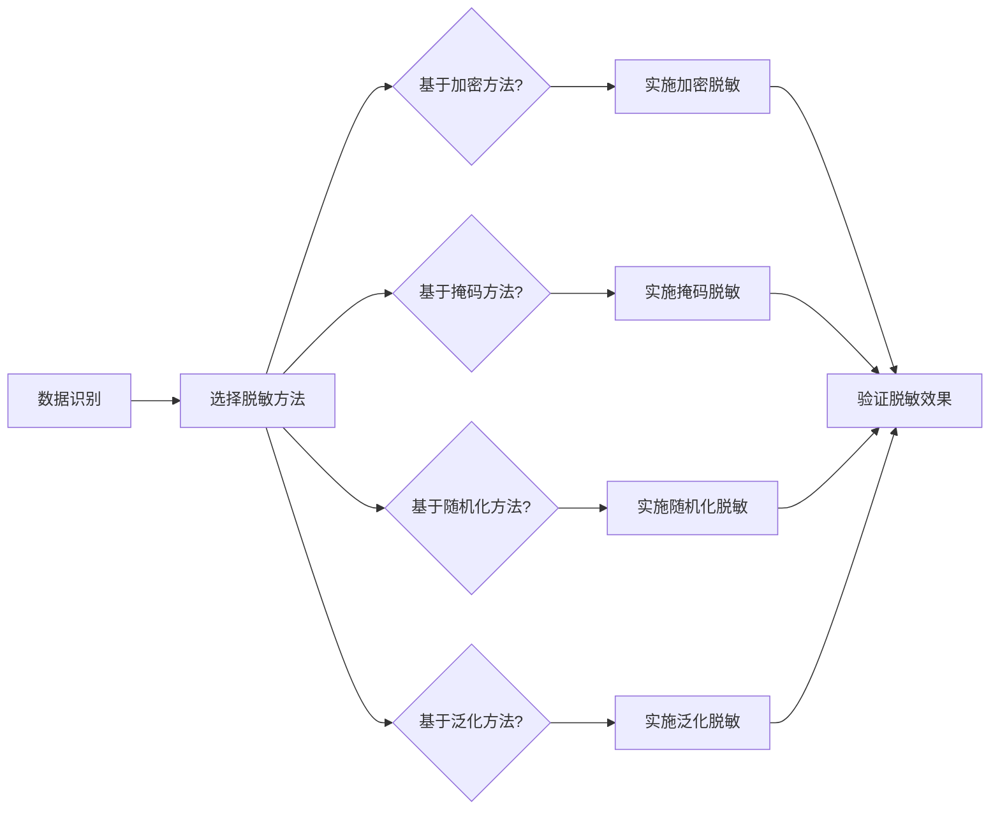

                 

# 数据脱敏：在LLM应用中保护敏感信息

## 关键词
数据脱敏、敏感信息保护、隐私安全、LLM应用、数据安全

## 摘要
本文旨在探讨数据脱敏在大型语言模型（LLM）应用中的重要性，以及如何通过有效的数据脱敏技术来保护敏感信息。文章首先定义了数据脱敏的基本概念，然后分析了在LLM应用中保护敏感信息的法律和伦理考量。接着，本文详细介绍了数据脱敏的原则和方法，探讨了实际应用中的技术挑战和解决方案。通过案例研究，展示了数据脱敏的实践应用，并提出了未来发展的方向。最后，文章总结了数据脱敏的核心要点，强调了其在保障数据隐私和信息安全中的关键作用。

## 引言
在数字化的今天，数据已经成为企业和个人不可或缺的资产。然而，随着数据量的不断增加，数据泄露的风险也随之上升。尤其是在使用大型语言模型（LLM）进行数据分析、业务决策和人工智能应用时，如何保护敏感信息成为了一个亟待解决的问题。数据脱敏作为一种重要的数据保护技术，可以在不损害数据价值的前提下，消除或隐藏敏感信息，从而降低数据泄露的风险。

本文将围绕以下主题展开：

1. 数据脱敏的背景与意义
2. 数据脱敏的核心概念
3. 数据脱敏的原则和方法
4. 法律和伦理考量
5. 数据脱敏的实际应用
6. 技术挑战与解决方案
7. 案例研究
8. 未来发展方向
9. 结论

## 第一部分：背景介绍

### 1.1 数据脱敏的背景与意义

#### 1.1.1 数据脱敏的定义

数据脱敏是一种数据处理技术，其目的是通过移除、替换或混淆敏感信息，使得数据在保留其分析价值的同时，无法被直接识别或用于非法用途。数据脱敏不仅仅是一个技术过程，更是一个涉及隐私保护、合规性和信息安全的多维度问题。

#### 1.1.2 数据脱敏的应用场景

数据脱敏的应用场景非常广泛，包括但不限于以下几种：

- **数据分析与挖掘**：在进行分析时，往往需要使用包含个人或商业敏感信息的数据集，而数据脱敏技术可以保护这些敏感信息不被泄露。
- **人工智能模型训练**：为了防止敏感信息被模型捕获并泄露，训练数据通常需要经过脱敏处理。
- **业务决策支持**：商业数据通常包含敏感信息，如客户隐私、财务数据等，数据脱敏有助于确保这些数据在公开或共享时不泄露敏感信息。
- **合规性要求**：许多国家和地区都有关于数据保护的法律法规，如欧洲的《通用数据保护条例》（GDPR）和美国的《加州消费者隐私法案》（CCPA），数据脱敏是满足这些法规要求的重要手段。

#### 1.1.3 数据脱敏的重要性

数据脱敏的重要性体现在以下几个方面：

- **隐私保护**：通过脱敏技术，可以确保个人隐私不被泄露，从而降低隐私侵犯的风险。
- **合规性**：数据脱敏有助于企业满足各种数据保护法律法规的要求，避免法律纠纷和处罚。
- **信息安全**：脱敏可以降低数据泄露的风险，保护企业或个人的核心资产。
- **数据价值保留**：脱敏不会影响数据的基本分析价值，可以继续用于研究和业务决策。

### 1.2 数据脱敏的核心概念

在深入探讨数据脱敏之前，我们需要明确几个核心概念：

- **敏感信息**：指可能对个人或组织造成不利影响的信息，如个人身份信息、财务信息、医疗信息等。
- **脱敏算法**：指用于实现数据脱敏的技术方法，如加密、掩码、随机化等。
- **匿名化**：一种数据脱敏技术，通过删除或替换识别信息，使得数据无法被直接识别为特定个体。
- **伪匿名化**：一种不完全匿名化，数据虽然无法直接识别，但通过组合分析可能恢复原始信息。

### 1.3 数据脱敏的问题与挑战

尽管数据脱敏具有诸多优势，但在实际应用中仍然面临一些问题和挑战：

- **准确性**：脱敏过程需要确保原始数据的分析价值不受损失，同时又要保证敏感信息被有效保护。
- **复杂性**：数据脱敏涉及到多个层面，如数据结构、数据处理流程、合规要求等，实现起来相对复杂。
- **成本**：数据脱敏可能需要额外的计算资源和时间，对企业的IT基础设施和预算带来一定压力。
- **动态性**：随着新的隐私法规和技术的不断涌现，数据脱敏需要不断更新和调整。

### 1.4 数据脱敏的核心要素组成

数据脱敏的核心要素包括：

- **数据识别**：识别数据集中的敏感信息。
- **脱敏策略**：根据数据类型和应用场景选择合适的脱敏算法。
- **脱敏实施**：具体实施脱敏操作，确保数据的安全性和可用性。
- **脱敏验证**：验证脱敏效果，确保敏感信息无法被还原。

## 第二部分：核心概念与联系

### 2.1 数据脱敏的原理

数据脱敏的基本原理是通过替换或隐藏原始数据中的敏感信息，使得数据在保留其分析价值的同时，无法被直接识别。常见的脱敏方法包括：

- **加密**：通过加密算法将敏感信息转换成不可读的密文。
- **掩码**：使用特定的符号或字符替换敏感信息。
- **随机化**：使用随机值替换敏感信息。
- **泛化**：将具体数据泛化到更高的抽象层次，如将出生日期泛化到年份。

### 2.2 数据脱敏的属性特征对比

以下是几种常见数据脱敏方法的属性特征对比：

| 方法       | 特性                                      | 适用场景                     |
|------------|-------------------------------------------|------------------------------|
| 加密       | 高安全性，但可能影响数据可用性           | 需要高安全性且数据需共享的场景 |
| 掩码       | 简单易行，但可能留下痕迹                | 需要简单处理且安全性要求不高的场景 |
| 随机化     | 安全性较高，但可能导致数据关联性丢失     | 需要高安全性但数据关联性不重要的场景 |
| 泛化       | 降低敏感性，但可能影响分析精度          | 需要降低敏感性但分析精度要求不高的场景 |

### 2.3 数据脱敏的ER实体关系图架构

以下是数据脱敏涉及的实体及其关系的ER图：

```mermaid
erDiagram
  PersonalData ||--|{ DataAnonymizer }|-- DataAnonymized
  PersonalData ||--|{ DataEncrypter }|-- DataEncrypted
  PersonalData ||--|{ DataMascot }|-- DataMascotized
  PersonalData ||--|{ DataRandomizer }|-- DataRandomized
  PersonalData ||--|{ DataGeneralizer }|-- DataGeneralized
```

### 2.4 数据脱敏的算法原理与数学模型

#### 加密算法原理

加密算法的基本原理是通过密钥将原始数据转换为密文，密文无法被解密除非拥有正确的密钥。常见的加密算法包括：

- **对称加密**：使用相同的密钥进行加密和解密，如AES。
- **非对称加密**：使用一对密钥（公钥和私钥），公钥加密，私钥解密，如RSA。

加密算法的数学模型如下：

$$
加密(明文, 密钥) = 密文
$$

$$
解密(密文, 密钥) = 明文
$$

#### 掩码算法原理

掩码算法的基本原理是将敏感信息替换为特定的掩码字符，如“*”、“#”等。常见的掩码算法包括：

- **固定掩码**：使用固定的掩码字符替换敏感信息。
- **动态掩码**：根据敏感信息的长度和位置动态生成掩码字符。

掩码算法的数学模型如下：

$$
掩码(敏感信息) = 掩码字符
$$

#### 随机化算法原理

随机化算法的基本原理是使用随机值替换敏感信息，以确保其无法被识别。常见的随机化算法包括：

- **随机替换**：随机选择敏感信息并替换为随机值。
- **随机重排**：随机重排敏感信息中的字符或字段。

随机化算法的数学模型如下：

$$
随机化(敏感信息) = 随机值
$$

#### 泛化算法原理

泛化算法的基本原理是将具体的数据泛化到更高的抽象层次，以降低敏感性。常见的泛化算法包括：

- **泛化到区间**：将具体数值泛化到区间。
- **泛化到类别**：将具体类别泛化到更广泛的类别。

泛化算法的数学模型如下：

$$
泛化(具体数据) = 抽象数据
$$

## 第三部分：数据脱敏的原则与方法

### 3.1 数据脱敏的基本原则

在进行数据脱敏时，需要遵循以下基本原则：

- **最小化原则**：仅脱敏必要的信息，避免过度处理。
- **一致性原则**：确保脱敏处理在整个数据处理流程中的一致性。
- **安全性原则**：选择适当的脱敏方法，确保敏感信息无法被还原。
- **可用性原则**：在保证安全性的同时，确保数据仍具有可分析性。

### 3.2 数据脱敏的方法

数据脱敏的方法可以分为以下几类：

- **基于加密的脱敏方法**：如对称加密、非对称加密等。
- **基于掩码的脱敏方法**：如固定掩码、动态掩码等。
- **基于随机化的脱敏方法**：如随机替换、随机重排等。
- **基于泛化的脱敏方法**：如泛化到区间、泛化到类别等。

### 3.3 数据脱敏的技术实现

数据脱敏的技术实现通常包括以下步骤：

1. **数据识别**：通过数据探查技术识别敏感信息。
2. **选择脱敏方法**：根据数据类型和应用场景选择合适的脱敏方法。
3. **实施脱敏**：对敏感信息进行脱敏处理。
4. **验证脱敏效果**：检查脱敏处理的效果，确保敏感信息无法被还原。

### 3.4 数据脱敏的实现流程

以下是数据脱敏的实现流程：



## 第四部分：法律和伦理考量

### 4.1 法律法规

在全球范围内，许多国家和地区都制定了关于数据保护的法律法规，如：

- **欧洲的《通用数据保护条例》（GDPR）**：规定了个人数据的处理、存储和转移的规则，强调个人数据的隐私保护。
- **美国的《加州消费者隐私法案》（CCPA）**：规定了消费者数据的收集、使用和共享的要求，强调消费者对个人数据的控制权。
- **中国的《个人信息保护法》（PIPL）**：规定了个人信息的收集、使用、存储和转移的规则，强调个人信息的安全保护。

### 4.2 伦理道德

在数据脱敏过程中，除了遵守法律法规，还需要考虑伦理道德问题：

- **隐私权**：尊重个人隐私权，不得泄露或滥用敏感信息。
- **知情同意**：在收集和处理个人数据时，应获得个人的明确同意。
- **数据最小化**：仅收集和处理必要的个人信息，避免过度收集。
- **透明度**：确保数据处理的规则和目的对个人透明。

### 4.3 数据脱敏与法律法规的结合

在进行数据脱敏时，需要结合具体的法律法规要求，确保脱敏处理符合相关法律法规：

- **合规性审查**：在数据脱敏前，进行合规性审查，确保脱敏方法符合法律法规的要求。
- **法律咨询**：在涉及复杂法律问题时，寻求专业法律咨询，确保数据脱敏操作的合法性。
- **持续监控**：对数据脱敏操作进行持续监控，确保其符合最新的法律法规要求。

## 第五部分：数据脱敏的实际应用

### 5.1 数据脱敏在金融行业的应用

金融行业对数据安全的要求极高，数据脱敏技术在金融领域有广泛的应用：

- **客户数据保护**：在处理客户个人信息时，通过数据脱敏技术保护敏感信息，如账号、密码、地址等。
- **合规性要求**：金融机构需要满足《通用数据保护条例》（GDPR）和《加州消费者隐私法案》（CCPA）等法规的要求，数据脱敏是实现合规的重要手段。
- **风险评估**：通过数据脱敏技术，对客户数据进行风险评估，识别潜在的隐私风险和合规风险。

### 5.2 数据脱敏在医疗行业的应用

医疗行业涉及大量敏感信息，数据脱敏在医疗领域有重要的应用：

- **患者隐私保护**：在处理患者信息时，通过数据脱敏技术保护患者隐私，如姓名、身份证号、病史等。
- **研究数据保护**：在医疗研究中，使用脱敏技术保护患者隐私，同时确保研究数据的可用性。
- **合规性要求**：医疗机构需要遵守《通用数据保护条例》（GDPR）和《健康保险可携性和责任法案》（HIPAA）等法规，数据脱敏是满足这些法规要求的关键。

### 5.3 数据脱敏在电子商务的应用

电子商务行业对数据安全有较高要求，数据脱敏在电子商务领域有重要的应用：

- **客户信息保护**：在处理客户个人信息时，通过数据脱敏技术保护敏感信息，如邮箱地址、电话号码、购物记录等。
- **合规性要求**：电商平台需要遵守《通用数据保护条例》（GDPR）和《加州消费者隐私法案》（CCPA）等法规，数据脱敏是实现合规的重要手段。
- **数据分析**：通过数据脱敏技术，可以在保护客户隐私的前提下，对客户行为进行分析和预测，提高服务质量。

## 第六部分：技术挑战与解决方案

### 6.1 技术挑战

尽管数据脱敏技术已经得到了广泛应用，但在实际应用中仍然面临一些技术挑战：

- **准确性**：如何确保脱敏后的数据仍具有分析价值，同时敏感信息无法被还原。
- **复杂性**：数据脱敏涉及到多个层面，如数据结构、数据处理流程等，实现起来相对复杂。
- **效率**：数据脱敏过程可能需要大量的计算资源和时间，如何提高处理效率是一个重要问题。
- **安全性**：如何确保脱敏方法本身的安全性，防止脱敏信息被恶意攻击者获取。

### 6.2 解决方案

为了应对上述技术挑战，社区提出了多种解决方案：

- **多方法组合**：结合多种脱敏方法，如加密、掩码、随机化等，以提高脱敏效果。
- **动态脱敏**：根据数据类型和应用场景动态选择和调整脱敏方法。
- **自动化工具**：开发自动化脱敏工具，简化脱敏过程，提高处理效率。
- **安全性增强**：通过加密、多因素认证等技术手段，提高脱敏方法本身的安全性。

## 第七部分：案例研究

### 7.1 案例一：某金融机构的数据脱敏实践

某金融机构在处理客户数据时，采用了数据脱敏技术来保护敏感信息。具体实践如下：

1. **数据识别**：通过数据探查技术，识别出敏感信息，如账号、密码、地址等。
2. **选择脱敏方法**：根据敏感信息类型，选择了加密和掩码相结合的脱敏方法。
3. **实施脱敏**：对敏感信息进行了加密处理和掩码处理，确保敏感信息无法被还原。
4. **验证脱敏效果**：对脱敏后的数据进行验证，确保敏感信息确实无法被识别。

通过数据脱敏技术，该金融机构有效保护了客户隐私，满足了《通用数据保护条例》（GDPR）和《加州消费者隐私法案》（CCPA）的合规要求。

### 7.2 案例二：某医疗数据脱敏项目

某医疗机构在开展一项大型医疗研究项目时，采用了数据脱敏技术来保护患者隐私。具体实践如下：

1. **数据识别**：通过数据探查技术，识别出敏感信息，如患者姓名、身份证号、病史等。
2. **选择脱敏方法**：根据敏感信息类型，选择了泛化和随机化相结合的脱敏方法。
3. **实施脱敏**：对敏感信息进行了泛化处理和随机化处理，确保敏感信息无法被还原。
4. **验证脱敏效果**：对脱敏后的数据进行验证，确保敏感信息确实无法被识别。

通过数据脱敏技术，该医疗机构有效保护了患者隐私，同时确保了研究数据的可用性，满足了《通用数据保护条例》（GDPR）和《健康保险可携性和责任法案》（HIPAA）的合规要求。

## 第八部分：未来发展方向

### 8.1 技术创新

随着大数据、人工智能等技术的不断发展，数据脱敏技术也在不断创新：

- **自适应脱敏**：根据数据类型和应用场景，动态调整脱敏策略，提高脱敏效果。
- **智能脱敏**：利用机器学习和人工智能技术，自动化识别和脱敏敏感信息。
- **多模态脱敏**：结合多种脱敏方法，提高数据脱敏的准确性和安全性。

### 8.2 法律法规的发展

随着全球数据保护意识的提高，法律法规也在不断更新和完善：

- **跨境数据保护**：加强对跨境数据传输的保护，确保数据在全球范围内的安全。
- **数据伦理监管**：加强对数据处理的伦理监管，保护个人隐私和权益。
- **法律法规的国际化**：推动全球数据保护法规的统一和协调，提高数据保护的全球标准。

### 8.3 跨领域合作

数据脱敏技术的发展需要跨领域的合作：

- **技术创新与合作**：企业、研究机构和政府部门共同推动数据脱敏技术的创新和应用。
- **标准与规范**：建立统一的数据脱敏标准和规范，提高数据脱敏的一致性和有效性。
- **国际交流**：加强国际间的数据脱敏技术交流与合作，促进全球数据保护水平的提升。

## 结论

数据脱敏在保护敏感信息和确保数据合规性方面发挥着至关重要的作用。通过有效的数据脱敏技术，企业可以降低数据泄露的风险，满足法律法规的要求，同时确保数据的安全性和可用性。未来，随着技术的不断进步和法律法规的完善，数据脱敏技术将在各个领域得到更加广泛的应用，为数据隐私保护和信息安全提供强有力的保障。

## 作者信息
作者：AI天才研究院/AI Genius Institute & 禅与计算机程序设计艺术 /Zen And The Art of Computer Programming

## 附录
本附录提供了一些有用的数据脱敏工具、资源和最佳实践：

- **工具**：
  - **K-Anonymity**：一种基于K-近似最近邻的数据脱敏工具。
  - **LLVM Pass**：一种用于大规模数据脱敏的编译器工具。
  - **Data Privacy Builder**：一种集成的数据脱敏平台。

- **资源**：
  - **《数据隐私保护技术手册》**：一本详细介绍数据脱敏技术的书籍。
  - **《数据脱敏实践指南》**：一份关于数据脱敏最佳实践的指导文档。
  - **《数据隐私法规汇总》**：一份关于全球数据隐私法规的汇总文档。

- **最佳实践**：
  - 在进行数据脱敏前，进行全面的数据风险评估。
  - 选择合适的脱敏方法和工具，确保数据的安全性和可用性。
  - 定期对数据脱敏效果进行验证和更新。
  - 建立数据脱敏的流程和规范，确保数据脱敏操作的一致性和有效性。

