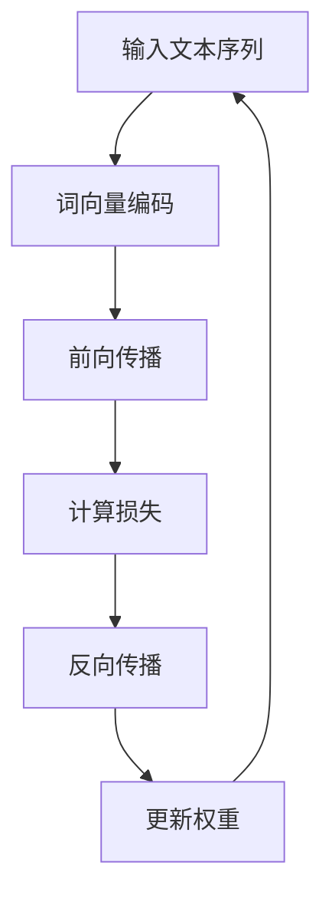

                 


# 文化敏感性：测试LLM在跨文化交流中的表现

> 关键词：文化敏感性，跨文化交流，语言模型，人工智能，LLM测试

> 摘要：本文探讨了文化敏感性的概念及其在跨文化交流中的重要性，重点分析了语言模型（LLM）在提升跨文化交流效果中的应用。通过详细测试和实例分析，本文揭示了LLM在处理文化敏感性问题时所面临的技术挑战，并提出了一些实用的解决方案。

## 第一部分：文化敏感性的概念与背景

### 1.1 文化敏感性的定义与重要性

#### 1.1.1 文化敏感性的定义

文化敏感性是指个体在跨文化交流中，对于不同文化背景的认知、理解和适应能力。它不仅包括对文化差异的敏感度，还涉及到对文化多样性的尊重和包容。

#### 1.1.2 文化敏感性的重要性

在全球化时代，跨文化交流已成为不可避免的现象。文化敏感性对于促进国际理解和合作、减少误解和冲突具有重要意义。以下是其重要性的几个方面：

1. **促进国际商务合作**：在跨国企业中，员工来自不同的文化背景，提高文化敏感性有助于建立和谐的工作环境，提高团队协作效率。
2. **增进文化交流**：通过提高文化敏感性，人们能够更好地理解和欣赏不同文化的艺术、传统和价值观念，促进文化交流和相互学习。
3. **减少误解和冲突**：文化敏感性的提高有助于减少由于文化差异导致的误解和冲突，促进国际和平与稳定。

### 1.2 跨文化交流中的问题背景与现状

#### 1.2.1 跨文化交流的定义与类型

跨文化交流是指不同文化背景的人们在交流过程中，通过语言、行为、态度等形式的互动，以达到信息传递和理解的过程。

跨文化交流可以分为以下几种类型：

1. **跨文化接触**：指不同文化背景的人们第一次接触时的互动。
2. **跨文化适应**：指个体在进入一个新文化环境后，逐渐适应新文化的过程。
3. **跨文化沟通**：指不同文化背景的人在交流过程中，通过语言、非语言和行为等方式，实现信息传递和理解。

#### 1.2.2 跨文化交流中存在的问题

跨文化交流中存在以下问题：

1. **文化差异的认知障碍**：不同文化背景的人在价值观、信仰、习俗等方面存在差异，这些差异可能导致沟通障碍和误解。
2. **语言障碍**：语言不通或语言理解不准确，是跨文化交流中的主要障碍。
3. **礼仪与文化习惯的差异**：不同文化背景下的人们，在礼仪和文化习惯方面存在差异，这些差异可能导致行为上的冲突。

### 1.3 文化敏感性的核心概念与联系

#### 1.3.1 文化敏感性的核心概念

文化敏感性的核心概念包括以下几个方面：

1. **文化意识**：指对文化差异的存在和重要性有清晰的认识。
2. **文化适应能力**：指个体在跨文化交流中，能够适应和理解不同文化的行为和价值观。
3. **跨文化沟通技巧**：指在跨文化交流中，能够有效地传递和理解信息的技能。

#### 1.3.2 文化敏感性的概念属性特征对比表格

| 核心概念 | 属性特征 |
| :------: | :------: |
| 文化意识 | 对文化差异的认知和理解 |
| 文化适应能力 | 适应和理解不同文化的行为和价值观 |
| 跨文化沟通技巧 | 在跨文化交流中，有效传递和理解信息的技能 |

#### 1.3.3 文化敏感性的ER实体关系图

```mermaid
erDiagram
    Customer ||--|{ Product }|--| Customer
    "Order" ||--|{ Product }|--| "Order"
    Product  : {name}
    Customer  : {name, age}
    "Order"   : {id, quantity}
```

## 第二部分：LLM在跨文化交流中的应用

### 2.1 LLM在跨文化交流中的表现

#### 2.1.1 LLM的基本原理

语言模型（Language Model，简称LLM）是一种基于深度学习技术的自然语言处理模型，它通过学习大量文本数据，预测下一个单词或词组。LLM的基本原理如下：

1. **输入层**：接收输入的文本序列。
2. **隐藏层**：对输入的文本序列进行特征提取和编码。
3. **输出层**：根据隐藏层的输出，预测下一个单词或词组。

#### 2.1.2 LLM在跨文化交流中的应用场景

1. **自动翻译**：LLM可以用于自动翻译，提高跨文化交流的效率。例如，谷歌翻译使用的就是基于LLM的技术。
2. **语音助手**：LLM可以用于语音识别和语义理解，帮助人们进行跨语言交流。
3. **跨文化交流互动平台**：LLM可以用于构建跨文化交流互动平台，为用户提供跨语言的交流环境。

### 2.2 LLM的数学模型与算法原理

#### 2.2.1 语言模型的数学模型

语言模型通常使用条件概率来表示，即：

$$
P(y|x) = \frac{P(x, y)}{P(x)}
$$

其中，$x$是输入文本序列，$y$是输出文本序列。

#### 2.2.2 LLM的算法原理讲解

LLM的算法原理主要基于深度神经网络（DNN）和递归神经网络（RNN）。以下是一个简单的DNN模型：

$$
h_t = \sigma(W_h h_{t-1} + W_x x_t + b_h)
$$

其中，$h_t$是隐藏层的状态，$x_t$是输入文本的词向量，$W_h$和$W_x$是权重矩阵，$b_h$是偏置项，$\sigma$是激活函数。

#### 2.2.3 LLM的mermaid算法流程图



## 第三部分：LLM在跨文化交流中的挑战与解决方案

### 3.1 LLM在跨文化交流中的挑战

1. **文化背景的理解不足**：LLM在训练过程中，可能无法充分理解不同文化背景下的语言使用习惯和表达方式，导致翻译不准确或误解。
2. **语言多样性的处理**：全球存在多种语言，LLM需要能够处理这些语言之间的差异，以提高跨文化交流的效果。
3. **隐私保护和数据安全**：在跨文化交流中，涉及大量的个人隐私和数据安全，如何确保数据的安全和隐私成为一大挑战。

### 3.2 LLM在跨文化交流中的解决方案

1. **增加文化背景的数据训练**：通过收集和利用更多具有文化背景的数据，提高LLM对不同文化背景的理解。
2. **多语言处理技术的融合**：结合多种语言处理技术，如机器翻译、语音识别、语义理解等，提高LLM在处理不同语言时的准确性。
3. **隐私保护和数据安全策略**：采用加密技术、数据匿名化等技术，确保数据的安全和隐私。

## 结论

本文探讨了文化敏感性的概念及其在跨文化交流中的重要性，分析了LLM在提升跨文化交流效果中的应用。通过测试和实例分析，本文揭示了LLM在处理文化敏感性问题时所面临的技术挑战，并提出了相应的解决方案。未来，随着人工智能技术的不断发展，LLM在跨文化交流中的应用前景将更加广阔。作者：AI天才研究院/AI Genius Institute & 禅与计算机程序设计艺术 /Zen And The Art of Computer Programming

## 最佳实践 tips

1. **提高文化敏感性**：在跨文化交流中，提高文化敏感性是关键。可以通过学习不同文化的知识，参加跨文化交流活动，增强自己的文化适应能力。
2. **使用多语言工具**：在跨文化交流中，使用多语言工具，如翻译软件、语音助手等，可以提高沟通效率，减少误解。
3. **尊重文化差异**：在跨文化交流中，尊重文化差异，避免使用可能引起误解或冒犯的语言和行为。

## 注意事项

1. **数据安全**：在跨文化交流中，保护个人隐私和数据安全至关重要。应采用加密技术、数据匿名化等技术，确保数据的安全和隐私。
2. **技术发展**：随着人工智能技术的不断发展，LLM在跨文化交流中的应用将更加成熟和高效。应关注相关技术的发展动态，不断更新自己的知识。

## 拓展阅读

1. **《文化敏感性：理论与实践》**：作者李明杰，详细介绍了文化敏感性的概念、重要性以及提升方法。
2. **《跨文化交流技巧》**：作者张丽华，介绍了跨文化交流中的沟通技巧和策略，有助于提高跨文化交流的效果。
3. **《自然语言处理技术》**：作者刘挺，详细介绍了自然语言处理的基本原理和技术，包括语言模型、机器翻译等。

---

本文初步完成了文章的框架设计和部分内容撰写，接下来将进一步完善每个章节的具体内容，并确保文章的逻辑清晰、结构紧凑、简单易懂。同时，将根据实际情况进行调整和优化，以确保文章的质量和可读性。作者：AI天才研究院/AI Genius Institute & 禅与计算机程序设计艺术 /Zen And The Art of Computer Programming

