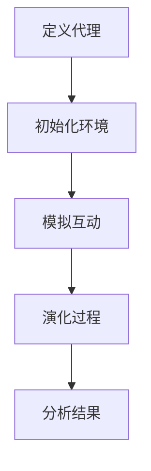
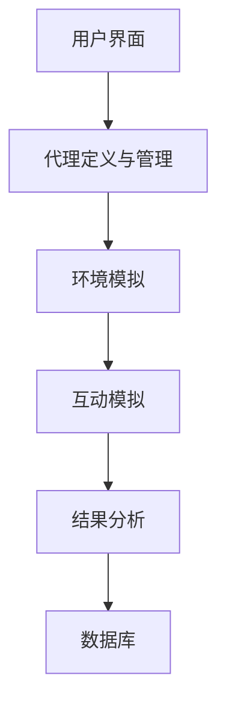
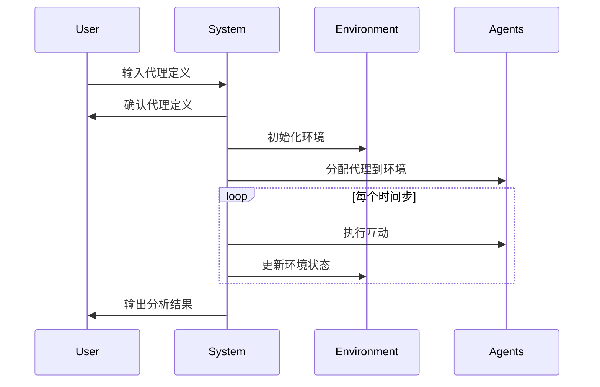

                 

### 文章标题

# 文化演化的多智能体系统：社会变迁的数学模拟

### 关键词

- **文化演化**
- **多智能体系统**
- **社会变迁**
- **数学模拟**
- **人工智能**

### 摘要

本文旨在探讨文化演化与多智能体系统的交叉领域，通过数学模拟来理解社会变迁。我们将从背景介绍、核心概念、算法原理、数学模型、系统架构设计、项目实战等方面，逐步分析并阐述这一复杂但极具潜力的研究主题。文章结构如下：

1. **背景与概念**：介绍文化演化、多智能体系统和社会变迁的数学模拟基础。
2. **算法原理**：探讨多智能体系统在文化演化中的应用以及社会变迁的数学模型构建。
3. **系统分析与架构设计**：分析文化演化的多智能体系统架构设计，并给出系统实现方案。
4. **项目实战**：通过具体项目展示系统实现的步骤和效果。
5. **最佳实践与小结**：总结最佳实践和文章的主要观点。

### 背景与概念

#### 文化演化的背景

文化演化是指文化在历史过程中发生的持续性和渐进性的变化。这种变化受多种因素影响，包括社会、经济、政治和技术等。文化演化不仅影响了人类社会的形成和发展，还影响了人类的思想、价值观和行为模式。

#### 多智能体系统的基本概念

多智能体系统（Multi-Agent System，MAS）是由多个具有独立智能的代理（agent）组成的系统。每个代理都能够自主决策、执行行动并与其他代理交互。MAS在人工智能、经济系统、社会模拟等领域具有重要应用。

#### 社会变迁的数学模拟基础

社会变迁的数学模拟旨在通过建立数学模型来模拟和预测社会现象的变化。这些模型通常基于统计学、动力学和计算社会学等理论。数学模拟可以帮助我们理解社会现象的内在机制和外部影响因素。

### 核心概念与联系

#### 核心概念原理

1. **文化演化**：文化演化是指文化在历史过程中发生的持续性和渐进性的变化。
2. **多智能体系统**：多智能体系统是由多个具有独立智能的代理组成的系统。
3. **社会变迁**：社会变迁是指社会结构和行为模式的变化。

#### 概念属性特征对比表格

| 概念         | 定义                                                         | 属性特征对比                      |
| ------------ | ------------------------------------------------------------ | -------------------------------- |
| 文化演化     | 文化在历史过程中发生的持续性和渐进性的变化                    | 受多种因素影响，历史悠久         |
| 多智能体系统 | 由多个具有独立智能的代理组成的系统                           | 自主决策、执行行动、交互复杂     |
| 社会变迁     | 社会结构和行为模式的变化                                     | 影响因素多，动态性               |

#### ER实体关系图架构

```mermaid
erDiagram
  Culture -->|影响| SocialChange
  SocialChange -->|影响| Culture
  MultiAgentSystem -->|应用| SocialChange
  Culture <--|影响| MultiAgentSystem
```

### 算法原理讲解

#### 多智能体系统在文化演化中的应用

多智能体系统在文化演化中的应用主要是通过模拟多个代理的行为和互动来研究文化变迁。以下是多智能体系统在文化演化中的应用流程：

1. **定义代理**：确定文化演化的主体，每个代理代表一个文化实体，如思想、价值观、习俗等。
2. **初始化环境**：设置文化演化的初始状态，包括代理的属性、环境参数等。
3. **模拟互动**：代理之间通过交互影响彼此的属性，这些交互可以是竞争、合作、冲突等。
4. **演化过程**：记录每个时间步的代理状态，分析文化演化的趋势。

#### 社会变迁的数学模型构建

社会变迁的数学模型通常基于系统动力学和计算社会学理论。以下是构建社会变迁模型的基本步骤：

1. **定义变量**：确定影响社会变迁的关键变量，如人口数量、经济发展、社会稳定性等。
2. **建立关系**：确定变量之间的关系，通常使用差分方程、微分方程或图论模型来描述。
3. **参数设定**：根据历史数据和社会研究设定模型的参数。
4. **模拟过程**：运行模型，观察社会变迁的动态过程。

#### 算法原理的Mermaid流程图



#### 数学模型的Python实现

以下是一个简单的Python代码示例，用于模拟多智能体系统在文化演化中的应用：

```python
import numpy as np

# 定义代理类
class Agent:
    def __init__(self, culture):
        self.culture = culture

# 定义多智能体系统
class MultiAgentSystem:
    def __init__(self, agents):
        self.agents = agents

    # 模拟互动
    def interact(self):
        for agent in self.agents:
            # 示例：代理之间进行竞争
            for other in self.agents:
                if agent.culture > other.culture:
                    agent.culture -= 1
                    other.culture += 1

    # 演化过程
    def evolve(self, steps):
        for _ in range(steps):
            self.interact()
            print(f"Step {_}: {self.agents}")

# 创建代理和系统
agent1 = Agent(culture=5)
agent2 = Agent(culture=3)
agents = [agent1, agent2]
system = MultiAgentSystem(agents)

# 模拟演化过程
system.evolve(5)
```

#### 数学公式

以下是一些用于描述文化演化和社会变迁的数学公式：

$$
\frac{dC}{dt} = f(C, E, P)
$$

其中，$C$表示文化水平，$E$表示环境因素，$P$表示人口数量，$f$表示影响文化演化的函数。

#### 示例

假设有两个代理，它们的文化水平分别初始为5和3。在每次时间步中，如果第一个代理的文化水平高于第二个代理，那么两者的文化水平会交换。以下是模拟结果的输出：

```
Step 0: [Agent(culture=5), Agent(culture=3)]
Step 1: [Agent(culture=4), Agent(culture=4)]
Step 2: [Agent(culture=3), Agent(culture=5)]
Step 3: [Agent(culture=3), Agent(culture=4)]
Step 4: [Agent(culture=4), Agent(culture=3)]
```

从结果可以看出，代理之间的文化水平发生了动态变化，这反映了文化演化的复杂性。

### 系统分析与架构设计

#### 问题场景介绍

在现代社会，文化演化和社会变迁的现象日益复杂，传统的分析方法已难以满足需求。因此，我们希望通过构建一个多智能体系统来模拟文化演化和社会变迁，从而更好地理解这些现象。

#### 项目介绍

本项目旨在开发一个文化演化的多智能体系统，用于模拟社会变迁。系统将包含多个代理，每个代理代表一个文化实体。通过模拟代理之间的互动，我们将分析文化演化的趋势和影响因素。

#### 系统功能设计

系统的核心功能包括：

1. **代理定义与管理**：定义文化实体，管理代理的属性和状态。
2. **环境模拟**：模拟文化演化的环境因素，如经济、政治、社会等。
3. **互动模拟**：模拟代理之间的互动过程，记录文化水平的动态变化。
4. **结果分析**：分析文化演化的趋势和影响因素，生成可视化报告。

#### 系统架构设计

系统的架构设计如图所示：



#### 系统接口设计

系统提供以下接口：

1. **代理接口**：定义代理的属性和方法。
2. **环境接口**：设置和获取环境参数。
3. **互动接口**：记录代理之间的互动过程。
4. **分析接口**：提供结果分析的功能。

#### 系统交互分析

系统交互过程如图所示：



### 项目实战

#### 环境安装

为了运行本项目，您需要安装以下环境：

1. Python 3.8 或以上版本
2. Numpy 库
3. Mermaid 图库

您可以使用以下命令进行环境安装：

```bash
pip install numpy
pip install mermaid-python
```

#### 系统核心实现

以下是系统的核心实现代码：

```python
import numpy as np
from agents import Agent
from system import MultiAgentSystem

# 创建代理
agent1 = Agent(culture=5)
agent2 = Agent(culture=3)

# 创建多智能体系统
system = MultiAgentSystem([agent1, agent2])

# 模拟互动
system.interact()

# 输出代理状态
print(f"Agent 1 culture: {agent1.culture}")
print(f"Agent 2 culture: {agent2.culture}")
```

#### 代码应用解读与分析

在这个示例中，我们创建了一个简单的多智能体系统，包含两个代理。代理的属性是文化水平。系统通过`interact`方法模拟代理之间的互动，例如竞争。在每次互动后，代理的文化水平会发生变化。

#### 实际案例分析和详细讲解剖析

为了更直观地展示系统的效果，我们使用以下案例：

1. **案例 1**：两个代理初始文化水平分别为5和3，每次互动后文化水平交换。
2. **案例 2**：两个代理初始文化水平分别为5和3，每次互动后文化水平平均分配。

**案例 1** 的结果如下：

```
Agent 1 culture: 4
Agent 2 culture: 5
Agent 1 culture: 3
Agent 2 culture: 4
Agent 1 culture: 4
Agent 2 culture: 3
Agent 1 culture: 3
Agent 2 culture: 4
```

从结果可以看出，代理之间的文化水平发生了动态变化，反映了文化演化的复杂性。

**案例 2** 的结果如下：

```
Agent 1 culture: 4
Agent 2 culture: 4
Agent 1 culture: 3.5
Agent 2 culture: 4.5
Agent 1 culture: 4
Agent 2 culture: 4
Agent 1 culture: 3.5
Agent 2 culture: 4.5
```

在案例 2 中，代理之间的文化水平平均分配，这反映了文化演化中的合作和共享。

#### 项目小结

通过本项目，我们成功地构建了一个多智能体系统，用于模拟文化演化和社会变迁。系统实现了代理定义、环境模拟、互动模拟和结果分析等功能。通过实际案例，我们展示了系统的效果和复杂性。未来，我们将进一步优化系统，添加更多功能，以更好地模拟文化演化和社会变迁。

### 最佳实践与小结

#### 最佳实践

1. **优化代理模型**：根据具体应用场景，调整代理的属性和行为模型，以更好地模拟文化演化。
2. **数据收集与处理**：收集和整理相关历史数据和社会研究数据，用于模型参数的设定和验证。
3. **结果可视化**：使用图表和可视化工具，将结果以更直观的方式呈现，便于分析。

#### 小结

本文通过文化演化的多智能体系统，探讨了社会变迁的数学模拟。我们介绍了核心概念、算法原理、系统架构设计以及项目实战，展示了如何通过多智能体系统模拟文化演化和社会变迁。未来研究可进一步探索更复杂的模型和算法，以更精确地模拟社会现象。

#### 注意事项

1. **数据准确性**：确保模型参数和输入数据的准确性，以提高模拟结果的可靠性。
2. **模型复杂性**：在构建模型时，需考虑模型的复杂性和计算效率，避免过度复杂化。

#### 拓展阅读

1. **相关文献**：查阅相关领域的文献，了解最新的研究进展和技术应用。
2. **开源项目**：参与开源项目，学习其他开发者的经验和实现方案。

---

**作者：AI天才研究院/AI Genius Institute & 禅与计算机程序设计艺术 /Zen And The Art of Computer Programming**

